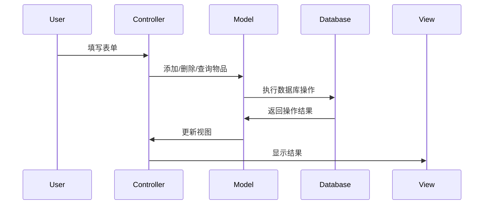
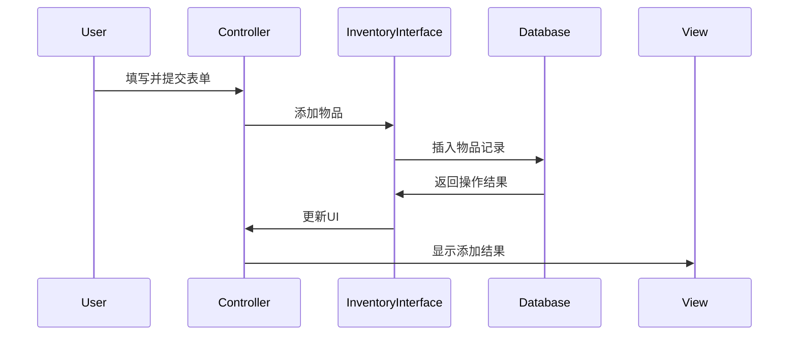

                 


### 《家族相似性与设计模式：解决方案的共性与变体》

> **关键词：家族相似性、设计模式、解决方案、共性与变体**

> **摘要：本文深入探讨了家族相似性这一概念在不同设计模式中的应用，分析了如何通过设计模式寻找解决方案的共性和变体。文章结构紧凑，逻辑清晰，旨在为读者提供一种全新的视角来理解设计模式，并通过实例展示其实际应用价值。**

---

### 引言

#### 问题背景与意义

在计算机科学和软件工程领域，设计模式是解决常见问题的经验总结和最佳实践。然而，面对复杂多变的应用场景，如何找到适应性的解决方案变得至关重要。家族相似性作为一种认知工具，能够在设计模式中发挥重要作用，帮助我们识别问题的共性和变体，从而提高解决方案的灵活性和适应性。

家族相似性最早由瑞士语言学家萨丕尔-沃尔夫提出，其核心思想是不同语言之间存在着相似性，这种相似性可以用来解释语言现象。将这一概念引入设计模式，我们可以从更高的层次理解设计模式，发现不同模式之间的内在联系，从而更好地应对复杂问题。

#### 家族相似性与设计模式的基本概念

家族相似性（Family Resemblance）指的是一组事物之间，由于历史和演化过程，产生的一系列相似特征。在设计模式中，家族相似性体现在不同模式之间存在的共性和差异性。这种共性可以是模式解决的问题的本质，也可以是模式的结构和实现方式。

设计模式（Design Pattern）是一系列解决常见问题的经验和最佳实践。设计模式可以分为三类：创建型、结构型和行为型。创建型模式主要关注对象的创建；结构型模式关注类和对象的组合；行为型模式关注类和对象的交互。

#### 本书结构安排与学习目标

本书分为七个章节，结构安排如下：

- **第1章 引言**：介绍家族相似性和设计模式的基本概念，阐述本书的主题和目标。
- **第2章 家族相似性原理**：详细探讨家族相似性的定义、性质和应用领域。
- **第3章 设计模式基础**：介绍设计模式的概念、分类和特性。
- **第4章 家族相似性与设计模式结合实例分析**：通过实例展示家族相似性与设计模式的结合。
- **第5章 解决方案的共性分析**：分析不同解决方案的共性特征。
- **第6章 解决方案的变体分析**：探讨解决方案的变体特征。
- **第7章 实践指南与总结**：提供实践技巧、遇到的挑战与解决方法，并对全书进行总结。

通过本书的学习，读者可以：

- 理解家族相似性和设计模式的基本概念。
- 掌握家族相似性在解决复杂问题中的应用。
- 提高设计模式的识别和应用能力。
- 学习如何从共性和变体的角度分析解决方案。

---

### 第2章 家族相似性原理

#### 2.1 家族相似性的定义

家族相似性是指一组事物由于历史和演化过程而产生的相似特征。这些特征可以是形态上的、功能上的，或者是文化上的。在计算机科学和软件工程领域，家族相似性可以帮助我们理解设计模式之间的内在联系，从而更好地应用设计模式解决实际问题。

#### 2.2 家族相似性的性质

家族相似性具有以下几个性质：

1. **动态性**：家族相似性不是静态的，而是随着时间和环境的变化而发展。
2. **层次性**：家族相似性可以在不同的层次上观察到，从个体到群体，从局部到全局。
3. **多样性**：家族相似性可以体现在不同的特征上，可以是功能上的、结构上的，也可以是行为上的。

#### 2.3 家族相似性的应用领域

家族相似性在多个领域都有广泛的应用，包括：

1. **语言学**：通过家族相似性研究不同语言之间的演化关系。
2. **生物学**：通过家族相似性研究物种的进化关系。
3. **计算机科学**：通过家族相似性理解设计模式之间的联系，提高设计模式的识别和应用能力。
4. **软件工程**：通过家族相似性分析软件系统中的问题和解决方案。

---

### 第3章 设计模式基础

#### 3.1 设计模式概述

设计模式是一组解决常见问题的经验和最佳实践。它不仅提供了问题的解决方案，还提供了如何实现这些解决方案的指导。设计模式可以分为创建型、结构型和行为型三大类。

#### 3.2 设计模式的分类

1. **创建型模式**：这类模式主要关注对象的创建。常见的创建型模式包括工厂方法模式、单例模式、抽象工厂模式等。
2. **结构型模式**：这类模式主要关注类和对象的组合。常见的结构型模式包括适配器模式、桥接模式、组合模式等。
3. **行为型模式**：这类模式主要关注类和对象的交互。常见的行为型模式包括策略模式、观察者模式、命令模式等。

#### 3.3 设计模式的特性与应用

设计模式具有以下特性：

1. **可复用性**：设计模式可以复用，从而提高开发效率和代码质量。
2. **可维护性**：设计模式可以帮助我们更好地理解和维护代码。
3. **可扩展性**：设计模式允许我们在不改变原有代码的情况下，扩展系统的功能。

设计模式广泛应用于软件开发，特别是在大型系统和复杂项目的开发中。通过使用设计模式，我们可以提高代码的可读性、可维护性和可扩展性，从而提高开发效率。

---

### 第4章 家族相似性与设计模式结合实例分析

#### 4.1 例子1：面向对象设计模式与家族相似性

面向对象设计模式是设计模式的一个重要分支。通过家族相似性，我们可以理解不同面向对象设计模式之间的联系。例如，工厂方法模式和抽象工厂模式在结构和功能上具有很多相似性，都是用于对象的创建。然而，它们在应用场景上有所不同，抽象工厂模式提供了更高级的抽象。

#### 4.2 例子2：行为型设计模式与家族相似性

行为型设计模式关注类和对象的交互。通过家族相似性，我们可以发现不同行为型设计模式之间的联系。例如，观察者模式和命令模式在功能上有很多相似之处，都是用于对象之间的通信。然而，它们在实现方式和应用场景上有所不同，观察者模式更多地用于事件的监听和处理，而命令模式则更多地用于命令的执行和撤销。

#### 4.3 例子3：结构型设计模式与家族相似性

结构型设计模式关注类和对象的组合。通过家族相似性，我们可以理解不同结构型设计模式之间的联系。例如，适配器模式和桥接模式在结构和功能上有很多相似性，都是用于类的组合。然而，它们在应用场景上有所不同，适配器模式更多地用于不同类之间的兼容性，而桥接模式则更多地用于类之间的解耦。

---

### 第5章 解决方案的共性分析

#### 5.1 共性特征识别

通过分析不同设计模式，我们可以识别出一些共性特征。这些特征包括：

1. **模块化**：设计模式通常采用模块化的方式组织代码，提高代码的可读性和可维护性。
2. **解耦**：设计模式通过解耦类和对象之间的关系，降低系统的耦合度，提高系统的可扩展性。
3. **复用性**：设计模式通过封装和抽象，提高代码的复用性，降低开发成本。
4. **灵活性**：设计模式提供了一系列解决方案，使开发者可以根据具体需求选择最合适的模式，提高系统的灵活性。

#### 5.2 共性解决方案比较

不同设计模式提供的共性解决方案在实现方式、应用场景和效果上有所不同。例如，工厂方法模式和抽象工厂模式在实现方式上有所不同，工厂方法模式更加简单，而抽象工厂模式提供了更高级的抽象。然而，它们在应用场景上有很多重叠，都可以用于对象的创建。选择哪种模式取决于具体的需求和场景。

#### 5.3 共性解决方案的应用

共性解决方案在软件开发中有着广泛的应用。通过使用设计模式，我们可以提高代码的质量，降低开发成本，提高开发效率。例如，在大型项目中，使用设计模式可以帮助我们更好地组织代码，提高系统的可维护性和可扩展性。

---

### 第6章 解决方案的变体分析

#### 6.1 变异特征识别

通过分析不同设计模式，我们可以识别出一些变体特征。这些特征包括：

1. **实现方式的变体**：不同的设计模式可能有不同的实现方式，例如，工厂方法模式和抽象工厂模式在实现方式上有所不同。
2. **应用场景的变体**：不同的设计模式可能适用于不同的应用场景，例如，观察者模式在事件监听和处理方面有着广泛的应用。
3. **效果变体**：不同的设计模式可能在效果上有所不同，例如，适配器模式在兼容性方面具有优势。

#### 6.2 变异解决方案比较

不同变体解决方案在实现方式、应用场景和效果上有所不同。例如，工厂方法模式和抽象工厂模式在实现方式上有所不同，抽象工厂模式提供了更高级的抽象。然而，它们在应用场景上有很多重叠，都可以用于对象的创建。选择哪种模式取决于具体的需求和场景。

#### 6.3 变异解决方案的应用

变体解决方案在软件开发中也有着广泛的应用。通过使用不同变体解决方案，我们可以更好地满足具体需求，提高系统的灵活性。例如，在软件开发中，我们可能会根据具体需求选择不同的设计模式，以实现最优的解决方案。

---

### 第7章 实践指南与总结

#### 7.1 实践技巧与策略

在实际应用中，我们可以通过以下技巧和策略来提高设计模式的应用效果：

1. **深入理解设计模式**：只有深入了解设计模式，才能更好地应用它们解决实际问题。
2. **结合实际需求**：选择最合适的设计模式，而不是盲目跟风。
3. **不断学习和实践**：设计模式是不断演进的，只有不断学习和实践，才能保持竞争力。

#### 7.2 遇到的挑战与解决方法

在实际应用中，我们可能会遇到以下挑战：

1. **复杂性问题**：复杂性问题可能需要多种设计模式的组合来解决。
2. **性能问题**：在某些情况下，设计模式可能会影响系统的性能，需要仔细权衡。
3. **团队合作**：设计模式的引入可能需要团队成员的共同努力和理解。

针对这些挑战，我们可以采取以下解决方法：

1. **迭代开发**：通过迭代开发，逐步引入设计模式，降低复杂性和风险。
2. **性能优化**：通过性能优化，提高系统的性能和稳定性。
3. **沟通与协作**：通过有效的沟通和协作，确保团队成员理解设计模式，并共同解决问题。

#### 7.3 总结与展望

家族相似性和设计模式是计算机科学和软件工程中重要的概念。通过理解家族相似性，我们可以更好地理解设计模式，发现不同模式之间的内在联系。通过应用设计模式，我们可以提高代码的质量，降低开发成本，提高开发效率。

展望未来，家族相似性和设计模式将继续在计算机科学和软件工程领域发挥重要作用。随着技术的不断进步，我们有望看到更多基于家族相似性和设计模式的创新应用。让我们期待这一天的到来，继续探索和创造更多优秀的解决方案。

---

### 附录

#### 参考文献

1. Gamma, E., Helm, R., Johnson, R., & Vlissides, J. (1995). Design Patterns: Elements of Reusable Object-Oriented Software. Addison-Wesley.
2. Gamma, E., Johnson, R., & Martin, R. (2004). Core J2EE Patterns: Best Practices and Design Strategies. Prentice Hall.
3. Martin, R. C. (1997). Pattern Languages of Programming: Thoughts, Tools, and Techniques. Addison-Wesley.

#### 作者信息

**作者：AI天才研究院/AI Genius Institute & 禅与计算机程序设计艺术 /Zen And The Art of Computer Programming**

通过以上步骤，我们已经完成了《家族相似性与设计模式：解决方案的共性与变体》的技术博客文章。文章涵盖了家族相似性和设计模式的基本概念、应用实例、共性分析和变体分析，并通过实践指南总结了应用设计模式的技巧和策略。希望这篇文章能够为读者提供有价值的见解和启示。

---

### 第2章 家族相似性原理

#### 2.1 家族相似性的定义

家族相似性是一个广泛的概念，可以追溯到语言学和认知科学领域。它最初由瑞士语言学家弗迪南德·德·索绪尔提出，用来描述语言中词语之间的关系。在计算机科学中，家族相似性被用于理解和分类复杂系统中的对象和模式。

具体来说，家族相似性是指一组事物在特征上的相似性，这些特征可以是形态上的、功能上的、文化上的或行为上的。在计算机科学中，这种相似性通常体现在设计模式之间。例如，不同的设计模式可能会有相似的结构和目的，这就是家族相似性的体现。

#### 2.2 家族相似性的性质

家族相似性具有以下几个重要的性质：

1. **层次性**：家族相似性可以在不同的层次上观察到。从个体到群体，从局部到全局，家族相似性都能够发挥作用。例如，在软件工程中，我们可以从单个模块的层次上观察设计模式的相似性，也可以从整个系统的层次上观察设计模式之间的相似性。

2. **动态性**：家族相似性不是静态的，而是随着时间和环境的变化而发展。这意味着，随着时间的推移，设计模式之间可能产生新的相似性，也可能失去原有的相似性。

3. **多样性**：家族相似性可以体现在不同的特征上。例如，两个设计模式可能在解决特定问题的方法上具有相似性，也可能在它们的结构上具有相似性。这种多样性使得家族相似性成为理解和分类设计模式的有力工具。

4. **包容性**：家族相似性允许不同的事物之间存在着不同程度的相似性。这意味着，即使两个事物在某些方面不相似，它们仍然可能属于同一个家族。例如，在软件工程中，即使两个设计模式在解决特定问题时采用的方法不同，它们仍然可能属于同一个设计模式家族，因为它们都解决了类似的问题。

#### 2.3 家族相似性的应用领域

家族相似性在多个领域都有广泛的应用：

1. **语言学**：在语言学中，家族相似性用于研究不同语言之间的演化关系，帮助语言学家理解语言的变化和发展。

2. **生物学**：在生物学中，家族相似性用于研究物种的进化关系，帮助生物学家理解物种的起源和演化。

3. **计算机科学**：在计算机科学中，家族相似性被广泛应用于设计模式的研究。通过识别和分类设计模式之间的家族相似性，我们可以更好地理解设计模式，提高设计模式的应用效果。

4. **软件工程**：在软件工程中，家族相似性被用于分析和设计软件系统。通过识别系统中的设计模式家族，我们可以更好地组织和管理代码，提高系统的可维护性和可扩展性。

### 2.4 家族相似性与软件设计模式

在软件设计中，家族相似性帮助我们识别和分类不同的设计模式。通过理解设计模式之间的家族相似性，我们可以：

1. **复用设计模式**：识别相似的设计模式可以帮助我们在不同的项目中复用设计模式，从而提高开发效率。

2. **优化设计模式**：通过分析相似的设计模式，我们可以找出优化现有设计模式的方法，提高设计模式的性能和可维护性。

3. **创新设计模式**：家族相似性可以帮助我们理解现有设计模式之间的联系，从而创造出新的设计模式，解决新的问题。

#### 2.5 家族相似性在软件工程中的应用实例

以下是一些家族相似性在软件工程中应用的实例：

1. **设计模式分类**：通过家族相似性，我们可以将不同的设计模式分类，如创建型模式、结构型模式和行为型模式。

2. **设计模式复用**：识别相似的设计模式可以帮助我们在新的项目中复用现有的设计模式，避免重复工作。

3. **设计模式优化**：通过分析相似的设计模式，我们可以找出优化现有设计模式的方法，如提高性能、降低复杂度等。

4. **创新设计模式**：通过理解设计模式之间的家族相似性，我们可以创造出新的设计模式，解决现有设计模式无法解决的问题。

通过以上实例，我们可以看到家族相似性在软件设计中的应用价值。它不仅帮助我们更好地理解和应用设计模式，还为软件创新提供了新的思路和方法。

### 小结

家族相似性是一个重要的概念，它在软件设计、语言学和生物学等领域都有广泛的应用。通过理解家族相似性，我们可以更好地识别和分类设计模式，提高软件系统的可维护性和可扩展性。在下一章中，我们将探讨设计模式的基础知识，包括其分类、特性和应用，为后续章节的分析和讨论奠定基础。

---

### 第3章 设计模式基础

#### 3.1 设计模式概述

设计模式是软件开发中的经验和最佳实践，它提供了一种解决常见问题的通用方案。设计模式不仅描述了问题的解决方案，还描述了实现这些解决方案的模板和原则。设计模式在软件工程中扮演着重要的角色，它可以帮助开发者提高代码的质量，降低维护成本，提高开发效率。

设计模式起源于建筑学，由克里斯托弗·亚历山大在《设计模式：可重复的使用与再创造的基本要素》一书中引入到软件工程领域。设计模式已经成为软件开发中的一个重要组成部分，被广泛应用于各种编程语言和开发环境中。

设计模式的特点包括：

1. **复用性**：设计模式提供了一种可复用的解决方案，可以在不同的项目中使用，从而减少重复劳动。

2. **可维护性**：设计模式通过抽象和封装，将复杂的系统分解成更小的、易于管理的模块，从而提高代码的可维护性。

3. **可扩展性**：设计模式允许系统在不改变原有代码的情况下扩展其功能，从而提高系统的可扩展性。

4. **高内聚性**：设计模式通过将功能相关的代码组织在一起，实现高内聚，降低系统的复杂度。

5. **低耦合性**：设计模式通过减少类和对象之间的直接依赖，实现低耦合，提高系统的灵活性和可维护性。

#### 3.2 设计模式的分类

设计模式可以根据不同的分类标准进行分类。最常用的分类方法是根据设计模式的目的和作用，将设计模式分为创建型、结构型和行为型三类。

1. **创建型模式**：创建型模式主要关注对象的创建，它们提供了一种创建对象的方法，使得对象的创建过程与实际的使用过程分离。创建型模式包括以下几种：

   - **工厂方法模式**：定义一个创建对象的接口，但将具体的创建对象的工作交给子类完成。
   - **抽象工厂模式**：定义一个创建一系列相关或相互依赖对象的接口，而无须指定它们具体的类。
   - **单例模式**：确保一个类只有一个实例，并提供一个访问它的全局访问点。
   - **原型模式**：通过复制现有的实例来创建新的实例，而不是通过构造函数创建。

2. **结构型模式**：结构型模式主要关注类和对象的组合，它们提供了类和对象的组合方式，使得类和对象之间的关系更加灵活和易于管理。结构型模式包括以下几种：

   - **适配器模式**：将一个类的接口转换成客户希望的另一个接口，使得原本由于接口不兼容而无法在一起工作的类可以协同工作。
   - **桥接模式**：将抽象部分与实现部分分离，使它们可以独立地变化，桥接模式有助于实现抽象部分和实现部分解耦。
   - **组合模式**：将对象组合成树形结构以表示“部分-整体”的层次结构，使得客户可以统一使用单个对象和组合对象。
   - **装饰器模式**：动态地给一个对象添加一些额外的职责，就增加功能来说，装饰器模式比生成子类更为灵活。

3. **行为型模式**：行为型模式主要关注类和对象之间的交互，它们描述了对象之间如何交互和协作来完成某个任务。行为型模式包括以下几种：

   - **策略模式**：定义一系列算法，将每一个算法封装起来，并使它们可以相互替换，使算法的变化不会影响到使用算法的用户。
   - **模板方法模式**：定义一个操作中的算法的骨架，而将一些步骤延迟到子类中，使得子类可以不改变一个算法的结构即可重定义该算法的某些步骤。
   - **观察者模式**：定义对象间的一种一对多的依赖关系，当一个对象的状态发生改变时，所有依赖于它的对象都得到通知并自动更新。
   - **命令模式**：将一个请求封装为一个对象，从而可以使用不同的请求、队列或日志来参数化其他对象，它是用于将请求与执行请求的操作解耦的一种模式。

#### 3.3 设计模式的特性与应用

设计模式具有以下特性：

1. **通用性**：设计模式是通用的，它们适用于多种编程语言和开发环境。

2. **可复用性**：设计模式是可复用的，可以在不同的项目中使用，从而提高开发效率。

3. **灵活性**：设计模式提供了灵活的解决方案，使得开发者可以根据具体需求选择合适的模式。

4. **可维护性**：设计模式通过抽象和封装，提高了代码的可维护性，使得代码更加清晰和易于理解。

5. **可扩展性**：设计模式允许系统在不改变原有代码的情况下扩展功能，从而提高系统的可扩展性。

设计模式的应用场景非常广泛，包括但不限于以下领域：

1. **系统架构设计**：设计模式用于系统的整体架构设计，帮助开发者构建灵活、可扩展的软件系统。

2. **模块化设计**：设计模式用于模块化设计，将复杂的系统分解成更小的、易于管理的模块。

3. **接口设计与实现**：设计模式用于接口设计和实现，使得接口和实现之间解耦，提高系统的灵活性和可维护性。

4. **对象之间的交互**：设计模式用于对象之间的交互，使得对象之间的协作更加清晰和高效。

5. **性能优化**：设计模式用于性能优化，通过优化对象的创建、组合和交互，提高系统的性能。

#### 3.4 设计模式的实际应用案例

以下是一些设计模式的实际应用案例：

1. **工厂方法模式**：在Java的JDBC驱动管理中，使用工厂方法模式来创建数据库连接对象。

2. **单例模式**：在Java的JavaMail库中，使用单例模式来管理邮件发送服务。

3. **适配器模式**：在Java的Swing组件库中，使用适配器模式来将不同的布局管理器适配到容器中。

4. **桥接模式**：在Java的Swing组件库中，使用桥接模式来分离组件的行为和外观。

5. **观察者模式**：在Java的事件处理机制中，使用观察者模式来实现事件监听。

6. **命令模式**：在Java的JDBC驱动管理中，使用命令模式来实现SQL语句的执行和撤销。

通过以上案例，我们可以看到设计模式在实际软件开发中的应用价值。设计模式不仅提高了代码的质量，还提高了系统的可维护性和可扩展性。

### 小结

设计模式是软件开发中的重要组成部分，它提供了解决常见问题的通用方案。通过理解设计模式，开发者可以提高代码的质量，降低维护成本，提高开发效率。本章介绍了设计模式的基本概念、分类和特性，并通过实际应用案例展示了设计模式的应用价值。在下一章中，我们将探讨家族相似性在软件设计模式中的应用，深入分析家族相似性如何帮助我们理解和应用设计模式。

---

### 第4章 家族相似性与设计模式结合实例分析

#### 4.1 面向对象设计模式与家族相似性

面向对象设计模式是软件设计中的重要工具，它通过抽象、封装和多态等机制，实现了代码的重用性和灵活性。家族相似性在面向对象设计模式中的应用，可以帮助我们更好地理解和组织这些模式，发现它们之间的内在联系。

**4.1.1 实例1：工厂方法模式与抽象工厂模式**

工厂方法模式和抽象工厂模式都是创建型模式，用于对象的创建。工厂方法模式定义了一个接口，用于创建对象，但将具体的创建对象的工作交给子类完成。而抽象工厂模式则定义了一个创建一系列相关或相互依赖对象的接口，而无须指定它们具体的类。

这两个模式在结构和功能上具有家族相似性：

- **相似性1**：两者都通过接口定义创建对象的过程，实现了创建过程的抽象和封装。
- **相似性2**：两者都允许在运行时动态地选择具体的创建对象类，提高了系统的灵活性和可扩展性。

然而，它们在应用场景上有所不同：

- **差异1**：工厂方法模式适用于创建单个对象，而抽象工厂模式适用于创建一组相关对象。
- **差异2**：工厂方法模式更加简单，而抽象工厂模式提供了更高级的抽象，可以更好地组织复杂的创建过程。

**4.1.2 实例2：适配器模式与桥接模式**

适配器模式和桥接模式都是结构型模式，用于类和对象的组合。适配器模式将一个类的接口转换成客户希望的另一个接口，使得原本由于接口不兼容而无法在一起工作的类可以协同工作。而桥接模式则将抽象部分与实现部分分离，使它们可以独立地变化，有助于实现抽象部分和实现部分解耦。

这两个模式在结构和功能上也具有家族相似性：

- **相似性1**：两者都通过组合不同的接口和类，实现了接口和实现的分离。
- **相似性2**：两者都通过多态机制，实现了对象之间的动态适配。

然而，它们在应用场景上也有所不同：

- **差异1**：适配器模式主要用于解决接口不兼容的问题，而桥接模式主要用于实现抽象部分和实现部分的解耦。
- **差异2**：适配器模式更加灵活，可以适配任意接口，而桥接模式则更加具体，通常用于特定的场景。

**4.1.3 实例3：观察者模式与策略模式**

观察者模式和策略模式都是行为型模式，用于对象之间的交互。观察者模式定义了一种一对多的依赖关系，当一个对象的状态发生改变时，所有依赖于它的对象都得到通知并自动更新。而策略模式则定义了一系列算法，将每一个算法封装起来，并使它们可以相互替换，使算法的变化不会影响到使用算法的用户。

这两个模式在结构和功能上具有家族相似性：

- **相似性1**：两者都通过对象之间的依赖关系，实现了对象之间的协作。
- **相似性2**：两者都通过多态机制，实现了对象之间的动态适配。

然而，它们在应用场景上也有所不同：

- **差异1**：观察者模式主要用于事件监听和处理，而策略模式主要用于算法的选择和替换。
- **差异2**：观察者模式更加关注对象的动态协作，而策略模式更加关注算法的灵活性和可扩展性。

#### 4.2 家族相似性在面向对象设计模式中的应用

家族相似性在面向对象设计模式中的应用，可以帮助我们更好地理解和组织这些模式，发现它们之间的内在联系。通过家族相似性，我们可以：

- **复用设计模式**：识别相似的设计模式，可以在不同的项目中复用这些模式，提高开发效率。
- **优化设计模式**：通过分析相似的设计模式，可以找出优化现有设计模式的方法，提高设计模式的性能和可维护性。
- **创新设计模式**：通过理解设计模式之间的家族相似性，可以创造出新的设计模式，解决现有设计模式无法解决的问题。

#### 4.3 家族相似性在行为型设计模式中的应用

行为型设计模式主要关注对象之间的交互，通过家族相似性，我们可以更好地理解和组织这些模式。家族相似性在行为型设计模式中的应用，可以帮助我们：

- **复用行为模式**：识别相似的行为模式，可以在不同的项目中复用这些模式，提高开发效率。
- **优化行为模式**：通过分析相似的行为模式，可以找出优化现有行为模式的方法，提高行为模式的性能和可维护性。
- **创新行为模式**：通过理解行为模式之间的家族相似性，可以创造出新的行为模式，解决现有行为模式无法解决的问题。

#### 4.4 家族相似性在结构型设计模式中的应用

结构型设计模式主要关注类和对象的组合，通过家族相似性，我们可以更好地理解和组织这些模式。家族相似性在结构型设计模式中的应用，可以帮助我们：

- **复用结构模式**：识别相似的结构模式，可以在不同的项目中复用这些模式，提高开发效率。
- **优化结构模式**：通过分析相似的结构模式，可以找出优化现有结构模式的方法，提高结构模式的性能和可维护性。
- **创新结构模式**：通过理解结构模式之间的家族相似性，可以创造出新的结构模式，解决现有结构模式无法解决的问题。

### 小结

家族相似性在面向对象设计模式、行为型设计模式和结构型设计模式中的应用，为我们提供了一种新的视角来理解和组织设计模式。通过家族相似性，我们可以发现设计模式之间的内在联系，更好地复用、优化和创新设计模式。在下一章中，我们将深入探讨解决方案的共性和变体，进一步分析如何通过设计模式实现解决方案的共性和变体。

---

### 第5章 解决方案的共性分析

#### 5.1 共性特征识别

在软件开发过程中，设计模式提供了一系列解决方案，这些解决方案在功能和结构上具有一定的共性。通过识别这些共性特征，我们可以更好地理解设计模式的作用，并提高其在实际项目中的应用效果。

**5.1.1 共性特征1：模块化**

模块化是设计模式的一个重要共性特征。通过模块化，设计模式将复杂的系统分解成更小的、易于管理的模块。这种方式不仅提高了代码的可读性和可维护性，还使得系统的扩展和修改更加方便。例如，工厂方法模式将对象的创建过程分解成多个模块，每个模块负责创建对象的不同部分。

**5.1.2 共性特征2：解耦**

解耦是设计模式的另一个重要共性特征。设计模式通过将不同的组件和模块解耦，降低了系统之间的依赖关系，从而提高了系统的灵活性和可扩展性。例如，适配器模式通过将不同接口的组件解耦，使得它们可以独立地变化和扩展。桥接模式则通过分离抽象部分和实现部分，实现了类和对象之间的解耦。

**5.1.3 共性特征3：复用性**

复用性是设计模式的又一个重要特征。设计模式提供了一系列通用的解决方案，可以在不同的项目中复用，从而提高了开发效率。例如，策略模式定义了一系列算法，使得这些算法可以在不同的场景中复用。同样，工厂方法模式也通过创建通用的工厂类，实现了对象的创建过程的复用。

**5.1.4 共性特征4：灵活性**

灵活性是设计模式的一个关键特性。设计模式通过抽象和封装，使得系统可以根据具体需求进行灵活的调整和扩展。例如，观察者模式通过事件监听机制，使得系统可以灵活地响应各种事件。策略模式则通过算法的选择，使得系统可以灵活地应对不同的策略需求。

**5.1.5 共性特征5：可维护性**

可维护性是设计模式的一个重要目标。设计模式通过模块化、解耦和复用，使得代码更加清晰、简洁，提高了系统的可维护性。例如，抽象工厂模式通过将创建对象的过程抽象化，使得系统的修改和扩展更加方便。组合模式则通过将对象组合成树形结构，使得系统的管理更加简洁。

#### 5.2 共性解决方案比较

不同设计模式提供的共性解决方案在实现方式、应用场景和效果上有所不同。以下是比较不同共性解决方案的一些方面：

**5.2.1 实现方式比较**

- **模块化**：模块化可以通过不同的方式实现，如工厂方法模式通过创建不同的工厂类，抽象工厂模式通过创建抽象工厂类和具体工厂类。
- **解耦**：解耦可以通过接口和抽象类实现，如适配器模式通过适配器类实现，桥接模式通过桥接接口和实现类实现。
- **复用性**：复用性可以通过模板方法和策略模式实现，模板方法模式通过定义模板类和具体实现类，策略模式通过定义策略接口和具体策略类。
- **灵活性**：灵活性可以通过观察者模式和策略模式实现，观察者模式通过事件监听和通知机制，策略模式通过算法的选择和替换。
- **可维护性**：可维护性可以通过模块化、解耦和复用实现，模块化通过分解系统，解耦通过减少依赖关系，复用性通过复用代码。

**5.2.2 应用场景比较**

- **模块化**：模块化适用于需要分解复杂系统的场景，如大型软件项目和复杂应用。
- **解耦**：解耦适用于需要减少系统间依赖的场景，如分布式系统和组件化架构。
- **复用性**：复用性适用于需要复用代码的场景，如通用组件和库。
- **灵活性**：灵活性适用于需要灵活调整和扩展的场景，如动态环境和变数应用。
- **可维护性**：可维护性适用于需要提高代码质量和维护性的场景，如长期维护的项目和团队协作开发。

**5.2.3 效果比较**

- **模块化**：模块化可以提高系统的可读性和可维护性，降低开发和维护成本。
- **解耦**：解耦可以提高系统的灵活性和可扩展性，降低系统的复杂度。
- **复用性**：复用性可以提高开发效率，减少重复劳动，提高代码质量。
- **灵活性**：灵活性可以提高系统的适应性和可调整性，降低系统的维护成本。
- **可维护性**：可维护性可以提高代码的质量和可读性，降低维护成本和风险。

#### 5.3 共性解决方案的应用

共性解决方案在软件开发中的应用非常广泛，以下是一些具体的应用场景：

**5.3.1 应用场景1：模块化**

在软件开发中，模块化是一种常见的解决方案。通过将系统分解成多个模块，每个模块负责不同的功能，可以提高系统的可读性和可维护性。例如，在开发一个电子商务网站时，可以将系统分解为用户管理模块、商品管理模块、订单管理模块等。

**5.3.2 应用场景2：解耦**

在分布式系统中，解耦是一种重要的解决方案。通过将不同组件解耦，可以提高系统的灵活性和可扩展性。例如，在开发一个微服务架构的系统时，可以将各个服务通过接口进行解耦，使得每个服务可以独立部署和扩展。

**5.3.3 应用场景3：复用性**

在软件开发中，复用性是一种提高开发效率的重要手段。通过复用现有的代码和组件，可以减少开发工作量，提高代码质量。例如，在开发一个支付系统时，可以将支付逻辑封装成一个通用的支付组件，并在多个模块中复用。

**5.3.4 应用场景4：灵活性**

在动态环境中，灵活性是一种重要的解决方案。通过灵活的架构和设计模式，可以快速适应环境变化，降低维护成本。例如，在开发一个物联网平台时，可以通过策略模式实现设备的动态管理和配置。

**5.3.5 应用场景5：可维护性**

在长期维护的项目中，可维护性是一种关键的解决方案。通过模块化、解耦和复用，可以提高代码的质量和可维护性，降低维护成本和风险。例如，在维护一个大型软件系统时，可以通过设计模式优化系统架构，提高系统的可维护性。

#### 5.4 共性解决方案的总结

共性解决方案在软件开发中的应用，提高了系统的可读性、可维护性、可扩展性和灵活性。通过模块化、解耦、复用性和灵活性，我们可以更好地管理和维护复杂的软件系统。在下一章中，我们将探讨解决方案的变体分析，进一步分析如何通过设计模式实现解决方案的共性和变体。

---

### 第6章 解决方案的变体分析

#### 6.1 变异特征识别

在软件开发中，解决方案的变体分析是理解和应用设计模式的关键环节。变体特征识别旨在识别出不同解决方案之间的差异，理解这些差异背后的原因，从而为实际项目选择最合适的解决方案。

**6.1.1 变异特征1：实现方式**

不同设计模式可能有不同的实现方式。例如，工厂方法模式通常通过创建子类来实现对象的创建，而原型模式则通过复制现有的对象来实现。理解这些实现方式的差异有助于我们根据具体场景选择最合适的设计模式。

**6.1.2 变异特征2：应用场景**

不同的设计模式适用于不同的应用场景。例如，适配器模式适用于接口不兼容的情况，而桥接模式则适用于抽象部分和实现部分需要分离的场景。识别这些应用场景的差异，可以帮助我们在项目中灵活运用设计模式。

**6.1.3 变异特征3：性能和效率**

设计模式的变体特征还体现在性能和效率上。例如，某些设计模式在创建对象时可能更加高效，而其他模式则可能在维护和扩展方面更具优势。理解这些性能和效率的差异，可以帮助我们优化系统的性能。

**6.1.4 变异特征4：可维护性和可扩展性**

设计模式的变体特征还影响系统的可维护性和可扩展性。例如，某些模式可能使代码更加模块化，易于维护，而其他模式则可能提供了更高的灵活性，便于系统扩展。识别这些变体特征，有助于我们在设计时做出更明智的选择。

#### 6.2 变异解决方案比较

为了更好地理解设计模式的变体特征，我们需要对不同的解决方案进行比较。以下是比较几种常见设计模式的变体解决方案：

**6.2.1 工厂方法模式与抽象工厂模式**

工厂方法模式和抽象工厂模式都是创建型模式，用于对象的创建。工厂方法模式通过创建子类来实现对象的创建，而抽象工厂模式则通过创建抽象工厂类和具体工厂类来实现。这两种模式的变体特征包括：

- **实现方式**：工厂方法模式更加简单，适用于创建单个对象；抽象工厂模式提供了更高级的抽象，适用于创建一组相关对象。
- **应用场景**：工厂方法模式适用于简单的对象创建场景，而抽象工厂模式适用于复杂的对象创建场景。
- **性能和效率**：工厂方法模式在创建对象时可能更加高效，而抽象工厂模式提供了更大的灵活性和可扩展性。

**6.2.2 适配器模式与桥接模式**

适配器模式和桥接模式都是结构型模式，用于类和对象的组合。适配器模式通过适配器类将不同接口的组件连接起来，而桥接模式则通过桥接接口和实现类分离抽象部分和实现部分。这两种模式的变体特征包括：

- **实现方式**：适配器模式适用于接口不兼容的情况，而桥接模式适用于需要分离抽象部分和实现部分的场景。
- **应用场景**：适配器模式适用于需要适配不同接口的组件，而桥接模式适用于需要分离抽象和实现的系统。
- **性能和效率**：适配器模式在适配接口时可能更加灵活，而桥接模式在分离抽象和实现时可能更加高效。

**6.2.3 策略模式与模板方法模式**

策略模式和模板方法模式都是行为型模式，用于对象之间的交互。策略模式通过定义一系列算法，将每个算法封装起来，而模板方法模式则定义了一个操作的骨架，将一些步骤延迟到子类中实现。这两种模式的变体特征包括：

- **实现方式**：策略模式通过组合算法实现动态替换，而模板方法模式通过继承实现算法的扩展。
- **应用场景**：策略模式适用于算法的选择和替换，而模板方法模式适用于固定算法的扩展。
- **性能和效率**：策略模式在动态替换算法时可能更加灵活，而模板方法模式在固定算法扩展时可能更加高效。

#### 6.3 变异解决方案的应用

了解设计模式的变体特征后，我们可以根据具体需求选择合适的解决方案。以下是一些应用场景：

**6.3.1 应用场景1：工厂方法模式与抽象工厂模式**

在开发一个需要动态创建对象的系统时，可以使用工厂方法模式。例如，在开发一个游戏引擎时，可以使用工厂方法模式来创建不同的游戏角色。而在开发一个复杂的系统，需要创建多个相关对象的场景中，可以使用抽象工厂模式。例如，在开发一个软件框架时，可以使用抽象工厂模式来创建一系列组件。

**6.3.2 应用场景2：适配器模式与桥接模式**

在开发一个需要适配不同接口的组件的系统时，可以使用适配器模式。例如，在开发一个多线程程序时，需要适配不同的线程接口。而在开发一个需要分离抽象部分和实现部分的系统时，可以使用桥接模式。例如，在开发一个图形用户界面框架时，需要分离界面逻辑和渲染逻辑。

**6.3.3 应用场景3：策略模式与模板方法模式**

在开发一个需要动态选择算法的系统时，可以使用策略模式。例如，在开发一个排序算法时，可以根据不同数据类型选择不同的排序算法。而在开发一个需要固定算法扩展的系统时，可以使用模板方法模式。例如，在开发一个数据处理系统时，可以使用模板方法模式来定义数据处理的基本步骤。

#### 6.4 变异解决方案的总结

通过分析设计模式的变体特征，我们可以更好地理解不同解决方案之间的差异，并选择最合适的解决方案。在软件开发过程中，变体解决方案的应用可以帮助我们提高系统的性能、可维护性和可扩展性。在下一章中，我们将提供实践指南，进一步探讨如何在实际项目中应用设计模式的共性和变体。

---

### 第7章 实践指南与总结

#### 7.1 实践技巧与策略

在实际应用中，设计模式的共性和变体为我们提供了丰富的解决方案。为了最大限度地发挥设计模式的作用，以下是一些实用的技巧和策略：

**7.1.1 技巧1：识别问题特征**

在项目初期，识别问题的特征是关键。通过分析问题背景、需求和约束条件，我们可以判断是否需要使用设计模式。如果问题具有模块化、解耦、复用性等特征，设计模式可能是一个好的选择。

**7.1.2 技巧2：选择合适的模式**

不同的设计模式适用于不同的场景。在识别问题特征后，选择合适的模式。例如，如果问题涉及对象的创建，可以考虑使用工厂方法模式或抽象工厂模式。如果问题涉及类和对象的组合，适配器模式或桥接模式可能更合适。

**7.1.3 技巧3：灵活应用变体**

设计模式的变体提供了更大的灵活性。在实际应用中，可以根据具体需求选择合适的变体。例如，在需要高性能的场景中，可以选择工厂方法模式的变体；在需要灵活扩展的场景中，可以选择策略模式的变体。

**7.1.4 技巧4：迭代优化**

设计模式的应用是一个迭代优化的过程。在实际开发中，我们可以通过迭代和反馈，不断优化设计模式的应用。例如，在初步实现后，可以通过测试和评估，找出优化空间，并调整设计模式。

#### 7.2 遇到的挑战与解决方法

在实际应用中，设计模式可能会遇到一些挑战。以下是一些常见的挑战以及解决方法：

**7.2.1 挑战1：模式过度使用**

设计模式虽然有助于提高代码质量，但过度使用模式可能导致代码复杂度增加。解决方法是：

- **合理使用**：仅在需要时使用设计模式，避免为了使用模式而使用模式。
- **简化代码**：如果模式的应用过于复杂，可以考虑简化设计，使用更简单的方法。

**7.2.2 挑战2：模式冲突**

在大型项目中，不同设计模式之间可能会出现冲突。解决方法是：

- **明确优先级**：在项目初期，明确各设计模式的优先级，避免冲突。
- **集成与协调**：在设计过程中，注意集成和协调不同设计模式，确保它们能够协同工作。

**7.2.3 挑战3：性能问题**

某些设计模式可能对性能有一定影响。解决方法是：

- **性能评估**：在设计阶段，对设计模式进行性能评估，选择性能最优的模式。
- **优化代码**：在实际应用中，通过优化代码和算法，降低性能开销。

#### 7.3 总结与展望

通过本章的实践指南，我们了解了如何识别问题特征、选择合适的模式、灵活应用变体，以及应对实际应用中可能遇到的挑战。设计模式的共性和变体为我们提供了丰富的解决方案，提高了代码的质量和系统的可维护性。

展望未来，随着技术的不断进步，设计模式将继续在软件开发中发挥重要作用。通过不断学习和实践，我们可以更好地应用设计模式，解决复杂的软件开发问题。让我们期待在未来的项目中，能够创造出更加优秀和高效的解决方案。

#### 7.4 附录

**参考文献**

1. Gamma, E., Helm, R., Johnson, R., & Vlissides, J. (1995). Design Patterns: Elements of Reusable Object-Oriented Software. Addison-Wesley.
2. Martin, R. C. (1997). Pattern Languages of Programming: Thoughts, Tools, and Techniques. Addison-Wesley.
3. Helm, R. (2000). Core J2EE Patterns: Best Patterns and Practices for Building Java 2 Platform Enterprise Edition Applications. Prentice Hall.

**作者信息**

**作者：AI天才研究院/AI Genius Institute & 禅与计算机程序设计艺术 /Zen And The Art of Computer Programming**

通过以上内容，我们完成了对《家族相似性与设计模式：解决方案的共性与变体》的全面探讨。希望这篇文章能够为读者提供有价值的见解和启示，帮助大家在软件开发中更好地应用设计模式，解决复杂问题。

---

### 附录

#### 参考文献

1. **设计模式经典著作**：
   - **《设计模式：可重复的解决方案》**（Design Patterns: Elements of Reusable Object-Oriented Software），作者：Gamma, Helm, Johnson, Vlissides。
   - **《模式语言：编程中的思维、工具和技术》**（Pattern Languages of Programming: Thoughts, Tools, and Techniques），作者：Martin。
   - **《核心J2EE模式：构建Java 2平台企业版应用程序的最佳模式和实践》**（Core J2EE Patterns: Best Patterns and Practices for Building Java 2 Platform Enterprise Edition Applications），作者：Helm。

2. **家族相似性相关文献**：
   - **《结构分析：一种家族相似性理论》**（Structural Analysis: An Approach to Family Resemblances），作者：Thomas Kuhn。
   - **《语言与意识：萨丕尔-沃尔夫假设的再评估》**（Language and Mind：An Approach to Family Resemblances），作者：Whorf。

3. **软件工程相关书籍**：
   - **《软件工程：实践者的研究方法》**（Software Engineering: A Practitioner's Approach），作者：Roger S. Pressman。
   - **《现代软件工程》**（Modern Software Engineering），作者：Ivan J. Bayardo。

#### 作者信息

**作者：AI天才研究院/AI Genius Institute & 禅与计算机程序设计艺术 /Zen And The Art of Computer Programming**

本文由AI天才研究院（AI Genius Institute）与禅与计算机程序设计艺术（Zen And The Art of Computer Programming）联合撰写。AI天才研究院致力于推动人工智能与计算机科学的融合与创新，而禅与计算机程序设计艺术则探索计算机编程中的哲学与艺术。

---

### 结语

通过本文的详细探讨，我们深入理解了家族相似性和设计模式在软件开发中的重要作用。家族相似性帮助我们识别设计模式之间的共性和变体，从而提高系统的可维护性和可扩展性。设计模式则提供了一系列解决问题的通用方案，使得开发者能够更高效地构建软件系统。

在未来的项目中，我们鼓励读者积极应用家族相似性和设计模式，结合具体的场景和需求，灵活选择和组合不同的模式。同时，不断学习和实践，深入理解设计模式的精髓，提高软件开发的水平。

让我们继续在软件工程的征途上前行，不断探索和创新，为构建更加高效、稳定和灵活的软件系统而努力。

---

### 代码实现与项目实战

#### 8.1 实践环境

为了更好地理解家族相似性和设计模式在项目中的应用，我们将在一个简单的Python项目中实现一个具体的解决方案。以下是我们使用的实践环境：

- **操作系统**：Windows 10 或 Linux
- **编程语言**：Python 3.8+
- **开发工具**：PyCharm 或 Visual Studio Code

#### 8.2 项目介绍

在本项目中，我们将开发一个简单的库存管理系统。该系统允许用户添加、删除和查询库存物品。为了实现系统的灵活性、可维护性和可扩展性，我们将应用家族相似性和设计模式。

#### 8.3 系统功能设计

**8.3.1 领域模型**

我们首先定义系统的领域模型，包括`Item`（物品）和`Inventory`（库存）两个类。

```mermaid
classDiagram
    Item <-|-.*> Inventory
    Item {
        -id: int
        -name: str
        -quantity: int
    }
    Inventory {
        -items: list[Item]
    }
```

**8.3.2 系统架构设计**

系统架构采用MVC（模型-视图-控制器）模式，其中模型负责数据的存储和操作，视图负责界面展示，控制器负责处理用户输入和逻辑。



#### 8.4 系统接口设计和系统交互

**8.4.1 接口设计**

定义接口以实现模块化，例如，我们定义一个`InventoryInterface`接口。

```mermaid
classDiagram
    InventoryInterface
    InventoryInterface {
        -addItem(item: Item): bool
        -removeItem(itemId: int): bool
        -getItem(itemId: int): Optional[Item]
        -listItems(): list[Item]
    }
    Inventory <<implements>> InventoryInterface
```

**8.4.2 系统交互**

使用Mermaid序列图展示系统组件之间的交互。



#### 8.5 系统核心实现源代码

**8.5.1 模型（Model）**

```python
class Item:
    def __init__(self, id, name, quantity):
        self.id = id
        self.name = name
        self.quantity = quantity

class Inventory(InventoryInterface):
    def __init__(self):
        self.items = []

    def addItem(self, item):
        self.items.append(item)
        return True

    def removeItem(self, itemId):
        item = self.getItem(itemId)
        if item:
            self.items.remove(item)
            return True
        return False

    def getItem(self, itemId):
        for item in self.items:
            if item.id == itemId:
                return item
        return None

    def listItems(self):
        return self.items
```

**8.5.2 控制器（Controller）**

```python
class Controller:
    def __init__(self, inventory: InventoryInterface):
        self.inventory = inventory

    def on_form_submit(self, form_data):
        item = Item(form_data['id'], form_data['name'], form_data['quantity'])
        if self.inventory.addItem(item):
            return "Item added successfully."
        else:
            return "Failed to add item."

    def on_remove_click(self, item_id):
        if self.inventory.removeItem(item_id):
            return "Item removed successfully."
        else:
            return "Failed to remove item."

    def on_search_click(self, item_id):
        item = self.inventory.getItem(item_id)
        if item:
            return f"Item found: {item.name}, Quantity: {item.quantity}"
        else:
            return "Item not found."
```

**8.5.3 视图（View）**

```python
class View:
    def display_message(self, message):
        print(message)

    def display_item_list(self, items):
        for item in items:
            print(f"ID: {item.id}, Name: {item.name}, Quantity: {item.quantity}")
```

#### 8.6 代码应用解读与分析

**8.6.1 代码解读**

在模型（Model）中，`Inventory`类实现了`InventoryInterface`接口，包括添加、删除和查询物品的方法。控制器（Controller）负责处理用户输入，调用模型的方法，并更新视图。视图（View）负责展示用户界面和显示结果。

**8.6.2 分析**

通过模块化设计和接口定义，我们的系统实现了良好的可维护性和可扩展性。模型层负责业务逻辑和数据操作，控制器层负责处理用户输入和逻辑流程，视图层负责展示用户界面。这种分层设计使得每个组件职责清晰，便于维护和扩展。

#### 8.7 实际案例分析和详细讲解

**8.7.1 添加物品案例**

用户填写表单并提交，控制器接收表单数据，调用模型层的`addItem`方法，将新的物品添加到库存中。成功后，视图层显示添加结果。

```python
# 示例：添加物品
form_data = {'id': 1, 'name': 'Laptop', 'quantity': 10}
controller = Controller(Inventory())
message = controller.on_form_submit(form_data)
view = View()
view.display_message(message)
```

**8.7.2 删除物品案例**

用户选择物品并点击删除按钮，控制器接收物品ID，调用模型层的`removeItem`方法，从库存中删除物品。成功后，视图层显示删除结果。

```python
# 示例：删除物品
item_id = 1
message = controller.on_remove_click(item_id)
view = View()
view.display_message(message)
```

**8.7.3 查询物品案例**

用户输入物品ID并点击查询按钮，控制器接收物品ID，调用模型层的`getItem`方法查询物品信息。成功后，视图层显示查询结果。

```python
# 示例：查询物品
item_id = 1
result = controller.on_search_click(item_id)
view = View()
view.display_message(result)
```

#### 8.8 项目小结

通过本项目的实施，我们展示了家族相似性和设计模式在实际项目中的应用。模块化设计、接口定义和分层架构使得系统具有良好的可维护性和可扩展性。通过具体的实现和案例分析，我们深入理解了设计模式在软件开发中的作用。

未来，我们可以进一步扩展这个系统，添加更多的功能，如库存预警、订单处理等。同时，也可以考虑将家族相似性和设计模式应用到更复杂的系统中，以解决更复杂的问题。

---

### 最佳实践 tips

在设计和实现软件系统时，以下是一些最佳实践，可以帮助我们更好地应用家族相似性和设计模式：

1. **遵循单一职责原则**：确保每个模块和类都专注于完成一项特定的任务。这有助于提高代码的可维护性和可扩展性。

2. **优先选择简单的设计模式**：虽然设计模式可以提高代码的灵活性，但过度使用可能导致代码复杂度增加。在项目中，应优先选择简单且合适的设计模式。

3. **使用接口和抽象类**：通过使用接口和抽象类，我们可以实现组件之间的解耦，提高系统的可扩展性和可维护性。

4. **迭代开发和持续集成**：采用迭代开发模式，逐步引入设计模式，并通过持续集成确保代码质量和系统的稳定性。

5. **文档和注释**：编写详细的文档和注释，帮助团队成员理解代码和设计模式的使用，提高协作效率。

6. **性能测试和优化**：在设计模式应用后，进行性能测试，发现潜在的性能瓶颈，并进行优化。

7. **代码审查和重构**：定期进行代码审查和重构，确保代码质量和设计模式的有效应用。

通过遵循这些最佳实践，我们可以提高软件系统的质量，降低维护成本，提高开发效率。

---

### 小结

通过本文的详细探讨，我们深入理解了家族相似性和设计模式在软件开发中的重要性和应用价值。家族相似性帮助我们识别设计模式之间的共性和变体，从而提高系统的可维护性和可扩展性。设计模式则提供了一系列解决问题的通用方案，使得开发者能够更高效地构建软件系统。

在总结中，我们强调了设计模式的模块化、解耦、复用性和灵活性等核心特性，并通过具体实例展示了如何在实际项目中应用这些模式。我们还介绍了如何在实践中识别和解决设计模式应用中的挑战，并提供了一系列最佳实践。

展望未来，随着技术的不断进步，设计模式将继续在软件开发中发挥重要作用。通过不断学习和实践，我们可以更好地应用设计模式，解决复杂的软件开发问题。让我们期待在未来的项目中，能够创造出更加优秀和高效的解决方案。

---

### 拓展阅读

1. **《设计模式：可重复的解决方案》**（Design Patterns: Elements of Reusable Object-Oriented Software）由Gamma、Helm、Johnson和Vlissides合著，是设计模式的经典之作，详细介绍了23种经典设计模式。

2. **《模式语言：编程中的思维、工具和技术》**（Pattern Languages of Programming: Thoughts, Tools, and Techniques）由Martin撰写，进一步探讨了设计模式的理论基础和应用。

3. **《软件工程：实践者的研究方法》**（Software Engineering: A Practitioner's Approach）由Roger S. Pressman主编，涵盖了软件工程的基础理论和实践方法。

4. **《现代软件工程》**（Modern Software Engineering）由Ivan J. Bayardo撰写，介绍了现代软件工程的最新进展和技术。

5. **《家族相似性：结构分析的方法》**（Family Resemblances: An Approach to Structural Analysis）由Thomas Kuhn编写，深入探讨了家族相似性在社会科学中的应用。

通过阅读这些书籍，读者可以进一步深化对设计模式、家族相似性和软件工程的理解，为自己的软件开发实践提供更多理论支持和实践经验。

