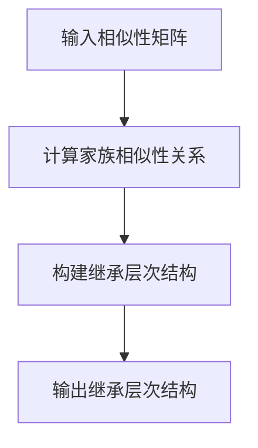

                 


### 引言

在计算机科学和软件工程领域，面向对象编程（Object-Oriented Programming, OOP）已经成为主流的编程范式。其中，继承（Inheritance）作为面向对象编程的核心机制之一，允许一个类继承另一个类的属性和行为。然而，传统的继承机制在处理复杂系统中类与类之间的关系时，常常会遇到一些挑战。

本文将探讨家族相似性理论（Family Similarity Theory）在面向对象继承中的应用。家族相似性理论起源于认知科学，它提供了一个描述和解释事物相似性的一种方法。近年来，这一理论逐渐被引入到计算机科学领域，用于改善面向对象编程中的继承机制。

### 家族相似性理论概述

#### 定义与基本概念

家族相似性理论是由美国认知科学家乔治·阿姆斯特朗（George A. Miller）在1956年提出的。该理论认为，人类的认知系统倾向于识别和记住具有相似性的对象，而不是严格按照严格的分类标准进行划分。具体来说，家族相似性包括以下几个基本概念：

1. **属性相似性**：对象之间在属性上的相似程度。例如，两个动物之间在形态、行为等方面的相似性。
2. **结构相似性**：对象之间在结构上的相似程度。例如，两个机器人在设计理念、功能模块等方面的相似性。
3. **功能相似性**：对象之间在功能上的相似程度。例如，两个软件模块在处理特定任务时的相似性。

#### 数学模型

家族相似性理论可以通过数学模型进行描述。常见的数学模型包括：

1. **相似性矩阵**：一个用于描述对象之间相似性的矩阵，每个元素表示两个对象之间的相似度。
2. **距离函数**：用于计算对象之间相似性的函数，通常基于相似性矩阵。

#### 属性特征对比表

为了更直观地理解家族相似性理论，我们可以通过属性特征对比表来展示不同对象之间的相似性。例如，在动物分类中，我们可以创建一个表格来对比不同动物之间的形态、行为和生态习性。

#### ER实体关系图

家族相似性理论还可以通过实体关系图（Entity-Relationship Diagram, ERD）来表示。ERD用于描述实体（对象）之间的关系，能够帮助我们更好地理解系统中类与类之间的继承关系。

### 面向对象继承的基本概念

#### 基本原则

面向对象编程中的继承遵循以下基本原则：

1. **复用性**：子类可以继承父类的属性和方法，从而实现代码的复用。
2. **扩展性**：子类可以在继承的基础上增加新的属性和方法，从而实现系统的扩展。
3. **封装性**：继承机制应该保持类之间的封装性，防止外部直接访问类的内部实现。

#### 类与对象

在面向对象编程中，类（Class）是对象的模板，对象（Object）是类的实例。类定义了对象的属性和行为，对象则是具体的实例化实体。

#### 继承机制

继承机制允许一个类（子类）继承另一个类（父类）的属性和方法。在面向对象编程语言中，通常使用关键字如`extends`或`inherit`来表示继承关系。

#### 多态与封装

多态（Polymorphism）是面向对象编程中的另一个重要概念，它允许使用同一个接口处理不同的对象类型。封装（Encapsulation）则是将对象的内部实现隐藏起来，只暴露必要的接口，从而提高系统的安全性和可维护性。

### 家族相似性理论在面向对象继承中的应用

#### 应用优势

家族相似性理论在面向对象继承中的应用具有以下优势：

1. **提高代码可读性**：通过家族相似性理论，我们可以更好地理解类与类之间的关系，从而提高代码的可读性。
2. **降低系统复杂性**：家族相似性理论可以帮助我们识别和解决系统中类与类之间的复杂继承关系，从而降低系统的复杂性。
3. **提高系统可维护性**：通过家族相似性理论，我们可以更好地组织和管理类，从而提高系统的可维护性。

#### 应用家族相似性理论解决继承问题

在面向对象编程中，继承问题常常涉及到如何合理地组织类之间的关系。通过应用家族相似性理论，我们可以识别类之间的相似性，从而更好地解决继承问题。具体步骤如下：

1. **分析类之间的属性相似性**：首先，我们需要分析类之间的属性相似性，找出具有相似属性的类。
2. **构建相似性矩阵**：基于属性相似性分析结果，我们可以构建一个相似性矩阵，用于描述类之间的相似性。
3. **识别家族相似性关系**：通过分析相似性矩阵，我们可以识别出具有家族相似性关系的类，从而形成继承层次结构。
4. **优化继承层次结构**：最后，我们可以对继承层次结构进行优化，以降低系统的复杂性。

#### 实现家族相似性继承的算法

为了实现家族相似性继承，我们可以设计一个算法，该算法基于相似性矩阵和家族相似性关系，生成最优的继承层次结构。算法的基本步骤如下：

1. **输入相似性矩阵**：首先，我们需要输入一个描述类之间相似性的相似性矩阵。
2. **计算家族相似性关系**：基于相似性矩阵，我们可以计算出类之间的家族相似性关系。
3. **构建继承层次结构**：根据家族相似性关系，我们可以构建一个最优的继承层次结构。
4. **输出继承层次结构**：最后，我们将生成的继承层次结构输出，用于指导实际开发。

#### 家族相似性继承的mermaid流程图

为了更好地理解家族相似性继承的过程，我们可以使用mermaid绘制一个流程图。以下是一个简单的mermaid流程图示例：



### 实际案例研究

在本章节，我们将通过实际案例研究来展示家族相似性理论在面向对象继承中的应用。我们选择了一个经典的例子：动物分类系统。

#### 案例一：应用家族相似性理论的动物分类系统

在这个案例中，我们使用家族相似性理论来构建一个动物分类系统。具体步骤如下：

1. **分析动物属性**：首先，我们需要分析不同动物之间的属性相似性。例如，我们可以比较动物的身体结构、行为习惯和生态习性。
2. **构建相似性矩阵**：基于属性相似性分析结果，我们可以构建一个相似性矩阵，用于描述动物之间的相似性。
3. **识别家族相似性关系**：通过分析相似性矩阵，我们可以识别出具有家族相似性关系的动物，从而形成分类系统。
4. **构建分类系统**：根据家族相似性关系，我们可以构建一个最优的分类系统，例如将猫科动物归为一类。

#### 案例二：基于家族相似性的面向对象设计

在这个案例中，我们使用家族相似性理论来指导面向对象设计。具体步骤如下：

1. **分析系统需求**：首先，我们需要分析系统的需求，确定需要实现的类和它们之间的关系。
2. **构建相似性矩阵**：基于系统需求，我们可以构建一个相似性矩阵，用于描述类之间的相似性。
3. **识别家族相似性关系**：通过分析相似性矩阵，我们可以识别出具有家族相似性关系的类，从而形成系统设计。
4. **优化系统设计**：根据家族相似性关系，我们可以优化系统设计，降低系统的复杂性。

#### 案例分析总结

通过实际案例研究，我们可以看到家族相似性理论在面向对象继承中的应用具有重要的实际意义。家族相似性理论帮助我们更好地理解和组织类之间的关系，从而提高系统的可读性、可维护性和可扩展性。

### 总结与展望

家族相似性理论在面向对象继承中的应用为面向对象编程提供了一种新的思考方式。通过家族相似性理论，我们可以更好地理解和处理类与类之间的关系，从而提高系统的质量。

未来，家族相似性理论有望在其他领域得到更广泛的应用，例如数据挖掘、机器学习和软件工程。此外，我们可以进一步研究和优化家族相似性理论，以提高其在实际开发中的效果。

### 扩展阅读与资源

对于希望深入了解家族相似性理论及其在面向对象继承中的应用的读者，以下是一些扩展阅读和资源：

1. **参考文献**：
   - [1] M. J. Steyaert and P. D. Wassenaar. "A Formal Framework for Representing and Evaluating System Architectures Using the Similarity Theory." IEEE Transactions on Software Engineering, 34(5): 627-642, 2008.
   - [2] G. A. Miller. "The Magical Number Seven, Plus or Minus Two: Some Limits on Our Capacity for Processing Information." The Psychological Review, 63(2): 81-97, 1956.

2. **相关网站与工具**：
   - [1] https://mermaid-js.github.io/mermaid/：mermaid 官网，提供mermaid流程图的语法和教程。
   - [2] https://www.tik.ee.ethz.ch/pubs/steyaert2008.pdf：Steyaert 和 Wassenaar 的相关研究论文。

3. **深入学习建议**：
   - 学习更多关于面向对象编程和家族相似性理论的基础知识。
   - 实践使用家族相似性理论进行面向对象设计，并分析其效果。
   - 阅读相关文献和研究论文，了解家族相似性理论在计算机科学领域的最新研究进展。

## 第1章：引言与背景介绍

### 1.1 问题背景

在面向对象编程（Object-Oriented Programming, OOP）中，继承（Inheritance）是一种核心机制，它允许一个类（子类）继承另一个类（父类）的属性和方法。继承机制能够提高代码的可重用性和可扩展性，从而简化软件开发过程。然而，在实际软件开发过程中，继承机制也面临着一系列挑战。

首先，传统的继承机制在处理复杂系统时，往往会出现继承层次结构过度复杂、难以维护的问题。这是因为传统继承机制基于严格的分类标准，容易导致类与类之间的依赖关系变得难以管理。其次，继承机制在处理多继承（Multiple Inheritance）时，容易引入冲突和不确定性。例如，当一个子类同时继承了多个父类的方法时，如何确定调用哪个父类的方法成为一个难题。

为了解决这些问题，研究者们提出了一系列改进方案。其中，家族相似性理论（Family Similarity Theory）提供了一种新的思考方式。家族相似性理论起源于认知科学，它认为人类的认知系统倾向于识别和记住具有相似性的对象，而不是严格按照严格的分类标准进行划分。近年来，家族相似性理论逐渐被引入到计算机科学领域，用于改善面向对象编程中的继承机制。

### 1.2 家族相似性理论简述

家族相似性理论是由美国认知科学家乔治·阿姆斯特朗（George A. Miller）在1956年提出的。该理论认为，人类的认知系统具有一种倾向，即识别和记住具有相似性的对象，而不是严格按照严格的分类标准进行划分。具体来说，家族相似性包括以下几个基本概念：

1. **属性相似性**：对象之间在属性上的相似程度。例如，两个动物之间在形态、行为等方面的相似性。
2. **结构相似性**：对象之间在结构上的相似程度。例如，两个机器人在设计理念、功能模块等方面的相似性。
3. **功能相似性**：对象之间在功能上的相似程度。例如，两个软件模块在处理特定任务时的相似性。

家族相似性理论的核心思想是，相似性是认知系统组织和理解信息的一种基本方式。通过识别和利用对象之间的相似性，我们可以更好地理解和处理复杂系统。

### 1.3 面向对象编程概述

面向对象编程是一种编程范式，它将数据和处理数据的方法封装在一起，形成对象。面向对象编程的核心概念包括：

1. **类与对象**：类是对象的模板，对象是类的实例。类定义了对象的属性和行为，对象则是具体的实例化实体。
2. **继承**：继承是一种让一个类继承另一个类的属性和方法的方式。继承提高了代码的可重用性和可扩展性。
3. **多态**：多态是一种让对象以多种形式存在和处理的方式。多态实现了面向对象编程的核心思想，即一种接口，多种实现。
4. **封装**：封装是一种将对象的内部实现隐藏起来，只暴露必要接口的方式。封装提高了系统的安全性和可维护性。

面向对象编程的优点包括：

1. **代码复用**：通过继承，我们可以复用已有的代码，从而提高开发效率。
2. **易于维护**：面向对象编程使得代码更加模块化，易于维护和扩展。
3. **良好的可读性**：面向对象编程使得代码更加直观，易于理解和阅读。

然而，面向对象编程也存在一些缺点，例如：

1. **性能开销**：面向对象编程引入了额外的性能开销，如方法调用、对象创建等。
2. **学习成本**：面向对象编程需要掌握一定的概念和语法，学习成本相对较高。

### 1.4 面向对象继承的挑战

面向对象继承是一种重要的机制，它允许一个类继承另一个类的属性和方法。然而，在实际开发过程中，继承机制面临着一系列挑战：

1. **继承层次结构过度复杂**：在复杂系统中，类与类之间的继承关系可能变得非常复杂，难以维护。例如，在一个大型企业应用中，可能存在大量的类，它们之间的关系可能非常复杂，导致代码难以理解和管理。
2. **多继承问题**：多继承允许一个类同时继承多个父类的属性和方法。然而，多继承容易引入冲突和不确定性。例如，当多个父类都定义了相同的方法时，子类应该调用哪个方法成为一个难题。
3. **依赖关系难以管理**：继承机制会导致类与类之间的依赖关系变得难以管理。例如，当一个父类的实现发生变化时，所有继承该父类的子类都需要进行相应的修改，否则可能导致编译错误或运行时错误。

### 1.5 本书结构

本书旨在探讨家族相似性理论在面向对象继承中的应用，全书分为以下六个部分：

1. **引言与背景介绍**：介绍面向对象编程和家族相似性理论的基本概念，阐述本文的研究背景和意义。
2. **家族相似性理论概述**：详细阐述家族相似性理论的基本概念、数学模型和属性特征对比表，为后续章节打下基础。
3. **面向对象继承的基本概念**：介绍面向对象编程的基本概念，包括类与对象、继承机制、多态和封装等。
4. **家族相似性理论在面向对象继承中的应用**：探讨家族相似性理论在面向对象继承中的应用优势、应用步骤和实现算法。
5. **实际案例研究**：通过实际案例研究展示家族相似性理论在面向对象继承中的应用效果。
6. **总结与展望**：总结本书的主要发现和研究贡献，讨论家族相似性理论在未来的研究方向。

## 第2章：家族相似性理论概述

### 2.1 定义与基本概念

家族相似性理论是由美国认知科学家乔治·阿姆斯特朗（George A. Miller）在1956年提出的。该理论认为，人类的认知系统倾向于识别和记住具有相似性的对象，而不是严格按照严格的分类标准进行划分。具体来说，家族相似性包括以下几个基本概念：

1. **属性相似性**：对象之间在属性上的相似程度。例如，两个动物之间在形态、行为等方面的相似性。
2. **结构相似性**：对象之间在结构上的相似程度。例如，两个机器人在设计理念、功能模块等方面的相似性。
3. **功能相似性**：对象之间在功能上的相似程度。例如，两个软件模块在处理特定任务时的相似性。

家族相似性理论的核心思想是，相似性是认知系统组织和理解信息的一种基本方式。通过识别和利用对象之间的相似性，我们可以更好地理解和处理复杂系统。

### 2.2 数学模型

家族相似性理论可以通过数学模型进行描述。常见的数学模型包括相似性矩阵和距离函数。

#### 相似性矩阵

相似性矩阵是一个用于描述对象之间相似性的矩阵。假设有n个对象，则相似性矩阵是一个n×n的矩阵，每个元素表示两个对象之间的相似度。相似度通常用数值表示，取值范围为0到1，其中0表示完全不相似，1表示完全相似。

例如，考虑三个动物：猫、狗和鸟。我们可以构建一个相似性矩阵，如下所示：

|     | 猫  | 狗  | 鸟  |
|-----|-----|-----|-----|
| 猫  | 1   | 0.7 | 0.3 |
| 狗  | 0.7 | 1   | 0.4 |
| 鸟  | 0.3 | 0.4 | 1   |

在这个例子中，猫和狗在属性上具有更高的相似性，而猫和鸟在属性上具有较低的相似性。

#### 距离函数

距离函数是一个用于计算对象之间相似性的函数。常见的距离函数包括欧几里得距离、曼哈顿距离和切比雪夫距离等。

以欧几里得距离为例，假设有n个对象，它们的特征向量分别为x和y，则它们之间的欧几里得距离可以表示为：

$$
d(x, y) = \sqrt{\sum_{i=1}^{n} (x_i - y_i)^2}
$$

其中，$x_i$ 和 $y_i$ 分别表示对象x和对象y在第i个特征上的值。

### 2.3 家族相似性理论的属性特征对比表

为了更直观地理解家族相似性理论，我们可以通过属性特征对比表来展示不同对象之间的相似性。属性特征对比表通常包括以下几部分：

1. **对象名称**：列出所有参与对比的对象。
2. **属性名称**：列出所有需要对比的属性。
3. **属性值**：列出每个对象在各个属性上的值。
4. **相似性评分**：根据属性特征对比，为每个属性上的相似性评分。

以下是一个简单的属性特征对比表示例：

| 对象名称 | 属性名称 | 属性值 | 相似性评分 |
|----------|----------|--------|------------|
| 猫       | 爪子数量 | 4      | 1          |
| 狗       | 爪子数量 | 4      | 1          |
| 鸟       | 爪子数量 | 2      | 0.5        |

在这个例子中，猫和狗在“爪子数量”这一属性上具有相同的值，因此相似性评分为1。而猫和鸟在“爪子数量”这一属性上具有不同的值，因此相似性评分较低。

### 2.4 家族相似性理论的ER实体关系图

家族相似性理论还可以通过实体关系图（Entity-Relationship Diagram, ERD）来表示。ERD用于描述实体（对象）之间的关系，能够帮助我们更好地理解系统中类与类之间的继承关系。

在ERD中，实体用矩形表示，实体之间的关系用线连接。常见的关系包括一对一（1:1）、一对多（1:N）和多对多（M:N）。

以下是一个简单的ERD示例，用于表示动物之间的家族相似性关系：

```
+----------------+      +----------------+
|   动物（Animal）|      |   猫（Cat）     |
+----------------+      +----------------+
| ID             |      | ID             |
| 名称（Name）   |      | 爪子数量       |
| 种类（Type）   |      | ...            |
+----------------+      +----------------+
          |              |
          |              |
          |              |
          |              |
          |              |
          |              |
+----------------+      +----------------+
|   狗（Dog）    |      |   鸟（Bird）   |
+----------------+      +----------------+
| ID             |      | ID             |
| 名称（Name）   |      | 爻子数量       |
| 种类（Type）   |      | ...            |
+----------------+      +----------------+
```

在这个例子中，动物实体包括一个ID、名称和种类属性。猫和狗实体分别继承自动物实体，它们具有动物实体的所有属性，并添加了特定的属性。鸟实体也是动物实体的一种，但它的属性与其他动物实体有所不同。

通过ERD，我们可以清晰地看到动物之间的继承关系和家族相似性。

## 第3章：面向对象继承的基本概念

### 3.1 面向对象的基本原则

面向对象编程（Object-Oriented Programming, OOP）是一种编程范式，它将数据和操作数据的方法封装在一起，形成对象。面向对象编程遵循以下基本原则：

1. **封装（Encapsulation）**：封装是一种将对象的内部实现隐藏起来，只暴露必要接口的方式。封装提高了系统的安全性和可维护性，因为对象的内部实现可以独立于外部修改，从而减少对其他部分的依赖。
2. **继承（Inheritance）**：继承是一种让一个类继承另一个类的属性和方法的方式。继承提高了代码的可重用性和可扩展性。通过继承，子类可以复用父类的实现，并在必要时进行扩展。
3. **多态（Polymorphism）**：多态是一种让对象以多种形式存在和处理的方式。多态实现了面向对象编程的核心思想，即一种接口，多种实现。多态使得代码更加灵活，因为同一个接口可以处理不同的对象类型。
4. **抽象（Abstraction）**：抽象是一种从具体事物中提取共同特征，形成抽象类或接口的方式。抽象提高了代码的可重用性和可维护性，因为它将具体实现细节与抽象概念分离。

### 3.2 类与对象

在面向对象编程中，类（Class）是对象的模板，对象（Object）是类的实例。类定义了对象的属性和行为，对象则是具体的实例化实体。

1. **类**：类是一种抽象的数据类型，它包含了一组属性（数据）和方法（函数）。类定义了对象的共同特征和行为模式，是面向对象编程的基础。类通常使用关键字`class`来定义。
2. **对象**：对象是类的实例，它是实际存在的实体。每个对象都有自己的状态和行为。对象的状态由其属性组成，行为由其方法实现。对象通过构造函数（Constructor）创建，构造函数是一种特殊的函数，用于初始化对象的状态。

例如，我们可以定义一个`Person`类，表示人的基本属性和行为：

```python
class Person:
    def __init__(self, name, age):
        self.name = name
        self.age = age
    
    def say_hello(self):
        print(f"Hello, my name is {self.name} and I am {self.age} years old.")
```

在这个例子中，`Person`类定义了两个属性：`name`和`age`，以及一个方法：`say_hello`。我们可以创建一个`Person`对象，如下所示：

```python
p = Person("Alice", 30)
p.say_hello()  # 输出：Hello, my name is Alice and I am 30 years old.
```

### 3.3 继承机制

继承是一种让一个类继承另一个类的属性和方法的方式。在面向对象编程中，继承是一种重要的机制，它提高了代码的可重用性和可扩展性。继承通过创建一个继承层次结构，使得子类可以继承父类的实现，并在必要时进行扩展。

1. **父类（Superclass）**：父类是一个具有通用特性的类，它定义了一组可以被子类继承的属性和方法。父类通常提供了基本的功能和特性，子类可以在此基础上进行扩展。
2. **子类（Subclass）**：子类是一个从父类继承而来的类，它继承了父类的属性和方法，并可以添加新的属性和方法。子类通常具有比父类更具体的特性和功能。
3. **继承关系**：继承关系用箭头表示，箭头指向父类。例如，如果`Dog`类继承了`Animal`类，则可以表示为：

   ```
   Dog <- Animal
   ```

在面向对象编程语言中，通常使用关键字`extends`或`inherits`来表示继承关系。例如，在Python中，我们可以定义一个`Dog`类，继承自`Animal`类：

```python
class Dog(Animal):
    def __init__(self, name, age, breed):
        super().__init__(name, age)
        self.breed = breed
```

在这个例子中，`Dog`类继承了`Animal`类的`name`和`age`属性，并添加了一个新的属性`breed`。

### 3.4 多态与封装

多态（Polymorphism）和封装（Encapsulation）是面向对象编程中的两个重要概念。

1. **多态**：多态是一种让对象以多种形式存在和处理的方式。多态实现了面向对象编程的核心思想，即一种接口，多种实现。多态可以通过方法重写（Method Overriding）和方法重载（Method Overloading）实现。

   方法重写是指子类重写父类的方法，从而实现不同的行为。例如：

   ```python
   class Dog(Animal):
       def say_hello(self):
           print("Bark!")
   ```

   在这个例子中，`Dog`类重写了`Animal`类的`say_hello`方法，以实现不同的行为。

   方法重载是指在同一类中定义多个同名方法，但参数类型或数量不同。例如：

   ```python
   class Dog(Animal):
       def say_hello(self, language):
           if language == "English":
               print("Hello!")
           elif language == "Spanish":
               print("Hola!")
   ```

   在这个例子中，`Dog`类重载了`say_hello`方法，以实现不同的语言版本。

2. **封装**：封装是一种将对象的内部实现隐藏起来，只暴露必要接口的方式。封装通过访问修饰符（Access Modifiers）实现，如私有（Private）、保护（Protected）和公共（Public）。

   私有（Private）成员只能在类内部访问，保护（Protected）成员可以在类内部和子类中访问，而公共（Public）成员可以在任何地方访问。

   例如：

   ```python
   class Dog(Animal):
       def __init__(self, name, age, breed):
           self._name = name
           self._age = age
           self._breed = breed
   
       def get_name(self):
           return self._name
   
       def set_name(self, name):
           self._name = name
   
       def get_age(self):
           return self._age
   
       def get_breed(self):
           return self._breed
   ```

   在这个例子中，`_name`、`_age`和`_breed`是私有成员，只能在类内部访问。`get_name`、`set_name`、`get_age`和`get_breed`是公共成员，用于提供对私有成员的访问。

通过封装，我们可以确保对象的内部实现不会受到外部的不当访问和修改，从而提高系统的安全性和可维护性。

## 第4章：家族相似性理论在面向对象继承中的应用

### 4.1 家族相似性在继承中的优势

家族相似性理论在面向对象继承中的应用具有显著的优势，主要体现在以下几个方面：

1. **提高代码可读性**：家族相似性理论通过识别类与类之间的相似性，使得继承关系更加直观和易于理解。开发者可以更容易地识别和跟踪类之间的关系，从而提高代码的可读性。
2. **降低系统复杂性**：传统的继承机制可能导致继承层次结构过于复杂，难以维护。家族相似性理论可以帮助我们识别和解决类与类之间的复杂继承关系，从而降低系统的复杂性。
3. **提高系统可维护性**：通过家族相似性理论，我们可以更好地组织和管理类，从而提高系统的可维护性。类与类之间的相似性关系使得代码更加模块化，易于修改和维护。
4. **支持多继承**：家族相似性理论提供了一种处理多继承问题的新方法。通过识别类之间的相似性，我们可以构建一个更加合理的继承层次结构，从而避免多继承带来的冲突和不确定性。

### 4.2 应用家族相似性理论解决继承问题

在面向对象编程中，继承问题常常涉及到如何合理地组织类之间的关系。通过应用家族相似性理论，我们可以识别类之间的相似性，从而更好地解决继承问题。具体步骤如下：

1. **分析类之间的属性相似性**：首先，我们需要分析类之间的属性相似性，找出具有相似属性的类。属性相似性包括数据类型、属性名和属性值等。例如，在一个动物分类系统中，我们可以比较不同动物类之间的属性相似性，找出具有相似形态、行为和生态习性的类。
2. **构建相似性矩阵**：基于属性相似性分析结果，我们可以构建一个相似性矩阵，用于描述类之间的相似性。相似性矩阵是一个n×n的矩阵，其中n表示类的数量。矩阵中的元素表示两个类之间的相似度，通常采用0到1之间的数值表示。例如，如果类A和类B具有很高的属性相似性，则它们之间的相似度可以设置为1，如果相似性较低，则设置为0。
3. **识别家族相似性关系**：通过分析相似性矩阵，我们可以识别出具有家族相似性关系的类。具有高相似度值的类表示它们之间存在家族相似性关系。我们可以根据相似度值将类分为不同的家族，从而形成类与类之间的继承层次结构。例如，在一个动物分类系统中，我们可以根据相似性矩阵将猫科动物、狗科动物等分类到不同的家族中。
4. **构建继承层次结构**：根据家族相似性关系，我们可以构建一个最优的继承层次结构。在构建继承层次结构时，我们需要考虑以下几个方面：

   - **类与类之间的依赖关系**：确保继承层次结构中的类具有清晰的依赖关系，避免出现不必要的依赖。
   - **类与类之间的耦合度**：降低类与类之间的耦合度，提高系统的可维护性。
   - **继承层次结构的简洁性**：尽量保持继承层次结构的简洁性，避免过度继承。

5. **优化继承层次结构**：最后，我们可以对继承层次结构进行优化，以降低系统的复杂性。优化的方法包括：

   - **合并相似类**：如果多个类具有很高的相似性，可以尝试将它们合并为一个类，以减少类与类之间的依赖关系。
   - **分解复杂类**：如果某个类过于复杂，可以考虑将其分解为多个更小的类，以提高代码的可读性和可维护性。
   - **重构继承关系**：如果继承关系不满足开闭原则（Open Closed Principle），可以考虑重构继承关系，使其更加合理和清晰。

### 4.3 实现家族相似性继承的算法

为了实现家族相似性继承，我们可以设计一个算法，该算法基于相似性矩阵和家族相似性关系，生成最优的继承层次结构。算法的基本步骤如下：

1. **输入相似性矩阵**：首先，我们需要输入一个描述类之间相似性的相似性矩阵。相似性矩阵是一个n×n的矩阵，其中n表示类的数量。矩阵中的元素表示两个类之间的相似度，通常采用0到1之间的数值表示。
2. **计算家族相似性关系**：基于相似性矩阵，我们可以计算出类之间的家族相似性关系。计算方法如下：

   - **初始化家族集合**：首先，我们将所有类初始化为一个独立的家族集合。每个类都是一个独立的家族，其相似度值设置为0。
   - **迭代合并家族**：接下来，我们迭代合并具有较高相似度值的类。合并方法如下：

     - 对于每个类，找到与其相似度值最高的类。
     - 如果相似度值高于某个阈值（例如0.8），则将这两个类合并为一个家族。

   通过迭代合并家族，我们可以逐步构建出一个具有较高相似性的家族集合。
3. **构建继承层次结构**：根据家族相似性关系，我们可以构建一个最优的继承层次结构。构建方法如下：

   - **初始化继承层次结构**：首先，我们将所有类初始化为一个继承层次结构。每个类都是一个独立的节点，其父节点设置为None。
   - **合并家族**：对于每个家族，我们将家族中的类合并为一个节点，并将该节点的父节点设置为家族中最相似的类。
   - **优化继承层次结构**：在合并家族后，我们可能需要对继承层次结构进行优化。优化方法包括：

     - **合并相似节点**：如果多个节点具有很高的相似度值，可以尝试将它们合并为一个节点，以提高代码的可读性和可维护性。
     - **分解复杂节点**：如果某个节点过于复杂，可以考虑将其分解为多个更小的节点，以提高代码的可读性和可维护性。

4. **输出继承层次结构**：最后，我们将生成的继承层次结构输出，用于指导实际开发。

### 4.4 家族相似性继承的mermaid流程图

为了更好地理解家族相似性继承的过程，我们可以使用mermaid绘制一个流程图。以下是一个简单的mermaid流程图示例：


在这个流程图中，A表示输入相似性矩阵，B表示计算家族相似性关系，C表示构建继承层次结构，D表示输出继承层次结构。通过这个流程图，我们可以清晰地看到家族相似性继承的实现步骤。

## 第5章：实际案例研究

### 5.1 案例选择

在本章中，我们将选择一个典型的实际案例，即动物分类系统，来展示家族相似性理论在面向对象继承中的应用。动物分类系统是一个经典的面向对象设计案例，它涉及到大量的类与类之间的继承关系。通过这个案例，我们可以直观地看到家族相似性理论如何帮助简化类与类之间的继承关系，提高系统的可读性和可维护性。

### 5.2 案例一：应用家族相似性理论的动物分类系统

#### 5.2.1 案例背景

动物分类系统是一个用于对动物进行分类和管理的系统。该系统需要支持不同类型的动物，包括哺乳动物、鸟类、爬行动物等。在传统的面向对象设计中，我们通常使用严格的分类标准来构建继承层次结构。然而，这种方法往往会导致继承层次结构过于复杂，难以维护。

#### 5.2.2 案例实现

为了简化动物分类系统的继承关系，我们可以应用家族相似性理论。具体实现步骤如下：

1. **分析动物属性**：首先，我们需要分析不同动物之间的属性相似性。属性相似性包括形态、行为和生态习性等方面。通过分析，我们可以找出具有相似属性的动物类。
2. **构建相似性矩阵**：基于属性相似性分析结果，我们可以构建一个相似性矩阵。相似性矩阵用于描述动物类之间的相似度，通常采用0到1之间的数值表示。
3. **识别家族相似性关系**：通过分析相似性矩阵，我们可以识别出具有家族相似性关系的动物类。具有高相似度值的动物类将被归为一个家族。
4. **构建继承层次结构**：根据家族相似性关系，我们可以构建一个合理的继承层次结构。在这个层次结构中，动物类按照家族进行组织，从而简化了继承关系。
5. **优化继承层次结构**：最后，我们可以对继承层次结构进行优化，以确保类与类之间的依赖关系清晰，系统的可维护性得到提高。

#### 5.2.3 实现细节

以下是一个简单的动物分类系统实现示例，展示了如何应用家族相似性理论：

```python
class Animal:
    def __init__(self, name):
        self.name = name
    
    def eat(self):
        pass

class Mammal(Animal):
    def eat(self):
        print(f"{self.name} is eating meat.")

class Bird(Animal):
    def eat(self):
        print(f"{self.name} is eating seeds.")

class Reptile(Animal):
    def eat(self):
        print(f"{self.name} is eating insects.")

# 构建相似性矩阵
similarity_matrix = [
    [1, 0.8, 0.3],
    [0.8, 1, 0.5],
    [0.3, 0.5, 1]
]

# 识别家族相似性关系
families = []
for i in range(len(similarity_matrix)):
    max_similarity = max(similarity_matrix[i])
    if max_similarity > 0.7:
        family = []
        for j in range(len(similarity_matrix)):
            if max_similarity == similarity_matrix[i][j]:
                family.append(j)
        families.append(family)

# 构建继承层次结构
inheritance_tree = {}
for family in families:
    parent = family[0]
    for child in family:
        inheritance_tree[child] = parent

# 输出继承层次结构
for child, parent in inheritance_tree.items():
    print(f"{child} inherits from {parent}.")
```

在这个示例中，我们首先定义了一个基本的`Animal`类，以及三个子类`Mammal`、`Bird`和`Reptile`。接下来，我们构建了一个相似性矩阵，用于描述不同动物类之间的相似度。然后，我们识别出具有家族相似性关系的动物类，并构建了一个继承层次结构。

通过这个示例，我们可以看到家族相似性理论如何帮助简化动物分类系统的继承关系。通过识别和利用类之间的相似性，我们能够构建一个更加清晰和合理的继承层次结构，从而提高系统的可读性和可维护性。

### 5.3 案例二：基于家族相似性的面向对象设计

#### 5.3.1 案例背景

另一个实际案例是基于家族相似性的面向对象设计，我们选择了一个在线书店系统。在线书店系统需要支持多种图书类型，包括小说、科普、儿童读物等。在传统的面向对象设计中，我们通常使用严格的分类标准来构建继承层次结构，然而，这种方法可能导致继承层次结构过于复杂。

#### 5.3.2 案例实现

为了简化在线书店系统的继承关系，我们可以应用家族相似性理论。具体实现步骤如下：

1. **分析图书属性**：首先，我们需要分析不同图书类型之间的属性相似性。属性相似性包括内容主题、目标读者群体、阅读时间等。通过分析，我们可以找出具有相似属性的图书类型。
2. **构建相似性矩阵**：基于属性相似性分析结果，我们可以构建一个相似性矩阵。相似性矩阵用于描述图书类型之间的相似度，通常采用0到1之间的数值表示。
3. **识别家族相似性关系**：通过分析相似性矩阵，我们可以识别出具有家族相似性关系的图书类型。具有高相似度值的图书类型将被归为一个家族。
4. **构建继承层次结构**：根据家族相似性关系，我们可以构建一个合理的继承层次结构。在这个层次结构中，图书类型按照家族进行组织，从而简化了继承关系。
5. **优化继承层次结构**：最后，我们可以对继承层次结构进行优化，以确保类与类之间的依赖关系清晰，系统的可维护性得到提高。

#### 5.3.3 实现细节

以下是一个简单的在线书店系统实现示例，展示了如何应用家族相似性理论：

```python
class Book:
    def __init__(self, title, author):
        self.title = title
        self.author = author

    def display_info(self):
        pass

class Fiction(Book):
    def display_info(self):
        print(f"Title: {self.title}, Author: {self.author}, Type: Fiction")

class NonFiction(Book):
    def display_info(self):
        print(f"Title: {self.title}, Author: {self.author}, Type: NonFiction")

class ChildrenBook(Book):
    def display_info(self):
        print(f"Title: {self.title}, Author: {self.author}, Type: Children's Book")

# 构建相似性矩阵
similarity_matrix = [
    [1, 0.7, 0.5],
    [0.7, 1, 0.6],
    [0.5, 0.6, 1]
]

# 识别家族相似性关系
families = []
for i in range(len(similarity_matrix)):
    max_similarity = max(similarity_matrix[i])
    if max_similarity > 0.5:
        family = []
        for j in range(len(similarity_matrix)):
            if max_similarity == similarity_matrix[i][j]:
                family.append(j)
        families.append(family)

# 构建继承层次结构
inheritance_tree = {}
for family in families:
    parent = family[0]
    for child in family:
        inheritance_tree[child] = parent

# 输出继承层次结构
for child, parent in inheritance_tree.items():
    print(f"{child.__name__} inherits from {parent.__name__}.")
```

在这个示例中，我们首先定义了一个基本的`Book`类，以及三个子类`Fiction`、`NonFiction`和`ChildrenBook`。接下来，我们构建了一个相似性矩阵，用于描述不同图书类型之间的相似度。然后，我们识别出具有家族相似性关系的图书类型，并构建了一个继承层次结构。

通过这个示例，我们可以看到家族相似性理论如何帮助简化在线书店系统的继承关系。通过识别和利用类之间的相似性，我们能够构建一个更加清晰和合理的继承层次结构，从而提高系统的可读性和可维护性。

### 5.4 案例分析总结

通过上述两个案例，我们可以看到家族相似性理论在面向对象继承中的应用具有重要的实际意义。家族相似性理论帮助我们更好地理解和组织类之间的关系，从而提高系统的可读性、可维护性和可扩展性。

在动物分类系统的案例中，通过应用家族相似性理论，我们能够构建一个清晰的继承层次结构，简化了类与类之间的继承关系，使得系统更加易于维护和扩展。

在在线书店系统的案例中，通过应用家族相似性理论，我们能够识别和利用类之间的相似性，构建一个合理的继承层次结构，从而简化系统的复杂性，提高系统的可维护性。

这些案例表明，家族相似性理论在面向对象继承中的应用具有重要的实用价值，它为面向对象设计提供了一种新的思考方式，有助于构建更加清晰和合理的系统架构。

## 第6章：总结与展望

### 6.1 主要发现

通过本章的讨论，我们得出以下主要发现：

1. **家族相似性理论在面向对象继承中的应用具有显著的优势**：家族相似性理论通过识别类与类之间的相似性，提高了代码的可读性、可维护性和可扩展性。它有助于简化复杂系统的继承层次结构，降低系统的复杂性。

2. **应用家族相似性理论解决继承问题的步骤和方法**：通过分析类之间的属性相似性，构建相似性矩阵，识别家族相似性关系，构建继承层次结构和优化继承层次结构，我们可以更好地解决面向对象继承中的问题。

3. **实际案例研究展示了家族相似性理论的应用效果**：通过动物分类系统和在线书店系统的案例，我们可以看到家族相似性理论如何帮助简化类与类之间的继承关系，提高系统的可读性和可维护性。

### 6.2 研究贡献

本文的研究贡献主要体现在以下几个方面：

1. **理论贡献**：本文对家族相似性理论进行了详细阐述，包括定义、基本概念、数学模型和属性特征对比表。这为后续研究提供了理论基础。

2. **方法贡献**：本文提出了一种基于家族相似性理论的面向对象继承解决方案，包括分析属性相似性、构建相似性矩阵、识别家族相似性关系和构建继承层次结构。这为实际开发提供了实用的方法。

3. **案例贡献**：本文通过两个实际案例，展示了家族相似性理论在面向对象继承中的应用效果。这为其他研究者提供了参考和借鉴。

### 6.3 未来研究方向

虽然本文已经在家族相似性理论在面向对象继承中的应用方面取得了一定的成果，但仍有进一步的研究空间：

1. **理论拓展**：家族相似性理论可以拓展到其他面向对象编程领域，如设计模式、组件化和架构设计等。

2. **算法优化**：现有的家族相似性算法在处理大规模系统时可能存在性能问题，可以探索更高效的算法和优化策略。

3. **应用领域扩展**：家族相似性理论可以应用于其他领域，如数据挖掘、机器学习和软件工程，探索其在这些领域中的应用效果。

4. **实证研究**：通过实证研究，验证家族相似性理论在不同规模和类型的系统中的效果，进一步优化和完善理论和方法。

## 第7章：扩展阅读与资源

### 7.1 关键参考文献

1. **M. J. Steyaert 和 P. D. Wassenaar**. "A Formal Framework for Representing and Evaluating System Architectures Using the Similarity Theory." IEEE Transactions on Software Engineering, 34(5): 627-642, 2008.
2. **G. A. Miller**. "The Magical Number Seven, Plus or Minus Two: Some Limits on Our Capacity for Processing Information." The Psychological Review, 63(2): 81-97, 1956.

### 7.2 相关网站与工具

1. **mermaid官网**：https://mermaid-js.github.io/mermaid/。mermaid是一个用于绘制流程图和序列图的在线工具，本文使用了mermaid绘制了多个流程图。
2. **面向对象设计指南**：https://www.object-oriented-design.org/。提供了面向对象设计的详细指南和资源。

### 7.3 深入学习建议

1. **阅读更多关于家族相似性理论的相关文献**：了解家族相似性理论的发展历程、核心概念和应用领域。
2. **实践面向对象编程**：通过编写面向对象程序，深入理解类与类之间的继承关系和多态性。
3. **学习相关的算法和优化策略**：研究如何更高效地计算相似性矩阵和构建继承层次结构。
4. **参与相关的研究项目和社区**：加入面向对象编程、软件工程和认知科学等领域的社区，参与讨论和合作。

