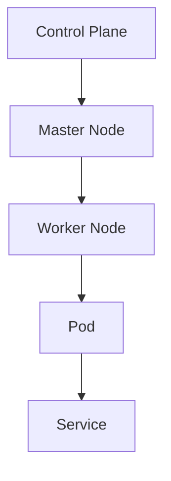
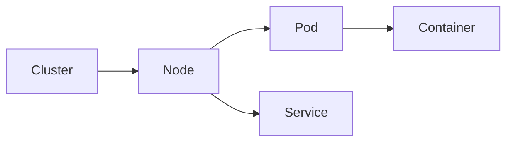
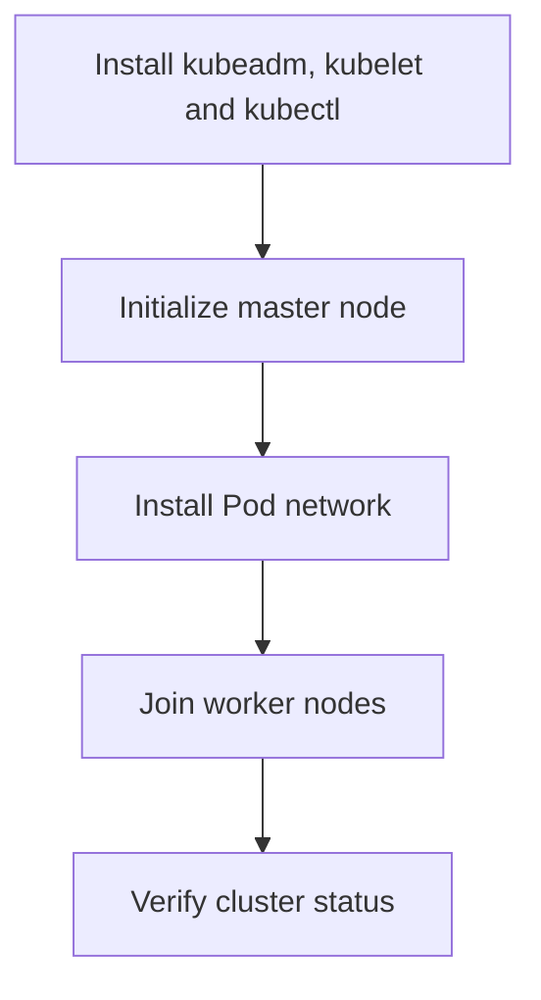
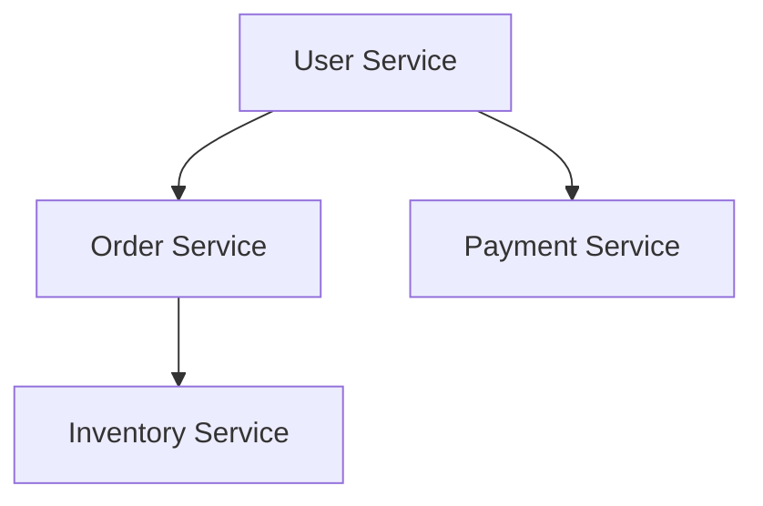
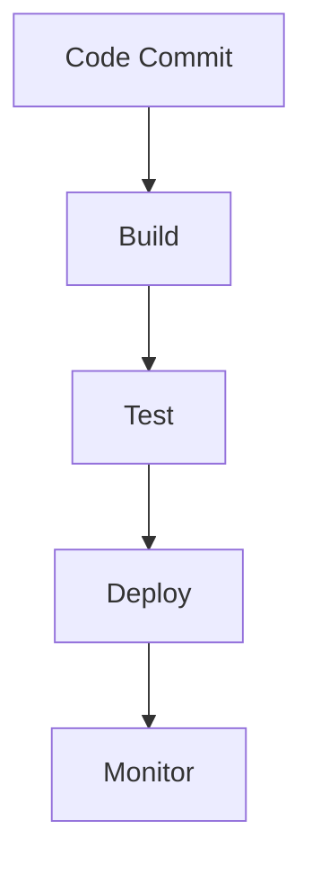

                 


## 容器化技术：提升部署效率与资源利用率

> 关键词：容器化、Docker、Kubernetes、微服务、持续集成、云原生应用

> 摘要：本文将深入探讨容器化技术，包括其发展历程、核心概念、技术优势以及应用场景。我们将逐步分析容器化在微服务架构、持续集成与持续部署、云原生应用开发等领域的应用，并通过案例展示其实践效果。最后，我们还将探讨容器化技术的未来趋势与发展方向。

## 目录

----------------------------------------------------------------

### 第一部分：容器化技术基础

#### 第1章：容器化概述
- 1.1 容器化技术的发展历程
- 1.2 容器化与虚拟化的区别
- 1.3 容器化技术的核心概念
- 1.4 容器化技术的优势
- 1.5 容器化技术的应用场景

#### 第2章：容器核心技术
- 2.1 Docker概述
  - 2.1.1 Docker的基本架构
  - 2.1.2 Dockerfile详解
  - 2.1.3 Docker Compose
- 2.2 容器网络
  - 2.2.1 容器网络模型
  - 2.2.2 网络命名空间
  - 2.2.3 网络驱动与配置
- 2.3 容器存储
  - 2.3.1 容器存储类型
  - 2.3.2 数据卷与绑定挂载
  - 2.3.3 容器存储策略

#### 第3章：容器编排与管理系统
- 3.1 Kubernetes简介
  - 3.1.1 Kubernetes架构
  - 3.1.2 Kubernetes核心概念
  - 3.1.3 Kubernetes集群的部署
- 3.2 Kubernetes资源管理
  - 3.2.1 Pod与容器
  - 3.2.2 Deployment与StatefulSet
  - 3.2.3 服务与Ingress
- 3.3 Kubernetes自动化运维
  - 3.3.1 Helm介绍
  - 3.3.2 CI/CD与Kubernetes
  - 3.3.3 Kubernetes集群监控与日志管理

### 第二部分：容器化技术的应用与实践

#### 第4章：微服务架构与容器化
- 4.1 微服务架构设计
  - 4.1.1 微服务架构的优势
  - 4.1.2 微服务架构的挑战
  - 4.1.3 微服务与容器化的结合
- 4.2 容器化微服务的部署
  - 4.2.1 Docker Compose与微服务
  - 4.2.2 Kubernetes与微服务
  - 4.2.3 容器化微服务的运维

#### 第5章：容器化技术在持续集成与持续部署中的应用
- 5.1 持续集成（CI）与持续部署（CD）
  - 5.1.1 CI/CD的基本概念
  - 5.1.2 CI/CD工具选择
  - 5.1.3 CI/CD流程设计
- 5.2 容器化CI/CD工具
  - 5.2.1 Jenkins与容器化
  - 5.2.2 GitLab CI与容器化
  - 5.2.3 Docker Swarm与CI/CD

#### 第6章：容器化在云原生应用开发中的实践
- 6.1 云原生应用开发概述
  - 6.1.1 云原生应用的特点
  - 6.1.2 云原生应用开发流程
  - 6.1.3 云原生应用与容器化的关系
- 6.2 容器化在云服务中的应用
  - 6.2.1 公共云与容器化服务
  - 6.2.2 私有云与容器化平台
  - 6.2.3 容器化服务与DevOps

#### 第7章：容器化技术案例分析
- 7.1 案例背景
- 7.2 案例需求分析
- 7.3 案例解决方案
  - 7.3.1 架构设计
  - 7.3.2 容器化与编排工具选择
  - 7.3.3 实施步骤
- 7.4 案例效果评估
- 7.5 案例总结与启示

### 第三部分：容器化技术的未来趋势与发展方向

#### 第8章：容器化技术的未来趋势
- 8.1 容器化技术的发展方向
- 8.2 容器化技术面临的挑战
- 8.3 容器化技术在新兴领域中的应用

#### 第9章：容器化技术的最佳实践
- 9.1 容器化最佳实践
- 9.2 小结
- 9.3 注意事项
- 9.4 拓展阅读

----------------------------------------------------------------

### 第一部分：容器化技术基础

#### 第1章：容器化概述

**1.1 容器化技术的发展历程**

容器化技术起源于操作系统层面的虚拟化技术，其目的是为了解决应用部署的灵活性和可移植性问题。最早的容器化技术可以追溯到20世纪80年代，当时Unix系统中的chroot命令被用来创建隔离环境。然而，这些早期的容器技术并不具备现代容器的高级特性和优势。

随着Linux内核的发展，2000年代初，Linux容器（LXC）出现，它利用cgroups和namespaces实现了更加高效和灵活的容器化。2008年，Docker公司成立，并推出了Docker容器，这标志着容器技术进入了一个新的发展阶段。Docker使用了一种名为Libcontainer的轻量级容器引擎，它封装了操作系统的底层功能，使得容器更加易于使用和管理。

近年来，随着容器技术的成熟和广泛应用，Kubernetes等容器编排工具也应运而生。Kubernetes提供了一个强大的平台，用于管理容器的部署、扩展和运维，进一步推动了容器化技术的普及和发展。

**1.2 容器化与虚拟化的区别**

容器化和虚拟化是两种不同的技术，虽然它们在某些方面有相似之处，但它们的主要区别在于它们如何管理和隔离资源。

虚拟化技术通过在物理服务器上创建虚拟机（VM）来模拟独立的计算环境。每个虚拟机都有自己的操作系统和资源，因此虚拟化可以提供更好的隔离性和灵活性。然而，虚拟化需要为每个虚拟机分配独立的资源，这可能导致资源利用率不高。

容器化则通过共享操作系统内核来创建隔离的环境。容器共享主机的操作系统和资源，但它们通过cgroups和namespaces实现资源隔离，从而提高了资源利用率。容器通常比虚拟机更轻量级，启动速度快，且易于管理和部署。

以下是一个简单的对比表格，展示了容器化与虚拟化之间的关键区别：

| 对比项 | 容器化 | 虚拟化 |
| --- | --- | --- |
| 资源利用率 | 高 | 低 |
| 启动速度 | 快 | 慢 |
| 隔离性 | 较低（但可接受） | 高 |
| 可移植性 | 高 | 中等 |
| 复杂性 | 低 | 高 |

**1.3 容器化技术的核心概念**

容器化技术的核心概念包括：

- **容器**：容器是一个轻量级、可执行的独立包，包含了应用程序及其所有依赖项、库和环境变量。容器可以在任何支持容器引擎的操作系统上运行。

- **容器引擎**：容器引擎负责创建、启动、运行和管理容器。常见的容器引擎包括Docker、rkt和LXC。

- **镜像**：容器镜像是一个静态的、只读的模板，用于创建容器。它包含了应用程序所需的所有文件和配置。

- **编排工具**：容器编排工具用于管理和部署容器化应用程序。常见的编排工具包括Kubernetes、Docker Swarm和Apache Mesos。

**1.4 容器化技术的优势**

容器化技术具有以下优势：

- **部署灵活性**：容器化使得应用程序的部署更加灵活，可以在不同的环境中无缝迁移和部署。

- **资源利用率**：容器通过共享操作系统内核，提高了资源利用率，特别是在多租户环境中。

- **部署速度**：容器化应用程序的部署速度比虚拟化应用程序快得多，从而缩短了开发周期。

- **可移植性**：容器可以运行在任何支持容器引擎的操作系统上，无需关心底层硬件和操作系统差异。

- **故障隔离**：容器提供了良好的故障隔离机制，即使一个容器出现故障，也不会影响其他容器。

**1.5 容器化技术的应用场景**

容器化技术在以下场景中具有广泛应用：

- **Web应用**：容器化使得Web应用的开发、测试和部署更加灵活和高效。

- **大数据应用**：容器化可以提高大数据应用的可扩展性和资源利用率。

- **微服务架构**：容器化与微服务架构的结合，可以实现灵活的模块化和高可用性。

- **持续集成与持续部署（CI/CD）**：容器化技术使得CI/CD流程更加自动化和高效。

- **云原生应用**：容器化技术是云原生应用开发的基础，可以实现应用程序的弹性扩展和自动部署。

#### 第2章：容器核心技术

**2.1 Docker概述**

**2.1.1 Docker的基本架构**

Docker是一个开源的应用容器引擎，它允许开发者打包他们的应用以及应用的依赖包到一个可移植的容器中，然后发布到任何流行的Linux或Windows操作系统上，也可以实现虚拟化。容器是完全使用沙箱机制，相互之间不会有任何接口（类似 iPhone 的 app）而且更轻量级。

Docker 的基本架构包括以下几个核心组件：

- **Docker Engine**：Docker 的核心组件，负责管理容器的创建、启动、停止和删除。

- **Docker Hub**：Docker 的官方镜像仓库，用户可以在这里找到、分享和下载各种 Docker 镜像。

- **Docker Compose**：Docker Compose 是一个用于定义和运行多容器应用的工具，它可以一次性启动多个容器，并确保它们之间正确地协同工作。

- **Docker Swarm**：Docker Swarm 是一个用于集群管理的工具，它可以将多个 Docker Engine 实例组合成一个虚拟的 Docker Engine。

**2.1.2 Dockerfile详解**

Dockerfile 是一个用于构建 Docker 镜像的文本文件。它包含了一系列用于构建镜像的指令，例如 FROM、RUN、CMD 等。通过 Dockerfile，用户可以自定义镜像的构建过程。

以下是一个简单的 Dockerfile 示例：

```Dockerfile
# 使用官方 Python 镜像作为基础镜像
FROM python:3.7-slim

# 设置工作目录
WORKDIR /app

# 将当前目录的内容复制到镜像的 /app 目录下
COPY . /app

# 安装依赖项
RUN pip install -r requirements.txt

# 设置容器启动时运行的命令
CMD ["python", "app.py"]
```

**2.1.3 Docker Compose**

Docker Compose 是一个用于定义和运行多容器应用的工具。它基于 Dockerfile，但更易于管理和部署复杂的应用程序。Docker Compose 的配置文件是 docker-compose.yml，它定义了应用程序的各个组件及其依赖关系。

以下是一个简单的 docker-compose.yml 文件示例：

```yaml
version: '3'
services:
  web:
    build: .
    ports:
      - "8000:8000"
    depends_on:
      - db
  db:
    image: mysql:5.7
    environment:
      MYSQL_ROOT_PASSWORD: example
    volumes:
      - db_data:/var/lib/mysql

volumes:
  db_data:
```

在这个例子中，我们定义了一个名为 web 的服务，它基于当前目录的 Dockerfile 构建，并映射了端口 8000。我们还定义了一个名为 db 的服务，它使用了官方 MySQL 镜像，并设置了 root 用户的密码。

**2.2 容器网络**

容器网络是容器化技术中的一个重要组成部分，它负责容器之间的通信和隔离。Docker 提供了丰富的网络功能，包括网络命名空间、网络驱动和配置。

**2.2.1 容器网络模型**

容器的网络模型基于 Linux 内核的网络命名空间（Namespace）和 cgroup。命名空间用于隔离网络接口、进程和文件系统等资源，而 cgroup 用于限制和隔离容器的资源使用。

在 Docker 中，默认情况下，每个容器都会运行在一个独立的网络命名空间中，这意味着容器之间的网络是隔离的。然而，用户可以通过配置，使容器共享网络命名空间，从而实现容器之间的直接通信。

**2.2.2 网络命名空间**

网络命名空间是 Linux 内核提供的一种机制，用于隔离网络资源。在 Docker 中，每个容器都会创建一个独立的网络命名空间，这使得容器之间的网络是隔离的。

以下是一个使用 Docker 创建网络命名空间的示例：

```bash
# 创建一个网络命名空间
sudo ip netns add my_namespace

# 查看网络命名空间
sudo ip netns

# 进入网络命名空间
sudo ip netns exec my_namespace ip addr

# 删除网络命名空间
sudo ip netns del my_namespace
```

**2.2.3 网络驱动与配置**

Docker 支持多种网络驱动，包括 bridge、host、macvlan 和 overlay。每种网络驱动都有其特定的用途和配置选项。

- **bridge**：桥接网络驱动是最常用的网络驱动，它为容器创建一个虚拟的网桥，并使容器与宿主机网络隔离。

- **host**：主机网络驱动将容器的网络命名空间与宿主机的网络命名空间合并，使容器直接使用宿主机的网络接口。

- **macvlan**：macvlan 网络驱动为每个容器分配一个独立的 MAC 地址和 IP 地址，从而实现容器之间的直接通信。

- **overlay**：overlay 网络驱动用于跨宿主机部署容器，它支持容器之间的网络通信。

以下是一个使用 Docker 配置 bridge 网络驱动的示例：

```bash
# 创建一个 Docker 网络使用 bridge 网络驱动
sudo docker network create --driver bridge my_network

# 查看网络配置
sudo docker network inspect my_network

# 连接容器到网络
sudo docker network connect my_network my_container
```

**2.3 容器存储**

容器存储是容器化技术中的另一个关键组成部分，它负责存储和管理容器数据。Docker 提供了多种存储解决方案，包括数据卷、绑定挂载和存储策略。

**2.3.1 容器存储类型**

Docker 支持以下三种类型的存储：

- **数据卷**：数据卷是 Docker 内部用于持久化存储的机制，它独立于容器生命周期，可以在容器启动和停止之间保留数据。

- **绑定挂载**：绑定挂载允许将宿主机的文件系统目录挂载到容器内，从而实现数据的共享和传递。

- **存储策略**：存储策略用于指定容器的存储限制和资源配额，从而优化存储资源的使用。

以下是一个使用数据卷的示例：

```bash
# 创建一个数据卷
sudo docker volume create my_volume

# 查看数据卷
sudo docker volume ls

# 将数据卷绑定到容器
sudo docker run -d -P --name my_container -v my_volume:/data python:3.7
```

**2.3.2 数据卷与绑定挂载**

数据卷和绑定挂载都是用于存储容器的数据，但它们的工作方式和用途略有不同。

- **数据卷**：数据卷是 Docker 内部管理的存储，它独立于容器生命周期，可以在容器之间共享和传递数据。数据卷通常用于持久化存储，例如数据库文件、配置文件和日志文件。

- **绑定挂载**：绑定挂载是将宿主机的文件系统目录挂载到容器内，从而实现数据的共享和传递。绑定挂载通常用于临时存储，例如应用程序的临时文件和缓存文件。

以下是一个使用绑定挂载的示例：

```bash
# 创建一个宿主机目录
sudo mkdir /my_mount

# 查看目录内容
ls /my_mount

# 将目录挂载到容器
sudo docker run -d -P --name my_container -v /my_mount:/data python:3.7
```

**2.3.3 容器存储策略**

容器存储策略用于指定容器的存储限制和资源配额，从而优化存储资源的使用。Docker 支持以下存储策略：

- **容量限制**：容量限制用于指定容器存储的最大容量，超过限制后，容器可能会被终止或触发告警。

- **资源配额**：资源配额用于指定容器存储的可用容量，容器可以使用这些资源，但无法超过限制。

以下是一个使用存储策略的示例：

```bash
# 创建一个存储策略
sudo docker volume create --scope=local --storage-opt size=10G my_volume

# 查看存储策略
sudo docker volume inspect my_volume

# 将存储策略应用到容器
sudo docker run -d -P --name my_container -v my_volume:/data python:3.7
```

#### 第3章：容器编排与管理系统

**3.1 Kubernetes简介**

Kubernetes（简称 K8s）是一个开源的容器编排工具，由 Google 开发并捐赠给 Cloud Native Computing Foundation（CNCF）。Kubernetes 提供了一个强大的平台，用于管理容器的部署、扩展和运维。

**3.1.1 Kubernetes架构**

Kubernetes 的架构包括以下核心组件：

- **控制平面（Control Plane）**：控制平面负责管理 Kubernetes 集群的运行，包括集群的状态、资源的管理和自动化操作。

- **工作节点（Worker Nodes）**：工作节点负责运行容器化的应用程序，并接受控制平面的调度和管理工作。

- **Pod**：Pod 是 Kubernetes 的最小调度单位，它包含一个或多个容器，共享网络命名空间和资源。

- **Service**：Service 负责将流量从外部网络路由到 Pod，并提供负载均衡和名称解析功能。

- **Deployment**：Deployment 用于管理 Pod 的创建、更新和回滚，确保应用程序的持续运行。

以下是一个简单的 Kubernetes 架构图：



**3.1.2 Kubernetes核心概念**

Kubernetes 的一些核心概念包括：

- **集群（Cluster）**：集群是由多个节点（包括主节点和工作节点）组成的一个计算资源池。

- **节点（Node）**：节点是 Kubernetes 集群中的计算资源，它运行容器化的应用程序。

- **Pod**：Pod 是 Kubernetes 的最小调度单位，它包含一个或多个容器，共享网络命名空间和资源。

- **Service**：Service 负责将流量从外部网络路由到 Pod，并提供负载均衡和名称解析功能。

- **Deployment**：Deployment 用于管理 Pod 的创建、更新和回滚，确保应用程序的持续运行。

以下是一个简单的 Kubernetes 实体关系图：



**3.1.3 Kubernetes集群的部署**

部署 Kubernetes 集群可以采用以下方法：

- **手动部署**：手动部署需要手动配置和安装 Kubernetes 的各个组件，适用于小型集群或实验环境。

- **自动化部署**：自动化部署使用自动化工具，如 Kubespray、Kops 或 Kubeadm，简化了 Kubernetes 集群的部署和管理。

以下是一个简单的 Kubernetes 部署流程：



#### 第3章：Kubernetes资源管理

**3.2 Kubernetes资源管理**

Kubernetes 资源管理是 Kubernetes 集群管理的重要组成部分。它涉及创建、更新和删除 Kubernetes 资源，如 Pod、Service、Deployment 等。以下是对 Kubernetes 资源管理的详细分析。

**3.2.1 Pod 与容器**

Pod 是 Kubernetes 的最小调度单位，它包含一个或多个容器。Pod 的主要作用是封装应用程序及其依赖项，以便 Kubernetes 可以根据需要调度和管理它们。在 Kubernetes 中，容器是应用程序的运行环境，它们封装了应用程序的代码、库和配置。

以下是一个简单的 Pod 示例：

```yaml
apiVersion: v1
kind: Pod
metadata:
  name: my-pod
spec:
  containers:
  - name: my-container
    image: my-image
```

在这个示例中，我们创建了一个名为 my-pod 的 Pod，它包含一个名为 my-container 的容器，该容器使用 my-image 镜像。

**3.2.2 Deployment 与 StatefulSet**

Deployment 是 Kubernetes 中的关键资源之一，用于管理 Pod 的创建、更新和回滚。Deployment 通过控制副本数量（replicas）来确保应用程序的高可用性。以下是一个简单的 Deployment 示例：

```yaml
apiVersion: apps/v1
kind: Deployment
metadata:
  name: my-deployment
spec:
  replicas: 3
  selector:
    matchLabels:
      app: my-app
  template:
    metadata:
      labels:
        app: my-app
    spec:
      containers:
      - name: my-container
        image: my-image
```

在这个示例中，我们创建了一个名为 my-deployment 的 Deployment，它包含三个副本，每个副本使用 my-image 镜像。

StatefulSet 是另一个用于管理 Pod 的资源，但它与 Deployment 不同，它更适合有状态应用程序。StatefulSet 为每个 Pod 分配唯一的网络标识符（即 hostname），并保证容器的顺序启动和关闭。以下是一个简单的 StatefulSet 示例：

```yaml
apiVersion: apps/v1
kind: StatefulSet
metadata:
  name: my-statefulset
spec:
  serviceName: my-service
  replicas: 3
  selector:
    matchLabels:
      app: my-app
  template:
    metadata:
      labels:
        app: my-app
    spec:
      containers:
      - name: my-container
        image: my-image
        ports:
        - containerPort: 80
```

在这个示例中，我们创建了一个名为 my-statefulset 的 StatefulSet，它包含三个副本，每个副本使用 my-image 镜像。

**3.2.3 服务与 Ingress**

服务（Service）是 Kubernetes 中的另一个关键资源，它用于将流量从外部网络路由到 Pod。服务通常使用标签选择器来选择 Pod，并提供负载均衡和名称解析功能。以下是一个简单的 Service 示例：

```yaml
apiVersion: v1
kind: Service
metadata:
  name: my-service
spec:
  selector:
    app: my-app
  ports:
    - name: http
      protocol: TCP
      port: 80
      targetPort: 80
  type: LoadBalancer
```

在这个示例中，我们创建了一个名为 my-service 的 Service，它使用标签选择器选择标签为 my-app 的 Pod，并使用 HTTP 协议将流量路由到端口 80。

Ingress 是另一个用于管理外部流量的资源，它通常与 Service 结合使用。Ingress 提供了基于 URL 路由的功能，可以将流量路由到不同的服务。以下是一个简单的 Ingress 示例：

```yaml
apiVersion: networking.k8s.io/v1
kind: Ingress
metadata:
  name: my-ingress
spec:
  rules:
  - host: my-app.example.com
    http:
      paths:
      - path: /
        pathType: Prefix
        backend:
          service:
            name: my-service
            port:
              number: 80
```

在这个示例中，我们创建了一个名为 my-ingress 的 Ingress，它将主机为 my-app.example.com 的流量路由到 my-service 服务。

#### 第3章：Kubernetes自动化运维

**3.3 Kubernetes自动化运维**

Kubernetes 自动化运维是确保 Kubernetes 集群高效运行的重要一环。通过自动化工具，可以简化 Kubernetes 集群的部署、扩展和监控。以下是对 Kubernetes 自动化运维的详细分析。

**3.3.1 Helm介绍**

Helm 是一个用于 Kubernetes 的包管理工具，它使得部署和管理 Kubernetes 应用程序变得更加简单。Helm 使用 chart（图表）作为应用程序的封装，chart 是一个包含应用程序配置和依赖关系的打包文件。

以下是一个简单的 Helm chart 示例：

```yaml
# Chart.yaml
apiVersion: v2
name: my-app
version: 1.0.0
description: A Helm chart for my-app

# values.yaml
image: my-app:latest
replicas: 3
service:
  type: LoadBalancer
  port: 80

# Deploy.yaml
apiVersion: apps/v1
kind: Deployment
metadata:
  name: my-app
spec:
  replicas: {{ .Values.replicas }}
  selector:
    matchLabels:
      app: my-app
  template:
    metadata:
      labels:
        app: my-app
    spec:
      containers:
      - name: my-app
        image: {{ .Values.image }}
        ports:
        - containerPort: 80

# Service.yaml
apiVersion: v1
kind: Service
metadata:
  name: my-app
spec:
  selector:
    app: my-app
  ports:
    - name: http
      protocol: TCP
      port: 80
      targetPort: 80
  type: {{ .Values.service.type }}
```

在这个示例中，我们创建了一个简单的 Helm chart，它定义了应用程序的部署、服务和配置。

**3.3.2 CI/CD 与 Kubernetes**

持续集成（CI）和持续部署（CD）是软件开发中的重要实践，它们可以确保应用程序的持续交付和高质量。Kubernetes 提供了丰富的工具和插件，使得 CI/CD 与 Kubernetes 结合变得更加简单。

以下是一个简单的 CI/CD 流程：

1. 开发者将代码提交到版本控制仓库。
2. CI 工具（如 Jenkins、GitLab CI）检测到代码变更，并执行测试和构建。
3. 测试通过后，CI 工具将构建的应用程序部署到 Kubernetes 集群。
4. Kubernetes 集群监控应用程序的健康状况，并在必要时进行扩展和回滚。

以下是一个简单的 CI/CD 配置示例：

```yaml
# .gitlab-ci.yml
image: jenkins/jenkins:lts

stages:
  - build
  - deploy

build:
  stage: build
  script:
    - echo "Building the application..."
    - docker build -t my-app .
    - docker push my-app

deploy:
  stage: deploy
  script:
    - echo "Deploying the application to Kubernetes..."
    - helm install my-app ./chart
  only:
    - master
```

在这个示例中，我们使用 GitLab CI 配置了一个 CI/CD 流程，它将应用程序构建并部署到 Kubernetes 集群。

**3.3.3 Kubernetes 集群监控与日志管理**

Kubernetes 集群的监控与日志管理是确保集群稳定运行和快速响应故障的关键。以下是一些常用的监控与日志管理工具：

- **Prometheus**：Prometheus 是一个开源的监控解决方案，它提供了丰富的指标收集和告警功能。

- **Grafana**：Grafana 是一个开源的数据可视化工具，它可以将 Prometheus 的监控数据可视化。

- **ELK stack**：ELK stack（Elasticsearch、Logstash 和 Kibana）是一个流行的日志管理解决方案，它可以将 Kubernetes 集群的日志集中存储和可视化。

以下是一个简单的 Prometheus 配置示例：

```yaml
# prometheus.yml
global:
  scrape_interval: 15s
  evaluation_interval: 15s

scrape_configs:
  - job_name: kubernetes-pods
    static_configs:
      - targets:
        - <kubernetes-pods-monitoring-url>
        - <kubernetes-service-monitoring-url>
```

在这个示例中，我们配置了一个 Prometheus 监控任务，它从 Kubernetes 集群中收集 Pod 和 Service 的监控数据。

#### 第4章：微服务架构与容器化

**4.1 微服务架构设计**

微服务架构是一种将应用程序拆分为多个小型、独立服务的架构风格。每个微服务负责一个特定的业务功能，可以独立开发、部署和扩展。微服务架构的优点包括高可扩展性、高可用性和易于维护。

以下是一个简单的微服务架构示例：



在这个示例中，我们有一个用户服务、订单服务、支付服务和库存服务。每个服务都独立运行，可以单独部署和扩展。

**4.1.1 微服务架构的优势**

微服务架构具有以下优势：

- **高可扩展性**：每个微服务可以独立扩展，根据需求增加或减少实例数量，从而提高系统的性能和可用性。

- **高可用性**：由于每个微服务都是独立的，即使某个服务出现故障，其他服务仍然可以正常运行。

- **易于维护**：微服务架构使得开发、测试和部署变得更加简单，每个服务可以独立开发和维护。

**4.1.2 微服务架构的挑战**

微服务架构也带来了一些挑战：

- **分布式系统复杂性**：微服务架构增加了系统的复杂性，需要处理跨服务的通信和同步问题。

- **服务发现和负载均衡**：需要实现服务发现和负载均衡机制，以便服务之间可以高效地通信。

- **数据一致性和事务管理**：分布式系统中的数据一致性和事务管理变得更加复杂。

**4.1.3 微服务与容器化的结合**

容器化技术为微服务架构提供了强大的支持，使得微服务可以更加灵活地部署和扩展。以下是将微服务与容器化技术结合的一些优势：

- **简化部署**：容器化使得微服务的部署过程变得更加简单，每个服务都可以打包成容器镜像，并部署到容器引擎中。

- **提高可移植性**：容器镜像确保了微服务在不同环境中的一致性，使得微服务可以在不同环境中无缝迁移和部署。

- **资源利用率**：容器化提高了资源利用率，多个微服务可以共享宿主机的资源，从而提高系统的性能。

**4.2 容器化微服务的部署**

容器化微服务的部署涉及到容器镜像的构建、推送和部署。以下是一个简单的容器化微服务部署流程：

1. **构建容器镜像**：使用 Dockerfile 构建微服务的容器镜像。在 Dockerfile 中，指定应用程序的依赖项、库和环境变量。

```Dockerfile
FROM python:3.7
WORKDIR /app
COPY requirements.txt .
RUN pip install -r requirements.txt
COPY . .
CMD ["python", "app.py"]
```

2. **推送容器镜像**：将构建好的容器镜像推送至 Docker Hub 或其他镜像仓库。

```bash
docker build -t my-microservice:latest .
docker push my-microservice:latest
```

3. **部署容器镜像**：使用容器编排工具（如 Kubernetes）部署容器化微服务。在 Kubernetes 中，使用 Deployment 或 StatefulSet 管理微服务的部署和扩展。

```yaml
apiVersion: apps/v1
kind: Deployment
metadata:
  name: my-microservice
spec:
  replicas: 3
  selector:
    matchLabels:
      app: my-microservice
  template:
    metadata:
      labels:
        app: my-microservice
    spec:
      containers:
      - name: my-microservice
        image: my-microservice:latest
        ports:
        - containerPort: 80
```

4. **配置服务发现和负载均衡**：在 Kubernetes 中，使用 Service 和 Ingress 配置服务发现和负载均衡。Service 负责将外部流量路由到 Pod，Ingress 负责基于 URL 路由流量到不同的服务。

```yaml
apiVersion: v1
kind: Service
metadata:
  name: my-microservice
spec:
  selector:
    app: my-microservice
  ports:
    - name: http
      protocol: TCP
      port: 80
      targetPort: 80
  type: LoadBalancer

apiVersion: networking.k8s.io/v1
kind: Ingress
metadata:
  name: my-ingress
spec:
  rules:
  - host: my-microservice.example.com
    http:
      paths:
      - path: /
        pathType: Prefix
        backend:
          service:
            name: my-microservice
            port:
              number: 80
```

通过上述步骤，我们可以将容器化微服务部署到 Kubernetes 集群，并实现高可用性和可扩展性。

**4.2.3 容器化微服务的运维**

容器化微服务的运维涉及到监控、日志管理和故障恢复。以下是一些容器化微服务的运维实践：

- **监控**：使用 Prometheus 等工具对容器化微服务进行监控，收集应用程序的指标和日志。通过 Grafana 等工具将监控数据可视化，以便快速识别和解决问题。

- **日志管理**：使用 ELK stack 等日志管理工具收集、存储和可视化微服务的日志。通过分析日志，可以了解应用程序的行为和性能，并快速定位问题。

- **故障恢复**：在 Kubernetes 中，使用 Deployment 和 StatefulSet 等资源管理工具实现自动故障恢复。当容器化微服务出现故障时，Kubernetes 会自动重启容器，确保应用程序的持续运行。

通过以上实践，我们可以确保容器化微服务的稳定性和可靠性，从而提高系统的整体性能和用户体验。

#### 第5章：容器化技术在持续集成与持续部署中的应用

**5.1 持续集成（CI）与持续部署（CD）**

持续集成（CI）和持续部署（CD）是软件开发中常用的实践，它们可以确保代码质量、缩短发布周期，并提高软件交付的效率。CI/CD 的核心思想是将开发和运维（DevOps）相结合，通过自动化工具实现代码的持续集成、测试和部署。

**5.1.1 CI/CD 的基本概念**

- **持续集成（CI）**：持续集成是一种软件开发实践，它要求开发人员在每次提交代码时都进行自动构建和测试，确保代码库的稳定性。CI 的目标是尽早发现和修复问题，避免集成过程中的冲突和缺陷。

- **持续部署（CD）**：持续部署是一种自动化部署策略，它将 CI 的成果自动部署到生产环境中。CD 的目标是减少部署时间、降低风险，并提高软件交付的频率和质量。

**5.1.2 CI/CD 工具选择**

选择适合项目的 CI/CD 工具非常重要，以下是一些常用的 CI/CD 工具：

- **Jenkins**：Jenkins 是最流行的 CI/CD 工具之一，它支持多种插件，可以轻松地集成各种开发和部署流程。

- **GitLab CI**：GitLab CI 是 GitLab 内置的 CI/CD 工具，它基于 Git 仓库进行配置，可以与 GitLab 的其他功能紧密集成。

- **Travis CI**：Travis CI 是一个在线 CI 服务，它支持多种编程语言，可以与 GitHub 等平台无缝集成。

- **CircleCI**：CircleCI 是一个云端 CI 服务，它提供强大的 CI/CD 功能，并支持多种编程语言和平台。

**5.1.3 CI/CD 流程设计**

一个典型的 CI/CD 流程包括以下步骤：

1. **代码提交**：开发者将代码提交到版本控制仓库。

2. **构建**：CI 工具检测到代码提交，自动执行构建过程，包括编译、打包和运行测试。

3. **测试**：CI 工具运行一系列自动化测试，包括单元测试、集成测试和性能测试，确保代码质量。

4. **部署**：构建和测试成功后，CI 工具将应用程序部署到测试环境或生产环境中。

5. **监控**：部署完成后，CI/CD 工具可以与监控工具集成，实时监控应用程序的性能和健康状况。

以下是一个简单的 CI/CD 流程示例：



#### 第5章：容器化 CI/CD 工具

容器化技术的发展为 CI/CD 流程带来了更高的灵活性和可移植性。以下将介绍一些常用的容器化 CI/CD 工具，以及它们在容器化环境中的应用。

**5.2.1 Jenkins 与容器化**

Jenkins 是一款功能丰富的开源 CI/CD 工具，它可以轻松地集成各种插件，以满足不同的开发和部署需求。随着容器化技术的发展，Jenkins 也支持容器化，使得 CI/CD 流程更加高效和可移植。

Jenkins 的容器化可以通过以下方式进行：

1. **Docker 容器化**：将 Jenkins 部署到一个 Docker 容器中，以便在本地或云端环境中运行。

2. **Kubernetes 部署**：使用 Kubernetes 部署 Jenkins，利用 Kubernetes 的调度和自动化功能，实现更高级的 CI/CD 流程。

以下是一个简单的 Jenkins 容器化示例：

```yaml
# Jenkins Dockerfile
FROM jenkinsci/jenkins:lts

# 安装必要的插件
RUN pip install -U jenkins-cli

# 暴露 Jenkins 端口
EXPOSE 8080

# 运行 Jenkins
CMD ["/usr/local/bin/start-jenkins.sh"]
```

在这个示例中，我们创建了一个 Jenkins Dockerfile，它使用 Jenkins 官方的长期支持版本镜像，并安装了 Jenkins CLI 插件。容器化后的 Jenkins 可以通过 Kubernetes 集群进行管理和调度。

**5.2.2 GitLab CI 与容器化**

GitLab CI 是 GitLab 内置的 CI/CD 工具，它基于 Git 仓库进行配置，可以与 GitLab 的其他功能紧密集成。GitLab CI 也支持容器化，使得 CI/CD 流程更加灵活和可移植。

以下是一个简单的 GitLab CI 配置示例：

```yaml
# .gitlab-ci.yml
image: docker:19.03

stages:
  - build
  - deploy

build:
  stage: build
  script:
    - docker build -t my-app .
    - docker push my-app

deploy:
  stage: deploy
  script:
    - helm install my-app ./chart
  only:
    - master
```

在这个示例中，我们使用 GitLab CI 配置了一个 CI/CD 流程，它将应用程序构建并部署到 Kubernetes 集群。GitLab CI 支持多种运行环境，包括 Docker 容器和 Kubernetes，使得 CI/CD 流程可以灵活地适应不同的场景。

**5.2.3 Docker Swarm 与 CI/CD**

Docker Swarm 是 Docker 提供的集群管理工具，它可以将多个 Docker Engine 组合成一个虚拟的 Docker Engine。Docker Swarm 支持容器化应用的生命周期管理，包括部署、扩展和监控。

以下是一个简单的 Docker Swarm CI/CD 示例：

```yaml
# swarm.yml
version: '3'

services:
  my-app:
    image: my-app:latest
    networks:
      - my-network
    deploy:
      replicas: 3
      update_config:
        parallelism: 1
        delay: 10s
```

在这个示例中，我们使用 Docker Swarm 部署一个容器化应用，并配置了三个副本。Docker Swarm 支持多种更新策略，可以确保部署过程的稳定和安全。

通过以上容器化 CI/CD 工具，我们可以构建灵活、高效的 CI/CD 流程，从而提高软件交付的效率和质量。

#### 第6章：容器化在云原生应用开发中的实践

**6.1 云原生应用开发概述**

云原生（Cloud Native）是一种利用云计算的动态性、可扩展性和灵活性来构建和运行应用程序的方法。云原生应用采用微服务架构、容器化、持续集成与持续部署（CI/CD）等技术，以实现敏捷开发、快速迭代和高效运维。

**6.1.1 云原生应用的特点**

云原生应用具有以下特点：

- **微服务架构**：将应用程序拆分为多个小型、独立的微服务，每个微服务负责一个特定的业务功能。

- **容器化**：使用容器封装应用程序及其依赖项，实现环境的可移植性和一致性。

- **自动化运维**：通过自动化工具实现应用程序的部署、扩展、监控和故障恢复。

- **可扩展性**：根据需求动态扩展应用程序的实例数量，提高系统的性能和可用性。

- **高可用性**：通过分布式架构和故障转移机制，提高系统的可靠性和容错能力。

**6.1.2 云原生应用开发流程**

云原生应用开发流程包括以下步骤：

1. **需求分析**：明确应用的功能需求和技术要求，确定微服务架构的设计。

2. **设计微服务**：根据业务需求将应用程序拆分为多个微服务，定义每个微服务的职责和接口。

3. **开发微服务**：使用云原生技术（如 Kubernetes、Docker）开发微服务，实现应用程序的功能。

4. **测试微服务**：对微服务进行功能测试、性能测试和安全测试，确保微服务的质量。

5. **部署微服务**：将微服务部署到 Kubernetes 集群，实现容器化部署和自动化运维。

6. **监控与运维**：使用监控工具（如 Prometheus、Grafana）实时监控应用程序的性能和健康状况，进行故障排除和优化。

**6.1.3 云原生应用与容器化的关系**

容器化是云原生应用开发的核心技术之一。容器化技术使得应用程序可以在不同的环境中一致地运行，从而提高了可移植性和一致性。以下表格展示了容器化与云原生应用的关系：

| 关键技术 | 描述 |
| --- | --- |
| 容器化 | 使用容器封装应用程序及其依赖项，实现环境的可移植性和一致性。 |
| 微服务 | 将应用程序拆分为多个小型、独立的微服务，每个微服务负责一个特定的业务功能。 |
| 持续集成 | 自动化应用程序的集成和测试过程，确保代码库的稳定性。 |
| 持续部署 | 自动化应用程序的部署过程，实现快速迭代和高效运维。 |
| 云原生 | 利用云计算的动态性、可扩展性和灵活性来构建和运行应用程序。 |

**6.2 容器化在云服务中的应用**

容器化技术在云服务中的应用极大地提升了云服务的灵活性和可扩展性。以下将介绍容器化在公共云和私有云中的应用。

**6.2.1 公共云与容器化服务**

公共云提供商（如 AWS、Azure、Google Cloud）提供了丰富的容器化服务，使得开发者可以轻松地部署和管理容器化应用。以下是一些公共云容器化服务的特点：

- **Kubernetes 服务**：公共云提供商提供了托管 Kubernetes 集群的服务，如 AWS EKS、Azure AKS 和 Google Kubernetes Engine（GKE）。这些服务简化了 Kubernetes 集群的部署、管理和扩展。

- **容器镜像仓库**：公共云提供商提供了容器镜像仓库服务，如 AWS Elastic Container Registry（ECR）、Azure Container Registry（ACR）和 Google Container Registry（GCR）。这些服务用于存储、管理和分发容器镜像。

- **自动化运维**：公共云提供商提供了自动化运维工具，如 AWS CodePipeline、Azure DevOps 和 Google Cloud Build。这些工具可以与容器化服务集成，实现自动化部署和持续集成。

**6.2.2 私有云与容器化平台**

私有云平台（如 OpenStack、VMware、Docker Enterprise）也提供了容器化服务，以满足企业内部部署的需求。以下是一些私有云容器化平台的特点：

- **Kubernetes 集群管理**：私有云平台提供了 Kubernetes 集群管理工具，如 OpenShift、Kubernetes on VMware 和 Docker Enterprise。这些工具简化了 Kubernetes 集群的部署、管理和监控。

- **容器镜像构建和分发**：私有云平台提供了容器镜像构建和分发工具，如 Jenkins、Docker Swarm 和 CloudBees。这些工具可以与 Kubernetes 集成，实现自动化部署和持续集成。

- **云原生应用开发**：私有云平台提供了云原生应用开发工具，如 OpenShift 和 Kubernetes Service Mesh。这些工具支持微服务架构、容器化和自动化运维，帮助企业构建和部署云原生应用。

通过以上公共云和私有云的容器化服务，开发者可以充分利用容器化技术的优势，实现高效、灵活的云服务部署和运维。

**6.2.3 容器化服务与 DevOps**

容器化技术在 DevOps 文化中扮演着关键角色，它促进了开发和运维团队的协作和自动化。以下将介绍容器化服务在 DevOps 中的应用。

- **持续集成与持续部署（CI/CD）**：容器化技术使得 CI/CD 流程更加高效和自动化。开发者可以使用容器化工具（如 Jenkins、GitLab CI）实现自动化测试、构建和部署。

- **自动化基础设施**：容器化技术简化了基础设施的自动化部署和管理。使用 Kubernetes 等容器编排工具，可以自动化部署、扩展和管理容器化应用。

- **基础设施即代码**：容器化技术支持基础设施即代码（IaC）实践，使得基础设施的配置和部署过程可以像代码一样管理和版本控制。

- **容器镜像仓库**：容器镜像仓库（如 Docker Hub、Quay）提供了安全的容器镜像存储和分发平台，确保容器镜像的一致性和可靠性。

- **云原生运维**：容器化技术使得运维团队可以更专注于应用程序的运维，而无需担心底层基础设施的细节。通过自动化工具和云原生平台，运维团队可以快速响应故障，实现高效运维。

通过以上容器化服务与 DevOps 的结合，企业可以加速软件交付周期、提高软件质量，并实现高效的开发和运维协作。

#### 第6章：容器化技术案例分析

**7.1 案例背景**

某大型互联网公司需要开发一个在线购物平台，该平台需要支持高并发访问、弹性扩展和快速部署。为了满足这些需求，该公司决定采用容器化技术来构建和部署平台。

**7.2 案例需求分析**

在开发过程中，该公司明确了以下需求：

- **高并发访问**：平台需要能够处理数百万级并发访问，确保用户体验。

- **弹性扩展**：平台需要能够根据流量变化动态扩展和收缩资源，提高资源利用率。

- **快速部署**：平台需要能够快速部署和发布新功能，缩短发布周期。

- **自动化运维**：平台需要实现自动化部署、监控和故障恢复，降低运维成本。

**7.3 案例解决方案**

为了满足上述需求，该公司采用了以下解决方案：

1. **架构设计**

该公司采用了微服务架构，将平台拆分为多个微服务，包括用户服务、商品服务、购物车服务、订单服务和支付服务。每个微服务负责一个特定的业务功能，独立部署和扩展。

2. **容器化与编排工具选择**

该公司选择了 Kubernetes 作为容器编排工具，Docker 作为容器引擎。Kubernetes 提供了强大的调度和自动化功能，可以轻松管理容器化应用。Docker 则提供了便捷的容器镜像构建和分发。

3. **实施步骤**

（1）**容器镜像构建**：使用 Dockerfile 构建各个微服务的容器镜像，并推送到 Docker Hub。

（2）**Kubernetes 集群部署**：使用 Kubernetes 部署和管理容器化应用，包括 Pod、Deployment、Service 和 Ingress。

（3）**持续集成与持续部署（CI/CD）**：使用 Jenkins 实现自动化构建和部署，将代码提交到 Git 仓库后，自动执行构建、测试和部署。

（4）**监控与日志管理**：使用 Prometheus 和 Grafana 实现监控，收集应用程序的指标和日志。通过 Grafana 可视化仪表板，实时监控平台性能和健康状况。

（5）**故障恢复**：使用 Kubernetes 的自动故障恢复功能，当容器化应用出现故障时，自动重启容器，确保服务的持续运行。

**7.4 案例效果评估**

通过容器化技术的应用，该公司的在线购物平台实现了以下效果：

- **高并发访问**：容器化技术使得平台能够灵活扩展，根据流量需求动态调整资源，确保用户体验。

- **弹性扩展**：容器化技术使得平台可以根据流量变化自动扩展和收缩资源，提高资源利用率。

- **快速部署**：容器化技术简化了部署流程，使用 CI/CD 工具实现自动化部署，缩短了发布周期。

- **自动化运维**：容器化技术使得运维团队可以更专注于应用程序的运维，通过监控和日志管理工具实现高效运维。

**7.5 案例总结与启示**

通过该案例，我们可以得出以下结论：

- **容器化技术**：容器化技术为应用程序提供了高效的部署、扩展和管理方式，可以显著提高开发效率和运维质量。

- **微服务架构**：微服务架构使得应用程序更加模块化和可扩展，可以灵活应对业务变化。

- **持续集成与持续部署**：CI/CD 流程可以显著缩短发布周期，提高软件交付质量。

- **自动化运维**：自动化运维工具可以降低运维成本，提高运维效率。

通过该案例，我们可以看到容器化技术在实际应用中的巨大潜力，为企业的数字化转型提供了有力支持。

#### 第7章：容器化技术的未来趋势与发展方向

容器化技术在过去几年中取得了显著的发展，已经成为现代软件开发和运维的基石。然而，随着技术的不断演进，容器化技术也在不断演变和扩展，以适应更加复杂和多样化的应用场景。以下将探讨容器化技术的未来趋势与发展方向。

**8.1 容器化技术的发展方向**

1. **容器化服务与平台的进一步普及**：随着云计算和 DevOps 的普及，容器化服务与平台将在更多领域得到应用。企业将采用容器化平台来实现应用程序的敏捷开发和运维，提高生产效率。

2. **更高级的自动化与智能化**：容器化技术的自动化和智能化将进一步提升。通过人工智能和机器学习技术，容器编排和管理工具将能够自动优化资源分配、故障检测和恢复，提高系统的可靠性和性能。

3. **多租户和容器编排的优化**：为了更好地支持多租户场景，容器编排工具将提供更高级的隔离和资源管理功能，确保不同租户之间的资源隔离和性能优化。

4. **服务网格的普及**：服务网格（如 Istio、Linkerd）将成为容器化应用的重要组成部分，用于管理容器之间的通信和服务发现，提供分布式系统的监控和安全性。

5. **边缘计算与容器化**：随着边缘计算的发展，容器化技术将在边缘设备上得到广泛应用。容器化技术将使得边缘设备能够高效地处理和传输数据，支持实时分析和决策。

**8.2 容器化技术面临的挑战**

1. **安全性**：容器化技术带来了新的安全挑战，如容器逃逸、恶意容器和容器镜像供应链攻击。需要开发更高级的安全机制，确保容器化应用的安全性。

2. **监控与日志管理**：随着容器化应用的规模不断扩大，监控和日志管理变得更加复杂。需要开发更高效、更智能的监控和日志管理工具，以支持大规模容器化应用。

3. **跨平台兼容性**：容器化技术在不同操作系统和硬件平台上的兼容性是一个挑战。需要开发跨平台的容器化解决方案，确保容器在不同环境中的一致性和可移植性。

4. **运维复杂性**：容器化技术的引入增加了运维的复杂性。需要培训运维团队，提高他们对容器化技术的理解和技能，以实现高效的运维。

**8.3 容器化技术在新兴领域中的应用**

1. **物联网（IoT）**：容器化技术将广泛应用于物联网领域，使得物联网设备能够高效地处理和传输数据。容器化技术将支持物联网设备的敏捷开发和快速迭代。

2. **区块链**：容器化技术可以用于构建和部署区块链应用程序。容器化技术将提高区块链网络的性能和可扩展性，支持大规模区块链应用。

3. **人工智能（AI）**：容器化技术将支持人工智能应用程序的快速开发和部署。通过容器化技术，人工智能模型可以更高效地训练和部署，支持实时分析和决策。

4. **云原生数据库**：容器化技术将推动云原生数据库的发展，使得数据库能够更好地适应容器化环境，提供高性能和可扩展性。

通过以上趋势和挑战的分析，我们可以看到容器化技术在未来将继续发挥重要作用，为软件开发和运维带来更多创新和变革。开发者、运维人员和企业需要不断学习和适应容器化技术的最新发展，以实现高效、可靠的系统开发和运维。

#### 第9章：容器化技术的最佳实践

**9.1 容器化最佳实践**

容器化技术在现代软件开发和运维中发挥着重要作用。为了确保容器化应用的稳定、高效和可维护性，以下是一些容器化最佳实践：

1. **使用容器镜像**：容器镜像是容器化应用的基础，它们封装了应用程序及其依赖项。以下是一些关于容器镜像的最佳实践：

   - **最小化镜像**：避免在容器镜像中包含不必要的文件和依赖项，以减小镜像体积，提高构建和部署速度。
   - **分层构建**：使用 Dockerfile 的分层构建方法，将应用程序的各个组件分开构建，以便快速缓存和复用构建结果。
   - **多阶段构建**：使用多阶段构建，将构建阶段和运行阶段分离，以减小运行时镜像的体积。

2. **管理容器资源**：合理配置容器的资源限制（如 CPU、内存和磁盘空间），以确保容器在资源受限的环境中稳定运行。以下是一些关于容器资源管理的最佳实践：

   - **设置资源限制**：为容器设置 CPU 和内存限制，避免容器消耗过多资源，影响其他容器的性能。
   - **使用容器资源监控工具**：使用容器资源监控工具（如 Prometheus、Grafana），实时监控容器资源使用情况，及时发现和解决问题。

3. **优化容器网络**：容器网络对于容器化应用的性能和稳定性至关重要。以下是一些关于容器网络的最佳实践：

   - **使用容器网络模型**：了解并使用 Linux 的容器网络模型（如 bridge、host、macvlan 和 overlay），以满足不同场景的需求。
   - **配置合适的网络策略**：为容器设置合适的网络策略，如 host、bridge 或 macvlan，以确保容器之间的隔离和通信。

4. **容器存储管理**：容器存储管理是容器化应用的重要组成部分。以下是一些关于容器存储的最佳实践：

   - **使用数据卷**：使用数据卷来持久化容器数据，确保容器停止后数据不会丢失。
   - **配置合适的存储策略**：根据应用需求，为容器设置合适的存储策略（如容量限制和资源配额），优化存储资源的使用。

5. **自动化运维**：自动化运维可以显著提高容器化应用的部署和运维效率。以下是一些关于自动化运维的最佳实践：

   - **使用容器编排工具**：使用 Kubernetes 等容器编排工具，实现容器的自动化部署、扩展和监控。
   - **持续集成与持续部署（CI/CD）**：实现 CI/CD 流程，确保代码质量和快速部署。

**9.2 小结**

容器化技术为现代软件开发和运维带来了巨大的优势，包括部署灵活性、资源利用率、可移植性和可维护性。通过遵循上述最佳实践，可以确保容器化应用的稳定、高效和可维护性。

**9.3 注意事项**

1. **容器安全**：确保容器镜像和容器配置的安全性，避免容器逃逸和恶意容器攻击。
2. **监控与日志管理**：实时监控容器资源使用情况和容器日志，及时发现和解决问题。
3. **跨平台兼容性**：确保容器化应用在不同操作系统和硬件平台上的兼容性和一致性。

**9.4 拓展阅读**

- **《Docker实战》**：人民邮电出版社，作者：Joshua Timberman 和 Noah Glass。
- **《Kubernetes实战》**：电子工业出版社，作者：杨建辉。
- **《微服务设计》**：机械工业出版社，作者：Chris Richardson。
- **《容器化与容器编排》**：清华大学出版社，作者：李庆辉。

通过阅读这些书籍，可以深入了解容器化技术、Kubernetes 和微服务架构的最佳实践，进一步提高容器化应用的开发和运维能力。

### 作者介绍

**作者：AI天才研究院/AI Genius Institute & 禅与计算机程序设计艺术 /Zen And The Art of Computer Programming**

AI天才研究院（AI Genius Institute）是一家专注于人工智能领域研究的高科技研究院，致力于推动人工智能技术的发展和创新。同时，作者还是《禅与计算机程序设计艺术》（Zen And The Art of Computer Programming）一书的作者，该书是计算机编程领域的经典之作，深受开发者们的喜爱。作者凭借其在计算机科学和人工智能领域的深厚功底和丰富经验，为广大开发者提供了许多宝贵的知识和经验。

