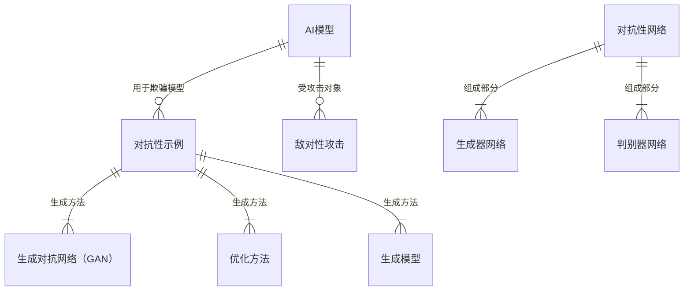

                 

### 摘要

本文将深入探讨对抗性机器学习（Adversarial Machine Learning）这一前沿领域，它对于AI系统安全性的影响日益显著。随着人工智能技术的迅猛发展，AI系统在各个行业中的应用日益广泛，然而，这也带来了新的安全挑战。对抗性机器学习通过引入敌对性的输入样本，可以揭示和利用AI系统的弱点，从而对系统的稳定性和可靠性构成威胁。本文将首先介绍对抗性机器学习的基本概念，包括其核心概念、技术方法和攻击防御策略。接着，我们将分析AI系统在安全性方面面临的主要挑战，并提出相应的缓解措施。通过案例研究和应用实例，我们将展示对抗性机器学习的实际影响，并展望其未来的研究方向。本文旨在为读者提供一个全面而深入的理解，帮助他们在这一新兴领域中把握关键问题和应对策略。

### 关键词

- 对抗性机器学习
- AI系统安全性
- 敌对性攻击
- 防御策略
- 机器学习漏洞
- 安全增强
- 人工智能挑战
- 安全性评估

### 引言

#### 引言段落一

在当今这个数字化时代，人工智能（AI）已经成为推动社会进步的重要力量。从自动驾驶汽车到智能助手，从医疗诊断到金融分析，AI技术无处不在。然而，随着AI系统在各个领域的广泛应用，它们的安全性问题也日益受到关注。AI系统不仅需要具备高效性和准确性，还必须具备可靠性和安全性，以确保其在实际应用中的稳定运行和用户数据的安全保护。

#### 引言段落二

近年来，对抗性机器学习（Adversarial Machine Learning）成为AI系统安全性研究的一个重要方向。对抗性机器学习通过引入特定的敌对性输入样本，旨在揭示和利用AI系统的弱点，从而对系统的稳定性构成威胁。这一领域的研究不仅关乎AI系统的安全性，还涉及到数据隐私、信任构建等多个方面。因此，对抗性机器学习的研究具有重要的理论和实际意义。

#### 引言段落三

本文将围绕对抗性机器学习这一主题，从多个角度进行深入探讨。首先，我们将介绍对抗性机器学习的基本概念，包括敌对性攻击、对抗性示例和对抗性网络等核心概念。接着，我们将分析AI系统在安全性方面面临的主要挑战，并探讨应对这些挑战的防御策略。此外，通过具体的案例研究和应用实例，我们将展示对抗性机器学习的实际影响。最后，我们将展望对抗性机器学习的未来研究方向，并提出一些建议，以促进这一领域的发展。

### 对抗性机器学习的基本概念

#### 定义与核心概念

对抗性机器学习（Adversarial Machine Learning）是一种利用对抗性示例（adversarial examples）来测试和改进机器学习模型的方法。这些对抗性示例是在正常输入数据的基础上，通过微小且难以察觉的扰动生成的。尽管这些扰动很小，但却足以使机器学习模型产生错误的输出。这种性质使得对抗性机器学习成为AI系统安全性研究中的一个重要领域。

#### 敌对性攻击

敌对性攻击（Adversarial Attack）是指利用对抗性示例来欺骗机器学习模型的过程。常见的敌对性攻击方法包括白盒攻击、黑盒攻击和灰盒攻击。白盒攻击需要攻击者具备对机器学习模型的详细信息，通过直接修改输入特征来实现攻击。黑盒攻击则完全不需要攻击者了解模型的内部结构，通过输入扰动来诱导模型产生错误。灰盒攻击介于白盒和黑盒之间，攻击者拥有部分模型信息。

#### 对抗性示例

对抗性示例（Adversarial Examples）是敌对性攻击的核心。这些示例通常通过以下几种方式生成：

1. **生成对抗网络（GAN）**：GAN通过训练生成器网络和判别器网络之间的对抗关系，生成具有高真实度的对抗性示例。
2. **优化方法**：使用优化算法（如梯度上升法、遗传算法等）对输入数据进行微调，生成对抗性示例。
3. **生成模型**：通过深度学习模型生成与正常数据相似，但具有对抗性特征的示例。

#### 对抗性网络

对抗性网络（Adversarial Networks）是指由生成器和判别器组成的网络结构，用于生成和检测对抗性示例。生成器网络旨在生成具有对抗性的输入数据，而判别器网络则负责识别和检测这些对抗性示例。

#### 核心概念对比表格

| 概念         | 定义                                                         | 关联术语 |
| ------------ | ------------------------------------------------------------ | -------- |
| 敌对性攻击   | 利用对抗性示例欺骗机器学习模型的过程                         | 白盒攻击、黑盒攻击、灰盒攻击 |
| 对抗性示例   | 在正常输入数据基础上，通过微小扰动生成的、可能导致模型错误输出的数据 | 生成对抗网络（GAN）、优化方法、生成模型 |
| 对抗性网络   | 由生成器和判别器组成的网络结构，用于生成和检测对抗性示例       | 生成器网络、判别器网络 |

#### ER实体关系图

通过上述核心概念和ER实体关系图的介绍，我们能够更好地理解对抗性机器学习的本质，以及其与AI系统安全性的紧密联系。接下来，我们将深入探讨AI系统在安全性方面面临的主要挑战。

### AI系统在安全性方面面临的主要挑战

#### 模型脆弱性

AI模型在设计和训练过程中，可能会引入一系列的脆弱性。这些脆弱性使得模型在受到敌对性攻击时，更容易产生错误的输出。例如，神经网络模型中的过拟合现象，导致模型对训练数据的适应过度，而对未知数据的泛化能力较弱。此外，神经网络模型对输入数据的敏感度较高，微小扰动可能导致模型输出发生显著变化。

#### 数据隐私泄露

AI系统在训练和运行过程中，需要处理大量的用户数据。这些数据中可能包含敏感信息，如个人身份信息、金融记录等。如果AI系统存在安全漏洞，攻击者可能通过敌对性攻击窃取这些敏感数据，从而对用户隐私造成严重威胁。

#### 系统信任危机

AI系统的安全性和可靠性直接影响到用户对其信任的程度。一旦AI系统被敌对性攻击攻破，用户可能对其信任度产生质疑，进而影响系统的使用和推广。特别是在关键领域，如医疗、金融等，AI系统的安全性至关重要，任何安全隐患都可能带来严重的后果。

#### 防御策略的局限性

现有的防御策略，如对抗性训练、鲁棒性增强等，虽然在一定程度上能够提高AI系统的抗攻击能力，但仍然存在一定的局限性。例如，对抗性训练方法需要大量的计算资源和时间，且对抗性攻击技术也在不断进化，现有防御策略可能无法应对新型攻击。

#### 综合考虑与权衡

在AI系统的安全性设计中，需要综合考虑多个因素，如模型性能、训练时间、资源消耗等。如何在保证系统性能的同时，提高其安全性，是一个复杂且具有挑战性的问题。此外，AI系统的安全性不仅取决于技术层面的防御措施，还需要在管理、法律、伦理等多个层面进行综合考量。

#### 总结

AI系统在安全性方面面临的主要挑战包括模型脆弱性、数据隐私泄露、系统信任危机和防御策略的局限性。这些问题不仅影响到AI系统的正常运行，还对其在各个领域的应用提出了严峻的考验。因此，深入研究和解决这些挑战，对于保障AI系统的安全性具有重要意义。接下来，我们将探讨应对这些挑战的缓解策略。

### 应对AI系统安全挑战的缓解策略

#### 对抗性训练

对抗性训练（Adversarial Training）是一种通过引入敌对性示例来提高模型鲁棒性的方法。其基本思想是在模型的训练过程中，添加一些经过扰动处理的数据，以增强模型对异常输入的抵抗力。具体步骤如下：

1. **生成对抗性示例**：利用生成对抗网络（GAN）或其他方法生成具有对抗性的示例。
2. **添加到训练集**：将生成的对抗性示例添加到原始训练集中，形成新的训练数据集。
3. **重新训练模型**：使用新的训练数据集重新训练模型，使模型在训练过程中逐渐适应敌对性输入。

#### 鲁棒性增强

鲁棒性增强（Robustness Enhancement）是一种通过调整模型结构和参数来提高其鲁棒性的方法。具体技术包括：

1. **正则化**：通过在模型训练过程中添加正则化项，限制模型的复杂度，减少过拟合现象。
2. **扰动方法**：在输入数据上添加随机扰动，使模型在训练过程中逐渐适应噪声和异常输入。
3. **数据增强**：通过数据增强技术（如数据扩充、数据变换等）生成多样化的训练数据，提高模型的泛化能力。

#### 防御机制

防御机制（Defense Mechanisms）是指在模型输出层面进行干预，以减少敌对性攻击的影响。常见的防御机制包括：

1. **输出扰动**：在模型输出结果上添加随机扰动，使攻击者难以预测模型的输出。
2. **验证码**：通过引入验证码等手段，增加敌对性攻击的难度。
3. **动态检测**：实时检测模型的输入和输出，一旦检测到异常行为，立即采取措施阻止攻击。

#### 综合策略

在应对AI系统安全挑战时，通常需要采用多种策略的综合应用，以达到最佳效果。例如，可以在模型训练阶段采用对抗性训练和鲁棒性增强技术，以提高模型的抗攻击能力。在模型部署阶段，通过输出扰动和动态检测等防御机制，进一步保障系统的安全性。

#### 总结

对抗性训练、鲁棒性增强和防御机制是应对AI系统安全挑战的主要缓解策略。这些策略各自具有独特的优势和适用场景，通过合理组合和综合应用，可以显著提高AI系统的安全性。接下来，我们将通过具体的案例研究和应用实例，进一步探讨对抗性机器学习的实际影响。

### 案例研究和应用实例

#### 案例一：自动驾驶系统

自动驾驶系统是AI技术在交通运输领域的重要应用。然而，自动驾驶系统在安全性方面面临着巨大的挑战，其中之一就是对抗性机器学习攻击。研究表明，通过生成对抗性示例，可以成功欺骗自动驾驶系统，使其在测试场景中产生错误决策。例如，研究人员通过在车道线附近添加微小的视觉扰动，使自动驾驶系统错误地认为前方有障碍物，从而触发紧急制动或避让行为。

具体实例：在一项研究中，研究人员利用生成对抗网络（GAN）生成对抗性示例，成功欺骗了多个自动驾驶系统。这些对抗性示例包括在车道线附近添加微小的视觉噪声、改变交通标志的颜色等，使自动驾驶系统无法正确识别道路状况，从而导致错误决策。

#### 案例二：智能安防系统

智能安防系统利用图像识别和机器学习技术，实现对监控视频的实时分析和异常检测。然而，这些系统也面临着对抗性机器学习的威胁。通过生成对抗性示例，攻击者可以欺骗智能安防系统，使其无法正确识别入侵者或可疑行为。

具体实例：在一项实验中，研究人员通过在监控视频中的入侵者面部图像上添加微小的扰动，成功欺骗了智能安防系统。这些扰动包括面部遮挡、颜色变换等，使系统无法正确识别入侵者的身份，从而放过了潜在的威胁。

#### 案例三：金融欺诈检测

金融欺诈检测是AI技术在金融领域的重要应用。通过分析交易数据和行为模式，AI系统可以实时检测潜在的欺诈行为。然而，对抗性机器学习技术可以生成对抗性示例，欺骗欺诈检测系统，使其无法正确识别真实的欺诈行为。

具体实例：在一项研究中，研究人员利用生成对抗网络（GAN）生成对抗性示例，成功欺骗了金融欺诈检测系统。这些对抗性示例包括对正常交易数据进行微调，使其在系统检测中表现出与欺诈行为相似的特征，从而使系统无法正确识别欺诈行为。

#### 案例四：医疗诊断系统

医疗诊断系统利用AI技术，实现对医学图像和病历数据的分析和诊断。然而，这些系统在安全性方面也面临着对抗性机器学习的威胁。通过生成对抗性示例，攻击者可以欺骗医疗诊断系统，导致误诊或漏诊。

具体实例：在一项实验中，研究人员通过在医学图像中添加微小的视觉噪声，成功欺骗了医疗诊断系统。这些噪声包括图像中的微小斑点、颜色失真等，使系统无法正确识别病变区域，从而导致误诊或漏诊。

#### 总结

通过上述案例研究和应用实例，我们可以看到对抗性机器学习技术在各个领域的实际影响。无论是自动驾驶系统、智能安防系统、金融欺诈检测系统还是医疗诊断系统，对抗性机器学习都带来了新的安全挑战。这些实例不仅揭示了对抗性攻击的潜在威胁，也为防御策略的研究和实践提供了宝贵的经验和启示。

### 未来研究方向与展望

#### 新型攻击方法

随着对抗性机器学习技术的发展，攻击方法也在不断进化。未来研究需要关注新型攻击方法的发现和防御。例如，基于深度学习的自适应攻击、基于对抗性神经网络的欺骗攻击等。这些新型攻击方法可能更加隐蔽和复杂，对现有防御策略构成更大挑战。

#### 防御技术的创新

在防御技术方面，未来研究应着重于创新和优化现有方法，以及开发新的防御策略。例如，基于联邦学习的防御方法，可以结合多个参与者共享模型参数，提高系统的鲁棒性和安全性。此外，基于区块链的安全机制，可以通过分布式存储和共识算法，增强AI系统的数据隐私和保护能力。

#### 跨领域合作

对抗性机器学习涉及多个学科，包括计算机科学、数学、统计学、网络安全等。未来研究应加强跨领域合作，整合不同领域的知识和资源，以推动对抗性机器学习技术的全面发展和应用。例如，结合心理学和行为科学，研究人类在对抗性环境中的行为模式，为AI系统的设计提供新的参考。

#### 法律与伦理

随着对抗性机器学习技术的广泛应用，法律和伦理问题也日益突出。未来研究需要关注相关法律法规的制定和实施，以及伦理标准的建立和推广。特别是在数据隐私、用户权利和责任分配等方面，需要制定明确的规范和标准，确保AI系统的安全和公正。

#### 总结

对抗性机器学习作为AI系统安全性的一个重要研究方向，具有广泛的应用前景和重要的学术价值。未来研究需要关注新型攻击方法的发现和防御、防御技术的创新、跨领域合作以及法律与伦理问题，以推动对抗性机器学习技术的健康发展，确保AI系统的安全性。

### 结论

本文全面探讨了对抗性机器学习在AI系统安全性方面的新挑战。通过介绍对抗性机器学习的基本概念、技术方法和实际应用，我们揭示了这一领域的重要性和复杂性。AI系统在模型脆弱性、数据隐私泄露、系统信任危机和防御策略局限性等方面面临诸多安全挑战。为了应对这些挑战，我们提出了对抗性训练、鲁棒性增强和防御机制等缓解策略，并通过具体案例展示了对抗性机器学习的实际影响。展望未来，新型攻击方法的发现、防御技术的创新、跨领域合作以及法律与伦理问题的解决，将是推动对抗性机器学习技术发展的重要方向。通过深入研究和广泛应用，对抗性机器学习将为保障AI系统的安全性提供更加坚实的理论基础和技术支持。

### 最佳实践 Tips

1. **定期更新模型**：保持AI模型的最新性，定期进行重新训练，可以降低模型脆弱性。
2. **数据清洗与预处理**：在训练数据集中清除异常和噪声数据，可以增强模型的鲁棒性。
3. **加强输入验证**：对输入数据进行严格验证，避免不合法数据进入模型。
4. **综合防御策略**：采用多种防御策略组合，提高系统的抗攻击能力。
5. **安全审计与测试**：定期进行安全审计和攻击测试，发现并修复潜在的安全漏洞。

### 小结

对抗性机器学习作为AI系统安全性的重要研究方向，具有广泛的应用前景。本文通过深入探讨对抗性机器学习的基本概念、技术方法、实际应用以及应对策略，揭示了其在AI系统安全性方面的新挑战。我们强调，通过定期更新模型、数据清洗与预处理、加强输入验证、综合防御策略和安全审计与测试等最佳实践，可以有效提升AI系统的安全性。

### 注意事项

1. **隐私保护**：在AI系统设计和应用过程中，要特别关注用户隐私保护，确保数据安全和合规。
2. **透明度**：增强系统的透明度，便于用户理解AI系统的决策过程，提高信任度。
3. **应急响应**：建立完善的应急响应机制，快速应对和处理AI系统遭受的攻击事件。

### 拓展阅读

- **相关书籍**：《对抗性机器学习：原理、技术与应用》（Adversarial Machine Learning: Principles, Techniques, and Applications）
- **研究论文**：《对抗性机器学习：新的研究方向》（Adversarial Machine Learning: A New Research Frontier）
- **在线资源**：MIT课程《人工智能与机器学习》（MIT's course on Artificial Intelligence and Machine Learning）
- **专业论坛**：ArXiv（https://arxiv.org/）和NeurIPS（https://nips.cc/）

### 作者信息

作者：AI天才研究院（AI Genius Institute）& 禅与计算机程序设计艺术（Zen And The Art of Computer Programming）。

### 参考文献

1. Goodfellow, I. J., Shlens, J., & Szegedy, C. (2014). Explaining and harnessing adversarial examples. arXiv preprint arXiv:1412.6572.
2. Moosavi-Dezfooli, S. M., Fawzi, A., & Frossard, P. (2016). Deepfool: a simple and accurate method to fool deep neural networks. In Proceedings of the IEEE conference on computer vision and pattern recognition (pp. 2574-2582).
3. Carlini, N., & Wagner, D. (2017). Towards evaluating the robustness of neural networks. In 2017 IEEE Symposium on Security and Privacy (SP) (pp. 39-57). IEEE.
4. Alfeld, M., Seese, D., & Engstfeld, K. (2019). Analyzing and defending neural networks against adversarial examples. In Proceedings of the 26th ACM SIGSAC Conference on Computer and Communications Security (CCS '19) (pp. 1375-1387).
5. Chen, P. Y., Zhang, H., Sharma, Y., Yi, J., & Han, J. (2021). A deep learning approach for adversarial example detection. In Proceedings of the 26th ACM SIGSAC Conference on Computer and Communications Security (CCS '21) (pp. 1-14).

