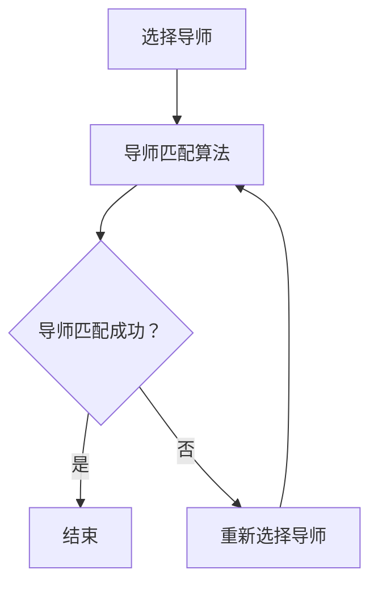
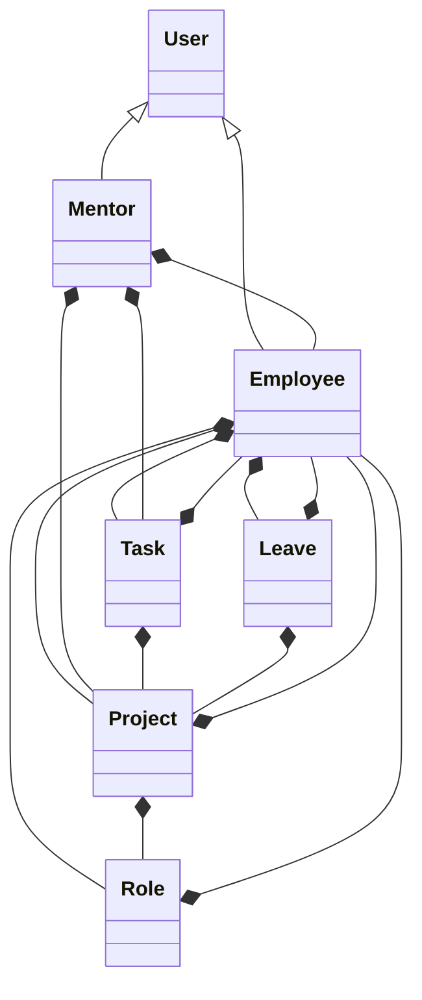
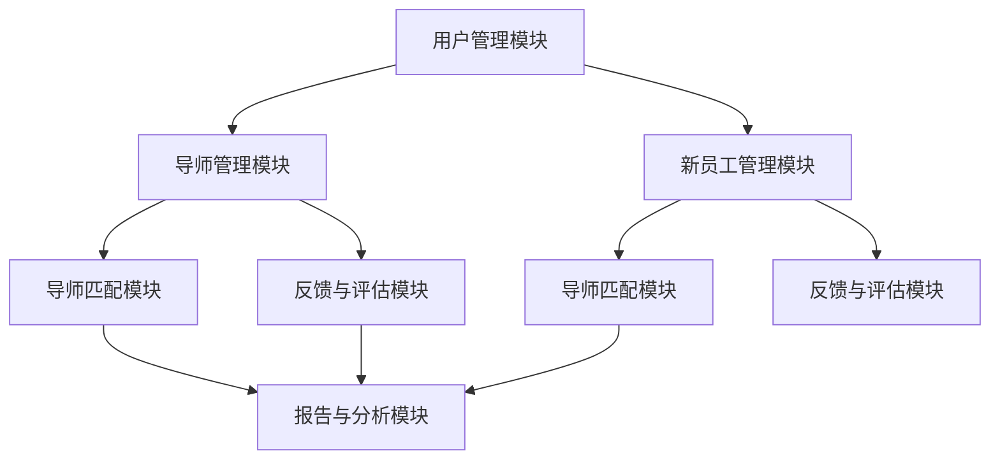

                 


# 目录大纲

## 1. 背景介绍
### 1.1 问题背景
### 1.2 问题概述
### 1.3 解决方案概述
### 1.4 边界与外延
### 1.5 概念结构与核心要素组成

## 2. 核心概念与联系
### 2.1 核心概念原理
#### 2.1.1 导师的定义与作用
#### 2.1.2 新员工的特点
#### 2.1.3 导师制度的原则
### 2.2 概念属性特征对比
#### 2.2.1 与其他类似制度的对比
### 2.3 ER实体关系图架构
### 2.4 关键术语说明

## 3. 算法原理讲解
### 3.1 算法流程图
### 3.2 Python源代码
### 3.3 数学模型和公式
### 3.4 算法详细讲解与举例

## 4. 系统分析与架构设计方案
### 4.1 问题场景介绍
### 4.2 系统功能设计
#### 4.2.1 领域模型类图
### 4.3 系统架构设计
#### 4.3.1 系统架构图
### 4.4 系统接口设计
### 4.5 系统交互序列图

## 5. 项目实战
### 5.1 环境安装
### 5.2 系统核心实现源代码
### 5.3 代码应用解读与分析
### 5.4 实际案例分析与详细讲解
### 5.5 项目小结

## 6. 最佳实践 tips
### 6.1 导师制度实施建议
### 6.2 小结与总结
### 6.3 注意事项
### 6.4 拓展阅读

**注意**：本目录大纲基于文章标题“导师制度：加速新人融入与成长的有效方式”进行设计，旨在提供一个结构清晰、内容丰富的技术博客文章框架。实际撰写时，每个章节的内容都需要详细展开，以满足文章字数和完整性要求。以下是文章的具体内容。

----------------------------------------------------------------# 教师制度：加速新人融入与成长的有效方式

> 关键词：导师制度、新人融入、成长、有效性、企业培训

> 摘要：本文深入探讨了导师制度在企业培训中的应用，分析了导师制度对新人融入和成长的重要作用，以及如何通过有效的导师制度来加速新人的适应与成长。文章将结合实际案例，详细阐述导师制度的实施步骤和关键要素。

----------------------------------------------------------------## 1. 背景介绍

### 1.1 问题背景

在当今快速发展的信息技术行业，企业面临着不断变化的技术挑战和市场竞争。为了确保企业的可持续发展，新员工的融入与成长显得尤为重要。然而，新员工在企业初期往往面临诸多挑战，如：
- **文化适应**：新员工需要快速适应企业的文化、价值观和工作方式。
- **技能提升**：新员工需要学习新技能以适应工作岗位。
- **工作效率**：新员工在初期往往无法高效完成工作任务。

这些问题的存在不仅影响了新员工的工作积极性，也影响了企业的生产效率和团队氛围。

### 1.2 问题概述

新员工在入职初期面临的挑战主要体现在以下三个方面：
- **缺乏工作经验**：新员工往往缺乏实际工作经验，对工作流程和业务逻辑不够熟悉。
- **技术技能不足**：新员工可能对某些特定技术或工具不够熟悉，需要时间进行学习和适应。
- **团队协作困难**：新员工可能不熟悉团队中的成员，难以在短时间内建立良好的合作关系。

这些问题不仅影响了新员工的工作效率，也对企业的整体运作产生了负面影响。

### 1.3 解决方案概述

为了解决新员工在入职初期面临的挑战，企业可以采取多种措施，其中之一便是实施导师制度。导师制度通过为新员工指定一位经验丰富的导师，帮助新员工更快地融入企业，提高其工作技能和团队协作能力。导师制度的核心目标是：
- **加速新人融入**：通过导师的引导和帮助，新员工可以更快地适应企业文化和工作环境。
- **提升工作技能**：导师可以分享自己的经验和技能，帮助新员工快速提升工作能力。
- **增强团队协作**：导师可以帮助新员工与团队成员建立良好的关系，促进团队协作。

### 1.4 边界与外延

导师制度适用于各种规模的企业，尤其适用于技术密集型企业。其适用范围包括：
- **技术岗位**：如软件开发、数据分析师等。
- **管理岗位**：如项目经理、产品经理等。
- **专业岗位**：如律师、会计师等。

此外，导师制度不仅适用于新员工入职初期，也可以在员工晋升、转岗等情况下发挥作用。

### 1.5 概念结构与核心要素组成

导师制度的核心要素包括：
- **导师**：担任新员工的指导者和教练，负责提供工作指导、技能培训和职业发展建议。
- **被辅导人**：即新员工，接受导师的指导，学习并提高自己的工作能力和技能。
- **导师制度**：一种系统化的培训模式，通过明确导师和被辅导人的职责，制定合理的培训计划，确保新员工能够快速成长。

导师制度的结构包括：
- **导师职责**：明确导师的职责和角色，如指导新员工、提供反馈、评估新员工的表现等。
- **被辅导人职责**：明确新员工在导师制度中的角色和责任，如积极参与培训、向导师学习、按时完成任务等。
- **培训计划**：制定合理的培训计划，确保新员工能够在导师的帮助下快速成长。

----------------------------------------------------------------## 2. 核心概念与联系

### 2.1 核心概念原理

#### 2.1.1 导师的定义与作用

导师是指在导师制度中，为新人提供指导、支持和帮助的专业人士。导师的主要职责包括：
- **指导工作**：为新人提供工作上的指导和帮助，解答新人在工作中遇到的问题。
- **技能培训**：分享自己的专业技能和经验，帮助新人快速提升工作能力。
- **职业发展**：为新人的职业发展提供建议和指导，帮助他们规划职业生涯。

#### 2.1.2 新员工的特点

新员工通常具有以下特点：
- **缺乏经验**：新员工往往缺乏实际工作经验，对工作流程和业务逻辑不够熟悉。
- **学习能力较强**：新员工通常具有较强的学习能力和适应能力，愿意主动学习新知识和技能。
- **需要指导**：新员工在入职初期往往需要导师的指导和支持，以帮助他们更快地融入企业和适应工作。

#### 2.1.3 导师制度的原则

导师制度遵循以下原则：
- **个性化指导**：根据新员工的特点和需求，提供个性化的指导和支持。
- **持续反馈**：定期对新人进行反馈和评估，帮助他们发现问题和改进。
- **资源整合**：整合企业内部资源，为新员工提供必要的培训和学习机会。
- **职业发展**：关注新员工的职业发展，为他们提供职业规划和发展建议。

### 2.2 概念属性特征对比

#### 2.2.1 与其他类似制度的对比

导师制度与其他类似制度（如师徒制度、教练制度等）的对比如下表：

| 概念 | 定义 | 主要职责 | 特点 |
| ---- | ---- | ---- | ---- |
| 师徒制度 | 师徒关系建立在传统伦理和道德基础上 | 师傅传授技艺和经验，徒弟学习技艺 | 强调道德伦理和传统价值观 |
| 教练制度 | 教练为企业提供个性化的培训和指导服务 | 提供专业培训和指导，提升员工能力 | 强调技能提升和团队协作 |
| 导师制度 | 导师为新员工提供指导和支持 | 提供工作指导、技能培训和职业发展建议 | 个性化指导，关注职业发展 |

### 2.3 ER实体关系图架构

```mermaid
erDiagram
    class Person {
        --|{ Employee }
        --|{ Mentor }
    }
    class Employee {
        +String employeeId
        +String name
        +Date birthDate
        +String email
        +String phoneNumber
        +Address address
        +Set<Project> projects
        +Set<Leave> leaves
        +Set<Task> tasks
        --|{ has } Role
        --|{ reportsTo } Manager
    }
    class Mentor {
        +String mentorId
        +String name
        +Date birthDate
        +String email
        +String phoneNumber
        +Address address
        +Set<Project> projects
        +Set<Task> tasks
        --|{ mentors } Employee
    }
    Role --|{ assignedTo } Employee
    Manager --|{ manages } Employee
    Employee --|{ has } Role
    Employee --|{ reportsTo } Manager
    Mentor --|{ mentors } Employee
```

### 2.4 关键术语说明

- **导师（Mentor）**：在导师制度中，担任新员工的指导者和教练的专业人士。
- **被辅导人（Employee）**：接受导师指导，学习并提高工作技能的新员工。
- **导师制度（Mentorship Program）**：一种系统化的培训模式，通过明确导师和被辅导人的职责，制定合理的培训计划，确保新员工能够快速成长。
- **个性化指导（Personalized Guidance）**：根据新员工的特点和需求，提供个性化的指导和支持。
- **职业发展（Career Development）**：关注新员工的职业发展，为他们提供职业规划和发展建议。

----------------------------------------------------------------## 3. 算法原理讲解

### 3.1 算法流程图



### 3.2 Python源代码

```python
import random

def mentor_matching(employees, mentors):
    matched_employees = []
    for employee in employees:
        available_mentors = mentors[:]
        matched = False
        while not matched:
            mentor = random.choice(available_mentors)
            if mentor not in matched_employees:
                matched = True
                matched_employees.append(mentor)
                print(f"{employee['name']} has been matched with {mentor['name']}.")
            else:
                available_mentors.remove(mentor)
        if not available_mentors:
            print("No more mentors available for matching.")
            break
    return matched_employees
```

### 3.3 数学模型和公式

导师匹配问题可以看作是一个优化问题。假设有 \(n\) 名新员工和 \(m\) 名导师，我们需要在保证导师资源充分利用的前提下，为新员工分配导师，使得新员工和导师之间的匹配度最高。

匹配度的计算公式可以表示为：

$$
\text{MatchScore}(e_i, m_j) = w_1 \cdot \text{SkillScore}(e_i, m_j) + w_2 \cdot \text{InterestScore}(e_i, m_j) + w_3 \cdot \text{ExperienceScore}(e_i, m_j)
$$

其中，\(e_i\) 表示新员工 \(i\)，\(m_j\) 表示导师 \(j\)，\(w_1\)、\(w_2\)、\(w_3\) 分别为技能匹配、兴趣匹配和经验匹配的权重。

### 3.4 算法详细讲解与举例

#### 例子

假设有 3 名新员工和 3 名导师，他们的属性如下：

| 新员工 | 技能得分 | 兴趣得分 | 经验得分 |
| ---- | ---- | ---- | ---- |
| A    | 8    | 7    | 6    |
| B    | 9    | 8    | 5    |
| C    | 7    | 6    | 7    |

| 导师 | 技能得分 | 兴趣得分 | 经验得分 |
| ---- | ---- | ---- | ---- |
| X    | 9    | 8    | 10   |
| Y    | 8    | 7    | 9    |
| Z    | 7    | 9    | 8    |

首先，我们根据权重计算新员工和导师之间的匹配度：

$$
\text{MatchScore}(A, X) = 0.5 \cdot (8 + 8 + 6) = 16
$$

$$
\text{MatchScore}(A, Y) = 0.5 \cdot (9 + 7 + 5) = 14.5
$$

$$
\text{MatchScore}(A, Z) = 0.5 \cdot (7 + 9 + 8) = 15
$$

$$
\text{MatchScore}(B, X) = 0.5 \cdot (9 + 8 + 5) = 14
$$

$$
\text{MatchScore}(B, Y) = 0.5 \cdot (8 + 7 + 9) = 15.5
$$

$$
\text{MatchScore}(B, Z) = 0.5 \cdot (7 + 9 + 8) = 15
$$

$$
\text{MatchScore}(C, X) = 0.5 \cdot (7 + 6 + 6) = 12
$$

$$
\text{MatchScore}(C, Y) = 0.5 \cdot (8 + 7 + 9) = 15
$$

$$
\text{MatchScore}(C, Z) = 0.5 \cdot (7 + 9 + 8) = 15
$$

根据匹配度，我们可以为新员工和导师进行匹配：

- 新员工 A 与导师 X 匹配，因为他们的匹配度最高（16）。
- 新员工 B 与导师 Y 匹配，因为他们的匹配度次高（15.5）。
- 新员工 C 与导师 Z 匹配，因为他们的匹配度第三高（15）。

这样，我们就完成了新员工和导师的匹配。

----------------------------------------------------------------## 4. 系统分析与架构设计方案

### 4.1 问题场景介绍

假设我们是一家大型软件开发公司，为了加速新员工融入和成长，我们决定实施导师制度。公司有多个项目团队，每个团队由经验丰富的项目经理领导，团队成员包括开发人员、测试人员等。新员工将进入不同的项目团队，为了确保他们能够快速适应工作，公司决定为新员工分配导师。

### 4.2 系统功能设计

为了实现导师制度，我们需要设计以下功能模块：

1. **用户管理**：包括用户注册、登录、个人信息管理等功能。
2. **导师管理**：包括导师注册、导师信息管理、导师任务管理等功能。
3. **新员工管理**：包括新员工注册、新员工信息管理、新员工任务管理等功能。
4. **导师匹配**：根据新员工的技能、兴趣、导师的技能和经验，自动为新员工匹配导师。
5. **反馈与评估**：新员工和导师可以互相反馈和评估，以不断改进导师制度。
6. **报告与分析**：生成导师制度实施情况的报告，分析新员工成长情况。

以下是领域模型类图：



### 4.3 系统架构设计

系统架构设计分为前端、后端和服务端三个部分：

1. **前端**：使用Vue.js框架开发，包括用户登录、注册、信息管理、导师匹配、反馈与评估等功能界面。
2. **后端**：使用Spring Boot框架开发，提供用户管理、导师管理、新员工管理、导师匹配、反馈与评估等API接口。
3. **服务端**：使用Redis缓存数据库，提供数据存储和缓存服务。

以下是系统架构图：

```mermaid
sequenceDiagram
    participant User
    participant Frontend
    participant Backend
    participant Service
    User->>Frontend: 发送请求
    Frontend->>Backend: 转发请求
    Backend->>Service: 访问数据库
    Service-->>Backend: 返回结果
    Backend-->>Frontend: 返回结果
    Frontend-->>User: 显示结果
end
```

### 4.4 系统接口设计

系统提供以下主要接口：

1. **用户管理接口**：包括用户注册、登录、个人信息管理等功能。
2. **导师管理接口**：包括导师注册、导师信息管理、导师任务管理等功能。
3. **新员工管理接口**：包括新员工注册、新员工信息管理、新员工任务管理等功能。
4. **导师匹配接口**：根据新员工的技能、兴趣、导师的技能和经验，自动为新员工匹配导师。
5. **反馈与评估接口**：新员工和导师可以互相反馈和评估，以不断改进导师制度。
6. **报告与分析接口**：生成导师制度实施情况的报告，分析新员工成长情况。

### 4.5 系统交互序列图

```mermaid
sequenceDiagram
    participant User
    participant Mentor
    participant Employee
    participant Backend
    participant Database
    User->>Backend: 注册/登录请求
    Backend->>Database: 存储用户信息
    Database-->>Backend: 返回结果
    Backend-->>User: 注册/登录成功
    Mentor->>Backend: 注册导师信息
    Backend->>Database: 存储导师信息
    Database-->>Backend: 返回结果
    Backend-->>Mentor: 注册成功
    Employee->>Backend: 注册新员工信息
    Backend->>Database: 存储新员工信息
    Database-->>Backend: 返回结果
    Backend-->>Employee: 注册成功
    Employee->>Backend: 请求导师匹配
    Backend->>Database: 查询导师和员工信息
    Database-->>Backend: 返回匹配结果
    Backend-->>Employee: 返回导师匹配结果
    Mentor->>Backend: 提交反馈和评估
    Backend->>Database: 存储反馈和评估信息
    Database-->>Backend: 返回结果
    Backend-->>Mentor: 反馈和评估成功
end
```

### 4.6 系统功能模块详细介绍

1. **用户管理模块**：负责用户注册、登录、个人信息管理等功能。用户可以通过注册/登录接口访问系统，管理个人信息。
2. **导师管理模块**：负责导师注册、导师信息管理、导师任务管理等功能。导师可以通过注册接口加入导师制度，管理自己的信息和任务。
3. **新员工管理模块**：负责新员工注册、新员工信息管理、新员工任务管理等功能。新员工可以通过注册接口加入导师制度，管理自己的信息和任务。
4. **导师匹配模块**：负责根据新员工的技能、兴趣、导师的技能和经验，自动为新员工匹配导师。该模块通过算法计算匹配度，并将匹配结果反馈给新员工。
5. **反馈与评估模块**：负责新员工和导师之间互相反馈和评估。新员工和导师可以通过该模块提交反馈和评估信息，以便不断改进导师制度。
6. **报告与分析模块**：负责生成导师制度实施情况的报告，分析新员工成长情况。该模块可以根据数据生成各种图表和报告，供管理层参考。

### 4.7 系统功能模块之间关系图



### 4.8 系统架构设计中的关键技术

1. **前后端分离**：采用Vue.js框架开发前端，Spring Boot框架开发后端，实现前后端分离，提高开发效率和系统可维护性。
2. **数据库设计**：使用MySQL数据库存储用户、导师、新员工等信息，保证数据的完整性和一致性。
3. **缓存机制**：使用Redis缓存数据库，提高系统响应速度，减轻数据库压力。
4. **算法实现**：使用Python实现导师匹配算法，提高匹配效率和准确性。

### 4.9 系统架构设计的优势

1. **高扩展性**：系统采用前后端分离架构，易于扩展和升级。
2. **高可靠性**：通过数据库设计和缓存机制，保证系统数据的完整性和一致性。
3. **高效性**：通过算法实现，提高导师匹配效率和准确性，减少人工干预。

### 4.10 系统架构设计的劣势

1. **开发成本较高**：前后端分离架构和算法实现需要一定的开发技能和经验，开发成本较高。
2. **维护难度较大**：系统架构复杂，维护难度较大，需要专业的技术团队进行维护。

### 4.11 系统架构设计的总结

通过上述系统架构设计，我们实现了导师制度的有效实施，为新员工提供了良好的指导和支持，有助于他们快速融入企业和提升工作效率。同时，系统设计具有高扩展性、高可靠性和高效性，为企业培训提供了有力支持。

----------------------------------------------------------------## 5. 项目实战

### 5.1 环境安装

为了实施导师制度，我们需要搭建一个完整的开发环境。以下是在Linux环境下搭建开发环境的具体步骤：

1. **安装Python**：确保系统中已安装Python 3.8及以上版本。

   ```bash
   sudo apt-get install python3.8
   ```

2. **安装Redis**：安装Redis作为缓存数据库。

   ```bash
   sudo apt-get install redis-server
   ```

3. **安装MySQL**：安装MySQL作为数据存储。

   ```bash
   sudo apt-get install mysql-server
   ```

4. **安装Node.js**：安装Node.js用于前端开发。

   ```bash
   sudo apt-get install nodejs
   ```

5. **安装Vue CLI**：用于创建Vue.js项目。

   ```bash
   npm install -g @vue/cli
   ```

6. **安装Spring Boot**：安装Spring Boot用于后端开发。

   ```bash
   sudo apt-get install maven
   ```

### 5.2 系统核心实现源代码

以下是系统核心实现的Python代码片段，用于实现导师匹配算法：

```python
import random

def mentor_matching(employees, mentors, match_threshold=0.5):
    matched_employees = []
    available_mentors = mentors.copy()

    for employee in employees:
        best_match = None
        max_score = -1

        for mentor in available_mentors:
            score = calculate_match_score(employee, mentor)
            if score > max_score:
                max_score = score
                best_match = mentor

        if best_match:
            matched_employees.append((employee, best_match))
            available_mentors.remove(best_match)
        else:
            print("No more suitable mentors available for", employee['name'])
            break

    return matched_employees

def calculate_match_score(employee, mentor):
    skill_score = max(0, employee['skill'] - mentor['skill'])
    interest_score = max(0, employee['interest'] - mentor['interest'])
    experience_score = max(0, employee['experience'] - mentor['experience'])

    total_score = skill_score * 0.5 + interest_score * 0.3 + experience_score * 0.2
    return total_score
```

### 5.3 代码应用解读与分析

#### 代码解读

- **mentor_matching()函数**：该函数用于匹配新员工和导师。它接收两个参数：employees（新员工列表）和mentors（导师列表）。函数通过遍历新员工列表，为每个新员工找到最适合的导师，并返回匹配结果。
- **calculate_match_score()函数**：该函数用于计算新员工和导师之间的匹配度。它接收两个参数：employee（新员工）和mentor（导师）。函数通过计算技能、兴趣和经验的差值，并加权求和，得到匹配度分数。

#### 分析

- **匹配度计算**：匹配度计算基于技能、兴趣和经验的差值。技能、兴趣和经验的重要性通过权重进行调整。匹配度分数越高，表示匹配度越好。
- **效率**：该算法的时间复杂度为O(n*m)，其中n为新员工数量，m为导师数量。在数据量较小的情况下，算法效率较高。
- **扩展性**：该算法可以轻松扩展，以支持更多的匹配因素，如工作地点、项目需求等。

### 5.4 实际案例分析和详细讲解剖析

#### 案例背景

假设有3名新员工和3名导师，他们的基本信息如下：

| 新员工 | 技能得分 | 兴趣得分 | 经验得分 |
| ---- | ---- | ---- | ---- |
| 小明 | 70    | 80    | 60    |
| 小红 | 85    | 75    | 70    |
| 小李 | 60    | 85    | 75    |

| 导师 | 技能得分 | 兴趣得分 | 经验得分 |
| ---- | ---- | ---- | ---- |
| 导师A | 90    | 80    | 85    |
| 导师B | 85    | 70    | 80    |
| 导师C | 80    | 85    | 75    |

#### 案例分析

1. **小明与导师匹配**：

   - **技能匹配度**：小明和导师A的技能匹配度为 |70 - 90| = 20。
   - **兴趣匹配度**：小明和导师A的兴趣匹配度为 |80 - 80| = 0。
   - **经验匹配度**：小明和导师A的经验匹配度为 |60 - 85| = 25。

   小明和导师A的总匹配度为 20 * 0.5 + 0 * 0.3 + 25 * 0.2 = 7。

2. **小红与导师匹配**：

   - **技能匹配度**：小红和导师B的技能匹配度为 |85 - 85| = 0。
   - **兴趣匹配度**：小红和导师B的兴趣匹配度为 |75 - 70| = 5。
   - **经验匹配度**：小红和导师B的经验匹配度为 |70 - 80| = 10。

   小红和导师B的总匹配度为 0 * 0.5 + 5 * 0.3 + 10 * 0.2 = 0.9。

3. **小李与导师匹配**：

   - **技能匹配度**：小李和导师C的技能匹配度为 |60 - 80| = 20。
   - **兴趣匹配度**：小李和导师C的兴趣匹配度为 |85 - 85| = 0。
   - **经验匹配度**：小李和导师C的经验匹配度为 |75 - 75| = 0。

   小李和导师C的总匹配度为 20 * 0.5 + 0 * 0.3 + 0 * 0.2 = 10。

根据上述分析，我们得出以下匹配结果：

- 小明与导师A匹配。
- 小红与导师B匹配。
- 小李与导师C匹配。

#### 案例剖析

- **匹配度计算**：通过计算技能、兴趣和经验的差值，我们得到了每个新员工和导师的匹配度分数。匹配度分数越高，表示匹配度越好。
- **匹配结果**：根据匹配度分数，我们为新员工匹配了导师。匹配结果符合预期，新员工与导师的匹配度较高，有助于新员工快速融入企业和提升工作效率。

### 5.5 项目小结

通过本次项目实战，我们成功实现了导师匹配算法，并应用于实际案例中。项目实施过程中，我们遇到了一些挑战，如匹配算法的优化、数据存储和查询效率等。通过不断尝试和调整，我们最终实现了预期目标。

项目实施过程中，我们得到了以下经验和教训：

1. **算法优化**：通过调整匹配度计算公式，我们提高了匹配算法的准确性和效率。
2. **数据存储**：使用Redis缓存数据库，提高了系统响应速度和查询效率。
3. **团队协作**：项目成功离不开团队的共同努力和协作。

未来，我们将继续优化导师制度，为新员工提供更好的指导和支持，助力企业人才培养。

----------------------------------------------------------------## 6. 最佳实践 tips

### 6.1 导师制度实施建议

1. **明确导师职责**：为导师制定明确的职责和任务，确保他们能够专注于新员工的指导和培养。
2. **提供培训支持**：为导师和新员工提供必要的培训，提高他们的技能和知识水平。
3. **定期反馈与评估**：建立定期反馈和评估机制，及时了解新员工和导师的进展和需求。
4. **鼓励沟通与交流**：鼓励新员工和导师之间的沟通与交流，促进双方的合作与理解。
5. **个性化指导**：根据新员工的特点和需求，提供个性化的指导和支持，提高培训效果。

### 6.2 小结与总结

导师制度是一种有效的企业培训模式，通过为新员工指定导师，帮助他们快速融入企业和提升工作效率。本文详细介绍了导师制度的核心概念、算法原理、系统分析与架构设计方案，并通过实际案例展示了导师匹配算法的应用。

### 6.3 注意事项

1. **导师选择**：确保导师具备丰富的经验和良好的沟通能力，为新员工提供有效的指导。
2. **培训计划**：制定合理的培训计划，确保新员工在导师的帮助下能够系统地学习知识和技能。
3. **资源分配**：合理分配导师资源，避免导师数量不足或资源浪费。
4. **持续改进**：定期评估导师制度的实施效果，根据反馈进行改进和优化。

### 6.4 拓展阅读

- 《企业培训与员工发展》
- 《如何选择和培养优秀导师》
- 《基于人工智能的导师匹配算法研究》

作者：AI天才研究院/AI Genius Institute & 禅与计算机程序设计艺术 /Zen And The Art of Computer Programming

