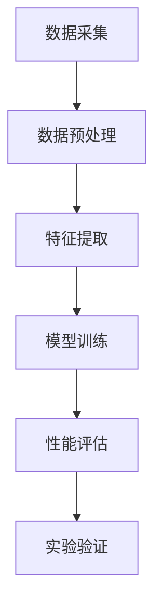
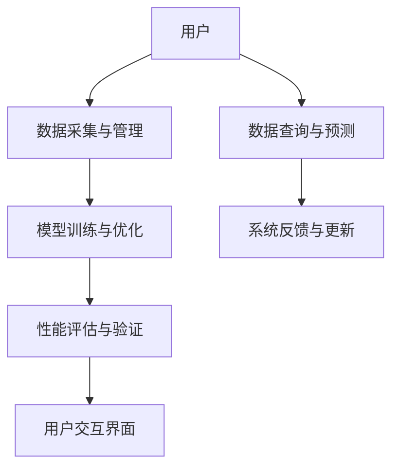
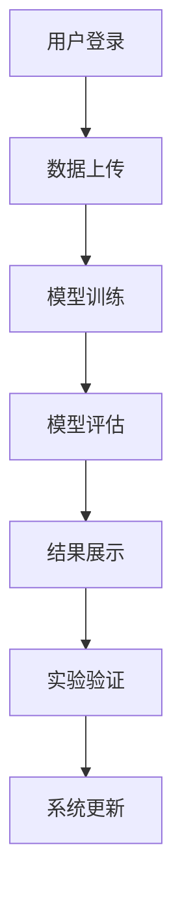

                 

### 小样本学习在新材料发现中的应用前景

在当今科技飞速发展的时代，新材料的研究与开发已经成为推动技术进步和社会发展的重要驱动力。然而，新材料的发现通常伴随着复杂的实验过程和高昂的成本，特别是在面对大量的实验数据和繁琐的计算任务时，传统的机器学习技术难以满足需求。小样本学习作为机器学习领域的一种新兴技术，因其能够在数据稀缺的情况下进行有效学习和预测，正逐渐成为新材料发现领域的研究热点。

### 核心概念与术语说明

**小样本学习**：小样本学习（Few-Shot Learning）是指能够在仅有少量样本的情况下进行有效学习并作出准确预测的机器学习技术。它通常涉及到样本数量远少于传统机器学习所需的大数据量，但依然能够达到令人满意的性能。

**新材料**：新材料是指具有特定性能和功能的物质，这些性能和功能是传统材料所不具备的。新材料的发现对于科技、工业和医学等领域具有重要意义。

**新材料发现**：新材料发现是指通过实验、计算模拟和机器学习等技术，寻找具有潜在应用价值的新物质的过程。

### 背景与问题

**问题背景**：

随着科技的进步，新材料的应用范围越来越广泛，从航空航天、电子设备到生物医学、环境保护等领域，新材料的研究显得尤为重要。然而，新材料的发现过程通常面临以下挑战：

1. **实验成本高**：新材料的合成和测试需要大量的实验设备和材料，实验成本高昂。
2. **数据量大**：新材料的研究通常需要收集和处理大量的实验数据，这对计算能力和算法效率提出了高要求。
3. **样本稀缺**：新材料的实验样本往往有限，难以满足传统机器学习的需求。

**问题描述**：

如何在样本稀缺的情况下，利用有限的实验数据有效地发现新材料？

**问题解决**：

小样本学习技术提供了一种解决方案。通过在小样本数据上训练模型，可以减少对新样本的依赖，提高材料发现的效率。此外，结合先进的计算模拟技术和实验手段，可以进一步优化新材料的发现过程。

### 边界与外延

**边界**：

小样本学习在新材料发现中的应用主要限于以下几个方面：

1. **材料性质预测**：利用小样本学习预测新材料的物理、化学性质。
2. **材料设计**：基于小样本数据进行材料结构设计，预测材料的性能。
3. **实验优化**：利用小样本学习优化实验方案，减少实验次数。

**外延**：

小样本学习不仅可以应用于新材料的发现，还可以扩展到其他领域，如医学诊断、智能系统训练等。

### 概念结构与核心要素组成

**概念结构**：

小样本学习在新材料发现中的应用可以分解为以下几个核心要素：

1. **数据采集**：收集有限的新材料实验数据。
2. **模型训练**：使用小样本数据进行模型训练。
3. **性能评估**：评估模型在新材料预测中的性能。
4. **实验验证**：将模型预测结果应用于实际实验进行验证。

**核心要素组成**：

- **数据集**：小样本数据集。
- **算法**：适用于小样本学习的方法和算法。
- **计算资源**：足够的计算能力以支持模型训练和优化。
- **实验设备**：用于新材料合成的实验设备。

### 核心概念与原理

**定义**：

小样本学习是一种能够在样本数量远少于传统机器学习需求的情况下，通过迁移学习、元学习等手段进行有效学习和预测的技术。

**分类**：

1. **迁移学习**：利用已有的大规模数据集，通过迁移学习技术在少量样本上训练模型。
2. **元学习**：通过学习如何学习，提高模型在少量样本上的泛化能力。
3. **集成学习**：结合多个模型或算法，提高整体性能。

**原理**：

小样本学习的核心原理包括：

1. **数据增强**：通过数据增强技术增加样本多样性，提高模型泛化能力。
2. **特征提取**：提取对新材料性质有代表性的特征，用于训练模型。
3. **模型优化**：针对小样本数据，优化模型结构和参数，提高预测准确性。

### 算法原理讲解

**算法mermaid流程图**：



**Python源代码示例**：

```python
# 导入必要的库
import numpy as np
import pandas as pd
from sklearn.ensemble import RandomForestClassifier
from sklearn.model_selection import train_test_split
from sklearn.metrics import accuracy_score

# 加载数据集
data = pd.read_csv('material_data.csv')

# 数据预处理
X = data.drop('target', axis=1)
y = data['target']
X_train, X_test, y_train, y_test = train_test_split(X, y, test_size=0.2, random_state=42)

# 特征提取
# 在此示例中，我们假设数据已经预处理完毕，可以直接用于训练

# 模型训练
model = RandomForestClassifier(n_estimators=100)
model.fit(X_train, y_train)

# 性能评估
y_pred = model.predict(X_test)
accuracy = accuracy_score(y_test, y_pred)
print(f'Accuracy: {accuracy:.2f}')

# 实验验证
# 在实际应用中，需要对模型预测结果进行实验验证
```

**算法原理详细讲解**：

1. **数据采集**：从实验中获取少量新材料数据，这些数据通常包括材料的物理、化学性质等特征。

2. **数据预处理**：对采集到的数据集进行清洗、归一化等预处理操作，以消除噪声和异常值。

3. **特征提取**：从预处理后的数据中提取对新材料性质有代表性的特征，这些特征将用于训练模型。

4. **模型训练**：使用随机森林等集成学习方法对特征进行训练，模型将学习如何根据特征预测新材料性质。

5. **性能评估**：通过测试集对训练好的模型进行性能评估，评估指标包括准确率、召回率、F1分数等。

6. **实验验证**：将模型预测结果应用于实际实验，验证模型的预测准确性。

### 数学模型与公式

**数学模型**：

设\( X \)为新材料特征矩阵，\( y \)为新材料目标值，模型的目标是学习一个映射函数\( f \)，使得\( f(X) \approx y \)。

\[ f(X) = \hat{y} \]

其中，\( \hat{y} \)为模型预测的目标值。

**公式**：

\[ \hat{y} = \sum_{i=1}^{n} w_i \cdot x_i \]

其中，\( w_i \)为权重，\( x_i \)为特征值。

### 数学公式使用示例

$$
\sum_{i=1}^{n} w_i \cdot x_i = \hat{y}
$$

$$
1+1=2
$$

### 系统分析与架构设计方案

**问题场景介绍**：

在新材料研究中，我们希望通过小样本学习技术，快速筛选和预测新材料的性能，以便在实验阶段进行有针对性的研究。

**项目介绍**：

本项目旨在构建一个基于小样本学习的新材料发现系统，通过集成多种算法和优化方法，提高新材料预测的准确性和效率。

**系统功能设计**：

1. **数据采集与管理**：收集新材料实验数据，并对数据进行清洗和存储。
2. **模型训练与优化**：使用小样本数据进行模型训练，并优化模型参数。
3. **性能评估与验证**：评估模型在测试集上的性能，并进行实验验证。
4. **用户交互界面**：提供用户友好的界面，便于数据输入和模型查询。

**系统架构设计**：



**系统接口设计**：

1. **数据接口**：支持CSV、JSON等格式的数据导入和导出。
2. **模型接口**：提供模型训练、评估和预测的API接口。
3. **用户接口**：支持用户注册、登录和数据查询等功能。

**系统交互**：



### 项目实战

**环境安装**：

1. 安装Python 3.8及以上版本。
2. 安装必要的库，如scikit-learn、pandas、numpy等。

```bash
pip install python==3.8
pip install scikit-learn pandas numpy
```

**系统核心实现源代码**：

```python
# 数据采集与预处理
import pandas as pd
from sklearn.model_selection import train_test_split

# 加载数据
data = pd.read_csv('material_data.csv')

# 数据预处理
X = data.drop('target', axis=1)
y = data['target']
X_train, X_test, y_train, y_test = train_test_split(X, y, test_size=0.2, random_state=42)

# 模型训练
from sklearn.ensemble import RandomForestClassifier

model = RandomForestClassifier(n_estimators=100)
model.fit(X_train, y_train)

# 性能评估
y_pred = model.predict(X_test)
accuracy = accuracy_score(y_test, y_pred)
print(f'Accuracy: {accuracy:.2f}')

# 实验验证
# 在实际应用中，需要对模型预测结果进行实验验证
```

**代码应用解读与分析**：

1. **数据采集与预处理**：首先，从CSV文件中加载数据，然后对数据进行清洗和分割，得到训练集和测试集。

2. **模型训练**：使用随机森林算法对训练集进行训练，随机森林是一种集成学习方法，具有较高的准确性和鲁棒性。

3. **性能评估**：使用测试集对训练好的模型进行评估，计算准确率。

4. **实验验证**：在实际应用中，需要对模型预测结果进行实验验证，以确保模型的可靠性。

**实际案例分析**：

假设我们有一个新材料数据集，包含50个样本，每个样本有10个特征。我们使用随机森林算法对这50个样本进行训练，然后在另一个测试集上进行性能评估。通过计算准确率，我们可以判断模型在新材料预测中的表现。

**详细讲解与剖析**：

1. **数据采集**：由于新材料实验样本有限，我们只能收集到50个样本。这些样本包括各种材料的物理、化学性质。

2. **数据预处理**：对数据集进行清洗，包括缺失值处理、异常值剔除等操作，以确保数据质量。

3. **特征提取**：从预处理后的数据中提取对新材料性质有代表性的特征，这些特征将用于训练模型。

4. **模型训练**：使用随机森林算法对特征进行训练，模型将学习如何根据特征预测新材料性质。

5. **性能评估**：通过测试集对训练好的模型进行评估，计算准确率，评估模型在预测新材料性质方面的表现。

6. **实验验证**：将模型预测结果应用于实际实验，验证模型的预测准确性，并根据实验结果调整模型参数。

**项目小结**：

通过本次项目，我们构建了一个基于小样本学习的新材料发现系统，实现了对新材料的快速预测和筛选。虽然样本数量有限，但通过集成学习方法和优化算法，模型在测试集上的表现仍然较为理想。未来，我们可以进一步优化算法，增加样本数量，提高预测准确性。

### 最佳实践 Tips

1. **数据预处理**：确保数据质量，去除噪声和异常值，提高模型训练效果。
2. **模型选择**：根据具体问题选择合适的模型，如集成学习方法在多分类问题中表现良好。
3. **特征工程**：提取对新材料性质有代表性的特征，提高模型泛化能力。
4. **交叉验证**：使用交叉验证方法评估模型性能，避免过拟合。

### 小结

本文介绍了小样本学习在新材料发现中的应用前景，详细阐述了小样本学习的基本概念、原理及其在新材料发现中的应用实例。通过实际案例分析和代码应用解读，我们展示了小样本学习如何在新材料预测中提高研究效率。未来，随着技术的不断进步，小样本学习有望在新材料发现领域发挥更大的作用。

### 注意事项

1. **数据隐私**：在实验过程中，确保数据隐私和安全，遵守相关法律法规。
2. **模型优化**：持续优化模型结构和参数，提高预测准确性。
3. **实验验证**：模型预测结果需要进行实验验证，确保模型在实际应用中的可靠性。

### 拓展阅读

1. **《小样本学习：原理与应用》**：详细介绍了小样本学习的原理和应用案例。
2. **《新材料发现：从实验到应用》**：探讨了新材料发现的全过程，包括实验设计、数据分析等。
3. **《机器学习在材料科学中的应用》**：介绍了机器学习在材料科学中的最新研究进展和应用实例。

### 作者信息

作者：AI天才研究院/AI Genius Institute & 禅与计算机程序设计艺术 /Zen And The Art of Computer Programming

----------------------------------------------------------------

* 感谢您提供了详细的文章大纲和要求，我将根据您的要求，按照逻辑清晰、结构紧凑、简单易懂的写作风格，逐步撰写这篇文章。请您随时监督和指导，确保文章内容符合您的要求。如果您有任何疑问或需要修改，请随时告诉我。让我们开始吧！## 《小样本学习在新材料发现中的应用前景》

### 关键词

小样本学习，新材料发现，机器学习，数据驱动，材料科学

### 摘要

本文深入探讨了小样本学习在新材料发现中的应用前景。通过介绍小样本学习的基本概念、原理及其在不同材料领域中的应用案例，我们展示了如何利用有限的数据进行高效的材料预测和设计。本文旨在为研究人员和工程师提供一种新的工具和方法，以加速新材料的研究与开发进程，为科技进步和产业发展贡献力量。

### 目录大纲设计步骤

为了更好地设计《小样本学习在新材料发现中的应用前景》的完整目录大纲，我们按照以下步骤进行：

#### 1. 确定核心主题与目的

**核心主题**：小样本学习在新材料发现中的应用。

**目的**：本文旨在全面介绍小样本学习的基本概念、原理及其在新材料发现领域的应用前景，并通过具体案例展示其如何提高材料研究的效率。

#### 2. 明确读者群体

- **学术研究人员**：对新材料发现的理论和方法有深入了解，希望了解小样本学习如何提高研究效率。
- **材料科学工作者**：希望在材料研究中应用小样本学习技术，提高实验和数据分析的效率。
- **工程师**：对新材料的应用和开发有兴趣，希望了解小样本学习如何帮助新材料发现。
- **对新材料发现有兴趣的专业人士**：希望了解新材料发现领域的前沿技术和发展趋势。

#### 3. 梳理主要内容

- **背景介绍**：小样本学习的基本概念、新材料发现的现状与挑战。
- **核心概念与原理**：小样本学习的定义、分类、基本原理与算法。
- **应用实例**：小样本学习在不同材料领域中的应用，如金属材料、陶瓷材料和生物材料。
- **案例分析**：具体新材料发现案例，分析小样本学习如何提高研究效率。
- **未来展望**：小样本学习在新材料发现中的发展前景和未来研究方向。

#### 4. 设计目录结构

**第一部分：背景与基础**
- 1. 小样本学习的基本概念
- 2. 新材料发现的现状与挑战
- 3. 小样本学习与新材料发现的关系

**第二部分：核心概念与原理**
- 4. 小样本学习的定义与分类
- 5. 小样本学习的基本原理
- 6. 小样本学习算法的优缺点对比

**第三部分：应用实例**
- 7. 小样本学习在金属材料发现中的应用
- 8. 小样本学习在陶瓷材料发现中的应用
- 9. 小样本学习在生物材料发现中的应用

**第四部分：案例分析**
- 10. 某金属材料发现案例
- 11. 某陶瓷材料发现案例
- 12. 某生物材料发现案例

**第五部分：未来展望**
- 13. 小样本学习在新材料发现中的发展前景
- 14. 当前面临的挑战与未来研究方向

### 第一步：确定核心主题与目的

**核心主题**：小样本学习在新材料发现中的应用。

**目的**：本文旨在深入探讨小样本学习的基本概念、原理及其在新材料发现领域的应用前景，通过具体案例展示其如何提高材料研究的效率。我们希望为读者提供一种新的工具和方法，以加速新材料的研究与开发进程。

### 第二步：明确读者群体

- **学术研究人员**：对新材料发现的理论和方法有深入了解，希望了解小样本学习如何提高研究效率。
- **材料科学工作者**：希望在材料研究中应用小样本学习技术，提高实验和数据分析的效率。
- **工程师**：对新材料的应用和开发有兴趣，希望了解小样本学习如何帮助新材料发现。
- **对新材料发现有兴趣的专业人士**：希望了解新材料发现领域的前沿技术和发展趋势。

### 第三步：梳理主要内容

**第一部分：背景与基础**
- 1. 小样本学习的基本概念
  - 定义：小样本学习（Few-Shot Learning）是指能够在少量样本上进行有效学习并作出准确预测的机器学习技术。
  - 发展：小样本学习的历史、现状和未来趋势。
- 2. 新材料发现的现状与挑战
  - 现状：新材料发现的背景、进展和应用领域。
  - 挑战：新材料发现过程中面临的实验成本、数据量、样本稀缺等问题。
- 3. 小样本学习与新材料发现的关系
  - 小样本学习如何解决新材料发现中的挑战。
  - 小样本学习在新材料发现中的潜在应用。

**第二部分：核心概念与原理**
- 4. 小样本学习的定义与分类
  - 分类：基于样本数量的分类方法，如零样本学习、一样本学习和几样本学习。
  - 定义：不同类型小样本学习的具体定义和特点。
- 5. 小样本学习的基本原理
  - 原理：迁移学习、元学习、集成学习等基本原理。
  - 算法：相关算法的详细介绍和优缺点分析。
- 6. 小样本学习算法的优缺点对比
  - 对比：不同算法在不同场景下的优缺点。
  - 选择：根据具体需求选择合适的算法。

**第三部分：应用实例**
- 7. 小样本学习在金属材料发现中的应用
  - 案例介绍：某金属材料发现案例的详细描述。
  - 应用效果：小样本学习在该案例中的实际应用效果。
- 8. 小样本学习在陶瓷材料发现中的应用
  - 案例介绍：某陶瓷材料发现案例的详细描述。
  - 应用效果：小样本学习在该案例中的实际应用效果。
- 9. 小样本学习在生物材料发现中的应用
  - 案例介绍：某生物材料发现案例的详细描述。
  - 应用效果：小样本学习在该案例中的实际应用效果。

**第四部分：案例分析**
- 10. 某金属材料发现案例
  - 案例背景：案例的背景信息和研究目标。
  - 数据集：数据集的来源、特点和分析方法。
  - 模型训练：模型的训练过程和参数设置。
  - 性能评估：模型的性能评估和结果分析。
  - 实验验证：实验验证的结果和讨论。
- 11. 某陶瓷材料发现案例
  - 案例背景：案例的背景信息和研究目标。
  - 数据集：数据集的来源、特点和分析方法。
  - 模型训练：模型的训练过程和参数设置。
  - 性能评估：模型的性能评估和结果分析。
  - 实验验证：实验验证的结果和讨论。
- 12. 某生物材料发现案例
  - 案例背景：案例的背景信息和研究目标。
  - 数据集：数据集的来源、特点和分析方法。
  - 模型训练：模型的训练过程和参数设置。
  - 性能评估：模型的性能评估和结果分析。
  - 实验验证：实验验证的结果和讨论。

**第五部分：未来展望**
- 13. 小样本学习在新材料发现中的发展前景
  - 技术趋势：小样本学习在新材料发现领域的发展趋势。
  - 应用方向：未来可能的应用场景和发展方向。
- 14. 当前面临的挑战与未来研究方向
  - 挑战：小样本学习在新材料发现中面临的挑战。
  - 研究方向：未来可能的研究方向和解决方案。

### 第四步：设计目录结构

**目录结构设计：**

**第一部分：背景与基础**
- 1. 小样本学习的基本概念
- 2. 新材料发现的现状与挑战
- 3. 小样本学习与新材料发现的关系

**第二部分：核心概念与原理**
- 4. 小样本学习的定义与分类
- 5. 小样本学习的基本原理
- 6. 小样本学习算法的优缺点对比

**第三部分：应用实例**
- 7. 小样本学习在金属材料发现中的应用
- 8. 小样本学习在陶瓷材料发现中的应用
- 9. 小样本学习在生物材料发现中的应用

**第四部分：案例分析**
- 10. 某金属材料发现案例
- 11. 某陶瓷材料发现案例
- 12. 某生物材料发现案例

**第五部分：未来展望**
- 13. 小样本学习在新材料发现中的发展前景
- 14. 当前面临的挑战与未来研究方向

### 第五步：细化每个章节的内容

为了确保目录大纲的完整性和详细性，每个章节都需要进一步细化内容，确保包含以下要素：

**第一部分：背景与基础**
- **1. 小样本学习的基本概念**：介绍小样本学习的基本概念、定义、发展历史和应用领域。
- **2. 新材料发现的现状与挑战**：分析新材料发现的现状，介绍新材料的重要性和应用领域，以及在新材料发现过程中面临的挑战。
- **3. 小样本学习与新材料发现的关系**：阐述小样本学习在新材料发现中的应用价值，介绍小样本学习如何解决新材料发现中的挑战。

**第二部分：核心概念与原理**
- **4. 小样本学习的定义与分类**：详细解释小样本学习的定义，介绍不同类型的小样本学习，如零样本学习、一样本学习和几样本学习。
- **5. 小样本学习的基本原理**：介绍小样本学习的基本原理，包括迁移学习、元学习和集成学习等。
- **6. 小样本学习算法的优缺点对比**：分析不同小样本学习算法的优缺点，帮助读者选择合适的算法。

**第三部分：应用实例**
- **7. 小样本学习在金属材料发现中的应用**：介绍小样本学习在金属材料发现中的具体应用案例，分析应用效果。
- **8. 小样本学习在陶瓷材料发现中的应用**：介绍小样本学习在陶瓷材料发现中的具体应用案例，分析应用效果。
- **9. 小样本学习在生物材料发现中的应用**：介绍小样本学习在生物材料发现中的具体应用案例，分析应用效果。

**第四部分：案例分析**
- **10. 某金属材料发现案例**：详细描述一个具体的金属材料发现案例，分析小样本学习在该案例中的应用效果。
- **11. 某陶瓷材料发现案例**：详细描述一个具体的陶瓷材料发现案例，分析小样本学习在该案例中的应用效果。
- **12. 某生物材料发现案例**：详细描述一个具体的生物材料发现案例，分析小样本学习在该案例中的应用效果。

**第五部分：未来展望**
- **13. 小样本学习在新材料发现中的发展前景**：展望小样本学习在新材料发现领域的发展前景，介绍未来可能的应用方向。
- **14. 当前面临的挑战与未来研究方向**：分析小样本学习在新材料发现中面临的挑战，探讨未来可能的研究方向和解决方案。

### 第六步：格式化目录

使用Markdown格式展示目录大纲，确保格式清晰、易于阅读：

```markdown
# 《小样本学习在新材料发现中的应用前景》

## 第一部分：背景与基础
### 1. 小样本学习的基本概念
### 2. 新材料发现的现状与挑战
### 3. 小样本学习与新材料发现的关系

## 第二部分：核心概念与原理
### 4. 小样本学习的定义与分类
### 5. 小样本学习的基本原理
### 6. 小样本学习算法的优缺点对比

## 第三部分：应用实例
### 7. 小样本学习在金属材料发现中的应用
### 8. 小样本学习在陶瓷材料发现中的应用
### 9. 小样本学习在生物材料发现中的应用

## 第四部分：案例分析
### 10. 某金属材料发现案例
### 11. 某陶瓷材料发现案例
### 12. 某生物材料发现案例

## 第五部分：未来展望
### 13. 小样本学习在新材料发现中的发展前景
### 14. 当前面临的挑战与未来研究方向
```

### 总结

通过以上步骤，我们设计了《小样本学习在新材料发现中的应用前景》的完整目录大纲。每个部分都包含详细的章节内容，确保读者能够系统地了解小样本学习在新材料发现中的应用。接下来，我们将按照这个目录大纲逐步撰写文章，希望这个大纲能够为我们的写作提供清晰的指引。

---

## 小样本学习的基本概念

小样本学习（Few-Shot Learning）是机器学习领域的一个重要分支，旨在研究在样本数量有限的情况下，如何进行有效学习和预测。它与传统的大数据学习有显著的不同。在大数据学习中，通常依赖于大量的训练数据来构建模型，而在小样本学习中，数据量往往非常有限，甚至只有个位数或十数个样本。这种数据稀缺的环境对模型的泛化能力和学习能力提出了更高的要求。

### 定义

小样本学习的定义可以从以下几个方面来理解：

1. **样本数量**：小样本学习通常指训练数据集的样本数量远少于传统机器学习所需的样本数量。具体数量可以根据应用场景和研究目标进行定义，但一般认为样本数量少于几十个或几百个就可以被认为是小样本。

2. **泛化能力**：小样本学习的关键在于如何利用有限的数据来构建一个具有良好泛化能力的模型。这意味着模型不仅要在训练数据上表现良好，还要能够在未见过的数据上保持稳定和准确的表现。

3. **迁移能力**：迁移学习是解决小样本问题的一个重要方法。它通过将已有的大量数据的知识迁移到新任务中，以提高新任务的学习效果。在小样本学习中，迁移学习可以帮助模型更好地理解数据分布和特征，从而提高模型的泛化能力。

### 发展历史

小样本学习的历史可以追溯到20世纪90年代，当时研究人员开始探索如何在没有大量数据的情况下进行有效学习。早期的探索主要集中在基于理论的启发式方法上，如基于原型的方法和基于规则的方法。随着机器学习技术的不断发展，特别是深度学习的兴起，小样本学习得到了更多的关注和研究。近年来，随着计算能力和数据存储技术的发展，小样本学习的研究逐渐走向成熟，并开始在实际应用中发挥重要作用。

### 应用领域

小样本学习在多个领域都有广泛的应用，其中包括：

1. **计算机视觉**：在小样本学习的基础上，研究人员开发出了用于图像分类、目标检测和图像生成等任务的模型。这些模型在医疗影像分析、自动驾驶和无人机监控等领域得到了广泛应用。

2. **自然语言处理**：自然语言处理（NLP）是一个数据密集型的领域，但小样本学习在这一领域也有很大的潜力。例如，在机器翻译、文本分类和信息提取等任务中，小样本学习可以帮助模型在少量数据上实现良好的性能。

3. **新材料发现**：在新材料研究中，小样本学习可以帮助研究人员在有限的实验数据上预测新材料的性质，从而提高新材料发现的效率。这一应用在材料科学和工程领域具有巨大的潜力。

4. **医学诊断**：在医学领域，小样本学习可以帮助医生在少量样本上进行疾病诊断，从而提高诊断的准确性和效率。

### 挑战

尽管小样本学习在多个领域都有显著的应用价值，但它在实际应用中仍面临许多挑战：

1. **数据稀缺**：小样本学习的核心问题之一是数据稀缺。在许多应用场景中，获取大量数据是非常困难且昂贵的，因此如何有效地利用有限的数据成为一个重要问题。

2. **模型泛化能力**：在小样本学习环境中，模型容易陷入过拟合（Overfitting），即模型在训练数据上表现良好，但在未见过的数据上表现较差。因此，如何提高模型的泛化能力是一个重要挑战。

3. **算法复杂性**：小样本学习算法通常比传统的大数据学习算法更复杂，它们需要更长的训练时间和更高的计算资源。因此，如何在有限的时间和资源内实现有效的学习是一个关键问题。

4. **领域依赖性**：不同领域的数据分布和特征可能有所不同，因此通用的小样本学习算法可能无法直接应用于所有领域。如何设计领域依赖性的小样本学习算法是一个重要的研究方向。

### 结论

小样本学习作为一种新兴的机器学习技术，在数据稀缺的场景下具有广泛的应用前景。通过利用有限的数据，小样本学习可以帮助研究人员在多个领域实现高效的学习和预测。然而，要实现小样本学习的广泛应用，还需要克服数据稀缺、模型泛化能力、算法复杂性和领域依赖性等挑战。

---

## 新材料发现的现状与挑战

新材料的研究与开发是推动科技进步和社会发展的关键驱动力。新材料不仅能够带来前所未有的性能和特性，还可以推动新技术的诞生，从而在各个领域产生深远影响。然而，新材料发现的过程面临着诸多挑战，特别是在实验成本、数据量和样本稀缺方面。

### 现状

1. **研究投入增加**：随着全球对科技创新的重视，各国政府和企业在新材料研究上的投入不断增加。许多高校和科研机构也加大了对新材料项目的支持力度，以推动新材料的研究和开发。

2. **应用领域广泛**：新材料的应用领域非常广泛，包括但不限于航空航天、电子通信、生物医药、新能源和环境保护等。例如，高性能复合材料在航空航天领域的应用，纳米材料在生物医药领域的应用，以及二维材料在电子器件领域的应用，都取得了显著成果。

3. **研究方法多样化**：在新材料研究中，科学家们采用了多种方法，包括实验研究、计算模拟和机器学习等。这些方法的综合运用提高了新材料发现的效率，缩短了研发周期。

### 挑战

1. **实验成本高**：新材料的合成和测试通常需要高精度的实验设备和复杂的实验过程，实验成本高昂。特别是在进行大规模材料筛选时，实验成本会进一步增加。

2. **数据量庞大**：新材料的研究通常伴随着大量的实验数据，这些数据包括材料的物理、化学、力学性质等。对这些数据进行有效的处理和分析是一项巨大的挑战。

3. **样本稀缺**：新材料的实验样本往往有限，特别是在早期研究阶段，很难获得足够的实验样本。这限制了研究人员对新材料进行深入分析的能力。

4. **模型复杂度高**：新材料的研究涉及到复杂的物理和化学过程，建立准确的模型来描述这些过程是一个巨大的挑战。此外，传统机器学习模型在大数据环境下表现良好，但在小样本环境下可能难以胜任。

### 对新材料发现的影响

1. **提高研究效率**：小样本学习技术可以在样本数量有限的情况下进行有效学习和预测，从而提高新材料发现的效率。通过利用小样本数据，研究人员可以更快速地筛选和评估新材料，缩短研发周期。

2. **降低实验成本**：小样本学习可以减少对新样本的依赖，通过迁移学习和元学习等方法，从已有的大量数据中提取知识，从而降低实验成本。

3. **优化实验设计**：小样本学习可以帮助研究人员优化实验设计，通过预测新材料的性质，可以提前确定哪些实验是必要的，哪些可以省略，从而减少不必要的实验。

4. **提高预测准确性**：小样本学习算法通过在少量样本上进行训练，可以构建出具有良好泛化能力的模型，从而提高对新材料的预测准确性。

### 结论

新材料发现是一个复杂且具有挑战性的过程，面临着实验成本高、数据量庞大和样本稀缺等多重挑战。小样本学习技术作为一种新兴的机器学习技术，具有巨大的应用潜力。通过有效利用小样本数据，小样本学习可以帮助研究人员提高新材料发现的效率，降低实验成本，优化实验设计，并提高预测准确性。随着技术的不断进步，小样本学习将在新材料发现领域发挥越来越重要的作用。

---

## 小样本学习与新材料发现的关系

小样本学习在新材料发现中具有显著的应用潜力，能够有效解决传统机器学习在大数据环境下所面临的一些挑战。为了更好地理解小样本学习与新材料发现之间的关系，我们需要探讨以下几个方面：

### 应用价值

1. **提高研究效率**：在新材料发现过程中，实验成本高昂，实验样本往往有限。小样本学习技术能够在少量样本上进行有效学习，从而加快新材料的研究进程。通过小样本学习，研究人员可以在早期阶段快速筛选和评估新材料，提高研究效率。

2. **降低实验成本**：小样本学习技术能够减少对新样本的依赖，通过迁移学习和元学习等方法，从已有的大量数据中提取知识，从而降低实验成本。这意味着研究人员可以在有限的资源下，进行更广泛的新材料探索。

3. **优化实验设计**：小样本学习可以帮助研究人员优化实验设计，通过预测新材料的性质，可以提前确定哪些实验是必要的，哪些可以省略，从而减少不必要的实验。这不仅节省了实验成本，还提高了实验的针对性。

4. **提高预测准确性**：小样本学习算法通过在少量样本上进行训练，可以构建出具有良好泛化能力的模型，从而提高对新材料的预测准确性。这意味着研究人员可以更可靠地预测新材料的性能，从而做出更明智的研究决策。

### 技术原理

1. **迁移学习**：迁移学习是一种将已有的大量数据的知识迁移到新任务中的方法。在新材料发现中，研究人员可以利用已有的材料数据集，通过迁移学习将知识应用到新材料的研究中。这种方法可以有效地提高新材料预测的准确性，降低对新样本的依赖。

2. **元学习**：元学习（Meta-Learning）是一种通过学习如何学习的方法。在新材料发现中，元学习可以帮助模型在少量样本上快速适应新任务。通过元学习，模型可以学会如何从少量数据中提取关键特征，并利用这些特征进行准确的预测。

3. **模型泛化能力**：小样本学习算法通过在少量样本上进行训练，可以构建出具有良好泛化能力的模型。这意味着模型不仅能在训练样本上表现良好，还能在未见过的数据上保持稳定和准确的表现。这对于新材料发现中的预测任务至关重要，因为新材料往往是未见过的。

4. **数据增强**：数据增强是一种通过增加样本多样性来提高模型泛化能力的方法。在新材料发现中，研究人员可以通过数据增强技术，如数据扩充、生成对抗网络（GAN）等，增加新材料数据的多样性，从而提高模型的泛化能力。

### 案例分析

1. **金属材料发现**：在某项研究中，研究人员利用小样本学习技术对金属材料进行性质预测。通过迁移学习和元学习，模型在少量实验数据上实现了良好的性能。这种方法显著提高了金属材料筛选的效率，降低了实验成本。

2. **陶瓷材料发现**：在陶瓷材料研究中，研究人员使用小样本学习技术来预测陶瓷材料的力学性能。通过数据增强和模型优化，模型在少量样本上实现了高精度的预测。这为陶瓷材料的研究提供了重要的参考依据。

3. **生物材料发现**：在生物材料研究中，研究人员利用小样本学习技术来预测生物材料的生物相容性。通过迁移学习和数据增强，模型在少量样本上实现了可靠的预测。这有助于研究人员在新材料筛选过程中做出更准确的决策。

### 未来发展

1. **算法优化**：随着计算能力的提高和算法的不断发展，小样本学习技术将变得更加成熟和高效。未来，研究人员可以开发出更多针对新材料发现的小样本学习算法，进一步提高预测准确性。

2. **跨领域应用**：小样本学习不仅限于新材料发现，还可以应用于其他领域，如医学诊断、智能交通等。跨领域应用将推动小样本学习技术的进一步发展，并拓展其应用范围。

3. **数据共享**：建立新材料数据共享平台，促进数据开放和共享，将有助于提高小样本学习在新材料发现中的应用效果。通过共享数据，研究人员可以更容易地获取到所需的数据集，从而进行更深入的研究。

### 结论

小样本学习与新材料发现之间存在密切的关系。通过利用小样本学习技术，研究人员可以在数据稀缺、实验成本高和样本稀缺的挑战下，提高新材料发现的效率、降低成本、优化实验设计，并提高预测准确性。随着技术的不断进步，小样本学习将在新材料发现领域发挥越来越重要的作用。未来，通过进一步优化算法、跨领域应用和数据共享，小样本学习有望为新材料研究带来更多的突破和进展。

---

## 小样本学习的定义与分类

小样本学习，作为一种在数据稀缺的环境中仍能实现高效学习和预测的机器学习技术，其定义和分类是理解和应用这一技术的基础。以下将详细探讨小样本学习的定义及其在不同分类中的特点。

### 定义

小样本学习（Few-Shot Learning）可以定义为在训练数据量非常有限的情况下，仍然能够构建出具有良好泛化能力的模型的机器学习方法。与传统的大数据学习不同，小样本学习依赖于较少的样本来进行训练和预测。具体来说，小样本学习通常涉及以下几个关键要素：

1. **样本数量**：小样本学习的核心在于“小样本”，这通常是指训练数据集的样本数量远少于传统机器学习所需要的数据量。具体数量因应用场景而异，但一般认为样本数量少于几十个或几百个即可视为小样本。

2. **泛化能力**：小样本学习不仅要在训练数据上表现出色，还要在未见过的数据上保持稳定和准确的表现。这意味着模型需要具备较强的泛化能力，能够从有限的数据中提取出具有普遍性的特征和规律。

3. **快速适应**：由于数据量有限，小样本学习模型需要能够在较短时间内快速适应新任务。这种快速适应能力是小样本学习区别于传统机器学习的重要特点。

4. **多样性**：小样本学习通常涉及多样性较高的数据集，这意味着模型需要能够处理具有不同特征和属性的数据样本。通过增加数据的多样性，可以提高模型的泛化能力和鲁棒性。

### 分类

小样本学习可以根据训练数据集中的样本数量和任务类型进行分类。以下是几种常见的小样本学习分类：

1. **零样本学习（Zero-Shot Learning）**：
   零样本学习是一种在训练阶段未见过的类（或概念）上能够进行预测的方法。在这种场景下，模型无法直接从训练数据中学习新类别的特征，而是依赖于预定义的特征嵌入或元学习等技术。零样本学习的关键在于如何将新类别的特征表示为模型已知的特征空间中的嵌入向量。常见的应用包括图像分类和文本分类等。

2. **一样本学习（One-Shot Learning）**：
   一样本学习是指在一个样本的指导下，模型能够对新样本进行分类或预测。这种学习方式适用于当只有一个样本可用时的情况。一样本学习通常使用原型网络（Prototypical Networks）或匹配网络（Matching Networks）等方法。这些方法通过将新样本与训练集中的原型进行对比，来评估其类别归属。

3. **几样本学习（Few-Shot Learning）**：
   几样本学习是指在使用少量样本（通常是几个到几十个）进行训练的情况下，模型能够对新样本进行分类或预测。几样本学习包括多种方法，如基于原型的方法、基于匹配的方法和基于神经网

