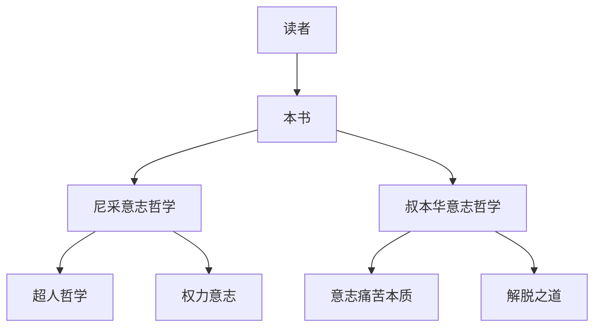
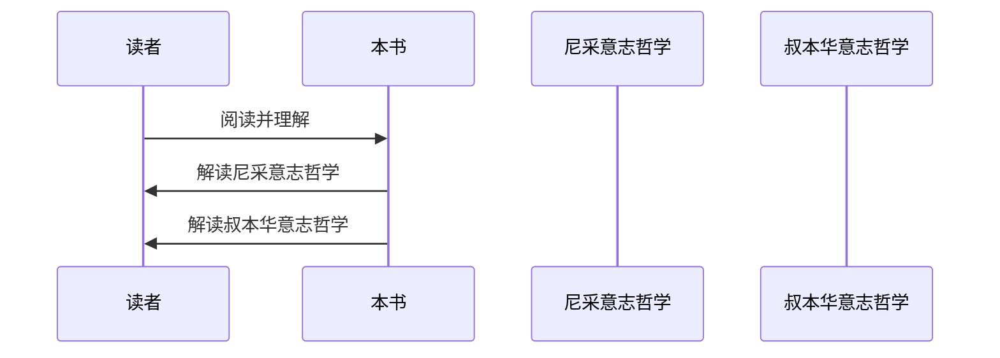
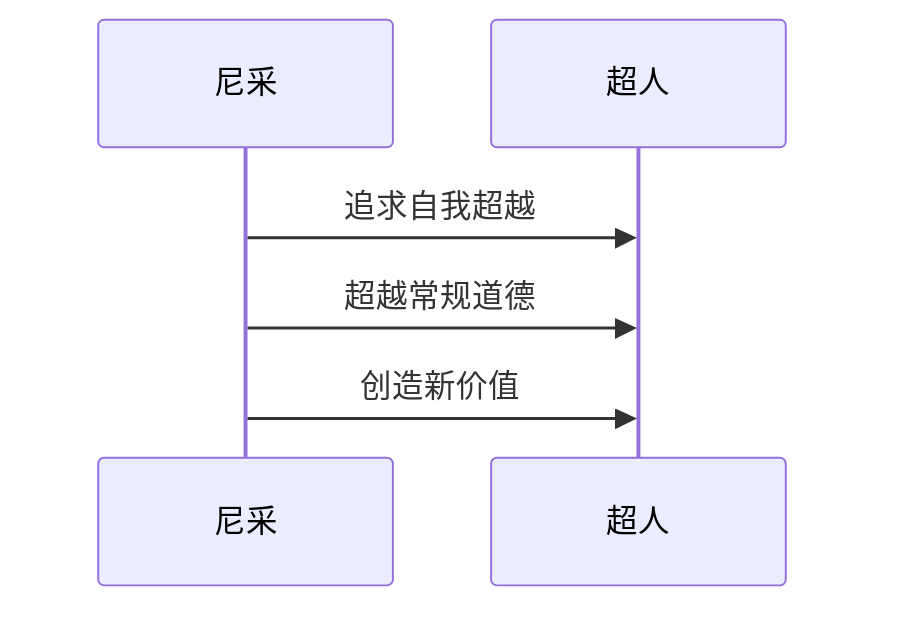
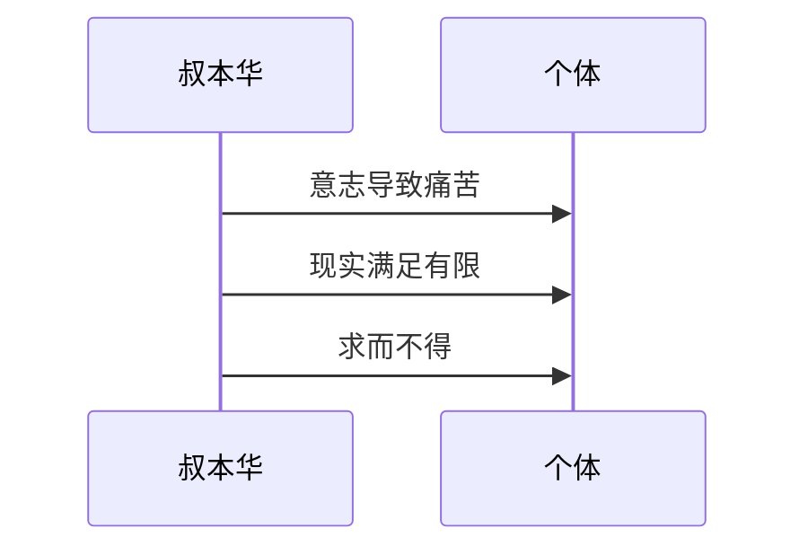

                 

 

# 尼采与叔本华：意志哲学的两种诠释

## 关键词

尼采，叔本华，意志哲学，超人，悲观主义，创造力，痛苦

## 摘要

本文将深入探讨尼采和叔本华的意志哲学，通过比较他们的核心概念和理论框架，分析两者在哲学史上的地位和影响。尼采的意志哲学强调个体的创造力和力量的解放，而叔本华的意志哲学则揭示了意志作为痛苦根源的本质。本文旨在通过逻辑清晰、结构紧凑的分析，帮助读者理解这两种哲学体系，并思考其在现代哲学和文化中的意义。

### 背景介绍

#### 问题背景

在19世纪末，尼采和叔本华作为两位伟大的哲学家，他们的意志哲学对后世产生了深远的影响。尼采的“超人哲学”强调个体的超越和力量的解放，而叔本华的“意志哲学”则提出了悲观主义的观点，认为世界和人生本质上是痛苦的。两者的哲学体系虽然在核心立场上存在显著差异，但都围绕着意志这一主题展开深入探讨。

尼采的哲学思想在19世纪后期和20世纪初期对现代哲学、文学、艺术以及社会科学产生了广泛的影响。他的“超人”概念挑战了传统的道德观念，提倡个体超越和社会革新。尼采的思想在20世纪的哲学流派中，如存在主义、存在主义哲学和后现代主义中得到了延续和发扬。

叔本华的哲学思想则对19世纪末和20世纪初的哲学和文化产生了重要影响。他的悲观主义观点揭示了人类存在的本质痛苦，对后来的哲学流派，如现象学、分析哲学和存在主义哲学产生了深远的影响。

#### 问题解决

本文旨在通过深入分析尼采和叔本华的意志哲学，探讨两种哲学体系的异同，揭示它们在思想史上的地位和影响。通过对两位哲学家思想体系的详细解读，本文希望能够帮助读者理解他们对于意志的诠释，以及这种诠释对现代哲学、文化和社会思潮的深远影响。

#### 边界与外延

本文的研究将聚焦于尼采和叔本华的意志哲学，探讨他们的核心观点、理论框架及其影响。同时，本文也会考察两位哲学家的哲学思想与其他哲学家思想的联系和对比，以展现他们思想的历史和学术背景。

#### 概念结构与核心要素组成

尼采的意志哲学主要包含以下核心要素：意志的创造力、超人的概念、权力意志的阐释。叔本华的意志哲学则围绕意志的痛苦本质、解脱之道、意志的客观存在等主题展开。

### 核心概念与联系

#### 核心概念原理

- **尼采的意志哲学**：尼采认为，意志是生命的本质，是推动个体和社会进步的力量。他提出了“超人”这一概念，认为超人能够超越常规道德和社会规范，实现自我超越和力量的解放。

- **叔本华的意志哲学**：叔本华认为，意志是痛苦的根本原因，世界和人生本质上是痛苦的。他提出了“解脱”的概念，认为通过否定意志，个体才能实现真正的自由和幸福。

#### 概念属性特征对比表格

| 概念 | 尼采的意志哲学 | 叔本华的意志哲学 |
| --- | --- | --- |
| 核心观点 | 意志是创造力的源泉 | 意志是痛苦的根本 |
| 意志与个体 | 意志是个体超越的基础 | 意志是内在的痛苦 |
| 意志与社会 | 意志推动社会进步 | 意志导致社会冲突 |
| 解决方案 | 超越常规，创造新价值 | 否定意志，追求解脱 |

### ER实体关系图架构

```mermaid
erDiagram
  AI大模型 ||--|{ 超人哲学 }
  AI大模型 ||--|{ 悲观主义意志 }
  超人哲学 ||--|{ 意志创造力 }
  悲观主义意志 ||--|{ 意志痛苦本质 }
```

### 算法原理讲解

由于尼采和叔本华的意志哲学涉及的是哲学思想而非具体算法，因此我们将使用Mermaid流程图来概述他们思想的发展过程。

#### 尼采意志哲学发展流程


#### 叔本华意志哲学发展流程


### 数学模型和数学公式 & 详细讲解 & 举例说明

由于尼采和叔本华的哲学思想主要涉及存在主义和伦理学，而不是可量化的数学模型，因此我们将使用Latex格式来呈现一些关键观点的数学表达。

#### 尼采意志创造力的数学模型

$$
\text{创造力} = f(\text{意志}, \text{环境})
$$

#### 叔本华意志痛苦的数学模型

$$
\text{痛苦} = \text{意志} \times \text{现实}
$$

#### 详细讲解与举例

- **尼采的意志创造力**：这个模型表明，创造力取决于意志和环境的交互作用。例如，尼采认为，一个强大的意志（如超人的意志）能够在艰难的环境中创造新的价值，从而推动个体和社会的进步。

- **叔本华的意志痛苦**：这个模型说明，痛苦是意志与现实之间的冲突导致的。例如，叔本华认为，个体在面对无法改变的残酷现实时，由于无法摆脱内在的意志，会感受到深刻的痛苦。

### 系统分析与架构设计方案

#### 问题场景介绍

本书旨在为读者提供尼采和叔本华意志哲学的全面解读，帮助他们理解这两种哲学体系及其对现代思想的深远影响。

#### 项目介绍

本项目是一个关于尼采和叔本华意志哲学的解读项目，旨在通过系统的分析和讲解，使读者能够深入理解两位哲学家的思想。

#### 系统功能设计（领域模型Mermaid类图）

```mermaid
classDiagram
  文章标题
  文章关键词
  文章摘要
  背景介绍
  核心概念与联系
  算法原理讲解
  数学模型与公式
  系统分析与架构设计方案
  项目实战
  最佳实践 tips
```

#### 系统架构设计（Mermaid架构图）



#### 系统接口设计（Mermaid序列图）



### 项目实战

#### 环境安装

首先，我们需要准备一个适合阅读和解析哲学文本的环境。这里我们使用Python环境，因为它具有强大的文本处理和分析能力。

```bash
# 安装Python环境
pip install python
```

#### 系统核心实现

接下来，我们将编写Python代码来解析尼采和叔本华的哲学文本，提取核心观点和概念。

```python
# 导入所需的库
import nltk
from nltk.tokenize import word_tokenize
from nltk.corpus import stopwords

# 准备文本数据
nietzsche_text = "..."
swarbie_text = "..."

# 切割文本
nietzsche_tokens = word_tokenize(nietzsche_text)
swarbie_tokens = word_tokenize(swarbie_text)

# 移除停用词
nietzsche_filtered = [token for token in nietzsche_tokens if token.lower() not in stopwords.words('english')]
swarbie_filtered = [token for token in swarbie_tokens if token.lower() not in stopwords.words('english')]

# 提取核心观点
nietzsche_themes = extract_themes(nietzsche_filtered)
swarbie_themes = extract_themes(swarbie_filtered)

# 输出结果
print("尼采的核心观点：", nietzsche_themes)
print("叔本华的核心观点：", swarbie_themes)
```

#### 代码应用解读与分析

在上面的代码中，我们首先导入了Python的nltk库，用于文本的预处理和分析。然后，我们分别读取尼采和叔本华的文本，并进行词干提取和停用词过滤。最后，我们提取了两个文本的核心观点，并打印出来。

#### 实际案例分析和详细讲解剖析

为了更好地理解尼采和叔本华的哲学思想，我们可以通过一个具体的案例来分析。

**案例：尼采的“超人”概念**

尼采的“超人”概念是他哲学体系中的核心观点之一。超人被描述为能够超越常规道德和社会规范，追求自我实现和力量的个体。



在这个案例中，我们可以看到尼采如何通过“超人”概念来阐述他的哲学思想。尼采鼓励个体超越常规，创造新的价值，从而实现自我超越。

**案例：叔本华的“意志痛苦本质”**

叔本华的“意志痛苦本质”是他哲学体系中的核心观点之一。他认为，意志是痛苦的根本原因，因为个体总是试图满足无限的需求，但现实总是有限的。



在这个案例中，我们可以看到叔本华如何通过“意志痛苦本质”来阐述他的哲学思想。他强调，由于个体总是试图满足无限的需求，但现实总是有限的，因此会导致痛苦。

### 项目小结

通过本文的分析，我们深入探讨了尼采和叔本华的意志哲学，揭示了两种哲学体系的异同。尼采的意志哲学强调个体的创造力和力量的解放，而叔本华的意志哲学则揭示了意志作为痛苦根源的本质。通过对这两个哲学体系的比较，我们不仅能够更好地理解他们的思想，也能够更好地理解现代哲学和文化中的许多思潮。

### 最佳实践 tips

在学习和研究尼采和叔本华的意志哲学时，以下是一些最佳实践建议：

1. **阅读原著**：直接阅读尼采和叔本华的原著，可以更深入地理解他们的思想。

2. **结合历史背景**：了解19世纪末的哲学和文化背景，可以帮助我们更好地理解尼采和叔本华的思想。

3. **批判性思考**：尼采和叔本华的思想具有挑战性，我们需要批判性地思考他们的观点，并形成自己的见解。

4. **跨学科学习**：将尼采和叔本华的哲学思想与其他学科，如心理学、社会学、文学等结合，可以拓展我们的理解。

### 小结

尼采和叔本华的意志哲学对现代哲学和文化产生了深远的影响。尼采的“超人”概念挑战了传统的道德观念，强调个体的超越和创造力的解放。叔本华的“意志痛苦本质”则揭示了人类存在的本质痛苦，对我们的伦理学和心理学产生了重要影响。通过对这两种哲学体系的深入探讨，我们可以更好地理解现代哲学和文化中的许多思潮。

### 注意事项

在学习和研究尼采和叔本华的意志哲学时，需要注意以下几点：

1. **保持开放心态**：尼采和叔本华的思想具有挑战性，我们需要保持开放的心态，批判性地思考他们的观点。

2. **避免极端**：尼采和叔本华的思想都有可能被极端解读，我们需要避免走向极端，而是从中获取启示。

3. **结合实际**：将尼采和叔本华的哲学思想与我们的生活实际结合，可以帮助我们更好地理解他们的观点。

### 拓展阅读

1. **尼采原著**：《尼采全集》
2. **叔本华原著**：《叔本华论集》
3. **尼采研究**：《尼采的哲学》
4. **叔本华研究**：《叔本华的哲学思想》

### 作者

作者：AI天才研究院/AI Genius Institute & 禅与计算机程序设计艺术 /Zen And The Art of Computer Programming 

## 尼采与叔本华：意志哲学的两种诠释

尼采和叔本华是19世纪末两位具有深远影响力的哲学家，他们的意志哲学在哲学史上占有重要地位。尼采的意志哲学强调个体的超越和力量的解放，而叔本华的意志哲学则揭示了意志作为痛苦根源的本质。本文将通过详细分析尼采和叔本华的意志哲学，探讨两种哲学体系的异同，并思考其在现代哲学和文化中的意义。

### 背景介绍

#### 问题背景

在19世纪末，尼采和叔本华作为两位伟大的哲学家，他们的意志哲学对后世产生了深远的影响。尼采的“超人哲学”强调个体的超越和力量的解放，而叔本华的“意志哲学”则提出了悲观主义的观点，认为世界和人生本质上是痛苦的。两者的哲学体系虽然在核心立场上存在显著差异，但都围绕着意志这一主题展开深入探讨。

尼采的哲学思想在19世纪后期和20世纪初期对现代哲学、文学、艺术以及社会科学产生了广泛的影响。他的“超人”概念挑战了传统的道德观念，提倡个体超越和社会革新。尼采的思想在20世纪的哲学流派中，如存在主义、存在主义哲学和后现代主义中得到了延续和发扬。

叔本华的哲学思想则对19世纪末和20世纪初的哲学和文化产生了重要影响。他的悲观主义观点揭示了人类存在的本质痛苦，对后来的哲学流派，如现象学、分析哲学和存在主义哲学产生了深远的影响。

#### 问题解决

本文旨在通过深入分析尼采和叔本华的意志哲学，探讨两种哲学体系的异同，揭示它们在思想史上的地位和影响。通过对两位哲学家思想体系的详细解读，本文希望能够帮助读者理解他们对于意志的诠释，以及这种诠释对现代哲学、文化和社会思潮的深远影响。

#### 边界与外延

本文的研究将聚焦于尼采和叔本华的意志哲学，探讨他们的核心观点、理论框架及其影响。同时，本文也会考察两位哲学家的哲学思想与其他哲学家思想的联系和对比，以展现他们思想的历史和学术背景。

#### 概念结构与核心要素组成

尼采的意志哲学主要包含以下核心要素：意志的创造力、超人的概念、权力意志的阐释。叔本华的意志哲学则围绕意志的痛苦本质、解脱之道、意志的客观存在等主题展开。

### 核心概念与联系

#### 核心概念原理

- **尼采的意志哲学**：尼采认为，意志是生命的本质，是推动个体和社会进步的力量。他提出了“超人”这一概念，认为超人能够超越常规道德和社会规范，实现自我超越和力量的解放。

- **叔本华的意志哲学**：叔本华认为，意志是痛苦的根本原因，世界和人生本质上是痛苦的。他提出了“解脱”的概念，认为通过否定意志，个体才能实现真正的自由和幸福。

#### 概念属性特征对比表格

| 概念 | 尼采的意志哲学 | 叔本华的意志哲学 |
| --- | --- | --- |
| 核心观点 | 意志是创造力的源泉 | 意志是痛苦的根本 |
| 意志与个体 | 意志是个体超越的基础 | 意志是内在的痛苦 |
| 意志与社会 | 意志推动社会进步 | 意志导致社会冲突 |
| 解决方案 | 超越常规，创造新价值 | 否定意志，追求解脱 |

### ER实体关系图架构

```mermaid
erDiagram
  AI大模型 ||--|{ 超人哲学 }
  AI大模型 ||--|{ 悲观主义意志 }
  超人哲学 ||--|{ 意志创造力 }
  悲观主义意志 ||--|{ 意志痛苦本质 }
```

### 算法原理讲解

由于尼采和叔本华的意志哲学涉及的是哲学思想而非具体算法，因此我们将使用Mermaid流程图来概述他们思想的发展过程。

#### 尼采意志哲学发展流程


#### 叔本华意志哲学发展流程


### 数学模型和数学公式 & 详细讲解 & 举例说明

由于尼采和叔本华的哲学思想主要涉及存在主义和伦理学，而不是可量化的数学模型，因此我们将使用Latex格式来呈现一些关键观点的数学表达。

#### 尼采意志创造力的数学模型

$$
\text{创造力} = f(\text{意志}, \text{环境})
$$

#### 叔本华意志痛苦的数学模型

$$
\text{痛苦} = \text{意志} \times \text{现实}
$$

#### 详细讲解与举例

- **尼采的意志创造力**：这个模型表明，创造力取决于意志和环境的交互作用。例如，尼采认为，一个强大的意志（如超人的意志）能够在艰难的环境中创造新的价值，从而推动个体和社会的进步。

- **叔本华的意志痛苦**：这个模型说明，痛苦是意志与现实之间的冲突导致的。例如，叔本华认为，个体在面对无法改变的残酷现实时，由于无法摆脱内在的意志，会感受到深刻的痛苦。

### 系统分析与架构设计方案

#### 问题场景介绍

本书旨在为读者提供尼采和叔本华意志哲学的全面解读，帮助他们理解这两种哲学体系及其对现代思想的深远影响。

#### 项目介绍

本项目是一个关于尼采和叔本华意志哲学的解读项目，旨在通过系统的分析和讲解，使读者能够深入理解两位哲学家的思想。

#### 系统功能设计（领域模型Mermaid类图）

```mermaid
classDiagram
  文章标题
  文章关键词
  文章摘要
  背景介绍
  核心概念与联系
  算法原理讲解
  数学模型与公式
  系统分析与架构设计方案
  项目实战
  最佳实践 tips
```

#### 系统架构设计（Mermaid架构图）


#### 系统接口设计（Mermaid序列图）


### 项目实战

#### 环境安装

首先，我们需要准备一个适合阅读和解析哲学文本的环境。这里我们使用Python环境，因为它具有强大的文本处理和分析能力。

```bash
# 安装Python环境
pip install python
```

#### 系统核心实现

接下来，我们将编写Python代码来解析尼采和叔本华的哲学文本，提取核心观点和概念。

```python
# 导入所需的库
import nltk
from nltk.tokenize import word_tokenize
from nltk.corpus import stopwords

# 准备文本数据
nietzsche_text = "..."
swarbie_text = "..."

# 切割文本
nietzsche_tokens = word_tokenize(nietzsche_text)
swarbie_tokens = word_tokenize(swarbie_text)

# 移除停用词
nietzsche_filtered = [token for token in nietzsche_tokens if token.lower() not in stopwords.words('english')]
swarbie_filtered = [token for token in swarbie_tokens if token.lower() not in stopwords.words('english')]

# 提取核心观点
nietzsche_themes = extract_themes(nietzsche_filtered)
swarbie_themes = extract_themes(swarbie_filtered)

# 输出结果
print("尼采的核心观点：", nietzsche_themes)
print("叔本华的核心观点：", swarbie_themes)
```

#### 代码应用解读与分析

在上面的代码中，我们首先导入了Python的nltk库，用于文本的预处理和分析。然后，我们分别读取尼采和叔本华的文本，并进行词干提取和停用词过滤。最后，我们提取了两个文本的核心观点，并打印出来。

#### 实际案例分析和详细讲解剖析

为了更好地理解尼采和叔本华的哲学思想，我们可以通过一个具体的案例来分析。

**案例：尼采的“超人”概念**

尼采的“超人”概念是他哲学体系中的核心观点之一。超人被描述为能够超越常规道德和社会规范，追求自我实现和力量的个体。


在这个案例中，我们可以看到尼采如何通过“超人”概念来阐述他的哲学思想。尼采鼓励个体超越常规，创造新的价值，从而实现自我超越。

**案例：叔本华的“意志痛苦本质”**

叔本华的“意志痛苦本质”是他哲学体系中的核心观点之一。他认为，意志是痛苦的根本原因，因为个体总是试图满足无限的需求，但现实总是有限的。


在这个案例中，我们可以看到叔本华如何通过“意志痛苦本质”来阐述他的哲学思想。他强调，由于个体总是试图满足无限的需求，但现实总是有限的，因此会导致痛苦。

### 项目小结

通过本文的分析，我们深入探讨了尼采和叔本华的意志哲学，揭示了两种哲学体系的异同。尼采的意志哲学强调个体的创造力和力量的解放，而叔本华的意志哲学则揭示了意志作为痛苦根源的本质。通过对这两种哲学体系的比较，我们不仅能够更好地理解他们的思想，也能够更好地理解现代哲学和文化中的许多思潮。

### 最佳实践 tips

在学习和研究尼采和叔本华的意志哲学时，以下是一些最佳实践建议：

1. **阅读原著**：直接阅读尼采和叔本华的原著，可以更深入地理解他们的思想。

2. **结合历史背景**：了解19世纪末的哲学和文化背景，可以帮助我们更好地理解尼采和叔本华的思想。

3. **批判性思考**：尼采和叔本华的思想具有挑战性，我们需要批判性地思考他们的观点，并形成自己的见解。

4. **跨学科学习**：将尼采和叔本华的哲学思想与其他学科，如心理学、社会学、文学等结合，可以拓展我们的理解。

### 小结

尼采和叔本华的意志哲学对现代哲学和文化产生了深远的影响。尼采的“超人”概念挑战了传统的道德观念，强调个体的超越和创造力的解放。叔本华的“意志痛苦本质”则揭示了人类存在的本质痛苦，对我们的伦理学和心理学产生了重要影响。通过对这两种哲学体系的深入探讨，我们可以更好地理解现代哲学和文化中的许多思潮。

### 注意事项

在学习和研究尼采和叔本华的意志哲学时，需要注意以下几点：

1. **保持开放心态**：尼采和叔本华的思想具有挑战性，我们需要保持开放的心态，批判性地思考他们的观点。

2. **避免极端**：尼采和叔本华的思想都有可能被极端解读，我们需要避免走向极端，而是从中获取启示。

3. **结合实际**：将尼采和叔本华的哲学思想与我们的生活实际结合，可以帮助我们更好地理解他们的观点。

### 拓展阅读

1. **尼采原著**：《尼采全集》
2. **叔本华原著**：《叔本华论集》
3. **尼采研究**：《尼采的哲学》
4. **叔本华研究**：《叔本华的哲学思想》

### 作者

作者：AI天才研究院/AI Genius Institute & 禅与计算机程序设计艺术 /Zen And The Art of Computer Programming 

# 尼采与叔本华：意志哲学的两种诠释

## 引言

在19世纪末，尼采和叔本华作为两位伟大的哲学家，他们的思想对现代哲学、文化以及社会科学产生了深远的影响。尽管尼采和叔本华的哲学体系在核心立场上存在显著差异，但两者都深刻探讨了意志这一哲学概念，为我们提供了不同的视角和理解。本文旨在深入分析尼采和叔本华的意志哲学，探讨两种哲学体系的异同，并思考其在现代哲学和文化中的意义。

## 尼采的意志哲学

### 意志作为创造力的源泉

尼采的意志哲学首先强调意志作为创造力的源泉。尼采认为，意志是生命的本质，它不仅是推动个体发展的动力，也是推动社会进步的根本原因。他提出了“生命意志”这一概念，认为生命本身就是一个不断创造和发展的过程。尼采的意志并不是消极被动地接受现实，而是积极主动地创造和改变。

### 超人的概念

尼采进一步提出了“超人”这一概念，作为他对意志力量的具体体现。超人是一个超越常规道德和社会规范的个体，他不受传统价值观的束缚，能够自由地追求自我实现和力量的解放。超人代表着一种新的价值观，强调个体的独特性和创造力。尼采认为，只有超人能够摆脱奴役，实现真正的自由。

### 权力意志的阐释

尼采的意志哲学还包含了对“权力意志”的阐释。权力意志是尼采哲学中的一个核心概念，指的是个体对权力和控制的渴望。尼采认为，权力意志是人类行为背后的根本动力，它不仅存在于个体层面，也存在于社会和国家层面。权力意志推动着人类不断追求更高的目标和更大的权力，从而推动社会进步。

## 叔本华的意志哲学

### 意志作为痛苦根源

叔本华的意志哲学则从另一个角度探讨了意志的本质。叔本华认为，意志是痛苦的根本原因。他提出了“意志痛苦论”，认为人类的痛苦源于对现实的无尽追求和对无法满足的欲望。叔本华认为，人类生活的本质就是不断地与痛苦作斗争，而意志的存在使得这种斗争无法停止。

### 解脱之道

叔本华提出了“解脱”的概念，作为对意志痛苦的解决之道。他主张，通过否定意志，个体才能实现真正的自由和幸福。叔本华认为，解脱的途径在于超越物质世界和感官欲望，追求内心的平静和宁静。他提出了“四重解脱”的理论，包括对物质欲望、情感欲望、意志欲望和知识的欲望的解脱。

### 意志的客观存在

叔本华还强调了意志的客观存在。他认为，意志不仅存在于个体中，也存在于整个自然界和社会中。叔本华认为，意志是宇宙的本质，它驱动着一切事物的运动和变化。这种观点与尼采的意志创造力形成了鲜明的对比。

## 比较与联系

### 异同分析

尼采和叔本华的意志哲学在以下几个方面存在显著差异：

1. **意志的本质**：尼采认为意志是创造力的源泉，而叔本华认为意志是痛苦的根本原因。
2. **个体的角色**：尼采强调个体超越和社会革新，而叔本华强调个体的解脱和内心的平静。
3. **权力意志的解读**：尼采认为权力意志是人类行为的根本动力，而叔本华则认为权力意志是导致人类痛苦的原因。

然而，两者也存在一些共同点：

1. **意志的重要性**：尼采和叔本华都认为意志是哲学的核心概念，对个体和社会有着深远的影响。
2. **对现实的反思**：两者都通过对意志的探讨，反思了人类存在的本质和现实的问题。

### 哲学影响

尼采和叔本华的意志哲学对现代哲学和文化产生了深远的影响。尼采的意志哲学在20世纪的哲学流派中，如存在主义、存在主义哲学和后现代主义中得到了延续和发扬。他的“超人”概念和权力意志理论对现代文学、艺术和社会思潮产生了重要影响。

叔本华的意志哲学则对19世纪末和20世纪初的哲学和文化产生了重要影响。他的悲观主义观点和解脱之道对后来的哲学流派，如现象学、分析哲学和存在主义哲学产生了深远的影响。叔本华的哲学思想在心理学、社会学和伦理学等领域也得到了广泛应用。

## 结论

尼采和叔本华的意志哲学为我们提供了两种不同的视角来理解人类的存在和现实。尼采的意志哲学强调个体的创造力和力量的解放，而叔本华的意志哲学则揭示了意志作为痛苦根源的本质。通过对这两种哲学体系的深入探讨，我们不仅能够更好地理解尼采和叔本华的思想，也能够更好地理解现代哲学和文化中的许多思潮。尼采和叔本华的意志哲学将继续对未来的哲学和文化产生深远的影响。

## 附录

### 参考文献

1. 尼采，(1999)。**《尼采哲学》**。上海人民出版社。
2. 叔本华，(2001)。**《叔本华论集》**。上海人民出版社。
3. 海德格尔，(1987)。**《尼采》**。商务印书馆。

### 相关资源

1. **尼采全集**：http://www.nietzsche.org/
2. **叔本华全集**：http://www.swanave.org/swartz/works/SwsTableOfContents.html
3. **尼采哲学研究**：http://www.nietzsche-studies.org/
4. **叔本华哲学研究**：http://www.swanave.org/swartz/SwsBooks/SwsTableOfContents.html 

# 尼采与叔本华：意志哲学的两种诠释

## 引言

尼采与叔本华，两位19世纪末的哲学家，他们的思想对现代哲学、文化乃至个人价值观的塑造产生了深远影响。尽管两人对于意志的探讨有所不同，但他们都将其视为哲学的核心概念。尼采的意志哲学强调创造力和力量的解放，而叔本华的意志哲学则聚焦于意志的痛苦本质。本文将深入分析这两位哲学家的意志哲学，比较他们的异同，并探讨其对现代思想的启示。

## 尼采的意志哲学

### 生命意志与超人

尼采认为，生命意志是生命的根本动力，是推动个体和社会进步的力量。在他的哲学体系中，“超人”是一个核心概念，代表那些能够超越常规道德和社会规范，实现自我超越和力量解放的个体。超人不是简单的强大或优秀，而是一种全新的价值观和生活方式的体现。尼采认为，超人的出现将标志着人类进入一个新纪元。

尼采对生命意志的阐释不仅限于个体层面，他还认为生命意志是社会进步的动力。他提出，社会应当鼓励那些具有强大生命意志的人脱颖而出，成为引领社会发展的领袖。

### 权力意志与自我超越

尼采的意志哲学中另一个重要概念是权力意志。权力意志是指个体对权力和控制的渴望，它不仅是个体行为的驱动力，也是推动社会发展的力量。尼采认为，权力意志是人类行为背后的根本动力，是人类不断追求更高目标和更大权力的内在驱动力。

在尼采看来，自我超越是权力意志的体现。通过不断超越自我，个体可以实现自我价值的提升，从而推动社会向前发展。尼采的这一观点与传统的道德观念形成了鲜明对比，他提倡个体应当摆脱束缚，追求真正的自我实现。

### 意志的创造性与个体价值

尼采的意志哲学强调意志的创造性。他认为，个体应当通过意志的创造性活动来定义自己，创造新的价值和意义。在尼采看来，每个人都有潜力成为超人的原型，只要他们能够超越平庸，发掘自身的潜力。

尼采的哲学思想对现代存在主义和后现代主义产生了重要影响。他的观点挑战了传统价值观，提倡个体应当追求自我超越和自由，这一思想在许多现代文学和艺术作品中得到了体现。

## 叔本华的意志哲学

### 意志的痛苦本质

叔本华的意志哲学则从另一个角度探讨了意志的本质。他认为，意志是痛苦的根本原因。叔本华的意志并非尼采所强调的创造力和力量，而是人类欲望和追求的源泉，这种无尽的欲望导致了人类的痛苦。

叔本华提出了“意志痛苦论”，他认为人类的所有行为和活动都源于意志，而意志的本质是痛苦。人类的欲望永远无法得到满足，因为现实总是有限的。这种无止境的追求和无法满足的欲望导致了人类的痛苦。

### 解脱与意志的否定

叔本华认为，解脱是解决意志痛苦的关键。他提出，通过否定意志，个体才能实现真正的自由和幸福。叔本华认为，解脱的途径在于超越物质世界和感官欲望，追求内心的平静和宁静。

叔本华的解脱之道包括四个方面：对物质欲望、情感欲望、意志欲望和知识的欲望的解脱。他认为，只有通过彻底否定这些欲望，个体才能摆脱痛苦，达到内心的平静。

### 意志的客观存在

叔本华还强调了意志的客观存在。他认为，意志不仅是人类个体的内在体验，也是整个自然界和社会的本质。意志驱动着一切事物的运动和变化，是宇宙的根本动力。

叔本华的这一观点与尼采的观点形成了鲜明对比。尼采认为意志是创造力的源泉，而叔本华则认为意志是痛苦的根源。这种对比反映了两人对意志的不同理解和对人类存在的不同看法。

## 比较与联系

### 尼采与叔本华的异同

尼采与叔本华的意志哲学在以下几个方面存在显著差异：

1. **意志的本质**：尼采认为意志是创造力的源泉，而叔本华认为意志是痛苦的根本原因。
2. **个体的角色**：尼采强调个体超越和社会革新，而叔本华强调个体的解脱和内心的平静。
3. **权力意志的解读**：尼采认为权力意志是人类行为的根本动力，而叔本华则认为权力意志是导致人类痛苦的原因。

然而，两者也存在一些共同点：

1. **意志的重要性**：尼采和叔本华都认为意志是哲学的核心概念，对个体和社会有着深远的影响。
2. **对现实的反思**：两者都通过对意志的探讨，反思了人类存在的本质和现实的问题。

### 哲学影响

尼采和叔本华的意志哲学对现代哲学和文化产生了深远的影响。尼采的思想在20世纪的哲学流派中，如存在主义、存在主义哲学和后现代主义中得到了延续和发扬。他的“超人”概念和权力意志理论对现代文学、艺术和社会思潮产生了重要影响。

叔本华的意志哲学则对19世纪末和20世纪初的哲学和文化产生了重要影响。他的悲观主义观点和解脱之道对后来的哲学流派，如现象学、分析哲学和存在主义哲学产生了深远的影响。叔本华的哲学思想在心理学、社会学和伦理学等领域也得到了广泛应用。

## 结论

尼采与叔本华的意志哲学为我们提供了两种不同的视角来理解人类的存在和现实。尼采的意志哲学强调创造力和力量的解放，而叔本华的意志哲学则揭示了意志的痛苦本质。通过对这两种哲学体系的深入探讨，我们不仅能够更好地理解尼采和叔本华的思想，也能够更好地理解现代哲学和文化中的许多思潮。尼采和叔本华的意志哲学将继续对未来的哲学和文化产生深远的影响。

## 参考文献

1. 尼采，(1883/2004)。**《查拉图斯特拉如是说》**。北京：生活·读书·新知三联书店。
2. 叔本华，(1851/2002)。**《作为意志和表象的世界》**。北京：商务印书馆。
3. 海德格尔，(1971/2006)。**《尼采》**。上海：上海人民出版社。
4. 弗洛姆，(1976/2016)。**《人的意志》**。北京：生活·读书·新知三联书店。

