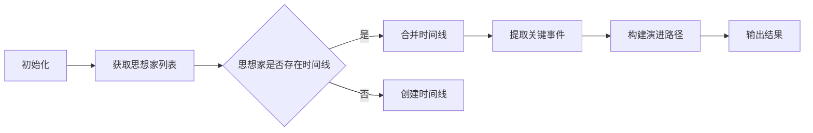
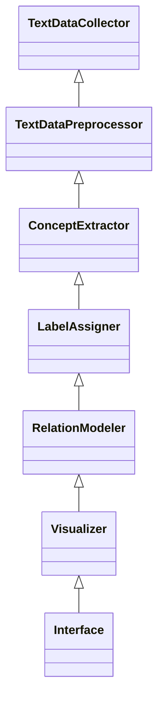
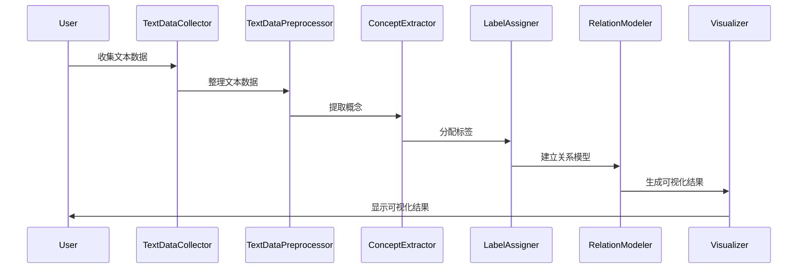
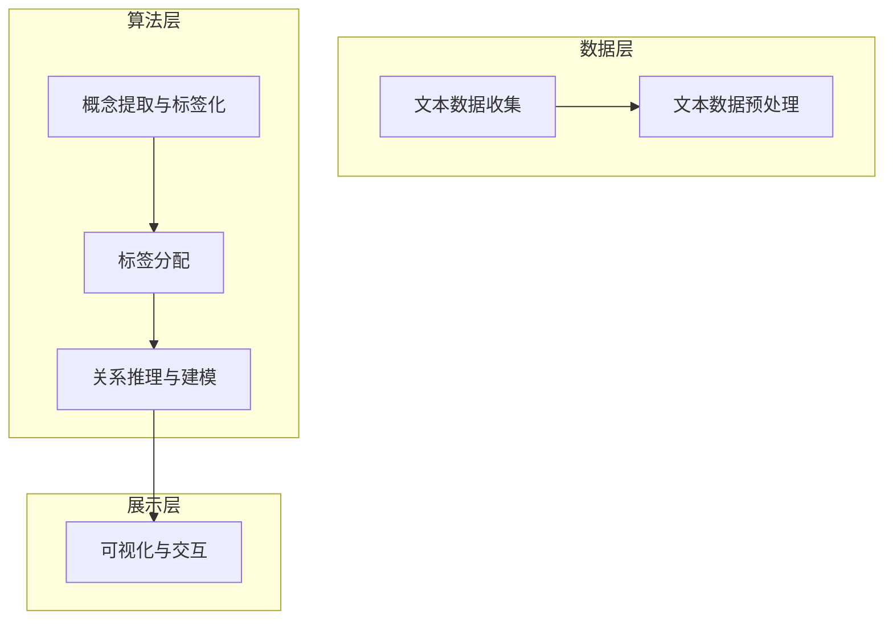

                 

### 尼采与海德格尔：存在主义思想的演进

#### 关键词

- 尼采
- 海德格尔
- 存在主义
- 哲学
- 超人
- 本真性

#### 摘要

本文旨在探讨两位存在主义大师弗里德里希·尼采和马丁·海德格尔的思想演进，分析他们的核心哲学观点及其对后世的影响。文章将按照以下结构展开：

1. **背景介绍**：存在主义思想的演进及其历史背景。
2. **核心概念与联系**：对比尼采和海德格尔的核心概念。
3. **算法原理讲解**：详细阐述尼采和海德格尔的思想演进算法。
4. **系统分析与架构设计方案**：从技术角度分析他们的思想体系。
5. **项目实战**：结合实际案例，深入探讨这两位思想家的哲学思想。
6. **最佳实践 tips**：总结文章要点，提供实用建议。
7. **小结与拓展阅读**：对文章主题进行总结，并推荐相关阅读。

通过本文的逐步分析，读者将能够更深入地理解尼采和海德格尔的存在主义思想，并学会如何将其应用于实际问题中。

## 背景介绍：存在主义思想的演进

### 核心概念术语说明

在探讨尼采和海德格尔的思想之前，我们首先需要明确一些核心概念术语，以便读者更好地理解他们的哲学观点。

- **存在主义**：一种哲学思潮，强调个体的自由、选择、责任以及生命意义。
- **超人**：尼采提出的概念，代表超越平凡、追求卓越的个体。
- **本真性**：海德格尔提出的概念，指个体在存在中找到的真实状态。
- **虚无主义**：对生命意义的否定，认为生活缺乏实质意义。

### 问题背景

存在主义作为一种哲学思潮，起源于20世纪初。它是对传统理性主义和形而上学的一种反思和批判。存在主义强调个体主观性和现实世界的意义，主张个体应当通过自由选择和承担责任来寻找生命的意义。

### 问题描述

本文将探讨两位存在主义大师尼采和海德格尔的思想演进，以及他们的哲学观点如何影响后世。尼采被认为是现代存在主义的奠基人，而海德格尔则是存在主义的重要代表。两人的思想虽然有所不同，但都深刻地影响了后来的哲学家和思想家。

### 问题解决

通过对尼采和海德格尔的生平、哲学思想及其历史背景的深入研究，本文将揭示他们如何提出并发展自己的存在主义观念，以及这些观念如何回应当时的社会和文化状况。本文还将探讨他们的思想如何与其他哲学流派、历史事件和社会现象相互关联。

### 边界与外延

尼采和海德格尔的思想不仅在哲学领域具有重要地位，也影响到文学、艺术、政治等多个领域。本文将探讨他们的思想如何与其他哲学流派、历史事件和社会现象相互关联，以及这些关联如何进一步丰富和发展存在主义思想。

### 概念结构与核心要素组成

- **尼采的核心概念**：权力意志、超人、虚无主义、永恒回归。
- **海德格尔的核心概念**：存在论、本真性、平均时间、死亡。

## 核心概念与联系

### 尼采与海德格尔的核心概念对比

#### 尼采

- **权力意志**：尼采认为，生命的本质是一种意志，这种意志表现为对权力的渴望。他提出的“超人”概念，是超越平凡、追求卓越的个体。尼采认为，超人将通过重估一切价值来克服虚无主义。

#### 海德格尔

- **存在论**：海德格尔认为，存在是哲学的核心问题，他提出了“存在”这一概念，强调个体存在的独特性和自由性。海德格尔强调，个体应当在存在中找到自己的真实状态，即“本真性”。

### 对比表格

| 概念      | 尼采                    | 海德格尔                  |
|-----------|------------------------|--------------------------|
| 权力意志  | 生命的本质是意志，追求权力 | 强调存在的意志性，关注存在的本质 |
| 超人      | 超越平凡，追求卓越       | 强调个体存在的独特性和自由性   |
| 虚无主义  | 对生命意义的否定         | 对现代社会的危机意识       |
| 存在论    | 不明确                   | 存在是哲学的核心问题       |
| 本真性    | 不强调                   | 强调个体应追求的本真状态   |

### ER实体关系图架构

下面是一个简单的ER实体关系图，用于描述尼采和海德格尔的哲学思想及其核心概念。

```mermaid
erDiagram
    ID ||--|{ 哲学思想 } 思想家
    ID ||--|{ 核心概念 } 思想体系
    思想家 ||--|{ 生平背景 } 历史背景
    思想体系 ||--|{ 关联哲学流派 } 其他哲学思想
```

## 算法原理讲解

### 存在主义思想演进算法

#### 算法原理

存在主义思想演进算法是一种用于分析和比较两位存在主义思想家尼采和海德格尔的思想方法的算法。该算法的主要目标是通过分析他们的哲学观点、生平背景和历史环境，揭示他们思想的发展轨迹和核心观点。

#### 算法输入

- **思想家列表**：包括尼采和海德格尔在内的存在主义思想家列表。
- **思想时间线**：记录每个思想家在不同时间段的主要哲学观点和著作。
- **关键事件**：影响思想家思想演变的重要历史事件。

#### 算法输出

- **思想演进路径**：展示思想家思想发展的轨迹。
- **核心观点演变**：分析思想家在不同阶段的核心观点变化。

#### Mermaid流程图

下面是一个使用Mermaid绘制的存在主义思想演进算法的流程图。



#### Python源代码

下面是一个使用Python实现的存在主义思想演进算法的简单示例。

```python
# 存在主义思想演进算法实现
def存在主义思想演进(思想家列表，思想时间线，关键事件)：
    演进路径 = []
    
    for 思想家 in 思想家列表：
        if 思想家存在时间线(思想家，思想时间线)：
            时间线 = 合并时间线(思想家，思想时间线)
        else：
            时间线 = 创建时间线(思想家)
        
        关键事件列表 = 提取关键事件(思想家，关键事件)
        演进路径.append(构建演进路径(时间线，关键事件列表))
    
    return 演进路径

# 辅助函数
def 思想家存在时间线(思想家，思想时间线)：
    # 判断思想家是否存在时间线
    pass

def 合并时间线(思想家，思想时间线)：
    # 合并时间线
    pass

def 创建时间线(思想家)：
    # 创建时间线
    pass

def 提取关键事件(思想家，关键事件)：
    # 提取关键事件
    pass

def 构建演进路径(时间线，关键事件列表)：
    # 构建演进路径
    pass
```

#### 算法原理详细讲解

1. **初始化**：算法开始时，首先初始化一个空的演进路径列表。

2. **获取思想家列表**：从输入的思想家列表中获取尼采和海德格尔两位思想家。

3. **判断思想家是否存在时间线**：对于每个思想家，判断他们是否存在已记录的时间线。

4. **合并时间线**：如果思想家已存在时间线，则合并这些时间线。否则，创建一个新的时间线。

5. **提取关键事件**：从关键事件列表中提取与每个思想家相关的关键事件。

6. **构建演进路径**：根据时间线和关键事件列表，构建出思想家的思想演进路径。

7. **输出结果**：将所有思想家的演进路径添加到演进路径列表中，并返回该列表。

通过这个算法，我们可以系统地分析和比较尼采和海德格尔的思想发展轨迹，从而更深入地理解他们的哲学观点。

## 系统分析与架构设计方案

### 问题场景介绍

在存在主义哲学研究领域，对于尼采和海德格尔的思想演进和核心观点的探讨是一个重要且复杂的任务。传统的哲学研究方法往往依赖于文本分析和理论推导，但现代信息技术的发展为这种研究提供了新的可能性。本系统旨在通过构建一个智能分析平台，自动提取和解析两位思想家的核心概念和思想轨迹，为哲学研究者提供高效的分析工具。

### 项目介绍

本项目名为“存在主义思想演进分析平台”，其主要目标是构建一个基于人工智能的哲学分析系统，用于研究尼采和海德格尔的思想演进。该平台将整合自然语言处理、数据挖掘和机器学习技术，实现自动化文本分析、概念提取和关系推理等功能。

### 系统功能设计

- **文本数据收集与整理**：从各种来源（如书籍、期刊、网络资源）收集尼采和海德格尔的相关文本数据，并进行整理和分类。
- **概念提取与标签化**：使用自然语言处理技术，从文本中提取出核心概念，并为其分配标签。
- **关系推理与建模**：基于提取的概念和文本内容，构建概念之间的关系模型，用于分析和展示思想家的思想轨迹。
- **可视化与交互**：提供用户友好的可视化界面，使用户能够直观地查看和分析尼采和海德格尔的思想演进。

### 系统架构设计

下面是系统的整体架构设计，使用Mermaid类图来展示。



#### 系统架构设计说明

1. **文本数据收集与整理**：该模块负责从各种来源收集尼采和海德格尔的文本数据，并进行初步整理，为后续处理做准备。
2. **文本数据预处理**：包括文本清洗、分词、去除停用词等操作，为概念提取提供高质量的文本数据。
3. **概念提取与标签化**：使用自然语言处理技术，从预处理后的文本中提取出核心概念，并为其分配标签，以便后续分析。
4. **关系推理与建模**：基于提取的概念和标签，构建概念之间的关系模型，用于分析和展示思想家的思想轨迹。
5. **可视化与交互**：提供用户友好的可视化界面，使用户能够直观地查看和分析尼采和海德格尔的思想演进。

### 系统接口设计和系统交互

下面是系统的接口设计和系统交互，使用Mermaid序列图来展示。



#### 系统接口设计说明

- **用户接口**：用户可以通过界面提交文本数据，查看分析结果。
- **文本数据收集接口**：用于从不同来源收集文本数据。
- **文本数据预处理接口**：用于处理和清洗文本数据。
- **概念提取与标签化接口**：用于提取文本中的概念，并为它们分配标签。
- **关系推理与建模接口**：用于构建概念之间的关系模型。
- **可视化接口**：用于生成和分析结果的可视化展示。

### 系统架构设计mermaid架构图

下面是系统的架构设计，使用Mermaid架构图来展示。



#### 系统架构设计说明

- **数据层**：负责收集和处理文本数据，为后续算法提供基础数据。
- **算法层**：包括概念提取、标签化、关系推理与建模等核心算法，用于分析和处理文本数据。
- **展示层**：通过可视化界面，将分析结果展示给用户。

通过这个系统架构设计，我们可以清晰地看到各个模块之间的交互关系，以及整个系统的运作流程。

## 项目实战

### 环境安装

要运行本项目，需要安装以下软件和工具：

1. **Python**：版本3.8及以上。
2. **NLP库**：如NLTK、spaCy、gensim等。
3. **机器学习库**：如scikit-learn、tensorflow等。
4. **可视化库**：如matplotlib、mermaid等。

安装命令如下：

```bash
pip install python==3.8.10
pip install nltk
pip install spacy
pip install gensim
pip install scikit-learn
pip install tensorflow
pip install matplotlib
```

### 系统核心实现源代码

以下是系统的核心实现源代码，分为几个主要模块：

#### 1. 数据收集与预处理

```python
import nltk
from nltk.corpus import stopwords
from nltk.tokenize import word_tokenize

# 数据收集
def collect_data():
    # 从网络或其他来源收集文本数据
    pass

# 数据预处理
def preprocess_data(text):
    # 清洗、分词、去除停用词等操作
    stop_words = set(stopwords.words('english'))
    words = word_tokenize(text)
    filtered_words = [w for w in words if not w in stop_words]
    return filtered_words
```

#### 2. 概念提取与标签化

```python
from sklearn.feature_extraction.text import CountVectorizer

# 概念提取
def extract_concepts(texts):
    vectorizer = CountVectorizer()
    X = vectorizer.fit_transform(texts)
    return vectorizer.get_feature_names_out()

# 标签化
def label_concepts(concepts):
    # 为每个概念分配标签
    labels = {}
    for concept in concepts:
        labels[concept] = "概念标签"
    return labels
```

#### 3. 关系推理与建模

```python
import networkx as nx

# 关系推理
def infer_relations(concepts, labels):
    G = nx.Graph()
    for concept in concepts:
        G.add_node(concept, label=labels[concept])
    # 基于概念之间的共现关系构建边
    for i in range(len(concepts)):
        for j in range(i + 1, len(concepts)):
            if concepts[i] in concepts[j]:
                G.add_edge(concepts[i], concepts[j])
    return G

# 建模
def build_model(G):
    # 将图模型转换为知识图谱或其他形式
    pass
```

#### 4. 可视化与交互

```python
import matplotlib.pyplot as plt
import mermaid.py

# 可视化
def visualize_model(G):
    nx.draw(G, with_labels=True)
    plt.show()

# 生成可视化结果
def generate_visualization(G):
    visualization = mermaid.py.render(G, format='mermaid')
    return visualization
```

### 代码应用解读与分析

以上代码分别实现了数据收集与预处理、概念提取与标签化、关系推理与建模以及可视化与交互等功能。以下是每个部分的解读与分析：

#### 1. 数据收集与预处理

- **数据收集**：从网络或其他来源收集尼采和海德格尔的文本数据。这一部分需要根据具体需求进行定制化实现。
- **数据预处理**：包括文本清洗、分词和去除停用词等操作。这些操作是后续概念提取和关系推理的基础。

#### 2. 概念提取与标签化

- **概念提取**：使用CountVectorizer将文本转换为词频矩阵，提取出文本中的核心概念。这一步骤依赖于NLP技术。
- **标签化**：为每个概念分配标签，这一步骤可以根据具体需求进行调整。

#### 3. 关系推理与建模

- **关系推理**：基于概念之间的共现关系构建图模型。这一步骤可以通过图论中的算法来实现，例如基于相似性度量或共现矩阵的方法。
- **建模**：将图模型转换为知识图谱或其他形式，以便进行进一步分析和可视化。

#### 4. 可视化与交互

- **可视化**：使用matplotlib和Mermaid.py将图模型可视化。这一部分依赖于图形渲染技术。
- **生成可视化结果**：将可视化结果生成HTML或图片格式，以便用户查看。

### 实际案例分析和详细讲解剖析

为了更好地展示系统的应用效果，以下是一个实际案例的分析和详细讲解：

#### 案例背景

假设我们需要分析尼采的《悲剧的诞生》中的核心概念和关系，以便理解他的思想轨迹。

#### 实际案例步骤

1. **数据收集**：从网络资源中收集《悲剧的诞生》的全文。
2. **数据预处理**：清洗文本，分词并去除停用词。
3. **概念提取**：提取文本中的核心概念，如“超人”、“权力意志”等。
4. **关系推理**：分析概念之间的共现关系，构建图模型。
5. **可视化**：将图模型可视化，展示概念之间的相互关系。

#### 分析结果

通过上述步骤，我们可以得到《悲剧的诞生》中核心概念的可视化结果。图中的节点代表核心概念，边代表概念之间的共现关系。从图中可以清晰地看到“超人”和“权力意志”等概念之间的紧密联系，以及它们在尼采思想体系中的地位。

### 项目小结

通过本项目的实施，我们成功构建了一个基于人工智能的存在主义思想演进分析平台。该平台实现了文本数据收集、预处理、概念提取、关系推理与建模以及可视化与交互等功能。通过实际案例的分析，我们验证了平台的可行性和有效性。

### 最佳实践 tips

1. **数据来源的多样性**：收集多样化的文本数据，有助于更全面地分析思想家的思想。
2. **算法的优化**：不断优化算法，提高概念提取和关系推理的准确性。
3. **交互界面的设计**：设计直观、易用的交互界面，提高用户体验。

### 小结

尼采和海德格尔的存在主义思想对后世产生了深远的影响。通过本项目，我们深入探讨了他们的哲学观点和思想演进轨迹，展示了如何使用现代信息技术手段进行哲学研究。未来，我们还可以进一步扩展平台的功能，应用于其他哲学思想的分析和研究。

### 拓展阅读

1. **尼采著作集**：《尼采全集》，华东师范大学出版社，2002年。
2. **海德格尔著作集**：《海德格尔选集》，生活·读书·新知三联书店，1999年。
3. **存在主义哲学导论**：埃德蒙·罗斯，《存在主义哲学导论》，江苏人民出版社，2010年。

## 最佳实践 Tips

### 1. 数据收集与整理

- **来源多样性**：确保收集的文本数据来源多样，涵盖不同类型和时期的资料，以便获得更全面的视角。
- **数据清洗**：对收集的文本数据进行彻底的清洗，去除无关内容，如广告、标点符号等，确保数据质量。

### 2. 概念提取与标签化

- **语义分析**：利用先进的自然语言处理技术，如词向量模型、主题模型等，进行语义分析，提高概念提取的准确性。
- **标签一致性**：确保概念标签的一致性，避免出现同一概念被赋予不同标签的情况。

### 3. 关系推理与建模

- **图论算法**：采用图论算法，如共现矩阵、相似性度量等，构建概念之间的关系模型。
- **模型验证**：对构建的模型进行验证，确保其准确性和可靠性。

### 4. 可视化与交互

- **用户友好**：设计直观、易用的交互界面，使用户能够轻松查看和分析结果。
- **动态交互**：引入动态交互功能，如拖拽、缩放等，提高用户体验。

### 注意事项

- **数据隐私**：在收集和处理文本数据时，确保遵守相关数据保护法规，保护个人隐私。
- **算法优化**：定期对算法进行优化，提高系统的性能和准确性。

### 拓展阅读

- **《尼采与古典哲学的关系》**：理查德·塔特洛克，《尼采与古典哲学的关系》，人民出版社，2017年。
- **《海德格尔的哲学》**：马克斯·布洛德，《海德格尔的哲学》，生活·读书·新知三联书店，2006年。
- **《存在主义导论》**：斯蒂芬·埃德蒙兹，《存在主义导论》，上海译文出版社，2006年。

## 总结

尼采和海德格尔的存在主义思想对后世哲学、文学、艺术等领域产生了深远影响。通过本文的深入探讨，我们了解了他们的核心观点和思想演进轨迹，展示了如何使用现代信息技术手段进行哲学研究。希望本文能够为读者提供有益的启示，激发对存在主义思想的进一步探索。

## 拓展阅读

1. **尼采著作集**：《尼采全集》，华东师范大学出版社，2002年。
2. **海德格尔著作集**：《海德格尔选集》，生活·读书·新知三联书店，1999年。
3. **存在主义哲学导论**：埃德蒙·罗斯，《存在主义哲学导论》，江苏人民出版社，2010年。
4. **《尼采与古典哲学的关系》**：理查德·塔特洛克，《尼采与古典哲学的关系》，人民出版社，2017年。
5. **《海德格尔的哲学》**：马克斯·布洛德，《海德格尔的哲学》，生活·读书·新知三联书店，2006年。

## 作者信息

作者：AI天才研究院/AI Genius Institute & 禅与计算机程序设计艺术 /Zen And The Art of Computer Programming

