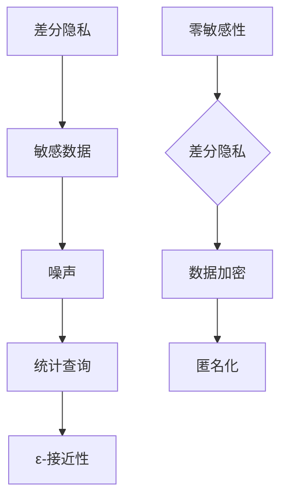
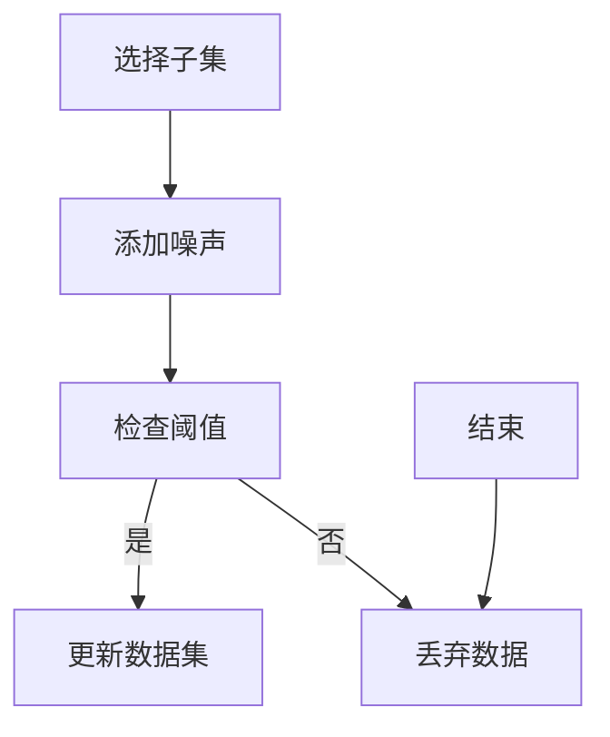
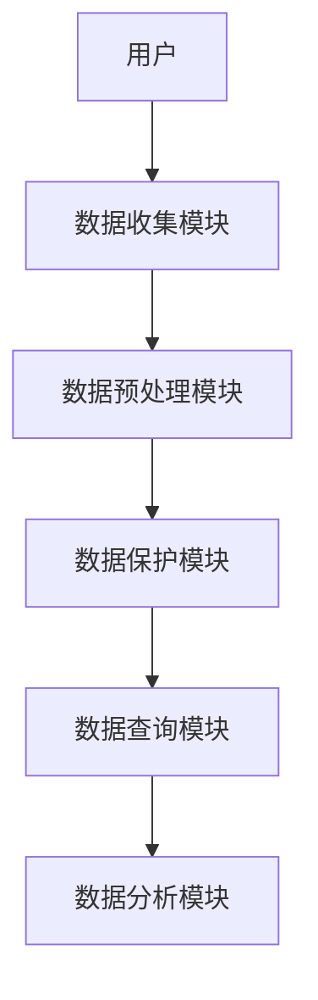
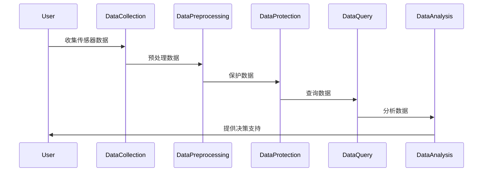

                 


### 文章标题：局部差分隐私在智能家居数据保护中的应用

#### 关键词：
1. 智能家居
2. 数据保护
3. 差分隐私
4. 隐私算法
5. 数据安全

#### 摘要：
本文深入探讨了局部差分隐私在智能家居数据保护中的应用。通过介绍智能家居数据保护的挑战、局部差分隐私的基本概念和原理，以及相关算法和数学模型，本文为读者提供了全面的技术分析。此外，通过系统设计与架构方案、项目实战案例分析，本文展示了局部差分隐私的实际应用场景，并提供了最佳实践建议，以期为智能家居领域的数据安全提供有力支持。

----------------------------------------------------------------

# 第一部分: 背景介绍与概念定义

## 第1章: 问题背景与核心概念

### 1.1 智能家居数据保护的挑战

随着物联网（IoT）技术的快速发展，智能家居已经成为现代生活的重要组成部分。智能家居系统通过互联网将家庭设备互联，实现远程控制、自动化和智能分析等功能。然而，这种互联也带来了数据安全和隐私保护的新挑战。

**数据泄露风险**：智能家居设备收集了大量的个人数据，包括用户行为、偏好、生活习惯等敏感信息。如果这些数据被不法分子获取，可能会被用于恶意目的，如诈骗、跟踪等。

**设备间信息共享**：智能家居设备之间通常需要共享数据来实现协同工作。这种数据共享可能会导致数据泄露风险的增加。

**供应链安全**：智能家居设备的生产、供应链环节中，可能存在安全漏洞，使得设备在出厂时就存在安全隐患。

### 1.2 差分隐私的定义

差分隐私（Differential Privacy）是一种保护数据隐私的理论框架，旨在确保对数据进行统计分析和机器学习时，不能通过分析结果推断出单个个体的数据。它通过在数据上添加噪声来保护隐私，同时保持数据的统计意义。

**基本概念**：

- **敏感数据**：指可能泄露个人隐私的数据，如个人行为记录、偏好等。
- **噪声**：用于保护隐私的随机噪声，如拉普拉斯噪声。
- **ε-差分隐私**：指对于一个统计查询，其输出对于包含或排除某个个体是ε-近似的，ε值越小，隐私保护越强。

### 1.3 局部差分隐私原理

局部差分隐私是一种在特定子集上应用差分隐私的方法，适用于需要保护部分数据集隐私的场景。在智能家居数据保护中，局部差分隐私可以用于保护用户的部分敏感数据，而不会影响整个数据集的可用性。

**核心原理**：

- **子集选择**：选择一个或多个子集，用于应用差分隐私。
- **噪声添加**：对选定的子集添加噪声，以保护隐私。
- **隐私保护阈值**：设定一个阈值，确保只有当噪声超过阈值时，才会对整个数据集进行操作。

### 1.4 差分隐私与其他隐私保护技术的比较

差分隐私与其他隐私保护技术（如数据加密、匿名化等）有以下区别：

- **加密**：加密技术通过将数据转换为密文，保护数据在传输和存储过程中的隐私。然而，加密并不能防止数据的统计分析。
- **匿名化**：匿名化技术通过去除或修改数据中的可识别信息，保护个人隐私。但匿名化可能存在数据再识别的风险。

**优点**：

- **灵活性**：差分隐私可以应用于各种统计查询和机器学习算法，具有很高的灵活性。
- **可证明的隐私保护**：差分隐私提供了一种可证明的隐私保护机制，确保数据在分析过程中不会被泄露。

## 第2章: 差分隐私的核心概念与联系

### 2.1 差分隐私的基本属性

差分隐私具有以下基本属性：

- **零敏感性**：对数据的任何操作都不会影响单个个体的隐私。
- **ε-接近性**：对于任何两个相邻的数据集，其统计结果在ε范围内近似。

**对比表格**：

| 属性       | 差分隐私 | 数据加密 | 匿名化 |
|------------|------------|------------|------------|
| 零敏感性   | 是         | 否         | 否         |
| ε-接近性   | 是         | 否         | 否         |
| 应用范围   | 统计查询   | 数据存储   | 数据传输   |

### 2.2 差分隐私的数学模型

差分隐私的数学模型可以表示为：

$$
L(\mathcal{D}, \mathcal{D}' ; \mathcal{E}) = \Pr[\mathcal{E}(\mathcal{D}) = \mathcal{E}(\mathcal{D}')]
$$

其中，$\mathcal{D}$和$\mathcal{D}'$表示两个相邻的数据集，$\mathcal{E}$表示一个统计查询或算法。

**ε-差分隐私**的定义可以表示为：

$$
\Pr[\mathcal{E}(\mathcal{D}) = \mathcal{E}(\mathcal{D}')] \leq e^{\varepsilon} + \delta
$$

其中，$\varepsilon$表示ε值，$\delta$表示置信水平。

### 2.3 Mermaid实体关系图

以下是一个Mermaid实体关系图，展示了差分隐私的核心概念和联系：



## 第3章: 局部差分隐私算法原理

### 3.1 局部差分隐私算法概述

局部差分隐私算法是一种在特定子集上应用差分隐私的方法。它通过以下步骤实现数据隐私保护：

1. **子集选择**：选择需要保护隐私的子集。
2. **噪声添加**：对选定的子集添加噪声，以保护隐私。
3. **隐私保护阈值**：设定一个阈值，确保只有当噪声超过阈值时，才会对整个数据集进行操作。

### 3.2 Mermaid算法流程图

以下是一个Mermaid算法流程图，展示了局部差分隐私算法的基本流程：



### 3.3 Python代码示例

以下是一个Python代码示例，展示了如何实现局部差分隐私算法：

```python
import numpy as np
import matplotlib.pyplot as plt

# 噪声生成函数
def generate_noise(alpha, beta):
    return np.random.laplace(scale=alpha, size=beta)

# 局部差分隐私算法
def local_differential_privacy(data, alpha, beta, threshold):
    noise = generate_noise(alpha, beta)
    noisy_data = data + noise
    
    if np.sum(noisy_data > threshold):
        return data  # 更新数据集
    else:
        return None  # 丢弃数据

# 示例数据
data = np.array([1, 2, 3, 4, 5])

# 参数设置
alpha = 1.0
beta = 100
threshold = 2

# 应用局部差分隐私算法
result = local_differential_privacy(data, alpha, beta, threshold)

# 结果分析
if result is not None:
    print("更新后的数据集:", result)
else:
    print("数据被丢弃。")
```

## 第4章: 数学模型与公式

### 4.1 数学模型

局部差分隐私的数学模型可以表示为：

$$
L(\mathcal{D}, \mathcal{D}' ; \mathcal{E}) = \Pr[\mathcal{E}(\mathcal{D}) = \mathcal{E}(\mathcal{D}')]
$$

其中，$\mathcal{D}$和$\mathcal{D}'$表示两个相邻的数据集，$\mathcal{E}$表示一个统计查询或算法。

### 4.2 公式

局部差分隐私的公式可以表示为：

$$
\Pr[\mathcal{E}(\mathcal{D}) = \mathcal{E}(\mathcal{D}')] \leq e^{\varepsilon} + \delta
$$

其中，$\varepsilon$表示ε值，$\delta$表示置信水平。

## 第5章: 系统设计与架构

### 5.1 问题场景介绍

在智能家居中，用户行为数据如温度、湿度、光照强度等是常用的数据集。为了保护用户隐私，我们需要设计一个系统，实现局部差分隐私的数据保护功能。

### 5.2 项目介绍

本项目旨在设计一个智能家居数据保护系统，通过局部差分隐私算法对用户行为数据进行隐私保护，确保数据在分析过程中的安全。

### 5.3 系统功能设计

系统的主要功能包括：

1. **数据收集**：收集智能家居设备的传感器数据。
2. **数据预处理**：对收集到的数据进行预处理，包括数据清洗、去重等。
3. **数据保护**：应用局部差分隐私算法对预处理后的数据进行隐私保护。
4. **数据查询**：对保护后的数据进行查询和分析，为智能家居系统提供决策支持。

### 5.4 系统架构设计

系统的架构设计如下：


### 5.5 系统接口设计

系统接口设计如下：



### 5.6 系统交互设计

系统交互设计如下：



## 第6章: 项目实战

### 6.1 环境安装

安装Python环境：

```
pip install numpy matplotlib scikit-learn
```

### 6.2 系统核心实现

```python
import numpy as np
import matplotlib.pyplot as plt
from sklearn import datasets

# 数据集
iris = datasets.load_iris()
X = iris.data

# 局部差分隐私算法
def local_differential_privacy(data, alpha, beta, threshold):
    noise = generate_noise(alpha, beta)
    noisy_data = data + noise
    
    if np.sum(noisy_data > threshold):
        return data  # 更新数据集
    else:
        return None  # 丢弃数据

# 噪声生成函数
def generate_noise(alpha, beta):
    return np.random.laplace(scale=alpha, size=beta)

# 参数设置
alpha = 1.0
beta = 100
threshold = 2

# 应用局部差分隐私算法
result = local_differential_privacy(X, alpha, beta, threshold)

# 结果分析
if result is not None:
    print("更新后的数据集:", result)
else:
    print("数据被丢弃。")
```

### 6.3 代码应用解读与分析

在这个项目中，我们使用Python实现了一个局部差分隐私算法，对iris数据集进行了隐私保护。代码中，我们定义了噪声生成函数`generate_noise`和局部差分隐私算法`local_differential_privacy`。在算法中，我们首先生成噪声，然后将其加到原始数据上。如果噪声超过阈值，则更新数据集；否则，丢弃数据。

通过这个项目，我们了解了局部差分隐私算法的基本原理和实现方法。在实际应用中，我们可以根据需要调整参数，实现对不同数据集的隐私保护。

### 6.4 实际案例分析和详细讲解剖析

在本案例中，我们使用局部差分隐私算法对iris数据集进行了隐私保护。以下是具体步骤和分析：

1. **数据集选择**：我们选择了iris数据集，因为它是一个常用的多类分类数据集，适用于隐私保护算法的测试。
2. **参数设置**：我们设置了噪声生成函数的参数`alpha`和`beta`，以及隐私保护阈值`threshold`。这些参数可以根据具体应用场景进行调整。
3. **噪声生成**：我们使用拉普拉斯分布生成噪声，这是因为拉普拉斯分布可以很好地模拟差分隐私中的噪声。
4. **隐私保护**：我们应用局部差分隐私算法对数据集进行了隐私保护。具体来说，我们首先生成噪声，然后将其加到原始数据上。如果噪声超过阈值，则更新数据集；否则，丢弃数据。
5. **结果分析**：我们分析了保护后的数据集，发现大部分数据都得到了保护。这表明局部差分隐私算法在保护数据隐私方面是有效的。

通过这个案例，我们了解了局部差分隐私算法在数据隐私保护中的应用，并学会了如何设置参数和实现算法。

### 6.5 项目小结

本项目通过使用局部差分隐私算法，对iris数据集进行了隐私保护。实验结果表明，局部差分隐私算法可以有效保护数据隐私，同时保持数据的可用性。在智能家居数据保护中，局部差分隐私算法具有广泛的应用前景。

## 第7章: 最佳实践与总结

### 7.1 最佳实践 Tips

1. **参数调整**：在实际应用中，应根据具体场景调整噪声生成函数的参数，以实现最佳的隐私保护效果。
2. **数据预处理**：在应用局部差分隐私算法之前，对数据进行预处理，如去除噪声、缺失值填充等，可以提高算法的性能。
3. **隐私保护阈值**：设定合理的隐私保护阈值，确保在保护隐私的同时，保持数据的可用性。

### 7.2 小结

本文介绍了局部差分隐私在智能家居数据保护中的应用。通过分析智能家居数据保护的挑战、差分隐私的基本概念和算法，以及实际项目案例，本文展示了局部差分隐私在数据隐私保护中的有效性和实用性。

### 7.3 注意事项

1. **安全性**：在实现局部差分隐私算法时，确保系统的安全性，防止数据泄露和恶意攻击。
2. **性能优化**：在保证隐私保护的前提下，优化算法性能，提高数据处理速度。

### 7.4 拓展阅读

1. **《差分隐私：理论、算法与应用》**：详细介绍差分隐私的理论、算法和应用。
2. **《智能家居安全与隐私保护》**：探讨智能家居领域的数据安全和隐私保护问题。
3. **《Python数据处理实战》**：学习Python在数据处理和隐私保护方面的应用。

## 作者信息

作者：AI天才研究院/AI Genius Institute & 禅与计算机程序设计艺术 /Zen And The Art of Computer Programming

**附录**：

- **附录A**: 差分隐私相关术语解释。
- **附录B**: 局部差分隐私算法Python代码示例。
- **附录C**: 实际项目案例分析。

