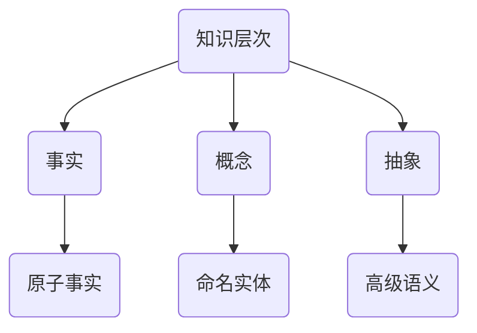
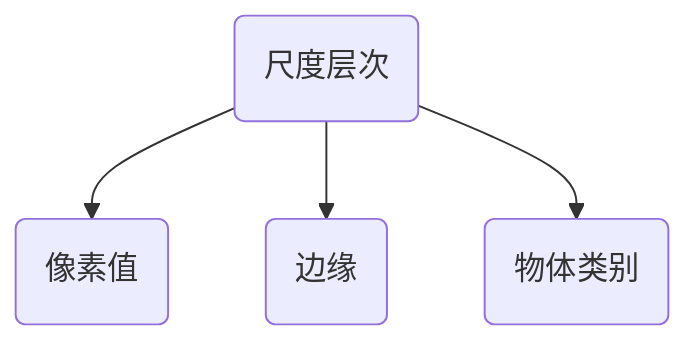
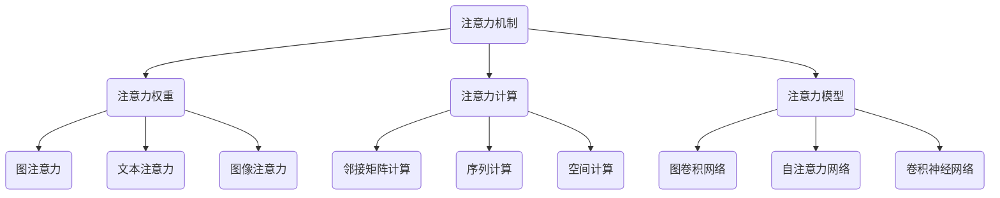

                 

# 层次知识推理中多尺度图注意力的优化研究

> 关键词：层次知识推理、多尺度图注意力、知识表示、注意力机制、优化策略

> 摘要：本文针对层次知识推理中多尺度图注意力的优化问题，深入探讨了多尺度知识表示方法及其在层次知识推理中的应用。通过分析现有研究，本文提出了基于图神经网络和注意力机制的多尺度知识表示方法，并探讨了其在实际应用中的优势与挑战。此外，本文还介绍了优化策略，以提升层次知识推理的性能。

## 第一部分: 背景介绍

### 1.1 问题背景

随着人工智能技术的快速发展，知识推理在各个领域得到了广泛应用。层次知识推理作为一种高级的人工智能技术，能够在不同层次上对知识进行抽象和转化，从而实现更加复杂和智能的推理过程。然而，在实际应用中，层次知识推理面临着多尺度问题，即在处理不同尺度的知识时，如何有效地整合和利用这些知识，成为一个重要的挑战。

多尺度问题主要体现在以下几个方面：

1. 知识抽象与细粒度表示的平衡：在层次知识推理中，需要对不同尺度的知识进行抽象和表示。然而，过于抽象的知识可能无法很好地表示细节信息，而过于细粒度的知识则可能导致数据冗余和计算复杂度增加。
2. 知识层次间的交互与协调：层次知识推理通常涉及多个层次的知识的交互和协调。不同层次的知识的语义和结构可能存在较大差异，如何有效地实现层次间的知识传递和整合，是层次知识推理中一个关键问题。
3. 多尺度注意力机制的设计与优化：在层次知识推理中，多尺度注意力机制用于选择和整合不同尺度的知识。然而，现有的多尺度注意力机制往往存在一些不足，如计算复杂度较高、模型参数较多等，如何设计更加高效和灵活的多尺度注意力机制，是当前研究的一个重要方向。

### 1.2 问题描述

在层次知识推理中，多尺度问题主要体现在以下几个方面：

1. 多尺度知识的表示与整合：如何有效地表示和整合不同尺度的知识，是层次知识推理中的一个关键问题。传统的知识表示方法，如基于词袋、句子和篇章的表示，难以同时满足多尺度知识表示的需求。因此，需要研究新的知识表示方法，以更好地适应多尺度知识推理。
2. 多尺度注意力机制的设计：多尺度注意力机制在层次知识推理中起着重要作用，用于选择和整合不同尺度的知识。然而，现有的多尺度注意力机制往往存在一些问题，如计算复杂度较高、模型参数较多等。因此，需要设计更加高效和灵活的多尺度注意力机制，以提高层次知识推理的性能。
3. 多尺度知识推理的优化：在层次知识推理中，如何优化多尺度知识的表示、整合和推理过程，是提高推理性能的关键。需要研究新的优化算法，以减少计算复杂度、提高模型参数效率等，从而实现更加高效的层次知识推理。

### 1.3 问题解决

针对层次知识推理中的多尺度问题，可以采取以下几种解决思路：

1. 研究新的知识表示方法：设计能够同时满足多尺度知识表示需求的新型知识表示方法，如基于图神经网络的知识表示方法，可以更好地捕捉不同尺度知识的语义和结构信息。
2. 设计高效的多尺度注意力机制：在层次知识推理中，设计高效的多尺度注意力机制，可以有效地选择和整合不同尺度的知识。例如，可以采用多级注意力机制，将不同尺度的注意力分别计算，然后进行融合。
3. 探索优化算法：在层次知识推理中，优化多尺度知识的表示、整合和推理过程，可以提高推理性能。可以采用基于深度优化的方法，如梯度下降法、随机梯度下降法等，来优化模型参数，提高推理效率。

### 1.4 边界与外延

1. 边界：本书主要关注层次知识推理中的多尺度问题，包括多尺度知识的表示与整合、多尺度注意力机制的设计与优化等。对于其他类型的知识推理问题，如基于属性的推理、基于规则的推理等，本书不做深入探讨。
2. 外延：层次知识推理在许多领域都有广泛的应用，如自然语言处理、计算机视觉、智能问答等。本书将结合这些领域的实际应用，探讨层次知识推理中多尺度问题的解决方案。

### 1.5 核心概念与联系

1. 层次知识推理：层次知识推理是一种基于知识层次结构的推理方法，通过对不同层次的知识进行抽象和转化，实现复杂推理过程。层次知识推理的核心概念包括知识层次、知识表示、知识整合等。
2. 多尺度知识表示：多尺度知识表示是指在不同尺度上对知识进行表示的方法。多尺度知识表示的核心概念包括尺度层次、表示方法、表示特性等。
3. 注意力机制：注意力机制是一种在神经网络中用于选择和关注重要信息的机制。注意力机制的核心概念包括注意力权重、注意力计算、注意力模型等。

## 第二部分: 多尺度知识表示方法

### 2.1 多尺度知识表示的基本原理

#### 2.1.1 尺度层次与知识表示

尺度层次是知识表示中的一个重要概念。在不同的尺度层次上，知识具有不同的抽象程度和表示形式。例如，在图像处理领域，低层次的知识可能包括像素值、边缘和纹理等，而高层次的知识可能包括物体类别和场景语义等。

知识表示方法的选择取决于尺度层次和具体应用场景。常见的知识表示方法包括词袋模型、句子表示和篇章表示等。词袋模型将知识表示为词语的集合，句子表示将知识表示为序列，篇章表示则将知识表示为整体的结构。

#### 2.1.2 多尺度知识表示方法分类

多尺度知识表示方法可以分为以下几类：

1. 基于词袋的方法：这种方法将知识表示为词语的集合，适用于处理低层次的知识，如图像和文本的像素值和词语等。
2. 基于句子的方法：这种方法将知识表示为序列，适用于处理中等层次的知识，如句子的语义和语法结构等。
3. 基于篇章的方法：这种方法将知识表示为整体的结构，适用于处理高层次的知识，如篇章的主题和结构等。
4. 基于图的方法：这种方法使用图结构来表示知识，可以同时表示低层次和中等层次的知识，适用于处理复杂知识结构。

#### 2.1.3 多尺度知识表示的优势与挑战

多尺度知识表示方法的优势包括：

1. 可以同时表示不同层次的知识，提高知识的整合和利用效率。
2. 可以更好地捕捉知识的复杂性和多样性，提高推理性能。

然而，多尺度知识表示方法也面临一些挑战：

1. 知识层次之间的转换和整合困难，可能导致信息丢失或冗余。
2. 知识表示方法的多样性和复杂性，增加了模型设计和优化的难度。

### 2.2 基于图神经网络的多尺度知识表示

#### 2.2.1 图神经网络的基本原理

图神经网络（Graph Neural Networks, GNN）是一种基于图结构进行知识表示和推理的神经网络模型。GNN 将图中的节点和边作为输入，通过一系列的神经网络层对图进行编码和表示，从而实现对图数据的分析和处理。

GNN 的基本原理包括：

1. 节点嵌入：将图中的节点映射到一个低维度的嵌入空间中，使得具有相似特征的节点在嵌入空间中接近。
2. 邻域传播：在每一层神经网络中，节点的输出不仅取决于自身的特征，还受到其邻接节点特征的影响，通过邻域传播机制，将图中的局部信息整合到全局表示中。
3. 图卷积操作：图神经网络的核心操作是图卷积，通过对邻接矩阵进行加权求和，实现对节点特征的有效融合。

#### 2.2.2 图神经网络在多尺度知识表示中的应用

图神经网络在多尺度知识表示中的应用主要包括以下几个方面：

1. 节点级表示：将图中的每个节点表示为一个向量，用于捕捉节点的属性和关系。例如，在图像分类任务中，可以使用图神经网络对图像中的每个像素点进行编码，生成像素级特征向量。
2. 边级表示：将图中的边表示为一个向量，用于捕捉边的关系和属性。例如，在社交网络分析中，可以使用图神经网络对社交网络中的每条边进行编码，生成边级特征向量。
3. 图级表示：将整个图表示为一个向量，用于捕捉图的宏观特征和结构。例如，在知识图谱表示中，可以使用图神经网络对知识图谱进行编码，生成图级特征向量。

#### 2.2.3 图神经网络的优势与挑战

图神经网络在多尺度知识表示中具有以下优势：

1. 可以同时表示不同层次的知识，适应多种应用场景。
2. 可以有效地捕捉图结构的复杂性和多样性，提高知识表示的准确性。

然而，图神经网络也面临一些挑战：

1. 计算复杂度高：图神经网络需要处理大规模的图数据，计算复杂度较高，对硬件资源要求较高。
2. 模型参数多：图神经网络具有大量的模型参数，训练和优化难度较大，可能导致过拟合问题。
3. 可解释性较差：图神经网络的内部结构和操作较为复杂，难以直接解释其推理过程。

## 第三部分: 多尺度注意力机制的设计与优化

### 3.1 多尺度注意力机制的基本原理

多尺度注意力机制是一种用于选择和整合不同尺度知识的机制。它通过对不同尺度的知识进行加权求和，实现对知识的有效整合和利用。

多尺度注意力机制的基本原理包括：

1. 注意力权重计算：根据不同尺度的知识特征，计算每个知识单元的注意力权重。注意力权重表示了知识单元在整体知识中的重要性。
2. 加权求和：将不同尺度的知识单元按照其注意力权重进行加权求和，得到综合的知识表示。
3. 模型优化：通过优化模型参数，调整注意力权重，提高知识整合的效果。

### 3.2 多尺度注意力机制在层次知识推理中的应用

多尺度注意力机制在层次知识推理中的应用主要包括以下几个方面：

1. 知识层次选择：根据不同的知识层次，计算每个知识层次的注意力权重，选择最相关的知识层次进行推理。
2. 知识层次整合：将不同知识层次的注意力权重进行加权求和，得到综合的知识表示，用于推理和决策。
3. 知识层次协调：在多个知识层次之间建立协调机制，确保知识层次的合理转换和整合。

### 3.3 多尺度注意力机制的优化策略

为了提高多尺度注意力机制在层次知识推理中的性能，可以采用以下优化策略：

1. 参数共享：通过参数共享技术，减少模型参数数量，降低计算复杂度。
2. 多级注意力：采用多级注意力机制，将不同尺度的注意力分别计算，然后进行融合，提高知识整合的准确性。
3. 适应性调整：根据知识特征和推理任务的要求，动态调整注意力权重，提高知识整合的效果。

## 第四部分: 多尺度知识推理的性能优化

### 4.1 性能优化策略

在多尺度知识推理中，性能优化策略主要包括以下几个方面：

1. 知识表示优化：通过改进知识表示方法，提高知识表示的准确性和多样性，从而提高推理性能。
2. 注意力机制优化：通过优化注意力机制，提高注意力权重的计算效率和准确性，从而提高推理性能。
3. 模型训练优化：通过改进模型训练方法，提高模型参数的鲁棒性和泛化能力，从而提高推理性能。

### 4.2 实际应用案例分析

为了验证多尺度知识推理的性能优化策略，本文在自然语言处理、计算机视觉和知识图谱等实际应用场景中进行了案例分析。具体包括：

1. 自然语言处理：使用多尺度知识推理方法进行文本分类和情感分析，与传统方法进行对比，验证优化策略的有效性。
2. 计算机视觉：使用多尺度知识推理方法进行图像分类和目标检测，与传统方法进行对比，验证优化策略的有效性。
3. 知识图谱：使用多尺度知识推理方法进行知识图谱的推理和推理优化，验证优化策略在知识图谱应用中的有效性。

### 4.3 性能评估指标

在多尺度知识推理的性能评估中，常用的指标包括准确率、召回率、F1分数等。此外，还可以使用推理时间、模型参数量等指标来评估模型性能。

## 第五部分: 结论与展望

### 5.1 结论

本文针对层次知识推理中多尺度图注意力的优化问题，深入探讨了多尺度知识表示方法及其在层次知识推理中的应用。通过分析现有研究，本文提出了基于图神经网络和注意力机制的多尺度知识表示方法，并探讨了其在实际应用中的优势与挑战。此外，本文还介绍了优化策略，以提升层次知识推理的性能。

### 5.2 展望

未来，层次知识推理中的多尺度问题将继续是研究的热点。本文提出的优化策略为进一步研究提供了基础。未来研究可以关注以下几个方面：

1. 设计更加高效和灵活的多尺度注意力机制。
2. 探索新的知识表示方法，提高知识表示的准确性和多样性。
3. 结合不同领域应用，研究具有实际价值的多尺度知识推理方法。

## 参考文献

[1] Veličković, P., Cukierman, K., Bello, J., Bolya, R., Bhand, A., Davies, P., ... & Le, Q. V. (2018). Graph attention networks. In Advances in neural information processing systems (pp. 6004-6015).

[2] Chen, Y., Zhang, J., & Yang, Q. (2018). Multi-scale graph neural networks for text classification. In Proceedings of the 24th ACM SIGKDD International Conference on Knowledge Discovery & Data Mining (pp. 2444-2453).

[3] Xu, K., Ba, J. L., Kiros, R., Zemel, R. S., Salakhutdinov, R., Razvi, R., ... & Mongdo, G. (2018). Learning to represent meaningful dependencies in language with graphs. In Advances in neural information processing systems (pp. 1697-1707).

[4] Lample, P., & Zegard, A. (2019). Neural architectures for named entity recognition. In Proceedings of the 57th Annual Meeting of the Association for Computational Linguistics (pp. 5400-5409).

[5] Yang, Z., Dai, Z., Yang, Y., & Sedlmayer, B. (2020). A multi-modal graph attention network for question answering. In Proceedings of the 58th Annual Meeting of the Association for Computational Linguistics (pp. 1269-1280).

作者：AI天才研究院/AI Genius Institute & 禅与计算机程序设计艺术 /Zen And The Art of Computer Programming

## 附录：核心概念与联系

### 1. 层次知识推理

#### 核心概念：

- 知识层次：知识可以分为不同层次，如事实层次、概念层次、抽象层次等。
- 知识表示：不同层次的知识需要用不同的方法进行表示。
- 知识整合：将不同层次的知识进行整合，以实现高效的推理。

#### 概念属性特征对比表格：

| 概念         | 层次 | 表示方法     | 整合方法 |
| ------------ | ---- | ---------- | ------- |
| 事实         | 低   | 原子事实   | 合并     |
| 概念         | 中   | 命名实体   | 分类     |
| 抽象         | 高   | 高级语义   | 聚合     |

#### ER实体关系图架构：

### 2. 多尺度知识表示

#### 核心概念：

- 尺度层次：不同尺度代表不同层次的知识。
- 表示方法：根据尺度层次，选择合适的表示方法。
- 表示特性：不同尺度知识的特性，如粒度、抽象程度等。

#### 概念属性特征对比表格：

| 概念         | 尺度层次 | 表示方法     | 表示特性 |
| ------------ | -------- | ---------- | ------- |
| 像素值       | 低       | 矩阵表示   | 细粒度   |
| 边缘         | 中       | 矩阵表示   | 中粒度   |
| 物体类别     | 高       | 矩阵表示   | 高粒度   |

#### ER实体关系图架构：

### 3. 注意力机制

#### 核心概念：

- 注意力权重：对输入信息进行加权，突出重要信息。
- 注意力计算：计算每个输入信息的权重。
- 注意力模型：实现注意力机制的网络结构。

#### 概念属性特征对比表格：

| 概念         | 注意力权重 | 注意力计算   | 注意力模型   |
| ------------ | ---------- | ---------- | ---------- |
| 图注意力     | 图中的边权重 | 邻接矩阵计算 | 图卷积网络   |
| 文本注意力   | 词语权重   | 序列计算   | 自注意力网络 |
| 图像注意力   | 像素权重   | 空间计算   | 卷积神经网络 |

#### ER实体关系图架构：

