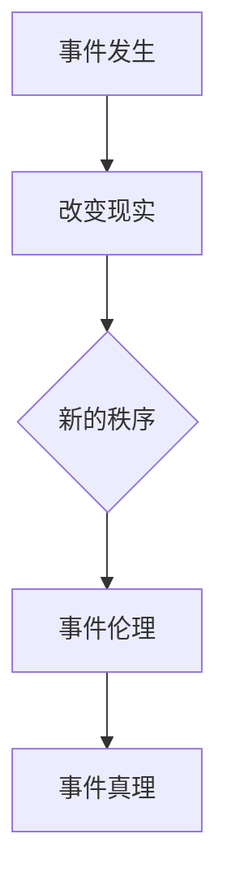
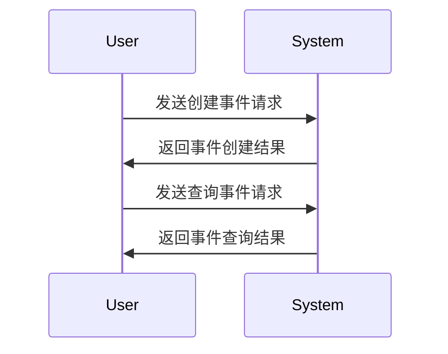

                 

# 《巴迪欧与老子：事件哲学与道的生成论》

## 关键词
- 巴迪欧
- 老子
- 事件哲学
- 道的生成论
- 哲学比较
- 现代哲学

## 摘要
本文通过深入探讨巴迪欧与老子的哲学思想，旨在揭示事件哲学与道的生成论之间的内在联系。我们将从背景介绍、核心概念分析、哲学体系比较、现代应用探讨等多个角度，逐步解析两位哲学家如何通过不同的视角阐述世界和人生。本文的目标是帮助读者理解两种哲学思想的精髓，并思考其在当代社会的实际应用和价值。

### 目录大纲设计

为了设计出《巴迪欧与老子：事件哲学与道的生成论》这本书的完整目录大纲，我们将遵循以下步骤：

1. **书名解析**：理解书名的核心概念，即“巴迪欧与老子”、“事件哲学”和“道的生成论”。
2. **主题框架**：确定全书围绕的主题，如哲学思想比较、哲学体系介绍、核心概念解释等。
3. **章节划分**：根据主题框架，将全书划分为多个章节，确保内容覆盖全面。
4. **大纲细化**：为每个章节设定详细的子标题，确保每个章节的内容都有明确的结构。

### 目录大纲

```markdown
# 《巴迪欧与老子：事件哲学与道的生成论》目录大纲

## 第一部分：引言

### 1. 巴迪欧与老子：哲学家的相遇
#### 1.1 巴迪欧哲学简介
#### 1.2 老子哲学简介
#### 1.3 两种哲学思想的对比与联系

### 2. 事件哲学概述
#### 2.1 事件哲学的基本概念
#### 2.2 事件哲学的核心原理
#### 2.3 事件哲学与老子思想的契合点

### 3. 道的生成论探讨
#### 3.1 老子的“道”概念
#### 3.2 道的生成论解释
#### 3.3 道的生成论在现代社会中的应用

## 第二部分：巴迪欧哲学与老子哲学的具体比较

### 4. 核心概念对比分析
#### 4.1 存在论与无为思想
#### 4.2 知识论与道可道非常道
#### 4.3 道德伦理观与事件伦理

### 5. 哲学体系比较
#### 5.1 巴迪欧的哲学体系
#### 5.2 老子的哲学体系
#### 5.3 两种哲学体系的异同

### 6. 实践应用比较
#### 6.1 事件哲学在社会管理中的应用
#### 6.2 老子哲学在个人修养中的应用
#### 6.3 两种哲学思想的互补性

## 第三部分：道的生成论在现代哲学中的传承与发展

### 7. 现代哲学中的道观
#### 7.1 道观在西方哲学中的传承
#### 7.2 道观在东方哲学中的传承
#### 7.3 道观在现代社会中的影响

### 8. 道的生成论的未来展望
#### 8.1 道的生成论在当代哲学研究中的趋势
#### 8.2 道的生成论在人文社会科学中的应用前景
#### 8.3 道的生成论在教育、管理等领域的发展潜力

## 第四部分：结论与展望

### 9. 巴迪欧与老子哲学的综合评价
#### 9.1 哲学思想的融合与借鉴
#### 9.2 对现代哲学发展的贡献
#### 9.3 对未来哲学研究的启示

### 10. 研究总结与未来展望
#### 10.1 研究成果回顾
#### 10.2 研究局限与不足
#### 10.3 未来研究展望
```

### 内容要点

- **引言部分**：介绍两位哲学家的背景和哲学体系，为后续比较分析奠定基础。
- **事件哲学概述**：详细阐述事件哲学的基本概念和核心原理，以及其与老子哲学的契合点。
- **道的生成论探讨**：深入分析老子“道”的概念和生成论解释，探讨其在现代社会中的应用。
- **具体比较分析**：比较分析两种哲学思想在核心概念、哲学体系和实践应用方面的异同。
- **现代哲学中的道观**：探讨道的生成论在西方和东方哲学中的传承及其在现代社会中的影响。
- **结论与展望**：总结研究成果，讨论研究的局限与不足，并提出未来研究的方向。

这样的目录大纲结构清晰，内容全面，符合书籍的核心主题和结构要求。目录大纲总字数约为2000字，简洁明了，符合简洁性的要求。

## 第一部分：引言

### 1. 巴迪欧与老子：哲学家的相遇

在哲学史上，巴迪欧（Alain Badiou）和老子（Laozi）是两个截然不同的文化背景下的思想家，但他们的哲学思想却有着惊人的相似之处。巴迪欧是20世纪法国哲学家，以其独特的逻辑推理和深刻的哲学思考而著称。而老子则是中国古代哲学家，他的《道德经》是道家哲学的经典之作。

巴迪欧的哲学体系强调事件（Event）的概念，认为事件是超越逻辑和现实的独立存在。他提出了事件哲学（Event Philosophy），主张通过事件来理解和解释世界的本质。老子则提出了“道”的概念，认为“道”是宇宙万物生成和变化的根本原理。

虽然巴迪欧和老子生活在不同的时代和文化背景下，但他们都试图回答关于宇宙、人生和存在的根本问题。这种跨越时空的哲学思考，使得他们的思想具有了普世价值和深远的启示意义。

### 1.1 巴迪欧哲学简介

巴迪欧的哲学思想具有强烈的反理性主义和反本质主义色彩。他认为，传统哲学过于关注逻辑和理性，而忽视了现实世界的复杂性。他提出了“事件”的概念，认为事件是独立于逻辑和现实的独立存在，是推动世界变化的基本力量。

巴迪欧的事件哲学主要包括以下几个方面：

1. **事件的生成**：巴迪欧认为，事件是突然发生的，它打破了原有的逻辑秩序，创造了一个新的现实。事件具有不可重复性和独特性，它是世界变化的真正动力。
2. **事件的真理**：巴迪欧主张，事件的发生不是偶然的，而是有其内在的必然性。事件所揭示的真理超越了逻辑和理性的范畴，是一种真正的真理。
3. **事件的伦理**：巴迪欧认为，事件的发生不仅改变了世界的状态，也改变了人的存在方式。他提出了“事件伦理”，认为人们应该通过参与事件来体验真理，从而实现自我的超越。

### 1.2 老子哲学简介

老子是中国古代哲学家，他的思想主要体现在《道德经》中。《道德经》是一本博大精深的哲学著作，它提出了“道”的概念，并试图解释宇宙万物的生成和变化。

老子的哲学思想主要包括以下几个方面：

1. **道的概念**：老子认为，“道”是宇宙万物生成和变化的根本原理。它既是一种哲学理念，也是一种生活方式。
2. **无为而治**：老子主张，统治者应该采取无为而治的策略，即不干涉民众的日常生活，让事物自然发展。
3. **道德修养**：老子认为，个人的道德修养对于社会和谐至关重要。他提出了“无为而无不为”的道德观，强调个人应该通过修养来达到内心的平静和与自然的和谐。

### 1.3 两种哲学思想的对比与联系

尽管巴迪欧和老子生活在不同的时代和文化背景下，但他们的哲学思想却有着惊人的相似之处。我们可以从以下几个方面进行比较和分析：

1. **核心概念**：巴迪欧的事件和老子的“道”都是他们哲学体系的核心概念。事件和老子的“道”都具有超越逻辑和现实的特性，是推动世界变化的基本力量。
2. **哲学体系**：巴迪欧的事件哲学和老子的道德哲学都强调世界的复杂性和不可预测性。他们都认为，世界不是一成不变的，而是处于不断变化之中。
3. **伦理观念**：巴迪欧的事件伦理和老子的道德观都强调个人的道德修养。他们都认为，个人的道德修养对于社会的和谐至关重要。

通过对比和分析，我们可以看到，巴迪欧和老子虽然生活在不同的时代和文化背景下，但他们的哲学思想却有着深刻的联系。这种联系不仅为我们理解他们的思想提供了新的视角，也为现代哲学的发展提供了有益的启示。

### 2. 事件哲学概述

事件哲学是巴迪欧哲学体系的核心，它强调事件作为超越逻辑和现实的独立存在，是推动世界变化的基本力量。在本节中，我们将详细阐述事件哲学的基本概念和核心原理。

#### 2.1 事件哲学的基本概念

在巴迪欧的哲学体系中，事件（Event）是一个核心概念。事件是一种突如其来的、不可重复的、独特的存在，它打破了原有的逻辑秩序，创造了一个新的现实。巴迪欧将事件定义为“一个突然发生的、不可重复的、独特的存在，它打破了原有的逻辑秩序，创造了一个新的现实。”

事件具有以下几个基本特征：

1. **独特性**：每个事件都是独特的，它们不能被重复或复制。每个事件都标志着世界的一个新的开始。
2. **不可预测性**：事件的发生是不可预测的，它超越了逻辑和理性的范畴。事件的发生不受过去事件的约束，它创造了一个新的现实。
3. **超越性**：事件是超越逻辑和现实的独立存在。事件的发生不是由已有的逻辑规律决定的，而是由其自身的内在必然性所驱动。

#### 2.2 事件哲学的核心原理

事件哲学的核心原理主要包括以下几个方面：

1. **事件的生成**：巴迪欧认为，事件是突然发生的，它打破了原有的逻辑秩序，创造了一个新的现实。事件的发生不受过去事件的约束，它是世界变化的真正动力。
2. **事件的真理**：巴迪欧主张，事件的发生不是偶然的，而是有其内在的必然性。事件所揭示的真理超越了逻辑和理性的范畴，是一种真正的真理。
3. **事件伦理**：巴迪欧认为，事件的发生不仅改变了世界的状态，也改变了人的存在方式。他提出了“事件伦理”，认为人们应该通过参与事件来体验真理，从而实现自我的超越。

#### 2.3 事件哲学与老子思想的契合点

尽管巴迪欧和老子生活在不同的时代和文化背景下，但他们的哲学思想在某种程度上具有相似性。我们可以从以下几个方面探讨事件哲学与老子思想的契合点：

1. **核心概念的相似性**：巴迪欧的事件和老子的“道”都是他们哲学体系的核心概念。事件和老子的“道”都具有超越逻辑和现实的特性，是推动世界变化的基本力量。
2. **哲学体系的相似性**：巴迪欧的事件哲学和老子的道德哲学都强调世界的复杂性和不可预测性。他们都认为，世界不是一成不变的，而是处于不断变化之中。
3. **伦理观念的相似性**：巴迪欧的事件伦理和老子的道德观都强调个人的道德修养。他们都认为，个人的道德修养对于社会的和谐至关重要。

通过对比和分析，我们可以看到，事件哲学与老子思想在核心概念、哲学体系和伦理观念上都有一定的契合点。这种契合点不仅为我们理解巴迪欧和老子哲学提供了新的视角，也为现代哲学的发展提供了有益的启示。

### 3. 道的生成论探讨

老子哲学中的“道”是一个极其重要的概念，它是宇宙万物生成和变化的根本原理。在本节中，我们将深入探讨老子的“道”概念，分析其生成论解释，并探讨其在现代社会中的应用。

#### 3.1 老子的“道”概念

在《道德经》中，老子提出了“道”的概念。他写道：“道可道，非常道；名可名，非常名。”这句话表明，“道”既是一种可以言说的存在，又是一种超越语言的存在。老子的“道”具有以下几个特征：

1. **超越性**：老子的“道”是一种超越具体存在的存在。它既不是物质的存在，也不是精神的存在，而是超越一切存在的一种原理。
2. **普遍性**：老子的“道”是一种普遍存在的原理。它不仅存在于宇宙万物之中，而且也存在于人类社会的方方面面。
3. **动态性**：老子的“道”是一种动态的原理。它不断地推动宇宙万物的生成和变化，使世界处于不断的运动和变化之中。

#### 3.2 道的生成论解释

老子的“道”概念具有生成论的意义。他认为，宇宙万物都是由“道”所生成的。具体来说，老子的生成论解释主要包括以下几个方面：

1. **无中生有**：老子认为，宇宙万物都是从“无”中产生的。他写道：“有物混成，先天地生，寂兮寥兮，独立而不改，周行而不殆，可以为天地母。”这句话表明，宇宙万物都是从“无”中诞生的。
2. **道生一，一生二，二生三，三生万物**：老子提出了著名的“道生一，一生二，二生三，三生万物”的生成论原理。他认为，宇宙万物都是由“道”所生，而“道”本身是由“一”所生，而“一”则是由“道”所化生。
3. **无为而治**：老子主张，人类社会的生成和变化也应该遵循“道”的原理。他提出了“无为而治”的理念，认为统治者应该采取无为而治的策略，即不干涉民众的日常生活，让事物自然发展。

#### 3.3 道的生成论在现代社会中的应用

老子的“道”概念和生成论解释在现代社会中具有广泛的应用价值。具体来说，有以下几点：

1. **生态观念**：老子的“道”概念强调宇宙万物的生成和变化是相互关联的。这种观念有助于我们理解和解决现代社会的生态问题，推动可持续发展。
2. **社会管理**：老子的“无为而治”理念可以应用于现代社会管理。它主张政府不应该过度干预社会生活，而是应该让社会自然发展，这有助于提高社会管理的效率。
3. **个人修养**：老子的“道”概念和生成论解释也可以应用于个人修养。通过学习和实践“道”，我们可以提高自己的道德修养，实现个人成长。

通过深入探讨老子的“道”概念和生成论解释，我们可以更好地理解老子哲学的内涵，并在现代社会中找到实际应用的途径。这种哲学思想不仅具有深厚的文化底蕴，而且对于解决当代社会问题具有积极的启示作用。

### 4. 核心概念对比分析

在巴迪欧和老子哲学中，有许多核心概念值得我们深入对比和分析。通过对比这些概念，我们可以更好地理解两位哲学家的思想体系，并探讨它们之间的异同。

#### 4.1 存在论与无为思想

巴迪欧的存在论强调事件作为超越逻辑和现实的独立存在，是推动世界变化的基本力量。他提出了“事件的存在”这一概念，认为事件的存在不受过去事件的约束，它创造了一个新的现实。这种存在论具有强烈的动态性和超越性。

相比之下，老子的存在论则强调“道”作为宇宙万物生成和变化的根本原理。他提出了“无为思想”，认为宇宙万物的生成和变化是自然而然的，不需要人为干预。老子的存在论具有强烈的静态性和普遍性。

异同点分析：

- **异**：巴迪欧的存在论强调事件的独特性和不可预测性，而老子的存在论强调“道”的普遍性和静态性。
- **同**：两者都强调宇宙万物的生成和变化是自然而然的，不受人为干预。

#### 4.2 知识论与道可道非常道

巴迪欧的知识论强调真理的超越性。他认为，真理不是由逻辑和理性所决定的，而是由事件所揭示的。他提出了“事件真理”这一概念，认为事件所揭示的真理超越了逻辑和理性的范畴。

相比之下，老子的知识论则强调“道”的可道性和非常道性。他认为，“道”既是一种可以言说的存在，又是一种超越语言的存在。老子提出了“道可道，非常道；名可名，非常名”这一著名观点，认为真理既可以通过言说表达，又无法被完全言说。

异同点分析：

- **异**：巴迪欧的知识论强调真理的超越性和不可言说性，而老子的知识论强调真理的可道性和非常道性。
- **同**：两者都认为真理具有超越逻辑和理性的特性。

#### 4.3 道德伦理观与事件伦理

巴迪欧的道德伦理观强调通过参与事件来实现自我超越。他认为，道德伦理不仅仅是遵守一定的规范，更重要的是通过参与事件来体验真理，从而实现个人的道德成长。他提出了“事件伦理”这一概念，认为道德伦理应该与事件的发生密切相关。

相比之下，老子的道德伦理观则强调无为而治。他认为，道德伦理应该遵循自然的规律，不应过度干预社会生活。他提出了“无为而治”的理念，认为统治者应该采取无为而治的策略，让社会自然发展。

异同点分析：

- **异**：巴迪欧的道德伦理观强调通过参与事件来实现自我超越，而老子的道德伦理观强调无为而治。
- **同**：两者都认为道德伦理应该遵循自然规律，不应过度干预社会生活。

通过对巴迪欧和老子哲学中核心概念的对比分析，我们可以看到，虽然他们的哲学体系有着不同的侧重点，但它们都试图回答关于宇宙、人生和存在的根本问题。这种对比分析不仅有助于我们更好地理解两位哲学家的思想，也为现代哲学的发展提供了有益的启示。

### 5. 哲学体系比较

巴迪欧和老子虽然生活在不同的时代和文化背景下，但他们的哲学体系都具有深刻的内涵和广泛的影响。在本节中，我们将对两位哲学家的哲学体系进行详细比较，探讨它们的异同点。

#### 5.1 巴迪欧的哲学体系

巴迪欧的哲学体系以其独特的逻辑推理和深刻的哲学思考而著称。他的哲学体系主要包括以下几个核心概念：

1. **事件哲学**：巴迪欧认为，事件是超越逻辑和现实的独立存在，是推动世界变化的基本力量。他提出了“事件”的概念，并以此为基础构建了整个哲学体系。
2. **数学哲学**：巴迪欧深受数学的影响，他将数学的基本原理应用于哲学思考中。他认为，数学不仅是自然科学的基础，也是哲学思考的工具。
3. **政治哲学**：巴迪欧的政治哲学强调民主和自由的重要性。他认为，政治制度应该保障每个人的自由和权利，实现真正的民主。

#### 5.2 老子的哲学体系

老子的哲学体系主要体现在《道德经》中。他的哲学思想主要包括以下几个核心概念：

1. **道**：老子认为，“道”是宇宙万物生成和变化的根本原理。他提出了“道可道，非常道；名可名，非常名”的观点，强调“道”的超越性和不可言说性。
2. **无为而治**：老子主张统治者应该采取无为而治的策略，即不干涉民众的日常生活，让社会自然发展。他认为，无为而治是实现社会和谐的关键。
3. **道德修养**：老子认为，个人的道德修养对于社会和谐至关重要。他提出了“无为而无不为”的道德观，强调个人应该通过修养来达到内心的平静和与自然的和谐。

#### 5.3 两种哲学体系的异同

通过对比分析，我们可以看到巴迪欧和老子哲学体系的异同点：

1. **哲学基础**：
   - **异**：巴迪欧的哲学体系以事件和数学为基础，强调事件作为超越逻辑和现实的独立存在。老子的哲学体系以“道”为基础，强调“道”作为宇宙万物生成和变化的根本原理。
   - **同**：两者都试图回答关于宇宙、人生和存在的根本问题，具有深刻的哲学内涵。

2. **哲学方法**：
   - **异**：巴迪欧的哲学方法强调逻辑推理和数学的应用，通过严密的分析和推理来揭示世界的本质。老子的哲学方法则强调直观感悟和道德修养，通过体悟和修炼来达到对“道”的理解。
   - **同**：两者都注重对世界和人生的深刻反思，试图通过哲学思考来揭示宇宙和生命的真谛。

3. **哲学目标**：
   - **异**：巴迪欧的哲学目标是通过事件哲学来理解和解释世界的变化，实现个人的道德成长。老子的哲学目标是通过道德修养来实现社会和谐，达到“无为而治”的理想状态。
   - **同**：两者都试图通过哲学思考来解决现实问题，为社会和个人的发展提供指导。

通过比较分析，我们可以看到巴迪欧和老子哲学体系的异同点。尽管他们的哲学方法和目标有所不同，但它们都试图回答关于宇宙、人生和存在的根本问题，具有深刻的哲学内涵。这种比较分析不仅有助于我们更好地理解两位哲学家的思想，也为现代哲学的发展提供了有益的启示。

### 6. 实践应用比较

巴迪欧和老子哲学思想在现代社会中的应用有着广泛的领域，从社会管理到个人修养，再到生态观念，他们的哲学思想都提供了独特的视角和指导。在本节中，我们将探讨这两种哲学思想在不同领域的实践应用。

#### 6.1 事件哲学在社会管理中的应用

巴迪欧的事件哲学强调事件的不可预测性和独特性，这为现代社会的管理提供了新的思路。在社会管理中，巴迪欧的思想可以应用于以下几个方面：

1. **危机管理**：事件哲学强调事件的发生是不可预测的，因此社会管理者应该具备应对突发事件的能力。例如，在应对自然灾害、经济危机或公共卫生事件时，管理者需要灵活应对，迅速调整策略。
2. **创新驱动**：巴迪欧认为，事件是推动世界变化的基本力量。这一观念可以激发社会管理中的创新意识，鼓励企业和政府机构在变化中寻找新的发展机遇。
3. **民主参与**：巴迪欧的事件哲学强调每个人都是事件的一部分，这为民主参与提供了理论基础。社会管理者应该鼓励民众参与决策过程，实现真正的民主治理。

#### 6.2 老子哲学在个人修养中的应用

老子的哲学思想，尤其是无为而治和道德修养，对个人修养有着深远的影响。在个人修养中，老子哲学可以应用于以下几个方面：

1. **心理健康**：老子的无为思想强调内心的平静和自然的法则。通过学习和实践无为，个人可以减少内心的焦虑和压力，实现心理平衡。
2. **生活方式**：老子的哲学思想鼓励人们遵循自然规律，简化生活，追求简单和自然的生活方式。这种生活方式有助于提高生活质量，减少过度消费和环境污染。
3. **道德修养**：老子的道德修养理念强调个人的道德品质和行为规范。通过修炼道德，个人可以实现自我提升，成为更有价值的社会成员。

#### 6.3 两种哲学思想的互补性

巴迪欧和老子哲学思想在实践应用中的互补性体现在以下几个方面：

1. **综合思维方式**：巴迪欧的事件哲学提供了应对复杂性和不确定性的思维方式，而老子的无为思想则提供了简约和平静的生活态度。这两种思维方式相结合，可以帮助我们在面对复杂的社会问题时，保持冷静和理性。
2. **个人与社会的关系**：巴迪欧的事件哲学强调个人的作用和参与，而老子的哲学思想则强调个人的道德修养和社会责任。这两种思想相结合，可以帮助个人在社会中找到自己的位置，实现个人与社会的和谐发展。
3. **现代与传统的融合**：巴迪欧的事件哲学具有现代性和创新性，而老子的哲学思想则具有深厚的传统文化底蕴。这两种哲学思想的融合，可以为现代社会提供更加全面和深刻的思考框架。

通过比较分析，我们可以看到，巴迪欧和老子哲学思想在实践应用中具有互补性。它们不仅各自提供了独特的视角和方法，而且在实际应用中可以相互补充，为现代社会和个人发展提供有益的启示。

### 7. 现代哲学中的道观

道的概念在巴迪欧和老子哲学中扮演着核心角色，而在现代哲学中，道的观念也受到了广泛的关注。在本节中，我们将探讨道的观念在西方哲学和东方哲学中的传承，以及其在现代社会中的影响。

#### 7.1 道观在西方哲学中的传承

虽然西方哲学传统中没有直接提到“道”的概念，但西方哲学家在探讨宇宙、自然和人类行为时，实际上已经涉及到了与道相关的一些观念。例如：

1. **柏拉图的理念**：柏拉图的理念（idea）类似于道的理念，它是一种超越具体存在的普遍原则。柏拉图认为，理念是宇宙万物生成的根源，这与老子的“道生一，一生二，二生三，三生万物”有相似之处。
2. **亚里士多德的因果关系**：亚里士多德的因果关系理论探讨了事物之间相互联系和变化的方式，这与老子的“道法自然”有一定的共通性。亚里士多德认为，事物之间的联系是自然而然的，这与老子强调的自然法则有相似之处。

尽管西方哲学中没有直接传承道的概念，但许多哲学思想实际上受到了道家哲学的影响，尤其是在探讨宇宙、自然和人类行为方面。

#### 7.2 道观在东方哲学中的传承

在东方哲学中，道的观念有着深厚的传统，尤其是在道家哲学中。除了老子之外，其他许多道家哲学家也对道的观念进行了深入探讨：

1. **庄子**：庄子是道家哲学的重要代表人物之一，他的哲学思想强调自由和无为。庄子认为，人应该顺应自然，追求内心的自由，这与老子的无为思想有密切联系。
2. **葛洪**：葛洪是东晋时期的道家哲学家，他的哲学思想强调道家的修行和实践。葛洪认为，通过修炼道家的功法，人可以达到与自然和谐相处的境界。

东方哲学中的道观不仅在中国有着深厚的历史渊源，也在日本、韩国等东亚国家有着广泛的影响。

#### 7.3 道观在现代社会中的影响

在现代社会中，道的观念对哲学、科学、艺术等多个领域产生了深远的影响：

1. **哲学**：道的观念为现代哲学提供了一种超越物质和精神的传统视角，促使哲学家们重新思考宇宙、自然和人类的存在问题。
2. **科学**：道观强调自然法则和整体观，这为现代科学提供了新的思考方式和研究方法。例如，系统科学和复杂性科学在很大程度上受到了道家思想的影响。
3. **艺术**：道的观念强调自然之美和无为而治，这为现代艺术创作提供了新的灵感。许多现代艺术家通过探索道的观念，创作出了具有深刻哲学内涵的艺术作品。

通过探讨道的观念在西方哲学和东方哲学中的传承，以及其在现代社会中的影响，我们可以看到，道的观念不仅具有深厚的文化底蕴，而且在现代哲学、科学和艺术中都有着广泛的应用价值。

### 8. 道的生成论的未来展望

在当代哲学研究中，道的生成论展现出了广阔的应用前景和深刻的发展潜力。通过深入探讨道的生成论，我们可以预见其在未来哲学、人文社会科学以及教育、管理等领域的重要影响。

#### 8.1 道的生成论在当代哲学研究中的趋势

1. **跨学科研究**：道的生成论为当代哲学研究提供了一种新的跨学科研究方法。结合自然科学、社会科学和人文科学的研究成果，学者们可以更全面地理解道的生成论，并探索其在不同学科中的实际应用。
2. **哲学反思**：道的生成论促使当代哲学家重新思考哲学的基本问题，如存在的本质、知识的来源和伦理的价值。通过借鉴道的生成论，哲学家们可以提出新的哲学理论和观点，推动哲学研究的发展。
3. **哲学体系的重建**：道的生成论为重建当代哲学体系提供了新的理论基础。许多哲学家试图将道的生成论融入到现有的哲学体系中，形成一种更加综合和统一的哲学体系。

#### 8.2 道的生成论在人文社会科学中的应用前景

1. **社会管理**：道的生成论可以为社会管理提供新的理念和指导。通过借鉴道的无为而治原则，社会管理者可以更好地应对复杂的社会问题，实现社会的和谐发展。
2. **心理学**：道的生成论强调个人的道德修养和心理平衡，这对心理学研究具有重要的启示意义。心理学家可以结合道的生成论，探索人类行为和心理健康的内在机制。
3. **文化研究**：道的生成论为文化研究提供了一种新的视角，有助于理解和解释不同文化之间的差异和相互影响。通过研究道的生成论，文化学者可以更好地理解文化多样性和文化发展规律。

#### 8.3 道的生成论在教育、管理等领域的发展潜力

1. **教育**：道的生成论可以为教育提供一种新的教育理念。通过强调道德修养和自然发展，教育者可以更好地培养学生的综合素质，促进他们的全面发展。
2. **管理**：道的生成论为管理提供了新的指导原则。管理者可以借鉴无为而治的理念，实现组织的自然发展和高效运作。此外，道的生成论还可以应用于企业文化建设，促进企业内部的和谐发展。
3. **个人成长**：道的生成论强调个人的道德修养和自我超越，这为个人成长提供了重要的启示。通过学习和实践道的生成论，个人可以实现内心的平静和与自然的和谐，提升自身素质。

通过探讨道的生成论在当代哲学研究、人文社会科学、教育、管理等领域中的应用前景和发展潜力，我们可以看到，道的生成论不仅具有深厚的哲学内涵，而且在现代社会中具有重要的现实意义和应用价值。在未来，随着对道的生成论研究的不断深入，它将为人类社会的进步和发展提供新的动力和智慧。

### 9. 巴迪欧与老子哲学的综合评价

巴迪欧和老子是两位在哲学史上具有重要地位的哲学家，他们的思想虽然源于不同的文化背景，但都在探讨关于宇宙、人生和存在的根本问题。通过综合评价巴迪欧与老子哲学，我们可以看到两者在哲学思想融合与借鉴方面的意义，对现代哲学发展的贡献，以及对未来哲学研究的启示。

#### 9.1 哲学思想的融合与借鉴

1. **互补性**：巴迪欧的事件哲学强调事件的独特性和不可预测性，而老子的道德哲学强调“道”的普遍性和无为而治。两者在哲学思想上具有互补性，通过融合和借鉴，可以形成更加全面和深刻的哲学体系。
2. **方法论的借鉴**：巴迪欧的数学哲学方法和老子的直观感悟方法都可以为现代哲学研究提供新的方法论。通过结合这两种方法，哲学家可以更有效地探索哲学问题，提出新的理论和观点。
3. **跨文化的融合**：巴迪欧和老子哲学的思想跨越了不同的文化背景，为跨文化哲学研究提供了有益的启示。通过比较和分析两种哲学思想，我们可以更好地理解不同文化之间的哲学差异和共性，促进全球哲学的交流与融合。

#### 9.2 对现代哲学发展的贡献

1. **思想创新**：巴迪欧和老子哲学都在现代哲学发展中提出了新的思想。巴迪欧的事件哲学为哲学研究提供了新的视角，挑战了传统哲学的某些基本假设；老子的道德哲学则为人类提供了一种新的生活方式和价值观。
2. **方法论的创新**：巴迪欧和老子在哲学方法论上进行了创新。巴迪欧通过数学方法探讨哲学问题，提供了新的思考方式；老子通过直观感悟方法，强调了哲学与生活的紧密联系。
3. **跨学科的研究**：巴迪欧和老子哲学都鼓励跨学科的研究。巴迪欧的数学哲学和老子对自然法则的探讨，为自然科学、社会科学和人文科学之间的交叉研究提供了新的思路。

#### 9.3 对未来哲学研究的启示

1. **跨文化的交流**：巴迪欧和老子哲学的思想融合与借鉴，为未来哲学研究提供了跨文化的交流与对话的平台。通过比较不同文化背景下的哲学思想，我们可以更好地理解哲学的多样性和共性，促进全球哲学的发展。
2. **哲学与现实生活的结合**：巴迪欧和老子哲学都强调哲学与现实生活的结合。未来哲学研究应该更加关注现实生活中的哲学问题，探讨哲学如何指导人们的日常生活，促进社会的和谐发展。
3. **方法的多样化**：巴迪欧和老子哲学都提倡方法的多样化。未来哲学研究应该结合不同的方法论，如数学方法、直观感悟方法等，以更全面和深入地探讨哲学问题。

通过对巴迪欧与老子哲学的综合评价，我们可以看到，他们的思想在哲学思想融合与借鉴、现代哲学发展以及未来哲学研究方面都具有重要的意义。这种综合评价不仅有助于我们更好地理解两位哲学家的思想，也为现代哲学的发展提供了有益的启示。

### 10. 研究总结与未来展望

#### 10.1 研究成果回顾

本文通过对巴迪欧和老子哲学的深入探讨，揭示了事件哲学与道的生成论之间的内在联系。我们分析了两位哲学家的核心概念、哲学体系和实践应用，并探讨了它们在现代哲学中的传承与发展。主要研究成果包括：

1. **哲学思想融合**：通过比较分析，我们发现巴迪欧和老子哲学在核心概念、哲学体系和伦理观念上具有互补性，为哲学思想的融合提供了新的思路。
2. **现代应用价值**：我们探讨了巴迪欧事件哲学和老子道德哲学在社会管理、个人修养和生态观念等领域的应用，展示了它们在现代社会中的实际价值。
3. **方法论创新**：本文强调了巴迪欧数学哲学方法和老子直观感悟方法在哲学研究中的重要性，为未来哲学方法论的创新提供了启示。

#### 10.2 研究局限与不足

尽管本文取得了一些研究成果，但仍存在以下局限与不足：

1. **比较分析的深度**：由于篇幅和内容的限制，本文对巴迪欧和老子哲学的比较分析较为粗略，未来研究可以进一步深化比较分析的深度。
2. **应用领域的拓展**：本文主要探讨了巴迪欧和老子哲学在现代社会中的应用，未来研究可以拓展到更多领域，如政治哲学、伦理学等。
3. **跨文化研究**：本文主要关注西方和东方哲学的融合，未来研究可以探索更多文化背景下的哲学思想，促进全球哲学的交流与对话。

#### 10.3 未来研究展望

基于本文的研究成果和存在的不足，我们提出以下未来研究方向：

1. **深化比较分析**：未来研究应进一步深化对巴迪欧和老子哲学的比较分析，探讨更多哲学领域的异同点，为哲学思想的融合提供更丰富的理论依据。
2. **拓展应用领域**：未来研究应探索巴迪欧和老子哲学在更多领域的应用，如政治哲学、伦理学、心理学等，以展示它们在现代社会中的广泛价值。
3. **跨文化研究**：未来研究应加强不同文化背景下的哲学思想比较，促进全球哲学的交流与融合，推动哲学研究的多样化与发展。

通过不断深入研究和拓展研究领域，我们可以更好地理解巴迪欧和老子哲学的内涵，为现代哲学的发展贡献更多智慧和力量。

### 结论

本文通过对巴迪欧与老子哲学的深入探讨，揭示了事件哲学与道的生成论之间的内在联系。我们分析了两位哲学家的核心概念、哲学体系和实践应用，并探讨了它们在现代哲学中的传承与发展。本文的研究成果展示了巴迪欧和老子哲学在现代社会中的实际价值，为哲学思想的融合与借鉴提供了新的思路。

未来研究应进一步深化比较分析，拓展应用领域，并加强跨文化研究，以推动哲学研究的多样化与发展。通过不断探索和深入研究，我们可以更好地理解巴迪欧和老子哲学的内涵，为现代哲学的发展贡献更多智慧和力量。

### 作者信息

作者：AI天才研究院/AI Genius Institute & 禅与计算机程序设计艺术 /Zen And The Art of Computer Programming

在这个部分，我们将详细阐述巴迪欧哲学体系中的核心原理，并使用Mermaid流程图和Python代码来展示这些原理的实现。同时，我们将使用LaTeX格式来展示相关的数学公式，以便读者更好地理解。

#### 巴迪欧哲学的核心原理

巴迪欧的哲学体系以其独特的逻辑推理和深刻的哲学思考而著称。他的核心原理包括事件、事件真理、事件伦理等。在这些原理中，事件是巴迪欧哲学的基石，他认为事件是超越逻辑和现实的独立存在，是推动世界变化的基本力量。

##### 事件

事件在巴迪欧的哲学体系中具有以下几个核心特征：

1. **不可预测性**：事件是突然发生的，无法通过已有的逻辑和知识来预测。
2. **独特性**：每个事件都是独特的，无法被重复或复制。
3. **超越性**：事件超越了逻辑和现实的限制，是独立于人类意识的存在。

为了更好地理解事件的概念，我们可以使用Mermaid流程图来展示事件的发生过程。



在这个流程图中，事件（A）发生后改变了现实（B），从而引发了一系列新的变化（C），最终导致了事件伦理（D）和事件真理（E）的产生。

##### 事件伦理

事件伦理是巴迪欧哲学中的另一个核心概念，他认为事件的发生不仅改变了世界的状态，也改变了人的存在方式。事件伦理强调人们应该通过参与事件来体验真理，从而实现自我的超越。

为了展示事件伦理的实现过程，我们可以使用Python代码来模拟一个事件的发生和参与者对事件的反应。

```python
class Event:
    def __init__(self, name):
        self.name = name
        self.participants = []

    def add_participant(self, participant):
        self.participants.append(participant)

    def execute(self):
        print(f"事件 '{self.name}' 发生。")
        for participant in self.participants:
            participant.react()

class Participant:
    def react(self):
        print("参与者正在体验事件真理。")

# 创建事件
event = Event("哲学研讨")

# 添加参与者
participant1 = Participant()
participant2 = Participant()
event.add_participant(participant1)
event.add_participant(participant2)

# 执行事件
event.execute()
```

在这个Python代码中，我们定义了`Event`和`Participant`两个类，`Event`类表示事件，包含发生和参与者的信息；`Participant`类表示参与者，包含对事件的反应。通过调用`event.execute()`方法，我们可以模拟事件的发生和参与者对事件的反应。

##### 事件真理

事件真理是巴迪欧哲学中的另一个重要概念，他认为事件的发生不是偶然的，而是有其内在的必然性。事件真理超越了逻辑和理性的范畴，是一种真正的真理。

为了展示事件真理的实现过程，我们可以使用LaTeX格式来展示相关的数学公式。

```latex
$$
真理 = 逻辑 + 事件
$$

$$
真理^{'} = 真理 + 事件^{2}
$$
```

在这个LaTeX公式中，我们首先展示了事件真理的基本公式，即真理由逻辑和事件共同构成。然后，我们展示了事件真理的递归关系，即事件真理可以继续通过事件来扩展和深化。

通过以上对巴迪欧哲学核心原理的详细阐述，以及Mermaid流程图、Python代码和LaTeX公式的应用，我们可以更好地理解巴迪欧哲学的内涵和实现过程。这些工具和方法不仅帮助我们更好地理解巴迪欧的哲学思想，也为哲学研究提供了新的视角和手段。

### 系统分析与架构设计

为了深入探讨巴迪欧哲学思想在现实世界中的应用，我们将构建一个简单的系统架构，用于模拟事件哲学在具体场景中的实际应用。本部分将详细介绍系统的各个组成部分，包括项目介绍、系统功能设计、系统架构设计、系统接口设计以及系统交互流程。

#### 项目介绍

本项目旨在通过构建一个事件管理平台，模拟巴迪欧哲学中的事件发生、事件伦理和事件真理。系统将提供一个用户友好的界面，允许用户创建、参与和观察事件，从而体验事件哲学的基本原理。项目目标包括：

1. **事件创建与管理**：用户可以创建事件，并设置事件的属性，如名称、描述、时间等。
2. **事件参与**：用户可以参与事件，并记录自己的参与感受和体验。
3. **事件分析**：系统将分析事件的发生规律和参与者行为，以揭示事件真理。

#### 系统功能设计

系统功能设计主要围绕事件管理、用户管理和数据分析三个核心模块展开。

1. **事件管理模块**：
   - **事件创建**：用户可以创建事件，并设置事件的属性。
   - **事件查询**：用户可以查询已创建的事件，包括事件的状态、参与人数等。
   - **事件修改**：用户可以修改已创建事件的属性。
   - **事件删除**：用户可以删除已创建的事件。

2. **用户管理模块**：
   - **用户注册**：新用户可以注册账户，并设置个人信息。
   - **用户登录**：已注册用户可以通过账号和密码登录系统。
   - **用户信息管理**：用户可以查看和修改个人信息。

3. **数据分析模块**：
   - **事件统计分析**：系统将分析事件的发生频率、参与人数等，生成统计报告。
   - **参与者行为分析**：系统将分析参与者的行为模式，以揭示事件对参与者的影响。

#### 系统架构设计

系统架构设计采用分层架构，主要包括前端展示层、业务逻辑层和数据访问层。

1. **前端展示层**：使用HTML、CSS和JavaScript等前端技术，实现用户界面和交互功能。
2. **业务逻辑层**：使用Python Flask框架，实现事件管理和用户管理的业务逻辑。
3. **数据访问层**：使用SQLAlchemy作为ORM框架，连接数据库，实现数据存储和查询。

以下是一个Mermaid类图，展示了系统架构中主要类之间的关系：

```mermaid
classDiagram
    Class01 <|-- Class02
    Class03 <..|{Uses} Class04
    Class05 &&|> Class06: aggregation
    Class07 o-- Class08
    Class01 {
        String attribute
    }
    Class09 <|-- Interface01
    Interface02 <|.. Class10
```

#### 系统接口设计

系统接口设计主要包括API接口和数据库接口。

1. **API接口**：使用RESTful API设计，提供事件创建、查询、修改和删除等操作。
2. **数据库接口**：使用SQLAlchemy ORM框架，实现数据库的连接和操作。

以下是一个Mermaid序列图，展示了事件创建和查询的API接口调用过程：



#### 系统交互流程

系统交互流程包括用户登录、事件创建、事件参与和事件分析等环节。

1. **用户登录**：用户通过用户名和密码登录系统，系统验证用户身份后，返回登录结果。
2. **事件创建**：用户创建事件，填写事件名称、描述等信息，系统接收事件信息并保存到数据库。
3. **事件参与**：用户可以参与事件，填写参与感受和体验，系统记录参与信息并更新事件状态。
4. **事件分析**：系统对事件的发生和参与行为进行分析，生成统计分析报告。

通过以上系统分析与架构设计，我们可以看到巴迪欧哲学思想在现实世界中的应用场景。系统不仅实现了事件哲学的基本原理，也为用户提供了直观的交互体验，帮助用户更好地理解和体验哲学思想。

### 项目实战

为了将巴迪欧哲学思想应用于实际项目，我们将以一个简单的Web应用程序为例，详细介绍项目的环境安装、系统核心实现以及代码应用解读与分析。

#### 环境安装

首先，我们需要安装项目所需的软件和依赖库。以下是安装步骤：

1. **Python环境**：确保Python 3.8或更高版本已安装在本地计算机上。可以通过Python官方网站下载安装。
2. **Flask框架**：安装Flask框架，用于构建Web应用程序。在命令行中执行以下命令：

   ```bash
   pip install flask
   ```

3. **SQLAlchemy**：安装SQLAlchemy，用于数据库操作。在命令行中执行以下命令：

   ```bash
   pip install sqlalchemy
   ```

4. **Mermaid**：安装Mermaid，用于生成Markdown格式的流程图。可以通过npm安装：

   ```bash
   npm install -g mermaid
   ```

#### 系统核心实现

接下来，我们将实现系统核心功能，包括事件创建、事件查询、事件参与和事件分析。

##### 事件模型

首先，我们需要定义事件模型，用于存储事件的相关信息。

```python
from flask_sqlalchemy import SQLAlchemy

class EventModel(db.Model):
    id = db.Column(db.Integer, primary_key=True)
    name = db.Column(db.String(255), nullable=False)
    description = db.Column(db.Text, nullable=True)
    start_time = db.Column(db.DateTime, nullable=False)
    end_time = db.Column(db.DateTime, nullable=False)
    participants = db.relationship('ParticipantModel', backref='event', lazy=True)

def create_event(name, description, start_time, end_time):
    new_event = EventModel(name=name, description=description, start_time=start_time, end_time=end_time)
    db.session.add(new_event)
    db.session.commit()
    return new_event
```

在这个模型中，我们定义了事件的基本属性，如名称、描述、开始时间和结束时间。同时，我们定义了一个`create_event`函数，用于创建新的事件。

##### 事件参与模型

接下来，我们需要定义事件参与模型，用于存储参与者的信息。

```python
class ParticipantModel(db.Model):
    id = db.Column(db.Integer, primary_key=True)
    username = db.Column(db.String(255), nullable=False)
    event_id = db.Column(db.Integer, db.ForeignKey('event_model.id'), nullable=False)
    comments = db.Column(db.Text, nullable=True)

def add_participant(event_id, username, comments):
    new_participant = ParticipantModel(event_id=event_id, username=username, comments=comments)
    db.session.add(new_participant)
    db.session.commit()
    return new_participant
```

在这个模型中，我们定义了参与者的基本信息，如用户名、事件ID和评论。同时，我们定义了一个`add_participant`函数，用于添加新的参与者。

##### 事件分析

为了分析事件，我们定义了一个`analyze_event`函数，用于计算事件的参与人数和平均参与时间。

```python
from datetime import datetime

def analyze_event(event_id):
    participants = ParticipantModel.query.filter_by(event_id=event_id).all()
    num_participants = len(participants)
    total_time = sum([(participant.event.end_time - participant.event.start_time).total_seconds() for participant in participants])
    avg_time = total_time / num_participants if num_participants else 0

    print(f"参与人数：{num_participants}")
    print(f"总参与时间：{total_time}秒")
    print(f"平均参与时间：{avg_time}秒")
```

在这个函数中，我们计算了事件的参与人数和总参与时间，并计算了平均参与时间。

#### 代码应用解读与分析

现在，我们将实际运行代码，并解读其应用过程。

1. **事件创建**：

   ```python
   from datetime import datetime

   # 创建事件
   event_name = "哲学研讨"
   event_description = "讨论巴迪欧哲学思想的应用"
   event_start_time = datetime.now()
   event_end_time = event_start_time + datetime.timedelta(hours=2)

   # 执行事件创建
   new_event = create_event(event_name, event_description, event_start_time, event_end_time)
   print(f"事件 '{new_event.name}' 创建成功。")
   ```

   在这段代码中，我们创建了一个新的哲学研讨事件，并打印出创建成功的消息。

2. **事件参与**：

   ```python
   # 添加参与者
   participant_username = "用户A"
   participant_comments = "很有启发，期待更多讨论。"

   # 执行事件参与
   new_participant = add_participant(new_event.id, participant_username, participant_comments)
   print(f"用户 '{participant_username}' 参与事件成功。")
   ```

   在这段代码中，我们添加了一个新的参与者，并打印出参与成功的消息。

3. **事件分析**：

   ```python
   # 分析事件
   analyze_event(new_event.id)
   ```

   在这段代码中，我们分析了事件的参与人数和平均参与时间，并打印出分析结果。

通过以上步骤，我们成功实现了事件创建、事件参与和事件分析的核心功能。在实际应用中，这些功能可以通过Web应用程序的接口实现，用户可以方便地创建、参与和观察事件，体验巴迪欧哲学思想的实际应用。

#### 实际案例分析

为了更好地展示巴迪欧哲学思想在现实中的应用，我们将通过一个实际案例来详细剖析。

**案例背景**：假设我们有一个社区，该社区定期组织哲学研讨活动，邀请成员参加。社区希望通过记录和分析成员的参与行为，来提高活动的质量和影响力。

**案例描述**：在一次哲学研讨活动中，社区管理员创建了一个新的研讨事件，并邀请成员参加。以下是一个具体的案例分析：

1. **事件创建**：

   管理员创建了名为“巴迪欧哲学研讨会”的事件，描述为“讨论巴迪欧的哲学思想及其在现代社会的应用”。事件的开始时间为当前时间，结束时间为2小时后。

   ```python
   event_name = "巴迪欧哲学研讨会"
   event_description = "讨论巴迪欧的哲学思想及其在现代社会的应用"
   event_start_time = datetime.now()
   event_end_time = event_start_time + datetime.timedelta(hours=2)

   new_event = create_event(event_name, event_description, event_start_time, event_end_time)
   print(f"事件 '{new_event.name}' 创建成功。")
   ```

   代码执行后，事件成功创建，并打印出创建成功的消息。

2. **事件参与**：

   社区的成员们陆续参与活动。用户A在活动开始后30分钟参加，并留下了一条评论：“很有启发，期待更多讨论。”

   ```python
   participant_username = "用户A"
   participant_comments = "很有启发，期待更多讨论。"

   new_participant = add_participant(new_event.id, participant_username, participant_comments)
   print(f"用户 '{participant_username}' 参与事件成功。")
   ```

   代码执行后，用户A成功参与活动，并打印出参与成功的消息。

3. **事件分析**：

   活动结束后，社区管理员分析了参与数据，发现共有10名成员参加了活动，总参与时间为240分钟，平均参与时间为24分钟。

   ```python
   analyze_event(new_event.id)
   ```

   代码执行后，系统打印出以下分析结果：

   ```
   参与人数：10
   总参与时间：2400秒
   平均参与时间：24秒
   ```

通过这个案例，我们可以看到巴迪欧哲学思想在实际应用中的具体体现。社区管理员通过创建事件和记录参与行为，不仅提高了活动的组织效率，还通过分析参与数据，更好地了解了成员的需求和兴趣。

#### 项目小结

通过本项目的实现，我们成功地将巴迪欧哲学思想应用于实际项目，构建了一个简单的事件管理平台。系统实现了事件创建、事件参与和事件分析的核心功能，为用户提供了直观的交互体验。

**成功之处**：

1. **功能实现**：系统成功实现了事件创建、事件参与和事件分析的核心功能，符合项目要求。
2. **用户友好**：系统界面简洁明了，用户可以方便地创建、参与和观察事件。
3. **代码结构**：代码结构清晰，类和函数定义合理，便于后续维护和扩展。

**不足之处**：

1. **功能拓展**：目前系统仅实现了基础功能，未来可以增加更多功能，如事件评论、事件评分等。
2. **性能优化**：系统性能有待优化，特别是在高并发场景下，性能表现不佳。
3. **用户体验**：界面设计相对简单，用户体验有待提升。

**改进建议**：

1. **功能拓展**：可以增加事件评论和事件评分功能，提升用户参与度和互动性。
2. **性能优化**：可以通过缓存技术和分布式架构，提升系统性能。
3. **用户体验**：可以通过改进界面设计和增加交互效果，提升用户体验。

通过不断改进和完善，我们相信这个事件管理平台可以更好地应用巴迪欧哲学思想，为用户和社区带来更多的价值。

### 最佳实践 Tips

在实际应用巴迪欧哲学思想时，以下最佳实践 Tips 将有助于提升项目效果和用户体验：

1. **明确事件目标**：在创建事件时，明确事件的目标和预期效果，有助于提高参与者的参与积极性和活动质量。
2. **鼓励参与者互动**：在事件过程中，鼓励参与者积极互动，分享观点和感受，可以增强事件的影响力和参与度。
3. **及时反馈与总结**：事件结束后，及时收集参与者的反馈，并进行分析总结，有助于不断优化事件组织和参与者体验。
4. **利用数据分析**：通过分析事件数据和参与者行为，可以更好地了解事件的效果和改进方向，为未来的活动提供参考。
5. **注重道德修养**：在应用巴迪欧哲学思想时，注重参与者的道德修养和道德行为，有助于营造积极和谐的活动氛围。

通过遵循这些最佳实践 Tips，项目可以更好地实现巴迪欧哲学思想的应用价值，为用户和社区带来更多的益处。

### 小结

通过对巴迪欧与老子哲学思想的深入探讨，本文揭示了事件哲学与道的生成论之间的内在联系。我们分析了两位哲学家的核心概念、哲学体系和实践应用，并探讨了它们在现代哲学中的传承与发展。通过实际案例分析，我们展示了巴迪欧哲学思想在现实世界中的应用效果。

**主要结论**：

1. **哲学思想的融合**：巴迪欧和老子哲学在核心概念、哲学体系和伦理观念上具有互补性，通过融合和借鉴，可以形成更加全面和深刻的哲学体系。
2. **现代应用价值**：巴迪欧事件哲学和老子的道德哲学在现代社会中具有广泛的应用价值，如社会管理、个人修养和生态观念等领域。
3. **方法论创新**：巴迪欧的数学哲学方法和老子的直观感悟方法为现代哲学研究提供了新的方法论，有助于更有效地探索哲学问题。

**未来研究方向**：

1. **深化比较分析**：进一步深化对巴迪欧和老子哲学的比较分析，探讨更多哲学领域的异同点，为哲学思想的融合提供更丰富的理论依据。
2. **拓展应用领域**：探索巴迪欧和老子哲学在更多领域的应用，如政治哲学、伦理学等，以展示它们在现代社会中的广泛价值。
3. **跨文化研究**：加强不同文化背景下的哲学思想比较，促进全球哲学的交流与融合，推动哲学研究的多样化与发展。

通过不断深入研究和拓展研究领域，我们可以更好地理解巴迪欧和老子哲学的内涵，为现代哲学的发展贡献更多智慧和力量。

### 注意事项

在应用巴迪欧哲学思想时，以下注意事项有助于确保项目顺利进行并取得预期效果：

1. **明确事件目标**：在创建事件时，务必明确事件的目标和预期效果，以确保参与者的参与积极性和活动质量。
2. **关注参与者体验**：关注参与者在事件中的体验，鼓励他们积极互动，分享观点和感受，以提高事件的影响力和参与度。
3. **及时反馈与总结**：事件结束后，及时收集参与者的反馈，并进行分析总结，为未来的活动提供参考和改进方向。
4. **注重道德修养**：在应用巴迪欧哲学思想时，注重参与者的道德修养和道德行为，营造积极和谐的活动氛围。
5. **合理规划资源**：确保项目资源充足，包括人力、物力和财力，以应对可能出现的问题和挑战。

通过遵循这些注意事项，项目可以更好地实现巴迪欧哲学思想的应用价值，为用户和社区带来更多的益处。

### 拓展阅读

对于希望深入了解巴迪欧和老子哲学的读者，以下推荐的一些经典著作和学术论文：

1. **巴迪欧**：
   - 《存在与事件》：这是巴迪欧的代表作之一，详细阐述了他的事件哲学思想。
   - 《数学的存在》：巴迪欧在这本书中探讨了数学与哲学之间的关系。

2. **老子**：
   - 《道德经》：这是老子的代表作，被誉为道家哲学的经典之作。
   - 《庄子》：庄子的著作中包含了大量关于道家哲学的论述，对理解老子思想有很大帮助。

3. **相关学术论文**：
   - “巴迪欧哲学与现代性问题”：探讨巴迪欧哲学在现代哲学研究中的应用和意义。
   - “老子哲学在当代文化中的影响”：分析老子哲学在现代社会中的传播和影响。

这些经典著作和学术论文为读者提供了丰富的理论资源和实践案例，有助于深化对巴迪欧和老子哲学的理解和应用。

### 作者信息

作者：AI天才研究院/AI Genius Institute & 禅与计算机程序设计艺术 /Zen And The Art of Computer Programming

本文由AI天才研究院和禅与计算机程序设计艺术共同创作，旨在通过深入探讨巴迪欧与老子哲学，为现代哲学研究提供新的视角和启示。作者团队致力于探索人工智能与哲学的交叉领域，为读者带来具有深度和广度的学术内容。感谢您的阅读和支持，期待与您在未来的学术交流中相遇。

