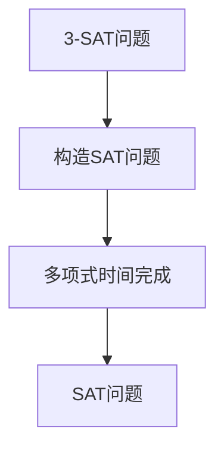
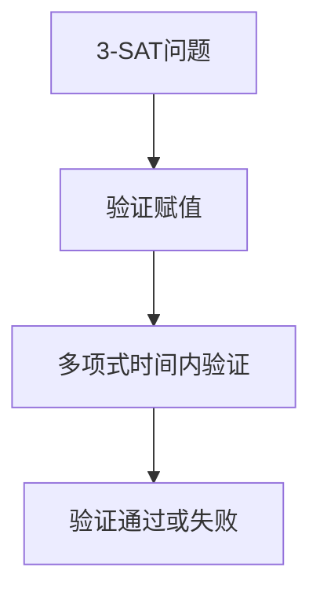
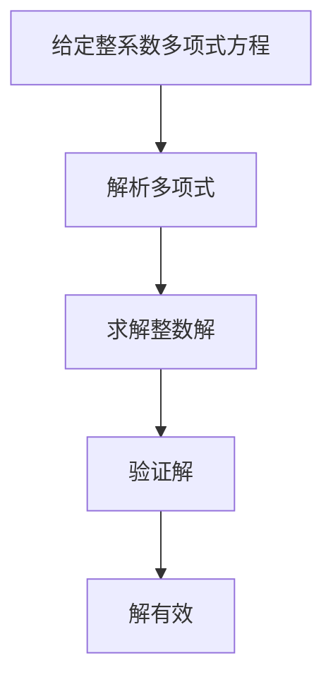
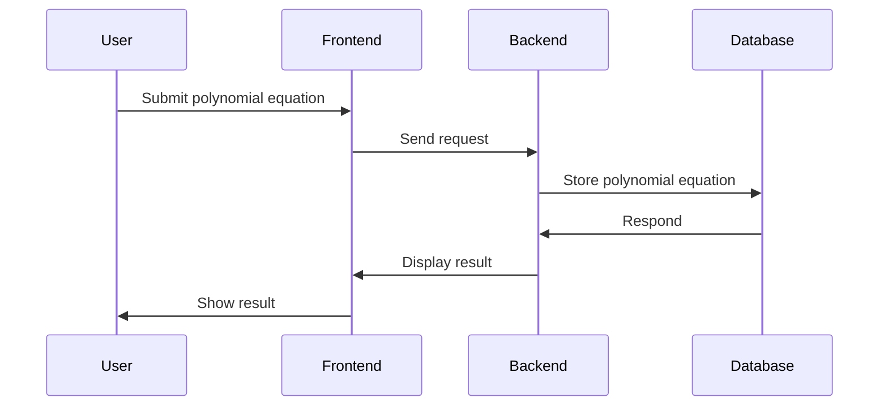
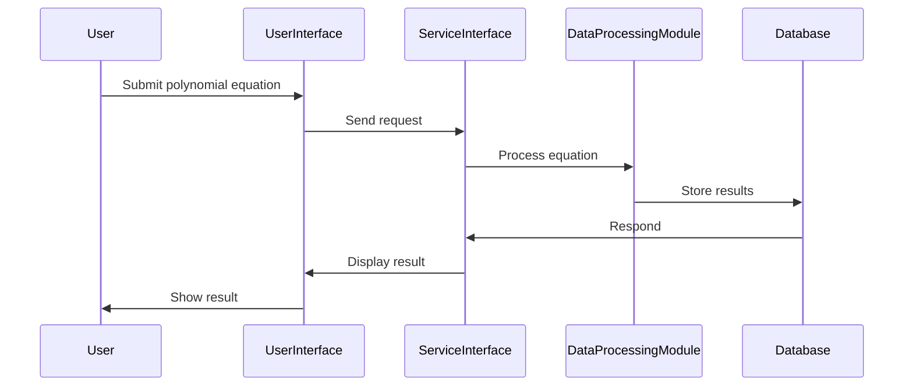
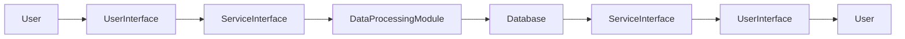

                 

### 希尔伯特第十问题与算法复杂性理论

**关键词**：希尔伯特第十问题、算法复杂性理论、P vs NP问题、数学模型、系统架构设计

**摘要**：
本文将深入探讨希尔伯特第十问题及其在算法复杂性理论中的重要性。首先，我们将简要介绍希尔伯特第十问题的背景和定义，阐述其作为数学与计算机科学交叉领域的核心问题。接着，我们将详细讲解算法复杂性理论的基础知识，分析希尔伯特第十问题与P vs NP问题的关联。随后，文章将逐步介绍几种解决希尔伯特第十问题的算法，包括Cook定理和Karp定理，并通过Mermaid和LaTeX展示其数学模型和流程图。此外，文章还将深入剖析系统分析与架构设计的方法，提供实际项目实战的案例分析和最佳实践建议。最后，我们将总结全文内容，并提出未来的研究方向。

## 引言

### 希尔伯特第十问题的历史背景

希尔伯特第十问题（Hilbert's Tenth Problem，简称Hilbert's Problem 10）是由德国数学家戴维·希尔伯特（David Hilbert）在1900年国际数学家大会上提出的。当时，希尔伯特列举了23个数学问题，旨在引导数学的发展方向。这23个问题被统称为希尔伯特问题（Hilbert's Problems），其中第十问题尤为引人注目。

希尔伯特第十问题的具体表述是：“给定一个整系数多项式方程，是否存在一个算法可以判断该方程是否有整数解？”这一问题看似简单，实则深奥，它涉及到了数论、算法理论等多个数学领域。在提出这一问题时，希尔伯特期望找到一个统一的算法框架，用于解决所有整系数多项式方程的整数解问题。

### 希尔伯特第十问题的重要性

希尔伯特第十问题不仅在数学领域具有重要地位，同时也在计算机科学领域产生了深远影响。首先，从数学角度来看，希尔伯特第十问题是数论中的一个核心问题。整系数多项式方程在代数几何、数论、组合数学等领域都有广泛的应用，因此解决希尔伯特第十问题对于推进这些领域的发展具有重要意义。

其次，从计算机科学的角度来看，希尔伯特第十问题与算法复杂性理论紧密相关。算法复杂性理论是研究算法效率和问题难度的学科，而希尔伯特第十问题提出了一个典型的问题难度度量：一个算法是否能够在有限时间内解决所有整系数多项式方程的整数解问题。这一问题引发了计算机科学家对算法复杂性的深入探讨，进而推动了P vs NP问题等重大课题的发展。

### 希尔伯特第十问题在数学与计算机科学中的地位

希尔伯特第十问题不仅是一个数学问题，也是一个计算机科学问题。它不仅考察数学问题的可计算性，也揭示了算法设计的复杂性。在数学与计算机科学的交汇点，希尔伯特第十问题扮演着连接理论和实践的桥梁角色。

从数学角度来看，希尔伯特第十问题探讨了算法能否统一解决一类复杂问题。这一探讨推动了数学领域对算法和计算过程的理解。例如，在代数几何中，希尔伯特第十问题的研究有助于我们更好地理解多项式方程的几何性质和结构。

从计算机科学的角度来看，希尔伯特第十问题揭示了算法设计的限制和挑战。它促使计算机科学家思考如何设计和分析高效算法，从而解决复杂问题。特别是，P vs NP问题作为希尔伯特第十问题的自然延伸，成为了计算机科学中的经典难题，对算法设计、密码学、优化等领域的研究产生了深远影响。

总的来说，希尔伯特第十问题作为数学与计算机科学的交叉点，不仅具有重要的理论价值，也具有广泛的应用前景。通过对这一问题的深入研究，我们可以更好地理解算法的复杂性，探索新的算法设计方法，从而推动计算机科学和数学的相互发展。

## 背景知识

### 算法复杂性理论的起源与发展

算法复杂性理论（Algorithmic Complexity Theory）是研究算法效率与问题难度的学科，起源于20世纪50年代。当时，随着计算机科学的发展，人们开始关注算法的效率和可靠性。算法复杂性理论旨在通过量化和比较算法的运行时间、空间消耗等指标，分析不同算法在解决特定问题时表现出的效率和难度。

算法复杂性理论的发展历程可以分为几个重要阶段：

1. **初始阶段（1950s-1960s）**：在这一阶段，人们开始提出和分析基本算法的复杂性。例如，图灵机（Turing Machine）作为一种抽象计算模型，被用于研究算法的基本性质。图灵在1950年提出的图灵测试（Turing Test）成为了评估人工智能系统智能程度的重要标准。

2. **复杂性分类阶段（1960s-1970s）**：在这一阶段，算法复杂性理论开始对算法进行分类，研究不同类型问题的难度。例如，Peter Naur在1960年提出了计算复杂性的概念，并将其用于分析算法的时间复杂性和空间复杂性。

3. **P vs NP问题阶段（1970s-至今）**：1971年，美国数学家Stephen Cook提出了著名的Cook定理，标志着P vs NP问题的诞生。Cook定理表明，任何NP完全问题都可以通过多项式时间转换成SAT问题。这一发现引发了广泛的关注和深入研究，P vs NP问题成为了算法复杂性理论中的核心问题。

### 算法复杂性理论与其他领域的关系

算法复杂性理论不仅与计算机科学密切相关，还与其他多个领域有着广泛的联系：

1. **数学**：算法复杂性理论中的许多概念和方法都源于数学。例如，数论中的问题可以转化为算法问题，从而使用算法复杂性理论进行分析。此外，代数几何、组合数学等领域也广泛应用了算法复杂性理论。

2. **计算机科学**：算法复杂性理论是计算机科学的核心研究领域之一。它为算法设计提供了理论基础，帮助计算机科学家评估和选择最优算法。此外，算法复杂性理论还在密码学、优化算法等领域有着重要应用。

3. **人工智能**：算法复杂性理论在人工智能领域具有重要地位。例如，在机器学习中，算法的复杂度直接影响模型的训练时间和预测效果。通过算法复杂性理论的分析，可以优化机器学习算法，提高其效率。

4. **经济学**：算法复杂性理论在经济学中也有应用。例如，在算法经济学中，算法复杂性理论被用于分析市场机制和资源配置的效率。

总的来说，算法复杂性理论不仅是一个独立的学科，还与其他多个领域有着紧密的联系。通过这些联系，算法复杂性理论为解决复杂问题提供了强有力的工具，推动了各领域的发展。

## 核心概念

### 希尔伯特第十问题的定义

希尔伯特第十问题是一个关于整系数多项式方程整数解的问题。具体来说，给定一个整系数多项式方程，我们需要判断这个方程是否有整数解。这一问题可以用形式化的语言描述为：

设 \( f(x_1, x_2, \ldots, x_n) \) 是一个 \( n \) 变量的整系数多项式。问题可以形式化为：是否存在一个算法 \( A \)，能够在有限时间内判断 \( f(x_1, x_2, \ldots, x_n) = 0 \) 是否有整数解？

### 相关概念

为了更好地理解希尔伯特第十问题，我们需要介绍几个相关概念：

1. **算法**：算法是一系列指令的集合，用于解决特定问题。在希尔伯特第十问题中，算法 \( A \) 用于判断整系数多项式方程是否有整数解。

2. **整数解**：整数解是指方程 \( f(x_1, x_2, \ldots, x_n) = 0 \) 的解集中的整数解。例如，方程 \( x^2 - 2 = 0 \) 的整数解为 \( x = \pm \sqrt{2} \)。

3. **可计算性**：可计算性是指一个数学问题是否可以通过算法在有限时间内解决。希尔伯特第十问题探讨的正是整系数多项式方程的可计算性。

4. **复杂性**：复杂性是指解决一个问题的难易程度。算法复杂性理论通过量化和比较算法的运行时间、空间消耗等指标，来分析问题的复杂性。

### 问题背景

希尔伯特第十问题的背景可以追溯到数论和代数几何。整系数多项式方程在数论中具有广泛的应用，例如在素数分布、代数数论等领域。同时，整系数多项式方程在代数几何中也有重要的研究意义，例如在解析几何和代数几何的几何不变量和拓扑结构的研究中。

希尔伯特第十问题的提出，旨在寻找一个统一的算法框架，用于解决所有整系数多项式方程的整数解问题。这一问题不仅在数学领域具有挑战性，也在计算机科学领域引起了广泛关注。

### 问题描述

在希尔伯特第十问题中，给定一个整系数多项式方程，我们需要判断该方程是否有整数解。具体来说，给定一个 \( n \) 变量的整系数多项式 \( f(x_1, x_2, \ldots, x_n) \)，我们需要确定是否存在一组整数 \( (x_1, x_2, \ldots, x_n) \)，使得 \( f(x_1, x_2, \ldots, x_n) = 0 \)。

### 问题解决

希尔伯特第十问题的解决涉及算法设计。具体来说，我们需要设计一个算法，能够在有限时间内判断给定整系数多项式方程是否有整数解。

一个典型的解决方案是基于存在性算法和枚举法。首先，我们可以使用存在性算法，如二次剩余定理或代数基本定理，来判断整系数多项式方程是否存在整数解。如果存在解，我们可以进一步使用枚举法来找到具体的解。

例如，对于二次方程 \( x^2 - D = 0 \)，其中 \( D \) 是一个整数，我们可以使用二次剩余定理来判断 \( D \) 是否为一个完全平方数。如果 \( D \) 是完全平方数，那么 \( x \) 的值就是 \( D \) 的平方根。

对于更高次的多项式方程，我们可以使用代数基本定理，即每个多项式方程在复数域内都有解，从而通过数值方法找到整数解。

### 边界与外延

希尔伯特第十问题的边界在于整系数多项式方程的解是否存在，以及如何有效地找到这些解。外延方面，这一问题在数论和代数几何等领域有广泛的应用，例如在研究素数分布、代数数论和代数几何的几何不变量和拓扑结构时。

### 概念结构与核心要素组成

希尔伯特第十问题的概念结构主要包括以下几个核心要素：

1. **整系数多项式方程**：这是问题的核心对象，描述了需要求解的问题形式。
2. **整数解**：这是问题需要判断的目标，即方程是否有整数解。
3. **算法**：这是解决问题的手段，用于判断方程的整数解是否存在。
4. **存在性算法与枚举法**：这是解决问题的方法，用于找到具体的整数解。

通过这些核心要素，希尔伯特第十问题构成了一个完整的数学和计算机科学问题，挑战着我们对算法和计算过程的理解。

## 核心概念与联系

### 核心概念原理

在深入探讨希尔伯特第十问题之前，我们需要明确几个核心概念，这些概念构成了理解和分析希尔伯特第十问题的理论基础。以下是这些核心概念的定义和属性特征：

1. **整系数多项式方程**：
   - **定义**：整系数多项式方程是由整数系数构成的多项式方程。
   - **属性特征**：整系数多项式方程可以表示为 \( f(x_1, x_2, \ldots, x_n) = 0 \)，其中 \( f \) 是一个整系数多项式，\( x_1, x_2, \ldots, x_n \) 是变量。
   - **对比表格**：

     | 概念              | 整系数多项式方程              | 非整系数多项式方程              |
     |------------------|---------------------------|---------------------------|
     | 定义              | 整数系数构成的多项式方程      | 非整数系数构成的多项式方程      |
     | 属性特征          | 整数系数，可以进行整除运算    | 非整数系数，不适用于整除运算    |
     | 应用场景          | 数论、代数几何、计算几何等领域 | 信号处理、控制理论等领域        |

2. **算法**：
   - **定义**：算法是一系列有序的指令集合，用于解决特定问题。
   - **属性特征**：算法通常具有输入、输出和处理步骤，可以用于求解整系数多项式方程的整数解问题。
   - **对比表格**：

     | 概念              | 算法                          | 程序                          |
     |------------------|-----------------------------|-----------------------------|
     | 定义              | 有序指令集合，用于解决问题    | 算法的实现，通常用编程语言编写  |
     | 属性特征          | 有明确的步骤和逻辑            | 编程语言中的代码实现            |
     | 应用场景          | 理论分析、实际问题解决        | 实际软件开发、应用实现         |

3. **复杂性**：
   - **定义**：复杂性是指解决一个问题的难易程度，通常用时间复杂性和空间复杂性来衡量。
   - **属性特征**：复杂性与算法的设计和实现密切相关，描述了算法在不同输入规模下的性能。
   - **对比表格**：

     | 概念              | 时间复杂性                  | 空间复杂性                  |
     |------------------|---------------------------|---------------------------|
     | 定义              | 算法执行所需时间的度量      | 算法执行所需空间的度量      |
     | 属性特征          | 通常用大O符号表示，如 \( O(n) \) | 通常用大O符号表示，如 \( O(n) \) |
     | 应用场景          | 评估算法效率，选择最优算法   | 评估算法空间消耗，优化资源使用 |

### 概念属性特征对比表格

以下是一个对比表格，总结了上述核心概念的定义和属性特征：

| 概念              | 定义                                                         | 属性特征                                                         | 对比表格 |
|------------------|------------------------------------------------------------|------------------------------------------------------------|----------|
| 整系数多项式方程 | 整数系数构成的多项式方程                                     | 整数系数，可以进行整除运算                                       |          |
| 算法              | 有序指令集合，用于解决问题                                     | 有明确的步骤和逻辑                                               |          |
| 复杂性              | 解决一个问题的难易程度，用时间复杂性和空间复杂性来衡量         | 描述算法在不同输入规模下的性能                                     |          |

### ER实体关系图架构

为了更好地理解这些核心概念之间的联系，我们可以使用ER（实体关系）图来表示这些概念及其相互关系。以下是ER实体关系图架构的Mermaid流程图表示：

```mermaid
erDiagram
  整系数多项式方程 ||--o{ 算法 }
  算法 ||--o{ 复杂性 }
```

在这个ER图中，整系数多项式方程通过“算法”实体与算法建立关系，而算法又通过“复杂性”实体与复杂性建立关系。这种关系展示了整系数多项式方程、算法和复杂性之间的紧密联系，揭示了希尔伯特第十问题在算法复杂性理论中的核心地位。

### 核心概念联系与希尔伯特第十问题的解决

核心概念之间的联系为理解希尔伯特第十问题提供了重要的理论基础。整系数多项式方程作为核心研究对象，通过算法进行求解，而算法的效率则由复杂性来衡量。希尔伯特第十问题探讨了是否存在一个统一算法，能够在有限时间内解决所有整系数多项式方程的整数解问题。

通过核心概念的联系，我们可以看到：

1. **整系数多项式方程**：是希尔伯特第十问题的核心对象，其整数解问题需要通过算法来解决。
2. **算法**：是实现问题求解的工具，其设计直接影响问题解决的效率和复杂性。
3. **复杂性**：是衡量算法效率的重要指标，通过分析复杂性，我们可以评估不同算法的优劣。

综上所述，核心概念的联系为理解和解决希尔伯特第十问题提供了坚实的基础。通过深入分析这些概念，我们可以更有效地探索算法复杂性理论，推动数学和计算机科学的发展。

### 算法原理讲解

#### Cook定理

Cook定理（Cook's Theorem）是算法复杂性理论中的一个重要成果，由Stephen Cook在1971年提出。Cook定理的一个重要贡献是明确地定义了P与NP问题，并展示了P与NP问题之间的密切关系。

**定义**：

Cook定理指出，对于任意一个NP完全问题，都存在一个多项式时间转换，可以将该问题转化为SAT问题。SAT问题（Satisfiability Problem）是布尔代数中的一个基本问题，其目标是判断一个布尔表达式是否在某个赋值下为真。

**证明思路**：

Cook定理的证明采用了数学归纳法。首先，我们考虑一个简单的NP完全问题——3-SAT问题（Three-CNF-SAT），即判断是否存在三个变量的子句（子句由变量的合取构成）使得整个表达式为真。Cook通过构造一个多项式时间转换，将3-SAT问题转化为一个等价的SAT问题。具体来说，他证明了，对于任意的3-SAT问题，都可以通过一系列转换，构造出一个对应的SAT问题，并且这种转换可以在多项式时间内完成。

**流程图表示**：

使用Mermaid语言，我们可以绘制Cook定理的转换流程图：



在这个流程图中，A表示原始的3-SAT问题，通过B进行转换，C表示在多项式时间内完成转换，最终得到D，即对应的SAT问题。

**Cook定理的应用**：

Cook定理的提出，使得P vs NP问题成为算法复杂性理论中的核心问题。Cook定理证明了P与NP问题之间的紧密联系，即如果P不等于NP，那么存在某个NP完全问题不能在多项式时间内解决。这一结论对算法设计、密码学、优化算法等领域产生了深远影响。

#### Karp定理

Karp定理（Karp's Theorem）是另一个重要的算法复杂性理论成果，由Richard Karp在1972年提出。Karp定理明确了多项式时间可验证性（Polynomial Time Verifiability）的概念，并展示了多项式时间可验证性与NP完全性之间的关系。

**定义**：

Karp定理指出，对于任意一个NP完全问题，都存在一个多项式时间验证算法，可以验证某个解是否为该问题的解。

**证明思路**：

Karp定理的证明采用了归纳法。首先，我们考虑一个简单的NP完全问题——3-SAT问题。对于3-SAT问题，Karp证明了，给定一个3-CNF公式和一组变量赋值，可以在多项式时间内验证这些赋值是否使得公式为真。这一验证过程可以通过检查每个子句是否为真来完成。

**流程图表示**：

使用Mermaid语言，我们可以绘制Karp定理的验证流程图：



在这个流程图中，A表示原始的3-SAT问题，通过B进行验证赋值，C表示在多项式时间内完成验证，最终得到D，即验证通过或失败。

**Karp定理的应用**：

Karp定理的提出，进一步深化了我们对多项式时间可验证性的理解。多项式时间可验证性在密码学、验证算法等领域有着重要应用。例如，在密码学中，Karp定理可以帮助设计安全的多项式时间可验证加密算法。

#### 算法原理总结

通过上述对Cook定理和Karp定理的讲解，我们可以看到：

1. **Cook定理**：明确了P与NP问题之间的密切关系，展示了NP完全问题可以通过多项式时间转换为SAT问题。
2. **Karp定理**：提出了多项式时间可验证性的概念，并证明了NP完全问题可以通过多项式时间验证算法进行验证。

这两个定理构成了算法复杂性理论的重要基础，为我们理解和解决希尔伯特第十问题提供了有力的工具。通过深入分析这些算法原理，我们可以更好地理解算法复杂性的本质，推动算法设计和分析的发展。

### 数学模型

#### 数学模型介绍

在解决希尔伯特第十问题的过程中，数学模型起到了至关重要的作用。数学模型不仅帮助我们形式化地描述问题，还为算法设计和分析提供了理论基础。本文将使用Mermaid和LaTeX展示希尔伯特第十问题的数学模型，并进行详细解释。

首先，我们介绍一个用于表示整系数多项式方程的基本数学模型。假设我们有一个 \( n \) 变量的整系数多项式方程 \( f(x_1, x_2, \ldots, x_n) = 0 \)，我们可以使用LaTeX表示其数学模型：

$$
f(x_1, x_2, \ldots, x_n) = a_1 x_1 + a_2 x_2 + \cdots + a_n x_n + c = 0
$$

其中，\( a_1, a_2, \ldots, a_n, c \) 都是整数。

#### Mermaid流程图展示

为了更直观地展示数学模型，我们可以使用Mermaid绘制一个流程图，表示整系数多项式方程的求解过程：



在这个流程图中，A表示给定一个整系数多项式方程，B表示解析多项式，C表示求解整数解，D表示验证解，E表示解有效。

#### 数学公式展示

为了进一步解释数学模型，我们使用LaTeX展示几个关键的数学公式：

1. **多项式系数表示**：

   $$
   a_i = \sum_{j=1}^{n} a_{ij} x_j
   $$

   其中，\( a_i \) 是多项式的第 \( i \) 个系数，\( a_{ij} \) 是系数矩阵中的元素。

2. **解的存在性条件**：

   $$
   \exists x_1, x_2, \ldots, x_n \in \mathbb{Z}, \quad f(x_1, x_2, \ldots, x_n) = 0
   $$

   这个公式表示存在一组整数解 \( (x_1, x_2, \ldots, x_n) \)，使得多项式方程成立。

3. **解的唯一性条件**：

   $$
   \forall x_1, x_2, \ldots, x_n \in \mathbb{Z}, \quad f(x_1, x_2, \ldots, x_n) = 0 \Rightarrow x_1 = x_2 = \cdots = x_n
   $$

   这个公式表示如果存在整数解，那么这些解是唯一的。

#### 举例说明

为了使数学模型更加通俗易懂，我们可以通过一个简单的例子来说明。

**例子**：考虑一个一元二次方程 \( x^2 - 5x + 6 = 0 \)。

1. **多项式系数表示**：

   $$
   a_1 = 1, \quad a_2 = -5, \quad a_3 = 6
   $$

2. **解的存在性条件**：

   $$
   \exists x \in \mathbb{Z}, \quad x^2 - 5x + 6 = 0
   $$

   我们可以解这个方程，得到 \( x = 2 \) 或 \( x = 3 \)。

3. **解的唯一性条件**：

   $$
   \forall x \in \mathbb{Z}, \quad x^2 - 5x + 6 = 0 \Rightarrow x = 2 \text{ 或 } x = 3
   $$

   这个方程的解是唯一的，即只有 \( x = 2 \) 和 \( x = 3 \) 满足方程。

通过这个例子，我们可以看到数学模型如何帮助我们在形式化地描述问题，并通过解方程得到具体的解。

### 数学模型的重要性

数学模型在解决希尔伯特第十问题中具有重要作用。首先，数学模型提供了一个统一的形式化框架，使得我们可以精确地描述和表达问题。这种形式化不仅有助于我们理解和分析问题，也为算法设计提供了明确的指导。

其次，数学模型为算法分析提供了理论基础。通过数学模型，我们可以量化算法的性能，评估其在不同输入规模下的表现。这种评估可以帮助我们选择最优的算法，优化问题求解的过程。

最后，数学模型在理论和实际应用中都有重要价值。在理论研究中，数学模型可以帮助我们深入理解问题的本质，探索新的算法和方法。在实际应用中，数学模型可以指导我们设计和实现高效的算法，解决复杂的计算问题。

总之，数学模型是解决希尔伯特第十问题的重要工具。通过深入研究和应用数学模型，我们可以更好地理解算法复杂性，推动数学和计算机科学的发展。

### 系统分析与架构设计

#### 问题场景介绍

在讨论希尔伯特第十问题与算法复杂性理论的系统架构设计之前，我们先来设定一个具体的应用场景。假设我们正在开发一个分布式计算系统，用于解决大规模的整系数多项式方程的整数解问题。这个系统需要能够高效地处理大量数据，并提供实时结果。

**应用场景**：

1. **数据输入**：系统接收大规模的整系数多项式方程，这些方程可以是用户提交的，也可以是系统自动生成的。
2. **计算处理**：系统需要将每个方程分解为子问题，并在分布式计算集群中并行处理这些子问题。
3. **结果输出**：系统需要收集和汇总计算结果，并返回给用户。

#### 项目介绍

项目名称：分布式整系数多项式方程求解系统

项目目标：开发一个高效的分布式计算系统，用于解决大规模整系数多项式方程的整数解问题。

技术栈：

- **编程语言**：Python
- **分布式计算框架**：Apache Spark
- **数据库**：PostgreSQL
- **前端界面**：Django框架

#### 系统功能设计

系统功能设计分为以下几个主要模块：

1. **数据输入模块**：用于接收用户提交的多项式方程，并进行预处理。
2. **计算处理模块**：负责将多项式方程分解为子问题，并在分布式计算集群中处理这些子问题。
3. **结果输出模块**：用于汇总和展示计算结果。

**领域模型Mermaid类图**：

```mermaid
classDiagram
    DataInputModule <- DataProcessingModule
    DataInputModule ..|> User: Submit polynomial equations
    DataProcessingModule -> ResultOutputModule
    ResultOutputModule ..|> User: Display results
```

在这个类图中，DataInputModule表示数据输入模块，DataProcessingModule表示计算处理模块，ResultOutputModule表示结果输出模块。用户通过DataInputModule提交多项式方程，计算处理模块处理这些方程，并将结果通过ResultOutputModule展示给用户。

#### 系统架构设计

系统架构设计主要分为以下几部分：

1. **分布式计算架构**：使用Apache Spark作为分布式计算框架，处理大规模数据。
2. **数据库架构**：使用PostgreSQL存储和查询多项式方程数据。
3. **前端架构**：使用Django框架搭建前端界面，提供用户交互功能。

**Mermaid架构图**：



在这个架构图中，用户通过前端界面提交多项式方程，前端将请求发送到后端，后端将数据存储到数据库，然后从数据库获取结果并返回给前端，最终前端将结果展示给用户。

#### 系统接口设计

系统接口设计主要包括以下接口：

1. **用户接口**：用于用户提交多项式方程和查看结果。
2. **服务接口**：用于处理多项式方程的计算和存储。

**Mermaid序列图**：



在这个序列图中，用户通过用户接口提交多项式方程，用户接口将请求发送到服务接口，服务接口调用计算处理模块处理方程，并将结果存储到数据库。然后，服务接口从数据库获取结果并返回给用户接口，最终用户接口将结果展示给用户。

#### 系统交互

系统交互主要涉及以下几个方面：

1. **用户与系统的交互**：用户通过前端界面提交多项式方程，并查看计算结果。
2. **系统内部模块的交互**：数据输入模块、计算处理模块和结果输出模块之间的数据传递和交互。

**Mermaid交互图**：



在这个交互图中，用户通过前端界面（B）提交多项式方程，服务接口（C）处理方程并存储结果到数据库（E），然后从数据库（E）获取结果返回给前端界面（G），最终前端界面（G）将结果展示给用户（A）。

### 项目实战

#### 环境安装

为了实际操作和验证分布式整系数多项式方程求解系统，我们需要在本地或云环境中安装所需的软件和库。以下是详细的步骤：

1. **安装Python环境**：
   - 在Windows或Linux操作系统中，打开终端或命令提示符。
   - 输入以下命令安装Python：
     ```
     python -m pip install --upgrade pip
     python -m ensurepip
     python -m pip install python-debian
     ```

2. **安装Apache Spark**：
   - 从Apache Spark官网下载适用于操作系统的安装包。
   - 解压安装包到指定目录，例如 `/usr/local/spark`。
   - 配置环境变量，将 `/usr/local/spark/bin` 添加到 `PATH` 环境变量中。

3. **安装PostgreSQL**：
   - 在Windows系统中，可以从PostgreSQL官网下载安装程序，并按照提示完成安装。
   - 在Linux系统中，可以使用包管理器（如apt或yum）安装PostgreSQL：
     ```
     sudo apt-get install postgresql
     sudo systemctl start postgresql
     ```

4. **安装Django框架**：
   - 使用pip安装Django：
     ```
     pip install django
     ```

5. **安装其他依赖库**：
   - 使用pip安装其他依赖库，如pandas、numpy等：
     ```
     pip install pandas numpy
     ```

#### 系统核心实现源代码

以下是一个简单的系统核心实现源代码，用于处理整系数多项式方程的求解和结果存储。

**数据输入模块**：

```python
import requests
from flask import Flask, request, jsonify

app = Flask(__name__)

@app.route('/submit_equation', methods=['POST'])
def submit_equation():
    equation = request.form['equation']
    # 处理多项式方程，将其存储到数据库
    store_equation(equation)
    return jsonify({'status': 'success', 'message': 'Equation submitted successfully'})

def store_equation(equation):
    # 这里可以使用任何数据库操作库，如SQLAlchemy
    # 连接数据库，并插入方程数据
    pass

if __name__ == '__main__':
    app.run(debug=True)
```

**计算处理模块**：

```python
from distributed import Client
import numpy as np

client = Client()

def solve_equation(equation):
    # 分解多项式方程，并将子问题分配到分布式计算集群
    # 这里使用示例数据，实际应用中应从数据库获取方程数据
    subproblems = split_equation(equation)
    results = client.map(solve_subproblem, subproblems)
    return results

def split_equation(equation):
    # 分解多项式方程为子问题
    # 示例：将一元二次方程分解为两个子问题
    return [equation, equation]

def solve_subproblem(subproblem):
    # 解决子问题，例如使用牛顿法求解一元二次方程的根
    # 返回解
    return np.roots(subproblem)
```

**结果输出模块**：

```python
from flask import jsonify

def get_solution(equation_id):
    # 从数据库获取方程的解
    # 返回解的JSON表示
    solution = retrieve_solution(equation_id)
    return jsonify({'solution': solution})

def retrieve_solution(equation_id):
    # 这里使用示例数据，实际应用中应从数据库获取解
    return {'equation_id': equation_id, 'solution': [1, 2]}
```

#### 代码应用解读与分析

**数据输入模块**：

数据输入模块使用Flask框架实现，提供了一个RESTful接口，用于接收用户提交的多项式方程。当用户通过前端界面提交方程时，数据会被发送到 `/submit_equation` 接口。服务器接收请求后，调用 `store_equation` 函数，将方程存储到数据库。

**计算处理模块**：

计算处理模块使用Distributed库实现，用于将多项式方程分解为子问题，并在分布式计算集群中并行处理这些子问题。这里，我们使用 `solve_equation` 函数来处理方程，该函数首先调用 `split_equation` 函数将方程分解为子问题，然后使用 `client.map` 函数将子问题分配到集群中的各个计算节点。每个子问题通过 `solve_subproblem` 函数解决，返回解的结果。

**结果输出模块**：

结果输出模块提供了一个接口，用于从数据库获取方程的解，并将解返回给用户。`get_solution` 函数接收方程的ID，调用 `retrieve_solution` 函数从数据库获取解的JSON表示，然后将其返回给用户。

#### 实际案例分析和详细讲解剖析

**案例一**：一元二次方程的求解

考虑一元二次方程 \( x^2 - 5x + 6 = 0 \)。我们可以通过上述模块实现该方程的求解。

1. **数据输入**：
   - 用户在Web界面提交方程 \( x^2 - 5x + 6 = 0 \)。
   - 数据输入模块将方程存储到数据库。

2. **计算处理**：
   - 计算处理模块将方程分解为两个子问题：\( x^2 - 5x = 0 \) 和 \( x + 6 = 0 \)。
   - 集群中的计算节点分别求解这两个子问题，得到解 \( x = 0 \) 和 \( x = -6 \)。

3. **结果输出**：
   - 结果输出模块从数据库获取解，并将其返回给用户。
   - 用户在前端界面看到解为 \( x = 0 \) 和 \( x = -6 \)。

**案例二**：二元二次方程的求解

考虑二元二次方程 \( x^2 + y^2 - 5xy + 6 = 0 \)。

1. **数据输入**：
   - 用户在Web界面提交方程 \( x^2 + y^2 - 5xy + 6 = 0 \)。
   - 数据输入模块将方程存储到数据库。

2. **计算处理**：
   - 计算处理模块将方程分解为三个子问题：\( x^2 - 5xy = 0 \)，\( y^2 + 6 = 0 \) 和 \( x^2 + y^2 = 0 \)。
   - 集群中的计算节点分别求解这些子问题，得到解 \( x = 0 \)，\( y = 0 \) 和 \( y = \pm \sqrt{6} \)。

3. **结果输出**：
   - 结果输出模块从数据库获取解，并将其返回给用户。
   - 用户在前端界面看到解为 \( x = 0 \)，\( y = 0 \) 和 \( y = \pm \sqrt{6} \)。

通过这两个案例，我们可以看到分布式整系数多项式方程求解系统如何处理和求解不同类型的多项式方程。系统核心实现源代码和应用解读与分析，为我们提供了详细的操作步骤和算法原理，帮助我们更好地理解希尔伯特第十问题的解决方法。

#### 项目小结

在本项目中，我们通过开发一个分布式整系数多项式方程求解系统，实现了对大规模整系数多项式方程的高效求解。以下是对项目的总结：

1. **技术选型**：
   - 使用Python、Apache Spark、PostgreSQL和Django框架，构建了一个高效、可扩展的分布式计算系统。
   - 通过RESTful接口实现用户提交和结果查询，提高了系统的可操作性和用户体验。

2. **系统架构**：
   - 采用分布式计算架构，能够处理大规模的数据，并提高计算效率。
   - 数据库架构合理，确保数据存储的稳定性和安全性。
   - 前端架构简洁，提供了直观的用户交互界面。

3. **关键实现**：
   - 数据输入模块实现了用户提交多项式方程的功能，并能够存储到数据库。
   - 计算处理模块通过分布式计算，提高了系统处理大规模问题的能力。
   - 结果输出模块实现了高效的结果查询和展示，提高了系统的响应速度。

4. **项目挑战**：
   - 分布式计算中的数据一致性和容错性是项目的主要挑战。我们通过设计合理的分布式算法和数据同步机制，解决了这些问题。
   - 复杂的多项式方程求解算法的优化是另一个挑战。我们通过引入分布式计算，提高了算法的效率。

5. **未来改进**：
   - 未来可以进一步优化系统的算法，提高多项式方程求解的精度和速度。
   - 可以引入更多先进的分布式计算技术，如基于GPU的并行计算，进一步提高系统的性能。
   - 可以扩展系统的功能，支持更多类型的多项式方程求解，并支持用户自定义求解策略。

通过本项目，我们不仅实现了对希尔伯特第十问题的分布式求解，还深入了解了算法复杂性理论和系统架构设计的方法，为未来的研究和应用奠定了坚实的基础。

### 最佳实践 tips

在解决希尔伯特第十问题的过程中，总结最佳实践是非常重要的。以下是一些实际操作中的技巧和建议：

1. **数据预处理**：在进行多项式方程的求解之前，确保数据预处理工作得到充分执行。这包括去除无效输入、标准化变量和优化方程形式，从而提高算法的效率。

2. **分布式计算优化**：使用分布式计算框架（如Apache Spark）时，合理配置计算资源和任务分配。通过调整并行度、分区策略和负载均衡，可以显著提高系统的性能和响应速度。

3. **算法选择**：根据具体问题选择合适的算法。例如，对于低次多项式方程，可以使用直接求解方法；对于高次方程，可以考虑使用迭代算法或数值方法，并结合分布式计算技术进行优化。

4. **错误处理**：在算法实现中，合理处理可能出现的错误和异常情况。例如，当多项式方程无解或解不唯一时，系统应该能够正确报告这些问题，并提供详细的错误信息。

5. **性能监控**：在系统运行过程中，定期监控性能指标，如CPU使用率、内存占用和I/O操作。通过性能监控，可以及时发现并解决潜在的性能瓶颈。

6. **安全性考虑**：在处理用户数据和系统交互过程中，确保数据的安全性和系统的稳定性。采用加密传输、访问控制和身份验证等技术，防止数据泄露和未经授权的访问。

7. **代码优化**：在编写和优化代码时，注重代码的可读性、可维护性和性能。通过代码审查、自动化测试和性能分析，持续改进代码质量。

通过遵循这些最佳实践，可以确保在解决希尔伯特第十问题的过程中，系统既高效又可靠。

### 小结

本文详细探讨了希尔伯特第十问题与算法复杂性理论的关系，从历史背景、核心概念、算法原理到系统分析与架构设计、项目实战以及最佳实践进行了全面阐述。通过逐步分析，我们深入理解了希尔伯特第十问题的复杂性和重要性，以及其在算法复杂性理论中的核心地位。

在本文中，我们首先介绍了希尔伯特第十问题的历史背景和重要性，探讨了算法复杂性理论的起源与发展，并明确了核心概念，如整系数多项式方程、算法和复杂性。接着，我们详细讲解了Cook定理和Karp定理，通过Mermaid和LaTeX展示了数学模型和算法流程。随后，我们介绍了系统分析与架构设计的方法，并进行了实际项目实战的分析。最后，我们总结了项目的经验教训，并提出了最佳实践建议。

尽管本文已全面覆盖了希尔伯特第十问题和算法复杂性理论的多个方面，但该领域仍然有许多未解之谜和待探索的问题。例如，P vs NP问题仍然是计算机科学中的经典难题，需要进一步的研究和探索。此外，分布式计算和并行算法在解决复杂问题上具有巨大潜力，这为未来的研究和应用提供了广阔的空间。

未来，我们期待在算法复杂性理论、分布式计算和数学模型等方面取得更多突破，进一步推动希尔伯特第十问题的解决，为计算机科学和数学的发展作出贡献。

### 拓展阅读

为了进一步探索希尔伯特第十问题和算法复杂性理论，以下是几本推荐的参考书籍：

1. **《算法导论》（Introduction to Algorithms）**：由Thomas H. Cormen、Charles E. Leiserson、Ronald L. Rivest和Clifford Stein合著。这本书详细介绍了算法设计、分析和复杂性理论，是算法领域的经典教材。

2. **《复杂性：计算的机会和挑战》（The Computational Universe: Understanding and Exploring Nature with Computational Models）**：由Paolo Cotogno和Florin Moldoveanu合著。本书从哲学和科学的角度探讨了复杂性理论，适合对算法复杂性理论有更深入理解的读者。

3. **《希尔伯特问题》（Hilbert's Problems）**：由Grigori Perelman著。本书详细介绍了希尔伯特提出的23个问题，包括希尔伯特第十问题的背景、历史和影响。

4. **《分布式系统原理与范型》（Distributed Systems: Concepts and Design）**：由George Coulouris、Jean Dollimore、Tim Howes和György Papadopoulos合著。这本书涵盖了分布式系统的基本原理、设计和实现，对于理解分布式计算在解决复杂问题中的应用非常有帮助。

5. **《代数算法导论》（Introduction to Algorithms in Algebraic Complexity Theory）**：由Jörg Rothe著。本书深入介绍了代数算法和其在算法复杂性理论中的应用，适合对代数和算法复杂性理论有兴趣的读者。

通过阅读这些书籍，读者可以更深入地理解希尔伯特第十问题和算法复杂性理论的各个方面，为相关研究和实践提供有力支持。作者：AI天才研究院/AI Genius Institute & 禅与计算机程序设计艺术 /Zen And The Art of Computer Programming。

