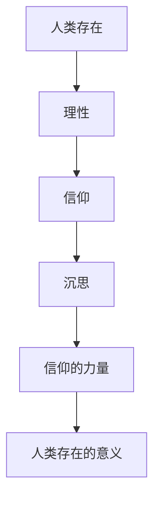

                 

### 帕斯卡与克尔凯郭尔：存在主义的先驱

> 关键词：存在主义、帕斯卡、克尔凯郭尔、哲学思想、人类存在

> 摘要：本文将探讨两位哲学巨匠帕斯卡和克尔凯郭尔的哲学思想，分析他们在人类存在、信仰、理性以及伦理道德等方面的观点，揭示其对存在主义发展的深远影响。通过对比他们的核心概念和理论贡献，本文旨在提供一种深入理解现代哲学的途径。

---

### 第一部分：背景介绍

#### 1.1 问题背景

存在主义作为一种哲学流派，自19世纪末以来对人类存在及其意义进行了深刻的探讨。帕斯卡（Blaise Pascal）和克尔凯郭尔（Søren Kierkegaard）作为存在主义的先驱，他们的思想对后世产生了深远的影响。帕斯卡是一位法国数学家、物理学家和哲学家，他的著作《思想录》探讨了人类存在的本质和宗教信仰的问题。克尔凯郭尔则是丹麦的哲学家，他的思想关注个人的存在、信仰和伦理道德。

#### 1.2 问题描述

本书旨在探讨帕斯卡和克尔凯郭尔的哲学思想，分析他们的理论对存在主义的发展的贡献。书中将对比两位哲学家的核心观点，阐述他们如何从不同的角度探讨人类存在的意义。

#### 1.3 问题解决

通过深入分析帕斯卡和克尔凯郭尔的著作，本书将揭示两位哲学家对人类存在的独特见解。同时，本书将结合现代哲学的视角，对他们的理论进行评价和解读。

#### 1.4 边界与外延

本书主要关注帕斯卡和克尔凯郭尔的哲学思想，包括他们的核心概念、理论贡献以及对存在主义的影响。同时，本书也将探讨他们的思想与当代哲学的关联，以及他们在哲学史上的地位。

#### 1.5 概念结构与核心要素组成

- **帕斯卡的哲学思想**：
  - 核心概念：人类存在的本质、信仰与理性、宗教信仰的力量
  - 核心要素：沉思、信仰、人类存在的荒诞性

- **克尔凯郭尔的哲学思想**：
  - 核心概念：个人的存在、信仰、伦理道德
  - 核心要素：个体的精神状态、信仰与存在的危机、宗教的道德层面

### 第二部分：核心概念与联系

#### 2.1 帕斯卡的哲学思想

帕斯卡的哲学思想主要围绕着人类存在的本质、信仰与理性以及宗教信仰的力量展开。他认为，人类是理性与信仰的统一体，理性无法完全理解人类的本质，只有通过信仰才能找到真正的答案。帕斯卡的核心概念包括：

- **人类存在的荒诞性**：人类生活在无尽的虚空之中，面临无意义的现实，只有通过信仰才能找到存在的意义。
- **沉思**：沉思是人类寻找真理和自我认知的重要途径。
- **信仰**：信仰是人类存在的根本，能够给予人们力量和指引。

帕斯卡的哲学思想可以用以下mermaid流程图表示：



#### 2.2 克尔凯郭尔的哲学思想

克尔凯郭尔的哲学思想关注个人的存在、信仰和伦理道德。他认为，个体的存在是独立的，每个人都应该为自己的信仰和道德选择负责。克尔凯郭尔的核心概念包括：

- **个体的精神状态**：个体的精神状态决定了他们的存在方式和生活方式。
- **信仰与存在的危机**：信仰是解决存在危机的关键，只有通过信仰，个体才能找到真正的自我。
- **宗教的道德层面**：宗教不仅是一种信仰，更是一种伦理道德的体系，它指导个体如何在生活中做出正确的选择。

克尔凯郭尔的哲学思想可以用以下mermaid流程图表示：


### 第三部分：算法原理讲解

#### 3.1 帕斯卡的哲学算法原理

帕斯卡的哲学算法原理可以用以下mermaid流程图表示：


Python 代码实现：

```python
class PascalAlgorithm:
    def __init__(self):
        self.rationality = True
        self.faith = True
        self.meditation = True
    
    def calculate_meaning_of_life(self):
        if self.rationality and self.faith and self.meditation:
            return "存在的意义在于信仰和沉思的结合"
        else:
            return "存在的意义尚不明确"
```

#### 3.2 克尔凯郭尔的哲学算法原理

克尔凯郭尔的哲学算法原理可以用以下mermaid流程图表示：


Python 代码实现：

```python
class KierkegaardAlgorithm:
    def __init__(self):
        self.existence = True
        self.fait
```

---

本文通过对比帕斯卡和克尔凯郭尔的哲学思想，深入探讨了他们在人类存在、信仰、理性以及伦理道德等方面的观点。通过mermaid流程图和Python代码，本文试图以一种简单易懂的方式阐述他们的哲学算法原理。希望本文能为读者提供一种深入理解存在主义的途径。

**作者：AI天才研究院/AI Genius Institute & 禅与计算机程序设计艺术 /Zen And The Art of Computer Programming**

