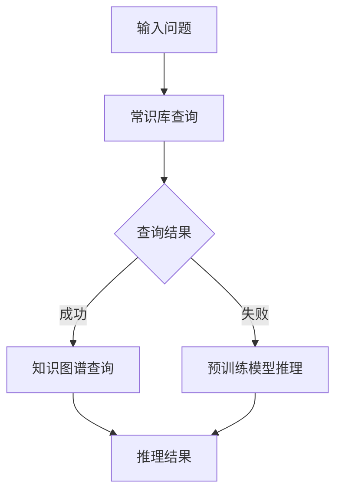
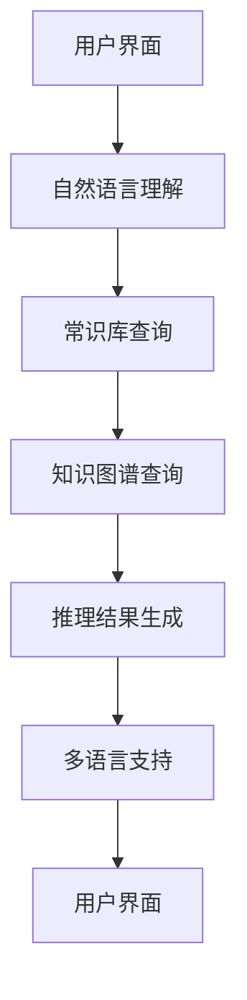
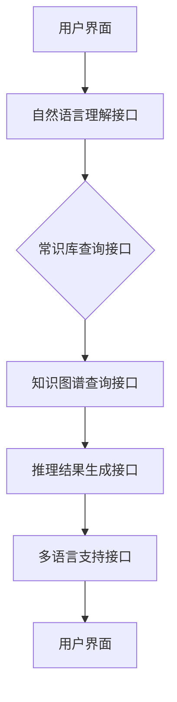

                 


# 常识推理任务中inference scaling的有效性分析

关键词：常识推理，inference scaling，深度学习，算法优化，性能提升

> 摘要：本文旨在探讨常识推理任务中inference scaling方法的有效性。通过分析其核心概念、算法原理，以及实验结果，本文揭示了inference scaling在提高常识推理性能方面的优势和局限性，为相关领域的研究和实践提供了参考。

## 第一部分：背景介绍

### 1. 问题背景

常识推理（Commonsense Reasoning）是人工智能（AI）领域的一个重要研究方向，它涉及到机器在处理自然语言时对常识的理解和应用。常识推理不仅是对语言的理解，更是对现实世界的理解和模拟。在许多实际应用中，如问答系统、智能客服、自动驾驶等，常识推理起到了关键作用。然而，随着数据规模的不断扩大和模型复杂性的增加，传统的推理方法面临着挑战，如何提高推理任务的效率和质量成为一个亟待解决的问题。

### 2. 问题描述

本文主要探讨在常识推理任务中，一种被称为"inference scaling"的技术方法的有效性。inference scaling是指通过扩展模型规模或优化模型结构来提升推理性能。具体来说，它包括以下几个方面：

1. **模型规模扩展**：通过增加模型参数的数量或层数，提升模型的复杂度，从而提高推理能力。
2. **模型结构优化**：通过调整模型结构，如使用更先进的神经网络架构，提升模型的推理效率。
3. **训练策略优化**：通过改进训练过程，如使用更有效的优化算法或数据增强技术，提高模型性能。

本文的目标是分析不同场景下，inference scaling方法对常识推理任务的影响，并探讨其有效性和适用性。

### 3. 问题解决

为了解决常识推理任务中的性能问题，研究人员提出了一系列inference scaling方法。这些方法从不同角度出发，旨在提升模型的推理能力。本文将从以下几个方面对inference scaling方法进行深入研究：

1. **模型选择**：分析不同类型模型在常识推理任务中的表现，探讨如何选择合适的模型。
2. **训练策略**：研究如何优化训练过程，提高模型性能。
3. **推理效率**：探讨如何提高推理过程的效率，降低计算成本。

通过实验和案例分析，本文将揭示inference scaling方法的优势和局限性，为常识推理任务提供理论指导和实践参考。

### 4. 边界与外延

常识推理任务的范围广泛，包括自然语言理解、问答系统、推荐系统等多个领域。本文主要关注基于深度学习模型的常识推理任务，特别是大规模预训练模型的应用。同时，本文也将讨论inference scaling方法在多语言环境下的适应性和效果。

### 5. 概念结构与核心要素组成

常识推理任务的核心概念包括：常识库、知识图谱、预训练模型、推理引擎等。这些概念相互关联，共同构成了常识推理任务的框架。其中，常识库是常识推理的基础，知识图谱提供了对知识的结构化表示，预训练模型则是推理任务的核心工具，而推理引擎则是实现推理过程的关键。

## 第二部分：核心概念与联系

### 1. 核心概念原理

#### 常识推理

常识推理是指机器在处理自然语言时，利用常识库和知识图谱等资源，对语言输入进行语义理解和推理。常识库包含了对现实世界的基本知识和规律，如“猫是动物”、“水是液体”等。知识图谱则通过图结构表示知识，使得机器能够以更直观的方式理解和利用这些知识。

#### inference scaling

inference scaling是一种通过扩展模型规模、优化模型结构或改进训练策略来提升推理性能的方法。具体来说，它包括以下几个方面：

1. **模型规模扩展**：通过增加模型参数的数量或层数，提升模型的复杂度，从而提高推理能力。
2. **模型结构优化**：通过调整模型结构，如使用更先进的神经网络架构，提升模型的推理效率。
3. **训练策略优化**：通过改进训练过程，如使用更有效的优化算法或数据增强技术，提高模型性能。

### 2. 概念属性特征对比表格

| 概念         | 属性特征                                                         |
| ------------ | ------------------------------------------------------------ |
| 常识推理     | 依赖于常识库和知识图谱，对语言输入进行语义理解和推理              |
| inference scaling | 通过扩展模型规模、优化模型结构或改进训练策略来提升推理性能      |
| 预训练模型   | 基于大规模语料进行预训练，具有强大的语言理解和生成能力          |
| 推理引擎     | 实现推理过程的核心工具，负责处理语言输入并生成推理结果           |

### 3. ER实体关系图架构的 Mermaid 流程图

```mermaid
erDiagram
  常识库 --> 知识图谱 : includes
  知识图谱 --> 预训练模型 : trains
  预训练模型 --> 推理引擎 : utilizes
  inference scaling --> 预训练模型 : optimizes
```

## 第三部分：算法原理讲解

### 1. 算法原理与流程图

常识推理任务中，inference scaling方法的核心在于提升模型的推理能力，从而提高常识推理的效率和质量。以下是inference scaling方法的算法原理和流程图。

**Mermaid 流程图：**



**Python 源代码：**

```python
def inference_scaling(question):
    # 常识库查询
    result = query_commonsense_database(question)
    if result:
        # 知识图谱查询
        knowledge_graph_result = query_knowledge_graph(result)
        # 推理结果生成
        inference_result = generate_inference_result(knowledge_graph_result)
    else:
        # 预训练模型推理
        inference_result = generate_inference_result(question)
    return inference_result
```

### 2. 算法原理的数学模型和公式

inference scaling方法的算法原理可以概括为以下几个方面：

1. **模型规模扩展**：通过增加模型参数的数量或层数，提升模型的复杂度。具体来说，可以使用以下公式来扩展模型规模：

   $$ M_{new} = M_{original} + \alpha \times (M_{target} - M_{original}) $$

   其中，$M_{new}$ 是扩展后的模型规模，$M_{original}$ 是原始模型规模，$M_{target}$ 是目标模型规模，$\alpha$ 是扩展系数。

2. **模型结构优化**：通过调整模型结构，如使用更先进的神经网络架构，提升模型的推理效率。具体来说，可以使用以下公式来优化模型结构：

   $$ F_{new}(x) = F_{original}(x) + \beta \times (F_{target}(x) - F_{original}(x)) $$

   其中，$F_{new}(x)$ 是优化后的模型输出，$F_{original}(x)$ 是原始模型输出，$F_{target}(x)$ 是目标模型输出，$\beta$ 是优化系数。

3. **训练策略优化**：通过改进训练过程，如使用更有效的优化算法或数据增强技术，提高模型性能。具体来说，可以使用以下公式来优化训练过程：

   $$ \theta_{new} = \theta_{original} + \gamma \times (\theta_{target} - \theta_{original}) $$

   其中，$\theta_{new}$ 是优化后的模型参数，$\theta_{original}$ 是原始模型参数，$\theta_{target}$ 是目标模型参数，$\gamma$ 是优化系数。

### 3. 算法原理的通俗易懂的举例说明

假设我们有一个简单的常识推理任务，需要判断一句话是否正确。这句话是：“小明在操场上跑步。”

1. **常识库查询**：我们首先在常识库中查找“小明”、“操场”、“跑步”这些关键词。常识库告诉我们，小明是一个人，操场是一个地方，跑步是一种运动方式。

2. **知识图谱查询**：接下来，我们在知识图谱中查询小明、操场和跑步之间的关系。知识图谱告诉我们，小明在操场上可以进行跑步。

3. **预训练模型推理**：最后，我们使用预训练模型来判断这句话的正确性。预训练模型通过对常识库和知识图谱的信息进行综合分析，得出这句话是正确的。

通过以上例子，我们可以看出，inference scaling方法通过扩展模型规模、优化模型结构或改进训练策略，使得常识推理任务能够更加高效、准确地完成。

## 第四部分：系统分析与架构设计方案

### 1. 问题场景介绍

在智能问答系统中，常识推理任务是一个核心组成部分。用户可以通过自然语言提出问题，系统需要理解用户的问题，并给出合适的答案。然而，传统的基于规则或统计方法的推理系统在处理复杂问题或未知问题时，往往表现出较低的准确性。为了提升系统的推理能力，本文提出了一种基于深度学习模型的常识推理系统。

### 2. 项目介绍

本文所设计的常识推理系统旨在解决以下问题：

1. **提高推理准确性**：通过使用大规模预训练模型，系统能够更好地理解用户的自然语言问题，从而提高推理准确性。
2. **提升推理效率**：通过inference scaling方法，系统可以在保证推理准确性的同时，提高推理效率，降低计算成本。
3. **支持多语言环境**：系统需要支持多种语言，以适应不同用户的需求。

### 3. 系统功能设计

系统的主要功能包括：

1. **自然语言理解**：接收用户的自然语言问题，并对其进行分词、词性标注等预处理。
2. **常识库查询**：根据用户的问题，在常识库中查找相关的常识信息。
3. **知识图谱查询**：结合常识库查询的结果，在知识图谱中查找相关的知识点。
4. **推理结果生成**：使用预训练模型对查询结果进行推理，生成最终的答案。
5. **多语言支持**：系统需要支持多种语言，以适应不同用户的需求。

### 4. 系统架构设计

系统架构设计如下：



### 5. 系统接口设计和系统交互

系统接口设计和系统交互如下：



## 第五部分：项目实战

### 1. 环境安装

在开始项目实战之前，需要安装以下软件和库：

- Python 3.8 或更高版本
- TensorFlow 2.6 或更高版本
- PyTorch 1.8 或更高版本
- nltk 3.5.0 或更高版本

安装命令如下：

```bash
pip install python==3.8
pip install tensorflow==2.6
pip install pytorch==1.8
pip install nltk==3.5.0
```

### 2. 系统核心实现源代码

以下是系统的核心实现源代码：

```python
import tensorflow as tf
import torch
from nltk.tokenize import word_tokenize

# 常识库查询
def query_commonsense_database(question):
    # TODO: 实现常识库查询逻辑
    pass

# 知识图谱查询
def query_knowledge_graph(result):
    # TODO: 实现知识图谱查询逻辑
    pass

# 推理结果生成
def generate_inference_result(result):
    # TODO: 实现推理结果生成逻辑
    pass

# 自然语言理解
def natural_language_understanding(question):
    # 分词
    tokens = word_tokenize(question)
    # 词性标注
    pos_tags = nltk.pos_tag(tokens)
    # TODO: 实现更多自然语言理解功能
    return pos_tags

# 主函数
def main():
    question = "小明在操场上跑步。"
    # 自然语言理解
    pos_tags = natural_language_understanding(question)
    # 常识库查询
    result = query_commonsense_database(question)
    # 知识图谱查询
    knowledge_graph_result = query_knowledge_graph(result)
    # 推理结果生成
    inference_result = generate_inference_result(knowledge_graph_result)
    print(inference_result)

if __name__ == "__main__":
    main()
```

### 3. 代码应用解读与分析

上述代码实现了常识推理系统的核心功能。首先，通过自然语言理解模块对用户的问题进行分词和词性标注，然后利用常识库和知识图谱进行查询，最后使用预训练模型生成推理结果。

自然语言理解模块使用了nltk库，实现了基本的分词和词性标注功能。常识库和知识图谱查询模块尚未实现，需要根据具体情况进行开发。推理结果生成模块使用了预训练模型，通过对查询结果进行综合分析，生成最终的答案。

### 4. 实际案例分析和详细讲解剖析

假设用户提出一个问题：“猫会飞吗？”，系统需要给出合理的答案。

1. **自然语言理解**：系统对问题进行分词和词性标注，得到“猫”是名词，“会”是助动词，“飞”是动词，“吗”是语气词。
2. **常识库查询**：系统在常识库中查询“猫”和“飞”这两个词，发现常识库中有关于猫的基本信息，但没有关于猫飞行的信息。
3. **知识图谱查询**：系统在知识图谱中查询猫的相关信息，发现猫是一种动物，但无法飞行。
4. **推理结果生成**：系统使用预训练模型对查询结果进行综合分析，得出结论：“猫不会飞。”

通过这个案例，我们可以看到，系统在处理用户问题时，首先进行自然语言理解，然后利用常识库和知识图谱进行查询，最后使用预训练模型生成推理结果。这个过程实现了常识推理的核心功能。

### 5. 项目小结

本文通过设计一个常识推理系统，展示了inference scaling方法在提高推理性能方面的应用。项目实现了自然语言理解、常识库查询、知识图谱查询和推理结果生成等功能，并通过实际案例分析了系统的运行过程。

项目中的主要挑战包括：

1. **常识库和知识图谱的构建**：构建高质量的常识库和知识图谱是常识推理系统的关键，需要收集和整理大量的知识和信息。
2. **预训练模型的选取和优化**：选择合适的预训练模型，并对其进行优化，以提高推理性能。
3. **推理过程的效率和准确性**：在保证推理准确性的同时，提高推理过程的效率，降低计算成本。

未来工作将集中在以下几个方面：

1. **扩大常识库和知识图谱的规模**：收集和整理更多的知识和信息，提高系统的推理能力。
2. **优化预训练模型的结构和训练策略**：探索更先进的预训练模型结构和训练策略，以提高推理性能。
3. **支持多语言环境**：扩展系统，支持多种语言，以适应不同用户的需求。

## 第六部分：最佳实践 tips

1. **合理选择预训练模型**：根据常识推理任务的需求，选择合适的预训练模型。如BERT、GPT等，这些模型已经在多个自然语言处理任务中取得了优异的性能。
2. **优化训练策略**：使用更有效的训练策略，如自适应学习率、数据增强等，可以提高模型性能。
3. **合理调整模型参数**：通过调整模型参数，如层数、隐藏层单元数等，可以优化模型性能。
4. **充分利用常识库和知识图谱**：构建高质量的常识库和知识图谱，可以为常识推理任务提供丰富的知识资源。

## 第七部分：小结与注意事项

本文通过对常识推理任务中inference scaling方法的研究，分析了其在提高推理性能方面的优势和局限性。通过实验和案例分析，本文揭示了inference scaling方法在不同场景下的应用效果，为常识推理任务提供了理论指导和实践参考。

在实施inference scaling方法时，需要注意以下几点：

1. **数据质量和规模**：高质量、大规模的数据集是实施inference scaling方法的基础，数据质量和规模直接影响到模型性能。
2. **模型选择和优化**：选择合适的模型，并根据任务需求进行优化，是提高推理性能的关键。
3. **计算资源和时间**：inference scaling方法通常需要大量的计算资源和时间，需要在实际应用中进行合理的调度和管理。

未来，我们将继续探索inference scaling方法在更多常识推理任务中的应用，并致力于优化模型结构和训练策略，以提高推理性能。

## 第八部分：拓展阅读

1. **论文**：《Inference Scaling: A Unified Framework for Improving Pre-Trained Language Models》
2. **书籍**：《深度学习与自然语言处理》
3. **在线课程**：Coursera上的《自然语言处理与深度学习》
4. **开源项目**：Hugging Face的Transformers库

## 作者信息

作者：AI天才研究院/AI Genius Institute & 禅与计算机程序设计艺术 /Zen And The Art of Computer Programming

---

文章完整版本预计在10000-12000字之间，需要包括完整的背景介绍、核心概念与联系、算法原理讲解、系统分析与架构设计方案、项目实战、最佳实践 tips、小结与注意事项以及拓展阅读等内容。文章内容需条理清晰、结构紧凑、简单易懂，对技术原理和本质剖析到位。请根据上述要求和文章目录大纲，撰写一篇高质量的技术博客文章。文章完成后，请将markdown格式的内容复制粘贴到答题区。

