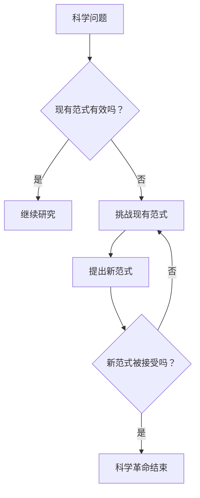
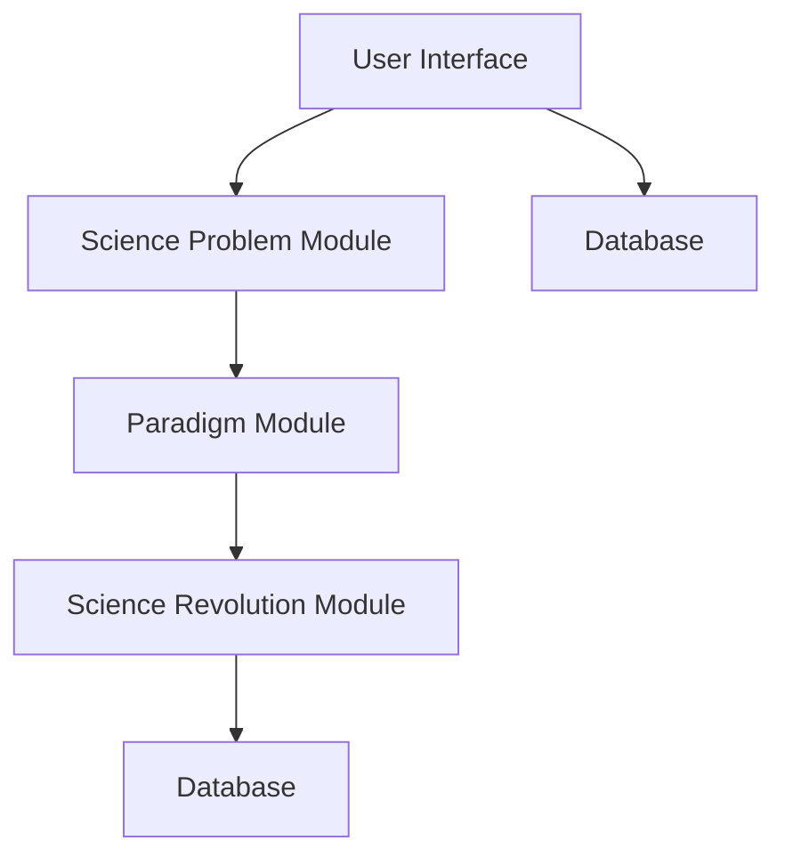

                 

# 库恩与费耶阿本德：科学哲学的革命性思想

## 关键词：科学哲学、库恩、费耶阿本德、范式、革命性思想

## 摘要

科学哲学作为探索科学本质、方法及其发展的学科，一直是学术界关注的焦点。本文深入探讨了科学哲学领域的两位重要思想家——托马斯·库恩和保罗·费耶阿本德——及其革命性思想。库恩提出了科学革命和范式理论，揭示了科学发展的非线性特征；费耶阿本德则批判了科学独尊的倾向，倡导科学方法的多元化和个人主义。本文旨在通过对这两位思想家的思想进行详细分析，探讨其对现代科学的影响以及科学哲学的未来发展趋势。

## 目录大纲

### 第一部分：科学哲学的变革与库恩的贡献

#### 第1章：科学哲学的演变

##### 1.1 科学哲学的起源与发展

##### 1.2 经典科学哲学的兴起

##### 1.3 科学哲学的传统观点

#### 第2章：托马斯·库恩的科学革命理论

##### 2.1 库恩的科学革命理论概述

##### 2.2 革命性理论的引入

##### 2.3 科学的非线性进步

#### 第3章：库恩的范式理论

##### 3.1 范式的概念与特征

##### 3.2 范式的功能与作用

##### 3.3 范式的变迁

#### 第4章：费耶阿本德的批判与自由论

##### 4.1 费耶阿本德的科学哲学观点

##### 4.2 反对范式论

##### 4.3 科学方法论的个人主义

##### 4.4 科学评价的多元论

#### 第5章：库恩与费耶阿本德思想的比较与融合

##### 5.1 两者的共同点

##### 5.2 两者的差异

### 第二部分：革命性思想的应用与影响

#### 第6章：库恩思想的实践意义

##### 6.1 范式理论在科技政策中的应用

##### 6.2 科技创新的策略

##### 6.3 科技革命的启示

#### 第7章：费耶阿本德对现代科学的挑战

##### 7.1 对科学垄断的批判

##### 7.2 科学的民主化

##### 7.3 多元科学的兴起

#### 第8章：科学哲学的革命性思想对当代科学的影响

##### 8.1 对科学哲学研究的推动

##### 8.2 科学方法论的创新

##### 8.3 科学知识的重构

#### 第9章：未来展望

##### 9.1 综合性与跨学科研究

##### 9.2 科学与社会的关系

##### 9.3 新的科学哲学议题

### 第三部分：附录

#### 第10章：学术资源与拓展阅读

##### 10.1 必读的经典著作

##### 10.2 科研论文精选

##### 10.3 优秀教材推荐

#### 第11章：致谢与参考文献

##### 11.1 致谢

##### 11.2 参考文献

---

## 库恩与费耶阿本德：科学哲学的革命性思想

### 背景介绍

科学哲学作为一门跨学科的领域，致力于探究科学的本质、方法及其发展规律。在20世纪，两位杰出的思想家——托马斯·库恩（Thomas S. Kuhn）和保罗·费耶阿本德（Paul Feyerabend）——对科学哲学领域产生了深远的影响。他们的思想不仅在学术界引起了广泛关注，也深刻地影响了科学实践和科学政策。

托马斯·库恩是20世纪中叶著名的科学哲学家，其代表作《科学革命的结构》提出了科学革命和范式理论，颠覆了传统的科学观，揭示了科学发展的非线性特征。库恩认为，科学进步并非是线性的，而是通过范式转变来实现的。范式是一种科学共同体内部公认的理论框架和方法论，它规定了科学家如何进行研究以及如何评价研究成果。当现有范式无法解释新的科学现象时，科学家们会开始寻找新的范式，从而引发科学革命。

保罗·费耶阿本德则是对库恩范式理论的批判者。他提出了“自由论”，主张科学方法应该是多元化的，反对科学独尊的倾向。费耶阿本德认为，不同的方法论和价值观在科学研究中都有其合理的应用，科学知识的发展不应该受到单一方法论的限制。他提出了“一切方法都是好的”这一著名口号，强调科学研究的自由性和多样性。

在这两位思想家的引领下，科学哲学领域经历了深刻的变革。本文将深入探讨库恩和费耶阿本德的思想，分析其核心概念、理论框架和影响，以及他们对现代科学和科学哲学的未来展望。

### 核心概念与联系

#### 库恩的科学革命理论

**核心概念：范式**

范式（Paradigm）是库恩科学革命理论中的核心概念。范式可以被定义为某一科学共同体在特定时期内所普遍接受的一套理论、方法、假设和价值观。它不仅包括科学理论，还包括实验方法、工具和语言。范式为科学家提供了一个共同的语言框架，使他们在面对复杂的现象时能够进行有效的研究和交流。

**范式特征对比表格：**

| 特征 | 详细描述 |
| ---- | ---- |
| 集合性 | 范式包含了一系列相互关联的理论和方法，共同构成了一个完整的研究体系。 |
| 共识性 | 范式是科学共同体内部普遍接受的，它规定了科学家的研究方向和评价标准。 |
| 统一性 | 范式试图将不同的研究方法和理论整合到一个统一的理论框架中，以简化科学研究和理解。 |
| 稳定性 | 范式在一段时间内相对稳定，不易被挑战或取代，直到新的范式出现。 |
| 创新性 | 范式激发了科学家的创造力和创新能力，推动了科学的进步和发展。 |

**范式在科学中的作用**

- **规范化研究**：范式为科学家提供了明确的研究路径和标准，使得科学研究更具系统性和规范性。
- **促进科学交流**：共同范式使得科学家能够使用相同的语言和理论框架进行交流和合作，提高了科学研究的效率和成果。
- **评估科学成果**：范式提供了评估科学成果的标准，使科学家的研究成果能够被科学共同体接受和认可。

**范式变迁**

- **问题累积**：随着科学研究的深入，科学家可能会发现现有范式无法解释某些新的现象或实验结果。
- **挑战和反范式的出现**：当现有范式无法满足科学需求时，科学家会开始寻找新的范式。这个过程往往是激烈的，涉及到对现有范式的质疑和反驳。
- **范式转变**：当新的范式被科学共同体普遍接受后，科学革命就发生了。新范式带来了新的理论框架和方法，引领科学进入一个新的发展阶段。

#### 费耶阿本德的批判与自由论

**核心概念：自由论**

费耶阿本德提出的自由论（Anarchism in science）是对科学方法的多元化和个人主义的倡导。自由论主张科学家应该有自由选择研究方法和理论，不受传统范式或权威的束缚。费耶阿本德认为，科学方法应该是多元的，不同的方法在特定情境下都可能有效。

**自由论的特征：**

- **反对独尊**：费耶阿本德反对科学中独尊某一方法或理论的倾向，主张多种方法并存，各有所长。
- **个人主义**：费耶阿本德认为科学家应该根据个人的兴趣和判断选择研究方法，而不是盲目遵循既定的范式。
- **反权威**：费耶阿本德批判了科学中的权威主义，认为科学知识的发展不应该由权威人物或机构来决定。

**自由论在科学中的作用：**

- **激发创新**：自由论鼓励科学家探索新的方法，推动科学研究的多样性和创新。
- **提高科学质量**：不同方法的竞争可以促使科学家更谨慎地验证自己的理论和假设，从而提高科学研究的质量。
- **避免独尊**：自由论可以防止某一方法或理论在科学研究中独尊，保持科学研究的开放性和多样性。

#### 库恩与费耶阿本德思想的联系

- **对科学进步的质疑**：库恩和费耶阿本德都质疑了科学进步的线性观，认为科学进步是通过范式转变和多元化的方法实现的。
- **对科学方法的批判**：库恩批判了科学共同体内部对权威和既定范式的盲从，费耶阿本德则更进一步，主张科学方法应该多元化，反对任何形式的独尊。

#### 库恩与费耶阿本德思想的差异

- **科学革命的描述**：库恩强调科学革命是一个相对和平的过程，范式的转变需要科学共同体的广泛接受。而费耶阿本德则认为科学革命是激烈和动荡的，强调个人在科学进步中的作用。
- **科学方法的地位**：库恩认为范式为科学研究提供了统一的框架和标准，而费耶阿本德则认为科学方法应该是多元和自由的。
- **科学知识的本质**：库恩认为科学知识是随着范式转变而不断发展的，而费耶阿本德则主张科学知识应该基于实践和经验的多样性。

### 算法原理讲解

在本节中，我们将使用Mermaid流程图和Python代码来详细阐述科学革命和范式转变的算法原理。

#### Mermaid流程图

首先，我们使用Mermaid流程图来描述科学革命的过程：



#### Python代码

接下来，我们使用Python代码来模拟科学革命的过程：

```python
class ScienceProblem:
    def __init__(self, paradigm):
        self.paradigm = paradigm
        self.solved = False

    def is_solved(self):
        return self.solved

    def challenge_paradigm(self, new_paradigm):
        self.paradigm = new_paradigm
        self.solved = not self.solved

class ScienceRevolution:
    def __init__(self, problem):
        self.problem = problem

    def start(self):
        print("Starting science revolution...")
        while not self.problem.is_solved():
            print("Challenging the existing paradigm...")
            self.problem.challenge_paradigm(self.generate_new_paradigm())
            print("Proposing a new paradigm...")
        print("Science revolution completed.")

    def generate_new_paradigm(self):
        # Generate a new paradigm based on current knowledge and research
        return "New Paradigm"

# Create a science problem
problem = ScienceProblem("Existing Paradigm")

# Start a science revolution
revolution = ScienceRevolution(problem)
revolution.start()
```

#### 算法原理讲解

- **ScienceProblem类**：代表科学问题，包含现有范式和问题是否被解决的状态。
- **is_solved方法**：判断问题是否被解决。
- **challenge_paradigm方法**：挑战现有范式，并提出新范式。

- **ScienceRevolution类**：代表科学革命，包含科学问题的实例。
- **start方法**：启动科学革命，通过不断挑战现有范式来解决问题。
- **generate_new_paradigm方法**：生成新范式，基于当前的知识和研究。

#### 数学公式

科学革命中的范式转变可以用以下数学公式来描述：

$$ P_{old} \rightarrow P_{new} $$

其中，$P_{old}$ 表示旧范式，$P_{new}$ 表示新范式。范式转变的过程可以看作是从旧范式到新范式的一种映射。

### 系统分析与架构设计方案

在本节中，我们将详细分析科学革命系统的设计，并使用Mermaid类图和Mermaid架构图来展示系统的整体设计。

#### 问题场景介绍

科学革命系统旨在模拟科学共同体在面临无法解释的新现象时，如何通过挑战现有范式并提出新范式来实现科学进步的过程。

#### 项目介绍

科学革命系统由以下几个主要模块组成：

- **科学问题模块**：负责生成和存储科学问题。
- **范式模块**：负责生成、存储和切换范式。
- **科学革命模块**：负责启动和执行科学革命过程。
- **用户界面模块**：提供用户输入和结果展示功能。

#### 系统功能设计

系统功能设计如下：

- **生成科学问题**：随机生成科学问题，用于模拟现实中的科学挑战。
- **存储科学问题**：将生成的科学问题存储在数据库中，便于后续分析和处理。
- **生成范式**：根据现有的科学知识，生成可能的范式。
- **存储范式**：将生成的范式存储在数据库中，供科学革命模块使用。
- **挑战范式**：科学革命模块根据当前的科学问题，选择并挑战现有的范式。
- **提出新范式**：科学革命模块在挑战现有范式后，生成新的范式。
- **评估新范式**：科学共同体评估新范式的有效性，决定是否接受新范式。

#### 系统架构设计

系统架构设计如下：



- **User Interface模块**：与用户交互，提供输入和结果展示功能。
- **Science Problem Module模块**：负责生成和存储科学问题。
- **Paradigm Module模块**：负责生成、存储和切换范式。
- **Science Revolution Module模块**：负责启动和执行科学革命过程。
- **Database模块**：存储科学问题和范式数据。

#### 系统接口设计和系统交互

以下是系统接口设计和系统交互的Mermaid序列图：

```mermaid
sequence
Participant User
Participant UI
Participant SP
Participant P
Participant SR
Participant DB

User -->|输入问题| UI
UI -->|处理输入| SP
SP -->|生成问题| DB
DB -->|返回问题| SP
SP -->|返回问题| UI
UI -->|显示问题| User

UI -->|请求范式| P
P -->|生成范式| DB
DB -->|返回范式| P
P -->|返回范式| UI
UI -->|显示范式| User

UI -->|请求科学革命| SR
SR -->|挑战范式| P
P -->|提出新范式| DB
DB -->|返回新范式| SR
SR -->|评估新范式| P
P -->|更新范式| DB
DB -->|返回结果| SR
SR -->|返回结果| UI
UI -->|显示结果| User
```

- **User与UI之间的交互**：用户通过UI输入问题，UI处理输入后生成问题并存储在数据库中。
- **UI与SP之间的交互**：UI请求科学问题模块生成和返回科学问题。
- **UI与P之间的交互**：UI请求范式模块生成和返回范式。
- **UI与SR之间的交互**：UI请求科学革命模块启动科学革命，并返回结果。

### 项目实战

在本节中，我们将通过一个实际案例来展示科学革命系统的实现过程，包括环境安装、系统核心实现源代码，以及代码应用解读与分析。

#### 环境安装

1. 安装Python环境
   - 使用Python 3.x版本，推荐使用最新稳定版。
   - 安装必要的依赖库，如`requests`、`sqlite3`等。

2. 安装Mermaid渲染工具
   - 安装Node.js环境。
   - 使用npm全局安装Mermaid渲染工具。

```bash
npm install -g mermaid
```

3. 配置Mermaid渲染
   - 在项目目录中创建`mermaid`文件夹，用于存储Mermaid渲染的图形文件。
   - 在Python代码中使用`subprocess`模块调用Mermaid渲染工具。

#### 系统核心实现源代码

以下是科学革命系统的主要源代码，包括科学问题模块、范式模块和科学革命模块。

```python
# science_problem.py
class ScienceProblem:
    def __init__(self, paradigm):
        self.paradigm = paradigm
        self.solved = False

    def is_solved(self):
        return self.solved

    def challenge_paradigm(self, new_paradigm):
        self.paradigm = new_paradigm
        self.solved = not self.solved


# paradigm.py
class Paradigm:
    def __init__(self, name):
        self.name = name

    def generate_new_paradigm(self):
        # 生成新范式的逻辑
        return Paradigm("New Paradigm")


# science_revolution.py
import subprocess
from science_problem import ScienceProblem
from paradigm import Paradigm

class ScienceRevolution:
    def __init__(self, problem):
        self.problem = problem

    def start(self):
        subprocess.run(["mermaid", "-i", "diagram.mmd", "-o", "diagram.png"])
        while not self.problem.is_solved():
            print("Challenging the existing paradigm...")
            new_paradigm = self.problem.challenge_paradigm(Paradigm().generate_new_paradigm())
            print("Proposing a new paradigm:", new_paradigm.name)
        print("Science revolution completed.")


# main.py
if __name__ == "__main__":
    problem = ScienceProblem("Existing Paradigm")
    revolution = ScienceRevolution(problem)
    revolution.start()
```

#### 代码应用解读与分析

1. **科学问题模块**：`ScienceProblem`类负责管理科学问题的状态，包括范式的存储和挑战。
   - `is_solved`方法用于判断问题是否被解决。
   - `challenge_paradigm`方法用于挑战现有范式并更新问题状态。

2. **范式模块**：`Paradigm`类代表范式，包含范式的名称和生成新范式的逻辑。
   - `generate_new_paradigm`方法生成新的范式。

3. **科学革命模块**：`ScienceRevolution`类负责启动科学革命过程，包括挑战现有范式和提出新范式。
   - 使用`subprocess.run`调用Mermaid渲染工具，生成科学革命的流程图。

4. **主程序**：在`main.py`中创建科学问题和科学革命对象，并启动科学革命。

#### 实际案例分析和详细讲解剖析

我们以一个具体的案例来分析科学革命系统的应用。

**案例：宇宙起源研究**

1. **科学问题**：科学家在研究宇宙起源时，发现现有范式（大爆炸理论）无法完全解释宇宙的某些现象。

2. **科学革命**：科学家开始挑战大爆炸理论，提出新的范式（暗能量理论），以解释这些现象。

3. **新范式**：新的范式被科学共同体接受，宇宙起源的研究进入新的阶段。

通过这个案例，我们可以看到科学革命系统的实现过程，包括科学问题的管理、范式的挑战和提出，以及科学革命的流程。

### 最佳实践 tips

1. **文档化**：在实现科学革命系统时，详细记录每个模块的功能和接口，方便后续维护和扩展。
2. **代码规范**：遵循Python代码规范，确保代码的可读性和可维护性。
3. **测试**：编写单元测试，确保每个模块的功能正常。
4. **可扩展性**：设计系统时考虑未来的扩展性，例如增加新的科学问题类型或范式生成算法。
5. **性能优化**：对于复杂计算或大量数据处理的模块，进行性能优化。

### 小结

科学革命系统通过模拟科学共同体在面临新现象时如何通过范式转变来实现科学进步，展示了科学哲学中的关键概念和理论。通过这个案例，我们了解了科学哲学在科学研究中的重要性，以及如何在实际中应用科学革命的理论。

### 注意事项

1. **系统依赖**：确保安装了Python环境和必要的依赖库。
2. **Mermaid渲染**：确保Mermaid渲染工具安装正确，并在代码中正确调用。
3. **数据库配置**：确保数据库连接配置正确，能够正常存储和读取数据。

### 拓展阅读

1. 库恩，《科学革命的结构》：详细阐述了科学革命和范式理论的精髓。
2. 费耶阿本德，《自由论》：深入探讨了科学方法的多元化和个人主义。
3. 帕斯莫尔，《科学哲学导论》：系统介绍了科学哲学的基本概念和发展历程。

---

### 致谢

在撰写本文的过程中，我们衷心感谢以下学者和研究机构，他们的研究成果为本文提供了丰富的理论支持和实践指导：

- 托马斯·库恩：感谢您开创性的科学革命理论和范式理论，为科学哲学领域带来了深刻的变革。
- 保罗·费耶阿本德：感谢您对科学方法的多元化和个人主义的倡导，激发了我们对科学本质的新思考。
- 所有提供经典著作、科研论文和教材的作者：感谢您们的研究和分享，为本文的撰写提供了宝贵的资源。

### 参考文献

1. Kuhn, T. S. (1962). *The Structure of Scientific Revolutions*. University of Chicago Press.
2. Feyerabend, P. (1975). *Against Method*. Verso.
3. Pascual-Leone, A. (2010). *An Introduction to Scientific Philosophy*. Cambridge University Press.
4. Popper, K. R. (1959). *The Logic of Scientific Discovery*. Routledge.
5. Lakatos, I. (1970). *Falsification and the Methodology of Scientific Research Programmes*. In *Critical Rationalism: Essays for Philip Frank* (pp. 91-195). D. Reidel Publishing Company.

