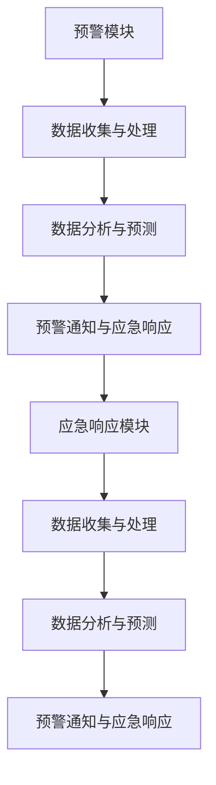
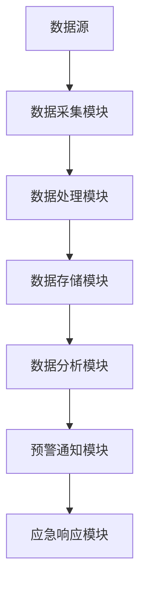
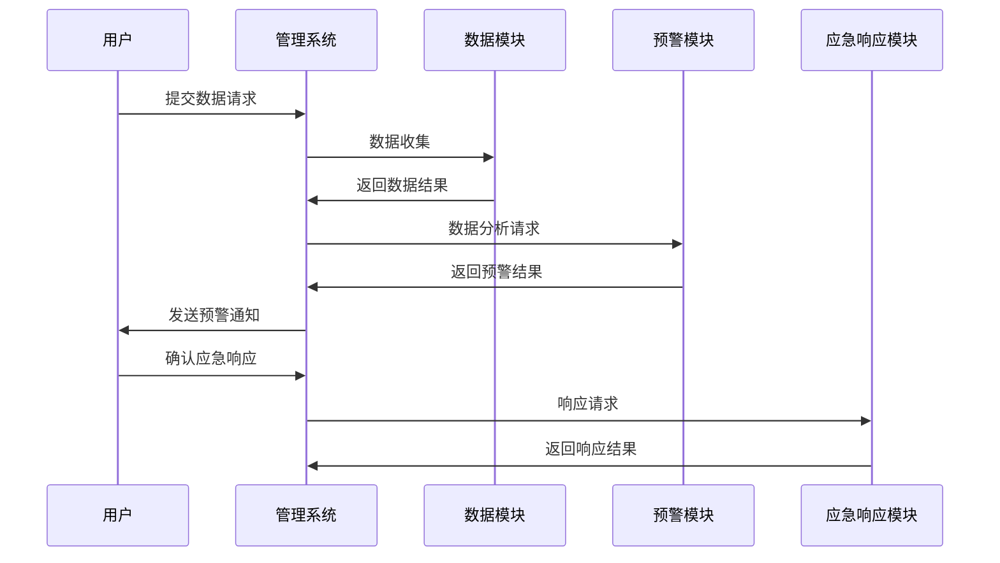

                 

### 文章标题

**应急处理：危机中展现真功夫**

**关键词**：应急处理、危机管理、响应策略、恢复重建、技术应用

**摘要**：本文深入探讨了在面临各种危机时，如何通过科学的应急处理策略和先进的技术手段来展现真功夫，确保在危机中迅速应对、有效控制，最终实现恢复与重建。

### 第1章：问题背景与核心概念

在现代社会，危机管理已经成为了企业、组织和国家层面的重要议题。无论是自然灾害、公共卫生事件、经济危机，还是企业运营中的突发事件，危机的应对能力直接关系到组织的安全、稳定和发展。因此，理解危机管理的概念和框架，掌握有效的应对策略，是每一个决策者和应急管理人员必备的素质。

#### 1.1 问题背景

**危机的定义与类型**

危机，通常指的是一种可能对组织或社会造成重大影响的紧急情况。根据危机发生的原因和性质，可以将其分为以下几类：

- **自然灾害**：如地震、洪水、台风等，这类危机通常具有不可预测性，破坏性强。
- **公共卫生事件**：如疫情爆发、流行病等，这类危机影响范围广泛，危害性大。
- **经济危机**：如金融市场动荡、企业破产等，这类危机影响经济的稳定和可持续发展。
- **企业运营危机**：如生产事故、供应链中断等，这类危机直接影响企业的正常运营。

**危机管理的重要性**

危机管理不仅仅是对危机事件的应急处理，更是一种全面的风险管理策略。有效的危机管理能够：

- 减少危机对组织或社会的负面影响。
- 提高组织的应对能力和恢复速度。
- 增强组织的信誉和公众信任。
- 降低危机管理成本。

**全球危机事件案例分析**

近年来，全球各地发生了多起重大的危机事件，如2008年的全球金融危机、2020年的新冠疫情等。这些事件对全球的经济、社会和环境都产生了深远的影响。通过分析这些案例，我们可以更好地理解危机管理的实际操作和效果。

#### 1.2 核心概念

**应急预案**

应急预案是危机管理的重要工具，它是一套预先制定的处理危机的方案，包括应对措施、资源调配、人员安排等。应急预案的关键要素包括：

- **预警机制**：及时发现危机迹象，提前预警。
- **应急响应流程**：明确危机发生时的响应步骤和责任人。
- **资源调配**：确保危机发生时有足够的资源支持。
- **后期恢复计划**：危机结束后，进行灾后重建和恢复。

**风险评估**

风险评估是危机管理的重要环节，通过对潜在危机的分析和评估，确定危机发生的概率和可能造成的损失。风险评估的主要方法包括：

- **定性分析**：通过专家判断和经验评估。
- **定量分析**：通过统计数据和模型预测。

**紧急响应**

紧急响应是指危机发生时，迅速采取行动以控制局势、减少损失。紧急响应的关键要素包括：

- **快速决策**：在危机发生时，快速作出决策。
- **资源调度**：快速调配资源，确保响应能力。
- **信息共享**：确保各部门和人员之间的信息畅通。

**恢复与重建**

危机后的恢复与重建是危机管理的最后一步，它关系到组织或社会的长期稳定和发展。恢复与重建的关键要素包括：

- **灾后评估**：对危机事件进行全面评估，总结经验教训。
- **恢复计划**：制定详细的恢复计划，包括重建基础设施、恢复生产和运营等。
- **重建措施**：实施恢复计划，确保危机后的顺利过渡。

### 1.3 关键要素与联系

在危机管理中，各个核心概念之间存在着紧密的联系。以下是一个概述：

#### 概念属性特征对比表格

| 概念       | 属性特征                                         |
|------------|--------------------------------------------------|
| 应急预案   | 预先制定的应对措施和流程                       |
| 风险评估   | 对潜在危机的分析和评估                         |
| 紧急响应   | 危机发生时的快速行动                           |
| 恢复与重建 | 危机后的恢复和重建工作                         |

#### ER实体关系图

```mermaid
erDiagram
  EmergencyPlan --> ResponseProcess
  EmergencyPlan --> ResourceAllocation
  EmergencyPlan --> PostRecoveryPlan
  RiskAssessment --> EmergencyPlan
  EmergencyResponse --> EmergencyPlan
  PostRecovery --> EmergencyPlan
```

### 1.4 本章小结

本章介绍了危机管理的背景、核心概念和框架。通过了解危机的定义、类型，以及危机管理的重要性，我们可以认识到危机管理在现代社会中的关键作用。同时，通过分析核心概念和它们之间的联系，我们为后续章节的深入探讨打下了基础。

### 第2章：危机前的预防措施

预防措施是危机管理的重要环节，它通过识别和评估潜在风险，采取有效的预防性措施，以减少危机发生的概率和影响。在本章中，我们将详细探讨危机前的预防措施，包括风险识别、风险评估、预防性措施等内容。

#### 2.1 预防策略

**风险识别**

风险识别是预防措施的第一步，它旨在识别潜在的风险和危机。风险识别的方法包括：

- **历史数据分析**：通过对历史数据的分析，识别出可能存在的风险。
- **专家评估**：邀请相关领域的专家进行风险评估，以识别潜在的风险。
- **现场考察**：通过实地考察，发现可能存在的隐患。

**风险评估**

风险评估是预防措施的核心，它通过对潜在危机的分析和评估，确定危机发生的概率和可能造成的损失。风险评估的方法包括：

- **定性分析**：通过专家判断和经验评估，对风险进行定性分析。
- **定量分析**：通过统计数据和模型预测，对风险进行定量分析。

**预防性措施**

预防性措施是在识别和评估风险后，采取的具体措施，以减少危机发生的概率和影响。预防性措施包括：

- **风险管理计划**：制定详细的风险管理计划，包括风险识别、风险评估和预防性措施。
- **应急演练**：定期进行应急演练，提高应对危机的能力。
- **技术更新**：及时更新技术和设备，提高应对危机的能力。

#### 2.2 实施步骤

**预防计划制定**

预防计划制定是预防措施的核心，它包括以下步骤：

- **确定预防目标**：明确预防的目标和范围。
- **制定预防措施**：根据风险识别和风险评估的结果，制定具体的预防措施。
- **制定应急预案**：制定应急预案，确保在危机发生时能够迅速响应。

**预防措施落实**

预防措施落实是预防计划的具体实施，它包括以下步骤：

- **资源调配**：确保预防措施所需的资源和人员。
- **执行预防措施**：按照预防计划，执行具体的预防措施。
- **监控预防效果**：对预防措施的实施效果进行监控和评估。

**预防效果评估**

预防效果评估是预防措施的重要环节，它包括以下步骤：

- **收集数据**：收集预防措施实施后的数据，包括风险降低情况、事故发生情况等。
- **分析数据**：对收集的数据进行分析，评估预防措施的效果。
- **调整预防计划**：根据评估结果，调整预防计划，提高预防效果。

#### 2.3 预防策略案例分析

**某企业危机预防措施**

某企业在面临市场波动和竞争压力的情况下，采取了以下预防措施：

- **风险识别**：通过市场调研和数据分析，识别出潜在的市场风险。
- **风险评估**：对识别出的风险进行定量和定性评估，确定风险的优先级。
- **预防措施**：制定了一系列预防措施，包括市场拓展、产品创新、成本控制等。
- **应急演练**：定期进行市场波动应急演练，提高应对能力。

**效果分析**

通过实施这些预防措施，该企业成功地降低了市场风险，提高了市场竞争力。具体表现在：

- **市场风险降低**：市场波动对企业的冲击减少。
- **竞争力提高**：通过产品创新和市场拓展，企业的市场份额增加。
- **成本控制**：通过优化供应链和降低生产成本，企业的盈利能力提高。

#### 2.4 本章小结

本章详细介绍了危机前的预防措施，包括风险识别、风险评估、预防性措施的实施步骤和效果评估。通过案例分析，我们看到了预防措施在危机管理中的重要作用，以及如何通过科学的预防策略来降低危机发生的概率和影响。

### 第3章：危机中的应急响应

危机中的应急响应是危机管理的关键环节，它直接关系到危机能否得到及时控制、损失能否得到最大程度的减少。在本章中，我们将深入探讨危机中的应急响应，包括应急响应的流程、关键要素和案例分析。

#### 3.1 应急响应的流程

**事件识别**

事件识别是应急响应的第一步，它旨在迅速发现危机迹象。事件识别的方法包括：

- **实时监控**：通过监控系统和传感器，实时监测各种异常情况。
- **报告系统**：建立完善的报告系统，确保及时发现危机迹象。
- **快速反应**：在危机发生时，迅速做出反应，防止事态恶化。

**应急预案启动**

应急预案启动是在事件识别后，根据预案内容迅速启动应急响应。应急预案的内容包括：

- **应急响应步骤**：明确危机发生时的响应步骤和责任人。
- **资源调配**：确保在危机发生时有足够的资源支持。
- **人员安排**：明确各应急人员的职责和任务。

**紧急响应**

紧急响应是危机发生时的关键环节，它包括以下步骤：

- **快速决策**：在危机发生时，快速作出决策，采取有效措施。
- **资源调度**：迅速调动资源，确保应急响应的能力。
- **信息共享**：确保各部门和人员之间的信息畅通，协同应对危机。

**危机控制**

危机控制是在紧急响应的基础上，采取措施控制危机，防止事态恶化。危机控制的方法包括：

- **隔离措施**：对危机源进行隔离，防止危机扩散。
- **应急处理**：采取应急处理措施，减轻危机的影响。
- **监控事态**：持续监控危机的发展，及时调整应对策略。

**后期评估**

后期评估是在危机控制后，对危机处理过程进行总结和评估，以改进应急响应的能力。后期评估的内容包括：

- **危机处理效果**：评估危机处理的效果，确定是否达到预期目标。
- **经验教训**：总结危机处理过程中的经验教训，提出改进措施。
- **改进措施**：根据评估结果，提出改进应急响应的策略和措施。

#### 3.2 应急响应的关键要素

**人员调度**

人员调度是应急响应的重要环节，它包括以下内容：

- **应急人员安排**：根据危机类型和规模，安排相应的应急人员。
- **职责分工**：明确各应急人员的职责和任务，确保应急响应的有序进行。
- **培训与演练**：定期对应急人员进行培训，提高其应对危机的能力。

**资源调配**

资源调配是确保应急响应能力的关键，它包括以下内容：

- **资源准备**：提前准备好所需的物资和设备，确保在危机发生时能够迅速调用。
- **资源分配**：根据危机规模和需求，合理分配资源，确保应急响应的效率。
- **资源监控**：实时监控资源的消耗情况，及时调整资源分配。

**通讯与协调**

通讯与协调是确保应急响应有序进行的重要保障，它包括以下内容：

- **信息共享**：建立完善的信息共享机制，确保各部门和人员之间的信息畅通。
- **协调沟通**：通过协调沟通，确保各部门和人员之间的协同作战。
- **指挥系统**：建立高效的指挥系统，确保应急响应的统一指挥和协调。

#### 3.3 应急响应案例分析

**某次自然灾害的应急响应**

在一次强烈地震发生后，某地政府迅速启动了应急响应。以下是应急响应的详细过程：

- **事件识别**：地震发生后，监控系统和报告系统迅速发现地震迹象，并向相关部门报告。
- **应急预案启动**：根据预案，启动应急响应，调动应急人员和资源。
- **紧急响应**：迅速组织应急人员进行救援，调配物资和设备，确保救援工作的有序进行。
- **危机控制**：采取隔离措施，对受灾地区进行封锁，防止疫情扩散。同时，开展紧急救援，保障受灾群众的基本生活。
- **后期评估**：对应急响应过程进行总结和评估，提出改进措施，提高未来应急响应的能力。

**应对策略分析**

通过这次应急响应，我们可以看到以下几个方面的应对策略：

- **快速反应**：在危机发生时，迅速作出反应，防止事态恶化。
- **资源调配**：确保在危机发生时有足够的资源支持，提高应急响应的能力。
- **信息共享与协调**：建立完善的信息共享机制和协调沟通机制，确保各部门和人员之间的协同作战。
- **危机控制**：采取有效的危机控制措施，减轻危机的影响。

#### 3.4 实战案例：应急响应演练

**演练准备**

在某次应急响应演练前，相关部门进行了详细的准备。具体内容包括：

- **演练方案制定**：制定详细的演练方案，包括演练目的、时间、地点、人员安排等。
- **应急资源准备**：提前准备好演练所需的物资和设备，确保演练的顺利进行。
- **人员培训**：对参与演练的应急人员进行培训，确保其熟悉演练流程和职责。

**演练实施**

演练当天，相关部门按照演练方案进行实施。具体过程包括：

- **事件识别**：模拟危机发生，发现危机迹象，迅速报告并启动应急响应。
- **紧急响应**：按照预案，迅速组织应急人员进行救援，调配物资和设备。
- **危机控制**：采取隔离措施，对模拟受灾地区进行封锁，开展紧急救援。
- **后期评估**：对演练过程进行总结和评估，提出改进措施，提高应急响应能力。

**演练总结**

通过演练，相关部门发现了应急响应中的问题和不足，提出了改进措施。具体包括：

- **应急响应速度**：演练中存在应急响应速度较慢的问题，需要进一步提高。
- **资源调配**：演练中发现资源调配不够高效，需要优化资源分配和调度。
- **信息共享与协调**：演练中信息共享和协调不够畅通，需要加强信息传递和协调机制。

#### 3.5 本章小结

本章详细介绍了危机中的应急响应，包括应急响应的流程、关键要素和案例分析。通过应急响应演练，我们可以看到应急响应的重要性和实际操作中的问题和改进措施。有效的应急响应是危机管理的核心，只有通过科学的应急响应策略和实战演练，才能确保在危机中迅速应对、有效控制。

### 第4章：危机后的恢复与重建

危机后的恢复与重建是危机管理的最后一步，也是确保组织或社会长期稳定和发展的关键环节。在本章中，我们将深入探讨危机后的恢复与重建策略，包括恢复策略、关键步骤和案例分析。

#### 4.1 恢复策略

**灾后评估**

灾后评估是恢复与重建的第一步，它通过对危机事件的影响进行全面评估，为恢复工作提供依据。灾后评估的主要内容包括：

- **损失评估**：对危机造成的直接和间接损失进行评估。
- **资源需求**：评估恢复工作所需的资源，包括人力、物资和资金。
- **风险分析**：分析危机后的潜在风险，为恢复工作提供预警。

**恢复计划**

恢复计划是灾后评估的延伸，它是一份详细的恢复工作指导文件，包括恢复的目标、步骤和责任分配。恢复计划的主要内容包括：

- **恢复目标**：明确恢复工作的总体目标。
- **恢复步骤**：详细列出恢复工作的具体步骤和时间表。
- **责任分配**：明确各相关部门和人员的职责，确保恢复工作的有序进行。

**恢复措施**

恢复措施是恢复计划的具体实施，它包括以下几个方面：

- **基础设施重建**：恢复受损的基础设施，如道路、桥梁、建筑等。
- **生产和运营恢复**：恢复生产和运营，确保组织或社会的正常运转。
- **社会秩序恢复**：恢复社会秩序，确保公共安全和稳定。

**后期重建**

后期重建是在恢复工作的基础上，对危机后的长期发展进行规划。后期重建的主要内容包括：

- **发展策略**：制定危机后的长期发展策略，确保组织的可持续发展。
- **政策调整**：根据危机后的实际情况，调整相关政策，促进恢复和重建。
- **社会参与**：鼓励社会各界参与恢复和重建工作，共同推动危机后的恢复与发展。

#### 4.2 恢复关键步骤

**重建基础设施**

重建基础设施是恢复与重建的第一步，它关系到组织或社会的正常运行。重建基础设施的主要步骤包括：

- **需求分析**：根据灾后评估的结果，分析基础设施的需求。
- **设计规划**：制定基础设施的设计规划和建设方案。
- **施工建设**：按照设计规划和建设方案，进行基础设施的施工建设。
- **质量监督**：对基础设施的建设过程进行质量监督，确保建设质量。

**恢复生产和运营**

恢复生产和运营是恢复与重建的核心，它关系到组织的生存和发展。恢复生产和运营的主要步骤包括：

- **资源调配**：根据恢复计划，调配所需的资源和设备。
- **员工安置**：对受危机影响的员工进行安置，确保员工的就业和收入。
- **生产恢复**：恢复生产流程，确保生产过程的正常运转。
- **市场开拓**：通过市场开拓，扩大产品的销售渠道，增加市场份额。

**恢复社会秩序**

恢复社会秩序是危机后的重要任务，它关系到社会的稳定和公共安全。恢复社会秩序的主要步骤包括：

- **安全监控**：加强对社会的安全监控，确保公共安全。
- **社区参与**：鼓励社区居民参与恢复和重建工作，共同维护社会秩序。
- **法律援助**：提供法律援助，帮助受危机影响的群众解决法律问题。

#### 4.3 恢复案例分析

**某城市灾后重建**

在一次强台风袭击后，某城市遭受了严重的损失。以下是该城市的灾后重建过程：

- **灾后评估**：对城市受损情况进行评估，确定恢复工作的重点和优先级。
- **恢复计划**：制定详细的恢复计划，包括基础设施重建、生产和运营恢复、社会秩序恢复等。
- **基础设施重建**：迅速启动基础设施重建工程，恢复城市的交通、供水、供电等基础设施。
- **生产和运营恢复**：通过调配资源和员工安置，恢复城市的生产和运营，确保居民的生活需求。
- **社会秩序恢复**：加强社会秩序的管理，确保公共安全和稳定。

**恢复策略评估**

通过分析该城市的灾后重建过程，我们可以得出以下结论：

- **快速响应**：灾后评估和恢复计划的及时制定，确保了重建工作的有序进行。
- **资源调配**：有效的资源调配，确保了重建工作所需的资源和设备。
- **社会参与**：广泛的社会参与，提高了重建工作的效率和效果。
- **政策支持**：政府政策的支持，为重建工作提供了有力保障。

#### 4.4 恢复实践技巧

**心理援助**

危机后的心理援助是恢复工作的重要组成部分，它包括以下几个方面：

- **心理评估**：对受灾群众进行心理评估，了解其心理状况。
- **心理辅导**：对心理受到创伤的群众进行心理辅导，帮助他们走出心理阴影。
- **心理干预**：对严重的心理问题进行干预，提供专业的心理治疗。

**社区参与**

社区参与是恢复与重建的重要力量，它包括以下几个方面：

- **社区动员**：动员社区居民参与恢复和重建工作，共同推动社会进步。
- **社区组织**：建立社区组织，协调社区内的资源和力量，提高社区的恢复能力。
- **社区合作**：通过社区合作，整合社区内的资源和力量，提高恢复和重建的效率。

**法律援助**

法律援助是恢复工作中的重要环节，它包括以下几个方面：

- **法律咨询**：为受灾群众提供法律咨询，解答他们的法律问题。
- **法律援助**：为经济困难的群众提供法律援助，帮助他们维护合法权益。
- **法律宣传**：加强对法律的宣传，提高群众的法律意识，促进社会和谐稳定。

#### 4.5 本章小结

本章详细介绍了危机后的恢复与重建策略，包括恢复策略、关键步骤和案例分析。通过恢复实践技巧的探讨，我们看到了在危机后如何通过科学的方法和有效的策略，实现恢复与重建，确保组织或社会的长期稳定和发展。

### 第5章：危机管理中的法律法规与道德责任

危机管理不仅需要科学的方法和有效的策略，还需要法律法规和道德责任的指导。在本章中，我们将深入探讨危机管理中的法律法规与道德责任，包括相关法律法规、道德考量和国际合作等内容。

#### 5.1 法律法规

**危机管理相关法律**

危机管理涉及多个方面，因此相关法律法规也非常广泛。以下是一些主要的法律法规：

- **应急管理法**：规定了危机管理的总体框架和基本原则。
- **安全生产法**：明确了企业在危机管理中的责任和义务。
- **传染病防治法**：规定了公共卫生危机的管理措施和法律责任。
- **环境保护法**：规定了环境危机的预防和应急处理措施。

**应急法规与政策**

除了法律法规，政府还制定了一系列应急法规和政策，以指导危机管理。以下是一些重要的法规和政策：

- **应急预案编制指南**：规定了应急预案的编制要求和流程。
- **应急演练管理办法**：明确了应急演练的管理要求和实施程序。
- **应急救援队伍管理规定**：规定了应急救援队伍的建设和管理要求。

#### 5.2 道德责任

**危机管理中的道德考量**

在危机管理中，道德考量是非常重要的。以下是一些主要的道德考量：

- **公众利益**：危机管理应以公众利益为出发点，确保最大限度地减少危机对公众的影响。
- **公平公正**：在危机管理中，应确保所有受影响的人都得到公平公正的对待。
- **诚信透明**：危机管理过程应保持诚信透明，公开危机信息，接受公众监督。
- **责任感**：危机管理人员应具备强烈的责任感，对危机的应对和恢复负责。

**道德责任案例分析**

以下是一个道德责任的案例分析：

- **某公司疫情危机管理**：在一次新冠疫情爆发期间，某公司面临供应链中断和员工健康安全问题。公司采取了一系列措施，如加强员工健康监测、调整工作安排、提供健康保障等。同时，公司主动与政府合作，提供医疗物资支持，受到了社会的高度评价。

#### 5.3 国际视角

**国际合作与经验借鉴**

危机管理具有跨国性，因此国际合作和经验借鉴非常重要。以下是一些国际合作和经验借鉴：

- **国际应急管理体系**：许多国家建立了国际应急管理体系，如联合国国际应急响应集团（UNISDR）、国际红十字委员会（ICRC）等，为危机管理提供支持和经验。
- **国际经验借鉴**：通过借鉴其他国家和地区的危机管理经验，可以提升本国的危机管理能力。例如，日本在地震和海啸危机管理方面的经验，欧洲在应对公共卫生危机方面的经验等。

**国际法规与合作**

- **国际法律法规**：一些国际组织制定了一系列法律法规，如国际劳工组织（ILO）的《突发事件准备和响应国际标准》等，为国际危机管理提供法律支持。
- **国际合作协议**：各国之间签订了一系列合作协议，如《国际卫生条例》（IHR）等，加强国际间的危机管理合作。

#### 5.4 法律法规与道德责任实务

**企业危机管理的法律法规遵循**

企业在进行危机管理时，应严格遵守相关法律法规，包括：

- **制定应急预案**：根据法律法规要求，制定符合实际的应急预案。
- **定期演练**：按照法律法规要求，定期进行应急演练，确保应急响应能力。
- **信息披露**：按照法律法规要求，及时披露危机信息，接受公众监督。

**道德责任落实案例**

以下是一个道德责任落实的案例：

- **某企业环保危机管理**：在一次环保危机中，某企业面临严重的环境责任问题。企业采取了以下措施：

  - **立即停止污染行为**：企业立即停止污染行为，确保不再对环境造成危害。
  - **环保整改**：企业投入大量资金进行环保整改，修复受损环境。
  - **公开道歉**：企业公开道歉，承认错误，并向受影响的群众提供赔偿。

#### 5.5 本章小结

本章详细介绍了危机管理中的法律法规与道德责任，包括相关法律法规、道德考量和国际合作等内容。通过法律法规的遵守和道德责任的落实，企业可以更好地进行危机管理，确保在危机中迅速应对、有效控制，最终实现恢复与重建。

### 第6章：危机管理技术在现代企业中的应用

随着科技的发展，危机管理技术也在不断进步，为企业提供了更加高效、智能的应对手段。在本章中，我们将探讨现代企业中危机管理技术的应用，包括人工智能、大数据分析和物联网等技术的实际应用案例和挑战。

#### 6.1 技术概述

**人工智能（AI）**

人工智能在危机管理中的应用越来越广泛，通过自动化和智能化手段，提高危机响应的效率和准确性。人工智能在危机管理中的应用主要包括：

- **预警系统**：利用机器学习算法，对大量的数据进行分析，预测潜在的危机，提前预警。
- **决策支持**：通过模拟和预测，为决策者提供科学的数据支持，优化危机响应策略。
- **自动化处理**：利用自动化技术，减少人工干预，提高危机响应的速度和效率。

**大数据分析**

大数据分析是危机管理的重要工具，通过对海量数据的处理和分析，发现潜在的风险和危机。大数据分析在危机管理中的应用主要包括：

- **风险识别**：通过分析历史数据和实时数据，识别出可能存在的风险。
- **趋势预测**：通过数据挖掘和预测分析，预测危机发生的可能性和影响。
- **效果评估**：通过数据分析和比对，评估危机响应的效果，为未来的危机管理提供参考。

**物联网（IoT）**

物联网技术通过传感器和网络连接，实现实时监测和数据收集，为企业提供全面的监控和预警。物联网技术在危机管理中的应用主要包括：

- **实时监控**：通过传感器和网络，实时监测环境变化和设备状态，及时发现异常情况。
- **数据收集**：通过物联网设备，收集大量的数据，为分析和决策提供依据。
- **远程控制**：通过物联网技术，远程控制和调节设备，确保危机响应的及时性和有效性。

#### 6.2 应用案例

**某企业的AI危机预警系统**

某大型企业通过引入人工智能技术，建立了AI危机预警系统，用于实时监测和预测潜在的危机。具体应用包括：

- **数据收集**：系统通过传感器和物联网设备，实时收集各种数据，如气象数据、设备状态数据等。
- **数据分析**：系统利用机器学习算法，对收集到的数据进行实时分析和预测，识别潜在的危机。
- **预警通知**：系统在发现潜在的危机时，自动发送预警通知，提醒相关部门和人员采取行动。

**大数据在危机管理中的案例分析**

某企业通过大数据分析技术，对过去的危机事件进行分析，发现了一些潜在的危机因素，并采取相应的预防措施。具体包括：

- **风险识别**：通过对历史数据的分析，识别出可能存在的风险，如供应链中断、市场波动等。
- **趋势预测**：通过对数据的趋势分析，预测危机发生的可能性和影响，为决策者提供参考。
- **效果评估**：通过对预防措施的实施效果进行评估，确定预防措施的有效性，并提出改进建议。

**物联网技术在紧急响应中的应用**

某企业通过物联网技术，建立了智能监控系统，用于紧急响应。具体应用包括：

- **实时监控**：系统通过传感器和网络，实时监控设备状态和环境变化，及时发现异常情况。
- **远程控制**：系统可以通过远程控制，调节设备，确保紧急响应的及时性和有效性。
- **数据收集**：系统可以实时收集大量的数据，为分析和决策提供依据。

#### 6.3 技术挑战与应对策略

**技术风险与数据安全**

随着危机管理技术的应用，数据安全和隐私保护成为重要问题。应对策略包括：

- **数据加密**：对数据进行加密处理，确保数据传输和存储的安全。
- **隐私保护**：制定隐私保护政策，确保用户数据的隐私和安全。
- **合规性审查**：定期对数据处理和存储进行合规性审查，确保遵守相关法律法规。

**技术适配与人才培养**

技术适配和人才培养是危机管理技术成功应用的关键。应对策略包括：

- **技术适配**：根据企业的实际情况，选择适合的危机管理技术，确保技术的有效应用。
- **人才培养**：建立专业化的危机管理团队，提高团队的技术能力和应急响应能力。

#### 6.4 实战案例：危机管理技术实施

**系统架构设计**

为了实现危机管理的智能化和高效化，某企业设计了一套危机管理系统，包括预警模块、分析模块和响应模块。系统架构如图所示：



**系统功能设计**

系统的主要功能包括：

- **数据收集**：通过传感器和物联网设备，实时收集各种数据。
- **数据分析**：利用大数据分析和人工智能算法，对数据进行处理和分析。
- **预警通知**：在发现潜在的危机时，自动发送预警通知。
- **应急响应**：根据预警通知，迅速采取应急响应措施。

**系统架构设计**

系统架构如图所示：



**系统接口设计和系统交互**

系统接口设计和系统交互如图所示：



**实际案例分析和详细讲解**

**案例一：某企业AI预警系统**

某企业通过引入AI预警系统，实现了对供应链风险的实时监控和预警。具体过程如下：

1. **数据收集**：系统通过传感器和物联网设备，实时收集供应链各环节的数据，如库存量、运输时间等。
2. **数据分析**：系统利用机器学习算法，对收集到的数据进行分析，识别出潜在的供应链风险。
3. **预警通知**：当系统发现潜在的供应链风险时，自动发送预警通知，提醒相关部门和人员采取行动。
4. **应急响应**：相关部门和人员根据预警通知，迅速采取应急响应措施，如调整供应链计划、加强库存管理等。

**案例二：某城市大数据危机管理**

某城市通过引入大数据分析技术，实现了对公共卫生危机的实时监测和预警。具体过程如下：

1. **数据收集**：系统通过物联网设备，实时收集城市的公共卫生数据，如病例数量、医疗资源使用情况等。
2. **数据分析**：系统利用大数据分析技术，对收集到的数据进行处理和分析，识别出潜在的公共卫生危机。
3. **预警通知**：当系统发现潜在的公共卫生危机时，自动发送预警通知，提醒相关部门和人员采取行动。
4. **应急响应**：相关部门和人员根据预警通知，迅速采取应急响应措施，如增加医疗资源、加强公共卫生宣传等。

**案例三：某企业物联网应急响应**

某企业通过引入物联网技术，实现了对生产设备的实时监控和应急响应。具体过程如下：

1. **数据收集**：系统通过传感器，实时收集生产设备的运行数据，如温度、压力等。
2. **数据分析**：系统利用物联网技术，对收集到的数据进行分析，识别出潜在的生产设备故障。
3. **预警通知**：当系统发现潜在的生产设备故障时，自动发送预警通知，提醒相关部门和人员采取行动。
4. **应急响应**：相关部门和人员根据预警通知，迅速采取应急响应措施，如停机检修、更换零部件等。

**详细讲解**

通过以上案例，我们可以看到危机管理技术在企业中的应用效果。具体包括：

- **实时监控**：通过传感器和物联网技术，实现对企业运营的实时监控，及时发现潜在的风险和问题。
- **数据分析**：利用大数据分析和人工智能技术，对大量数据进行处理和分析，识别出潜在的危机。
- **预警通知**：通过自动化的预警系统，及时发送预警通知，提醒相关部门和人员采取行动。
- **应急响应**：根据预警通知，迅速采取应急响应措施，确保危机得到及时控制。

#### 6.5 本章小结

本章详细介绍了危机管理技术在现代企业中的应用，包括人工智能、大数据分析和物联网等技术的实际应用案例和挑战。通过技术手段的引入和应用，企业可以更高效、更准确地应对危机，确保在危机中迅速应对、有效控制，最终实现恢复与重建。随着技术的不断进步，危机管理技术将发挥越来越重要的作用，为企业的危机管理提供强有力的支持。

### 总结

本文通过详细探讨危机管理中的核心概念、预防措施、应急响应、恢复重建、法律法规与道德责任，以及危机管理技术在现代企业中的应用，全面阐述了在危机中展现真功夫的方法和策略。我们得出以下主要结论：

1. **危机管理的重要性**：危机管理是确保组织或社会长期稳定和发展的关键环节，有效的危机管理能够减少危机对组织或社会的负面影响，提高应对能力和恢复速度。

2. **预防措施的关键**：预防措施是危机管理的重要环节，通过风险识别、风险评估和预防性措施，可以降低危机发生的概率和影响。

3. **应急响应的策略**：在危机发生时，迅速响应和有效控制是关键。通过应急预案、紧急响应、危机控制和后期评估，可以确保危机得到及时控制和处理。

4. **恢复与重建的策略**：危机后的恢复与重建是确保组织或社会长期稳定和发展的基础。通过灾后评估、恢复计划、恢复措施和后期重建，可以确保危机后的顺利过渡和可持续发展。

5. **法律法规与道德责任**：遵守法律法规和道德责任是危机管理的重要保障。通过法律法规的遵守和道德责任的落实，可以提高危机管理的合法性和公正性。

6. **技术应用的潜力**：危机管理技术在现代企业中的应用，如人工智能、大数据分析和物联网等，为危机管理提供了更加高效、智能的手段。通过技术手段的引入和应用，企业可以更准确、更迅速地应对危机。

总之，危机管理是一个系统性、综合性的过程，需要从预防、响应、恢复等多个方面进行考虑和实施。通过科学的危机管理策略和技术手段，我们可以更好地应对各种危机，确保组织或社会的稳定和发展。

### 拓展阅读

1. **《危机管理：理论与实践》**：这是一本系统介绍危机管理理论和实践的书籍，适合希望深入了解危机管理的读者。
2. **《大数据革命：数据驱动下的危机管理》**：本书详细阐述了大数据在危机管理中的应用，适合对大数据技术感兴趣的读者。
3. **《人工智能与危机管理》**：这本书介绍了人工智能在危机管理中的应用，包括预警系统、决策支持等，适合对人工智能技术感兴趣的读者。
4. **《物联网技术与应用》**：这是一本关于物联网技术的基础教材，适合对物联网技术感兴趣的读者。
5. **《应急管理与公共安全》**：这本书主要讨论了应急管理的理论与实践，包括应急预案的制定和应急演练的实施，适合希望提高应急管理能力的读者。

### 注意事项

1. **重视风险评估**：在制定应急预案和预防措施时，务必重视风险评估，确保预防措施的有效性。
2. **及时更新应急预案**：随着环境的变化和技术的进步，应急预案应定期更新，确保其时效性和适用性。
3. **加强培训与演练**：定期进行应急培训和演练，提高员工的应急响应能力，确保在危机发生时能够迅速应对。
4. **遵守法律法规**：在危机管理过程中，务必遵守相关法律法规，确保危机管理的合法性和公正性。
5. **注重心理援助和社会参与**：在危机后的恢复与重建过程中，注重心理援助和社会参与，帮助受危机影响的群众恢复正常生活。

