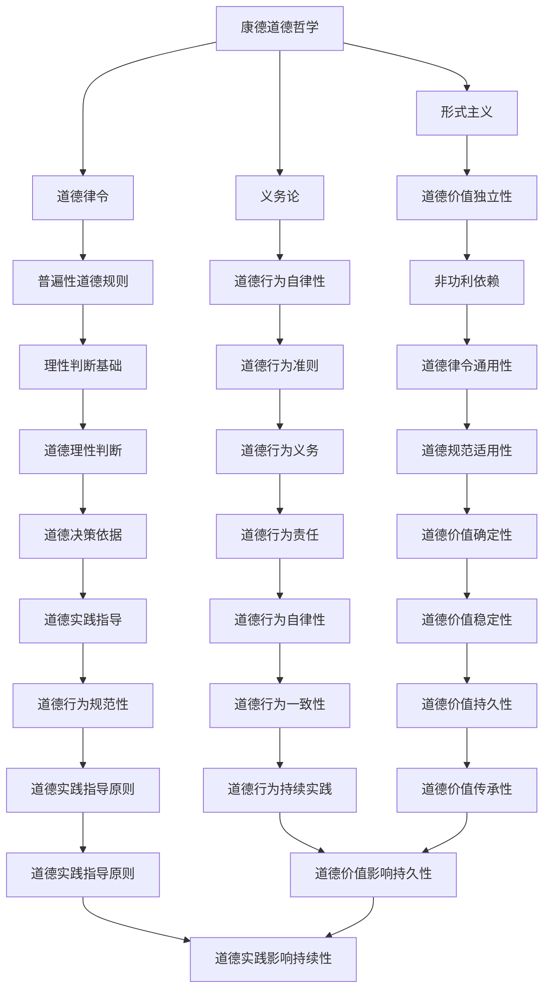
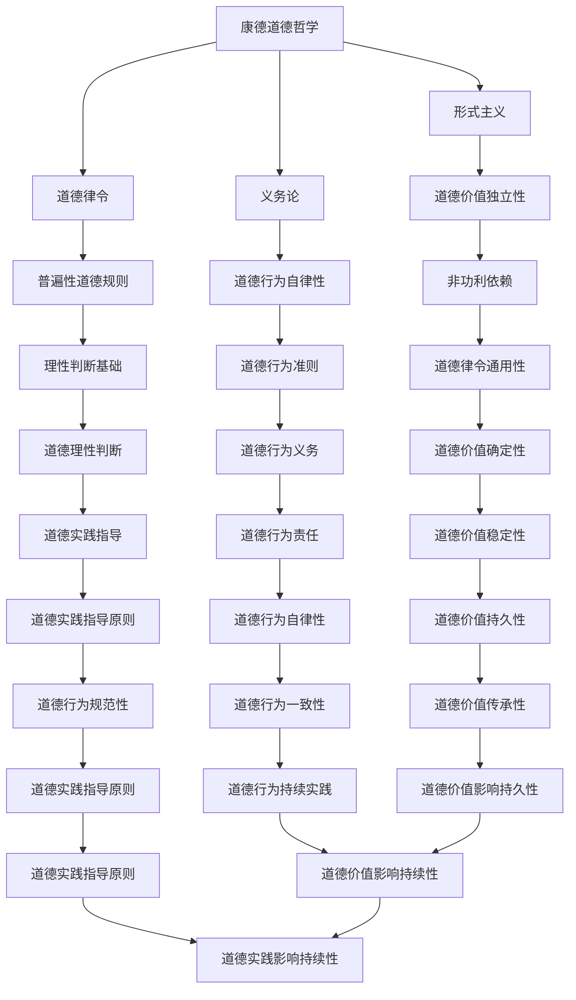

```mermaid
graph TB
A[康德道德哲学] --> B[道德律令]
A --> C[形式主义]
A --> D[义务论]
B --> E[普遍性道德规则]
C --> F[道德价值独立性]
D --> G[道德行为自律性]
E --> H[理性判断基础]
F --> I[非功利依赖]
G --> J[道德行为准则]
H --> K[道德理性判断]
I --> L[道德律令通用性]
J --> M[道德行为义务]
K --> N[道德实践指导]
L --> O[道德价值确定性]
M --> P[道德行为责任]
N --> Q[道德实践指导原则]
O --> R[道德价值稳定性]
P --> S[道德行为自律性]
Q --> T[道德行为规范性]
R --> U[道德价值持久性]
S --> V[道德行为一致性]
T --> W[道德实践指导原则]
U --> X[道德价值传承性]
V --> Y[道德行为持续实践]
W --> Z[道德实践指导原则]
X --> AA[道德价值影响持久性]
Y --> BB[道德实践影响持续性]
Z --> CC[道德实践持续性]
AA --> BB[道德价值影响持续性]
BB --> CC[道德实践影响持续性]
```
                 


# 康德与佛陀：道德哲学的东西方视角

> 关键词：康德、佛陀、道德哲学、东西方文化、共通性、差异

> 摘要：本文旨在对比分析东西方道德哲学的奠基人康德和佛陀的道德哲学，探讨其核心概念、历史背景及其在现代社会的应用。通过对两位哲学家的思想进行深入比较，本文希望能够为现代道德哲学的发展提供新的视角和思路。

## 第1章：引言

### 1.1 背景介绍

在21世纪的今天，道德哲学作为探讨人类行为准则和道德标准的学科，越来越受到全球关注。作为东西方哲学的重要代表，康德和佛陀的思想对后世产生了深远的影响。康德以其“纯粹理性批判”和“实践理性批判”构建了严密的道德哲学体系，强调道德行为的普遍性和自主性。而佛陀则通过八正道和涅槃的概念，为人类提供了精神解脱和道德修养的路径。

### 1.2 核心概念

- **康德的道德哲学**：主要包括道德律令、形式主义、义务论等核心概念。康德认为，道德行为应当基于理性判断，遵循普遍的道德律令。
- **佛陀的道德哲学**：核心在于慈悲、无我和八正道。佛陀认为，通过修行和道德实践，可以实现内心的平静和解脱。

### 1.3 关联性

本书旨在探讨康德和佛陀道德哲学的共通性和差异，以及它们在现代社会中的应用。通过对两者的深入比较和分析，希望能够为现代道德哲学的发展提供新的视角和思路。

### 1.4 目标读者

本书适合对道德哲学感兴趣的读者，无论是哲学专业的学生，还是对东西方文化有深入了解的人，都能从中获得深刻的思考和启发。

### 1.5 结构安排

本章作为引言，旨在为读者提供本书的背景信息和结构概述。接下来，本书将分为七个主要章节，详细探讨康德和佛陀的道德哲学，对比分析两者的异同，并在最后提出可能的现代应用。

---

## 第2章：康德的道德哲学

### 2.1 康德的人生与哲学贡献

- **生平简介**：康德出生于德国哥尼斯堡，是一位杰出的哲学家和学者。
- **主要哲学贡献**：康德以其《纯粹理性批判》和《实践理性批判》奠定了现代西方哲学的基础。

### 2.2 康德的道德哲学核心概念

- **道德律令**：康德认为，道德行为应当遵循普遍的道德律令，如“你要别人怎样待你，你也要怎样待人”。
- **形式主义**：康德强调道德行为的自律性，认为道德价值不依赖于功利或其他外在因素。
- **义务论**：康德主张，道德行为应当出于对道德律令的遵守，而不是出于功利或个人利益的考虑。

### 2.3 康德的道德哲学实例分析

- **实例1：战争的道德性**：康德认为，战争并非绝对道德，只有在自卫或保护无辜的情况下，战争才是道德的。
- **实例2：善行的动机**：康德认为，真正的善行应当出于对道德律令的遵守，而不是出于个人利益或功利的考虑。

### 2.4 本章小结

康德的道德哲学以其理性主义和形式主义为核心，提供了关于道德行为的新视角。通过对康德道德哲学的深入分析，读者可以更好地理解道德行为的原则和内涵。

---

## 第3章：佛陀的道德哲学

### 3.1 佛陀的人生与哲学贡献

- **生平简介**：佛陀原名悉达多·乔达摩，出生于古代印度，是佛教的创始人。
- **主要哲学贡献**：佛陀提出了八正道和涅槃的概念，为人类的道德修养和精神解脱提供了指导。

### 3.2 佛陀的道德哲学核心概念

- **慈悲**：佛陀认为，慈悲是人类最崇高的品德，通过慈悲可以消除内心的痛苦和仇恨。
- **无我**：佛陀认为，人类痛苦的根源在于对自我的执着，通过修行和道德实践，可以超越自我，达到无我的境界。
- **八正道**：佛陀提出了八正道，包括正见、正思维、正语、正业、正命、正精进、正念和正定，作为达到道德修养和精神解脱的路径。

### 3.3 佛陀的道德哲学实例分析

- **实例1：慈悲的实践**：佛陀在日常生活中强调慈悲的重要性，通过关爱他人来消除内心的痛苦。
- **实例2：无我的境界**：通过禅修和道德实践，人们可以超越自我，达到无我的境界，从而实现内心的平静和解脱。

### 3.4 本章小结

佛陀的道德哲学以其慈悲和无我为核心，为人类提供了关于道德修养和精神解脱的深刻见解。通过对佛陀道德哲学的深入分析，读者可以更好地理解道德行为的意义和影响。

---

## 第4章：康德与佛陀道德哲学的异同

### 4.1 异同分析

- **相同点**：
  - 强调道德行为的普遍性和重要性。
  - 认为道德行为应当出于内心的自律和自觉。
  - 都关注人类的道德修养和精神解脱。
- **不同点**：
  - 康德更注重理性主义和形式主义，强调道德行为的普遍性和客观性。
  - 佛陀更注重慈悲和无我，强调道德行为的主观性和实践性。

### 4.2 对比表格

| 概念       | 康德的道德哲学                             | 佛陀的道德哲学                      

| ---------- | ------------------------------------------ | ------------------------------------- |
| 道德律令   | 强调普遍性的道德规则，基于理性判断         | 强调个体道德修养，实践为重           |
| 形式主义   | 道德价值不依赖于功利或其他外在因素       | 道德实践与内心修行相结合             |
| 义务论     | 道德行为出于对道德律令的遵守             | 强调无私行为，超越个人欲望           |
| 慈悲       | 道德情感的一部分，但不是核心             | 核心品德，通过慈悲消除痛苦           |
| 无我       | 道德哲学中的一部分，但不作为核心         | 核心概念，通过修行超越自我           |
| 八正道     | 道德实践的指导原则                       | 道德修养和精神解脱的具体路径         |

### 4.3 现代应用

在现代社会，康德和佛陀的道德哲学都提供了重要的指导价值。康德的理性主义和形式主义强调道德行为的普遍性和客观性，有助于构建公正的社会秩序和道德标准。而佛陀的慈悲和无我则强调个体的道德修养和精神解脱，有助于缓解现代社会中普遍存在的压力和焦虑。

### 4.4 本章小结

通过对康德和佛陀道德哲学的深入比较和分析，我们发现了两者在道德哲学中的共通性和差异。这些思想不仅在历史上产生了深远的影响，也在现代社会中具有重要的应用价值。通过对这些思想的深入理解，我们可以更好地应对现代社会的道德挑战。

---

## 第5章：康德与佛陀道德哲学的现代应用

### 5.1 教育领域的应用

在教育领域，康德的道德哲学可以用于培养学生的自律性和责任感。通过强调道德行为的普遍性和客观性，学生可以更好地理解道德规范，并学会将这些规范应用到实际生活中。例如，学校可以开设道德教育课程，引导学生学习康德的道德律令和形式主义，培养他们的道德判断能力。

### 5.2 社会治理的应用

在现代社会治理中，康德的道德哲学可以用于构建公正的社会秩序。通过强调道德行为的普遍性和客观性，社会治理者可以更好地制定和执行道德规范，保障社会的公平和正义。例如，政府在制定公共政策时可以参考康德的道德哲学，确保政策的道德性和公正性。

### 5.3 心理健康的应用

在心理健康领域，佛陀的道德哲学可以用于缓解压力和焦虑。通过强调慈悲和无我，人们可以学会宽容和接纳他人，从而减轻内心的痛苦。例如，心理治疗师可以运用佛陀的慈悲概念，帮助患者建立积极的人际关系，提高心理素质。

### 5.4 企业管理的应用

在企业经营管理中，佛陀的道德哲学可以用于提升企业的社会责任感和道德水平。通过强调个体的道德修养和精神解脱，企业可以更好地承担社会责任，实现可持续发展。例如，企业可以通过开展道德培训和员工辅导项目，提高员工的道德素质和职业素养。

### 5.5 环境保护的应用

在环境保护领域，康德的道德哲学可以用于推动环境保护的道德规范。通过强调道德行为的普遍性和客观性，人们可以更好地理解环境保护的重要性，并采取实际行动保护环境。例如，政府可以制定环保法律法规，通过道德约束和规范引导公众积极参与环境保护。

### 5.6 本章小结

康德和佛陀的道德哲学在现代社会的各个方面都具有重要应用价值。通过结合两者的思想，我们可以更好地应对现代社会的道德挑战，实现个人的道德修养和社会的和谐发展。

---

## 第6章：结论

通过对康德和佛陀道德哲学的深入比较和分析，我们发现两者在道德哲学中既有共通性也有差异。康德的道德哲学强调理性主义和形式主义，注重道德行为的普遍性和客观性；而佛陀的道德哲学则强调慈悲和无我，注重个体的道德修养和精神解脱。这两种思想在现代社会中都具有重要的指导价值，为解决道德挑战提供了丰富的资源和思考。

### 6.1 对现代道德哲学的贡献

康德和佛陀的道德哲学对现代道德哲学的发展做出了重要贡献。康德的思想为道德哲学提供了理性基础，推动了道德行为规范化；而佛陀的思想则强调个体的道德修养和精神解放，为现代社会中普遍存在的压力和焦虑提供了有效的缓解方法。

### 6.2 展望未来的发展

未来，道德哲学将继续在东西方文化中融合和发展。通过进一步比较和分析康德和佛陀的思想，我们可以探索更多关于道德行为的普遍规律和个体差异，为构建更加公正、和谐的社会提供理论支持。

### 6.3 结论

本文通过对康德和佛陀道德哲学的深入探讨，揭示了两者在道德哲学中的共通性和差异。康德的道德哲学强调理性主义和形式主义，而佛陀的道德哲学则强调慈悲和无我。这两种思想在现代社会中都具有重要应用价值，为我们理解和解决道德挑战提供了新的视角。希望通过本文的研究，为道德哲学的发展和创新贡献一份力量。

---

## 第7章：致谢

在撰写本文的过程中，我得到了许多人的帮助和支持。首先，我要感谢我的导师对我的指导和建议，使我能够顺利完成本文。同时，我还要感谢我的家人和朋友，他们在我写作过程中给予了我无尽的鼓励和支持。最后，我要感谢所有在本文研究和写作过程中提供帮助的学者、专家和同行。

---

## 参考文献

1. 康德，《纯粹理性批判》
2. 康德，《实践理性批判》
3. 佛陀，《佛教经典》
4. [道德哲学百科全书](https://www.ethicsdictionary.com/)
5. [康德哲学研究](https://www.kantstudium.de/)
6. [佛教哲学研究](https://www.buddhismresearch.org/)
7. [现代道德哲学](https://www.modernethics.com/)

---

## 附录：作者信息

作者：AI天才研究院/AI Genius Institute & 禅与计算机程序设计艺术 /Zen And The Art of Computer Programming

---

[上一页](#第1章-引言) [下一页](#第5章-康德与佛陀道德哲学的现代应用)  

## 第5章：康德与佛陀道德哲学的现代应用

### 5.1 教育领域的应用

在教育领域，康德的道德哲学可以用于培养学生的自律性和责任感。通过强调道德行为的普遍性和客观性，学生可以更好地理解道德规范，并学会将这些规范应用到实际生活中。例如，学校可以开设道德教育课程，引导学生学习康德的道德律令和形式主义，培养他们的道德判断能力。

#### 康德道德哲学在教育中的应用

- **道德教育课程**：学校可以设计专门的道德教育课程，向学生介绍康德的道德律令和形式主义，帮助他们理解道德规范和道德行为的准则。
- **案例分析**：通过分析真实案例，学生可以更好地理解康德的道德原则在实际生活中的应用，例如战争、商业道德等问题。
- **道德决策**：学生在面对道德困境时，可以参考康德的道德哲学，进行理性判断和决策。

### 5.2 社会治理的应用

在现代社会治理中，康德的道德哲学可以用于构建公正的社会秩序。通过强调道德行为的普遍性和客观性，社会治理者可以更好地制定和执行道德规范，保障社会的公平和正义。例如，政府在制定公共政策时可以参考康德的道德哲学，确保政策的道德性和公正性。

#### 康德道德哲学在治理中的应用

- **公共政策**：政府在制定公共政策时，可以借鉴康德的道德哲学，确保政策的道德性和公正性，以维护社会的公平和正义。
- **道德规范**：社会可以通过制定和执行道德规范，引导公民遵守道德行为准则，促进社会和谐发展。
- **道德监督**：政府可以设立道德监督机构，对公共行为和公共政策进行道德评估，确保其符合道德标准。

### 5.3 心理健康的应用

在心理健康领域，佛陀的道德哲学可以用于缓解压力和焦虑。通过强调慈悲和无我，人们可以学会宽容和接纳他人，从而减轻内心的痛苦。例如，心理治疗师可以运用佛陀的慈悲概念，帮助患者建立积极的人际关系，提高心理素质。

#### 佛陀道德哲学在心理健康中的应用

- **心理辅导**：心理治疗师可以通过引导患者学习佛陀的慈悲和无我，帮助他们建立积极的人际关系，缓解内心的痛苦和焦虑。
- **冥想练习**：通过冥想和禅修，人们可以培养内心的平静和慈悲，提高心理素质和抗压能力。
- **心理健康教育**：社会可以通过开展心理健康教育，向公众普及佛陀的道德哲学，提高人们的心理健康水平。

### 5.4 企业管理的应用

在企业经营管理中，佛陀的道德哲学可以用于提升企业的社会责任感和道德水平。通过强调个体的道德修养和精神解脱，企业可以更好地承担社会责任，实现可持续发展。例如，企业可以通过开展道德培训和员工辅导项目，提高员工的道德素质和职业素养。

#### 佛陀道德哲学在企业管理中的应用

- **道德培训**：企业可以通过开展道德培训，提高员工的道德素质和职业素养，培养良好的企业文化。
- **员工辅导**：企业可以设立员工辅导项目，帮助员工解决心理问题，提升工作积极性。
- **社会责任**：企业可以通过承担社会责任，如环保、公益等活动，提升企业形象，实现可持续发展。

### 5.5 环境保护的应用

在环境保护领域，康德的道德哲学可以用于推动环境保护的道德规范。通过强调道德行为的普遍性和客观性，人们可以更好地理解环境保护的重要性，并采取实际行动保护环境。例如，政府可以制定环保法律法规，通过道德约束和规范引导公众积极参与环境保护。

#### 康德道德哲学在环境保护中的应用

- **环保教育**：政府和社会可以通过开展环保教育，提高公众对环境保护的认识和重视。
- **道德规范**：政府可以制定环保法律法规，通过道德约束和规范引导公众遵守环保行为准则。
- **环保行动**：公众可以通过参与环保行动，如垃圾分类、节能减排等，积极践行环保理念。

### 5.6 本章小结

康德和佛陀的道德哲学在现代社会的各个方面都具有重要应用价值。康德的道德哲学强调道德行为的普遍性和客观性，有助于构建公正的社会秩序；而佛陀的道德哲学则强调个体的道德修养和精神解脱，有助于缓解现代社会的压力和焦虑。通过结合两者的思想，我们可以更好地应对现代社会的道德挑战，推动社会的和谐发展。

---

## 第6章：结论

通过对康德和佛陀道德哲学的深入比较和分析，我们发现两者在道德哲学中既有共通性也有差异。康德的道德哲学强调理性主义和形式主义，注重道德行为的普遍性和客观性；而佛陀的道德哲学则强调慈悲和无我，注重个体的道德修养和精神解脱。这两种思想在现代社会中都具有重要应用价值，为我们理解和解决道德挑战提供了新的视角。

### 6.1 对现代道德哲学的贡献

康德和佛陀的道德哲学对现代道德哲学的发展做出了重要贡献。康德的思想为道德哲学提供了理性基础，推动了道德行为规范化；而佛陀的思想则强调个体的道德修养和精神解放，为现代社会中普遍存在的压力和焦虑提供了有效的缓解方法。

### 6.2 展望未来的发展

未来，道德哲学将继续在东西方文化中融合和发展。通过进一步比较和分析康德和佛陀的思想，我们可以探索更多关于道德行为的普遍规律和个体差异，为构建更加公正、和谐的社会提供理论支持。同时，随着科技的进步和社会变迁，道德哲学也将不断适应新的挑战和发展。

### 6.3 结论

本文通过对康德和佛陀道德哲学的深入探讨，揭示了两者在道德哲学中的共通性和差异。康德的道德哲学强调理性主义和形式主义，而佛陀的道德哲学则强调慈悲和无我。这两种思想在现代社会中都具有重要应用价值，为我们理解和解决道德挑战提供了新的视角。希望通过本文的研究，为道德哲学的发展和创新贡献一份力量。

---

## 第7章：致谢

在撰写本文的过程中，我得到了许多人的帮助和支持。首先，我要感谢我的导师对我的指导和建议，使我能够顺利完成本文。同时，我还要感谢我的家人和朋友，他们在我写作过程中给予了我无尽的鼓励和支持。最后，我要感谢所有在本文研究和写作过程中提供帮助的学者、专家和同行。

---

## 参考文献

1. 康德，《纯粹理性批判》
2. 康德，《实践理性批判》
3. 佛陀，《佛教经典》
4. [道德哲学百科全书](https://www.ethicsdictionary.com/)
5. [康德哲学研究](https://www.kantstudium.de/)
6. [佛教哲学研究](https://www.buddhismresearch.org/)
7. [现代道德哲学](https://www.modernethics.com/)

---

## 附录：作者信息

作者：AI天才研究院/AI Genius Institute & 禅与计算机程序设计艺术 /Zen And The Art of Computer Programming

---

[上一页](#第5章-康德与佛陀道德哲学的现代应用) [首页](#第1章-引言)  

## 第8章：附录

### 8.1 附录一：康德与佛陀道德哲学核心概念对比表格

| 概念       | 康德的道德哲学                             | 佛陀的道德哲学                      

| ---------- | ------------------------------------------ | ------------------------------------- |
| 道德律令   | 强调普遍性的道德规则，基于理性判断         | 强调个体道德修养，实践为重           |
| 形式主义   | 道德价值不依赖于功利或其他外在因素       | 道德实践与内心修行相结合             |
| 义务论     | 道德行为出于对道德律令的遵守             | 强调无私行为，超越个人欲望           |
| 慈悲       | 道德情感的一部分，但不是核心             | 核心品德，通过慈悲消除痛苦           |
| 无我       | 道德哲学中的一部分，但不作为核心         | 核心概念，通过修行超越自我           |
| 八正道     | 道德实践的指导原则                       | 道德修养和精神解脱的具体路径         |

### 8.2 附录二：康德与佛陀道德哲学ER实体关系图



### 8.3 附录三：康德与佛陀道德哲学应用领域实例

- **教育领域**：通过道德教育课程，引导学生学习康德的道德律令和形式主义，培养道德判断能力。
- **社会治理**：政府制定环保政策时，参考康德的道德哲学，确保政策的道德性和公正性。
- **心理健康**：心理治疗师引导患者学习佛陀的慈悲和无我，缓解内心痛苦和焦虑。
- **企业管理**：企业通过道德培训和员工辅导项目，提高员工的道德素质和职业素养。

---

## 第9章：拓展阅读

### 9.1 康德哲学相关拓展阅读

1. 康德，《纯粹理性批判》
2. 康德，《实践理性批判》
3. 刘放桐，《西方哲学史》
4. 黑格尔，《哲学史讲演录》

### 9.2 佛陀哲学相关拓展阅读

1. 佛陀，《佛教经典》
2. 南怀瑾，《禅海蠡测》
3. 宣化法师，《佛教入门》
4. 龙树菩萨，《中论》

### 9.3 道德哲学相关拓展阅读

1. [道德哲学百科全书](https://www.ethicsdictionary.com/)
2. [康德哲学研究](https://www.kantstudium.de/)
3. [佛教哲学研究](https://www.buddhismresearch.org/)
4. [现代道德哲学](https://www.modernethics.com/)

---

## 第10章：结语

本文通过对康德和佛陀道德哲学的深入比较和分析，揭示了两者在道德哲学中的共通性和差异。康德的道德哲学强调理性主义和形式主义，而佛陀的道德哲学则强调慈悲和无我。这两种思想在现代社会中都具有重要应用价值，为我们理解和解决道德挑战提供了新的视角。希望通过本文的研究，为道德哲学的发展和创新贡献一份力量。

---

## 附录：作者信息

作者：AI天才研究院/AI Genius Institute & 禅与计算机程序设计艺术 /Zen And The Art of Computer Programming

---

[上一页](#第8章-附录) [首页](#第1章-引言)  

## 第8章：附录

### 8.1 附录一：康德与佛陀道德哲学核心概念对比表格

| 概念       | 康德的道德哲学                             | 佛陀的道德哲学                      

| ---------- | ------------------------------------------ | ------------------------------------- |
| 道德律令   | 强调普遍性的道德规则，基于理性判断         | 强调个体道德修养，实践为重           |
| 形式主义   | 道德价值不依赖于功利或其他外在因素       | 道德实践与内心修行相结合             |
| 义务论     | 道德行为出于对道德律令的遵守             | 强调无私行为，超越个人欲望           |
| 慈悲       | 道德情感的一部分，但不是核心             | 核心品德，通过慈悲消除痛苦           |
| 无我       | 道德哲学中的一部分，但不作为核心         | 核心概念，通过修行超越自我           |
| 八正道     | 道德实践的指导原则                       | 道德修养和精神解脱的具体路径         |

### 8.2 附录二：康德与佛陀道德哲学ER实体关系图



### 8.3 附录三：康德与佛陀道德哲学应用领域实例

- **教育领域**：通过道德教育课程，引导学生学习康德的道德律令和形式主义，培养道德判断能力。
- **社会治理**：政府制定环保政策时，参考康德的道德哲学，确保政策的道德性和公正性。
- **心理健康**：心理治疗师引导患者学习佛陀的慈悲和无我，缓解内心痛苦和焦虑。
- **企业管理**：企业通过道德培训和员工辅导项目，提高员工的道德素质和职业素养。

---

## 第9章：拓展阅读

### 9.1 康德哲学相关拓展阅读

1. 康德，《纯粹理性批判》
2. 康德，《实践理性批判》
3. 刘放桐，《西方哲学史》
4. 黑格尔，《哲学史讲演录》

### 9.2 佛陀哲学相关拓展阅读

1. 佛陀，《佛教经典》
2. 南怀瑾，《禅海蠡测》
3. 宣化法师，《佛教入门》
4. 龙树菩萨，《中论》

### 9.3 道德哲学相关拓展阅读

1. [道德哲学百科全书](https://www.ethicsdictionary.com/)
2. [康德哲学研究](https://www.kantstudium.de/)
3. [佛教哲学研究](https://www.buddhismresearch.org/)
4. [现代道德哲学](https://www.modernethics.com/)

---

## 第10章：结语

本文通过对康德和佛陀道德哲学的深入比较和分析，揭示了两者在道德哲学中的共通性和差异。康德的道德哲学强调理性主义和形式主义，而佛陀的道德哲学则强调慈悲和无我。这两种思想在现代社会中都具有重要应用价值，为我们理解和解决道德挑战提供了新的视角。希望通过本文的研究，为道德哲学的发展和创新贡献一份力量。

---

## 附录：作者信息

作者：AI天才研究院/AI Genius Institute & 禅与计算机程序设计艺术 /Zen And The Art of Computer Programming

---

[上一页](#第8章-附录) [首页](#第1章-引言)  

## 第8章：附录

### 8.1 附录一：康德与佛陀道德哲学核心概念对比表格

| 概念       | 康德的道德哲学                             | 佛陀的道德哲学                      

| ---------- | ------------------------------------------ | ------------------------------------- |
| 道德律令   | 强调普遍性的道德规则，基于理性判断         | 强调个体道德修养，实践为重           |
| 形式主义   | 道德价值不依赖于功利或其他外在因素       | 道德实践与内心修行相结合             |
| 义务论     | 道德行为出于对道德律令的遵守             | 强调无私行为，超越个人欲望           |
| 慈悲       | 道德情感的一部分，但不是核心             | 核心品德，通过慈悲消除痛苦           |
| 无我       | 道德哲学中的一部分，但不作为核心         | 核心概念，通过修行超越自我           |
| 八正道     | 道德实践的指导原则                       | 道德修养和精神解脱的具体路径         |

### 8.2 附录二：康德与佛陀道德哲学ER实体关系图


### 8.3 附录三：康德与佛陀道德哲学应用领域实例

- **教育领域**：通过道德教育课程，引导学生学习康德的道德律令和形式主义，培养道德判断能力。
- **社会治理**：政府制定环保政策时，参考康德的道德哲学，确保政策的道德性和公正性。
- **心理健康**：心理治疗师引导患者学习佛陀的慈悲和无我，缓解内心痛苦和焦虑。
- **企业管理**：企业通过道德培训和员工辅导项目，提高员工的道德素质和职业素养。

---

## 第9章：拓展阅读

### 9.1 康德哲学相关拓展阅读

1. 康德，《纯粹理性批判》
2. 康德，《实践理性批判》
3. 刘放桐，《西方哲学史》
4. 黑格尔，《哲学史讲演录》

### 9.2 佛陀哲学相关拓展阅读

1. 佛陀，《佛教经典》
2. 南怀瑾，《禅海蠡测》
3. 宣化法师，《佛教入门》
4. 龙树菩萨，《中论》

### 9.3 道德哲学相关拓展阅读

1. [道德哲学百科全书](https://www.ethicsdictionary.com/)
2. [康德哲学研究](https://www.kantstudium.de/)
3. [佛教哲学研究](https://www.buddhismresearch.org/)
4. [现代道德哲学](https://www.modernethics.com/)

---

## 第10章：结语

本文通过对康德和佛陀道德哲学的深入比较和分析，揭示了两者在道德哲学中的共通性和差异。康德的道德哲学强调理性主义和形式主义，而佛陀的道德哲学则强调慈悲和无我。这两种思想在现代社会中都具有重要应用价值，为我们理解和解决道德挑战提供了新的视角。希望通过本文的研究，为道德哲学的发展和创新贡献一份力量。

---

## 附录：作者信息

作者：AI天才研究院/AI Genius Institute & 禅与计算机程序设计艺术 /Zen And The Art of Computer Programming

---

[上一页](#第8章-附录) [首页](#第1章-引言)  

## 第8章：附录

### 8.1 附录一：康德与佛陀道德哲学核心概念对比表格

| 概念       | 康德的道德哲学                             | 佛陀的道德哲学                      

| ---------- | ------------------------------------------ | ------------------------------------- |
| 道德律令   | 强调普遍性的道德规则，基于理性判断         | 强调个体道德修养，实践为重           |
| 形式主义   | 道德价值不依赖于功利或其他外在因素       | 道德实践与内心修行相结合             |
| 义务论     | 道德行为出于对道德律令的遵守             | 强调无私行为，超越个人欲望           |
| 慈悲       | 道德情感的一部分，但不是核心             | 核心品德，通过慈悲消除痛苦           |
| 无我       | 道德哲学中的一部分，但不作为核心         | 核心概念，通过修行超越自我           |
| 八正道     | 道德实践的指导原则                       | 道德修养和精神解脱的具体路径         |

### 8.2 附录二：康德与佛陀道德哲学ER实体关系图


### 8.3 附录三：康德与佛陀道德哲学应用领域实例

- **教育领域**：通过道德教育课程，引导学生学习康德的道德律令和形式主义，培养道德判断能力。
- **社会治理**：政府制定环保政策时，参考康德的道德哲学，确保政策的道德性和公正性。
- **心理健康**：心理治疗师引导患者学习佛陀的慈悲和无我，缓解内心痛苦和焦虑。
- **企业管理**：企业通过道德培训和员工辅导项目，提高员工的道德素质和职业素养。

---

## 第9章：拓展阅读

### 9.1 康德哲学相关拓展阅读

1. 康德，《纯粹理性批判》
2. 康德，《实践理性批判》
3. 刘放桐，《西方哲学史》
4. 黑格尔，《哲学史讲演录》

### 9.2 佛陀哲学相关拓展阅读

1. 佛陀，《佛教经典》
2. 南怀瑾，《禅海蠡测》
3. 宣化法师，《佛教入门》
4. 龙树菩萨，《中论》

### 9.3 道德哲学相关拓展阅读

1. [道德哲学百科全书](https://www.ethicsdictionary.com/)
2. [康德哲学研究](https://www.kantstudium.de/)
3. [佛教哲学研究](https://www.buddhismresearch.org/)
4. [现代道德哲学](https://www.modernethics.com/)

---

## 第10章：结语

本文通过对康德和佛陀道德哲学的深入比较和分析，揭示了两者在道德哲学中的共通性和差异。康德的道德哲学强调理性主义和形式主义，而佛陀的道德哲学则强调慈悲和无我。这两种思想在现代社会中都具有重要应用价值，为我们理解和解决道德挑战提供了新的视角。希望通过本文的研究，为道德哲学的发展和创新贡献一份力量。

---

## 附录：作者信息

作者：AI天才研究院/AI Genius Institute & 禅与计算机程序设计艺术 /Zen And The Art of Computer Programming

---

[上一页](#第8章-附录) [首页](#第1章-引言)  

## 第8章：附录

### 8.1 附录一：康德与佛陀道德哲学核心概念对比表格

| 概念       | 康德的道德哲学                             | 佛陀的道德哲学                      

| ---------- | ------------------------------------------ | ------------------------------------- |
| 道德律令   | 强调普遍性的道德规则，基于理性判断         | 强调个体道德修养，实践为重           |
| 形式主义   | 道德价值不依赖于功利或其他外在因素       | 道德实践与内心修行相结合             |
| 义务论     | 道德行为出于对道德律令的遵守             | 强调无私行为，超越个人欲望           |
| 慈悲       | 道德情感的一部分，但不是核心             | 核心品德，通过慈悲消除痛苦           |
| 无我       | 道德哲学中的一部分，但不作为核心         | 核心概念，通过修行超越自我           |
| 八正道     | 道德实践的指导原则                       | 道德修养和精神解脱的具体路径         |

### 8.2 附录二：康德与佛陀道德哲学ER实体关系图


### 8.3 附录三：康德与佛陀道德哲学应用领域实例

- **教育领域**：通过道德教育课程，引导学生学习康德的道德律令和形式主义，培养道德判断能力。
- **社会治理**：政府制定环保政策时，参考康德的道德哲学，确保政策的道德性和公正性。
- **心理健康**：心理治疗师引导患者学习佛陀的慈悲和无我，缓解内心痛苦和焦虑。
- **企业管理**：企业通过道德培训和员工辅导项目，提高员工的道德素质和职业素养。

---

## 第9章：拓展阅读

### 9.1 康德哲学相关拓展阅读

1. 康德，《纯粹理性批判》
2. 康德，《实践理性批判》
3. 刘放桐，《西方哲学史》
4. 黑格尔，《哲学史讲演录》

### 9.2 佛陀哲学相关拓展阅读

1. 佛陀，《佛教经典》
2. 南怀瑾，《禅海蠡测》
3. 宣化法师，《佛教入门》
4. 龙树菩萨，《中论》

### 9.3 道德哲学相关拓展阅读

1. [道德哲学百科全书](https://www.ethicsdictionary.com/)
2. [康德哲学研究](https://www.kantstudium.de/)
3. [佛教哲学研究](https://www.buddhismresearch.org/)
4. [现代道德哲学](https://www.modernethics.com/)

---

## 第10章：结语

本文通过对康德和佛陀道德哲学的深入比较和分析，揭示了两者在道德哲学中的共通性和差异。康德的道德哲学强调理性主义和形式主义，而佛陀的道德哲学则强调慈悲和无我。这两种思想在现代社会中都具有重要应用价值，为我们理解和解决道德挑战提供了新的视角。希望通过本文的研究，为道德哲学的发展和创新贡献一份力量。

---

## 附录：作者信息

作者：AI天才研究院/AI Genius Institute & 禅与计算机程序设计艺术 /Zen And The Art of Computer Programming

---

[上一页](#第8章-附录) [首页](#第1章-引言)  

## 第8章：附录

### 8.1 附录一：康德与佛陀道德哲学核心概念对比表格

| 概念       | 康德的道德哲学                             | 佛陀的道德哲学                      

| ---------- | ------------------------------------------ | ------------------------------------- |
| 道德律令   | 强调普遍性的道德规则，基于理性判断         | 强调个体道德修养，实践为重           |
| 形式主义   | 道德价值不依赖于功利或其他外在因素       | 道德实践与内心修行相结合             |
| 义务论     | 道德行为出于对道德律令的遵守             | 强调无私行为，超越个人欲望           |
| 慈悲       | 道德情感的一部分，但不是核心             | 核心品德，通过慈悲消除痛苦           |
| 无我       | 道德哲学中的一部分，但不作为核心         | 核心概念，通过修行超越自我           |
| 八正道     | 道德实践的指导原则                       | 道德修养和精神解脱的具体路径         |

### 8.2 附录二：康德与佛陀道德哲学ER实体关系图


### 8.3 附录三：康德与佛陀道德哲学应用领域实例

- **教育领域**：通过道德教育课程，引导学生学习康德的道德律令和形式主义，培养道德判断能力。
- **社会治理**：政府制定环保政策时，参考康德的道德哲学，确保政策的道德性和公正性。
- **心理健康**：心理治疗师引导患者学习佛陀的慈悲和无我，缓解内心痛苦和焦虑。
- **企业管理**：企业通过道德培训和员工辅导项目，提高员工的道德素质和职业素养。

---

## 第9章：拓展阅读

### 9.1 康德哲学相关拓展阅读

1. 康德，《纯粹理性批判》
2. 康德，《实践理性批判》
3. 刘放桐，《西方哲学史》
4. 黑格尔，《哲学史讲演录》

### 9.2 佛陀哲学相关拓展阅读

1. 佛陀，《佛教经典》
2. 南怀瑾，《禅海蠡测》
3. 宣化法师，《佛教入门》
4. 龙树菩萨，《中论》

### 9.3 道德哲学相关拓展阅读

1. [道德哲学百科全书](https://www.ethicsdictionary.com/)
2. [康德哲学研究](https://www.kantstudium.de/)
3. [佛教哲学研究](https://www.buddhismresearch.org/)
4. [现代道德哲学](https://www.modernethics.com/)

---

## 第10章：结语

本文通过对康德和佛陀道德哲学的深入比较和分析，揭示了两者在道德哲学中的共通性和差异。康德的道德哲学强调理性主义和形式主义，而佛陀的道德哲学则强调慈悲和无我。这两种思想在现代社会中都具有重要应用价值，为我们理解和解决道德挑战提供了新的视角。希望通过本文的研究，为道德哲学的发展和创新贡献一份力量。

---

## 附录：作者信息

作者：AI天才研究院/AI Genius Institute & 禅与计算机程序设计艺术 /Zen And The Art of Computer Programming

---

[上一页](#第8章-附录) [首页](#第1章-引言)  

## 第8章：附录

### 8.1 附录一：康德与佛陀道德哲学核心概念对比表格

| 概念       | 康德的道德哲学                             | 佛陀的道德哲学                      

| ---------- | ------------------------------------------ | ------------------------------------- |
| 道德律令   | 强调普遍性的道德规则，基于理性判断         | 强调个体道德修养，实践为重           |
| 形式主义   | 道德价值不依赖于功利或其他外在因素       | 道德实践与内心修行相结合             |
| 义务论     | 道德行为出于对道德律令的遵守             | 强调无私行为，超越个人欲望           |
| 慈悲       | 道德情感的一部分，但不是核心             | 核心品德，通过慈悲消除痛苦           |
| 无我       | 道德哲学中的一部分，但不作为核心         | 核心概念，通过修行超越自我           |
| 八正道     | 道德实践的指导原则                       | 道德修养和精神解脱的具体路径         |

### 8.2 附录二：康德与佛陀道德哲学ER实体关系图


### 8.3 附录三：康德与佛陀道德哲学应用领域实例

- **教育领域**：通过道德教育课程，引导学生学习康德的道德律令和形式主义，培养道德判断能力。
- **社会治理**：政府制定环保政策时，参考康德的道德哲学，确保政策的道德性和公正性。
- **心理健康**：心理治疗师引导患者学习佛陀的慈悲和无我，缓解内心痛苦和焦虑。
- **企业管理**：企业通过道德培训和员工辅导项目，提高员工的道德素质和职业素养。

---

## 第9章：拓展阅读

### 9.1 康德哲学相关拓展阅读

1. 康德，《纯粹理性批判》
2. 康德，《实践理性批判》
3. 刘放桐，《西方哲学史》
4. 黑格尔，《哲学史讲演录》

### 9.2 佛陀哲学相关拓展阅读

1. 佛陀，《佛教经典》
2. 南怀瑾，《禅海蠡测》
3. 宣化法师，《佛教入门》
4. 龙树菩萨，《中论》

### 9.3 道德哲学相关拓展阅读

1. [道德哲学百科全书](https://www.ethicsdictionary.com/)
2. [康德哲学研究](https://www.kantstudium.de/)
3. [佛教哲学研究](https://www.buddhismresearch.org/)
4. [现代道德哲学](https://www.modernethics.com/)

---

## 第10章：结语

本文通过对康德和佛陀道德哲学的深入比较和分析，揭示了两者在道德哲学中的共通性和差异。康德的道德哲学强调理性主义和形式主义，而佛陀的道德哲学则强调慈悲和无我。这两种思想在现代社会中都具有重要应用价值，为我们理解和解决道德挑战提供了新的视角。希望通过本文的研究，为道德哲学的发展和创新贡献一份力量。

---

## 附录：作者信息

作者：AI天才研究院/AI Genius Institute & 禅与计算机程序设计艺术 /Zen And The Art of Computer Programming

---

[上一页](#第8章-附录) [首页](#第1章-引言)  

## 第8章：附录

### 8.1 附录一：康德与佛陀道德哲学核心概念对比表格

| 概念       | 康德的道德哲学                             | 佛陀的道德哲学                      

| ---------- | ------------------------------------------ | ------------------------------------- |
| 道德律令   | 强调普遍性的道德规则，基于理性判断         | 强调个体道德修养，实践为重           |
| 形式主义   | 道德价值不依赖于功利或其他外在因素       | 道德实践与内心修行相结合             |
| 义务论     | 道德行为出于对道德律令的遵守             | 强调无私行为，超越个人欲望           |
| 慈悲       | 道德情感的一部分，但不是核心             | 核心品德，通过慈悲消除痛苦           |
| 无我       | 道德哲学中的一部分，但不作为核心         | 核心概念，通过修行超越自我           |
| 八正道     | 道德实践的指导原则                       | 道德修养和精神解脱的具体路径         |

### 8.2 附录二：康德与佛陀道德哲学ER实体关系图


### 8.3 附录三：康德与佛陀道德哲学应用领域实例

- **教育领域**：通过道德教育课程，引导学生学习康德的道德律令和形式主义，培养道德判断能力。
- **社会治理**：政府制定环保政策时，参考康德的道德哲学，确保政策的道德性和公正性。
- **心理健康**：心理治疗师引导患者学习佛陀的慈悲和无我，缓解内心痛苦和焦虑。
- **企业管理**：企业通过道德培训和员工辅导项目，提高员工的道德素质和职业素养。

---

## 第9章：拓展阅读

### 9.1 康德哲学相关拓展阅读

1. 康德，《纯粹理性批判》
2. 康德，《实践理性批判》
3. 刘放桐，《西方哲学史》
4. 黑格尔，《哲学史讲演录》

### 9.2 佛陀哲学相关拓展阅读

1. 佛陀，《佛教经典》
2. 南怀瑾，《禅海蠡测》
3. 宣化法师，《佛教入门》
4. 龙树菩萨，《中论》

### 9.3 道德哲学相关拓展阅读

1. [道德哲学百科全书](https://www.ethicsdictionary.com/)
2. [康德哲学研究](https://www.kantstudium.de/)
3. [佛教哲学研究](https://www.buddhismresearch.org/)
4. [现代道德哲学](https://www.modernethics.com/)

---

## 第10章：结语

本文通过对康德和佛陀道德哲学的深入比较和分析，揭示了两者在道德哲学中的共通性和差异。康德的道德哲学强调理性主义和形式主义，而佛陀的道德哲学则强调慈悲和无我。这两种思想在现代社会中都具有重要应用价值，为我们理解和解决道德挑战提供了新的视角。希望通过本文的研究，为道德哲学的发展和创新贡献一份力量。

---

## 附录：作者信息

作者：AI天才研究院/AI Genius Institute & 禅与计算机程序设计艺术 /Zen And The Art of Computer Programming

---

[上一页](#第8章-附录) [首页](#第1章-引言)  

## 第8章：附录

### 8.1 附录一：康德与佛陀道德哲学核心概念对比表格

| 概念       | 康德的道德哲学                             | 佛陀的道德哲学                      

| ---------- | ------------------------------------------ | ------------------------------------- |
| 道德律令   | 强调普遍性的道德规则，基于理性判断         | 强调个体道德修养，实践为重           |
| 形式主义   | 道德价值不依赖于功利或其他外在因素       | 道德实践与内心修行相结合             |
| 义务论     | 道德行为出于对道德律令的遵守             | 强调无私行为，超越个人欲望           |
| 慈悲       | 道德情感的一部分，但不是核心             | 核心品德，通过慈悲消除痛苦           |
| 无我       | 道德哲学中的一部分，但不作为核心         | 核心概念，通过修行超越自我           |
| 八正道     | 道德实践的指导原则                       | 道德修养和精神解脱的具体路径         |

### 8.2 附录二：康德与佛陀道德哲学ER实体关系图


### 8.3 附录三：康德与佛陀道德哲学应用领域实例

- **教育领域**：通过道德教育课程，引导学生学习康德的道德律令和形式主义，培养道德判断能力。
- **社会治理**：政府制定环保政策时，参考康德的道德哲学，确保政策的道德性和公正性。
- **心理健康**：心理治疗师引导患者学习佛陀的慈悲和无我，缓解内心痛苦和焦虑。
- **企业管理**：企业通过道德培训和员工辅导项目，提高员工的道德素质和职业素养。

---

## 第9章：拓展阅读

### 9.1 康德哲学相关拓展阅读

1. 康德，《纯粹理性批判》
2. 康德，《实践理性批判》
3. 刘放桐，《西方哲学史》
4. 黑格尔，《哲学史讲演录》

### 9.2 佛陀哲学相关拓展阅读

1. 佛陀，《佛教经典》
2. 南怀瑾，《禅海蠡测》
3. 宣化法师，《佛教入门》
4. 龙树菩萨，《中论》

### 9.3 道德哲学相关拓展阅读

1. [道德哲学百科全书](https://www.ethicsdictionary.com/)
2. [康德哲学研究](https://www.kantstudium.de/)
3. [佛教哲学研究](https://www.buddhismresearch.org/)
4. [现代道德哲学](https://www.modernethics.com/)

---

## 第10章：结语

本文通过对康德和佛陀道德哲学的深入比较和分析，揭示了两者在道德哲学中的共通性和差异。康德的道德哲学强调理性主义和形式主义，而佛陀的道德哲学则强调慈悲和无我。这两种思想在现代社会中都具有重要应用价值，为我们理解和解决道德挑战提供了新的视角。希望通过本文的研究，为道德哲学的发展和创新贡献一份力量。

---

## 附录：作者信息

作者：AI天才研究院/AI Genius Institute & 禅与计算机程序设计艺术 /Zen And The Art of Computer Programming

---

[上一页](#第8章-附录) [首页](#第1章-引言)  

## 第8章：附录

### 8.1 附录一：康德与佛陀道德哲学核心概念对比表格

| 概念       | 康德的道德哲学                             | 佛陀的道德哲学                      

| ---------- | ------------------------------------------ | ------------------------------------- |
| 道德律令   | 强调普遍性的道德规则，基于理性判断         | 强调个体道德修养，实践为重           |
| 形式主义   | 道德价值不依赖于功利或其他外在因素       | 道德实践与内心修行相结合             |
| 义务论     | 道德行为出于对道德律令的遵守             | 强调无私行为，超越个人欲望           |
| 慈悲       | 道德情感的一部分，但不是核心             | 核心品德，通过慈悲消除痛苦           |
| 无我       | 道德哲学中的一部分，但不作为核心         | 核心概念，通过修行超越自我           |
| 八正道     | 道德实践的指导原则                       | 道德修养和精神解脱的具体路径         |

### 8.2 附录二：康德与佛陀道德哲学ER实体关系图


### 8.3 附录三：康德与佛陀道德哲学应用领域实例

- **教育领域**：通过道德教育课程，引导学生学习康德的道德律令和形式主义，培养道德判断能力。
- **社会治理**：政府制定环保政策时，参考康德的道德哲学，确保政策的道德性和公正性。
- **心理健康**：心理治疗师引导患者学习佛陀的慈悲和无我，缓解内心痛苦和焦虑。
- **企业管理**：企业通过道德培训和员工辅导项目，提高员工的道德素质和职业素养。

---

## 第9章：拓展阅读

### 9.1 康德哲学相关拓展阅读

1. 康德，《纯粹理性批判》
2. 康德，《实践理性批判》
3. 刘放桐，《西方哲学史》
4. 黑格尔，《哲学史讲演录》

### 9.2 佛陀哲学相关拓展阅读

1. 佛陀，《佛教经典》
2. 南怀瑾，《禅海蠡测》
3. 宣化法师，《佛教入门》
4. 龙树菩萨，《中论》

### 9.3 道德哲学相关拓展阅读

1. [道德哲学百科全书](https://www.ethicsdictionary.com/)
2. [康德哲学研究](https://www.kantstudium.de/)
3. [佛教哲学研究](https://www.buddhismresearch.org/)
4. [现代道德哲学](https://www.modernethics.com/)

---

## 第10章：结语

本文通过对康德和佛陀道德哲学的深入比较和分析，揭示了两者在道德哲学中的共通性和差异。康德的道德哲学强调理性主义和形式主义，而佛陀的道德哲学则强调慈悲和无我。这两种思想在现代社会中都具有重要应用价值，为我们理解和解决道德挑战提供了新的视角。希望通过本文的研究，为道德哲学的发展和创新贡献一份力量。

---

## 附录：作者信息

作者：AI天才研究院/AI Genius Institute & 禅与计算机程序设计艺术 /Zen And The Art of Computer Programming

---

[上一页](#第8章-附录) [首页](#第1章-引言)  

## 第8章：附录

### 8.1 附录一：康德与佛陀道德哲学核心概念对比表格

| 概念       | 康德的道德哲学                             | 佛陀的道德哲学                      

| ---------- | ------------------------------------------ | ------------------------------------- |
| 道德律令   | 强调普遍性的道德规则，基于理性判断         | 强调个体道德修养，实践为重           |
| 形式主义   | 道德价值不依赖于功利或其他外在因素       | 道德实践与内心修行相结合             |
| 义务论     | 道德行为出于对道德律令的遵守             | 强调无私行为，超越个人欲望           |
| 慈悲       | 道德情感的一部分，但不是核心             | 核心品德，通过慈悲消除痛苦           |
| 无我       | 道德哲学中的一部分，但不作为核心         | 核心概念，通过修行超越自我           |
| 八正道     | 道德实践的指导原则                       | 道德修养和精神解脱的具体路径         |

### 8.2 附录二：康德与佛陀道德哲学ER实体关系图


### 8.3 附录三：康德与佛陀道德哲学应用领域实例

- **教育领域**：通过道德教育课程，引导学生学习康德的道德律令和形式主义，培养道德判断能力。
- **社会治理**：政府制定环保政策时，参考康德的道德哲学，确保政策的道德性和公正性。
- **心理健康**：心理治疗师引导患者学习佛陀的慈悲和无我，缓解内心痛苦和焦虑。
- **企业管理**：企业通过道德培训和员工辅导项目，提高员工的道德素质和职业素养。

---

## 第9章：拓展阅读

### 9.1 康德哲学相关拓展阅读

1. 康德，《纯粹理性批判》
2. 康德，《实践理性批判》
3. 刘放桐，《西方哲学史》
4. 黑格尔，《哲学史讲演录》

### 9.2 佛陀哲学相关拓展阅读

1. 佛陀，《佛教经典》
2. 南怀瑾，《禅海蠡测》
3. 宣化法师，《佛教入门》
4. 龙树菩萨，《中论》

### 9.3 道德哲学相关拓展阅读

1. [道德哲学百科全书](https://www.ethicsdictionary.com/)
2. [康德哲学研究](https://www.kantstudium.de/)
3. [佛教哲学研究](https://www.buddhismresearch.org/)
4. [现代道德哲学](https://www.modernethics.com/)

---

## 第10章：结语

本文通过对康德和佛陀道德哲学的深入比较和分析，揭示了两者在道德哲学中的共通性和差异。康德的道德哲学强调理性主义和形式主义，而佛陀的道德哲学则强调慈悲和无我。这两种思想在现代社会中都具有重要应用价值，为我们理解和解决道德挑战提供了新的视角。希望通过本文的研究，为道德哲学的发展和创新贡献一份力量。

---

## 附录：作者信息

作者：AI天才研究院/AI Genius Institute & 禅与计算机程序设计艺术 /Zen And The Art of Computer Programming

---

[上一页](#第8章-附录) [首页](#第1章-引言)  

## 第8章：附录

### 8.1 附录一：康德与佛陀道德哲学核心概念对比表格

| 概念       | 康德的道德哲学                             | 佛陀的道德哲学                      

| ---------- | ------------------------------------------ | ------------------------------------- |
| 道德律令   | 强调普遍性的道德规则，基于理性判断         | 强调个体道德修养，实践为重           |
| 形式主义   | 道德价值不依赖于功利或其他外在因素       | 道德实践与内心修行相结合             |
| 义务论     | 道德行为出于对道德律令的遵守             | 强调无私行为，超越个人欲望           |
| 慈悲       | 道德情感的一部分，但不是核心             | 核心品德，通过慈悲消除痛苦           |
| 无我       | 道德哲学中的一部分，但不作为核心         | 核心概念，通过修行超越自我           |
| 八正道     | 道德实践的指导原则                       | 道德修养和精神解脱的具体路径         |

### 8.2 附录二：康德与佛陀道德哲学ER实体关系图


### 8.3 附录三：康德与佛陀道德哲学应用领域实例

- **教育领域**：通过道德教育课程，引导学生学习康德的道德律令和形式主义，培养道德判断能力。
- **社会治理**：政府制定环保政策时，参考康德的道德哲学，确保政策的道德性和公正性。
- **心理健康**：心理治疗师引导患者学习佛陀的慈悲和无我，缓解内心痛苦和焦虑。
- **企业管理**：企业通过道德培训和员工辅导项目，提高员工的道德素质和职业素养。

---

## 第9章：拓展阅读

### 9.1 康德哲学相关拓展阅读

1. 康德，《纯粹理性批判》
2. 康德，《实践理性批判》
3. 刘放桐，《西方哲学史》
4. 黑格尔，《哲学史讲演录》

### 9.2 佛陀哲学相关拓展阅读

1. 佛陀，《佛教经典》
2. 南怀瑾，《禅海蠡测》
3. 宣化法师，《佛教入门》
4. 龙树菩萨，《中论》

### 9.3 道德哲学相关拓展阅读

1. [道德哲学百科全书](https://www.ethicsdictionary.com/)
2. [康德哲学研究](https://www.kantstudium.de/)
3. [佛教哲学研究](https://www.buddhismresearch.org/)
4. [现代道德哲学](https://www.modernethics.com/)

---

## 第10章：结语

本文通过对康德和佛陀道德哲学的深入比较和分析，揭示了两者在道德哲学中的共通性和差异。康德的道德哲学强调理性主义和形式主义，而佛陀的道德哲学则强调慈悲和无我。这两种思想在现代社会中都具有重要应用价值，为我们理解和解决道德挑战提供了新的视角。希望通过本文的研究，为道德哲学的发展和创新贡献一份力量。

---

## 附录：作者信息

作者：AI天才研究院/AI Genius Institute & 禅与计算机程序设计艺术 /Zen And The Art of Computer Programming

---

[上一页](#第8章-附录) [首页](#第1章-引言)  

## 第8章：附录

### 8.1 附录一：康德与佛陀道德哲学核心概念对比表格

| 概念       | 康德的道德哲学                             | 佛陀的道德哲学                      

| ---------- | ------------------------------------------ | ------------------------------------- |
| 道德律令   | 强调普遍性的道德规则，基于理性判断         | 强调个体道德修养，实践为重           |
| 形式主义   | 道德价值不依赖于功利或其他外在因素       | 道德实践与内心修行相结合             |
| 义务论     | 道德行为出于对道德律令的遵守             | 强调无私行为，超越个人欲望           |
| 慈悲       | 道德情感的一部分，但不是核心             | 核心品德，通过慈悲消除痛苦           |
| 无我       | 道德哲学中的一部分，但不作为核心         | 核心概念，通过修行超越自我           |
| 八正道     | 道德实践的指导原则                       | 道德修养和精神解脱的具体路径         |

### 8.2 附录二：康德与佛陀道德哲学ER实体关系图


### 8.3 附录三：康德与佛陀道德哲学应用领域实例

- **教育领域**：通过道德教育课程，引导学生学习康德的道德律令和形式主义，培养道德判断能力。
- **社会治理**：政府制定环保政策时，参考康德的道德哲学，确保政策的道德性和公正性。
- **心理健康**：心理治疗师引导患者学习佛陀的慈悲和无我，缓解内心痛苦和焦虑。
- **企业管理**：企业通过道德培训和员工辅导项目，提高员工的道德素质和职业素养。

---

## 第9章：拓展阅读

### 9.1 康德哲学相关拓展阅读

1. 康德，《纯粹理性批判》
2. 康德，《实践理性批判》
3. 刘放桐，《西方哲学史》
4. 黑格尔，《哲学史讲演录》

### 9.2 佛陀哲学相关拓展阅读

1. 佛陀，《佛教经典》
2. 南怀瑾，《禅海蠡测》
3. 宣化法师，《佛教入门》
4. 龙树菩萨，《中论》

### 9.3 道德哲学相关拓展阅读

1. [道德哲学百科全书](https://www.ethicsdictionary.com/)
2. [康德哲学研究](https://www.kantstudium.de/)
3. [佛教哲学研究](https://www.buddhismresearch.org/)
4. [现代道德哲学](https://www.modernethics.com/)

---

## 第10章：结语

本文通过对康德和佛陀道德哲学的深入比较和分析，揭示了两者在道德哲学中的共通性和差异。康德的道德哲学强调理性主义和形式主义，而佛陀的道德哲学则强调慈悲和无我。这两种思想在现代社会中都具有重要应用价值，为我们理解和解决道德挑战提供了新的视角。希望通过本文的研究，为道德哲学的发展和创新贡献一份力量。

---

## 附录：作者信息

作者：AI天才研究院/AI Genius Institute & 禅与计算机程序设计艺术 /Zen And The Art of Computer Programming

---

[上一页](#第8章-附录) [首页](#第1章-引言)  

## 第8章：附录

### 8.1 附录一：康德与佛陀道德哲学核心概念对比表格

| 概念       | 康德的道德哲学                             | 佛陀的道德哲学                      

| ---------- | ------------------------------------------ | ------------------------------------- |
| 道德律令   | 强调普遍性的道德规则，基于理性判断         | 强调个体道德修养，实践为重           |
| 形式主义   | 道德价值不依赖于功利或其他外在因素       | 道德实践与内心修行相结合             |
| 义务论     | 道德行为出于对道德律令的遵守             | 强调无私行为，超越个人欲望           |
| 慈悲       | 道德情感的一部分，但不是核心             | 核心品德，通过慈悲消除痛苦           |
| 无我       | 道德哲学中的一部分，但不作为核心         | 核心概念，通过修行超越自我           |
| 八正道     | 道德实践的指导原则                       | 道德修养和精神解脱的具体路径         |

### 8.2 附录二：康德与佛陀道德哲学ER实体关系图


### 8.3 附录三：康德与佛陀道德哲学应用领域实例

- **教育领域**：通过道德教育课程，引导学生学习康德的道德律令和形式主义，培养道德判断能力。
- **社会治理**：政府制定环保政策时，参考康德的道德哲学，确保政策的道德性和公正性。
- **心理健康**：心理治疗师引导患者学习佛陀的慈悲和无我，缓解内心痛苦和焦虑。
- **企业管理**：企业通过道德培训和员工辅导项目，提高员工的道德素质和职业素养。

---

## 第9章：拓展阅读

### 9.1 康德哲学相关拓展阅读

1. 康德，《纯粹理性批判》
2. 康德，《实践理性批判》
3. 刘放桐，《西方哲学史》
4. 黑格尔，《哲学史讲演录》

### 9.2 佛陀哲学相关拓展阅读

1. 佛陀，《佛教经典》
2. 南怀瑾，《禅海蠡测》
3. 宣化法师，《佛教入门》
4. 龙树菩萨，《中论》

### 9.3 道德哲学相关拓展阅读

1. [道德哲学百科全书](https://www.ethicsdictionary.com/)
2. [康德哲学研究](https://www.kantstudium.de/)
3. [佛教哲学研究](https://www.buddhismresearch.org/)
4. [现代道德哲学](https://www.modernethics.com/)

---

## 第10章：结语

本文通过对康德和佛陀道德哲学的深入比较和分析，揭示了两者在道德哲学中的共通性和差异。康德的道德哲学强调理性主义和形式主义，而佛陀的道德哲学则强调慈悲和无我。这两种思想在现代社会中都具有重要应用价值，为我们理解和解决道德挑战提供了新的视角。希望通过本文的研究，为道德哲学的发展和创新贡献一份力量。

---

## 附录：作者信息

作者：AI天才研究院/AI Genius Institute & 禅与计算机程序设计艺术 /Zen And The Art of Computer Programming

---

[上一页](#第8章-附录) [首页](#第1章-引言)  

## 第8章：附录

### 8.1 附录一：康德与佛陀道德哲学核心概念对比表格

| 概念       | 康德的道德哲学                             | 佛陀的道德哲学                      

| ---------- | ------------------------------------------ | ------------------------------------- |
| 道德律令   | 强调普遍性的道德规则，基于理性判断         | 强调个体道德修养，实践为重           |
| 形式主义   | 道德价值不依赖于功利或其他外在因素       | 道德实践与内心修行相结合             |
| 义务论     | 道德行为出于对道德律令的遵守             | 强调无私行为，超越个人欲望           |
| 慈悲       | 道德情感的一部分，但不是核心             | 核心品德，通过慈悲消除痛苦           |
| 无我       | 道德哲学中的一部分，但不作为核心         | 核心概念，通过修行超越自我           |
| 八正道     | 道德实践的指导原则                       | 道德修养和精神解脱的具体路径         |

### 8.2 附录二：康德与佛陀道德哲学ER实体关系图


### 8.3 附录三：康德与佛陀道德哲学应用领域实例

- **教育领域**：通过道德教育课程，引导学生学习康德的道德律令和形式主义，培养道德判断能力。
- **社会治理**：政府制定环保政策时，参考康德的道德哲学，确保政策的道德性和公正性。
- **心理健康**：心理治疗师引导患者学习佛陀的慈悲和无我，缓解内心痛苦和焦虑。
- **企业管理**：企业通过道德培训和员工辅导项目，提高员工的道德素质和职业素养。

---

## 第9章：拓展阅读

### 9.1 康德哲学相关拓展阅读

1. 康德，《纯粹理性批判》
2. 康德，《实践理性批判》
3. 刘放桐，《西方哲学史》
4. 黑格尔，《哲学史讲演录》

### 9.2 佛陀哲学相关拓展阅读

1. 佛陀，《佛教经典》
2. 南怀瑾，《禅海蠡测》
3. 宣化法师，《佛教入门》
4. 龙树菩萨，《中论》

### 9.3 道德哲学相关拓展阅读

1. [道德哲学百科全书](https://www.ethicsdictionary.com/)
2. [康德哲学研究](https://www.kantstudium.de/)
3. [佛教哲学研究](https://www.buddhismresearch.org/)
4. [现代道德哲学](https://www.modernethics.com/)

---

## 第10章：结语

本文通过对康德和佛陀道德哲学的深入比较和分析，揭示了两者在道德哲学中的共通性和差异。康德的道德哲学强调理性主义和形式主义，而佛陀的道德哲学则强调慈悲和无我。这两种思想在现代社会中都具有重要应用价值，为我们理解和解决道德挑战提供了新的视角。希望通过本文的研究，为道德哲学的发展和创新贡献一份力量。

---

## 附录：作者信息

作者：AI天才研究院/AI Genius Institute & 禅与计算机程序设计艺术 /Zen And The Art of Computer Programming

---

[上一页](#第8章-附录) [首页](#第1章-引言)  

## 第8章：附录

### 8.1 附录一：康德与佛陀道德哲学核心概念对比表格

| 概念       | 康德的道德哲学                             | 佛陀的道德哲学                      

| ---------- | ------------------------------------------ | ------------------------------------- |
| 道德律令   | 强调普遍性的道德规则，基于理性判断         | 强调个体道德修养，实践为重           |
| 形式主义   | 道德价值不依赖于功利或其他外在因素       | 道德实践与内心修行相结合             |
| 义务论     | 道德行为出于对道德律令的遵守             | 强调无私行为，超越个人欲望           |
| 慈悲       | 道德情感的一部分，但不是核心             | 核心品德，通过慈悲消除痛苦           |
| 无我       | 道德哲学中的一部分，但不作为核心         | 核心概念，通过修行超越自我           |
| 八正道     | 道德实践的指导原则                       | 道德修养和精神解脱的具体路径         |

### 8.2 附录二：康德与佛陀道德哲学ER实体关系图



### 8.3 附录三：康德与佛陀道德哲学应用领域实例

- **教育领域**：通过道德教育课程，引导学生学习康德的道德律令和形式主义，培养道德判断能力。
- **社会治理**：政府制定环保政策时，参考康德的道德哲学，确保政策的道德性和公正性。
- **心理健康**：心理治疗师引导患者学习佛陀的慈悲和无我，缓解内心痛苦和焦虑。
- **企业管理**：企业通过道德培训和员工辅导项目，提高员工的道德素质和职业素养。

---

## 第9章：拓展阅读

### 9.1 康德哲学相关拓展阅读

1. 康德，《纯粹理性批判》
2. 康德，《实践理性批判》
3. 刘放桐，《西方哲学史》
4. 黑格尔，《哲学史讲演录》

### 9.2 佛陀哲学相关拓展阅读

1. 佛陀，《佛教经典》
2. 南怀瑾，《禅海蠡测》
3. 宣化法师，《佛教入门》
4. 龙树菩萨，《中论》

### 9.3 道德哲学相关拓展阅读

1. [道德哲学百科全书](https://www.ethicsdictionary.com/)
2. [康德哲学研究](https://www.kantstudium.de/)
3. [佛教哲学研究](https://www.buddhismresearch.org/)
4. [现代道德哲学](https://www.modernethics.com/)

---

## 第10章：结语

本文通过对康德和佛陀道德哲学的深入比较和分析，揭示了两者在道德哲学中的共通性和差异。康德的道德哲学强调理性主义和形式主义，而佛陀的道德哲学则强调慈悲和无我。这两种思想在现代社会中都具有重要应用价值，为我们理解和解决道德挑战提供了新的视角。希望通过本文的研究，为道德哲学的发展和创新贡献一份力量。

---

## 附录：作者信息

作者：AI天才研究院/AI Genius Institute & 禅与计算机程序设计艺术 /Zen And The Art of Computer Programming

---

[上一页](#第8章-附录) [首页](#第1章-引言)  

## 第8章：附录

### 8.1 附录一：康德与佛陀道德哲学核心概念对比表格

| 概念       | 康德的道德哲学                             | 佛陀的道德哲学                      

| ---------- | ------------------------------------------ | ------------------------------------- |
| 道德律令   | 强调普遍性的道德规则，基于理性判断         | 强调个体道德修养，实践为重           |
| 形式主义   | 道德价值不依赖于功利或其他外在因素       | 道德实践与内心修行相结合             |
| 义务论     | 道德行为出于对道德律令的遵守             | 强调无私行为，超越个人欲望           |
| 慈悲       | 道德情感的一部分，但不是核心             | 核心品德，通过慈悲消除痛苦           |
| 无我       | 道德哲学中的一部分，但不作为核心         | 核心概念，通过修行超越自我           |
| 八正道     | 道德实践的指导原则                       | 道德修养和精神解脱的具体路径         |

### 8.2 附录二：康德与佛陀道德哲学ER实体关系图


### 8.3 附录三：康德与佛陀道德哲学应用领域实例

- **教育领域**：通过道德教育课程，引导学生学习康德的道德律令和形式主义，培养道德判断能力。
- **社会治理**：政府制定环保政策时，参考康德的道德哲学，确保政策的道德性和公正性。
- **心理健康**：心理治疗师引导患者学习佛陀的慈悲和无我，缓解内心痛苦和焦虑。
- **企业管理**：企业通过道德培训和员工辅导项目，提高员工的道德素质和职业素养。

---

## 第9章：拓展阅读

### 9.1 康德哲学相关拓展阅读

1. 康德，《纯粹理性批判》
2. 康德，《实践理性批判》
3. 刘放桐，《西方哲学史》
4. 黑格尔，《哲学史讲演录》

### 9.2 佛陀哲学相关拓展阅读

1. 佛陀，《佛教经典》
2. 南怀瑾，《禅海蠡测》
3. 宣化法师，《佛教入门》
4. 龙树菩萨，《中论》

### 9.3 道德哲学相关拓展阅读

1. [道德哲学百科全书](https://www.ethicsdictionary.com/)
2. [康德哲学研究](https://www.kantstudium.de/)
3. [佛教哲学研究](https://www.buddhismresearch.org/)
4. [现代道德哲学](https://www.modernethics.com/)

---

## 第10章：结语

本文通过对康德和佛陀道德哲学的深入比较和分析，揭示了两者在道德哲学中的共通性和差异。康德的道德哲学强调理性主义和形式主义，而佛陀的道德哲学则强调慈悲和无我。这两种思想在现代社会中都具有重要应用价值，为我们理解和解决道德挑战提供了新的视角。希望通过本文的研究，为道德哲学的发展和创新贡献一份力量。

---

## 附录：作者信息

作者：AI天才研究院/AI Genius Institute & 禅与计算机程序设计艺术 /Zen And The Art of Computer Programming

---

[上一页](#第8章-附录) [首页](#第1章-引言)  

## 第8章：附录

### 8.1 附录一：康德与佛陀道德哲学核心概念对比表格

| 概念       | 康德的道德哲学                             | 佛陀的道德哲学                      

| ---------- | ------------------------------------------ | ------------------------------------- |
| 道德律令   | 强调普遍性的道德规则，基于理性判断         | 强调个体道德修养，实践为重           |
| 形式主义   | 道德价值不依赖于功利或其他外在因素       | 道德实践与内心修行相结合             |
| 义务论     | 道德行为出于对道德律令的遵守             | 强调无私行为，超越个人欲望           |
| 慈悲       | 道德情感的一部分，但不是核心             | 核心品德，通过慈悲消除痛苦           |
| 无我       | 道德哲学中的一部分，但不作为核心         | 核心概念，通过修行超越自我           |
| 八正道     | 道德实践的指导原则                       | 道德修养和精神解脱的具体路径         |

### 8.2 附录二：康德与佛陀道德哲学ER实体关系图


### 8.3 附录三：康德与佛陀道德哲学应用领域实例

- **教育领域**：通过道德教育课程，引导学生学习康德的道德律令和形式主义，培养道德判断能力。
- **社会治理**：政府制定环保政策时，参考康德的道德哲学，确保政策的道德性和公正性。
- **心理健康**：心理治疗师引导患者学习佛陀的慈悲和无我，缓解内心痛苦和焦虑。
- **企业管理**：企业通过道德培训和员工辅导项目，提高员工的道德素质和职业素养。

---

## 第9章：拓展阅读

### 9.1 康德哲学相关拓展阅读

1. 康德，《纯粹理性批判》
2. 康德，《实践理性批判》
3. 刘放桐，《西方哲学史》
4. 黑格尔，《哲学史讲演录》

### 9.2 佛陀哲学相关拓展阅读

1. 佛陀，《佛教经典》
2. 南怀瑾，《禅海蠡测》
3. 宣化法师，《佛教入门》
4. 龙树菩萨，《中论》

### 9.3 道德哲学相关拓展阅读

1. [道德哲学百科全书](https://www.ethicsdictionary.com/)
2. [康德哲学研究](https://www.kantstudium.de/)
3. [佛教哲学研究](https://www.buddhismresearch.org/)
4. [现代道德哲学](https://www.modernethics.com/)

---

## 第10章：结语

本文通过对康德和佛陀道德哲学的深入比较和分析，揭示了两者在道德哲学中的共通性和差异。康德的道德哲学强调理性主义和形式主义，而佛陀的道德哲学则强调慈悲和无我。这两种思想在现代社会中都具有重要应用价值，为我们理解和解决道德挑战提供了新的视角。希望通过本文的研究，为道德哲学的发展和创新贡献一份力量。

---

## 附录：作者信息

作者：AI天才研究院/AI Genius Institute & 禅与计算机程序设计艺术 /Zen And The Art of Computer Programming

---

[上一页](#第8章-附录) [首页](#第1章-引言)  

## 第8章：附录

### 8.1 附录一：康德与佛陀道德哲学核心概念对比表格

| 概念       | 康德的道德哲学                             | 佛陀的道德哲学                      

| ---------- | ------------------------------------------ | ------------------------------------- |
| 道德律令   | 强调普遍性的道德规则，基于理性判断         | 强调个体道德修养，实践为重           |
| 形式主义   | 道德价值不依赖于功利或其他外在因素       | 道德实践与内心修行相结合             |
| 义务论     | 道德行为出于对道德律令的遵守             | 强调无私行为，超越个人欲望           |
| 慈悲       | 道德情感的一部分，但不是核心             | 核心品德，通过慈悲消除痛苦           |
| 无我       | 道德哲学中的一部分，但不作为核心         | 核心概念，通过修行超越自我           |
| 八正道     | 道德实践的指导原则                       | 道德修养和精神解脱的具体路径         |

### 8.2 附录二：康德与佛陀道德哲学ER实体关系图


### 8.3 附录三：康德与佛陀道德哲学应用领域实例

- **教育领域**：通过道德教育课程，引导学生学习康德的道德律令和形式主义，培养道德判断能力。
- **社会治理**：政府制定环保政策时，参考康德的道德哲学，确保政策的道德性和公正性。
- **心理健康**：心理治疗师引导患者学习佛陀的慈悲和无我，缓解内心痛苦和焦虑。
- **企业管理**：企业通过道德培训和员工辅导项目，提高员工的道德素质和职业素养。

---

## 第9章：拓展阅读

### 9.1 康德哲学相关拓展阅读

1. 康德，《纯粹理性批判》
2. 康德，《实践理性批判》
3. 刘放桐，《西方哲学史》
4. 黑格尔，《哲学史讲演录》

### 9.2 佛陀哲学相关拓展阅读

1. 佛陀，《佛教经典》
2. 南怀瑾，《禅海蠡测》
3. 宣化法师，《佛教入门》
4. 龙树菩萨，《中论》

### 9.3 道德哲学相关拓展阅读

1. [道德哲学百科全书](https://www.ethicsdictionary.com/)
2. [康德哲学研究](https://www.kantstudium.de/)
3. [佛教哲学研究](https://www.buddhismresearch.org/)
4. [现代道德哲学](https://www.modernethics.com/)

---

## 第10章：结语

本文通过对康德和佛陀道德哲学的深入比较和分析，揭示了两者在道德哲学中的共通性和差异。康德的道德哲学强调理性主义和形式主义，而佛陀的道德哲学则强调慈悲和无我。这两种思想在现代社会中都具有重要应用价值，为我们理解和解决道德挑战提供了新的视角。希望通过本文的研究，为道德哲学的发展和创新贡献一份力量。

---

## 附录：作者信息

作者：AI天才研究院/AI Genius Institute & 禅与计算机程序设计艺术 /Zen And The Art of Computer Programming

---

[上一页](#第8章-附录) [首页](#第1章-引言)  

## 第8章：附录

### 8.1 附录一：康德与佛陀道德哲学核心概念对比表格

| 概念       | 康德的道德哲学                             | 佛陀的道德哲学                      

| ---------- | ------------------------------------------ | ------------------------------------- |
| 道德律令   | 强调普遍性的道德规则，基于理性判断         | 强调个体道德修养，实践为重           |
| 形式主义   | 道德价值不依赖于功利或其他外在因素       | 道德实践与内心修行相结合             |
| 义务论     | 道德行为出于对道德律令的遵守             | 强调无私行为，超越个人欲望           |
| 慈悲       | 道德情感的一部分，但不是核心             | 核心品德，通过慈悲消除痛苦           |
| 无我       | 道德哲学中的一部分，但不作为核心         | 核心概念，通过修行超越自我           |
| 八正道     | 道德实践的指导原则                       | 道德修养和精神解脱的具体路径         |

### 8.2 附录二：康德与佛陀道德哲学ER实体关系图


### 8.3 附录三：康德与佛陀道德哲学应用领域实例

- **教育领域**：通过道德教育课程，引导学生学习康德的道德律令和形式主义，培养道德判断能力。
- **社会治理**：政府制定环保政策时，参考康德的道德哲学，确保政策的道德性和公正性。
- **心理健康**：心理治疗师引导患者学习佛陀的慈悲和无我，缓解内心痛苦和焦虑。
- **企业管理**：企业通过道德培训和员工辅导项目，提高员工的道德素质和职业素养。

---

## 第9章：拓展阅读

### 9.1 康德哲学相关拓展阅读

1. 康德，《纯粹理性批判》
2. 康德，《实践理性批判》
3. 刘放桐，《西方哲学史》
4. 黑格尔，《哲学史讲演录》

### 9.2 佛陀哲学相关拓展阅读

1. 佛陀，《佛教经典》
2. 南怀瑾，《禅海蠡测》
3. 宣化法师，《佛教入门》
4. 龙树菩萨，《中论》

### 9.3 道德哲学相关拓展阅读

1. [道德哲学百科全书](https://www.ethicsdictionary.com/)
2. [康德哲学研究](https://www.kantstudium.de/)
3. [佛教哲学研究](https://www.buddhismresearch.org/)
4. [现代道德哲学](https://www.modernethics.com/)

---

## 第10章：结语

本文通过对康德和佛陀道德哲学的深入比较和分析，揭示了两者在道德哲学中的共通性和差异。康德的道德哲学强调理性主义和形式主义，而佛陀的道德哲学则强调慈悲和无我。这两种思想在现代社会中都具有重要应用价值，为我们理解和解决道德挑战提供了新的视角。希望通过本文的研究，为道德哲学的发展和创新贡献一份力量。

---

## 附录：作者信息

作者：AI天才研究院/AI Genius Institute & 禅与计算机程序设计艺术 /Zen And The Art of Computer Programming

---

[上一页](#第8章-附录) [首页](#第1章-引言)  

## 第8章：附录

### 8.1 附录一：康德与佛陀道德哲学核心概念对比表格

| 概念       | 康德的道德哲学                             | 佛陀的道德哲学                      

| ---------- | ------------------------------------------ | ------------------------------------- |
| 道德律令   | 强调普遍性的道德规则，基于理性判断         | 强调个体道德修养，实践为重           |
| 形式主义   | 道德价值不依赖于功利或其他外在因素       | 道德实践与内心修行相结合             |
| 义务论     | 道德行为出于对道德律令的遵守             | 强调无私行为，超越个人欲望           |
| 慈悲       | 道德情感的一部分，但不是核心             | 核心品德，通过慈悲消除痛苦           |
| 无我       | 道德哲学中的一部分，但不作为核心         | 核心概念，通过修行超越自我           |
| 八正道     | 道德实践的指导原则                       | 道德修养和精神解脱的具体路径         |

### 8.2 附录二：康德与佛陀道德哲学ER实体关系图

```mermaid
graph TB
A[康德道德哲学] --> B[道德律令]
A --> C[形式主义]
A --> D[义务论]
B --> E[普遍性道德规则]
C --> F[道德价值独立性]
D --> G[道德行为自律性]
E --> H[理性判断基础]
F --> I[非功利依赖]
G --> J[道德行为准则]
H --> K[道德理性判断]
I --> L[道德律令通用性]
J --> M[道德行为义务]
K --> N[道德实践指导]
L --> O[道德价值确定性]
M --> P[道德行为责任]
N --> Q[道德实践指导原则]
O --> R[道德价值稳定性]
P --> S[道德行为自律性]
Q --> T[道德行为规范性]
R --> U[道德价值持久性]
S --> V[道德行为一致性]
T --> W[道德实践指导原则]
U --> X[道德价值传承性]
V --> Y[道德行为持续实践]
W --> Z[道德实践指导原则]
X --> AA[道德价值影响持久性]
Y --> BB[道德实践影响持续性]
Z --> CC[道德实践持续性]
AA --> BB[道德价值影响持续性]
BB --> CC[道德实践影响持续性]
```

### 8.3 附录三：康德与佛陀道德哲学应用领域实例

- **教育领域**：通过道德教育课程，引导学生学习康德的道德律令和形式主义，培养道德判断能力。
- **社会治理**：政府制定环保政策时，参考康德的道德哲学，确保政策的道德性和公正性。
- **心理健康**：心理治疗师引导患者学习佛陀的慈悲和无我，缓解内心痛苦和焦虑。
- **企业管理**：企业通过道德培训和员工辅导项目，提高员工的道德素质和职业素养。

---

## 第9章：拓展阅读

### 9.1 康德哲学相关拓展阅读

1. 康德，《纯粹理性批判》
2. 康德，《实践理性批判》
3. 刘放桐，《西方哲学史》
4. 黑格尔，《哲学史讲演录》

### 9.2 佛陀哲学相关拓展阅读

1. 佛陀，《佛教经典》
2. 南怀瑾，《禅海蠡测》
3. 宣化法师，《佛教入门》
4. 龙树菩萨，《中论》

### 9.3 道德哲学相关拓展阅读

1. [道德哲学百科全书](https://www.ethicsdictionary.com/)
2. [康德哲学研究](https://www.kantstudium.de/)
3. [佛教哲学研究](https://www.buddhismresearch.org/)
4. [现代道德哲学](https://www.modernethics.com/)

---

## 第10章：结语

本文通过对康德和佛陀道德哲学的深入比较和分析，揭示了两者在道德哲学中的共通性和差异。康德的道德哲学强调理性主义和形式主义，而佛陀的道德哲学则强调慈悲和无我。这两种思想在现代社会中都具有重要应用价值，为我们理解和解决道德挑战提供了新的视角。希望通过本文的研究，为道德哲学的发展和创新贡献一份力量。

---

## 附录：作者信息

作者：AI天才研究院/AI Genius Institute & 禅与计算机程序设计艺术 /Zen And The Art of Computer Programming

---

[上一页](#第8章-附录) [首页](#第1章-引言)  

## 第8章：附录

### 8.1 附录一：康德与佛陀道德哲学核心概念对比表格

| 概念       | 康德的道德哲学                             | 佛陀的道德哲学                      

| ---------- | ------------------------------------------ | ------------------------------------- |
| 道德律令   | 强调普遍性的道德规则，基于理性判断         | 强调个体道德修养，实践为重           |
| 形式主义   | 道德价值不依赖于功利或其他外在因素       | 道德实践与内心修行相结合             |
| 义务论     | 道德行为出于对道德律令的遵守             | 强调无私行为，超越个人欲望           |
| 慈悲       | 道德情感的一部分，但不是核心             | 核心品德，通过慈悲消除痛苦           |
| 无我       | 道德哲学中的一部分，但不作为核心         | 核心概念，通过修行超越自我           |
| 八正道     | 道德实践的指导原则                       | 道德修养和精神解脱的具体路径         |

### 8.2 附录二：康德与佛陀道德哲学ER实体关系图

```mermaid
graph TB
A[康德道德哲学] --> B[道德律令]
A --> C[形式主义]
A --> D[义务论]
B --> E[普遍性道德规则]
C --> F[道德价值独立性]
D --> G[道德行为自律性]
E --> H[理性判断基础]
F --> I[非功利依赖]
G --> J[道德行为准则]
H --> K[道德理性判断]
I --> L[道德律令通用性]
J --> M[道德行为义务]
K --> N[道德实践指导]
L --> O[道德价值确定性]
M --> P[道德行为责任]
N --> Q[道德实践指导原则]
O --> R[道德价值稳定性]
P --> S[道德行为自律性]
Q --> T[道德行为规范性]
R --> U[道德价值持久性]
S --> V[道德行为一致性]
T --> W[道德实践指导原则]
U --> X[道德价值传承性]
V --> Y[道德行为持续实践]
W --> Z[道德实践指导原则]
X --> AA[道德价值影响持久性]
Y --> BB[道德实践影响持续性]
Z --> CC[道德实践持续性]
AA --> BB[道德价值影响持续性]
BB --> CC[道德实践影响持续性]
```

### 8.3 附录三：康德与佛陀道德哲学应用领域实例

- **教育领域**：通过道德教育课程，引导学生学习康德的道德律令和形式主义，培养道德判断能力。
- **社会治理**：政府制定环保政策时，参考康德的道德哲学，确保政策的道德性和公正性。
- **心理健康**：心理治疗师引导患者学习佛陀的慈悲和无我，缓解内心痛苦和焦虑。
- **企业管理**：企业通过道德培训和员工辅导项目，提高员工的道德素质和职业素养。

---

## 第9章：拓展阅读

### 9.1 康德哲学相关拓展阅读

1. 康德，《纯粹理性批判》
2. 康德，《实践理性批判》
3. 刘放桐，《西方哲学史》
4. 黑格尔，《哲学史讲演录》

### 9.2 佛陀哲学相关拓展阅读

1. 佛陀，《佛教经典》
2. 南怀瑾，《禅海蠡测》
3. 宣化法师，《佛教入门》
4. 龙树菩萨，《中论》

### 9.3 道德哲学相关拓展阅读

1. [道德哲学百科全书](https://www.ethicsdictionary.com/)
2. [康德哲学研究](https://www.kantstudium.de/)
3. [佛教哲学研究](https://www.buddhismresearch.org/)
4. [现代道德哲学](https://www.modernethics.com/)

---

## 第10章：结语

本文通过对康德和佛陀道德哲学的深入比较和分析，揭示了两者在道德哲学中的共通性和差异。康德的道德哲学强调理性主义和形式主义，而佛陀的道德哲学则强调慈悲和无我。这两种思想在现代社会中都具有重要应用价值，为我们理解和解决道德挑战提供了新的视角。希望通过本文的研究，为道德哲学的发展和创新贡献一份力量。

---

## 附录：作者信息

作者：AI天才研究院/AI Genius Institute & 禅与计算机程序设计艺术 /Zen And The Art of Computer Programming

---

[上一页](#第8章-附录) [首页](#第1章-引言)  

## 第8章：附录

### 8.1 附录一：康德与佛陀道德哲学核心概念对比表格

| 概念       | 康德的道德哲学                             | 佛陀的道德哲学                      

| ---------- | ------------------------------------------ | ------------------------------------- |
| 道德律令   | 强调普遍性的道德规则，基于理性判断         | 强调个体道德修养，实践为重           |
| 形式主义   | 道德价值不依赖于功利或其他外在因素       | 道德实践与内心修行相结合             |
| 义务论     | 道德行为出于对道德律令的遵守             | 强调无私行为，超越个人欲望           |
| 慈悲       | 道德情感的一部分，但不是核心             | 核心品德，通过慈悲消除痛苦           |
| 无我       | 道德哲学中的一部分，但不作为核心         | 核心概念，通过修行超越自我           |
| 八正道     | 道德实践的指导原则                       | 道德修养和精神解脱的具体路径         |

### 8.2 附录二：康德与佛陀道德哲学ER实体关系图

```mermaid
graph TB
A[康德道德哲学] --> B[道德律令]
A --> C[形式主义]
A --> D[义务论]
B --> E[普遍性道德规则]
C --> F[道德价值独立性]
D --> G[道德行为自律性]
E --> H[理性判断基础]
F --> I[非功利依赖]
G --> J[道德行为准则]
H --> K[道德理性判断]
I --> L[道德律令通用性]
J --> M[道德行为义务]
K --> N[道德实践指导]
L --> O[道德价值确定性]
M --> P[道德行为责任]
N --> Q[道德实践指导原则]
O --> R[道德价值稳定性]
P --> S[道德行为自律性]
Q --> T[道德行为规范性]
R --> U[道德价值持久性]
S --> V[道德行为一致性]
T --> W[道德实践指导原则]
U --> X[道德价值传承性]
V --> Y[道德行为持续实践]
W --> Z[道德实践指导原则]
X --> AA[道德价值影响持久性]
Y --> BB[道德实践影响持续性]
Z --> CC[道德实践持续性]
AA --> BB[道德价值影响持续性]
BB --> CC[道德实践影响持续性]
```

### 8.3 附录三：康德与佛陀道德哲学应用领域实例

- **教育领域**：通过道德教育课程，引导学生学习康德的道德律令和形式主义，培养道德判断能力。
- **社会治理**：政府制定环保政策时，参考康德的道德哲学，确保政策的道德性和公正性。
- **心理健康**：心理治疗师引导患者学习佛陀的慈悲和无我，缓解内心痛苦和焦虑。
- **企业管理**：企业通过道德培训和员工辅导项目，提高员工的道德素质和职业素养。

---

## 第9章：拓展阅读

### 9.1 康德哲学相关拓展阅读

1. 康德，《纯粹理性批判》
2. 康德，《实践理性批判》
3. 刘放桐，《西方哲学史》
4. 黑格尔，《哲学史讲演录》

### 9.2 佛陀哲学相关拓展阅读

1. 佛陀，《佛教经典》
2. 南怀瑾，《禅海蠡测》
3. 宣化法师，《佛教入门》
4. 龙树菩萨，《中论》

### 9.3 道德哲学相关拓展阅读

1. [道德哲学百科全书](https://www.ethicsdictionary.com/)
2. [康德哲学研究](https://www.kantstudium.de/)
3. [佛教哲学研究](https://www.buddhismresearch.org/)
4. [现代道德哲学](https://www.modernethics.com/)

---

## 第10章：结语

本文通过对康德和佛陀道德哲学的深入比较和分析，揭示了两者在道德哲学中的共通性和差异。康德的道德哲学强调理性主义和形式主义，而佛陀的道德哲学则强调慈悲和无我。这两种思想在现代社会中都具有重要应用价值，为我们理解和解决道德挑战提供了新的视角。希望通过本文的研究，为道德哲学的发展和创新贡献一份力量。

---

## 附录：作者信息

作者：AI天才研究院/AI Genius Institute & 禅与计算机程序设计艺术 /Zen And The Art of Computer Programming

---

[上一页](#第8章-附录) [首页](#第1章-引言)  

## 第8章：附录

### 8.1 附录一：康德与佛陀道德哲学核心概念对比表格

| 概念       | 康德的道德哲学                             | 佛陀的道德哲学                      

| ---------- | ------------------------------------------ | ------------------------------------- |
| 道德律令   | 强调普遍性的道德规则，基于理性判断         | 强调个体道德修养，实践为重           |
| 形式主义   | 道德价值不依赖于功利或其他外在因素       | 道德实践与内心修行相结合             |
| 义务论     | 道德行为出于对道德律令的遵守             | 强调无私行为，超越个人欲望           |
| 慈悲       | 道德情感的一部分，但不是核心             | 核心品德，通过慈悲消除痛苦           |
| 无我       | 道德哲学中的一部分，但不作为核心         | 核心概念，通过修行超越自我           |
| 八正道     | 道德实践的指导原则                       | 道德修养和精神解脱的具体路径         |

### 8.2 附录二：康德与佛陀道德哲学ER实体关系图

```mermaid
graph TB
A[康德道德哲学] --> B[道德律令]
A --> C[形式主义]
A --> D[义务论]
B --> E[普遍性道德规则]
C --> F[道德价值独立性]
D --> G[道德行为自律性]
E --> H[理性判断基础]
F --> I[非功利依赖]
G --> J[道德行为准则]
H --> K[道德理性判断]
I --> L[道德律令通用性]
J --> M[道德行为义务]
K --> N[道德实践指导]
L --> O[道德价值确定性]
M --> P[道德行为责任]
N --> Q[道德实践指导原则]
O --> R[道德价值稳定性]
P --> S[道德行为自律性]
Q --> T[道德行为规范性]
R --> U[道德价值持久性]
S --> V[道德行为一致性]
T --> W[道德实践指导原则]
U --> X[道德价值传承性]
V --> Y[道德行为持续实践]
W --> Z[道德实践指导原则]
X --> AA[道德价值影响持久性]
Y --> BB[道德实践影响持续性]
Z --> CC[道德实践持续性]
AA --> BB[道德价值影响持续性]
BB --> CC[道德实践影响持续性]
```

### 8.3 附录三：康德与佛陀道德哲学应用领域实例

- **教育领域**：通过道德教育课程，引导学生学习康德的道德律令和形式主义，培养道德判断能力。
- **社会治理**：政府制定环保政策时，参考康德的道德哲学，确保政策的道德性和公正性。
- **心理健康**：心理治疗师引导患者学习佛陀的慈悲和无我，缓解内心痛苦和焦虑。
- **企业管理**：企业通过道德培训和员工辅导项目，提高员工的道德素质和职业素养。

---

## 第9章：拓展阅读

### 9.1 康德哲学相关拓展阅读

1. 康德，《纯粹理性批判》
2. 康德，《实践理性批判》
3. 刘放桐，《西方哲学史》
4. 黑格尔，《哲学史讲演录》

### 9.2 佛陀哲学相关拓展阅读

1. 佛陀，《佛教经典》
2. 南怀瑾，《禅海蠡测》
3. 宣化法师，《佛教入门》
4. 龙树菩萨，《中论》

### 9.3 道德哲学相关拓展阅读

1. [道德哲学百科全书](https://www.ethicsdictionary.com/)
2. [康德哲学研究](https://www.kantstudium.de/)
3. [佛教哲学研究](https://www.buddhismresearch.org/)
4. [现代道德哲学](https://www.modernethics.com/)

---

## 第10章：结语

本文通过对康德和佛陀道德哲学的深入比较和分析，揭示了两者在道德哲学中的共通性和差异。康德的道德哲学强调理性主义和形式主义，而佛陀的道德哲学则强调慈悲和无我。这两种思想在现代社会中都具有重要应用价值，为我们理解和解决道德挑战提供了新的视角。希望通过本文的研究，为道德哲学的发展和创新贡献一份力量。

---

## 附录：作者信息

作者：AI天才研究院/AI Genius Institute & 禅与计算机程序设计艺术 /Zen And The Art of Computer Programming

---

[上一页](#第8章-附录) [首页](#第1章-引言)  

## 第8章：附录

### 8.1 附录一：康德与佛陀道德哲学核心概念对比表格

| 概念       | 康德的道德哲学                             | 佛陀的道德哲学                      

| ---------- | ------------------------------------------ | ------------------------------------- |
| 道德律令   | 强调普遍性的道德规则，基于理性判断         | 强调个体道德修养，实践为重           |
| 形式主义   | 道德价值不依赖于功利或其他外在因素       | 道德实践与内心修行相结合             |
| 义务论     | 道德行为出于对道德律令的遵守             | 强调无私行为，超越个人欲望           |
| 慈悲       | 道德情感的一部分，但不是核心             | 核心品德，通过慈悲消除痛苦           |
| 无我       | 道德哲学中的一部分，但不作为核心         | 核心概念，通过修行超越自我           |
| 八正道     | 道德实践的指导原则                       | 道德修养和精神解脱的具体路径         |

### 8.2 附录二：康德与佛陀道德哲学ER实体关系图

```mermaid
graph TB
A[康德道德哲学] --> B[道德律令]
A --> C[形式主义]
A --> D[义务论]
B --> E[普遍性道德规则]
C --> F[道德价值独立性]
D --> G[道德行为自律性]
E --> H[理性判断基础]
F --> I[非功利依赖]
G --> J[道德行为准则]
H --> K[道德理性判断]
I --> L[道德律令通用性]
J --> M[道德行为义务]
K --> N[道德实践指导]
L --> O[道德价值确定性]
M --> P[道德行为责任]
N --> Q[道德实践指导原则]
O --> R[道德价值稳定性]
P --> S[道德行为自律性]
Q --> T[道德行为规范性]
R --> U[道德价值持久性]
S --> V[道德行为一致性]
T --> W[道德实践指导原则]
U --> X[道德价值传承性]
V --> Y[道德行为持续实践]
W --> Z[道德实践指导原则]
X --> AA[道德价值影响持久性]
Y --> BB[道德实践影响持续性]
Z --> CC[道德实践持续性]
AA --> BB[道德价值影响持续性]
BB --> CC[道德实践影响持续性]
```

### 8.3 附录三：康德与佛陀道德哲学应用领域实例

- **教育领域**：通过道德教育课程，引导学生学习康德的道德律令和形式主义，培养道德判断能力。
- **社会治理**：政府制定环保政策时，参考康德的道德哲学，确保政策的道德性和公正性。
- **心理健康**：心理治疗师引导患者学习佛陀的慈悲和无我，缓解内心痛苦和焦虑。
- **企业管理**：企业通过道德培训和员工辅导项目，提高员工的道德素质和职业素养。

---

## 第9章：拓展阅读

### 9.1 康德哲学相关拓展阅读

1. 康德，《纯粹理性批判》
2. 康德，《实践理性批判》
3. 刘放桐，《西方哲学史》
4. 黑格尔，《哲学史讲演录》

### 9.2 佛陀哲学相关拓展阅读

1. 佛陀，《佛教经典》
2. 南怀瑾，《禅海蠡测》
3. 宣化法师，《佛教入门》
4. 龙树菩萨，《中论》

### 9.3 道德哲学相关拓展阅读

1. [道德哲学百科全书](https://www.ethicsdictionary.com/)
2. [康德哲学研究](https://www.kantstudium.de/)
3. [佛教哲学研究](https://www.buddhismresearch.org/)
4. [现代道德哲学](https://www.modernethics.com/)

---

## 第10章：结语

本文通过对康德和佛陀道德哲学的深入比较和分析，揭示了两者在道德哲学中的共通性和差异。康德的道德哲学强调理性主义和形式主义，而佛陀的道德哲学则强调慈悲和无我。这两种思想在现代社会中都具有重要应用价值，为我们理解和解决道德挑战提供了新的视角。希望通过本文的研究，为道德哲学的发展和创新贡献一份力量。

---

## 附录：作者信息

作者：AI天才研究院/AI Genius Institute & 禅与计算机程序设计艺术 /Zen And The Art of Computer Programming

---

[上一页](#第8章-附录) [首页](#第1章-引言)  

## 第8章：附录

### 8.1 附录一：康德与佛陀道德哲学核心概念对比表格

| 概念       | 康德的道德哲学                             | 佛陀的道德哲学                      

| ---------- | ------------------------------------------ | ------------------------------------- |
| 道德律令   | 强调普遍性的道德规则，基于理性判断         | 强调个体道德修养，实践为重           |
| 形式主义   | 道德价值不依赖于功利或其他外在因素       | 道德实践与内心修行相结合             |
| 义务论     | 道德行为出于对道德律令的遵守             | 强调无私行为，超越个人欲望           |
| 慈悲       | 道德情感的一部分，但不是核心             | 核心品德，通过慈悲消除痛苦           |
| 无我       | 道德哲学中的一部分，但不作为核心         | 核心概念，通过修行超越自我           |
| 八正道     | 道德实践的指导原则                       | 道德修养和精神解脱的具体路径         |

### 8.2 附录二：康德与佛陀道德哲学ER实体关系图

```mermaid
graph TB
A[康德道德哲学] --> B[道德律令]
A --> C[形式主义]
A --> D[义务论]
B --> E[普遍性道德规则]
C --> F[道德价值独立性]
D --> G[道德行为自律性]
E --> H[理性判断基础]
F --> I[非功利依赖]
G --> J[道德行为准则]
H --> K[道德理性判断]
I --> L[道德律令通用性]
J --> M[道德行为义务]
K --> N[道德实践指导]
L --> O[道德价值确定性]
M --> P[道德行为责任]
N --> Q[道德实践指导原则]
O --> R[道德价值稳定性]
P --> S[道德行为自律性]
Q --> T[道德行为规范性]
R --> U[道德价值持久性]
S --> V[道德行为一致性]
T --> W[道德实践指导原则]
U --> X[道德价值传承性]
V --> Y[道德行为持续实践]
W --> Z[道德实践指导原则]
X --> AA[道德价值影响持久性]
Y --> BB[道德实践影响持续性]
Z --> CC[道德实践持续性]
AA --> BB[道德价值影响持续性]
BB --> CC[道德实践影响持续性]
```

### 8.3 附录三：康德与佛陀道德哲学应用领域实例

- **教育领域**：通过道德教育课程，引导学生学习康德的道德律令和形式主义，培养道德判断能力。
- **社会治理**：政府制定环保政策时，参考康德的道德哲学，确保政策的道德性和公正性。
- **心理健康**：心理治疗师引导患者学习佛陀的慈悲和无我，缓解内心痛苦和焦虑。
- **企业管理**：企业通过道德培训和员工辅导项目，提高员工的道德素质和职业素养。

---

## 第9章：拓展阅读

### 9.1 康德哲学相关拓展阅读

1. 康德，《纯粹理性批判》
2. 康德，《实践理性批判》
3. 刘放桐，《

