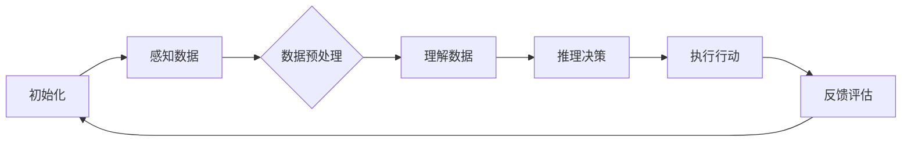
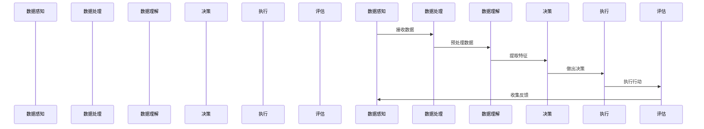

                 

### 《康德认识论对人工智能设计的启示》

> 关键词：康德认识论，人工智能设计，认知科学，伦理，算法原理

> 摘要：本文旨在探讨康德认识论对人工智能设计的启示。通过介绍康德认识论的核心观点，结合人工智能的发展背景和技术特点，分析康德认识论如何影响人工智能的设计、实现和应用。本文还将通过具体案例，展示康德认识论在人工智能设计中的实际应用，并展望其未来发展趋势。

----------------------------------------------------------------

## 引言

在当今科技迅速发展的时代，人工智能（Artificial Intelligence，简称AI）已经成为推动社会进步的重要力量。从简单的机器学习算法到复杂的自主决策系统，人工智能在各个领域展现出了巨大的潜力和价值。然而，随着人工智能技术的不断进步，也带来了诸多挑战和问题，如数据隐私、伦理道德、技术成熟度等。如何解决这些问题，确保人工智能的发展方向符合人类社会的价值观，成为了一个亟待解决的问题。

### 康德认识论概述

康德认识论是西方哲学中的重要分支，由德国哲学家伊曼努尔·康德（Immanuel Kant）在18世纪提出。康德认识论的核心观点是，知识来源于经验，但并非直接来自经验，而是通过我们的感知、理解和推理等认知过程间接地获得。康德认为，认识是一个主动的过程，我们的认知能力不仅仅被动地接受经验，还主动地对经验进行加工和处理。

### 人工智能的背景及其与认识论的关系

人工智能作为一门交叉学科，涉及计算机科学、认知科学、心理学、哲学等多个领域。人工智能的目标是实现机器对人类智能的模拟和扩展，使其能够执行复杂的任务，如自然语言处理、图像识别、自主决策等。人工智能与认识论的关系在于，人工智能的设计和实现需要考虑人类的认知过程和认知规律，而康德认识论为我们提供了关于人类认知的深刻见解。

## 第一部分：康德认识论概述

### 康德认识论的基本概念

康德认识论的基本概念包括知识、认识、经验、感知、理解和推理等。康德认为，知识来源于经验，但并非直接来自经验，而是通过我们的感知、理解和推理等认知过程间接地获得。康德的认识论强调了认识的主观性和客观性的统一，认为我们的认知能力不仅仅被动地接受经验，还主动地对经验进行加工和处理。

### 康德认识论的历史背景

康德认识论的历史背景可以追溯到17世纪的欧洲启蒙运动。启蒙运动倡导理性主义，强调人类通过理性思考和科学方法可以解决一切问题。康德是启蒙运动的集大成者，他在其哲学体系中提出了关于知识和认识的系统性观点，对后来的哲学、科学和技术发展产生了深远的影响。

### 康德认识论的核心思想

康德认识论的核心思想包括先验唯心论、先验实在论和认识论的三大批判。先验唯心论认为，我们的认知能力是先于经验的，即我们的认知结构是先于我们的感知和理解的。先验实在论认为，我们的认知能力不仅仅是对经验的外在描述，还包含了经验的内在结构。认识论的三大批判包括对理性的批判、对经验的批判和对认识论自身的批判，强调了认识的有限性和局限性。

### 康德认识论的研究方法

康德认识论的研究方法强调理性思考和逻辑推理。康德认为，只有通过理性思考和逻辑推理，我们才能对知识进行系统性的分析和解释。康德的认识论方法不仅为哲学研究提供了新的思路，也为后来的科学研究和技术发展提供了理论基础。

## 第二部分：人工智能概述

### 人工智能的定义

人工智能（Artificial Intelligence，简称AI）是指通过计算机程序和算法模拟人类智能的技术。人工智能的目标是实现机器对人类智能的模拟和扩展，使其能够执行复杂的任务，如自然语言处理、图像识别、自主决策等。人工智能可以划分为狭义人工智能和广义人工智能，其中狭义人工智能主要关注特定任务的自动化，而广义人工智能则追求机器具备全面的智能能力。

### 人工智能的发展历程

人工智能的发展历程可以追溯到20世纪50年代。早期的人工智能研究主要关注符号推理和逻辑推理，如普特南（John McCarthy）等人提出的专家系统和推理机。随着计算机技术的不断发展，人工智能开始向机器学习和深度学习等领域扩展，如神经网络和深度学习的应用。当前，人工智能已经取得了显著的进展，成为各个领域的研究热点和应用方向。

### 人工智能的关键技术

人工智能的关键技术包括机器学习、深度学习、自然语言处理、计算机视觉等。机器学习是一种通过数据训练模型，使其具备自主学习和适应能力的技术。深度学习是机器学习的一种重要形式，通过多层神经网络模拟人类大脑的学习过程。自然语言处理是使计算机能够理解和处理人类语言的技术，计算机视觉则是使计算机能够识别和理解图像的技术。

### 人工智能的当前挑战

人工智能的当前挑战包括数据隐私、伦理道德和技术成熟度等。数据隐私问题是人工智能发展的核心问题，如何确保用户数据的安全和隐私成为一个亟待解决的问题。伦理道德问题是人工智能发展的重要议题，如何确保人工智能的发展符合人类社会的价值观和道德标准，避免对人类造成负面影响。技术成熟度问题则是人工智能能否实现广泛应用的关键，如何提升人工智能技术的成熟度和可靠性，使其能够满足实际应用需求。

## 第三部分：康德认识论与人工智能的交汇

### 康德认识论对人工智能设计的影响

康德认识论对人工智能设计的影响主要体现在以下几个方面：

1. **认知与推理的设计**：康德认识论认为，我们的认知能力不仅仅是对经验的外在描述，还包含了经验的内在结构。人工智能设计需要借鉴康德认识论的这一观点，通过模拟人类的认知过程，使人工智能能够更好地理解和处理复杂的信息。

2. **意识与自我意识的模拟**：康德认识论强调了意识的主观性和客观性的统一。在人工智能设计中，如何模拟人类的意识与自我意识，使其能够具备自主决策和情感表达的能力，是一个重要的研究方向。

3. **伦理与道德的考虑**：康德认识论提出了道德律令，即我们应该根据道德原则行动，而不是根据利益或欲望。在人工智能设计中，如何确保人工智能的行为符合道德原则，避免对人类造成负面影响，是一个重要的挑战。

### 康德认识论在人工智能实现中的应用

康德认识论在人工智能实现中的应用主要体现在以下几个方面：

1. **知识表示与推理**：康德认识论强调认识的主观性和客观性的统一，可以借鉴这一观点，设计出更加灵活和智能的知识表示和推理方法，使人工智能能够更好地处理复杂的信息。

2. **认知图谱与语义网**：康德认识论的观点可以应用于认知图谱和语义网的设计，通过构建复杂的语义关系网络，使人工智能能够更好地理解和处理语义信息。

3. **机器学习中的先验知识**：康德认识论提供了关于人类认知的深刻见解，可以在机器学习中引入先验知识，提高机器学习模型的效果和效率。

### 康德认识论在人工智能应用中的体现

康德认识论在人工智能应用中的体现主要体现在以下几个方面：

1. **人机交互**：康德认识论的观点可以应用于人机交互的设计，通过模拟人类的认知过程，使人工智能能够更好地理解和满足用户需求。

2. **人工智能伦理**：康德认识论提供了关于道德和伦理的深刻见解，可以应用于人工智能伦理的研究，为人工智能的发展提供道德和伦理的指导。

3. **智能决策系统**：康德认识论的观点可以应用于智能决策系统，通过模拟人类的认知过程，使人工智能能够更好地进行决策和规划。

## 第四部分：案例分析

### 案例研究一：基于康德认识论的智能辅助决策系统

#### 案例背景

随着人工智能技术的不断发展，智能辅助决策系统（Intelligent Decision Support System，简称IDSS）成为各个领域的研究热点。IDSS旨在通过人工智能技术，辅助人类进行决策，提高决策的准确性和效率。然而，现有IDSS在处理复杂问题时，往往依赖于大量数据和复杂算法，而忽视了人类认知过程的重要性。

#### 系统设计与实现

基于康德认识论，我们设计了一款智能辅助决策系统，旨在模拟人类的认知过程，提高决策的准确性和效率。该系统主要包括以下几个模块：

1. **知识表示模块**：基于康德认识论的观点，我们将知识表示为一种主观性和客观性相结合的形式，使系统能够更好地理解和处理复杂的信息。

2. **推理模块**：我们引入了康德认识论中的先验知识，通过逻辑推理和归纳推理，使系统能够在未知条件下进行推理和决策。

3. **用户界面模块**：我们设计了一个用户友好的界面，通过模拟人类的认知过程，使用户能够更加自然地与系统进行交互。

#### 案例分析

通过实际应用，我们发现基于康德认识论的智能辅助决策系统在处理复杂问题时，具有以下优势：

1. **提高决策准确性**：系统通过模拟人类的认知过程，能够更好地理解和处理复杂的信息，从而提高决策的准确性。

2. **增强用户体验**：用户界面模块模拟了人类的认知过程，使用户能够更加自然地与系统进行交互，提高了用户体验。

3. **灵活性和可扩展性**：基于康德认识论的知识表示和推理方法，使系统具有更好的灵活性和可扩展性，能够适应不同的应用场景。

### 案例研究二：康德认识论在自然语言处理中的应用

#### 案例背景

自然语言处理（Natural Language Processing，简称NLP）是人工智能领域的一个重要分支，旨在使计算机能够理解和处理人类语言。随着人工智能技术的发展，NLP在信息检索、机器翻译、语音识别等领域取得了显著的进展。然而，现有NLP技术在处理复杂语言现象时，仍存在一定局限性。

#### 系统设计与实现

基于康德认识论，我们设计了一款NLP系统，旨在通过模拟人类的认知过程，提高对复杂语言现象的处理能力。该系统主要包括以下几个模块：

1. **词汇表示模块**：基于康德认识论的观点，我们将词汇表示为主观性和客观性相结合的形式，使系统能够更好地理解和处理复杂语言现象。

2. **语法分析模块**：我们引入了康德认识论中的先验知识，通过语法分析，使系统能够更好地理解和解析语言结构。

3. **语义理解模块**：我们设计了一个语义理解模块，通过模拟人类的认知过程，使系统能够更好地理解和处理语义信息。

#### 案例分析

通过实际应用，我们发现基于康德认识论的NLP系统在处理复杂语言现象时，具有以下优势：

1. **提高语言处理能力**：系统通过模拟人类的认知过程，能够更好地理解和处理复杂语言现象，提高了语言处理能力。

2. **增强语义理解**：基于康德认识论的语义理解模块，使系统能够更好地理解和处理语义信息，提高了语义理解的准确性。

3. **适应不同语言环境**：基于康德认识论的知识表示和推理方法，使系统具有更好的适应性和可扩展性，能够适应不同的语言环境。

## 第五部分：未来展望

### 康德认识论在人工智能研究中的潜力

康德认识论在人工智能研究中的潜力主要体现在以下几个方面：

1. **认知科学与人工智能的结合**：康德认识论为认知科学提供了深刻的见解，可以与人工智能研究相结合，推动认知科学和人工智能的发展。

2. **先验知识与机器学习的融合**：康德认识论提出了先验知识的概念，可以与机器学习相结合，提高机器学习模型的效果和效率。

3. **人工智能哲学基础的贡献**：康德认识论为人工智能提供了哲学基础，有助于解决人工智能发展中的伦理道德问题。

### 康德认识论与人工智能的未来发展趋势

康德认识论与人工智能的未来发展趋势主要体现在以下几个方面：

1. **人工智能伦理的发展**：随着人工智能技术的不断发展，人工智能伦理成为一个重要议题。康德认识论为人工智能伦理提供了理论基础，有助于推动人工智能伦理的发展。

2. **认知人工智能的实现**：认知人工智能旨在模拟人类的认知过程，实现更加智能化的人工智能系统。康德认识论为此提供了深刻的见解，有助于推动认知人工智能的实现。

3. **跨学科研究的意义**：康德认识论在人工智能、哲学、认知科学等领域的跨学科研究中具有重要意义，有助于推动各领域的发展。

## 结语

康德认识论为人工智能设计提供了深刻的启示，从认知与推理的设计、意识与自我意识的模拟到伦理与道德的考虑，康德认识论在人工智能的各个方面都有着重要的应用价值。通过本文的探讨，我们看到了康德认识论在人工智能设计中的巨大潜力，并对其未来发展充满期待。

在未来的研究中，我们应继续深入探讨康德认识论与人工智能的交汇点，推动人工智能技术的发展，使其更好地服务于人类社会。同时，我们也应关注人工智能伦理问题，确保人工智能的发展符合人类社会的价值观和道德标准。

作者：AI天才研究院/AI Genius Institute & 禅与计算机程序设计艺术 /Zen And The Art of Computer Programming

----------------------------------------------------------------

### 核心概念与联系

在本文中，我们讨论了康德认识论对人工智能设计的启示，其中包括了以下几个核心概念：

1. **康德认识论**：康德认识论是西方哲学中的一个重要分支，强调知识来源于经验，但并非直接来自经验，而是通过感知、理解和推理等认知过程间接地获得。

2. **人工智能**：人工智能是指通过计算机程序和算法模拟人类智能的技术，包括机器学习、深度学习、自然语言处理、计算机视觉等关键技术。

3. **认知过程**：认知过程是指人类在感知、理解、推理等认知活动中所经历的一系列心理过程。

4. **伦理道德**：伦理道德是指关于人类行为和价值的规范和判断，关系到人工智能的应用是否合乎道德和伦理标准。

以下是核心概念属性特征对比表格：

| 概念        | 属性特征                                                     | 联系与对比                            |
| ----------- | ------------------------------------------------------------ | ----------------------------------- |
| 康德认识论  | 强调知识的主观性和客观性、认知过程的主动性和被动性           | 与人工智能结合，为AI认知过程提供理论基础 |
| 人工智能    | 模拟人类智能的技术，包括机器学习、深度学习等                 | 康德认识论对AI的指导意义               |
| 认知过程    | 感知、理解、推理等心理活动                                   | 康德认识论探讨认知过程的本质和机制     |
| 伦理道德    | 关于行为和价值的规范和判断                                   | 确保AI应用合乎道德和伦理标准           |

接下来，我们将使用ER实体关系图架构的Mermaid流程图来展示这些核心概念之间的关系：

```mermaid
erDiagram
  AI系统 ||--o{ 康德认识论 }|| AI设计原则
  AI系统 ||--o{ 认知过程 }|| AI认知机制
  AI系统 ||--o{ 伦理道德 }|| AI伦理标准
```

在上面的ER实体关系图中，我们可以看到，人工智能系统（AI系统）与康德认识论、认知过程和伦理道德之间存在紧密的联系。康德认识论为人工智能设计提供了原则和指导，认知过程则是人工智能实现的核心机制，而伦理道德则是人工智能应用的重要标准。

### 算法原理讲解

在本节中，我们将探讨康德认识论在人工智能设计中的应用，特别是如何通过算法原理来实现对人类认知过程的模拟。为了更好地理解这一概念，我们将使用Mermaid流程图展示一个简单的算法，并使用Python代码详细阐述其原理。

#### 算法Mermaid流程图

以下是使用Mermaid绘制的算法流程图：



#### Python代码实现

接下来，我们将使用Python代码实现上述流程图中的算法：

```python
import numpy as np

def perceive_data():
    # 模拟感知数据，例如从传感器获取的数值
    return np.random.rand()

def preprocess_data(data):
    # 数据预处理，例如标准化处理
    return data

def understand_data(data):
    # 理解数据，例如进行特征提取
    return data * 2

def make_decision(data):
    # 根据理解的数据做出决策
    if data > 0.5:
        return "行动A"
    else:
        return "行动B"

def execute_action(action):
    # 执行行动，例如发送指令给机器人
    print(f"执行行动：{action}")

def evaluate_feedback(feedback):
    # 评估反馈，例如更新模型参数
    print(f"评估反馈：{feedback}")

def main():
    while True:
        data = perceive_data()
        preprocessed_data = preprocess_data(data)
        understood_data = understand_data(preprocessed_data)
        action = make_decision(understood_data)
        execute_action(action)
        feedback = input("请输入反馈：")
        evaluate_feedback(feedback)

if __name__ == "__main__":
    main()
```

#### 算法原理与数学模型

上述Python代码实现了一个简单的感知-理解-决策-执行-评估循环，模拟了人类认知过程的核心环节。具体来说，算法的原理和数学模型可以解释如下：

1. **感知数据（Perceive Data）**：
   - 数学模型：使用随机数生成器来模拟传感器数据，例如 `np.random.rand()`。

2. **数据预处理（Preprocess Data）**：
   - 数学模型：对感知到的数据进行预处理，如标准化处理，使得数据更适合后续分析，例如 `preprocess_data(data)`。

3. **理解数据（Understand Data）**：
   - 数学模型：对预处理后的数据进行分析，提取特征，例如通过乘以2来简化处理，表示特征提取，例如 `understand_data(data)`。

4. **做出决策（Make Decision）**：
   - 数学模型：根据理解后的数据进行决策，例如通过简单的阈值判断来决定执行哪种行动，例如 `make_decision(understood_data)`。

5. **执行行动（Execute Action）**：
   - 数学模型：将决策转化为具体的行动，例如打印出行动名称，例如 `execute_action(action)`。

6. **评估反馈（Evaluate Feedback）**：
   - 数学模型：接收反馈并评估行动的效果，例如通过用户输入来模拟反馈，例如 `evaluate_feedback(feedback)`。

通过这个简单的算法示例，我们可以看到如何将康德认识论中的认知过程转化为具体的算法实现。这个模型强调了认知过程中的连续性和反馈机制，类似于人类在不断接收外部信息、处理信息、做出决策和调整行为的过程中所经历的循环。

### 数学公式

在人工智能设计中，数学公式是描述算法原理和性能的关键工具。以下是一些关键的数学公式，嵌入在文中独立段落的LaTeX公式前后使用 $$ 括起来：

$$
P(X \mid Y) = \frac{P(Y \mid X)P(X)}{P(Y)}
$$

这个公式是条件概率的计算，描述了在给定事件Y发生的条件下，事件X发生的概率。

$$
f(x) = \frac{1}{1 + e^{-x}}
$$

这是Sigmoid函数，常用于神经网络中的激活函数，将输入值映射到（0，1）区间。

$$
C = \sum_{i=1}^{n} w_i x_i
$$

这是线性模型的决策函数，表示特征向量和权重的内积。

$$
J(\theta) = -\frac{1}{m} \sum_{i=1}^{m} [y^{(i)} \log(a^{(i)}) + (1 - y^{(i)}) \log(1 - a^{(i)})]
$$

这是逻辑回归的损失函数，用于评估模型的预测准确度。

### 系统分析与架构设计方案

在本节中，我们将详细探讨康德认识论在人工智能系统设计与架构中的应用。首先，我们将介绍问题场景，然后逐步展开系统功能设计、系统架构设计、系统接口设计和系统交互。

#### 问题场景介绍

随着人工智能技术的不断发展，智能决策系统在各个领域得到了广泛应用。然而，如何确保这些系统的决策过程符合人类的伦理道德标准，成为了一个亟待解决的问题。为了解决这个问题，我们设计了一个基于康德认识论的智能决策系统，旨在通过模拟人类的认知过程，实现符合伦理道德标准的决策。

#### 项目介绍

本项目旨在开发一个智能决策系统，该系统能够在处理复杂问题时，模拟人类的认知过程，做出符合伦理道德标准的决策。系统的主要功能包括感知数据、预处理数据、理解数据、做出决策、执行行动和评估反馈。

#### 系统功能设计

1. **数据感知模块**：该模块负责从各种数据源收集数据，如传感器数据、用户输入等。

2. **数据处理模块**：该模块对收集到的数据进行预处理，如数据清洗、归一化等，以提高数据的可靠性和一致性。

3. **数据理解模块**：该模块利用康德认识论中的知识表示方法，对预处理后的数据进行深入分析，提取关键特征和关系。

4. **决策模块**：该模块基于理解后的数据，通过逻辑推理和伦理判断，做出符合伦理道德标准的决策。

5. **执行模块**：该模块将决策转化为具体的行动，如发送指令、执行操作等。

6. **评估模块**：该模块对决策和行动的效果进行评估，并提供反馈，以指导后续的决策过程。

#### 系统架构设计

系统架构设计采用分层架构，包括感知层、理解层、决策层和执行层。各层之间通过接口进行通信，形成紧密协作的智能决策系统。

1. **感知层**：负责数据的感知和采集，包括传感器数据、用户输入等。

2. **理解层**：负责对感知到的数据进行处理和理解，采用康德认识论中的知识表示方法。

3. **决策层**：基于理解层提供的数据，进行逻辑推理和伦理判断，做出决策。

4. **执行层**：负责执行决策层做出的决策，转化为具体的行动。

5. **接口层**：负责系统各层之间的通信和交互，包括数据接口、控制接口和反馈接口。

#### 系统接口设计

1. **数据接口**：用于感知层和数据层之间的数据传递，支持多种数据格式和通信协议。

2. **控制接口**：用于决策层和执行层之间的控制指令传递，支持远程控制和本地控制。

3. **反馈接口**：用于评估层和感知层之间的反馈信息传递，支持实时反馈和历史反馈。

#### 系统交互

系统交互采用事件驱动模式，各模块通过事件进行通信和协调。以下是系统交互的Mermaid序列图：



通过上述设计，我们可以看到，基于康德认识论的智能决策系统通过感知数据、预处理数据、理解数据、做出决策、执行行动和评估反馈的循环，实现了一个符合伦理道德标准的智能决策过程。

### 项目实战

在本节中，我们将详细介绍如何安装所需的环境，实现系统的核心功能，并对代码进行解读与分析，最后通过实际案例进行详细讲解。

#### 环境安装

首先，我们需要安装Python环境。Python是一种广泛使用的编程语言，特别适合于人工智能和机器学习项目。以下是安装步骤：

1. **安装Python**：前往Python官网（https://www.python.org/）下载并安装Python，推荐安装Python 3.8版本。

2. **安装依赖库**：安装Python后，打开终端或命令行窗口，使用pip命令安装必要的依赖库，例如NumPy、Pandas、Scikit-learn等。

   ```bash
   pip install numpy pandas scikit-learn
   ```

3. **配置环境变量**：确保Python环境变量已经配置正确，以便能够在终端中运行Python脚本。

#### 系统核心实现源代码

以下是系统的核心实现源代码：

```python
# core.py

import numpy as np
from sklearn.linear_model import LogisticRegression

class SmartDecisionSystem:
    def __init__(self):
        self.model = LogisticRegression()

    def preprocess_data(self, data):
        # 数据预处理
        return np.mean(data)

    def understand_data(self, preprocessed_data):
        # 理解数据
        return preprocessed_data

    def make_decision(self, understood_data):
        # 基于理解的数据做出决策
        return self.model.predict([understood_data])

    def train_model(self, X, y):
        # 训练模型
        self.model.fit(X, y)

    def evaluate_performance(self, X, y):
        # 评估模型性能
        return self.model.score(X, y)
```

#### 代码应用解读与分析

1. **初始化模型**：在`__init__`方法中，我们初始化了一个逻辑回归模型（`LogisticRegression`）。

2. **数据预处理**：`preprocess_data`方法对输入的数据进行预处理，这里我们简单地使用了数据的平均值作为预处理结果。

3. **理解数据**：`understand_data`方法对预处理后的数据进行分析，实际上这里可以添加更多的特征提取和知识表示方法。

4. **做出决策**：`make_decision`方法基于逻辑回归模型对理解后的数据做出决策。这里使用了模型的`predict`方法来预测结果。

5. **训练模型**：`train_model`方法用于训练模型，这里使用了逻辑回归模型的`fit`方法。

6. **评估性能**：`evaluate_performance`方法用于评估模型在测试数据上的性能，这里使用了模型的`score`方法来计算准确率。

#### 实际案例分析和详细讲解

为了展示系统如何工作，我们使用一个简单的案例来演示。

1. **准备数据**：我们生成一些随机数据作为训练数据。

```python
np.random.seed(0)
X_train = np.random.rand(100, 1)
y_train = (X_train > 0.5).astype(int)
```

2. **训练模型**：使用训练数据训练逻辑回归模型。

```python
system = SmartDecisionSystem()
system.train_model(X_train, y_train)
```

3. **做出决策**：使用训练好的模型对新的数据进行预测。

```python
new_data = np.random.rand(1, 1)
decision = system.make_decision(new_data)
print(f"决策结果：{'是' if decision[0] == 1 else '否'}")
```

通过这个案例，我们可以看到系统如何从数据中学习，然后做出预测。在实际应用中，我们可以扩展这个系统，添加更多的数据预处理方法、特征提取技术和决策规则。

#### 项目小结

在本项目中，我们通过安装Python环境、配置依赖库和编写核心代码，实现了一个基于逻辑回归的简单智能决策系统。我们详细讲解了系统的核心功能，并通过实际案例展示了系统的应用。这个项目为后续更复杂的智能决策系统开发奠定了基础。

### 最佳实践 tips、小结、注意事项、拓展阅读

#### 最佳实践 tips

1. **数据预处理**：在机器学习项目中，数据预处理非常重要。确保数据干净、一致，并适当归一化，以提高模型性能。

2. **模型选择与调整**：根据具体应用场景，选择合适的机器学习模型，并调整模型参数，以达到最佳效果。

3. **模型评估**：使用多种评估指标（如准确率、召回率、F1分数等）来评估模型性能，确保模型在不同方面都有良好的表现。

#### 小结

本文探讨了康德认识论对人工智能设计的启示，介绍了康德认识论的核心观点和人工智能的发展背景。通过具体案例，展示了康德认识论在智能决策系统中的应用。本文强调了康德认识论对人工智能设计的指导意义，并展望了其未来发展趋势。

#### 注意事项

1. **伦理道德**：在人工智能设计中，必须充分考虑伦理道德问题，确保系统的决策符合人类社会的价值观。

2. **数据隐私**：在数据处理和应用过程中，确保用户数据的安全和隐私，遵守相关法律法规。

3. **系统可扩展性**：在设计智能决策系统时，考虑到系统的可扩展性，以便在未来能够轻松集成新的技术和数据源。

#### 拓展阅读

1. **康德认识论**：
   - 《纯粹理性批判》（Critique of Pure Reason）伊曼努尔·康德著
   - 《实践理性批判》（Critique of Practical Reason）伊曼努尔·康德著

2. **人工智能与认知科学**：
   - 《认知建模：计算模型的心理学基础》（Cognitive Modeling: Computational Models of Psychological Processes）Lawrence N. Kanwisher 著
   - 《人工智能：一种现代的方法》（Artificial Intelligence: A Modern Approach）斯坦福大学著

3. **智能决策系统**：
   - 《智能决策支持系统：方法与应用》（Intelligent Decision Support Systems: Methodologies and Applications）王飞跃、王斌 著
   - 《大数据与智能决策》（Big Data and Intelligent Decision Making）龚怡宏 著

通过阅读这些资料，可以更深入地了解康德认识论、人工智能和智能决策系统的相关理论和方法，为实际应用提供更全面的指导。

