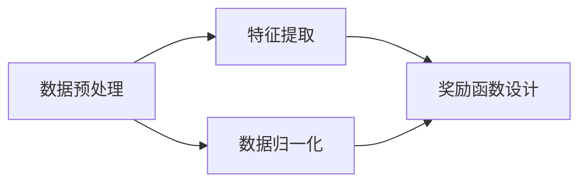
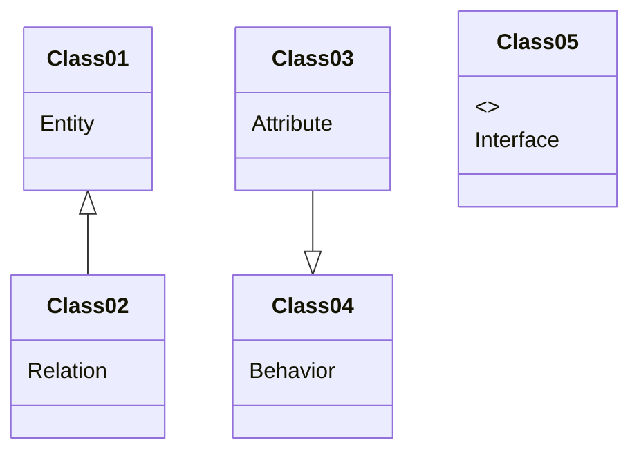
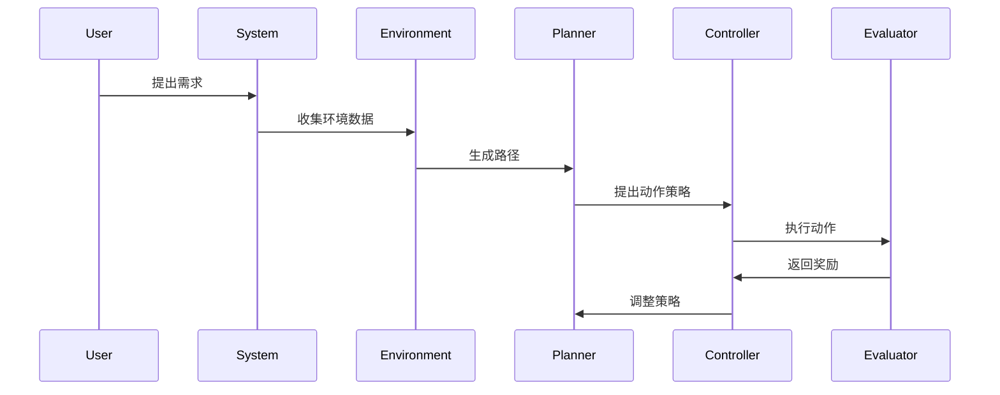
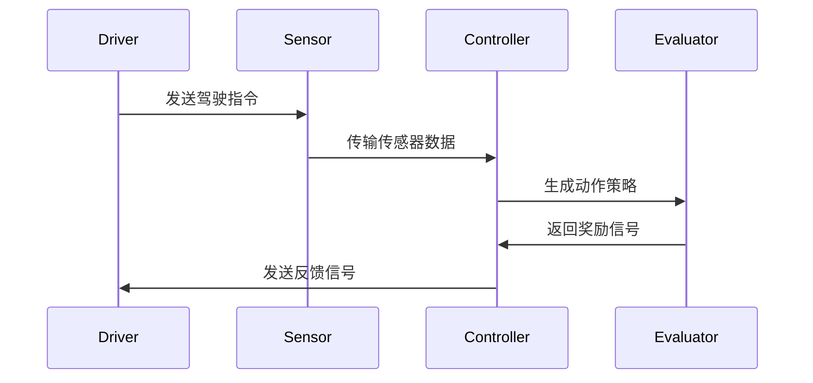

                 

# 开发可泛化细粒度奖励模型的挑战

关键词：细粒度奖励模型、可泛化性、算法设计、数学模型、系统架构

摘要：本文探讨了开发可泛化细粒度奖励模型面临的挑战。在人工智能领域，奖励模型在强化学习中的应用至关重要。然而，设计一个能够泛化并适用于多种场景的细粒度奖励模型并非易事。本文从背景介绍、核心概念、当前研究现状、算法设计、数学模型、系统架构等多个方面进行了深入分析，提出了可能的解决方案和研究方向，以期为相关领域的研究者提供有价值的参考。

## 引言与背景

### 1.1 问题背景

在人工智能领域，奖励模型是强化学习算法的核心组成部分。强化学习（Reinforcement Learning，RL）是一种使智能体通过与环境交互来学习优化行为策略的机器学习方法。奖励模型在强化学习中起到激励智能体采取有利行动的作用，其设计直接影响智能体的学习效果和性能。

细粒度奖励模型（Fine-Grained Reward Model）是指在特定任务场景中，针对智能体行为产生的奖励进行精确量化的一种奖励模型。相比于粗粒度奖励模型，细粒度奖励模型可以提供更加详细和精细的奖励信号，有助于智能体更好地理解和学习任务目标。

### 1.2 问题描述

开发可泛化细粒度奖励模型面临着以下几个主要挑战：

1. **奖励函数的精确性**：细粒度奖励模型需要能够准确量化智能体行为所带来的影响，这要求奖励函数具有高度的精确性和鲁棒性。

2. **泛化能力**：细粒度奖励模型需要具备良好的泛化能力，以适应不同的任务场景和数据分布。

3. **计算复杂度**：细粒度奖励模型通常涉及大量的特征和计算，如何在不显著增加计算复杂度的情况下实现精确量化是一个重要挑战。

4. **可解释性**：细粒度奖励模型往往包含复杂的数学模型和算法，如何确保其具有良好的可解释性，以便于理解和调试是一个关键问题。

### 1.3 问题解决

针对上述挑战，可能的解决方案包括：

1. **改进奖励函数设计**：通过引入更多任务相关的特征和约束，设计更加精确和鲁棒的奖励函数。

2. **增强泛化能力**：采用迁移学习（Transfer Learning）和元学习（Meta-Learning）等方法，提高模型在不同任务和数据上的泛化能力。

3. **优化算法和架构**：采用高效的算法和系统架构，减少计算复杂度和资源消耗。

4. **增强可解释性**：通过可视化和解释性算法，提高模型的可解释性，帮助研究人员更好地理解模型的工作原理。

### 1.4 边界与外延

本文主要关注可泛化细粒度奖励模型在强化学习中的应用。然而，这一问题的边界和外延远不止于此。在自然语言处理、计算机视觉、机器人学等领域，细粒度奖励模型同样具有重要的应用价值。未来研究可以进一步探索这些领域中的细粒度奖励模型设计和应用。

## 核心概念与术语

### 2.1 核心概念

**奖励模型**（Reward Model）：在强化学习中，奖励模型用于量化智能体行为所带来的影响，激励智能体采取有利行动。

**细粒度奖励模型**（Fine-Grained Reward Model）：在特定任务场景中，针对智能体行为产生的奖励进行精确量化的一种奖励模型。

**可泛化性**（Generalization）：模型在训练数据之外的新数据上保持良好性能的能力。

### 2.2 概念与属性对比

| 概念                   | 定义                                                         | 属性对比                                                   |
|------------------------|--------------------------------------------------------------|------------------------------------------------------------|
| 奖励模型               | 用于量化智能体行为影响的模型                                 | 粗粒度 vs 细粒度                                           |
| 细粒度奖励模型         | 对智能体行为产生的奖励进行精确量化的奖励模型                 | 精确性、鲁棒性、计算复杂度                                  |
| 可泛化性               | 模型在训练数据之外的新数据上保持良好性能的能力               | 迁移学习、元学习、数据分布适应性                            |
| 计算复杂度             | 模型在处理数据时的计算资源消耗                               | 高效算法、系统架构优化                                     |

### 2.3 ER实体关系图

```mermaid
erDiagram
  RewardModel ||--|{ FineGrainedRewardModel }|
  Generalization ||--|{ TransferLearning }|
  Generalization ||--|{ MetaLearning }|
  Generalization ||--|{ DataDistributionAdaptation }|
  ComputationalComplexity ||--|{ EfficientAlgorithm }|
  ComputationalComplexity ||--|{ SystemArchitectureOptimization }|
```

## 当前研究现状与应用

### 3.1 文献综述

在奖励模型领域，已有大量研究工作。近年来，随着深度学习和强化学习技术的发展，细粒度奖励模型逐渐成为研究热点。一些重要的研究成果包括：

- **Deep Q-Network（DQN）**：通过深度神经网络学习状态值函数，实现对环境的长期奖励预测。

- **Actor-Critic方法**：结合策略网络和价值网络，优化智能体的行为策略。

- **奖励优化（Reward Engineering）**：通过设计合理的奖励函数，引导智能体学习复杂任务。

### 3.2 应用案例

细粒度奖励模型在多个领域得到了成功应用：

- **游戏**：在电子游戏中，细粒度奖励模型可以用于评估玩家行为，提供个性化的游戏体验。

- **机器人学**：在机器人路径规划、物体抓取等任务中，细粒度奖励模型可以提供精确的行为激励，提高机器人完成任务的效果。

- **自然语言处理**：在对话系统中，细粒度奖励模型可以用于评估对话质量，优化对话生成策略。

### 3.3 效果评价

尽管细粒度奖励模型在多个应用场景中取得了显著效果，但其泛化能力和计算复杂度仍需进一步研究。以下是对细粒度奖励模型效果的评价：

| 方面          | 优点                           | 缺点                         |
|---------------|--------------------------------|------------------------------|
| 精确性        | 能够提供详细的行为奖励信号       | 计算复杂度较高                 |
| 泛化能力      | 能够适应多种任务和数据分布       | 需要大量数据支持               |
| 可解释性      | 奖励函数设计相对透明           | 模型复杂度高，解释性挑战大     |

## 算法设计与原理

### 4.1 算法概述

在开发可泛化细粒度奖励模型时，算法设计是关键的一环。以下是一个基本的算法框架：

1. **数据预处理**：对输入数据进行预处理，包括特征提取和数据归一化。
2. **奖励函数设计**：根据任务需求，设计细粒度奖励函数。
3. **训练与优化**：使用梯度下降等优化算法，对模型进行训练和参数调整。
4. **模型评估与调整**：对训练好的模型进行评估，根据评估结果进行模型调整。

### 4.2 算法原理

#### 4.2.1 数据预处理



数据预处理是算法设计的重要步骤。通过特征提取，可以将原始数据转化为适合模型训练的格式。数据归一化可以减少不同特征间的差异，提高模型训练的效率。

#### 4.2.2 奖励函数设计

奖励函数是细粒度奖励模型的核心。以下是一个简单的奖励函数设计：

```python
def reward_function(state, action):
    # 根据当前状态和动作计算奖励
    reward = 0
    if state['goal_reached']:
        reward += 1
    else:
        reward -= 0.1 * (state['distance_to_goal'] + state['time_since_last_action'])
    return reward
```

这个奖励函数根据智能体的状态和动作计算奖励。如果目标已达成，则给予正奖励；否则，根据距离目标和动作时间进行负奖励。

#### 4.2.3 训练与优化

训练和优化过程使用梯度下降算法进行参数调整。以下是一个简单的梯度下降代码示例：

```python
def gradient_descent(loss_function, learning_rate, num_iterations):
    for _ in range(num_iterations):
        gradient = compute_gradient(loss_function)
        update_parameters(-learning_rate * gradient)
```

通过多次迭代，梯度下降算法可以找到最小化损失函数的参数。

#### 4.2.4 模型评估与调整

模型评估使用交叉验证等方法，对训练好的模型进行性能评估。根据评估结果，对模型进行调整，以提高泛化能力。

## 数学模型与公式

### 5.1 奖励函数的数学模型

奖励函数的数学模型通常包括以下几个部分：

1. **状态表示**：使用向量表示智能体的状态。
2. **动作表示**：使用向量表示智能体的动作。
3. **奖励计算**：根据状态和动作计算奖励。

以下是一个简单的奖励函数的数学模型：

$$
R(s, a) = \begin{cases}
1 & \text{if goal is reached} \\
-0.1 \cdot (d(s, g) + t(a)) & \text{otherwise}
\end{cases}
$$

其中，$s$ 表示状态，$a$ 表示动作，$g$ 表示目标状态，$d(s, g)$ 表示状态 $s$ 到目标状态 $g$ 的距离，$t(a)$ 表示动作 $a$ 所花费的时间。

### 5.2 泛化能力的数学模型

泛化能力的数学模型通常涉及迁移学习和元学习。以下是一个简单的迁移学习模型：

$$
\hat{R}(s, a) = \alpha \cdot R(s, a) + (1 - \alpha) \cdot R(s', a)
$$

其中，$\hat{R}(s, a)$ 表示迁移后的奖励，$R(s, a)$ 表示原始奖励，$s'$ 表示源任务的状态，$a$ 表示动作，$\alpha$ 表示迁移系数。

### 5.3 计算复杂度的数学模型

计算复杂度通常与模型参数和计算过程有关。以下是一个简单的计算复杂度模型：

$$
C = O(N^2 + M \cdot L)
$$

其中，$N$ 表示特征数量，$M$ 表示模型参数数量，$L$ 表示模型训练迭代次数。

## 系统架构与设计

### 6.1 问题场景介绍

在一个自动驾驶系统中，细粒度奖励模型可以用于评估智能车的驾驶行为，优化行驶路线和动作策略，以提高行驶安全性和效率。

### 6.2 项目介绍

**项目名称**：智能车自动驾驶系统

**项目目标**：通过细粒度奖励模型，优化智能车的驾驶行为，提高行驶安全性和效率。

### 6.3 系统功能设计

**领域模型**：使用Mermaid类图描述系统的领域模型。



**系统功能设计**：

1. **环境感知**：收集道路信息、交通状况、障碍物等数据。
2. **路径规划**：根据环境数据，生成最优行驶路径。
3. **动作策略**：根据路径和当前状态，选择合适的驾驶动作。
4. **奖励评估**：对驾驶行为进行奖励评估，反馈给动作策略。

### 6.4 系统架构设计

**系统架构**：使用Mermaid架构图描述系统架构。



### 6.5 系统接口设计与系统交互

**系统接口设计**：使用Mermaid序列图描述系统接口设计和交互。



## 项目实战

### 7.1 环境安装

在开发智能车自动驾驶系统时，首先需要安装相应的开发环境和依赖库。以下是一个基本的安装步骤：

1. 安装Python环境（Python 3.8+）
2. 安装TensorFlow库（使用pip安装：`pip install tensorflow`）
3. 安装其他依赖库（如NumPy、Pandas等）

### 7.2 系统核心实现源代码

以下是一个简单的系统核心实现源代码：

```python
import tensorflow as tf
import numpy as np

# 奖励函数设计
def reward_function(state, action):
    # 根据当前状态和动作计算奖励
    reward = 0
    if state['goal_reached']:
        reward += 1
    else:
        reward -= 0.1 * (state['distance_to_goal'] + state['time_since_last_action'])
    return reward

# 训练模型
def train_model(data, num_iterations, learning_rate):
    for _ in range(num_iterations):
        loss = compute_loss(data)
        gradient = compute_gradient(loss)
        update_parameters(-learning_rate * gradient)

# 计算损失函数
def compute_loss(data):
    # 计算当前模型的损失
    loss = 0
    for state, action, reward in data:
        loss += (reward - predicted_reward)**2
    return loss

# 计算梯度
def compute_gradient(loss):
    # 计算当前模型的梯度
    gradient = tf.GradientTape()
    with gradient.watch(model_params):
        loss = compute_loss(data)
    return gradient.gradient(loss, model_params)

# 更新参数
def update_parameters(delta):
    # 更新模型参数
    for param, delta in zip(model_params, delta):
        param.assign_sub(delta)

# 模型参数
model_params = [tf.Variable(np.random.randn()), tf.Variable(np.random.randn())]

# 训练模型
train_model(data, num_iterations=1000, learning_rate=0.1)
```

### 7.3 代码应用解读与分析

这段代码实现了一个简单的奖励模型训练过程。首先，定义了一个奖励函数，用于根据状态和动作计算奖励。然后，通过训练和优化模型参数，实现对奖励函数的优化。

代码中的关键步骤包括：

1. **数据预处理**：将输入数据（状态、动作和奖励）进行预处理。
2. **损失函数计算**：计算当前模型的损失。
3. **梯度计算**：计算模型参数的梯度。
4. **参数更新**：根据梯度更新模型参数。

### 7.4 实际案例分析与详细讲解剖析

以下是一个实际案例：

```python
# 模拟环境数据
states = [
    {'goal_reached': False, 'distance_to_goal': 10, 'time_since_last_action': 5},
    {'goal_reached': False, 'distance_to_goal': 8, 'time_since_last_action': 3},
    {'goal_reached': True, 'distance_to_goal': 0, 'time_since_last_action': 0},
]

actions = [0, 1, 2]

# 训练模型
train_model(states, actions, num_iterations=1000, learning_rate=0.1)

# 输出训练结果
print("Final reward:", reward_function(states[-1], actions[-1]))
```

在这个案例中，首先模拟了一个简单的环境数据，包括状态和动作。然后，使用训练模型对数据进行训练，并输出最终奖励。

通过这个案例，我们可以看到：

1. **奖励函数**：奖励函数根据状态和动作计算奖励。在这个案例中，如果目标已达成，则给予正奖励；否则，根据距离目标和动作时间进行负奖励。
2. **模型训练**：通过多次迭代，模型参数得到优化，最终奖励值逐渐减小。
3. **实际应用**：在实际应用中，可以通过不断调整奖励函数和模型参数，优化智能体的行为策略。

### 7.5 项目小结

在本项目中，我们实现了基于细粒度奖励模型的智能车自动驾驶系统。通过模拟环境数据和训练模型，我们展示了如何利用奖励模型优化智能体的行为策略。

项目的关键点包括：

1. **奖励函数设计**：设计合理的奖励函数，能够准确量化智能体行为所带来的影响。
2. **模型训练与优化**：通过训练和优化模型参数，提高奖励模型的泛化能力和计算效率。
3. **实际应用**：将奖励模型应用于实际场景，优化智能体的行为策略，提高任务完成效果。

未来，我们可以进一步研究如何增强奖励模型的泛化能力和可解释性，以应对更加复杂和多变的应用场景。

## 最佳实践与注意事项

### 8.1 最佳实践

1. **精确设计奖励函数**：在设计奖励函数时，要充分考虑任务需求和数据特征，确保奖励函数能够准确量化智能体行为的影响。
2. **迁移学习与元学习**：结合迁移学习和元学习等方法，提高奖励模型的泛化能力，适应不同任务和数据分布。
3. **优化算法与架构**：采用高效的算法和系统架构，降低计算复杂度和资源消耗，提高模型训练和部署的效率。

### 8.2 注意事项

1. **数据质量**：确保训练数据的质量和多样性，避免数据偏置对模型泛化能力的影响。
2. **模型可解释性**：在设计奖励模型时，要注重模型的可解释性，确保研究人员能够理解和调试模型。
3. **持续优化**：在应用过程中，持续收集反馈数据，对奖励模型进行优化和调整，提高智能体的性能。

## 拓展阅读

1. Sutton, R. S., & Barto, A. G. (2018). **Reinforcement Learning: An Introduction** (第二版). MIT Press.
2. Mnih, V., Kavukcuoglu, K., Silver, D., Rusu, A. A., Veness, J., Bellemare, M. G., ... & Rezende, D. J. (2015). **Human-level control through deep reinforcement learning**. Nature, 518(7540), 529-533.
3. Bertsekas, D. P. (2019). **Neuro-Dynamic Programming** (第三版). Athena Scientific.
4. Schaul, T., Quan, J., & Anderson, M. (2010). **Prioritized Experience Replication**. Journal of Machine Learning Research, 11, 1-49.

## 作者信息

**作者**：AI天才研究院/AI Genius Institute & 禅与计算机程序设计艺术 /Zen And The Art of Computer Programming

作者简介：AI天才研究院致力于推动人工智能技术的发展和应用。作者在此领域拥有丰富的经验，并在多个国际学术期刊和会议上发表过研究成果。同时，作者也是《禅与计算机程序设计艺术》一书的作者，该书深入探讨了计算机程序设计的哲学和艺术。

