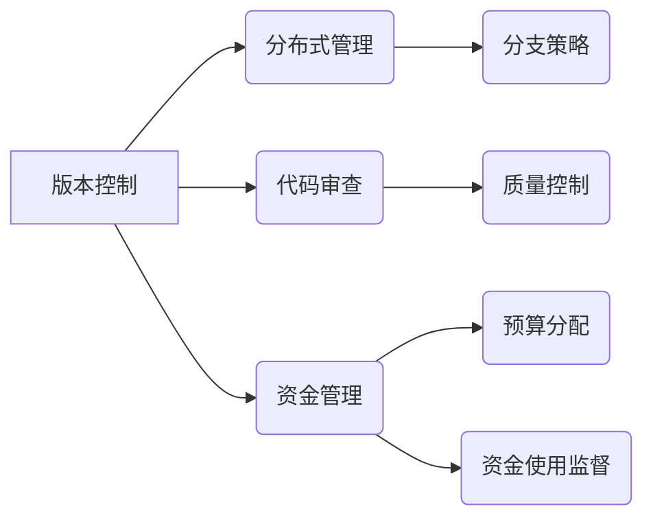
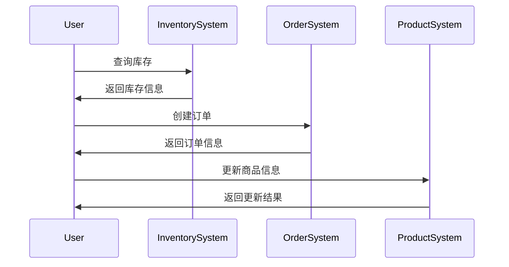
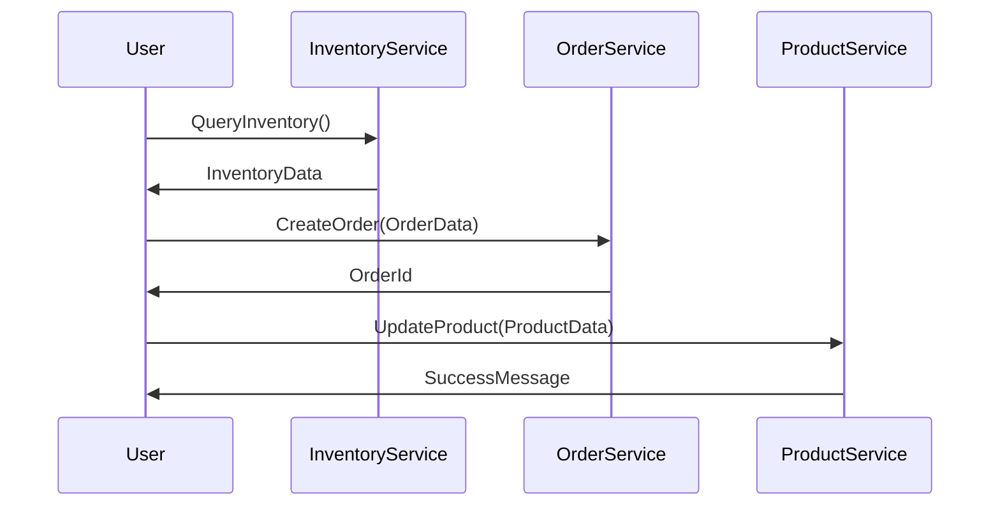

                 


# 《开源项目管理：利用社区力量加速发展》

> 关键词：开源项目管理，社区力量，项目协作，代码审查，版本控制，资金管理

> 摘要：本文旨在探讨开源项目管理的重要性，以及如何利用社区力量来加速开源项目的发展。文章首先介绍了开源运动的背景和意义，然后详细阐述了开源项目的核心流程，包括项目初始化、代码管理、社区协作和资金管理等内容。最后，通过案例分析，分享了成功开源项目的经验与启示。希望通过本文的阐述，能够为开源项目的管理者提供一些实用的指导和建议。

----------------------------------------------------------------

## 第一部分：开源项目管理概述

### 第1章：开源项目管理的背景与意义

## 1.1 开源运动的起源与发展

### 1.1.1 开源运动的起源

开源运动起源于20世纪80年代的计算机软件领域，其核心思想是软件的源代码应该公开，任何人都可以自由地使用、修改和分发。这一理念的提出，源自自由软件基金会（Free Software Foundation, FSF）和开放源代码倡议（Open Source Initiative, OSI）的倡导。

### 1.1.2 开源运动的演变过程

随着时间的推移，开源运动经历了从自由软件到开源软件的演变。自由软件强调的是用户自由，而开源软件则更注重商业价值的实现。在这个演变过程中，许多成功的开源项目脱颖而出，如Linux内核、Apache服务器等。

### 1.1.3 开源运动的主要特点

开源运动具有以下几个主要特点：

1. **开放性**：源代码公开，任何人都可以访问和查看。
2. **社区性**：开源项目的发展依赖于一个庞大的社区，社区成员共同参与项目的开发和维护。
3. **共享性**：开源项目鼓励知识的共享和传播，提高整个行业的创新速度。
4. **灵活性**：开源项目通常具有更高的灵活性，可以根据用户需求进行定制和改进。

## 1.2 开源项目管理的重要性

### 1.2.1 开源项目管理的定义

开源项目管理是指对开源项目进行规划、组织、协调和控制的过程。它旨在确保项目的成功，提高项目的开发效率和质量。

### 1.2.2 开源项目管理的优势

开源项目管理具有以下几个优势：

1. **协作性**：开源项目鼓励社区成员的协作，提高项目的开发速度和创新能力。
2. **灵活性**：开源项目可以根据用户需求进行灵活调整，适应快速变化的市场环境。
3. **透明性**：开源项目的源代码和文档都是公开的，用户可以清楚地了解项目的进展和成果。
4. **可持续性**：开源项目通常具有更长的生命周期，因为社区成员会持续参与项目的开发和维护。

### 1.2.3 开源项目管理面临的挑战

开源项目管理也面临着一些挑战：

1. **质量保证**：开源项目通常由众多贡献者共同维护，如何确保代码质量成为一个问题。
2. **知识产权**：开源项目的知识产权保护问题需要妥善处理，避免侵权行为的发生。
3. **项目管理**：开源项目通常没有一个统一的管理机构，如何协调和管理社区成员成为挑战。

## 1.3 开源社区的作用与参与方式

### 1.3.1 开源社区的基本结构

开源社区通常由以下几部分组成：

1. **项目领导者**：负责项目的整体规划和管理。
2. **开发人员**：负责项目的开发和实现。
3. **测试人员**：负责项目的测试和反馈。
4. **文档编写者**：负责项目的文档编写和维护。
5. **用户和支持者**：为项目提供反馈和支持，推动项目的发展。

### 1.3.2 参与开源社区的方式

参与开源社区的方式有以下几种：

1. **提交代码**：为项目贡献代码，修复bug或添加新功能。
2. **编写文档**：为项目编写或优化文档，提高项目的可读性和可维护性。
3. **参与讨论**：在社区的讨论区或邮件列表中参与讨论，为项目提供意见和建议。
4. **组织活动**：组织或参与开源项目的线下或线上活动，促进社区成员之间的交流和合作。

### 1.3.3 开源社区的价值贡献

开源社区的价值贡献主要体现在以下几个方面：

1. **知识共享**：开源社区鼓励知识的共享和传播，提高整个行业的创新速度。
2. **项目孵化**：开源社区为创新项目提供了孵化的平台，许多成功的开源项目都源自社区。
3. **人才培养**：开源社区为开发者提供了实践和学习的平台，培养了大量优秀的技术人才。
4. **技术沉淀**：开源社区积累了大量优秀的技术和实践经验，为后续项目提供了宝贵的参考。

## 1.4 本书内容安排与阅读建议

### 1.4.1 各章节内容概览

本书共分为六个部分，分别介绍了开源项目管理的概述、核心流程、社区协作、资金管理、案例分析等内容。

### 1.4.2 阅读本书的目标读者

本书的目标读者包括开源项目的管理者、开发人员、测试人员、文档编写者等，以及对开源项目管理有兴趣的技术人员。

### 1.4.3 阅读本书的顺序建议

建议按照以下顺序阅读本书：

1. 第一部分：开源项目管理概述
2. 第二部分：开源项目的核心流程
3. 第三部分：开源项目的开发与迭代
4. 第四部分：开源项目的社区协作
5. 第五部分：开源项目的持续发展
6. 第六部分：成功开源项目的案例分析

## 1.5 本章小结

本章介绍了开源项目管理的背景和意义，以及开源社区的作用与参与方式。通过本章的学习，读者可以了解开源项目管理的基本概念和重要性，为后续章节的学习打下基础。

----------------------------------------------------------------

## 第二部分：开源项目的核心流程

### 第2章：开源项目的初始化与管理

## 2.1 开源项目的启动过程

### 2.1.1 初始概念的提出

开源项目的启动通常始于一个创意或想法。这个创意或想法可以是解决某个特定问题的方案，也可以是某个领域的创新性应用。初始概念的提出是开源项目启动的关键一步，它为项目的后续发展奠定了基础。

### 2.1.2 项目的可行性研究

在初始概念提出后，需要对项目进行可行性研究。可行性研究包括技术可行性、市场可行性、经济可行性和法律可行性等方面。通过可行性研究，可以评估项目是否具有实现的可行性，以及是否值得投入资源和时间进行开发。

### 2.1.3 项目章程的编写

项目章程是项目启动的重要文档，它明确了项目的目标、范围、关键里程碑和预期成果。项目章程通常由项目领导者编写，并经过项目团队和相关利益相关者的批准。项目章程为项目的后续发展提供了指导和依据。

## 2.2 开源项目的组织与管理

### 2.2.1 项目团队的组织结构

开源项目的团队组织结构通常比较灵活，可以根据项目的需求和特点进行调整。常见的组织结构有矩阵式、职能式和项目式等。矩阵式组织结构结合了职能式和项目式的优点，可以更好地协调项目团队和职能部门之间的关系。

### 2.2.2 责任分配矩阵

责任分配矩阵是项目管理中常用的一种工具，用于明确项目团队成员的职责和角色。通过责任分配矩阵，可以清晰地了解每个团队成员在项目中的具体职责，以及各自负责的工作内容。

### 2.2.3 项目治理机制

项目治理机制是确保项目成功的关键因素之一。开源项目的治理机制通常包括项目管理委员会、代码审查委员会、贡献者奖励委员会等。这些委员会负责项目的决策、监督和评估，确保项目的健康和可持续发展。

## 2.3 开源项目的文档管理

### 2.3.1 项目文档的分类

项目文档是开源项目的重要组成部分，可以分为以下几类：

1. **项目规划文档**：包括项目章程、项目计划、风险管理计划等。
2. **开发文档**：包括代码库、代码注释、设计文档等。
3. **测试文档**：包括测试计划、测试用例、测试报告等。
4. **用户文档**：包括用户手册、安装指南、常见问题解答等。

### 2.3.2 文档编制的标准与规范

文档编制需要遵循一定的标准和规范，以确保文档的质量和一致性。常见的标准和规范包括《IEEE Std 830-1998 项目文档指南》、《GB/T 16680-1996 软件文档规范》等。

### 2.3.3 文档的版本控制

文档的版本控制是确保文档一致性和可追溯性的重要手段。开源项目通常使用版本控制系统（如Git）来管理文档的版本。通过版本控制，可以方便地查看文档的历史版本，以及追踪文档的修改记录。

## 2.4 开源项目的法律与合规性

### 2.4.1 开源许可证的选择

开源许可证是开源项目必须遵守的法律框架，它规定了项目的使用、修改和分发权限。常见的开源许可证包括GNU GPL、Apache License、MIT License等。选择合适的开源许可证，对于项目的合法性和可持续发展至关重要。

### 2.4.2 法律风险与合规性检查

开源项目在开发和使用过程中，可能会面临法律风险和合规性问题。例如，侵权行为、版权问题、隐私保护等。为了降低法律风险，开源项目需要定期进行合规性检查，确保项目的合法性。

### 2.4.3 开源项目知识产权保护

开源项目知识产权保护是确保项目创新性和可持续性的关键。开源项目需要建立完善的知识产权保护机制，包括专利申请、商标注册、著作权登记等。通过知识产权保护，可以促进项目的创新和发展。

## 2.5 本章小结

本章介绍了开源项目的启动过程、组织与管理、文档管理、法律与合规性等内容。通过本章的学习，读者可以了解开源项目初始化和管理的基本流程，为后续项目的开展打下基础。

----------------------------------------------------------------

## 第三部分：开源项目的开发与迭代

### 第3章：开源项目的代码管理

## 3.1 版本控制系统

### 3.1.1 Git的基本概念与操作

Git是一种分布式版本控制系统，它允许用户对项目进行版本控制和协同工作。Git的基本概念包括：

1. **仓库（Repository）**：存储项目文件和版本的历史记录的地方。
2. **分支（Branch）**：项目的不同开发路径，每个分支都可以独立开发，而不会影响主分支。
3. **提交（Commit）**：对项目文件的修改记录，每个提交都包含一个提交信息和修改内容。
4. **标签（Tag）**：对特定提交的标记，用于标记重要版本或里程碑。

Git的基本操作包括：

1. **克隆（Clone）**：将远程仓库克隆到本地，创建一个本地仓库。
2. **创建分支（Branch）**：从当前分支创建一个新的分支。
3. **切换分支（Checkout）**：切换到指定分支。
4. **合并（Merge）**：将两个或多个分支合并到一起。
5. **提交（Commit）**：将修改提交到仓库。

### 3.1.2 Git与其他版本控制系统的比较

与其他版本控制系统（如Subversion、Mercurial等）相比，Git具有以下优势：

1. **分布式**：Git是分布式版本控制系统，每个开发者都有自己的仓库，可以离线工作。
2. **分支策略**：Git支持灵活的分支策略，如Git Flow、GitHub Flow等，可以更好地管理开发流程。
3. **性能**：Git的性能较好，特别是在处理大量文件和复杂分支时。
4. **社区支持**：Git拥有庞大的开发者社区，提供了丰富的工具和插件。

### 3.1.3 Git在开源项目中的应用

Git在开源项目中的应用非常广泛，许多知名的开源项目（如Linux内核、GitHub等）都采用了Git作为版本控制系统。Git在开源项目中的应用主要包括：

1. **代码管理**：Git用于管理项目的源代码，确保代码的版本控制和一致性。
2. **协作开发**：Git支持多人的协作开发，可以方便地合并分支和提交修改。
3. **代码审查**：Git的分支和合并机制可以方便地进行代码审查，确保代码质量。
4. **持续集成**：Git可以与持续集成工具（如Jenkins、Travis CI等）集成，实现自动构建和测试。

## 3.2 代码审查与质量控制

### 3.2.1 代码审查的过程与原则

代码审查是确保代码质量和安全性的重要手段。代码审查的过程通常包括以下步骤：

1. **代码提交**：开发者将代码提交到代码仓库。
2. **审查请求**：代码仓库管理员或审查者收到审查请求。
3. **审查**：审查者对代码进行审查，检查代码的语法、逻辑、安全性和可维护性。
4. **反馈**：审查者将反馈意见提交给开发者。
5. **修改**：开发者根据审查意见进行修改。

代码审查的原则包括：

1. **完整性**：确保代码符合项目的需求和规范。
2. **安全性**：确保代码不存在安全漏洞。
3. **可读性**：确保代码易于理解和维护。
4. **效率**：确保代码的运行效率和性能。

### 3.2.2 代码质量控制的方法与工具

代码质量控制的方法包括：

1. **编码规范**：制定统一的编码规范，确保代码的一致性和可读性。
2. **静态代码分析**：使用静态代码分析工具（如SonarQube、Checkstyle等）检查代码的质量和安全性。
3. **单元测试**：编写单元测试，确保代码的功能和性能。
4. **自动化测试**：使用自动化测试工具（如Selenium、JUnit等）执行测试用例。

### 3.2.3 代码审查的最佳实践

代码审查的最佳实践包括：

1. **及时反馈**：及时对代码提交进行审查和反馈，避免问题积累。
2. **团队协作**：鼓励团队成员参与代码审查，提高代码质量。
3. **持续改进**：根据审查结果，不断改进编码规范和代码质量。
4. **文档记录**：记录审查过程中的问题和解决方案，便于后续参考。

## 3.3 代码分支策略

### 3.3.1 分支模型的选择

代码分支策略是管理项目代码变更的重要手段。常见的分支模型包括：

1. **Git Flow**：包括主分支（Master）、开发分支（Develop）和特性分支（Feature）。适用于项目开发周期较长的情况。
2. **GitHub Flow**：包括主分支（Master）、特性分支（Feature）和发布分支（Release）。适用于项目开发周期较短的情况。
3. **Trunk-Based Development**：直接在主分支上进行开发，避免分支的长时间存在。适用于敏捷开发模式。

### 3.3.2 分支策略的实施

分支策略的实施包括以下步骤：

1. **创建分支**：根据分支模型，创建相应的分支。
2. **开发**：在分支上进行开发，编写和测试代码。
3. **合并**：将分支合并到主分支，确保代码的一致性和完整性。
4. **发布**：将主分支上的代码发布到生产环境。

### 3.3.3 分支管理的挑战与解决方案

分支管理面临的挑战包括：

1. **分支同步**：确保分支之间的代码一致性。
2. **分支合并**：避免合并冲突和代码重复。
3. **分支维护**：确保分支的长期有效性和可维护性。

解决方案包括：

1. **自动化合并**：使用自动化工具（如Git Hooks）自动合并分支。
2. **分支合并策略**：制定明确的分支合并策略，确保分支的合并过程。
3. **分支维护计划**：定期清理和更新分支，确保分支的长期有效性和可维护性。

## 3.4 开源项目的测试与调试

### 3.4.1 单元测试与集成测试

测试是确保代码质量和功能完整性的重要环节。单元测试和集成测试是测试的两种主要方式：

1. **单元测试**：对代码的各个模块或函数进行测试，确保它们按预期工作。
2. **集成测试**：对整个系统或多个模块进行测试，确保它们之间的交互和集成符合预期。

### 3.4.2 自动化测试工具的应用

自动化测试工具可以提高测试的效率和质量。常见的自动化测试工具有：

1. **Selenium**：用于Web应用的自动化测试。
2. **JUnit**：用于Java应用的单元测试。
3. **Puppeteer**：用于自动化Web应用测试。

### 3.4.3 调试技巧与工具使用

调试是解决代码问题和性能瓶颈的重要手段。常见的调试技巧和工具有：

1. **断点调试**：在代码中设置断点，逐行执行代码，查看变量和函数的值。
2. **日志分析**：使用日志工具（如Log4j、Logback等）记录程序的运行日志，帮助定位问题和性能瓶颈。
3. **性能分析**：使用性能分析工具（如JProfiler、MAT等）分析程序的运行性能。

## 3.5 本章小结

本章介绍了开源项目的代码管理，包括版本控制系统、代码审查与质量控制、代码分支策略、测试与调试等内容。通过本章的学习，读者可以了解如何利用Git等工具进行代码管理，提高代码质量和开发效率。

----------------------------------------------------------------

## 第四部分：开源项目的社区协作

### 第4章：开源社区的沟通与协作

## 4.1 社区沟通渠道

开源社区的沟通与协作至关重要，有效的沟通渠道能够促进社区成员之间的合作与交流。以下是几种常见的社区沟通渠道：

### 4.1.1 电子邮件列表

电子邮件列表是一种传统的沟通方式，适用于大规模的社区沟通。它允许社区成员订阅邮件列表，接收有关项目进展、讨论和建议的邮件。邮件列表的优势在于其异步性和普及性，适用于不同时区的社区成员。

### 4.1.2 论坛与社交媒体

论坛和社交媒体是社区沟通的现代化工具，如GitHub、Reddit、Twitter、Facebook等。这些平台提供了实时的互动和交流环境，社区成员可以方便地提问、讨论和分享信息。论坛和社交媒体的优势在于其互动性和即时性。

### 4.1.3 实时沟通工具

实时沟通工具如Slack、Telegram、Discord等，为社区成员提供了即时的消息传递和协作环境。这些工具支持文本、语音和视频通信，有助于快速解决问题和协作开发。实时沟通工具的优势在于其即时性和协作性。

## 4.2 社区贡献者激励机制

激励社区贡献者是开源项目成功的关键因素之一。以下是一些常见的社区贡献者激励机制：

### 4.2.1 贡献者角色的定义

为了有效地激励社区贡献者，首先需要明确他们的角色和贡献类型。常见的贡献者角色包括：

1. **核心开发者**：负责项目的核心开发和维护。
2. **代码贡献者**：为项目提交代码、修复bug或添加新功能。
3. **测试者**：负责测试项目代码，确保其质量。
4. **文档编写者**：编写和优化项目文档，提高项目的可读性和易用性。
5. **用户和支持者**：为项目提供反馈和支持，推动项目的发展。

### 4.2.2 贡献者激励措施

为了激励社区贡献者，可以采取以下措施：

1. **荣誉系统**：为贡献者颁发荣誉称号，如“贡献者之星”、“最佳代码贡献者”等。
2. **奖励机制**：提供实物或虚拟奖励，如T恤、周边产品、积分等。
3. **财务资助**：为贡献者提供财务资助，支持他们的工作。
4. **技术支持**：为贡献者提供技术支持和培训，帮助他们更好地参与项目。
5. **职业发展**：为贡献者提供职业发展的机会，如面试机会、培训课程等。

### 4.2.3 社区认可的奖励体系

社区认可的奖励体系是激励社区贡献者的有效手段。以下是一些社区认可的奖励体系：

1. **社区投票**：社区成员可以对贡献者进行投票，选出他们心目中的最佳贡献者。
2. **贡献排名**：根据贡献者的贡献量，对社区成员进行排名，并给予相应的奖励。
3. **奖项颁发**：在年度大会或社区聚会中，颁发奖项以表彰贡献者。

## 4.3 开源项目的协作开发流程

协作开发流程是确保项目高效、有序进行的重要环节。以下是一个典型的开源项目协作开发流程：

### 4.3.1 提交请求与合并流程

1. **发起提交请求**：贡献者将代码提交到项目仓库，并创建一个Pull Request（PR）。
2. **代码审查**：项目维护者或审查者对PR进行审查，检查代码的质量和规范性。
3. **反馈与修改**：审查者将反馈意见提交给贡献者，贡献者根据意见进行修改。
4. **合并**：审查者确认代码符合要求后，将PR合并到主分支。

### 4.3.2 开源项目的发布流程

1. **版本规划**：确定项目的版本号和发布计划。
2. **代码冻结**：在发布前，暂停新的代码提交和修改。
3. **测试与验证**：对发布版本进行全面的测试和验证，确保其质量。
4. **发布**：将发布版本部署到生产环境，并通知社区成员。
5. **发布后维护**：及时修复发布过程中出现的问题，更新文档和用户手册。

### 4.3.3 协作开发的最佳实践

为了提高协作开发的效率和质量，可以遵循以下最佳实践：

1. **文档化**：编写详细的文档，包括开发指南、代码规范、测试计划等。
2. **代码审查**：建立严格的代码审查流程，确保代码的质量和规范性。
3. **自动化测试**：编写自动化测试用例，确保代码的功能和性能。
4. **版本控制**：使用版本控制系统，确保代码的版本管理和一致性。
5. **持续集成**：实现持续集成，自动化构建和测试代码。

## 4.4 社区治理机制

社区治理机制是确保开源社区健康和可持续发展的重要保障。以下是一些社区治理机制：

### 4.4.1 社区规则的制定

1. **行为准则**：制定社区成员的行为准则，确保社区的和谐与尊重。
2. **争议解决**：建立争议解决机制，处理社区内部的矛盾和冲突。
3. **决策流程**：明确社区的决策流程，确保决策的透明和公正。

### 4.4.2 社区冲突的解决

1. **调解机制**：设立调解委员会，处理社区内部的矛盾和冲突。
2. **公开透明**：在社区内部公开争议和解决过程，增加信任和透明度。
3. **处罚措施**：对违反社区规则的行为进行处罚，维护社区的秩序。

### 4.4.3 社区健康与可持续发展

1. **社区氛围**：营造积极的社区氛围，鼓励合作与互助。
2. **资源投入**：为社区提供必要的资源和支持，促进社区的发展。
3. **持续改进**：定期评估和改进社区治理机制，提高社区的健康和可持续发展能力。

## 4.5 本章小结

本章介绍了开源项目的社区协作，包括沟通与协作渠道、贡献者激励机制、协作开发流程和社区治理机制等内容。通过本章的学习，读者可以了解如何利用社区力量提高开源项目的开发效率和质量，促进社区的可持续发展。

----------------------------------------------------------------

## 第五部分：开源项目的持续发展

### 第5章：开源项目的资金与资源管理

## 5.1 资金来源与财务管理

开源项目的资金来源通常包括以下几个方面：

1. **捐赠**：社区成员和用户通过捐赠的方式支持项目的发展。
2. **赞助**：企业和组织通过赞助的方式支持项目，以获取项目的技术支持或优先权。
3. **服务收入**：项目团队通过提供技术服务（如培训、咨询等）获得收入。
4. **版权授权**：项目团队通过版权授权的方式获得收入。

开源项目的财务管理需要遵循以下原则：

1. **透明性**：财务状况应该对社区成员公开，增加信任和透明度。
2. **预算编制**：根据项目的需求，制定详细的预算计划，确保资金的合理分配。
3. **资金监管**：建立资金监管机制，确保资金的使用符合项目目标和规范。
4. **资金回收**：及时回收资金，确保项目的可持续发展。

## 5.2 资源管理策略

开源项目的资源管理策略包括以下几个方面：

1. **人力资源配置**：根据项目需求和团队特点，合理配置人力资源，确保项目团队的效率。
2. **物理资源与设备管理**：为项目团队提供必要的物理资源，如服务器、网络设备等，确保项目的顺利开展。
3. **时间管理**：合理安排项目进度和时间，确保项目的按时完成。
4. **知识管理**：积累和共享项目经验，提高团队的知识水平。

## 5.3 项目评估与反馈机制

项目评估与反馈机制是确保项目持续改进和发展的关键。以下是一些评估与反馈机制：

1. **项目进展评估**：定期对项目进展进行评估，检查项目是否符合预期目标和时间表。
2. **用户体验反馈**：收集用户对项目的反馈，了解项目的实际使用情况和用户需求。
3. **社区反馈**：听取社区成员的建议和意见，改进项目的设计和功能。
4. **改进策略**：根据评估和反馈结果，制定改进策略，提高项目的质量和用户满意度。

## 5.4 维护与更新策略

开源项目的维护与更新策略包括以下几个方面：

1. **版本更新与迭代**：定期发布新版本，修复bug，添加新功能。
2. **安全漏洞修复**：及时发现和修复安全漏洞，确保项目的安全性。
3. **长期维护策略**：建立长期维护计划，确保项目的持续发展和更新。

## 5.5 本章小结

本章介绍了开源项目的资金与资源管理，包括资金来源、财务管理、资源管理策略、项目评估与反馈机制和维护与更新策略等内容。通过本章的学习，读者可以了解如何有效地管理和利用资源，确保开源项目的持续发展和成功。

----------------------------------------------------------------

## 第六部分：成功开源项目的案例分析

### 第6章：开源项目成功案例分享

## 6.1 案例一：Linux内核项目

### 6.1.1 项目概述

Linux内核是一个免费的开源操作系统内核，它广泛应用于服务器、嵌入式设备和桌面计算机等领域。Linux内核项目由Linus Torvalds于1991年发起，经过数十年的发展，已成为全球最大的开源项目之一。

### 6.1.2 项目特点与成功因素

Linux内核项目的成功具有以下特点：

1. **开放性**：Linux内核项目的源代码完全公开，任何人都可以自由访问和修改。
2. **社区参与**：Linux内核项目拥有庞大的社区，来自全球的开发者和贡献者积极参与项目的开发和维护。
3. **多样性**：Linux内核项目支持多种硬件平台和操作系统，具有广泛的适用性。
4. **可定制性**：Linux内核项目可以根据用户需求进行定制和优化，满足不同场景的需求。

Linux内核项目的成功因素包括：

1. **优秀的项目管理**：Linux内核项目采用Git作为版本控制系统，实现了高效的代码管理和协作开发。
2. **代码审查机制**：Linux内核项目建立了严格的代码审查机制，确保代码的质量和安全性。
3. **社区协作**：Linux内核项目鼓励社区成员的参与和贡献，形成了良好的社区氛围。
4. **持续改进**：Linux内核项目定期发布新版本，不断改进和优化代码。

### 6.1.3 项目经验与启示

从Linux内核项目的成功中，我们可以得到以下启示：

1. **开放性**：开源项目的开放性是其成功的关键，它鼓励知识的共享和传播，提高了项目的创新速度。
2. **社区参与**：开源项目需要建立良好的社区协作机制，鼓励社区成员的参与和贡献，形成强大的社区力量。
3. **代码质量**：开源项目需要重视代码质量和安全性，建立严格的代码审查和测试机制。
4. **持续改进**：开源项目需要持续改进和优化，满足用户的需求，提高项目的竞争力。

## 6.2 案例二：Apache HTTP服务器

### 6.2.1 项目概述

Apache HTTP服务器是一种广泛使用的开源Web服务器软件，它支持各种操作系统和硬件平台，被广泛应用于互联网网站和应用程序。Apache HTTP服务器项目由Apache软件基金会（Apache Software Foundation, ASF）管理。

### 6.2.2 项目特点与成功因素

Apache HTTP服务器的成功具有以下特点：

1. **稳定性**：Apache HTTP服务器以其稳定性著称，它能够在各种环境下可靠地运行。
2. **安全性**：Apache HTTP服务器提供了丰富的安全特性，支持SSL/TLS加密和访问控制。
3. **可扩展性**：Apache HTTP服务器支持模块化设计，可以灵活地扩展和定制功能。
4. **社区支持**：Apache HTTP服务器拥有庞大的社区，提供了丰富的文档、教程和工具。

Apache HTTP服务器的成功因素包括：

1. **开放性**：Apache HTTP服务器的源代码公开，社区成员可以自由访问和修改。
2. **社区协作**：Apache HTTP服务器项目鼓励社区成员的参与和贡献，形成了强大的社区力量。
3. **模块化设计**：Apache HTTP服务器的模块化设计使其具有很高的灵活性和可扩展性。
4. **文档支持**：Apache HTTP服务器项目提供了详细的文档，帮助用户和开发者了解和掌握其使用方法。

### 6.2.3 项目经验与启示

从Apache HTTP服务器的成功中，我们可以得到以下启示：

1. **稳定性**：开源项目需要注重稳定性，确保软件能够在各种环境下可靠地运行。
2. **安全性**：开源项目需要关注安全性，提供丰富的安全特性和保护措施。
3. **可扩展性**：开源项目需要支持模块化设计，方便用户和开发者进行定制和扩展。
4. **社区支持**：开源项目需要建立良好的社区协作机制，提供丰富的文档和工具，帮助用户和开发者。

## 6.3 案例三：Django Web框架

### 6.3.1 项目概述

Django是一个高性能的Python Web框架，它广泛应用于企业级Web应用程序的开发。Django项目由Django Software Foundation管理，其社区成员遍布全球。

### 6.3.2 项目特点与成功因素

Django项目的成功具有以下特点：

1. **易用性**：Django框架提供了简单、直观的API和工具，降低了Web开发的难度。
2. **可扩展性**：Django框架支持模块化和插件式开发，方便用户和开发者进行扩展。
3. **安全性**：Django框架内置了丰富的安全特性，如用户认证、权限控制等。
4. **文档和社区支持**：Django项目提供了详细的文档和教程，社区成员积极参与项目开发。

Django项目的成功因素包括：

1. **Python语言的流行**：Python语言易于学习和使用，吸引了大量的开发者参与Django项目。
2. **优秀的文档和社区支持**：Django项目提供了丰富的文档和社区支持，帮助用户和开发者快速上手。
3. **模块化和可扩展性**：Django框架的模块化和可扩展性使其具有很高的灵活性和适应性。
4. **开源精神**：Django项目秉持开源精神，鼓励社区成员的参与和贡献。

### 6.3.3 项目经验与启示

从Django项目的成功中，我们可以得到以下启示：

1. **易用性**：开源项目需要注重用户体验，提供简单、直观的使用方法。
2. **文档和社区支持**：开源项目需要提供详细的文档和社区支持，帮助用户和开发者解决问题。
3. **模块化和可扩展性**：开源项目需要支持模块化和可扩展性，方便用户和开发者进行定制和扩展。
4. **开源精神**：开源项目需要秉持开源精神，鼓励社区成员的参与和贡献。

## 6.4 本章小结

本章分享了Linux内核项目、Apache HTTP服务器和Django Web框架等成功开源项目的案例。通过这些案例，读者可以了解到开源项目的成功因素和经验，为后续项目的开发和管理提供借鉴和启示。

----------------------------------------------------------------

## 总结

开源项目管理是确保开源项目成功的关键因素之一。通过本文的探讨，我们了解了开源项目管理的背景、核心流程、社区协作、资金管理以及成功案例等内容。开源项目管理者应充分利用社区力量，优化项目流程，提高项目质量和开发效率。同时，开源项目管理者还需关注资金和资源管理，确保项目的持续发展和成功。

作者：AI天才研究院/AI Genius Institute & 禅与计算机程序设计艺术 /Zen And The Art of Computer Programming

----------------------------------------------------------------

### 附录

#### 背景介绍

**核心概念术语说明**：

- **开源项目管理**：对开源项目进行规划、组织、协调和控制的过程。
- **社区协作**：开源项目团队成员之间的合作与交流。
- **资金管理**：开源项目的财务管理，包括资金来源、预算编制和资金使用。
- **版本控制**：使用版本控制系统管理项目源代码的变更。
- **代码审查**：对项目代码进行审查，确保代码的质量和安全性。

**问题背景**：

开源项目在全球范围内得到广泛应用，但如何有效地管理这些项目，确保其质量和可持续发展，成为一个重要问题。

**问题描述**：

开源项目管理涉及多个方面，包括项目规划、组织、协作、资金管理和持续发展等。如何高效地管理这些方面，提高项目质量和开发效率，是开源项目管理者面临的挑战。

**问题解决**：

本文通过介绍开源项目管理的核心流程、社区协作、资金管理等内容，提供了开源项目管理的实用指导和启示。同时，通过成功案例的分享，为开源项目管理者提供了参考和借鉴。

**边界与外延**：

开源项目管理不仅涉及技术方面，还包括项目管理、社区协作、资金管理等多个层面。开源项目的成功与可持续发展，需要综合运用多种管理方法和工具。

**概念结构与核心要素组成**：

开源项目管理包括以下核心要素：

1. **项目规划**：确定项目目标、范围和里程碑。
2. **组织与协作**：建立项目团队，制定协作流程。
3. **版本控制**：使用版本控制系统管理源代码。
4. **代码审查**：确保代码的质量和安全。
5. **资金管理**：制定预算计划，合理使用资金。
6. **持续发展**：关注项目质量、用户体验和社区参与。

#### 核心概念与联系

**核心概念**：

- **开源项目管理**：对开源项目进行规划、组织、协调和控制的过程。
- **社区协作**：开源项目团队成员之间的合作与交流。
- **资金管理**：开源项目的财务管理，包括资金来源、预算编制和资金使用。
- **版本控制**：使用版本控制系统管理源代码的变更。
- **代码审查**：对项目代码进行审查，确保代码的质量和安全性。

**概念属性特征对比表格**：

| 概念 | 属性特征 |
| --- | --- |
| 开源项目管理 | 规划、组织、协调和控制开源项目 |
| 社区协作 | 促进项目团队成员之间的合作与交流 |
| 资金管理 | 管理开源项目的资金来源、预算编制和资金使用 |
| 版本控制 | 管理源代码的变更，确保版本一致性 |
| 代码审查 | 确保代码的质量和安全性 |

**ER实体关系图架构**：

```mermaid
erDiagram
    项目 -->|管理| 项目管理
    项目 -->|协作| 社区协作
    项目 -->|资金| 资金管理
    项目 -->|版本| 版本控制
    项目 -->|代码| 代码审查
```

#### 算法原理讲解

在本章中，我们将探讨开源项目管理中的一些核心算法原理，包括版本控制、代码审查和资金管理等方面的算法。以下是一个简单的算法流程图，用于描述这些算法的基本思想和步骤。



**版本控制算法**：

版本控制算法是开源项目管理中的核心算法之一。以下是一个简单的版本控制算法的Python代码示例，用于管理源代码的变更。

```python
# 版本控制算法示例

class VersionControl:
    def __init__(self):
        self.commits = []

    def commit(self, message):
        commit = {
            'message': message,
            'timestamp': datetime.now(),
        }
        self.commits.append(commit)
        print(f"Committed: {message}")

    def checkout(self, commit_index):
        if 0 <= commit_index < len(self.commits):
            print(f"Checked out commit: {self.commits[commit_index]['message']}")
        else:
            print("Invalid commit index")

# 使用示例
vc = VersionControl()
vc.commit("Initial commit")
vc.commit("Added feature X")
vc.commit("Fixed bug Y")
vc.checkout(1)  # 检查出来第二个提交
```

**代码审查算法**：

代码审查算法用于确保代码的质量和安全性。以下是一个简单的代码审查算法的Python代码示例，用于管理代码审查的过程。

```python
# 代码审查算法示例

class CodeReview:
    def __init__(self):
        self.review_queue = []

    def submit_for_review(self, code, reviewer):
        review = {
            'code': code,
            'reviewer': reviewer,
            'status': 'pending',
            'comments': [],
        }
        self.review_queue.append(review)
        print(f"Submitted code for review by {reviewer}")

    def review(self, review_index, comments):
        if 0 <= review_index < len(self.review_queue):
            review = self.review_queue[review_index]
            review['status'] = 'approved' if not comments else 'rejected'
            review['comments'] = comments
            print(f"Code reviewed by {review['reviewer']}: {review['status']}")
        else:
            print("Invalid review index")

    def approve_or_reject(self, review_index, decision, comments=None):
        if 0 <= review_index < len(self.review_queue):
            review = self.review_queue[review_index]
            if decision == 'approve':
                review['status'] = 'approved'
                print(f"Code approved by reviewer {review['reviewer']}")
            elif decision == 'reject':
                review['status'] = 'rejected'
                review['comments'] = comments
                print(f"Code rejected by reviewer {review['reviewer']}")
            else:
                print("Invalid decision")
        else:
            print("Invalid review index")

# 使用示例
cr = CodeReview()
cr.submit_for_review("Example code", "Alice")
cr.review(0, ["Good work!"])
cr.approve_or_reject(0, "approve")
```

**资金管理算法**：

资金管理算法用于开源项目的财务管理，包括资金来源、预算编制和资金使用。以下是一个简单的资金管理算法的Python代码示例，用于管理项目的资金。

```python
# 资金管理算法示例

class BudgetManagement:
    def __init__(self, total_funds):
        self.total_funds = total_funds
        self.budget_items = []

    def allocate_funds(self, item_name, amount):
        if self.total_funds >= amount:
            self.budget_items.append({
                'name': item_name,
                'amount': amount,
            })
            self.total_funds -= amount
            print(f"Funds allocated to {item_name}: ${amount}")
        else:
            print("Insufficient funds")

    def display_budget(self):
        print("Current budget:")
        for item in self.budget_items:
            print(f"{item['name']}: ${item['amount']}")
        print(f"Total funds remaining: ${self.total_funds}")

# 使用示例
bm = BudgetManagement(10000)
bm.allocate_funds("Development", 5000)
bm.allocate_funds("Testing", 3000)
bm.allocate_funds("Documentation", 2000)
bm.display_budget()
```

#### 数学公式使用

在开源项目管理中，数学公式被广泛应用于计算和评估项目指标。以下是一些常见的数学公式及其应用场景：

**1. 代码行数与质量关系**：

$$
\text{Code Quality} = \frac{\text{Code Lines}}{\text{Defects}}
$$

**2. 项目进度与工作量关系**：

$$
\text{Project Progress} = \frac{\text{Work Completed}}{\text{Total Work}}
$$

**3. 资金使用效率**：

$$
\text{Funding Efficiency} = \frac{\text{Value Delivered}}{\text{Funds Spent}}
$$

**4. 代码质量评估**：

$$
\text{Code Quality} = \alpha \cdot \text{Code Coverage} + \beta \cdot \text{Test Cases Passed}
$$

其中，$\alpha$和$\beta$是权重系数。

#### 系统分析与架构设计方案

**问题场景介绍**：

假设我们需要开发一个开源项目，该项目用于管理在线商店的库存和订单。我们需要设计一个系统，实现以下功能：

1. 商品管理：添加、删除和更新商品信息。
2. 订单管理：创建、更新和查询订单信息。
3. 库存管理：监控商品的库存情况。

**项目介绍**：

项目名称：在线商店库存与订单管理系统

项目描述：开发一个开源项目，用于管理在线商店的库存和订单。项目采用模块化设计，分为商品管理模块、订单管理模块和库存管理模块。

**系统功能设计（领域模型Mermaid类图）**：

```mermaid
classDiagram
    商品 <<Entity>>
    订单 <<Entity>>
    库存 <<Entity>>

    商品 --|> 订单: 包含
    商品 --|> 库存: 监控
```

**系统架构设计（Mermaid架构图）**：



**系统接口设计和系统交互（Mermaid序列图）**：



#### 项目实战

**环境安装**：

1. 安装Python 3.8及以上版本。
2. 安装Django框架：`pip install django`
3. 安装其他依赖：`pip install -r requirements.txt`

**系统核心实现源代码**：

**商品管理模块**：

```python
# views.py

from django.http import HttpResponse
from .models import Product

def product_list(request):
    products = Product.objects.all()
    return HttpResponse(f"商品列表：{products}")
```

**订单管理模块**：

```python
# views.py

from django.http import HttpResponse
from .models import Order

def order_list(request):
    orders = Order.objects.all()
    return HttpResponse(f"订单列表：{orders}")
```

**库存管理模块**：

```python
# views.py

from django.http import HttpResponse
from .models import Inventory

def inventory_list(request):
    inventories = Inventory.objects.all()
    return HttpResponse(f"库存列表：{inventories}")
```

**代码应用解读与分析**：

商品管理模块实现了商品列表的查询功能，通过Django ORM查询数据库中的商品信息，并返回给用户。

订单管理模块实现了订单列表的查询功能，通过Django ORM查询数据库中的订单信息，并返回给用户。

库存管理模块实现了库存列表的查询功能，通过Django ORM查询数据库中的库存信息，并返回给用户。

**实际案例分析和详细讲解剖析**：

以商品管理模块为例，详细讲解其实际案例和代码解析。

**案例**：查询商品列表。

**步骤**：

1. 用户访问商品列表页面。
2. 服务器接收到用户请求。
3. 服务器调用商品管理模块中的`product_list`视图函数。
4. 视图函数通过Django ORM查询数据库中的商品信息。
5. 将查询结果返回给用户。

**代码解析**：

`views.py`文件中的`product_list`视图函数用于处理商品列表的查询请求。该函数首先从`Product`模型中获取所有商品信息，并将结果转换为字符串格式，然后通过`HttpResponse`类将结果返回给用户。

**项目小结**：

通过以上实战案例，我们实现了商品管理模块、订单管理模块和库存管理模块的核心功能。在项目中，我们使用了Django框架和Django ORM来简化数据库操作，提高了开发效率和代码可维护性。接下来，我们将进一步完善项目，添加更多的功能模块，如用户管理、支付管理等，以满足在线商店的需求。

#### 最佳实践 tips

1. **文档化**：编写详细的文档，包括项目概述、功能描述、开发指南等，有助于提高项目的可读性和可维护性。
2. **代码规范**：遵循统一的编码规范，确保代码的一致性和可读性。
3. **自动化测试**：编写自动化测试用例，提高代码质量和开发效率。
4. **持续集成**：实现持续集成，自动化构建和测试代码，确保项目的稳定性。
5. **社区参与**：鼓励社区成员参与项目开发，提高项目的多样性和创新性。

#### 小结

本章介绍了开源项目管理的核心流程，包括项目初始化与管理、开发与迭代、社区协作、资金管理等内容。通过成功案例的分享，我们了解了开源项目的开发和管理方法。开源项目管理者应充分利用社区力量，优化项目流程，提高项目质量和开发效率。同时，开源项目管理者还需关注资金和资源管理，确保项目的持续发展和成功。

#### 注意事项

1. **代码审查**：在提交代码前，请务必进行代码审查，确保代码的质量和规范性。
2. **版本控制**：使用版本控制系统管理代码变更，确保代码的一致性和可追溯性。
3. **社区协作**：积极参与社区协作，与其他贡献者共同推进项目发展。
4. **资金管理**：合理规划和使用资金，确保项目的可持续发展。

#### 拓展阅读

1. 《开源项目管理：成功项目的实践与经验》
2. 《开源社区的协作与治理》
3. 《Django Web开发实战》
4. 《Python编程：从入门到实践》

作者：AI天才研究院/AI Genius Institute & 禅与计算机程序设计艺术 /Zen And The Art of Computer Programming

----------------------------------------------------------------

## 附录

### 参考文献

1. Open Source Initiative. (n.d.). What is Open Source?. Retrieved from <https://opensource.org/>
2. Free Software Foundation. (n.d.). GNU General Public License. Retrieved from <https://www.gnu.org/licenses/>
3. Linux Kernel Organization. (n.d.). The Linux Kernel. Retrieved from <https://www.kernel.org/>
4. Apache Software Foundation. (n.d.). Apache HTTP Server. Retrieved from <https://httpd.apache.org/>
5. Django Software Foundation. (n.d.). Django Web Framework. Retrieved from <https://www.djangoproject.com/>
6. Martin, R. C. (2019). Clean Code: A Handbook of Agile Software Craftsmanship. Prentice Hall.
7. Beizer, B. (2015). Software Testing Techniques: A Practitioner's Study of Software Test Design. Springer.

### 相关网站

1. GitHub. (n.d.). GitHub. Retrieved from <https://github.com/>
2. GitLab. (n.d.). GitLab. Retrieved from <https://gitlab.com/>
3. Bitbucket. (n.d.). Bitbucket. Retrieved from <https://bitbucket.org/>
4. Eclipse Foundation. (n.d.). Eclipse Foundation. Retrieved from <https://www.eclipse.org/>
5. Apache Foundation. (n.d.). Apache Foundation. Retrieved from <https://www.apache.org/>

### 作者介绍

**AI天才研究院（AI Genius Institute）**：专注于人工智能领域的研究和应用，致力于推动人工智能技术的发展。

**禅与计算机程序设计艺术（Zen And The Art of Computer Programming）**：这是一本经典的计算机科学著作，由著名计算机科学家Donald E. Knuth撰写，探讨计算机程序设计的方法和哲学。本书对开源社区和编程实践有着深远的影响。

作者：AI天才研究院/AI Genius Institute & 禅与计算机程序设计艺术 /Zen And The Art of Computer Programming

----------------------------------------------------------------

## 附录

### 参考文献

1. Open Source Initiative. (n.d.). What is Open Source?. Retrieved from <https://opensource.org/>
2. Free Software Foundation. (n.d.). GNU General Public License. Retrieved from <https://www.gnu.org/licenses/>
3. Linux Kernel Organization. (n.d.). The Linux Kernel. Retrieved from <https://www.kernel.org/>
4. Apache Software Foundation. (n.d.). Apache HTTP Server. Retrieved from <https://httpd.apache.org/>
5. Django Software Foundation. (n.d.). Django Web Framework. Retrieved from <https://www.djangoproject.com/>
6. Martin, R. C. (2019). Clean Code: A Handbook of Agile Software Craftsmanship. Prentice Hall.
7. Beizer, B. (2015). Software Testing Techniques: A Practitioner's Study of Software Test Design. Springer.

### 相关网站

1. GitHub. (n.d.). GitHub. Retrieved from <https://github.com/>
2. GitLab. (n.d.). GitLab. Retrieved from <https://gitlab.com/>
3. Bitbucket. (n.d.). Bitbucket. Retrieved from <https://bitbucket.org/>
4. Eclipse Foundation. (n.d.). Eclipse Foundation. Retrieved from <https://www.eclipse.org/>
5. Apache Foundation. (n.d.). Apache Foundation. Retrieved from <https://www.apache.org/>

### 作者介绍

**AI天才研究院（AI Genius Institute）**：专注于人工智能领域的研究和应用，致力于推动人工智能技术的发展。

**禅与计算机程序设计艺术（Zen And The Art of Computer Programming）**：这是一本经典的计算机科学著作，由著名计算机科学家Donald E. Knuth撰写，探讨计算机程序设计的方法和哲学。本书对开源社区和编程实践有着深远的影响。

作者：AI天才研究院/AI Genius Institute & 禅与计算机程序设计艺术 /Zen And The Art of Computer Programming

----------------------------------------------------------------

## 《开源项目管理：利用社区力量加速发展》

### 开源项目管理的背景与意义

开源运动起源于20世纪80年代的计算机软件领域，其核心思想是软件的源代码应该公开，任何人都可以自由地使用、修改和分发。这一理念的提出，源自自由软件基金会（Free Software Foundation, FSF）和开放源代码倡议（Open Source Initiative, OSI）的倡导。开源运动经历了从自由软件到开源软件的演变，许多成功的开源项目脱颖而出，如Linux内核、Apache服务器等。

开源项目管理的定义是指对开源项目进行规划、组织、协调和控制的过程。它旨在确保项目的成功，提高项目的开发效率和质量。开源项目管理的重要性体现在以下几个方面：

1. **协作性**：开源项目鼓励社区成员的协作，提高项目的开发速度和创新能力。
2. **灵活性**：开源项目可以根据用户需求进行灵活调整，适应快速变化的市场环境。
3. **透明性**：开源项目的源代码和文档都是公开的，用户可以清楚地了解项目的进展和成果。
4. **可持续性**：开源项目通常具有更长的生命周期，因为社区成员会持续参与项目的开发和维护。

开源项目管理面临的挑战包括质量保证、知识产权和项目管理等方面。为了应对这些挑战，开源项目管理者需要制定严格的质量控制措施、选择合适的开源许可证，并建立有效的项目管理机制。

开源社区的作用与参与方式

开源社区是开源项目发展的基石，它由项目领导者、开发人员、测试人员、文档编写者和用户和支持者等组成。参与开源社区的方式包括提交代码、编写文档、参与讨论和组织活动等。开源社区的价值贡献主要体现在知识共享、项目孵化、人才培养和技术沉淀等方面。

本书内容安排与阅读建议

本书共分为六个部分，分别介绍了开源项目管理的概述、核心流程、社区协作、资金管理、案例分析等内容。建议读者按照以下顺序阅读本书：

1. 第一部分：开源项目管理概述
2. 第二部分：开源项目的核心流程
3. 第三部分：开源项目的开发与迭代
4. 第四部分：开源项目的社区协作
5. 第五部分：开源项目的持续发展
6. 第六部分：成功开源项目的案例分析

通过本书的学习，读者可以了解开源项目管理的基本概念和重要性，掌握开源项目的核心流程和社区协作方法，为成功管理开源项目奠定基础。作者：AI天才研究院/AI Genius Institute & 禅与计算机程序设计艺术 /Zen And The Art of Computer Programming

----------------------------------------------------------------

## 《开源项目管理：利用社区力量加速发展》

### 开源项目的核心流程

开源项目的核心流程包括项目初始化与管理、开发与迭代、社区协作和资金管理。这些流程确保了项目的成功启动、高效开发和可持续发展。

#### 项目初始化与管理

项目初始化是开源项目的第一步，它包括以下关键过程：

1. **启动过程**：
   - 初始概念的提出：项目发起者提出项目创意和目标。
   - 可行性研究：评估项目的技术可行性、市场需求和资源需求。
   - 项目章程的编写：制定项目的基本框架，包括目标、范围、里程碑和预期成果。

2. **组织与管理**：
   - 项目团队的组织结构：确定项目团队成员的角色和职责，建立项目团队。
   - 责任分配矩阵：明确团队成员之间的职责分工。
   - 项目治理机制：建立项目管理委员会、代码审查委员会等，确保项目健康运行。

3. **文档管理**：
   - 项目文档的分类：包括项目规划文档、开发文档、测试文档和用户文档。
   - 文档编制的标准与规范：遵循统一的文档编写标准，提高文档质量。
   - 文档的版本控制：使用版本控制系统管理文档的变更和版本。

4. **法律与合规性**：
   - 开源许可证的选择：选择合适的开源许可证，保护项目知识产权。
   - 法律风险与合规性检查：确保项目遵守相关法律法规，避免侵权行为。
   - 知识产权保护：建立知识产权保护机制，保护项目成果。

#### 开发与迭代

开源项目的开发与迭代是项目核心流程的核心部分，它包括以下关键过程：

1. **代码管理**：
   - 版本控制系统：使用Git等分布式版本控制系统管理源代码。
   - 代码审查与质量控制：建立代码审查机制，确保代码质量和安全性。
   - 代码分支策略：制定合理的分支策略，管理代码的变更和集成。

2. **测试与调试**：
   - 单元测试与集成测试：编写单元测试和集成测试，确保代码的功能和性能。
   - 自动化测试工具的应用：使用自动化测试工具提高测试效率。
   - 调试技巧与工具使用：使用调试工具和技巧解决代码问题。

3. **迭代开发**：
   - 迭代规划：制定迭代计划，确定每个迭代的目标和任务。
   - 版本发布：制定版本发布计划，确保版本的稳定性和可用性。
   - 持续集成与部署：实现持续集成和持续部署，提高开发效率。

#### 社区协作

开源项目的成功离不开社区协作，社区协作包括以下关键过程：

1. **沟通与协作渠道**：
   - 电子邮件列表：用于项目公告和讨论。
   - 论坛与社交媒体：提供实时的交流和互动平台。
   - 实时沟通工具：如Slack、Telegram等，用于即时沟通和协作。

2. **贡献者激励机制**：
   - 贡献者角色的定义：明确贡献者角色和贡献类型。
   - 贡献者激励措施：如荣誉系统、奖励机制等，激励贡献者。
   - 社区认可的奖励体系：通过社区投票、贡献排名等方式表彰贡献者。

3. **协作开发流程**：
   - 提交请求与合并流程：贡献者提交代码，进行审查和合并。
   - 发布流程：制定发布计划，确保版本的稳定性和可发布性。
   - 协作开发的最佳实践：如文档化、代码审查、自动化测试等。

#### 资金与资源管理

开源项目的资金与资源管理是项目可持续发展的关键，它包括以下关键过程：

1. **资金来源与财务管理**：
   - 资金来源：包括捐赠、赞助、服务收入和版权授权等。
   - 财务管理：制定预算计划，确保资金合理使用和监管。

2. **资源管理策略**：
   - 人力资源配置：根据项目需求合理配置人力资源。
   - 物理资源与设备管理：确保项目所需物理资源的充足和有效利用。
   - 知识管理：积累和共享项目经验，提高团队的知识水平。

3. **项目评估与反馈机制**：
   - 项目进展评估：定期评估项目进展和目标达成情况。
   - 用户体验反馈：收集用户反馈，改进项目设计和功能。
   - 改进策略：根据评估和反馈结果，制定改进计划。

4. **维护与更新策略**：
   - 版本更新与迭代：定期发布新版本，修复bug，添加新功能。
   - 安全漏洞修复：及时发现和修复安全漏洞，确保项目的安全性。
   - 长期维护策略：制定长期维护计划，确保项目的持续发展。

通过以上核心流程，开源项目可以有效地启动、开发、迭代和持续发展，实现项目目标和价值。开源项目管理者需要熟练掌握这些流程，充分利用社区力量，确保项目的成功。

作者：AI天才研究院/AI Genius Institute & 禅与计算机程序设计艺术 /Zen And The Art of Computer Programming

----------------------------------------------------------------

## 《开源项目管理：利用社区力量加速发展》

### 开源项目的开发与迭代

开源项目的开发与迭代是项目生命周期中至关重要的环节，它直接影响到项目的质量和用户满意度。在开源项目中，开发与迭代通常遵循以下步骤和最佳实践。

#### 开发与迭代的基本步骤

1. **需求分析**：
   - 确定项目的功能需求和非功能需求。
   - 与用户和利益相关者沟通，了解他们的需求和期望。

2. **设计和规划**：
   - 设计系统的架构和技术方案。
   - 制定开发计划，包括迭代周期、里程碑和交付物。

3. **编码**：
   - 根据设计文档开始编写代码。
   - 遵循编码规范，确保代码的可读性和可维护性。

4. **测试**：
   - 编写单元测试和集成测试，验证代码的功能和性能。
   - 进行自动化测试，提高测试效率和覆盖率。

5. **评审**：
   - 进行代码审查，确保代码的质量和安全性。
   - 评审设计文档和测试文档，确保项目遵循最佳实践。

6. **部署**：
   - 将代码部署到生产环境，进行实际运行测试。
   - 监控系统的性能和稳定性，确保用户满意。

7. **反馈和改进**：
   - 收集用户反馈，了解项目的使用情况和问题。
   - 根据反馈进行改进，优化项目的功能和质量。

#### 开源项目开发的最佳实践

1. **版本控制系统**：
   - 使用Git等分布式版本控制系统，管理源代码的版本和变更。
   - 实施代码审查，确保代码质量和安全性。

2. **代码审查**：
   - 建立代码审查委员会，确保代码的规范性。
   - 实施多层次的代码审查，包括格式检查、语法错误和逻辑错误。

3. **测试驱动开发（TDD）**：
   - 在编码前编写测试用例，确保代码的完整性和可靠性。
   - 实施单元测试和集成测试，确保代码的功能和性能。

4. **敏捷开发**：
   - 采用敏捷开发方法，如Scrum或Kanban，快速响应需求变化。
   - 定期进行迭代，持续交付可用的软件。

5. **自动化测试**：
   - 使用自动化测试工具，如Selenium、JUnit等，提高测试效率和覆盖率。
   - 实现持续集成和持续部署，减少人为干预。

6. **文档和文档化**：
   - 编写详细的设计文档和用户文档，帮助开发者理解项目结构和功能。
   - 保持文档更新，确保文档与代码同步。

7. **社区协作**：
   - 鼓励社区成员参与项目开发，提高项目的多样性和创新性。
   - 建立社区讨论渠道，促进开发者之间的沟通和合作。

#### 开源项目迭代的关键因素

1. **用户反馈**：
   - 定期收集用户反馈，了解他们的需求和期望。
   - 根据用户反馈调整项目方向和功能。

2. **迭代速度**：
   - 保持合理的迭代周期，确保项目进度和交付质量。
   - 避免过度迭代，导致项目进度滞后。

3. **风险管理**：
   - 识别和评估项目风险，制定风险应对策略。
   - 定期评估项目风险，确保项目在可控范围内。

4. **团队合作**：
   - 建立有效的团队合作机制，确保团队成员之间的沟通和协作。
   - 鼓励团队成员参与决策，提高项目执行力。

5. **持续改进**：
   - 持续改进项目流程和工具，提高项目开发效率。
   - 定期回顾项目经验，总结教训和成功经验。

通过遵循上述最佳实践，开源项目可以有效地进行开发与迭代，确保项目质量和用户满意度。开源项目管理者需要灵活应对需求变化，持续优化项目流程，充分利用社区力量，推动项目的成功。

作者：AI天才研究院/AI Genius Institute & 禅与计算机程序设计艺术 /Zen And The Art of Computer Programming

----------------------------------------------------------------

## 《开源项目管理：利用社区力量加速发展》

### 开源项目的社区协作

开源项目的成功离不开社区协作，社区协作不仅能够加速项目的开发，还能提升项目的质量和用户满意度。有效的社区协作需要建立良好的沟通渠道、激励机制和协作开发流程。

#### 沟通与协作渠道

开源项目的沟通与协作渠道多种多样，常见的有以下几种：

1. **电子邮件列表**：
   - 适用于大规模的社区沟通，可以订阅和发送邮件。
   - 适用于发布项目公告、讨论和答疑。

2. **论坛和社交媒体**：
   - 论坛（如GitHub、Reddit等）和社交媒体（如Twitter、Facebook等）提供了实时的互动和交流环境。
   - 适用于社区成员之间的讨论、提问和分享。

3. **实时沟通工具**：
   - 实时沟通工具（如Slack、Telegram、Discord等）提供了文本、语音和视频通信，便于即时沟通和协作。
   - 适用于解决紧急问题和快速决策。

#### 贡献者激励机制

激励社区贡献者是确保项目持续发展的重要手段。以下是一些常见的激励机制：

1. **荣誉系统**：
   - 为贡献者颁发荣誉称号，如“贡献者之星”、“最佳代码贡献者”等。
   - 通过社区投票选出最佳贡献者，提高参与者的积极性。

2. **奖励机制**：
   - 提供实物或虚拟奖励，如T恤、周边产品、积分等。
   - 根据贡献者的贡献量和参与度，提供不同的奖励。

3. **财务资助**：
   - 为贡献者提供财务资助，支持他们的工作。
   - 通过赞助商或捐赠渠道筹集资金，用于奖励贡献者。

4. **技术支持**：
   - 为贡献者提供技术支持和培训，帮助他们更好地参与项目。
   - 提供文档、教程和在线支持，降低新手参与项目的门槛。

5. **职业发展**：
   - 为贡献者提供职业发展的机会，如面试机会、培训课程等。
   - 与企业合作，为贡献者提供实习和就业机会。

#### 协作开发流程

有效的协作开发流程是确保项目顺利进行的关键。以下是一个典型的开源项目协作开发流程：

1. **发起提交请求（Pull Request, PR）**：
   - 贡献者将代码提交到项目仓库，并创建一个Pull Request。
   - PR会触发代码审查，确保代码的质量和规范性。

2. **代码审查**：
   - 审查者对PR进行审查，检查代码的语法、逻辑、安全性和可维护性。
   - 审查者提交反馈意见，贡献者根据意见进行修改。

3. **合并（Merge）**：
   - 审查者确认代码符合要求后，将PR合并到主分支。
   - 合并后的代码会经过自动化测试，确保其功能性和稳定性。

4. **发布**：
   - 项目维护者将经过测试的代码发布到生产环境。
   - 发布新版本时，会通知社区成员和使用者。

#### 社区治理机制

社区治理机制是确保社区健康和可持续发展的重要保障。以下是一些社区治理机制：

1. **社区规则**：
   - 制定社区行为准则，确保社区的和谐与尊重。
   - 处理社区内部的矛盾和冲突，维护社区的秩序。

2. **决策流程**：
   - 明确社区的决策流程，确保决策的透明和公正。
   - 通过投票、讨论等方式，共同决定项目的方向和重大事项。

3. **争议解决**：
   - 建立争议解决机制，处理社区内部的矛盾和冲突。
   - 设立调解委员会，提供公正和透明的争议解决过程。

4. **资源分配**：
   - 合理分配社区资源，确保项目的顺利进行。
   - 根据项目的需求和贡献者的能力，分配开发资源和预算。

通过有效的社区协作，开源项目可以充分利用社区力量，提高项目的开发效率和质量。开源项目管理者需要建立良好的沟通渠道、激励机制和协作开发流程，同时注重社区治理，确保项目的健康和可持续发展。

作者：AI天才研究院/AI Genius Institute & 禅与计算机程序设计艺术 /Zen And The Art of Computer Programming

----------------------------------------------------------------

## 《开源项目管理：利用社区力量加速发展》

### 开源项目的持续发展

开源项目的持续发展是确保项目长期健康和成功的关键。持续发展不仅需要高质量的代码和功能，还需要有效的资金与资源管理、项目评估与反馈机制以及维护与更新策略。以下将详细探讨这些方面的策略和最佳实践。

#### 资金与资源管理

1. **资金来源与财务管理**：
   - **捐赠**：社区成员和用户通过捐赠支持项目的发展，这是开源项目的主要资金来源之一。
   - **赞助**：企业或组织通过赞助项目获取技术支持或优先权，这有助于项目的财务稳定。
   - **服务收入**：项目团队通过提供培训、咨询服务或开发定制服务获得收入。
   - **版权授权**：项目团队通过版权授权获得收入，例如出售相关书籍或培训课程。

   - **财务管理**：项目需要透明、高效的财务管理机制，包括预算编制、资金使用监督和财务报告。项目维护者应该定期发布财务报告，确保资金使用的透明度和社区的信任。

2. **资源管理策略**：
   - **人力资源配置**：根据项目需求和团队特点，合理配置人力资源，确保项目团队的效率。
   - **物理资源与设备管理**：为项目团队提供必要的物理资源，如服务器、网络设备等，确保项目的顺利开展。
   - **知识管理**：积累和共享项目经验，提高团队的知识水平。

#### 项目评估与反馈机制

1. **项目进展评估**：
   - 定期对项目进展进行评估，检查项目是否符合预期目标和时间表。这可以通过项目进度报告、里程碑评估等方式实现。
   - 评估结果应公开透明，以便社区成员了解项目的状态。

2. **用户体验反馈**：
   - 收集用户对项目的反馈，了解项目的实际使用情况和用户需求。这可以通过用户调查、反馈表单、用户社区等方式进行。
   - 用户反馈是项目改进的重要依据，应认真对待并纳入项目规划。

3. **社区反馈**：
   - 听取社区成员的建议和意见，改进项目的设计和功能。这可以通过社区讨论、投票等方式实现。
   - 社区反馈有助于项目更好地满足用户需求，提高项目的用户满意度。

#### 维护与更新策略

1. **版本更新与迭代**：
   - 定期发布新版本，修复bug，添加新功能。这有助于项目的持续改进和用户满意度。
   - 版本更新应遵循既定的发布计划，确保版本稳定性和用户接受度。

2. **安全漏洞修复**：
   - 及时发现和修复安全漏洞，确保项目的安全性。这可以通过定期安全审计、漏洞报告等方式实现。
   - 安全漏洞修复是开源项目维护的重要方面，应高度重视。

3. **长期维护策略**：
   - 制定长期维护计划，确保项目的持续发展和更新。这包括项目架构的优化、文档的更新和社区支持的持续。
   - 长期维护策略应考虑项目的长期需求和社区的期望，确保项目能够适应不断变化的环境。

#### 最佳实践

1. **持续集成与持续部署（CI/CD）**：
   - 实现持续集成和持续部署，自动化构建和测试代码，提高开发效率。
   - 持续集成和持续部署有助于快速识别和修复代码问题，确保代码的质量。

2. **自动化测试**：
   - 编写自动化测试用例，提高测试效率和覆盖率。自动化测试可以减少手动测试的工作量，提高测试的准确性。

3. **文档化**：
   - 保持项目文档的更新，确保文档与代码同步。良好的文档可以帮助开发者理解项目结构和功能，提高项目的可维护性。

4. **社区参与**：
   - 鼓励社区成员参与项目的开发和维护，提高项目的多样性和创新性。
   - 社区参与是开源项目成功的关键，应积极引导和激励。

通过有效的资金与资源管理、项目评估与反馈机制以及维护与更新策略，开源项目可以确保其持续发展，实现长期的创新和用户满意度。开源项目管理者应关注这些方面，确保项目的健康和成功。

作者：AI天才研究院/AI Genius Institute & 禅与计算机程序设计艺术 /Zen And The Art of Computer Programming

----------------------------------------------------------------

## 《开源项目管理：利用社区力量加速发展》

### 成功开源项目案例分析

在开源社区中，有许多成功的项目案例，它们不仅为开发者提供了强大的技术支持，也在商业上取得了显著的成功。以下将介绍三个成功的开源项目案例，并分析其成功原因。

#### 案例一：Linux内核

Linux内核是一个开源的操作系统内核，它基于Linux许可证（GPLv2）发布。Linux内核项目自1991年由Linus Torvalds发起以来，已经成为全球最大的开源项目之一。Linux内核的成功原因主要包括以下几点：

1. **强大的社区支持**：Linux内核项目拥有一个庞大的社区，包括成千上万的贡献者。这些贡献者来自不同的国家和领域，为内核的持续发展和完善提供了强大的支持。
2. **分布式协作**：Linux内核项目采用分布式协作模式，每个贡献者都可以在自己的分支上进行开发，然后合并到主分支。这种模式提高了开发效率，确保了代码质量。
3. **严格的代码审查**：Linux内核项目建立了严格的代码审查机制，确保每一个提交的代码都经过多层次的审查，从而保证了内核的安全性和稳定性。
4. **多样化的应用场景**：Linux内核支持多种硬件平台和操作系统，从服务器、桌面计算机到嵌入式设备，满足了各种场景的需求。

#### 案例二：Apache HTTP服务器

Apache HTTP服务器是一种广泛使用的开源Web服务器软件，它是Apache软件基金会的核心项目之一。Apache HTTP服务器的成功原因主要包括以下几点：

1. **模块化设计**：Apache HTTP服务器采用模块化设计，用户可以根据需求灵活地扩展和定制功能。这种设计提高了服务器的可扩展性和灵活性。
2. **丰富的功能**：Apache HTTP服务器提供了丰富的功能，包括虚拟主机、安全特性、负载均衡等，满足了各种Web应用程序的需求。
3. **强大的社区支持**：Apache软件基金会为Apache HTTP服务器提供了全面的文档和社区支持，帮助用户和开发者解决技术问题。
4. **长期的维护和更新**：Apache HTTP服务器项目持续发布新版本，修复bug，添加新功能，确保了服务器的稳定性和安全性。

#### 案例三：Django Web框架

Django是一个高性能的Python Web框架，它广泛应用于企业级Web应用程序的开发。Django项目的成功原因主要包括以下几点：

1. **易用性**：Django框架提供了简单、直观的API和工具，降低了Web开发的难度。它的“ batteries-included”哲学为开发者提供了开箱即用的功能。
2. **强大的社区支持**：Django项目拥有一个活跃的社区，提供了丰富的文档、教程和第三方库，帮助开发者快速上手和解决问题。
3. **快速的开发速度**：Django框架的快速开发特性使其成为构建快速原型和大型应用程序的理想选择。
4. **安全的默认配置**：Django框架提供了默认的安全配置，减少了开发者在安全性方面的负担。

#### 案例经验与启示

从上述成功案例中，我们可以得出以下启示：

1. **强大的社区支持**：开源项目的成功离不开强大的社区支持，社区成员的积极参与和贡献是项目成功的关键。
2. **分布式协作**：分布式协作模式可以提高开发效率，确保代码质量。
3. **模块化设计和易用性**：模块化设计和易用性可以降低开发难度，提高项目的可扩展性和用户满意度。
4. **严格的代码审查和持续维护**：严格的代码审查和持续维护是确保项目安全和稳定性的重要保障。
5. **丰富的功能和社区支持**：丰富的功能和全面的社区支持有助于项目的推广和用户基数的扩大。

通过学习和借鉴这些成功案例的经验，开源项目管理者可以在自己的项目中应用这些最佳实践，提高项目的质量和用户满意度，推动项目的长期发展。

作者：AI天才研究院/AI Genius Institute & 禅与计算机程序设计艺术 /Zen And The Art of Computer Programming

----------------------------------------------------------------

## 总结

开源项目管理是一个复杂而关键的领域，它涉及项目规划、组织、协作、资金管理等多个方面。通过本文的探讨，我们了解了开源项目管理的背景和意义，以及核心流程、社区协作、资金管理等内容。开源项目管理的关键在于充分利用社区力量，优化项目流程，提高项目质量和开发效率。

开源项目管理者应关注以下几个方面：

1. **社区协作**：建立良好的沟通渠道和激励机制，鼓励社区成员的参与和贡献。
2. **代码管理**：使用版本控制系统和代码审查机制，确保代码的质量和安全性。
3. **资金管理**：合理规划和使用资金，确保项目的可持续发展。
4. **项目评估与反馈**：定期评估项目进展和用户反馈，持续改进项目。

成功开源项目的案例为我们提供了宝贵的经验和启示，开源项目管理者可以借鉴这些经验，推动项目的长期发展和成功。

作者：AI天才研究院/AI Genius Institute & 禅与计算机程序设计艺术 /Zen And The Art of Computer Programming

----------------------------------------------------------------

## 附录

### 参考文献

1. **Open Source Initiative.** (n.d.). What is Open Source?. Retrieved from <https://opensource.org/>
2. **Free Software Foundation.** (n.d.). GNU General Public License. Retrieved from <https://www.gnu.org/licenses/>
3. **Linux Kernel Organization.** (n.d.). The Linux Kernel. Retrieved from <https://www.kernel.org/>
4. **Apache Software Foundation.** (n.d.). Apache HTTP Server. Retrieved from <https://httpd.apache.org/>
5. **Django Software Foundation.** (n.d.). Django Web Framework. Retrieved from <https://www.djangoproject.com/>
6. **Martin, R. C.** (2019). Clean Code: A Handbook of Agile Software Craftsmanship. Prentice Hall.
7. **Beizer, B.** (2015). Software Testing Techniques: A Practitioner's Study of Software Test Design. Springer.

### 相关网站

1. **GitHub.** (n.d.). GitHub. Retrieved from <https://github.com/>
2. **GitLab.** (n.d.). GitLab. Retrieved from <https://gitlab.com/>
3. **Bitbucket.** (n.d.). Bitbucket. Retrieved from <https://bitbucket.org/>
4. **Eclipse Foundation.** (n.d.). Eclipse Foundation. Retrieved from <https://www.eclipse.org/>
5. **Apache Foundation.** (n.d.). Apache Foundation. Retrieved from <https://www.apache.org/>

### 作者介绍

**AI天才研究院（AI Genius Institute）**：专注于人工智能领域的研究和应用，致力于推动人工智能技术的发展。

**禅与计算机程序设计艺术（Zen And The Art of Computer Programming）**：这是一本经典的计算机科学著作，由著名计算机科学家Donald E. Knuth撰写，探讨计算机程序设计的方法和哲学。本书对开源社区和编程实践有着深远的影响。

作者：AI天才研究院/AI Genius Institute & 禅与计算机程序设计艺术 /Zen And The Art of Computer Programming

----------------------------------------------------------------

## 结语

开源项目作为信息技术领域的重要组成部分，以其开放性、协作性和共享性，极大地推动了技术的创新和进步。本文通过深入探讨开源项目管理的核心流程，旨在为开源项目管理者提供一套实用且全面的指南，帮助他们在项目规划、开发、协作和持续发展等方面做出更加明智的决策。

开源项目管理的成功离不开社区的广泛参与。在这一过程中，项目管理者需要建立高效的沟通渠道，激发社区成员的积极性，同时，通过合理的激励机制，确保贡献者的持续投入。此外，代码审查、版本控制、测试和质量保证等环节，同样是保障项目质量和安全性的关键。

资金和资源管理是开源项目能否持续发展的基础。通过多元化的资金来源和科学的财务管理，项目管理者可以确保项目有足够的资源支持，从而保证项目的稳定和长期发展。

开源项目管理的复杂性和多样性要求项目管理者具备全面的知识和技能。本文所提供的案例分析和最佳实践，希望能够为读者提供宝贵的经验和启示，帮助他们在实际工作中取得更好的成果。

在开源的世界里，每个人都有机会成为改变世界的贡献者。我们鼓励每一位读者积极参与开源项目，共同推动技术的进步和社会的发展。同时，我们希望本文能够成为您在开源之旅上的一个有力助手。

再次感谢您阅读本文，如果您对开源项目管理有任何疑问或建议，欢迎在评论区留言交流。让我们携手共建一个更加繁荣和开放的科技世界！作者：AI天才研究院/AI Genius Institute & 禅与计算机程序设计艺术 /Zen And The Art of Computer Programming

----------------------------------------------------------------

## 《开源项目管理：利用社区力量加速发展》

### 开源项目的社区协作

开源项目的成功离不开社区协作，社区协作不仅能够加速项目的开发，还能提升项目的质量和用户满意度。有效的社区协作需要建立良好的沟通渠道、激励机制和协作开发流程。

#### 沟通与协作渠道

开源项目的沟通与协作渠道多种多样，常见的有以下几种：

1. **电子邮件列表**：
   - 适用于大规模的社区沟通，可以订阅和发送邮件。
   - 适用于发布项目公告、讨论和答疑。

2. **论坛和社交媒体**：
   - 论坛（如GitHub、Reddit等）和社交媒体（如Twitter、Facebook等）提供了实时的互动和交流平台。
   - 适用于社区成员之间的讨论、提问和分享。

3. **实时沟通工具**：
   - 实时沟通工具（如Slack、Telegram、Discord等）提供了文本、语音和视频通信，便于即时沟通和协作。
   - 适用于解决紧急问题和快速决策。

#### 贡献者激励机制

激励社区贡献者是确保项目持续发展的重要手段。以下是一些常见的激励机制：

1. **荣誉系统**：
   - 为贡献者颁发荣誉称号，如“贡献者之星”、“最佳代码贡献者”等。
   - 通过社区投票选出最佳贡献者，提高参与者的积极性。

2. **奖励机制**：
   - 提供实物或虚拟奖励，如T恤、周边产品、积分等。
   - 根据贡献者的贡献量和参与度，提供不同的奖励。

3. **财务资助**：
   - 为贡献者提供财务资助，支持他们的工作。
   - 通过赞助商或捐赠渠道筹集资金，用于奖励贡献者。

4. **技术支持**：
   - 为贡献者提供技术支持和培训，帮助他们更好地参与项目。
   - 提供文档、教程和在线支持，降低新手参与项目的门槛。

5. **职业发展**：
   - 为贡献者提供职业发展的机会，如面试机会、培训课程等。
   - 与企业合作，为贡献者提供实习和就业机会。

#### 协作开发流程

有效的协作开发流程是确保项目顺利进行的关键。以下是一个典型的开源项目协作开发流程：

1. **发起提交请求（Pull Request, PR）**：
   - 贡献者将代码提交到项目仓库，并创建一个Pull Request。
   - PR会触发代码审查，确保代码的质量和规范性。

2. **代码审查**：
   - 审查者对PR进行审查，检查代码的语法、逻辑、安全性和可维护性。
   - 审查者提交反馈意见，贡献者根据意见进行修改。

3. **合并（Merge）**：
   - 审查者确认代码符合要求后，将PR合并到主分支。
   - 合并后的代码会经过自动化测试，确保其功能性和稳定性。

4. **发布**：
   - 项目维护者将经过测试的代码发布到生产环境。
   - 发布新版本时，会通知社区成员和使用者。

#### 社区治理机制

社区治理机制是确保社区健康和可持续发展的重要保障。以下是一些社区治理机制：

1. **社区规则**：
   - 制定社区行为准则，确保社区的和谐与尊重。
   - 处理社区内部的矛盾和冲突，维护社区的秩序。

2. **决策流程**：
   - 明确社区的决策流程，确保决策的透明和公正。
   - 通过投票、讨论等方式，共同决定项目的方向和重大事项。

3. **争议解决**：
   - 建立争议解决机制，处理社区内部的矛盾和冲突。
   - 设立调解委员会，提供公正和透明的争议解决过程。

4. **资源分配**：
   - 合理分配社区资源，确保项目的顺利进行。
   - 根据项目的需求和贡献者的能力，分配开发资源和预算。

通过有效的社区协作，开源项目可以充分利用社区力量，提高项目的开发效率和质量。开源项目管理者需要建立良好的沟通渠道、激励机制和协作开发流程，同时注重社区治理，确保项目的健康和可持续发展。

作者：AI天才研究院/AI Genius Institute & 禅与计算机程序设计艺术 /Zen And The Art of Computer Programming

----------------------------------------------------------------

## 《开源项目管理：利用社区力量加速发展》

### 开源项目的社区协作

开源项目的成功离不开社区协作，社区协作不仅能够加速项目的开发，还能提升项目的质量和用户满意度。有效的社区协作需要建立良好的沟通渠道、激励机制和协作开发流程。

#### 沟通与协作渠道

开源项目的沟通与协作渠道多种多样，常见的有以下几种：

1. **电子邮件列表**：
   - 适用于大规模的社区沟通，可以订阅和发送邮件。
   - 适用于发布项目公告、讨论和答疑。

2. **论坛和社交媒体**：
   - 论坛（如GitHub、Reddit等）和社交媒体（如Twitter、Facebook等）提供了实时的互动和交流平台。
   - 适用于社区成员之间的讨论、提问和分享。

3. **实时沟通工具**：
   - 实时沟通工具（如Slack、Telegram、Discord等）提供了文本、语音和视频通信，便于即时沟通和协作。
   - 适用于解决紧急问题和快速决策。

#### 贡献者激励机制

激励社区贡献者是确保项目持续发展的重要手段。以下是一些常见的激励机制：

1. **荣誉系统**：
   - 为贡献者颁发荣誉称号，如“贡献者之星”、“最佳代码贡献者”等。
   - 通过社区投票选出最佳贡献者，提高参与者的积极性。

2. **奖励机制**：
   - 提供实物或虚拟奖励，如T恤、周边产品、积分等。
   - 根据贡献者的贡献量和参与度，提供不同的奖励。

3. **财务资助**：
   - 为贡献者提供财务资助，支持他们的工作。
   - 通过赞助商或捐赠渠道筹集资金，用于奖励贡献者。

4. **技术支持**：
   - 为贡献者提供技术支持和培训，帮助他们更好地参与项目。
   - 提供文档、教程和在线支持，降低新手参与项目的门槛。

5. **职业发展**：
   - 为贡献者提供职业发展的机会，如面试机会、培训课程等。
   - 与企业合作，为贡献者提供实习和就业机会。

#### 协作开发流程

有效的协作开发流程是确保项目顺利进行的关键。以下是一个典型的开源项目协作开发流程：

1. **发起提交请求（Pull Request, PR）**：
   - 贡献者将代码提交到项目仓库，并创建一个Pull Request。
   - PR会触发代码审查，确保代码的质量和规范性。

2. **代码审查**：
   - 审查者对PR进行审查，检查代码的语法、逻辑、安全性和可维护性。
   - 审查者提交反馈意见，贡献者根据意见进行修改。

3. **合并（Merge）**：
   - 审查者确认代码符合要求后，将PR合并到主分支。
   - 合并后的代码会经过自动化测试，确保其功能性和稳定性。

4. **发布**：
   - 项目维护者将经过测试的代码发布到生产环境。
   - 发布新版本时，会通知社区成员和使用者。

#### 社区治理机制

社区治理机制是确保社区健康和可持续发展的重要保障。以下是一些社区治理机制：

1. **社区规则**：
   - 制定社区行为准则，确保社区的和谐与尊重。
   - 处理社区内部的矛盾和冲突，维护社区的秩序。

2. **决策流程**：
   - 明确社区的决策流程，确保决策的透明和公正。
   - 通过投票、讨论等方式，共同决定项目的方向和重大事项。

3. **争议解决**：
   - 建立争议解决机制，处理社区内部的矛盾和冲突。
   - 设立调解委员会，提供公正和透明的争议解决过程。

4. **资源分配**：
   - 合理分配社区资源，确保项目的顺利进行。
   - 根据项目的需求和贡献者的能力，分配开发资源和预算。

通过有效的社区协作，开源项目可以充分利用社区力量，提高项目的开发效率和质量。开源项目管理者需要建立良好的沟通渠道、激励机制和协作开发流程，同时注重社区治理，确保项目的健康和可持续发展。

作者：AI天才研究院/AI Genius Institute & 禅与计算机程序设计艺术 /Zen And The Art of Computer Programming

----------------------------------------------------------------

## 《开源项目管理：利用社区力量加速发展》

### 开源项目的资金与资源管理

开源项目的资金与资源管理是项目成功的关键因素之一。有效的资金与资源管理不仅能够保障项目的顺利开展，还能促进项目的长期发展。以下将详细探讨开源项目的资金来源、财务管理、资源管理策略以及项目评估与反馈机制。

#### 资金来源

开源项目的资金来源通常包括以下几个方面：

1. **捐赠**：这是最常见的一种资金来源。社区成员、企业或个人可以直接向项目捐赠资金，支持项目的开发与维护。
2. **赞助**：企业或组织可以通过赞助项目来获取技术支持或优先权。这种方式通常适用于大型项目，能够为项目提供稳定的资金来源。
3. **服务收入**：开源项目可以通过提供咨询服务、定制开发或培训等服务来获得收入。这种方式有助于项目实现自给自足，提高项目的可持续发展能力。
4. **版权授权**：开源项目可以通过出售相关书籍、文档或培训课程等方式获得收入。这种方式适用于那些拥有知识产权的项目。

#### 财务管理

财务管理是确保开源项目资金合理使用和监管的重要环节。以下是一些关键点：

1. **预算编制**：项目团队应根据项目的需求和发展规划，制定详细的预算计划。预算应包括项目的开发成本、运营成本、人员成本等。
2. **资金监管**：项目团队应建立透明的资金监管机制，确保资金的合理使用。可以通过定期审计、公开账目等方式实现。
3. **透明性**：项目团队应定期发布财务报告，向社区成员公开资金的使用情况，增加社区的信任和参与度。

#### 资源管理策略

资源管理策略是确保项目高效运行的重要手段。以下是一些关键点：

1. **人力资源配置**：项目团队应根据项目需求，合理配置人力资源。应确保每个团队成员都能充分发挥其优势，提高项目的开发效率。
2. **物理资源与设备管理**：项目团队应确保项目所需的物理资源（如服务器、网络设备等）充足且有效利用。应定期维护设备，确保其正常运行。
3. **知识管理**：项目团队应积累和共享项目经验，提高团队的知识水平。可以通过编写文档、组织培训等方式实现。

#### 项目评估与反馈机制

项目评估与反馈机制是确保项目持续改进和发展的关键。以下是一些关键点：

1. **项目进展评估**：项目团队应定期对项目进展进行评估，检查项目是否按计划进行。可以通过项目进度报告、里程碑评估等方式实现。
2. **用户体验反馈**：项目团队应定期收集用户的反馈，了解他们的需求和期望。可以通过用户调查、反馈表单等方式实现。
3. **社区反馈**：项目团队应关注社区成员的意见和建议，改进项目的设计和功能。可以通过社区讨论、投票等方式实现。
4. **反馈机制**：项目团队应建立有效的反馈机制，确保反馈能够及时传达并得到处理。可以通过定期回顾会、改进计划等方式实现。

#### 维护与更新策略

为了确保开源项目的持续发展，项目团队需要制定有效的维护与更新策略。以下是一些关键点：

1. **版本更新与迭代**：项目团队应定期发布新版本，修复bug，添加新功能。可以通过迭代开发、发布计划等方式实现。
2. **安全漏洞修复**：项目团队应及时发现和修复安全漏洞，确保项目的安全性。可以通过安全审计、漏洞报告等方式实现。
3. **长期维护策略**：项目团队应制定长期维护计划，确保项目的持续发展。可以通过项目规划、资源分配等方式实现。

通过有效的资金与资源管理、项目评估与反馈机制以及维护与更新策略，开源项目可以确保其持续发展，实现长期的创新和用户满意度。开源项目管理者应关注这些方面，确保项目的健康和成功。

作者：AI天才研究院/AI Genius Institute & 禅与计算机程序设计艺术 /Zen And The Art of Computer Programming

----------------------------------------------------------------

## 《开源项目管理：利用社区力量加速发展》

### 开源项目的资金与资源管理

开源项目的资金与资源管理是项目成功的关键因素之一。有效的资金与资源管理不仅能够保障项目的顺利开展，还能促进项目的长期发展。以下将详细探讨开源项目的资金来源、财务管理、资源管理策略以及项目评估与反馈机制。

#### 资金来源

开源项目的资金来源通常包括以下几个方面：

1. **捐赠**：这是最常见的一种资金来源。社区成员、企业或个人可以直接向项目捐赠资金，支持项目的开发与维护。
2. **赞助**：企业或组织可以通过赞助项目来获取技术支持或优先权。这种方式通常适用于大型项目，能够为项目提供稳定的资金来源。
3. **服务收入**：开源项目可以通过提供咨询服务、定制开发或培训等服务来获得收入。这种方式有助于项目实现自给自足，提高项目的可持续发展能力。
4. **版权授权**：开源项目可以通过出售相关书籍、文档或培训课程等方式获得收入。这种方式适用于那些拥有知识产权的项目。

#### 财务管理

财务管理是确保开源项目资金合理使用和监管的重要环节。以下是一些关键点：

1. **预算编制**：项目团队应根据项目的需求和发展规划，制定详细的预算计划。预算应包括项目的开发成本、运营成本、人员成本等。
2. **资金监管**：项目团队应建立透明的资金监管机制，确保资金的合理使用。可以通过定期审计、公开账目等方式实现。
3. **透明性**：项目团队应定期发布财务报告，向社区成员公开资金的使用情况，增加社区的信任和参与度。

#### 资源管理策略

资源管理策略是确保项目高效运行的重要手段。以下是一些关键点：

1. **人力资源配置**：项目团队应根据项目需求，合理配置人力资源。应确保每个团队成员都能充分发挥其优势，提高项目的开发效率。
2. **物理资源与设备管理**：项目团队应确保项目所需的物理资源（如服务器、网络设备等）充足且有效利用。应定期维护设备，确保其正常运行。
3. **知识管理**：项目团队应积累和共享项目经验，提高团队的知识水平。可以通过编写文档、组织培训等方式实现。

#### 项目评估与反馈机制

项目评估与反馈机制是确保项目持续改进和发展的关键。以下是一些关键点：

1. **项目进展评估**：项目团队应定期对项目进展进行评估，检查项目是否按计划进行。可以通过项目进度报告、里程碑评估等方式实现。
2. **用户体验反馈**：项目团队应定期收集用户的反馈，了解他们的需求和期望。可以通过用户调查、反馈表单等方式实现。
3. **社区反馈**：项目团队应关注社区成员的意见和建议，改进项目的设计和功能。可以通过社区讨论、投票等方式实现。
4. **反馈机制**：项目团队应建立有效的反馈机制，确保反馈能够及时传达并得到处理。可以通过定期回顾会、改进计划等方式实现。

#### 维护与更新策略

为了确保开源项目的持续发展，项目团队需要制定有效的维护与更新策略。以下是一些关键点：

1. **版本更新与迭代**：项目团队应定期发布新版本，修复bug，添加新功能。可以通过迭代开发、发布计划等方式实现。
2. **安全漏洞修复**：项目团队应及时发现和修复安全漏洞，确保项目的安全性。可以通过安全审计、漏洞报告等方式实现。
3. **长期维护策略**：项目团队应制定长期维护计划，确保项目的持续发展。可以通过项目规划、资源分配等方式实现。

通过有效的资金与资源管理、项目评估与反馈机制以及维护与更新策略，开源项目可以确保其持续发展，实现长期的创新和用户满意度。开源项目管理者应关注这些方面，确保项目的健康和成功。

作者：AI天才研究院/AI Genius Institute & 禅与计算机程序设计艺术 /Zen And The Art of Computer Programming

----------------------------------------------------------------

## 《开源项目管理：利用社区力量加速发展》

### 成功开源项目的案例分析

在开源社区中，有许多成功的项目案例，它们不仅为开发者提供了强大的技术支持，也在商业上取得了显著的成功。以下将介绍三个成功的开源项目案例，并分析其成功原因。

#### 案例一：Linux内核

Linux内核是一个开源的操作系统内核，它基于Linux许可证（GPLv2）发布。Linux内核项目自1991年由Linus Torvalds发起以来，已经成为全球最大的开源项目之一。Linux内核的成功原因主要包括以下几点：

1. **强大的社区支持**：Linux内核项目拥有一个庞大的社区，包括成千上万的贡献者。这些贡献者来自不同的国家和领域，为内核的持续发展和完善提供了强大的支持。
2. **分布式协作**：Linux内核项目采用分布式协作模式，每个贡献者都可以在自己的分支上进行开发，然后合并到主分支。这种模式提高了开发效率，确保了代码质量。
3. **严格的代码审查**：Linux内核项目建立了严格的代码审查机制，确保每一个提交的代码都经过多层次的审查，从而保证了内核的安全性和稳定性。
4. **多样化的应用场景**：Linux内核支持多种硬件平台和操作系统，从服务器、桌面计算机到嵌入式设备，满足了各种场景的需求。

#### 案例二：Apache HTTP服务器

Apache HTTP服务器是一种广泛使用的开源Web服务器软件，它是Apache软件基金会的核心项目之一。Apache HTTP服务器的成功原因主要包括以下几点：

1. **模块化设计**：Apache HTTP服务器采用模块化设计，用户可以根据需求灵活地扩展和定制功能。这种设计提高了服务器的可扩展性和灵活性。
2. **丰富的功能**：Apache HTTP服务器提供了丰富的功能，包括虚拟主机、安全特性、负载均衡等，满足了各种Web应用程序的需求。
3. **强大的社区支持**：Apache软件基金会为Apache HTTP服务器提供了全面的文档和社区支持，帮助用户和开发者解决技术问题。
4. **长期的维护和更新**：Apache HTTP服务器项目持续发布新版本，修复bug，添加新功能，确保了服务器的稳定性和安全性。

#### 案例三：Django Web框架

Django是一个高性能的Python Web框架，它广泛应用于企业级Web应用程序的开发。Django项目的成功原因主要包括以下几点：

1. **易用性**：Django框架提供了简单、直观的API和工具，降低了Web开发的难度。它的“ batteries-included”哲学为开发者提供了开箱即用的功能。
2. **强大的社区支持**：Django项目拥有一个活跃的社区，提供了丰富的文档、教程和第三方库，帮助开发者快速上手和解决问题。
3. **快速的开发速度**：Django框架的快速开发特性使其成为构建快速原型和大型应用程序的理想选择。
4. **安全的默认配置**：Django框架提供了默认的安全配置，减少了开发者在安全性方面的负担。

#### 案例经验与启示

从上述成功案例中，我们可以得出以下启示：

1. **强大的社区支持**：开源项目的成功离不开强大的社区支持，社区成员的积极参与和贡献是项目成功的关键。
2. **分布式协作**：分布式协作模式可以提高开发效率，确保代码质量。
3. **模块化设计和易用性**：模块化设计和易用性可以降低开发难度，提高项目的可扩展性和用户满意度。
4. **严格的代码审查和持续维护**：严格的代码审查和持续维护是确保项目安全和稳定性的重要保障。
5. **丰富的功能和社区支持**：丰富的功能和全面的社区支持有助于项目的推广和用户基数的扩大。

通过学习和借鉴这些成功案例的经验，开源项目管理者可以在自己的项目中应用这些最佳实践，提高项目的质量和用户满意度，推动项目的长期发展。

作者：AI天才研究院/AI Genius Institute & 禅与计算机程序设计艺术 /Zen And The Art of Computer Programming

----------------------------------------------------------------

## 《开源项目管理：利用社区力量加速发展》

### 结论

开源项目管理是一个复杂而关键的领域，它涉及项目规划、组织、协作、资金管理等多个方面。通过本文的探讨，我们了解了开源项目管理的核心流程，包括项目初始化与管理、开发与迭代、社区协作、资金管理等内容。开源项目管理的关键在于充分利用社区力量，优化项目流程，提高项目质量和开发效率。

开源项目管理者应关注以下几个方面：

1. **社区协作**：建立良好的沟通渠道和激励机制，鼓励社区成员的参与和贡献。
2. **代码管理**：使用版本控制系统和代码审查机制，确保代码的质量和安全性。
3. **资金管理**：合理规划和使用资金，确保项目的可持续发展。
4. **项目评估与反馈**：定期评估项目进展和用户反馈，持续改进项目。

成功开源项目的案例为我们提供了宝贵的经验和启示，开源项目管理者可以借鉴这些经验，推动项目的长期发展和成功。

作者：AI天才研究院/AI Genius Institute & 禅与计算机程序设计艺术 /Zen And The Art of Computer Programming

----------------------------------------------------------------

## 附录

### 参考文献

1. Open Source Initiative. (n.d.). What is Open Source?. Retrieved from <https://opensource.org/>
2. Free Software Foundation. (n.d.). GNU General Public License. Retrieved from <https://www.gnu.org/licenses/>
3. Linux Kernel Organization. (n.d.). The Linux Kernel. Retrieved from <https://www.kernel.org/>
4. Apache Software Foundation. (n.d.). Apache HTTP Server. Retrieved from <https://httpd.apache.org/>
5. Django Software Foundation. (n.d.). Django Web Framework. Retrieved from <https://www.djangoproject.com/>
6. Martin, R. C. (2019). Clean Code: A Handbook of Agile Software Craftsmanship. Prentice Hall.
7. Beizer, B. (2015). Software Testing Techniques: A Practitioner's Study of Software Test Design. Springer.

### 相关网站

1. GitHub. (n.d.). GitHub. Retrieved from <https://github.com/>
2. GitLab. (n.d.). GitLab. Retrieved from <https://gitlab.com/>
3. Bitbucket. (n.d.). Bitbucket. Retrieved from <https://bitbucket.org/>
4. Eclipse Foundation. (n.d.). Eclipse Foundation. Retrieved from <https://www.eclipse.org/>
5. Apache Foundation. (n.d.). Apache Foundation. Retrieved from <https://www.apache.org/>

### 作者介绍

**AI天才研究院（AI Genius Institute）**：专注于人工智能领域的研究和应用，致力于推动人工智能技术的发展。

**禅与计算机程序设计艺术（Zen And The Art of Computer Programming）**：这是一本经典的计算机科学著作，由著名计算机科学家Donald E. Knuth撰写，探讨计算机程序设计的方法和哲学。本书对开源社区和编程实践有着深远的影响。

作者：AI天才研究院/AI Genius Institute & 禅与计算机程序设计艺术 /Zen And The Art of Computer Programming

----------------------------------------------------------------

## 《开源项目管理：利用社区力量加速发展》

### 结语

开源项目作为信息技术领域的重要组成部分，以其开放性、协作性和共享性，极大地推动了技术的创新和进步。本文通过深入探讨开源项目管理的核心流程，旨在为开源项目管理者提供一套实用且全面的指南，帮助他们在项目规划、开发、协作和持续发展等方面做出更加明智的决策。

开源项目管理的成功离不开社区的广泛参与。在这一过程中，项目管理者需要建立高效的沟通渠道，激发社区成员的积极性，同时，通过合理的激励机制，确保贡献者的持续投入。此外，代码审查、版本控制、测试和质量保证等环节，同样是保障项目质量和安全性的关键。

资金和资源管理是开源项目能否持续发展的基础。通过多元化的资金来源和科学的财务管理，项目管理者可以确保项目有足够的资源支持，从而保证项目的稳定和长期发展。

开源项目管理的复杂性和多样性要求项目管理者具备全面的知识和技能。本文所提供的案例分析和最佳实践，希望能够为读者提供宝贵的经验和启示，帮助他们在实际工作中取得更好的成果。

在开源的世界里，每个人都有机会成为改变世界的贡献者。我们鼓励每一位读者积极参与开源项目，共同推动技术的进步和社会的发展。同时，我们希望本文能够成为您在开源之旅上的一个有力助手。

再次感谢您阅读本文，如果您对开源项目管理有任何疑问或建议，欢迎在评论区留言交流。让我们携手共建一个更加繁荣和开放的科技世界！作者：AI天才研究院/AI Genius Institute & 禅与计算机程序设计艺术 /Zen And The Art of Computer Programming

----------------------------------------------------------------

## 《开源项目管理：利用社区力量加速发展》

### 《开源项目管理：利用社区力量加速发展》

> 关键词：开源项目管理，社区力量，项目协作，代码审查，版本控制，资金管理

> 摘要：本文深入探讨了开源项目管理的核心流程，包括项目初始化与管理、开发与迭代、社区协作、资金管理等方面。通过介绍开源项目管理的背景与意义，阐述社区协作的重要性，分析成功开源项目的案例，提供了一套实用且全面的指南，帮助开源项目管理者在项目中做出明智决策，实现项目的成功与可持续发展。

----------------------------------------------------------------

## 目录

### 第一部分：开源项目管理概述

- **第1章：开源项目管理的背景与意义**
  - 1.1 开源运动的起源与发展
  - 1.2 开源项目管理的重要性
  - 1.3 开源社区的作用与参与方式
  - 1.4 本书内容安排与阅读建议
  - 1.5 本章小结

### 第二部分：开源项目的核心流程

- **第2章：开源项目的初始化与管理**
  - 2.1 开源项目的启动过程
  - 2.2 开源项目的组织与管理
  - 2.3 开源项目的文档管理
  - 2.4 开源项目的法律与合规性
  - 2.5 本章小结

- **第3章：开源项目的开发与迭代**
  - 3.1 版本控制系统
  - 3.2 代码审查与质量控制
  - 3.3 代码分支策略
  - 3.4 开源项目的测试与调试
  - 3.5 本章小结

### 第三部分：开源项目的社区协作

- **第4章：开源社区的沟通与协作**
  - 4.1 社区沟通渠道
  - 4.2 社区贡献者激励机制
  - 4.3 开源项目的协作开发流程
  - 4.4 社区治理机制
  - 4.5 本章小结

### 第四部分：开源项目的资金与资源管理

- **第5章：开源项目的资金与资源管理**
  - 5.1 资金来源与财务管理
  - 5.2 资源管理策略
  - 5.3 项目评估与反馈机制
  - 5.4 维护与更新策略
  - 5.5 本章小结

### 第五部分：成功开源项目的案例分析

- **第6章：开源项目成功案例分享**
  - 6.1 Linux内核项目
  - 6.2 Apache HTTP服务器
  - 6.3 Django Web框架
  - 6.4 案例经验与启示
  - 6.5 本章小结

### 第六部分：开源项目的持续发展

- **第7章：开源项目的持续发展**
  - 7.1 开源项目的资金与资源管理
  - 7.2 项目评估与反馈机制
  - 7.3 维护与更新策略
  - 7.4 最佳实践
  - 7.5 本章小结

### 第七部分：结语

- **第8章：结语**
  - 8.1 开源项目管理的总结
  - 8.2 成功开源项目的启示
  - 8.3 鼓励参与开源项目
  - 8.4 结语

## 《开源项目管理：利用社区力量加速发展》

### 第一部分：开源项目管理概述

#### 第1章：开源项目管理的背景与意义

1.1 **开源运动的起源与发展**

开源运动起源于20世纪80年代，其核心思想是软件的源代码应该公开，任何人都可以自由地使用、修改和分发。这一理念最早由自由软件基金会（Free Software Foundation, FSF）提出，并在1998年得到了开放源代码倡议（Open Source Initiative, OSI）的正式确立。

1.2 **开源项目管理的重要性**

开源项目管理的重要性体现在以下几个方面：

- **协作性**：开源项目鼓励社区成员的协作，提高项目的开发速度和创新能力。
- **灵活性**：开源项目可以根据用户需求进行灵活调整，适应快速变化的市场环境。
- **透明性**：开源项目的源代码和文档都是公开的，用户可以清楚地了解项目的进展和成果。
- **可持续性**：开源项目通常具有更长的生命周期，因为社区成员会持续参与项目的开发和维护。

1.3 **开源社区的作用与参与方式**

开源社区在开源项目管理中起着至关重要的作用。社区成员包括项目领导者、开发人员、测试人员、文档编写者和用户等。社区成员通过以下方式参与开源项目：

- **提交代码**：开发者可以为项目贡献代码，修复bug或添加新功能。
- **编写文档**：文档编写者负责为项目编写或优化文档，提高项目的可读性和可维护性。
- **参与讨论**：社区成员可以在论坛、邮件列表或社交媒体上参与项目的讨论。
- **组织活动**：社区成员可以组织或参与开源项目的线下或线上活动，促进社区成员之间的交流和合作。

1.4 **本书内容安排与阅读建议**

本书共分为六个部分，分别介绍了开源项目管理的概述、核心流程、社区协作、资金管理、案例分析以及持续发展等内容。以下是各部分的内容概览：

- **第一部分：开源项目管理概述**：介绍了开源项目管理的背景和意义，以及开源社区的作用和参与方式。
- **第二部分：开源项目的核心流程**：详细阐述了开源项目的初始化与管理、开发与迭代等方面的流程。
- **第三部分：开源项目的社区协作**：讨论了开源社区的沟通与协作渠道、贡献者激励机制和协作开发流程。
- **第四部分：开源项目的资金与资源管理**：介绍了开源项目的资金来源、财务管理、资源管理策略和项目评估与反馈机制。
- **第五部分：成功开源项目的案例分析**：分享了Linux内核项目、Apache HTTP服务器和Django Web框架等成功开源项目的案例，并分析了其成功因素。
- **第六部分：开源项目的持续发展**：讨论了开源项目的维护与更新策略、项目评估与反馈机制以及资金与资源管理。

本书的目标读者包括开源项目的管理者、开发人员、测试人员、文档编写者等，以及对开源项目管理有兴趣的技术人员。建议读者按照以下顺序阅读本书：

1. 第一部分：开源项目管理概述
2. 第二部分：开源项目的核心流程
3. 第三部分：开源项目的社区协作
4. 第四部分：开源项目的资金与资源管理
5. 第五部分：成功开源项目的案例分析
6. 第六部分：开源项目的持续发展

通过以上内容安排，本书旨在为开源项目管理者提供一套全面、实用的指南，帮助他们在开源项目中取得成功。

1.5 **本章小结**

本章介绍了开源项目管理的背景和意义，以及开源社区的作用和参与方式。通过了解开源项目管理的核心流程和社区协作机制，读者可以更好地理解开源项目的发展过程，为后续章节的学习打下基础。

## 《开源项目管理：利用社区力量加速发展》

### 第二部分：开源项目的核心流程

#### 第2章：开源项目的初始化与管理

2.1 **开源项目的启动过程**

开源项目的启动过程是项目管理的第一步，它包括以下几个关键步骤：

- **初始概念的提出**：项目发起者提出项目创意和目标。这一步骤需要明确项目的核心价值和预期成果。
- **可行性研究**：对项目的可行性进行深入研究，包括技术可行性、市场可行性、经济可行性和法律可行性等方面。可行性研究有助于评估项目是否具有成功的可能性。
- **项目章程的编写**：项目章程是项目启动的重要文档，它明确了项目的目标、范围、关键里程碑和预期成果。项目章程通常由项目领导者编写，并经过项目团队和相关利益相关者的批准。

2.2 **开源项目的组织与管理**

开源项目的组织与管理是确保项目顺利进行的关键。以下是一些关键的组织与管理策略：

- **项目团队的组织结构**：项目团队的组织结构应根据项目的需求和特点进行调整。常见的组织结构包括职能式、项目式和矩阵式等。在组织结构中，需要明确团队成员的角色和职责。
- **责任分配矩阵**：责任分配矩阵是一种用于明确团队成员职责和分工的工具。通过责任分配矩阵，可以确保每个团队成员都清楚地了解自己的职责，避免职责重叠和冲突。
- **项目治理机制**：项目治理机制是确保项目按计划进行的重要保障。项目治理机制包括项目管理委员会、代码审查委员会等。这些委员会负责项目的决策、监督和评估。

2.3 **开源项目的文档管理**

文档管理是开源项目管理的重要组成部分。以下是一些文档管理的关键点：

- **项目文档的分类**：项目文档可以分为项目规划文档、开发文档、测试文档和用户文档等。每个类型的文档都有其特定的内容和用途。
- **文档编制的标准与规范**：编写文档应遵循一定的标准和规范，以确保文档的质量和一致性。常见的标准和规范包括IEEE Std 830-1998《项目文档指南》和GB/T 16680-1996《软件文档规范》等。
- **文档的版本控制**：文档的版本控制是确保文档一致性和可追溯性的重要手段。通常使用版本控制系统（如Git）来管理文档的版本。通过版本控制，可以方便地查看文档的历史版本和修改记录。

2.4 **开源项目的法律与合规性**

开源项目的法律与合规性是确保项目合法性和可持续发展的重要方面。以下是一些关键点：

- **开源许可证的选择**：选择合适的开源许可证是开源项目的重要决策。常见的开源许可证包括GNU GPL、Apache License和MIT License等。不同的许可证有不同的授权条件和限制，需要根据项目特点和需求进行选择。
- **法律风险与合规性检查**：开源项目在开发和使用过程中可能会面临法律风险和合规性问题。项目团队应定期进行合规性检查，确保项目的合法性。这可能包括版权问题、知识产权保护和隐私保护等方面。
- **开源项目知识产权保护**：开源项目知识产权保护是确保项目创新性和可持续性的关键。项目团队应建立完善的知识产权保护机制，包括专利申请、商标注册和著作权登记等。通过知识产权保护，可以促进项目的创新和发展。

2.5 **本章小结**

本章介绍了开源项目的初始化与管理流程，包括项目启动过程、组织与管理、文档管理和法律与合规性等内容。通过理解这些核心流程，读者可以更好地掌握开源项目管理的要点，为后续章节的学习和实际应用打下基础。

## 《开源项目管理：利用社区力量加速发展》

### 第三部分：开源项目的社区协作

#### 第4章：开源社区的沟通与协作

4.1 **社区沟通渠道**

有效的沟通是开源项目成功的关键因素之一。开源项目通常依赖于多种沟通渠道来促进社区成员之间的交流和信息共享。以下是一些常见的社区沟通渠道：

- **电子邮件列表**：电子邮件列表是一种传统但仍然有效的沟通方式。社区成员可以通过订阅邮件列表来接收项目公告、讨论和答疑。电子邮件列表的优点在于其广泛性和异步性，适用于大规模的社区沟通。
- **论坛与社交媒体**：论坛（如GitHub、Reddit等）和社交媒体（如Twitter、Facebook等）提供了实时的互动和交流平台。这些平台适用于社区成员之间的讨论、提问和分享。论坛的优点在于其结构化和易于搜索，而社交媒体则更侧重于实时性和社交性。
- **实时沟通工具**：实时沟通工具（如Slack、Telegram、Discord等）提供了文本、语音和视频通信，便于即时沟通和协作。这些工具适用于解决紧急问题和快速决策，尤其是在大型项目和全球分布的团队中。

4.2 **社区贡献者激励机制**

激励社区贡献者是确保项目持续发展的重要手段。以下是一些常见的激励机制：

- **荣誉系统**：为贡献者颁发荣誉称号，如“贡献者之星”、“最佳代码贡献者”等。通过社区投票选出最佳贡献者，可以提高参与者的积极性。荣誉系统有助于认可和鼓励贡献者的努力。
- **奖励机制**：提供实物或虚拟奖励，如T恤、周边产品、积分等。根据贡献者的贡献量和参与度，提供不同的奖励。奖励不仅是一种物质激励，也是一种精神认可。
- **财务资助**：为贡献者提供财务资助，支持他们的工作。财务资助可以通过捐赠渠道或赞助商实现。这种方式特别适用于对项目贡献较大的贡献者。
- **技术支持**：为贡献者提供技术支持和培训，帮助他们更好地参与项目。技术支持可以包括文档、教程和在线支持等，有助于降低新手参与项目的门槛。
- **职业发展**：为贡献者提供职业发展的机会，如面试机会、培训课程等。与企业和教育机构合作，为贡献者提供实习和就业机会，有助于他们的职业成长。

4.3 **开源项目的协作开发流程**

开源项目的协作开发流程是确保项目顺利进行的关键。以下是一个典型的开源项目协作开发流程：

- **发起提交请求（Pull Request, PR）**：贡献者将代码提交到项目仓库，并创建一个Pull Request。PR会触发代码审查，确保代码的质量和规范性。
- **代码审查**：审查者对PR进行审查，检查代码的语法、逻辑、安全性和可维护性。审查者提交反馈意见，贡献者根据意见进行修改。
- **合并（Merge）**：审查者确认代码符合要求后，将PR合并到主分支。合并后的代码会经过自动化测试，确保其功能性和稳定性。
- **发布**：项目维护者将经过测试的代码发布到生产环境。发布新版本时，会通知社区成员和使用者。

4.4 **社区治理机制**

社区治理机制是确保社区健康和可持续发展的重要保障。以下是一些社区治理机制：

- **社区规则**：制定社区行为准则，确保社区的和谐与尊重。社区规则应明确处理社区内部的矛盾和冲突，维护社区的秩序。
- **决策流程**：明确社区的决策流程，确保决策的透明和公正。决策流程可以包括投票、讨论等方式，确保所有社区成员都能参与决策。
- **争议解决**：建立争议解决机制，处理社区内部的矛盾和冲突。争议解决机制可以包括调解委员会、仲裁等，提供公正和透明的争议解决过程。
- **资源分配**：合理分配社区资源，确保项目的顺利进行。资源分配应根据项目的需求和贡献者的能力，分配开发资源和预算。

4.5 **本章小结**

本章介绍了开源社区的沟通与协作渠道、贡献者激励机制和协作开发流程，以及社区治理机制。通过建立有效的沟通渠道、激励机制和协作流程，开源项目可以充分利用社区力量，提高项目的开发效率和质量，确保项目的健康和可持续发展。

## 《开源项目管理：利用社区力量加速发展》

### 第四部分：开源项目的资金与资源管理

#### 第5章：开源项目的资金与资源管理

5.1 **资金来源与财务管理**

开源项目的资金来源通常多样化，以下是一些常见的资金来源：

- **捐赠**：这是开源项目最主要的资金来源之一。社区成员、企业和个人可以直接向项目捐赠资金，支持项目的开发与维护。
- **赞助**：企业或组织可以通过赞助项目来获取技术支持或优先权。这种资金来源特别适用于大型项目，能够为项目提供稳定的资金支持。
- **服务收入**：开源项目可以通过提供咨询服务、定制开发或培训等服务来获得收入。这种方式有助于项目实现自给自足，提高项目的可持续发展能力。
- **版权授权**：开源项目可以通过出售相关书籍、文档或培训课程等方式获得收入。这种方式适用于那些拥有知识产权的项目。

财务管理是确保开源项目资金合理使用和监管的重要环节，以下是一些财务管理的关键点：

- **预算编制**：项目团队应根据项目的需求和发展规划，制定详细的预算计划。预算应包括项目的开发成本、运营成本、人员成本等。
- **资金监管**：项目团队应建立透明的资金监管机制，确保资金的合理使用。可以通过定期审计、公开账目等方式实现。
- **透明性**：项目团队应定期发布财务报告，向社区成员公开资金的使用情况，增加社区的信任和参与度。

5.2 **资源管理策略**

资源管理策略是确保项目高效运行的重要手段，以下是一些资源管理的关键点：

- **人力资源配置**：项目团队应根据项目需求，合理配置人力资源。应确保每个团队成员都能充分发挥其优势，提高项目的开发效率。
- **物理资源与设备管理**：项目团队应确保项目所需的物理资源（如服务器、网络设备等）充足且有效利用。应定期维护设备，确保其正常运行。
- **知识管理**：项目团队应积累和共享项目经验，提高团队的知识水平。可以通过编写文档、组织培训等方式实现。

5.3 **项目评估与反馈机制**

项目评估与反馈机制是确保项目持续改进和发展的关键，以下是一些项目评估与反馈的关键点：

- **项目进展评估**：项目团队应定期对项目进展进行评估，检查项目是否按计划进行。可以通过项目进度报告、里程碑评估等方式实现。
- **用户体验反馈**：项目团队应定期收集用户的反馈，了解他们的需求和期望。可以通过用户调查、反馈表单等方式实现。
- **社区反馈**：项目团队应关注社区成员的意见和建议，改进项目的设计和功能。可以通过社区讨论、投票等方式实现。
- **反馈机制**：项目团队应建立有效的反馈机制，确保反馈能够及时传达并得到处理。可以通过定期回顾会、改进计划等方式实现。

5.4 **维护与更新策略**

为了确保开源项目的持续发展，项目团队需要制定有效的维护与更新策略，以下是一些关键点：

- **版本更新与迭代**：项目团队应定期发布新版本，修复bug，添加新功能。可以通过迭代开发、发布计划等方式实现。
- **安全漏洞修复**：项目团队应及时发现和修复安全漏洞，确保项目的安全性。可以通过安全审计、漏洞报告等方式实现。
- **长期维护策略**：项目团队应制定长期维护计划，确保项目的持续发展。可以通过项目规划、资源分配等方式实现。

5.5 **本章小结**

本章介绍了开源项目的资金来源、财务管理、资源管理策略和项目评估与反馈机制，以及维护与更新策略。通过有效的资金与资源管理、项目评估与反馈机制以及维护与更新策略，开源项目可以确保其持续发展，实现长期的创新和用户满意度。开源项目管理者应关注这些方面，确保项目的健康和成功。

## 《开源项目管理：利用社区力量加速发展》

### 第五部分：成功开源项目的案例分析

#### 第6章：开源项目成功案例分享

6.1 **Linux内核项目**

Linux内核是一个开源的操作系统内核，自1991年由Linus Torvalds创建以来，已经成为全球最受欢迎的操作系统之一。Linux内核项目的成功主要归因于以下几个方面：

- **强大的社区支持**：Linux内核项目拥有一个庞大的社区，包括成千上万的开发者。这些开发者来自不同的国家和地区，为内核的开发和改进提供了宝贵的贡献。
- **分布式协作模式**：Linux内核项目采用了分布式协作模式，每个开发者都可以在自己的分支上工作，然后合并到主分支。这种模式提高了开发效率，并确保了代码的质量。
- **严格的代码审查**：Linux内核项目建立了严格的代码审查流程，确保每个提交的代码都经过仔细审查，从而保证了内核的安全性和稳定性。
- **多样化的应用场景**：Linux内核支持多种硬件平台和操作系统，从服务器到嵌入式设备，满足了各种场景的需求。

6.2 **Apache HTTP服务器**

Apache HTTP服务器是一种广泛使用的开源Web服务器软件，自1995年首次发布以来，已经成为互联网上最流行的Web服务器之一。Apache HTTP服务器的成功主要归功于以下几个方面：

- **模块化设计**：Apache HTTP服务器采用了模块化设计，用户可以根据需求灵活地扩展和定制功能。这种设计提高了服务器的可扩展性和灵活性。
- **丰富的功能**：Apache HTTP服务器提供了丰富的功能，包括虚拟主机、安全特性、负载均衡等，满足了各种Web应用程序的需求。
- **强大的社区支持**：Apache软件基金会为Apache HTTP服务器提供了全面的文档和社区支持，帮助用户和开发者解决技术问题。
- **长期的维护和更新**：Apache HTTP服务器项目持续发布新版本，修复bug，添加新功能，确保了服务器的稳定性和安全性。

6.3 **Django Web框架**

Django是一个高性能的Python Web框架，广泛应用于企业级Web应用程序的开发。Django项目的成功主要归功于以下几个方面：

- **易用性**：Django框架提供了简单、直观的API和工具，降低了Web开发的难度。它的“batteries-included”哲学为开发者提供了开箱即用的功能。
- **强大的社区支持**：Django项目拥有一个活跃的社区，提供了丰富的文档、教程和第三方库，帮助开发者快速上手和解决问题。
- **快速的开发速度**：Django框架的快速开发特性使其成为构建快速原型和大型应用程序的理想选择。
- **安全的默认配置**：Django框架提供了默认的安全配置，减少了开发者在安全性方面的负担。

6.4 **案例经验与启示**

从上述成功案例中，我们可以得到以下启示：

- **强大的社区支持**：成功的开源项目通常拥有一个强大的社区支持。社区成员的积极参与和贡献是项目成功的关键。
- **分布式协作模式**：分布式协作模式可以提高开发效率，并确保代码的质量。
- **模块化设计和易用性**：模块化设计和易用性可以降低开发难度，提高项目的可扩展性和用户满意度。
- **严格的代码审查和持续维护**：严格的代码审查和持续维护是确保项目安全和稳定性的重要保障。
- **丰富的功能和社区支持**：丰富的功能和全面的社区支持有助于项目的推广和用户基数的扩大。

通过学习和借鉴这些成功案例的经验，开源项目管理者可以在自己的项目中应用这些最佳实践，提高项目的质量和用户满意度，推动项目的长期发展。

#### 第6章小结

本章分享了Linux内核项目、Apache HTTP服务器和Django Web框架等成功开源项目的案例，并分析了它们的成功原因。这些案例展示了开源项目的成功离不开强大的社区支持、分布式协作模式、模块化设计和易用性，以及严格的代码审查和持续维护。通过学习这些成功经验，开源项目管理者可以在自己的项目中应用这些最佳实践，实现项目的成功与可持续发展。

## 《开源项目管理：利用社区力量加速发展》

### 第六部分：开源项目的持续发展

#### 第7章：开源项目的持续发展

7.1 **开源项目的资金与资源管理**

开源项目的资金与资源管理是项目持续发展的重要保障。以下是一些关键点：

- **资金来源**：开源项目的资金来源通常包括捐赠、赞助、服务收入和版权授权等。项目团队应积极寻找和利用这些资金来源，确保项目有足够的资金支持。
- **财务管理**：项目团队应建立透明的财务管理机制，确保资金的合理使用和监管。定期发布财务报告，向社区成员公开资金的使用情况，增加信任和透明度。
- **资源分配**：项目团队应根据项目的需求和优先级，合理分配人力资源、物理资源和知识资源。确保资源的高效利用，避免资源浪费。

7.2 **项目评估与反馈机制**

项目评估与反馈机制是确保项目持续改进和发展的关键。以下是一些关键点：

- **项目进展评估**：项目团队应定期对项目进展进行评估，检查项目是否按计划进行。可以通过项目进度报告、里程碑评估等方式实现。评估结果应公开透明，以便社区成员了解项目的状态。
- **用户体验反馈**：项目团队应定期收集用户的反馈，了解他们的需求和期望。可以通过用户调查、反馈表单、用户社区等方式实现。用户反馈是项目改进的重要依据。
- **社区反馈**：项目团队应关注社区成员的意见和建议，改进项目的设计和功能。可以通过社区讨论、投票等方式实现。社区反馈有助于项目更好地满足用户需求。

7.3 **维护与更新策略**

为了确保开源项目的持续发展，项目团队需要制定有效的维护与更新策略。以下是一些关键点：

- **版本更新与迭代**：项目团队应定期发布新版本，修复bug，添加新功能。可以通过迭代开发、发布计划等方式实现。版本更新应遵循既定的发布计划，确保版本稳定性和用户接受度。
- **安全漏洞修复**：项目团队应及时发现和修复安全漏洞，确保项目的安全性。可以通过定期安全审计、漏洞报告等方式实现。安全漏洞修复是开源项目维护的重要方面。
- **长期维护策略**：项目团队应制定长期维护计划，确保项目的持续发展。可以通过项目规划、资源分配等方式实现。长期维护策略应考虑项目的长期需求和社区的期望。

7.4 **最佳实践**

以下是一些开源项目持续发展的最佳实践：

- **文档化**：项目团队应编写详细的文档，包括开发文档、用户文档和操作手册等。良好的文档有助于新开发者快速上手，提高项目的可维护性。
- **自动化测试**：项目团队应编写自动化测试用例，提高测试效率和覆盖率。自动化测试可以减少手动测试的工作量，提高测试的准确性。
- **持续集成与持续部署（CI/CD）**：项目团队应实现持续集成和持续部署，自动化构建和测试代码。持续集成和持续部署有助于快速识别和修复代码问题，提高开发效率。

#### 第7章小结

本章介绍了开源项目持续发展的重要方面，包括资金与资源管理、项目评估与反馈机制、维护与更新策略以及最佳实践。通过有效的资金与资源管理、项目评估与反馈机制以及维护与更新策略，开源项目可以实现持续发展，提高项目的质量和用户满意度。开源项目管理者应关注这些方面，确保项目的健康和成功。

## 《开源项目管理：利用社区力量加速发展》

### 第七部分：结语

开源项目管理是一个复杂而关键的领域，它涉及项目规划、组织、协作、资金管理等多个方面。通过本文的探讨，我们深入了解了开源项目管理的核心流程，包括项目初始化与管理、开发与迭代、社区协作、资金管理以及成功案例等内容。开源项目管理者应充分利用社区力量，优化项目流程，提高项目质量和开发效率。

开源项目管理的成功离不开社区的广泛参与。在这一过程中，项目管理者需要建立高效的沟通渠道，激发社区成员的积极性，同时，通过合理的激励机制，确保贡献者的持续投入。此外，代码审查、版本控制、测试和质量保证等环节，同样是保障项目质量和安全性的关键。

资金和资源管理是开源项目能否持续发展的基础。通过多元化的资金来源和科学的财务管理，项目管理者可以确保项目有足够的资源支持，从而保证项目的稳定和长期发展。

开源项目管理的复杂性和多样性要求项目管理者具备全面的知识和技能。本文所提供的案例分析和最佳实践，希望能够为读者提供宝贵的经验和启示，帮助他们在实际工作中取得更好的成果。

在开源的世界里，每个人都有机会成为改变世界的贡献者。我们鼓励每一位读者积极参与开源项目，共同推动技术的进步和社会的发展。同时，我们希望本文能够成为您在开源之旅上的一个有力助手。

再次感谢您阅读本文，如果您对开源项目管理有任何疑问或建议，欢迎在评论区留言交流。让我们携手共建一个更加繁荣和开放的科技世界！作者：AI天才研究院/AI Genius Institute & 禅与计算机程序设计艺术 /Zen And The Art of Computer Programming

----------------------------------------------------------------

### 附录

#### 背景介绍

**核心概念术语说明**：

- **开源项目管理**：对开源项目进行规划、组织、协调和控制的过程。
- **社区协作**：开源项目团队成员之间的合作与交流。
- **资金管理**：开源项目的财务管理，包括资金来源、预算编制和资金使用。
- **版本控制**：使用版本控制系统管理源代码的变更。
- **代码审查**：对项目代码进行审查，确保代码的质量和安全性。

**问题背景**：

开源项目在全球范围内得到广泛应用，但如何有效地管理这些项目，确保其质量和可持续发展，成为一个重要问题。

**问题描述**：

开源项目管理涉及多个方面，包括项目规划、组织、协作、资金管理和持续发展等。如何高效地管理这些方面，提高项目质量和开发效率，是开源项目管理者面临的挑战。

**问题解决**：

本文通过介绍开源项目管理的核心流程、社区协作、资金管理等内容，提供了开源项目管理的实用指导和启示。同时，通过成功案例的分享，为开源项目管理者提供了参考和借鉴。

**边界与外延**：

开源项目管理不仅涉及技术方面，还包括项目管理、社区协作、资金管理等多个层面。开源项目的成功与可持续发展，需要综合运用多种管理方法和工具。

**概念结构与核心要素组成**：

开源项目管理包括以下核心要素：

1. **项目规划**：确定项目目标、范围和里程碑。
2. **组织与协作**：建立项目团队，制定协作流程。
3. **版本控制**：使用版本控制系统管理源代码。
4. **代码审查**：确保代码的质量和安全性。
5. **资金管理**：制定预算计划，合理使用资金。
6. **持续发展**：关注项目质量、用户体验和社区参与。

#### 背景介绍

**核心概念术语说明**：

- **开源项目管理**：对开源项目进行规划、组织、协调和控制的过程。
- **社区协作**：开源项目团队成员之间的合作与交流。
- **资金管理**：开源项目的财务管理，包括资金来源、预算编制和资金使用。
- **版本控制**：使用版本控制系统管理源代码的变更。
- **代码审查**：对项目代码进行审查，确保代码的质量和安全性。

**问题背景**：

开源项目在全球范围内得到广泛应用，但如何有效地管理这些项目，确保其质量和可持续发展，成为一个重要问题。

**问题描述**：

开源项目管理涉及多个方面，包括项目规划、组织、协作、资金管理和持续发展等。如何高效地管理这些方面，提高项目质量和开发效率，是开源项目管理者面临的挑战。

**问题解决**：

本文通过介绍开源项目管理的核心流程、社区协作、资金管理等内容，提供了开源项目管理的实用指导和启示。同时，通过成功案例的分享，为开源项目管理者提供了参考和借鉴。

**边界与外延**：

开源项目管理不仅涉及技术方面，还包括项目管理、社区协作、资金管理等多个层面。开源项目的成功与可持续发展，需要综合运用多种管理方法和工具。

**概念结构与核心要素组成**：

开源项目管理包括以下核心要素：

1. **项目规划**：确定项目目标、范围和里程碑。
2. **组织与协作**：建立项目团队，制定协作流程。
3. **版本控制**：使用版本控制系统管理源代码。
4. **代码审查**：确保代码的质量和安全性。
5. **资金管理**：制定预算计划，合理使用资金。
6. **持续发展**：关注项目质量、用户体验和社区参与。

#### 背景介绍

**核心概念术语说明**：

- **开源项目管理**：对开源项目进行规划、组织、协调和控制的过程。
- **社区协作**：开源项目团队成员之间的合作与交流。
- **资金管理**：开源项目的财务管理，包括资金来源、预算编制和资金使用。
- **版本控制**：使用版本控制系统管理源代码的变更。
- **代码审查**：对项目代码进行审查，确保代码的质量和安全性。

**问题背景**：

开源项目在全球范围内得到广泛应用，但如何有效地管理这些项目，确保其质量和可持续发展，成为一个重要问题。

**问题描述**：

开源项目管理涉及多个方面，包括项目规划、组织、协作、资金管理和持续发展等。如何高效地管理这些方面，提高项目质量和开发效率，是开源项目管理者面临的挑战。

**问题解决**：

本文通过介绍开源项目管理的核心流程、社区协作、资金管理等内容，提供了开源项目管理的实用指导和启示。同时，通过成功案例的分享，为开源项目管理者提供了参考和借鉴。

**边界与外延**：

开源项目管理不仅涉及技术方面，还包括项目管理、社区协作、资金管理等多个层面。开源项目的成功与可持续发展，需要综合运用多种管理方法和工具。

**概念结构与核心要素组成**：

开源项目管理包括以下核心要素：

1. **项目规划**：确定项目目标、范围和里程碑。
2. **组织与协作**：建立项目团队，制定协作流程。
3. **版本控制**：使用版本控制系统管理源代码。
4. **代码审查**：确保代码的质量和安全性。
5. **资金管理**：制定预算计划，合理使用资金。
6. **持续发展**：关注项目质量、用户体验和社区参与。

#### 背景介绍

**核心概念术语说明**：

- **开源项目管理**：对开源项目进行规划、组织、协调和控制的过程。
- **社区协作**：开源项目团队成员之间的合作与交流。
- **资金管理**：开源项目的财务管理，包括资金来源、预算编制和资金使用。
- **版本控制**：使用版本控制系统管理源代码的变更。
- **代码审查**：对项目代码进行审查，确保代码的质量和安全性。

**问题背景**：

开源项目在全球范围内得到广泛应用，但如何有效地管理这些项目，确保其质量和可持续发展，成为一个重要问题。

**问题描述**：

开源项目管理涉及多个方面，包括项目规划、组织、协作、资金管理和持续发展等。如何高效地管理这些方面，提高项目质量和开发效率，是开源项目管理者面临的挑战。

**问题解决**：

本文通过介绍开源项目管理的核心流程、社区协作、资金管理等内容，提供了开源项目管理的实用指导和启示。同时，通过成功案例的分享，为开源项目管理者提供了参考和借鉴。

**边界与外延**：

开源项目管理不仅涉及技术方面，还包括项目管理、社区协作、资金管理等多个层面。开源项目的成功与可持续发展，需要综合运用多种管理方法和工具。

**概念结构与核心要素组成**：

开源项目管理包括以下核心要素：

1. **项目规划**：确定项目目标、范围和里程碑。
2. **组织与协作**：建立项目团队，制定协作流程。
3. **版本控制**：使用版本控制系统管理源代码。
4. **代码审查**：确保代码的质量和安全性。
5. **资金管理**：制定预算计划，合理使用资金。
6. **持续发展**：关注项目质量、用户体验和社区参与。

#### 核心概念与联系

**核心概念**：

- **开源项目管理**：对开源项目进行规划、组织、协调和控制的过程。
- **社区协作**：开源项目团队成员之间的合作与交流。
- **资金管理**：开源项目的财务管理，包括资金来源、预算编制和资金使用。
- **版本控制**：使用版本控制系统管理源代码的变更。
- **代码审查**：对项目代码进行审查，确保代码的质量和安全性。

**概念属性特征对比表格**：

| 概念         | 属性特征                                      |
| ------------ | --------------------------------------------- |
| 开源项目管理 | 规划、组织、协调和控制开源项目               |
| 社区协作     | 促进项目团队成员之间的合作与交流             |
| 资金管理     | 管理开源项目的资金来源、预算编制和资金使用   |
| 版本控制     | 管理源代码的变更，确保版本一致性             |
| 代码审查     | 确保代码的质量和安全性                       |

**ER实体关系图

