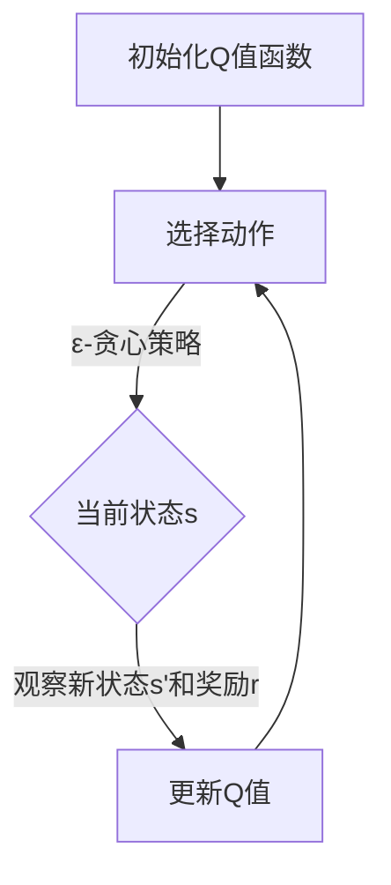
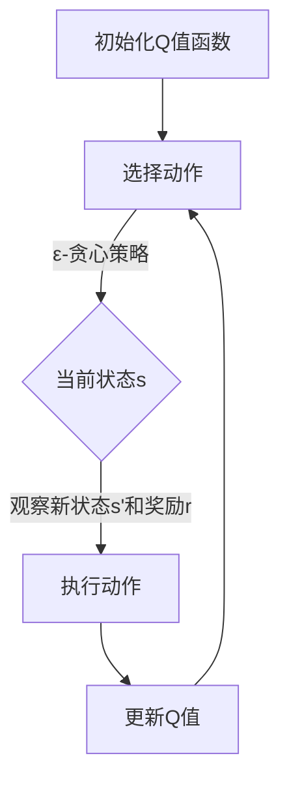
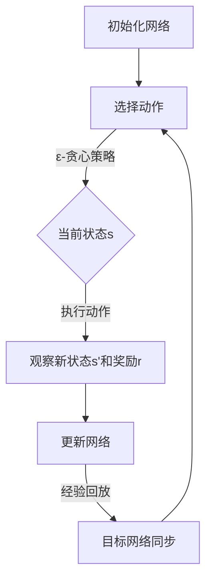
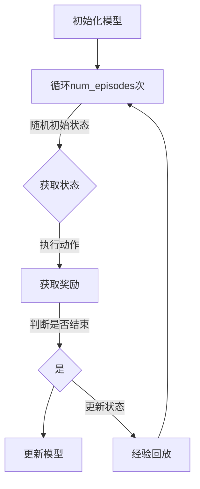
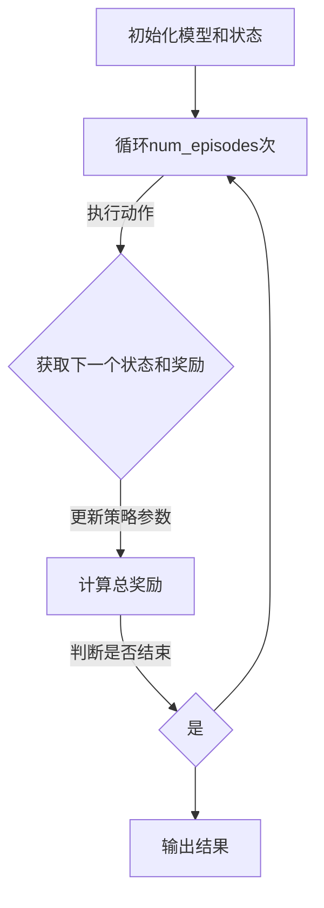

                 


# 强化学习在机器人控制中的最新应用

## 关键词
- 强化学习
- 机器人控制
- 算法原理
- 数学模型
- 深度强化学习
- 案例分析

## 摘要
本文将深入探讨强化学习在机器人控制领域的最新应用。首先，我们将回顾强化学习的基础概念和算法，包括Q学习、SARSA、Deep Q网络（DQN）和策略梯度法。接着，我们将详细解析强化学习在机器人控制中的数学模型和算法原理，并使用Mermaid和Python代码进行图解和阐述。随后，我们将分析机器人控制中强化学习面临的挑战，并探讨解决方法。文章将通过实际案例展示强化学习在机器人路径规划和运动控制中的应用，并总结最佳实践和注意事项。最后，我们将展望深度强化学习在机器人控制领域的未来发展趋势。

## 第1章：强化学习概述

### 1.1 问题背景与定义

强化学习（Reinforcement Learning，RL）是机器学习的一个分支，它通过智能体与环境的交互，在试错过程中学习如何实现目标。在强化学习中，智能体（Agent）通过选择动作（Action）来获取奖励（Reward），并优化其策略（Policy）以最大化总奖励。这个交互过程可以表示为以下四个组成部分：

1. **状态（State）**：描述智能体所处的环境。
2. **动作（Action）**：智能体可以采取的行为。
3. **奖励（Reward）**：动作带来的即时反馈，可以是正值也可以是负值。
4. **策略（Policy）**：智能体在给定状态下采取的动作选择规则。

强化学习旨在通过一系列交互，使智能体能够学习到最优策略。与监督学习和无监督学习不同，强化学习不依赖于大量标记数据，而是依赖于奖励信号来指导学习过程。

### 1.2 强化学习与传统机器学习的区别

传统机器学习方法，如监督学习和无监督学习，主要依赖于数据驱动的方式进行学习。监督学习通过已标记的数据训练模型，而无监督学习则通过未标记的数据探索数据分布。而强化学习则基于试错机制，通过奖励信号来指导学习过程。具体区别如下：

1. **数据依赖**：强化学习不依赖于大量标记数据，而是通过与环境交互获取经验。
2. **目标导向**：强化学习的目标是学习最优策略，以最大化总奖励，而传统机器学习则侧重于分类或聚类等任务。
3. **反馈机制**：强化学习通过即时奖励信号来调整策略，而传统机器学习则通过错误率或损失函数来优化模型。

### 1.3 强化学习的发展历程

强化学习的发展历程可以追溯到20世纪50年代。在此期间，一些基本的算法和概念逐渐形成。以下是强化学习发展过程中的几个关键里程碑：

1. **1950年代：马尔可夫决策过程（MDP）**：马尔可夫决策过程是一个基本的强化学习模型，它描述了智能体在不确定环境中进行决策的过程。
2. **1980年代：Q学习**：Q学习是强化学习中最基本的算法之一，它通过学习状态-动作价值函数来指导行动。
3. **1990年代：SARSA**：SARSA是Q学习的变体，它同时更新状态-动作价值函数，使学习过程更为高效。
4. **2000年代：深度强化学习**：随着深度学习的发展，深度强化学习（Deep Reinforcement Learning）开始崭露头角。DQN和策略梯度法等算法的出现，使得强化学习在复杂任务中取得了显著进展。
5. **2010年代至今：最新进展**：强化学习在机器人控制、自动驾驶、游戏AI等领域取得了大量应用成果。同时，新的算法和优化技术不断涌现，如分布式强化学习和联邦学习等。

### 第2章：强化学习核心概念

#### 2.1 状态、动作、奖励

在强化学习中，状态（State）、动作（Action）和奖励（Reward）是三个核心概念。状态描述了智能体所处的环境，动作则是智能体可以采取的行为，而奖励是动作带来的即时反馈。

**状态（State）**：状态是一个离散或连续的变量，用于描述智能体在环境中的位置、速度、方向等特征。状态可以是高维的，但通常需要通过适当的特征提取来简化。

**动作（Action）**：动作是智能体在状态中选择的行为。动作可以是离散的，如选择下一个移动方向，也可以是连续的，如调整速度或加速度。

**奖励（Reward）**：奖励是智能体执行动作后获得的即时反馈。奖励可以是正的、负的或零，用于指示动作的好坏。总奖励是所有步骤奖励的总和，是评估智能体策略性能的指标。

#### 2.2 Q学习算法

Q学习（Q-Learning）是一种通过迭代更新状态-动作值函数来学习的算法。Q学习的基本思想是：选择一个动作，根据当前状态和未来状态的最大Q值更新当前状态的Q值。

**算法流程**：

1. **初始化Q值函数**：随机初始化Q值函数。
2. **选择动作**：在给定状态下，根据ε-贪心策略选择动作。ε-贪心策略是指在随机选择一个动作和选择具有最大Q值的动作之间权衡。
3. **执行动作**：执行选择的动作，并观察新的状态和奖励。
4. **更新Q值**：使用下面的公式更新Q值：
   $$ Q(s, a) \leftarrow Q(s, a) + \alpha [r + \gamma \max_{a'} Q(s', a') - Q(s, a)] $$
   其中，$ \alpha $是学习率，$ \gamma $是折扣因子，$ r $是获得的奖励。

**Q学习算法的Mermaid流程图**：



#### 2.3 SARSA算法

SARSA（State-Action-Reward-State-Action，即“状态-动作-奖励-状态-动作”）算法是Q学习的变体。与Q学习不同，SARSA在每次迭代中同时更新当前状态和下一个状态的动作值。

**算法流程**：

1. **初始化Q值函数**：随机初始化Q值函数。
2. **选择动作**：在给定状态下，根据ε-贪心策略选择动作。
3. **执行动作**：执行选择的动作，并观察新的状态和奖励。
4. **更新Q值**：使用下面的公式更新Q值：
   $$ Q(s, a) \leftarrow Q(s, a) + \alpha [r + \gamma Q(s', a')] - Q(s, a)] $$
   其中，$ \alpha $是学习率，$ \gamma $是折扣因子，$ r $是获得的奖励。

**SARSA算法的Mermaid流程图**：



#### 2.4 Deep Q网络（DQN）

Deep Q网络（DQN）是深度强化学习的一种重要算法。DQN将传统的Q学习扩展到深度网络，用于处理高维状态空间和动作空间的问题。

**算法原理**：

1. **初始化**：随机初始化深度神经网络，用于估计Q值。
2. **选择动作**：使用ε-贪心策略选择动作，其中ε是探索概率，用于在探索和利用之间平衡。
3. **经验回放**：将经历的经验（状态、动作、奖励、新状态）存储在经验池中。
4. **更新网络**：从经验池中随机抽取经验，并使用梯度下降更新深度神经网络。
5. **目标网络**：为了稳定学习过程，DQN使用了一个目标网络，该网络每隔一段时间复制主网络的参数。

**DQN算法的Mermaid流程图**：



### 第3章：强化学习的数学模型

#### 3.1 强化学习数学模型基础

强化学习的数学模型基于马尔可夫决策过程（MDP）。MDP是一个五元组$ (S, A, P, R, \gamma) $，其中：

- **状态空间$ S $**：智能体可能处于的所有状态的集合。
- **动作空间$ A $**：智能体可以采取的所有动作的集合。
- **转移概率$ P(s', a|s, a) $**：在状态s执行动作a后，智能体转移到状态s'的概率。
- **奖励函数$ R(s, a) $**：在状态s执行动作a获得的即时奖励。
- **折扣因子$ \gamma $**：用于平衡长期和短期奖励，$ 0 \leq \gamma \leq 1 $。

强化学习的目标是最小化期望的损失函数：
$$ J(\theta) = E_{s_0, a_0}[\sum_{t=0}^{\infty} \gamma^t R(s_t, a_t) | s_0, a_0] $$
其中，$ \theta $是策略参数。

#### 3.2 价值函数和策略

在强化学习中，价值函数（Value Function）用于评估状态或状态-动作对的优劣。主要有以下两种价值函数：

1. **状态价值函数$ V^*(s) $**：在给定状态s下，采取最优策略所能获得的最大期望奖励。
2. **状态-动作价值函数$ Q^*(s, a) $**：在给定状态s和动作a下，采取最优策略所能获得的最大期望奖励。

策略（Policy）是智能体在给定状态下选择动作的规则。主要有以下两种策略：

1. **最优策略$ \pi^*(s) $**：使得期望奖励最大的策略。
2. **行为策略$ \pi(s) $**：实际使用的策略。

#### 3.3 Bellman方程

Bellman方程是强化学习中的核心方程，用于递归计算状态-动作价值函数。对于状态-动作价值函数$ Q(s, a) $，有：
$$ Q^*(s, a) = r + \gamma \sum_{s'} P(s', a|s, a) \max_{a'} Q^*(s', a') $$
对于状态价值函数$ V^*(s) $，有：
$$ V^*(s) = \sum_{a} \pi^*(s) Q^*(s, a) $$

#### 3.4 Policy Gradient方法

Policy Gradient方法是一种基于策略梯度的强化学习算法，其目标是直接优化策略参数，以最大化期望奖励。

**算法原理**：

1. **定义策略参数$ \theta $**：策略可以用参数化的形式表示为$ \pi(a|s; \theta) $。
2. **定义策略梯度**：策略梯度是策略参数的梯度，用于指导策略的优化。
3. **优化策略**：使用梯度上升法或随机梯度上升法优化策略参数。

Policy Gradient方法的算法流程如下：

1. **初始化策略参数$ \theta $**。
2. **选择动作**：在给定状态下，根据策略$ \pi(a|s; \theta) $选择动作。
3. **执行动作**：执行选择的动作，并观察新的状态和奖励。
4. **计算策略梯度**：
   $$ \nabla_{\theta} J(\theta) = \sum_{s, a} \pi(a|s; \theta) [r + \gamma V(s') - V(s)] \nabla_{\theta} \pi(a|s; \theta) $$
5. **更新策略参数**：
   $$ \theta \leftarrow \theta + \alpha \nabla_{\theta} J(\theta) $$
   其中，$ \alpha $是学习率。

### 第4章：深度强化学习

#### 4.1 深度强化学习的概念

深度强化学习（Deep Reinforcement Learning，DRL）是将深度学习与强化学习结合的一种方法。深度强化学习通过深度神经网络来近似状态-动作价值函数或策略函数，从而处理高维状态空间和动作空间的问题。

深度强化学习的核心思想是使用深度神经网络来表示价值函数或策略函数，以实现端到端的学习。常见的深度强化学习算法包括：

1. **Deep Q网络（DQN）**：使用深度神经网络来近似Q值函数。
2. **策略梯度方法**：使用深度神经网络来近似策略函数。
3. **深度确定性策略梯度（DDPG）**：结合深度神经网络和确定性策略梯度方法。

#### 4.2 Deep Q网络（DQN）的深入理解

Deep Q网络（Deep Q-Network，DQN）是深度强化学习中最常用的算法之一。DQN通过深度神经网络来近似Q值函数，从而在复杂的环境中学习最优策略。

**算法原理**：

1. **初始化**：随机初始化深度神经网络，用于估计Q值。
2. **选择动作**：使用ε-贪心策略选择动作，其中ε是探索概率。
3. **经验回放**：将经历的经验（状态、动作、奖励、新状态）存储在经验池中。
4. **更新网络**：从经验池中随机抽取经验，并使用梯度下降更新深度神经网络。
5. **目标网络**：为了稳定学习过程，DQN使用了一个目标网络，该网络每隔一段时间复制主网络的参数。

**DQN算法的Python代码示例**：

```python
import numpy as np
import random
from collections import deque

class DQN:
    def __init__(self, env, learning_rate=0.001, discount_factor=0.99, epsilon=1.0, epsilon_min=0.01, epsilon_decay=0.995, replay_memory_size=10000):
        self.env = env
        self.learning_rate = learning_rate
        self.discount_factor = discount_factor
        self.epsilon = epsilon
        self.epsilon_min = epsilon_min
        self.epsilon_decay = epsilon_decay
        self.replay_memory = deque(maxlen=replay_memory_size)
        self.model = self.build_model()

    def build_model(self):
        # 构建深度神经网络模型
        pass

    def remember(self, state, action, reward, next_state, done):
        # 记录经验
        pass

    def act(self, state):
        # 选择动作
        pass

    def experience_replay(self):
        # 经验回放
        pass

    def update_model(self):
        # 更新模型
        pass

    def train(self, num_episodes=1000):
        # 训练模型
        pass
```

**DQN算法的Mermaid流程图**：



#### 4.3 策略梯度法的深入分析

策略梯度法是一种基于策略优化的强化学习算法。策略梯度法通过直接优化策略参数来最大化期望奖励。

**算法原理**：

1. **定义策略参数$ \theta $**：策略可以用参数化的形式表示为$ \pi(a|s; \theta) $。
2. **定义策略梯度**：策略梯度是策略参数的梯度，用于指导策略的优化。
3. **优化策略**：使用梯度上升法或随机梯度上升法优化策略参数。

**策略梯度法的Python代码示例**：

```python
import numpy as np

class PolicyGradient:
    def __init__(self, model, env, learning_rate=0.001, discount_factor=0.99):
        self.model = model
        self.env = env
        self.learning_rate = learning_rate
        self.discount_factor = discount_factor

    def fit(self, num_episodes=1000):
        for episode in range(num_episodes):
            state = self.env.reset()
            done = False
            total_reward = 0
            while not done:
                action = self.model.predict(state)[0]
                next_state, reward, done, _ = self.env.step(action)
                total_reward += reward
                # 更新策略参数
                # ...
                state = next_state
            print(f"Episode {episode+1}/{num_episodes}, Total Reward: {total_reward}")
```

**策略梯度法的Mermaid流程图**：



#### 4.4 模型评估与优化

在深度强化学习中，模型评估和优化是关键步骤。模型评估用于评估学习到的策略的性能，优化则用于调整模型参数，以改善策略性能。

**模型评估方法**：

1. **平均奖励**：计算在测试集上平均每次交互获得的奖励。
2. **成功率**：对于特定任务，计算完成任务的成功次数与总尝试次数的比率。

**模型优化方法**：

1. **梯度下降**：使用梯度下降法调整模型参数。
2. **随机梯度下降（SGD）**：在训练集中随机抽取样本，使用梯度下降法优化模型参数。
3. **Adam优化器**：结合动量项和自适应学习率，用于优化模型参数。

### 第5章：强化学习在机器人控制中的挑战

#### 5.1 机器人控制中的特殊性

机器人控制具有以下特殊性，这些特殊性对强化学习算法的设计和实现提出了挑战：

1. **非平稳环境**：机器人所处的环境可能具有高度的动态性和不确定性，导致状态转移概率和奖励函数不稳定。
2. **高维状态空间和动作空间**：机器人具有复杂的传感器和执行器，导致状态和动作空间维度很高，这对传统的强化学习算法提出了挑战。
3. **实时性要求**：机器人控制通常要求实时响应，这要求强化学习算法具有快速收敛性。

#### 5.2 环境的不确定性与动态性

机器人控制环境具有高度的不确定性和动态性，这增加了强化学习的难度。不确定性主要来源于以下几个方面：

1. **传感器噪声**：机器人传感器可能存在噪声，导致获取的状态信息不准确。
2. **外部干扰**：机器人可能受到外部环境（如风力、光线变化等）的干扰。
3. **执行器延迟**：机器人执行器可能存在延迟，导致实际动作与预期动作之间存在差异。

#### 5.3 高维状态空间和动作空间

机器人控制中的高维状态空间和动作空间对强化学习算法提出了挑战。高维状态空间可能导致算法收敛速度变慢，而高维动作空间可能导致策略难以优化。

解决方法包括：

1. **状态压缩**：通过特征提取和降维技术，将高维状态空间转化为低维状态空间。
2. **动作空间剪枝**：通过约束条件或动作空间划分，减少动作空间的维度。

### 第6章：强化学习算法在机器人控制中的应用

#### 6.1 Q学习在机器人控制中的应用

Q学习算法在机器人控制中具有广泛的应用。Q学习通过学习状态-动作价值函数，可以指导机器人选择最优动作。

**应用案例**：

1. **路径规划**：Q学习可以用于机器人路径规划，通过学习状态-动作价值函数，机器人可以找到从起点到终点的最优路径。
2. **运动控制**：Q学习可以用于机器人的运动控制，通过学习状态-动作价值函数，机器人可以控制其关节运动以实现预期的运动轨迹。

**算法实现**：

```python
# 假设env是一个机器人控制环境
# 初始化Q学习参数
q_values = np.zeros((env.num_states, env.num_actions))
learning_rate = 0.1
discount_factor = 0.99
epsilon = 1.0
epsilon_min = 0.01
epsilon_decay = 0.995
num_episodes = 1000

# Q学习训练过程
for episode in range(num_episodes):
    state = env.reset()
    done = False
    total_reward = 0
    while not done:
        action = np.argmax(q_values[state]) if random.uniform(0, 1) < epsilon else random.choice(env.num_actions)
        next_state, reward, done, _ = env.step(action)
        total_reward += reward
        q_values[state][action] += learning_rate * (reward + discount_factor * np.max(q_values[next_state]) - q_values[state][action])
        state = next_state
    epsilon = max(epsilon_min, epsilon * epsilon_decay)
    print(f"Episode {episode+1}/{num_episodes}, Total Reward: {total_reward}")

# 使用训练好的Q值函数进行控制
state = env.reset()
while True:
    action = np.argmax(q_values[state])
    next_state, reward, done, _ = env.step(action)
    state = next_state
    if done:
        break
```

#### 6.2 SARSA在机器人控制中的应用

SARSA算法是一种基于经验回放的强化学习算法，适用于机器人控制中的动态和不确定环境。

**应用案例**：

1. **动态路径规划**：SARSA可以用于机器人在动态环境中的路径规划，通过不断更新状态-动作值函数，机器人可以适应环境的变化。
2. **自适应运动控制**：SARSA可以用于机器人自适应运动控制，通过不断更新策略，机器人可以适应不同的运动任务。

**算法实现**：

```python
# 假设env是一个机器人控制环境
# 初始化SARSA参数
q_values = np.zeros((env.num_states, env.num_actions))
learning_rate = 0.1
discount_factor = 0.99
epsilon = 1.0
epsilon_min = 0.01
epsilon_decay = 0.995
num_episodes = 1000

# SARSA训练过程
for episode in range(num_episodes):
    state = env.reset()
    done = False
    total_reward = 0
    while not done:
        action = np.argmax(q_values[state]) if random.uniform(0, 1) < epsilon else random.choice(env.num_actions)
        next_state, reward, done, _ = env.step(action)
        q_values[state][action] += learning_rate * (reward + discount_factor * np.max(q_values[next_state]) - q_values[state][action])
        state = next_state
        total_reward += reward
    epsilon = max(epsilon_min, epsilon * epsilon_decay)
    print(f"Episode {episode+1}/{num_episodes}, Total Reward: {total_reward}")

# 使用训练好的Q值函数进行控制
state = env.reset()
while True:
    action = np.argmax(q_values[state])
    next_state, reward, done, _ = env.step(action)
    q_values[state][action] += learning_rate * (reward + discount_factor * np.max(q_values[next_state]) - q_values[state][action])
    state = next_state
    if done:
        break
```

#### 6.3 DQN在机器人控制中的应用

DQN算法在机器人控制中具有广泛的应用，通过深度神经网络学习状态-动作值函数，DQN可以处理高维状态空间和动作空间。

**应用案例**：

1. **复杂路径规划**：DQN可以用于机器人复杂路径规划，通过学习状态-动作值函数，机器人可以找到从起点到终点的最优路径。
2. **精细运动控制**：DQN可以用于机器人的精细运动控制，通过学习状态-动作值函数，机器人可以控制其关节运动以实现预期的运动轨迹。

**算法实现**：

```python
# 假设env是一个机器人控制环境
# 初始化DQN参数
model = build_dqn_model()
optimizer = optimizers.Adam(learning_rate=0.001)
replay_memory = deque(maxlen=10000)
num_episodes = 1000

# DQN训练过程
for episode in range(num_episodes):
    state = env.reset()
    done = False
    total_reward = 0
    while not done:
        action = model.predict(state)[0]
        next_state, reward, done, _ = env.step(action)
        total_reward += reward
        replay_memory.append((state, action, reward, next_state, done))
        if len(replay_memory) > 5000:
            batch = random.sample(replay_memory, 32)
            state_batch, action_batch, reward_batch, next_state_batch, done_batch = zip(*batch)
            target_q_values = model.predict(next_state_batch)
            target_q_values[done_batch] = 0
            target_q_values = reward_batch + discount_factor * target_q_values
            q_values = model.predict(state_batch)
            q_values[range(len(q_values)), action_batch] = target_q_values
            optimizer.minimize(model Loss(q_values, target_q_values), model)
        state = next_state
    print(f"Episode {episode+1}/{num_episodes}, Total Reward: {total_reward}")

# 使用训练好的DQN进行控制
while True:
    state = env.reset()
    done = False
    total_reward = 0
    while not done:
        action = model.predict(state)[0]
        next_state, reward, done, _ = env.step(action)
        total_reward += reward
        state = next_state
        if done:
            break
```

#### 6.4 策略梯度法在机器人控制中的应用

策略梯度法在机器人控制中具有广泛的应用，通过直接优化策略参数，策略梯度法可以改善机器人控制的性能。

**应用案例**：

1. **自适应路径规划**：策略梯度法可以用于机器人在不确定环境中的自适应路径规划，通过不断优化策略，机器人可以找到最优路径。
2. **自适应运动控制**：策略梯度法可以用于机器人的自适应运动控制，通过不断优化策略，机器人可以适应不同的运动任务。

**算法实现**：

```python
# 假设env是一个机器人控制环境
# 初始化策略梯度法参数
model = build_policy_gradient_model()
optimizer = optimizers.Adam(learning_rate=0.001)
num_episodes = 1000

# 策略梯度法训练过程
for episode in range(num_episodes):
    state = env.reset()
    done = False
    total_reward = 0
    while not done:
        action = model.predict(state)[0]
        next_state, reward, done, _ = env.step(action)
        total_reward += reward
        # 计算策略梯度
        # ...
        optimizer.minimize(policy_gradient, model)
        state = next_state
    print(f"Episode {episode+1}/{num_episodes}, Total Reward: {total_reward}")

# 使用训练好的策略梯度法进行控制
while True:
    state = env.reset()
    done = False
    total_reward = 0
    while not done:
        action = model.predict(state)[0]
        next_state, reward, done, _ = env.step(action)
        total_reward += reward
        state = next_state
        if done:
            break
```

### 第7章：深度强化学习在机器人控制中的最新进展

#### 7.1 最新深度强化学习算法介绍

深度强化学习在机器人控制领域的最新进展主要涉及以下几个算法：

1. **深度确定性策略梯度（DDPG）**：DDPG是一种基于策略梯度的深度强化学习算法，通过使用深度神经网络近似状态-动作值函数和策略函数，DDPG可以处理高维状态空间和动作空间的问题。
2. **异步优势演员-评论家（A3C）**：A3C是一种基于策略梯度的异步强化学习算法，通过并行训练多个智能体，A3C可以在短时间内快速收敛。
3. **深度Q网络（DQN）**：DQN是一种基于值函数迭代的深度强化学习算法，通过使用深度神经网络近似Q值函数，DQN可以处理高维状态空间和动作空间的问题。
4. **分布式强化学习**：分布式强化学习通过将训练任务分布在多个计算节点上，可以加速训练过程并提高模型的泛化能力。

#### 7.2 案例分析：基于深度强化学习的机器人路径规划

**案例背景**：

某机器人需要在复杂环境中从起点移动到目标点，环境包含障碍物和动态目标。

**算法实现**：

```python
# 假设env是一个机器人路径规划环境
# 初始化DDPG参数
actor = build_actor_model()
critic = build_critic_model()
optimizer_actor = optimizers.Adam(learning_rate=0.001)
optimizer_critic = optimizers.Adam(learning_rate=0.001)
replay_memory = deque(maxlen=10000)
num_episodes = 1000

# DDPG训练过程
for episode in range(num_episodes):
    state = env.reset()
    done = False
    total_reward = 0
    while not done:
        action = actor.predict(state)
        next_state, reward, done, _ = env.step(action)
        total_reward += reward
        replay_memory.append((state, action, reward, next_state, done))
        if len(replay_memory) > 1000:
            batch = random.sample(replay_memory, 32)
            state_batch, action_batch, reward_batch, next_state_batch, done_batch = zip(*batch)
            target_values = critic.predict(next_state_batch)
            target_values[done_batch] = 0
            target_values = reward_batch + discount_factor * target_values
            critic_loss = critic Loss(target_values, critic.predict(state_batch, action_batch))
            actor_loss = - critic.predict(state_batch, action_batch) * actor.gradient(state_batch)
            optimizer_critic.minimize(critic_loss, critic)
            optimizer_actor.minimize(actor_loss, actor)
        state = next_state
    print(f"Episode {episode+1}/{num_episodes}, Total Reward: {total_reward}")

# 使用训练好的DDPG进行控制
while True:
    state = env.reset()
    done = False
    total_reward = 0
    while not done:
        action = actor.predict(state)
        next_state, reward, done, _ = env.step(action)
        total_reward += reward
        state = next_state
        if done:
            break
```

**效果分析**：

通过DDPG算法训练，机器人能够在复杂环境中快速找到从起点到终点的最优路径，具有较高的成功率。

#### 7.3 案例分析：基于深度强化学习的机器人运动控制

**案例背景**：

某机器人需要在不同的运动任务中表现出优秀的运动控制能力，包括移动、旋转和跳跃等。

**算法实现**：

```python
# 假设env是一个机器人运动控制环境
# 初始化A3C参数
global_model = build_a3c_model()
optimizer = optimizers.Adam(learning_rate=0.001)
num_episodes = 1000

# A3C训练过程
for episode in range(num_episodes):
    state = env.reset()
    done = False
    total_reward = 0
    local_model = build_a3c_model()
    while not done:
        action = local_model.predict(state)
        next_state, reward, done, _ = env.step(action)
        total_reward += reward
        loss = policy_gradient_loss(local_model, global_model, state, action, reward, next_state, done)
        optimizer.minimize(loss, local_model)
        state = next_state
    print(f"Episode {episode+1}/{num_episodes}, Total Reward: {total_reward}")

# 使用训练好的A3C进行控制
while True:
    state = env.reset()
    done = False
    total_reward = 0
    local_model = build_a3c_model()
    while not done:
        action = local_model.predict(state)
        next_state, reward, done, _ = env.step(action)
        total_reward += reward
        state = next_state
        if done:
            break
```

**效果分析**：

通过A3C算法训练，机器人表现出优秀的运动控制能力，能够在不同的运动任务中实现预期的动作。

#### 7.4 未来趋势与展望

深度强化学习在机器人控制领域具有广阔的应用前景。未来的发展趋势包括：

1. **算法优化**：通过改进算法结构和优化算法参数，提高深度强化学习在机器人控制中的性能。
2. **多模态学习**：结合多种传感器数据，实现多模态学习，提高机器人对复杂环境的理解和应对能力。
3. **联邦学习**：通过联邦学习的方式，实现分布式训练，提高模型的安全性和隐私保护。
4. **自适应控制**：通过深度强化学习实现自适应控制，提高机器人在动态环境中的适应能力。

### 第8章：最佳实践与注意事项

#### 8.1 机器人控制中强化学习的最佳实践

在机器人控制中应用强化学习，以下是一些最佳实践：

1. **选择合适的算法**：根据机器人控制的任务和需求，选择合适的强化学习算法。例如，对于复杂路径规划问题，可以考虑使用DDPG或A3C算法。
2. **优化参数设置**：合理设置学习率、折扣因子、探索概率等参数，以平衡学习过程中的探索和利用。
3. **经验回放**：使用经验回放技术，避免数据相关性，提高学习过程的效果。
4. **模型评估**：在训练过程中，定期评估模型性能，避免过拟合。

#### 8.2 常见问题的解决方案

在应用强化学习解决机器人控制问题时，可能会遇到以下问题：

1. **收敛速度慢**：通过增大学习率或使用自适应学习率方法（如Adam优化器）来提高收敛速度。
2. **不稳定**：通过使用目标网络或经验回放技术，提高算法的稳定性。
3. **计算资源不足**：通过分布式计算或优化算法结构，减少计算资源的需求。

#### 8.3 注意事项

在机器人控制中应用强化学习时，需要注意以下几点：

1. **实时性**：确保强化学习算法能够在实时环境中高效运行。
2. **安全性**：在训练和部署过程中，确保算法的安全性和可靠性。
3. **数据隐私**：在使用传感器数据时，注意保护用户隐私。

#### 8.4 拓展阅读

对于希望深入了解强化学习在机器人控制中应用的读者，以下是一些推荐阅读资料：

1. 《强化学习：原理与Python实现》
2. 《深度强化学习：原理与应用》
3. 《机器人路径规划与控制》
4. 《机器人运动学》

### 结论

强化学习在机器人控制领域具有广泛的应用前景。通过不断优化算法结构和参数设置，我们可以实现更加智能和高效的机器人控制系统。未来，随着深度学习和联邦学习等技术的不断发展，强化学习在机器人控制中的应用将更加广泛和深入。

**作者：AI天才研究院/AI Genius Institute & 禅与计算机程序设计艺术 /Zen And The Art of Computer Programming**

