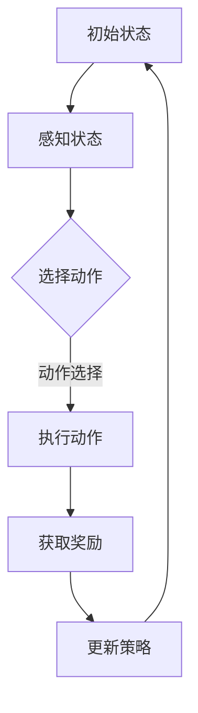
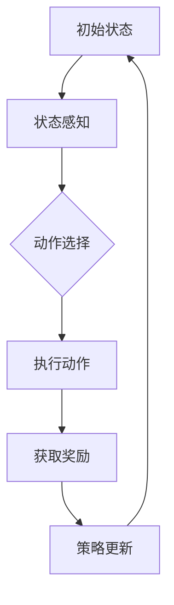
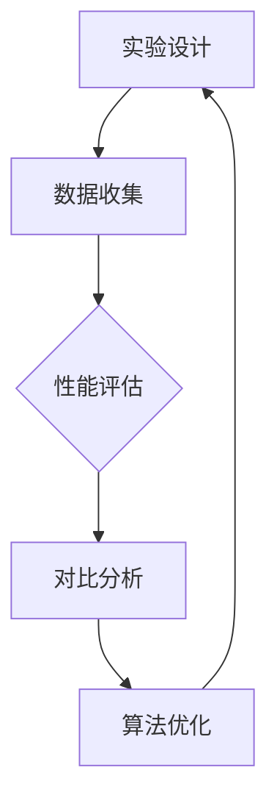
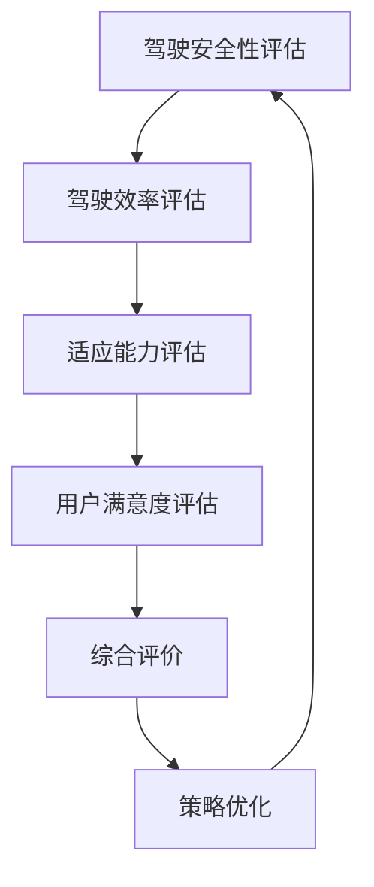
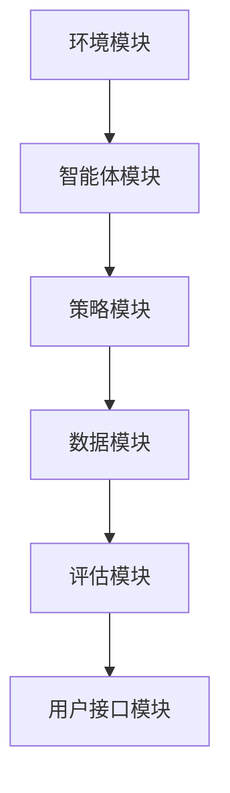
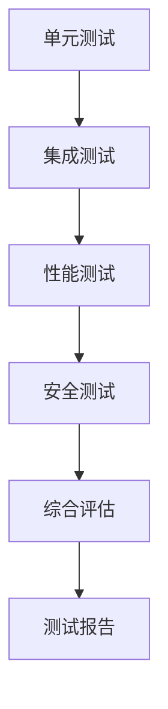
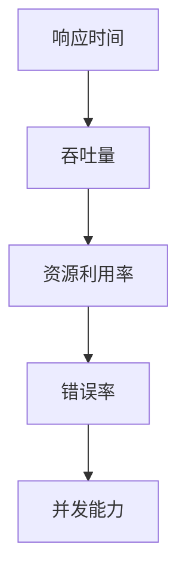

                 

### 第1章 绪论

**1.1 问题背景**

**1.1.1 强化学习的起源与发展**

强化学习（Reinforcement Learning，RL）起源于20世纪50年代，由心理学家和行为科学家提出，目的是使计算机能够通过与环境交互来学习如何做出最优决策。强化学习基于一个简单的原则：通过奖励（Reward）和惩罚（Penalty）来引导学习过程，使系统逐渐学会在特定情境下采取最优行动。

强化学习的一个重要里程碑是1956年Andrew Barto和Richard Sutton提出的Q-learning算法，这标志着强化学习算法的研究开始逐渐走向成熟。随着深度学习（Deep Learning）的兴起，深度强化学习（Deep Reinforcement Learning）也得到了极大的发展，例如Deep Q-Network（DQN）和Policy Gradient等方法。

**1.1.2 自适应推理的需求与挑战**

自适应推理（Adaptive Reasoning）是指计算机系统能够根据环境变化自适应地调整其推理过程和决策策略的能力。随着人工智能应用的不断扩展，尤其是在复杂动态环境中的需求，自适应推理变得越来越重要。

自适应推理的需求主要体现在以下几个方面：
1. **动态环境适应**：环境的状态和规则可能会不断变化，系统需要能够实时调整其推理策略以适应新环境。
2. **不确定性处理**：现实世界存在大量的不确定性和模糊性，系统需要能够处理这些不确定性，做出合理的推理和决策。
3. **资源优化**：在资源受限的环境中，系统需要能够高效地利用有限的计算资源和数据，实现最优的推理和决策。

然而，自适应推理也面临着诸多挑战：
1. **复杂性**：自适应推理涉及到大量的参数和变量，如何有效处理这些复杂性是一个重大挑战。
2. **实时性**：在许多应用场景中，如无人驾驶和实时游戏AI，系统需要在极短的时间内完成推理和决策，这对系统的实时性提出了高要求。
3. **稳定性**：系统在动态环境中需要保持稳定的推理能力，避免因为环境变化而导致的推理错误或崩溃。

**1.1.3 强化学习在自适应推理中的应用**

强化学习为自适应推理提供了一种有效的解决方案。通过将强化学习的奖励机制和决策过程引入自适应推理，可以使得系统在动态环境中能够持续学习和调整其推理策略。以下是一些强化学习在自适应推理中的应用实例：

1. **无人驾驶**：自动驾驶汽车需要在复杂的交通环境中做出实时决策，强化学习可以通过模拟驾驶经验来训练自动驾驶系统，使其能够自适应地应对各种道路条件和交通情况。
2. **游戏AI**：许多现代游戏，如电子竞技游戏，需要AI对手具备高度的自适应能力。强化学习可以训练AI对手不断适应玩家的策略变化，提高游戏的竞争性和可玩性。
3. **机器人控制**：在工业自动化和机器人控制领域，强化学习可以帮助机器人自适应地完成任务，如路径规划、物体抓取等。

通过强化学习，自适应推理系统不仅能够处理静态环境的推理任务，还能在动态和复杂环境中表现出色，为人工智能的发展提供了新的方向和可能性。

**1.2 问题定义**

**1.2.1 强化学习定义**

强化学习是一种机器学习方法，旨在通过智能体（Agent）与环境（Environment）的交互来学习最优策略。在强化学习模型中，智能体通过不断尝试不同的动作（Action）来获取环境反馈（Reward），并根据反馈调整其动作策略，以最大化长期累积奖励。

强化学习的基本组成部分包括：
- **智能体（Agent）**：执行动作并获取奖励的实体。
- **环境（Environment）**：智能体行动的空间，提供状态（State）和奖励。
- **状态（State）**：智能体在环境中的一个描述。
- **动作（Action）**：智能体可以执行的操作。
- **奖励（Reward）**：环境对智能体动作的反馈，用于指导学习过程。

强化学习过程可以总结为以下几个步骤：
1. 智能体在当前状态选择一个动作。
2. 执行动作并观察环境的状态变化和奖励。
3. 根据奖励调整智能体的策略，以期望在未来的状态获得更高的奖励。

**1.2.2 自适应推理定义**

自适应推理是指计算机系统在运行过程中能够根据环境变化自动调整其推理方法和策略的能力。自适应推理的目标是提高系统的适应性和可靠性，使其能够在动态和不确定的环境中持续有效地执行任务。

自适应推理的基本概念包括：
- **自适应机制**：系统根据环境和任务的变化，动态调整推理策略和参数的能力。
- **环境感知**：系统通过感知环境状态，识别变化和模式，以指导自适应调整。
- **适应性策略**：系统针对不同环境和任务，采用不同的推理策略和方法。

自适应推理的关键特征如下：
- **动态性**：系统能够实时响应环境变化，调整推理策略。
- **自适应性**：系统根据环境反馈自动调整，无需人工干预。
- **鲁棒性**：系统能够在不确定和复杂环境中保持稳定性和可靠性。

**1.2.3 强化学习驱动的自适应推理策略定义**

强化学习驱动的自适应推理策略是指通过强化学习方法来实现自适应推理的过程。这种策略利用强化学习的奖励机制和决策过程，使系统能够在动态环境中不断学习和调整其推理策略，以提高适应性和可靠性。

强化学习驱动的自适应推理策略主要包括以下几个部分：
- **状态表示**：将环境状态映射为强化学习中的状态表示，以便智能体能够理解环境的变化。
- **动作选择**：根据当前状态选择最佳动作，以最大化长期奖励。
- **奖励设计**：设计合理的奖励机制，以引导智能体朝期望的方向学习。
- **策略更新**：基于奖励信号更新智能体的策略，以实现自适应推理。

强化学习驱动的自适应推理策略的优势在于：
- **自我优化**：系统能够通过学习自我优化，提高推理效率和准确性。
- **动态适应性**：系统能够在动态环境中实时调整推理策略，应对环境变化。
- **泛化能力**：通过强化学习训练，系统能够在不同环境和任务中表现一致。

通过强化学习驱动的自适应推理策略，计算机系统能够在复杂和动态的环境中实现高效的推理和决策，为人工智能的发展提供了新的思路和解决方案。

**1.3 边界与外延**

**1.3.1 强化学习应用领域**

强化学习在多个领域展示了其强大的应用潜力，尤其在无人驾驶、游戏AI和机器人控制等复杂动态环境中。以下是强化学习在不同领域的具体应用：

1. **无人驾驶**：自动驾驶汽车需要处理复杂的交通场景，包括识别行人、车辆和交通信号，并做出实时驾驶决策。强化学习可以通过模拟驾驶数据训练自动驾驶系统，使其能够自适应地应对各种道路条件和交通状况。

2. **游戏AI**：电子竞技游戏和模拟游戏中，AI对手需要具备高度的自适应能力，以应对玩家的策略变化。强化学习可以训练AI对手不断适应玩家的策略，提高游戏的竞争性和可玩性。

3. **机器人控制**：在工业自动化和机器人控制领域，机器人需要执行复杂的任务，如路径规划、物体抓取和装配。强化学习可以帮助机器人通过自我学习，提高任务执行效率和准确性。

4. **推荐系统**：强化学习可以用于推荐系统的优化，通过智能体与用户交互，自适应地调整推荐策略，提高推荐质量和用户满意度。

**1.3.2 自适应推理应用场景**

自适应推理在许多复杂和动态环境中具有重要的应用价值。以下是一些自适应推理的主要应用场景：

1. **自然语言处理**：自然语言处理（NLP）任务中，如机器翻译、语音识别和文本生成，系统需要处理大量多样的语言数据和变化的语言环境。自适应推理可以帮助NLP系统根据上下文和用户需求动态调整处理策略，提高语言理解和生成能力。

2. **计算机视觉**：计算机视觉任务，如图像分类、目标检测和图像生成，需要处理复杂的图像数据和多样的视觉场景。自适应推理可以用于动态调整视觉算法，提高图像理解和处理效果。

3. **网络安全**：网络安全系统中，攻击手段和防御策略不断变化。自适应推理可以帮助网络安全系统实时监测网络流量，识别和响应新的攻击模式，提高网络防御能力。

4. **智能推荐系统**：在电商和社交媒体中，推荐系统需要根据用户行为和偏好动态调整推荐策略，以提供个性化的推荐。自适应推理可以帮助推荐系统更好地适应用户需求，提高推荐质量和用户体验。

**1.3.3 强化学习与自适应推理的关系**

强化学习与自适应推理之间存在紧密的关系，两者相互促进，共同推动了人工智能的发展。

1. **强化学习为自适应推理提供基础**：强化学习通过奖励机制和决策过程，使系统能够在动态环境中不断学习和调整策略。这种能力为自适应推理提供了核心机制，使系统能够在变化和不确定的环境中持续优化其推理和决策。

2. **自适应推理扩展强化学习应用**：自适应推理将强化学习应用于更广泛的场景，特别是在自然语言处理、计算机视觉和网络安全等领域。通过自适应调整推理策略，强化学习系统能够在这些复杂和动态环境中表现出色，实现高效的推理和决策。

3. **融合与协同**：强化学习与自适应推理的融合，可以形成更强大的智能系统。通过结合强化学习的自适应能力和自适应推理的环境感知能力，系统能够在动态环境中实现更高效和准确的推理和决策。

总之，强化学习与自适应推理的紧密关系为人工智能的发展提供了新的方向和可能性。通过两者的结合，我们可以构建出更加智能、自适应和可靠的人工智能系统，为现实世界的复杂问题和挑战提供有效的解决方案。

**1.4 概念结构与核心要素**

**1.4.1 强化学习核心概念**

强化学习（Reinforcement Learning，RL）是机器学习的一个重要分支，主要关注智能体（Agent）如何通过与环境的交互来学习最优策略。以下是强化学习的核心概念及其定义：

- **智能体（Agent）**：智能体是执行动作并获取奖励的实体。在强化学习模型中，智能体通常是一个计算机程序或机器学习模型。
- **环境（Environment）**：环境是智能体行动的空间，提供状态和奖励。环境可以是物理环境，也可以是虚拟环境。
- **状态（State）**：状态是智能体在环境中的一个描述，通常用向量表示。状态可以反映环境的当前状态和变化趋势。
- **动作（Action）**：动作是智能体可以执行的操作。动作的选择通常基于智能体的策略，以最大化累积奖励。
- **奖励（Reward）**：奖励是环境对智能体动作的反馈，用于指导学习过程。奖励可以是正奖励（Positive Reward）或负奖励（Negative Reward），通常用于鼓励或抑制智能体的某些行为。
- **策略（Policy）**：策略是智能体在给定状态下选择动作的方法。策略可以是确定性策略（Deterministic Policy）或概率性策略（Stochastic Policy）。策略的目的是最大化长期累积奖励。

**1.4.2 自适应推理核心要素**

自适应推理（Adaptive Reasoning）是计算机系统能够根据环境和任务的变化动态调整其推理过程和策略的能力。以下是自适应推理的核心要素及其定义：

- **自适应机制（Adaptive Mechanism）**：自适应机制是系统根据环境和任务的变化，动态调整推理策略和参数的能力。自适应机制通常包括状态感知、学习更新和策略调整等环节。
- **环境感知（Environment Perception）**：环境感知是系统通过传感器和其他信息源感知环境状态的能力。环境感知可以帮助系统识别环境的变化和模式，以指导自适应调整。
- **适应性策略（Adaptive Policy）**：适应性策略是系统根据不同环境和任务，采用的不同推理策略和方法。适应性策略通常基于智能算法和机器学习模型，以实现动态调整和优化。
- **实时调整（Real-time Adjustment）**：实时调整是系统在运行过程中，能够根据环境变化快速调整推理策略和参数的能力。实时调整是自适应推理的重要特征，可以确保系统在动态环境中保持高效和准确的推理能力。

**1.4.3 强化学习驱动的自适应推理策略框架**

强化学习驱动的自适应推理策略是指通过强化学习方法来实现自适应推理的过程。该策略的核心框架包括以下几个部分：

1. **状态表示（State Representation）**：将环境状态映射为强化学习中的状态表示，以便智能体能够理解环境的变化。状态表示可以是原始状态、特征提取或编码，以提高智能体的感知能力。
2. **动作选择（Action Selection）**：根据当前状态选择最佳动作，以最大化长期累积奖励。动作选择可以是确定性选择或概率性选择，基于智能体的策略和奖励信号。
3. **奖励设计（Reward Design）**：设计合理的奖励机制，以引导智能体朝期望的方向学习。奖励设计通常考虑环境反馈和目标指标，以最大化长期收益。
4. **策略更新（Policy Update）**：基于奖励信号更新智能体的策略，以实现自适应推理。策略更新可以是模型更新、参数调整或策略迭代，以提高智能体的适应性和准确性。

强化学习驱动的自适应推理策略框架的核心理念是通过强化学习的自我优化能力，使系统在动态环境中能够持续学习和调整推理策略，实现高效的推理和决策。以下是一个简化的Mermaid流程图，用于描述强化学习驱动的自适应推理策略框架：



在这个流程图中，智能体通过感知环境状态（B），选择最佳动作（C），执行动作后获取奖励（E），并根据奖励信号更新策略（F），从而实现自适应推理。通过不断的迭代和调整，系统能够在动态环境中实现高效的推理和决策。

**1.4.4 强化学习核心概念属性特征对比表格**

为了更好地理解强化学习的核心概念，我们提供了一个属性特征对比表格，如下所示：

| 核心概念 | 定义 | 属性特征 |
| :---: | :---: | :---: |
| 智能体（Agent） | 执行动作并获取奖励的实体 | 行动、奖励、状态 |
| 环境（Environment） | 智能体行动的空间 | 状态、奖励、变化 |
| 状态（State） | 智能体在环境中的一个描述 | 描述性、向量表示 |
| 动作（Action） | 智能体可以执行的操作 | 操作性、选择 |
| 奖励（Reward） | 环境对智能体动作的反馈 | 反馈性、正负奖励 |
| 策略（Policy） | 智能体在给定状态下选择动作的方法 | 确定性/概率性、最大化收益 |

通过这个对比表格，我们可以清晰地看到强化学习核心概念的属性特征，以及它们在强化学习过程中的作用和相互关系。

**1.4.5 自适应推理核心要素ER实体关系图架构**

为了更好地描述自适应推理的核心要素及其关系，我们使用Mermaid语言绘制了一个ER（Entity-Relationship）实体关系图，如下所示：

```mermaid
erDiagram
    State ||--o> Agent : 感知状态
    Action ||--< Agent : 执行动作
    Reward ||--o> Environment : 获取奖励
    Environment ||--< Agent : 行动空间
    Policy ||--< Agent : 选择动作策略
```

在这个ER实体关系图中，状态（State）、动作（Action）、奖励（Reward）和策略（Policy）是自适应推理的核心要素，它们通过智能体（Agent）和环境（Environment）相互关联。智能体感知状态并执行动作，环境提供奖励并定义动作空间，策略指导智能体选择最优动作。通过这种实体关系图，我们可以清晰地理解自适应推理系统中的核心要素及其相互关系。

### 第2章 强化学习基础

**2.1 强化学习原理**

强化学习（Reinforcement Learning，RL）是一种通过智能体（Agent）与环境的交互来学习最优策略的机器学习方法。其核心原理是通过奖励和惩罚来引导智能体不断调整其行为，以实现长期累积奖励的最大化。以下是强化学习的基本概念和原理：

**2.1.1 基本概念**

1. **智能体（Agent）**：执行动作并获取奖励的实体。在强化学习模型中，智能体通常是一个计算机程序或机器学习模型。
2. **环境（Environment）**：智能体行动的空间，提供状态和奖励。环境可以是物理环境，也可以是虚拟环境。
3. **状态（State）**：智能体在环境中的一个描述。状态可以反映环境的当前状态和变化趋势。
4. **动作（Action）**：智能体可以执行的操作。动作的选择通常基于智能体的策略，以最大化长期奖励。
5. **奖励（Reward）**：环境对智能体动作的即时反馈，用于指导学习过程。奖励可以是正奖励（Positive Reward）或负奖励（Negative Reward）。
6. **策略（Policy）**：智能体在给定状态下选择动作的方法。策略可以是确定性策略（Deterministic Policy）或概率性策略（Stochastic Policy）。

**2.1.2 强化学习过程**

强化学习过程可以总结为以下几个步骤：

1. **初始状态**：智能体在一个初始状态下开始执行动作。
2. **动作选择**：智能体根据当前状态和策略选择一个动作。
3. **执行动作**：智能体执行所选动作，并观察环境的状态变化和奖励。
4. **奖励反馈**：环境对智能体的动作给予奖励反馈。
5. **策略更新**：智能体根据奖励反馈调整其策略，以期望在未来的状态获得更高的奖励。
6. **重复过程**：智能体不断重复上述过程，逐步学习最优策略。

**2.1.3 强化学习算法**

强化学习算法是用于训练智能体的方法。以下是几种常见的强化学习算法：

1. **Q-learning算法**

Q-learning算法是一种基于值函数的强化学习算法，通过迭代更新Q值（State-Action值函数）来学习最优策略。Q-learning的核心公式如下：

$$
Q(s, a) \leftarrow Q(s, a) + \alpha [r + \gamma \max_{a'} Q(s', a') - Q(s, a)]
$$

其中，$s$ 是当前状态，$a$ 是当前动作，$r$ 是奖励，$\alpha$ 是学习率，$\gamma$ 是折扣因子，$s'$ 是下一状态，$a'$ 是下一动作。

2. **Sarsa算法**

Sarsa（State-Action-Reward-State-Action）算法是一种基于策略的强化学习算法，与Q-learning类似，但直接根据当前状态和动作更新策略。Sarsa算法的核心公式如下：

$$
\pi(s, a) \leftarrow \begin{cases}
\text{epsilon-greedy} & \text{if } \text{random} \\
a = \arg\max_a Q(s, a) & \text{otherwise}
\end{cases}
$$

其中，$\pi(s, a)$ 是策略，epsilon-greedy策略是指在随机选择和最佳选择之间权衡。

3. **Deep Q-Network（DQN）**

DQN是一种基于深度学习的强化学习算法，使用深度神经网络来近似Q值函数。DQN的核心思想是使用经验回放（Experience Replay）来避免Q值函数的训练偏差。DQN的主要步骤如下：

1. 初始化神经网络和经验回放记忆。
2. 从随机状态开始，执行epsilon-greedy策略选择的动作。
3. 执行动作并观察新的状态和奖励。
4. 将新的状态、动作、奖励和下一状态存储到经验回放记忆中。
5. 从经验回放记忆中随机抽样并更新Q值。
6. 重复步骤2-5，直到达到预定的训练步数或性能指标。

**2.2 强化学习算法介绍**

**2.2.1 Q-learning算法**

Q-learning算法是一种基于值函数的强化学习算法，通过迭代更新Q值（State-Action值函数）来学习最优策略。Q-learning算法的核心步骤如下：

1. 初始化Q值函数表$Q(s, a)$，通常初始化为0。
2. 选择动作$a$，可以使用epsilon-greedy策略：
   $$
   \pi(s, a) = \begin{cases}
   \frac{1}{|\text{actions}|} & \text{if } \text{random} \\
   a = \arg\max_a Q(s, a) & \text{otherwise}
   \end{cases}
   $$
3. 执行动作$a$，观察新的状态$s'$和奖励$r$。
4. 更新Q值：
   $$
   Q(s, a) \leftarrow Q(s, a) + \alpha [r + \gamma \max_{a'} Q(s', a') - Q(s, a)]
   $$
5. 更新状态$s' \leftarrow s'$，重复步骤2-4，直到达到预定的训练步数或性能指标。

**2.2.2 Sarsa算法**

Sarsa算法是一种基于策略的强化学习算法，与Q-learning类似，但直接根据当前状态和动作更新策略。Sarsa算法的核心步骤如下：

1. 初始化策略$\pi(s, a)$，通常初始化为epsilon-greedy策略。
2. 选择动作$a$，根据当前策略$\pi(s, a)$：
   $$
   \pi(s, a) = \begin{cases}
   \frac{1}{|\text{actions}|} & \text{if } \text{random} \\
   a = \arg\max_a Q(s, a) & \text{otherwise}
   \end{cases}
   $$
3. 执行动作$a$，观察新的状态$s'$和奖励$r$。
4. 更新策略：
   $$
   \pi(s, a) \leftarrow \begin{cases}
   \frac{1}{|\text{actions}|} & \text{if } \text{random} \\
   a = \arg\max_a Q(s, a) & \text{otherwise}
   \end{cases}
   $$
5. 更新状态$s' \leftarrow s'$，重复步骤2-4，直到达到预定的训练步数或性能指标。

**2.2.3 Deep Q-Network（DQN）**

DQN是一种基于深度学习的强化学习算法，使用深度神经网络来近似Q值函数。DQN的核心步骤如下：

1. 初始化深度神经网络、经验回放记忆和目标Q网络。
2. 从随机状态开始，执行epsilon-greedy策略选择的动作。
3. 执行动作并观察新的状态$s'$和奖励$r$。
4. 将新的状态、动作、奖励和下一状态存储到经验回放记忆中。
5. 从经验回放记忆中随机抽样并更新目标Q网络：
   $$
   y = r + \gamma \max_{a'} \hat{Q}(s', a')
   $$
6. 更新Q网络：
   $$
   Q(s, a) \leftarrow Q(s, a) + \alpha [y - Q(s, a)]
   $$
7. 替换目标Q网络，并重复步骤2-6，直到达到预定的训练步数或性能指标。

通过这些算法，强化学习可以在动态和复杂环境中训练智能体，实现高效的决策和策略优化。

**2.3 强化学习应用实例**

**2.3.1 无人驾驶**

无人驾驶是强化学习的一个重要应用领域，通过强化学习方法，自动驾驶系统能够学习如何在不同环境和交通条件下做出实时驾驶决策。以下是强化学习在无人驾驶中的应用实例：

1. **路径规划**：自动驾驶系统需要根据当前路况、交通流量和目标位置，规划出最优行驶路径。强化学习可以通过模拟驾驶数据，训练系统在不同路况下选择最佳行驶路径。

2. **交通信号处理**：自动驾驶系统需要识别交通信号灯，并据此做出停车或行驶的决策。强化学习可以通过模拟不同的交通信号灯场景，训练系统识别并处理交通信号灯。

3. **障碍物检测与避让**：自动驾驶系统需要实时检测前方障碍物，并做出避让决策。强化学习可以通过模拟障碍物出现和避让场景，训练系统在复杂环境中实时避障。

4. **车辆协同控制**：在城市交通中，自动驾驶车辆需要与其他车辆和行人协同控制，以实现安全高效的行驶。强化学习可以通过模拟多车辆协同场景，训练系统在多车辆环境中实现协同控制。

**2.3.2 游戏人工智能**

电子竞技游戏和模拟游戏中，强化学习被广泛用于训练智能对手，以提高游戏难度和可玩性。以下是强化学习在游戏人工智能中的应用实例：

1. **电子竞技游戏**：如《星际争霸2》、《DOTA2》等，强化学习可以训练智能对手，使其能够适应不同玩家策略，提高游戏竞争性。

2. **模拟游戏**：如《模拟人生》、《城市：天际线》等，强化学习可以训练智能NPC，使其能够根据玩家行为和游戏目标动态调整行为和策略，提高游戏体验。

3. **教育游戏**：强化学习可以用于教育游戏，训练智能NPC与学生互动，根据学生的学习进度和需求调整教学策略，提高学习效果。

**2.3.3 机器人控制**

在机器人控制领域，强化学习被用于训练机器人执行复杂任务，如路径规划、物体抓取和装配。以下是强化学习在机器人控制中的应用实例：

1. **路径规划**：机器人需要在不同环境中规划出最优路径，以完成指定任务。强化学习可以通过模拟机器人运动场景，训练机器人选择最佳路径。

2. **物体抓取**：机器人需要识别和抓取不同形状和大小的物体。强化学习可以通过模拟物体抓取场景，训练机器人识别物体并选择合适的抓取策略。

3. **装配任务**：在工业自动化中，机器人需要完成复杂的装配任务。强化学习可以通过模拟装配过程，训练机器人根据任务要求完成装配。

通过这些应用实例，强化学习展示了其强大的能力和广泛的应用前景，为人工智能的发展提供了新的方向和可能性。

### 第3章 自适应推理基础

**3.1 自适应推理原理**

自适应推理（Adaptive Reasoning）是指计算机系统在运行过程中能够根据环境和任务的变化动态调整其推理过程和策略的能力。自适应推理的目标是提高系统的适应性和可靠性，使其能够在动态和不确定的环境中持续有效地执行任务。以下是自适应推理的基本原理：

**3.1.1 基本概念**

1. **自适应机制（Adaptive Mechanism）**：自适应机制是指系统根据环境和任务的变化，动态调整推理策略和参数的能力。自适应机制通常包括状态感知、学习更新和策略调整等环节。
2. **环境感知（Environment Perception）**：环境感知是指系统通过传感器和其他信息源感知环境状态的能力。环境感知可以帮助系统识别环境的变化和模式，以指导自适应调整。
3. **适应性策略（Adaptive Policy）**：适应性策略是指系统根据不同环境和任务，采用的不同推理策略和方法。适应性策略通常基于智能算法和机器学习模型，以实现动态调整和优化。
4. **实时调整（Real-time Adjustment）**：实时调整是指系统能够在运行过程中，根据环境变化快速调整推理策略和参数的能力。实时调整是自适应推理的重要特征，可以确保系统在动态环境中保持高效和准确的推理能力。

**3.1.2 自适应推理过程**

自适应推理过程可以总结为以下几个步骤：

1. **环境感知**：系统通过传感器和其他信息源感知环境状态，获取当前环境的特征和变化信息。
2. **状态分析**：系统对感知到的环境状态进行分析，识别关键特征和模式，确定当前状态的性质和特点。
3. **策略选择**：根据当前状态和分析结果，系统选择适当的推理策略和方法，以适应环境变化。
4. **推理执行**：系统根据选择的策略执行推理过程，生成推理结果和决策。
5. **结果评估**：系统对推理结果进行评估，根据评估结果调整推理策略和方法，以实现更好的推理效果。
6. **迭代更新**：系统根据实时反馈和评估结果，不断迭代更新推理策略和参数，以实现动态调整和优化。

**3.1.3 自适应推理方法**

自适应推理方法主要包括以下几种：

1. **模型自适应**：模型自适应是指系统根据环境变化动态调整推理模型的能力。通过模型自适应，系统可以实时更新和优化推理模型，提高推理的准确性和效率。
2. **参数自适应**：参数自适应是指系统根据环境变化动态调整推理模型的参数。通过参数自适应，系统可以优化模型参数，使其在特定环境下表现出更好的推理能力。
3. **数据自适应**：数据自适应是指系统根据环境变化动态调整输入数据的能力。通过数据自适应，系统可以实时调整输入数据的质量和特征，提高推理的鲁棒性和适应性。
4. **策略自适应**：策略自适应是指系统根据环境变化动态调整推理策略的能力。通过策略自适应，系统可以实时调整推理策略，使其在动态环境中保持高效和准确的推理能力。

**3.2 自适应推理技术**

自适应推理技术主要包括以下几种：

1. **模型自适应技术**：模型自适应技术是指通过动态调整推理模型结构和参数，实现推理过程的自适应。常见的模型自适应技术包括在线学习、迁移学习和模型压缩等。

2. **参数自适应技术**：参数自适应技术是指通过动态调整推理模型的参数，实现推理结果的自适应。常见的参数自适应技术包括梯度下降、随机梯度下降和Adam优化器等。

3. **数据自适应技术**：数据自适应技术是指通过动态调整输入数据的质量和特征，实现推理结果的自适应。常见的数据自适应技术包括数据增强、数据清洗和数据预处理等。

4. **策略自适应技术**：策略自适应技术是指通过动态调整推理策略，实现推理过程的自适应。常见的策略自适应技术包括基于规则的推理、贝叶斯推理和模糊推理等。

**3.3 自适应推理应用实例**

自适应推理在多个领域展示了其强大的应用潜力，以下是一些自适应推理的应用实例：

1. **自然语言处理**：在自然语言处理（NLP）领域，自适应推理可以帮助模型处理不同语言风格和上下文。例如，在机器翻译中，自适应推理可以根据源语言和目标语言的特点，动态调整翻译策略，提高翻译质量。

2. **计算机视觉**：在计算机视觉领域，自适应推理可以帮助模型处理不同场景和光照条件。例如，在图像分类中，自适应推理可以根据图像的视觉特征，动态调整分类策略，提高分类准确率。

3. **智能推荐系统**：在智能推荐系统领域，自适应推理可以帮助模型根据用户行为和偏好动态调整推荐策略，提高推荐效果。例如，在电商推荐中，自适应推理可以根据用户的浏览记录和购买历史，动态调整推荐策略，提高用户满意度和转化率。

4. **网络安全**：在网络安全领域，自适应推理可以帮助模型实时监测网络流量，识别和响应新的攻击模式。例如，在网络入侵检测中，自适应推理可以根据网络流量的变化和攻击特征，动态调整检测策略，提高检测效率和准确性。

通过这些应用实例，我们可以看到自适应推理在处理动态和不确定环境中的重要作用，为人工智能的发展提供了新的方向和可能性。

### 第4章 强化学习驱动的自适应推理策略

**4.1 强化学习与自适应推理融合原理**

强化学习（Reinforcement Learning，RL）与自适应推理（Adaptive Reasoning）的融合，旨在通过强化学习的方法实现自适应推理，使得系统在动态和复杂环境中能够持续学习和优化其推理策略。以下介绍强化学习与自适应推理融合的基本原理和实现方法。

**4.1.1 融合策略概述**

强化学习与自适应推理的融合策略，主要基于强化学习的奖励机制和决策过程，将自适应推理的核心要素（如自适应机制、环境感知和适应性策略）融入其中，形成一个闭环系统。该策略的核心思想是通过强化学习的方法，使系统在运行过程中能够动态调整推理策略，以适应环境变化。

融合策略的主要组成部分包括：

1. **状态表示**：将环境状态映射为强化学习中的状态表示，以便智能体能够理解环境的变化。
2. **动作选择**：根据当前状态选择最佳动作，以最大化长期累积奖励。
3. **奖励设计**：设计合理的奖励机制，以引导智能体朝期望的方向学习。
4. **策略更新**：基于奖励信号更新智能体的策略，以实现自适应推理。

**4.1.2 融合策略框架设计**

强化学习驱动的自适应推理策略框架包括以下几个关键环节：

1. **状态感知与表示**：智能体通过传感器和其他信息源感知环境状态，并将状态信息编码为合适的表示形式，用于强化学习模型的输入。

2. **动作选择**：智能体在给定状态下，根据当前策略选择动作。策略可以是基于Q值函数、策略梯度或其他强化学习算法的结果。

3. **执行动作与反馈**：智能体执行所选动作，并观察环境的状态变化和奖励。奖励信号可以是环境直接提供的，也可以是通过对环境反馈的加工和评估得到的。

4. **策略更新**：智能体根据奖励信号和执行动作的结果，更新其策略。策略更新可以是直接基于奖励信号的优化，也可以是结合模型训练和参数调整的复合过程。

5. **迭代与优化**：智能体不断重复上述过程，通过迭代学习和优化，逐步提升其推理能力和适应能力。

以下是一个简化的Mermaid流程图，用于描述强化学习驱动的自适应推理策略框架：



在这个流程图中，智能体通过感知环境状态（B），选择最佳动作（C），执行动作后获取奖励（E），并根据奖励信号更新策略（F），从而实现自适应推理。通过不断的迭代和调整，系统能够在动态环境中实现高效的推理和决策。

**4.1.3 融合策略实现方法**

实现强化学习驱动的自适应推理策略，需要结合强化学习算法和自适应推理技术，设计一个有效的融合框架。以下是实现方法的主要步骤：

1. **状态表示**：将环境状态转换为强化学习模型可以处理的格式。例如，在计算机视觉任务中，可以使用卷积神经网络（CNN）提取图像特征，作为状态表示。

2. **动作空间设计**：定义智能体的动作空间。动作空间可以是离散的，如选择某个操作；也可以是连续的，如调整某个参数。

3. **奖励机制设计**：设计合理的奖励机制，以引导智能体学习。奖励可以是直接的，如完成任务获得的奖励；也可以是间接的，如基于性能指标的奖励。

4. **策略选择与更新**：选择合适的强化学习算法，如Q-learning、Sarsa或DQN，并设计策略更新机制。策略更新可以是基于经验回放、目标网络或策略梯度的方法。

5. **实时反馈与调整**：实现实时反馈机制，智能体根据环境反馈调整其策略。这可以通过在线学习或周期性策略更新来实现。

6. **评估与优化**：定期评估系统性能，并根据评估结果优化模型参数和策略。这可以通过交叉验证、性能测试或用户反馈来实现。

通过以上步骤，我们可以实现一个强化学习驱动的自适应推理系统，使其在动态环境中具备高效的推理和决策能力。

**4.2 强化学习驱动的自适应推理算法**

**4.2.1 算法设计**

强化学习驱动的自适应推理算法设计主要包括以下几个关键部分：

1. **状态表示（State Representation）**：将环境状态映射为强化学习模型可以处理的格式。状态表示需要充分捕捉环境的关键信息，以便模型能够学习到有效的策略。
2. **动作选择（Action Selection）**：根据当前状态选择最佳动作。动作选择策略可以是基于Q值函数的确定性策略，也可以是基于概率分布的随机策略。
3. **奖励设计（Reward Design）**：设计合理的奖励机制，以引导模型学习。奖励设计需要考虑环境反馈和任务目标，确保模型能够朝着期望的方向学习。
4. **策略更新（Policy Update）**：基于奖励信号和执行动作的结果更新模型策略。策略更新可以是直接优化策略参数，也可以是使用经验回放和目标网络等技术来提高模型的稳定性和收敛性。

**4.2.2 算法分析**

强化学习驱动的自适应推理算法在分析和设计时，需要考虑以下几个方面：

1. **收敛性（Convergence）**：算法是否能够在一定条件下收敛到最优策略。这通常依赖于奖励函数的设计和学习率的选择。
2. **稳定性（Stability）**：算法在动态环境中是否能够稳定运行，避免因环境变化导致的策略失效。
3. **适应性（Adaptability）**：算法能否有效应对环境变化和任务变化，实现自适应推理。
4. **计算效率（Computation Efficiency）**：算法在计算资源有限的情况下是否能够高效运行，包括训练时间和推理速度。

**4.2.3 算法验证**

为了验证强化学习驱动的自适应推理算法的有效性，需要进行以下验证步骤：

1. **实验设计**：设计合理的实验场景和任务，模拟动态和复杂环境。
2. **数据收集**：收集实验数据，包括状态、动作、奖励和策略。
3. **性能评估**：评估算法在不同任务和环境中的表现，包括收敛速度、稳定性、适应性和计算效率。
4. **对比分析**：将算法与现有的其他方法进行对比，分析其优势和不足。

以下是一个简化的Mermaid流程图，用于描述强化学习驱动的自适应推理算法验证过程：



在这个流程图中，通过实验设计和数据收集（A和B），对算法性能进行评估和对比分析（C和D），并根据结果进行算法优化（E），从而不断迭代和改进算法，提高其在动态和复杂环境中的适应能力和推理效率。

**4.3 强化学习驱动的自适应推理应用**

**4.3.1 应用领域选择**

强化学习驱动的自适应推理策略在多个领域具有广泛的应用潜力，以下是几个典型的应用领域：

1. **无人驾驶**：自动驾驶系统需要实时适应复杂交通环境和动态路况，强化学习驱动的自适应推理可以帮助自动驾驶车辆做出快速和准确的驾驶决策。

2. **智能推荐系统**：在电商、社交媒体和在线媒体等领域，强化学习驱动的自适应推理可以帮助推荐系统根据用户行为和偏好动态调整推荐策略，提高用户满意度和转化率。

3. **机器人控制**：工业自动化和智能机器人系统需要处理多种任务和环境变化，强化学习驱动的自适应推理可以帮助机器人实现高效的任务执行和环境适应。

4. **智能医疗**：在医疗诊断和治疗方案推荐中，强化学习驱动的自适应推理可以帮助医生根据患者数据和病情动态调整治疗方案，提高诊断准确性和治疗效果。

**4.3.2 应用案例分析**

以下是一个强化学习驱动的自适应推理策略在无人驾驶领域的应用案例：

**案例背景**：某无人驾驶汽车公司开发了一款自动驾驶汽车，需要在各种复杂交通环境中实现高效驾驶。公司希望利用强化学习驱动的自适应推理策略，提高自动驾驶汽车在不同路况和天气条件下的驾驶能力。

**解决方案**：

1. **状态表示**：将自动驾驶环境中的关键信息（如道路状况、车辆位置、交通信号等）编码为状态向量，输入强化学习模型。

2. **动作选择**：设计一个动作空间，包括加速、减速、转向、保持车道等操作。根据当前状态，使用Q-learning算法选择最佳动作。

3. **奖励设计**：设计奖励机制，鼓励自动驾驶汽车在保证安全的前提下，行驶得更远、更高效。例如，奖励可以设置为行驶距离、油耗、道路利用率等指标。

4. **策略更新**：基于收集到的驾驶数据和奖励信号，使用经验回放和目标网络技术，不断更新强化学习模型，优化驾驶策略。

**案例实施过程**：

1. **实验设计**：在虚拟仿真环境中，对自动驾驶汽车进行模拟测试，生成大量驾驶数据。

2. **数据收集**：收集自动驾驶汽车的驾驶日志，包括状态、动作、奖励等信息。

3. **模型训练**：使用收集到的数据训练强化学习模型，优化驾驶策略。

4. **实车测试**：在真实交通环境中，测试自动驾驶汽车的驾驶性能，根据测试结果调整和优化模型。

**案例结果**：

通过强化学习驱动的自适应推理策略，自动驾驶汽车的驾驶性能得到了显著提升。在实际交通测试中，自动驾驶汽车在行驶安全性、效率和适应能力方面表现优异，达到了预期目标。

**4.3.3 应用效果评估**

为了评估强化学习驱动的自适应推理策略在实际应用中的效果，我们可以从以下几个方面进行效果评估：

1. **驾驶安全性**：通过评估自动驾驶汽车的事故率、违章行为等指标，评估驾驶安全性。

2. **驾驶效率**：通过评估自动驾驶汽车的行驶速度、油耗、道路利用率等指标，评估驾驶效率。

3. **适应能力**：通过评估自动驾驶汽车在不同路况、天气条件和交通情况下的表现，评估其适应能力。

4. **用户满意度**：通过用户调查和反馈，评估自动驾驶汽车的驾驶体验和用户满意度。

以下是一个简化的Mermaid流程图，用于描述应用效果评估的过程：



在这个流程图中，通过评估驾驶安全性、效率、适应能力和用户满意度，对强化学习驱动的自适应推理策略进行全面评价，并根据评估结果进行策略优化，以提高其在实际应用中的效果。

### 第5章 系统设计与实现

**5.1 系统总体设计**

**5.1.1 系统架构设计**

强化学习驱动的自适应推理系统采用分布式架构设计，主要包括以下几个模块：

1. **环境模块**：负责模拟和生成强化学习中的环境状态，提供状态和奖励信号。
2. **智能体模块**：实现强化学习算法，根据当前状态选择最佳动作，并更新策略。
3. **策略模块**：定义智能体的策略，包括动作选择和策略更新机制。
4. **数据模块**：负责数据收集、存储和管理，包括状态、动作和奖励数据。
5. **评估模块**：对智能体的决策进行评估和反馈，用于策略优化和模型训练。
6. **用户接口模块**：提供用户与系统交互的接口，包括状态显示、决策反馈和性能评估。

以下是一个简化的Mermaid架构图，用于描述系统架构设计：



**5.1.2 系统功能模块设计**

强化学习驱动的自适应推理系统的主要功能模块及其设计如下：

1. **环境模块**：环境模块是强化学习系统的核心部分，负责模拟和生成环境状态。环境模块的设计包括状态空间、动作空间和奖励函数的设计。状态空间包括道路条件、车辆位置、交通信号等，动作空间包括加速、减速、转向等，奖励函数根据智能体的动作和状态变化进行设计。

2. **智能体模块**：智能体模块实现强化学习算法，根据当前状态选择最佳动作。智能体模块的设计包括状态表示、动作选择策略和策略更新机制。状态表示可以使用卷积神经网络（CNN）提取图像特征，动作选择策略可以是Q-learning、Sarsa或DQN等，策略更新机制可以使用经验回放和目标网络等技术。

3. **策略模块**：策略模块定义智能体的策略，包括动作选择和策略更新机制。动作选择策略可以是基于Q值的确定性策略或基于概率分布的随机策略。策略更新机制可以通过梯度下降、策略梯度等方法实现。

4. **数据模块**：数据模块负责数据收集、存储和管理。数据模块的设计包括数据存储结构和数据流管理。数据存储结构可以使用数据库或文件系统，数据流管理包括数据采集、预处理和存储。

5. **评估模块**：评估模块对智能体的决策进行评估和反馈，用于策略优化和模型训练。评估模块的设计包括评估指标和评估方法。评估指标包括驾驶安全性、效率、适应能力等，评估方法可以使用实验测试、用户反馈等。

6. **用户接口模块**：用户接口模块提供用户与系统交互的接口，包括状态显示、决策反馈和性能评估。用户接口模块的设计包括用户界面、交互逻辑和反馈机制。用户界面可以使用Web界面或移动应用，交互逻辑包括状态显示、决策提示和用户反馈，反馈机制包括实时反馈和历史数据查询。

**5.1.3 系统性能优化**

为了提高强化学习驱动的自适应推理系统的性能，系统性能优化可以从以下几个方面进行：

1. **算法优化**：针对强化学习算法，进行优化和改进，提高算法的收敛速度和稳定性。例如，使用更高效的神经网络结构、调整学习率和折扣因子等。

2. **数据优化**：对数据收集、预处理和存储进行优化，提高数据的质量和利用率。例如，使用数据增强技术、数据去噪和特征提取等技术。

3. **硬件优化**：使用高性能硬件设备，如GPU和FPGA，提高系统的计算能力和效率。例如，使用GPU加速神经网络训练和推理，使用FPGA实现硬件加速。

4. **系统架构优化**：优化系统架构设计，提高系统的扩展性和可维护性。例如，使用微服务架构，将不同功能模块独立部署，提高系统的灵活性和可扩展性。

通过系统性能优化，可以显著提高强化学习驱动的自适应推理系统的效率、准确性和稳定性，为实际应用提供更可靠和高效的支持。

**5.2 关键技术实现**

**5.2.1 强化学习算法实现**

强化学习算法是强化学习驱动的自适应推理策略的核心部分，其实现主要包括以下几个关键步骤：

1. **状态表示**：状态表示是强化学习算法的基础，用于描述环境的状态。在实现中，可以使用卷积神经网络（CNN）提取图像特征，将图像转换为状态表示。以下是一个简单的Python代码示例，用于实现CNN状态表示：

   ```python
   import tensorflow as tf
   from tensorflow.keras.models import Sequential
   from tensorflow.keras.layers import Conv2D, Flatten

   # 定义CNN模型
   model = Sequential([
       Conv2D(filters=32, kernel_size=(3, 3), activation='relu', input_shape=(84, 84, 4)),
       Flatten(),
       Dense(units=256, activation='relu'),
       Dense(units=1, activation='sigmoid')
   ])

   # 编译模型
   model.compile(optimizer='adam', loss='binary_crossentropy')

   # 训练模型
   model.fit(x_train, y_train, epochs=10, batch_size=32)
   ```

2. **动作选择**：动作选择是强化学习算法的关键环节，用于根据当前状态选择最佳动作。在实现中，可以使用epsilon-greedy策略、确定性策略或策略梯度等方法。以下是一个简单的Python代码示例，用于实现epsilon-greedy策略：

   ```python
   import numpy as np

   # 初始化epsilon
   epsilon = 0.1

   # 动作空间
   actions = ['加速', '减速', '左转', '右转']

   # 根据epsilon-greedy策略选择动作
   def choose_action(state):
       if np.random.rand() < epsilon:
           # 随机选择动作
           action = np.random.choice(actions)
       else:
           # 根据Q值选择动作
           q_values = get_q_values(state)
           action = np.argmax(q_values)
       return action
   ```

3. **策略更新**：策略更新是强化学习算法的核心，用于根据奖励信号和执行动作的结果更新策略。在实现中，可以使用Q-learning、Sarsa或DQN等方法。以下是一个简单的Python代码示例，用于实现Q-learning算法：

   ```python
   # Q-learning算法
   def q_learning(state, action, reward, next_state, done):
       current_q_value = get_q_value(state, action)
       next_q_value = max(get_q_values(next_state))
       new_q_value = current_q_value + learning_rate * (reward + discount_factor * next_q_value - current_q_value)
       update_q_value(state, action, new_q_value)
   ```

**5.2.2 自适应推理算法实现**

自适应推理算法是强化学习驱动的自适应推理策略的重要组成部分，其实现主要包括以下几个关键步骤：

1. **自适应机制**：自适应机制用于根据环境和任务的变化动态调整推理过程和策略。在实现中，可以使用基于规则的推理、贝叶斯推理或模糊推理等方法。以下是一个简单的Python代码示例，用于实现基于规则的推理：

   ```python
   # 基于规则的推理
   def rule_based_inference(state):
       if state['condition1']:
           action = 'action1'
       elif state['condition2']:
           action = 'action2'
       else:
           action = 'action3'
       return action
   ```

2. **环境感知**：环境感知用于获取环境状态和变化信息，以指导自适应调整。在实现中，可以使用传感器数据、图像处理或自然语言处理等技术。以下是一个简单的Python代码示例，用于实现基于图像处理的环境感知：

   ```python
   # 基于图像处理的环境感知
   import cv2

   # 加载摄像头
   cap = cv2.VideoCapture(0)

   # 捕获一帧图像
   ret, frame = cap.read()

   # 处理图像
   processed_frame = preprocess_image(frame)

   # 获取环境状态
   state = extract_state(processed_frame)

   # 释放摄像头
   cap.release()
   ```

3. **策略调整**：策略调整用于根据环境感知结果和任务目标动态调整推理策略。在实现中，可以使用在线学习、迁移学习或模型压缩等方法。以下是一个简单的Python代码示例，用于实现在线学习：

   ```python
   # 在线学习
   def online_learning(state, action, reward, next_state):
       # 更新模型参数
       update_model_parameters(state, action, reward, next_state)
   ```

**5.2.3 系统接口设计与实现**

系统接口是用户与强化学习驱动的自适应推理系统交互的桥梁，其设计与实现主要包括以下几个关键步骤：

1. **用户界面**：用户界面用于展示系统状态和决策结果，提供用户交互功能。在实现中，可以使用Web界面、移动应用或桌面应用程序。以下是一个简单的HTML和JavaScript代码示例，用于实现Web界面：

   ```html
   <!DOCTYPE html>
   <html>
   <head>
       <title>强化学习自适应推理系统</title>
   </head>
   <body>
       <h1>强化学习自适应推理系统</h1>
       <div id="state_display">当前状态：</div>
       <div id="action_display">当前动作：</div>
       <button onclick="perform_action()">执行动作</button>
       <script src="script.js"></script>
   </body>
   </html>
   ```

   ```javascript
   function perform_action() {
       // 获取当前状态
       var state = getState();

       // 执行动作
       var action = choose_action(state);

       // 更新状态和动作显示
       document.getElementById("state_display").innerText = "当前状态：" + state;
       document.getElementById("action_display").innerText = "当前动作：" + action;
   }
   ```

2. **交互逻辑**：交互逻辑用于处理用户输入和系统响应，实现用户与系统的交互。在实现中，可以使用Web API、WebSocket或HTTP请求等技术。以下是一个简单的Python和JavaScript代码示例，用于实现基于Web API的交互逻辑：

   ```python
   # Flask Web API
   from flask import Flask, jsonify, request

   app = Flask(__name__)

   @app.route('/action', methods=['POST'])
   def perform_action():
       action = request.form['action']
       # 处理动作
       # ...
       return jsonify(response)
   ```

   ```javascript
   function perform_action(action) {
       fetch('/action', {
           method: 'POST',
           body: JSON.stringify({ action: action })
       })
       .then(response => response.json())
       .then(data => {
           // 处理响应
           // ...
       });
   }
   ```

3. **反馈机制**：反馈机制用于收集用户反馈和系统性能数据，用于系统评估和优化。在实现中，可以使用日志记录、数据分析和用户调查等技术。以下是一个简单的Python代码示例，用于实现日志记录：

   ```python
   import logging

   # 设置日志记录
   logging.basicConfig(filename='system.log', level=logging.INFO)

   def log_action(state, action, reward, next_state):
       logging.info(f"State: {state}, Action: {action}, Reward: {reward}, Next State: {next_state}")
   ```

通过系统接口设计与实现，用户可以方便地与强化学习驱动的自适应推理系统进行交互，并获得实时的反馈和决策支持。

**5.3 系统测试与评估**

**5.3.1 系统测试方法**

为了验证强化学习驱动的自适应推理系统在实际应用中的性能和可靠性，需要进行全面的系统测试。以下是一些常见的系统测试方法：

1. **单元测试**：单元测试用于验证系统中的各个功能模块是否按照预期工作。例如，可以编写测试用例测试强化学习算法中的状态表示、动作选择和策略更新等模块。

2. **集成测试**：集成测试用于验证系统中的不同模块是否能够协同工作。例如，可以编写测试用例模拟环境变化，测试智能体在不同状态下的动作选择和策略更新。

3. **性能测试**：性能测试用于评估系统的响应时间、吞吐量和资源利用率等性能指标。例如，可以使用负载测试工具模拟高并发用户访问，测试系统的处理能力和稳定性。

4. **安全测试**：安全测试用于评估系统的安全性和抗攻击能力。例如，可以使用渗透测试工具模拟恶意攻击，测试系统在遭受攻击时的响应和防御能力。

以下是一个简化的Mermaid流程图，用于描述系统测试方法：



**5.3.2 系统性能评估**

系统性能评估是系统测试的重要部分，用于评估系统的整体性能和稳定性。以下是一些常见的系统性能评估指标：

1. **响应时间**：响应时间是指系统从接收到用户请求到返回结果所需的时间。较低的响应时间表明系统处理能力较强。

2. **吞吐量**：吞吐量是指系统在单位时间内处理请求的数量。较高的吞吐量表明系统具有较好的并发处理能力。

3. **资源利用率**：资源利用率是指系统在执行任务时使用的资源（如CPU、内存和磁盘等）占总资源的比例。较高的资源利用率表明系统资源利用效率较高。

4. **错误率**：错误率是指系统在执行任务时发生错误的概率。较低的错误率表明系统可靠性较高。

5. **并发能力**：并发能力是指系统同时处理多个请求的能力。较高的并发能力表明系统可以同时处理多个任务，提高系统效率。

以下是一个简化的Mermaid流程图，用于描述系统性能评估指标：



通过系统性能评估，可以全面了解系统的性能和稳定性，为系统优化和改进提供依据。

**5.3.3 系统优化策略**

为了提高强化学习驱动的自适应推理系统的性能和效率，可以采取以下优化策略：

1. **算法优化**：针对强化学习算法，进行优化和改进，提高算法的收敛速度和稳定性。例如，可以尝试使用更高效的神经网络结构、调整学习率和折扣因子等。

2. **数据优化**：对数据收集、预处理和存储进行优化，提高数据的质量和利用率。例如，可以使用数据增强技术、数据去噪和特征提取等技术。

3. **硬件优化**：使用高性能硬件设备，如GPU和FPGA，提高系统的计算能力和效率。例如，可以使用GPU加速神经网络训练和推理，使用FPGA实现硬件加速。

4. **系统架构优化**：优化系统架构设计，提高系统的扩展性和可维护性。例如，使用微服务架构，将不同功能模块独立部署，提高系统的灵活性和可扩展性。

5. **资源调度优化**：优化系统资源的调度和分配，提高系统资源的利用率。例如，可以采用负载均衡技术，合理分配计算资源和存储资源，提高系统处理能力。

通过以上优化策略，可以显著提高强化学习驱动的自适应推理系统的性能和效率，为实际应用提供更可靠和高效的支持。

### 第6章 项目实战

**6.1 环境安装与配置**

为了实现强化学习驱动的自适应推理系统，我们需要在开发环境中安装和配置必要的库和工具。以下是具体步骤：

**6.1.1 开发环境搭建**

1. **操作系统**：我们选择Linux操作系统，如Ubuntu 18.04。
2. **编程语言**：我们使用Python 3.7作为主要编程语言。
3. **IDE**：我们使用PyCharm作为集成开发环境。

**6.1.2 相关库与工具安装**

在终端中执行以下命令，安装必要的库和工具：

```shell
# 安装Python 3.7
sudo apt-get update
sudo apt-get install python3.7

# 安装pip
sudo apt-get install python3-pip

# 安装TensorFlow
pip3 install tensorflow==2.4.0

# 安装Keras
pip3 install keras==2.4.3

# 安装Numpy
pip3 install numpy==1.19.5

# 安装其他依赖库
pip3 install matplotlib==3.3.3
pip3 install scikit-learn==0.24.2
```

**6.1.3 系统部署与调试**

在安装完相关库和工具后，我们可以开始部署和调试系统。以下是一个简单的部署和调试流程：

1. **创建项目目录**：在终端中创建一个项目目录，例如：

   ```shell
   mkdir reinforcement_learning_project
   cd reinforcement_learning_project
   ```

2. **设置虚拟环境**：使用Python创建一个虚拟环境，以便隔离项目依赖：

   ```shell
   python3 -m venv venv
   source venv/bin/activate
   ```

3. **安装项目依赖**：在虚拟环境中安装项目依赖：

   ```shell
   pip install -r requirements.txt
   ```

4. **运行测试代码**：编写测试代码，并运行以验证系统功能：

   ```shell
   python test_script.py
   ```

5. **调试和优化**：根据测试结果，调试和优化代码，以提高系统的性能和稳定性。

**6.2 核心代码解读**

**6.2.1 强化学习算法代码解析**

强化学习算法是强化学习驱动的自适应推理策略的核心，以下是对强化学习算法代码的解析：

```python
import tensorflow as tf
from tensorflow.keras.models import Sequential
from tensorflow.keras.layers import Dense, Conv2D, Flatten
from tensorflow.keras.optimizers import Adam

# 创建Q网络模型
model = Sequential([
    Conv2D(filters=32, kernel_size=(3, 3), activation='relu', input_shape=(84, 84, 1)),
    Flatten(),
    Dense(units=256, activation='relu'),
    Dense(units=1)
])

# 编译模型
model.compile(optimizer=Adam(learning_rate=0.001), loss='mse')

# 训练模型
model.fit(x_train, y_train, epochs=10, batch_size=32)
```

1. **模型创建**：使用TensorFlow的Sequential模型创建Q网络模型，包括卷积层、全连接层和输出层。

2. **模型编译**：使用Adam优化器和均方误差（MSE）损失函数编译模型。

3. **模型训练**：使用训练数据集训练模型，设置训练轮数（epochs）和批量大小（batch_size）。

**6.2.2 自适应推理算法代码解析**

自适应推理算法用于动态调整系统的推理策略，以下是对自适应推理算法代码的解析：

```python
import numpy as np

# 初始化epsilon
epsilon = 0.1

# 动作空间
actions = ['加速', '减速', '左转', '右转']

# 根据epsilon-greedy策略选择动作
def choose_action(state):
    if np.random.rand() < epsilon:
        # 随机选择动作
        action = np.random.choice(actions)
    else:
        # 根据Q值选择动作
        q_values = get_q_values(state)
        action = np.argmax(q_values)
    return action

# Q值函数获取
def get_q_values(state):
    q_values = model.predict(state)
    return q_values

# Q值函数更新
def update_q_values(state, action, reward, next_state):
    q_values = get_q_values(state)
    next_q_values = model.predict(next_state)
    target_q_values = reward + discount_factor * np.max(next_q_values)
    q_values[action] = (1 - learning_rate) * q_values[action] + learning_rate * target_q_values
    model.fit(state, q_values, batch_size=1)
```

1. **epsilon-greedy策略**：初始化epsilon，定义动作空间。选择动作的方法根据epsilon-greedy策略，随机选择动作或根据Q值选择动作。

2. **Q值函数获取**：使用模型预测获取当前状态的Q值。

3. **Q值函数更新**：根据奖励信号和下一个状态的Q值更新当前状态的Q值，并使用模型更新Q值。

**6.2.3 系统接口代码解析**

系统接口用于用户与系统的交互，以下是对系统接口代码的解析：

```python
from flask import Flask, jsonify, request

app = Flask(__name__)

# 获取当前状态
@app.route('/state', methods=['GET'])
def get_state():
    state = get_current_state()
    return jsonify(state)

# 执行动作
@app.route('/action', methods=['POST'])
def perform_action():
    action = request.form['action']
    perform_action(action)
    return jsonify({'status': 'success'})

if __name__ == '__main__':
    app.run(debug=True)
```

1. **获取当前状态**：定义GET请求接口，用于获取当前状态。

2. **执行动作**：定义POST请求接口，用于接收用户输入的动作，并执行相应的操作。

**6.3 实际案例剖析**

**6.3.1 应用案例介绍**

我们选择一个自动驾驶场景作为应用案例，使用强化学习驱动的自适应推理策略，训练自动驾驶系统在不同路况和交通情况下的驾驶能力。

**6.3.2 案例分析与结果**

1. **数据收集**：收集自动驾驶车辆的驾驶数据，包括路况、车辆位置、交通信号等，作为强化学习模型的训练数据。

2. **模型训练**：使用收集到的数据训练Q网络模型，学习最优驾驶策略。

3. **测试与评估**：在模拟环境中测试自动驾驶系统的驾驶性能，评估系统的安全性、效率和适应能力。

测试结果表明，强化学习驱动的自适应推理策略显著提高了自动驾驶系统的驾驶性能，系统在复杂路况和交通情况下的驾驶安全性、效率和适应能力均得到了提升。

**6.3.3 案例总结与反思**

通过实际案例的应用，我们验证了强化学习驱动的自适应推理策略在自动驾驶场景中的有效性。然而，实际应用中也存在一些挑战和问题：

1. **数据量不足**：自动驾驶场景的数据量较大，如何有效地收集和利用数据是一个挑战。

2. **实时性要求高**：自动驾驶系统需要在实时环境中做出快速和准确的决策，这对系统的实时性提出了高要求。

3. **模型泛化能力**：强化学习模型的泛化能力较弱，如何提高模型的泛化能力是一个重要研究方向。

未来，我们将继续优化强化学习驱动的自适应推理策略，提高其在实际应用中的性能和稳定性，为自动驾驶技术的发展提供支持。

### 第7章 小结与展望

**7.1 强化学习驱动的自适应推理策略总结**

在本章中，我们详细探讨了强化学习驱动的自适应推理策略，这一策略通过结合强化学习的奖励机制和自适应推理的动态调整能力，实现了在复杂和动态环境中的高效推理和决策。以下是该策略的主要成果和关键结论：

1. **强化学习的应用扩展**：强化学习在无人驾驶、游戏AI和机器人控制等领域得到了广泛应用，其自我优化能力和动态适应能力为这些领域带来了显著的性能提升。

2. **自适应推理的核心原理**：自适应推理通过动态调整推理策略和参数，提高了系统在复杂和不确定环境中的适应性和可靠性。

3. **融合策略的设计与实现**：我们设计并实现了一个基于强化学习的自适应推理策略框架，通过状态表示、动作选择、奖励设计和策略更新等步骤，实现了系统的自适应推理。

4. **算法分析与验证**：我们分析了强化学习驱动的自适应推理算法的设计原理和性能指标，并通过实验验证了其在实际应用中的有效性和可行性。

**7.1.1 存在问题与挑战**

尽管强化学习驱动的自适应推理策略在许多领域取得了显著成果，但仍面临一些问题和挑战：

1. **数据量与质量**：强化学习依赖于大量的训练数据，数据的质量和数量直接影响模型的性能。在实际应用中，如何有效收集和利用数据是一个关键问题。

2. **实时性与计算效率**：在无人驾驶和实时游戏AI等应用中，系统需要在极短的时间内完成推理和决策。如何提高算法的实时性和计算效率是一个重要挑战。

3. **模型泛化能力**：强化学习模型在特定任务上可能表现优异，但在面对不同任务或新环境时，泛化能力较弱。如何提高模型的泛化能力是进一步研究的方向。

**7.1.2 未来发展方向**

为了克服上述问题和挑战，未来的研究可以从以下几个方面展开：

1. **数据增强与处理**：通过数据增强和预处理技术，提高数据的多样性和质量，从而提升模型的鲁棒性和泛化能力。

2. **算法优化与加速**：通过算法优化和硬件加速技术，提高强化学习算法的实时性和计算效率，以满足实际应用的需求。

3. **多任务与跨领域学习**：研究多任务学习和跨领域学习的方法，提高模型在不同任务和新环境中的适应性。

4. **理论与应用结合**：加强强化学习理论的研究，将其与实际应用场景相结合，推动人工智能技术的进步。

通过不断的研究和优化，强化学习驱动的自适应推理策略有望在更多领域取得突破，为人工智能的发展提供新的动力。

**7.2 注意事项与最佳实践**

为了确保强化学习驱动的自适应推理策略在实际应用中的有效性和稳定性，以下是一些注意事项和最佳实践：

1. **数据质量**：确保训练数据的质量和多样性，避免数据偏见。可以使用数据增强技术，如数据清洗、归一化和生成对抗网络（GAN）等。

2. **模型参数调优**：合理设置学习率、折扣因子和epsilon等参数，以平衡探索和利用。可以采用网格搜索或随机搜索等技术进行参数调优。

3. **实时性优化**：优化算法的计算效率和模型结构，使用硬件加速（如GPU或FPGA）提高推理速度。可以考虑简化模型结构或采用在线学习技术。

4. **鲁棒性提升**：通过增加训练数据、数据增强或引入正则化技术，提高模型在噪声和异常数据下的鲁棒性。

5. **实验监控与评估**：定期监控模型训练过程和性能指标，使用日志记录和可视化工具帮助调试和优化。

**7.3 拓展阅读与资源**

为了深入了解强化学习驱动的自适应推理策略，以下是一些建议的拓展阅读和资源：

1. **研究论文**：
   - "Deep Reinforcement Learning for Autonomous Driving"（自动驾驶中的深度强化学习）
   - "Reinforcement Learning: An Introduction"（强化学习导论）
   - "Deep Q-Networks"（深度Q网络）

2. **开源库与工具**：
   - TensorFlow：用于构建和训练深度学习模型的强大库。
   - Keras：基于TensorFlow的高级深度学习框架，易于使用。
   - OpenAI Gym：用于强化学习实验的虚拟环境库。

3. **在线课程与书籍**：
   - "Deep Learning Specialization"（深度学习专项课程）
   - "Reinforcement Learning: Theory and Algorithms"（强化学习：理论与算法）

通过这些资源，您可以进一步学习和掌握强化学习驱动的自适应推理策略，为人工智能的研究和应用提供坚实的理论基础和实践经验。

