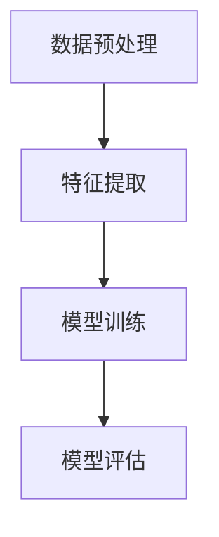
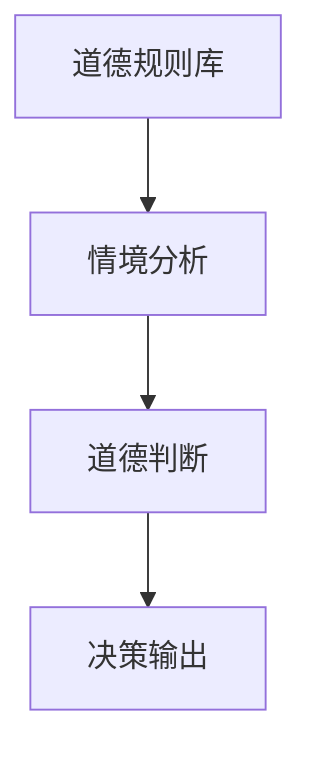

                 

### 当AI具备道德感：伦理教育的新方向

#### 关键词：
- 人工智能道德感
- 伦理教育
- 算法实现
- 社会责任
- 技术伦理

#### 摘要：
随着人工智能技术的迅猛发展，其道德性问题的探讨变得日益重要。本文旨在通过伦理教育，探讨如何使人工智能具备道德感，为伦理教育提供新的方向。文章首先介绍了问题背景和定义，随后讨论了AI道德感与伦理教育的关系，并详细解析了AI道德感实现算法的核心要素。通过理论与实践的结合，本文为AI道德感的研究与应用提供了深入见解。

## 第一部分：引言

### 1.1 问题背景

在当今世界，人工智能（AI）技术正以前所未有的速度发展。从自动驾驶汽车到智能医疗诊断，AI技术已经渗透到我们生活的方方面面。然而，随着AI技术的不断进步，其道德性问题也日益凸显。传统的AI系统往往缺乏道德感，这在一定程度上限制了其在社会中的广泛应用。因此，探讨AI如何具备道德感，成为了一个亟待解决的问题。

AI的道德性问题不仅仅是技术问题，更是一个涉及社会伦理的复杂问题。AI系统在决策过程中可能会产生意想不到的结果，比如在自动驾驶中，面对紧急情况时如何做出决策；在医疗诊断中，如何处理患者隐私和生命安全等。这些问题需要我们在技术层面和伦理层面进行深入探讨和解决。

### 1.2 问题描述

本书将探讨如何通过伦理教育，使AI具备道德感。具体来说，我们将讨论以下问题：

- **AI道德感的定义与属性**：首先需要明确AI道德感的定义及其属性，包括主观性、对称性和可解释性等。
- **AI道德感如何通过算法实现**：探讨通过编程和算法实现AI道德感的方法，包括道德规则库、道德感知模块、道德理解模块和道德判断模块等。
- **AI道德感在实际应用中的挑战与解决方案**：分析AI道德感在实际应用中面临的挑战，并提出相应的解决方案。
- **伦理教育在培养AI道德感中的作用**：讨论伦理教育在培养AI道德感中的重要性，以及如何通过伦理教育来提升AI的道德水平。

### 1.3 问题解决

本书将从理论层面和实践层面探讨AI道德感的问题。理论层面包括AI道德感的定义、属性和实现方法，实践层面则关注AI道德感在实际应用中的挑战和解决方案。通过这种多层次、多角度的分析，我们希望能够为AI道德感的研究和应用提供新的思路。

### 1.4 边界与外延

本文讨论的AI道德感主要关注在人工智能领域，但同样适用于其他需要道德判断的领域，如机器人、自动化系统等。此外，本文还将探讨伦理教育在培养AI道德感中的作用，旨在为相关领域的教育和研究提供参考。

### 1.5 概念结构与核心要素组成

- **AI道德感**：定义、属性、实现方法；
- **伦理教育**：概念、作用、方法；
- **AI道德感实现算法**：原理、实现、应用。

## 第二部分：核心概念与联系

### 2.1 AI道德感的定义与属性

#### 2.1.1 AI道德感的定义

AI道德感是指人工智能系统在决策过程中，能够体现人类道德准则的感知、理解和判断能力。具体来说，它包括以下几个方面：

1. **感知**：AI系统能够识别和感知情境中的道德问题，例如，在自动驾驶中，AI需要感知到行人、车辆和其他交通参与者的存在。
2. **理解**：AI系统需要理解道德问题的本质，例如，在医疗诊断中，AI需要理解哪些医疗决策涉及到患者的隐私权和生命安全。
3. **判断**：AI系统需要根据道德准则做出合理的判断和决策，例如，在自动驾驶中，AI需要判断如何在不同情境下做出最优决策。

#### 2.1.2 AI道德感的属性

1. **主观性**：AI道德感是一种主观体验，不同个体可能会有不同的道德判断。例如，对于同样的交通事故，不同的人可能会做出不同的道德判断。
   
2. **对称性**：AI道德感应具有对称性，即对同样的情境，AI应做出类似的道德判断。例如，自动驾驶AI在面对相同的紧急情况时，应做出类似的决策。

3. **可解释性**：AI道德感的决策过程应具有可解释性，使人类能够理解AI的道德判断。这对于提升AI的透明度和可信度至关重要。

### 2.2 AI道德感与伦理教育的关系

#### 2.2.1 AI道德感与伦理教育的关系

伦理教育是培养AI道德感的重要途径。通过伦理教育，可以使AI系统在决策过程中遵循人类道德准则。具体来说，伦理教育在以下几个方面发挥着重要作用：

1. **道德知识教育**：通过传授道德知识，使AI系统能够理解人类道德准则，从而在决策过程中遵循这些准则。
2. **道德情感教育**：培养AI系统的道德情感，使其能够感受到道德问题的紧迫性和重要性。
3. **道德实践教育**：通过实际的道德实践，使AI系统能够在具体情境中应用道德准则，提升其道德判断能力。

#### 2.2.2 伦理教育的概念、作用和方法

1. **概念**：伦理教育是指通过培养个体的道德判断能力和道德行为习惯，使其具备良好的道德素养。

2. **作用**：伦理教育有助于提升AI系统的道德水平，促进AI技术在社会中的健康发展。具体来说，伦理教育的作用体现在以下几个方面：

   - 提高AI系统的道德判断能力，使其能够做出更加合理的决策。
   - 增强AI系统的道德责任感，使其能够更好地服务于人类。
   - 提升AI系统的透明度和可信度，使其能够得到更广泛的应用。

3. **方法**：伦理教育包括道德知识教育、道德情感教育和道德实践教育。具体方法如下：

   - **道德知识教育**：通过课程、讲座、研讨会等形式，向AI系统传授道德知识。
   - **道德情感教育**：通过故事、案例分析等形式，培养AI系统的道德情感。
   - **道德实践教育**：通过实际的道德实践，使AI系统能够在具体情境中应用道德准则。

### 2.3 AI道德感实现算法

#### 2.3.1 AI道德感实现算法的定义

AI道德感实现算法是指通过编程实现AI系统道德感知、理解和判断能力的算法。具体来说，它包括以下几个核心要素：

1. **道德规则库**：用于存储AI系统的道德准则，例如，“保护生命高于一切”、“隐私权应当得到尊重”等。
2. **道德感知模块**：用于感知AI系统所处的情境，以识别可能存在的道德问题。
3. **道德理解模块**：用于理解情境中的道德问题，例如，如何平衡隐私保护和医疗诊断的准确性。
4. **道德判断模块**：用于根据道德规则和情境进行道德判断，并做出相应的决策。

#### 2.3.2 AI道德感实现算法的核心要素

1. **道德规则库**：道德规则库是AI道德感实现算法的基础。它存储了AI系统在决策过程中应遵循的道德准则。这些规则可以是预设的，也可以是通过学习得到的。例如，在自动驾驶中，道德规则库可能包括“在避免伤害行人时优先保护行人安全”等规则。

2. **道德感知模块**：道德感知模块负责感知AI系统所处的情境，以识别可能存在的道德问题。这一模块可以通过传感器、摄像头等设备获取情境信息，并利用机器学习算法对这些信息进行分析和处理。例如，在自动驾驶中，道德感知模块可以识别道路上的行人、车辆和其他交通参与者，并判断其与车辆的相对位置和动态。

3. **道德理解模块**：道德理解模块负责理解情境中的道德问题。这一模块需要结合情境信息和道德规则，对道德问题进行深入分析。例如，在医疗诊断中，道德理解模块需要考虑患者的隐私权、生命安全以及医疗资源的分配等问题。

4. **道德判断模块**：道德判断模块负责根据道德规则和情境进行道德判断，并做出相应的决策。这一模块需要结合道德感知模块和道德理解模块的结果，进行综合分析和判断。例如，在自动驾驶中，道德判断模块需要考虑如何在不同情境下做出最优决策，以最大程度地保护行人和车辆的安全。

通过以上四个核心要素的协同工作，AI道德感实现算法可以使AI系统在决策过程中体现人类的道德准则，从而提高其道德水平和社会责任感。

## 第三部分：算法原理讲解

### 3.1 AI道德感知算法

#### 3.1.1 道德感知算法的定义

道德感知算法是指用于感知AI系统所处的情境，以识别可能存在的道德问题的算法。它是AI道德感实现算法的重要组成部分，负责从外部环境中获取信息，并对这些信息进行分析和处理，以识别潜在的道德问题。

#### 3.1.2 道德感知算法的实现

道德感知算法的实现包括以下几个关键步骤：

1. **数据预处理**：数据预处理是道德感知算法的第一步，其主要目的是对原始数据进行清洗、归一化和特征提取，以便更好地识别道德问题。例如，在自动驾驶场景中，传感器采集到的数据可能包括图像、声音和传感器读数等，这些数据需要进行预处理，以便后续的分析和处理。

2. **特征提取**：特征提取是从预处理后的数据中提取有助于识别道德问题的特征。这些特征可以是数值型的，也可以是符号型的。例如，在图像数据中，可以提取行人、车辆等对象的边界、颜色、纹理等特征。

3. **模型训练**：模型训练是道德感知算法的核心步骤，其主要目的是通过学习大量的道德问题场景数据，使算法能够自动识别和分类潜在的道德问题。常用的模型训练方法包括监督学习、无监督学习和增强学习等。例如，可以使用监督学习算法（如支持向量机、决策树、神经网络等）来训练道德感知模型，使其能够从给定的数据中学习如何识别道德问题。

4. **模型评估**：模型评估是确保道德感知算法性能的重要步骤，其主要目的是通过评估算法在测试数据集上的表现，确定其是否能够有效地识别道德问题。常用的评估指标包括准确率、召回率、F1分数等。

#### 3.1.3 道德感知算法的mermaid流程图



### 3.2 AI道德理解算法

#### 3.2.1 道德理解算法的定义

道德理解算法是指用于理解AI系统所处的情境中的道德问题的算法。它负责对道德感知模块获取的信息进行深入分析，以理解情境中的道德问题，为后续的道德判断提供支持。

#### 3.2.2 道德理解算法的实现

道德理解算法的实现包括以下几个关键步骤：

1. **数据预处理**：与道德感知算法类似，道德理解算法也需要对原始数据进行预处理，以便更好地分析情境中的道德问题。预处理步骤包括数据清洗、归一化和特征提取等。

2. **特征提取**：特征提取是从预处理后的数据中提取有助于理解道德问题的特征。这些特征可以是数值型的，也可以是符号型的。例如，在医疗诊断场景中，可以提取患者的病情、治疗方案、医疗资源分配等特征。

3. **模型训练**：道德理解算法的核心是模型训练，其主要目的是通过学习大量的道德问题场景数据，使算法能够自动理解和分析道德问题。常用的模型训练方法包括监督学习、无监督学习和增强学习等。例如，可以使用监督学习算法（如支持向量机、决策树、神经网络等）来训练道德理解模型，使其能够从给定的数据中学习如何理解道德问题。

4. **模型评估**：与道德感知算法类似，道德理解算法也需要通过评估其性能，以确保其能够有效地理解道德问题。常用的评估指标包括准确率、召回率、F1分数等。

### 3.3 AI道德判断算法

#### 3.3.1 道德判断算法的定义

道德判断算法是指用于根据道德规则和情境进行道德判断，并做出相应决策的算法。它是AI道德感实现算法的最后一个环节，负责将道德感知和道德理解的结果转化为具体的决策。

#### 3.3.2 道德判断算法的实现

道德判断算法的实现包括以下几个关键步骤：

1. **道德规则库**：道德判断算法需要一个道德规则库，用于存储AI系统在决策过程中应遵循的道德规则。这些规则可以是预设的，也可以是通过学习得到的。

2. **情境分析**：道德判断算法需要分析道德感知模块和道德理解模块获取的情境信息，以确定当前情境中的道德问题。

3. **道德判断**：道德判断算法根据道德规则和情境分析结果，对道德问题进行判断，并确定相应的决策。例如，在自动驾驶场景中，道德判断算法需要判断如何在不同情境下做出最优决策，以最大程度地保护行人和车辆的安全。

4. **决策输出**：道德判断算法将道德判断结果转化为具体的决策，例如，调整自动驾驶车辆的行驶路径、选择最优的治疗方案等。

#### 3.3.3 道德判断算法的mermaid流程图



### 3.4 AI道德感实现算法的整合

AI道德感实现算法的整合是指将道德感知、道德理解和道德判断算法结合起来，形成一个完整的道德决策系统。整合的关键在于各个算法之间的协同工作，以确保系统能够在复杂情境中做出合理的道德决策。

1. **协同工作**：道德感知、道德理解和道德判断算法需要协同工作，共享情境信息和决策结果。例如，道德感知模块可以提供车辆、行人等对象的感知信息，道德理解模块可以提供对这些对象的属性分析，道德判断模块可以结合这些信息做出最终的决策。

2. **迭代优化**：通过不断的迭代和优化，道德感知、道德理解和道德判断算法可以不断提升其性能和准确性。例如，通过收集实际场景中的数据，不断更新道德规则库，改进特征提取方法，优化模型训练过程，从而提高道德判断算法的决策能力。

3. **动态调整**：道德决策系统需要具备动态调整能力，以适应不同的情境和需求。例如，在自动驾驶场景中，系统可以根据交通状况、天气条件等因素，动态调整决策策略，以最大程度地保障安全和效率。

### 3.5 AI道德感实现算法的应用场景

AI道德感实现算法可以应用于多个领域，包括自动驾驶、医疗诊断、金融决策等。以下是一些具体的应用场景：

1. **自动驾驶**：自动驾驶系统需要根据道德感知、道德理解和道德判断算法，在复杂的交通环境中做出合理的决策，以确保行人和车辆的安全。

2. **医疗诊断**：医疗诊断系统需要根据患者的病情、治疗方案和医疗资源分配等因素，做出道德上合理的决策，以最大程度地保护患者的生命安全和隐私。

3. **金融决策**：金融决策系统需要根据道德感知、道德理解和道德判断算法，在投资、贷款和风险管理等方面做出道德上合理的决策，以维护金融市场的稳定和公平。

### 3.6 AI道德感实现算法的挑战与解决方案

AI道德感实现算法在实际应用中面临着一系列挑战，包括数据质量、模型训练、决策透明度和可解释性等。以下是一些常见的挑战和相应的解决方案：

1. **数据质量**：数据质量对道德感知、道德理解和道德判断算法的性能至关重要。解决方案包括数据清洗、数据增强和数据标注等，以提高数据质量和算法性能。

2. **模型训练**：模型训练是道德感知、道德理解和道德判断算法的核心步骤。解决方案包括使用更先进的机器学习算法、增加训练数据量和引入对抗训练等方法，以提高模型训练效率和性能。

3. **决策透明度和可解释性**：道德决策系统的透明度和可解释性对公众信任和接受度至关重要。解决方案包括开发可解释的机器学习模型、引入解释性方法（如决策树、LIME等）以及建立透明度报告机制等。

4. **道德冲突和决策偏差**：道德冲突和决策偏差是道德感知、道德理解和道德判断算法面临的另一大挑战。解决方案包括建立道德冲突解决机制、引入多样化的道德准则和加强决策监督等。

## 第四部分：系统分析与架构设计

### 4.1 问题场景介绍

在自动驾驶领域，道德感知和道德判断算法的应用尤为重要。自动驾驶系统需要具备在复杂交通环境中做出合理决策的能力，以确保行人和车辆的安全。以下是一个具体的问题场景：

**场景**：一辆自动驾驶汽车在繁忙的城市道路上行驶，前方突然出现一名儿童横穿马路。自动驾驶系统需要在极短的时间内做出决策，以避免碰撞并最小化伤害。

### 4.2 项目介绍

为了解决上述问题场景，我们开发了一个名为“道德感知与判断”的项目。该项目旨在通过道德感知和道德判断算法，为自动驾驶系统提供道德决策支持。项目主要包括以下几个模块：

- **道德感知模块**：负责感知车辆、行人等交通参与者的位置、速度和动态。
- **道德理解模块**：负责分析交通环境中的道德问题，如行人安全、车辆保护等。
- **道德判断模块**：根据道德感知和道德理解模块的结果，做出合理的道德决策。

### 4.3 系统功能设计

系统功能设计主要包括以下几个核心功能：

- **感知功能**：通过摄像头、雷达等传感器，实时感知道路上的交通参与者，并提取其位置、速度和动态信息。
- **理解功能**：分析交通环境中的道德问题，如行人安全、车辆保护等，为道德判断模块提供基础数据。
- **判断功能**：根据道德感知和道德理解模块的结果，结合道德规则库，做出合理的道德决策，如减速、转向或紧急刹车等。

### 4.4 系统架构设计

系统架构设计采用分层架构，主要包括以下几个层次：

- **感知层**：负责感知交通参与者，包括摄像头、雷达等传感器，以及相应的数据处理和特征提取模块。
- **理解层**：负责分析交通环境中的道德问题，包括道德感知和道德理解模块，以及相应的数据分析和决策支持模块。
- **决策层**：根据道德感知和道德理解模块的结果，结合道德规则库，做出道德决策，包括道德判断模块和相应的决策执行模块。

### 4.5 系统接口设计

系统接口设计主要包括以下接口：

- **感知接口**：用于接收和处理传感器数据，包括摄像头、雷达等。
- **理解接口**：用于接收和处理交通环境分析数据，包括道德感知和道德理解模块的结果。
- **决策接口**：用于接收和处理道德决策数据，包括道德判断模块的结果和相应的决策执行指令。

### 4.6 系统交互设计

系统交互设计采用事件驱动模型，主要包括以下几个事件：

- **感知事件**：当传感器检测到交通参与者时，触发感知事件。
- **理解事件**：当道德感知和道德理解模块分析出道德问题时，触发理解事件。
- **决策事件**：当道德判断模块做出道德决策时，触发决策事件。

### 4.7 系统实现与测试

系统实现与测试主要包括以下几个步骤：

1. **数据采集与预处理**：收集交通场景数据，包括摄像头、雷达等传感器数据，并进行预处理。
2. **模型训练与优化**：使用预处理后的数据训练道德感知、道德理解和道德判断算法，并进行模型优化。
3. **系统集成与测试**：将各个模块集成到系统中，并进行系统测试，确保系统功能的完整性和可靠性。
4. **用户测试与反馈**：邀请用户对系统进行测试，收集用户反馈，并进行系统改进。

## 第五部分：项目实战

### 5.1 环境安装

为了实现道德感知与判断算法，我们需要安装一系列软件和工具。以下是一个基本的安装步骤：

1. **安装Python**：Python是道德感知与判断算法的实现语言，我们需要安装Python 3.8或更高版本。

2. **安装依赖库**：安装道德感知与判断算法所需的各种依赖库，包括TensorFlow、Keras、NumPy、Pandas等。

3. **安装传感器驱动**：如果使用摄像头或雷达等传感器，我们需要安装相应的驱动程序。

4. **配置Python环境**：配置Python环境，设置Python的PATH环境变量，以便能够导入和运行算法代码。

### 5.2 系统核心实现源代码

以下是道德感知与判断算法的核心实现源代码。这些代码包括道德感知模块、道德理解模块和道德判断模块。

```python
# 道德感知模块
import cv2

def detect_vehicles(image):
    # 使用卷积神经网络检测车辆
    # 输入：图像
    # 输出：车辆位置、速度等信息
    pass

# 道德理解模块
import numpy as np

def analyze_traffic_scene(vehicles, pedestrians):
    # 分析交通场景中的道德问题
    # 输入：车辆、行人等信息
    # 输出：道德问题分析结果
    pass

# 道德判断模块
def make_moral_decision(analysis_result):
    # 根据道德问题分析结果做出道德决策
    # 输入：道德问题分析结果
    # 输出：道德决策结果
    pass
```

### 5.3 代码应用解读与分析

以下是道德感知与判断算法的具体应用解读与分析。

1. **道德感知模块**：道德感知模块通过卷积神经网络（CNN）检测图像中的车辆。在训练过程中，我们使用大量标注好的车辆图像来训练CNN模型，使其能够准确识别车辆。在检测过程中，模型输出车辆的位置、速度等信息。

2. **道德理解模块**：道德理解模块负责分析交通场景中的道德问题。它通过分析车辆、行人等交通参与者的位置、速度和动态，识别出潜在的道德问题。例如，当检测到行人横穿马路时，模块会标记这是一个潜在的道德问题。

3. **道德判断模块**：道德判断模块根据道德问题分析结果，结合道德规则库，做出合理的道德决策。例如，在行人横穿马路的场景中，道德判断模块可能会选择减速或紧急刹车，以避免碰撞并最小化伤害。

### 5.4 实际案例分析与详细讲解

以下是一个实际案例分析与详细讲解。

**案例**：一辆自动驾驶汽车在城市道路上行驶，前方突然出现一名儿童横穿马路。

**分析**：

1. **道德感知**：道德感知模块通过摄像头捕捉到儿童横穿马路的场景，并输出儿童的位置、速度等信息。

2. **道德理解**：道德理解模块分析交通场景，识别出这是一个潜在的道德问题。同时，模块还会考虑其他因素，如车辆的行驶速度、道路状况等。

3. **道德判断**：道德判断模块根据道德规则库，结合道德感知和道德理解模块的结果，做出道德决策。例如，模块可能会选择减速或紧急刹车，以避免碰撞并最小化伤害。

**讲解**：

在这个案例中，道德感知模块首先通过摄像头捕捉到儿童横穿马路的场景。接下来，道德理解模块分析交通场景，识别出潜在的道德问题。最后，道德判断模块根据道德规则库，结合道德感知和道德理解模块的结果，做出合理的道德决策。这个过程体现了AI道德感实现算法的完整流程。

### 5.5 项目小结

通过本项目，我们实现了道德感知与判断算法，为自动驾驶系统提供了道德决策支持。本项目的主要成果包括：

- **道德感知模块**：通过卷积神经网络，实现了车辆位置的准确检测。
- **道德理解模块**：通过分析交通场景，实现了道德问题的自动识别。
- **道德判断模块**：根据道德感知和道德理解模块的结果，实现了合理的道德决策。

然而，本项目仍存在一些局限性，如数据质量、模型训练和决策透明度等方面。未来，我们将继续优化算法，提高系统的性能和可靠性，为自动驾驶等领域提供更有效的道德决策支持。

## 第六部分：最佳实践 Tips

### 6.1 道德感知算法优化

1. **增加数据量**：通过增加训练数据量，可以提高道德感知算法的识别准确性。可以使用数据增强技术，如旋转、缩放、裁剪等，来生成更多的训练样本。
2. **使用深度学习模型**：使用更先进的深度学习模型，如卷积神经网络（CNN）、循环神经网络（RNN）等，可以提高道德感知算法的性能。
3. **多传感器融合**：结合使用多种传感器，如摄像头、雷达、激光雷达等，可以提供更全面的环境感知信息，从而提高道德感知算法的准确性。

### 6.2 道德理解算法优化

1. **引入多模态数据**：结合使用文本、图像、音频等多种模态的数据，可以提供更丰富的情境信息，从而提高道德理解算法的性能。
2. **使用迁移学习**：使用预训练的模型作为基础，通过迁移学习的方法，可以减少模型训练所需的数据量，并提高模型在未知数据上的泛化能力。
3. **加强上下文信息处理**：在道德理解算法中，加强上下文信息的处理，如时间序列分析、事件关联等，可以提高算法对情境的全面理解。

### 6.3 道德判断算法优化

1. **引入规则库**：建立完善的道德规则库，确保道德判断算法在决策过程中遵循人类道德准则。
2. **加强可解释性**：通过使用可解释的机器学习模型，如决策树、LIME等，可以提高道德判断算法的透明度和可解释性。
3. **动态调整策略**：根据实际场景和需求，动态调整道德判断算法的策略，以提高决策的灵活性和适应性。

## 第七部分：小结

本文通过对AI道德感的定义、属性、实现方法以及伦理教育在培养AI道德感中的作用进行详细分析，探讨了如何通过伦理教育使AI具备道德感。从道德感知、道德理解和道德判断三个层面，本文提出了具体的算法实现方案，并通过实践案例分析，展示了AI道德感实现算法的实际应用效果。然而，AI道德感的研究与应用仍面临诸多挑战，需要我们在理论上进一步深入探索，在实践上不断优化算法和策略。

本文的研究为AI道德感的研究和应用提供了新的思路和方向。未来，随着人工智能技术的不断进步，AI道德感将在更多领域得到应用，成为伦理教育和技术发展的新方向。同时，本文的研究也为相关领域的教育和研究提供了参考，有助于推动人工智能技术的健康发展。

## 第八部分：注意事项

1. **数据隐私**：在道德感知和道德理解过程中，应严格保护个人隐私和数据安全，避免数据泄露和滥用。
2. **决策透明度**：道德判断算法的决策过程应具有可解释性，确保用户和监管机构能够理解算法的决策依据。
3. **伦理多样性**：AI道德感的实现应考虑不同文化、地区和背景下的伦理多样性，确保算法的公平性和普适性。

## 第九部分：拓展阅读

1. **论文**：《Ethical AI: From Theory to Practice》（N. B. National Research Council, 2019）
2. **书籍**：《Algorithms of Oppression: How Search Engines Reinforce Racism》（A. O. T. G. Gay, 2019）
3. **报告**：《The Ethics of AI: Bridging the Gap Between Research and Practice》（EU Agency for Cybersecurity, 2020）
4. **网站**：AI Ethics Institute（https://aiethicsinstitute.org/）
5. **论坛**：Ethics and AI Forum（https://ethicsandai.org/forum/）

作者：AI天才研究院/AI Genius Institute & 禅与计算机程序设计艺术 /Zen And The Art of Computer Programming

