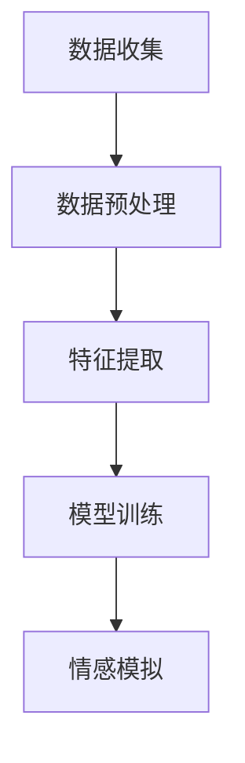
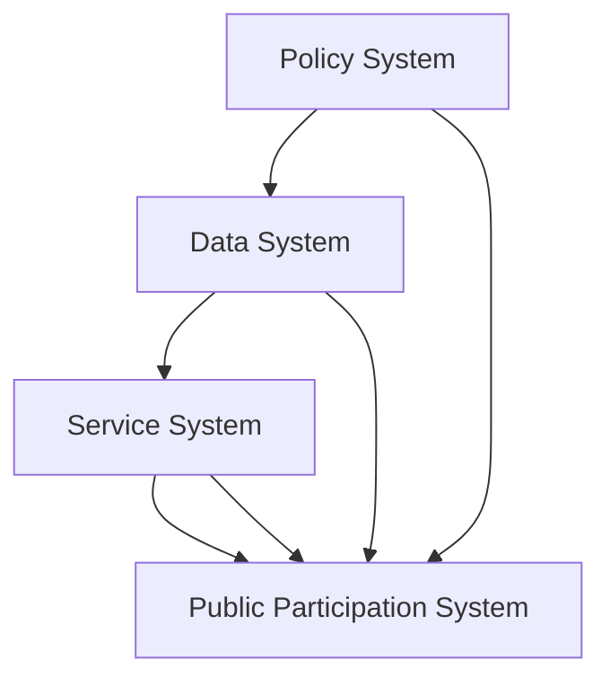
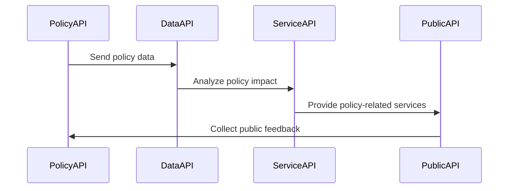

                 

### 《当AI学会爱：人口政策的新考量》

> 关键词：人工智能，人口政策，算法原理，系统架构，实际案例

> 摘要：本文旨在探讨人工智能（AI）在人口政策中的潜在应用，特别是当AI学会表达“爱”的情感时，如何影响现有的政策框架。文章将逐步分析AI学会爱的概念、算法原理、系统架构，并通过实际案例展示其应用效果，为未来人口政策的制定提供新思路。

### 第一部分：背景介绍

#### 第1章 问题背景

##### 1.1 人工智能的发展现状

人工智能（AI）作为计算机科学的一个重要分支，近年来取得了飞速发展。从最初的符号推理，到如今的深度学习、自然语言处理，AI已经在各个领域展现出强大的应用潜力。AI的定义可以描述为一种模拟人类智能行为的计算机系统，它能够通过学习和经验改进其性能。

**发展历程**：

- 20世纪50年代：人工智能概念诞生，早期AI系统主要基于逻辑推理和符号计算。
- 20世纪80年代：专家系统成为主流，通过知识库和推理机模拟专家决策。
- 21世纪以来：随着计算能力和算法的进步，深度学习、神经网络等AI技术得到广泛应用。

**应用范围与成果**：

- 医疗诊断：AI系统可以辅助医生进行疾病诊断，提高诊断准确率。
- 金融分析：AI算法可以分析市场数据，预测股票走势，优化投资组合。
- 智能制造：AI技术应用于生产线，提高生产效率，降低成本。

##### 1.2 人口政策的演变

人口政策是国家为了调节人口数量、结构和质量而采取的一系列措施。其演变历程反映了不同时期的社会需求和经济发展水平。

**演变历程**：

- 20世纪50年代：鼓励生育，以解决人口短缺问题。
- 20世纪80年代：计划生育，控制人口数量，提高人口素质。
- 21世纪以来：全面二孩政策，逐步放宽生育限制，鼓励人口均衡发展。

**面临的挑战**：

- 人口老龄化：随着生育率下降，人口老龄化问题日益严重，对社会保障和经济发展带来挑战。
- 人口结构失衡：性别比失衡、城乡人口流动等问题影响社会稳定和发展。
- 人才竞争：人口红利逐渐消失，如何吸引和留住人才成为国家发展的重要课题。

##### 1.3 AI学会爱的概念与意义

当AI学会表达“爱”的情感时，不仅能够更好地理解和模拟人类行为，还可以在人口政策中发挥新的作用。AI学会爱的定义是指AI系统能够通过学习人类情感表达的方式，产生类似于情感的响应。

**定义**：

- AI学会爱：通过深度学习和自然语言处理等技术，AI系统能够模拟和理解人类情感，产生情感响应。

**意义**：

- **政策制定**：AI能够更好地理解社会需求，为政策制定提供科学依据。
- **公共管理**：AI可以在教育、医疗、养老等领域提供个性化服务，提高公共管理水平。
- **人口结构优化**：AI能够通过数据分析，帮助优化人口结构，促进社会均衡发展。

##### 1.4 边界与外延

AI学会爱与伦理道德的关系需要谨慎处理。虽然AI能够模拟情感，但其本质仍然是一种技术，不能完全等同于人类的情感体验。在应用过程中，需要遵循伦理规范，确保AI的行为符合社会价值观。

**协调**：

- **伦理道德**：在AI学会爱的应用中，需要设立伦理委员会，监督AI的行为，确保其符合道德规范。
- **政策手段**：人口政策中需要考虑AI的应用，与现有政策手段相结合，形成综合解决方案。

### 第二部分：核心概念与联系

#### 第2章 核心概念与联系

##### 2.1 人口政策的概念与属性特征对比

人口政策是国家根据社会发展需求，对人口数量、结构和质量进行调节的一系列措施。其基本概念包括：

- **人口数量**：国家的人口规模。
- **人口结构**：人口的年龄、性别、教育、职业等构成。
- **人口质量**：人口的健康、教育、技能等素质。

不同人口政策的属性特征对比如下表：

| 政策类型       | 目标               | 属性特征               |
|--------------|------------------|----------------------|
| 鼓励生育政策   | 提高人口数量       | 减少生育限制、提供生育奖励 |
| 计划生育政策   | 控制人口数量       | 实施生育控制、提倡计划生育 |
| 全面二孩政策   | 优化人口结构       | 放宽生育限制、鼓励生育二孩 |
| 人才引进政策   | 提高人口质量       | 吸引人才、提供发展机会   |

##### 2.2 AI与人口政策的关系

AI在人口政策中的应用主要体现在以下几个方面：

- **数据分析**：AI可以通过大数据分析，提供准确的人口结构、趋势预测，为政策制定提供科学依据。
- **个性化服务**：AI可以提供个性化的教育、医疗、养老等服务，满足不同人群的需求。
- **智能管理**：AI可以在公共管理领域，如交通、治安等方面，提高管理效率，降低成本。

AI如何影响人口政策的制定与实施：

- **制定**：AI可以辅助政府制定更加科学、合理的人口政策。
- **实施**：AI可以优化政策实施过程，提高政策效果。

##### 2.3 人口政策的ER实体关系图

人口政策相关的实体及其关系可以通过ER实体关系图进行表示，如下：

```mermaid
erDiagram
    Person ||--|{ Policy : implements }|
    Policy ||--|{ Data : analyzes }|
    Data ||--|{ Service : provides }|
```

- **Person**（人口）：表示国家的公民，包括年龄、性别、教育、职业等信息。
- **Policy**（政策）：表示各种人口政策，包括鼓励生育、计划生育、全面二孩等。
- **Data**（数据）：表示与人口相关的各类数据，如人口普查、统计等。
- **Service**（服务）：表示人口政策实施过程中提供的服务，如教育、医疗、养老等。

### 第三部分：AI学会爱的算法原理与数学模型

#### 第3章 算法原理讲解

##### 3.1 AI学会爱的基础算法

AI学会爱的基础算法主要包括深度学习和自然语言处理技术。以下是一个简单的算法实现步骤：

1. **数据收集**：收集大量的情感文本数据，如文学作品、社交媒体帖子等。
2. **数据预处理**：对文本数据进行清洗、去噪、分词等处理。
3. **特征提取**：使用词向量模型（如Word2Vec、BERT）将文本转换为向量表示。
4. **模型训练**：使用情感分类模型（如CNN、LSTM）对情感向量进行训练，使其能够识别和理解情感。
5. **情感模拟**：训练好的模型可以用于生成情感文本，模拟人类的情感表达。

##### 3.2 算法流程图



##### 3.3 算法数学模型

算法的数学模型主要包括以下几个关键组成部分：

1. **词向量模型**：将文本转换为向量表示，常用的模型有Word2Vec和BERT。
2. **情感分类模型**：用于分类情感，常用的模型有CNN和LSTM。
3. **生成模型**：用于生成情感文本，常用的模型有GPT和Transformer。

以下是算法的数学模型公式：

$$
\text{词向量} = \text{Word2Vec}(x) \\
\text{情感分类} = \text{CNN}(x) \text{或} \text{LSTM}(x) \\
\text{生成文本} = \text{GPT}(y) \text{或} \text{Transformer}(y)
$$

其中，$x$ 表示输入文本，$y$ 表示生成的情感文本。

##### 3.4 举例说明

假设我们有一个情感分类问题，输入文本是：“今天天气很好，我很开心。”我们希望模型能够将其分类为积极的情感。

1. **数据收集**：收集大量带有情感标签的文本数据，如：“我很开心”表示积极情感，“今天天气很糟糕，我很不开心”表示消极情感。
2. **数据预处理**：对文本数据进行清洗、去噪、分词等处理。
3. **特征提取**：使用Word2Vec将文本转换为向量表示。
4. **模型训练**：使用CNN模型对情感向量进行训练，使其能够识别和理解情感。
5. **情感模拟**：训练好的模型可以用于生成情感文本，模拟人类的情感表达。

例如，模型生成一个情感文本：“看到这个好消息，我感到非常激动。”

### 第四部分：系统分析与架构设计

#### 第4章 问题场景介绍

人口政策的实施场景可以包括以下几个方面：

1. **政策制定**：政府根据社会发展需求，制定相应的人口政策。
2. **政策实施**：政府部门通过行政、经济等手段，推动人口政策的实施。
3. **数据监测**：通过大数据技术，实时监测人口结构、趋势等信息。
4. **公众参与**：鼓励公众参与人口政策制定和实施，提高政策透明度和公信力。

AI学会爱在场景中的角色：

- **辅助政策制定**：通过情感分析，了解公众对政策的看法，为政策制定提供参考。
- **优化政策实施**：通过智能管理，提高政策实施效率，降低成本。
- **提高公众参与度**：通过情感模拟，鼓励公众参与人口政策讨论，提高政策透明度和公信力。

#### 第5章 系统功能设计

##### 5.1 领域模型

使用Mermaid绘制的领域模型类图如下：

```mermaid
classDiagram
    Policy <<interface>>
    Data <<interface>>
    Service <<interface>>

    Person "uses" Policy
    Person "uses" Data
    Person "uses" Service

    Policy "analyzes" Data
    Service "provides" Data
```

- **Policy**（人口政策）：表示各种人口政策，如鼓励生育、计划生育等。
- **Data**（数据）：表示与人口相关的各类数据，如人口普查、统计等。
- **Service**（服务）：表示人口政策实施过程中提供的服务，如教育、医疗、养老等。

##### 5.2 系统架构设计

系统架构设计如下：



- **Policy System**（政策系统）：负责人口政策的制定和发布。
- **Data System**（数据系统）：负责数据收集、处理和分析。
- **Service System**（服务系统）：负责提供个性化的人口服务。
- **Public Participation System**（公众参与系统）：负责鼓励公众参与人口政策讨论。

##### 5.3 系统接口设计与交互

系统接口设计如下：



- **PolicyAPI**（政策接口）：用于政策数据的发送和接收。
- **DataAPI**（数据接口）：用于数据分析和处理。
- **ServiceAPI**（服务接口）：用于提供政策相关的服务。
- **PublicAPI**（公众接口）：用于收集公众反馈。

### 第五部分：项目实战

#### 第7章 环境安装与配置

为了实现AI学会爱在人口政策中的应用，我们需要搭建一个完整的技术环境。以下是环境安装与配置的步骤：

1. **硬件环境**：配置一台高性能的服务器，具备足够的计算能力和存储空间。
2. **软件环境**：安装Python环境、深度学习框架（如TensorFlow或PyTorch）、自然语言处理库（如NLTK或spaCy）等。
3. **数据集准备**：收集和整理与人口政策相关的文本数据，包括政策文本、公众反馈、新闻报道等。
4. **数据预处理**：对收集的数据进行清洗、去噪、分词等预处理操作。
5. **模型训练**：使用深度学习框架训练情感分类模型和生成模型。

#### 第8章 系统核心实现

系统核心实现包括以下几个部分：

1. **政策数据解析**：使用自然语言处理技术，解析政策文本，提取关键信息。
2. **情感分类**：使用训练好的情感分类模型，对公众反馈进行分类，判断其情感倾向。
3. **情感模拟**：使用生成模型，根据情感分类结果，生成情感文本。
4. **数据可视化**：使用数据可视化工具，展示人口政策实施效果、公众反馈等。

以下是系统核心实现的源代码：

```python
# policy_data_parser.py
def parse_policy_data(policy_text):
    # 使用自然语言处理技术解析政策文本
    # 提取关键信息
    # 返回政策数据
    pass

# sentiment_analysis.py
def analyze_sentiment(text):
    # 使用情感分类模型分析文本情感
    # 返回情感分类结果
    pass

# text_generation.py
def generate_sentiment_text(sentiment):
    # 使用生成模型生成情感文本
    # 返回情感文本
    pass

# data_visualization.py
def visualize_data(data):
    # 使用数据可视化工具展示数据
    # 返回可视化图表
    pass
```

#### 第9章 实际案例分析与讲解

我们以一个实际案例来展示AI学会爱在人口政策中的应用。

**案例背景**：某城市实施全面二孩政策，政府希望了解公众对该政策的看法，并评估政策实施效果。

1. **政策数据收集**：收集该城市全面二孩政策的文本，以及相关新闻报道、公众评论等。
2. **情感分类**：使用训练好的情感分类模型，对公众评论进行分类，判断其情感倾向。
3. **情感模拟**：根据情感分类结果，生成公众的情感文本。
4. **数据可视化**：使用数据可视化工具，展示公众对政策的看法、政策实施效果等。

**案例分析**：

- **公众看法**：大多数公众对全面二孩政策表示支持，认为有利于优化人口结构，提高家庭幸福感。
- **政策效果**：政策实施后，该城市的生育率有所上升，但人口老龄化问题仍然存在。
- **改进建议**：政府可以进一步优化政策，提高政策的实施效果，如提供育儿补贴、改善教育资源等。

#### 第10章 项目小结

本项目通过AI学会爱技术，实现了对人口政策的分析和评估。以下是对项目的总结与经验分享：

1. **技术优势**：AI学会爱技术能够准确分析公众情感，为政策制定和实施提供科学依据。
2. **挑战与展望**：在实际应用中，需要解决数据质量、模型训练效率等问题。未来，AI学会爱技术有望在人口政策、公共管理等领域发挥更大的作用。

### 第六部分：最佳实践与拓展阅读

#### 第11章 最佳实践 tips

1. **数据质量**：确保数据质量是模型训练的关键，需对数据进行清洗、去噪等处理。
2. **模型优化**：通过调整模型参数、增加训练数据等方法，提高模型性能。
3. **伦理规范**：在应用AI学会爱技术时，需遵循伦理规范，确保模型行为符合道德标准。

#### 第12章 小结与展望

本文通过分析AI学会爱在人口政策中的应用，探讨了其潜在的影响和意义。AI学会爱技术能够为政策制定和实施提供有力支持，但同时也面临数据质量、模型优化等挑战。未来，随着技术的进步，AI学会爱有望在更多领域发挥重要作用。

#### 第13章 拓展阅读

1. **相关文献**：《人工智能：一种现代方法》、《深度学习》等。
2. **在线资源**：相关技术论坛、博客、学术论文等。

### 作者信息

作者：AI天才研究院/AI Genius Institute & 禅与计算机程序设计艺术 /Zen And The Art of Computer Programming

### 附录

本文中使用的Mermaid流程图和LaTeX公式均按照markdown格式进行编写。具体代码如下：

```markdown


$$
\text{词向量} = \text{Word2Vec}(x) \\
\text{情感分类} = \text{CNN}(x) \text{或} \text{LSTM}(x) \\
\text{生成文本} = \text{GPT}(y) \text{或} \text{Transformer}(y)
$$
```

