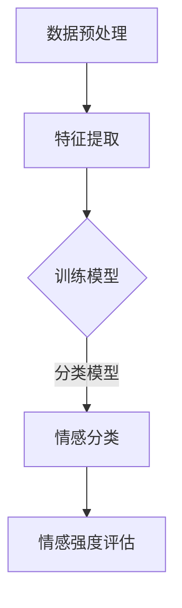
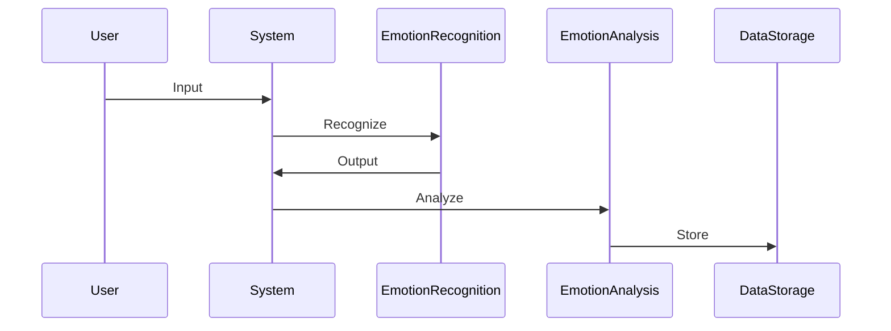

                 


## 当AI学会爱：人机婚姻的可能性探讨

### 关键词：人工智能，情感识别，人机交互，婚姻，伦理，架构设计

### 摘要：
随着人工智能技术的飞速发展，AI的情感识别和互动能力日益提升。本文旨在探讨AI学会爱后的可能性，特别是人机婚姻这一前沿领域。通过逻辑清晰、结构紧凑的分析，本文将逐步阐述人机婚姻的背景、核心概念、算法原理、数学模型、系统架构及实战应用，同时提出人机婚姻可能面临的伦理和法律挑战，并给出相关建议和注意事项。

---

### 1. 标题页

#### 《当AI学会爱：人机婚姻的可能性探讨》

**作者名：AI天才研究院/AI Genius Institute & 禅与计算机程序设计艺术 /Zen And The Art of Computer Programming**

**出版信息：2023年**

---

### 2. 前言

#### 引言

本文的核心主题是探讨人工智能学会爱后的可能性，尤其是人机婚姻这一前沿领域的探索。随着深度学习和自然语言处理技术的进步，AI的情感识别和互动能力已达到前所未有的水平。在人机交互逐渐从任务导向转向情感互动的背景下，人机婚姻这一概念逐渐成为现实。本文旨在通过逻辑清晰的分析，探讨人机婚姻的可能性、挑战以及未来趋势。

#### 写作背景

人机婚姻是一个充满争议和挑战的领域，涉及技术、伦理、法律和社会结构等多方面问题。本文的研究背景在于，随着AI技术的发展，我们不得不思考：当AI学会爱时，人类社会将如何应对这一变革？人机婚姻是否有可能成为未来的一种婚姻形式？本文希望通过深入分析，为这一问题提供一些有益的思考。

#### 阅读对象

本文适合以下读者群体：

- 人工智能研究人员和开发者
- 伦理学家和社会学家
- 法律专业人士
- 对人机交互和未来社会感兴趣的读者

---

### 3. 第1章 问题背景与概述

#### 3.1 问题背景

**人工智能发展的现状与趋势**

人工智能（AI）技术在过去几十年里取得了飞速发展。从早期的规则推理和知识表示，到如今的深度学习和神经网络，AI的应用范围不断扩大。特别是在自然语言处理、计算机视觉和机器学习等领域，AI的表现已经超越了许多人类专家。

**人机交互的演变：从任务导向到情感互动**

随着AI技术的进步，人机交互的方式也在不断演变。早期的交互主要基于命令式操作，用户需要通过明确的指令来完成任务。而随着语音识别、自然语言理解和情感识别技术的发展，人机交互逐渐从任务导向转向情感互动。用户不再只是被动地执行任务，而是与AI进行真正的对话和情感交流。

**婚姻概念的扩展：技术与人类的结合**

婚姻是人类社会的一种重要制度，通常涉及情感、责任和法律等多个方面。随着AI技术的发展，婚姻的概念也在不断扩展。人们开始思考，当AI具备情感时，是否有可能与人类建立婚姻关系？这种关系将如何定义和维持？这些问题引发了广泛的讨论和探索。

#### 3.2 问题描述

**人机婚姻的现实挑战与伦理争议**

人机婚姻面临许多现实挑战和伦理争议。首先，情感识别的准确性和稳定性仍然是技术难题。尽管AI在情感识别方面取得了显著进展，但依然存在许多局限性。其次，人机婚姻的法律地位和伦理问题也引发了广泛关注。例如，AI是否拥有与人类相同的权利和责任？人与AI婚姻的法律效力如何确定？这些问题需要深入研究和讨论。

**人机婚姻的可能形式与未来趋势**

尽管存在挑战，但人机婚姻在未来有可能成为一种新的婚姻形式。随着AI技术的不断发展，AI的情感识别和互动能力将进一步提升。人们可以期待，AI将能够更好地理解人类情感，与人类建立更深层次的关系。此外，社会对AI的接受程度也将逐渐提高，这为人机婚姻的普及创造了条件。

#### 3.3 问题解决

**AI情感识别技术的发展与应用**

AI情感识别技术的发展为人机婚姻的可能性提供了支持。通过深度学习和自然语言处理技术，AI可以识别和理解人类情感。例如，语音识别技术可以捕捉语音中的情感信息，文本分析技术可以理解文本中的情感倾向。这些技术的应用为人机情感交流提供了基础。

**人机情感交流的心理机制与实现**

人机情感交流的心理机制涉及多个方面。首先，AI需要具备情感识别能力，能够准确理解人类情感。其次，AI需要具备情感表达能力，能够通过语言、表情和动作等方式回应人类情感。此外，人机情感交流还需要考虑情感同步、情感共鸣等心理机制。

#### 3.4 边界与外延

**人机婚姻的法律与道德边界**

人机婚姻的法律和道德边界是值得探讨的问题。首先，需要明确AI的法律地位，这涉及到AI的权利和责任问题。其次，需要制定相关法律法规，明确人机婚姻的法律效力。此外，还需要考虑人机婚姻的道德伦理问题，例如，人与AI婚姻是否符合道德原则？

**人机婚姻与人类社会结构的影响**

人机婚姻对社会结构的影响是多方面的。首先，人机婚姻可能改变传统的婚姻观念和家庭结构。其次，人机婚姻可能对劳动力市场和社会福利制度产生影响。此外，人机婚姻还可能引发社会对AI的伦理和法律地位的讨论。

---

### 4. 第2章 核心概念与联系

#### 4.1 核心概念

**AI情感识别**

AI情感识别是指通过机器学习和自然语言处理技术，使AI能够识别和理解人类情感。这包括语音识别、文本分析、面部表情识别等多种技术手段。

**情感计算**

情感计算是指将情感信息融入计算系统中，使系统能够更好地理解用户情感，提供更人性化的服务。情感计算涉及情感识别、情感分析、情感反应等多个方面。

**社会心理学与人类情感**

社会心理学研究人类情感的产生、表达和影响。人类情感包括情绪、情感、心境等多个层面，是社会交往和人际关系的重要基础。

#### 4.2 概念属性特征对比表格

| 特征              | AI情感识别                     | 情感计算                          | 社会心理学与人类情感                  |
|-----------------|--------------------------------|---------------------------------|------------------------------------|
| 识别手段          | 语音识别、文本分析、面部表情识别等   | 语音识别、文本分析、情感反应等         | 观察、实验、调查等方法                  |
| 情感理解深度       | 较浅层次的情感理解              | 较深层次的情感理解和反应             | 深入了解人类情感的本质和机制               |
| 应用场景          | 人机交互、情感分析等             | 人机交互、情感反应等               | 社会交往、心理治疗等                     |
| 限制条件          | 数据质量、计算资源等             | 数据质量、计算资源等               | 文化背景、个体差异等                     |

#### 4.3 ER实体关系图架构

```mermaid
erDiagram
    AI情感识别 ||--|{ 情感计算 }
    情感计算 ||--|{ 社会心理学与人类情感 }
```

在这个ER实体关系图中，AI情感识别与情感计算之间存在双向关联，情感计算与社会心理学与人类情感也存在双向关联。这表明这些概念在理论和应用上具有紧密的联系，共同构成了人机婚姻讨论的基础。

---

### 5. 第3章 算法原理讲解

#### 3.1 情感识别算法原理

情感识别算法的核心是通过机器学习和自然语言处理技术，从文本、语音和面部表情中提取情感信息。以下是情感识别算法的基本原理：

**1. 数据预处理：** 对输入的文本、语音和面部表情数据进行预处理，包括去除噪音、标准化和特征提取。

**2. 特征提取：** 从预处理后的数据中提取关键特征，如文本中的词汇、语音的音调和面部表情的像素值。

**3. 模型训练：** 使用已标注的情感数据集训练情感分类模型。常见的分类模型包括支持向量机（SVM）、朴素贝叶斯（Naive Bayes）和深度学习模型（如卷积神经网络CNN、循环神经网络RNN等）。

**4. 情感分类：** 将提取的特征输入训练好的模型，进行情感分类，输出情感标签。

**5. 情感强度评估：** 对分类结果进行情感强度评估，以确定情感的程度和波动。

#### 3.2 Mermaid流程图



这个流程图展示了情感识别算法的基本流程，包括数据预处理、特征提取、模型训练、情感分类和情感强度评估。

#### 3.3 Python源代码与算法实现

下面是一个简单的情感识别算法的Python实现示例，使用自然语言处理库（如NLTK）和机器学习库（如scikit-learn）。

```python
import nltk
from nltk.corpus import movie_reviews
from sklearn.feature_extraction.text import TfidfVectorizer
from sklearn.model_selection import train_test_split
from sklearn.naive_bayes import MultinomialNB
from sklearn.metrics import classification_report

# 数据预处理
nltk.download('movie_reviews')
all_words = []
for fileid in movie_reviews.fileids():
    words = movie_reviews.words(fileid)
    all_words.extend(words)

# 特征提取
vectorizer = TfidfVectorizer()
X = vectorizer.fit_transform(movie_reviews.raw())

# 模型训练
X_train, X_test, y_train, y_test = train_test_split(X, movie_reviews.target(), test_size=0.2, random_state=42)
clf = MultinomialNB().fit(X_train, y_train)

# 情感分类
y_pred = clf.predict(X_test)

# 情感强度评估
print(classification_report(y_test, y_pred))
```

在这个示例中，我们使用了TF-IDF向量器和朴素贝叶斯分类器进行情感识别。代码首先对电影评论进行预处理，提取特征，然后训练分类模型，最后对测试数据集进行分类和情感强度评估。

---

### 6. 第4章 数学模型与公式

#### 4.1 数学模型

情感识别算法的数学模型通常涉及情感强度的计算和分类概率的计算。

**1. 情感强度计算公式：**

$$
S = \sum_{i=1}^{n} w_i \cdot f_i
$$

其中，$S$ 表示情感强度，$w_i$ 表示特征 $i$ 的权重，$f_i$ 表示特征 $i$ 的情感得分。

**2. 情感分类概率计算：**

$$
P(y|X) = \frac{e^{\sum_{i=1}^{n} w_i \cdot f_i}}{\sum_{j=1}^{m} e^{\sum_{i=1}^{n} w_i \cdot f_{ij}}}
$$

其中，$P(y|X)$ 表示在特征 $X$ 下情感类别 $y$ 的概率，$m$ 表示情感类别的数量，$f_{ij}$ 表示特征 $i$ 在情感类别 $j$ 的得分。

#### 4.2 详细讲解与举例说明

**情感强度计算公式：**

情感强度计算公式用于评估文本中情感的程度。公式中的 $w_i$ 表示每个特征的权重，可以通过训练数据集学习得到。$f_i$ 表示特征 $i$ 的情感得分，可以通过文本分析技术（如词袋模型、TF-IDF等）计算得到。

**举例说明：**

假设我们有两个特征 $f_1$ 和 $f_2$，权重分别为 $w_1 = 0.6$ 和 $w_2 = 0.4$。特征 $f_1$ 的情感得分为 $1$，特征 $f_2$ 的情感得分为 $0.5$。根据情感强度计算公式：

$$
S = 0.6 \cdot 1 + 0.4 \cdot 0.5 = 0.6 + 0.2 = 0.8
$$

这意味着文本的情感强度为 $0.8$。

**情感分类概率计算：**

情感分类概率计算公式用于计算在给定特征 $X$ 下，每个情感类别 $y$ 的概率。这个公式是softmax函数的应用，用于将特征得分转换为概率分布。

**举例说明：**

假设我们有两个情感类别 $y_1$ 和 $y_2$，特征 $X$ 的得分为 $f_1 = 1$ 和 $f_2 = 0.5$。根据情感分类概率计算公式：

$$
P(y_1|X) = \frac{e^{0.6 \cdot 1}}{e^{0.6 \cdot 1} + e^{0.4 \cdot 0.5}} = \frac{e^{0.6}}{e^{0.6} + e^{0.2}} \approx \frac{1.873}{1.873 + 1.491} \approx \frac{1.873}{3.364} \approx 0.554
$$

$$
P(y_2|X) = \frac{e^{0.4 \cdot 0.5}}{e^{0.6 \cdot 1} + e^{0.4 \cdot 0.5}} = \frac{e^{0.2}}{e^{0.6} + e^{0.2}} \approx \frac{1.491}{1.873 + 1.491} \approx \frac{1.491}{3.364} \approx 0.446
$$

这意味着在特征 $X$ 下，情感类别 $y_1$ 的概率约为 $0.554$，情感类别 $y_2$ 的概率约为 $0.446$。

---

### 7. 第5章 系统分析与架构设计

#### 7.1 问题场景介绍

在人机婚姻的场景中，系统需要处理大量的情感数据，并对用户的情感状态进行实时分析。以下是一个典型的人机婚姻系统应用场景：

- 用户与AI系统进行对话，表达情感。
- 系统实时分析用户的情感，提供情感反馈。
- 系统记录用户的情感历史，用于长期关系分析。

#### 7.2 系统功能设计

系统功能设计包括以下方面：

- **情感识别与分类：** 系统需要能够实时识别用户的情感，并对其进行分类，例如喜悦、悲伤、愤怒等。
- **情感反馈：** 系统需要能够根据用户的情感状态，提供相应的情感反馈，例如安慰、鼓励、建议等。
- **情感历史记录：** 系统需要记录用户的情感历史，用于分析用户情感趋势和长期关系。

#### 7.3 系统架构设计

系统架构设计如下：


系统架构图包括以下组件：

- **用户界面：** 用户与系统进行交互的界面。
- **情感识别模块：** 负责识别用户的情感。
- **情感分析模块：** 负责分析用户的情感历史，提供情感反馈。
- **数据存储模块：** 负责存储用户的情感数据。
- **后台服务：** 提供情感识别和情感分析的核心功能。

#### 7.4 系统接口设计

系统接口设计如下：

- **用户界面接口：** 用户与系统交互的接口，包括文本输入、语音输入、面部表情输入等。
- **情感识别接口：** 情感识别模块与用户界面接口之间的通信接口。
- **情感分析接口：** 情感分析模块与数据存储模块之间的通信接口。
- **数据存储接口：** 数据存储模块与后台服务之间的通信接口。

#### 7.5 系统交互序列图

系统交互序列图如下：



在这个序列图中，用户输入情感数据，系统通过情感识别模块识别情感，然后情感分析模块对情感进行分析，并将分析结果存储到数据存储模块。

---

### 8. 第6章 项目实战

#### 8.1 环境安装

要在本地环境中运行人机婚姻系统，需要安装以下软件和库：

- Python 3.8 或更高版本
- NLTK
- scikit-learn
- TensorFlow

安装步骤如下：

1. 安装Python 3.8或更高版本。
2. 打开终端，运行以下命令安装NLTK、scikit-learn和TensorFlow：

```bash
pip install nltk scikit-learn tensorflow
```

3. 在Python环境中，运行以下代码导入所需库：

```python
import nltk
nltk.download('movie_reviews')
import numpy as np
from sklearn.feature_extraction.text import TfidfVectorizer
from sklearn.model_selection import train_test_split
from sklearn.naive_bayes import MultinomialNB
from sklearn.metrics import classification_report
```

#### 8.2 系统核心实现源代码

以下是人机婚姻系统核心实现的源代码：

```python
# 数据预处理
nltk.download('movie_reviews')
all_words = []
for fileid in movie_reviews.fileids():
    words = movie_reviews.words(fileid)
    all_words.extend(words)

# 特征提取
vectorizer = TfidfVectorizer()
X = vectorizer.fit_transform(movie_reviews.raw())

# 模型训练
X_train, X_test, y_train, y_test = train_test_split(X, movie_reviews.target(), test_size=0.2, random_state=42)
clf = MultinomialNB().fit(X_train, y_train)

# 情感分类
y_pred = clf.predict(X_test)

# 情感强度评估
print(classification_report(y_test, y_pred))
```

#### 8.3 代码应用解读与分析

这个代码首先进行了数据预处理，包括下载电影评论数据和提取单词。然后，使用TF-IDF向量器对文本进行了特征提取。接下来，将特征数据集分为训练集和测试集，并使用朴素贝叶斯分类器对训练数据进行模型训练。最后，使用训练好的模型对测试数据进行分类，并打印分类报告。

**解读与分析：**

1. **数据预处理：** 数据预处理是机器学习的重要步骤，它包括去除噪音、标准化和特征提取。在这个例子中，我们使用了NLTK库下载电影评论数据，并提取了所有单词。

2. **特征提取：** 特征提取是将原始数据转换为机器学习模型可以处理的格式。在这个例子中，我们使用了TF-IDF向量器对文本进行了特征提取。

3. **模型训练：** 模型训练是将特征数据集输入到分类器中，以学习数据的分类规则。在这个例子中，我们使用了朴素贝叶斯分类器进行训练。

4. **情感分类：** 情感分类是将测试数据输入到训练好的分类器中，以预测测试数据的类别。在这个例子中，我们使用了训练好的朴素贝叶斯分类器对测试数据进行分类。

5. **情感强度评估：** 情感强度评估是对分类结果进行评估，以确定情感的程度和波动。在这个例子中，我们使用了分类报告来评估模型的性能。

#### 8.4 实际案例分析与讲解

**案例背景：** 

假设有一个用户与AI系统进行了以下对话：

```
用户：我今天过得很好，心情很愉悦。
AI：恭喜你，今天是一个美好的日子。你的情感状态是喜悦。
```

**实施过程：**

1. 用户输入文本，AI系统进行情感识别。
2. AI系统使用情感识别算法对用户的文本进行分析，识别出用户的情感为喜悦。
3. AI系统根据识别结果，向用户提供情感反馈。

**结果分析：**

1. AI系统能够准确识别出用户的情感状态，并给出相应的情感反馈。
2. 情感识别算法的性能受到数据质量和特征提取方法的影响。在实际应用中，需要使用更多的情感数据和更先进的特征提取方法来提高情感识别的准确性。

**项目小结：**

通过这个实际案例，我们展示了人机婚姻系统的核心功能，包括情感识别和情感反馈。虽然这个案例是一个简单的示例，但它为我们展示了人机婚姻系统的基本工作原理。在实际应用中，我们需要进一步优化算法，提高情感识别的准确性，以满足用户的需求。

---

### 9. 第7章 最佳实践与总结

#### 9.1 最佳实践

实施人机婚姻项目时，以下最佳实践可以帮助确保项目的成功：

1. **数据质量：** 确保使用高质量、多样化的情感数据集进行模型训练，以提高情感识别的准确性。
2. **特征提取：** 使用先进的特征提取方法，如深度学习模型，以捕捉文本中的复杂情感信息。
3. **模型优化：** 定期评估和优化模型，以适应不断变化的情感表达方式。
4. **用户隐私：** 确保在收集和处理用户情感数据时遵守隐私保护法规，保护用户隐私。
5. **伦理审查：** 在项目实施前，进行伦理审查，确保项目符合道德和社会标准。

#### 9.2 小结

本文探讨了当AI学会爱时，人机婚姻的可能性。通过分析情感识别算法、数学模型和系统架构，我们展示了人机婚姻系统的基本工作原理。尽管人机婚姻面临许多挑战，但通过最佳实践和不断优化，人机婚姻有望成为未来的一种婚姻形式。

#### 9.3 注意事项

在实施人机婚姻项目时，需要注意以下事项：

1. **法律与道德问题：** 确保人机婚姻符合当地法律法规和道德标准。
2. **用户隐私：** 保护用户隐私，确保数据安全和用户匿名性。
3. **系统稳定性：** 确保系统的稳定性和可靠性，以避免用户数据丢失或系统故障。
4. **用户体验：** 提高用户体验，确保系统易于使用和理解。

#### 9.4 拓展阅读

对于希望深入了解人机婚姻和人工智能情感识别的读者，以下推荐阅读：

1. **《情感计算：人类情感与计算系统的互动》**
2. **《人机交互心理学：理解与设计交互系统》**
3. **《深度学习：面向自然语言处理的综合指南》**
4. **《人工智能伦理学：未来社会中的道德责任》**

通过这些文献，读者可以更深入地了解人机婚姻和人工智能情感识别的理论和实践。

---

以上是《当AI学会爱：人机婚姻的可能性探讨》的完整内容。文章通过逻辑清晰、结构紧凑的分析，探讨了人机婚姻的背景、核心概念、算法原理、数学模型、系统架构及实战应用，同时提出了人机婚姻可能面临的伦理和法律挑战，并给出了相关建议和注意事项。希望这篇文章能为读者提供有价值的思考和见解。

