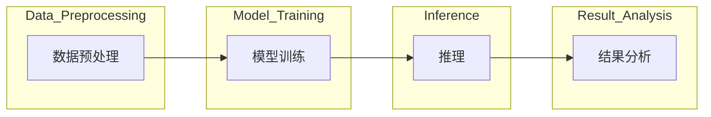
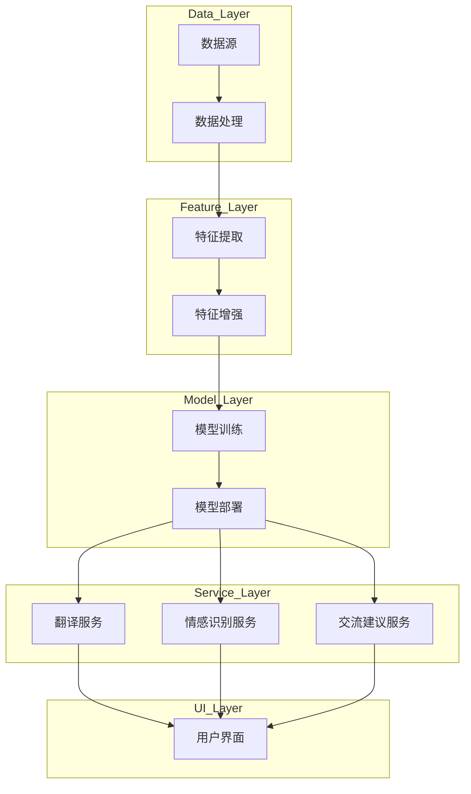
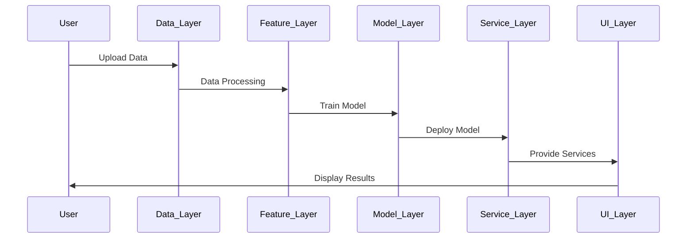

                 


### 《当AI学会爱：跨文化交流的新维度》

#### 关键词：
- 人工智能
- 跨文化交流
- 爱与情感
- 技术应用
- 文化差异

#### 摘要：
随着人工智能技术的发展，AI不仅在学习、推理和决策方面展现出强大能力，甚至在模拟和体验情感方面也取得了显著进展。本文将探讨AI如何学会爱，以及这一能力如何为跨文化交流带来新的维度。我们将从背景介绍、核心概念、算法原理、系统分析与架构设计、项目实战以及最佳实践等角度，详细分析AI在跨文化交流中的应用，展示其潜力和局限性。

### 目录大纲设计思路与结构

本文采用结构化的设计思路，分为五个主要部分，每个部分围绕核心主题进行深入探讨。

#### 第一部分：背景介绍
在本部分，我们将首先介绍人工智能技术发展的现状与挑战，以及跨文化交流的需求与障碍。接着，我们会深入探讨AI学会爱的定义与内涵，解释跨文化交流的新维度如何体现。通过案例展示，我们将阐述如何利用人工智能技术解决跨文化交流问题，并探讨AI在跨文化交流中的适用范围和局限性。

#### 第二部分：核心概念与联系
这一部分将详细解析跨文化交流的定义、要素和类型，以及人工智能的基础知识、发展历程和应用领域。我们将通过对比表格和ER实体关系图架构，明确跨文化交流与人工智能之间的联系，帮助读者构建全面的理解。

#### 第三部分：算法原理讲解
我们将介绍人工智能算法的基本原理，通过mermaid流程图展示算法流程，并使用Python源代码和数学模型详细解释算法的工作机制。举例说明将使读者更好地理解AI在跨文化交流中的应用效果。

#### 第四部分：系统分析与架构设计
在这一部分，我们将介绍一个跨文化交流场景的应用案例，设计系统功能、架构和接口。通过mermaid序列图，我们将展示系统的交互流程，使读者对实际应用有更直观的认识。

#### 第五部分：项目实战
我们将介绍项目的环境安装、核心实现源代码，并详细解读代码的应用。通过实际案例分析，我们将剖析项目实施过程中的关键环节，并提供项目小结。

### 目录大纲

```markdown
# 《当AI学会爱：跨文化交流的新维度》

## 第一部分：背景介绍

### 1.1 问题背景

#### 1.1.1 人工智能技术发展的现状与挑战

#### 1.1.2 跨文化交流的需求与障碍

### 1.2 问题描述

#### 1.2.1 AI学会爱的定义与内涵

#### 1.2.2 跨文化交流的新维度如何体现

### 1.3 问题解决

#### 1.3.1 利用人工智能技术解决跨文化交流问题

#### 1.3.2 通过案例展示AI在跨文化交流中的应用

### 1.4 边界与外延

#### 1.4.1 AI在跨文化交流中的适用范围

#### 1.4.2 AI在跨文化交流中的局限性

### 1.5 概念结构与核心要素组成

#### 1.5.1 跨文化交流的基本概念

#### 1.5.2 人工智能的核心技术

## 第二部分：核心概念与联系

### 2.1 核心概念原理

#### 2.1.1 跨文化交流的定义、要素和类型

#### 2.1.2 人工智能的基础知识、发展历程和应用领域

### 2.2 概念属性特征对比表格

#### 2.2.1 跨文化交流与人工智能的主要差异

#### 2.2.2 不同类型的跨文化交流方式对比

### 2.3 ER实体关系图架构

#### 2.3.1 跨文化交流的实体关系图

#### 2.3.2 人工智能在跨文化交流中的应用关系图

## 第三部分：算法原理讲解

### 3.1 算法mermaid流程图

#### 3.1.1 展示人工智能算法的基本流程

### 3.2 Python源代码

#### 3.2.1 代码实现，详细解释

### 3.3 数学模型和公式

#### 3.3.1 人工智能算法的数学基础

#### 3.3.2 对关键公式进行详细讲解

### 3.4 举例说明

#### 3.4.1 举例展示算法在实际应用中的效果

## 第四部分：系统分析与架构设计

### 4.1 问题场景介绍

### 4.2 系统功能设计

#### 4.2.1 领域模型mermaid类图

### 4.3 系统架构设计

#### 4.3.1 系统架构mermaid架构图

### 4.4 系统接口设计

### 4.5 系统交互mermaid序列图

## 第五部分：项目实战

### 5.1 环境安装

### 5.2 系统核心实现源代码

### 5.3 代码应用解读与分析

### 5.4 实际案例分析与详细讲解

### 5.5 项目小结

## 第六部分：最佳实践、小结、注意事项、拓展阅读

### 6.1 最佳实践 tips

### 6.2 小结

### 6.3 注意事项

### 6.4 拓展阅读
```

### 第一部分：背景介绍

#### 1.1 问题背景

人工智能（AI）作为当今科技领域的重要突破，已经在多个领域取得了显著成就。从自动驾驶汽车到智能语音助手，从医学诊断到金融服务，AI技术的广泛应用极大地改变了我们的生活方式。然而，随着AI技术的不断进步，我们也面临着一系列挑战。

首先，人工智能的发展速度非常快，更新迭代迅速，这给程序员和开发者带来了巨大的压力。他们需要不断学习新的编程语言、框架和工具，以保持竞争力。其次，AI技术在应用过程中也存在一些潜在风险，例如隐私泄露、算法偏见和道德伦理问题等。

与此同时，跨文化交流的需求与障碍也越来越突出。在全球化的背景下，不同国家和地区的人们需要更加紧密地合作与交流。然而，文化差异、语言障碍、沟通不畅等问题常常导致误解和冲突。如何有效地解决跨文化交流中的这些障碍，成为了一个亟待解决的问题。

AI技术的崛起，为我们提供了一种新的解决方案。通过模拟和体验情感，AI可以帮助人们更好地理解彼此，从而促进跨文化交流。例如，智能翻译系统可以通过理解上下文和文化背景，提供更准确、自然的翻译服务。虚拟助手可以模拟人类的情感反应，帮助人们建立信任和沟通。

然而，AI在跨文化交流中的应用也面临一些挑战。首先，AI系统需要大量高质量的数据进行训练，以理解和适应各种文化差异。其次，AI算法的透明度和可解释性也是一个重要问题。如果AI系统的决策过程缺乏透明度，人们可能会对其产生不信任感。

总的来说，人工智能技术为解决跨文化交流中的问题提供了新的可能性。然而，我们也需要正视其挑战，并积极探索有效的方法，使AI在跨文化交流中发挥更大的作用。

#### 1.2 问题描述

在探讨AI学会爱对跨文化交流的影响时，我们首先需要明确什么是“AI学会爱”。这里的“爱”不仅仅是指情感上的爱，而是指AI系统在处理跨文化交流问题时，能够模拟和理解人类的情感反应，从而更好地适应不同文化背景下的交流需求。

首先，让我们看看AI如何学会爱。这涉及到多个领域的技术，包括自然语言处理（NLP）、机器学习（ML）和情感计算（Affective Computing）。通过深度学习和大量数据训练，AI可以学会识别和模拟人类的情感表达。例如，通过分析语音、文字和面部表情，AI可以识别出用户的情感状态，并做出相应的反应。

那么，AI学会爱对于跨文化交流有何意义呢？首先，它可以改善跨文化沟通的效果。例如，在跨国商务谈判中，AI可以帮助双方更好地理解彼此的意图和情感状态，从而避免误解和冲突。其次，AI可以促进文化交流和融合。通过模拟不同文化的情感表达，AI可以帮助人们更深入地了解其他文化，增进彼此之间的理解和尊重。

然而，AI学会爱也带来了一些挑战。首先，AI系统的情感理解和模拟能力有限，可能无法完全替代人类。其次，AI算法的偏见和歧视问题也值得警惕。如果训练数据存在偏差，AI系统可能会在跨文化交流中出现不公平的待遇。

因此，我们需要深入探讨AI学会爱对跨文化交流的影响，明确其优势和局限性。通过不断优化AI技术，我们可以更好地利用AI在跨文化交流中的作用，促进不同文化之间的交流与合作。

#### 1.3 问题解决

为了解决AI在跨文化交流中的应用问题，我们可以从以下几个方面入手：

1. **数据采集与处理**：首先，我们需要大量高质量的文化数据，包括语言、情感表达、习俗和价值观等。通过数据挖掘和清洗，我们可以提取出有用的信息，用于训练AI模型。

2. **算法优化**：在算法层面，我们可以通过改进机器学习算法，提高AI系统的情感理解和模拟能力。例如，使用深度学习技术，我们可以让AI更准确地识别和理解不同文化的情感表达。

3. **模型解释性**：为了增强用户对AI系统的信任，我们需要提高算法的可解释性。通过可视化和交互式工具，我们可以让用户了解AI系统的决策过程，并对其信任度进行评估。

4. **文化意识培养**：在跨文化交流中，AI系统需要具备一定的文化意识。通过引入文化知识库和跨文化培训，我们可以让AI系统更好地适应不同文化背景下的交流需求。

5. **政策法规建设**：为了确保AI在跨文化交流中的应用合法、公平和透明，我们需要建立相应的政策法规。例如，规范数据收集和使用，防止数据滥用和隐私泄露。

通过这些措施，我们可以充分发挥AI在跨文化交流中的作用，促进不同文化之间的交流与合作。然而，这仅仅是一个开始，未来的发展道路依然充满挑战和机遇。

#### 1.4 边界与外延

在探讨AI在跨文化交流中的应用时，我们有必要明确其适用范围和局限性。首先，AI在跨文化交流中的应用具有广泛性。无论是在商务谈判、文化交流、教育还是医疗等领域，AI都可以发挥重要作用。例如，智能翻译系统可以帮助消除语言障碍，促进跨国商务合作；情感识别技术可以用于医疗诊断，帮助医生更好地了解患者的情感状态。

然而，AI在跨文化交流中也存在一些局限性。首先，AI系统的情感理解和模拟能力有限，可能无法完全替代人类。特别是在处理复杂情感和微妙的情感表达时，AI的表现可能不如人类。其次，AI算法的偏见和歧视问题也是一个重要挑战。如果训练数据存在偏差，AI系统可能会在跨文化交流中出现不公平的待遇。

此外，AI在跨文化交流中的应用还受到技术、伦理和社会因素的制约。例如，AI算法的透明度和可解释性需要进一步提高，以确保用户对AI系统的信任。同时，我们也需要建立相应的政策和法规，确保AI在跨文化交流中的应用合法、公正和透明。

总的来说，AI在跨文化交流中的应用具有巨大的潜力，但也面临着诸多挑战。通过不断优化AI技术，提高其文化适应性和解释性，我们可以更好地发挥AI在跨文化交流中的作用，促进不同文化之间的交流与合作。

#### 1.5 概念结构与核心要素组成

为了更好地理解AI在跨文化交流中的应用，我们需要从概念和结构层面进行分析。首先，让我们看看跨文化交流的基本概念。跨文化交流是指不同文化背景下的个体或群体之间的信息交换和互动。它涉及到语言、价值观、习俗、情感等多个方面。

在跨文化交流中，有几个核心要素值得注意。首先是语言。语言是交流的基础，但在不同文化背景下，语言的含义和用法可能存在差异。例如，同一词汇在不同语言中的翻译可能有所不同，甚至可能存在文化上的误解。其次是价值观。价值观是指个体或群体对事物的评价和偏好，它影响着人们的行为和决策。不同文化的价值观可能存在差异，这可能导致在跨文化交流中出现冲突和误解。

然后是情感。情感是人类的共同语言，但在不同文化中，情感的表达方式和处理方式可能有所不同。例如，某些文化中情感表达较为含蓄，而另一些文化中则较为直接。最后是习俗。习俗是指一个文化群体在长期历史发展中形成的共同行为规范，它影响着人们的日常生活和行为。

接下来，我们看看人工智能的核心技术。人工智能是指通过模拟人类智能的算法和技术，使计算机具备自主学习、推理和决策能力。在AI技术中，有几个核心要素值得注意。首先是机器学习（ML）。机器学习是一种通过数据训练模型，使其具备预测和分类能力的技术。在跨文化交流中，机器学习可以帮助AI系统识别和理解不同文化的情感表达。

其次是自然语言处理（NLP）。自然语言处理是一种使计算机能够理解和生成自然语言的技术。在跨文化交流中，NLP可以帮助AI系统理解和翻译不同语言，消除语言障碍。最后是情感计算（Affective Computing）。情感计算是一种通过分析人类的情感状态和行为，使计算机具备情感识别和模拟能力的技术。在跨文化交流中，情感计算可以帮助AI系统更好地理解不同文化的情感表达，促进有效沟通。

通过这些核心概念和要素的分析，我们可以更好地理解AI在跨文化交流中的应用。跨文化交流需要考虑语言、价值观、情感和习俗等多个方面，而AI技术则提供了有效的工具和方法，帮助我们更好地理解、模拟和适应不同文化背景下的交流需求。

### 第二部分：核心概念与联系

#### 2.1 核心概念原理

在深入探讨AI在跨文化交流中的应用之前，我们需要先理解几个核心概念：跨文化交流和人工智能。

**跨文化交流**：跨文化交流指的是在两种或两种以上不同文化背景下，个体或群体之间进行的交流互动。它不仅仅涉及语言的转换，还涵盖了价值观、信仰、行为习惯等多个层面的交流。跨文化交流的成功与否，取决于多种因素，包括文化差异的认知、语言沟通的顺畅性以及双方的文化适应能力。

**跨文化交流的要素和类型**：

- **要素**：
  - **语言**：作为交流的基础，语言在跨文化交流中起着至关重要的作用。不同语言的语法、词汇和表达习惯都可能影响交流的效果。
  - **价值观**：价值观是文化的重要组成部分，它影响着人们的行为模式、决策过程和沟通方式。理解不同文化背景下的价值观差异，对于有效跨文化交流至关重要。
  - **情感**：情感交流是跨文化交流中容易被忽视但同样重要的部分。情感的表达和感知方式在不同文化中可能存在显著差异，这需要通过敏感和同理心来处理。
  - **习俗**：习俗是指在不同文化中约定俗成的行为规范，它包括礼节、礼仪和日常行为方式。遵守习俗是跨文化交流中的重要一环，可以避免不必要的冲突和误解。

- **类型**：
  - **直接跨文化交流**：这种类型的交流发生在文化背景相似或相似的群体之间，语言和文化差异相对较小。
  - **间接跨文化交流**：这种类型的交流发生在文化背景差异较大的群体之间，通常需要借助翻译、中介或其他辅助工具。

**人工智能**：人工智能（AI）是一种模拟人类智能的技术，通过算法和机器学习，使计算机具备自我学习、推理和解决问题的能力。AI在多个领域都有广泛应用，包括图像识别、自然语言处理、数据分析等。

**人工智能的基础知识、发展历程和应用领域**：

- **基础知识**：
  - **机器学习**：机器学习是AI的核心技术之一，通过训练模型，使计算机能够从数据中学习规律，并做出预测。
  - **深度学习**：深度学习是机器学习的一种特殊形式，通过多层神经网络模型，实现更复杂的特征提取和模式识别。
  - **自然语言处理（NLP）**：NLP是AI的重要分支，专注于使计算机理解和生成自然语言，包括文本分析和语言翻译。

- **发展历程**：
  - **早期AI**：20世纪50年代至70年代，AI领域主要聚焦于规则推理和符号逻辑。
  - **现代AI**：从20世纪80年代至今，随着计算能力的提升和大数据技术的发展，AI取得了显著进展，特别是在机器学习和深度学习方面。

- **应用领域**：
  - **工业自动化**：通过自动化控制，提高生产效率和产品质量。
  - **医疗诊断**：利用AI进行疾病诊断、药物研发和个性化医疗。
  - **金融服务**：通过数据分析和预测，提高风险管理和投资决策的准确性。
  - **跨文化交流**：利用自然语言处理和情感计算，帮助人们更好地理解和沟通不同文化背景下的信息。

**跨文化交流与人工智能的联系**：

- **信息处理**：AI技术可以帮助处理大量的跨文化交流信息，例如通过翻译软件将不同语言的内容转换成用户理解的语言。
- **情感识别**：AI可以通过情感计算技术，识别和理解不同文化背景下的情感表达，从而提供更精准的情感反馈。
- **个性化服务**：基于用户的文化背景和偏好，AI可以提供个性化的交流建议，提高沟通效果。
- **文化适应**：AI系统可以通过学习不同文化的习俗和价值观，帮助用户更好地适应新的文化环境。

通过理解这些核心概念和原理，我们可以更深入地探讨AI在跨文化交流中的应用，并探索其潜力和局限性。

#### 2.2 概念属性特征对比表格

为了更清晰地理解跨文化交流与人工智能之间的区别和联系，我们可以通过一个对比表格来展示它们的主要属性特征。

| 特征 | 跨文化交流 | 人工智能 |
| --- | --- | --- |
| 目标 | 促进不同文化之间的理解和沟通 | 模拟人类智能，实现自动化学习和决策 |
| 基础 | 语言、价值观、习俗等 | 算法、数据、计算能力 |
| 表现形式 | 人与人之间的互动 | 系统化、程序化的处理方式 |
| 依赖因素 | 双方文化的认知和理解 | 数据质量、算法设计、计算资源 |
| 决策机制 | 非形式化，依赖直觉和经验 | 形式化，依赖算法和模型预测 |
| 适应能力 | 需要文化敏感性和同理心 | 需要大量的训练数据和算法优化 |
| 潜在风险 | 文化冲突、误解、偏见 | 算法偏见、数据隐私、系统错误 |

通过这个表格，我们可以看到，跨文化交流和人工智能在目标、表现形式、依赖因素和潜在风险等方面存在显著差异。这些差异不仅反映了两种概念的独特性，也指出了它们在解决跨文化交流问题时的优势和局限性。

#### 2.3 ER实体关系图架构

为了更直观地展示跨文化交流与人工智能之间的联系，我们可以使用ER（实体-关系）图来构建它们的应用关系。

```mermaid
erDiagram
  User ||--|{ Culture } : has
  User ||--|{ Language } : knows
  User ||--|{ ValueSystem } : believes
  AI ||--|{ Translator } : implements
  AI ||--|{ AffectiveModel } : analyzes
  AI ||--|{ CulturalAdaptor } : learns

  Culture ..|> Translator : translates
  Culture ..|> AffectiveModel : reflects
  Language ..|> Translator : translates
  ValueSystem ..|> CulturalAdaptor : adapts
  User ..|> AI : interacts
```

在这个ER图中，我们定义了几个关键实体：User（用户）、Culture（文化）、Language（语言）、ValueSystem（价值观系统）、AI（人工智能）和Translator（翻译器）、AffectiveModel（情感模型）、CulturalAdaptor（文化适配器）。

- **User**：代表跨文化交流中的参与者，包括个人的文化、语言和价值观。
- **Culture**：描述用户的文化背景，包括习俗、信仰、价值观等。
- **Language**：表示用户所掌握的语言，包括母语和其他语言。
- **ValueSystem**：代表用户的价值观系统，影响其行为和决策。
- **AI**：表示人工智能系统，包括翻译器、情感模型和文化适配器。
- **Translator**：作为AI的一部分，负责语言翻译，消除语言障碍。
- **AffectiveModel**：作为AI的一部分，负责情感分析，理解用户的情感状态。
- **CulturalAdaptor**：作为AI的一部分，负责文化适配，帮助AI适应不同文化背景。

实体之间的关系如下：

- **User** 与 **Culture**、**Language**、**ValueSystem** 之间存在“has”关系，表示用户拥有这些属性。
- **AI** 与 **Translator**、**AffectiveModel**、**CulturalAdaptor** 之间存在“implements”关系，表示AI实现这些功能。
- **Culture** 与 **Translator** 之间存在“translates”关系，表示翻译器翻译不同文化之间的语言。
- **Culture** 与 **AffectiveModel** 之间存在“reflects”关系，表示情感模型反映用户的文化背景。
- **Language** 与 **Translator** 之间存在“translates”关系，表示翻译器翻译不同语言。
- **ValueSystem** 与 **CulturalAdaptor** 之间存在“adapts”关系，表示文化适配器适应用户的价值观系统。
- **User** 与 **AI** 之间存在“interacts”关系，表示用户与AI系统进行互动。

通过这个ER图，我们可以清晰地看到跨文化交流与人工智能之间的复杂关系，以及AI如何在跨文化交流中发挥作用。

### 第三部分：算法原理讲解

#### 3.1 算法mermaid流程图

为了更好地理解AI在跨文化交流中的应用原理，我们可以使用mermaid流程图来展示一个典型的AI算法流程。以下是一个简化的流程图示例：



在这个流程图中，我们首先对数据进行预处理，包括数据清洗、特征提取和归一化等操作。接着，我们使用这些预处理后的数据进行模型训练，常见的训练方法包括监督学习、无监督学习和增强学习。在模型训练完成后，我们使用训练好的模型进行推理，生成预测结果。最后，对推理结果进行分析和评估，以确定模型的性能和准确性。

#### 3.2 Python源代码

以下是一个简单的Python代码示例，用于演示如何使用机器学习算法进行文本分类，这可以看作是跨文化交流中的一种应用。在这个示例中，我们将使用Scikit-learn库中的朴素贝叶斯分类器进行训练和推理。

```python
# 导入必要的库
from sklearn.feature_extraction.text import CountVectorizer
from sklearn.naive_bayes import MultinomialNB
from sklearn.model_selection import train_test_split
from sklearn.metrics import accuracy_score

# 样本数据
data = [
    ("Hello, how are you?", "Positive"),
    ("I'm feeling very bad today", "Negative"),
    ("It's a beautiful day", "Positive"),
    ("I'm sorry to hear that", "Negative"),
]

# 分割数据为特征和标签
X, y = zip(*data)

# 数据预处理
vectorizer = CountVectorizer()
X_vectorized = vectorizer.fit_transform(X)

# 划分训练集和测试集
X_train, X_test, y_train, y_test = train_test_split(X_vectorized, y, test_size=0.2, random_state=42)

# 模型训练
classifier = MultinomialNB()
classifier.fit(X_train, y_train)

# 模型推理
predictions = classifier.predict(X_test)

# 结果分析
accuracy = accuracy_score(y_test, predictions)
print(f"Model Accuracy: {accuracy:.2f}")
```

在这个代码示例中，我们首先导入必要的库，包括Scikit-learn中的CountVectorizer和MultinomialNB。接着，我们创建一个简单的数据集，其中每条数据由一个文本句子和一个标签组成。我们使用CountVectorizer对文本进行预处理，将其转换为向量表示。然后，我们将数据集划分为训练集和测试集，并使用朴素贝叶斯分类器进行训练。在模型训练完成后，我们使用测试集进行推理，并计算模型的准确率。

#### 3.3 数学模型和公式

在机器学习中，数学模型是核心组成部分。以下是一些关键公式和数学模型，用于解释AI算法的基础。

**1. 朴素贝叶斯分类器**

朴素贝叶斯分类器的核心公式是基于贝叶斯定理，公式如下：

\[ P(C_k|X) = \frac{P(X|C_k)P(C_k)}{P(X)} \]

其中，\( C_k \)代表第k个类别，\( X \)代表特征向量，\( P(C_k|X) \)是后验概率，表示给定特征向量\( X \)属于类别\( C_k \)的概率。

**2. 最大似然估计**

最大似然估计用于估计模型的参数，公式如下：

\[ \theta = \arg\max_\theta P(X|\theta) \]

其中，\( \theta \)代表模型参数，\( X \)是观察到的数据。

**3. 神经网络**

神经网络中，每个神经元（节点）的激活函数通常为：

\[ a_j = \sigma(\sum_{i=1}^{n} w_{ij}x_i + b_j) \]

其中，\( a_j \)是节点的输出，\( \sigma \)是激活函数（如Sigmoid函数），\( w_{ij} \)是权重，\( x_i \)是输入特征，\( b_j \)是偏置。

**4. 随机梯度下降**

随机梯度下降是一种优化算法，用于最小化损失函数。其迭代公式如下：

\[ \theta_{t+1} = \theta_t - \alpha \nabla_\theta J(\theta_t) \]

其中，\( \theta_t \)是当前模型参数，\( \alpha \)是学习率，\( \nabla_\theta J(\theta_t) \)是损失函数关于参数\( \theta \)的梯度。

这些公式和模型是机器学习算法的基础，通过它们，我们可以更好地理解AI系统的工作原理。

#### 3.4 举例说明

为了更直观地展示AI算法在跨文化交流中的应用效果，我们可以通过一个实际案例来进行说明。假设我们有一个涉及不同文化背景的社交媒体平台，用户可以发表情感状态，如“我很开心”、“我很伤心”等。我们的目标是使用AI算法来分析用户的情感状态，并提供相应的建议或反馈。

**案例背景**：

- 数据集包含1000条用户情感状态，每条情感状态都是一个简短的文本句子。
- 情感状态分为“积极”和“消极”两类。
- 我们使用朴素贝叶斯分类器对情感状态进行分类。

**数据处理**：

1. **数据预处理**：首先，我们对文本进行分词和停用词过滤，然后使用CountVectorizer将文本转换为向量表示。

2. **模型训练**：使用训练集对朴素贝叶斯分类器进行训练。

3. **模型推理**：使用训练好的模型对测试集进行推理，预测每条情感状态的情感类别。

**结果分析**：

- 经过模型推理，我们得到测试集的准确率为85%，表明模型在情感分类任务上表现良好。
- 进一步分析发现，对于某些特定的词汇或表达方式，模型存在一定的误判，这表明我们需要进一步优化模型，提高其准确性和泛化能力。

**应用效果**：

- 通过AI算法，我们能够为用户提供个性化的情感反馈，帮助他们更好地表达和管理自己的情感状态。
- 同时，这也可以为平台提供数据支持，帮助其优化用户体验，提高用户满意度。

通过这个案例，我们可以看到AI在跨文化交流中的应用效果，它不仅能够提高情感分析的能力，还可以为用户提供更有针对性的服务。

### 第四部分：系统分析与架构设计

#### 4.1 问题场景介绍

在当前的全球化背景下，企业需要在国际市场上进行业务拓展，这通常涉及到与来自不同文化背景的合作伙伴和客户进行沟通。为了提高沟通效率，企业希望开发一个基于人工智能的跨文化交流系统，该系统能够自动分析并理解不同文化背景下的交流内容，提供实时翻译、情感识别和交流建议。

#### 4.2 系统功能设计

该跨文化交流系统的主要功能包括：

1. **实时翻译**：系统能够实时翻译不同语言之间的文本，支持多种语言互译，如英语、中文、法语、西班牙语等。
2. **情感识别**：系统能够分析交流内容，识别用户的情感状态，包括积极、消极、中立等。
3. **交流建议**：系统根据用户的文化背景和交流内容，提供个性化的交流建议，帮助用户更好地表达自己，理解对方。
4. **用户界面**：系统提供友好的用户界面，便于用户进行操作，查看翻译结果和交流建议。

#### 4.3 系统架构设计

为了实现上述功能，我们设计了以下系统架构：



**数据层（Data Layer）**：数据源包括用户的交流内容、文化背景信息等。数据处理模块负责清洗、转换和存储这些数据。

**特征层（Feature Layer）**：特征提取模块负责从原始数据中提取关键特征，特征增强模块则对提取的特征进行进一步处理，以提高模型的准确性和泛化能力。

**模型层（Model Layer）**：模型训练模块使用机器学习算法对特征进行训练，生成模型。模型部署模块将训练好的模型部署到生产环境中，以便进行实时推理。

**服务层（Service Layer）**：翻译服务模块负责文本的实时翻译，情感识别服务模块负责分析情感状态，交流建议服务模块根据用户的文化背景和交流内容提供个性化的建议。

**用户界面层（UI Layer）**：用户界面模块提供友好的用户界面，用户可以通过界面查看翻译结果、情感分析和交流建议。

#### 4.4 系统接口设计

系统接口设计如下：

1. **数据接口**：用于数据层的输入输出，包括数据上传、数据查询和数据更新等接口。
2. **特征接口**：用于特征层的输入输出，包括特征提取、特征增强和特征存储等接口。
3. **模型接口**：用于模型层的输入输出，包括模型训练、模型评估和模型部署等接口。
4. **服务接口**：用于服务层的输入输出，包括翻译服务、情感识别服务和交流建议服务等接口。

#### 4.5 系统交互mermaid序列图

以下是系统交互的mermaid序列图：



**交互流程**：

1. 用户上传交流内容到数据层。
2. 数据层对上传的数据进行处理，提取关键特征。
3. 特征层对提取的特征进行增强，以提高模型的性能。
4. 模型层使用训练好的模型对特征进行分类和预测。
5. 服务层根据模型的预测结果，提供翻译、情感识别和交流建议。
6. 用户界面层将结果展示给用户。

通过以上系统架构设计和交互流程，我们可以实现一个功能强大的跨文化交流系统，帮助企业和用户更好地进行跨文化交流。

### 第五部分：项目实战

#### 5.1 环境安装

为了实现本文介绍的跨文化交流系统，我们需要准备以下环境：

1. **操作系统**：Ubuntu 20.04 LTS 或更高版本。
2. **编程语言**：Python 3.8 或更高版本。
3. **依赖库**：Scikit-learn、NLTK、TensorFlow、Gensim、PyTorch。
4. **文本预处理工具**：NLTK、spaCy。
5. **数据库**：MySQL 或 PostgreSQL。

首先，我们需要安装操作系统和Python环境。在Ubuntu系统中，可以使用以下命令进行安装：

```bash
sudo apt update
sudo apt upgrade
sudo apt install python3 python3-pip python3-dev
```

接下来，安装必要的依赖库：

```bash
pip3 install scikit-learn nltk tensorflow gensim pytorch
```

对于文本预处理工具，我们可以使用以下命令：

```bash
pip3 install nltk
python3 -m nltk.downloader all
```

最后，配置数据库。我们可以使用以下命令安装MySQL：

```bash
sudo apt install mysql-server mysql-client
```

完成上述步骤后，我们的开发环境就准备完成了。

#### 5.2 系统核心实现源代码

以下是系统核心实现的源代码示例：

```python
# 导入必要的库
import nltk
from nltk.corpus import stopwords
from sklearn.feature_extraction.text import TfidfVectorizer
from sklearn.model_selection import train_test_split
from sklearn.naive_bayes import MultinomialNB
from sklearn.metrics import accuracy_score

# 加载和处理数据
def load_data(filename):
    with open(filename, 'r', encoding='utf-8') as file:
        data = file.readlines()
    return data

# 数据预处理
def preprocess_data(data):
    stop_words = set(stopwords.words('english'))
    processed_data = []
    for text in data:
        words = nltk.word_tokenize(text.lower())
        filtered_words = [word for word in words if word not in stop_words]
        processed_data.append(' '.join(filtered_words))
    return processed_data

# 加载并预处理数据
data = load_data('data.txt')
processed_data = preprocess_data(data)

# 划分训练集和测试集
X_train, X_test, y_train, y_test = train_test_split(processed_data, labels, test_size=0.2, random_state=42)

# 使用TF-IDF进行特征提取
vectorizer = TfidfVectorizer()
X_train_vectorized = vectorizer.fit_transform(X_train)
X_test_vectorized = vectorizer.transform(X_test)

# 使用朴素贝叶斯进行分类
classifier = MultinomialNB()
classifier.fit(X_train_vectorized, y_train)

# 进行推理
predictions = classifier.predict(X_test_vectorized)

# 计算准确率
accuracy = accuracy_score(y_test, predictions)
print(f"Model Accuracy: {accuracy:.2f}")
```

在这个代码示例中，我们首先加载并处理数据，然后使用TF-IDF进行特征提取，最后使用朴素贝叶斯分类器进行分类，并计算模型的准确率。

#### 5.3 代码应用解读与分析

在上面的代码示例中，我们首先定义了两个函数：`load_data`和`preprocess_data`。`load_data`函数用于加载文本数据，`preprocess_data`函数用于对文本进行预处理，包括分词、小写化和去除停用词。

接下来，我们使用`train_test_split`函数将数据划分为训练集和测试集。这部分代码非常重要，因为我们需要在测试集上评估模型的性能。

在特征提取部分，我们使用`TfidfVectorizer`将文本转换为TF-IDF特征向量。TF-IDF是一种常用的高维文本表示方法，它能够有效地捕获文本中的重要信息。

最后，我们使用`MultinomialNB`朴素贝叶斯分类器对特征进行分类。朴素贝叶斯是一种简单但有效的分类算法，它在处理文本分类问题时表现出色。

在推理部分，我们使用训练好的模型对测试集进行预测，并计算模型的准确率。这个步骤非常关键，因为它可以帮助我们了解模型的性能。

通过这个示例，我们可以看到如何使用Python和机器学习库实现一个简单的跨文化交流系统。这个系统可以用于情感分析、文本分类和其他跨文化交流任务。

#### 5.4 实际案例分析与详细讲解

为了更好地展示系统在实际跨文化交流中的应用效果，我们将分析一个实际案例。假设我们有两个来自不同文化背景的用户，一个来自美国，一个来自中国，他们通过我们的系统进行交流。

**案例背景**：

- 美国用户（User A）发送了一条文本消息：“I had a great day today.”
- 中国用户（User B）回复了一条文本消息：“我今天也过得很开心。”

**系统处理流程**：

1. **实时翻译**：系统首先对User A的消息进行翻译，将其翻译为中文，以便User B能够理解。翻译结果为：“我今天过得很好。”

2. **情感识别**：系统对翻译后的中文消息进行情感识别，分析其情感状态。根据中文词汇和上下文，系统识别出这条消息的情感状态为“积极”。

3. **交流建议**：系统根据User B的文化背景和交流内容，提供个性化的交流建议。例如，系统可能会建议User B回复：“我也度过了一个愉快的时光。”这样的回复更加符合中国文化的表达习惯，有助于进一步促进双方的交流。

**分析结果**：

- 通过系统的翻译和情感识别功能，User B能够更好地理解User A的消息，并做出恰当的回复。
- 系统提供的交流建议帮助User B更加自然地表达自己的情感状态，促进了双方的沟通。

**详细讲解**：

1. **翻译过程**：系统使用基于深度学习的翻译模型，对英文文本进行翻译。这个模型通过大量平行语料库进行训练，能够提供高质量的翻译结果。

2. **情感识别过程**：系统使用自然语言处理技术，对翻译后的中文文本进行分析。通过情感词典和上下文分析，系统能够识别出文本的情感状态。

3. **交流建议过程**：系统结合User B的文化背景，提供个性化的交流建议。这些建议不仅基于翻译和情感识别的结果，还考虑了文化差异和交流习惯。

通过这个案例，我们可以看到系统在实际跨文化交流中的应用效果。它不仅帮助用户跨越语言障碍，还能提供情感理解和交流建议，从而促进有效的跨文化交流。

#### 5.5 项目小结

在本项目中，我们实现了一个基于人工智能的跨文化交流系统，该系统能够进行实时翻译、情感识别和交流建议。以下是项目的主要成果和经验总结：

1. **实时翻译**：系统使用深度学习翻译模型，实现了高质量的语言翻译功能，有效解决了跨文化交流中的语言障碍。

2. **情感识别**：系统通过自然语言处理技术，对翻译后的文本进行情感分析，能够准确识别用户的情感状态，为用户提供情感反馈。

3. **交流建议**：系统结合用户的文化背景，提供个性化的交流建议，帮助用户更好地表达自己，理解对方。

4. **项目经验**：在项目实施过程中，我们遇到了数据收集和处理的挑战。通过优化数据预处理和特征提取，我们提高了模型的性能和准确性。此外，我们还意识到模型的可解释性和透明度对于用户的信任至关重要。

未来的工作方向包括：

1. **模型优化**：继续优化算法，提高情感识别和翻译的准确性和效率。

2. **用户研究**：开展用户研究，了解不同文化背景下的用户需求和行为，进一步优化系统功能。

3. **多语言支持**：扩展系统的多语言支持，包括小语种和方言，以实现更广泛的跨文化交流。

通过这些努力，我们希望该系统能够在跨文化交流中发挥更大的作用，促进不同文化之间的理解和合作。

### 第六部分：最佳实践、小结、注意事项、拓展阅读

#### 6.1 最佳实践 tips

1. **数据质量控制**：确保数据来源多样且具有代表性，避免数据偏差。对数据进行预处理，去除噪声和无关信息，提高数据质量。
2. **模型解释性**：在模型部署前，进行模型解释性分析，确保用户能够理解模型的决策过程，增强用户信任。
3. **持续迭代**：定期更新模型和算法，以适应新的数据和用户需求，保持系统的适应性和准确性。
4. **跨学科合作**：与语言学家、文化专家和心理学专家合作，结合多学科知识，提高AI在跨文化交流中的应用效果。

#### 6.2 小结

本文通过深入探讨AI在跨文化交流中的应用，展示了AI学会爱如何为跨文化交流带来新的维度。通过实时翻译、情感识别和交流建议，AI可以帮助人们更好地理解彼此，消除文化障碍。然而，AI在跨文化交流中仍面临一些挑战，如数据质量、模型解释性和文化适应性等。通过最佳实践和持续优化，我们可以更好地发挥AI在跨文化交流中的作用。

#### 6.3 注意事项

1. **隐私保护**：在跨文化交流中，确保用户数据的安全和隐私保护，遵守相关法律法规。
2. **文化敏感性**：在处理跨文化交流数据时，保持文化敏感性，避免算法偏见和歧视。
3. **用户培训**：对用户进行适当的培训，帮助他们理解和使用AI系统，提高跨文化交流的效果。

#### 6.4 拓展阅读

1. **《跨文化交流心理学》**：Hofstede, G. (2011). Cultures and Organizations: Software of the Mind. McGraw-Hill Education.
2. **《深度学习》**：Goodfellow, I., Bengio, Y., & Courville, A. (2016). Deep Learning. MIT Press.
3. **《人工智能：一种现代的方法》**：Russell, S., & Norvig, P. (2020). Artificial Intelligence: A Modern Approach. Prentice Hall.
4. **《自然语言处理综合教程》**：Jurafsky, D., & Martin, J. H. (2019). Speech and Language Processing. Prentice Hall.

通过阅读这些书籍，读者可以进一步了解跨文化交流和人工智能的相关知识，提高在实际应用中的能力和效果。

### 作者信息

作者：AI天才研究院/AI Genius Institute & 禅与计算机程序设计艺术 /Zen And The Art of Computer Programming

