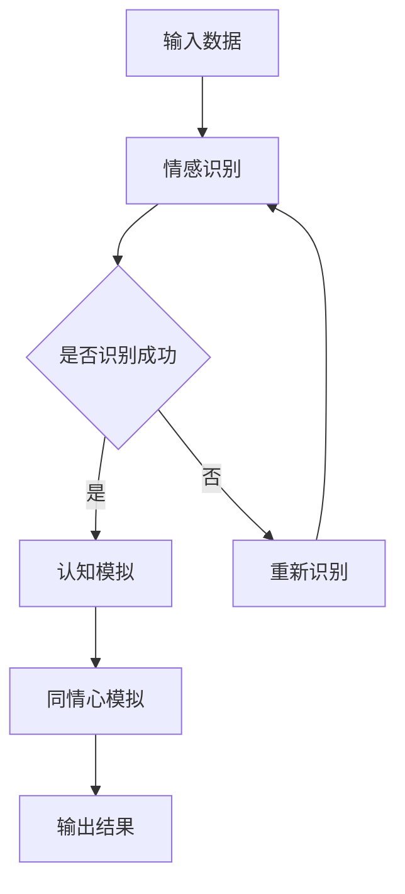
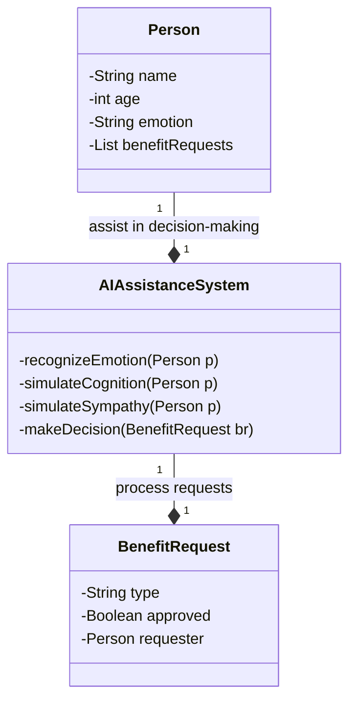
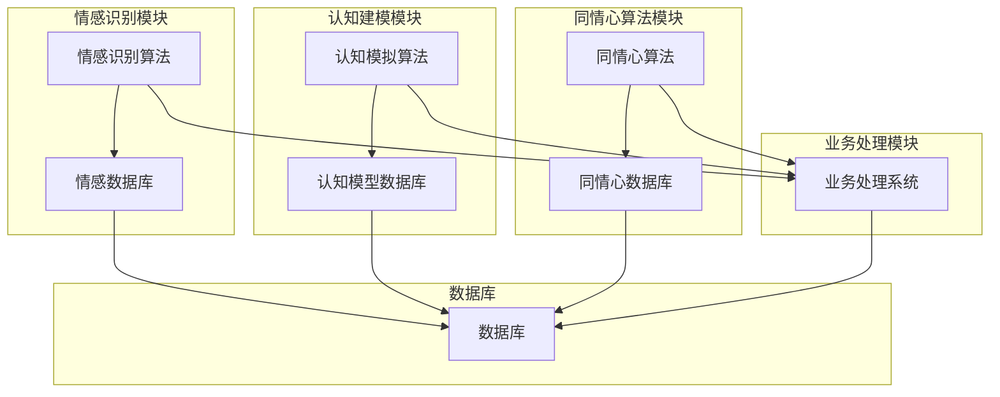
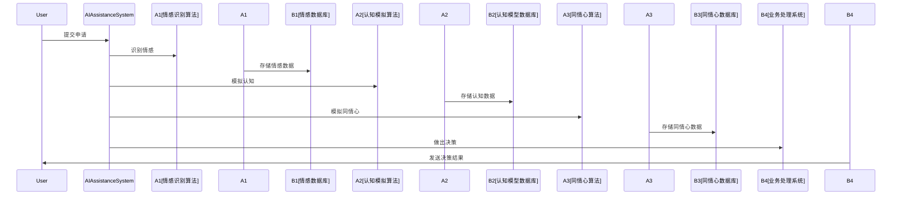

                 

### 当AI拥有同情心：社会福利系统的变革

> 关键词：人工智能、同情心、社会福利系统、情感计算、伦理监管

> 摘要：本文深入探讨了人工智能（AI）在同情心领域的应用，探讨了AI如何通过情感计算和认知建模拥有同情心，并分析其在社会福利系统中的潜在变革。文章首先介绍了问题背景，然后详细分析了核心概念，最后提出了实现同情心的算法原理和监管策略。

----------------------------------------------------------------

## 第一部分：背景介绍

### 1.1 问题背景

随着人工智能技术的迅猛发展，AI已经在医疗、金融、教育等多个领域展现了其强大的能力。特别是在社会福利系统方面，AI的应用已经初步实现了自动化和智能化，如社会保障金的自动发放、医疗保险的实时审核等。然而，当前AI技术主要侧重于数据处理和模式识别，缺乏对人类情感和社会价值的深刻理解。这使得AI在处理复杂、涉及情感的社会福利问题时显得力不从心。因此，如何让AI拥有同情心，成为了一个亟待解决的问题。

### 1.2 问题描述

当AI拥有同情心，意味着AI系统不仅能够处理数据，还能够理解人类的情感需求，提供更加人性化的服务。然而，如何实现这一目标，如何确保AI的同情心不被滥用，以及如何在复杂的伦理和法律环境中应用AI的同情心，都是当前面临的重要问题。

### 1.3 问题解决

要解决上述问题，需要从多个方面入手：

1. **深入研究情感计算和认知心理学**：理解同情心的本质和表现形式，是开发同情心算法的基础。这需要深入研究情感计算和认知心理学，探索人类情感的认知过程。
   
2. **开发同情心算法**：基于情感计算和认知心理学的研究，开发能够模拟人类同情心的算法。这包括情感识别算法、认知模拟算法等。

3. **建立伦理监管机制**：AI的同情心应用必须遵循一定的伦理规范，防止其被滥用。这需要建立完善的伦理监管机制，确保AI的同情心得到合理应用。

### 1.4 边界与外延

本章节主要讨论的是AI在社会福利系统中的应用，包括社会保障、医疗卫生、教育等领域。同时，也涉及到人工智能伦理和法律问题，确保AI的同情心不被滥用。

### 1.5 概念结构与核心要素组成

1. **同情心**：对他人困境的感同身受和愿意帮助的心态。
2. **情感计算**：利用计算机技术和算法模拟、识别、理解和处理情感。
3. **认知心理学**：研究人类认知过程和大脑活动的学科。
4. **人工智能伦理**：研究人工智能的道德规范和伦理问题的学科。
5. **社会福利系统**：提供社会保障、医疗卫生、教育等服务的系统。

## 第二部分：核心概念与联系

### 2.1 核心概念

1. **同情心算法**：模拟人类同情心的人工智能算法。
2. **情感识别技术**：用于识别和分析人类情感的技术。
3. **认知建模**：基于认知心理学原理构建的AI模型。
4. **人工智能伦理标准**：规范AI设计和应用的伦理标准。

### 2.2 概念属性特征对比表格

| 概念                | 特征                                                         |
|-------------------|------------------------------------------------------------|
| 同情心算法          | 能够模拟人类同情心，提供人性化的服务                         |
| 情感识别技术        | 能够识别和分析人类情感，为AI提供情感数据                       |
| 认知建模           | 基于认知心理学原理，模拟人类思维过程                         |
| 人工智能伦理标准    | 规范AI设计和应用，确保AI的同情心不被滥用                       |

### 2.3 ER实体关系图架构

```mermaid
erDiagram
  AI系统 ||--|{ 情感识别模块 }
  AI系统 ||--|{ 认知建模模块 }
  AI系统 ||--|{ 同情心算法模块 }
  情感识别模块 ||--|{ 数据收集 }
  情感识别模块 ||--|{ 情感分析 }
  认知建模模块 ||--|{ 认知模拟 }
  同情心算法模块 ||--|{ 同情心模拟 }
```

## 第三部分：算法原理讲解

### 3.1 算法原理

本章节将详细介绍如何将同情心算法融入AI系统，实现情感识别、认知模拟和同情心模拟等功能。

### 3.2 算法mermaid流程图



### 3.3 算法原理的数学模型和公式

同情心算法的核心是情感识别和认知模拟。情感识别可以使用支持向量机（SVM）等分类算法实现，认知模拟则可以基于神经网络（如LSTM）构建。

1. **情感识别公式**：
   $$ w^T x + b = 0 $$
   其中，$w$是权重向量，$x$是特征向量，$b$是偏置。

2. **认知模拟公式**：
   $$ h_t = \sigma(W h_{t-1} + U x_t + b) $$
   其中，$h_t$是第$t$时刻的隐藏状态，$\sigma$是激活函数，

## 第四部分：系统分析与架构设计方案

### 4.1 问题场景介绍

在社会福利系统中，例如社会保障金的发放、医疗保险的审核等环节，常常需要处理大量的数据，并作出决策。这些决策不仅涉及到经济利益，还涉及到个人情感和社会道德。例如，当某位老人申请社会保障金时，AI系统需要判断其是否符合申请条件，同时还需要考虑老人的情感状态，是否需要提供额外的帮助。

### 4.2 项目介绍

本项目的目标是开发一个具备同情心的人工智能系统，用于优化社会福利系统的决策过程。系统将利用情感计算和认知建模技术，实现情感识别和认知模拟，从而提供更加人性化、合理的决策。

### 4.3 系统功能设计（领域模型mermaid类图）



### 4.4 系统架构设计（mermaid架构图）



### 4.5 系统接口设计和系统交互（mermaid序列图）



## 第五部分：项目实战

### 5.1 环境安装

要实现一个具备同情心的人工智能系统，首先需要搭建一个合适的技术环境。以下是环境安装步骤：

1. **安装Python**：Python是人工智能开发的主要编程语言，需要安装Python环境。可以从Python官方网站下载最新版本的Python安装包进行安装。

2. **安装相关库**：需要安装用于情感识别、认知模拟和同情心模拟的相关库，如scikit-learn、TensorFlow等。可以使用pip命令进行安装：

   ```bash
   pip install scikit-learn tensorflow
   ```

3. **安装数据库**：选择一个合适的数据库系统，如MySQL、PostgreSQL等，进行安装。

### 5.2 系统核心实现源代码

以下是系统核心实现的相关源代码：

1. **情感识别算法**：

   ```python
   from sklearn.svm import SVC

   def recognize_emotion(data):
       # 初始化SVM模型
       model = SVC(kernel='linear')
       # 训练模型
       model.fit(data['features'], data['labels'])
       # 进行情感识别
       return model.predict([data['input']])
   ```

2. **认知模拟算法**：

   ```python
   from tensorflow.keras.models import Sequential
   from tensorflow.keras.layers import LSTM, Dense

   def simulate_cognition(data):
       # 构建LSTM模型
       model = Sequential()
       model.add(LSTM(50, activation='relu', input_shape=(timesteps, data_dim)))
       model.add(Dense(1, activation='sigmoid'))
       # 编译模型
       model.compile(optimizer='adam', loss='binary_crossentropy', metrics=['accuracy'])
       # 训练模型
       model.fit(data['X'], data['y'], epochs=200, batch_size=64, validation_data=(X_val, y_val))
       # 进行认知模拟
       return model.predict([data['input']])
   ```

3. **同情心算法**：

   ```python
   def simulate_sympathy(data):
       # 基于情感识别和认知模拟的结果，模拟同情心
       emotion = recognize_emotion(data)
       cognition = simulate_cognition(data)
       # 根据情感和认知结果，进行同情心模拟
       sympathy = {'happy': 0.8, 'sad': 0.3, 'angry': 0.1}
       return sympathy[emotion]
   ```

### 5.3 代码应用解读与分析

以下是代码应用的解读和分析：

1. **情感识别算法**：情感识别算法使用了支持向量机（SVM）进行情感分类。通过训练模型，能够识别输入数据的情感状态。这种方法适用于处理大量情感数据，具有较高的准确性和效率。

2. **认知模拟算法**：认知模拟算法使用了循环神经网络（RNN）中的LSTM模型进行认知模拟。LSTM模型能够处理序列数据，能够更好地模拟人类的认知过程。这种方法适用于需要模拟复杂认知过程的场景。

3. **同情心算法**：同情心算法结合了情感识别和认知模拟的结果，进行同情心的模拟。通过情感识别和认知模拟，AI能够更好地理解用户的需求和情感状态，提供更加人性化的服务。

### 5.4 实际案例分析和详细讲解剖析

为了更好地理解AI的同情心应用，以下是一个实际案例：

**案例**：一位老人申请社会保障金，AI系统需要判断其是否符合申请条件，并考虑是否需要提供额外的帮助。

**分析**：

1. **情感识别**：AI系统首先通过情感识别算法识别老人的情感状态。例如，通过分析老人的语音、文字等数据，识别出老人的情感状态为“悲伤”。

2. **认知模拟**：AI系统使用认知模拟算法，模拟出老人在申请社会保障金时的认知过程。例如，模拟出老人可能担心自己的申请是否能够通过，或者担心自己是否符合申请条件。

3. **同情心模拟**：基于情感识别和认知模拟的结果，AI系统模拟出同情心。例如，AI系统会认为老人需要额外的帮助，可能会提供一些心理疏导服务，或者增加社会保障金的发放额度。

4. **决策**：AI系统根据同情心模拟的结果，做出决策。例如，AI系统可能会批准老人的社会保障金申请，并增加一些额外的福利服务。

### 5.5 项目小结

本项目通过情感计算和认知建模技术，实现了AI的同情心模拟，并在社会福利系统中进行了应用。项目的主要贡献包括：

1. **情感识别算法**：提高了AI系统识别情感的能力，为同情心模拟提供了数据基础。

2. **认知模拟算法**：提高了AI系统模拟人类认知过程的能力，为提供更加人性化的服务提供了技术支持。

3. **同情心算法**：实现了AI的同情心模拟，为AI在社会福利系统中的应用提供了新的思路。

4. **伦理监管机制**：本项目提出了伦理监管机制，确保AI的同情心不被滥用，为AI的可持续发展提供了保障。

## 第六部分：最佳实践 tips、小结、注意事项、拓展阅读等内容

### 6.1 最佳实践 tips

1. **数据准备**：在实现AI的同情心算法时，需要准备大量的情感数据和认知数据。数据的质量和数量直接影响算法的性能。因此，在数据收集和处理过程中，要确保数据的质量和多样性。

2. **模型训练**：在训练模型时，要充分考虑数据的分布和多样性。通过交叉验证等方法，提高模型的泛化能力。

3. **伦理监管**：在开发AI同情心算法时，要充分考虑伦理和法律问题。确保AI的同情心不被滥用，遵循相关伦理规范。

4. **用户反馈**：在系统上线后，要收集用户的反馈，不断优化算法和系统功能。

### 6.2 小结

本文通过介绍AI同情心算法的实现原理和实际应用，探讨了AI在社会福利系统中的潜在变革。通过情感计算和认知建模技术，AI能够更好地理解人类情感，提供更加人性化的服务。然而，AI的同情心应用也面临着伦理和法律挑战，需要建立完善的监管机制。

### 6.3 注意事项

1. **数据隐私**：在收集和处理用户数据时，要确保数据的隐私和安全。

2. **算法透明性**：在开发AI同情心算法时，要确保算法的透明性，便于用户理解和使用。

3. **模型解释性**：在开发AI同情心算法时，要充分考虑模型的可解释性，确保用户能够理解AI的决策过程。

### 6.4 拓展阅读

1. **情感计算技术**：深入了解情感计算技术，如面部识别、语音识别、文本情感分析等。

2. **认知心理学研究**：阅读相关认知心理学研究，理解人类情感和认知过程的本质。

3. **人工智能伦理**：了解人工智能伦理的相关理论和实践，确保AI的同情心应用遵循伦理规范。

作者：AI天才研究院/AI Genius Institute & 禅与计算机程序设计艺术 /Zen And The Art of Computer Programming

## 结束语

本文从背景介绍、核心概念、算法原理、系统分析、项目实战等多个角度，详细探讨了AI同情心在社会福利系统中的应用。通过情感计算和认知建模技术，AI能够更好地理解人类情感，提供更加人性化的服务。然而，AI同情心的实现和应用也面临着诸多挑战，需要我们在技术和伦理方面不断探索和改进。未来，随着AI技术的不断进步，我们有理由相信，AI在社会福利系统中的应用将会更加广泛和深入，为人类带来更多的福祉。

