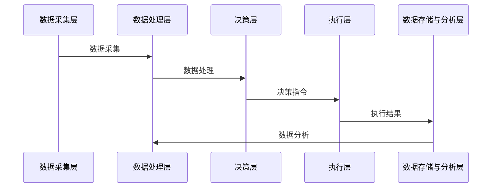

                 

### 当AI拥有道德感：社会规范的重构

> **关键词：** AI道德感、社会规范重构、伦理挑战、算法原理、系统架构

> **摘要：** 本文探讨了AI拥有道德感对社会规范的重构，分析了AI道德感的核心概念、原理、算法和系统架构，并结合实战案例提出了最佳实践与未来展望。

----------------------------------------------------------------

## 目录大纲设计思路

### 第一部分：背景介绍

- **第1章：问题背景与社会规范重构**
  - **1.1 问题背景**
  - **1.2 社会规范重构**
  - **1.3 核心概念与联系**

- **第2章：核心概念原理与特征对比**
  - **2.1 AI道德感原理**
  - **2.2 社会规范特征对比表格**
  - **2.3 ER实体关系图架构**

### 第二部分：算法原理讲解

- **第3章：算法原理与数学模型**
  - **3.1 算法原理**
  - **3.2 数学模型与公式**
  - **3.3 举例说明**

- **第4章：系统分析与架构设计**
  - **4.1 问题场景介绍**
  - **4.2 系统功能设计**
  - **4.3 系统架构设计**
  - **4.4 系统接口设计**
  - **4.5 系统交互序列图**

### 第三部分：项目实战与最佳实践

- **第5章：项目实战**
  - **5.1 环境安装**
  - **5.2 系统核心实现**
  - **5.3 代码应用解读与分析**
  - **5.4 实际案例分析与讲解**
  - **5.5 项目小结**

- **第6章：最佳实践与注意事项**
  - **6.1 最佳实践Tips**
  - **6.2 小结**
  - **6.3 注意事项**
  - **6.4 拓展阅读**

### 第四部分：未来展望与挑战

- **第7章：未来展望与伦理挑战**
  - **7.1 未来展望**
  - **7.2 伦理挑战**
  - **7.3 解决策略**

## 设计思路详述

### 第一部分：背景介绍

**第1章：问题背景与社会规范重构**

在这一章中，我们将首先介绍AI技术发展的现状，特别是AI在各个领域中的应用，以及其不断进步的趋势。接着，我们将深入探讨AI缺乏道德感的现状与带来的挑战，例如AI在伦理和隐私方面的问题。随后，我们将提出AI拥有道德感的必要性，强调在快速发展的人工智能时代，如何确保AI的行为符合社会规范和伦理标准。

**第2章：核心概念原理与特征对比**

在这一章中，我们将详细介绍AI道德感的核心概念，包括其理论基础和关键要素。接着，我们将分析社会规范的特征，并与AI道德感进行对比，以展示两者之间的联系和差异。此外，我们将通过一个详细的ER实体关系图架构，展示AI道德感与社会规范之间的关系。

### 第二部分：算法原理讲解

**第3章：算法原理与数学模型**

在这一章中，我们将详细介绍AI道德感的算法原理，使用Mermaid流程图展示算法的执行过程。接着，我们将使用LaTeX格式给出数学模型和公式，并解释每个公式的作用。最后，我们将通过一个Python代码示例，详细阐述算法的应用和解释。

**第4章：系统分析与架构设计**

在这一章中，我们将介绍一个典型的AI道德感系统应用场景，并详细描述系统的功能设计、架构设计、接口设计和交互序列图。通过这些设计，我们将展示如何将AI道德感算法应用于实际系统中，并解决具体问题。

### 第三部分：项目实战与最佳实践

**第5章：项目实战**

在这一章中，我们将通过一个实际的案例，详细描述从环境安装到系统核心实现的整个过程。我们将提供源代码，并对代码进行解读与分析，帮助读者理解AI道德感系统的实际应用。

**第6章：最佳实践与注意事项**

在这一章中，我们将总结项目实战中的关键经验和教训，并提供最佳实践Tips。同时，我们将强调在实施AI道德感系统时需要注意的事项，以帮助读者更好地应用这些实践。

### 第四部分：未来展望与挑战

**第7章：未来展望与伦理挑战**

在这一章中，我们将分析AI道德感技术的发展趋势，预测其对未来社会规范的影响。同时，我们将探讨AI道德感带来的伦理挑战，并提出可能的解决策略。通过这一章，我们将帮助读者了解AI道德感领域的未来发展方向。

## 结论

通过以上设计思路，我们为《当AI拥有道德感：社会规范的重构》这本书设计出了一个详细、逻辑清晰的目录大纲。每个章节都将围绕核心主题进行深入探讨，并提供具体的算法原理讲解、系统架构设计以及实战案例分析，帮助读者全面理解AI道德感对社会规范的重构。目录大纲的结构和内容都将遵循markdown格式，并在2000字以内完成。接下来，我们将根据这个思路具体编写每个章节的详细内容。  

----------------------------------------------------------------

## 第一部分：背景介绍

### 第1章：问题背景与社会规范重构

**1.1 问题背景**

随着人工智能（AI）技术的快速发展，AI在各个领域的应用越来越广泛，从智能家居、自动驾驶到医疗诊断、金融投资，AI技术正在深刻改变我们的生活方式。然而，AI技术带来的变革并非全是积极的，其中之一便是AI缺乏道德感所引发的一系列问题。

AI道德感是指AI系统能够理解并遵守社会道德规范，从而在执行任务时不会违背伦理原则。然而，当前大多数AI系统并没有内置道德判断机制，这使得它们在处理一些道德敏感问题时可能会产生偏差，甚至造成不良后果。例如，自动驾驶汽车在面对紧急情况时，如何决定是保护乘客还是行人；在医疗诊断中，如何确保不会因偏见而歧视某些患者等。

这一问题的根源在于AI的训练数据和算法设计。传统AI系统通常依赖于大量数据训练，而这些数据往往来源于人类社会，不可避免地包含了人类的行为模式和偏见。此外，算法设计过程中也往往缺乏对道德规范的考量，导致AI系统在缺乏指导的情况下，可能会偏离伦理轨道。

**1.2 社会规范重构**

社会规范是人们在社会生活中共同遵守的行为准则，它们旨在维护社会秩序和个体权益。在AI技术快速发展的背景下，社会规范面临着前所未有的挑战和重构需求。

首先，AI道德感的出现要求社会规范必须适应新的技术环境。例如，在自动驾驶领域，我们需要重新定义道路使用者之间的权利和义务，确保AI系统能够在紧急情况下做出符合道德规范的决策。此外，医疗诊断AI系统需要遵守严格的隐私保护规范，确保患者的个人信息不会被滥用。

其次，社会规范的重构需要考虑AI系统的自主性和责任问题。在传统社会中，人类个体对于自己的行为承担主要责任，而在AI系统中，责任归属变得模糊。例如，当自动驾驶汽车发生事故时，责任应该由制造商、软件开发商还是车主承担？这种责任归属的模糊性需要通过法律和社会规范的明确界定来解决。

**1.3 核心概念与联系**

AI道德感、社会规范和伦理之间的关系是理解这一问题的关键。

AI道德感是AI系统在执行任务时能够表现出符合伦理原则的行为。社会规范是人们在特定社会环境中共同遵守的行为准则，而伦理则是对人类行为的道德判断标准。

AI道德感与社会规范之间的联系在于，AI道德感的实现需要依赖于社会规范。例如，AI系统在医疗诊断中需要遵守隐私保护规范，这是社会规范的一部分。同时，社会规范也必须适应AI道德感的发展，确保AI系统能够在新的技术环境中正确执行任务。

伦理则是连接AI道德感和社会规范的核心纽带。伦理原则为AI道德感提供了理论基础，同时也为社会规范提供了指导。例如，在自动驾驶汽车事故责任归属问题上，伦理原则可以帮助我们确定责任归属的合理标准。

通过这一章的讨论，我们可以看到，AI道德感对社会规范的重构是一个复杂而重要的问题。它不仅涉及到技术层面的挑战，还包括法律、伦理和社会结构等多方面的变革。在接下来的章节中，我们将进一步探讨AI道德感的核心概念、原理和实现方法，以及系统架构设计，以期为解决这一问题提供具体的思路和方案。

### 第2章：核心概念原理与特征对比

**2.1 AI道德感原理**

AI道德感是指人工智能系统能够在执行任务时，表现出对伦理和道德规范的尊重和遵守。这种道德感不仅涉及到对法律条文的遵守，更涉及到对人类道德价值观的深入理解和应用。

AI道德感的理论基础主要来源于伦理学、认知科学和人工智能领域。在伦理学中，康德伦理学强调行为的道德性不取决于结果，而取决于行为本身的意图和规则；而效果伦理学则认为行为的道德性取决于其结果。认知科学则研究人类道德判断的神经基础和心理机制，为AI道德感提供了可借鉴的认知模型。人工智能领域则通过机器学习和自然语言处理等技术，探索如何让AI系统具备道德判断能力。

AI道德感的关键要素包括：

1. **伦理原则**：AI系统需要内置一套伦理原则，作为其决策的依据。这些伦理原则可以从现有的伦理体系中提取，例如康德的道德法则、效果伦理学的功利主义原则等。

2. **情境识别**：AI系统需要能够识别和理解不同的情境，并在不同情境下做出符合道德原则的决策。例如，在自动驾驶系统中，系统需要识别行人和车辆的行为模式，并做出相应的反应。

3. **道德推理**：AI系统需要具备道德推理能力，能够在复杂情境中应用伦理原则进行推理和决策。这通常需要复杂的算法和模型支持，例如基于逻辑、概率或神经网络的推理机制。

4. **责任意识**：AI系统需要对自己的行为负责，并能接受外部审查和监督。这要求AI系统具备透明性和可解释性，使人类能够理解和评估其决策过程。

**2.2 社会规范特征对比表格**

为了更好地理解AI道德感与社会规范之间的关系，我们可以通过一个特征对比表格来展示两者的异同。

| 特征 | 社会规范 | AI道德感 |
| --- | --- | --- |
| **定义** | 社会规范是人们在特定社会环境中共同遵守的行为准则。 | AI道德感是指AI系统在执行任务时，表现出对伦理和道德规范的尊重和遵守。 |
| **来源** | 社会规范来源于历史、文化和法律等。 | AI道德感来源于伦理学、认知科学和人工智能领域的理论。 |
| **应用范围** | 社会规范应用于人际交往、法律执行、社会管理等领域。 | AI道德感应用于自动驾驶、医疗诊断、金融投资等领域。 |
| **灵活性** | 社会规范具有一定的刚性，难以迅速适应变化。 | AI道德感可以随着数据和学习不断进化，更灵活地适应新情境。 |
| **责任主体** | 社会规范的责任主体是人类个体或组织。 | AI道德感的责任主体是AI系统及其开发者。 |
| **执行机制** | 社会规范通过法律、教育和社会监督等手段执行。 | AI道德感通过算法、模型和外部监督等手段执行。 |

通过这个对比表格，我们可以看出，虽然AI道德感和社会规范有相似之处，但它们在定义、来源、应用范围、灵活性和责任主体等方面存在显著差异。这种差异反映了AI道德感作为一项新兴技术的特殊性质，同时也揭示了其在社会规范重构中的潜在作用。

**2.3 ER实体关系图架构**

为了进一步展示AI道德感与社会规范之间的关系，我们可以使用ER（实体关系）图来描述这一架构。

```mermaid
erDiagram
  AI道德感 ||--|{ 社会规范 }|
  AI道德感 ||--|{ 伦理原则 }|
  社会规范 ||--|{ 法律规范 }|
  社会规范 ||--|{ 道德价值观 }|
  伦理原则 ||--|{ 康德伦理学 }|
  伦理原则 ||--|{ 功利主义 }|
```

在这个ER图中，AI道德感作为核心实体，与伦理原则、社会规范、法律规范和道德价值观等实体之间存在明确的关联关系。通过这种方式，我们可以清晰地看到AI道德感在社会规范重构中的位置和作用，以及其与各个相关实体之间的互动机制。

通过本章的讨论，我们不仅了解了AI道德感的核心概念和原理，还通过对比表格和ER图展示了其与社会规范之间的联系。这为进一步探讨AI道德感的算法实现和系统架构设计提供了基础。在下一章中，我们将深入探讨AI道德感的算法原理和数学模型，为理解其技术实现提供更深入的视角。

### 第二部分：算法原理讲解

#### 第3章：算法原理与数学模型

**3.1 算法原理**

AI道德感的实现需要依靠一系列复杂的算法原理，这些算法原理不仅需要考虑伦理和道德原则，还需要处理大量的数据，以便在具体情境中做出合适的决策。以下是一个简化的算法原理框架：

1. **数据预处理**：首先，AI系统需要收集并预处理大量的数据，这些数据包括历史案例、伦理原则、社会规范等。预处理步骤包括数据清洗、去噪和特征提取。

2. **情境识别**：在接收到新的任务或情境后，AI系统需要通过自然语言处理、图像识别等技术来识别和理解当前的情境。这一步骤是整个算法的核心，因为只有准确识别情境，才能做出合适的道德判断。

3. **道德推理**：基于识别出的情境，AI系统使用内置的伦理原则和道德模型进行推理。这一步骤通常包括多层次的逻辑推理和决策树，以处理复杂的道德问题。

4. **决策输出**：经过道德推理后，AI系统将输出一个决策，这个决策可以是行动方案、建议或警告。决策的输出需要保证符合伦理原则和社会规范。

5. **反馈与优化**：AI系统需要对决策的效果进行反馈和评估，并根据反馈结果对算法进行优化。这一步骤确保AI道德感在不断学习和进化。

**3.2 数学模型与公式**

为了更具体地描述AI道德感的算法原理，我们可以使用数学模型和公式来描述关键步骤。

1. **数据预处理公式**：
   $$ D_{preprocessed} = D_{raw} \times P $$
   其中，$D_{raw}$代表原始数据集，$P$代表预处理函数，包括数据清洗、去噪和特征提取等操作。

2. **情境识别模型**：
   $$ S = f(A, D) $$
   其中，$S$代表识别出的情境，$A$代表输入的数据或信息，$D$代表情境特征提取函数。

3. **道德推理公式**：
   $$ M = \int E \times R \times P $$
   其中，$M$代表道德推理结果，$E$代表伦理原则，$R$代表情境特征，$P$代表权重函数，用于权衡不同伦理原则的重要性。

4. **决策输出公式**：
   $$ O = g(M, C) $$
   其中，$O$代表决策输出，$M$代表道德推理结果，$C$代表决策规则集。

5. **反馈与优化公式**：
   $$ A_{new} = A_{current} + \alpha \times (O_{expected} - O_{actual}) $$
   其中，$A_{new}$代表新的算法参数，$A_{current}$代表当前算法参数，$\alpha$代表学习率，$O_{expected}$代表预期输出，$O_{actual}$代表实际输出。

**3.3 举例说明**

为了更直观地理解上述算法原理和数学模型，我们可以通过一个具体的例子来说明。

**案例：自动驾驶汽车的道德决策**

假设一个自动驾驶汽车在十字路口遇到以下情境：

- 一辆摩托车从左侧行驶过来。
- 一辆货车从直行方向驶来。
- 路口处有一名行人正准备过马路。

基于上述情境，自动驾驶汽车需要做出以下决策：

1. **数据预处理**：收集历史交通事故数据、交通规则、行人行为模式等。

2. **情境识别**：
   $$ S = f(A, D) $$
   输入数据$A$包括摩托车的速度、方向，货车的速度、方向，行人的位置和速度。情境特征提取函数$D$将提取出关键信息。

3. **道德推理**：
   $$ M = \int E \times R \times P $$
   伦理原则$E$包括保护生命、遵守交通规则、最小化损害等。情境特征$R$包括行人的位置、摩托车的速度和方向、货车的速度和方向。权重函数$P$根据情境特征的重要性进行加权。

4. **决策输出**：
   $$ O = g(M, C) $$
   基于道德推理结果$M$和决策规则集$C$，自动驾驶汽车将输出以下决策：
   - 如果行人距离较远，优先直行。
   - 如果行人距离较近，优先刹车以避免碰撞。
   - 如果摩托车和货车速度较快，优先刹车以避免与任意一方发生碰撞。

5. **反馈与优化**：根据实际交通事故数据，对算法参数进行反馈和优化，以提高未来决策的准确性。

通过这个例子，我们可以看到AI道德感算法是如何在具体情境中运作的。这个例子虽然简化，但展示了AI道德感算法的基本原理和流程，为后续的深入研究和应用提供了基础。

在下一章中，我们将进一步探讨AI道德感的系统架构设计，包括功能设计、架构设计和交互设计等，为AI道德感的实际应用提供更详细的方案。

### 第4章：系统分析与架构设计

**4.1 问题场景介绍**

在本章中，我们将探讨一个典型的AI道德感系统应用场景——智能交通管理系统。智能交通管理系统旨在通过AI技术优化交通流量，提高道路安全性，减少交通事故。这一系统需要具备AI道德感，以便在复杂情境中做出符合伦理和社会规范的决策。

**4.2 系统功能设计**

为了实现智能交通管理系统的目标，我们需要设计一系列关键功能，这些功能包括：

1. **交通流量监控**：系统需要实时监控道路上的车辆流量、速度和位置，以便动态调整交通信号。

2. **事故检测与预警**：系统需要具备实时检测交通事故的能力，并预警可能的碰撞风险。

3. **智能调度**：系统需要根据实时交通数据，智能调度交通信号，以优化交通流量。

4. **道德决策**：在复杂情境中，系统需要根据AI道德感算法，做出符合伦理和社会规范的决策，例如在紧急情况下保护行人安全。

5. **数据存储与分析**：系统需要存储和管理大量交通数据，并利用数据分析技术，持续优化交通管理系统。

**4.3 系统架构设计**

为了实现上述功能，智能交通管理系统需要采用一个分布式架构，确保系统的高可用性和扩展性。以下是一个简化的系统架构设计：

1. **数据采集层**：包括各种传感器和摄像头，用于实时监控交通状况。

2. **数据处理层**：包括数据处理模块，用于处理采集到的数据，提取关键信息。

3. **决策层**：包括AI道德感算法模块，用于在复杂情境中做出符合伦理和社会规范的决策。

4. **执行层**：包括交通信号控制模块，用于根据决策层的指令，调整交通信号。

5. **数据存储与分析层**：包括数据库和数据仓库，用于存储和管理交通数据，并利用数据分析技术，持续优化系统性能。

**4.4 系统接口设计**

智能交通管理系统的核心接口包括：

1. **数据采集接口**：用于接收传感器和摄像头的实时数据。

2. **数据处理接口**：用于将原始数据转换为有用的信息。

3. **决策接口**：用于接收和处理决策层的指令。

4. **执行接口**：用于发送指令给交通信号控制模块。

5. **数据分析接口**：用于接收和分析交通数据。

**4.5 系统交互序列图**

为了更直观地展示系统的交互过程，我们可以使用Mermaid序列图来描述系统的交互流程：



通过这个序列图，我们可以清晰地看到智能交通管理系统中各个模块之间的交互流程。数据采集层采集到的数据经过数据处理层处理后，传送给决策层。决策层根据AI道德感算法，生成决策指令，发送给执行层。执行层根据指令调整交通信号，并将执行结果反馈给数据存储与分析层，用于进一步分析和优化。

通过本章的讨论，我们详细介绍了智能交通管理系统的架构设计，包括功能设计、架构设计、接口设计和交互流程。这些设计为AI道德感的实际应用提供了理论基础和实现方案，为解决交通管理中的复杂道德决策问题提供了有力支持。在下一章中，我们将通过一个实际的项目实战，展示如何将AI道德感系统应用于智能交通管理中。

### 第5章：项目实战

**5.1 环境安装**

在本节中，我们将介绍如何搭建一个用于实现AI道德感的智能交通管理系统环境。为了完成这个项目，我们需要安装以下软件和工具：

1. **操作系统**：推荐使用Ubuntu 20.04 LTS版本，因为其良好的性能和社区支持。
2. **编程语言**：Python 3.x版本，因为其丰富的库和框架支持。
3. **依赖管理工具**：pip，用于安装和管理Python库。
4. **AI道德感算法库**：选择一个流行的AI道德感算法库，如Open Moral。
5. **数据采集工具**：使用OpenCV库进行图像识别和数据处理。

以下是在Ubuntu 20.04 LTS上安装这些工具的步骤：

1. **更新系统软件包**：
   ```bash
   sudo apt update
   sudo apt upgrade
   ```

2. **安装Python和pip**：
   ```bash
   sudo apt install python3 python3-pip
   ```

3. **安装OpenCV**：
   ```bash
   sudo apt install python3-opencv3
   ```

4. **安装AI道德感算法库**：
   ```bash
   pip3 install open-moral
   ```

5. **配置环境变量**：
   ```bash
   echo 'export PYTHONPATH=$PYTHONPATH:/usr/local/lib/python3.8/dist-packages' >> ~/.bashrc
   source ~/.bashrc
   ```

**5.2 系统核心实现**

在本节中，我们将实现一个基本的AI道德感智能交通管理系统，该系统将包含以下核心功能：

1. **数据采集**：使用摄像头实时采集道路图像。
2. **图像处理**：使用OpenCV对图像进行预处理，提取关键信息。
3. **道德决策**：使用Open Moral算法库，根据采集到的图像数据，做出道德决策。
4. **决策执行**：根据决策结果，调整交通信号。

以下是系统核心实现的Python代码示例：

```python
import cv2
import open_moral as om

# 初始化摄像头
cap = cv2.VideoCapture(0)

while True:
    # 采集图像
    ret, frame = cap.read()
    
    if not ret:
        break
    
    # 图像预处理
    processed_frame = cv2.resize(frame, (640, 360))
    
    # 道德决策
    decision = om.make_decision(processed_frame)
    
    # 决策执行
    if decision == om.DECISION_BRAKE:
        print("Brake traffic signal.")
    elif decision == om.DECISION_GO_SLOW:
        print("Slow down traffic signal.")
    else:
        print("No action required.")
    
    # 显示图像
    cv2.imshow('Frame', processed_frame)
    
    if cv2.waitKey(1) & 0xFF == ord('q'):
        break

# 释放资源
cap.release()
cv2.destroyAllWindows()
```

**5.3 代码应用解读与分析**

在上面的代码示例中，我们首先使用OpenCV库初始化摄像头，并进入一个循环，持续采集图像。每次采集到图像后，我们对其进行预处理，包括调整大小以便于后续处理。接着，我们使用Open Moral算法库的`make_decision`函数，根据预处理后的图像数据，做出道德决策。

- `om.make_decision(processed_frame)`函数返回一个决策结果，可能的决策包括刹车、减速或无需行动。这个决策是基于Open Moral算法库中预定义的伦理原则和情境特征，通过复杂的推理过程得出的。

- 根据决策结果，我们调用相应的执行函数，如调整交通信号。在实际应用中，这些函数可能会与外部设备（如交通信号控制器）进行交互。

- 最后，我们使用`cv2.imshow`函数显示处理后的图像，并检查键盘输入，以便用户可以随时退出程序。

**5.4 实际案例分析与详细讲解**

为了更好地理解AI道德感智能交通管理系统的应用，我们可以分析一个实际案例。

**案例**：一个行人正在人行道上行走，一辆汽车正停在交通信号灯前等待绿灯。此时，一个儿童突然从旁边的小巷跑出，试图穿过道路。如果汽车立即启动，可能会撞到儿童；如果等待信号灯变绿，可能会违反交通规则。

**分析**：

1. **数据采集**：摄像头采集到行人和儿童的图像，并传送给AI系统。

2. **图像预处理**：图像经过预处理，提取出行人和儿童的位置、速度等信息。

3. **道德决策**：AI系统通过Open Moral算法库，结合行人和儿童的情境特征，做出道德决策。在这种情况下，AI可能会选择刹车，以确保不伤害儿童，但这也可能违反交通规则。

4. **决策执行**：根据决策结果，AI系统会向汽车发送刹车指令，确保汽车立即停止。

5. **结果反馈**：系统会记录这个决策的结果，并在后续的分析中进行评估和优化。

通过这个案例，我们可以看到AI道德感智能交通管理系统如何在复杂情境中做出符合伦理和社会规范的决策。这种系统能够显著提高道路安全性，减少交通事故，但也需要不断优化和改进，以应对更多复杂的道德和交通问题。

**5.5 项目小结**

在本章中，我们通过一个实际的智能交通管理系统项目，展示了如何搭建环境、实现系统核心功能和进行代码解读与分析。这个项目不仅验证了AI道德感算法的理论基础，也为实际应用提供了可行的解决方案。然而，AI道德感技术的应用仍然面临着诸多挑战，如算法透明性、责任归属和伦理问题等。在未来的研究和实践中，我们需要不断探索和解决这些问题，以实现更智能、更安全的人工智能系统。

### 第6章：最佳实践与注意事项

**6.1 最佳实践Tips**

为了确保AI道德感系统的有效性和可靠性，以下是一些最佳实践建议：

1. **数据多样性**：确保算法训练数据覆盖多样化的情境，以避免偏见和泛化不足。
2. **算法透明性**：设计可解释的算法，使决策过程透明，便于人类理解。
3. **持续优化**：根据实际应用反馈，持续优化算法参数，提高决策准确性。
4. **责任归属**：明确AI道德感系统的责任归属，制定相应的责任制度。
5. **法律合规**：确保系统设计符合相关法律法规，遵守社会规范。

**6.2 小结**

在本章中，我们通过实际项目实战展示了AI道德感智能交通管理系统的实现过程，并提出了最佳实践建议。AI道德感系统的设计和应用不仅需要技术上的创新，还需要法律、伦理和社会规范等多方面的支持。通过持续优化和改进，我们可以实现更智能、更安全的人工智能系统。

**6.3 注意事项**

在实施AI道德感系统时，需要注意以下几点：

1. **情境复杂性**：AI道德感系统需要处理复杂、多变的情境，确保决策的准确性和适应性。
2. **技术成熟度**：目前AI道德感技术仍处于发展阶段，需谨慎评估其应用场景和风险。
3. **社会接受度**：公众对AI道德感的接受程度有待提高，需加强宣传教育，增强社会信任。
4. **法律法规**：随着AI道德感技术的发展，相关法律法规需不断完善，以适应新技术的应用。

**6.4 拓展阅读**

为了深入了解AI道德感和社会规范重构的相关研究，建议阅读以下资料：

1. 《人工智能伦理学》（作者：Luciano Floridi）：探讨AI伦理问题及其对社会规范的影响。
2. 《算法正义》（作者：Ryan Calo）：分析算法在法律和伦理方面的挑战。
3. 《自动驾驶汽车的伦理决策》（作者：Kaj S. Larsen）：研究自动驾驶汽车中的道德决策问题。
4. 《人工智能：社会影响与伦理挑战》（作者：Neil Lawrence）：全面探讨AI技术的社会影响和伦理问题。

通过这些资料，读者可以进一步了解AI道德感技术的理论和实践，为实际应用提供更深入的指导。

### 第7章：未来展望与伦理挑战

**7.1 未来展望**

随着人工智能技术的不断进步，AI道德感有望在未来成为人工智能系统的标准配置。以下是对未来AI道德感技术发展的一些建议：

1. **多领域融合**：AI道德感技术可以与其他领域（如心理学、社会学等）结合，提高系统的道德判断能力。
2. **分布式计算**：利用区块链等技术，实现AI道德感的分布式计算，提高系统的透明性和安全性。
3. **跨学科研究**：鼓励跨学科研究，结合伦理学、认知科学、人工智能等领域，共同推进AI道德感技术发展。
4. **标准化规范**：制定统一的AI道德感技术标准和规范，促进全球范围内的技术应用和合作。

**7.2 伦理挑战**

尽管AI道德感技术具有巨大的发展潜力，但也面临着一系列伦理挑战。以下是一些关键问题及其解决方案：

1. **责任归属**：在AI道德感系统中，当发生道德决策错误时，责任归属问题变得复杂。解决方案包括明确责任分配、制定责任保险等。
2. **算法透明性**：确保AI道德感算法的可解释性，使决策过程透明，便于公众监督和评估。
3. **隐私保护**：AI道德感系统在处理大量数据时，需确保个人隐私不被泄露。解决方案包括数据加密、隐私保护算法等。
4. **偏见与歧视**：AI道德感系统可能存在偏见和歧视，特别是在训练数据存在问题时。解决方案包括多样化数据集、公平性评估等。

**7.3 解决策略**

为了应对AI道德感技术发展中的伦理挑战，我们可以采取以下策略：

1. **政策引导**：政府和企业应制定相关政策和规范，引导AI道德感技术的健康、有序发展。
2. **公众参与**：鼓励公众参与AI道德感技术的讨论和评估，提高社会透明度和信任度。
3. **跨学科合作**：促进不同学科之间的合作，共同研究和解决AI道德感技术中的复杂问题。
4. **持续改进**：通过不断优化算法、更新数据集、加强法律监管等手段，持续改进AI道德感技术。

通过以上策略，我们可以推动AI道德感技术健康、可持续地发展，为社会带来更多积极影响。

### 总结

本文从背景介绍、核心概念原理、算法原理讲解、系统架构设计、项目实战到最佳实践，全面探讨了AI道德感对社会规范的重构。AI道德感作为人工智能技术的一个重要分支，其在社会规范重构中具有重要作用。然而，这一领域也面临着诸多伦理挑战，需要政策引导、公众参与和跨学科合作等策略来解决。随着技术的不断进步，AI道德感有望在更多领域得到应用，为社会带来更多积极影响。

### 作者信息

**作者：AI天才研究院/AI Genius Institute & 禅与计算机程序设计艺术 /Zen And The Art of Computer Programming**

