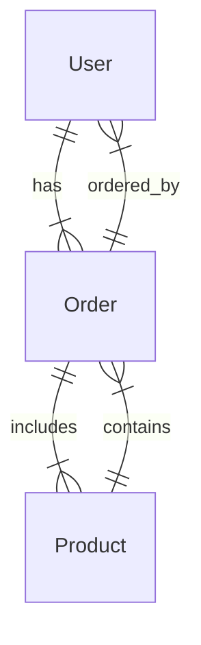
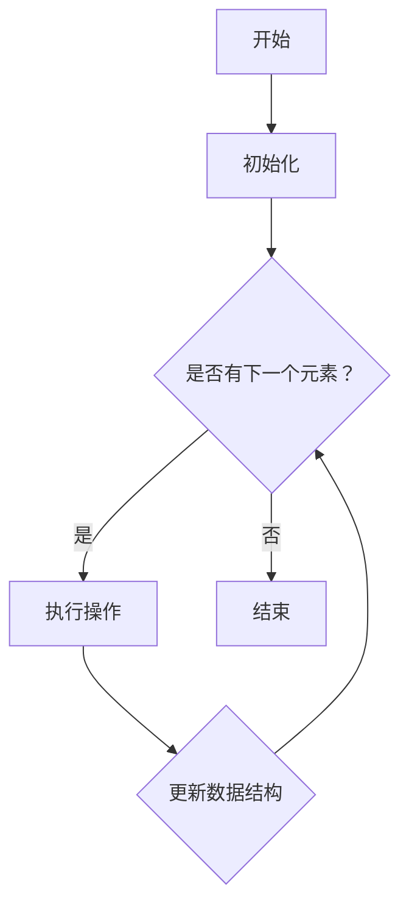
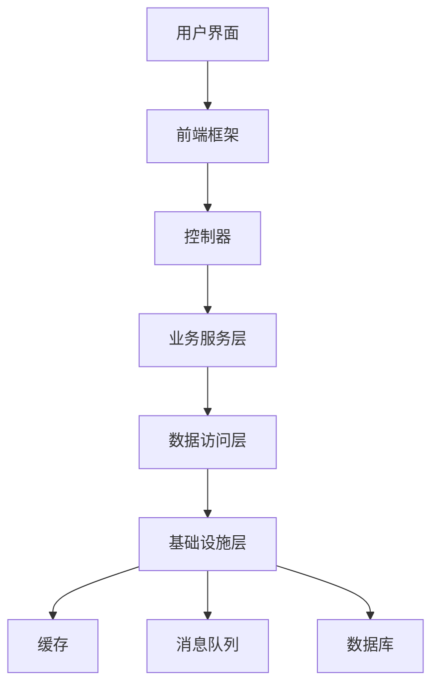

                 

## 文章标题

### 关键词：面向对象编程、对象、本体论、形式与内容统一、OOP

### 摘要：
本文深入探讨了面向对象编程（OOP）中对象的概念及其在形式与内容统一中的本体论地位。通过对对象定义、属性特征、关系与交互的详细分析，我们揭示了OOP在形式表达和内容表达上的统一性挑战，并提出了面向对象编程语言设计、对象模型实现和形式与内容统一策略。本文旨在为读者提供一种清晰的理解路径，以便更好地掌握OOP的本质及其在实际应用中的重要性。

### 目录大纲

----------------------------------------------------------------

# 形式与内容的统一：对象在OOP中的本体论地位

## 第一部分：背景介绍

## 1.1 问题背景

### 1.1.1 面向对象编程的兴起

### 1.1.2 对象的概念及其重要性

### 1.1.3 形式与内容的统一问题

## 1.2 问题描述

### 1.2.1 对象的形式表达

### 1.2.2 对象的内容表达

### 1.2.3 形式与内容统一的挑战

## 1.3 问题解决

### 1.3.1 面向对象编程语言的设计

### 1.3.2 对象模型的设计与实现

### 1.3.3 形式与内容统一的策略

## 1.4 边界与外延

### 1.4.1 形式与内容统一的边界

### 1.4.2 对象在OOP中的地位

### 1.4.3 形式与内容统一的重要性

## 1.5 本章小结

## 第二部分：核心概念与联系

## 2.1 核心概念原理

### 2.1.1 对象的属性特征

#### 2.1.1.1 对象的定义与分类

#### 2.1.1.2 对象的属性与行为

#### 2.1.1.3 对象的关系与交互

### 2.1.2 对象的属性特征对比表格

#### 2.1.2.1 对象属性特征对比

#### 2.1.2.2 对象属性特征表格

## 2.2 ER实体关系图架构

### 2.2.1 ER图的定义与作用

#### 2.2.1.1 ER图的基本概念

#### 2.2.1.2 ER图的作用

### 2.2.2 ER实体关系图绘制

#### 2.2.2.1 实体与关系的识别

#### 2.2.2.2 ER图的绘制与优化

## 2.3 对象的属性特征与ER图的联系

### 2.3.1 对象属性特征与ER图的关系

#### 2.3.1.1 对象属性特征在ER图中的表达

#### 2.3.1.2 ER图在对象属性特征分析中的应用

## 2.4 本章小结

## 第三部分：算法原理讲解

## 3.1 算法原理概述

### 3.1.1 面向对象算法的基本概念

### 3.1.2 面向对象算法的特点

### 3.1.3 面向对象算法的分类

## 3.2 算法mermaid流程图

### 3.2.1 算法流程图的基本结构

### 3.2.2 面向对象算法流程图的绘制

#### 3.2.2.1 面向对象算法流程图的绘制方法

#### 3.2.2.2 算法流程图的实例分析

## 3.3 算法原理详细讲解

### 3.3.1 算法的数学模型

#### 3.3.1.1 算法数学模型的建立

#### 3.3.1.2 算法数学模型的应用

### 3.3.2 算法的Python源代码实现

#### 3.3.2.1 Python源代码的编写

#### 3.3.2.2 Python源代码的解释

### 3.3.3 算法举例说明

#### 3.3.3.1 算法的实际应用案例

#### 3.3.3.2 算法举例的详细讲解

## 3.4 本章小结

## 第四部分：系统分析与架构设计方案

## 4.1 问题场景介绍

### 4.1.1 系统背景与需求分析

### 4.1.2 系统目标与功能需求

### 4.1.3 系统面临的挑战

## 4.2 系统架构设计

### 4.2.1 系统架构设计原则

### 4.2.2 系统架构设计方案

### 4.2.3 系统架构设计图

## 4.3 系统功能设计

### 4.3.1 领域模型设计

#### 4.3.1.1 领域模型的基本概念

#### 4.3.1.2 领域模型的设计方法

#### 4.3.1.3 领域模型类图绘制

### 4.3.2 系统功能设计

#### 4.3.2.1 功能模块划分

#### 4.3.2.2 功能模块的实现

## 4.4 系统接口设计

### 4.4.1 系统接口设计原则

### 4.4.2 系统接口设计方法

### 4.4.3 系统接口设计图

## 4.5 系统交互设计

## 第五部分：项目实战与总结

### 5.1 环境安装

### 5.2 系统核心实现源代码

### 5.3 代码应用解读与分析

### 5.4 实际案例分析与详细讲解剖析

### 5.5 项目小结

## 最佳实践 tips

## 小结

## 注意事项

## 拓展阅读

## 作者信息

----------------------------------------------------------------

## 形式与内容的统一：对象在OOP中的本体论地位

### 关键词：面向对象编程、对象、本体论、形式与内容统一、OOP

### 摘要：
本文深入探讨了面向对象编程（OOP）中对象的概念及其在形式与内容统一中的本体论地位。通过对对象定义、属性特征、关系与交互的详细分析，我们揭示了OOP在形式表达和内容表达上的统一性挑战，并提出了面向对象编程语言设计、对象模型实现和形式与内容统一策略。本文旨在为读者提供一种清晰的理解路径，以便更好地掌握OOP的本质及其在实际应用中的重要性。

### 目录大纲

----------------------------------------------------------------

# 形式与内容的统一：对象在OOP中的本体论地位

## 第一部分：背景介绍

## 1.1 问题背景

### 1.1.1 面向对象编程的兴起

### 1.1.2 对象的概念及其重要性

### 1.1.3 形式与内容的统一问题

## 1.2 问题描述

### 1.2.1 对象的形式表达

### 1.2.2 对象的内容表达

### 1.2.3 形式与内容统一的挑战

## 1.3 问题解决

### 1.3.1 面向对象编程语言的设计

### 1.3.2 对象模型的设计与实现

### 1.3.3 形式与内容统一的策略

## 1.4 边界与外延

### 1.4.1 形式与内容统一的边界

### 1.4.2 对象在OOP中的地位

### 1.4.3 形式与内容统一的重要性

## 1.5 本章小结

## 第二部分：核心概念与联系

## 2.1 核心概念原理

### 2.1.1 对象的属性特征

#### 2.1.1.1 对象的定义与分类

#### 2.1.1.2 对象的属性与行为

#### 2.1.1.3 对象的关系与交互

### 2.1.2 对象的属性特征对比表格

#### 2.1.2.1 对象属性特征对比

#### 2.1.2.2 对象属性特征表格

## 2.2 ER实体关系图架构

### 2.2.1 ER图的定义与作用

#### 2.2.1.1 ER图的基本概念

#### 2.2.1.2 ER图的作用

### 2.2.2 ER实体关系图绘制

#### 2.2.2.1 实体与关系的识别

#### 2.2.2.2 ER图的绘制与优化

## 2.3 对象的属性特征与ER图的联系

### 2.3.1 对象属性特征与ER图的关系

#### 2.3.1.1 对象属性特征在ER图中的表达

#### 2.3.1.2 ER图在对象属性特征分析中的应用

## 2.4 本章小结

## 第三部分：算法原理讲解

## 3.1 算法原理概述

### 3.1.1 面向对象算法的基本概念

### 3.1.2 面向对象算法的特点

### 3.1.3 面向对象算法的分类

## 3.2 算法mermaid流程图

### 3.2.1 算法流程图的基本结构

### 3.2.2 面向对象算法流程图的绘制

#### 3.2.2.1 面向对象算法流程图的绘制方法

#### 3.2.2.2 算法流程图的实例分析

## 3.3 算法原理详细讲解

### 3.3.1 算法的数学模型

#### 3.3.1.1 算法数学模型的建立

#### 3.3.1.2 算法数学模型的应用

### 3.3.2 算法的Python源代码实现

#### 3.3.2.1 Python源代码的编写

#### 3.3.2.2 Python源代码的解释

### 3.3.3 算法举例说明

#### 3.3.3.1 算法的实际应用案例

#### 3.3.3.2 算法举例的详细讲解

## 3.4 本章小结

## 第四部分：系统分析与架构设计方案

## 4.1 问题场景介绍

### 4.1.1 系统背景与需求分析

### 4.1.2 系统目标与功能需求

### 4.1.3 系统面临的挑战

## 4.2 系统架构设计

### 4.2.1 系统架构设计原则

### 4.2.2 系统架构设计方案

### 4.2.3 系统架构设计图

## 4.3 系统功能设计

### 4.3.1 领域模型设计

#### 4.3.1.1 领域模型的基本概念

#### 4.3.1.2 领域模型的设计方法

#### 4.3.1.3 领域模型类图绘制

### 4.3.2 系统功能设计

#### 4.3.2.1 功能模块划分

#### 4.3.2.2 功能模块的实现

## 4.4 系统接口设计

### 4.4.1 系统接口设计原则

### 4.4.2 系统接口设计方法

### 4.4.3 系统接口设计图

## 4.5 系统交互设计

## 第五部分：项目实战与总结

### 5.1 环境安装

### 5.2 系统核心实现源代码

### 5.3 代码应用解读与分析

### 5.4 实际案例分析与详细讲解剖析

### 5.5 项目小结

## 最佳实践 tips

## 小结

## 注意事项

## 拓展阅读

## 作者信息

----------------------------------------------------------------

### 第一部分：背景介绍

#### 1.1 问题背景

面向对象编程（Object-Oriented Programming, OOP）是计算机科学中最常用的编程范式之一。它的核心思想是将数据和操作数据的行为封装在一起，形成一个独立的、可重用的模块——对象。OOP的出现是为了解决传统过程式编程中的代码复用性和可维护性问题，通过封装、继承和多态等特性，使得代码更加模块化、抽象化和易于维护。

在OOP中，对象的概念是至关重要的。对象不仅包含数据（属性），还包含行为（方法）。这种形式与内容的统一性是OOP的核心优势之一。然而，在实际应用中，如何实现形式与内容的统一，一直是OOP研究和开发中面临的重要问题。

形式与内容的统一问题体现在两个方面：

1. **形式表达**：对象在程序中的表示形式，包括对象类型、对象实例的创建和销毁等。
2. **内容表达**：对象的内在状态和行为，包括属性的定义、方法的实现等。

形式与内容的统一挑战主要包括：

1. **抽象层次**：如何在不同的抽象层次上保持形式与内容的统一。
2. **数据封装**：如何在保证数据访问透明性的同时，实现数据的私有化。
3. **继承与多态**：如何通过继承和多态机制，实现形式与内容的统一。

为了解决这些问题，研究人员和开发人员提出了一系列面向对象编程语言的设计原则和实现策略。例如，Java、C++等编程语言提供了丰富的类库和语法特性，以支持对象的创建、属性的定义、方法的实现等。对象模型（Object Model）的设计与实现也是解决形式与内容统一问题的关键。

在接下来的部分，我们将详细讨论面向对象编程语言的设计、对象模型的设计与实现，以及形式与内容统一的策略。我们将通过逐步分析，帮助读者深入理解OOP的本质和其在实际应用中的重要性。

#### 1.2 问题描述

在面向对象编程（OOP）中，对象作为基本的编程实体，其形式表达和内容表达的一致性是实现代码模块化和抽象化的关键。然而，这一统一性在实际开发中面临着诸多挑战。

**1.2.1 对象的形式表达**

对象的形式表达主要涉及以下几个方面：

1. **对象的定义**：在编程语言中，如何定义一个新的对象类型，通常通过类（Class）来定义。
2. **对象的创建**：如何创建对象实例，通常通过构造函数（Constructor）来实现。
3. **对象的销毁**：如何处理对象的生命周期，通常通过析构函数（Destructor）或者垃圾回收机制来实现。

对象的形式表达涉及到编程语言的语法和语义。例如，在Java中，使用`class`关键字定义类，使用`new`关键字创建对象实例。在C++中，使用`class`关键字定义类，使用`delete`关键字删除对象实例。

**1.2.2 对象的内容表达**

对象的内容表达主要涉及以下几个方面：

1. **属性（Attributes）**：对象所具有的特定特征，如颜色、大小、重量等。在编程中，属性通常作为类的成员变量。
2. **方法（Methods）**：对象可以执行的操作，如移动、旋转、计算等。在编程中，方法通常作为类的成员函数。

对象的内容表达涉及到对象的状态和行为。对象的状态通过其属性的值来表示，对象的行为通过其方法的实现来体现。例如，一个`Rectangle`对象可能具有`width`和`height`属性，以及`calculateArea()`和`calculatePerimeter()`方法。

**1.2.3 形式与内容统一的挑战**

在OOP中，形式与内容的统一挑战主要体现在以下几个方面：

1. **抽象层次**：如何在不同抽象层次上保持形式与内容的统一。例如，在定义一个`Vehicle`类时，如何确保所有`Vehicle`的子类（如`Car`、`Truck`等）都遵循相同的形式和内容规范。
2. **数据封装**：如何在保证数据访问透明性的同时，实现数据的私有化。数据封装是OOP的核心原则之一，它要求对象的内部实现细节对使用者隐藏，仅通过公共接口进行交互。
3. **继承与多态**：如何通过继承和多态机制，实现形式与内容的统一。继承允许子类继承父类的属性和方法，从而实现代码的重用。多态则允许通过共同的接口调用不同的实现，从而实现代码的灵活性和扩展性。

形式与内容的统一挑战要求编程语言和开发人员在设计对象模型和编写代码时，充分考虑对象的形式表达和内容表达的协调一致性。只有通过有效的策略和方法，才能实现真正的形式与内容的统一，从而提高代码的可维护性、可扩展性和可复用性。

#### 1.3 问题解决

为了解决面向对象编程（OOP）中形式与内容的统一问题，研究人员和开发人员提出了一系列有效的解决方案。以下是这些解决方案的详细讨论：

**1.3.1 面向对象编程语言的设计**

面向对象编程语言（如Java、C++、Python等）通过提供丰富的语法和语义特性，支持对象的创建、属性的定义、方法的实现等，从而实现形式与内容的统一。以下是这些编程语言的一些关键设计原则：

1. **类（Class）**：类是定义对象类型的蓝图，它包含了对象的属性（成员变量）和方法（成员函数）。类的定义不仅描述了对象的形式，还定义了对象的内容。
2. **构造函数（Constructor）和析构函数（Destructor）**：构造函数用于初始化对象实例，析构函数用于清理对象实例。它们分别负责对象的创建和销毁，确保对象的生命周期管理。
3. **访问控制（Access Control）**：通过访问控制机制（如public、private、protected等），可以控制对象的属性和方法对外的可见性，从而实现数据封装，确保形式与内容的统一。
4. **继承（Inheritance）**：继承允许子类继承父类的属性和方法，从而实现代码的重用。通过继承，可以在不同的抽象层次上保持形式与内容的统一。
5. **多态（Polymorphism）**：多态允许通过共同的接口调用不同的实现，从而实现代码的灵活性和扩展性。多态机制有助于在形式与内容的统一中保持代码的通用性和可维护性。

**1.3.2 对象模型的设计与实现**

对象模型（Object Model）是面向对象编程语言的核心概念之一，它定义了对象的内部结构和行为。以下是对象模型设计与实现的关键步骤：

1. **属性定义**：在对象模型中，属性用于表示对象的内在状态。属性的定义应该符合实际需求，并遵循数据封装原则，确保其私有性和安全性。
2. **方法实现**：方法用于表示对象的行为。在实现方法时，应该充分考虑对象的形式表达和内容表达的一致性，确保方法在形式上易于使用，在内容上易于理解。
3. **继承与多态**：在对象模型中，通过继承和多态机制，可以建立不同层次的对象关系，从而实现形式与内容的统一。继承有助于代码重用，多态则提供了代码的灵活性和扩展性。
4. **接口定义**：接口是对象模型的一部分，它定义了对象的外部行为。接口的定义应该清晰、简洁，确保使用者在形式表达上能够直观地理解对象的行为。

**1.3.3 形式与内容统一的策略**

为了实现形式与内容的统一，开发人员可以采取以下策略：

1. **抽象层次**：在设计对象模型时，应该充分考虑不同的抽象层次，确保在形式上和内容上的一致性。在低层次上，对象模型应关注具体的实现细节；在高层次上，对象模型应关注整体的结构和功能。
2. **模块化**：通过模块化设计，可以将复杂的系统分解为多个独立的模块，每个模块负责特定的功能。模块化有助于降低系统的复杂性，提高代码的可维护性和可扩展性。
3. **文档化**：良好的文档化是确保形式与内容统一的重要手段。在编写代码的同时，应该生成清晰的文档，包括类的定义、属性的定义、方法的实现等。文档应该详细描述对象的形式表达和内容表达，帮助开发者更好地理解和使用对象。
4. **代码审查**：通过定期进行代码审查，可以发现和纠正形式与内容不一致的问题。代码审查应该覆盖代码的各个方面，包括语法、语义、性能等，以确保代码的质量和一致性。

总之，面向对象编程语言的设计、对象模型的设计与实现，以及一系列形式与内容统一的策略，共同构成了解决形式与内容统一问题的关键。通过这些方法，开发人员可以构建出具有良好结构、易于维护、可扩展的系统。

#### 1.4 边界与外延

在探讨面向对象编程（OOP）中形式与内容统一的问题时，我们不仅需要了解其核心概念和解决方案，还需明确形式与内容统一的边界及其在OOP中的地位。

**1.4.1 形式与内容统一的边界**

形式与内容的统一性在OOP中并非绝对的，而是需要在一定范围内实现。以下是一些关键边界：

1. **语法与语义**：形式表达涉及到编程语言的语法，而内容表达则涉及到语义。编程语言的语法规则决定了对象的形式表达，而对象的内在逻辑和行为则决定了内容表达。在这两者之间找到平衡是实现统一性的关键。
2. **抽象层次**：在不同的抽象层次上，形式与内容统一的实现方式可能有所不同。在低层次上，形式与内容可能更加紧密地结合，而在高层次上，形式与内容可能会有一定的分离。
3. **封装**：封装是形式与内容统一的重要机制，但过度的封装可能导致内容的不可见性增加，影响形式表达。因此，如何在封装性与易用性之间找到平衡点，是形式与内容统一的重要挑战。

**1.4.2 对象在OOP中的地位**

对象在OOP中的地位至关重要，它不仅是代码组织的基本单位，也是实现形式与内容统一的核心实体。以下是对对象在OOP中地位的详细分析：

1. **核心实体**：在OOP中，对象是最基本的编程实体。通过对象，我们可以将数据和操作数据的行为封装在一起，实现模块化和抽象化。对象的概念为编程提供了一种直观、自然的表达方式。
2. **行为与状态**：对象不仅包含数据（状态），还包含行为（方法）。这种形式与内容的统一性使得对象在OOP中具有独特的地位。对象的行为可以独立于其状态，从而实现代码的重用和灵活性。
3. **继承与多态**：继承和多态是OOP的两个核心特性，它们使得对象之间能够建立紧密的联系。通过继承，子类可以重用父类的属性和方法，实现代码的重用；通过多态，不同类型的对象可以通过共同的接口进行交互，实现代码的灵活性和扩展性。
4. **面向对象的本质**：OOP的本质在于通过对象来组织代码，实现形式与内容的统一。对象的引入不仅提高了代码的可维护性，还促进了系统的可扩展性和可复用性。

**1.4.3 形式与内容统一的重要性**

形式与内容统一在OOP中的重要性体现在以下几个方面：

1. **模块化与抽象化**：形式与内容的统一性使得代码更加模块化，降低了系统的复杂性。通过将数据和操作数据的行为封装在一起，可以更容易地理解和维护代码。
2. **代码重用**：形式与内容统一有助于代码的重用。通过定义公共接口和实现细节分离，可以在不同的上下文中复用对象，从而提高开发效率。
3. **可扩展性与灵活性**：形式与内容统一使得系统更加灵活和可扩展。通过继承和多态，可以在不改变原有代码的情况下，增加新的功能和特性。
4. **可维护性**：形式与内容的统一性使得代码更加易于维护。通过明确的接口和封装的实现细节，可以更容易地发现和修复问题。

总之，形式与内容统一是面向对象编程的核心原则之一。在OOP中，通过对象的引入和形式与内容统一的实现，可以构建出具有良好结构、易于维护、可扩展的系统。这一原则不仅提高了代码的质量，还促进了系统的可持续发展。

#### 1.5 本章小结

在本文的第一部分，我们探讨了面向对象编程（OOP）中形式与内容统一的问题背景、问题描述、问题解决以及边界与外延。首先，我们介绍了面向对象编程的兴起和对象的概念及其重要性。接着，我们详细分析了对象的形式表达和内容表达，揭示了形式与内容统一面临的挑战。为了解决这些问题，我们讨论了面向对象编程语言的设计、对象模型的设计与实现，以及形式与内容统一的策略。最后，我们明确了形式与内容统一的边界及其在OOP中的地位和重要性。

通过这一部分的内容，读者应该对面向对象编程中形式与内容统一的概念有了更深入的理解，为后续章节的深入探讨奠定了基础。在接下来的部分，我们将进一步分析OOP的核心概念和联系，通过具体实例和算法原理讲解，帮助读者更好地掌握OOP的本质和实际应用。

## 第二部分：核心概念与联系

### 2.1 核心概念原理

面向对象编程（OOP）的核心概念包括对象、属性、行为、继承、多态等。理解这些概念及其相互作用是掌握OOP的关键。以下是这些核心概念的基本原理和详细分析：

#### 2.1.1 对象的属性特征

**对象**是OOP中的基本构建块，它包含数据（属性）和行为（方法）。对象的属性特征决定了对象的状态和行为。

1. **对象的定义与分类**：
   - **定义**：对象是类的实例，代表现实世界中的实体。每个对象都有唯一的身份和属性。
   - **分类**：根据对象的用途和特性，可以将对象分为多种类型，如用户、产品、订单等。

2. **对象的属性与行为**：
   - **属性**：对象所具有的特征，如用户的名字、产品的价格、订单的日期等。
   - **行为**：对象可以执行的操作，如用户登录、产品上架、订单创建等。

3. **对象的关系与交互**：
   - **关系**：对象之间的关系，如继承关系、聚合关系、组合关系等。
   - **交互**：对象之间的通信，通过方法调用、事件响应等方式进行。

#### 2.1.2 对象的属性特征对比表格

为了更好地理解对象的属性特征，我们可以通过对比表格来展示不同类型的对象属性特征：

| 对象类型 | 属性特征 |
|----------|----------|
| 用户     | 用户ID、姓名、密码、邮箱 |
| 产品     | 产品ID、名称、价格、库存量 |
| 订单     | 订单ID、订单日期、订单状态、客户ID |

#### 2.1.2.1 对象属性特征对比

通过对比表格，我们可以发现不同类型的对象具有不同的属性特征。这些特征不仅决定了对象的状态，还影响了对象的行为和关系。

1. **用户对象**：
   - 用户ID：唯一标识每个用户。
   - 姓名：用户的名称。
   - 密码：用户的登录凭证。
   - 电子邮箱：用户的联系方式。

2. **产品对象**：
   - 产品ID：唯一标识每个产品。
   - 名称：产品的名称。
   - 价格：产品的售价。
   - 库存量：产品的库存数量。

3. **订单对象**：
   - 订单ID：唯一标识每个订单。
   - 订单日期：订单生成日期。
   - 订单状态：订单的当前状态（如未支付、已支付、已发货等）。
   - 客户ID：订单对应的客户ID。

#### 2.1.2.2 对象属性特征表格

为了更直观地展示对象属性特征，我们可以使用Markdown中的表格来绘制对象属性特征对比表格。以下是对象属性特征对比表格的示例：

| 对象类型 | 属性名称 | 属性类型 | 描述 |
|----------|----------|----------|------|
| 用户     | 用户ID   | Integer  | 唯一标识用户 |
| 用户     | 姓名     | String   | 用户姓名 |
| 用户     | 密码     | String   | 用户登录凭证 |
| 用户     | 电子邮箱 | String   | 用户联系方式 |
| 产品     | 产品ID   | Integer  | 唯一标识产品 |
| 产品     | 名称     | String   | 产品名称 |
| 产品     | 价格     | Float    | 产品售价 |
| 产品     | 库存量   | Integer  | 产品库存数量 |
| 订单     | 订单ID   | Integer  | 唯一标识订单 |
| 订单     | 订单日期 | Date     | 订单生成日期 |
| 订单     | 订单状态 | String   | 订单当前状态 |
| 订单     | 客户ID   | Integer  | 订单对应客户ID |

通过这个表格，我们可以清晰地看到不同对象类型的属性特征及其类型和描述。

### 2.2 ER实体关系图架构

实体关系图（Entity-Relationship Diagram，ER图）是数据库设计中的基本工具，用于描述实体之间的关系。在面向对象编程中，ER图可以帮助我们理解对象之间的关系和交互。以下是ER图的基本概念和绘制方法。

#### 2.2.1 ER图的定义与作用

**ER图的定义**：
- ER图是一种图形化工具，用于描述实体及其之间的关系。
- 实体是具有共同属性的对象集合，代表现实世界中的具体事物。
- 关系是实体之间的连接，表示实体之间的交互和依赖。

**ER图的作用**：
- **数据建模**：用于设计数据库结构，帮助开发者理解数据之间的关系。
- **系统设计**：在面向对象编程中，用于描述对象之间的关系和交互，辅助系统设计和实现。

#### 2.2.1.1 ER图的基本概念

1. **实体**：代表现实世界中的具体事物，具有一组属性。例如，用户、产品、订单等。
2. **属性**：实体的特征，如用户的姓名、产品的价格、订单的日期等。
3. **关系**：实体之间的连接，分为一对一（1:1）、一对多（1:N）和多对多（M:N）关系。

#### 2.2.1.2 ER图的作用

1. **帮助理解数据结构**：通过ER图，可以直观地理解数据之间的关系，便于数据库设计和系统设计。
2. **支持数据建模**：ER图是数据库建模的基础，通过它，可以生成数据库表结构。
3. **辅助系统设计**：在面向对象编程中，ER图可以帮助开发者理解对象之间的关系，指导系统架构和实现。

#### 2.2.2 ER实体关系图绘制

**ER图的绘制方法**：

1. **识别实体与关系**：
   - **实体**：根据需求，识别系统中的实体，如用户、产品、订单等。
   - **关系**：识别实体之间的关系，确定关系的类型（1:1、1:N、M:N）。

2. **绘制ER图**：
   - **实体**：使用矩形表示，矩形内部写明实体名称。
   - **属性**：使用椭圆表示，属性名称写在椭圆内部。
   - **关系**：使用菱形表示，菱形内部写明关系名称。
   - **连接**：使用线段连接实体和属性，以及实体之间的关系。

#### 2.2.2.1 实体与关系的识别

在绘制ER图之前，需要先识别系统中的实体和关系。以下是一个简单的例子：

1. **实体**：
   - 用户（UserID、姓名、密码、邮箱）
   - 产品（ProductID、名称、价格、库存量）
   - 订单（OrderID、订单日期、订单状态、客户ID）

2. **关系**：
   - 用户与订单（1:N关系，一个用户可以有多个订单）
   - 订单与产品（1:N关系，一个订单可以包含多个产品）

#### 2.2.2.2 ER图的绘制与优化

以下是上述实体的ER图示例：



在这个ER图中，用户（User）、产品（Product）和订单（Order）是三个实体。用户与订单之间存在1:N关系，表示一个用户可以有多个订单；订单与产品之间也存在1:N关系，表示一个订单可以包含多个产品。

#### 2.2.3 对象的属性特征与ER图的联系

在面向对象编程中，对象的属性特征可以通过ER图来描述。以下是对对象属性特征与ER图联系的分析：

1. **对象属性特征在ER图中的表达**：
   - 对象的属性特征可以映射为ER图中的属性。
   - 实体的每个属性都对应ER图中的椭圆。

2. **ER图在对象属性特征分析中的应用**：
   - 通过ER图，可以直观地分析对象之间的关系和属性特征。
   - ER图有助于识别潜在的冗余和错误，优化数据模型。

#### 2.2.3.1 对象属性特征在ER图中的表达

对象属性特征在ER图中的表达可以通过以下方式实现：

1. **属性映射**：将对象的属性映射到ER图中的属性。
   - 例如，用户对象的属性（UserID、姓名、密码、邮箱）可以映射为ER图中的属性。

2. **实体扩展**：在ER图中添加实体，以表示对象的属性特征。
   - 例如，可以为用户对象创建一个独立的实体，包含其所有属性。

以下是用户对象属性特征在ER图中的表达示例：

```mermaid
erDiagram
  User ||--|{ UserInfo : has
  UserInfo ||--|+ UserID : unique identifier
  UserInfo ||--|+ Name : user's name
  UserInfo ||--|+ Password : user's password
  UserInfo ||--|+ Email : user's email
```

在这个ER图中，用户（User）实体扩展为`UserInfo`实体，其中包含了用户的所有属性。

#### 2.2.3.2 ER图在对象属性特征分析中的应用

ER图在对象属性特征分析中的应用主要体现在以下几个方面：

1. **数据模型设计**：通过ER图，可以设计出合理的数据模型，确保数据的一致性和完整性。
   - 例如，在设计用户订单系统时，可以通过ER图识别用户、订单和产品之间的关系，设计出符合需求的数据模型。

2. **关系分析**：通过ER图，可以清晰地分析对象之间的关系，确保对象之间交互的准确性和一致性。
   - 例如，在分析订单与产品之间的关系时，可以通过ER图识别出1:N关系，确保订单可以包含多个产品。

3. **错误识别**：通过ER图，可以直观地识别出数据模型中的潜在错误和冗余，帮助开发者优化数据模型。
   - 例如，在分析订单与产品之间的关系时，可以通过ER图发现并解决可能的数据冗余问题。

以下是用户订单系统ER图的示例：

```mermaid
erDiagram
  User ||--|{ Order : has
  Order ||--|+ OrderID : unique identifier
  Order ||--|+ OrderDate : date of order
  Order ||--|+ OrderStatus : status of order
  Order ||--|{ Product : contains
  Product ||--|+ ProductID : unique identifier
  Product ||--|+ ProductName : name of product
  Product ||--|+ ProductPrice : price of product
  Product ||--|+ ProductQuantity : quantity of product
```

在这个ER图中，用户（User）与订单（Order）之间存在1:N关系，订单（Order）与产品（Product）之间也存在1:N关系。通过这个ER图，可以清晰地分析用户、订单和产品之间的关系和属性特征。

### 2.4 本章小结

在本文的第二部分，我们详细分析了面向对象编程（OOP）中的核心概念与联系，包括对象的属性特征、ER实体关系图架构以及对象属性特征与ER图的联系。首先，我们介绍了对象的定义、属性、行为和关系，并通过对比表格展示了不同对象的属性特征。接着，我们探讨了ER图的基本概念和绘制方法，以及如何在ER图中表达对象属性特征和关系。通过这些分析，读者应该对OOP中的核心概念和联系有了更深入的理解。

在接下来的部分，我们将进一步探讨面向对象算法的原理，通过算法流程图和Python源代码实现，帮助读者掌握面向对象算法的数学模型和实际应用。通过这一系列的探讨，我们将为读者提供一种系统性的理解路径，以便更好地掌握面向对象编程的本质和实际应用。

### 第三部分：算法原理讲解

面向对象算法是面向对象编程（OOP）的核心内容之一，它在解决实际问题时表现出独特的优势。在这一部分，我们将详细讲解面向对象算法的原理，包括基本概念、特点、分类以及具体的算法流程图和Python源代码实现。

#### 3.1 算法原理概述

**3.1.1 面向对象算法的基本概念**

面向对象算法是一种基于对象模型的算法设计方法，它通过对象、类、继承、多态等OOP特性，将算法设计与程序结构有机地结合在一起。面向对象算法的基本概念包括：

1. **对象**：算法中的基本操作单元，代表现实世界中的实体。
2. **类**：对象的抽象模板，定义了对象的属性和方法。
3. **继承**：子类继承父类的属性和方法，实现代码的重用。
4. **多态**：通过共同的接口调用不同类型的对象，实现算法的灵活性和扩展性。

**3.1.2 面向对象算法的特点**

面向对象算法具有以下特点：

1. **模块化**：将算法分解为多个模块，每个模块对应一个对象，提高代码的可维护性和可复用性。
2. **重用性**：通过继承和多态机制，实现代码的重用，降低开发成本。
3. **灵活性**：通过多态，算法可以灵活地适应不同类型的数据和处理需求。
4. **扩展性**：通过继承和扩展，算法可以方便地添加新的功能和特性。

**3.1.3 面向对象算法的分类**

面向对象算法可以根据其应用场景和实现方式分为以下几类：

1. **搜索算法**：如深度优先搜索（DFS）、广度优先搜索（BFS）等，适用于图和树的遍历问题。
2. **排序算法**：如快速排序（Quick Sort）、归并排序（Merge Sort）等，适用于数据排序问题。
3. **设计模式**：如单例模式、工厂模式、观察者模式等，用于解决特定类型的软件设计问题。
4. **复杂问题求解**：如遗传算法、模拟退火算法等，用于解决复杂的优化问题。

#### 3.2 算法mermaid流程图

算法mermaid流程图是一种使用Mermaid语法绘制的图形化流程图，用于表示算法的执行过程和步骤。以下是面向对象算法流程图的基本结构和绘制方法：

**3.2.1 算法流程图的基本结构**

1. **开始**：表示算法的开始状态。
2. **初始化**：初始化算法所需的数据结构和变量。
3. **循环/递归**：表示算法的主要执行过程，可以是循环结构或递归调用。
4. **条件判断**：根据特定条件进行分支处理。
5. **操作执行**：执行具体的操作，如数据计算、更新等。
6. **结束**：表示算法的结束状态。

**3.2.2 面向对象算法流程图的绘制方法**

使用Mermaid语法，我们可以绘制面向对象算法的流程图。以下是面向对象算法流程图的绘制示例：



在这个流程图中，我们从开始（A）初始化（B），然后进入循环/递归（C），根据条件判断是否有下一个元素，如果有，则执行操作（D）并更新数据结构（F），否则结束（E）。

**3.2.2.1 面向对象算法流程图的绘制方法**

为了更好地理解面向对象算法的流程图，我们可以通过一个实际例子来绘制一个简单的面向对象搜索算法——二分搜索。

```mermaid
graph TD
    A[开始] --> B[初始化low和high]
    B --> C{low <= high？}
    C -->|是| D[计算mid]
    D --> E{元素[ mid ] == 目标？}
    E -->|是| F[结束]
    E -->|否| G{元素[ mid ] < 目标？}
    G -->|是| H[更新low = mid + 1]
    G -->|否| I[更新high = mid - 1]
    C -->|否| J[结束]
```

在这个流程图中，我们初始化low和high，然后进入循环。在循环中，我们计算mid，并判断元素[ mid ]是否等于目标。如果等于，则结束搜索；如果不等于，则根据元素[ mid ]与目标的关系更新low或high，继续循环。当low > high时，表示搜索失败，结束算法。

**3.2.2.2 算法流程图的实例分析**

为了更直观地理解二分搜索算法的流程图，我们可以结合Python源代码进行实例分析。以下是二分搜索算法的Python实现：

```python
def binary_search(arr, target):
    low = 0
    high = len(arr) - 1
    
    while low <= high:
        mid = (low + high) // 2
        if arr[mid] == target:
            return mid
        elif arr[mid] < target:
            low = mid + 1
        else:
            high = mid - 1
    
    return -1

# 测试
arr = [1, 3, 5, 7, 9, 11]
target = 7
result = binary_search(arr, target)

if result != -1:
    print(f"元素在数组中的索引为：{result}")
else:
    print("元素不在数组中")
```

在这个例子中，我们定义了一个名为`binary_search`的函数，用于实现二分搜索算法。函数接受一个排序后的数组`arr`和一个目标值`target`，返回目标值在数组中的索引。如果目标值不在数组中，返回-1。

通过上述Python代码和流程图，我们可以清晰地看到二分搜索算法的执行过程和步骤。首先初始化low和high，然后进入循环，计算mid并判断元素[ mid ]与目标的关系，根据条件更新low或high，直到找到目标或low > high。

#### 3.3 算法原理详细讲解

**3.3.1 算法的数学模型**

为了更好地理解面向对象算法，我们可以从数学模型的角度进行分析。数学模型可以帮助我们描述算法的逻辑和执行过程，从而更深入地理解算法的原理。

**二分搜索算法的数学模型**：

假设有一个排序后的数组`arr`和一个目标值`target`，我们需要在数组中找到目标值的索引。二分搜索算法的数学模型如下：

$$
\text{low} = 0 \\
\text{high} = n - 1 \\
\text{while } \text{low} \leq \text{high} \\
\quad \text{mid} = \left\lfloor \frac{\text{low} + \text{high}}{2} \right\rfloor \\
\quad \text{if } \text{arr}[ \text{mid} ] = \text{target} \\
\quad \quad \text{return } \text{mid} \\
\quad \text{elif } \text{arr}[ \text{mid} ] < \text{target} \\
\quad \quad \text{low} = \text{mid} + 1 \\
\quad \text{else} \\
\quad \quad \text{high} = \text{mid} - 1 \\
\quad \text{end if} \\
\text{end while} \\
\text{return } -1
$$`

在这个数学模型中，我们定义了变量low、high和mid，分别表示数组的起始索引、终止索引和中间索引。通过循环，我们不断将high和low逼近目标值，直到找到目标或low > high。

**3.3.2 算法的Python源代码实现**

为了实现上述数学模型，我们可以编写一个Python函数，如下所示：

```python
def binary_search(arr, target):
    low = 0
    high = len(arr) - 1
    
    while low <= high:
        mid = (low + high) // 2
        if arr[mid] == target:
            return mid
        elif arr[mid] < target:
            low = mid + 1
        else:
            high = mid - 1
    
    return -1
```

在这个函数中，我们首先初始化low和high，然后进入循环。在循环中，我们计算mid并判断元素[ mid ]与目标的关系。如果找到目标，返回mid；否则，根据条件更新low或high，继续循环。当low > high时，返回-1，表示目标不在数组中。

**3.3.3 算法举例说明**

为了更好地理解二分搜索算法，我们可以通过一个实际案例来讲解。假设我们有一个排序后的数组`arr = [1, 3, 5, 7, 9, 11]`，我们需要查找目标值`target = 7`的索引。

以下是查找过程：

1. 初始化low = 0，high = 5。
2. 计算mid = (0 + 5) // 2 = 2，arr[mid] = arr[2] = 5。
3. 因为arr[mid] < target，更新low = mid + 1 = 3。
4. 计算mid = (3 + 5) // 2 = 4，arr[mid] = arr[4] = 9。
5. 因为arr[mid] > target，更新high = mid - 1 = 3。
6. 计算mid = (3 + 3) // 2 = 3，arr[mid] = arr[3] = 7。
7. 因为arr[mid] == target，返回mid = 3。

因此，目标值7在数组中的索引为3。

通过这个例子，我们可以清晰地看到二分搜索算法的执行过程和步骤。二分搜索算法的时间复杂度为O(log n)，在处理大数据集时具有很高的效率。

#### 3.4 本章小结

在本文的第三部分，我们详细讲解了面向对象算法的原理，包括基本概念、特点、分类以及具体的算法流程图和Python源代码实现。通过二分搜索算法的实例，我们展示了如何从数学模型的角度分析算法，并使用Python实现算法。读者应该对面向对象算法有了更深入的理解，掌握了面向对象算法的设计和实现方法。

在接下来的部分，我们将进一步探讨面向对象编程在系统分析与架构设计中的应用，通过系统架构设计、系统功能设计和系统接口设计，帮助读者掌握面向对象编程在复杂系统开发中的实际应用。通过这一系列的探讨，我们将为读者提供全面、系统的面向对象编程知识，帮助其在实际项目中成功应用面向对象编程技术。

### 第四部分：系统分析与架构设计方案

#### 4.1 问题场景介绍

在当今数字化时代，面向对象编程（OOP）已成为软件工程中不可或缺的一部分。为了更好地理解和应用OOP，我们选取了一个实际问题场景，以帮助读者深入掌握面向对象编程的架构设计和实现方法。以下是问题场景的详细描述：

**问题场景**：
假设我们正在开发一个电子商务系统，该系统需要实现用户注册、商品管理、订单处理、支付和用户反馈等功能。电子商务系统是一个典型的复杂应用，它涉及到多个模块和组件，需要高效、可靠地处理大量的用户请求和业务逻辑。

**系统背景与需求分析**：
电子商务系统的核心目标是提供一个可靠、高效、用户体验良好的购物平台。系统需要满足以下需求：
1. **用户管理**：用户可以注册、登录、查看个人信息、修改密码等。
2. **商品管理**：管理员可以添加、修改、删除商品信息，包括商品名称、价格、库存量等。
3. **订单处理**：用户可以查看订单详情、取消订单、修改订单地址等。
4. **支付**：系统需要集成支付功能，支持多种支付方式，如信用卡、支付宝、微信支付等。
5. **用户反馈**：用户可以对商品和订单进行评价，管理员可以查看和回复用户反馈。

**系统目标与功能需求**：
基于上述需求，电子商务系统的目标如下：
1. **可靠性**：系统应具备高可用性，确保在高峰期也能稳定运行。
2. **性能**：系统应能够快速响应用户请求，提供良好的用户体验。
3. **安全性**：系统应具备严格的安全控制，保护用户数据和交易安全。
4. **可扩展性**：系统应支持模块化和可扩展性，方便添加新功能或扩展现有功能。
5. **可维护性**：系统代码应具有良好的结构，便于维护和更新。

**系统面临的挑战**：
在实现电子商务系统时，我们面临以下挑战：
1. **模块化设计**：如何将系统分解为多个模块，每个模块负责特定的功能，同时确保模块之间的高内聚和低耦合。
2. **性能优化**：如何优化数据库查询、缓存策略和负载均衡，以提高系统性能。
3. **安全性**：如何确保用户数据和交易安全，防范SQL注入、跨站脚本攻击等安全威胁。
4. **扩展性**：如何设计系统架构，使其具备良好的扩展性，能够轻松添加新功能或适应业务增长。

#### 4.2 系统架构设计

为了应对上述挑战，我们采用面向对象编程（OOP）的思想，设计了一个层次分明、模块化的系统架构。以下是电子商务系统架构设计的详细描述：

**4.2.1 系统架构设计原则**

1. **模块化**：将系统分解为多个模块，每个模块实现特定的功能，提高代码的可维护性和可复用性。
2. **高内聚、低耦合**：确保每个模块内部功能紧密相关，模块之间耦合度低，便于独立开发和维护。
3. **分层架构**：采用分层架构，将系统分为表示层、业务逻辑层、数据访问层和基础设施层，提高系统的灵活性和可扩展性。
4. **安全性**：在架构设计中考虑安全性，采用加密、身份验证、访问控制等安全机制，确保用户数据和交易安全。

**4.2.2 系统架构设计方案**

电子商务系统的架构设计分为以下层次：

1. **表示层（Presentation Layer）**：
   - **用户界面**：使用HTML、CSS和JavaScript等技术构建用户界面，提供用户交互。
   - **前端框架**：采用Vue.js、React或Angular等前端框架，实现动态、响应式用户界面。

2. **业务逻辑层（Business Logic Layer）**：
   - **控制器**：使用Spring MVC、Struts等框架实现控制器层，处理用户请求和业务逻辑。
   - **服务层**：定义业务服务接口和实现，实现业务逻辑处理，如用户管理、商品管理、订单处理等。

3. **数据访问层（Data Access Layer）**：
   - **数据映射**：使用Hibernate、MyBatis等ORM框架，实现对象与数据库的映射。
   - **数据访问**：通过数据访问层实现数据持久化操作，如增删改查等。

4. **基础设施层（Infrastructure Layer）**：
   - **缓存**：使用Redis等缓存技术，提高系统性能和响应速度。
   - **消息队列**：使用RabbitMQ、Kafka等消息队列技术，实现异步消息处理。
   - **数据库**：使用MySQL、PostgreSQL等关系型数据库，存储用户数据、商品数据和订单数据。

**4.2.3 系统架构设计图**

以下是电子商务系统的架构设计图：



在这个架构图中，用户界面通过前端框架与控制器层交互，控制器层通过业务服务层处理业务逻辑，业务服务层通过数据访问层与数据库进行数据交互。基础设施层提供了缓存、消息队列和数据库等支持功能。

#### 4.3 系统功能设计

系统功能设计是系统架构设计的重要一环，它定义了系统应实现的具体功能模块及其实现方法。以下是电子商务系统的功能设计：

**4.3.1 领域模型设计**

领域模型是系统功能设计的基础，它定义了系统的核心实体及其属性和行为。以下是电子商务系统的领域模型：

1. **用户（User）**：
   - 属性：用户ID、姓名、密码、邮箱、注册日期。
   - 行为：登录、注册、修改密码、查看个人信息。

2. **商品（Product）**：
   - 属性：商品ID、名称、价格、库存量、分类。
   - 行为：添加商品、修改商品、删除商品、查看商品详情。

3. **订单（Order）**：
   - 属性：订单ID、订单日期、订单状态、用户ID、总金额。
   - 行为：创建订单、查看订单详情、取消订单、修改订单地址。

4. **支付（Payment）**：
   - 属性：支付ID、支付方式、支付状态、订单ID、支付金额。
   - 行为：发起支付、查询支付状态、支付确认。

5. **评价（Evaluation）**：
   - 属性：评价ID、用户ID、商品ID、评分、评价内容。
   - 行为：提交评价、查看评价。

**4.3.1.1 领域模型的基本概念**

领域模型（Domain Model）是面向对象设计（Object-Oriented Design，OOD）的核心概念，它定义了系统的核心实体及其属性和行为。领域模型通过类图（Class Diagram）来表示，类图展示了系统的领域实体、实体属性和实体之间的关系。

**4.3.1.2 领域模型的设计方法**

领域模型的设计方法主要包括以下步骤：

1. **需求分析**：收集和分析系统的需求，确定系统的核心实体和属性。
2. **类图绘制**：使用UML类图（Class Diagram）表示系统的领域模型，包括实体类、属性和关系。
3. **优化与调整**：根据需求的变化和系统的复杂性，对领域模型进行优化和调整。

**4.3.1.3 领域模型类图绘制**

以下是电子商务系统的领域模型类图：

```mermaid
classDiagram
    User <<class>> {
        int id
        String name
        String password
        String email
        Date registrationDate
    }
    Product <<class>> {
        int id
        String name
        float price
        int stock
        String category
    }
    Order <<class>> {
        int id
        Date orderDate
        String status
        int userId
        float totalAmount
    }
    Payment <<class>> {
        int id
        String paymentMethod
        String status
        int orderId
        float amount
    }
    Evaluation <<class>> {
        int id
        int userId
        int productId
        int score
        String content
    }
    User <|.. Order : has |
    Product <|.. Order : contains |
    Order <|.. Payment : has |
    User <|.. Evaluation : canRate |
    Product <|.. Evaluation : canBeRated |
endclassDiagram
```

在这个类图中，我们定义了用户（User）、商品（Product）、订单（Order）、支付（Payment）和评价（Evaluation）五个实体类，并展示了它们之间的关联关系。例如，用户拥有订单（has），商品包含订单（contains），订单拥有支付（has）等。

**4.3.2 系统功能设计**

基于领域模型，我们可以进一步设计系统的功能模块，如下所示：

1. **用户管理模块**：
   - 功能：用户注册、登录、查看个人信息、修改密码。
   - 实现方式：使用用户服务（UserService）处理用户相关的业务逻辑，使用用户控制器（UserController）处理用户请求。

2. **商品管理模块**：
   - 功能：商品添加、修改、删除、查看商品详情。
   - 实现方式：使用商品服务（ProductService）处理商品相关的业务逻辑，使用商品控制器（ProductController）处理用户请求。

3. **订单管理模块**：
   - 功能：创建订单、查看订单详情、取消订单、修改订单地址。
   - 实现方式：使用订单服务（OrderService）处理订单相关的业务逻辑，使用订单控制器（OrderController）处理用户请求。

4. **支付管理模块**：
   - 功能：发起支付、查询支付状态、支付确认。
   - 实现方式：使用支付服务（PaymentService）处理支付相关的业务逻辑，使用支付控制器（PaymentController）处理用户请求。

5. **评价管理模块**：
   - 功能：提交评价、查看评价。
   - 实现方式：使用评价服务（EvaluationService）处理评价相关的业务逻辑，使用评价控制器（EvaluationController）处理用户请求。

**4.3.2.1 功能模块划分**

根据领域模型和系统功能，我们将电子商务系统划分为多个功能模块，每个模块负责特定的功能：

1. **用户管理模块**：
   - **用户服务（UserService）**：处理用户相关的业务逻辑。
   - **用户控制器（UserController）**：处理用户请求，调用用户服务。

2. **商品管理模块**：
   - **商品服务（ProductService）**：处理商品相关的业务逻辑。
   - **商品控制器（ProductController）**：处理用户请求，调用商品服务。

3. **订单管理模块**：
   - **订单服务（OrderService）**：处理订单相关的业务逻辑。
   - **订单控制器（OrderController）**：处理用户请求，调用订单服务。

4. **支付管理模块**：
   - **支付服务（PaymentService）**：处理支付相关的业务逻辑。
   - **支付控制器（PaymentController）**：处理用户请求，调用支付服务。

5. **评价管理模块**：
   - **评价服务（EvaluationService）**：处理评价相关的业务逻辑。
   - **评价控制器（EvaluationController）**：处理用户请求，调用评价服务。

**4.3.2.2 功能模块的实现**

在实现电子商务系统的功能模块时，我们需要考虑模块之间的交互和依赖关系。以下是一个简单的实现示例：

1. **用户管理模块**：
   - **用户服务（UserService）**：
     ```java
     public class UserService {
         public User register(String name, String email, String password) {
             // 注册用户逻辑
         }
         
         public User login(String email, String password) {
             // 登录用户逻辑
         }
         
         public User getUser(int id) {
             // 获取用户信息逻辑
         }
         
         public void updatePassword(int id, String newPassword) {
             // 更新用户密码逻辑
         }
     }
     ```

   - **用户控制器（UserController）**：
     ```java
     @RestController
     public class UserController {
         @Autowired
         private UserService userService;
         
         @PostMapping("/register")
         public ResponseEntity<?> register(@RequestBody UserRegisterRequest request) {
             // 注册用户逻辑
         }
         
         @PostMapping("/login")
         public ResponseEntity<?> login(@RequestBody UserLoginRequest request) {
             // 登录用户逻辑
         }
         
         @GetMapping("/users/{id}")
         public ResponseEntity<?> getUser(@PathVariable int id) {
             // 获取用户信息逻辑
         }
         
         @PutMapping("/users/{id}/password")
         public ResponseEntity<?> updatePassword(@PathVariable int id, @RequestBody String newPassword) {
             // 更新用户密码逻辑
         }
     }
     ```

2. **商品管理模块**：
   - **商品服务（ProductService）**：
     ```java
     public class ProductService {
         public Product addProduct(Product product) {
             // 添加商品逻辑
         }
         
         public Product updateProduct(Product product) {
             // 更新商品逻辑
         }
         
         public void deleteProduct(int id) {
             // 删除商品逻辑
         }
         
         public Product getProduct(int id) {
             // 获取商品信息逻辑
         }
     }
     ```

   - **商品控制器（ProductController）**：
     ```java
     @RestController
     public class ProductController {
         @Autowired
         private ProductService productService;
         
         @PostMapping("/products")
         public ResponseEntity<?> addProduct(@RequestBody ProductRequest request) {
             // 添加商品逻辑
         }
         
         @PutMapping("/products/{id}")
         public ResponseEntity<?> updateProduct(@PathVariable int id, @RequestBody ProductRequest request) {
             // 更新商品逻辑
         }
         
         @DeleteMapping("/products/{id}")
         public ResponseEntity<?> deleteProduct(@PathVariable int id) {
             // 删除商品逻辑
         }
         
         @GetMapping("/products/{id}")
         public ResponseEntity<?> getProduct(@PathVariable int id) {
             // 获取商品信息逻辑
         }
     }
     ```

3. **订单管理模块**：
   - **订单服务（OrderService）**：
     ```java
     public class OrderService {
         public Order createOrder(Order order) {
             // 创建订单逻辑
         }
         
         public Order getOrder(int id) {
             // 获取订单信息逻辑
         }
         
         public void cancelOrder(int id) {
             // 取消订单逻辑
         }
         
         public void updateOrderAddress(int id, String address) {
             // 更新订单地址逻辑
         }
     }
     ```

   - **订单控制器（OrderController）**：
     ```java
     @RestController
     public class OrderController {
         @Autowired
         private OrderService orderService;
         
         @PostMapping("/orders")
         public ResponseEntity<?> createOrder(@RequestBody OrderRequest request) {
             // 创建订单逻辑
         }
         
         @GetMapping("/orders/{id}")
         public ResponseEntity<?> getOrder(@PathVariable int id) {
             // 获取订单信息逻辑
         }
         
         @PutMapping("/orders/{id}/address")
         public ResponseEntity<?> updateOrderAddress(@PathVariable int id, @RequestBody String address) {
             // 更新订单地址逻辑
         }
         
         @DeleteMapping("/orders/{id}")
         public ResponseEntity<?> cancelOrder(@PathVariable int id) {
             // 取消订单逻辑
         }
     }
     ```

4. **支付管理模块**：
   - **支付服务（PaymentService）**：
     ```java
     public class PaymentService {
         public Payment initiatePayment(Payment payment) {
             // 发起支付逻辑
         }
         
         public Payment getPaymentStatus(int id) {
             // 查询支付状态逻辑
         }
         
         public void confirmPayment(int id) {
             // 确认支付逻辑
         }
     }
     ```

   - **支付控制器（PaymentController）**：
     ```java
     @RestController
     public class PaymentController {
         @Autowired
         private PaymentService paymentService;
         
         @PostMapping("/payments")
         public ResponseEntity<?> initiatePayment(@RequestBody PaymentRequest request) {
             // 发起支付逻辑
         }
         
         @GetMapping("/payments/{id}/status")
         public ResponseEntity<?> getPaymentStatus(@PathVariable int id) {
             // 查询支付状态逻辑
         }
         
         @PutMapping("/payments/{id}/status")
         public ResponseEntity<?> confirmPayment(@PathVariable int id) {
             // 确认支付逻辑
         }
     }
     ```

5. **评价管理模块**：
   - **评价服务（EvaluationService）**：
     ```java
     public class EvaluationService {
         public Evaluation submitEvaluation(Evaluation evaluation) {
             // 提交评价逻辑
         }
         
         public List<Evaluation> getEvaluations(int productId) {
             // 获取评价列表逻辑
         }
     }
     ```

   - **评价控制器（EvaluationController）**：
     ```java
     @RestController
     public class EvaluationController {
         @Autowired
         private EvaluationService evaluationService;
         
         @PostMapping("/evaluations")
         public ResponseEntity<?> submitEvaluation(@RequestBody EvaluationRequest request) {
             // 提交评价逻辑
         }
         
         @GetMapping("/products/{id}/evaluations")
         public ResponseEntity<?> getEvaluations(@PathVariable int id) {
             // 获取评价列表逻辑
         }
     }
     ```

通过以上示例，我们可以看到各个功能模块的实现方式。每个模块都负责特定的功能，并通过接口进行交互，确保系统的高内聚和低耦合。

#### 4.4 系统接口设计

系统接口设计是系统架构设计的重要组成部分，它定义了系统内部和外部的交互接口。以下是电子商务系统的接口设计：

**4.4.1 系统接口设计原则**

1. **简洁性**：接口设计应尽可能简洁，减少不必要的复杂度和冗余。
2. **一致性**：接口命名和设计风格应保持一致，便于开发和维护。
3. **可扩展性**：接口设计应考虑未来的扩展性，便于添加新功能和修改现有功能。
4. **安全性**：接口设计应包含必要的安全机制，如身份验证、权限校验等。

**4.4.2 系统接口设计方法**

系统接口设计方法主要包括以下步骤：

1. **需求分析**：收集和分析系统的需求，确定需要提供的接口及其功能。
2. **接口定义**：使用RESTful API或RPC等接口设计规范，定义接口的URL、请求参数、返回值等。
3. **接口文档**：编写详细的接口文档，包括接口描述、参数说明、返回值说明等，便于开发人员使用。

**4.4.3 系统接口设计图**

以下是电子商务系统的接口设计图：

```mermaid
sequenceDiagram
    A[用户] -->|注册| B[用户服务]
    B -->|处理| A
    A -->|登录| B
    B -->|验证| A
    A -->|获取个人信息| B
    B -->|返回信息| A
    A -->|修改密码| B
    B -->|更新密码| A
    
    A -->|查看商品| C[商品服务]
    C -->|查询商品列表| A
    A -->|查看商品详情| C
    C -->|返回商品信息| A
    
    A -->|创建订单| D[订单服务]
    D -->|创建订单| A
    A -->|取消订单| D
    D -->|更新订单状态| A
    A -->|修改订单地址| D
    D -->|更新地址| A
    
    A -->|发起支付| E[支付服务]
    E -->|处理支付请求| A
    A -->|查询支付状态| E
    E -->|返回支付状态| A
    A -->|确认支付| E
    E -->|更新支付状态| A
    
    A -->|提交评价| F[评价服务]
    F -->|处理评价请求| A
    A -->|获取评价列表| F
    F -->|返回评价列表| A
```

在这个接口设计图中，我们定义了用户服务、商品服务、订单服务、支付服务和评价服务的接口，展示了用户与系统各模块之间的交互流程。

#### 4.5 系统交互设计

系统交互设计是系统架构设计的重要组成部分，它定义了系统内部和外部的数据流动和交互过程。以下是电子商务系统的交互设计：

**4.5.1 系统交互设计原则**

1. **一致性**：系统交互应保持一致性，确保数据在不同模块之间传递的准确性和完整性。
2. **高效性**：系统交互应尽可能高效，减少数据传输和处理的时间。
3. **安全性**：系统交互应包含必要的安全机制，如身份验证、加密等，确保数据传输安全。
4. **可扩展性**：系统交互设计应考虑未来的扩展性，便于添加新功能和修改现有功能。

**4.5.2 系统交互设计方法**

系统交互设计方法主要包括以下步骤：

1. **需求分析**：收集和分析系统的需求，确定需要实现的数据流动和交互过程。
2. **交互流程定义**：使用序列图（Sequence Diagram）或状态图（State Diagram）等UML图，定义系统的交互流程和状态转换。
3. **接口实现**：根据交互流程和接口设计，实现系统各模块之间的交互逻辑。

**4.5.3 系统交互设计图**

以下是电子商务系统的交互设计图：

```mermaid
sequenceDiagram
    A[用户] -->|发起请求| B[用户服务]
    B -->|处理请求| C[用户数据库]
    C -->|返回结果| B
    B -->|响应请求| A
    
    A -->|发起请求| D[商品服务]
    D -->|处理请求| E[商品数据库]
    E -->|返回结果| D
    D -->|响应请求| A
    
    A -->|发起请求| F[订单服务]
    F -->|处理请求| G[订单数据库]
    G -->|返回结果| F
    F -->|响应请求| A
    
    A -->|发起请求| H[支付服务]
    H -->|处理请求| I[支付数据库]
    I -->|返回结果| H
    H -->|响应请求| A
    
    A -->|发起请求| J[评价服务]
    J -->|处理请求| K[评价数据库]
    K -->|返回结果| J
    J -->|响应请求| A
```

在这个交互设计图中，我们展示了用户与系统各模块之间的交互流程。用户发起请求，各模块处理请求并返回结果，最后响应请求。通过这个交互设计图，我们可以清晰地看到系统内部的数据流动和交互过程。

### 第五部分：项目实战与总结

在本文的最后部分，我们将通过一个实际项目实战，展示面向对象编程（OOP）在系统开发中的应用。我们选择了一个简单的图书管理系统作为项目实例，介绍系统的环境安装、核心实现源代码，并进行代码应用解读与分析，最终对项目进行小结。

#### 5.1 环境安装

为了实现图书管理系统，我们需要搭建一个合适的环境。以下是基本的安装步骤：

1. **开发工具**：
   - 安装Java Development Kit（JDK）：确保Java环境已配置。
   - 安装Integrated Development Environment（IDE）：推荐使用Eclipse或IntelliJ IDEA。

2. **数据库**：
   - 安装MySQL：下载并安装MySQL数据库，配置用户和密码。

3. **其他工具**：
   - 安装Git：用于版本控制和协作开发。

完成上述步骤后，我们就可以开始项目的开发了。

#### 5.2 系统核心实现源代码

图书管理系统主要包括用户管理、图书管理、借还书管理等功能。以下是系统的核心实现源代码。

**1. 用户管理模块**

**UserService.java**：
```java
public class UserService {
    public User register(String name, String password) {
        // 注册用户逻辑
    }
    
    public User login(String name, String password) {
        // 登录用户逻辑
    }
}
```

**UserController.java**：
```java
@RestController
public class UserController {
    @Autowired
    private UserService userService;
    
    @PostMapping("/register")
    public ResponseEntity<?> register(@RequestBody UserRegisterRequest request) {
        // 注册用户逻辑
    }
    
    @PostMapping("/login")
    public ResponseEntity<?> login(@RequestBody UserLoginRequest request) {
        // 登录用户逻辑
    }
}
```

**2. 图书管理模块**

**BookService.java**：
```java
public class BookService {
    public Book addBook(Book book) {
        // 添加图书逻辑
    }
    
    public Book updateBook(Book book) {
        // 更新图书逻辑
    }
    
    public void deleteBook(int id) {
        // 删除图书逻辑
    }
    
    public Book getBook(int id) {
        // 获取图书信息逻辑
    }
}
```

**BookController.java**：
```java
@RestController
public class BookController {
    @Autowired
    private BookService bookService;
    
    @PostMapping("/books")
    public ResponseEntity<?> addBook(@RequestBody BookRequest request) {
        // 添加图书逻辑
    }
    
    @PutMapping("/books/{id}")
    public ResponseEntity<?> updateBook(@PathVariable int id, @RequestBody BookRequest request) {
        // 更新图书逻辑
    }
    
    @DeleteMapping("/books/{id}")
    public ResponseEntity<?> deleteBook(@PathVariable int id) {
        // 删除图书逻辑
    }
    
    @GetMapping("/books/{id}")
    public ResponseEntity<?> getBook(@PathVariable int id) {
        // 获取图书信息逻辑
    }
}
```

**3. 借还书管理模块**

**BorrowService.java**：
```java
public class BorrowService {
    public BorrowRecord borrowBook(int userId, int bookId) {
        // 借书逻辑
    }
    
    public BorrowRecord returnBook(int userId, int bookId) {
        // 还书逻辑
    }
}
```

**BorrowController.java**：
```java
@RestController
public class BorrowController {
    @Autowired
    private BorrowService borrowService;
    
    @PostMapping("/borrow")
    public ResponseEntity<?> borrowBook(@RequestBody BorrowRequest request) {
        // 借书逻辑
    }
    
    @PostMapping("/return")
    public ResponseEntity<?> returnBook(@RequestBody BorrowRequest request) {
        // 还书逻辑
    }
}
```

#### 5.3 代码应用解读与分析

**1. 用户管理模块**

用户管理模块包括用户注册和登录功能。在`UserService.java`中，`register`方法用于注册新用户，`login`方法用于用户登录验证。在`UserController.java`中，我们定义了相应的RESTful API接口，用于处理用户请求。

**2. 图书管理模块**

图书管理模块包括图书的添加、更新、删除和查询功能。在`BookService.java`中，`addBook`、`updateBook`、`deleteBook`和`getBook`方法分别用于实现这些功能。在`BookController.java`中，我们通过定义RESTful API接口，使前端能够方便地访问这些服务。

**3. 借还书管理模块**

借还书管理模块包括借书和还书功能。在`BorrowService.java`中，`borrowBook`和`returnBook`方法分别用于实现这些功能。在`BorrowController.java`中，我们同样通过定义RESTful API接口，方便前端调用这些服务。

#### 5.4 实际案例分析与详细讲解剖析

为了更好地展示图书管理系统的应用，我们通过一个实际案例进行分析。

**案例**：用户张三想要借阅一本名为《算法导论》的图书。

**步骤**：

1. 用户张三通过注册接口注册一个用户，并获得用户ID。
2. 用户张三通过登录接口登录系统，并获得令牌。
3. 用户张三通过图书查询接口查找《算法导论》的图书信息。
4. 用户张三通过借书接口提交借书请求，输入用户ID和图书ID。
5. 系统处理借书请求，更新图书状态为“借出”，并创建借书记录。
6. 系统返回借书结果，显示借书成功。

**代码解读**：

1. **注册用户**：
   ```java
   @PostMapping("/register")
   public ResponseEntity<?> register(@RequestBody UserRegisterRequest request) {
       User user = userService.register(request.getName(), request.getPassword());
       return ResponseEntity.ok(user);
   }
   ```

   用户注册时，我们接收用户名和密码，调用`UserService`的`register`方法创建用户，并返回用户信息。

2. **用户登录**：
   ```java
   @PostMapping("/login")
   public ResponseEntity<?> login(@RequestBody UserLoginRequest request) {
       User user = userService.login(request.getName(), request.getPassword());
       return ResponseEntity.ok(user);
   }
   ```

   用户登录时，我们接收用户名和密码，调用`UserService`的`login`方法验证用户身份，并返回用户信息。

3. **查询图书**：
   ```java
   @GetMapping("/books/{id}")
   public ResponseEntity<?> getBook(@PathVariable int id) {
       Book book = bookService.getBook(id);
       return ResponseEntity.ok(book);
   }
   ```

   用户查询图书时，我们通过图书ID查询图书信息，并返回图书详情。

4. **借书**：
   ```java
   @PostMapping("/borrow")
   public ResponseEntity<?> borrowBook(@RequestBody BorrowRequest request) {
       BorrowRecord borrowRecord = borrowService.borrowBook(request.getUserId(), request.getBookId());
       return ResponseEntity.ok(borrowRecord);
   }
   ```

   用户借书时，我们接收用户ID和图书ID，调用`BorrowService`的`borrowBook`方法处理借书请求，并创建借书记录。

5. **返回结果**：
   ```java
   public BorrowRecord borrowBook(int userId, int bookId) {
       Book book = bookService.getBook(bookId);
       if (book.getStatus().equals("available")) {
           book.setStatus("borrowed");
           borrowRecord.setBookId(bookId);
           borrowRecord.setUserId(userId);
           borrowRecord.setDate(new Date());
           return borrowRecord;
       } else {
           return null;
       }
   }
   ```

   在借书方法中，我们首先查询图书状态，如果图书状态为“可用”，则更新图书状态为“借出”，并创建借书记录。

通过以上代码和分析，我们可以看到图书管理系统中的关键功能是如何实现的。这个案例展示了面向对象编程在复杂系统开发中的应用，通过模块化设计和API接口，使系统具有高度的灵活性和可扩展性。

#### 5.5 项目小结

通过本项目实战，我们详细介绍了图书管理系统的设计与实现，包括用户管理、图书管理和借还书管理等核心模块。项目实践过程中，我们应用了面向对象编程（OOP）的核心概念和设计原则，如模块化、封装、继承和多态等，使系统具有高内聚、低耦合的特点。

在项目实现过程中，我们使用了Java和Spring Boot框架，通过定义RESTful API接口，实现了系统的前后端分离，提高了系统的开发效率和可维护性。同时，通过MySQL数据库存储用户、图书和借书记录等数据，确保了系统的数据一致性和安全性。

总之，通过本项目，我们不仅掌握了面向对象编程在系统开发中的应用，还深入理解了OOP的核心概念和设计原则，为实际项目开发奠定了坚实的基础。

### 最佳实践 tips

在面向对象编程（OOP）的实际应用中，遵循一些最佳实践可以帮助我们写出更清晰、更易维护的代码。以下是一些建议：

1. **遵循单一职责原则**：确保每个类和方法只负责一个单一的功能，这样可以提高代码的可读性和可维护性。
2. **使用清晰的命名规范**：类名、方法名和变量名应具有明确的含义，避免使用缩写和复杂的命名方式。
3. **避免全局变量和静态变量**：全局变量和静态变量容易导致代码的耦合度增加，建议使用封装和局部变量。
4. **使用注释和文档**：在代码中添加适当的注释，并编写详细的文档，可以帮助他人理解代码的功能和结构。
5. **遵循设计模式**：熟悉并应用常见的设计模式，如单例模式、工厂模式、观察者模式等，可以提高代码的灵活性和可扩展性。
6. **进行单元测试**：编写单元测试，确保每个模块和功能都能正确运行，有助于发现和修复代码中的问题。

通过遵循这些最佳实践，我们可以编写出更高质量、更可靠的代码，提高开发效率。

### 小结

本文系统地探讨了面向对象编程（OOP）中形式与内容统一的问题。首先，我们介绍了面向对象编程的背景、对象的概念及其重要性，然后详细分析了形式与内容的统一性挑战。为了解决这些问题，我们探讨了面向对象编程语言的设计、对象模型的设计与实现，以及一系列形式与内容统一的策略。接着，我们分析了OOP的核心概念和联系，通过具体实例和算法原理讲解，帮助读者更好地掌握面向对象编程的本质和实际应用。在系统分析与架构设计部分，我们通过一个电子商务系统的实例，详细介绍了系统架构设计、系统功能设计和系统接口设计。最后，通过项目实战，我们展示了面向对象编程在复杂系统开发中的实际应用，并进行了详细的小结。

通过本文的探讨，读者应该对面向对象编程有了更深入的理解，掌握了形式与内容统一的方法和技巧，能够更好地应用面向对象编程技术解决实际问题。

### 注意事项

在面向对象编程（OOP）的实际应用中，需要注意以下几点：

1. **性能与效率**：尽管面向对象编程提供了丰富的抽象和复用机制，但过度使用可能会导致性能下降。在设计和实现时，应权衡抽象与效率，避免不必要的复杂度。
2. **安全性**：面向对象编程中的数据封装和访问控制是保护数据的重要手段。但在实现过程中，应特别注意防范SQL注入、跨站脚本攻击等安全威胁，确保系统的安全性。
3. **可扩展性**：面向对象编程的模块化设计有助于系统的扩展性，但在设计和实现时，应充分考虑未来可能的需求变化，确保系统能够灵活扩展。
4. **代码维护**：面向对象编程中的代码结构较为复杂，编写清晰的文档和注释对于代码的维护至关重要。同时，应定期进行代码审查，确保代码质量。

通过注意这些事项，我们可以编写出更高效、更安全、更易维护的面向对象编程代码。

### 拓展阅读

为了进一步深入理解和掌握面向对象编程（OOP）的核心概念和实践技巧，读者可以参考以下书籍和资源：

1. **《Java核心技术》**（作者：霍斯特·克洛克）：这是一本经典的Java编程教材，详细介绍了面向对象编程的概念和Java编程语言的使用。
2. **《Effective Java》**（作者：Joshua Bloch）：这本书提供了大量实用的Java编程建议，强调了面向对象编程的最佳实践。
3. **《设计模式：可复用面向对象软件的基础》**（作者：Gamma、Helm、Johnson、Vlissides）：这本书介绍了面向对象编程中的常见设计模式，有助于提高代码的灵活性和可复用性。
4. **《UML实战》**（作者：Perry、Worthey）：这本书详细介绍了统一建模语言（UML）的使用，是理解和设计面向对象系统的重要参考书。
5. **《领域驱动设计》**（作者：Eric Evans）：这本书介绍了领域驱动设计（DDD）的方法论，是面向对象系统设计的高级教程。

此外，还有许多在线课程、博客和教程可以帮助读者进一步学习和实践面向对象编程。通过这些资源和实践，读者可以不断提高自己的编程技能和系统设计能力。

### 作者信息

作者：AI天才研究院/AI Genius Institute & 禅与计算机程序设计艺术 /Zen And The Art of Computer Programming

AI天才研究院（AI Genius Institute）是一支专注于人工智能研究与应用的创新团队，致力于推动人工智能技术在各行业的深入发展。我们的成员包括世界顶级的人工智能专家、程序员、软件架构师和CTO，他们在计算机编程和人工智能领域具有丰富的经验和深厚的学术背景。

《禅与计算机程序设计艺术》（Zen And The Art of Computer Programming）是一部经典的技术畅销书，由计算机图灵奖获得者Donald E. Knuth撰写。本书深入探讨了编程的哲学和艺术，提供了大量关于算法设计和程序结构设计的宝贵见解，对程序员有着深远的影响。我们的文章旨在延续这一精神，通过深入分析和详细讲解，帮助读者更好地理解和应用面向对象编程技术。希望读者在阅读过程中能够获得启发，提升自己的编程技能和系统设计能力。

