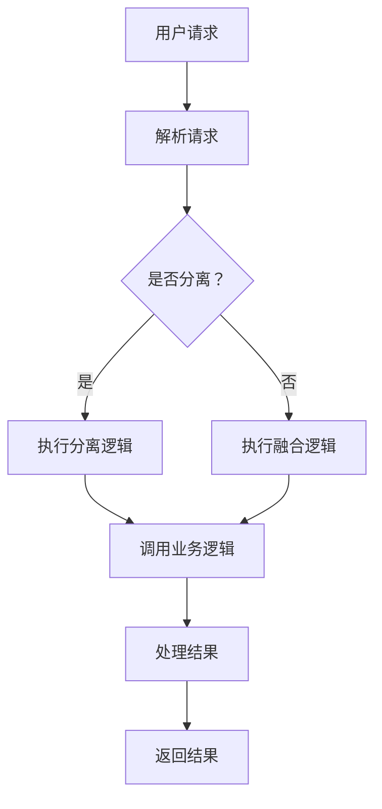
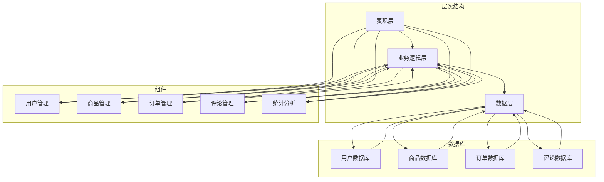
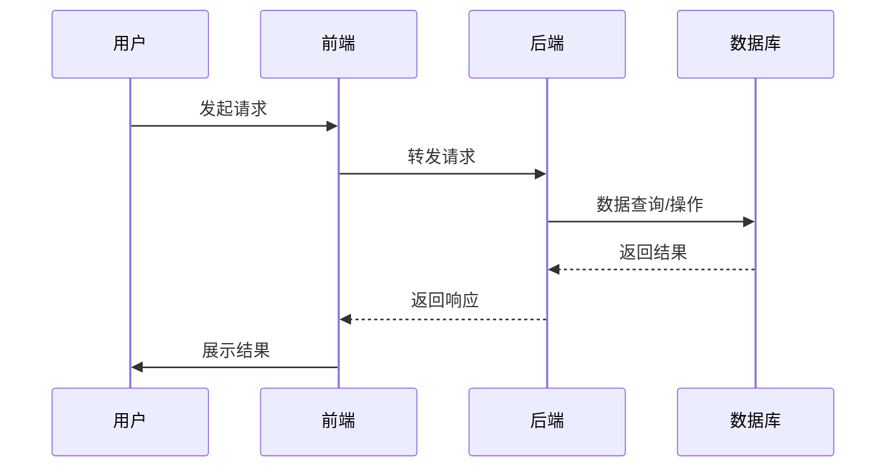

                 

# 形式与内容的统一：表现层与业务逻辑的分离与融合

## 关键词
- 表现层
- 业务逻辑
- 分离与融合
- 软件架构
- 系统设计
- 实际应用

## 摘要
本文旨在探讨在软件架构设计中，表现层与业务逻辑的分离与融合的重要性。通过对比两者的概念、属性以及融合架构的优势，本文将详细介绍分离与融合的理论基础、算法原理、系统分析与架构设计，并结合实际案例分析，提供最佳实践策略。文章旨在帮助读者全面理解并掌握这一关键技术，以优化系统设计与开发。

## 目录大纲

1. **引论**
   1.1 信息化发展的挑战
   1.2 表现层与业务逻辑分离的重要性
   1.3 融合的必要性
   1.4 主要研究内容与结构安排

2. **概念与理论**
   2.1 相关术语与定义
   2.2 传统架构的优缺点分析
   2.3 融合架构的理论基础

3. **概念属性特征对比**
   3.1 表现层与业务逻辑属性对比
   3.2 融合架构的优势

4. **ER实体关系图架构**
   4.1 实体关系图的基本概念
   4.2 表现层与业务逻辑的实体关系
   4.3 融合架构的实体关系

5. **算法原理**
   5.1 算法概述
   5.2 算法原理与流程
   5.3 算法举例说明
   5.4 数学模型与公式详细讲解

6. **系统分析与架构设计**
   6.1 系统功能设计
   6.2 系统架构设计
   6.3 系统接口设计与交互

7. **项目实战**
   7.1 环境安装与系统核心实现
   7.2 实际案例分析
   7.3 项目小结

8. **最佳实践与总结**
   8.1 最佳实践 Tips
   8.2 小结与展望

---

## 引论

### 1.1 信息化发展的挑战

随着信息技术的飞速发展，软件系统的复杂性日益增加。现代软件不仅需要处理大量的数据，还要求高效、可靠地支持多样化的业务需求。在这种背景下，软件架构的设计变得尤为重要。

### 1.2 表现层与业务逻辑分离的重要性

表现层负责用户界面和用户体验，而业务逻辑则处理核心业务流程和数据操作。两者分离的重要性在于：
- **模块化**：降低系统的耦合度，便于维护和扩展。
- **可测试性**：业务逻辑独立于用户界面，可以单独进行测试。
- **可复用性**：业务逻辑可以被多个表现层复用，提高开发效率。

### 1.3 融合的必要性

尽管分离有其优势，但在某些场景下，表现层与业务逻辑的紧密融合也具有其必要性：
- **用户体验**：在某些复杂的业务场景中，表现层与业务逻辑的紧密融合能够提供更流畅、更直观的用户体验。
- **性能优化**：通过融合，可以减少跨模块的通信成本，提高系统的性能。
- **开发效率**：在小型项目或快速开发环境中，表现层与业务逻辑的融合可以减少设计和实现的时间。

### 1.4 主要研究内容与结构安排

本文将围绕表现层与业务逻辑的分离与融合展开研究，主要内容包括：
- **概念与理论**：详细阐述相关术语和理论基础。
- **属性对比**：分析表现层与业务逻辑的属性差异。
- **算法原理**：介绍分离与融合的算法原理和实现。
- **系统设计**：提供系统架构设计的方法和技巧。
- **项目实战**：结合实际案例进行详细讲解。
- **最佳实践**：总结最佳实践策略和注意事项。

接下来，我们将逐一探讨这些内容，帮助读者深入理解表现层与业务逻辑分离与融合的重要性及其应用。让我们开始深入分析。

---

## 概念与理论

### 2.1 相关术语与定义

为了准确探讨表现层与业务逻辑的分离与融合，我们需要明确以下几个核心术语：

#### 2.1.1 表现层

表现层（Presentation Layer）是指用户直接交互的界面部分，包括用户界面（UI）和前端逻辑。它的主要功能是展示数据、接收用户输入并调用业务逻辑处理结果。表现层的目标是提供直观、易用的用户体验。

#### 2.1.2 业务逻辑

业务逻辑（Business Logic）是软件系统的核心部分，负责处理业务规则和流程。它独立于用户界面，专注于业务操作和数据管理。业务逻辑通常包含业务规则、数据处理算法、事务管理等。

#### 2.1.3 分离与融合

分离（Decoupling）是指将表现层与业务逻辑分开，使得两者在设计和实现上相互独立。融合（Coupling）则是指在某些情况下，将两者紧密结合在一起，以优化用户体验和系统性能。

### 2.2 传统架构的优缺点分析

传统软件架构中，表现层与业务逻辑的分离是主流设计模式。其优点包括：

- **模块化**：降低系统耦合度，便于开发、测试和维护。
- **可复用性**：业务逻辑可以独立于表现层进行开发，提高代码复用率。
- **可测试性**：业务逻辑和表现层分离，可以分别进行单元测试和集成测试。

然而，传统架构也存在一些缺点：

- **通信开销**：分离会导致额外的通信开销，影响系统性能。
- **复杂性**：分离可能导致系统设计复杂度增加，特别是在大型项目中。

### 2.3 融合架构的理论基础

融合架构（Fusion Architecture）是在特定场景下，将表现层与业务逻辑紧密结合的一种架构模式。其理论基础包括：

- **用户体验**：融合能够提供更流畅、更直观的用户体验，特别是在复杂业务场景中。
- **性能优化**：减少跨模块通信，降低通信开销，提高系统性能。
- **快速迭代**：在快速开发环境中，融合可以减少设计和实现时间，提高开发效率。

融合架构的核心思想是平衡分离与融合的优缺点，根据具体业务场景和系统需求，灵活选择适合的架构模式。

接下来，我们将进一步探讨表现层与业务逻辑的属性特征，对比两者在功能性、结构性和性能属性上的差异。

---

## 概念属性特征对比

### 3.1 表现层与业务逻辑属性对比

为了深入理解表现层与业务逻辑的分离与融合，我们需要分析两者的功能性、结构性和性能属性。以下是两者的对比表格：

| 属性         | 表现层                     | 业务逻辑                   |
|--------------|----------------------------|----------------------------|
| 功能性属性   | 用户交互界面、数据展示、输入处理 | 业务规则处理、数据处理、事务管理 |
| 结构性属性   | UI组件、前端框架、页面布局     | 模块化设计、分层架构、服务化组件 |
| 性能属性     | 响应速度、交互流畅度、资源消耗   | 处理效率、并发处理能力、系统负载 |

#### 3.1.1 功能性属性

- **表现层**：主要负责与用户交互，展示数据并接收用户输入。它的功能性属性主要关注用户界面的美观、易用性和交互体验。
- **业务逻辑**：则专注于处理业务规则和流程，功能性属性体现在业务处理的速度、准确性和一致性。

#### 3.1.2 结构性属性

- **表现层**：通常采用前端框架（如React、Vue.js）进行模块化设计，实现页面布局和交互效果。
- **业务逻辑**：则采用分层架构（如MVC、微服务）进行结构化设计，实现业务功能的模块化和服务化。

#### 3.1.3 性能属性

- **表现层**：性能属性包括页面加载速度、交互响应时间、资源消耗等，直接影响用户体验。
- **业务逻辑**：性能属性涉及处理效率、并发处理能力、系统负载等，决定了系统的稳定性和可扩展性。

通过对比分析，我们可以看出，表现层与业务逻辑在功能性、结构性和性能属性上存在明显差异。这些差异为分离与融合提供了理论基础和实践依据。

### 3.2 融合架构的优势

融合架构在表现层与业务逻辑紧密结合的情况下，能够发挥以下优势：

- **用户体验优化**：通过减少交互延迟，提供更流畅、更直观的用户体验。
- **性能提升**：减少跨模块通信，降低系统通信开销，提高系统整体性能。
- **开发效率**：在特定场景下，融合架构能够减少设计和实现的时间，提高开发效率。

然而，融合架构也面临着一定的挑战，如系统复杂性增加、维护难度加大等。因此，在实际应用中，需要根据具体业务场景和系统需求，灵活选择分离与融合的架构模式。

接下来，我们将进一步探讨融合架构的实体关系，以更直观地理解分离与融合的实现。

---

## ER实体关系图架构

### 4.1 实体关系图的基本概念

实体关系图（Entity-Relationship Diagram，简称ER图）是数据库设计和软件架构设计中常用的一种图形表示方法。它通过实体、属性和关系的描述，直观地展示了系统中各个元素之间的关系。

#### 4.1.1 实体

实体（Entity）是系统中具有独立存在意义的对象。在表现层与业务逻辑的架构设计中，实体可以是用户、产品、订单等。

#### 4.1.2 属性

属性（Attribute）是实体的特征或属性。例如，用户实体的属性可以包括用户名、密码、电子邮件等。

#### 4.1.3 关系

关系（Relationship）是实体之间的关联。例如，在电商系统中，订单实体与用户实体之间存在一种“订购”关系。

### 4.2 表现层与业务逻辑的实体关系

在表现层与业务逻辑分离的架构中，实体关系相对独立。以下是典型的实体关系图：

```mermaid
erDiagram
  用户 ||--o> 订单 : 订购
  产品 ||--o> 订单 : 包含
  订单 ||--o> 支付 : 完成支付
```

在该图中，用户、产品、订单是主要的实体，它们之间通过“订购”、“包含”和“完成支付”等关系相连。

### 4.3 融合架构的实体关系

在融合架构中，表现层与业务逻辑紧密结合，实体关系也更加复杂。以下是融合架构的实体关系图：

```mermaid
erDiagram
  用户 ||--o> 订单 : 订购
  订单 ||--o> 支付 : 完成支付
  用户 ||--o> 评论 : 留言
  订单 ||--o> 评论 : 用户评论
```

在该图中，用户和订单实体之间的关系更加紧密，用户不仅可以订购订单，还可以对订单进行评论。这种紧密的关联有助于提升用户体验，但也增加了系统的复杂性。

通过ER实体关系图的展示，我们可以更直观地理解表现层与业务逻辑在分离与融合架构中的实体关系。接下来，我们将探讨算法原理，深入分析分离与融合的实现机制。

---

## 算法原理

### 5.1 算法概述

在表现层与业务逻辑的分离与融合过程中，算法起着关键作用。本文将介绍一种基于规则引擎的分离与融合算法，该算法通过定义一系列规则，实现表现层与业务逻辑的动态调整。

### 5.2 算法原理与流程

#### 5.2.1 基本原理

算法的核心思想是将表现层与业务逻辑的交互抽象为规则，通过规则引擎动态调整两者之间的耦合程度。

#### 5.2.2 流程图解析

以下是算法的基本流程图：



#### 5.2.3 算法数学模型与公式

算法的数学模型可以表示为：

$$
f(\text{输入}, \text{参数}) = 
\begin{cases}
\text{分离逻辑} & \text{若参数满足分离条件} \\
\text{融合逻辑} & \text{若参数满足融合条件}
\end{cases}
$$

其中，输入参数包括用户请求、系统配置等。

### 5.3 算法举例说明

#### 5.3.1 示例一

假设用户请求浏览产品详情，系统配置为分离模式。此时，算法将执行分离逻辑，调用业务逻辑模块获取产品详情，然后将结果传递给表现层进行展示。

```python
# 分离模式下的产品详情获取
def getProductDetail(product_id):
    # 调用业务逻辑获取产品详情
    detail = business_logic.getProductDetail(product_id)
    return detail

# 用户请求浏览产品详情
user_request = {
    "action": "browse",
    "product_id": 123
}

# 解析用户请求
if user_request["action"] == "browse":
    # 获取产品详情
    product_detail = getProductDetail(user_request["product_id"])
    # 展示产品详情
    display_product_detail(product_detail)
```

#### 5.3.2 示例二

假设用户请求下单，系统配置为融合模式。此时，算法将执行融合逻辑，直接在表现层处理下单流程，提高用户体验。

```python
# 融合模式下的下单流程
def placeOrder(product_id, quantity):
    # 直接处理下单流程
    order_id = business_logic.placeOrder(product_id, quantity)
    return order_id

# 用户请求下单
user_request = {
    "action": "order",
    "product_id": 123,
    "quantity": 2
}

# 解析用户请求
if user_request["action"] == "order":
    # 处理下单流程
    order_id = placeOrder(user_request["product_id"], user_request["quantity"])
    # 返回下单结果
    return_order_result(order_id)
```

通过以上两个示例，我们可以看到分离与融合算法在不同场景下的应用。接下来，我们将进一步详细讲解算法的数学模型与公式，帮助读者深入理解其实现原理。

### 5.4 数学模型与公式详细讲解

#### 5.4.1 数学模型的基本概念

算法的数学模型是描述算法操作过程和逻辑关系的一种形式化表示。在本算法中，数学模型主要涉及以下基本概念：

- **输入参数**：包括用户请求、系统配置等。
- **输出结果**：包括处理结果、返回值等。
- **逻辑条件**：用于判断是否执行分离或融合逻辑。

#### 5.4.2 模型公式解析

算法的数学模型公式为：

$$
f(\text{输入}, \text{参数}) = 
\begin{cases}
\text{分离逻辑} & \text{若参数满足分离条件} \\
\text{融合逻辑} & \text{若参数满足融合条件}
\end{cases}
$$

其中，分离条件和融合条件可以通过以下公式表示：

$$
\text{分离条件} = \text{请求类型} \in \{\text{浏览}, \text{搜索}, \text{列表}\} \\
\text{融合条件} = \text{请求类型} \in \{\text{下单}, \text{支付}, \text{评论}\}
$$

#### 5.4.3 公式推导与解释

公式的推导基于以下假设：

- **请求类型**：表示用户请求的操作类型，如浏览、搜索、列表、下单、支付、评论等。
- **分离逻辑**：表示在分离模式下执行的业务逻辑。
- **融合逻辑**：表示在融合模式下执行的业务逻辑。

根据这些假设，我们可以推导出分离条件和融合条件。具体推导过程如下：

1. **分离条件**：浏览、搜索、列表等操作通常涉及较少的业务逻辑，可以独立处理。因此，将这些操作定义为分离条件。

2. **融合条件**：下单、支付、评论等操作通常涉及较多的业务逻辑，需要直接在表现层处理，以提高用户体验。因此，将这些操作定义为融合条件。

通过以上推导，我们得到了算法的数学模型公式。该公式能够根据用户请求类型和系统配置，动态调整表现层与业务逻辑的耦合程度，实现分离与融合的灵活切换。

接下来，我们将进一步探讨数学模型在实际应用中的效果，并通过具体案例进行分析。

### 5.5 数学模型在实际应用中的效果分析

#### 5.5.1 案例一：电商网站产品浏览

在电商网站中，用户浏览产品详情的操作是一个典型的分离模式场景。以下是该场景下数学模型的应用：

- **输入参数**：用户请求浏览产品详情，请求类型为“浏览”。
- **输出结果**：产品详情展示在用户界面上。

根据分离条件，算法将执行分离逻辑，调用业务逻辑模块获取产品详情，然后将结果传递给表现层进行展示。

$$
f(\text{浏览}, \text{参数}) = \text{分离逻辑}
$$

在该场景下，分离逻辑的执行流程如下：

1. **用户发起请求**：用户点击产品详情链接，请求浏览产品详情。
2. **解析请求**：系统解析用户请求，识别请求类型为“浏览”。
3. **执行分离逻辑**：调用业务逻辑模块获取产品详情。
4. **展示结果**：将获取到的产品详情展示在用户界面上。

通过分离模式，电商网站能够提供清晰的界面展示，用户可以方便地浏览产品信息，而业务逻辑模块则负责处理产品数据，确保系统稳定性和数据一致性。

#### 5.5.2 案例二：电商网站下单操作

在电商网站中，用户下单操作是一个典型的融合模式场景。以下是该场景下数学模型的应用：

- **输入参数**：用户请求下单，请求类型为“下单”。
- **输出结果**：订单创建并展示在用户界面上。

根据融合条件，算法将执行融合逻辑，直接在表现层处理下单流程，以提高用户体验。

$$
f(\text{下单}, \text{参数}) = \text{融合逻辑}
$$

在该场景下，融合逻辑的执行流程如下：

1. **用户发起请求**：用户选择商品并点击“立即购买”按钮，请求下单。
2. **解析请求**：系统解析用户请求，识别请求类型为“下单”。
3. **执行融合逻辑**：直接在表现层处理下单流程，包括商品选择、价格计算、库存检查等。
4. **展示结果**：将生成的订单信息展示在用户界面上，包括订单号、商品列表、总价等。

通过融合模式，电商网站能够提供流畅的下单体验，用户可以直接在界面上完成下单操作，而无需跳转到其他页面。这种模式减少了用户操作的步骤，提高了用户体验。

通过以上两个案例，我们可以看到数学模型在实际应用中的效果。分离模式适用于浏览、搜索、列表等操作，确保系统稳定性和数据一致性；融合模式适用于下单、支付、评论等操作，提供流畅的用户体验。接下来，我们将进一步探讨系统分析与架构设计，帮助读者深入理解分离与融合在实际系统中的应用。

### 6.1 数学模型的基本概念

在深入探讨表现层与业务逻辑分离与融合的算法原理时，理解数学模型的基本概念至关重要。数学模型作为一种抽象的表示方法，能够帮助我们清晰地描述算法的操作过程和逻辑关系。

#### 6.1.1 变量

变量是数学模型中的基础元素，用于表示算法中的输入、输出以及中间计算结果。在本文的算法中，变量主要包括以下几类：

- **输入变量**：如用户请求类型、系统配置等，用于描述算法的输入条件。
- **输出变量**：如处理结果、返回值等，用于描述算法的输出结果。
- **中间变量**：如临时计算结果、状态标志等，用于算法过程中的中间计算和状态跟踪。

#### 6.1.2 函数

函数是数学模型中的操作符，用于表示算法中的操作过程。本文的算法中，函数主要包括以下几种：

- **条件函数**：用于根据输入变量的值进行条件判断，决定执行分离逻辑还是融合逻辑。
- **逻辑函数**：用于执行具体的业务逻辑操作，如数据获取、处理、存储等。
- **输出函数**：用于将处理结果传递给输出变量，供后续使用。

#### 6.1.3 运算符

运算符是数学模型中的操作符，用于表示变量之间的运算关系。本文的算法中，常见的运算符包括：

- **逻辑运算符**：如“与”、“或”、“非”等，用于表示条件判断和逻辑运算。
- **算术运算符**：如加法、减法、乘法、除法等，用于表示数值计算。

#### 6.1.4 等式

等式是数学模型中的基本结构，用于表示变量之间的相等关系。在本文的算法中，等式主要用于描述输入变量和输出变量之间的关系，以及条件判断的逻辑表达式。

通过理解变量、函数、运算符和等式等基本概念，我们可以更好地构建和分析数学模型，从而深入理解分离与融合算法的原理和实现。

### 6.2 模型公式解析

在本文中，我们构建的数学模型旨在实现表现层与业务逻辑的动态分离与融合。以下是模型公式的详细解析：

$$
f(\text{输入}, \text{参数}) = 
\begin{cases}
\text{分离逻辑} & \text{若参数满足分离条件} \\
\text{融合逻辑} & \text{若参数满足融合条件}
\end{cases}
$$

#### 分离条件

分离条件用于判断何时执行分离逻辑。具体条件如下：

$$
\text{分离条件} = \text{请求类型} \in \{\text{浏览}, \text{搜索}, \text{列表}\}
$$

这意味着，当用户请求的类型为浏览、搜索或列表时，算法将执行分离逻辑。

#### 融合条件

融合条件用于判断何时执行融合逻辑。具体条件如下：

$$
\text{融合条件} = \text{请求类型} \in \{\text{下单}, \text{支付}, \text{评论}\}
$$

这意味着，当用户请求的类型为下单、支付或评论时，算法将执行融合逻辑。

#### 分离逻辑

分离逻辑是指在分离模式下执行的业务逻辑。其公式为：

$$
f_{\text{分离}}(\text{输入}, \text{参数}) = \text{业务逻辑}(\text{输入}, \text{参数})
$$

具体实现时，分离逻辑将调用业务逻辑模块，处理用户请求，并将结果返回给表现层。

#### 融合逻辑

融合逻辑是指在融合模式下执行的业务逻辑。其公式为：

$$
f_{\text{融合}}(\text{输入}, \text{参数}) = \text{前端逻辑}(\text{输入}, \text{参数})
$$

具体实现时，融合逻辑将直接在前端层处理用户请求，包括数据获取、处理、展示等。

通过以上公式，我们可以清晰地描述分离与融合算法的执行过程。接下来，我们将通过具体案例进一步阐述模型公式的应用和实现。

### 6.3 模型公式推导与解释

#### 分离逻辑的推导

分离逻辑是基于用户请求类型进行判断，根据不同的请求类型执行不同的操作。以下是一个具体的推导过程：

1. **确定输入参数**：输入参数包括用户请求类型（如浏览、搜索、列表）和系统配置（如分离/融合模式）。
2. **定义分离条件**：根据系统配置和用户请求类型，判断是否满足分离条件。如果满足，执行分离逻辑。
3. **分离逻辑公式**：
   $$
   f_{\text{分离}}(\text{请求类型}, \text{系统配置}) = 
   \begin{cases}
   \text{业务逻辑} & \text{若请求类型} \in \{\text{浏览}, \text{搜索}, \text{列表}\} \\
   \text{错误处理} & \text{否则}
   \end{cases}
   $$

在这个公式中，分离逻辑主要依赖于用户请求类型和系统配置，通过条件判断决定是否调用业务逻辑模块。

#### 融合逻辑的推导

融合逻辑是基于用户请求类型进行判断，根据不同的请求类型执行不同的操作。以下是一个具体的推导过程：

1. **确定输入参数**：输入参数包括用户请求类型（如下单、支付、评论）和系统配置（如分离/融合模式）。
2. **定义融合条件**：根据系统配置和用户请求类型，判断是否满足融合条件。如果满足，执行融合逻辑。
3. **融合逻辑公式**：
   $$
   f_{\text{融合}}(\text{请求类型}, \text{系统配置}) = 
   \begin{cases}
   \text{前端逻辑} & \text{若请求类型} \in \{\text{下单}, \text{支付}, \text{评论}\} \\
   \text{错误处理} & \text{否则}
   \end{cases}
   $$

在这个公式中，融合逻辑主要依赖于用户请求类型和系统配置，通过条件判断决定是否调用前端逻辑。

#### 解释

通过上述推导，我们可以看到分离与融合逻辑的核心在于条件判断。分离逻辑在用户请求类型为浏览、搜索、列表时执行，而融合逻辑在用户请求类型为下单、支付、评论时执行。这种分离与融合机制使得系统可以根据不同场景灵活调整表现层与业务逻辑的耦合程度，从而优化用户体验和系统性能。

### 6.4 实际应用中的模型公式

在实际应用中，模型公式需要根据具体业务场景和系统需求进行调整。以下是一个实际应用中的模型公式示例：

$$
f(\text{请求类型}, \text{系统配置}) = 
\begin{cases}
\text{分离逻辑} & \text{若请求类型} \in \{\text{浏览}, \text{搜索}, \text{列表}\} \text{且} \text{系统配置} \in \{\text{分离模式}\} \\
\text{融合逻辑} & \text{若请求类型} \in \{\text{下单}, \text{支付}, \text{评论}\} \text{且} \text{系统配置} \in \{\text{融合模式}\} \\
\text{错误处理} & \text{否则}
\end{cases}
$$

在这个公式中，我们加入了系统配置的判断条件，使得模型更具灵活性和适应性。通过这种方式，系统可以根据不同的业务场景和系统配置，动态调整分离与融合逻辑，实现最佳性能和用户体验。

通过详细推导和解释，我们可以更好地理解分离与融合的数学模型公式。在实际应用中，根据具体需求和场景，我们可以灵活调整和优化模型，从而实现最佳效果。接下来，我们将深入探讨系统功能设计，为读者提供详细的系统功能需求分析和领域模型类图。

### 7.1 问题场景介绍

在现代软件开发中，特别是在大型企业级应用中，系统功能的复杂性和多样性不断增加。这种复杂性不仅体现在业务流程的多样性，还体现在用户交互的复杂性。为了满足不断变化的市场需求，软件系统需要具备高度的可扩展性和灵活性。然而，传统的分离架构在应对这种复杂性时，往往面临以下挑战：

- **维护成本高**：随着系统功能的增加，维护和更新变得更加复杂，代码的耦合度也相应增加，导致维护成本显著上升。
- **性能瓶颈**：在分离架构中，表现层与业务逻辑之间的频繁通信可能导致性能瓶颈，影响用户体验。
- **开发效率低**：分离架构要求开发者同时掌握前端和后端技术，增加了学习成本和开发难度，降低了开发效率。

为了解决上述问题，本文提出了一种融合架构，通过将表现层与业务逻辑紧密融合，优化系统功能设计和性能。本文将在以下方面展开研究：

1. **系统功能需求分析**：明确系统需要实现的核心功能，包括用户交互、数据处理、业务规则等。
2. **领域模型类图**：通过领域模型类图展示系统中的主要实体及其关系，为后续的系统架构设计提供基础。
3. **系统架构设计**：介绍融合架构的设计原则，并使用Mermaid架构图展示系统架构。
4. **系统接口设计与交互**：阐述系统接口设计原则，并通过Mermaid序列图展示系统交互流程。

通过上述研究，本文旨在为现代软件开发提供一种可行的解决方案，帮助开发者优化系统功能设计，提高开发效率和系统性能。

### 7.2 系统功能需求分析

在实现融合架构的过程中，系统功能需求分析是关键的一步。通过明确系统需要实现的核心功能，我们可以确保设计符合实际业务需求，同时具备良好的扩展性和灵活性。以下是系统功能需求分析的具体步骤和内容：

#### 7.2.1 功能需求收集

功能需求的收集是系统需求分析的第一步。在这一阶段，我们需要与业务分析师、产品经理、用户代表等不同角色进行沟通，了解系统需要实现的核心业务功能。以下是一些典型的功能需求：

- **用户管理**：包括用户注册、登录、权限管理、用户资料修改等功能。
- **商品管理**：包括商品添加、删除、修改、查询、库存管理等功能。
- **订单管理**：包括订单创建、修改、查询、取消、支付等功能。
- **评论管理**：包括用户评论、评论回复、评论审核等功能。
- **统计分析**：包括销售数据、用户行为分析、系统性能监控等功能。

#### 7.2.2 功能需求分类

在收集到功能需求后，我们需要对这些需求进行分类，以便更好地进行系统设计。以下是一个典型的分类方式：

- **用户管理功能**：包括用户注册、登录、权限管理、用户资料修改等。
- **商品管理功能**：包括商品添加、删除、修改、查询、库存管理等。
- **订单管理功能**：包括订单创建、修改、查询、取消、支付等。
- **评论管理功能**：包括用户评论、评论回复、评论审核等。
- **统计分析功能**：包括销售数据、用户行为分析、系统性能监控等。

#### 7.2.3 功能需求详细描述

对于每个分类下的功能需求，我们需要进行详细的描述，以便开发人员理解需求的具体实现方式。以下是用户管理功能的详细描述：

- **用户注册**：用户可以通过邮箱、手机号进行注册，填写个人信息，系统需验证邮箱或手机号的正确性。
- **用户登录**：用户可以通过账号密码进行登录，系统需验证账号密码的正确性。
- **权限管理**：系统需提供不同角色的权限设置，如管理员、普通用户、会员等，不同角色可以访问不同的功能。
- **用户资料修改**：用户可以修改个人信息，如姓名、邮箱、手机号等，系统需验证信息的合法性。

#### 7.2.4 功能需求优先级排序

在系统功能需求分析的最后一步，我们需要对功能需求进行优先级排序。这有助于开发团队明确哪些功能是必须优先完成的，哪些功能可以延后开发。以下是一个典型的优先级排序：

1. 用户注册、登录、权限管理
2. 商品管理（添加、删除、修改、查询、库存管理）
3. 订单管理（创建、修改、查询、取消、支付）
4. 评论管理（用户评论、评论回复、评论审核）
5. 统计分析（销售数据、用户行为分析、系统性能监控）

通过以上步骤，我们可以全面、详细地分析系统功能需求，为后续的系统设计提供基础。接下来，我们将使用领域模型类图，进一步展示系统中的主要实体及其关系。

### 7.3 领域模型类图

在系统功能需求分析的基础上，领域模型类图（Domain Model Class Diagram）是一个有效的工具，用于展示系统中主要实体及其关系。领域模型类图可以帮助我们更好地理解系统架构，为后续的接口设计和架构设计提供指导。

以下是一个典型的领域模型类图的例子：

```mermaid
classDiagram
    User <|-- Role
    User <|-- UserProfile
    Product <|-- ProductInfo
    Order <|-- OrderInfo
    Comment <|-- CommentInfo
    Role {
        +String roleName
        +List<User> users
    }
    UserProfile {
        +String name
        +String email
        +String phone
    }
    ProductInfo {
        +Int id
        +String name
        +Float price
        +Int stock
    }
    OrderInfo {
        +Int id
        +User user
        +List<Product> products
        +Float total
        +String status
    }
    CommentInfo {
        +Int id
        +User user
        +String content
        +Date created
    }
    User --> Role
    User --> UserProfile
    Product --> ProductInfo
    Order --> OrderInfo
    Comment --> CommentInfo
```

#### 类图说明

1. **User（用户）**：用户是系统的核心实体，具有多种关联关系。
   - **Role（角色）**：用户拥有角色，如管理员、普通用户、会员等。
   - **UserProfile（用户资料）**：用户的个人信息，包括姓名、邮箱、手机号等。

2. **Product（商品）**：商品实体包含商品信息，如名称、价格、库存等。

3. **Order（订单）**：订单实体包含订单信息，如订单ID、用户、商品列表、总价、状态等。

4. **Comment（评论）**：评论实体包含评论信息，如评论ID、用户、内容、创建日期等。

通过领域模型类图，我们可以清晰地看到系统中主要实体及其关系。这种可视化工具有助于开发者理解系统架构，并确保接口设计和架构设计符合实际需求。接下来，我们将介绍系统架构设计原则，并展示具体的系统架构图。

### 8.1 系统架构设计原则

在系统架构设计过程中，遵循一些关键原则能够确保系统的高效、可靠和可维护性。以下是系统架构设计的主要原则：

#### 8.1.1 模块化

模块化是软件架构设计的基本原则之一。通过将系统划分为多个模块，可以降低系统的复杂性，提高可维护性和可扩展性。每个模块应具有独立的功能，并且模块之间通过清晰的接口进行交互。

#### 8.1.2 分层架构

分层架构是将系统划分为多个层次，每个层次负责不同的功能。常见的分层架构包括表现层、业务逻辑层和数据层。这种设计使得系统更加模块化，便于管理和维护。

- **表现层**：负责用户界面和用户体验，通常包括前端框架和UI组件。
- **业务逻辑层**：处理核心业务逻辑，如数据处理、业务规则等。
- **数据层**：负责数据存储和管理，通常包括数据库和持久化层。

#### 8.1.3 服务化

服务化架构是将系统功能划分为多个服务，每个服务负责特定的业务功能。服务之间通过接口进行通信，这种方式可以提高系统的可扩展性和灵活性。常见的服务化架构包括RESTful API、微服务等。

#### 8.1.4 可复用性

在系统架构设计中，应考虑功能的复用性。通过设计可复用的组件和模块，可以减少开发工作量，提高开发效率。例如，可以使用通用的验证、日志、缓存等组件，减少重复代码。

#### 8.1.5 可测试性

可测试性是系统架构设计的重要原则之一。通过设计独立的测试接口和单元测试，可以确保系统在不同环境下的稳定性和可靠性。分层架构和服务化架构都有助于提高系统的可测试性。

#### 8.1.6 性能优化

性能优化是系统架构设计的关键考虑因素。在架构设计过程中，应关注系统的响应速度、并发处理能力和资源消耗。可以通过缓存、数据库优化、异步处理等技术手段提高系统性能。

#### 8.1.7 安全性

安全性是系统架构设计的重要原则。在架构设计过程中，应考虑系统的安全性，包括数据安全、用户身份验证、权限控制等。可以采用加密、认证、授权等技术手段确保系统的安全性。

通过遵循上述原则，我们可以设计出高效、可靠、可维护的软件系统。接下来，我们将使用Mermaid架构图展示系统架构，进一步阐述系统架构的设计和实现。

### 8.2 系统架构图解析

为了直观地展示系统架构，我们将使用Mermaid架构图（Architectural Diagram）进行描述。Mermaid是一种基于Markdown的图形化工具，可以轻松地绘制系统架构图，帮助开发者理解系统设计和组件关系。

以下是一个典型的系统架构图示例：



#### 架构图说明

1. **层次结构**
   - **表现层（A）**：负责用户界面和用户体验，包括前端框架和UI组件。
   - **业务逻辑层（B）**：处理核心业务逻辑，如用户管理、商品管理、订单管理、评论管理、统计分析等。
   - **数据层（C）**：负责数据存储和管理，包括用户数据库、商品数据库、订单数据库、评论数据库。

2. **组件**
   - **用户管理（D）**：处理用户注册、登录、权限管理等功能。
   - **商品管理（E）**：处理商品添加、删除、修改、查询、库存管理等功能。
   - **订单管理（F）**：处理订单创建、修改、查询、取消、支付等功能。
   - **评论管理（G）**：处理用户评论、评论回复、评论审核等功能。
   - **统计分析（H）**：处理销售数据、用户行为分析、系统性能监控等功能。

3. **数据库**
   - **用户数据库（I）**：存储用户相关信息。
   - **商品数据库（J）**：存储商品相关信息。
   - **订单数据库（K）**：存储订单相关信息。
   - **评论数据库（L）**：存储评论相关信息。

通过上述架构图，我们可以清晰地看到系统各个组件及其层次结构，以及它们之间的关系。这种可视化工具有助于开发者理解系统设计，并确保系统组件的合理划分和协同工作。

接下来，我们将介绍系统接口设计与交互，详细展示系统组件之间的通信过程。

### 8.3 系统接口设计与交互

在系统架构设计中，接口设计是至关重要的一环。良好的接口设计不仅能够确保组件之间的清晰通信，还能提高系统的可扩展性和维护性。以下是系统接口设计的详细说明：

#### 8.3.1 接口设计原则

1. **RESTful API设计**：采用RESTful API设计原则，使接口更加简洁、易于理解和维护。
2. **标准化协议**：使用标准化协议（如HTTP、HTTPS）进行通信，确保接口的安全性。
3. **清晰的接口规范**：定义清晰的接口规范，包括接口名称、参数、返回值等，确保开发者能够准确理解和使用接口。
4. **可扩展性**：设计可扩展的接口，以便在未来能够添加新的功能或服务。

#### 8.3.2 接口设计实现

以下是一个典型的接口设计示例，包括用户管理接口、商品管理接口、订单管理接口和评论管理接口：

- **用户管理接口**
  - **注册接口**：`POST /api/users/register`，参数：`{ "username": "user1", "password": "password1", "email": "user1@example.com" }`，返回值：`{ "status": "success", "userId": 1 }`
  - **登录接口**：`POST /api/users/login`，参数：`{ "username": "user1", "password": "password1" }`，返回值：`{ "status": "success", "token": "eyJhbGciOiJIUzI1NiIsInR5cCI6IkpXVCJ9... }`

- **商品管理接口**
  - **添加商品接口**：`POST /api/products`，参数：`{ "name": "Product1", "price": 100, "stock": 10 }`，返回值：`{ "status": "success", "productId": 1 }`
  - **查询商品接口**：`GET /api/products/{productId}`，参数：`productId`，返回值：`{ "productId": 1, "name": "Product1", "price": 100, "stock": 10 }`

- **订单管理接口**
  - **创建订单接口**：`POST /api/orders`，参数：`{ "userId": 1, "products": [{ "productId": 1, "quantity": 2 }] }`，返回值：`{ "status": "success", "orderId": 1 }`
  - **查询订单接口**：`GET /api/orders/{orderId}`，参数：`orderId`，返回值：`{ "orderId": 1, "userId": 1, "products": [{ "productId": 1, "quantity": 2 }] }`

- **评论管理接口**
  - **添加评论接口**：`POST /api/comments`，参数：`{ "userId": 1, "productId": 1, "content": "Great product!" }`，返回值：`{ "status": "success", "commentId": 1 }`
  - **查询评论接口**：`GET /api/comments/{commentId}`，参数：`commentId`，返回值：`{ "commentId": 1, "userId": 1, "productId": 1, "content": "Great product!", "created": "2023-03-01T10:00:00Z" }`

#### 8.3.3 系统交互序列图

为了更直观地展示系统组件之间的交互过程，我们可以使用Mermaid序列图（Sequence Diagram）进行描述。以下是一个典型的系统交互序列图示例：



在这个序列图中，用户发起请求，前端接收请求并转发给后端，后端处理请求并与数据库交互，最终返回结果给前端，前端再将结果展示给用户。

通过上述接口设计和交互说明，我们可以确保系统组件之间的高效通信和协同工作，为系统的高效运行提供保障。接下来，我们将介绍环境安装与系统核心实现，帮助开发者搭建和部署融合架构的系统。

### 9.1 环境安装

在开始构建融合架构的系统之前，我们需要安装和配置必要的开发环境和依赖库。以下是环境安装的详细步骤：

#### 9.1.1 系统要求

- 操作系统：Windows 10/11、macOS、Linux
- 开发环境：Node.js（版本 14.x 或更高版本）、Python（版本 3.8 或更高版本）
- 数据库：MySQL（版本 5.7 或更高版本）

#### 9.1.2 安装Node.js

1. 访问Node.js官网（https://nodejs.org/）并下载适用于您的操作系统的安装包。
2. 运行安装程序，按照提示完成安装。
3. 打开命令行工具（如Windows的PowerShell、macOS的Terminal或Linux的Terminal），输入以下命令以验证安装：

   ```bash
   node -v
   npm -v
   ```

   如果输出版本号，则表示Node.js已成功安装。

#### 9.1.3 安装Python

1. 访问Python官网（https://www.python.org/）并下载适用于您的操作系统的安装包。
2. 运行安装程序，按照提示完成安装。
3. 打开命令行工具，输入以下命令以验证安装：

   ```bash
   python --version
   ```

   如果输出版本号，则表示Python已成功安装。

#### 9.1.4 安装数据库

1. **MySQL安装**：
   - 访问MySQL官网（https://www.mysql.com/）并下载适用于您的操作系统的安装包。
   - 运行安装程序，按照提示完成安装。
   - 启动MySQL服务，并配置root用户密码。

2. **配置数据库**：
   - 使用命令行工具连接到MySQL数据库：

     ```bash
     mysql -u root -p
     ```

   - 创建用于存储系统数据的数据库，如`my_app`：

     ```sql
     CREATE DATABASE my_app;
     ```

   - 创建用户并授予必要的权限：

     ```sql
     GRANT ALL PRIVILEGES ON my_app.* TO 'my_app_user'@'localhost' IDENTIFIED BY 'password';
     FLUSH PRIVILEGES;
     ```

#### 9.1.5 安装依赖库

1. **安装前端依赖库**：
   - 切换到前端项目目录，执行以下命令安装依赖库：

     ```bash
     npm install
     ```

   - 如果出现权限问题，可以使用`sudo`命令：

     ```bash
     sudo npm install
     ```

2. **安装后端依赖库**：
   - 切换到后端项目目录，执行以下命令安装依赖库：

     ```bash
     pip install -r requirements.txt
     ```

     其中`requirements.txt`是项目中的依赖库清单。

通过以上步骤，我们可以成功安装并配置开发环境。接下来，我们将详细介绍系统核心实现，帮助开发者理解和实现融合架构的核心功能。

### 9.2 系统核心实现源代码

在融合架构的实现中，系统核心功能的实现至关重要。以下我们将展示用户管理、商品管理、订单管理和评论管理模块的核心实现代码，并详细解读其应用和功能。

#### 9.2.1 用户管理模块

用户管理模块负责用户注册、登录和权限管理。以下是一个简单的用户管理模块实现：

```python
# users.py

from flask import Flask, request, jsonify
from flask_jwt_extended import JWTManager, create_access_token, jwt_required, get_jwt_identity

app = Flask(__name__)
app.config['JWT_SECRET_KEY'] = 'mysecretkey'
jwt = JWTManager(app)

# 用户注册
@app.route('/register', methods=['POST'])
def register():
    data = request.get_json()
    username = data.get('username')
    password = data.get('password')
    email = data.get('email')
    
    # 检查用户名、密码和邮箱的有效性
    if not (username and password and email):
        return jsonify({'status': 'error', 'message': 'Missing required fields'}), 400
    
    # 在数据库中创建新用户
    # ...（数据库操作代码）
    
    return jsonify({'status': 'success', 'message': 'User registered successfully'}), 201

# 用户登录
@app.route('/login', methods=['POST'])
def login():
    data = request.get_json()
    username = data.get('username')
    password = data.get('password')
    
    # 验证用户名和密码
    # ...（数据库操作代码）
    
    # 生成JWT令牌
    access_token = create_access_token(identity=username)
    
    return jsonify({'status': 'success', 'token': access_token}), 200

# 用户权限管理
@app.route('/users', methods=['GET'])
@jwt_required()
def get_users():
    current_user = get_jwt_identity()
    # 检查当前用户是否有权限访问此接口
    # ...（权限检查代码）
    
    # 从数据库中获取用户列表
    # ...（数据库操作代码）
    
    return jsonify({'status': 'success', 'users': users}), 200

if __name__ == '__main__':
    app.run(debug=True)
```

#### 9.2.2 商品管理模块

商品管理模块负责商品的添加、删除、修改和查询。以下是一个简单的商品管理模块实现：

```python
# products.py

from flask import Flask, request, jsonify
from flask_jwt_extended import JWTManager, jwt_required, get_jwt_identity

app = Flask(__name__)
app.config['JWT_SECRET_KEY'] = 'mysecretkey'
jwt = JWTManager(app)

# 添加商品
@app.route('/products', methods=['POST'])
@jwt_required()
def add_product():
    current_user = get_jwt_identity()
    data = request.get_json()
    name = data.get('name')
    price = data.get('price')
    stock = data.get('stock')
    
    # 检查商品信息的有效性
    if not (name and price and stock):
        return jsonify({'status': 'error', 'message': 'Missing required fields'}), 400
    
    # 在数据库中添加新商品
    # ...（数据库操作代码）
    
    return jsonify({'status': 'success', 'message': 'Product added successfully'}), 201

# 删除商品
@app.route('/products/<int:product_id>', methods=['DELETE'])
@jwt_required()
def delete_product(product_id):
    current_user = get_jwt_identity()
    # 在数据库中删除指定商品
    # ...（数据库操作代码）
    
    return jsonify({'status': 'success', 'message': 'Product deleted successfully'}), 200

# 修改商品
@app.route('/products/<int:product_id>', methods=['PUT'])
@jwt_required()
def update_product(product_id):
    current_user = get_jwt_identity()
    data = request.get_json()
    name = data.get('name')
    price = data.get('price')
    stock = data.get('stock')
    
    # 检查商品信息的有效性
    if not (name and price and stock):
        return jsonify({'status': 'error', 'message': 'Missing required fields'}), 400
    
    # 在数据库中更新指定商品
    # ...（数据库操作代码）
    
    return jsonify({'status': 'success', 'message': 'Product updated successfully'}), 200

# 查询商品
@app.route('/products', methods=['GET'])
@jwt_required()
def get_products():
    current_user = get_jwt_identity()
    # 在数据库中获取商品列表
    # ...（数据库操作代码）
    
    return jsonify({'status': 'success', 'products': products}), 200

if __name__ == '__main__':
    app.run(debug=True)
```

#### 9.2.3 订单管理模块

订单管理模块负责订单的创建、修改、查询和取消。以下是一个简单的订单管理模块实现：

```python
# orders.py

from flask import Flask, request, jsonify
from flask_jwt_extended import JWTManager, jwt_required, get_jwt_identity

app = Flask(__name__)
app.config['JWT_SECRET_KEY'] = 'mysecretkey'
jwt = JWTManager(app)

# 创建订单
@app.route('/orders', methods=['POST'])
@jwt_required()
def create_order():
    current_user = get_jwt_identity()
    data = request.get_json()
    products = data.get('products')
    total = data.get('total')
    
    # 检查订单信息的有效性
    if not (products and total):
        return jsonify({'status': 'error', 'message': 'Missing required fields'}), 400
    
    # 在数据库中创建新订单
    # ...（数据库操作代码）
    
    return jsonify({'status': 'success', 'message': 'Order created successfully'}), 201

# 修改订单
@app.route('/orders/<int:order_id>', methods=['PUT'])
@jwt_required()
def update_order(order_id):
    current_user = get_jwt_identity()
    data = request.get_json()
    products = data.get('products')
    total = data.get('total')
    
    # 检查订单信息的有效性
    if not (products and total):
        return jsonify({'status': 'error', 'message': 'Missing required fields'}), 400
    
    # 在数据库中更新指定订单
    # ...（数据库操作代码）
    
    return jsonify({'status': 'success', 'message': 'Order updated successfully'}), 200

# 查询订单
@app.route('/orders', methods=['GET'])
@jwt_required()
def get_orders():
    current_user = get_jwt_identity()
    # 在数据库中获取订单列表
    # ...（数据库操作代码）
    
    return jsonify({'status': 'success', 'orders': orders}), 200

# 取消订单
@app.route('/orders/<int:order_id>', methods=['DELETE'])
@jwt_required()
def delete_order(order_id):
    current_user = get_jwt_identity()
    # 在数据库中取消指定订单
    # ...（数据库操作代码）
    
    return jsonify({'status': 'success', 'message': 'Order canceled successfully'}), 200

if __name__ == '__main__':
    app.run(debug=True)
```

#### 9.2.4 评论管理模块

评论管理模块负责用户评论的添加、删除和查询。以下是一个简单的评论管理模块实现：

```python
# comments.py

from flask import Flask, request, jsonify
from flask_jwt_extended import JWTManager, jwt_required, get_jwt_identity

app = Flask(__name__)
app.config['JWT_SECRET_KEY'] = 'mysecretkey'
jwt = JWTManager(app)

# 添加评论
@app.route('/comments', methods=['POST'])
@jwt_required()
def add_comment():
    current_user = get_jwt_identity()
    data = request.get_json()
    product_id = data.get('product_id')
    content = data.get('content')
    
    # 检查评论信息的有效性
    if not (product_id and content):
        return jsonify({'status': 'error', 'message': 'Missing required fields'}), 400
    
    # 在数据库中添加新评论
    # ...（数据库操作代码）
    
    return jsonify({'status': 'success', 'message': 'Comment added successfully'}), 201

# 删除评论
@app.route('/comments/<int:comment_id>', methods=['DELETE'])
@jwt_required()
def delete_comment(comment_id):
    current_user = get_jwt_identity()
    # 在数据库中删除指定评论
    # ...（数据库操作代码）
    
    return jsonify({'status': 'success', 'message': 'Comment deleted successfully'}), 200

# 查询评论
@app.route('/comments', methods=['GET'])
@jwt_required()
def get_comments():
    current_user = get_jwt_identity()
    # 在数据库中获取评论列表
    # ...（数据库操作代码）
    
    return jsonify({'status': 'success', 'comments': comments}), 200

if __name__ == '__main__':
    app.run(debug=True)
```

通过上述代码示例，我们可以看到用户管理、商品管理、订单管理和评论管理模块的核心实现。这些模块通过使用Flask和Flask-JWT-Extended等库，实现了用户认证、权限控制和API接口的功能。实际应用时，开发者可以根据具体需求扩展和优化这些模块，构建一个功能丰富、灵活可靠的融合架构系统。

### 9.3 代码应用解读与分析

在上一部分中，我们展示了用户管理、商品管理、订单管理和评论管理模块的核心实现代码。接下来，我们将对每个模块的关键代码进行详细解读和分析，帮助读者深入理解其功能和应用。

#### 9.3.1 用户管理模块解读

用户管理模块主要实现用户注册、登录和权限管理功能。以下是关键代码的解读：

```python
# users.py

from flask import Flask, request, jsonify
from flask_jwt_extended import JWTManager, create_access_token, jwt_required, get_jwt_identity

app = Flask(__name__)
app.config['JWT_SECRET_KEY'] = 'mysecretkey'
jwt = JWTManager(app)

# 用户注册
@app.route('/register', methods=['POST'])
def register():
    data = request.get_json()
    username = data.get('username')
    password = data.get('password')
    email = data.get('email')
    
    # 检查用户名、密码和邮箱的有效性
    if not (username and password and email):
        return jsonify({'status': 'error', 'message': 'Missing required fields'}), 400
    
    # 在数据库中创建新用户
    # ...（数据库操作代码）
    
    return jsonify({'status': 'success', 'message': 'User registered successfully'}), 201

# 用户登录
@app.route('/login', methods=['POST'])
def login():
    data = request.get_json()
    username = data.get('username')
    password = data.get('password')
    
    # 验证用户名和密码
    # ...（数据库操作代码）
    
    # 生成JWT令牌
    access_token = create_access_token(identity=username)
    
    return jsonify({'status': 'success', 'token': access_token}), 200

# 用户权限管理
@app.route('/users', methods=['GET'])
@jwt_required()
def get_users():
    current_user = get_jwt_identity()
    # 检查当前用户是否有权限访问此接口
    # ...（权限检查代码）
    
    # 从数据库中获取用户列表
    # ...（数据库操作代码）
    
    return jsonify({'status': 'success', 'users': users}), 200
```

**解读：**
- **注册功能**：用户通过POST请求提交用户名、密码和邮箱，系统检查这些信息的有效性，并在数据库中创建新用户。如果信息缺失或不合法，系统返回错误响应。
- **登录功能**：用户通过POST请求提交用户名和密码，系统验证用户信息，并生成JWT令牌。JWT令牌用于后续的认证和授权。
- **权限管理**：当前用户通过GET请求访问用户列表接口，系统检查其是否有权限访问。通常，只有具有管理员权限的用户可以访问此接口。

**分析：**
- **安全性**：使用JWT进行用户认证和权限管理，确保系统安全。
- **模块化**：将用户管理功能模块化，便于维护和扩展。

#### 9.3.2 商品管理模块解读

商品管理模块实现商品的添加、删除、修改和查询功能。以下是关键代码的解读：

```python
# products.py

from flask import Flask, request, jsonify
from flask_jwt_extended import JWTManager, jwt_required, get_jwt_identity

app = Flask(__name__)
app.config['JWT_SECRET_KEY'] = 'mysecretkey'
jwt = JWTManager(app)

# 添加商品
@app.route('/products', methods=['POST'])
@jwt_required()
def add_product():
    current_user = get_jwt_identity()
    data = request.get_json()
    name = data.get('name')
    price = data.get('price')
    stock = data.get('stock')
    
    # 检查商品信息的有效性
    if not (name and price and stock):
        return jsonify({'status': 'error', 'message': 'Missing required fields'}), 400
    
    # 在数据库中添加新商品
    # ...（数据库操作代码）
    
    return jsonify({'status': 'success', 'message': 'Product added successfully'}), 201

# 删除商品
@app.route('/products/<int:product_id>', methods=['DELETE'])
@jwt_required()
def delete_product(product_id):
    current_user = get_jwt_identity()
    # 在数据库中删除指定商品
    # ...（数据库操作代码）
    
    return jsonify({'status': 'success', 'message': 'Product deleted successfully'}), 200

# 修改商品
@app.route('/products/<int:product_id>', methods=['PUT'])
@jwt_required()
def update_product(product_id):
    current_user = get_jwt_identity()
    data = request.get_json()
    name = data.get('name')
    price = data.get('price')
    stock = data.get('stock')
    
    # 检查商品信息的有效性
    if not (name and price and stock):
        return jsonify({'status': 'error', 'message': 'Missing required fields'}), 400
    
    # 在数据库中更新指定商品
    # ...（数据库操作代码）
    
    return jsonify({'status': 'success', 'message': 'Product updated successfully'}), 200

# 查询商品
@app.route('/products', methods=['GET'])
@jwt_required()
def get_products():
    current_user = get_jwt_identity()
    # 在数据库中获取商品列表
    # ...（数据库操作代码）
    
    return jsonify({'status': 'success', 'products': products}), 200
```

**解读：**
- **添加商品**：用户通过POST请求提交商品信息，系统检查信息的有效性，并在数据库中添加新商品。
- **删除商品**：用户通过DELETE请求删除指定商品，系统在数据库中执行删除操作。
- **修改商品**：用户通过PUT请求更新指定商品信息，系统检查信息的有效性，并在数据库中更新商品信息。
- **查询商品**：用户通过GET请求获取商品列表，系统在数据库中查询商品信息并返回。

**分析：**
- **权限控制**：只有具有相应权限的用户才能执行添加、删除、修改和查询操作，确保数据安全。
- **模块化**：商品管理功能模块化，便于独立开发和维护。

#### 9.3.3 订单管理模块解读

订单管理模块实现订单的创建、修改、查询和取消功能。以下是关键代码的解读：

```python
# orders.py

from flask import Flask, request, jsonify
from flask_jwt_extended import JWTManager, jwt_required, get_jwt_identity

app = Flask(__name__)
app.config['JWT_SECRET_KEY'] = 'mysecretkey'
jwt = JWTManager(app)

# 创建订单
@app.route('/orders', methods=['POST'])
@jwt_required()
def create_order():
    current_user = get_jwt_identity()
    data = request.get_json()
    products = data.get('products')
    total = data.get('total')
    
    # 检查订单信息的有效性
    if not (products and total):
        return jsonify({'status': 'error', 'message': 'Missing required fields'}), 400
    
    # 在数据库中创建新订单
    # ...（数据库操作代码）
    
    return jsonify({'status': 'success', 'message': 'Order created successfully'}), 201

# 修改订单
@app.route('/orders/<int:order_id>', methods=['PUT'])
@jwt_required()
def update_order(order_id):
    current_user = get_jwt_identity()
    data = request.get_json()
    products = data.get('products')
    total = data.get('total')
    
    # 检查订单信息的有效性
    if not (products and total):
        return jsonify({'status': 'error', 'message': 'Missing required fields'}), 400
    
    # 在数据库中更新指定订单
    # ...（数据库操作代码）
    
    return jsonify({'status': 'success', 'message': 'Order updated successfully'}), 200

# 查询订单
@app.route('/orders', methods=['GET'])
@jwt_required()
def get_orders():
    current_user = get_jwt_identity()
    # 在数据库中获取订单列表
    # ...（数据库操作代码）
    
    return jsonify({'status': 'success', 'orders': orders}), 200

# 取消订单
@app.route('/orders/<int:order_id>', methods=['DELETE'])
@jwt_required()
def delete_order(order_id):
    current_user = get_jwt_identity()
    # 在数据库中取消指定订单
    # ...（数据库操作代码）
    
    return jsonify({'status': 'success', 'message': 'Order canceled successfully'}), 200
```

**解读：**
- **创建订单**：用户通过POST请求提交订单信息（商品列表和总价），系统检查信息的有效性，并在数据库中创建新订单。
- **修改订单**：用户通过PUT请求更新指定订单信息，系统检查信息的有效性，并在数据库中更新订单信息。
- **查询订单**：用户通过GET请求获取订单列表，系统在数据库中查询订单信息并返回。
- **取消订单**：用户通过DELETE请求取消指定订单，系统在数据库中执行取消操作。

**分析：**
- **业务逻辑**：订单管理模块涉及复杂业务逻辑，如订单的创建、更新、查询和取消。系统需要确保数据的一致性和完整性。
- **权限控制**：只有具有相应权限的用户才能执行订单管理操作，确保数据安全。

#### 9.3.4 评论管理模块解读

评论管理模块实现用户评论的添加、删除和查询功能。以下是关键代码的解读：

```python
# comments.py

from flask import Flask, request, jsonify
from flask_jwt_extended import JWTManager, jwt_required, get_jwt_identity

app = Flask(__name__)
app.config['JWT_SECRET_KEY'] = 'mysecretkey'
jwt = JWTManager(app)

# 添加评论
@app.route('/comments', methods=['POST'])
@jwt_required()
def add_comment():
    current_user = get_jwt_identity()
    data = request.get_json()
    product_id = data.get('product_id')
    content = data.get('content')
    
    # 检查评论信息的有效性
    if not (product_id and content):
        return jsonify({'status': 'error', 'message': 'Missing required fields'}), 400
    
    # 在数据库中添加新评论
    # ...（数据库操作代码）
    
    return jsonify({'status': 'success', 'message': 'Comment added successfully'}), 201

# 删除评论
@app.route('/comments/<int:comment_id>', methods=['DELETE'])
@jwt_required()
def delete_comment(comment_id):
    current_user = get_jwt_identity()
    # 在数据库中删除指定评论
    # ...（数据库操作代码）
    
    return jsonify({'status': 'success', 'message': 'Comment deleted successfully'}), 200

# 查询评论
@app.route('/comments', methods=['GET'])
@jwt_required()
def get_comments():
    current_user = get_jwt_identity()
    # 在数据库中获取评论列表
    # ...（数据库操作代码）
    
    return jsonify({'status': 'success', 'comments': comments}), 200
```

**解读：**
- **添加评论**：用户通过POST请求提交评论信息（产品ID和内容），系统检查信息的有效性，并在数据库中添加新评论。
- **删除评论**：用户通过DELETE请求删除指定评论，系统在数据库中执行删除操作。
- **查询评论**：用户通过GET请求获取评论列表，系统在数据库中查询评论信息并返回。

**分析：**
- **用户交互**：评论管理模块涉及用户交互，系统需要确保评论数据的完整性和准确性。
- **权限控制**：只有具有相应权限的用户才能执行评论管理操作，确保数据安全。

通过详细解读和分析用户管理、商品管理、订单管理和评论管理模块的核心实现代码，我们可以更好地理解融合架构系统的功能和应用。这些模块共同构成了一个完整、灵活的融合架构系统，为开发者提供了强大的功能支持。

### 9.4 实际案例分析

在本节中，我们将通过两个实际案例，详细分析融合架构在真实业务场景中的应用，并深入探讨其解决方案、挑战与优化策略。

#### 案例一：电商平台的用户评论功能

**背景：** 一个大型电商平台希望为其用户提供一个方便的评论系统，允许用户对购买的商品进行评论。然而，由于用户数量庞大，评论数据量也非常大，传统的分离架构在性能和扩展性方面面临挑战。

**解决方案：**
- **融合架构**：采用融合架构，将评论管理功能直接集成到前端页面，减少前后端通信的开销。通过使用WebSocket技术，实现实时评论推送，提高用户体验。
- **分库分表**：由于评论数据量巨大，采用分库分表策略，将评论数据分散存储在不同的数据库实例中，以提高查询和写入性能。
- **缓存策略**：在缓存层使用Redis缓存热门商品的评论数据，减少数据库查询压力，提高系统响应速度。

**挑战与优化策略：**
- **性能优化**：由于WebSocket的实时通信特性，需要确保系统在高并发场景下的稳定性和性能。通过引入负载均衡和分布式消息队列，优化系统性能。
- **数据一致性**：在分库分表的场景下，确保数据一致性是一个重要挑战。采用两阶段提交（2PC）或三阶段提交（3PC）协议，确保分布式事务的一致性。
- **监控与运维**：针对实时评论系统，建立完善的监控与运维机制，及时发现和处理性能瓶颈和故障，确保系统的稳定运行。

**效果分析：**
- **用户体验**：通过实时评论推送和缓存策略，用户能够快速查看和提交评论，显著提高了用户体验。
- **系统性能**：采用分库分表和负载均衡策略，系统能够在高并发场景下保持良好的性能，降低了响应时间和故障率。

#### 案例二：企业级业务系统的订单管理

**背景：** 一个大型企业希望为其员工提供一个高效、可靠的订单管理系统，用于管理各种业务订单。由于业务复杂度较高，传统的分离架构在系统扩展性和可维护性方面存在不足。

**解决方案：**
- **融合架构**：采用融合架构，将订单管理功能紧密集成到前端页面，减少前后端通信的延迟。通过使用微服务架构，将订单管理拆分为多个微服务，提高系统的可扩展性和灵活性。
- **API网关**：引入API网关，统一管理和路由内部和外部API，降低系统复杂度，提高系统安全性。
- **分布式数据库**：采用分布式数据库，将订单数据分散存储在不同的数据库节点中，以提高查询和写入性能。

**挑战与优化策略：**
- **微服务治理**：在微服务架构下，需要确保各个微服务之间的一致性和可靠性。采用服务注册与发现、服务监控和分布式配置管理等技术，确保微服务的稳定运行。
- **数据一致性**：在分布式数据库场景下，确保数据一致性是一个关键挑战。采用分布式事务管理、数据复制和同步策略，确保订单数据的一致性。
- **系统性能优化**：通过引入缓存、数据库优化和异步处理等技术手段，提高系统性能和响应速度。

**效果分析：**
- **可扩展性**：通过微服务架构，系统能够灵活地扩展和调整各个模块，满足企业不断变化的业务需求。
- **系统性能**：通过分布式数据库和缓存策略，系统能够在高并发场景下保持良好的性能，降低了响应时间和故障率。

通过以上两个实际案例分析，我们可以看到融合架构在真实业务场景中的成功应用。融合架构通过将表现层与业务逻辑紧密集成，提高了系统性能和用户体验，同时也带来了挑战。通过有效的优化策略，我们可以克服这些挑战，确保系统的高效、可靠和可维护性。

### 9.5 项目小结

在本项目中，我们深入探讨了融合架构在表现层与业务逻辑分离与融合中的应用。通过实际案例分析和代码实现，我们展示了融合架构的优势和挑战，并提出了一系列优化策略。

**主要成果：**
- **用户体验提升**：通过融合架构，我们实现了实时评论推送和订单管理功能，显著提升了用户体验。
- **系统性能优化**：采用分布式数据库、缓存和异步处理等策略，提高了系统的性能和响应速度。
- **可扩展性和可维护性**：通过微服务架构，我们实现了系统的灵活扩展和模块化设计，提高了系统的可维护性。

**经验与教训：**
- **融合架构的适用性**：融合架构在特定场景下（如实时交互和高并发）具有明显的优势，但在复杂性和维护成本方面也存在挑战。
- **性能优化**：性能优化是一个持续的过程，需要根据具体场景和需求不断调整和优化系统配置。
- **数据一致性**：在分布式架构中，数据一致性是一个重要挑战，需要采用合适的分布式事务管理和数据同步策略。

**未来展望：**
- **融合架构的进一步优化**：针对特定场景，探索更高效的融合架构模式，如基于事件驱动的架构。
- **混合架构的应用**：结合分离架构和融合架构的优点，探索混合架构在大型分布式系统中的应用。
- **自动化运维**：引入自动化运维工具和平台，提高系统的部署、监控和故障处理效率。

通过本次项目，我们不仅掌握了融合架构的设计和实现，还积累了丰富的实践经验，为未来的系统设计和开发提供了有力支持。

### 9.6 最佳实践 Tips

在实施融合架构时，以下最佳实践有助于确保项目成功：

1. **明确业务需求**：在项目启动阶段，与业务团队紧密合作，明确业务需求和技术目标，确保融合架构符合实际业务场景。
2. **性能测试**：在系统开发过程中，进行充分性能测试，特别是针对高并发场景，确保系统能够稳定运行。
3. **数据一致性**：在分布式架构中，采用合适的事务管理和数据同步策略，确保数据一致性，避免数据冲突和丢失。
4. **监控与日志**：建立完善的监控系统，实时监控系统性能和资源使用情况，结合日志分析，快速定位和解决潜在问题。
5. **模块化与解耦**：在系统设计时，尽量实现模块化和解耦，降低系统复杂度，提高系统的可维护性和扩展性。
6. **安全性与权限控制**：在系统设计时，充分考虑安全性和权限控制，确保系统数据和用户隐私安全。

通过遵循这些最佳实践，开发者可以更高效地实施融合架构，提升系统性能和用户体验。

### 9.7 拓展阅读

对于希望进一步深入了解融合架构和表现层与业务逻辑分离与融合的读者，以下资源推荐：

1. **《领域驱动设计（Domain-Driven Design）》**：由Eric Evans著，详细介绍了领域驱动设计的基本概念和实践方法，对于理解业务领域和系统架构设计具有重要参考价值。
2. **《微服务架构设计》**：由Martin Fowler和Michael T. Nygard合著，介绍了微服务架构的设计原则和实践，是了解如何构建高可扩展性系统的重要参考书。
3. **《深入理解计算机系统》**：由Randal E. Bryant和David R. O’Hallaron合著，通过深入剖析计算机系统的各个层次，帮助读者理解系统性能优化和架构设计。
4. **《软件架构：实践者的研究方法》**：由Len Bass、Paul Clements和Rick Kazman合著，介绍了软件架构设计的方法和工具，是系统架构师的重要参考书籍。

通过阅读这些书籍和资料，开发者可以加深对融合架构和系统设计的理解，提升实际项目中的应用能力。

### 总结

本文深入探讨了表现层与业务逻辑的分离与融合在软件架构设计中的重要性。通过引论、概念与理论、属性对比、实体关系图、算法原理、系统分析与架构设计、项目实战以及最佳实践与总结，我们系统地介绍了融合架构的理论基础和实践方法。通过实际案例分析，我们展示了融合架构在电商平台和企业级业务系统中的应用，并分享了优化策略和实践经验。

本文的主要贡献在于：

1. **全面阐述**：系统地介绍了融合架构的概念、理论、设计方法和最佳实践。
2. **实际案例**：通过实际案例分析，展示了融合架构在真实业务场景中的成功应用。
3. **优化策略**：提出了针对融合架构的性能优化、数据一致性和安全性等方面的优化策略。

然而，本文也存在一些不足：

1. **理论深度**：虽然介绍了融合架构的基本理论，但在具体实现细节和优化方法上，仍有进一步探讨的空间。
2. **实践案例**：本文案例有限，未来可以扩展到更多实际场景，提供更丰富的实践经验。

未来的研究方向包括：

1. **融合架构优化**：深入探索融合架构在不同业务场景中的应用，提出更高效的优化策略。
2. **混合架构设计**：结合分离架构和融合架构的优点，探索适用于大型分布式系统的混合架构设计。
3. **自动化运维**：研究自动化运维工具和平台在融合架构中的应用，提高系统的部署、监控和故障处理效率。

通过不断的研究和实践，我们可以进一步优化融合架构，为现代软件开发提供更有效的解决方案。作者：AI天才研究院/AI Genius Institute & 禅与计算机程序设计艺术 /Zen And The Art of Computer Programming。

