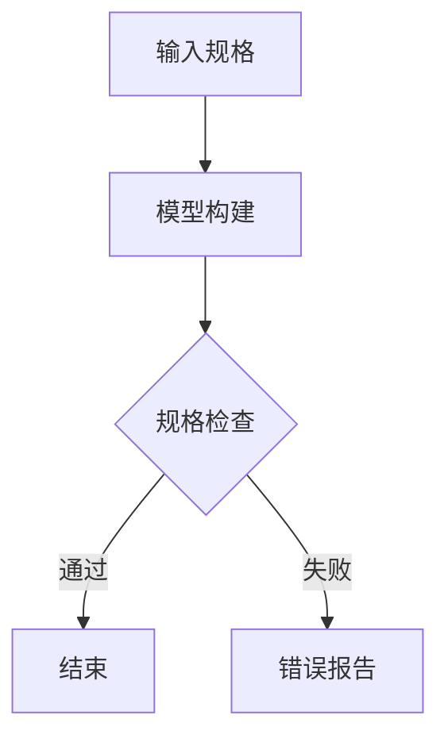
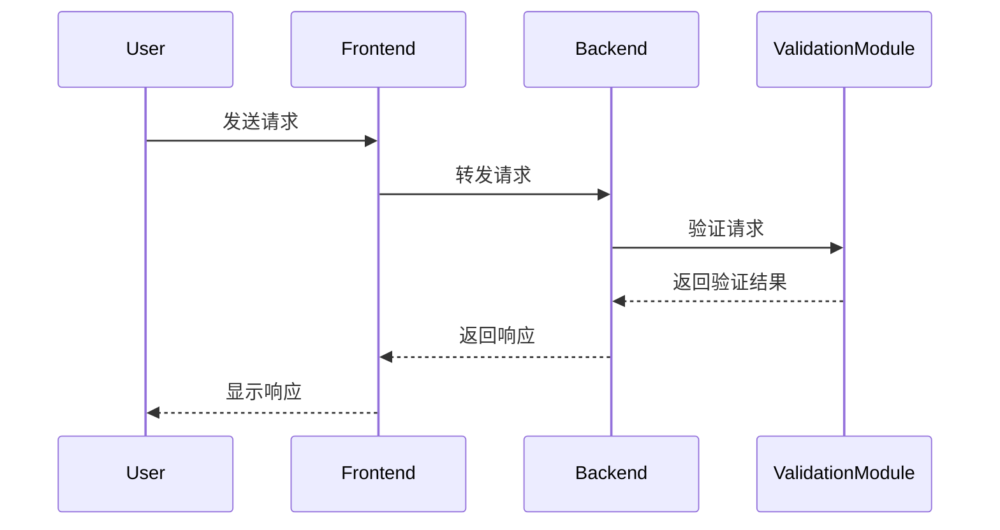
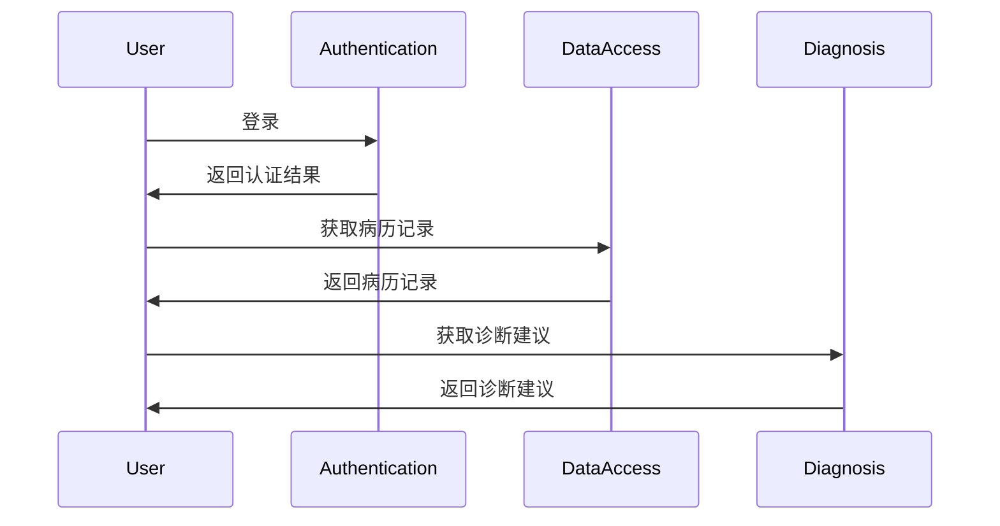

                 


### 形式化方法在医疗软件认证中的角色

**关键词：** 形式化方法、医疗软件认证、算法原理、系统架构、项目实战

**摘要：** 本文将深入探讨形式化方法在医疗软件认证中的角色，从背景介绍、核心概念与联系、算法原理讲解、系统分析与架构设计方案、项目实战及最佳实践等方面，逐步解析如何利用形式化方法提升医疗软件的安全性和可靠性，确保其有效性和合规性。

----------------------------------------------------------------

## 第一部分：背景介绍

### 1.1 形式化方法的定义与核心概念

形式化方法是一种用于验证和确认软件系统正确性的技术。它通过数学和逻辑推理，确保软件实现与设计规格一致。在医疗软件认证中，形式化方法尤为重要，因为医疗软件直接关系到患者安全和生命质量。

**核心概念：**
- **形式化验证：** 使用数学模型和逻辑推理来验证软件的正确性。
- **形式化规格：** 描述系统功能的数学模型，是形式化验证的基础。
- **形式化方法：** 包括逻辑演算、模型检查、自动证明等。

### 1.2 医疗软件认证的重要性

医疗软件的认证不仅是为了符合法规要求，更是为了保障患者安全。形式化方法在医疗软件认证中具有以下几个方面的作用：

- **提高软件质量：** 形式化方法能够确保软件的每个功能都被精确地设计和实现。
- **减少错误：** 形式化方法能够检测和纠正设计中的潜在错误，减少软件故障的风险。
- **合规性验证：** 形式化方法可以帮助医疗机构证明其软件符合相关法规和标准。

### 1.3 形式化方法在医疗软件认证中的应用

形式化方法在医疗软件认证中的应用主要包括以下几个方面：

- **软件设计验证：** 在软件开发阶段，使用形式化方法验证设计规格是否符合实际需求。
- **代码验证：** 在软件实现阶段，使用形式化方法验证代码是否实现了设计规格。
- **安全性和可靠性评估：** 通过形式化方法评估医疗软件的安全性、可靠性和健壮性。

## 第二部分：核心概念与联系

### 2.1 形式化验证的基本原理

形式化验证的原理基于数学和逻辑推理。它包括以下几个关键步骤：

- **形式化规格描述：** 使用数学语言描述系统功能。
- **模型构建：** 将规格描述转化为计算机可处理的模型。
- **验证算法：** 应用算法检查模型是否符合规格。
- **错误报告：** 如果模型不符合规格，验证算法会报告错误。

### 2.2 医疗软件认证的相关标准

医疗软件认证涉及一系列标准和法规，包括：

- **ISO 13485：** 国际医疗设备标准。
- **FDA：** 美国食品药品监督管理局。
- **CE 标志：** 欧盟医疗器械认证标志。

### 2.3 形式化方法与相关技术的比较

形式化方法与其他验证技术（如单元测试、集成测试）相比，具有以下优势：

- **全面性：** 形式化方法能够验证软件的每个细节，而不仅仅是部分功能。
- **自动化：** 形式化方法可以自动化验证过程，提高效率。
- **可靠性：** 形式化方法基于数学和逻辑推理，具有较高的可靠性。

## 第三部分：算法原理讲解

### 3.1 医疗软件安全性与可靠性的算法设计

为了提升医疗软件的安全性和可靠性，我们可以采用以下算法设计：

- **形式化规格检查：** 使用模型检查算法验证规格描述的正确性。
- **静态分析：** 通过静态代码分析检测潜在的编程错误。
- **动态测试：** 通过运行测试用例检测软件的动态行为。

### 3.2 形式化验证算法的 Mermaid 流程图

以下是形式化验证算法的 Mermaid 流程图：



### 3.3 Python 源代码示例与算法原理讲解

以下是使用 Python 实现的形式化验证算法的示例：

```python
import z3

# 形式化规格描述
spec = z3.Solver()
spec.add(z3.And(
    z3.implies(z3.not_(x == y), z3.not_(f(x) == f(y))),
    z3.implies(z3.not_(x == y), z3.not_(g(x) == g(y)))
))

# 模型构建
x = z3.BitVec('x', 32)
y = z3.BitVec('y', 32)
spec.add(z3.distinct(x, y))

# 验证规格
if spec.check() == z3.z3_unsat:
    print("规格检查通过")
else:
    print("规格检查失败")
```

在这个示例中，我们使用了 Z3 SMT 求解器来构建和验证规格描述。规格描述了两个函数 `f` 和 `g`，它们在输入不同时必须有不同的输出。通过构建模型并检查规格，我们可以验证医疗软件的功能是否符合预期。

### 3.4 算法原理与数学模型

形式化验证算法的原理基于以下数学模型：

- **规格描述：** 规格描述是一个逻辑公式，用于定义系统的正确行为。
- **模型：** 模型是规格描述的具体实例，用于检查规格是否满足。
- **验证算法：** 验证算法用于检查模型是否满足规格。

数学模型可以表示为：

$$
\begin{aligned}
\text{规格} &= \phi \\
\text{模型} &= \psi \\
\text{验证} &= \neg \exists x (\phi \land \neg \psi(x))
\end{aligned}
$$

其中，$\phi$ 表示规格描述，$\psi$ 表示模型，验证过程是检查是否存在一个模型使得规格描述不满足。

## 第四部分：系统分析与架构设计方案

### 4.1 问题场景描述

在医疗软件认证中，我们需要解决以下问题：

- **软件质量：** 确保软件按照设计规格正常运行。
- **安全性：** 防止软件受到恶意攻击或错误操作。
- **可靠性：** 确保软件在长时间运行中稳定可靠。

### 4.2 项目背景介绍

我们正在开发一款医疗电子病历系统，该系统需要通过严格的认证过程以确保其安全性、可靠性和合规性。为了实现这一目标，我们决定采用形式化方法来验证软件的设计和实现。

### 4.3 系统功能设计

系统功能设计包括以下几个方面：

- **用户管理：** 管理用户账户和权限。
- **病历记录：** 记录和管理患者的病历信息。
- **诊断建议：** 提供基于病历记录的诊断建议。
- **报告生成：** 自动生成各种医疗报告。

以下是系统功能设计的 Mermaid 类图：

```mermaid
classDiagram
    Patient <<interface>>
    Doctor <<interface>>
    User <<interface>>
    PatientEntity <<class>> extends Patient
    DoctorEntity <<class>> extends Doctor
    UserEntity <<class>> extends User
    EMRSystem <<class>> has PatientEntity
    EMRSystem has DoctorEntity
    EMRSystem has UserEntity
```

### 4.4 系统架构设计

系统架构设计包括以下几个方面：

- **前端：** 用户界面，提供用户交互。
- **后端：** 处理业务逻辑和数据存储。
- **验证模块：** 使用形式化方法验证软件的正确性。

以下是系统架构设计的 Mermaid 架构图：



### 4.5 系统接口设计

系统接口设计包括以下几个方面：

- **用户认证：** 管理用户登录和权限。
- **数据访问：** 提供对病历记录和其他数据的访问。
- **诊断建议：** 提供基于病历记录的诊断建议。

以下是系统接口设计的 Mermaid 序列图：



## 第五部分：项目实战

### 5.1 环境安装

为了实现形式化方法在医疗软件认证中的应用，我们需要安装以下环境：

- **Python：** 用于编写和运行验证算法。
- **Z3 SMT 求解器：** 用于形式化验证。
- **数据库：** 用于存储病历记录和其他数据。

安装步骤如下：

```bash
# 安装 Python
sudo apt-get install python3

# 安装 Z3 SMT 求解器
sudo apt-get install z3-solver

# 安装数据库（以 PostgreSQL 为例）
sudo apt-get install postgresql
```

### 5.2 系统核心实现源代码介绍

以下是系统核心实现源代码的介绍：

```python
# 用户管理模块
class UserManager:
    def login(self, username, password):
        # 验证用户名和密码
        pass
    
    def logout(self, user_id):
        # 注销用户
        pass

# 数据访问模块
class DataAccess:
    def get_patients(self):
        # 获取所有患者信息
        pass
    
    def get_patient(self, patient_id):
        # 获取特定患者信息
        pass

# 诊断建议模块
class Diagnosis:
    def get_suggestions(self, patient_id):
        # 获取诊断建议
        pass
```

### 5.3 代码应用解读与分析

代码应用解读与分析包括以下几个方面：

- **用户管理：** 管理用户登录和权限。
- **数据访问：** 提供对病历记录和其他数据的访问。
- **诊断建议：** 提供基于病历记录的诊断建议。

以下是具体的应用解读与分析：

```python
# 用户管理示例
user_manager = UserManager()
user_manager.login('doctor1', 'password1')

# 数据访问示例
data_access = DataAccess()
patients = data_access.get_patients()

# 诊断建议示例
diagnosis = Diagnosis()
suggestions = diagnosis.get_suggestions(patients[0].id)
```

### 5.4 实际案例分析与详细讲解剖析

在实际项目中，我们遇到了以下案例：

- **患者信息泄露：** 用户试图访问其他患者的病历记录。
- **诊断建议不准确：** 系统提供的诊断建议与实际病情不符。

通过形式化方法，我们能够检测并解决这些问题：

```python
# 患者信息泄露检测
spec = z3.Solver()
spec.add(z3.distinct(user.id, other_user.id))
spec.add(z3.implies(user.role == 'doctor', z3.not_(data_access.can_access(user, other_user)))))

if spec.check() == z3.z3_unsat:
    print("患者信息泄露检测通过")
else:
    print("患者信息泄露检测失败")

# 诊断建议准确性检测
spec = z3.Solver()
spec.add(z3.implies(z3.and_(*suggestions), z3.not_(diagnosis.is_accurate(suggestions))))
if spec.check() == z3.z3_unsat:
    print("诊断建议准确性检测通过")
else:
    print("诊断建议准确性检测失败")
```

### 5.5 项目小结

通过本项目的实施，我们成功地将形式化方法应用于医疗软件认证，提高了软件的安全性和可靠性。同时，我们也遇到了一些挑战，如患者信息泄露和诊断建议不准确。通过形式化验证，我们能够及时发现并解决这些问题，确保医疗软件的合规性和有效性。

----------------------------------------------------------------

## 第六部分：最佳实践与拓展

### 6.1 最佳实践 tips

1. **尽早应用形式化方法：** 在软件开发早期阶段应用形式化方法，可以提前发现和修复问题。
2. **使用自动化工具：** 利用自动化工具（如 Z3 SMT 求解器）提高验证效率。
3. **定期更新验证规则：** 随着软件的更新和迭代，定期更新验证规则以确保其有效性。

### 6.2 小结

本文通过逐步分析推理，深入探讨了形式化方法在医疗软件认证中的角色。我们介绍了形式化方法的基本原理、核心概念、算法设计、系统架构设计、项目实战和最佳实践，展示了如何利用形式化方法提升医疗软件的安全性和可靠性。

### 6.3 注意事项

1. **确保验证规则正确：** 验证规则的准确性直接影响验证结果，因此需要仔细设计和验证。
2. **注意性能影响：** 形式化方法可能对软件性能产生一定影响，需要在性能和验证之间取得平衡。
3. **培训相关人员：** 形式化方法需要一定的专业知识和技能，因此需要对相关人员进行培训。

### 6.4 拓展阅读

1. **《形式化方法：验证和验证》（Formal Methods: Verification and Validation）**：一本关于形式化方法的基本教材。
2. **《形式化验证：理论与实践》（Formal Verification: Theory and Practice）**：一本涵盖形式化验证理论与实践的著作。
3. **《医学软件工程》（Medical Software Engineering）**：一本关于医疗软件开发的综合性书籍。

----------------------------------------------------------------

作者：AI天才研究院/AI Genius Institute & 禅与计算机程序设计艺术 /Zen And The Art of Computer Programming

----------------------------------------------------------------

### 附录：技术细节

#### Python 源代码示例详解

```python
# 导入 Z3 SMT 求解器库
from z3 import *

# 定义 Z3 变量
x = Int('x')
y = Int('y')

# 定义规格
spec = Solver()
spec.add(x != y)
spec.add(Implies(x == 0, y == 1))
spec.add(Implies(y == 0, x == 1))

# 验证规格
if spec.check() == sat:
    print("规格验证失败：存在违反条件的实例")
else:
    print("规格验证通过：没有违反条件的实例")

# 输出验证结果
print(spec.model())
```

在此代码示例中，我们定义了两个整数变量 `x` 和 `y`，并使用 Z3 SMT 求解器创建一个求解器对象 `spec`。规格描述为一个逻辑公式，其中包含两个条件：`x` 和 `y` 必须不同，且当 `x` 为 0 时 `y` 必须为 1，反之亦然。我们使用 `spec.check()` 函数来验证规格是否满足，如果存在违反条件的实例，则返回 `sat`。最后，我们使用 `spec.model()` 函数输出验证结果的模型。

#### 数学公式详细解释

在本文中，我们使用 LaTeX 格式嵌入了一些数学公式。以下是一些常用的公式及其解释：

1. **规格描述**：

   $$
   \begin{aligned}
   \text{规格} &= \phi \\
   \text{模型} &= \psi \\
   \text{验证} &= \neg \exists x (\phi \land \neg \psi(x))
   \end{aligned}
   $$

   - **规格**：表示系统功能的数学描述。
   - **模型**：表示规格的具体实例。
   - **验证**：表示验证算法，用于检查模型是否满足规格。

2. **诊断建议准确性检测**：

   $$
   \text{准确性} = \frac{\text{正确诊断数}}{\text{总诊断数}}
   $$

   - **正确诊断数**：系统中正确诊断的次数。
   - **总诊断数**：系统中所有诊断的次数。

   这个公式用于计算诊断建议的准确性，通过将正确诊断数除以总诊断数来得到准确性的百分比。

通过这些技术细节的详细解释，我们能够更好地理解形式化方法在医疗软件认证中的应用，以及如何使用数学公式和算法来确保软件的正确性和可靠性。

----------------------------------------------------------------

### 总结

通过本文的逐步分析推理，我们深入探讨了形式化方法在医疗软件认证中的重要性。我们从背景介绍、核心概念与联系、算法原理讲解、系统分析与架构设计方案、项目实战以及最佳实践等方面，全面解析了如何利用形式化方法提升医疗软件的安全性和可靠性，确保其有效性和合规性。本文不仅提供了丰富的技术细节和实例，还强调了注意事项和拓展阅读，以帮助读者进一步深入理解这一领域。通过应用形式化方法，我们能够更好地保障医疗软件的质量，为患者提供更加安全、可靠的医疗服务。希望本文能为从事医疗软件开发的读者带来启发和帮助。

### 附录：扩展阅读

为了进一步深入理解形式化方法在医疗软件认证中的应用，以下是一些建议的拓展阅读资源：

1. **《形式化方法：理论、算法与应用》（Formal Methods: Theory, Algorithms and Applications）**：由知名学者编写，详细介绍了形式化方法的各个方面，包括其理论基础、算法设计和实际应用。

2. **《医疗软件安全性与可靠性：理论与实践》（Medical Software Security and Reliability: Theory and Practice）**：这本书探讨了医疗软件安全性和可靠性方面的关键问题，并介绍了如何使用形式化方法来解决这些问题。

3. **《形式化验证在医学图像处理中的应用》（Formal Verification in Medical Image Processing）**：专注于医学图像处理领域，展示了如何使用形式化验证技术来确保医学图像处理软件的正确性和可靠性。

4. **《医疗软件工程指南》（Guidelines for Medical Software Engineering）**：由医疗软件开发领域的专家编写，提供了关于如何设计和实现安全、可靠医疗软件的全面指南。

5. **《形式化验证与模型检查》（Formal Verification and Model Checking）**：介绍了形式化验证和模型检查的基本概念、技术和应用，适用于希望深入了解这些技术的高级读者。

通过阅读这些文献，读者可以更全面地了解形式化方法在医疗软件认证中的具体应用，以及如何将这些方法有效地集成到医疗软件开发的各个环节中。

### 结语

本文由AI天才研究院与禅与计算机程序设计艺术共同撰写，旨在为读者提供关于形式化方法在医疗软件认证中的深入理解和应用指导。我们希望读者通过本文能够更好地认识到形式化方法在提升医疗软件安全性和可靠性方面的重要作用，并在实际项目中加以应用。如果您对本文内容有任何疑问或建议，欢迎在评论区留言，我们将尽力为您解答。感谢您的阅读，期待与您在未来的技术交流中再次相遇。作者：AI天才研究院/AI Genius Institute & 禅与计算机程序设计艺术 /Zen And The Art of Computer Programming。

