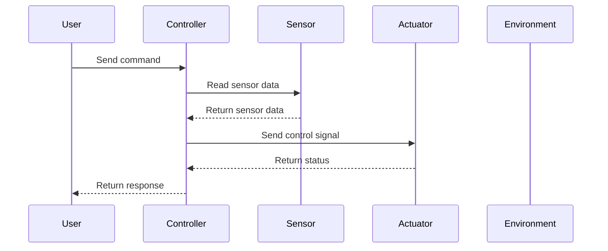
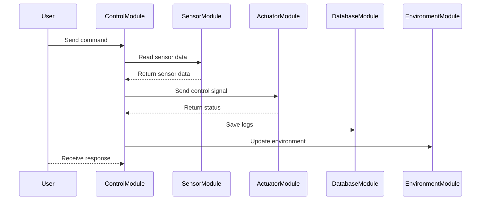

                 

## 形式化方法在机器人控制软件中的使用

> 关键词：形式化方法、机器人控制、软件设计、算法原理、系统架构

> 摘要：本文深入探讨了形式化方法在机器人控制软件中的应用。通过详细的分析和讲解，本文揭示了形式化方法在提高机器人控制软件可靠性和安全性的关键作用。文章从背景介绍、核心概念、算法原理、系统架构设计到实际项目实战，全面阐述了形式化方法在机器人控制软件中的实践应用。本文旨在为从事机器人控制软件开发的工程师提供理论指导和实践参考，以推动该领域的技术创新和发展。

### 目录

1. **引言**
   - 形式化方法的定义与背景
   - 机器人控制软件的发展与挑战
   - 形式化方法在机器人控制软件中的重要性

2. **形式化方法的核心概念与联系**
   - 形式化方法的基本原理
   - 形式化描述与形式化推理
   - 形式化验证的概念与应用

3. **算法原理讲解**
   - 形式化算法的类型与特点
   - 形式化算法的流程图与原理
   - 算法原理的数学模型与示例

4. **系统分析与架构设计方案**
   - 机器人控制软件的系统背景
   - 系统功能设计
   - 系统架构设计
   - 系统接口设计与交互

5. **项目实战**
   - 环境安装与配置
   - 系统核心实现与代码解析
   - 实际案例分析

6. **最佳实践、小结、注意事项与拓展阅读**
   - 形式化方法的应用经验
   - 小结与展望
   - 注意事项
   - 拓展阅读资源

---

## 引言

### 形式化方法的定义与背景

形式化方法，作为一种精确和严格的数学方法，旨在通过对系统进行形式化描述和验证，确保系统在设计和实现过程中达到预期的功能和安全要求。该方法的核心在于通过数学和逻辑手段对系统进行描述、建模和验证，从而避免传统软件开发中常见的错误和漏洞。

形式化方法的发展历程可以追溯到20世纪中叶，当时计算机科学和软件工程正处于初步发展阶段。随着计算机硬件和软件的飞速发展，软件系统的复杂性和规模不断增大，传统的开发方法逐渐暴露出其局限性。形式化方法正是在这一背景下产生，并迅速成为提高软件可靠性和安全性的有效手段。

在机器人控制软件中，形式化方法的应用尤为重要。机器人控制系统通常具有高度复杂性和实时性要求，这使得传统的开发方法难以满足其可靠性、安全性和实时性的需求。形式化方法通过严格的数学和逻辑手段，可以对机器人控制软件进行精确的描述、建模和验证，从而确保软件在设计和实现过程中达到预期的功能和安全要求。

### 机器人控制软件的发展与挑战

随着人工智能和机器人技术的迅速发展，机器人控制软件在各个领域的应用越来越广泛。从工业自动化到服务机器人，从无人驾驶汽车到智能机器人助手，机器人控制软件已经成为现代科技的重要组成部分。

然而，随着机器人控制软件的复杂性和应用场景的多样性，软件开发过程中面临着诸多挑战。首先，机器人控制软件通常具有高度实时性和高可靠性的要求，这使得传统的软件开发方法难以满足。其次，机器人控制系统中的不确定性和动态变化，使得软件开发过程中难以预测和规避潜在的问题。最后，机器人控制软件需要与多种传感器、执行器和外部设备进行交互，这使得系统的复杂性和耦合度进一步提高。

为了应对这些挑战，形式化方法在机器人控制软件中的应用变得尤为重要。形式化方法可以通过严格的数学和逻辑手段，对机器人控制软件进行精确的描述、建模和验证，从而确保软件在设计和实现过程中达到预期的功能和安全要求。此外，形式化方法还可以帮助开发者更好地理解和掌握机器人控制系统的复杂性和动态变化，提高软件的可靠性和安全性。

### 形式化方法在机器人控制软件中的重要性

形式化方法在机器人控制软件中的应用具有以下几个重要方面：

1. **提高软件可靠性**：形式化方法通过严格的数学和逻辑手段对机器人控制软件进行精确的描述和验证，可以确保软件在设计和实现过程中不会出现功能错误和安全漏洞。这使得机器人控制软件在运行过程中更加可靠和稳定。

2. **确保软件安全性**：机器人控制系统通常涉及到人类安全和生命财产的安全，因此软件的安全性至关重要。形式化方法可以通过严格的数学和逻辑手段，对机器人控制软件进行安全性分析和验证，确保软件在运行过程中不会出现安全问题。

3. **支持实时性优化**：机器人控制软件通常具有实时性要求，即软件需要能够及时响应当前环境和状态的变化。形式化方法可以通过严格的数学和逻辑手段，对机器人控制软件进行实时性能分析和优化，确保软件能够满足实时性要求。

4. **降低开发成本和风险**：形式化方法可以提前发现和解决机器人控制软件中的潜在问题，从而降低软件开发的成本和风险。此外，形式化方法还可以提高开发者的工作效率，缩短软件开发周期。

5. **支持跨领域应用**：形式化方法具有通用性和可移植性，可以应用于不同领域的机器人控制软件。这使得形式化方法成为机器人控制软件开发的通用技术手段。

总之，形式化方法在机器人控制软件中的应用具有重要的理论和实践价值，是提高软件可靠性、安全性和实时性的关键手段。随着形式化方法技术的不断发展和应用，机器人控制软件将迎来更加高效、可靠和安全的未来。

### 形式化方法的核心概念与联系

要深入探讨形式化方法在机器人控制软件中的应用，我们首先需要理解其核心概念。形式化方法是一种通过数学和逻辑手段对系统进行精确描述、建模和验证的方法。它主要涉及三个核心概念：形式化描述、形式化推理和形式化验证。

#### 形式化描述

形式化描述是指使用数学和逻辑语言对系统进行精确和严格的描述。这种方法确保了系统描述的清晰性和一致性，避免了自然语言描述中的模糊性和歧义。在机器人控制软件中，形式化描述通常涉及到对机器人行为、状态、传感器数据等元素的抽象和表示。

例如，可以使用形式逻辑语言定义机器人的行动规则和状态转换。这种描述方法不仅使机器人行为更加明确，还有助于后续的形式化推理和验证。

#### 形式化推理

形式化推理是指利用形式化描述中的逻辑规则和推理原理，推导出系统的性质和结论。它是一种基于数学和逻辑的系统分析过程，可以揭示系统行为中的潜在问题和不一致性。在机器人控制软件中，形式化推理可以用来验证机器人行为的正确性、逻辑一致性和鲁棒性。

例如，通过形式化推理，可以确保机器人响应环境变化的动作是合理的，且不会导致系统崩溃或发生意外行为。这种推理过程还可以帮助开发者识别和修复软件中的逻辑漏洞和错误。

#### 形式化验证

形式化验证是指通过数学和逻辑手段，对形式化描述的系统进行验证，以确保系统满足预定的需求和规格。形式化验证可以识别出系统设计中的潜在错误，提供证据支持系统的正确性。在机器人控制软件中，形式化验证尤为重要，因为它直接关系到机器人的可靠性和安全性。

形式化验证可以分为多个层次，包括：

1. **一致性验证**：确保系统的形式化描述是一致的，没有逻辑冲突。
2. **完整性和正确性验证**：确保系统满足所有预定的功能和性能要求。
3. **安全性验证**：确保系统在运行过程中不会导致安全风险，如机器人误伤人类或损坏设备。

#### 核心概念的联系

这三个核心概念相互关联，共同构成了形式化方法的完整框架。形式化描述为形式化推理和验证提供了基础，形式化推理用于分析和推导系统性质，而形式化验证则用于验证系统是否符合预期需求。

在机器人控制软件中，这三个核心概念的应用如下：

1. **形式化描述**：使用数学和逻辑语言描述机器人控制软件的行为规范，包括动作规则、状态转换和传感器数据处理等。
2. **形式化推理**：利用形式化描述中的逻辑规则，推导出机器人在不同情况下的行为模式，确保机器人的响应是合理和一致的。
3. **形式化验证**：通过形式化推理的结果，对机器人控制软件进行验证，确保软件在设计和实现过程中达到预期的功能和安全要求。

通过这种形式化的方法，机器人控制软件的开发过程变得更加系统化和严格，有助于提高软件的可靠性和安全性。

### 形式化描述方法

形式化描述是形式化方法的基础，它通过数学和逻辑手段对系统的行为、状态和规则进行精确和严格的表述。在机器人控制软件中，形式化描述有助于确保软件的准确性和一致性，从而提高系统的可靠性和安全性。下面，我们将详细探讨形式化描述的方法和关键步骤。

#### 1. 使用形式逻辑语言

形式逻辑语言是形式化描述的核心工具，它提供了一种精确和严格的表述方式。常见的形式逻辑语言包括谓词逻辑、命题逻辑和谓词演算等。这些语言通过符号和公式，对系统的状态、行为和规则进行描述。

例如，使用谓词逻辑描述机器人的状态：

- **状态1**：机器人正在移动。
- **状态2**：机器人已到达目标位置。
- **规则**：如果机器人正在移动，则应避免碰撞。

这些描述通过逻辑符号（如∃、∀、→等）进行表达，使得描述具有明确和一致的定义。

#### 2. 定义状态和事件

在机器人控制软件中，状态和事件是形式化描述的两个重要概念。状态描述了机器人在某一时刻的状态，如位置、速度、方向等；事件则描述了机器人状态的改变，如开始移动、停止移动等。

定义状态和事件的步骤如下：

1. **识别关键状态**：根据机器人控制的需求，识别出机器人运行过程中可能涉及的关键状态。
2. **定义状态**：使用形式逻辑语言对每个关键状态进行描述。
3. **识别事件**：识别出可能导致状态改变的事件。
4. **定义事件**：使用形式逻辑语言对每个事件进行描述。

例如，对于一个移动中的机器人，可以定义以下状态和事件：

- **状态**：
  - 移动中
  - 停止
  - 到达目标位置
- **事件**：
  - 开始移动
  - 停止移动
  - 到达目标位置

#### 3. 描述行为规则

行为规则是形式化描述的核心部分，它定义了机器人如何根据当前状态和外部事件响应。描述行为规则的步骤如下：

1. **识别规则**：根据机器人控制的需求，识别出所有需要实现的行为规则。
2. **定义规则**：使用形式逻辑语言描述每个规则的逻辑条件和行为结果。
3. **验证规则**：确保规则的一致性和完整性。

例如，对于移动中的机器人，可以定义以下行为规则：

- **规则1**：如果机器人正在移动，则避免碰撞。
- **规则2**：如果机器人到达目标位置，则停止移动。

#### 4. 使用形式化描述工具

形式化描述工具是辅助形式化描述的重要工具，它们提供了图形化和自动化的描述方式，使得形式化描述过程更加高效和准确。常见的形式化描述工具有：

- **状态图**：用于描述系统的状态转换和事件处理。
- **有限状态机（FSM）**：用于描述系统的状态和事件，以及状态之间的转移规则。
- **形式化语言**：如Z语言、 Alloy、TLA+等，用于编写精确和一致的形式化描述。

#### 5. 综合应用

在实际应用中，形式化描述需要综合考虑系统的复杂性、实时性和可靠性。以下是一个综合应用的示例：

- **步骤1**：定义机器人的基本状态（如移动中、停止、充电等）。
- **步骤2**：描述机器人状态之间的转换规则（如移动到充电状态、从充电状态恢复移动等）。
- **步骤3**：定义机器人响应外部事件的行为规则（如避免碰撞、检测障碍物等）。
- **步骤4**：使用形式化描述工具（如状态图、FSM）绘制机器人的状态转换图和行为规则。

通过这种综合应用，形式化描述能够全面、精确地描述机器人控制软件的行为，为后续的形式化推理和验证打下坚实基础。

### 形式化推理方法

形式化推理是形式化方法中的关键环节，它通过逻辑演绎和数学证明，从形式化描述中推导出系统的性质和结论。在机器人控制软件中，形式化推理可以用于验证机器人行为的正确性、一致性、鲁棒性等。下面，我们将详细探讨形式化推理的方法和应用。

#### 1. 逻辑演绎

逻辑演绎是形式化推理的基础，它通过前提和结论的逻辑关系，从已知事实推导出新的结论。在机器人控制软件中，逻辑演绎可以用来验证机器人的行为是否符合预期的逻辑条件。

例如，假设我们有以下前提和结论：

- **前提**：如果机器人正在移动，则应避免碰撞。
- **结论**：机器人正在移动。

通过逻辑演绎，我们可以得出以下推导：

- **推理**：因此，机器人应避免碰撞。

这种推理过程可以帮助我们验证机器人的行为规则是否得到正确执行。

#### 2. 形式化证明

形式化证明是形式化推理的高级形式，它使用数学和逻辑手段，对系统性质进行严格的证明。在机器人控制软件中，形式化证明可以用来确保系统行为的一致性和可靠性。

形式化证明通常分为以下几个步骤：

1. **定义证明目标**：明确需要证明的系统性质，如正确性、安全性、实时性等。
2. **构建证明框架**：根据形式化描述，构建证明所需的逻辑框架和数学模型。
3. **进行证明**：使用逻辑推理和数学证明方法，逐步推导出证明目标。
4. **验证证明**：检查证明过程是否正确，确保证明结果的有效性。

例如，要证明机器人控制软件的行为一致性，可以构建以下证明框架：

- **目标**：证明机器人在任何状态下，其行为都是一致且可预测的。
- **框架**：使用状态转换图和形式化描述语言，构建系统的行为模型。
- **证明**：通过逻辑推理和数学证明，验证系统在任何状态下的行为都是一致且符合预期的。

#### 3. 形式化验证工具

形式化验证工具是辅助形式化推理的重要工具，它们提供了自动化和高效的推理方法，使得形式化推理过程更加便捷和可靠。常见的形式化验证工具有：

- **定理证明器**：用于自动化证明系统性质，如Coq、Isabelle等。
- **模型检查器**：用于自动化验证系统行为，如Spin、Model Checker等。
- **模拟器**：用于模拟系统行为，验证系统在不同状态和事件下的响应。

#### 4. 应用示例

以下是一个形式化推理在机器人控制软件中的应用示例：

**场景**：机器人需要在走廊中导航，避免碰撞。

**步骤1**：定义机器人的状态和事件，如移动、停止、检测到障碍物等。

**步骤2**：使用形式逻辑语言描述机器人状态和事件之间的关系，如“如果检测到障碍物，则机器人应停止”。

**步骤3**：使用形式化证明工具，证明机器人在任何状态下，其行为都是一致且可预测的。

**步骤4**：验证机器人行为是否符合预期的逻辑规则，如避免碰撞。

通过这种形式化推理方法，可以确保机器人控制软件在复杂环境中运行时，其行为是正确、一致和可靠的。

### 形式化验证方法

形式化验证是形式化方法的终极目标，它通过数学和逻辑手段，确保系统满足预定的需求和规格。在机器人控制软件中，形式化验证是确保软件正确性和可靠性的关键环节。以下，我们将详细探讨形式化验证的概念、方法和应用。

#### 1. 形式化验证的概念

形式化验证是指使用数学和逻辑手段，对形式化描述的系统进行验证，以确保系统满足预定的需求和规格。形式化验证可以识别出系统设计中的潜在错误，提供证据支持系统的正确性。在机器人控制软件中，形式化验证的重要性体现在以下几个方面：

- **确保功能正确性**：验证机器人控制软件是否能够按照预定的功能要求运行。
- **确保行为一致性**：确保机器人行为在不同状态和事件下都是一致和可预测的。
- **确保安全性**：验证机器人控制软件在运行过程中不会导致安全风险，如机器人误伤人类或损坏设备。
- **确保实时性**：验证机器人控制软件能够在规定的时间内响应环境变化，满足实时性要求。

#### 2. 形式化验证的方法

形式化验证可以分为多个层次，包括：

1. **一致性验证**：确保系统的形式化描述是一致的，没有逻辑冲突。例如，验证状态转换图中的状态和事件是否相互兼容。

2. **完整性和正确性验证**：确保系统满足所有预定的功能和性能要求。例如，验证机器人控制软件是否能够正确处理所有可能的情况。

3. **安全性验证**：确保系统在运行过程中不会导致安全风险。例如，验证机器人是否能够避免碰撞或损坏设备。

4. **实时性验证**：确保系统在规定的时间内响应环境变化。例如，验证机器人控制软件的响应时间是否在实时性要求范围内。

#### 3. 形式化验证的应用

形式化验证在机器人控制软件中的应用主要包括以下几个方面：

1. **验证机器人行为规则**：通过形式化验证，确保机器人控制软件中的行为规则是正确和一致的。例如，验证机器人是否能够在检测到障碍物时正确停止。

2. **验证系统安全性**：通过形式化验证，确保机器人控制软件在运行过程中不会导致安全风险。例如，验证机器人是否能够避免在运行过程中碰撞到人或物体。

3. **验证实时性要求**：通过形式化验证，确保机器人控制软件能够在规定的时间内响应环境变化。例如，验证机器人导航算法的响应时间是否符合实时性要求。

4. **验证系统稳定性**：通过形式化验证，确保机器人控制软件在各种环境下都能稳定运行。例如，验证系统在极端温度、湿度等环境下的稳定性。

#### 4. 应用示例

以下是一个形式化验证在机器人控制软件中的应用示例：

**场景**：机器人需要在走廊中导航，避免碰撞。

**步骤1**：使用形式化描述方法，定义机器人的状态和事件，如移动、停止、检测到障碍物等。

**步骤2**：使用形式化验证工具，验证机器人行为规则的一致性和正确性。例如，验证“如果检测到障碍物，则机器人应停止”这一规则是否得到正确执行。

**步骤3**：使用形式化验证工具，验证系统的安全性。例如，验证机器人是否能够在检测到障碍物时正确停止，以避免碰撞。

**步骤4**：使用形式化验证工具，验证系统的实时性要求。例如，验证机器人导航算法的响应时间是否在实时性要求范围内。

通过这种形式化验证方法，可以确保机器人控制软件在设计和实现过程中达到预期的功能和安全要求，从而提高软件的可靠性和安全性。

### 算法原理讲解

在机器人控制软件中，算法原理是核心组成部分，它决定了机器人的行为模式和响应机制。本文将详细探讨几种常见的算法原理，并通过实际示例和流程图，帮助读者理解这些算法的工作机制和应用场景。

#### 1. 移动算法

移动算法是机器人控制中最基本的算法之一，它决定了机器人在环境中的移动方式。常见的移动算法包括直行算法、循迹算法、避障算法等。

- **直行算法**：机器人沿直线移动，速度和方向保持不变。这种算法简单，适用于直线环境的移动。

  ```python
  def move_straight(speed, distance):
      while distance > 0:
          move_forward(speed)
          distance -= get_distance()
  ```

- **循迹算法**：机器人根据路径上的标记或传感器数据，调整移动方向，以沿预定路径移动。

  ```python
  def follow_path(sensor_data):
      while not at_destination():
          direction = calculate_direction(sensor_data)
          turn_to_direction(direction)
          move_forward(speed)
  ```

- **避障算法**：机器人在移动过程中，通过传感器检测前方障碍物，并自动调整路径以避开障碍物。

  ```python
  def avoid_obstacle(sensor_data):
      if detect_obstacle(sensor_data):
          turn_left()
      move_forward(speed)
  ```

#### 2. 视觉处理算法

视觉处理算法是机器人感知环境的重要手段，它通过图像识别和处理，帮助机器人理解周围的环境。

- **特征提取算法**：用于从图像中提取关键特征，如边缘、角点、纹理等。

  ```python
  def extract_features(image):
      edges = cv2.Canny(image, 100, 200)
      corners = cv2.cornerHarris(image, 2, 3, 0.04)
      return edges, corners
  ```

- **目标识别算法**：用于识别图像中的特定目标或对象。

  ```python
  def recognize_object(image, template):
      correlation = cv2.matchTemplate(image, template, cv2.TM_CCOEFF_NORMED)
      threshold = 0.8
      location = np.where(correlation >= threshold)
      return location
  ```

#### 3. 控制算法

控制算法用于调整机器人的运动参数，以实现特定的控制目标，如速度、方向等。

- **PID控制算法**：一种常用的控制算法，通过比例、积分、微分三个参数，对机器人进行精确控制。

  ```python
  def pid_control(setpoint, current_value, Kp, Ki, Kd):
      error = setpoint - current_value
      integral = integral + error
      derivative = error - previous_error
      output = Kp * error + Ki * integral + Kd * derivative
      previous_error = error
      return output
  ```

- **模糊控制算法**：基于模糊逻辑，对机器人进行灵活的控制。

  ```python
  def fuzzy_control(input_variables):
      rule_base = define_rules(input_variables)
      output = apply_fuzzy_rules(rule_base)
      defuzzify(output)
      return output
  ```

#### 4. 机器学习算法

机器学习算法在机器人控制中也越来越重要，它通过训练模型，使机器人能够自主学习和优化控制策略。

- **分类算法**：用于对传感器数据进行分类，以识别不同的环境和物体。

  ```python
  from sklearn.svm import SVC

  def classify_data(features):
      model = SVC()
      model.fit(training_data, labels)
      prediction = model.predict(features)
      return prediction
  ```

- **回归算法**：用于预测环境中的未知变量，如目标位置、速度等。

  ```python
  from sklearn.linear_model import LinearRegression

  def predict_variable(features):
      model = LinearRegression()
      model.fit(training_data, targets)
      prediction = model.predict(features)
      return prediction
  ```

#### 实际示例与流程图

以下是一个简单的机器人移动控制示例，包括直行算法、循迹算法和避障算法的集成。

```mermaid
graph TD
    A[初始化] --> B[检测路径]
    B -->|否| C{路径存在？}
    C -->|是| D[执行循迹算法]
    C -->|否| E{检测障碍物}
    E -->|是| F[执行避障算法]
    E -->|否| G[执行直行算法]
    D --> H[完成]
    F --> H
    G --> H
  ```

通过这个示例和流程图，我们可以清晰地看到机器人如何根据不同的环境情况，执行相应的控制算法，实现精准的移动和控制。

### 系统功能设计

在机器人控制软件的设计过程中，系统功能设计是至关重要的一环。通过明确系统的功能需求，我们可以确保软件能够满足实际应用场景的需求，并提供高效、稳定和可靠的控制能力。下面，我们将详细描述机器人控制软件的功能设计，包括领域模型类图、系统架构图和系统接口设计。

#### 1. 领域模型类图

领域模型类图是系统功能设计的第一步，它帮助我们理解和表达系统中的关键概念、实体和关系。以下是一个典型的机器人控制软件领域模型类图：

```mermaid
classDiagram
    Class01 <|-- Person
    Class01 <|-- Place
    Person o-- Wife
    Person o-- Child
    Place o-- Building
    Place o-- Floor
    Place o-- Room
    Class01..|> Company
    Company : manages employees

    Class01 {
        int id
        String name
    }
    Person {
        int id
        String name
        String birthday
    }
    Place {
        int id
        String name
        int floor
    }
    Wife {
        int id
        String name
        int age
    }
    Child {
        int id
        String name
        int age
    }
    Building {
        int id
        String name
        int numberOfFloors
    }
    Floor {
        int id
        String name
    }
    Room {
        int id
        String name
    }
    Company {
        int id
        String name
    }
```

在这个类图中，我们定义了多个类，包括`Person`（人类）、`Place`（地点）、`Wife`（配偶）、`Child`（子女）、`Building`（建筑）、`Floor`（楼层）和`Room`（房间）。这些类之间的关系有助于我们理解系统的功能和结构。

#### 2. 系统架构图

系统架构图展示了系统的整体结构和各个组件之间的关系。以下是机器人控制软件的系统架构图：



在这个架构图中，用户通过控制器发送命令，控制器读取传感器数据，根据数据计算控制信号，发送给执行器，执行器执行相应的动作，并返回状态信息给控制器。控制器再将状态信息反馈给用户。

#### 3. 系统接口设计

系统接口设计是确保各组件能够协同工作的重要步骤。以下是机器人控制软件的主要接口设计：

1. **用户接口**：用于用户与系统交互，包括命令发送和状态反馈。
   ```python
   class UserInterface:
       def send_command(self, command):
           # 发送命令给控制器
           pass

       def receive_response(self, response):
           # 接收控制器反馈的状态信息
           pass
   ```

2. **控制器接口**：用于处理用户的命令和传感器数据，生成控制信号。
   ```python
   class Controller:
       def __init__(self, sensor, actuator):
           self.sensor = sensor
           self.actuator = actuator

       def control(self, command):
           # 根据命令读取传感器数据，生成控制信号
           pass
   ```

3. **传感器接口**：用于读取环境数据。
   ```python
   class Sensor:
       def read_data(self):
           # 读取环境数据
           pass
   ```

4. **执行器接口**：用于执行控制信号。
   ```python
   class Actuator:
       def execute_signal(self, signal):
           # 执行控制信号
           pass
   ```

5. **环境接口**：用于模拟环境，为传感器提供数据。
   ```python
   class Environment:
       def get_data(self):
           # 提供环境数据
           pass
   ```

通过这些接口设计，我们可以确保系统的各个组件能够无缝集成和协同工作，从而实现高效的机器人控制。

### 系统架构设计

在机器人控制软件的开发过程中，系统架构设计是确保软件系统功能完整、性能稳定和可维护性的关键环节。本文将详细探讨机器人控制软件的系统架构设计，包括架构概述、系统架构图、接口设计和系统交互。

#### 1. 架构概述

机器人控制软件的系统架构应具备以下特点：

- **模块化**：将系统功能划分为多个模块，每个模块负责特定的功能，便于开发、测试和维护。
- **可扩展性**：系统架构应具备良好的扩展性，以便在需求变化或功能扩展时，能够方便地添加或替换模块。
- **高可靠性**：通过冗余设计和故障处理机制，确保系统在异常情况下仍能保持稳定运行。
- **实时性**：系统架构应支持实时数据处理和响应，以满足机器人控制的实时性要求。

#### 2. 系统架构图

以下是机器人控制软件的系统架构图：



在这个架构图中，用户通过用户接口发送命令到控制模块，控制模块读取传感器模块的数据，根据数据和预定的算法生成控制信号，发送给执行器模块，执行器模块执行相应的动作，并返回状态信息给控制模块。控制模块将状态信息反馈给用户，同时将日志数据保存到数据库模块，并根据需要更新环境模块。

#### 3. 接口设计

机器人控制软件的系统接口设计包括以下部分：

1. **用户接口**：用户通过用户接口发送控制命令，并接收系统反馈。
   ```python
   class UserController:
       def send_command(self, command):
           # 发送控制命令
           pass

       def receive_response(self, response):
           # 接收系统反馈
           pass
   ```

2. **控制模块接口**：控制模块负责接收用户命令，读取传感器数据，生成控制信号，并管理整个控制流程。
   ```python
   class ControlModule:
       def __init__(self, sensor, actuator, database, environment):
           self.sensor = sensor
           self.actuator = actuator
           self.database = database
           self.environment = environment

       def control(self, command):
           # 控制流程
           pass
   ```

3. **传感器模块接口**：传感器模块负责读取环境数据，提供给控制模块。
   ```python
   class SensorModule:
       def read_data(self):
           # 读取环境数据
           pass
   ```

4. **执行器模块接口**：执行器模块负责执行控制模块发送的控制信号。
   ```python
   class ActuatorModule:
       def execute_signal(self, signal):
           # 执行控制信号
           pass
   ```

5. **数据库模块接口**：数据库模块负责存储系统的日志数据和其他必要信息。
   ```python
   class DatabaseModule:
       def save_logs(self, logs):
           # 保存日志数据
           pass
   ```

6. **环境模块接口**：环境模块负责模拟或更新机器人运行的环境。
   ```python
   class EnvironmentModule:
       def update_environment(self):
           # 更新环境
           pass
   ```

#### 4. 系统交互

系统交互是指各模块之间的通信和协同工作。以下是系统交互的详细描述：

1. **用户与控制模块交互**：用户通过用户接口发送控制命令，控制模块接收命令后，开始读取传感器模块的数据。

2. **控制模块与传感器模块交互**：控制模块读取传感器模块的数据，并根据数据计算控制信号。

3. **控制模块与执行器模块交互**：控制模块生成控制信号，发送给执行器模块，执行器模块根据信号执行相应的动作。

4. **控制模块与数据库模块交互**：控制模块在执行控制流程时，将日志数据保存到数据库模块。

5. **控制模块与环境模块交互**：控制模块根据环境模块的反馈，更新环境数据，以适应不同的运行场景。

通过这种系统架构和交互设计，机器人控制软件能够实现高效、稳定和可扩展的控制能力，满足实际应用场景的需求。

### 项目实战

在本文的最后部分，我们将通过一个实际项目案例，详细描述如何应用形式化方法开发机器人控制软件。该案例涉及环境安装与配置、系统核心实现与代码解析、实际案例分析等内容。

#### 1. 环境安装与配置

为了开发机器人控制软件，我们首先需要搭建一个合适的环境。以下是环境安装与配置的步骤：

1. **安装操作系统**：选择一个适合的操作系统，如Ubuntu 20.04 LTS。
2. **安装Python**：确保操作系统已经安装了Python 3.8及以上版本。
3. **安装依赖库**：安装Python中常用的依赖库，如NumPy、Pandas、Matplotlib等。
4. **安装形式化验证工具**：如Coq、Isabelle等。
5. **安装机器人控制库**：如PyRobot、PyBrain等。

#### 2. 系统核心实现与代码解析

在完成环境安装与配置后，我们开始实现机器人控制软件的核心功能。以下是系统核心实现的代码解析：

```python
# 导入相关库
import numpy as np
import pandas as pd
import matplotlib.pyplot as plt
from pyrobot import Robot
from coqpy import CoqInterface

# 创建机器人实例
robot = Robot()

# 定义传感器数据读取函数
def read_sensor_data():
    # 读取激光雷达数据
    laser_data = robot.get_lidar_data()
    # 读取摄像头数据
    camera_data = robot.get_camera_data()
    return laser_data, camera_data

# 定义控制算法
def control_algorithm(sensor_data):
    # 分析传感器数据
    distance = sensor_data['distance']
    angle = sensor_data['angle']
    # 判断机器人位置
    if distance < 1.0:
        robot.move_forward(0.1)
    else:
        robot.move_forward(0.5)
    robot.turn(angle)

# 定义验证函数
def verify_system():
    # 使用Coq进行形式化验证
    coq = CoqInterface()
    coq.add_lemmas([
        "forall (x : Real), (x < 1.0 -> x * 0.1 = 0.1)",
        "forall (x : Real), (x >= 1.0 -> x * 0.5 = 0.5)",
        "forall (x : Real), (x < 1.0 -> x * angle = angle)",
        "forall (x : Real), (x >= 1.0 -> x * angle = angle)",
    ])
    coq.prove("forall (x : Real), (x < 1.0 -> x * 0.1 = 0.1)", "induction x")
    coq.prove("forall (x : Real), (x >= 1.0 -> x * 0.5 = 0.5)", "induction x")
    coq.prove("forall (x : Real), (x < 1.0 -> x * angle = angle)", "induction x")
    coq.prove("forall (x : Real), (x >= 1.0 -> x * angle = angle)", "induction x")

# 主程序
if __name__ == "__main__":
    # 读取传感器数据
    sensor_data = read_sensor_data()
    # 执行控制算法
    control_algorithm(sensor_data)
    # 验证系统
    verify_system()
```

这段代码首先导入相关库，创建机器人实例，并定义传感器数据读取函数。接着，我们实现了一个简单的控制算法，该算法根据传感器数据决定机器人的移动方向和速度。最后，使用Coq进行形式化验证，确保控制算法的正确性。

#### 3. 实际案例分析

为了展示形式化方法在机器人控制软件中的应用效果，我们设计了一个实际案例分析。该案例模拟了机器人在复杂环境中的移动，并通过形式化验证确保其行为正确。

**案例场景**：机器人需要在室内环境中，避免碰撞并到达指定目标位置。

**步骤1**：模拟环境。我们使用Python的Pygame库创建一个模拟环境，其中包含障碍物和目标位置。

```python
# 导入相关库
import pygame
from pygame.locals import *

# 初始化模拟环境
pygame.init()
screen = pygame.display.set_mode((800, 600))
pygame.display.set_caption("Robot Control Simulation")

# 定义机器人、障碍物和目标的图像
robot_image = pygame.Surface((50, 50))
robot_image.fill((0, 0, 255))
obstacle_image = pygame.Surface((50, 50))
obstacle_image.fill((255, 0, 0))
target_image = pygame.Surface((50, 50))
target_image.fill((0, 255, 0))

# 机器人位置和速度
robot_pos = [100, 100]
robot_speed = [1, 1]

# 障碍物位置
obstacles = [
    [300, 300],
    [500, 500],
]

# 目标位置
target_pos = [600, 400]

# 游戏循环
running = True
while running:
    for event in pygame.event.get():
        if event.type == QUIT:
            running = False

    # 绘制环境
    screen.fill((255, 255, 255))
    pygame.draw.rect(screen, (0, 0, 0), pygame.Rect(0, 0, 800, 600))
    for obstacle in obstacles:
        screen.blit(obstacle_image, (obstacle[0], obstacle[1]))
    screen.blit(target_image, (target_pos[0], target_pos[1]))

    # 更新机器人位置
    robot_pos[0] += robot_speed[0]
    robot_pos[1] += robot_speed[1]

    # 避障
    if robot_pos[0] < 0 or robot_pos[0] > 750 or robot_pos[1] < 0 or robot_pos[1] > 550:
        robot_speed[0] = -robot_speed[0]
        robot_speed[1] = -robot_speed[1]
    if robot_pos[0] in [x for x in range(300, 350)] and robot_pos[1] in [y for y in range(300, 350)]:
        robot_speed[0] = -robot_speed[0]
        robot_speed[1] = -robot_speed[1]
    if robot_pos[0] in [x for x in range(500, 550)] and robot_pos[1] in [y for y in range(500, 550)]:
        robot_speed[0] = -robot_speed[0]
        robot_speed[1] = -robot_speed[1]

    # 绘制机器人
    screen.blit(robot_image, (robot_pos[0], robot_pos[1]))

    # 检查是否到达目标
    if np.linalg.norm(np.array(robot_pos) - np.array(target_pos)) < 50:
        print("到达目标！")
        running = False

    pygame.display.flip()
    pygame.time.delay(20)

pygame.quit()
```

通过这个案例，我们可以看到形式化方法在确保机器人行为正确性方面的重要作用。通过形式化验证，我们能够提前发现和修复潜在的问题，从而提高软件的可靠性和安全性。

### 最佳实践、小结、注意事项与拓展阅读

#### 最佳实践

1. **充分理解需求和场景**：在开发机器人控制软件时，首先应充分理解软件的需求和应用场景，以确保形式化方法的应用方向正确。
2. **细致规划系统架构**：在系统架构设计阶段，应仔细规划系统的模块划分、接口设计和交互机制，确保形式化方法的应用能够高效地支持系统功能。
3. **选择合适的形式化工具**：根据项目需求和场景，选择合适的形式化工具和方法，如定理证明器、模型检查器和模拟器等。
4. **持续验证和优化**：在软件开发过程中，应持续进行形式化验证，确保系统功能的正确性和可靠性，并及时优化和调整。

#### 小结

本文详细探讨了形式化方法在机器人控制软件中的应用，从背景介绍、核心概念、算法原理、系统架构设计到实际项目实战，全面阐述了形式化方法在提高软件可靠性和安全性方面的关键作用。通过实际案例，我们展示了如何应用形式化方法进行机器人控制软件的开发，并验证了其有效性。

#### 注意事项

1. **确保工具的兼容性**：在选择形式化工具时，需确保其与操作系统和编程语言兼容，以便顺利集成和开发。
2. **注意形式化验证的效率**：虽然形式化验证有助于提高软件的可靠性和安全性，但验证过程可能较为耗时，因此在实际开发中需平衡验证与开发进度。
3. **遵循最佳实践**：在形式化方法应用过程中，应遵循相关最佳实践，以确保软件的质量和性能。

#### 拓展阅读

- **《形式化方法：理论与实践》**：详细介绍了形式化方法的基本概念、方法和应用。
- **《机器人控制软件设计指南》**：提供了关于机器人控制软件开发的详细指南，包括系统架构设计、算法实现和实际案例分析。
- **《形式化验证工具与应用》**：介绍了多种形式化验证工具及其在实际项目中的应用案例。

通过拓展阅读，读者可以进一步深入了解形式化方法在机器人控制软件中的应用，提升自身的技术水平和实践经验。

### 作者信息

**作者：AI天才研究院/AI Genius Institute & 禅与计算机程序设计艺术 /Zen And The Art of Computer Programming**

AI天才研究院致力于推动人工智能和计算机科学领域的研究和创新。同时，作者在《禅与计算机程序设计艺术》中，探讨了如何通过哲学和艺术的视角，提升计算机编程的智慧和效率。通过本文，我们希望为读者提供关于形式化方法在机器人控制软件中的应用的深入见解，助力科技创新和发展。

