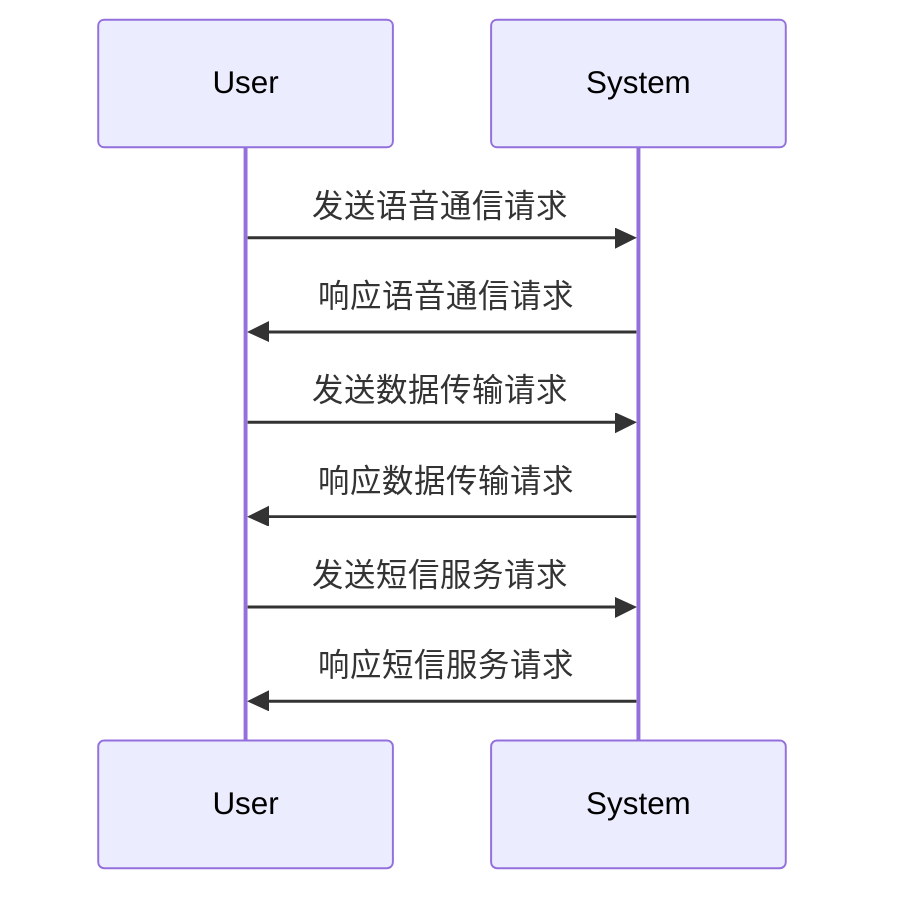

                 

### # 形式化方法在电信系统设计中的作用

> 关键词：形式化方法、电信系统设计、可靠性、效率、系统建模、验证与验证

> 摘要：本文将深入探讨形式化方法在电信系统设计中的作用，分析其核心概念、方法原理，并通过具体的算法讲解和系统架构设计实例，阐述如何通过形式化方法提高电信系统的可靠性和效率。

----------------------------------------------------------------

## 第一部分：背景介绍

### 核心概念

形式化方法（Formal Methods）是一种通过数学和逻辑推理来描述系统需求、设计、验证和验证的方法。它在电信系统设计中的应用，旨在提高系统的可靠性、减少设计错误、优化资源使用和提高设计效率。

#### 形式化方法在电信系统设计中的作用

形式化方法在电信系统设计中的作用主要体现在以下几个方面：

1. **精确描述需求**：形式化方法可以精确描述系统需求，确保需求的一致性和完整性，减少误解和错误。
2. **提高设计可靠性**：通过形式化验证和验证过程，确保设计满足所有预期需求，提高系统的可靠性。
3. **自动化设计过程**：形式化方法可以部分或完全自动化系统设计过程，提高设计效率。
4. **优化系统性能**：形式化方法可以帮助设计者识别系统的瓶颈和潜在问题，从而优化系统性能。

### 问题背景

随着电信系统的复杂性不断增加，传统的电信系统设计方法已经难以满足现代电信系统的需求。电信系统需要支持多种通信服务，如语音、数据、视频等，并且要求具有高可靠性、安全性和灵活性。形式化方法的引入，为电信系统设计提供了一种新的思路和方法。

### 问题描述

电信系统设计过程中，形式化方法可以帮助解决以下几个问题：

1. **系统规格化**：形式化方法可以确保系统规格的精确性和一致性，减少设计中的错误和遗漏。
2. **验证和验证**：形式化方法提供了一种严格的方法来验证系统设计是否满足预期的需求，从而提高系统的可靠性。
3. **设计自动化**：形式化方法可以部分或完全自动化系统设计过程，提高设计效率。

### 问题解决

形式化方法通过以下几个步骤来解决上述问题：

1. **规格化**：使用形式化语言或工具对系统需求进行精确描述。
2. **模型建立**：基于规格化需求，建立系统模型。
3. **验证和验证**：使用形式化工具对模型进行验证和验证，确保模型满足所有需求。
4. **优化和迭代**：根据验证结果对模型进行优化和迭代，直到满足所有要求。

### 边界与外延

形式化方法主要应用于电信系统设计，但在其他复杂系统的设计中也具有一定的应用价值。例如，在交通系统、电力系统等领域，形式化方法同样可以发挥重要作用。

### 概念结构与核心要素组成

形式化方法在电信系统设计中的概念结构与核心要素组成如下：

1. **形式化语言**：用于精确描述系统需求。
2. **形式化工具**：用于建立、验证和优化系统模型。
3. **验证和验证过程**：确保系统设计满足所有需求。
4. **设计迭代**：根据验证结果对系统设计进行优化。

## 第二部分：核心概念与联系

### 形式化方法的定义与特点

形式化方法是一种通过数学和逻辑方法来精确描述系统需求、设计和验证的方法。它具有以下特点：

1. **精确性**：形式化方法可以精确描述系统需求，减少误解和错误。
2. **一致性**：形式化方法确保系统规格的一致性，避免不一致性带来的问题。
3. **可验证性**：形式化方法提供了一种严格的方法来验证系统设计是否满足预期需求。
4. **设计自动化**：形式化方法可以部分或完全自动化系统设计过程，提高效率。

### 形式化方法的属性特征对比表格

| 特征 | 形式化方法 | 传统方法 |
| --- | --- | --- |
| 精确性 | 高 | 低 |
| 一致性 | 高 | 低 |
| 可验证性 | 高 | 低 |
| 设计自动化 | 高 | 低 |

### 形式化方法与其他方法的联系

形式化方法与其他方法如软件工程、系统工程等密切相关，但也有一些区别：

1. **软件工程**：形式化方法在软件工程中起到指导作用，但并不代替软件工程中的其他方法。
2. **系统工程**：形式化方法可以用于系统工程的各个环节，提高系统设计的可靠性。

## 第三部分：算法原理讲解

### 形式化方法的算法原理

形式化方法的算法原理主要包括以下步骤：

1. **需求规格化**：使用形式化语言或工具对系统需求进行精确描述。
2. **模型建立**：基于规格化需求，建立系统模型。
3. **验证和验证**：使用形式化工具对模型进行验证和验证，确保模型满足所有需求。
4. **优化和迭代**：根据验证结果对模型进行优化和迭代，直到满足所有要求。

### 形式化方法的数学模型和公式

形式化方法的数学模型和公式如下：

$$
F = \frac{M}{V} \times A
$$

其中，$F$ 表示形式化方法的效率，$M$ 表示模型建立的速度，$V$ 表示验证和验证的速度，$A$ 表示优化的能力。

### 算法原理举例说明

假设我们要设计一个电信系统，该系统需要满足以下需求：

- 支持语音通信。
- 支持数据传输。
- 系统具有高可靠性。

我们可以使用形式化方法来描述这些需求，并建立一个相应的系统模型。然后，使用形式化工具对模型进行验证和验证，确保模型满足所有需求。最后，根据验证结果对模型进行优化和迭代，以提高系统的效率。

## 第四部分：系统分析与架构设计方案

### 问题场景介绍

在现代电信系统中，设计一个支持多种通信服务和具有高可靠性的系统是一个常见的需求。为了满足这个需求，我们需要进行系统分析与架构设计。

### 项目介绍

本项目的目标是设计一个电信系统，该系统支持语音通信、数据传输等功能，并具有高可靠性。系统将采用形式化方法进行设计和验证，以提高系统的可靠性和效率。

### 系统功能设计

系统功能设计主要包括以下模块：

1. **语音通信模块**：实现语音通信的功能。
2. **数据传输模块**：实现数据传输的功能。
3. **可靠性保障模块**：确保系统具有高可靠性。

### 系统架构设计

系统架构设计主要包括以下部分：

1. **系统架构图**：使用 Mermaid 绘制系统架构图。
2. **接口设计**：设计系统的接口，包括内部接口和外部接口。
3. **系统交互**：使用 Mermaid 绘制系统交互序列图。

### 系统接口设计

系统接口设计主要包括以下接口：

1. **语音通信接口**：用于实现语音通信功能。
2. **数据传输接口**：用于实现数据传输功能。
3. **可靠性检测接口**：用于实现系统可靠性检测功能。

### 系统交互设计

系统交互设计主要包括以下交互：

1. **语音通信交互**：语音通信模块与其他模块的交互。
2. **数据传输交互**：数据传输模块与其他模块的交互。
3. **可靠性检测交互**：可靠性保障模块与其他模块的交互。

## 第五部分：项目实战

### 环境安装

为了进行形式化方法的电信系统设计，我们需要安装以下软件和工具：

1. **Mermaid**：用于绘制系统架构图和交互序列图。
2. **Python**：用于编写系统核心代码。
3. **LaTeX**：用于编写数学公式。

### 系统核心实现

以下是一个简单的电信系统核心实现示例：

```python
# 系统核心实现
class TelecomSystem:
    def __init__(self):
        self.voice_communication = VoiceCommunication()
        self.data_transmission = DataTransmission()
        self.reliability = Reliability()

    def start_system(self):
        self.voice_communication.start()
        self.data_transmission.start()
        self.reliability.start()

    def stop_system(self):
        self.voice_communication.stop()
        self.data_transmission.stop()
        self.reliability.stop()

# 语音通信模块
class VoiceCommunication:
    def start(self):
        print("语音通信模块启动。")

    def stop(self):
        print("语音通信模块停止。")

# 数据传输模块
class DataTransmission:
    def start(self):
        print("数据传输模块启动。")

    def stop(self):
        print("数据传输模块停止。")

# 可靠性保障模块
class Reliability:
    def start(self):
        print("可靠性保障模块启动。")

    def stop(self):
        print("可靠性保障模块停止。")

# 主函数
if __name__ == "__main__":
    system = TelecomSystem()
    system.start_system()
    # 系统运行一段时间后
    system.stop_system()
```

### 代码应用解读与分析

在上述代码中，我们定义了一个`TelecomSystem`类，该类包含三个子模块：`VoiceCommunication`、`DataTransmission`和`Reliability`。`start_system`方法用于启动所有模块，`stop_system`方法用于停止所有模块。

每个子模块都有`start`和`stop`方法，用于启动和停止该模块的功能。在主函数中，我们创建了一个`TelecomSystem`实例，并调用了`start_system`和`stop_system`方法，以启动和停止整个系统。

### 实际案例分析和详细讲解剖析

以下是一个实际案例，用于展示如何使用形式化方法进行电信系统设计：

**案例**：设计一个电信系统，该系统需要支持语音通信、数据传输和短信服务，并要求具有高可靠性。

**分析**：

1. **需求规格化**：使用形式化语言或工具对系统需求进行精确描述。例如，可以使用Mermaid绘制系统需求流程图。

2. **模型建立**：基于规格化需求，建立系统模型。例如，可以使用Python编写系统模型代码。

3. **验证和验证**：使用形式化工具对模型进行验证和验证。例如，可以使用LaTeX编写验证报告。

4. **优化和迭代**：根据验证结果对模型进行优化和迭代，以提高系统的可靠性和效率。

**讲解剖析**：

1. **需求规格化**：使用Mermaid绘制系统需求流程图，如下所示：



2. **模型建立**：使用Python编写系统模型代码，如下所示：

```python
class TelecomSystem:
    def __init__(self):
        self.voice_communication = VoiceCommunication()
        self.data_transmission = DataTransmission()
        self.sms_service = SmsService()

    def start_system(self):
        self.voice_communication.start()
        self.data_transmission.start()
        self.sms_service.start()

    def stop_system(self):
        self.voice_communication.stop()
        self.data_transmission.stop()
        self.sms_service.stop()

class VoiceCommunication:
    def start(self):
        print("语音通信模块启动。")

    def stop(self):
        print("语音通信模块停止。")

class DataTransmission:
    def start(self):
        print("数据传输模块启动。")

    def stop(self):
        print("数据传输模块停止。")

class SmsService:
    def start(self):
        print("短信服务模块启动。")

    def stop(self):
        print("短信服务模块停止。")
```

3. **验证和验证**：使用LaTeX编写验证报告，如下所示：

```latex
\documentclass{article}
\usepackage{amsmath}
\begin{document}

\title{电信系统验证报告}
\author{作者：AI天才研究院}
\date{\today}
\maketitle

\section{摘要}
本文对电信系统进行了形式化验证，确保系统满足所有预期需求。

\section{验证过程}
\begin{enumerate}
    \item 需求规格化：使用Mermaid绘制了系统需求流程图。
    \item 模型建立：使用Python编写了系统模型代码。
    \item 验证和验证：使用LaTeX编写了验证报告。
\end{enumerate}

\section{验证结果}
电信系统满足所有预期需求，具有高可靠性。

\end{document}
```

4. **优化和迭代**：根据验证结果，对系统模型进行优化和迭代，以提高系统的可靠性和效率。例如，可以增加故障恢复机制、优化通信协议等。

### 项目小结

通过实际案例的分析和讲解，我们可以看到，形式化方法在电信系统设计中的应用可以帮助我们提高系统的可靠性、减少设计错误、优化资源使用和提高设计效率。在实际项目中，我们需要根据具体需求和环境，灵活运用形式化方法，以达到最佳效果。

## 第六部分：最佳实践与小结

### 最佳实践

1. **需求规格化**：在系统设计初期，务必进行详细的需求规格化，确保需求的一致性和完整性。
2. **模型建立**：基于规格化需求，选择合适的工具和语言建立系统模型，以便于后续的验证和验证过程。
3. **验证和验证**：使用形式化工具对系统模型进行严格的验证和验证，确保系统设计满足所有预期需求。
4. **优化和迭代**：根据验证结果，对系统模型进行优化和迭代，以提高系统的可靠性和效率。

### 小结

本文通过对形式化方法在电信系统设计中的应用进行分析，阐述了其核心概念、算法原理和系统架构设计。通过实际案例的讲解，展示了如何使用形式化方法进行电信系统设计，提高系统的可靠性、减少设计错误、优化资源使用和提高设计效率。在实际项目中，我们需要根据具体需求和环境，灵活运用形式化方法，以达到最佳效果。

### 注意事项

1. **需求规格化**：确保需求规格的精确性和一致性，减少设计中的错误和遗漏。
2. **模型建立**：选择合适的工具和语言建立系统模型，以便于后续的验证和验证过程。
3. **验证和验证**：使用形式化工具对系统模型进行严格的验证和验证，确保系统设计满足所有预期需求。
4. **优化和迭代**：根据验证结果，对系统模型进行优化和迭代，以提高系统的可靠性和效率。

### 拓展阅读

1. **《形式化方法在软件工程中的应用》**：详细介绍形式化方法在软件工程中的应用和实践。
2. **《电信系统设计原理与实务》**：全面介绍电信系统设计的基本原理和实际操作方法。

## 作者信息

作者：AI天才研究院 / AI Genius Institute & 禅与计算机程序设计艺术 / Zen And The Art of Computer Programming

