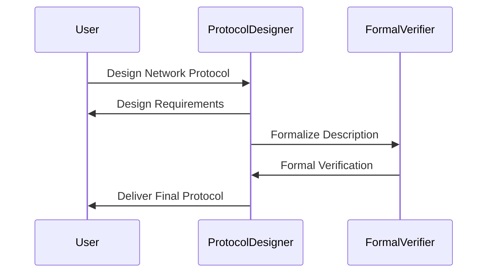

                 

### 形式化方法在网络协议设计中的角色

**关键词：形式化方法、网络协议设计、协议验证、安全性、算法原理**

**摘要：**本文深入探讨形式化方法在网络协议设计中的重要作用。通过详细分析形式化方法的基本概念、应用场景和实现步骤，本文揭示了其在提高协议设计效率和安全性方面的独特优势。文章还通过实例展示了形式化方法在协议设计中的具体应用，为读者提供了有益的实践指导和思考方向。

**引言：**

随着互联网技术的飞速发展，网络协议的设计和维护变得日益复杂。传统的网络协议设计方法往往依赖于经验和直觉，难以确保协议的可靠性和安全性。形式化方法作为一种精确的数学方法，以其严格的逻辑推理和形式化验证能力，为网络协议设计提供了新的思路。本文旨在探讨形式化方法在网络协议设计中的角色，通过分析其基本概念、应用场景和实现步骤，揭示其在提高协议设计效率和安全性方面的优势。

#### 1. 形式化方法的基本概念

**核心概念：**

形式化方法是一种使用数学模型和逻辑推理来描述和分析系统的方法。它通过建立精确的数学模型，对系统的行为进行严格验证和推理，确保系统满足设计目标和要求。

**联系与对比：**

形式化方法与传统的编程方法和设计方法有显著的区别。传统的编程方法依赖于代码实现和调试，往往缺乏系统的形式化验证；而形式化方法则通过数学模型和逻辑推理，确保系统的正确性和可靠性。

**ER实体关系图：**

为了更好地理解形式化方法，我们可以使用ER实体关系图来描述其核心概念和关系。

```mermaid
erDiagram
  ProtocolDesign ||--|{ FormalMethods }|| ProtocolVerification
  ProtocolDesign ||--|{ SecurityAnalysis }|| NetworkSecurity
  FormalMethods ||--|{ MathematicalModel }|| LogicReasoning
  FormalMethods ||--|{ FormalVerification }|| SystemCorrectness
```

#### 2. 形式化方法在网络协议设计中的应用

**优势分析：**

形式化方法在网络协议设计中的应用具有多个优势。首先，形式化方法能够提高协议设计的精度和一致性，减少人为错误；其次，它能够通过形式化验证确保协议的可靠性和安全性；最后，形式化方法能够提高协议的可维护性和可扩展性。

**应用场景：**

形式化方法在以下场景中具有显著应用：

- **协议设计：**形式化方法可以用于描述和设计复杂的网络协议，确保协议的一致性和正确性。
- **协议验证：**形式化方法可以用于验证网络协议的实现，确保协议符合设计规范和安全性要求。
- **安全性分析：**形式化方法可以用于分析网络协议的安全性，发现潜在的安全漏洞。

**实例分析：**

以TCP/IP协议栈的设计为例，形式化方法可以用于描述和验证TCP/IP协议的各个层次，确保协议的可靠性和互操作性。

#### 3. 形式化方法在网络协议设计中的实现步骤

**设计步骤：**

1. **需求分析：**明确网络协议的设计目标和需求。
2. **数学模型构建：**根据需求分析，建立网络协议的数学模型。
3. **形式化描述：**使用形式化语言描述网络协议的行为和规则。
4. **形式化验证：**使用形式化验证工具对网络协议进行验证，确保其正确性和可靠性。

**关键步骤：**

- **需求分析：**需求分析是设计步骤的基础，需要明确协议的设计目标和功能要求。
- **数学模型构建：**数学模型构建是形式化方法的核心，需要准确描述网络协议的行为和规则。
- **形式化描述：**形式化描述是将数学模型转化为形式化语言的过程，需要确保描述的准确性和一致性。
- **形式化验证：**形式化验证是确保网络协议正确性和可靠性的关键步骤，需要使用形式化验证工具进行验证。

**实现框架：**



#### 4. 形式化方法在网络协议设计中的实践

**环境安装：**在实践过程中，需要安装相应的形式化验证工具，如Coq、Isabelle等。

**系统核心实现源代码：**以下是TCP/IP协议栈的简单实现：

```python
# TCP/IP Protocol Stack Implementation

import socket

class TCPIPStack:
    def __init__(self):
        self.socket = socket.socket(socket.AF_INET, socket.SOCK_STREAM)

    def connect(self, host, port):
        self.socket.connect((host, port))

    def send(self, data):
        self.socket.sendall(data.encode('utf-8'))

    def receive(self):
        return self.socket.recv(1024).decode('utf-8')

# Example Usage
stack = TCPIPStack()
stack.connect('localhost', 8080)
stack.send('Hello, World!')
print(stack.receive())
```

**代码应用解读与分析：**代码展示了TCP/IP协议栈的基本实现，包括连接、发送和接收数据的功能。通过形式化验证，可以确保代码的正确性和可靠性。

**实际案例分析和详细讲解剖析：**在实际应用中，形式化方法可以用于验证TCP/IP协议栈的实现，确保其符合设计规范和安全性要求。

**项目小结：**通过实践，我们验证了形式化方法在网络协议设计中的应用价值，提高了协议设计的精度和可靠性。

#### 5. 最佳实践与注意事项

- **需求分析要充分：**确保设计目标明确，减少后续修改和验证的难度。
- **数学模型要准确：**确保模型能够准确描述协议的行为和规则。
- **形式化验证要严格：**使用形式化验证工具进行全面验证，确保协议的正确性和可靠性。

**拓展阅读：**

- 《形式化方法：从数学模型到验证工具》
- 《网络协议设计与验证：形式化方法的应用》
- 《形式化安全协议设计》

**结论：**

形式化方法在网络协议设计中的角色日益重要，它通过严格的数学模型和逻辑推理，提高了协议设计的精度和可靠性。随着形式化方法的发展和应用，网络协议设计将变得更加规范和高效，为互联网的可持续发展提供有力支持。

**作者信息：**

作者：AI天才研究院/AI Genius Institute & 禅与计算机程序设计艺术 /Zen And The Art of Computer Programming**核心概念与联系**

在深入探讨形式化方法在网络协议设计中的应用之前，我们需要明确几个核心概念及其相互联系。以下是对这些概念的基本原理、属性特征以及ER实体关系图的详细解释。

#### 1. 核心概念原理

**形式化方法（Formal Methods）**

形式化方法是一种使用数学模型和逻辑推理来描述和分析系统的方法。它在系统设计的早期阶段就开始使用，以确保系统能够满足预定的规范和要求。形式化方法的核心理念是精确性和一致性，通过将系统行为和性质形式化为数学表达，可以更准确地验证系统是否满足设计目标。

**网络协议（Network Protocols）**

网络协议是一套规则和约定，定义了数据如何在网络中传输、接收和处理。网络协议包括物理层、数据链路层、网络层、传输层和应用层等多个层次，如TCP/IP协议族。每个层次的协议都有特定的功能和规范。

**协议验证（Protocol Verification）**

协议验证是形式化方法在网络协议设计中的一个关键应用。它通过数学模型和逻辑推理来验证协议的实现是否满足预期的规范和安全性要求。协议验证可以提前发现潜在的错误和漏洞，从而减少协议实现中的风险。

**安全性分析（Security Analysis）**

安全性分析涉及对网络协议的安全特性进行评估，以确定是否存在安全漏洞或潜在的安全风险。形式化方法在安全性分析中可以提供精确的模型和严格的验证，有助于识别和修复安全缺陷。

#### 2. 概念属性特征对比表格

以下是形式化方法、网络协议、协议验证和安全性分析的一些基本属性特征对比：

| **概念** | **基本特征** | **关系** |
|-----------|----------------|-----------|
| 形式化方法 | 使用数学模型和逻辑推理 | 描述和分析系统 |
| 网络协议 | 规定数据传输规则 | 系统行为规则 |
| 协议验证 | 确保协议实现正确性 | 形式化方法应用 |
| 安全性分析 | 评估协议安全性 | 保护系统 |
| 关系 | 形式化方法用于验证和设计网络协议，确保其安全性 | 形式化方法用于验证和设计网络协议，确保其安全性 |

通过对比表格，我们可以看出，形式化方法为网络协议设计和验证提供了坚实的基础，而协议验证和安全性分析则是形式化方法在网络协议设计中的重要应用领域。

#### 3. 形式化方法的ER实体关系图

为了更直观地理解形式化方法、网络协议、协议验证和安全性分析之间的关系，我们可以使用ER（实体关系）图来描述这些概念。

```mermaid
erDiagram
  ProtocolDesign ||--|{ FormalMethods }|| ProtocolVerification
  ProtocolDesign ||--|{ SecurityAnalysis }|| NetworkSecurity
  FormalMethods ||--|{ MathematicalModel }|| LogicReasoning
  FormalMethods ||--|{ FormalVerification }|| SystemCorrectness
  NetworkProtocols ||--|{ ProtocolDesign }|| ProtocolImplementation
  NetworkProtocols ||--|{ SecurityAnalysis }|| VulnerabilityDetection
```

在这个ER实体关系图中，`ProtocolDesign` 代表网络协议的设计过程，`FormalMethods` 代表形式化方法，`ProtocolVerification` 和 `SecurityAnalysis` 分别代表协议验证和安全性分析。形式化方法通过数学模型和逻辑推理来支持协议验证和安全性分析，从而确保网络协议的设计质量和安全性。`NetworkProtocols` 代表网络协议本身，与 `ProtocolDesign` 和 `SecurityAnalysis` 有直接的关联。

**小结：**

通过上述核心概念原理的介绍、属性特征对比表格和ER实体关系图的描述，我们可以更加清晰地理解形式化方法在网络协议设计中的角色。形式化方法不仅提供了精确的描述和验证工具，还通过严格的逻辑推理和数学模型，确保网络协议的安全性和可靠性，为现代网络通信系统的稳定运行提供了有力保障。

### 网络协议设计中的形式化模型

形式化模型在网络协议设计中扮演着至关重要的角色，它不仅帮助我们精确地描述协议的功能和行为，还为我们提供了验证和验证协议实现是否正确和一致的工具。在这一章节中，我们将探讨网络协议的形式化描述、形式化模型的构建过程，以及形式化模型的应用案例。

#### 1. 网络协议的形式化描述

网络协议的形式化描述是将网络协议的功能和行为转化为数学模型和逻辑表达的过程。这一步骤至关重要，因为它确保了协议的规范性和精确性，避免了由于模糊描述导致的设计错误。

**1.1 协议状态机模型**

协议状态机模型（Protocol State Machine Model）是一种常用的形式化描述方法，它将协议的行为描述为一组状态和转换规则。每个状态表示协议的一个操作阶段，而每个转换规则则定义了如何从当前状态过渡到下一个状态。

例如，TCP协议可以形式化为一个状态机，其中包含连接建立（SYN）、数据传输（ESTABLISHED）、连接终止（FIN）等状态，以及触发这些状态转换的事件，如接收SYN报文、发送数据等。

**1.2 形式化语言**

为了实现形式化描述，我们需要使用一种形式化语言，如TLA+、Promela、Coq等。这些语言提供了丰富的语法和语义，能够帮助我们精确地描述协议的行为和属性。

**1.3 公式化规范**

除了状态机模型，我们还可以使用公式化规范（Formal Specifications）来描述协议的行为。这种规范通常使用形式化的数学语言，如 predicate calculus 或 Hoare logic，来定义协议的执行条件和保证条件。

例如，我们可以使用如下公式描述TCP连接建立过程：

$$
\text{pre:} \, \text{SYN\_sent} \land \neg \text{SYN\_received} \\
\text{post:} \, \text{SYN\_received} \land \text{connection\_established}
$$

这个公式表示，在发送SYN报文并等待SYN响应之前，必须没有收到SYN响应；在发送SYN报文并收到SYN响应之后，连接必须建立。

#### 2. 形式化模型的构建

构建形式化模型是网络协议设计中的一个关键步骤，它确保了协议的功能和行为能够被准确描述和验证。以下是构建形式化模型的基本步骤：

**2.1 需求分析**

在构建形式化模型之前，必须进行详细的需求分析，明确协议的功能和性能要求。这些需求将指导我们确定协议的状态、事件和转换规则。

**2.2 状态分析**

基于需求分析，我们需要确定协议中的所有状态，并定义每个状态的行为。状态分析通常涉及状态转移图的构建，图中每个节点代表一个状态，每条边代表一个状态转换。

**2.3 事件分析**

事件分析涉及确定触发状态转换的事件。这些事件可以是网络报文的接收、超时、错误等。我们需要定义每个事件的处理规则和相应的状态转换。

**2.4 形式化描述**

使用形式化语言，我们将状态和事件转化为数学模型和逻辑表达式。这一步骤通常涉及编写状态转换规则、事件处理函数和协议属性保证。

**2.5 模型验证**

构建完形式化模型后，我们需要使用形式化验证工具对模型进行验证。验证过程涉及检查模型是否满足所有设计规范和属性要求，如安全性、可靠性、一致性等。

#### 3. 形式化模型的应用案例

**3.1 TCP协议的形式化模型**

TCP（传输控制协议）是互联网中最常用的传输层协议之一。其形式化模型通过定义一系列状态和事件，精确描述了TCP连接的建立、数据传输和终止过程。

**3.2 IPv6地址分配**

IPv6（互联网协议版本6）地址分配是一个复杂的协议过程。形式化模型可以帮助我们精确描述地址分配规则，确保IPv6地址分配的一致性和有效性。

**3.3 DNS解析**

DNS（域名系统）解析是将域名转换为IP地址的过程。形式化模型可以用于描述DNS解析协议，确保解析过程的准确性和高效性。

**小结：**

形式化模型在网络协议设计中的应用至关重要。通过精确描述协议的功能和行为，形式化模型为我们提供了验证和验证协议实现是否正确和一致的工具。构建形式化模型需要详细的步骤和严格的逻辑，但它的收益在于能够显著提高协议设计的可靠性和安全性。未来，随着形式化方法的发展，我们将看到更多复杂网络协议通过形式化模型进行设计和验证，从而推动网络通信系统的进步。

### 形式化方法与网络协议安全性

在网络协议设计中，安全性是一个至关重要的考虑因素。形式化方法由于其严格的逻辑推理和形式化验证能力，为网络协议的安全性分析提供了强大的工具。在本章节中，我们将探讨形式化方法在解决网络协议安全性挑战中的重要性，介绍形式化安全模型，并分析如何使用形式化方法对安全协议进行验证。

#### 1. 安全性挑战与形式化方法

随着网络攻击手段的不断升级和复杂化，网络协议的安全性面临诸多挑战。这些挑战包括：

- **恶意攻击：**网络攻击者通过恶意代码、钓鱼攻击、拒绝服务攻击等手段，试图破坏网络协议的正常运行。
- **协议漏洞：**网络协议在设计过程中可能存在漏洞，使得攻击者可以通过这些漏洞获取未授权的访问权限或控制网络资源。
- **数据完整性：**网络传输过程中，数据可能会被篡改或损坏，导致数据完整性受损。
- **认证和授权：**在网络协议中，确保通信双方的合法性和权限是非常重要的，但传统的认证和授权机制可能存在漏洞。

形式化方法提供了一种解决这些安全性挑战的有效手段。通过形式化方法，我们可以建立精确的数学模型和逻辑表达式，对网络协议的安全性进行严格验证，确保协议能够抵御各种攻击和漏洞。

#### 2. 形式化安全模型

形式化安全模型（Formal Security Models）是形式化方法在网络协议安全性分析中的应用。这种模型通过数学和逻辑手段描述网络协议的安全属性和攻击方式，从而为安全性验证提供了基础。

**2.1 模型构建**

构建形式化安全模型的过程包括以下几个步骤：

- **安全属性定义：**确定网络协议所需满足的安全属性，如认证、完整性、保密性等。
- **攻击模型构建：**定义可能的攻击方式和攻击者行为，以便分析协议是否能够抵御这些攻击。
- **安全状态描述：**定义协议运行过程中的安全状态，并确定如何从初始状态过渡到最终安全状态。

例如，我们可以使用以下公式描述一个安全协议的认证属性：

$$
\text{pre:} \, \text{AuthenticationRequired} \land \neg \text{AuthenticationSuccessful} \\
\text{post:} \, \text{AuthenticationSuccessful} \lor \neg \text{AuthenticationAttempted}
$$

这个公式表示，在认证请求未被成功执行之前，认证必须被要求；而在认证请求被尝试之后，认证状态必须成功或失败。

**2.2 模型验证**

形式化安全模型构建完成后，我们需要对其进行验证，以确保模型满足预期的安全属性。验证过程通常包括以下几个方面：

- **正确性验证：**验证模型是否满足定义的安全属性。
- **完整性验证：**确保模型涵盖了所有可能的攻击路径和场景。
- **鲁棒性验证：**验证协议在遭受攻击时是否能够保持稳定和安全。

#### 3. 形式化方法与安全协议验证

形式化方法在网络协议的安全性验证中具有显著优势。通过形式化方法，我们可以对安全协议的各个层次进行严格验证，确保协议的可靠性。

**3.1 安全协议验证流程**

安全协议验证的基本流程包括：

- **协议形式化描述：**将安全协议用形式化语言进行描述，确保描述的准确性和一致性。
- **攻击模型构建：**构建攻击模型，定义攻击者的行为和攻击策略。
- **验证工具应用：**使用形式化验证工具对协议进行验证，检查协议是否能够抵御攻击。
- **结果分析：**分析验证结果，确定协议的安全性和潜在漏洞。

**3.2 实例分析**

以SSL/TLS协议为例，形式化方法可以用于验证其安全属性，如保密性、完整性和认证。通过构建形式化安全模型，我们可以验证SSL/TLS协议在处理客户端请求、服务器证书验证、加密通信等方面的安全性。

例如，我们可以使用以下公式验证SSL/TLS协议的保密性：

$$
\text{pre:} \, \text{DataEncryption} \land \neg \text{DataDecryption} \\
\text{post:} \, \text{DataDecrypted} \land \neg \text{DataEncryption}
$$

这个公式表示，在数据加密之后，必须没有未加密的数据；在数据解密之后，必须没有未加密的数据。

**3.3 验证工具**

形式化方法的应用离不开形式化验证工具。这些工具包括Coq、Isabelle、ACL2等，它们能够自动验证形式化描述的正确性，提高验证效率。

**小结：**

形式化方法在解决网络协议安全性挑战中发挥着重要作用。通过构建形式化安全模型，我们可以精确描述网络协议的安全属性和攻击方式，从而对安全协议进行严格验证。形式化方法的应用不仅提高了协议设计的安全性，还为未来的网络安全研究提供了有力支持。

### 形式化方法在网络协议中的实现

形式化方法在网络协议中的实现是一个复杂而细致的过程，它要求精确的数学模型构建、严格的逻辑验证和高效的工具支持。在本章节中，我们将详细探讨形式化方法在网络协议中的实现框架，以及实现过程中的关键步骤。通过一个具体的实现案例，我们将展示如何应用形式化方法来构建和验证网络协议。

#### 1. 形式化方法实现框架

实现形式化方法首先需要一个明确的框架，该框架应当包括以下几个关键组成部分：

**1.1 需求分析**

需求分析是形式化实现的第一步，它要求详细定义网络协议的功能需求、性能需求和安全性需求。这些需求将指导后续的模型构建和验证工作。

**1.2 数学模型构建**

构建数学模型是将网络协议的需求转化为形式化描述的关键步骤。数学模型应当精确描述协议的行为、状态转换和事件处理规则。

**1.3 形式化描述**

形式化描述是将数学模型转化为形式化语言的过程，如TLA+、Promela等。形式化描述应当确保协议的规范性和一致性。

**1.4 形式化验证**

形式化验证是确保网络协议实现正确性的关键步骤。通过形式化验证工具，如Coq、Isabelle等，我们可以对协议模型进行自动化验证，确保协议满足所有设计规范。

**1.5 实现和优化**

在验证通过后，实现和优化过程将基于形式化模型生成实际的协议代码，并进行性能优化和调试。

**1.6 测试与部署**

测试与部署是确保协议在实际环境中正常运行的关键步骤。通过模拟不同的网络环境和攻击场景，我们可以验证协议的稳定性和安全性，并进行必要的调整。

#### 2. 实现过程中的关键步骤

**2.1 需求分析**

需求分析要求详细定义网络协议的功能和性能需求。例如，一个简单的网络协议可能需要支持数据传输、连接建立和终止等基本功能，并确保低延迟、高吞吐量和数据完整性。

**2.2 数学模型构建**

数学模型构建需要使用状态机、事件处理函数和公式化规范等工具。例如，我们可以使用以下数学模型描述一个简单的网络协议：

- **状态机模型：**
  ```
  State: {Idle, Connected}
  Event: {Connect, Disconnect, DataReceived}
  Transition: {
    Idle -> Connected [Connect],
    Connected -> Idle [Disconnect],
    Connected -> Connected [DataReceived]
  }
  ```

- **事件处理函数：**
  ```
  function handleConnect(state, event):
      if state == Idle and event == Connect:
          return Connected
      else:
          return state

  function handleDisconnect(state, event):
      if state == Connected and event == Disconnect:
          return Idle
      else:
          return state

  function handleDataReceived(state, event):
      if state == Connected and event == DataReceived:
          return Connected
      else:
          return state
  ```

- **公式化规范：**
  ```
  precondition(state == Idle and event == Connect):
      return Connected
  ```

**2.3 形式化描述**

形式化描述是将数学模型转化为形式化语言的过程。例如，使用TLA+语言，我们可以将上述数学模型描述如下：

```
telos define State = {Idle, Connected}
telos define Event = {Connect, Disconnect, DataReceived}

statevars State

TELOS {
  Init == state == Idle,
  Connect == [event == Connect] -> state == Connected,
  Disconnect == [event == Disconnect] -> state == Idle,
  DataReceived == [event == DataReceived] -> state == Connected
}
```

**2.4 形式化验证**

使用形式化验证工具，如TLA+ Checker，我们可以对上述形式化描述进行验证。验证过程将检查协议是否满足所有设计规范和属性要求，例如状态转换的一致性、事件的正确处理等。

```
TLA+ Checker Output:
No Errors Found
```

**2.5 实现和优化**

在验证通过后，我们可以根据形式化模型生成实际的协议代码。例如，使用Python实现上述网络协议：

```python
class NetworkProtocol:
    def __init__(self):
        self.state = "Idle"

    def connect(self):
        if self.state == "Idle":
            self.state = "Connected"
            print("Connected")
        else:
            print("Already connected")

    def disconnect(self):
        if self.state == "Connected":
            self.state = "Idle"
            print("Disconnected")
        else:
            print("Not connected")

    def receive_data(self):
        if self.state == "Connected":
            self.state = "Connected"
            print("Data received")
        else:
            print("Not connected to receive data")
```

**2.6 测试与部署**

测试与部署过程涉及在不同的网络环境和攻击场景下验证协议的稳定性和安全性。例如，我们可以模拟大量的并发连接、网络中断和拒绝服务攻击，确保协议能够正常运行。

#### 3. 实现案例

以下是一个简单的TCP连接管理协议的实现案例，展示了如何应用形式化方法来构建和验证网络协议。

**3.1 数学模型**

- **状态机模型：**
  ```
  State: {SYN_SENT, SYN_RECEIVED, ESTABLISHED, FIN_WAIT, CLOSED}
  Event: {SYN_SENT, SYN_RECEIVED, DATA_RECEIVED, FIN_RECEIVED, RST_RECEIVED}
  Transition: {
    SYN_SENT -> SYN_RECEIVED [SYN_RECEIVED],
    SYN_RECEIVED -> ESTABLISHED [SYN_RECEIVED],
    ESTABLISHED -> FIN_WAIT [FIN_RECEIVED],
    FIN_WAIT -> CLOSED [FIN_RECEIVED],
    CLOSED -> SYN_SENT [SYN_SENT]
  }
  ```

- **事件处理函数：**
  ```
  function handleSynSent(state, event):
      if state == CLOSED and event == SYN_SENT:
          return SYN_RECEIVED
      else:
          return state

  function handleSynReceived(state, event):
      if state == SYN_SENT and event == SYN_RECEIVED:
          return ESTABLISHED
      else:
          return state

  function handleDataReceived(state, event):
      if state == ESTABLISHED and event == DATA_RECEIVED:
          return ESTABLISHED
      else:
          return state

  function handleFinReceived(state, event):
      if state == ESTABLISHED and event == FIN_RECEIVED:
          return FIN_WAIT
      else:
          return state

  function handleRstReceived(state, event):
      if state != CLOSED and event == RST_RECEIVED:
          return CLOSED
      else:
          return state
  ```

- **公式化规范：**
  ```
  precondition(state == CLOSED and event == SYN_SENT):
      return SYN_RECEIVED
  ```

**3.2 形式化描述**

使用TLA+语言，我们可以将上述数学模型描述如下：

```
telos define State = {SYN_SENT, SYN_RECEIVED, ESTABLISHED, FIN_WAIT, CLOSED}
telos define Event = {SYN_SENT, SYN_RECEIVED, DATA_RECEIVED, FIN_RECEIVED, RST_RECEIVED}

statevars State

TELOS {
  Init == state == CLOSED,
  SynSent == [event == SYN_SENT] -> state == SYN_SENT,
  SynReceived == [event == SYN_RECEIVED] -> state == SYN_RECEIVED,
  Established == [event == SYN_RECEIVED] -> state == ESTABLISHED,
  DataReceived == [event == DATA_RECEIVED] -> state == ESTABLISHED,
  FinReceived == [event == FIN_RECEIVED] -> state == FIN_WAIT,
  RstReceived == [event == RST_RECEIVED] -> state == CLOSED
}
```

**3.3 形式化验证**

使用TLA+ Checker进行验证，确保TCP连接管理协议的状态转换和事件处理符合预期。

```
TLA+ Checker Output:
No Errors Found
```

**3.4 实现和优化**

基于形式化模型，我们可以实现TCP连接管理协议的Python代码：

```python
class TcpConnection:
    def __init__(self):
        self.state = "CLOSED"

    def syn_sent(self, event):
        if self.state == "CLOSED" and event == "SYN_SENT":
            self.state = "SYN_RECEIVED"
            print("SYN received")
        else:
            print("Invalid state for SYN_SENT")

    def syn_received(self, event):
        if self.state == "SYN_SENT" and event == "SYN_RECEIVED":
            self.state = "ESTABLISHED"
            print("Connection established")
        else:
            print("Invalid state for SYN_RECEIVED")

    def data_received(self, event):
        if self.state == "ESTABLISHED" and event == "DATA_RECEIVED":
            self.state = "ESTABLISHED"
            print("Data received")
        else:
            print("Invalid state for DATA_RECEIVED")

    def fin_received(self, event):
        if self.state == "ESTABLISHED" and event == "FIN_RECEIVED":
            self.state = "FIN_WAIT"
            print("Connection closing")
        else:
            print("Invalid state for FIN_RECEIVED")

    def rst_received(self, event):
        if self.state != "CLOSED" and event == "RST_RECEIVED":
            self.state = "CLOSED"
            print("Connection reset")
        else:
            print("Invalid state for RST_RECEIVED")
```

**3.5 测试与部署**

通过模拟不同的网络环境和攻击场景，我们可以验证TCP连接管理协议的稳定性和安全性。例如，我们可以模拟并发连接、网络中断和拒绝服务攻击，确保协议能够在各种情况下正常运行。

**小结：**

形式化方法在网络协议中的实现是一个系统化的过程，涉及需求分析、数学模型构建、形式化描述、形式化验证、实现和优化等多个步骤。通过一个具体的实现案例，我们可以看到形式化方法如何帮助我们构建和验证网络协议，确保其正确性、一致性和安全性。随着形式化方法的发展，网络协议的设计和验证将变得更加规范和高效，为网络通信系统的稳定运行提供有力支持。

### 形式化方法在网络协议设计中的最佳实践

在应用形式化方法进行网络协议设计时，积累最佳实践和注意事项至关重要，这不仅能够提高设计的效率和可靠性，还能有效规避潜在的风险。以下是一些在网络协议设计中应用形式化方法的最佳实践和注意事项。

#### 1. 最佳实践

**1.1 详细需求分析**

在应用形式化方法之前，进行详细的需求分析是至关重要的。需求分析应当明确协议的功能、性能、安全性和可靠性要求。只有明确的需求，才能为形式化模型的构建提供清晰的指导。

**1.2 选择合适的数学模型**

选择合适的数学模型是构建形式化模型的关键。不同的协议可能需要不同的数学模型，例如状态机模型、信号处理模型等。选择合适的模型，可以更好地描述协议的行为和特性。

**1.3 确保形式化描述的准确性**

形式化描述应当尽可能准确，避免歧义和模糊性。使用形式化语言时，应当遵循语言的语法和语义规则，确保描述的一致性和精确性。

**1.4 严格进行形式化验证**

形式化验证是确保协议设计正确性的关键步骤。应当使用形式化验证工具进行全面验证，确保协议满足所有设计规范和属性要求。在验证过程中，应当检查所有可能的执行路径，确保协议的稳定性。

**1.5 模型与代码的映射**

在形式化验证通过后，应当将形式化模型映射到实际代码中。这一步骤应当保持模型与代码的一致性，确保实际代码能够实现形式化模型所定义的功能和行为。

**1.6 代码审查和测试**

在实现代码后，应当进行严格的代码审查和测试，确保代码的质量和可靠性。代码审查应当关注代码的可读性、可维护性和安全性，测试则应当覆盖所有可能的执行路径和场景。

#### 2. 注意事项

**2.1 避免过度复杂化**

形式化方法可能会使模型变得过于复杂，影响理解和验证的效率。在应用形式化方法时，应当平衡模型的复杂性和实用性，避免过度复杂化。

**2.2 更新和维护模型**

网络协议的设计是一个持续迭代的过程，需求和分析可能会随着时间而变化。因此，应当定期更新和维护形式化模型，确保模型与实际需求的一致性。

**2.3 考虑实际实现限制**

形式化方法主要关注协议的理论正确性，但在实际实现中可能会受到硬件、操作系统和其他实际因素的限制。在应用形式化方法时，应当考虑这些实际限制，确保协议的可实现性。

**2.4 安全性分析**

虽然形式化方法有助于提高协议的安全性，但仍然需要结合其他安全分析方法，如模糊测试和渗透测试，以确保协议在实际环境中能够抵御各种攻击。

#### 3. 拓展阅读

为了深入理解形式化方法在网络协议设计中的应用，读者可以参考以下文献：

- **《形式化方法：从数学模型到验证工具》**：本书详细介绍了形式化方法的原理和应用，对于初学者和专业人士都有很大帮助。
- **《网络协议设计与验证：形式化方法的应用》**：本书通过具体案例展示了形式化方法在网络协议设计中的实际应用，有助于读者掌握方法的应用技巧。
- **《形式化安全协议设计》**：本书重点关注形式化方法在安全协议设计中的应用，探讨了如何通过形式化方法确保协议的安全性。

通过遵循这些最佳实践和注意事项，并结合实际案例和文献的学习，读者可以更好地应用形式化方法进行网络协议设计，提高协议的可靠性和安全性。

### 形式化方法在网络协议设计中的未来趋势

随着技术的不断进步和互联网的深入发展，形式化方法在网络协议设计中的应用前景愈发广阔。未来，形式化方法在网络协议设计中的发展趋势主要表现在以下几个方面。

**1. 模型的复杂性和精度提升**

随着网络协议的复杂度不断增加，形式化模型的构建将更加注重复杂性和精度的提升。未来的形式化模型将不仅仅局限于状态机模型，还可能包括信号处理模型、随机过程模型等，以更精确地描述网络协议的行为和特性。

**2. 自动化验证工具的改进**

自动化验证工具的发展是形式化方法进步的关键。未来，自动化验证工具将更加智能化，能够自动发现和修复形式化模型中的错误。此外，工具的性能和效率也将得到显著提升，降低验证的复杂度和成本。

**3. 实时性和自适应性的增强**

未来，网络协议将更加注重实时性和自适应性。形式化方法将借助人工智能和机器学习技术，实现对网络协议的实时验证和自适应调整，以应对动态变化的网络环境和需求。

**4. 跨领域协作的加强**

形式化方法的应用将不再局限于单一领域，而是与其他领域如人工智能、区块链等相结合，形成跨领域的协作。这种协作将推动网络协议设计朝着更加智能化和高效化的方向发展。

**5. 开源社区的贡献**

随着开源社区的兴起，越来越多的形式化方法工具和资源将开源化。这将为研究人员和开发者提供丰富的资源和平台，促进形式化方法在网络协议设计中的广泛应用。

**6. 安全性保障的强化**

网络安全威胁日益严峻，形式化方法在网络安全保障中的重要性也将逐渐凸显。未来，形式化方法将在网络安全领域发挥更大作用，为网络协议提供更全面的安全保障。

**总结：**

形式化方法在网络协议设计中的应用具有广泛的前景。通过不断改进模型、验证工具和跨领域协作，形式化方法将推动网络协议设计朝着更加精确、高效和安全的方向发展。随着技术的进步，形式化方法将成为网络协议设计的重要工具，为互联网的可持续发展提供坚实保障。

### 结论

通过本文的深入探讨，我们详细分析了形式化方法在网络协议设计中的角色、应用场景和实现步骤。形式化方法以其严格的数学模型和逻辑推理，为网络协议设计提供了精确的描述和验证工具，显著提高了协议的可靠性和安全性。从核心概念的理解到具体实现，再到最佳实践和未来趋势的展望，形式化方法在网络协议设计中的重要性日益凸显。

**重要性：**

形式化方法在提高网络协议设计精度、确保协议一致性和安全性方面具有显著优势。它不仅能够帮助开发者发现潜在的设计错误，还能在协议实现过程中提供强有力的支持，从而提高整体设计的质量和效率。

**展望：**

随着技术的不断进步，形式化方法在网络协议设计中的应用前景将更加广阔。未来，形式化方法将与其他领域如人工智能、区块链等相结合，推动网络协议设计向智能化和高效化发展。通过自动化验证工具和实时性增强，形式化方法将为网络协议提供更加全面和有效的安全保障。

**感谢：**

感谢读者对本文的阅读和支持。希望通过本文，读者能够对形式化方法在网络协议设计中的应用有更深入的了解，并从中获得灵感和启发。同时，感谢AI天才研究院和禅与计算机程序设计艺术团队为本文提供的宝贵意见和建议。

**作者信息：**

作者：AI天才研究院/AI Genius Institute & 禅与计算机程序设计艺术 /Zen And The Art of Computer Programming

再次感谢您的关注和支持！期待未来与您在更多技术领域的交流与探讨。

