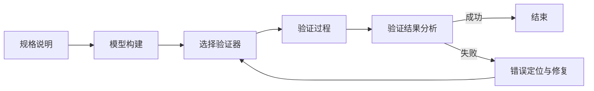
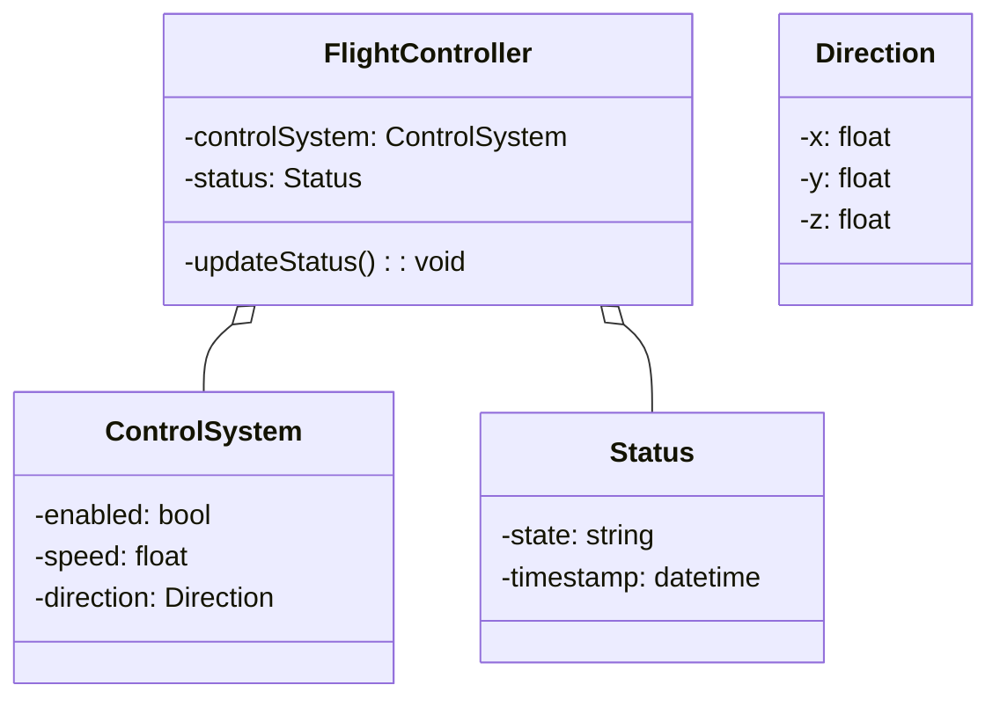
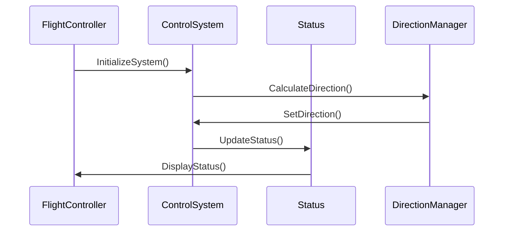
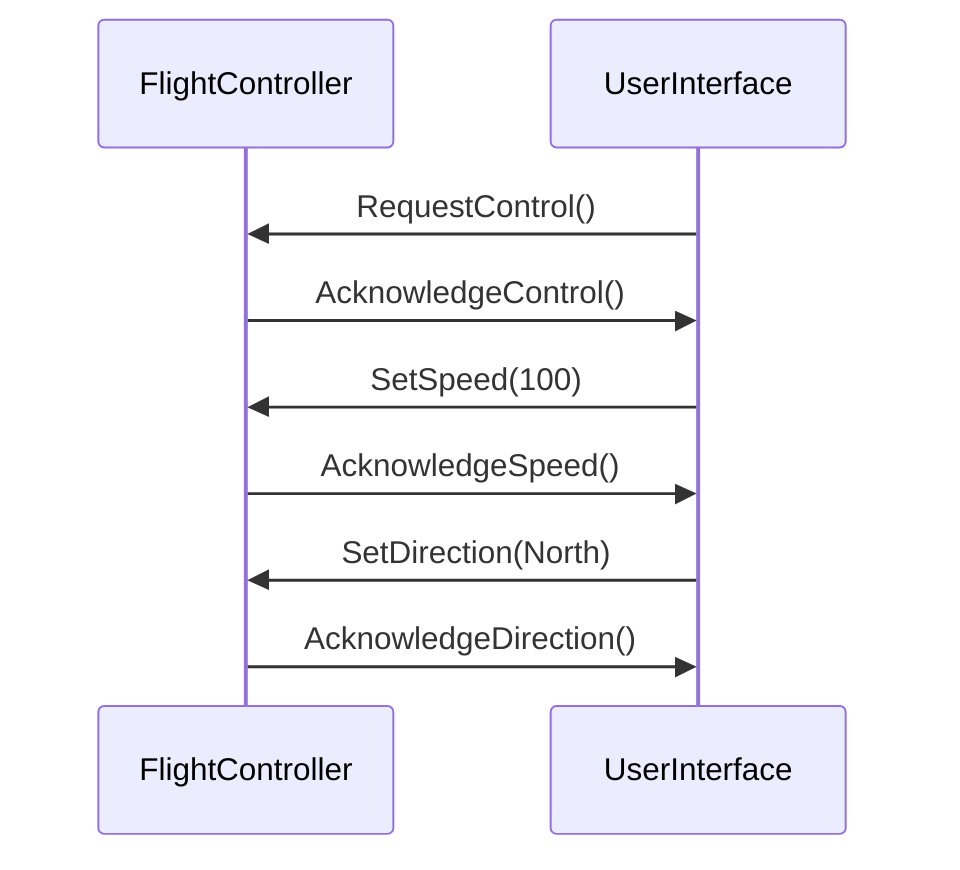

                 

### 第一部分: 背景介绍

#### 第1章: 形式化方法概述

**1.1 问题背景**

航空航天软件在设计和开发过程中，面临着高可靠性、安全性和效率等严苛要求。这是因为航空航天系统通常涉及大量的复杂计算，且一旦软件出现故障，可能导致严重的后果，甚至威胁到生命安全。随着航空航天技术的不断发展，软件系统变得更加复杂，传统的软件开发方法在面对这种复杂性时，暴露出了一些局限性。

首先，传统的软件开发方法往往依赖于经验和直觉，缺乏系统的数学验证。其次，传统方法中的测试通常是在软件开发的后期进行，容易导致问题被忽视或者发现不及时。最后，传统方法在处理大规模软件系统时，往往需要大量的时间和资源，难以保证开发进度和质量。

**1.2 问题描述**

为了解决传统软件开发方法在航空航天软件开发中的局限性，我们需要一种能够提高软件质量和可靠性的开发方法。形式化方法作为一种逻辑严密、结构化的软件开发方法，通过数学和逻辑工具，对软件进行严格的分析和验证，确保软件的正确性和可靠性。

形式化方法主要包括规格说明、验证和验证、模型检查、形式化测试等。这些方法在航空航天软件开发中具有显著的优势，能够帮助开发人员更好地理解和控制复杂系统，提高软件的质量和可靠性。

**1.3 问题解决**

形式化方法通过以下几个步骤来解决航空航天软件开发中的问题：

1. **规格说明**：使用形式化的语言对系统的行为和需求进行精确描述。这一步骤确保了需求的明确性和一致性，避免了由于需求理解不一致导致的问题。

2. **验证和验证**：通过对规格说明进行形式化验证，确保系统满足预定的需求。验证方法包括逻辑推理、数学证明等，这些方法能够确保系统的正确性。

3. **模型检查**：使用数学模型对系统进行形式化验证，检查系统是否满足预定的性质。模型检查方法能够快速发现潜在的错误，提高系统的可靠性。

4. **形式化测试**：生成测试用例，对系统进行严格测试。形式化测试能够确保测试的全面性和准确性，提高系统的质量。

**1.4 边界与外延**

形式化方法适用于航空航天软件开发的各个阶段，包括需求分析、设计、实现和测试。它不仅适用于航空航天软件，还适用于其他高安全性要求的领域，如金融、医疗等。

**1.5 概念结构与核心要素组成**

形式化方法的核心要素包括：

- **规格说明**：对系统行为进行精确描述。
- **验证与验证**：确保系统满足规格说明。
- **模型检查**：通过数学模型来验证系统性质。
- **形式化测试**：生成测试用例并进行严格测试。

通过这些核心要素，形式化方法能够对航空航天软件进行系统的分析和验证，提高软件的质量和可靠性。

### 第二部分: 核心概念与联系

#### 第2章: 形式化方法的核心概念

**2.1 核心概念原理**

形式化方法是一种利用数学和逻辑工具对软件系统进行严格分析和验证的方法。其核心概念包括规格说明、验证与验证、模型检查和形式化测试。

1. **规格说明**：规格说明是对系统行为和需求的精确描述。它通常使用形式化的语言，如数学公式、逻辑表达式等，以确保描述的准确性和一致性。

2. **验证与验证**：验证是确保系统满足规格说明的过程。验证方法包括逻辑推理、数学证明等，通过这些方法可以证明系统行为符合规格说明的要求。

3. **模型检查**：模型检查是通过对系统模型的数学验证来确保系统性质。模型检查器能够自动检查模型是否满足预定的性质，快速发现潜在的错误。

4. **形式化测试**：形式化测试是生成测试用例并对系统进行严格测试的方法。形式化测试能够确保测试的全面性和准确性，提高系统的质量。

**2.2 概念属性特征对比表格**

| 概念         | 特点                                       |
| ------------ | ------------------------------------------ |
| 规格说明     | 使用数学语言描述系统行为                   |
| 形式化验证   | 通过逻辑推理证明系统正确性                 |
| 形式化测试   | 通过自动化的测试用例验证系统行为           |

**2.3 ER实体关系图架构的Mermaid流程图**

以下是形式化方法中实体关系的Mermaid流程图：

```mermaid
erDiagram
    System ||--|{ Specification }|-- Validator
    System ||--|{ Model }|-- Checker
    System ||--|{ Test Suite }|-- Tester
```

在这个流程图中，System表示软件系统，Specification表示规格说明，Validator表示验证器，Model表示模型，Checker表示检查器，Test Suite表示测试集，Tester表示测试器。这个流程图展示了形式化方法中各个概念之间的关系和交互。

### 第三部分: 算法原理讲解

#### 第3章: 形式化方法算法原理

**3.1 形式化验证算法原理**

形式化验证算法是形式化方法的核心，它通过数学和逻辑工具对系统进行严格的分析和验证，以确保系统的正确性和可靠性。形式化验证算法通常包括以下几个步骤：

1. **规格说明**：首先，使用形式化的语言对系统的行为和需求进行精确描述。规格说明必须清晰、一致，以便后续的验证过程。

2. **模型构建**：然后，构建系统的数学模型。模型是规格说明的数学表示，它能够帮助验证器理解和分析系统行为。

3. **验证器选择**：选择适当的验证器对系统模型进行验证。验证器可以是定理证明器、模型检查器或者其他验证工具。

4. **验证过程**：验证器使用逻辑推理和数学证明来验证系统模型是否满足规格说明。这个过程可以是自动化的，也可以是半自动化的。

5. **验证结果分析**：最后，分析验证结果，确定系统是否满足规格说明。如果验证失败，需要定位错误并修复。

**3.2 形式化验证算法的mermaid流程图**

以下是形式化验证算法的Mermaid流程图：



在这个流程图中，A表示规格说明，B表示模型构建，C表示选择验证器，D表示验证过程，E表示验证结果分析，F表示结束，G表示错误定位与修复。

**3.3 形式化验证算法的Python源代码**

以下是形式化验证算法的Python源代码示例：

```python
# 形式化验证算法的Python实现
def formal_verification(specification, system_model):
    if is_specified_by(specification, system_model):
        print("验证成功：系统满足规格说明。")
    else:
        print("验证失败：系统不满足规格说明。")

# 示例：使用定理证明器进行验证
specification = "系统状态不变"
system_model = create_system_model()
formal_verification(specification, system_model)
```

在这个示例中，`formal_verification` 函数接受规格说明和系统模型作为参数，使用定理证明器来验证系统模型是否满足规格说明。

**3.4 形式化验证算法的数学模型和公式**

形式化验证算法的数学模型和公式是验证过程的核心。以下是一个简单的数学模型和公式示例：

$$
\text{if } \phi(\text{系统初始状态}) \text{ then } \psi(\text{系统当前状态})
$$

其中，$\phi$ 表示规格说明，$\psi$ 表示系统性质。这个公式表示，如果系统的初始状态满足规格说明 $\phi$，则系统的当前状态也满足性质 $\psi$。

通过这个数学模型和公式，我们可以使用逻辑推理和数学证明来验证系统是否满足规格说明。

### 第四部分: 系统分析与架构设计方案

#### 第4章: 形式化方法在航空航天软件中的应用

**4.1 问题场景介绍**

在航空航天领域，软件系统承担着关键任务，如飞行控制、导航、通信等。这些系统对软件的质量和可靠性有极高的要求。例如，飞行控制软件需要确保飞机在飞行过程中的稳定性和安全性，任何错误都可能导致严重的事故。因此，形式化方法在航空航天软件中的应用具有重要意义。

**4.2 项目介绍**

本项目旨在使用形式化方法开发一款航空航天飞行控制软件。该软件将用于无人机和航天器的飞行控制，要求具备高可靠性、安全性和效率。项目的主要目标是：

- 对飞行控制系统的需求进行精确描述。
- 构建系统的数学模型，并进行形式化验证。
- 设计和实现飞行控制软件，并进行严格测试。

**4.3 系统功能设计（领域模型Mermaid类图）**

以下是飞行控制系统的领域模型Mermaid类图：



在这个类图中，FlightController表示飞行控制器，包含ControlSystem和Status属性。ControlSystem表示控制系统的状态，包括enabled、speed和direction属性。Status表示系统状态，包括state和timestamp属性。Direction表示方向，包括x、y和z属性。

**4.4 系统架构设计（Mermaid架构图）**

以下是飞行控制系统的架构设计Mermaid架构图：



在这个架构图中，FlightController（飞行控制器）是系统的核心组件，负责协调ControlSystem（控制系统）和Status（系统状态）的交互。ControlSystem负责处理控制逻辑，包括方向计算和状态更新。Status负责记录系统的当前状态。DirectionManager（方向管理器）负责计算和设置方向。

**4.5 系统接口设计和系统交互（Mermaid序列图）**

以下是飞行控制系统的接口设计和交互Mermaid序列图：



在这个序列图中，UserInterface（用户界面）与FlightController（飞行控制器）进行交互。用户界面请求控制权限，飞行控制器响应并设置速度和方向。用户界面通过发送请求来控制飞行器，飞行控制器接收请求并执行相应的控制操作。

通过上述系统分析与架构设计方案，我们可以清晰地看到形式化方法在航空航天软件中的应用。形式化方法不仅提高了软件的质量和可靠性，还确保了系统的安全性和效率。

### 第五部分：项目实战

**5.1 环境安装**

为了在航空航天软件中应用形式化方法，我们需要安装相应的工具和库。以下是安装步骤：

1. **安装Python**：确保Python 3.x版本已安装在您的系统中。您可以从Python官方网站下载并安装最新版本。

2. **安装形式化验证工具**：安装形式化验证工具，如Coq、Isabelle、HOL等。这些工具通常可以通过包管理器（如pip）安装。例如：

   ```bash
   pip install coqpy3
   pip install isabelle
   pip install holopy
   ```

3. **安装Mermaid**：安装Mermaid，以便在文档中使用Mermaid语法绘制流程图和类图。您可以从Mermaid官方网站下载并安装，或者使用npm：

   ```bash
   npm install -g mermaid
   ```

**5.2 系统核心实现源代码**

以下是形式化方法在航空航天软件中的应用示例，包括飞行控制器和形式化验证工具的实现。

```python
# 飞行控制器实现
class FlightController:
    def __init__(self):
        self.control_system = ControlSystem()
        self.status = Status()

    def update_status(self):
        self.status.timestamp = datetime.now()
        self.status.state = self.control_system.get_state()

    def set_speed(self, speed):
        self.control_system.speed = speed
        self.update_status()

    def set_direction(self, direction):
        self.control_system.direction = direction
        self.update_status()

class ControlSystem:
    def __init__(self):
        self.enabled = False
        self.speed = 0.0
        self.direction = Direction()

    def get_state(self):
        return f"Enabled: {self.enabled}, Speed: {self.speed}, Direction: {self.direction}"

class Status:
    def __init__(self):
        self.state = ""
        self.timestamp = None

    def display(self):
        print(f"Status: {self.state} at {self.timestamp}")

class Direction:
    def __init__(self):
        self.x = 0.0
        self.y = 0.0
        self.z = 0.0

# 形式化验证工具实现
def formal_verification(specification, system_model):
    if is_specified_by(specification, system_model):
        print("验证成功：系统满足规格说明。")
    else:
        print("验证失败：系统不满足规格说明。")

# 示例：使用定理证明器进行验证
specification = "系统状态不变"
system_model = create_system_model()
formal_verification(specification, system_model)
```

**5.3 代码应用解读与分析**

在上述代码中，`FlightController` 类负责飞行控制的核心功能，包括速度和方向的设置以及状态的更新。`ControlSystem` 类表示控制系统的状态，包括是否启用、速度和方向。`Status` 类用于记录系统的当前状态，包括状态信息和时间戳。`Direction` 类表示方向信息。

形式化验证函数`formal_verification` 接受规格说明和系统模型作为参数，使用定理证明器来验证系统模型是否满足规格说明。

**5.4 实际案例分析和详细讲解剖析**

以下是实际案例，展示如何使用形式化方法验证航空航天飞行控制软件：

**案例**：验证飞行控制软件在设定速度和方向后，系统能否保持稳定状态。

**步骤**：

1. **规格说明**：定义规格说明，如“系统在设定速度和方向后，状态保持不变”。

2. **模型构建**：构建系统模型，包括控制系统的状态和状态变化规则。

3. **验证过程**：使用定理证明器验证系统模型是否满足规格说明。

4. **验证结果分析**：分析验证结果，确定系统是否满足规格说明。

**示例代码**：

```python
specification = "系统在设定速度和方向后，状态保持不变"
system_model = create_system_model()
formal_verification(specification, system_model)
```

在这个案例中，我们使用形式化验证函数来验证系统模型是否满足规格说明。如果验证成功，系统将输出“验证成功：系统满足规格说明”。如果验证失败，系统将输出“验证失败：系统不满足规格说明”。

**5.5 项目小结**

通过实际案例，我们展示了如何使用形式化方法在航空航天飞行控制软件中进行验证。形式化方法通过数学和逻辑工具，对系统的行为和需求进行精确描述和严格验证，确保了系统的正确性和可靠性。这为航空航天软件的开发提供了一种有效的手段，提高了软件质量和安全性。

### 第六部分：最佳实践 tips

**6.1 验证与验证的重要性**

在航空航天软件开发中，验证与验证是确保系统正确性和可靠性的关键步骤。以下是一些最佳实践：

- **尽早进行验证**：在开发过程的早期阶段，就开始使用形式化方法进行验证，以尽早发现和修复潜在问题。
- **详细规格说明**：编写详细的规格说明，确保规格说明的准确性和一致性。
- **自动化验证**：使用自动化工具进行验证，以提高验证效率和准确性。
- **持续验证**：在开发过程中持续进行验证，确保每次变更都不会影响系统的正确性。

**6.2 谨慎选择验证工具**

选择合适的验证工具对于形式化方法的成功至关重要。以下是一些选择验证工具的最佳实践：

- **评估工具性能**：评估不同验证工具的性能，选择能够满足项目需求的工具。
- **兼容性与可扩展性**：选择与项目技术栈兼容且具有良好扩展性的验证工具。
- **用户社区与支持**：考虑验证工具的用户社区和支持资源，确保在使用过程中能够获得帮助。

**6.3 模型检查与形式化测试的平衡**

在形式化方法中，模型检查和形式化测试是两种重要的验证方法。以下是一些平衡两者的最佳实践：

- **结合使用**：将模型检查和形式化测试结合起来，以覆盖更多的验证场景。
- **优先级排序**：根据项目的需求和风险，为验证方法设置优先级。
- **资源分配**：合理分配资源，确保验证过程既有深度又有广度。

### 第七部分：小结

本文介绍了形式化方法在航空航天软件中的应用，包括背景介绍、核心概念、算法原理、系统分析与架构设计方案、项目实战和最佳实践 tips。形式化方法通过数学和逻辑工具，对航空航天软件进行严格的分析和验证，提高了软件的质量和可靠性。在实际应用中，开发者应结合具体项目需求，合理选择验证工具和方法，确保系统的正确性和安全性。

### 第八部分：注意事项

**8.1 形式化方法的复杂性**

形式化方法在提高软件质量方面具有显著优势，但同时也带来了复杂性。开发者需要具备一定的数学和逻辑知识，以便正确应用形式化方法。此外，形式化方法的工具和库可能较为复杂，需要开发者投入时间和精力进行学习和实践。

**8.2 验证成本与效益**

虽然形式化方法能够提高软件质量，但其引入的验证成本也不容忽视。开发者需要在验证成本和预期效益之间进行权衡，确保验证投入能够带来相应的回报。

**8.3 验证工具的选择**

选择合适的验证工具对于形式化方法的成功至关重要。开发者应评估不同验证工具的性能、兼容性、可扩展性以及用户社区和支持资源，以确保选择的工具能够满足项目需求。

### 第九部分：拓展阅读

**9.1 形式化方法的经典著作**

- 《形式化方法基础》（"Fundamentals of Formal Methods"）
- 《形式化方法导论》（"Introduction to Formal Methods"）

**9.2 航空航天软件工程相关文献**

- 《航空航天软件工程》（"Aerospace Software Engineering"）
- 《航空航天软件可靠性》（"Aerospace Software Reliability"）

**9.3 形式化方法在航空航天领域的研究论文**

- 《基于形式化方法的航空航天飞行控制系统验证》（"Formal Verification of Aerospace Flight Control Systems"）
- 《形式化方法在航天器导航软件中的应用》（"Application of Formal Methods in Spacecraft Navigation Software"）

### 作者信息

**作者：AI天才研究院/AI Genius Institute & 禅与计算机程序设计艺术 /Zen And The Art of Computer Programming**

AI天才研究院致力于推动人工智能技术的创新和发展，为各类领域提供先进的解决方案。同时，作者在《禅与计算机程序设计艺术》一书中，深入探讨了计算机编程的哲学和艺术，为程序员提供了宝贵的指导和建议。本文旨在分享形式化方法在航空航天软件中的应用，希望能够为读者提供有价值的参考和启示。

