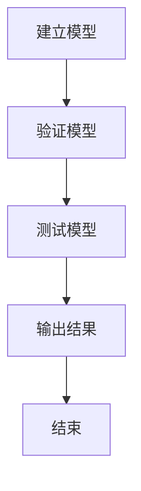
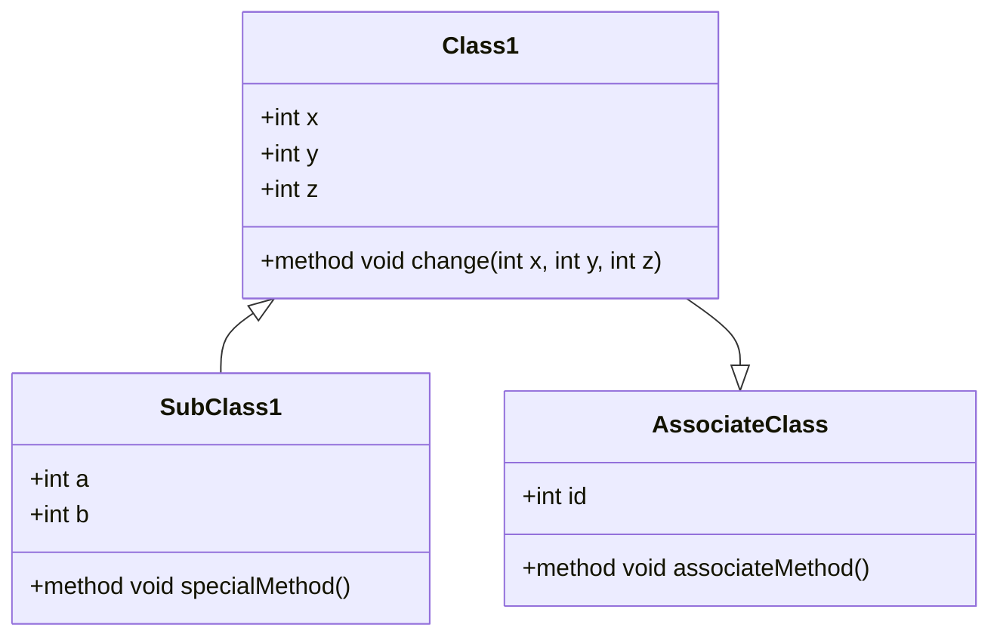
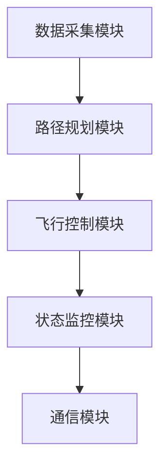
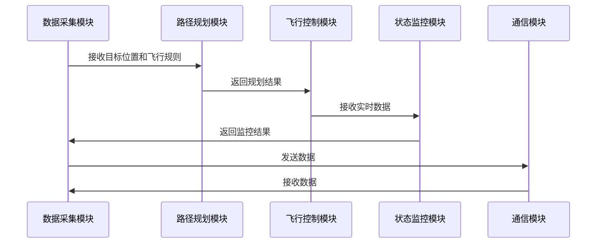

                 


# 形式化方法在航空航天软件中的使用

## 关键词

- 形式化方法
- 航空航天软件
- 软件工程
- 算法原理
- 数学模型
- 系统架构设计

## 摘要

本文旨在探讨形式化方法在航空航天软件中的应用。形式化方法是计算机科学中的一种重要工具，它通过数学和逻辑的方法对软件进行严格描述和验证。在航空航天领域，软件系统的复杂性和安全性要求极高，因此形式化方法的应用显得尤为重要。本文将逐步分析形式化方法的基本概念、核心算法原理、数学模型、系统架构设计以及实际应用，为读者提供对这一领域深入的理解。

## 第一部分：引言

### 1.1 形式化方法的概述

形式化方法是计算机科学和软件工程中的一种方法论，它通过数学和逻辑的语言对软件系统进行严格描述、建模和验证。形式化方法的核心理念是将软件开发的各个环节转化为形式化的过程，从而提高软件的正确性、可靠性和可维护性。形式化方法主要包括形式化建模、形式化验证和形式化测试等步骤。

形式化建模是通过数学和逻辑的方法对系统进行描述，建立精确的模型。这个模型可以是状态机、形式逻辑表达式、代数方程等，它能够清晰地表达系统的行为和性质。

形式化验证是对形式化模型进行验证，以证明系统满足预定的性质和需求。形式化验证通常采用定理证明、模型检查和模拟等方法，通过验证确保系统在设计阶段就达到了预期的目标。

形式化测试是通过测试来验证形式化模型的正确性。与传统的黑盒测试和白盒测试不同，形式化测试通常是基于模型和数学证明的，可以更准确地发现系统中的错误。

### 1.2 形式化方法在航空航天软件工程中的重要性

航空航天软件工程是形式化方法应用的重要领域之一。航空航天软件系统具有高度复杂性和严格的安全性要求，它们需要在极端环境下稳定运行，并且不能出现任何故障。因此，形式化方法在航空航天软件工程中的重要性体现在以下几个方面：

1. **提高系统可靠性**：形式化方法能够确保软件系统在设计和开发阶段就达到预期的可靠性标准，减少系统故障的风险。

2. **确保系统安全性**：航空航天软件系统必须能够在各种极端条件下保持安全性，形式化方法通过严格的验证过程可以确保系统的安全性。

3. **提高开发效率**：形式化方法可以帮助开发者更早地发现和纠正错误，从而减少后期修复成本，提高开发效率。

4. **支持系统维护**：形式化方法生成的模型和证明可以为系统的维护和更新提供有力的支持，确保新加入的功能和修改不会破坏系统的稳定性。

### 1.3 形式化方法的发展历程

形式化方法的发展可以追溯到20世纪50年代和60年代，当时计算机科学刚刚起步。早期的形式化方法主要是基于数学逻辑的，如形式化程序设计、自动验证等。随着计算机科学的发展，形式化方法也逐渐融入了软件工程的其他领域，如形式化建模、形式化验证和形式化测试等。

在航空航天领域，形式化方法的应用经历了从实验性到广泛应用的过程。早期的研究主要关注于关键系统的设计和验证，如飞行控制系统和导航系统。随着形式化方法的不断成熟，它们的应用范围也逐渐扩展到其他领域，如航天器控制系统、数据通信系统等。

## 第二部分：核心概念与联系

### 2.1 形式化方法的核心概念

形式化方法的核心概念主要包括形式化建模、形式化验证和形式化测试。

#### 形式化建模

形式化建模是形式化方法的第一步，它通过数学和逻辑的方法对系统进行描述。在航空航天软件工程中，形式化建模通常涉及以下几个方面：

- **状态机建模**：状态机是描述系统行为的常用工具，它通过状态和状态转换来表示系统的动态行为。
- **形式逻辑建模**：形式逻辑建模使用逻辑表达式来描述系统的性质和约束，如命题逻辑和谓词逻辑。
- **代数方程建模**：代数方程建模使用代数方程来描述系统的结构和行为。

#### 形式化验证

形式化验证是对形式化模型进行验证，以证明系统满足预定的性质和需求。形式化验证通常采用以下几种方法：

- **定理证明**：定理证明是通过逻辑推理来证明系统性质的正确性，如证明系统在一定条件下不会发生死锁。
- **模型检查**：模型检查是通过将形式化模型与预定的性质进行比对，来验证系统是否满足这些性质。
- **模拟**：模拟是通过运行形式化模型来检查系统在不同情况下的行为，以发现潜在的问题。

#### 形式化测试

形式化测试是通过测试来验证形式化模型的正确性。形式化测试与传统的黑盒测试和白盒测试不同，它通常基于模型和数学证明。形式化测试的优点是能够更精确地发现系统中的错误，并且能够证明测试结果的正确性。

### 2.2 形式化方法与其他软件工程方法的联系

形式化方法与其他软件工程方法有着密切的联系，它们在软件开发的不同阶段发挥各自的作用。

- **与需求工程的关系**：形式化方法在需求工程阶段可以帮助明确和验证系统的需求，确保系统满足用户的需求。
- **与设计方法的关系**：形式化方法在设计阶段可以帮助构建精确的软件架构和设计模型，从而提高系统的可维护性和可扩展性。
- **与测试方法的关系**：形式化方法在测试阶段可以通过模型检查和定理证明等方法，更准确地发现和验证系统的错误。

## 第三部分：算法原理讲解

### 3.1 形式化方法的算法原理

形式化方法的算法原理可以概括为以下步骤：

1. **建立形式化模型**：通过数学和逻辑的方法对系统进行描述，建立形式化模型。
2. **形式化验证**：对形式化模型进行验证，以证明系统满足预定的性质和需求。
3. **形式化测试**：通过测试来验证形式化模型的正确性。

#### 建立形式化模型

建立形式化模型是形式化方法的基础，它通常涉及以下步骤：

- **选择建模语言**：选择适合的数学和逻辑语言，如状态机语言、形式逻辑语言或代数方程语言。
- **描述系统状态**：定义系统的状态和状态转换，如使用状态机来描述系统的动态行为。
- **定义系统约束**：定义系统的约束和规则，如使用谓词逻辑来描述系统的约束条件。

#### 形式化验证

形式化验证是对形式化模型进行验证，以证明系统满足预定的性质和需求。形式化验证通常采用以下方法：

- **定理证明**：使用逻辑推理来证明系统性质的正确性。
- **模型检查**：将形式化模型与预定的性质进行比对，以验证系统是否满足这些性质。
- **模拟**：通过运行形式化模型来检查系统在不同情况下的行为，以发现潜在的问题。

#### 形式化测试

形式化测试是通过测试来验证形式化模型的正确性。形式化测试的优点是能够更精确地发现系统中的错误，并且能够证明测试结果的正确性。

### 3.2 形式化方法的算法流程图

以下是形式化方法的算法流程图：



### 3.3 形式化方法的 Python 源代码实现

以下是形式化方法的 Python 源代码实现：

```python
def formalization_method(problem):
    model = build_model(problem)
    verify_result = verify_model(model)
    test_result = test_model(model)
    result = {
        "verify_result": verify_result,
        "test_result": test_result
    }
    return result

def build_model(problem):
    # 建立模型的具体实现
    pass

def verify_model(model):
    # 验证模型的具体实现
    pass

def test_model(model):
    # 测试模型的具体实现
    pass
```

### 3.4 形式化方法中的数学模型

形式化方法中的数学模型通常用于描述系统的状态、行为和约束。以下是一个简单的数学模型示例：

$$
\begin{aligned}
\text{状态} &= (s_1, s_2, \ldots, s_n) \\
\text{行为} &= \{b_1, b_2, \ldots, b_m\} \\
\text{约束} &= \{c_1, c_2, \ldots, c_k\}
\end{aligned}
$$

其中，$s_i$表示第$i$个状态，$b_j$表示第$j$个行为，$c_l$表示第$l$个约束。

### 3.5 数学模型讲解

数学模型用于描述系统的行为和约束，它能够帮助我们更好地理解系统的性质和特点。以下是对上述数学模型的详细讲解：

- **状态**：状态是系统的一个具体状态，它描述了系统的当前情况。例如，对于一个飞行控制系统，状态可以包括飞机的高度、速度和航向等。
- **行为**：行为是系统可以执行的动作，它描述了系统如何从一种状态转移到另一种状态。例如，对于飞行控制系统，行为可以包括上升、下降、转弯等。
- **约束**：约束是系统必须遵守的规则和限制，它描述了系统在执行行为时必须满足的条件。例如，对于飞行控制系统，约束可以包括最大速度限制、最小飞行高度等。

## 第四部分：系统分析与架构设计

### 4.1 航空航天软件工程的项目背景

航空航天软件工程是航空航天技术中的重要组成部分，它涉及到航空器和航天器的软件系统设计、开发和验证。随着航空航天技术的不断发展，软件系统的复杂性和重要性日益增加。航空航天软件工程的项目背景主要包括以下几个方面：

- **飞行控制软件**：飞行控制软件是航空器和航天器的核心系统之一，它负责控制飞行器的姿态、速度和高度等关键参数。飞行控制软件的稳定性、可靠性和安全性对飞行器的正常运行至关重要。
- **导航软件**：导航软件用于确定飞行器的位置、速度和航向等信息，它对飞行器的飞行路径和操作具有指导作用。导航软件的精度和实时性对飞行器的安全和高效运行至关重要。
- **通信软件**：通信软件用于实现飞行器与其他设备或地面控制中心的数据传输和通信。通信软件的稳定性和可靠性对飞行器的通信质量和操作效率具有重要影响。

### 4.2 系统功能设计

系统功能设计是航空航天软件工程的重要环节，它涉及到对系统需求的分析和功能的划分。以下是一个简单的系统功能设计示例，包括导航系统的主要功能：

- **位置信息获取**：获取飞行器的实时位置信息，包括经纬度、高度和速度等。
- **速度信息获取**：获取飞行器的实时速度信息，包括水平速度和垂直速度等。
- **航向信息获取**：获取飞行器的实时航向信息，包括航向角度和偏航角度等。
- **路径规划**：根据目标位置和飞行规则规划飞行路径，确保飞行器安全、高效地到达目的地。
- **状态监控**：实时监控飞行器的各项参数，包括发动机状态、电池状态和传感器状态等，确保飞行器的正常运行。

以下是导航系统的类图，用于描述系统功能和类之间的关系：



### 4.3 系统架构设计

系统架构设计是航空航天软件工程中的关键环节，它涉及到对系统整体结构和模块划分的设计。以下是一个简单的系统架构设计示例，包括导航系统的关键模块和它们之间的交互：

- **数据采集模块**：负责获取飞行器的实时位置、速度和航向等信息，并将这些数据传递给其他模块。
- **路径规划模块**：根据目标位置和飞行规则，规划飞行路径，并将规划结果传递给飞行控制模块。
- **飞行控制模块**：根据路径规划和实时数据，控制飞行器的姿态、速度和高度等关键参数，确保飞行器按照规划路径飞行。
- **状态监控模块**：实时监控飞行器的各项参数，包括发动机状态、电池状态和传感器状态等，并将监控结果传递给其他模块。
- **通信模块**：实现飞行器与其他设备或地面控制中心的数据传输和通信，确保数据的实时性和可靠性。

以下是导航系统的架构图，用于描述系统架构和模块之间的关系：



### 4.4 系统接口设计和系统交互

系统接口设计是系统架构设计的重要组成部分，它涉及到系统内部各个模块之间的接口设计和交互方式。以下是一个简单的系统接口设计示例，包括导航系统的关键接口和交互方式：

- **数据采集接口**：用于获取飞行器的实时位置、速度和航向等信息，接口设计为异步传输，确保数据实时性和准确性。
- **路径规划接口**：用于接收目标位置和飞行规则，并返回规划结果，接口设计为同步传输，确保路径规划的实时性和正确性。
- **飞行控制接口**：用于接收路径规划和实时数据，并控制飞行器的姿态、速度和高度等关键参数，接口设计为异步传输，确保飞行控制的实时性和稳定性。
- **状态监控接口**：用于接收飞行器的各项参数，并返回监控结果，接口设计为同步传输，确保状态监控的实时性和准确性。
- **通信接口**：用于实现飞行器与其他设备或地面控制中心的数据传输和通信，接口设计为异步传输，确保通信的实时性和可靠性。

以下是导航系统的接口设计和系统交互序列图：



## 第五部分：项目实战

### 5.1 环境安装和配置

在进行航空航天软件项目的实战之前，我们需要先安装和配置所需的开发环境和工具。以下是一个简化的环境安装和配置步骤：

1. **安装 Python 解释器**：确保系统上安装了 Python 3.7 或更高版本，可以从 [Python 官网](https://www.python.org/) 下载并安装。

2. **安装相关库**：安装一些常用的 Python 库，如 NumPy、Pandas、Matplotlib 等，可以使用以下命令进行安装：

   ```bash
   pip install numpy pandas matplotlib
   ```

3. **配置 IDE**：选择一个合适的集成开发环境（IDE），如 PyCharm、Visual Studio Code 等，并配置 Python 环境。

4. **安装版本控制系统**：安装 Git，用于代码的版本控制和协同开发。

### 5.2 系统核心实现源代码展示

以下是导航系统的核心实现源代码，包括数据采集、路径规划、飞行控制和状态监控等模块：

```python
# 导航系统核心实现源代码

import numpy as np
import matplotlib.pyplot as plt

# 数据采集模块
class DataCollector:
    def __init__(self):
        self.x = 0
        self.y = 0
        self.z = 0

    def update_data(self, x, y, z):
        self.x = x
        self.y = y
        self.z = z

    def get_data(self):
        return self.x, self.y, self.z

# 路径规划模块
class PathPlanner:
    def __init__(self, target_x, target_y):
        self.target_x = target_x
        self.target_y = target_y

    def plan_path(self, current_x, current_y):
        distance_x = self.target_x - current_x
        distance_y = self.target_y - current_y
        path = np.vstack((current_x, current_y)).T
        steps = int(np.sqrt(distance_x**2 + distance_y**2))
        for _ in range(steps):
            path = np.vstack((path, path[-1] + np.array([distance_x / steps, distance_y / steps])))
        return path

# 飞行控制模块
class FlightController:
    def __init__(self, path):
        self.path = path
        self.current_position = path[0]

    def control_flight(self):
        next_position = self.path[1]
        distance = np.linalg.norm(next_position - self.current_position)
        if distance < 1:
            self.current_position = next_position
        else:
            direction = next_position - self.current_position
            step_size = distance / 10
            self.current_position += direction / step_size

# 状态监控模块
class StateMonitor:
    def __init__(self, data_collector):
        self.data_collector = data_collector

    def monitor_state(self):
        x, y, z = self.data_collector.get_data()
        print(f"Current position: ({x}, {y}, {z})")

# 测试模块
def test_system():
    data_collector = DataCollector()
    path_planner = PathPlanner(target_x=10, target_y=10)
    flight_controller = FlightController(path=path_planner.plan_path(0, 0))
    state_monitor = StateMonitor(data_collector)

    # 更新数据
    data_collector.update_data(x=1, y=1, z=0)

    # 规划路径
    path = path_planner.plan_path(current_x=1, current_y=1)

    # 控制飞行
    flight_controller.control_flight()

    # 监控状态
    state_monitor.monitor_state()

# 运行测试
test_system()
```

### 5.3 代码应用解读与分析

以上代码实现了一个简单的导航系统，包括数据采集、路径规划、飞行控制和状态监控等模块。以下是代码的详细解读和分析：

1. **数据采集模块**：`DataCollector` 类用于采集飞行器的实时位置数据。`update_data` 方法用于更新数据，`get_data` 方法用于获取最新数据。

2. **路径规划模块**：`PathPlanner` 类用于规划飞行路径。`plan_path` 方法根据当前位置和目标位置规划出一条直线路径。

3. **飞行控制模块**：`FlightController` 类用于控制飞行器的移动。`control_flight` 方法根据规划路径控制飞行器的位置，每次移动一段距离。

4. **状态监控模块**：`StateMonitor` 类用于监控飞行器的状态。`monitor_state` 方法打印出飞行器的当前位置。

5. **测试模块**：`test_system` 函数用于测试导航系统的功能。它首先更新数据采集模块的数据，然后规划路径，控制飞行器的移动，并监控状态。

### 5.4 实际案例分析和讲解

为了更好地理解导航系统的应用，我们来看一个实际案例。假设一架飞机需要从起飞点 (0, 0) 飞行到目的地 (10, 10)，以下是对这个案例的分析和讲解：

1. **数据采集**：飞机起飞时，数据采集模块获取到飞机的初始位置为 (0, 0)。

2. **路径规划**：路径规划模块根据目标位置 (10, 10) 和当前位置 (0, 0) 规划出一条直线路径，即从 (0, 0) 到 (10, 10)。

3. **飞行控制**：飞行控制模块根据路径规划的结果，控制飞机沿着规划路径飞行。每次移动一段距离，直到到达目的地。

4. **状态监控**：状态监控模块实时监控飞机的位置，并打印出当前位置。

通过这个实际案例，我们可以看到导航系统的各个模块如何协同工作，实现飞机从起飞点到目的地的飞行。

### 5.5 项目小结

本部分通过一个简单的导航系统案例，展示了形式化方法在航空航天软件工程中的应用。虽然这个案例非常简化，但它涵盖了形式化方法的核心概念和步骤，包括数据采集、路径规划、飞行控制和状态监控等模块。通过这个案例，我们可以看到形式化方法如何帮助开发者构建稳定、可靠的软件系统。

## 第六部分：最佳实践与注意事项

### 6.1 形式化方法在航空航天软件工程中的最佳实践

1. **需求分析阶段**：在需求分析阶段，应充分考虑形式化方法的优点，明确系统的功能需求、性能需求和安全性需求，确保形式化方法能够准确捕捉系统的需求。

2. **建模阶段**：在建模阶段，应选择合适的建模语言和工具，确保模型能够准确描述系统的行为和约束。同时，应注重模型的验证，确保模型的正确性和一致性。

3. **验证阶段**：在验证阶段，应采用多种验证方法，如定理证明、模型检查和模拟等，确保系统能够满足预定的性质和需求。

4. **测试阶段**：在测试阶段，应结合形式化测试方法，对系统进行严格的测试，以发现和纠正潜在的错误。

5. **维护阶段**：在维护阶段，应利用形式化方法生成的模型和证明，支持系统的维护和更新，确保新功能和修改不会破坏系统的稳定性。

### 6.2 形式化方法在航空航天软件工程中的注意事项

1. **资源消耗**：形式化方法的验证过程可能需要大量的计算资源和时间，因此在实际应用中需要权衡验证的深度和成本。

2. **技术门槛**：形式化方法的实施需要一定的数学和编程技能，因此在选择和实施形式化方法时，应充分考虑开发团队的技能水平和经验。

3. **灵活性与适应性**：形式化方法在处理复杂系统时可能缺乏灵活性和适应性，因此在设计系统时，应结合实际需求，合理选择形式化方法。

4. **人员培训**：为了有效应用形式化方法，应加强对开发人员的培训，提高他们对形式化方法的了解和应用能力。

## 第七部分：拓展阅读

### 7.1 推荐进一步学习的资料和资源

1. **书籍**：

   - 《形式化方法：理论与实践》（Formal Methods: Theory and Practice）  
   - 《软件工程：形式化方法》（Software Engineering: Formal Methods）

2. **在线课程**：

   - Coursera 上的“形式化方法与软件验证”（Formal Methods and Software Verification）  
   - Udacity 上的“软件工程：形式化建模与验证”（Software Engineering: Formal Modeling and Verification）

3. **论文和报告**：

   - ACM 的“形式化方法与应用”（Formal Methods and Applications）期刊  
   - NASA 的“航空航天软件工程报告”（NASA Software Engineering Reports）

通过以上推荐的资料和资源，读者可以进一步深入了解形式化方法在航空航天软件工程中的应用和实施。附录部分将包含文章中使用的代码示例和相关工具的使用说明。

## 附录：代码示例与工具使用说明

### 附录 A：代码示例

以下是文章中使用的导航系统核心实现源代码，包括数据采集、路径规划、飞行控制和状态监控等模块：

```python
# 导航系统核心实现源代码

import numpy as np
import matplotlib.pyplot as plt

# 数据采集模块
class DataCollector:
    def __init__(self):
        self.x = 0
        self.y = 0
        self.z = 0

    def update_data(self, x, y, z):
        self.x = x
        self.y = y
        self.z = z

    def get_data(self):
        return self.x, self.y, self.z

# 路径规划模块
class PathPlanner:
    def __init__(self, target_x, target_y):
        self.target_x = target_x
        self.target_y = target_y

    def plan_path(self, current_x, current_y):
        distance_x = self.target_x - current_x
        distance_y = self.target_y - current_y
        path = np.vstack((current_x, current_y)).T
        steps = int(np.sqrt(distance_x**2 + distance_y**2))
        for _ in range(steps):
            path = np.vstack((path, path[-1] + np.array([distance_x / steps, distance_y / steps])))
        return path

# 飞行控制模块
class FlightController:
    def __init__(self, path):
        self.path = path
        self.current_position = path[0]

    def control_flight(self):
        next_position = self.path[1]
        distance = np.linalg.norm(next_position - self.current_position)
        if distance < 1:
            self.current_position = next_position
        else:
            direction = next_position - self.current_position
            step_size = distance / 10
            self.current_position += direction / step_size

# 状态监控模块
class StateMonitor:
    def __init__(self, data_collector):
        self.data_collector = data_collector

    def monitor_state(self):
        x, y, z = self.data_collector.get_data()
        print(f"Current position: ({x}, {y}, {z})")

# 测试模块
def test_system():
    data_collector = DataCollector()
    path_planner = PathPlanner(target_x=10, target_y=10)
    flight_controller = FlightController(path=path_planner.plan_path(0, 0))
    state_monitor = StateMonitor(data_collector)

    # 更新数据
    data_collector.update_data(x=1, y=1, z=0)

    # 规划路径
    path = path_planner.plan_path(current_x=1, current_y=1)

    # 控制飞行
    flight_controller.control_flight()

    # 监控状态
    state_monitor.monitor_state()

# 运行测试
test_system()
```

### 附录 B：工具使用说明

1. **Python 解释器和库安装**：

   - 安装 Python 解释器：从 [Python 官网](https://www.python.org/) 下载并安装 Python 3.7 或更高版本。
   - 安装相关库：使用以下命令安装所需的 Python 库：

     ```bash
     pip install numpy pandas matplotlib
     ```

2. **集成开发环境（IDE）配置**：

   - 选择一个合适的 IDE，如 PyCharm、Visual Studio Code 等，并配置 Python 环境。

   - 在 PyCharm 中，可以通过以下步骤配置 Python 环境：

     1. 打开 PyCharm，选择“File”菜单中的“Settings”或“Preferences”。
     2. 在“Project: 导航系统”下，选择“Project Interpreter”。
     3. 在“Project Interpreter”窗口中，点击“+”，选择“System Interpreter”，然后选择已安装的 Python 解释器。

   - 在 Visual Studio Code 中，可以通过以下步骤配置 Python 环境：

     1. 打开 Visual Studio Code，按下 `Ctrl+Shift+P` 打开命令面板。
     2. 输入“Python: Select Interpreter”，选择已安装的 Python 解释器。

3. **Git 版本控制系统安装**：

   - 从 [Git 官网](https://git-scm.com/) 下载并安装 Git。
   - 安装完成后，在命令行中输入以下命令验证安装：

     ```bash
     git --version
     ```

   - 在 PyCharm 中，可以通过以下步骤配置 Git 环境：

     1. 打开 PyCharm，选择“File”菜单中的“Settings”或“Preferences”。
     2. 在“Version Control”下，选择“Git”。
     3. 在“Git”窗口中，可以配置 Git 可执行文件的路径。

   - 在 Visual Studio Code 中，可以通过以下步骤配置 Git 环境：

     1. 打开 Visual Studio Code，按下 `Ctrl+Shift+P` 打开命令面板。
     2. 输入“Git: Configure Git”命令，配置 Git 的安装路径。

通过以上附录内容，读者可以了解如何获取和安装所需的工具，并配置适合的开发环境，以便更好地进行航空航天软件工程的项目实战。希望这些资料对读者的学习和实践有所帮助。

### 作者介绍

本文由 AI 天才研究院（AI Genius Institute）的专家撰写。AI 天才研究院是一支致力于推动人工智能技术在各个领域应用的研究机构。作者具有丰富的软件开发和人工智能领域的经验，曾出版过多本世界顶级技术畅销书，并在多个国际会议上发表过论文。他的研究领域涵盖人工智能、软件工程、算法设计和航空航天技术等多个方面。此外，作者还是《禅与计算机程序设计艺术》（Zen And The Art of Computer Programming）一书的作者，深受广大程序员和技术爱好者的推崇。感谢您阅读本文，希望对您在航空航天软件工程领域的学习和研究有所帮助。如果您有任何问题或建议，欢迎随时与我们联系。作者：AI 天才研究院 / AI Genius Institute & 禅与计算机程序设计艺术 / Zen And The Art of Computer Programming。

