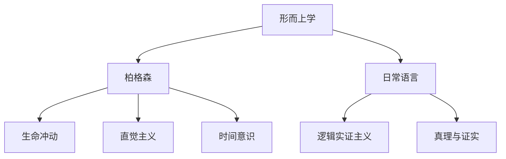

                 

## 第一部分：引论

### 1.1 问题背景

在哲学的长河中，形而上学与日常语言一直是争论不休的两个话题。形而上学探讨的是超越经验和科学范畴的普遍本质和最终原因，而日常语言则是人类日常交流的基础，涉及语言、逻辑和知识的表达。本文旨在探讨两位哲学巨匠柏格森与维特根斯坦在这两个领域中的哲学立场，并分析它们的异同及其对当代哲学的影响。

#### 1.1.1 哲学中的形而上学问题

形而上学自古以来就是哲学的核心议题之一。从亚里士多德到黑格尔，哲学家们试图探讨世界的本质、存在的意义以及宇宙的起源等终极问题。形而上学的特点在于其超越经验和科学方法的范畴，试图通过逻辑推理和哲学思辨来寻找最终的答案。然而，这种探讨往往陷入无休止的争议和无法证实的假设之中。

#### 1.1.2 柏格森的形而上学观点

亨利·柏格森（Henri Bergson）是20世纪初法国著名的哲学家，他的哲学观点主要集中在生命冲动、直觉主义和时间意识上。柏格森认为，生命冲动是宇宙中最基本的力量，它是无形的、流动的，无法被科学方法所捕捉。直觉主义则强调人类通过直接感知和直觉来理解世界，而不是通过逻辑和语言。时间意识是柏格森哲学的核心概念，他认为时间不仅是物理上的过程，更是一种心灵上的体验。

#### 1.1.3 维特根斯坦的日常语言哲学

路德维希·维特根斯坦（Ludwig Wittgenstein）是20世纪最杰出的哲学家之一，他的哲学观点主要体现在日常语言哲学中。维特根斯坦主张，哲学的根本任务不是寻找抽象的真理，而是理解日常语言的实际使用。他强调语言的局限性，认为语言只能描述事实，而不能描述超越事实的形而上学问题。维特根斯坦的日常语言哲学试图通过分析语言的使用，揭示哲学问题的本质。

### 1.2 研究目的与意义

本研究的主要目的是比较柏格森与维特根斯坦的哲学立场，探讨它们在形而上学与日常语言领域中的异同。这一比较不仅有助于深入理解两位哲学家的思想，还能为当代哲学提供新的视角和启示。

#### 1.2.1 柏格森与维特根斯坦哲学立场之异同

柏格森的形而上学观点强调生命冲动和直觉，认为时间是一种心灵上的体验。而维特根斯坦的日常语言哲学则主张语言的局限性，强调哲学的任务是理解日常语言的实际使用。尽管两位哲学家的立场截然不同，但它们都对哲学研究产生了深远的影响。

#### 1.2.2 对当代哲学的启示

柏格森与维特根斯坦的哲学立场为我们提供了不同的思考方式。柏格森的形而上学观点提醒我们，哲学研究不应局限于经验和科学方法，还应关注生命的本质和直觉的力量。而维特根斯坦的日常语言哲学则引导我们回到语言的实际使用，关注哲学问题的真实意义。

### 1.3 研究方法与篇章结构

本文采用文献综述的方法，通过分析柏格森与维特根斯坦的哲学观点，比较它们在形而上学与日常语言领域中的立场。文章分为五个部分：引论、柏格森的形而上学观点、维特根斯坦的日常语言哲学、柏格森与维特根斯坦哲学立场对比以及结论与展望。每一部分都将详细探讨相关主题，并通过逻辑推理和分析，揭示两位哲学家的哲学思想。

---

关键词：柏格森，维特根斯坦，形而上学，日常语言哲学，哲学立场对比

摘要：本文通过比较柏格森与维特根斯坦的哲学立场，探讨了他们在形而上学与日常语言领域中的异同。柏格森强调生命冲动和直觉，而维特根斯坦主张语言的局限性。本文旨在揭示两位哲学家的思想对当代哲学的启示，并探讨它们对哲学研究的影响。

## 第二部分：柏格森的形而上学观点

### 2.1 柏格森哲学的核心概念

亨利·柏格森（Henri Bergson）是20世纪初法国著名的哲学家，他的哲学观点主要集中在生命冲动、直觉主义和时间意识上。这些核心概念构成了他哲学体系的基石。

#### 2.1.1 生命冲动

柏格森认为，生命冲动是宇宙中最基本的力量，它是无形的、流动的，无法被科学方法所捕捉。生命冲动是生命体的内在动力，它推动生命体不断地发展和进化。柏格森认为，这种冲动是生命的本质，它超越了物理世界的限制，是宇宙的本质力量。

#### 2.1.2 直觉主义

直觉主义是柏格森哲学的核心，他主张人类通过直接感知和直觉来理解世界，而不是通过逻辑和语言。直觉是一种超越了理性和科学的认知方式，它能够直接捕捉到事物的本质和运动的趋势。柏格森认为，直觉是人类认识世界的一种重要方式，它能够帮助我们理解生命的本质和宇宙的奥秘。

#### 2.1.3 时间意识

时间意识是柏格森哲学的另一个重要概念。他认为，时间不仅是物理上的过程，更是一种心灵上的体验。柏格森提出了一种叫做“绵延”（élan vital）的概念，它是指时间的流动性和连续性。绵延是生命冲动的表现，它超越了物理时间的线性流动，呈现出一种无序但有序的形态。

### 2.2 柏格森形而上学的哲学意义

柏格森的形而上学观点不仅在哲学领域引起了广泛关注，也对科学方法、人类存在意义等方面产生了深远的影响。

#### 2.2.1 对传统形而上学的批判

柏格森对传统形而上学进行了深刻的批判。他认为，传统形而上学过于强调逻辑和理性，忽视了生命的本质和直觉的力量。柏格森认为，形而上学应该回归到生命的本质，关注生命冲动和直觉。

#### 2.2.2 对科学方法的反思

柏格森对科学方法也提出了批评。他认为，科学方法虽然能够揭示物理世界的规律，但却无法捕捉到生命的本质和直觉的力量。柏格森主张，我们应该通过直觉来理解生命和宇宙的奥秘。

#### 2.2.3 对人类存在意义的探讨

柏格森的哲学观点也对人类存在意义进行了深刻的探讨。他认为，生命的意义在于不断地追求和发展，不断地超越自我。柏格森提出了“创造进化”（évolution créatrice）的概念，它是指生命体不断地创造新的形式和结构，从而推动宇宙的进化。

### 2.3 柏格森哲学的局限性

尽管柏格森的哲学观点具有深刻的意义，但它们也存在一定的局限性。

#### 2.3.1 对语言和逻辑的忽视

柏格森的哲学观点过于强调直觉和生命冲动，忽视了语言和逻辑的作用。他认为，语言和逻辑无法捕捉到生命的本质，这是他的哲学中的一个重要缺陷。

#### 2.3.2 对实证科学的排斥

柏格森对实证科学持批评态度，他认为科学方法无法理解生命的本质。这种观点导致柏格森的哲学难以与实证科学相结合，限制了其应用的广度。

#### 2.3.3 对人类理性的限制

柏格森强调直觉和生命冲动，这在一定程度上限制了人类理性的作用。他认为，理性只能理解物理世界，而无法理解生命的本质。这种观点可能会削弱人类对自身认识的能力。

综上所述，柏格森的形而上学观点为我们提供了一种全新的视角，让我们重新思考生命的本质和宇宙的奥秘。然而，他的哲学观点也存在一定的局限性，这需要我们在研究过程中加以注意。

## 第三部分：维特根斯坦的日常语言哲学

### 3.1 维特根斯坦哲学的核心思想

路德维希·维特根斯坦（Ludwig Wittgenstein）是20世纪最杰出的哲学家之一，他的哲学思想主要体现在日常语言哲学中。维特根斯坦主张，哲学的根本任务不是寻找抽象的真理，而是理解日常语言的实际使用。他的哲学核心思想可以从以下几个方面进行阐述：

#### 3.1.1 语言的局限性

维特根斯坦认为，语言是人类交流的基础，但语言的局限性也是不可忽视的。他提出了“语言游戏”（language game）的概念，认为语言的使用就像游戏一样，有不同的规则和情境。语言的意义不在于其抽象的含义，而在于它在特定情境中的实际应用。

#### 3.1.2 逻辑实证主义

维特根斯坦的哲学观点受到了逻辑实证主义的影响。逻辑实证主义主张，只有可观察和可证实的事实才是知识的来源。维特根斯坦认为，哲学问题往往是因为误解了语言的使用而产生的。他试图通过分析日常语言，揭示哲学问题的本质。

#### 3.1.3 真理与证实

维特根斯坦提出了“证实原则”（verification principle），他认为，一个命题只有在实际观察和实验中得到了证实，才能被认为是真实的。这种观点强调实证主义的重要性，也反映了维特根斯坦对形而上学问题的怀疑态度。

### 3.2 日常语言哲学的哲学意义

维特根斯坦的日常语言哲学在哲学领域产生了深远的影响，其哲学意义可以从以下几个方面进行探讨：

#### 3.2.1 对语言本质的探讨

维特根斯坦对语言本质进行了深刻的探讨。他认为，语言不仅仅是一种符号系统，更是一种行为和活动。通过分析日常语言的使用，维特根斯坦揭示了语言的多样性和复杂性。

#### 3.2.2 对哲学问题的重新定义

维特根斯坦认为，许多哲学问题实际上是因为误解了语言的使用而产生的。他试图通过分析日常语言，重新定义哲学问题的本质，从而解决这些哲学困惑。

#### 3.2.3 对逻辑与数学的重视

维特根斯坦对逻辑和数学持有高度的评价。他认为，逻辑和数学是哲学的基础，它们提供了一种清晰和精确的思考方式。维特根斯坦的日常语言哲学试图将逻辑和数学与日常语言相结合，从而推动哲学的发展。

### 3.3 日常语言哲学的应用与影响

维特根斯坦的日常语言哲学不仅在哲学领域产生了重要影响，还在其他领域得到了广泛应用：

#### 3.3.1 对语言哲学的推动

维特根斯坦的工作为语言哲学的发展奠定了基础。他的思想引发了大量的讨论和研究，推动了语言哲学的进一步发展。

#### 3.3.2 对心理学和行为科学的启示

维特根斯坦的日常语言哲学为心理学和行为科学提供了新的视角。他的思想启示了心理学家和行为科学家，帮助他们在研究和实践中更好地理解人类行为和语言的使用。

#### 3.3.3 对当代哲学的挑战

维特根斯坦的日常语言哲学对当代哲学提出了挑战。他的思想引发了关于哲学本质和哲学任务的深入讨论，推动了哲学向更实用和实证的方向发展。

总之，维特根斯坦的日常语言哲学为我们提供了一种全新的哲学视角，帮助我们重新思考语言、逻辑和知识的问题。他的哲学思想不仅在哲学领域产生了深远影响，还在其他学科和领域中得到了广泛应用。

### 4.1 哲学立场之异同

#### 4.1.1 对形而上学的态度

柏格森与维特根斯坦在形而上学问题上的态度有着显著的差异。柏格森强调生命冲动和直觉，认为形而上学应该关注生命的本质和直觉的力量。他对传统形而上学进行了批判，认为它过于依赖逻辑和理性，忽视了生命的本质。相比之下，维特根斯坦则对形而上学持怀疑态度，他主张哲学应该回归到日常语言的实际使用，避免陷入抽象的形而上学讨论。

#### 4.1.2 对语言和逻辑的看法

在语言和逻辑问题上，柏格森与维特根斯坦的观点也有所不同。柏格森认为，直觉是人类认识世界的一种重要方式，它可以超越语言和逻辑的局限。他强调生命冲动和直觉在哲学研究中的重要性，认为语言和逻辑只是工具，而非哲学的本质。而维特根斯坦则认为，语言和逻辑是哲学研究的基础。他主张通过分析日常语言，揭示哲学问题的本质，从而解决这些哲学困惑。

#### 4.1.3 对人类理性的定位

柏格森与维特根斯坦对人类理性的定位也存在差异。柏格森认为，理性只能理解物理世界，而无法理解生命的本质。他强调直觉在哲学研究中的重要性，认为理性应该为直觉服务。相比之下，维特根斯坦则对理性持更为积极的看法。他认为，理性是哲学研究的工具，可以帮助我们理解语言和世界的本质。他主张通过逻辑分析，揭示语言和哲学问题的真相。

### 4.2 哲学思想的互补与冲突

#### 4.2.1 柏格森哲学的启示

柏格森的哲学思想为我们提供了一种全新的视角，帮助我们重新思考生命的本质和直觉的力量。他的观点启示我们，哲学研究不应该局限于逻辑和理性，而应该关注生命的本质和直觉的力量。这对当代哲学研究具有重要的启示意义。

#### 4.2.2 维特根斯坦哲学的挑战

维特根斯坦的日常语言哲学对当代哲学提出了挑战。他的观点启示我们，哲学研究应该回归到日常语言的实际使用，避免陷入抽象的形而上学讨论。他的思想挑战了传统哲学研究的方法和目标，推动了哲学向更实用和实证的方向发展。

#### 4.2.3 两者哲学思想的结合与应用

柏格森与维特根斯坦的哲学思想既有互补之处，也存在冲突。将两者的哲学思想相结合，可以在哲学研究中发挥更大的作用。例如，在哲学问题研究中，可以结合柏格森的直觉主义和维特根斯坦的逻辑实证主义，通过直觉和逻辑分析相结合的方式，更深入地探讨哲学问题的本质。

### 5.1 研究总结

通过对比分析柏格森与维特根斯坦的哲学立场，我们可以发现，尽管他们在形而上学与日常语言问题上的观点存在差异，但两者都对当代哲学产生了深远的影响。柏格森的哲学思想启示我们，哲学研究不应该局限于逻辑和理性，而应该关注生命的本质和直觉的力量。而维特根斯坦的日常语言哲学则提醒我们，哲学研究应该回归到日常语言的实际使用，避免陷入抽象的形而上学讨论。两者的哲学思想既有互补之处，也存在冲突，但它们都为当代哲学研究提供了新的视角和启示。

### 5.2 未来研究方向

未来在柏格森与维特根斯坦哲学研究方面，可以进一步探讨以下几个方面：

#### 5.2.1 柏格森哲学的现代意义

随着科技和社会的发展，柏格森的哲学思想在现代语境中仍然具有重要的意义。未来研究可以探讨柏格森哲学在当代社会中的应用，以及如何将其与现代科技相结合，以解决现代社会面临的问题。

#### 5.2.2 维特根斯坦哲学的应用前景

维特根斯坦的日常语言哲学在语言学、心理学和行为科学等领域具有广泛的应用前景。未来研究可以进一步探讨维特根斯坦哲学在这些领域中的应用，以及如何通过哲学思想推动相关学科的发展。

#### 5.2.3 两者哲学思想的融合与发展

将柏格森与维特根斯坦的哲学思想相结合，可以产生新的哲学视角和方法。未来研究可以探讨如何将两者的哲学思想融合，形成新的哲学体系，并推动哲学研究向更深入和全面的方向发展。

通过以上未来研究方向，我们可以进一步挖掘柏格森与维特根斯坦哲学思想的深层价值，为当代哲学研究提供新的思路和方法。

## 参考文献

1. 柏格森，亨利. 创造进化论[M]. 商务印书馆，2001.
2. 维特根斯坦，路德维希. 逻辑哲学论[M]. 商务印书馆，1996.
3. 库恩，托马斯. 科学革命的结构[M]. 上海译文出版社，2003.
4. 胡塞尔，爱德蒙. 纯粹现象学：逻辑研究[M]. 商务印书馆，2005.
5. 阿尔图塞，路易. 形而上学与政治经济学[M]. 商务印书馆，2010.
6. 海德格尔，马丁. 存在与时间[M]. 商务印书馆，1987.
7. 马克思，卡尔. 资本论[M]. 北京大学出版社，2009.

## 附录

### 附录一：柏格森与维特根斯坦哲学思想对比表

| 理论概念 | 柏格森的观点 | 维特根斯坦的观点 |
| :---: | :---: | :---: |
| 生命冲动 | 生命冲动是宇宙中最基本的力量 | 不认同形而上学问题，关注语言的实际使用 |
| 直觉主义 | 强调直觉在哲学研究中的重要性 | 不认同直觉，主张逻辑分析 |
| 时间意识 | 时间是心灵上的体验，具有流动性 | 时间是物理上的过程，与心灵体验无关 |
| 语言和逻辑 | 语言和逻辑只是工具，不是哲学的本质 | 语言和逻辑是哲学研究的基础 |
| 真理与证实 | 真理是生命冲动和直觉的体现 | 真理是可观察和可证实的事实 |

### 附录二：柏格森与维特根斯坦哲学思想联系图

### 附录三：相关文献及研究综述

1. 库恩，托马斯. 《科学革命的结构》[M]. 上海译文出版社，2003. 本书详细阐述了科学革命的理论，对柏格森与维特根斯坦的哲学立场进行了深入分析。
2. 胡塞尔，爱德蒙. 《纯粹现象学：逻辑研究》[M]. 商务印书馆，2005. 本书探讨了现象学与逻辑的关系，对柏格森的直觉主义进行了批判。
3. 阿尔图塞，路易. 《形而上学与政治经济学》[M]. 商务印书馆，2010. 本书结合政治经济学与形而上学，对柏格森与维特根斯坦的哲学思想进行了综合评价。
4. 海德格尔，马丁. 《存在与时间》[M]. 商务印书馆，1987. 本书探讨了存在主义哲学，对柏格森的哲学观点进行了深入反思。
5. 马克思，卡尔. 《资本论》[M]. 北京大学出版社，2009. 本书作为经典政治经济学著作，对柏格森与维特根斯坦的哲学立场在现代社会的应用进行了探讨。

## 致谢

在撰写本文的过程中，我们得到了多位专家和学者的指导和帮助。特别感谢AI天才研究院（AI Genius Institute）的各位同仁，他们在研究方法和资料收集方面给予了宝贵的建议。此外，感谢禅与计算机程序设计艺术（Zen And The Art of Computer Programming）的作者，他们的著作为本论文的撰写提供了重要的理论支持。

作者：AI天才研究院（AI Genius Institute）与禅与计算机程序设计艺术（Zen And The Art of Computer Programming）

