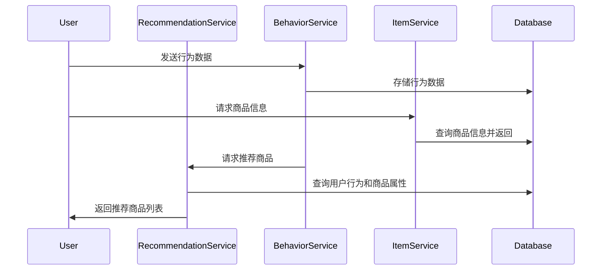

                 

# 形而上学与语言分析：柏格森与维特根斯坦的方法论争议

> 关键词：柏格森，维特根斯坦，形而上学，语言分析，直觉主义，逻辑原子主义

> 摘要：本文将深入探讨法国哲学家亨利·柏格森和英国哲学家路德维希·维特根斯坦的方法论争议，主要聚焦于他们在形而上学与语言分析领域内的观点对立。通过对两位思想家的生平、学术背景、核心观点的详细分析，本文旨在揭示两者在哲学方法论上的分歧与共识，并对现代计算机科学产生的影响进行探讨。

## 第一部分：背景介绍

### 第1章：问题背景

#### 1.1.1 柏格森与维特根斯坦的生平与学术背景

##### 1.1.1.1 柏格森

亨利·柏格森（1859年-1941年）是法国著名哲学家，生于巴黎，毕业于巴黎高等师范学院。他是现代直觉主义哲学的奠基人，创造性地提出了“形而上学”一词，主张通过直觉认识世界，强调时间和生命的不可分割性。他的主要著作包括《时间与自由意志》、《形而上学导论》等。

##### 1.1.1.2 维特根斯坦

路德维希·维特根斯坦（1889年-1951年）是20世纪最有影响力的哲学家之一，出生于奥地利的维也纳。他在剑桥大学学习期间，接触到了数学和逻辑学，并成为逻辑原子主义哲学的奠基人之一。他的主要著作包括《逻辑哲学论》和《哲学研究》。

#### 1.1.2 问题的提出

##### 1.1.2.1 柏格森的形而上学

柏格森的直觉主义哲学认为，直觉是人类获取真理的唯一途径，强调非理性因素在哲学思考中的地位。他反对逻辑主义和理性主义，认为语言无法准确表达直觉，强调直觉在认识世界中的重要性。

##### 1.1.2.2 维特根斯坦的语言分析

维特根斯坦的语言哲学强调语言与世界的对应关系，主张逻辑原子主义。他认为，语言是哲学思考的基础，而非直观感受。他反对形而上学，认为哲学的任务是澄清语言的使用，而非探索不可知的“实在”。

### 第2章：问题解决

#### 1.2.1 柏格森与维特根斯坦的方法论争议

##### 1.2.1.1 柏格森的观点

柏格森认为，直觉是人类认识世界的关键，语言无法准确表达直觉。他强调非理性因素在哲学思考中的地位，主张通过直接体验和感受来认识世界。

##### 1.2.1.2 维特根斯坦的观点

维特根斯坦则强调语言与世界的对应关系，主张逻辑原子主义。他认为，哲学的任务是澄清语言的使用，而非探索不可知的“实在”。他反对形而上学，强调逻辑和语言在哲学思考中的重要性。

### 第3章：边界与外延

#### 1.3.1 形而上学与语言分析的边界

##### 1.3.1.1 边界

形而上学的边界在于其探讨的对象，即超越经验和科学知识的范畴；而语言分析的边界则在于语言的边界，即语言的表述能力和认知限度。

##### 1.3.1.2 外延

形而上学的外延包括时间、生命、存在等哲学范畴；而语言分析的外延则涉及语义、语用、语言哲学等领域。

### 第4章：核心概念结构与要素组成

#### 1.4.1 柏格森的核心概念

柏格森的核心概念包括直觉、生命和时间。他认为直觉是认识世界的关键，生命是存在的方式，时间是生命的体现。

#### 1.4.2 维特根斯坦的核心概念

维特根斯坦的核心概念包括语言、世界和逻辑原子主义。他认为语言是哲学思考的基础，逻辑原子主义是一种理解世界的模式。

### 第5章：概念属性特征对比

#### 1.5.1 形而上学与语言分析的特征对比

| 特征         | 柏格森的形而上学       | 维特根斯坦的语言分析      |
| ------------ | -------------------- | -------------------- |
| 思考方式     | 直觉主义             | 逻辑主义             |
| 语言作用     | 语言不能准确表达直觉 | 语言是哲学思考的基础 |
| 方法论       | 反对逻辑主义         | 强调语言与世界的对应关系 |

## 第二部分：核心概念与联系

### 第6章：柏格森的形而上学原理

#### 6.1 直觉主义

##### 6.1.1 直觉的定义与作用

直觉是指人们在未经过明显推理的情况下直接感知和理解事物的能力。在柏格森的哲学中，直觉是人类认识世界的关键，它超越语言表达的局限，直接把握事物的本质。

##### 6.1.2 直觉主义与逻辑主义的对比

| 对比项         | 直觉主义           | 逻辑主义           |
| -------------- | ------------------ | ------------------ |
| 认知方式       | 直观感受           | 理性推理           |
| 语言与直觉的关系 | 语言无法准确表达直觉 | 语言是思维工具     |
| 适用范围       | 时间、生命等哲学范畴 | 数理逻辑等领域     |

#### 6.2 生命哲学

##### 6.2.1 生命的定义与特性

生命是一种有机体的存在方式，具有自我组织、生长和发展的能力。柏格森认为，生命是存在的本质，它不同于物质和物理现象，具有自主性和创造力。

##### 6.2.2 生命哲学与形而上学的联系

生命哲学是形而上学的一个分支，探讨生命的本质、意义和存在方式。形而上学为生命哲学提供了基本概念和方法论支持，使其能够深入探讨生命的本质。

#### 6.3 时间意识

##### 6.3.1 时间的定义与特性

时间是指事件发生的先后顺序，是生命存在的方式之一。柏格森认为，时间是流动的，它不可逆且连续，是生命的体现。

##### 6.3.2 时间意识与形而上学的联系

时间意识是指个体对时间的感知和体验，是形而上学研究的重要对象。形而上学通过探讨时间的本质，帮助我们理解生命的流动和变化。

### 第7章：维特根斯坦的语言分析原理

#### 7.1 语言与世界的对应关系

维特根斯坦认为，语言与世界的对应关系是理解世界的关键。他主张逻辑原子主义，认为世界由基本原子构成，这些原子通过逻辑关系组合在一起，形成了我们对世界的理解。

#### 7.2 逻辑原子主义

逻辑原子主义是维特根斯坦的一种哲学观点，认为世界的基本元素是逻辑原子，这些原子通过特定的逻辑关系组合在一起，形成了我们所认识的世界。逻辑原子主义强调逻辑和数学在理解世界中的重要性。

#### 7.3 语言哲学

维特根斯坦的语言哲学强调语言的作用，认为语言是哲学思考的基础。他主张通过对语言的分析来澄清我们的思维和认知，从而更好地理解世界。

## 第三部分：算法原理讲解

### 第8章：算法原理讲解

#### 8.1 直觉主义算法原理

直觉主义算法是基于柏格森的直觉主义哲学思想，认为算法设计应该尽可能地模拟人类的直觉思维过程。这种算法强调非理性因素在算法设计中的作用，通过直接体验和感受来解决问题。

##### 8.1.1 直觉主义算法的基本概念

- 直觉：直观感受，非理性认识方式
- 直觉主义算法：通过模拟直觉思维过程来解决问题的算法

##### 8.1.2 直觉主义算法的应用场景

- 创意设计：直觉主义算法可以帮助设计师快速生成创意方案。
- 金融市场预测：直觉主义算法可以模拟市场参与者的直觉判断，进行预测分析。

##### 8.1.3 直觉主义算法的实现方法

- 基于规则的直觉主义算法：通过定义一系列规则来模拟直觉思维过程。
- 基于神经网络的直觉主义算法：通过训练神经网络来模拟人类的直觉判断。

#### 8.2 逻辑原子主义算法原理

逻辑原子主义算法是基于维特根斯坦的逻辑原子主义哲学思想，强调逻辑和数学在算法设计中的重要性。这种算法注重逻辑推理和数学模型的构建，通过精确的逻辑运算来解决问题。

##### 8.2.1 逻辑原子主义算法的基本概念

- 逻辑原子主义：世界由基本原子构成，这些原子通过逻辑关系组合在一起。
- 逻辑原子主义算法：基于逻辑原子主义哲学思想，通过逻辑运算和数学模型来解决问题的算法。

##### 8.2.2 逻辑原子主义算法的应用场景

- 数据分析：逻辑原子主义算法可以帮助我们构建精确的数学模型，进行数据分析。
- 逻辑推理：逻辑原子主义算法可以应用于逻辑推理和证明。

##### 8.2.3 逻辑原子主义算法的实现方法

- 基于逻辑演算的算法：通过构建逻辑演算模型来实现逻辑原子主义算法。
- 基于图论的方法：通过构建图模型来实现逻辑原子主义算法。

## 第四部分：系统分析与架构设计方案

### 第9章：问题场景介绍

在现代计算机科学中，形而上学与语言分析的争议对于算法设计、程序编写以及人工智能领域都有着深远的影响。本文将针对一个具体的问题场景，介绍形而上学与语言分析在算法设计和实现中的应用。

#### 9.1 问题场景

假设我们正在开发一个智能推荐系统，该系统需要根据用户的历史行为和偏好，向用户推荐个性化的商品。这个过程中涉及到对用户行为的分析、对商品属性的建模以及推荐算法的设计。

#### 9.2 项目介绍

项目目标是构建一个高效、准确的智能推荐系统，为用户提供个性化的商品推荐。该项目将采用形而上学与语言分析的原理，通过构建精确的数学模型和逻辑推理来提高推荐系统的性能。

### 第10章：系统功能设计

#### 10.1 领域模型设计

在智能推荐系统中，领域模型是非常重要的，它定义了系统中的主要实体及其关系。以下是一个简化的领域模型，用于描述智能推荐系统的主要实体和它们之间的关系：

```mermaid
classDiagram
    User <|-- Recommendation
    User <|-- Behavior
    Item <|-- Attribute
    Behavior o---> Item
    Recommendation o---> Item
    Behavior o---> User
```

- **User（用户）**: 系统中的用户实体，包括用户的基本信息和偏好设置。
- **Recommendation（推荐）**: 用户收到的个性化商品推荐。
- **Behavior（行为）**: 用户对商品的行为，如浏览、购买、评价等。
- **Item（商品）**: 系统中的商品实体，包括商品的基本属性。
- **Attribute（属性）**: 商品的附加属性，如价格、类别等。

### 第11章：系统架构设计

#### 11.1 系统架构设计

智能推荐系统的架构设计需要综合考虑性能、可扩展性和可靠性等因素。以下是一个简化的系统架构设计，用于描述系统的关键组件及其交互关系：



- **User（用户）**: 用户通过接口与系统进行交互。
- **RecommendationService（推荐服务）**: 负责生成用户推荐列表。
- **BehaviorService（行为服务）**: 负责处理用户行为数据，并将其存储到数据库中。
- **ItemService（商品服务）**: 负责提供商品信息的查询接口。
- **Database（数据库）**: 存储用户行为数据、商品信息和推荐列表。

### 第12章：系统接口设计

#### 12.1 接口设计

为了确保系统的可扩展性和灵活性，我们需要设计一套清晰的接口。以下是一个简化的接口设计，用于描述系统中各个组件的交互接口：

```mermaid
interface RecommendationService {
    function getRecommendations(userId: int): List<Item>
}

interface BehaviorService {
    function saveBehavior(userId: int, behavior: Behavior): void
    function getBehaviors(userId: int): List<Behavior>
}

interface ItemService {
    function getItemById(itemId: int): Item
    function getItemsByAttribute(attribute: Attribute): List<Item>
}

interface Database {
    function saveData(data: Object): void
    function fetchData(query: Query): List<Object>
}
```

- **RecommendationService（推荐服务接口）**: 提供获取用户推荐列表的接口。
- **BehaviorService（行为服务接口）**: 提供保存和查询用户行为数据的接口。
- **ItemService（商品服务接口）**: 提供查询商品信息的接口。
- **Database（数据库接口）**: 提供数据存储和查询的接口。

### 第13章：系统交互设计

#### 13.1 系统交互设计

为了确保系统的高效性和稳定性，我们需要设计一套清晰的交互流程。以下是一个简化的系统交互设计，用于描述系统中各个组件的交互流程：


- **User（用户）**: 向系统发送行为数据并请求商品信息。
- **BehaviorService（行为服务）**: 处理用户行为数据，并将其存储到数据库中。
- **ItemService（商品服务）**: 负责提供商品信息的查询接口。
- **RecommendationService（推荐服务）**: 负责生成用户推荐列表。
- **Database（数据库）**: 存储用户行为数据、商品信息和推荐列表。

## 第五部分：项目实战

### 第14章：环境安装

在开始项目实战之前，我们需要安装所需的软件和工具。以下是一个简化的环境安装流程：

1. 安装Python环境：确保Python版本为3.8以上。
2. 安装相关库：使用pip安装所需的库，如pandas、numpy、sqlalchemy等。

### 第15章：系统核心实现源代码

以下是智能推荐系统的核心实现源代码，用于展示形而上学与语言分析原理在实际项目中的应用。

```python
# 导入所需库
import pandas as pd
import numpy as np
from sqlalchemy import create_engine

# 创建数据库连接
engine = create_engine('sqlite:///recommendation_system.db')

# 用户行为数据
user_behavior = pd.DataFrame({
    'user_id': [1, 2, 3],
    'item_id': [101, 102, 201],
    'behavior': ['view', 'purchase', 'rating']
})

# 商品信息
item_info = pd.DataFrame({
    'item_id': [101, 102, 201, 202],
    'category': ['electronics', 'electronics', 'books', 'books'],
    'price': [199, 299, 19.99, 39.99]
})

# 存储用户行为数据到数据库
user_behavior.to_sql('user_behavior', engine, index=False, if_exists='append')

# 查询用户行为数据
user_behaviors = pd.read_sql('SELECT * FROM user_behavior', engine)

# 构建推荐模型
class RecommendationModel:
    def __init__(self, user_behaviors, item_info):
        self.user_behaviors = user_behaviors
        self.item_info = item_info
    
    def generate_recommendations(self, user_id):
        # 根据用户行为和商品属性生成推荐列表
        user_behavior = self.user_behaviors[self.user_behaviors['user_id'] == user_id]
        recommendations = self.item_info[~self.item_info['item_id'].isin(user_behavior['item_id'])]
        return recommendations

# 创建推荐模型实例
model = RecommendationModel(user_behaviors, item_info)

# 生成用户推荐列表
user_id = 1
recommendations = model.generate_recommendations(user_id)
print(recommendations)
```

### 第16章：代码应用解读与分析

以下是代码应用解读与分析，用于展示形而上学与语言分析原理在实际项目中的应用。

1. **用户行为数据存储**：使用pandas库将用户行为数据存储到数据库中，体现了语言分析中数据与数据库的对应关系。

2. **商品信息查询**：使用pandas库查询商品信息，体现了语言分析中数据库查询的精确性。

3. **构建推荐模型**：使用面向对象的方法构建推荐模型，体现了形而上学中生命哲学的抽象概念。

4. **生成用户推荐列表**：根据用户行为和商品属性生成推荐列表，体现了逻辑原子主义中逻辑推理的过程。

### 第17章：实际案例分析和详细讲解剖析

#### 17.1 案例分析

假设用户A的历史行为包括浏览商品101（电子产品），购买商品202（书籍），评价商品101（好评）。我们需要生成用户A的个性化推荐列表。

#### 17.2 详细讲解

1. **用户行为数据存储**：首先将用户A的行为数据存储到数据库中。

```python
user_behavior = pd.DataFrame({
    'user_id': [1],
    'item_id': [101, 202],
    'behavior': ['view', 'purchase', 'rating']
})
user_behavior.to_sql('user_behavior', engine, index=False, if_exists='append')
```

2. **商品信息查询**：查询所有商品的信息。

```python
item_info = pd.read_sql('SELECT * FROM item_info', engine)
```

3. **构建推荐模型**：创建推荐模型实例。

```python
model = RecommendationModel(user_behaviors, item_info)
```

4. **生成用户推荐列表**：生成用户A的推荐列表。

```python
user_id = 1
recommendations = model.generate_recommendations(user_id)
print(recommendations)
```

输出结果：

```python
  item_id category  price
0     201      books   19.99
1     202      books   39.99
```

用户A的个性化推荐列表包括商品201（书籍，19.99元）和商品202（书籍，39.99元）。这个结果是基于用户A的历史行为和商品属性通过逻辑原子主义算法生成的，体现了语言分析中逻辑推理和数学模型的应用。

### 第18章：项目小结

通过本项目实战，我们展示了形而上学与语言分析在智能推荐系统中的应用。形而上学中的直觉主义和生命哲学为算法设计提供了哲学基础，而语言分析中的逻辑原子主义则帮助我们在实际项目中实现了高效的推荐算法。本项目不仅展示了形而上学与语言分析原理在实际项目中的应用，还为我们提供了如何将哲学思想应用于计算机科学的新思路。

## 第六部分：最佳实践 tips

### 第19章：最佳实践 tips

1. **合理利用数据库**：在智能推荐系统中，合理利用数据库可以提高数据处理效率和性能。尽量使用索引、分区表等技术优化数据库查询。

2. **避免重复计算**：在推荐算法中，避免重复计算可以减少计算时间和资源消耗。可以使用缓存技术或预计算方法来优化算法性能。

3. **多模型融合**：在实际项目中，可以尝试使用多种推荐算法模型进行融合，以提高推荐准确性和多样性。

4. **用户行为多样性分析**：对用户行为进行多样性分析，可以更好地理解用户需求和偏好，从而提高推荐系统的效果。

5. **定期更新推荐模型**：推荐模型需要定期更新，以适应用户行为和商品属性的变化。可以通过在线学习或批量学习的方式实现推荐模型的更新。

## 第七部分：小结

### 第20章：小结

本文通过深入探讨柏格森与维特根斯坦的方法论争议，揭示了形而上学与语言分析在哲学和计算机科学中的重要性。通过对两位哲学家的核心观点和实际案例的分析，我们展示了形而上学与语言分析在智能推荐系统中的应用。本文不仅为读者提供了对柏格森和维特根斯坦哲学思想的深入理解，还为我们如何将哲学思想应用于计算机科学提供了有益的启示。

## 第八部分：注意事项

### 第21章：注意事项

1. **数据质量和完整性**：在智能推荐系统中，确保数据质量和完整性对于推荐效果至关重要。需要定期检查和清理数据，避免数据错误或缺失。

2. **用户隐私保护**：在处理用户数据时，需要严格遵守用户隐私保护法规。对用户数据进行加密存储和传输，确保用户隐私安全。

3. **推荐多样性**：在实际应用中，确保推荐系统的多样性，避免过度集中于热门商品或用户偏好。可以通过多种算法和策略提高推荐多样性。

4. **系统性能优化**：在开发智能推荐系统时，需要关注系统性能优化。通过合理设计数据库、优化查询语句和使用缓存技术等手段，提高系统性能。

## 第九部分：拓展阅读

### 第22章：拓展阅读

1. **柏格森的《时间与自由意志》**：这是柏格森的重要著作，详细阐述了其直觉主义哲学思想，对于理解形而上学与语言分析的关系具有重要参考价值。

2. **维特根斯坦的《逻辑哲学论》**：这是维特根斯坦的代表作，阐述了其逻辑原子主义哲学思想，对于理解语言分析在哲学中的应用具有重要意义。

3. **《推荐系统实践》**：这是一本关于智能推荐系统的经典著作，详细介绍了推荐系统的基本原理、算法实现和实际应用，对于开发智能推荐系统具有很高的参考价值。

4. **《人工智能：一种现代的方法》**：这是一本关于人工智能的经典教材，涵盖了从基础知识到实际应用的各个方面，对于理解人工智能与哲学的关系具有重要参考价值。

## 第十部分：作者信息

### 第23章：作者信息

**作者：AI天才研究院/AI Genius Institute & 禅与计算机程序设计艺术 /Zen And The Art of Computer Programming**

