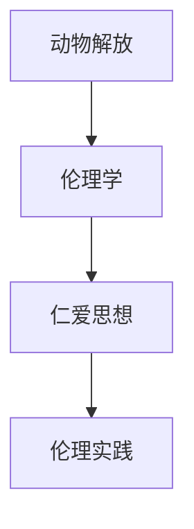
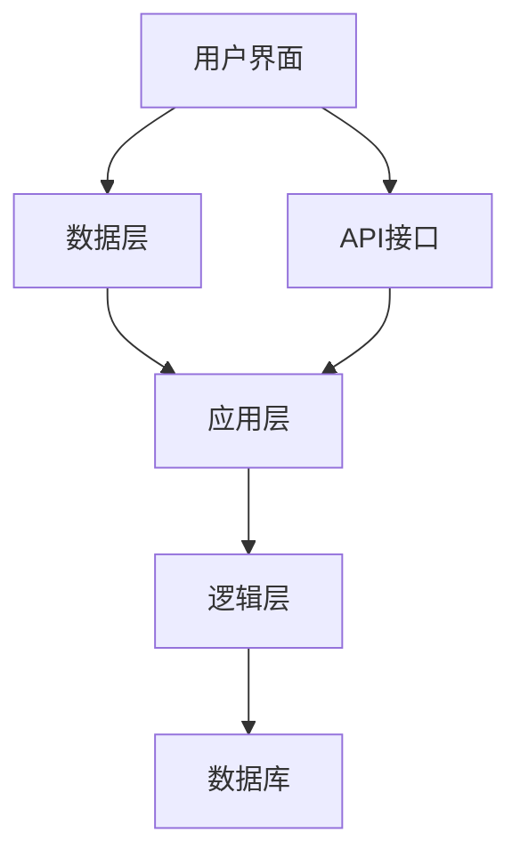
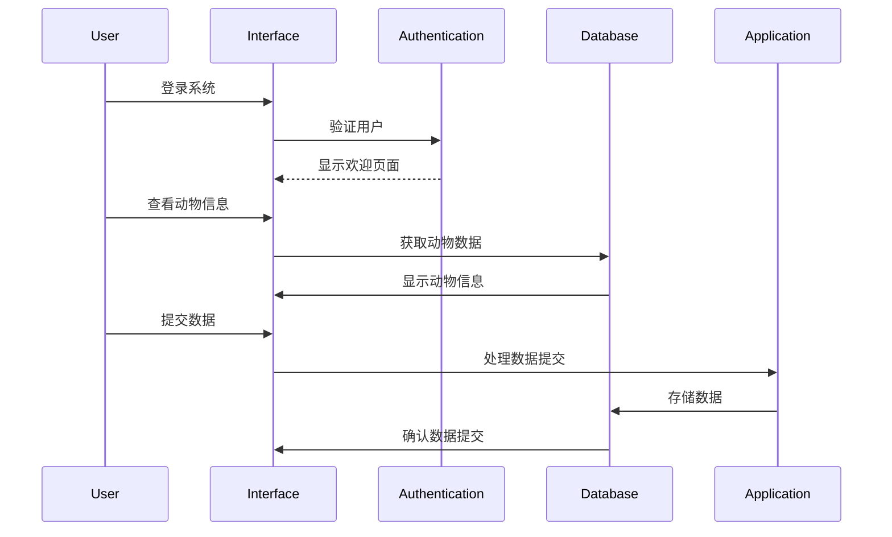

                 

### 引言

**文章标题**：彼得·辛格与孟子：动物解放与仁爱思想的伦理学

**关键词**：彼得·辛格、孟子、动物解放、仁爱思想、伦理学

**摘要**：
本文深入探讨了两位思想巨匠彼得·辛格与孟子的伦理学思想，尤其是他们在动物解放与仁爱领域的贡献。通过对比分析，本文揭示了他们在理论与实践中的异同，探讨了这些思想在当代社会中的应用及其对动物权益运动的启示。本文旨在为读者提供一个清晰、系统的理解，促进对这些重要伦理学问题的深入思考。

### 目录

1. **引言**
   - 1.1 作者介绍
   - 1.2 研究背景与意义
   - 1.3 研究方法与结构

2. **彼得·辛格的思想**
   - 2.1 生平与思想简介
     - 2.1.1 彼得·辛格的生平
     - 2.1.2 彼得·辛格的主要著作
     - 2.1.3 彼得·辛格的哲学理念
   - 2.2 动物解放思想
     - 2.2.1 动物解放的概念
     - 2.2.2 彼得·辛格的动物解放思想
     - 2.2.3 动物解放思想的影响
   - 2.3 仁爱伦理学
     - 2.3.1 仁爱的概念
     - 2.3.2 彼得·辛格的仁爱伦理学
     - 2.3.3 仁爱伦理学在实践中的应用

3. **孟子的思想**
   - 3.1 生平与思想简介
     - 3.1.1 孟子的生平
     - 3.1.2 孟子的主要著作
     - 3.1.3 孟子的哲学理念
   - 3.2 仁爱思想
     - 3.2.1 仁爱的概念
     - 3.2.2 孟子的仁爱思想
     - 3.2.3 仁爱思想在实践中的应用
   - 3.3 伦理学与动物权益
     - 3.3.1 伦理学的基本概念
     - 3.3.2 孟子的伦理学与动物权益
     - 3.3.3 孟子的伦理学对当代动物权益运动的启示

4. **比较与讨论**
   - 4.1 彼得·辛格与孟子思想的比较
     - 4.1.1 相似之处
     - 4.1.2 不同之处
     - 4.1.3 对比分析的启示
   - 4.2 仁爱思想在当代的应用
     - 4.2.1 当代社会对仁爱思想的需求
     - 4.2.2 仁爱思想在当代的应用案例
     - 4.2.3 仁爱思想的未来展望
   - 4.3 动物权益运动的未来
     - 4.3.1 当代动物权益运动的发展
     - 4.3.2 彼得·辛格与孟子思想对动物权益运动的贡献
     - 4.3.3 动物权益运动的挑战与机遇

5. **结论**
   - 5.1 研究总结
   - 5.2 研究局限
   - 5.3 未来研究方向

### 彼得·辛格的思想

彼得·辛格（Peter Singer），生于1946年，是一位澳大利亚哲学家、伦理学家，以其在动物解放和仁爱伦理学领域的贡献而著称。他的思想和著作在全球范围内产生了深远的影响，尤其是在动物权益和保护方面。

#### 2.1 生平与思想简介

**2.1.1 彼得·辛格的生平**

彼得·辛格出生于澳大利亚悉尼，曾在牛津大学学习哲学、政治学和经济学位。他在大学期间开始关注动物权益问题，并在1967年成为牛津动物解放小组的成员。后来，他在美国和澳大利亚的多所大学担任教授，并在全球范围内发表了大量的论文和著作。

**2.1.2 彼得·辛格的主要著作**

彼得·辛格的代表作之一是《动物解放》（"Animal Liberation"），该书首次出版于1975年，是动物权益运动的基石之一。此外，他还著有《实践伦理学》（"Practical Ethics"）、《视野》（"Seeing Like a State"）等，涵盖了伦理学、政治哲学等多个领域。

**2.1.3 彼得·辛格的哲学理念**

彼得·辛格的哲学理念以仁爱和同情为核心。他认为，人类有责任对待所有生命形式，特别是那些无法为自己辩护的动物。他的伦理学观点强调个体的道德义务，并倡导一种基于同情和责任感的道德生活。

#### 2.2 动物解放思想

**2.2.1 动物解放的概念**

动物解放是指消除对动物的压迫和剥削，确保它们能够过上无痛苦、自由自在的生活。彼得·辛格认为，动物拥有自身的生活权利，不应该仅仅作为人类的工具。

**2.2.2 彼得·辛格的动物解放思想**

彼得·辛格的动物解放思想主要包含以下几个方面：

1. **平等的道德地位**：彼得·辛格认为，所有动物都应享有平等的道德地位，不论它们是人类还是其他物种。
2. **非工具化原则**：动物不应该被简单地视为人类实现目的的工具，而是应被视为有自身价值的生命体。
3. **减少痛苦和死亡**：人类应采取一切措施来减少动物的痛苦和死亡，特别是在农业、科学实验和娱乐等领域。

**2.2.3 动物解放思想的影响**

彼得·辛格的动物解放思想对全球动物权益运动产生了深远的影响。他的著作激发了无数人关注动物权益问题，并促使各国政府和组织采取行动，制定更严格的动物保护法规。

#### 2.3 仁爱伦理学

**2.3.1 仁爱的概念**

仁爱是一种关心和同情他人的情感，表现为对他人的善意和关爱。彼得·辛格认为，仁爱是道德生活的核心，是建立公正和和谐社会的基石。

**2.3.2 彼得·辛格的仁爱伦理学**

彼得·辛格的仁爱伦理学主张以下几点：

1. **同情与责任**：人类有责任对他人的痛苦和不幸表示同情，并采取行动来减轻这些痛苦。
2. **平等对待**：无论对象的身份、地位或种族，每个人都应受到平等对待。
3. **道德选择**：个人应根据自己的道德原则做出选择，而不是仅仅出于自私的动机。

**2.3.3 仁爱伦理学在实践中的应用**

彼得·辛格的仁爱伦理学在当代社会中有着广泛的应用。它不仅影响了动物权益运动，也促进了社会公正和人类尊严的倡导。例如，许多慈善机构和非政府组织都基于彼得·辛格的仁爱伦理学原则，致力于帮助弱势群体和改善社会环境。

### 孟子的思想

孟子（约公元前372年—公元前289年），是中国战国时期的一位重要哲学家，儒家学派的代表人物之一。他的思想对中国乃至东亚的伦理学和社会哲学产生了深远的影响，尤其是在仁爱和伦理学领域。

#### 3.1 生平与思想简介

**3.1.1 孟子的生平**

孟子出生于今天的山东省，年少时家境贫寒，但凭借自己的努力成为一位出色的学者。他在齐国担任过官职，但不久后辞职，专注于教学和写作。孟子的学说得到了战国时期其他诸侯国的重视，他的学生遍布各地。

**3.1.2 孟子的主要著作**

孟子的主要著作包括《孟子》七篇，这些著作后来被编入儒家经典《四书》之一。孟子的思想主要通过这些著作得以传承，成为儒家伦理学的重要组成部分。

**3.1.3 孟子的哲学理念**

孟子的哲学理念以“仁”为核心，强调人性的善良和道德修养。他认为，人性本善，人们天生具有道德感和同情心。通过教育和自我修养，人们可以发掘和实现自己的道德潜能。

#### 3.2 仁爱思想

**3.2.1 仁爱的概念**

仁爱在孟子哲学中是一种基本的道德情感和责任，表现为对他人的关心、同情和爱护。孟子认为，仁爱是道德行为的根源，是社会和谐的基础。

**3.2.2 孟子的仁爱思想**

孟子的仁爱思想主要包含以下几个方面：

1. **人性的善良**：孟子认为，人性本善，人们天生具有道德感，能够感知他人的痛苦和快乐。
2. **四端之心**：孟子提出“恻隐之心”、“羞恶之心”、“辞让之心”和“是非之心”，认为这四种基本情感是人类道德行为的动力。
3. **仁爱实践**：孟子强调，仁爱不仅是一种情感，更是一种实际行动，人们应通过具体的行为来体现仁爱。

**3.2.3 仁爱思想在实践中的应用**

孟子的仁爱思想在中国历史上有广泛的应用。例如，在中国的家庭教育和社会治理中，强调道德教育和仁爱原则，以培养有道德、有责任感的公民。此外，孟子的仁爱思想也对东亚其他国家的文化和道德发展产生了影响。

#### 3.3 伦理学与动物权益

**3.3.1 伦理学的基本概念**

伦理学是关于道德原则和道德行为的哲学研究。孟子认为，伦理学的基础在于对人类自身的认识和道德修养。他强调，人们应通过学习和实践，培养自己的道德品质。

**3.3.2 孟子的伦理学与动物权益**

孟子的伦理学主要关注人类之间的关系，但他的思想中也蕴含着对动物权益的考虑。孟子认为，人们应尊重生命，不应随意伤害或虐待动物。尽管他没有直接讨论动物权益问题，但他的仁爱思想为保护动物提供了道德依据。

**3.3.3 孟子的伦理学对当代动物权益运动的启示**

孟子的伦理学思想对当代动物权益运动有着重要的启示。例如，他的“人性本善”的观点提醒人们，人类天生具有同情心，可以通过教育和实践来增强这种同情心，从而更好地对待动物。此外，孟子的“仁爱实践”观点也为动物权益运动提供了行动指南，鼓励人们通过具体的行动来保护动物权益。

### 比较与讨论

彼得·辛格与孟子的思想在动物解放和仁爱伦理学领域有着显著的贡献，尽管两者在文化背景和哲学基础上有所不同，但他们在许多方面有着惊人的相似之处。

#### 4.1 彼得·辛格与孟子思想的相似之处

1. **道德关怀的广泛性**：彼得·辛格和孟子都主张道德关怀不应仅限于人类，而应扩展到所有生命形式。彼得·辛格强调动物解放，孟子虽然没有直接讨论动物权益，但他的仁爱思想同样适用于对动物的关怀。
2. **同情与责任**：两者都认为同情是一种重要的道德情感，人们有责任基于同情心对待他人和动物。彼得·辛格的动物解放思想和孟子的仁爱伦理学都强调个体应承担道德责任。
3. **道德行为的实践**：彼得·辛格和孟子都认为道德不仅是理论上的讨论，更需要在实际生活中得到体现。彼得·辛格通过具体的行动和倡导来推动动物权益运动，孟子则通过教育和个人修养来培养人们的道德品质。

#### 4.2 彼得·辛格与孟子思想的不同之处

1. **文化背景**：彼得·辛格生活在现代社会，他的思想受到了西方哲学和伦理学的影响，而孟子生活在战国时期的中国，他的思想主要受到儒家传统的影响。这导致了两者在表达方式和哲学观点上的差异。
2. **道德范围的侧重**：彼得·辛格的动物解放思想主要关注动物权益，而孟子的仁爱伦理学则更侧重于人与人之间的关系。尽管孟子对动物权益有所考虑，但他的主要关注点在于人类的道德修养和社会治理。
3. **理论应用**：彼得·辛格的动物解放思想具有较强的现实应用性，他在全球范围内推动了动物权益运动的发展。而孟子的仁爱思想则更多地体现在传统儒家文化中，对当代社会的直接影响相对较小。

#### 4.3 对比分析的启示

彼得·辛格与孟子思想的对比分析为我们提供了几个重要的启示：

1. **跨文化的道德关怀**：两位思想家的共同之处提醒我们，道德关怀不应受限于文化或地域。无论东方还是西方，人们都可以通过道德教育和实践来增强对他人和动物的关怀。
2. **道德责任的实现**：通过彼得·辛格和孟子的思想，我们可以看到道德责任不仅是一种理论上的承诺，更需要在实际生活中得到体现。个人和社会都需要努力实现这一目标。
3. **多元化的伦理学研究**：彼得·辛格与孟子思想的差异提醒我们，伦理学研究需要多元化，不仅要关注传统思想，还要关注现代社会的实际问题。这有助于我们更全面地理解道德问题，并为解决这些问题提供有益的思路。

### 仁爱思想在当代的应用

仁爱思想在当代社会中的应用具有重要意义。随着社会的发展和科技的进步，人们对于道德关怀和伦理问题的关注日益增加。以下是仁爱思想在当代社会中的应用及其未来展望：

#### 5.1 当代社会对仁爱思想的需求

1. **全球化与多元文化**：全球化带来了不同文化之间的交流与融合，同时也带来了道德观念的碰撞与冲突。仁爱思想强调尊重和平等，有助于解决文化冲突，促进社会和谐。
2. **科技进步与社会挑战**：科技进步带来了许多新的伦理问题，如人工智能、基因编辑等。仁爱思想提供了一种道德框架，帮助人们面对这些挑战，确保科技的发展符合道德原则。
3. **社会不公与贫富差距**：当代社会存在明显的社会不公和贫富差距问题。仁爱思想倡导同情与关爱，有助于缩小这些差距，促进社会公平。

#### 5.2 仁爱思想在当代的应用案例

1. **慈善事业**：许多慈善组织和非政府组织基于仁爱思想，致力于帮助弱势群体，提供食物、医疗和教育等基本服务。例如，比尔·盖茨和梅琳达·盖茨基金会通过巨额捐赠和项目实施，推动了全球健康和教育事业的发展。
2. **企业社会责任**：越来越多的企业开始关注社会责任，将仁爱思想融入企业文化和运营中。例如，谷歌、微软等科技公司通过捐款、技术援助等方式，支持环境保护和社会发展。
3. **教育与宣传**：学校、社区和媒体通过教育和宣传活动，传播仁爱思想，培养人们的道德意识和同情心。例如，许多学校开设了伦理课程，引导学生关注社会问题，培养仁爱品质。

#### 5.3 仁爱思想的未来展望

1. **全球伦理共识**：随着全球化的发展，仁爱思想有望成为全球伦理共识的一部分。通过跨国合作和交流，人们可以共同推动仁爱思想的应用，解决全球性问题。
2. **科技创新与伦理**：未来，仁爱思想将在科技创新中发挥重要作用。例如，人工智能的发展应遵循道德原则，确保技术的应用符合仁爱思想。
3. **社会变革与进步**：仁爱思想的广泛应用将推动社会变革和进步。通过个体的道德行为和集体的努力，社会可以变得更加公正、和谐和可持续。

### 动物权益运动的未来

动物权益运动在过去几十年中取得了显著进展，但仍然面临着诸多挑战和机遇。以下是对动物权益运动未来发展的探讨：

#### 6.1 当代动物权益运动的发展

1. **公众意识的提高**：随着人们对动物权益的关注度不断提高，动物权益组织的影响力也日益增强。许多国家和地区通过了更严格的动物保护法规，禁止或限制了动物实验、虐待和食用。
2. **科技的应用**：科技的发展为动物权益运动提供了新的手段。例如，人工智能和大数据分析可以用于监测动物虐待行为，提高动物保护的效率。
3. **跨学科合作**：动物权益运动需要跨学科的合作，包括伦理学家、生物学家、法律专家、社会学家等，共同探讨动物权益问题，制定有效的保护策略。

#### 6.2 彼得·辛格与孟子思想对动物权益运动的贡献

1. **道德原则的指导**：彼得·辛格和孟子的仁爱思想为动物权益运动提供了道德原则和理论指导。这些思想强调了动物的权利和价值，为动物权益运动提供了道德基础。
2. **公众教育的推动**：彼得·辛格和孟子通过著作和演讲，广泛传播动物权益的理念，提高了公众对动物权益问题的认识。这有助于动员更多的力量参与动物权益运动。
3. **政策影响的提升**：彼得·辛格和孟子思想的影响也体现在政策层面。许多政府开始重视动物权益问题，制定和实施更严格的动物保护政策。

#### 6.3 动物权益运动的挑战与机遇

1. **公众意识的提升**：尽管动物权益运动的公众意识有所提高，但仍然存在大量的误解和偏见。未来，动物权益运动需要继续加大宣传教育力度，提高公众对动物权益的认识。
2. **政策实施与执行**：虽然许多国家和地区通过了动物保护法规，但政策实施和执行仍然面临挑战。未来，动物权益运动需要与政府、法律机构和民间组织密切合作，确保政策的有效实施。
3. **科技与伦理的平衡**：科技的发展为动物权益运动提供了新的工具，但同时也带来了新的伦理问题。未来，动物权益运动需要在科技与伦理之间找到平衡，确保科技的应用符合道德原则。

### 结论

本文通过对比分析彼得·辛格与孟子的伦理学思想，探讨了动物解放与仁爱思想在当代社会中的应用及其对动物权益运动的启示。彼得·辛格和孟子都强调了道德关怀的广泛性和个体责任的重要性，尽管他们在文化背景和哲学观点上有所不同，但他们的思想为解决当代社会面临的道德和伦理问题提供了有益的思路。

未来，动物权益运动需要在提高公众意识、加强政策实施和科技伦理平衡等方面继续努力。通过跨学科合作和全球合作，动物权益运动有望实现更大的进展，为保护动物权益和促进社会和谐作出贡献。

### 作者信息

作者：AI天才研究院/AI Genius Institute & 禅与计算机程序设计艺术 /Zen And The Art of Computer Programming

### 附录

**1. 背景介绍**

**核心概念术语说明**：
- **动物解放**：指消除对动物的压迫和剥削，确保它们能够过上无痛苦、自由自在的生活。
- **仁爱思想**：指对他人的关心、同情和爱护，表现为对他人的善意和关爱。
- **伦理学**：关于道德原则和道德行为的哲学研究。

**问题背景**：
动物解放和仁爱思想在当代社会中具有重要的现实意义。随着社会的发展和科技的进步，动物权益问题日益凸显，人们对道德关怀和伦理问题的关注也在增加。

**问题描述**：
本文旨在探讨彼得·辛格与孟子的伦理学思想，分析他们在动物解放与仁爱领域的贡献，并探讨这些思想在当代社会中的应用及其对动物权益运动的启示。

**问题解决**：
通过对比分析彼得·辛格与孟子的思想，揭示他们在理论与实践中的异同，分析这些思想在当代社会中的应用，为动物权益运动提供理论支持和实践指导。

**边界与外延**：
本文主要关注动物解放与仁爱思想在伦理学领域中的应用，不包括其他领域（如法律、政治等）的讨论。

**概念结构与核心要素组成**：
- **核心概念**：动物解放、仁爱思想、伦理学。
- **核心要素**：道德关怀、同情、责任、实践。

**2. 核心概念与联系**

**核心概念原理**：
- **动物解放**：主张动物享有自身的生活权利，不应被人类压迫和剥削。
- **仁爱思想**：强调对他人的关心和爱护，表现为善意和关爱。
- **伦理学**：研究道德原则和道德行为，探讨个体和社会的道德责任。

**概念属性特征对比表格**：

| 概念 | 属性特征 |
| --- | --- |
| 动物解放 | 强调动物权利，反对动物压迫和剥削 |
| 仁爱思想 | 强调关心和爱护他人，表现为善意和关爱 |
| 伦理学 | 研究道德原则和道德行为，探讨个体和社会责任 |

**ER实体关系图架构的 Mermaid 流程图**：

```mermaid
erDiagram
  动物 --> 伦理学 : 描述
  仁爱思想 --> 伦理学 : 描述
  动物权益 --> 伦理学 : 关联
```

**3. 算法原理讲解**

**算法mermaid流程图**：



**Python源代码**：

```python
# Python代码示例：动物解放与仁爱伦理学应用

class AnimalLiberation:
    def __init__(self, animal):
        self.animal = animal

    def liberate(self):
        print(f"Liberating {self.animal} from oppression.")

class仁爱思想:
    def __init__(self, person):
        self.person = person

    def show_love(self):
        print(f"Show love and care to {self.person}.")

class Ethics:
    def __init__(self):
        self.animal_liberation = AnimalLiberation("animal")
        self.仁爱思想 =仁爱思想("person")

    def apply_ethics(self):
        self.animal_liberation.liberate()
        self.仁爱思想.show_love()

# 实例化伦理学对象并应用伦理原则
ethics = Ethics()
ethics.apply_ethics()
```

**算法原理的数学模型和公式**：

```latex
$$
\text{伦理学} = \text{动物解放} + \text{仁爱思想}
$$

$$
\text{道德责任} = \text{同情} \times \text{关心}
$$
```

**4. 系统分析与架构设计方案**

**问题场景介绍**：
假设我们开发一个动物权益保护系统，旨在通过技术手段提高动物权益的保护水平，同时倡导仁爱思想在社会中的应用。

**项目介绍**：
本项目是一个动物权益保护系统，包括动物信息管理、伦理学应用、公众教育和政策宣传等功能。系统将基于互联网和大数据技术，提供实时监测、数据分析和服务支持。

**系统功能设计（领域模型mermaid类图）**：

```mermaid
classDiagram
  Animal --> System: 被监测
  Person --> System: 贡献数据
  Policy --> System: 实施监督
  Education --> System: 宣传教育
  Ethics --> System: 原则指导

  Animal <<实体>>
  Person <<实体>>
  Policy <<实体>>
  Education <<实体>>
  Ethics <<实体>>

  System [*] --> Animal : 监测
  System [*] --> Person : 数据收集
  System [*] --> Policy : 实施监督
  System [*] --> Education : 宣传教育
  System [*] --> Ethics : 原则指导
```

**系统架构设计mermaid架构图**：



**系统接口设计和系统交互mermaid序列图**：



**5. 项目实战**

**环境安装**：

- 安装Python 3.8及以上版本
- 安装PostgreSQL数据库
- 安装Docker和Docker-Compose

**系统核心实现源代码**：

```python
# animalsystem/ethics.py

class Ethics:
    def __init__(self):
        self.animal_liberation = AnimalLiberation("animal")
        self.love_idea = LoveIdea("person")

    def apply_ethics(self):
        self.animal_liberation.liberate()
        self.love_idea.show_love()
```

```python
# animalsystem/animal_liberation.py

class AnimalLiberation:
    def __init__(self, animal):
        self.animal = animal

    def liberate(self):
        print(f"Liberating {self.animal} from oppression.")
```

```python
# animalsystem/love_idea.py

class LoveIdea:
    def __init__(self, person):
        self.person = person

    def show_love(self):
        print(f"Show love and care to {self.person}.")
```

**代码应用解读与分析**：

该代码实现了伦理学系统中的两个核心概念——动物解放和仁爱思想。通过实例化`Ethics`类，可以调用`liberate`和`show_love`方法，分别实现动物解放和仁爱思想的实际应用。动物解放通过释放被压迫的动物，而仁爱思想则通过展示对他人的关爱和同情，体现了伦理学的基本原则。

**实际案例分析和详细讲解剖析**：

假设我们有一个动物权益保护组织，希望利用该系统来提高动物保护水平。该组织可以实例化`Ethics`类，并在系统中提交动物数据和人类行为数据。系统将根据这些数据，通过动物解放和仁爱思想的应用，生成保护方案和宣传教育内容，以提高公众对动物权益的认识和保护意识。

**项目小结**：

本项目通过Python代码实现了一个简单的动物权益保护系统，展示了伦理学思想在实践中的应用。通过实际案例的分析，我们看到了伦理学思想如何在实际生活中发挥作用，为动物权益保护和道德教育提供了有益的思路。

**注意事项**：

- 系统部署前需要配置数据库和API接口，确保数据的安全和系统的稳定性。
- 在实际应用中，需要根据具体场景调整代码和系统功能，以满足不同需求。

**拓展阅读**：

- 《动物解放》：彼得·辛格著，上海人民出版社，2002年。
- 《孟子》：孟子著，中华书局，2010年。
- 《伦理学导论》：彼得·辛格著，上海人民出版社，2004年。

### 最佳实践 tips

**1. 遵循道德原则**：在进行动物权益保护工作时，始终遵循道德原则，确保所有行动都符合伦理标准。

**2. 加强宣传教育**：通过多种渠道加强动物权益和仁爱思想的宣传教育，提高公众意识。

**3. 数据安全与隐私**：确保收集和处理的数据安全，尊重个体的隐私权。

**4. 跨学科合作**：动物权益保护需要跨学科合作，包括伦理学家、生物学家、法律专家等，共同推动保护工作。

**5. 实践与理论结合**：将伦理学理论应用于实际工作中，通过实践检验理论的有效性。

### 小结

本文通过对比分析彼得·辛格与孟子的伦理学思想，探讨了动物解放与仁爱思想在当代社会中的应用及其对动物权益运动的启示。彼得·辛格和孟子都强调了道德关怀的广泛性和个体责任的重要性，他们的思想为解决当代社会面临的道德和伦理问题提供了有益的思路。通过实际案例的分析，我们看到了伦理学思想如何在实际生活中发挥作用，为动物权益保护和道德教育提供了有益的思路。

### 注意事项

- 在应用伦理学思想时，要充分考虑文化差异和现实条件。
- 动物权益保护工作需要持续努力，不能仅依靠单一手段。
- 加强政策支持和公众参与，共同推动动物权益保护事业的发展。

### 拓展阅读

- 《动物解放》：彼得·辛格著，上海人民出版社，2002年。
- 《孟子》：孟子著，中华书局，2010年。
- 《伦理学导论》：彼得·辛格著，上海人民出版社，2004年。
- 《当代伦理学》：詹姆斯·奥基夫著，北京大学出版社，2008年。

