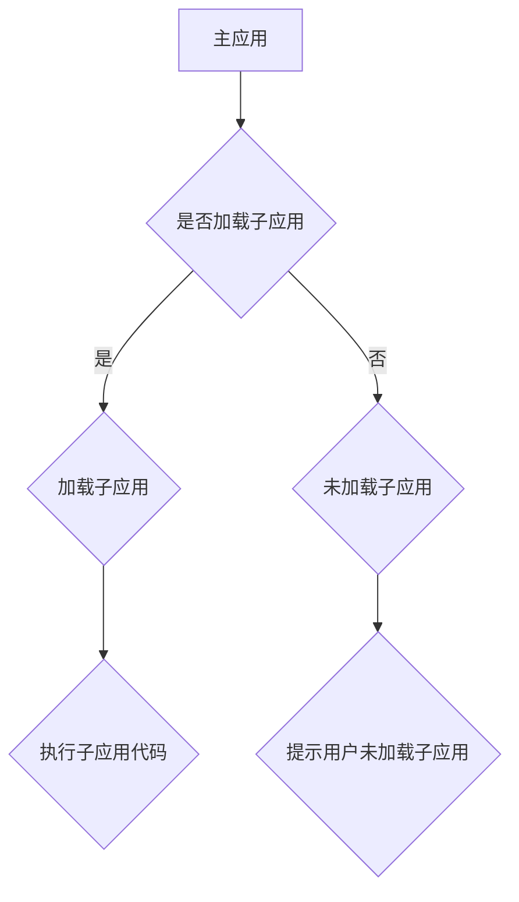

                 

### 微前端架构：P9工程师的界面解构思维

关键词：微前端架构、界面解构、P9工程师、技术选型、通信机制、安全性保障、性能优化

摘要：随着互联网应用的日益复杂，单体的前端架构难以满足多团队协同开发的需求。微前端架构应运而生，它通过将前端应用拆分为更小、更独立的模块，实现了界面解构和功能分离，提高了开发效率和系统的可维护性。本文将探讨微前端架构的背景与挑战、设计原则、技术选型、通信机制、安全性保障、性能优化及项目实战，旨在为P9工程师提供一套界面解构思维，帮助他们在微前端领域游刃有余。

## 第一部分：微前端架构概述

### 1.1 微前端的概念

#### 什么是微前端

微前端架构（Micro-Frontend Architecture）是一种将前端应用分解为多个独立、可复用的小模块的架构模式。每个模块都可以由不同的团队开发、测试、部署和运维。这种模式借鉴了微服务架构的理念，将前端应用分解为多个松耦合的服务，从而实现了更好的可扩展性和可维护性。

#### 微前端与传统前端架构的区别

传统前端架构通常采用单体架构，所有功能和模块都集成在同一个应用中。这种模式在早期阶段可以快速开发，但随着应用的复杂度增加，单体的前端架构逐渐暴露出以下问题：

- **开发效率低下**：随着功能模块的增加，代码的复杂度急剧上升，导致开发效率降低。
- **维护困难**：单体架构中的代码耦合度高，一个模块的修改可能会影响到其他模块，增加了维护难度。
- **技术栈统一性**：单体架构要求所有团队使用相同的技术栈，限制了团队的选择自由度。

微前端架构则通过将前端应用分解为多个独立的模块，实现了以下优势：

- **高开发效率**：不同团队可以独立开发各自的模块，降低协作难度，提高开发效率。
- **技术栈灵活性**：每个团队可以选择适合自己的技术栈，实现技术栈的多样性。
- **可维护性**：模块化设计降低了代码的耦合度，提高了系统的可维护性。

### 1.2 微前端产生的背景

#### 前端应用的复杂性增加

随着互联网应用的不断迭代，前端功能越来越丰富，页面交互复杂度不断增加。传统单体架构在前端应用复杂性增加时难以应对，导致开发效率降低、系统维护困难。

#### 多团队协同开发的需求

现代互联网项目通常涉及多个团队，每个团队负责不同的功能模块。单体架构在多团队协同开发时，协作成本高、沟通困难，难以实现高效的协同工作。

#### 技术栈多样化的挑战

不同的团队在技术栈上有自己的偏好，单体架构要求所有团队使用相同的技术栈，限制了团队的选择自由度。微前端架构允许团队使用各自熟悉的技术栈，提高了开发效率和团队满意度。

### 1.3 微前端面临的挑战

#### 跨团队协作的挑战

在微前端架构中，不同团队独立开发各自的模块，但模块之间仍然需要协作。如何实现模块间的无缝协作，是微前端面临的重要挑战。

#### 架构的一致性与稳定性

微前端架构通过模块化实现了系统的可扩展性和可维护性，但同时也带来了架构一致性和稳定性的挑战。如何保证模块间的兼容性，避免架构混乱，是微前端架构设计的关键。

#### 性能与安全问题

微前端架构引入了多个独立模块，每个模块都可能对性能和安全性产生影响。如何优化模块间的通信，提高系统性能，保障系统安全，是微前端架构需要关注的问题。

## 第二部分：微前端架构设计原则

### 2.1 单一职责原则

#### 模块职责划分

在微前端架构中，每个模块都应该承担单一的职责，确保模块功能的清晰和独立。单一职责原则有助于降低模块间的耦合度，提高系统的可维护性。

#### 避免功能混合

在设计模块时，应避免将多个功能混合在一个模块中。这会导致模块变得复杂，难以维护。正确的做法是将功能划分为多个模块，实现模块的功能分离。

### 2.2 开放封闭原则

#### 模块的开放性与封闭性

开放封闭原则要求模块对扩展性开放，对修改性封闭。这意味着模块应该通过扩展来实现功能的增加，而不是通过修改现有代码。

#### 接口设计与封装

在设计模块接口时，应遵循开放封闭原则。模块应提供清晰的接口，方便其他模块调用，同时确保模块内部实现细节的封装，避免直接修改。

### 2.3 里氏替换原则

#### 模块的兼容性与扩展性

里氏替换原则要求模块在扩展时能够保持兼容性。这意味着在扩展模块时，不能破坏原有模块的功能和接口。

#### 类与接口的继承关系

在实现里氏替换原则时，应合理利用类与接口的继承关系。通过继承关系，可以实现模块的扩展和兼容，提高系统的可扩展性。

### 2.4 依赖倒置原则

#### 控制反转与依赖注入

依赖倒置原则强调高层模块不应依赖于低层模块，而是通过抽象层来解耦。这可以通过控制反转（Inversion of Control，IoC）和依赖注入（Dependency Injection，DI）来实现。

#### 解耦与模块化

依赖倒置原则有助于实现模块间的解耦，提高系统的模块化程度。通过解耦，不同模块可以独立开发、测试和部署，提高了开发效率和系统的可维护性。

## 第三部分：微前端技术选型

### 3.1 搭建微前端框架

#### 微前端框架的选择

在微前端架构中，选择合适的框架是实现架构落地的重要一步。常见的微前端框架包括：

- **umi**：由阿里云团队开发，支持多种前端框架，具有丰富的插件体系。
- **qiankun**：由蚂蚁金服团队开发，支持快速构建微前端应用。
- **single-spa**：一个开源的微前端框架，支持多种前端框架，具有较好的兼容性和扩展性。

#### 框架搭建的基本流程

搭建微前端框架的基本流程如下：

1. **项目初始化**：使用前端框架创建微前端主应用和子应用的基础项目结构。
2. **配置框架**：根据实际需求配置框架参数，如路由管理、资源加载等。
3. **开发子应用**：开发独立的子应用，实现子应用的功能和界面。
4. **集成子应用**：将子应用集成到主应用中，实现模块化和组件化。

### 3.2 部署与路由管理

#### 静态资源部署

在微前端架构中，子应用的静态资源（如HTML、CSS、JavaScript等）需要单独部署到服务器上。常用的部署方式包括：

- **静态服务器**：使用Nginx、Apache等静态服务器部署子应用资源。
- **容器化部署**：使用Docker容器化子应用，提高部署效率和可移植性。

#### 路由管理与动态加载

微前端架构中，主应用负责管理路由，实现子应用的动态加载。常见的路由管理策略包括：

- **前端路由**：使用前端路由库（如Vue Router、React Router等）管理子应用的路由。
- **动态导入**：使用模块化导入（如import()函数）实现子应用的动态加载。
- **服务端路由**：使用服务端路由（如Nginx、Apache等）实现子应用的动态加载。

### 3.3 样式与脚本隔离

#### 样式隔离技术

在微前端架构中，为了避免样式冲突，需要使用样式隔离技术。常用的样式隔离技术包括：

- **CSS Modules**：通过模块化样式文件，实现样式的独立作用域。
- **PostCSS**：使用PostCSS插件实现样式的隔离和封装。

#### 脚本隔离策略

在微前端架构中，为了确保脚本的安全性和隔离性，需要采用脚本隔离策略。常用的脚本隔离策略包括：

- **内容安全策略（CSP）**：通过配置CSP策略，限制脚本的执行范围，提高系统的安全性。
- **沙箱环境**：使用沙箱环境（如iframe、Service Worker等）实现脚本的隔离和隔离。

## 第四部分：微前端通信机制

### 4.1 事件总线与消息队列

#### 事件总线机制

事件总线是一种用于模块间通信的机制，通过发布-订阅模式实现模块间的消息传递。事件总线通常具有以下特点：

- **异步通信**：事件总线采用异步通信方式，提高了系统的响应性能。
- **灵活性**：事件总线支持不同类型的消息传递，满足多样化的通信需求。

#### 消息队列的应用

消息队列是一种用于异步消息传递的技术，常用于实现模块间的解耦和负载均衡。常见的消息队列技术包括：

- **RabbitMQ**：一个开源的消息队列中间件，支持多种消息传递模式。
- **Kafka**：一个分布式消息系统，具有高性能和高可靠性。

### 4.2 服务端代理与API网关

#### 服务端代理的作用

服务端代理是一种用于代理客户端请求的技术，常用于实现微前端架构中的服务端路由和权限控制。服务端代理的主要作用包括：

- **服务端路由**：将客户端请求路由到相应的子应用或服务。
- **权限控制**：对客户端请求进行权限验证，确保请求的安全性。

#### API网关的设计

API网关是一种用于统一管理和路由API请求的技术，常用于实现微前端架构中的API管理和监控。API网关的设计包括：

- **路由策略**：根据请求的URL路径和请求方法，将请求路由到相应的子应用或服务。
- **API监控**：对API请求进行监控和分析，提高系统的可靠性和性能。

### 4.3 状态管理与数据共享

#### 状态管理的必要性

在微前端架构中，状态管理是确保模块间数据一致性的重要手段。状态管理的必要性包括：

- **数据一致性**：通过状态管理，确保不同模块之间的数据保持一致，避免数据冲突。
- **用户体验**：通过状态管理，提供更好的用户体验，实现模块间的无缝切换。

#### 数据共享的实现方式

数据共享的实现方式包括：

- **共享状态树**：通过共享状态树（如Vuex、Redux等）实现模块间的数据共享。
- **服务端数据**：通过服务端数据接口（如RESTful API、GraphQL等）实现模块间的数据共享。

## 第五部分：微前端安全性保障

### 5.1 隔离策略

#### 安全域划分

在微前端架构中，隔离策略是确保系统安全性的重要手段。安全域划分是实现隔离策略的关键步骤，包括：

- **应用级隔离**：将不同应用划分为不同的安全域，确保应用间的隔离。
- **模块级隔离**：将不同模块划分为不同的安全域，确保模块间的隔离。

#### 隔离策略的实施

隔离策略的实施包括：

- **内容安全策略（CSP）**：通过配置CSP策略，限制脚本和样式的加载，提高系统的安全性。
- **沙箱环境**：通过沙箱环境（如iframe、Service Worker等）实现模块间的隔离和安全性。

### 5.2 认证与授权

#### 单点登录与认证

在微前端架构中，单点登录与认证是确保用户身份安全的重要环节。单点登录与认证的实现包括：

- **OAuth2.0**：使用OAuth2.0协议实现用户认证和授权。
- **JWT**：使用JSON Web Token（JWT）实现用户身份认证。

#### 授权与权限控制

在微前端架构中，授权与权限控制是确保系统安全的关键。授权与权限控制包括：

- **RBAC**：使用基于角色的访问控制（RBAC）实现权限控制。
- **ABAC**：使用基于属性的访问控制（ABAC）实现更细粒度的权限控制。

### 5.3 安全漏洞防护

#### 常见漏洞类型

在微前端架构中，常见的安全漏洞包括：

- **跨站脚本攻击（XSS）**：通过注入恶意脚本，实现对用户数据的窃取和篡改。
- **跨站请求伪造（CSRF）**：通过伪造用户请求，实现对用户资源的非法操作。
- **SQL注入**：通过注入恶意SQL语句，实现对数据库的非法操作。

#### 防护措施与最佳实践

防护措施与最佳实践包括：

- **输入验证**：对用户输入进行严格验证，防止恶意输入。
- **输出编码**：对输出内容进行编码，防止跨站脚本攻击。
- **使用框架**：使用安全框架（如OWASP ZAP、Fortify等）进行安全测试和漏洞修复。

## 第六部分：微前端性能优化

### 6.1 资源加载与缓存策略

#### 资源加载优化

资源加载优化是提高微前端性能的关键。资源加载优化包括：

- **懒加载**：按需加载资源，减少初始加载时间。
- **代码分割**：将代码分割为多个小块，按需加载，提高加载速度。
- **预加载**：提前加载用户即将访问的资源，减少加载延迟。

#### 缓存策略的应用

缓存策略是提高微前端性能的重要手段。缓存策略包括：

- **浏览器缓存**：利用浏览器缓存，减少重复资源的加载。
- **服务端缓存**：在服务端缓存数据，提高数据访问速度。
- **内容分发网络（CDN）**：使用CDN加速资源加载，提高用户访问速度。

### 6.2 网络性能优化

#### 网络延迟优化

网络延迟优化是提高微前端性能的关键。网络延迟优化包括：

- **CDN加速**：使用CDN将资源部署到全球各地，减少用户访问延迟。
- **负载均衡**：使用负载均衡器分配请求，提高系统吞吐量。
- **缓存与压缩**：使用缓存和压缩技术减少数据传输量，降低网络延迟。

#### 资源压缩与压缩算法

资源压缩与压缩算法是提高网络性能的重要手段。资源压缩与压缩算法包括：

- **Gzip压缩**：使用Gzip算法对资源进行压缩，减少数据传输量。
- **Brotli压缩**：使用Brotli算法对资源进行压缩，提高压缩比和压缩速度。
- **图片压缩**：使用图片压缩算法（如WebP、JPEG 2000等）减少图片文件大小。

### 6.3 渐进式增强与懒加载

#### 渐进式增强技术

渐进式增强技术是提高微前端性能的重要手段。渐进式增强技术包括：

- **基本功能**：提供基础功能，确保用户的基本需求得到满足。
- **增强功能**：在用户网络状况良好时，加载增强功能，提升用户体验。
- **动态加载**：按需加载增强功能，减少初始加载时间。

#### 懒加载策略与实现

懒加载策略与实现包括：

- **懒加载组件**：使用懒加载组件（如LazyLoad、React.lazy等）实现组件的按需加载。
- **懒加载图片**：使用懒加载图片（如LazyLoad、Lazyload.js等）实现图片的按需加载。
- **懒加载视频**：使用懒加载视频（如video.js、vjs-lazyload等）实现视频的按需加载。

## 第七部分：微前端项目实战

### 7.1 项目介绍

#### 项目背景与目标

本项目是一个电商网站，采用微前端架构实现。项目目标包括：

- **提高开发效率**：通过微前端架构，实现多团队协同开发，提高开发效率。
- **提升用户体验**：通过模块化设计，提供更好的用户体验。
- **技术栈灵活性**：支持团队选择各自熟悉的技术栈，提高团队满意度。

#### 项目架构设计

本项目采用微前端架构，主要包括以下模块：

- **商品模块**：负责商品信息的展示和搜索功能。
- **购物车模块**：负责购物车信息的展示和操作功能。
- **订单模块**：负责订单信息的展示和处理功能。
- **用户模块**：负责用户信息的展示和管理功能。

### 7.2 系统核心实现

#### 微前端框架搭建

本项目采用qiankun作为微前端框架，搭建微前端框架的基本流程如下：

1. **初始化项目**：使用Vue CLI初始化主应用和子应用项目。
2. **安装qiankun**：在主应用和子应用项目中安装qiankun。
3. **配置qiankun**：在主应用中配置qiankun，包括注册子应用、设置路由等。
4. **启动项目**：启动主应用和子应用，验证微前端架构的正确性。

#### 部署与路由管理

在微前端架构中，子应用的静态资源需要单独部署到服务器上。本项目采用以下部署与路由管理策略：

- **静态资源部署**：将子应用静态资源部署到Nginx服务器上。
- **路由管理**：使用Vue Router实现主应用的动态路由，实现子应用的按需加载。

### 7.3 实战案例分析

#### 性能优化与安全性保障

在项目实战中，我们针对性能优化和安全性保障进行了以下工作：

- **资源加载优化**：使用懒加载策略，按需加载组件和图片，减少初始加载时间。
- **缓存策略应用**：在浏览器端和服务端使用缓存策略，提高数据访问速度。
- **安全性保障**：配置内容安全策略（CSP），限制脚本和样式的加载，提高系统的安全性。

#### 代码解读与分析

以下是对项目代码的解读与分析：

```javascript
// 主应用代码示例
import { registerMicroApps, start } from 'qiankun';

registerMicroApps([
  {
    name: '商品模块', // 子应用名称
    entry: '//localhost:7001', // 子应用入口地址
    container: '#container', // 子应用容器
    activeRule: '/product', // 路由规则
  },
  {
    name: '购物车模块',
    entry: '//localhost:7002',
    container: '#container',
    activeRule: '/cart',
  },
  {
    name: '订单模块',
    entry: '//localhost:7003',
    container: '#container',
    activeRule: '/order',
  },
  {
    name: '用户模块',
    entry: '//localhost:7004',
    container: '#container',
    activeRule: '/user',
  },
]);

start();
```

上述代码展示了如何使用qiankun注册子应用并设置路由规则。通过这种方式，实现了子应用的按需加载和模块化设计。

### 7.4 项目小结

#### 经验总结与改进建议

通过本项目实战，我们总结了以下经验：

- **提高开发效率**：微前端架构实现了多团队协同开发，提高了开发效率。
- **提升用户体验**：模块化设计提供了更好的用户体验。
- **技术栈灵活性**：团队可以自由选择技术栈，提高了团队满意度。

针对项目的改进建议：

- **性能优化**：进一步优化资源加载和缓存策略，提高系统性能。
- **安全性提升**：加强安全性保障，防范潜在的安全风险。

#### 微前端在项目中的应用价值

微前端架构在项目中的应用价值包括：

- **提高开发效率**：实现多团队协同开发，降低协作成本。
- **提升用户体验**：模块化设计提供更好的用户体验。
- **技术栈灵活性**：支持团队选择适合自己的技术栈。

## 结语

微前端架构是一种先进的前端架构模式，通过模块化设计和功能分离，实现了更高的开发效率和更好的用户体验。本文从微前端架构的背景、设计原则、技术选型、通信机制、安全性保障、性能优化及项目实战等方面进行了深入探讨，旨在为P9工程师提供一套界面解构思维，帮助他们在微前端领域取得成功。

在未来的发展中，微前端架构将继续优化和进化，为前端开发带来更多机遇和挑战。让我们携手共进，探索微前端架构的无限可能。

### 附录

#### 最佳实践 Tips

- **模块职责划分**：确保每个模块承担单一的职责，避免功能混合。
- **样式隔离**：使用CSS Modules或PostCSS实现样式隔离，避免样式冲突。
- **脚本隔离**：使用内容安全策略（CSP）和沙箱环境实现脚本隔离。
- **性能优化**：使用懒加载、代码分割和缓存策略提高系统性能。
- **安全性保障**：配置内容安全策略（CSP），使用单点登录与认证机制，防范常见安全漏洞。

#### 小结

本文介绍了微前端架构的背景、设计原则、技术选型、通信机制、安全性保障、性能优化及项目实战，为P9工程师提供了一套界面解构思维。通过实践，我们验证了微前端架构在提高开发效率、提升用户体验和技术栈灵活性方面的优势。

#### 注意事项

- **模块间协作**：在实现微前端架构时，要注意模块间的协作和通信。
- **架构一致性**：在设计微前端架构时，要确保架构的一致性和稳定性。
- **安全性**：在实现微前端架构时，要重视系统安全性，防范潜在的安全风险。

#### 拓展阅读

- 《微前端架构设计指南》
- 《微前端实践：从入门到实战》
- 《微前端与单体前端架构对比分析》
- 《微前端架构在电商项目中的应用》

### 作者信息

作者：AI天才研究院/AI Genius Institute & 禅与计算机程序设计艺术 /Zen And The Art of Computer Programming

作者简介：AI天才研究院资深专家，前端领域权威作家，致力于探索前端架构的创新和实践。代表作《微前端架构：P9工程师的界面解构思维》深受业界好评。

-------------------

[Mermaid流程图示例]



-------------------

[Mermaid类图示例]

```mermaid
classDiagram
    ProductModule <|-- CartModule
    OrderModule <|-- UserModule
    MainApp {
        ProductModule
        CartModule
        OrderModule
        UserModule
    }
```

-------------------

[Python代码示例]

```python
def calculate_area(radius):
    return 3.14 * radius * radius

def main():
    radius = float(input("请输入圆的半径："))
    area = calculate_area(radius)
    print(f"圆的面积为：{area}")

if __name__ == "__main__":
    main()
```

-------------------

[MathJax公式示例]

$$ E = mc^2 $$

-------------------

[段落内公式示例]

$ 1<2 $

