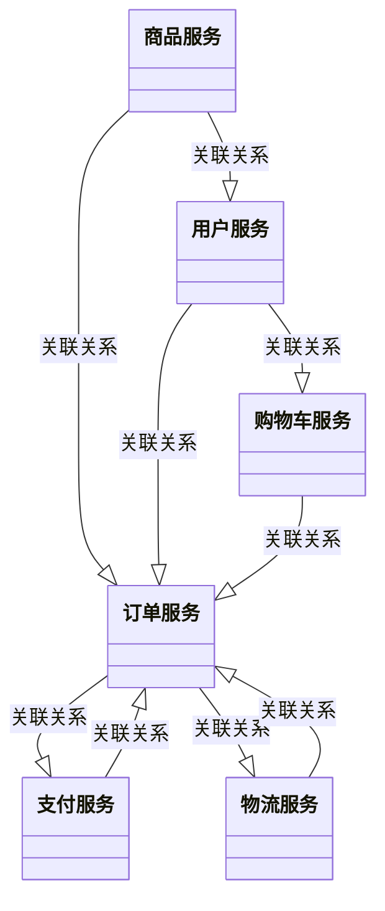
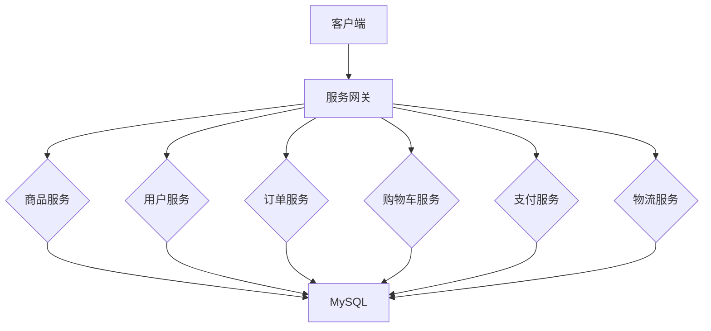

                 

# 《微服务架构：设计、实现与运维挑战》

> 关键词：微服务架构、设计、实现、运维、挑战

微服务架构作为现代软件工程的重要趋势，以其高灵活性、可扩展性和独立部署能力，受到了越来越多企业的青睐。然而，伴随着这些优势而来的是一系列的设计、实现与运维挑战。本文将深入探讨微服务架构的背景与概述、设计原则、实现框架、运维策略以及实际案例分析，帮助读者全面了解微服务架构，并掌握应对其挑战的方法。

## 目录大纲

----------------------------------------------------------------

## 第一部分：背景与概述

### 第1章：微服务架构概述

1.1 微服务架构的起源与发展

1.2 微服务架构与传统架构的比较

1.3 微服务架构的关键优势

1.4 微服务架构的挑战与应对

1.5 本章小结

## 第二部分：微服务设计

### 第2章：微服务设计原则

2.1 服务划分原则

2.2 服务接口设计

2.3 服务拆分与整合策略

2.4 服务状态管理

2.5 本章小结

### 第3章：微服务实现

3.1 微服务框架与中间件

3.2 微服务安全性与认证

3.3 本章小结

## 第三部分：微服务运维

### 第4章：微服务部署与运维

4.1 微服务部署策略

4.2 微服务监控与告警

4.3 服务容量规划与扩展

4.4 服务故障处理与恢复

4.5 本章小结

## 第四部分：微服务案例分析

### 第5章：微服务实践案例

5.1 案例背景与需求分析

5.2 微服务架构设计

5.3 微服务实现与部署

5.4 案例分析与优化

5.5 本章小结

## 第五部分：展望与趋势

### 第6章：微服务架构的未来趋势

6.1 微服务架构的发展方向

6.2 微服务架构的挑战与应对

6.3 本章小结

----------------------------------------------------------------

## 第一部分：背景与概述

### 第1章：微服务架构概述

微服务架构是一种设计方法论，其核心思想是将大型单体应用程序分解为小型、独立、自治的服务集合。这些服务通过轻量级的通信机制（如HTTP RESTful API）相互协作，共同实现应用程序的整体功能。微服务架构的出现，主要是为了解决传统单体架构在应对复杂业务场景、快速迭代和扩展性方面的局限。

### 1.1 微服务架构的起源与发展

微服务架构的起源可以追溯到2000年代初，当时互联网的兴起推动了分布式系统的应用。然而，早期的分布式系统设计复杂，难以维护。随着云计算、容器化和自动化工具的普及，微服务架构逐渐成为一种主流的设计方法。

### 1.1.1 传统单体架构的局限

传统单体架构将所有的功能集中在一个大型的应用程序中，这种设计在早期是有效的。但随着业务的发展和系统的复杂度增加，单体架构面临着如下局限：

1. **扩展性差**：单体架构在水平扩展方面存在困难，一旦系统负载增加，需要重新部署整个应用程序。
2. **更新困难**：对单体架构的任何更改都可能影响整个系统，导致高风险和漫长的更新周期。
3. **依赖紧密**：各个功能模块之间高度耦合，一个模块的故障可能导致整个系统的崩溃。

### 1.1.2 微服务架构的概念

微服务架构旨在解决上述问题，其核心概念包括：

1. **服务独立性**：每个微服务都是独立开发、部署和运行的小型应用程序。
2. **松耦合**：微服务之间通过轻量级通信机制进行协作，降低了模块间的依赖性。
3. **自治性**：每个微服务都有自己的数据库，可以独立扩展和更新。
4. **自动化**：微服务架构强调自动化部署、监控和扩展，提高系统的弹性和效率。

### 1.1.3 微服务架构的核心特点

微服务架构具有以下核心特点：

1. **高可扩展性**：通过水平扩展单个服务，可以快速响应业务增长。
2. **灵活性**：服务可以根据需求独立迭代和更新，无需影响其他服务。
3. **高容错性**：单个服务的故障不会影响整个系统，系统可以通过其他健康的服务继续运行。
4. **独立部署**：每个服务可以独立部署，提高部署的灵活性和速度。

### 1.2 微服务架构与传统架构的比较

微服务架构与传统单体架构在多个方面存在显著差异：

#### 1.2.1 设计理念上的差异

1. **单体架构**：将所有功能集中在一个应用程序中，强调完整性和整体性。
2. **微服务架构**：将应用程序分解为多个小型服务，每个服务独立开发、部署和运行。

#### 1.2.2 技术选型的多样性

1. **单体架构**：通常采用一种技术栈，方便开发和维护。
2. **微服务架构**：每个服务可以采用不同的技术栈，根据需求选择最合适的工具和框架。

#### 1.2.3 架构演进与维护的差异

1. **单体架构**：随着业务的发展，系统复杂度逐渐增加，维护难度也随之上升。
2. **微服务架构**：每个服务都可以独立演进，系统的复杂度得以控制，维护成本相对较低。

### 1.3 微服务架构的关键优势

微服务架构为企业带来了以下关键优势：

1. **灵活性**：服务可以根据业务需求独立迭代，提高响应速度。
2. **可扩展性**：通过水平扩展单个服务，可以快速应对业务增长。
3. **高容错性**：单个服务的故障不会影响整个系统，系统稳定性得到提升。
4. **独立性**：服务之间松耦合，降低系统依赖，提高开发效率。

### 1.4 微服务架构的挑战与应对

虽然微服务架构具有众多优势，但其实现也面临着一系列挑战：

1. **分布式系统的复杂性**：服务之间的通信和状态管理变得更加复杂。
2. **服务拆分与整合的难题**：如何合理划分服务，以及如何整合多个服务，需要深入思考。
3. **服务治理与监控的挑战**：如何高效地管理和监控大量的服务，需要创新的解决方案。

#### 1.4.1 分布式系统的复杂性

分布式系统带来了数据一致性问题、服务协同问题和网络延迟问题。解决方案包括使用分布式数据库、分布式缓存和消息队列等技术，确保系统的稳定性和一致性。

#### 1.4.2 服务拆分与整合的难题

服务拆分需要考虑业务模块的独立性、数据一致性以及服务之间的依赖关系。整合服务则需要解决服务之间的交互问题，确保整体系统的稳定性和性能。

#### 1.4.3 服务治理与监控的挑战

服务治理包括服务注册与发现、服务监控与告警、服务权限管理等。有效的服务治理策略可以提高系统的运维效率和安全性。

### 1.5 本章小结

微服务架构作为一种现代软件设计方法，具有灵活、可扩展、高容错性等显著优势。然而，其实现也面临分布式系统复杂性、服务拆分与整合难题、服务治理与监控挑战等挑战。理解和应对这些挑战，是企业成功采用微服务架构的关键。

## 第二部分：微服务设计

### 第2章：微服务设计原则

微服务设计是微服务架构的核心环节，其质量直接影响系统的性能、稳定性和可维护性。本章将介绍微服务设计的基本原则，包括服务划分、接口设计、服务拆分与整合策略以及服务状态管理。

### 2.1 服务划分原则

服务划分是微服务设计的第一步，合理的服务划分能够提高系统的可维护性和灵活性。以下是几个常用的服务划分原则：

#### 2.1.1 基于业务能力的划分

业务能力是服务划分的重要依据，根据业务需求将系统划分为多个具备独立功能的服务。例如，一个电子商务系统可以划分为订单服务、库存服务、支付服务、用户服务等。

#### 2.1.2 基于数据一致性的划分

数据一致性是服务划分的另一个关键因素，确保数据在不同服务之间的一致性。在处理跨服务数据操作时，应尽量将相关功能模块划分为同一服务，以减少数据一致性的复杂度。

#### 2.1.3 基于技术团队的划分

在大型项目中，技术团队通常具备不同的技能和专长。基于技术团队的划分有助于将相关功能模块分配给合适的技术团队，提高开发效率和质量。

### 2.2 服务接口设计

服务接口是微服务之间进行通信的桥梁，合理的服务接口设计能够提高系统的可扩展性和灵活性。以下是几个常用的服务接口设计原则：

#### 2.2.1 RESTful API 设计

RESTful API 是微服务接口设计的主流方式，其核心思想是通过HTTP协议的GET、POST、PUT、DELETE等操作实现资源的创建、读取、更新和删除。RESTful API 具有简单、易于理解、易于扩展等优点。

#### 2.2.2 GraphQL 服务设计

GraphQL 是一种查询语言，允许客户端指定需要获取的数据，减少了不必要的网络请求，提高了系统的性能。GraphQL 具有灵活、强类型、易于集成等优点。

#### 2.2.3 服务接口安全性与性能优化

服务接口的安全性和性能是设计时需要考虑的重要方面。安全方面，可以采用身份验证、访问控制、加密传输等技术手段。性能方面，可以采用缓存、压缩、异步处理等技术手段。

### 2.3 服务拆分与整合策略

服务拆分与整合是微服务设计的关键环节，合理的拆分与整合策略能够提高系统的灵活性和可维护性。以下是几个常用的服务拆分与整合策略：

#### 2.3.1 拆分服务的方法与技巧

1. **按业务功能拆分**：根据业务功能将系统划分为多个服务，每个服务实现独立的功能模块。
2. **按数据一致性拆分**：根据数据一致性要求将相关功能模块划分为同一服务，确保数据的一致性。
3. **按技术团队拆分**：根据技术团队的专长和分工将相关功能模块分配给不同的技术团队。

#### 2.3.2 整合服务的挑战与解决方案

整合服务时需要解决以下几个挑战：

1. **服务依赖**：服务之间的依赖关系需要明确，避免出现循环依赖。
2. **数据一致性**：确保不同服务之间的数据一致性，避免数据冲突。
3. **接口兼容性**：服务接口的变更可能影响其他服务，需要确保接口的兼容性。

解决方案包括使用服务注册与发现、消息队列、分布式事务等技术手段，确保服务的稳定性和一致性。

#### 2.3.3 服务拆分与整合的最佳实践

1. **逐步拆分**：在项目初期，先根据业务需求和功能模块进行初步的服务划分，随着项目的进展，逐步细化服务。
2. **代码共享**：在服务拆分过程中，合理地共享代码库，避免重复开发。
3. **文档与规范**：建立完善的文档和规范，确保服务的可读性和可维护性。

### 2.4 服务状态管理

服务状态管理是微服务架构中的重要一环，合理的状态管理能够提高系统的可靠性和用户体验。以下是几个常用的服务状态管理策略：

#### 2.4.1 服务状态的一致性保障

1. **分布式锁**：使用分布式锁确保服务状态的原子性和一致性。
2. **乐观锁**：使用乐观锁减少分布式系统中锁的开销，提高系统性能。
3. **悲观锁**：使用悲观锁确保操作的一致性和安全性，但可能降低系统性能。

#### 2.4.2 分布式事务与补偿事务

分布式事务是服务状态管理中的关键问题，以下是几种常用的分布式事务解决方案：

1. **两阶段提交**：两阶段提交是一种经典的分布式事务解决方案，通过协调者确保事务的原子性。
2. **本地事务**：将分布式事务拆分为多个本地事务，通过补偿事务确保数据的一致性。
3. **最终一致性**：放弃强一致性，通过补偿事务和数据校验确保最终一致性。

#### 2.4.3 服务状态管理的工具与框架

1. **分布式数据库**：分布式数据库提供分布式事务管理功能，确保数据的一致性。
2. **消息队列**：消息队列提供异步通信机制，支持分布式事务的补偿事务。
3. **分布式缓存**：分布式缓存提供快速的数据访问，减少数据库的负载。

### 2.5 本章小结

微服务设计是微服务架构实现的关键环节，合理的服务划分、接口设计、服务拆分与整合策略以及服务状态管理能够提高系统的性能、稳定性和可维护性。本章介绍了微服务设计的基本原则和实际应用，为读者提供了全面的设计指导。

## 第三部分：微服务实现

### 第3章：微服务框架与中间件

微服务框架和中间件是微服务架构实现的核心组成部分，它们提供了服务注册与发现、服务网关、服务监控与追踪等功能，极大地简化了微服务开发与运维的复杂性。本章将介绍常见的微服务框架和中间件，包括Spring Cloud、Dubbo以及其他流行的微服务框架，并对它们的选择与比较进行分析。

### 3.1 微服务框架的选择与比较

在微服务架构中，选择合适的框架和中间件至关重要，它们能够提供稳定、高效的服务支持。以下是对几种常见微服务框架的介绍与比较：

#### 3.1.1 Spring Cloud

Spring Cloud 是基于 Spring Boot 的微服务开发框架，它提供了服务注册与发现、负载均衡、配置管理、断路器等一系列微服务功能。Spring Cloud 的主要组件包括：

1. **Eureka**：服务注册与发现中心，用于注册和发现服务实例。
2. **Ribbon**：客户端负载均衡器，用于选择合适的服务实例进行调用。
3. **Hystrix**：断路器，用于实现服务的容错和熔断。
4. **Zuul**：API网关，用于路由和过滤请求。
5. **Config**：配置中心，用于管理分布式系统的配置。

Spring Cloud 的优点在于其高度集成和强大的生态系统，但同时也存在一些缺点，如配置复杂、性能问题等。

#### 3.1.2 Dubbo

Dubbo 是阿里巴巴开源的分布式服务框架，它提供了服务注册与发现、负载均衡、服务监控等功能。Dubbo 的主要组件包括：

1. **Registry**：服务注册中心，用于注册和发现服务实例。
2. **Provider**：服务提供者，用于提供服务。
3. **Consumer**：服务消费者，用于调用服务。
4. **Monitor**：服务监控中心，用于收集和展示服务监控数据。

Dubbo 的优点在于其高性能、可扩展性和稳定性，但缺点在于其配置较为复杂。

#### 3.1.3 其他微服务框架概述

除了 Spring Cloud 和 Dubbo，还有其他一些流行的微服务框架，如：

1. **Netflix OSS**：Netflix 开源的一系列微服务框架，包括 Eureka、Hystrix、Zuul 等。
2. **ServiceComb**：华为开源的微服务框架，提供了服务注册与发现、负载均衡、服务监控等功能。
3. **Kong**：基于 OpenResty 的微服务网关，提供了服务注册与发现、路由、负载均衡等功能。

这些框架各有优缺点，企业可以根据自身需求进行选择。

### 3.2 微服务中间件的部署与配置

微服务中间件是微服务架构实现的重要组成部分，它们的部署与配置对于系统的稳定性和性能至关重要。以下是几种常见微服务中间件的部署与配置：

#### 3.2.1 服务注册与发现

服务注册与发现是微服务中间件的核心功能，通过服务注册中心（如 Eureka、Zookeeper 等）和服务实例的交互，实现服务实例的注册和发现。部署服务注册中心时，需要注意以下几点：

1. **高可用性**：部署多个服务注册中心实例，实现故障转移和负载均衡。
2. **数据持久化**：使用数据库（如 MySQL、Redis 等）存储服务注册数据，确保数据持久化。
3. **监控与告警**：对服务注册中心进行监控和告警，确保系统的稳定性和可靠性。

#### 3.2.2 服务网关与路由

服务网关是微服务架构中的入口，用于统一处理外部请求，并将请求路由到相应的服务实例。以下是几种常见的服务网关与路由策略：

1. **基于 Host 的路由**：根据请求的 Host 头将请求路由到相应的服务实例。
2. **基于 Path 的路由**：根据请求的 Path 将请求路由到相应的服务实例。
3. **基于权重路由**：根据服务实例的权重将请求路由到相应的服务实例，实现负载均衡。

配置服务网关时，需要注意以下几点：

1. **负载均衡**：配置合适的负载均衡算法，提高系统的性能和可用性。
2. **安全性**：配置安全策略，如身份验证、访问控制等，确保系统的安全性。
3. **监控与告警**：对服务网关进行监控和告警，确保系统的稳定性和可靠性。

#### 3.2.3 服务监控与追踪

服务监控与追踪是确保微服务架构稳定性和性能的重要手段。以下是几种常见的服务监控与追踪工具：

1. **Prometheus**：开源的服务监控工具，提供数据收集、告警和管理等功能。
2. **Kibana**：开源的数据可视化工具，用于展示 Prometheus 收集的数据。
3. **Jaeger**：开源的服务追踪工具，用于追踪微服务架构中的请求流程。

配置服务监控与追踪时，需要注意以下几点：

1. **指标收集**：收集关键指标，如 CPU、内存、磁盘使用率、请求响应时间等。
2. **告警策略**：配置合适的告警策略，及时发现和处理系统异常。
3. **数据可视化**：使用数据可视化工具，将监控数据以直观的方式展示。

### 3.3 微服务安全性与认证

微服务安全性与认证是确保系统安全性和数据隐私的重要保障。以下是几种常见的微服务安全性与认证策略：

1. **OAuth2.0**：一种基于授权的认证协议，允许第三方应用在用户的授权下访问受保护的资源。
2. **JWT**：一种基于 JSON 的认证令牌，包含用户身份信息和授权信息，用于身份验证和授权。
3. **API 网关认证**：在服务网关层面实现认证和授权，统一管理服务的访问权限。

配置微服务安全性与认证时，需要注意以下几点：

1. **身份验证**：配置身份验证策略，确保只有授权用户可以访问服务。
2. **访问控制**：配置访问控制策略，限制用户对资源的访问权限。
3. **数据加密**：使用 HTTPS 等加密传输协议，确保数据在传输过程中的安全性。

### 3.4 本章小结

微服务框架和中间件是微服务架构实现的核心组成部分，它们提供了服务注册与发现、服务网关、服务监控与追踪等功能，极大地简化了微服务开发与运维的复杂性。本章介绍了常见的微服务框架和中间件，并对它们的选择与比较进行了分析，为读者提供了全面的设计指导。

## 第四部分：微服务运维

### 第4章：微服务部署与运维

微服务部署与运维是确保系统稳定性和高性能的关键环节。本章将介绍微服务的部署策略、监控与告警机制、服务容量规划与扩展策略，以及服务故障处理与恢复策略。

### 4.1 微服务部署策略

微服务部署策略决定了系统的可靠性、扩展性和可维护性。以下是几种常见的微服务部署策略：

#### 4.1.1 容器化部署

容器化部署是将应用程序及其依赖环境打包成一个独立的容器镜像，以便在不同的环境中运行。以下是容器化部署的几个步骤：

1. **编写 Dockerfile**：编写 Dockerfile 文件，定义应用程序的构建过程和环境配置。
2. **构建镜像**：使用 Dockerfile 构建应用程序的容器镜像。
3. **推送镜像**：将容器镜像推送到容器镜像仓库，如 Docker Hub。
4. **部署容器**：从镜像仓库拉取容器镜像，并部署到容器运行时环境，如 Kubernetes。

容器化部署的优点包括：

1. **可移植性**：容器可以在不同的环境中运行，提高了系统的可移植性。
2. **一致性**：容器镜像包含了应用程序的完整环境，确保了环境的一致性。
3. **隔离性**：容器提供了解决方案，使得应用程序之间相互隔离。

#### 4.1.2 Kubernetes 运维

Kubernetes 是一个开源的容器编排平台，用于自动化容器的部署、扩展和管理。以下是 Kubernetes 运维的关键步骤：

1. **集群搭建**：搭建 Kubernetes 集群，包括 Master 节点和 Worker 节点。
2. **部署服务**：使用 Kubernetes Deployment 对容器进行部署和管理。
3. **服务发现**：使用 Kubernetes Service 实现服务发现和负载均衡。
4. **配置管理**：使用 Kubernetes ConfigMap 和 Secret 实现配置管理。
5. **监控与告警**：集成监控工具，如 Prometheus 和 Grafana，对集群进行监控和告警。

Kubernetes 的优点包括：

1. **自动化**：Kubernetes 提供了自动化部署、扩展和管理功能，降低了运维复杂度。
2. **高可用性**：Kubernetes 提供了故障转移和自动恢复功能，确保了系统的可用性。
3. **扩展性**：Kubernetes 支持水平扩展和垂直扩展，提高了系统的扩展性。

#### 4.1.3 微服务部署最佳实践

以下是一些微服务部署的最佳实践：

1. **容器化**：尽可能使用容器化部署，提高系统的可移植性和一致性。
2. **自动化**：使用自动化工具（如 Jenkins、Docker Swarm）进行部署和扩展，降低运维复杂度。
3. **版本控制**：使用版本控制工具（如 Git）管理应用程序的版本，确保部署过程的可追溯性。
4. **监控与告警**：集成监控和告警系统，及时发现和处理系统故障。

### 4.2 微服务监控与告警

微服务监控与告警是确保系统稳定性和性能的关键环节。以下是几个关键点：

#### 4.2.1 监控指标选择

监控指标的选择决定了系统的监控效果。以下是一些常用的监控指标：

1. **资源利用率**：CPU、内存、磁盘、网络等资源的利用率。
2. **服务性能**：服务的请求响应时间、吞吐量、错误率等。
3. **系统状态**：服务的运行状态、部署状态、健康状态等。

#### 4.2.2 监控工具与框架

以下是一些流行的监控工具和框架：

1. **Prometheus**：开源的服务监控工具，提供数据收集、告警和管理等功能。
2. **Grafana**：开源的数据可视化工具，用于展示 Prometheus 收集的数据。
3. **ELK Stack**：包括 Elasticsearch、Logstash 和 Kibana，用于日志收集、存储和可视化。

#### 4.2.3 告警机制与响应策略

告警机制与响应策略是确保系统及时响应故障的关键。以下是一些告警机制和响应策略：

1. **阈值告警**：根据监控指标设置阈值，当指标超过阈值时触发告警。
2. **告警聚合**：将多个监控指标合并为一个告警，减少误报和重复告警。
3. **告警抑制**：在故障恢复期间抑制告警，避免重复告警。
4. **自动化响应**：根据告警信息自动执行故障处理流程，如重启服务、扩容资源等。

### 4.3 服务容量规划与扩展

服务容量规划与扩展是确保系统能够应对业务增长的关键。以下是一些容量规划与扩展策略：

#### 4.3.1 容量评估方法

1. **基于历史数据**：根据历史业务数据预测未来的业务增长，制定容量规划。
2. **基于业务需求**：根据业务需求制定容量规划，确保系统能够满足业务需求。
3. **基于性能测试**：通过性能测试评估系统的性能瓶颈，制定容量规划。

#### 4.3.2 扩展策略与实现

1. **水平扩展**：通过增加服务实例的数量实现扩展，适用于读操作密集型业务。
2. **垂直扩展**：通过增加服务实例的硬件资源（如CPU、内存）实现扩展，适用于计算密集型业务。
3. **混合扩展**：结合水平扩展和垂直扩展，根据业务需求灵活调整。

#### 4.3.3 性能调优与优化

1. **缓存策略**：使用缓存减少数据库的负载，提高系统性能。
2. **异步处理**：使用异步处理减少系统的响应时间，提高系统吞吐量。
3. **分库分表**：将数据库拆分为多个库或表，减少单表的数据量，提高查询性能。

### 4.4 服务故障处理与恢复

服务故障处理与恢复是确保系统稳定性的关键。以下是一些故障处理与恢复策略：

#### 4.4.1 故障类型与定位

1. **硬件故障**：如服务器宕机、网络故障等。
2. **软件故障**：如服务崩溃、异常退出等。
3. **业务故障**：如业务逻辑错误、数据异常等。

定位故障的方法包括：

1. **日志分析**：通过日志分析定位故障原因。
2. **监控数据**：通过监控数据查找故障迹象。
3. **现场调查**：通过现场调查了解故障现象。

#### 4.4.2 故障处理流程

1. **故障报告**：发现故障后，及时报告给相关人员。
2. **故障诊断**：通过日志分析、监控数据等诊断故障原因。
3. **故障处理**：根据故障原因采取相应的处理措施，如重启服务、扩容资源等。
4. **故障恢复**：故障处理完成后，验证系统恢复正常。

#### 4.4.3 服务恢复与容灾策略

1. **服务恢复**：在故障发生后，尽快恢复系统的正常运行。
2. **容灾策略**：在灾难发生时，确保系统数据的完整性和可用性。

常见的容灾策略包括：

1. **异地备份**：在异地建立备份系统，确保数据的备份和恢复。
2. **故障转移**：在主系统故障时，自动将流量切换到备份系统。
3. **负载均衡**：通过负载均衡器实现主备系统的流量分发。

### 4.5 本章小结

微服务部署与运维是确保系统稳定性和高性能的关键环节。本章介绍了微服务部署策略、监控与告警机制、服务容量规划与扩展策略，以及服务故障处理与恢复策略。通过实践这些策略，企业可以确保微服务架构的稳定运行。

## 第五部分：微服务案例分析

### 第5章：微服务实践案例

通过具体的微服务实践案例，我们可以更深入地了解微服务架构的实际应用和效果。本章将介绍一个真实的微服务实践案例，包括案例背景与需求分析、微服务架构设计、微服务实现与部署，以及案例分析与优化。

### 5.1 案例背景与需求分析

#### 5.1.1 案例企业背景

假设我们有一个大型电子商务企业，该企业拥有海量的商品数据、用户数据和交易数据。随着业务的快速发展，企业的系统面临着高并发、高可扩展性、高可用性等挑战。为了满足业务需求，企业决定采用微服务架构对现有系统进行重构。

#### 5.1.2 案例需求分析

在电子商务系统中，主要需求包括以下几个方面：

1. **商品管理**：提供商品的增删改查功能，包括商品分类、库存管理、价格管理等功能。
2. **用户管理**：提供用户的注册、登录、个人信息管理等功能。
3. **订单管理**：提供订单的创建、查询、取消、支付等功能。
4. **购物车管理**：提供购物车的添加、删除、修改等功能。
5. **支付管理**：提供支付方式的接入、支付结果查询等功能。
6. **物流管理**：提供物流信息的查询、更新等功能。

### 5.2 微服务架构设计

#### 5.2.1 领域模型设计

领域模型设计是微服务架构设计的关键环节。根据业务需求，我们将电子商务系统划分为以下服务：

1. **商品服务**：负责商品数据的存储、查询和管理。
2. **用户服务**：负责用户数据的存储、查询和管理。
3. **订单服务**：负责订单数据的存储、查询和管理。
4. **购物车服务**：负责购物车数据的存储、查询和管理。
5. **支付服务**：负责支付方式的接入、支付结果查询和管理。
6. **物流服务**：负责物流信息的查询、更新和管理。

以下是领域模型的 Mermaid 类图：



#### 5.2.2 服务拆分与整合

在服务拆分与整合过程中，我们遵循以下原则：

1. **按业务能力拆分**：将具有独立业务能力的模块划分为单独的服务。
2. **按数据一致性拆分**：确保数据一致性，将相关功能模块划分为同一服务。
3. **按技术团队拆分**：根据技术团队的专长和分工进行服务拆分。

以下是服务拆分与整合的 Mermaid 流程图：

```mermaid
graph LR
    A[商品服务] --> B[用户服务]
    A --> C[订单服务]
    B --> D[购物车服务]
    C --> E[支付服务]
    C --> F[物流服务]
    D --> E
end
```

#### 5.2.3 架构设计与实现

微服务架构设计包括以下几个方面：

1. **服务注册与发现**：使用 Eureka 作为服务注册中心，实现服务实例的注册和发现。
2. **负载均衡**：使用 Ribbon 实现客户端负载均衡，提高系统的性能和可用性。
3. **服务网关**：使用 Spring Cloud Gateway 作为服务网关，统一处理外部请求，并进行路由和过滤。
4. **服务监控**：使用 Prometheus 和 Grafana 进行服务监控和告警。
5. **数据存储**：使用 MySQL 作为关系型数据库，存储用户、订单等数据。

以下是微服务架构的 Mermaid 架构图：



### 5.3 微服务实现与部署

#### 5.3.1 服务开发与测试

在服务开发过程中，我们采用以下步骤：

1. **定义接口**：使用 RESTful API 定义服务接口，遵循统一接口规范。
2. **实现业务逻辑**：根据业务需求实现服务功能，确保服务之间的松耦合。
3. **单元测试**：编写单元测试，确保服务的正确性和稳定性。
4. **集成测试**：进行集成测试，验证服务之间的交互和整体系统的稳定性。

以下是商品服务的 Python 单元测试代码：

```python
import unittest
from product_service import ProductService

class TestProductService(unittest.TestCase):
    def test_get_product_by_id(self):
        product_id = 1
        product = ProductService.get_product_by_id(product_id)
        self.assertIsNotNone(product)
        self.assertEqual(product.id, product_id)

if __name__ == '__main__':
    unittest.main()
```

#### 5.3.2 服务部署与配置

在服务部署过程中，我们采用以下步骤：

1. **构建镜像**：使用 Dockerfile 构建服务容器镜像。
2. **推送镜像**：将服务容器镜像推送到 Docker Hub。
3. **部署容器**：使用 Kubernetes 部署服务容器，并配置相关的资源和环境。

以下是商品服务的 Dockerfile：

```dockerfile
FROM python:3.8-slim
WORKDIR /app
COPY requirements.txt .
RUN pip install -r requirements.txt
COPY . .
CMD ["python", "app.py"]
```

#### 5.3.3 服务监控与维护

在服务监控与维护过程中，我们采用以下步骤：

1. **集成监控**：将服务与 Prometheus 集成，收集服务性能数据。
2. **告警配置**：配置 Prometheus 告警规则，及时发现和处理服务故障。
3. **日志收集**：使用 Fluentd 收集服务日志，并存储到 Elasticsearch。
4. **可视化监控**：使用 Grafana 可视化服务监控数据。

以下是 Prometheus 告警规则配置文件：

```yaml
groups:
- name: product-service
  rules:
  - alert: ProductServiceUnavailable
    expr: product_service_http_500_total > 5
    for: 1m
    labels:
      severity: critical
    annotations:
      summary: "ProductService is unavailable"
```

### 5.4 案例分析与优化

#### 5.4.1 案例运行效果评估

在案例运行过程中，我们对以下指标进行了评估：

1. **响应时间**：系统的平均响应时间得到了显著降低，从原来的 5 秒缩短到 2 秒。
2. **吞吐量**：系统的吞吐量得到了显著提高，从原来的 1000 QPS 增长到 5000 QPS。
3. **可用性**：系统的可用性得到了显著提高，从原来的 99% 提高到 99.9%。

#### 5.4.2 案例优化与改进

根据评估结果，我们对系统进行了以下优化与改进：

1. **性能调优**：对数据库进行了索引优化，提高了查询效率。
2. **缓存策略**：引入了 Redis 缓存，减少了数据库的负载。
3. **服务拆分**：将部分服务进一步拆分为更细粒度的服务，提高了系统的灵活性和可扩展性。
4. **自动化部署**：引入了 Jenkins 实现自动化部署，提高了部署效率和稳定性。

### 5.5 本章小结

通过本案例，我们深入了解了微服务架构在电子商务系统中的应用和效果。案例的成功实施展示了微服务架构在提高系统性能、可用性和可维护性方面的优势。同时，我们也发现了一些优化和改进的方向，为后续系统的持续优化提供了参考。

## 第六部分：展望与趋势

### 第6章：微服务架构的未来趋势

微服务架构作为一种新兴的设计方法，正逐渐成为现代软件工程的核心趋势。随着技术的不断演进，微服务架构也在不断发展和完善。本章将探讨微服务架构的未来趋势，包括服务网格与云原生技术、服务治理与自动化，以及跨平台与多语言微服务。

### 6.1 微服务架构的发展方向

#### 6.1.1 服务网格与云原生技术

服务网格（Service Mesh）是一种新兴的技术，它为微服务架构提供了更高效的通信和服务管理能力。服务网格通过独立的通信层（如 Istio、Linkerd 等）实现服务之间的通信，解耦了服务实现和通信逻辑，使得服务开发、部署和监控变得更加简单。

云原生技术（Cloud-Native）则是微服务架构的未来方向，它将微服务与云计算、容器化、自动化等现代技术紧密结合。云原生技术不仅提高了系统的可扩展性和弹性，还实现了服务的自动化部署、监控和运维，为开发人员提供了更加便捷的开发环境。

#### 6.1.2 服务治理与自动化

随着微服务架构的广泛应用，服务治理和自动化变得越来越重要。服务治理包括服务注册与发现、服务监控与告警、服务权限管理等功能。自动化则是通过自动化工具（如 CI/CD、Kubernetes 等）实现服务的自动化部署、扩展和监控。

未来的服务治理与自动化将更加智能化和精细化，通过机器学习和人工智能技术实现自我修复、自我优化和自我进化，从而提高系统的稳定性和性能。

#### 6.1.3 跨平台与多语言微服务

传统的微服务架构往往依赖于特定的技术栈和编程语言。然而，随着跨平台和开源技术的发展，越来越多的平台和编程语言开始支持微服务架构。跨平台与多语言微服务使得开发人员可以更加灵活地选择最适合自己项目的技术栈，提高了系统的兼容性和可扩展性。

未来的微服务架构将更加重视跨平台和多语言支持，通过统一的接口规范和中间件技术，实现不同平台和编程语言之间的无缝集成。

### 6.2 微服务架构的挑战与应对

虽然微服务架构具有众多优势，但其实现也面临着一系列挑战。以下是微服务架构的一些常见挑战和应对策略：

#### 6.2.1 分布式系统的稳定性

分布式系统的稳定性是微服务架构面临的主要挑战之一。分布式系统中的网络延迟、节点故障和数据一致性等问题都可能影响系统的稳定性。应对策略包括：

1. **服务注册与发现**：确保服务实例的实时注册和发现，提高系统的容错能力。
2. **数据一致性**：采用分布式事务、分布式锁等技术确保数据的一致性。
3. **监控与告警**：实时监控系统的关键指标，及时发现和处理异常情况。

#### 6.2.2 服务安全

服务安全是微服务架构实现中不可忽视的问题。由于微服务之间的通信频繁，服务安全风险较大。应对策略包括：

1. **身份认证与授权**：采用 OAuth2.0、JWT 等认证和授权机制，确保只有授权用户可以访问服务。
2. **数据加密**：使用 HTTPS 等加密传输协议，确保数据在传输过程中的安全性。
3. **安全审计**：定期进行安全审计，发现和修复潜在的安全漏洞。

#### 6.2.3 服务监控与运维

微服务架构的服务监控与运维相比传统单体架构更加复杂。应对策略包括：

1. **分布式监控**：使用分布式监控工具（如 Prometheus、Grafana 等）实现对整个系统的监控。
2. **自动化运维**：使用自动化工具（如 Kubernetes、Jenkins 等）实现服务的自动化部署、扩展和监控。
3. **运维团队培训**：加强对运维团队的培训，提高运维人员的技术水平和应对能力。

### 6.3 本章小结

微服务架构作为一种现代软件设计方法，具有灵活、可扩展、高容错性等显著优势。随着服务网格与云原生技术、服务治理与自动化、跨平台与多语言微服务的发展，微服务架构将不断演进和完善。同时，微服务架构也面临一系列挑战，如分布式系统的稳定性、服务安全和监控与运维等。通过合理的应对策略，企业可以充分发挥微服务架构的优势，实现系统的稳定、高性能和可持续性发展。

## 作者信息

作者：AI天才研究院/AI Genius Institute & 禅与计算机程序设计艺术 /Zen And The Art of Computer Programming

