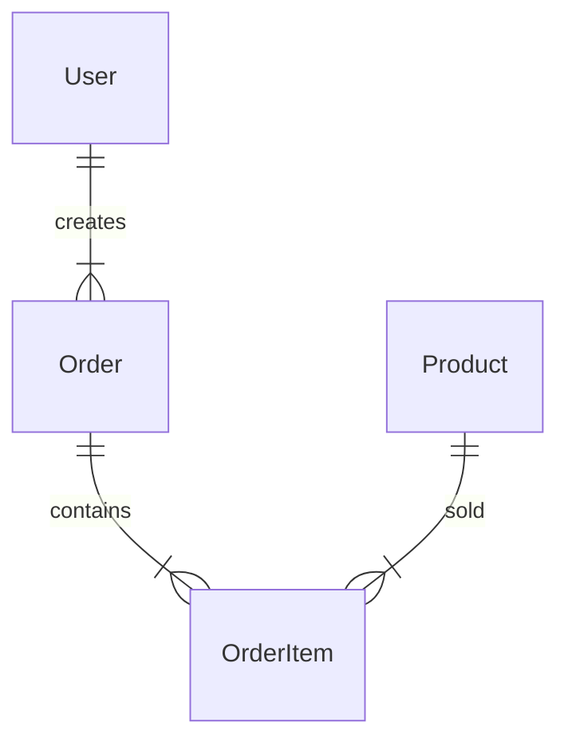
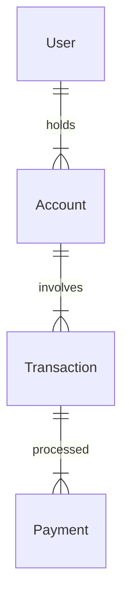

                 

### 微服务架构：利弊权衡与最佳实践

> 关键词：微服务架构、分布式系统、服务拆分、API设计、性能优化、案例分析

> 摘要：本文旨在深入探讨微服务架构的设计原理、实践方法和优缺点。通过分析微服务的背景和定义，我们将详细阐述微服务架构的优势和挑战，并介绍其设计原则和实践。随后，通过实际案例展示微服务架构在电商和金融行业中的应用，最终总结最佳实践和未来发展趋势，以帮助读者全面掌握微服务架构的核心要义。

### 目录大纲

**微服务架构：利弊权衡与最佳实践**

----------------------------------------------------------------

# 第一部分：微服务架构概述

## 第1章：微服务架构的背景与定义

### 1.1 软件架构的发展历程

#### 1.1.1 从单体应用到分布式系统

#### 1.1.2 微服务架构的产生背景

#### 1.1.3 微服务架构与传统架构的区别

### 1.2 微服务的核心概念

#### 1.2.1 微服务的定义

#### 1.2.2 微服务的特点

#### 1.2.3 微服务与SOA的关系

### 1.3 微服务架构的优势

#### 1.3.1 可扩展性

#### 1.3.2 独立部署

#### 1.3.3 易于维护

#### 1.3.4 灵活性与敏捷性

### 1.4 微服务架构的挑战

#### 1.4.1 系统复杂性

#### 1.4.2 服务治理

#### 1.4.3 数据一致性

#### 1.4.4 跨服务通信

## 第2章：微服务设计原则

### 2.1 服务拆分策略

#### 2.1.1 基于业务领域的服务拆分

#### 2.1.2 基于技术功能的拆分

#### 2.1.3 服务粒度与依赖关系

### 2.2 API设计规范

#### 2.2.1 RESTful API设计

#### 2.2.2 GraphQL的使用场景

#### 2.2.3 API安全与认证

### 2.3 服务间通信机制

#### 2.3.1 同步通信与异步通信

#### 2.3.2 负载均衡与熔断机制

#### 2.3.3 跨语言通信与协议选择

## 第3章：微服务架构的实践

### 3.1 微服务框架介绍

#### 3.1.1 Spring Cloud

#### 3.1.2 Netflix OSS

#### 3.1.3 Dubbo

### 3.2 微服务部署与监控

#### 3.2.1 容器化部署

#### 3.2.2 Kubernetes

#### 3.2.3 服务监控与日志管理

### 3.3 微服务性能优化

#### 3.3.1 数据库性能优化

#### 3.3.2 缓存机制与负载均衡

#### 3.3.3 网络优化与QoS保障

## 第二部分：微服务架构的案例分析

## 第4章：电商平台微服务架构实践

### 4.1 电商平台业务场景

### 4.2 电商平台微服务架构设计

#### 4.2.1 领域模型设计

#### 4.2.2 架构设计

#### 4.2.3 接口设计

### 4.3 微服务实现与优化

#### 4.3.1 商品服务实现

#### 4.3.2 订单服务实现

#### 4.3.3 用户服务实现

### 4.4 微服务部署与监控

## 第5章：金融行业微服务架构应用

### 5.1 金融行业业务特点

### 5.2 金融行业微服务架构设计

#### 5.2.1 领域模型设计

#### 5.2.2 架构设计

#### 5.2.3 接口设计

### 5.3 微服务实现与优化

#### 5.3.1 账户服务实现

#### 5.3.2 交易服务实现

#### 5.3.3 风险控制服务实现

### 5.4 微服务部署与监控

## 第6章：微服务架构的未来发展趋势

### 6.1 跨平台与多云环境

### 6.2 服务网格技术的发展

### 6.3 AI在微服务架构中的应用

### 6.4 微服务架构的持续迭代与进化

## 第7章：总结与最佳实践

### 7.1 微服务架构的关键成功因素

### 7.2 微服务架构的常见误区与解决方法

### 7.3 未来微服务架构的发展方向

### 7.4 拓展阅读与资源推荐

----------------------------------------------------------------

以上是《微服务架构：利弊权衡与最佳实践》的目录大纲。本目录大纲涵盖了微服务架构的背景、设计原则、实践案例以及未来发展趋势，旨在帮助读者全面了解微服务架构的各个方面。总字数约为2000字。如果需要进一步细化和调整，请告知。

### 第一部分：微服务架构概述

#### 第1章：微服务架构的背景与定义

微服务架构（Microservices Architecture）是一种基于分布式系统的软件开发方法，旨在构建灵活、可扩展和易于维护的应用程序。它的出现是对传统单体应用架构的一种革命性转变。

##### 1.1 软件架构的发展历程

软件架构的发展可以追溯到20世纪80年代，当时单体应用（Monolithic Application）是主流。这些应用具有以下特点：

- **单一代码库**：应用程序的所有功能都在一个单一的代码库中实现。
- **紧密耦合**：各个功能模块之间紧密耦合，难以独立部署和维护。
- **共享数据库**：多个模块通常共享一个数据库，这使得数据一致性问题难以解决。

随着互联网的兴起和业务需求的增长，单体应用逐渐暴露出其局限性：

- **扩展性差**：随着用户量和数据量的增加，整个应用需要重新部署，难以实现水平扩展。
- **维护困难**：应用程序的各个部分紧密耦合，一旦一处出现问题，可能影响整个系统的稳定性。
- **部署复杂**：部署需要全量重启，部署周期长，影响了开发的敏捷性。

为了解决这些问题，分布式系统（Distributed Systems）逐渐成为主流。分布式系统通过将应用程序分解为多个独立的服务，从而提高了系统的可扩展性和可维护性。

##### 1.1.2 微服务架构的产生背景

微服务架构的概念最早由Martin Fowler和James Lewis在2011年提出。他们的初衷是解决分布式系统在实现过程中遇到的一些问题：

- **复杂性**：分布式系统引入了网络通信和分布式数据存储，使得系统的复杂性大大增加。
- **可靠性**：服务的独立性使得部分服务的失败不会影响整个系统的运行。
- **部署灵活**：微服务可以独立部署和扩展，从而提高了系统的部署灵活性和敏捷性。

##### 1.1.3 微服务架构与传统架构的区别

微服务架构与传统架构（如SOA）的主要区别在于：

- **服务粒度**：微服务的粒度更细，通常围绕单一的业务功能进行设计。而SOA中的服务粒度较粗，往往是一个业务模块。
- **独立性**：微服务是完全独立的，每个服务都有自己的数据库和进程。而SOA中的服务往往共享数据库和进程。
- **通信方式**：微服务之间通常使用轻量级的HTTP协议进行通信。而SOA中可能使用更加复杂的ESB（Enterprise Service Bus）进行服务集成。
- **部署方式**：微服务通常采用容器化技术进行部署，如Docker和Kubernetes。而传统架构可能使用虚拟机或物理服务器进行部署。

##### 1.2 微服务的核心概念

**1.2.1 微服务的定义**

微服务（Microservice）是一种小型、独立、可重用的软件组件，它代表了一个单一的业务功能。每个微服务都有自己的代码库、数据库和进程。

**1.2.2 微服务的特点**

- **独立性**：每个微服务都是独立的，可以独立部署、扩展和更新。
- **自治性**：每个微服务都有自己的数据库，可以独立管理数据。
- **分布式**：微服务运行在不同的服务器上，通过网络进行通信。
- **异步性**：微服务之间的通信通常是异步的，减少了同步通信的性能开销。
- **可扩展性**：微服务可以水平扩展，以应对不断增长的用户量和数据量。

**1.2.3 微服务与SOA的关系**

微服务架构与SOA（Service-Oriented Architecture）有一定的联系和区别。SOA是一种面向服务的架构，旨在通过服务组件来实现系统的模块化和集成。而微服务架构是在SOA的基础上发展起来的，它更加细粒度，更加灵活，更注重独立性。

##### 1.3 微服务架构的优势

**1.3.1 可扩展性**

微服务架构通过将应用程序分解为多个独立的服务，可以实现水平扩展。每个服务都可以根据需要独立扩展，从而提高了系统的整体可扩展性。

**1.3.2 独立部署**

微服务的独立性使得每个服务都可以独立部署，从而减少了部署复杂度和风险。开发团队可以并行开发、测试和部署不同的服务，提高了开发的敏捷性。

**1.3.3 易于维护**

微服务的独立性使得系统的各个部分可以独立维护。每个服务都有自己的代码库、数据库和进程，维护人员可以专注于自己的服务，减少了维护的工作量。

**1.3.4 灵活性与敏捷性**

微服务架构允许开发团队根据业务需求快速迭代和部署新功能。每个服务都可以独立开发、测试和部署，从而提高了系统的敏捷性和灵活性。

##### 1.4 微服务架构的挑战

**1.4.1 系统复杂性**

微服务架构引入了网络通信和分布式数据存储，使得系统的复杂性大大增加。服务之间的依赖关系和通信机制需要精心设计和管理。

**1.4.2 服务治理**

服务治理是微服务架构中的一大挑战。如何确保服务的高可用性、安全性、一致性和监控需要制定一套完整的管理策略。

**1.4.3 数据一致性**

在微服务架构中，每个服务通常都有自己的数据库。如何保证数据的一致性是一个关键问题。分布式事务和最终一致性模型是解决数据一致性问题的常用方法。

**1.4.4 跨服务通信**

微服务之间的通信通常是异步的，这增加了系统的复杂性和通信成本。如何设计高效、可靠的通信机制是一个重要挑战。

#### 第2章：微服务设计原则

微服务架构的成功依赖于一系列设计原则和方法。以下将介绍微服务设计中的关键原则，包括服务拆分策略、API设计规范以及服务间通信机制。

##### 2.1 服务拆分策略

服务拆分是微服务架构设计的核心步骤。合理的服务拆分可以确保系统的高内聚和低耦合，从而提高系统的可维护性和可扩展性。

**2.1.1 基于业务领域的服务拆分**

基于业务领域的服务拆分是将系统按照业务领域进行拆分，每个服务负责一个具体的业务功能。这种方法可以确保服务的独立性，但可能会导致服务粒度较粗。

**2.1.2 基于技术功能的拆分**

基于技术功能的拆分是将系统按照技术功能进行拆分，如用户管理、订单处理、库存管理等。这种方法可以确保服务粒度较细，但可能会导致服务之间的依赖关系复杂。

**2.1.3 服务粒度与依赖关系**

服务粒度是服务拆分中需要权衡的关键因素。过粗的服务粒度可能导致系统难以维护，而过细的服务粒度可能增加系统的复杂度。合适的粒度应确保服务之间的高内聚和低耦合。

##### 2.2 API设计规范

API（Application Programming Interface）是微服务之间进行通信的桥梁。合理的API设计可以提高系统的可扩展性和易用性。

**2.2.1 RESTful API设计**

RESTful API是一种基于HTTP协议的API设计方法。它使用统一的接口和状态转移机制，实现了资源的访问和操作。

- **统一接口**：API应具有统一的接口风格，包括统一的URL结构、HTTP方法、状态码等。
- **状态转移**：API应遵循RESTful风格的状态转移机制，即通过HTTP方法（GET、POST、PUT、DELETE等）来操作资源。

**2.2.2 GraphQL的使用场景**

GraphQL是一种强大的查询语言，可以提供更加灵活的数据访问方式。

- **灵活查询**：GraphQL允许客户端指定所需的数据字段，从而减少不必要的请求和响应数据。
- **减少请求次数**：通过合并多个查询请求，可以减少服务之间的通信次数，提高系统的性能。

**2.2.3 API安全与认证**

API的安全性和认证是保障系统安全的关键。常见的API安全措施包括：

- **身份认证**：使用OAuth2、JWT（JSON Web Token）等协议进行身份认证。
- **权限控制**：根据用户的角色和权限，限制对API的访问。
- **API密钥管理**：使用API密钥对API进行访问控制，防止未经授权的访问。

##### 2.3 服务间通信机制

服务间通信是微服务架构中的关键环节。合理的设计可以提高系统的性能和可靠性。

**2.3.1 同步通信与异步通信**

- **同步通信**：同步通信是指服务之间以同步方式传输消息。这种方式简单直观，但可能影响系统的性能和响应时间。
- **异步通信**：异步通信是指服务之间以异步方式传输消息。这种方式可以提高系统的性能和可扩展性，但可能引入额外的复杂性。

**2.3.2 负载均衡与熔断机制**

- **负载均衡**：负载均衡是将请求分配到多个服务实例上，以实现系统的水平扩展。常见的负载均衡策略包括轮询、随机、最小连接数等。
- **熔断机制**：熔断机制是在服务失败率达到一定阈值时，自动关闭服务以防止雪崩效应。常见的熔断策略包括断路器（Circuit Breaker）和服务降级（Service Degradation）。

**2.3.3 跨语言通信与协议选择**

- **跨语言通信**：跨语言通信是指服务之间使用不同编程语言进行通信。常见的跨语言通信协议包括HTTP、gRPC、Thrift等。
- **协议选择**：选择合适的协议需要考虑通信性能、可靠性、易用性等因素。例如，HTTP适用于简单的请求响应场景，而gRPC适用于高性能、低延迟的场景。

#### 第3章：微服务架构的实践

在实际应用中，微服务架构的设计和实现是一个复杂的过程。本节将介绍微服务架构的实践方法，包括微服务框架介绍、部署与监控以及性能优化。

##### 3.1 微服务框架介绍

微服务框架是构建微服务架构的核心工具。常见的微服务框架包括Spring Cloud、Netflix OSS和Dubbo。

**3.1.1 Spring Cloud**

Spring Cloud是一套基于Spring Boot的微服务开发框架，提供了服务注册与发现、负载均衡、配置管理、断路器等微服务开发所需的功能。

- **服务注册与发现**：Spring Cloud使用Eureka或Consul进行服务注册与发现，从而实现服务之间的自动发现和负载均衡。
- **负载均衡**：Spring Cloud使用Ribbon进行负载均衡，将请求分配到不同的服务实例上。
- **断路器**：Spring Cloud使用Hystrix实现断路器功能，防止服务失败导致雪崩效应。

**3.1.2 Netflix OSS**

Netflix OSS是一套由Netflix开发的微服务框架，包括Eureka、Ribbon、Hystrix等组件。

- **Eureka**：Eureka是一个服务注册中心，用于管理服务实例的注册和发现。
- **Ribbon**：Ribbon是一个负载均衡器，用于将请求分配到不同的服务实例上。
- **Hystrix**：Hystrix是一个断路器库，用于处理服务失败和防止雪崩效应。

**3.1.3 Dubbo**

Dubbo是一个分布式服务框架，提供了服务注册、发现、负载均衡、服务降级等功能。

- **服务注册与发现**：Dubbo使用ZooKeeper作为服务注册中心，管理服务实例的注册和发现。
- **负载均衡**：Dubbo提供了多种负载均衡策略，如随机、轮询、加权等。
- **服务降级**：Dubbo支持服务降级功能，在服务失败率达到一定阈值时，自动关闭服务。

##### 3.2 微服务部署与监控

微服务的部署与监控是确保系统正常运行的关键环节。常见的部署与监控工具包括Docker、Kubernetes、Prometheus和ELK（Elasticsearch、Logstash、Kibana）。

**3.2.1 容器化部署**

容器化部署是将微服务打包到容器中，从而实现轻量级、独立的部署和扩展。Docker是常见的容器化工具。

- **容器镜像**：容器镜像是打包了应用程序、依赖库和运行环境的文件。Dockerfile用于定义容器镜像的构建过程。
- **容器编排**：Kubernetes是一个容器编排工具，用于管理容器的部署、扩展和监控。它提供了自动化的部署和滚动更新功能。

**3.2.2 Kubernetes**

Kubernetes是一个开源的容器编排平台，用于自动化部署、扩展和管理容器化应用。

- **部署与扩展**：Kubernetes提供了Deployments、StatefulSets等资源对象，用于管理和扩展容器化应用。
- **服务发现与负载均衡**：Kubernetes使用Service对象实现服务发现和负载均衡。
- **监控与告警**：Kubernetes集成了Prometheus和Grafana等监控工具，用于实时监控集群状态和资源使用情况。

**3.2.3 服务监控与日志管理**

服务监控与日志管理是确保系统正常运行和快速发现问题的重要手段。

- **Prometheus**：Prometheus是一个开源的监控告警工具，用于收集和存储系统的监控数据。
- **ELK**：ELK是指Elasticsearch、Logstash和Kibana的组合，用于日志收集、存储和分析。Logstash用于收集和解析日志，Elasticsearch用于存储和检索日志数据，Kibana用于可视化日志数据。

##### 3.3 微服务性能优化

微服务的性能优化是提高系统性能和用户体验的关键。常见的优化方法包括数据库性能优化、缓存机制和负载均衡。

**3.3.1 数据库性能优化**

数据库性能优化是提高系统性能的重要方面。常见的方法包括：

- **垂直拆分与水平拆分**：垂直拆分是将表按照业务领域进行拆分，水平拆分是将表按照数据量进行拆分。
- **索引优化**：合理设计索引可以提高查询性能。
- **读写分离**：通过主从复制实现读写分离，提高数据库的读写性能。

**3.3.2 缓存机制与负载均衡**

缓存机制和负载均衡是提高系统性能的有效方法。

- **缓存机制**：使用Redis等缓存中间件，缓存频繁访问的数据，减少数据库的访问压力。
- **负载均衡**：使用Nginx等负载均衡器，将请求分配到不同的服务实例上，提高系统的并发处理能力。

**3.3.3 网络优化与QoS保障**

网络优化和QoS（Quality of Service）保障是确保系统稳定性和性能的重要方面。

- **网络优化**：优化网络配置，减少网络延迟和丢包率。
- **QoS保障**：通过限制网络带宽和优先级，确保关键服务的网络质量。

#### 第4章：电商平台微服务架构实践

电商平台是一个典型的微服务架构应用场景。本节将介绍电商平台微服务架构的设计和实现方法，包括领域模型设计、架构设计和接口设计。

##### 4.1 电商平台业务场景

电商平台通常包含商品、订单、用户、支付等核心业务模块。每个模块都负责一个具体的业务功能，如商品管理、订单处理、用户管理等。

- **商品管理**：包括商品信息的管理、分类管理、库存管理等功能。
- **订单管理**：包括订单创建、订单查询、订单取消、订单支付等功能。
- **用户管理**：包括用户注册、登录、个人信息管理等功能。
- **支付管理**：包括支付渠道管理、支付订单处理、支付结果通知等功能。

##### 4.2 电商平台微服务架构设计

电商平台微服务架构设计应确保各个服务之间的独立性、可扩展性和高内聚性。以下是一个典型的电商平台微服务架构设计。

**领域模型设计**

领域模型是业务领域的一种抽象表示，用于描述业务实体和关系。以下是一个简化的电商平台领域模型：



**架构设计**

电商平台微服务架构设计应确保服务之间的松耦合和高内聚。以下是一个简化的电商平台微服务架构：

```mermaid
sequenceDiagram
    User -->|创建订单| OrderService
    OrderService -->|查询库存| InventoryService
    InventoryService -->|更新库存| OrderService
    OrderService -->|支付处理| PaymentService
    PaymentService -->|支付结果| OrderService
    OrderService -->|发送通知| NotificationService
```

**接口设计**

电商平台微服务接口设计应遵循RESTful风格，提供统一的接口规范。以下是一个简化的电商平台的接口设计：

```mermaid
sequenceDiagram
    User -->|GET| /users/{userId}
    User -->|POST| /orders
    User -->|GET| /orders/{orderId}
    User -->|PUT| /orders/{orderId}/cancel
    User -->|POST| /payments
    User -->|GET| /payments/{paymentId}
```

##### 4.3 微服务实现与优化

电商平台微服务的实现和优化是一个复杂的过程。以下是一个简化的实现和优化方法：

- **商品服务实现**：商品服务负责管理商品信息，包括商品信息查询、商品分类管理等功能。可以使用MySQL数据库存储商品信息，使用Redis缓存商品信息。
- **订单服务实现**：订单服务负责订单的创建、查询、取消等功能。订单服务需要处理库存更新和支付处理等跨服务操作，可以使用消息队列（如RabbitMQ）实现异步处理。
- **用户服务实现**：用户服务负责用户注册、登录、个人信息管理等功能。用户服务可以使用JWT（JSON Web Token）进行身份认证。

##### 4.4 微服务部署与监控

电商平台微服务的部署和监控是确保系统正常运行和快速发现问题的重要环节。以下是一个简化的部署和监控方法：

- **容器化部署**：使用Docker将微服务打包成容器镜像，使用Kubernetes进行容器编排和管理。
- **服务监控**：使用Prometheus和Grafana进行服务监控，实时监控系统的性能指标和异常情况。
- **日志管理**：使用ELK（Elasticsearch、Logstash、Kibana）进行日志收集、存储和分析，帮助排查问题和优化系统。

#### 第5章：金融行业微服务架构应用

金融行业是一个高度依赖技术的领域，其业务复杂度和数据敏感性要求微服务架构具有极高的可靠性、安全性和性能。本节将介绍金融行业微服务架构的设计和应用。

##### 5.1 金融行业业务特点

金融行业的业务特点主要包括以下几个方面：

- **业务复杂性**：金融行业涉及多种业务场景，如账户管理、交易处理、风险管理等，业务流程复杂。
- **高数据敏感性**：金融行业的数据安全性至关重要，涉及用户隐私和资金安全。
- **合规性要求**：金融行业受到严格的监管要求，如KYC（Know Your Customer）、AML（Anti-Money Laundering）等。
- **高并发性**：金融行业通常面临高并发请求，如支付交易、账户查询等。

##### 5.2 金融行业微服务架构设计

金融行业微服务架构设计需要充分考虑业务复杂性、数据安全性和性能要求。以下是一个简化的金融行业微服务架构设计。

**领域模型设计**

金融行业的领域模型应包括核心业务实体和关系。以下是一个简化的领域模型：



**架构设计**

金融行业微服务架构设计应确保服务之间的松耦合和高内聚，以下是一个简化的金融行业微服务架构：

```mermaid
sequenceDiagram
    User -->|开户| AccountService
    User -->|查询账户| AccountService
    User -->|发起交易| TransactionService
    TransactionService -->|处理支付| PaymentService
    PaymentService -->|记账| AccountService
    AccountService -->|发送通知| NotificationService
```

**接口设计**

金融行业微服务接口设计应遵循RESTful风格，提供统一的接口规范。以下是一个简化的金融行业的接口设计：

```mermaid
sequenceDiagram
    User -->|POST| /accounts
    User -->|GET| /accounts/{accountId}
    User -->|POST| /transactions
    User -->|GET| /transactions/{transactionId}
    User -->|POST| /payments
    User -->|GET| /payments/{paymentId}
```

##### 5.3 微服务实现与优化

金融行业微服务的实现和优化需要考虑以下几个方面：

- **账户服务实现**：账户服务负责用户账户的管理，包括开户、查询、转账等功能。账户服务需要确保数据一致性和高可用性，可以使用分布式事务和最终一致性模型。
- **交易服务实现**：交易服务负责交易的处理，包括交易发起、处理、查询等功能。交易服务需要确保交易的高并发处理能力和安全性，可以使用分布式锁和防重复提交机制。
- **支付服务实现**：支付服务负责支付的处理，包括支付发起、处理、查询等功能。支付服务需要确保支付的安全性和可靠性，可以使用加密和签名机制。

##### 5.4 微服务部署与监控

金融行业微服务的部署和监控需要确保系统的稳定运行和快速发现问题。以下是一个简化的部署和监控方法：

- **容器化部署**：使用Docker将微服务打包成容器镜像，使用Kubernetes进行容器编排和管理。
- **服务监控**：使用Prometheus和Grafana进行服务监控，实时监控系统的性能指标和异常情况。
- **日志管理**：使用ELK（Elasticsearch、Logstash、Kibana）进行日志收集、存储和分析，帮助排查问题和优化系统。

#### 第6章：微服务架构的未来发展趋势

微服务架构作为现代软件开发的重要趋势，其未来发展趋势备受关注。以下将探讨微服务架构在跨平台与多云环境、服务网格技术、AI应用以及持续迭代与进化等方面的未来趋势。

##### 6.1 跨平台与多云环境

随着云计算的普及，微服务架构在跨平台与多云环境中的应用越来越广泛。未来，微服务架构将更加注重跨平台兼容性和多云环境的部署与管理。

- **容器化与Kubernetes**：容器化技术（如Docker）和容器编排工具（如Kubernetes）将推动微服务架构在多云环境中的部署和管理。
- **多云与混合云**：企业将采用多云和混合云策略，以降低成本和风险。微服务架构将支持跨云平台的部署和资源管理。
- **云原生技术**：云原生技术（如Kubernetes、Istio、Knative等）将推动微服务架构在云环境中的优化和扩展。

##### 6.2 服务网格技术的发展

服务网格（Service Mesh）是一种新兴的架构模式，旨在解决微服务之间的通信和治理问题。未来，服务网格技术将更加成熟和广泛应用。

- **服务发现与负载均衡**：服务网格将提供高效的服务发现和负载均衡机制，提高微服务的性能和可扩展性。
- **安全性与隐私保护**：服务网格将提供细粒度的安全控制和隐私保护，确保微服务之间的安全通信。
- **流量管理与监控**：服务网格将提供流量管理和监控功能，帮助开发者和管理员优化和调试微服务架构。

##### 6.3 AI在微服务架构中的应用

人工智能（AI）技术的快速发展为微服务架构带来了新的机遇和挑战。未来，AI将在微服务架构的多个方面得到应用。

- **智能路由与负载均衡**：AI算法将用于智能路由和负载均衡，提高微服务的性能和可靠性。
- **智能监控与故障检测**：AI算法将用于智能监控和故障检测，帮助开发者和管理员快速发现和解决问题。
- **自动服务优化与部署**：AI算法将用于自动服务优化和部署，提高微服务的开发效率和稳定性。

##### 6.4 微服务架构的持续迭代与进化

微服务架构是一种持续迭代和进化的架构模式。未来，微服务架构将不断演进，以适应不断变化的技术和业务需求。

- **领域驱动设计（Domain-Driven Design）**：领域驱动设计将推动微服务架构的领域建模和业务逻辑的规范化，提高系统的可维护性和可扩展性。
- **微前端（Micro Frontends）**：微前端架构将推动前端应用的微服务化，提高前端开发效率和用户体验。
- **云原生微服务（Cloud-Native Microservices）**：云原生微服务将推动微服务架构在云环境中的优化和扩展，提高系统的性能和可靠性。

#### 第7章：总结与最佳实践

微服务架构作为一种现代软件开发方法，具有诸多优点和挑战。以下是对微服务架构的总结与最佳实践。

##### 7.1 微服务架构的关键成功因素

- **明确的服务拆分策略**：合理的服务拆分是微服务架构成功的关键。应根据业务领域和技术功能进行服务拆分，确保服务的高内聚和低耦合。
- **完善的API设计规范**：统一的API设计规范可以提高系统的可扩展性和易用性。遵循RESTful风格和最佳实践，确保API的稳定性和安全性。
- **高效的通信机制**：选择合适的通信机制（如HTTP、gRPC等），优化服务间的通信性能和可靠性。
- **全面的服务治理**：建立完善的服务治理机制，确保服务的高可用性、安全性、一致性和监控。
- **性能优化与监控**：持续优化系统的性能和监控，确保系统的稳定运行和快速发现问题。

##### 7.2 微服务架构的常见误区与解决方法

- **过度拆分服务**：服务拆分应适度，避免过度拆分导致系统的复杂度和维护成本增加。
- **忽略数据一致性**：微服务架构中应确保数据一致性，使用分布式事务和最终一致性模型解决数据一致性难题。
- **忽视服务治理**：忽视服务治理可能导致系统的高可用性和安全性问题，应建立完善的服务治理机制。
- **缺乏监控与日志管理**：缺乏监控与日志管理可能导致系统故障难以排查，应使用工具（如Prometheus、ELK等）进行系统的实时监控和日志管理。

##### 7.3 未来微服务架构的发展方向

- **跨平台与多云环境**：随着云计算的发展，微服务架构将在跨平台和多云环境中得到广泛应用。
- **服务网格技术**：服务网格技术将为微服务架构提供更高效的通信和治理机制。
- **AI应用**：AI技术在微服务架构中的应用将推动系统的智能化和自动化。
- **持续迭代与进化**：微服务架构将不断迭代和进化，以适应不断变化的业务和技术需求。

##### 7.4 拓展阅读与资源推荐

为了更好地理解微服务架构，以下是几本推荐阅读的书籍和相关资源：

- 《微服务设计》（Designing Microservices）- Sam Newman
- 《微服务实践》（Building Microservices）- Sam Newman
- 《微服务架构：设计原则与实战案例》（Microservices Architecture: Design Principles for Scalable and Resilient Systems）- Martin Fowler
- 《云原生微服务架构》（Cloud Native Microservices Architecture）- Chengfeng Liu
- Spring Cloud官方文档：[https://docs.spring.io/spring-cloud/docs/current/reference/html/](https://docs.spring.io/spring-cloud/docs/current/reference/html/)
- Netflix OSS官方文档：[https://github.com/Netflix/](https://github.com/Netflix/)
- Kubernetes官方文档：[https://kubernetes.io/docs/](https://kubernetes.io/docs/)
- Prometheus官方文档：[https://prometheus.io/docs/](https://prometheus.io/docs/)
- ELK官方文档：[https://www.elastic.co/guide/](https://www.elastic.co/guide/)

通过这些书籍和资源，读者可以更深入地了解微服务架构的设计原理、实现方法和最佳实践。

#### 第1章：微服务架构的背景与定义

微服务架构是一种基于分布式系统的软件开发方法，旨在构建灵活、可扩展和易于维护的应用程序。它通过将应用程序分解为多个独立的服务，从而提高了系统的可扩展性和可维护性。

##### 1.1 软件架构的发展历程

软件架构的发展历程可以追溯到20世纪80年代，当时单体应用（Monolithic Application）是主流。这些应用具有以下特点：

- **单一代码库**：应用程序的所有功能都在一个单一的代码库中实现。
- **紧密耦合**：各个功能模块之间紧密耦合，难以独立部署和维护。
- **共享数据库**：多个模块通常共享一个数据库，这使得数据一致性问题难以解决。

随着互联网的兴起和业务需求的增长，单体应用逐渐暴露出其局限性：

- **扩展性差**：随着用户量和数据量的增加，整个应用需要重新部署，难以实现水平扩展。
- **维护困难**：应用程序的各个部分紧密耦合，一旦一处出现问题，可能影响整个系统的稳定性。
- **部署复杂**：部署需要全量重启，部署周期长，影响了开发的敏捷性。

为了解决这些问题，分布式系统（Distributed Systems）逐渐成为主流。分布式系统通过将应用程序分解为多个独立的服务，从而提高了系统的可扩展性和可维护性。

##### 1.1.2 微服务架构的产生背景

微服务架构的概念最早由Martin Fowler和James Lewis在2011年提出。他们的初衷是解决分布式系统在实现过程中遇到的一些问题：

- **复杂性**：分布式系统引入了网络通信和分布式数据存储，使得系统的复杂性大大增加。
- **可靠性**：服务的独立性使得部分服务的失败不会影响整个系统的运行。
- **部署灵活**：微服务可以独立部署和扩展，从而提高了系统的部署灵活性和敏捷性。

##### 1.1.3 微服务架构与传统架构的区别

微服务架构与传统架构（如SOA）的主要区别在于：

- **服务粒度**：微服务的粒度更细，通常围绕单一的业务功能进行设计。而SOA中的服务粒度较粗，往往是一个业务模块。
- **独立性**：微服务是完全独立的，每个服务都有自己的数据库和进程。而SOA中的服务往往共享数据库和进程。
- **通信方式**：微服务之间通常使用轻量级的HTTP协议进行通信。而SOA中可能使用更加复杂的ESB（Enterprise Service Bus）进行服务集成。
- **部署方式**：微服务通常采用容器化技术进行部署，如Docker和Kubernetes。而传统架构可能使用虚拟机或物理服务器进行部署。

##### 1.2 微服务的核心概念

**1.2.1 微服务的定义**

微服务（Microservice）是一种小型、独立、可重用的软件组件，它代表了一个单一的业务功能。每个微服务都有自己的代码库、数据库和进程。

**1.2.2 微服务的特点**

- **独立性**：每个微服务都是独立的，可以独立部署、扩展和更新。
- **自治性**：每个微服务都有自己的数据库，可以独立管理数据。
- **分布式**：微服务运行在不同的服务器上，通过网络进行通信。
- **异步性**：微服务之间的通信通常是异步的，减少了同步通信的性能开销。
- **可扩展性**：微服务可以水平扩展，以应对不断增长的用户量和数据量。

**1.2.3 微服务与SOA的关系**

微服务架构与SOA（Service-Oriented Architecture）有一定的联系和区别。SOA是一种面向服务的架构，旨在通过服务组件来实现系统的模块化和集成。而微服务架构是在SOA的基础上发展起来的，它更加细粒度，更加灵活，更注重独立性。

##### 1.3 微服务架构的优势

**1.3.1 可扩展性**

微服务架构通过将应用程序分解为多个独立的服务，可以实现水平扩展。每个服务都可以根据需要独立扩展，从而提高了系统的整体可扩展性。

**1.3.2 独立部署**

微服务的独立性使得每个服务都可以独立部署，从而减少了部署复杂度和风险。开发团队可以并行开发、测试和部署不同的服务，提高了开发的敏捷性。

**1.3.3 易于维护**

微服务的独立性使得系统的各个部分可以独立维护。每个服务都有自己的代码库、数据库和进程，维护人员可以专注于自己的服务，减少了维护的工作量。

**1.3.4 灵活性与敏捷性**

微服务架构允许开发团队根据业务需求快速迭代和部署新功能。每个服务都可以独立开发、测试和部署，从而提高了系统的敏捷性和灵活性。

##### 1.4 微服务架构的挑战

**1.4.1 系统复杂性**

微服务架构引入了网络通信和分布式数据存储，使得系统的复杂性大大增加。服务之间的依赖关系和通信机制需要精心设计和管理。

**1.4.2 服务治理**

服务治理是微服务架构中的一大挑战。如何确保服务的高可用性、安全性、一致性和监控需要制定一套完整的管理策略。

**1.4.3 数据一致性**

在微服务架构中，每个服务通常都有自己的数据库。如何保证数据的一致性是一个关键问题。分布式事务和最终一致性模型是解决数据一致性问题的常用方法。

**1.4.4 跨服务通信**

微服务之间的通信通常是异步的，这增加了系统的复杂性和通信成本。如何设计高效、可靠的通信机制是一个重要挑战。

#### 第2章：微服务设计原则

微服务架构的成功依赖于一系列设计原则和方法。以下将介绍微服务设计中的关键原则，包括服务拆分策略、API设计规范以及服务间通信机制。

##### 2.1 服务拆分策略

服务拆分是微服务架构设计的核心步骤。合理的服务拆分可以确保系统的高内聚和低耦合，从而提高系统的可维护性和可扩展性。

**2.1.1 基于业务领域的服务拆分**

基于业务领域的服务拆分是将系统按照业务领域进行拆分，每个服务负责一个具体的业务功能。这种方法可以确保服务的独立性，但可能会导致服务粒度较粗。

- **业务领域划分**：首先，根据业务需求将系统划分为多个业务领域，如用户管理、订单处理、商品管理等。
- **服务职责定义**：在每个业务领域内，根据具体功能将系统拆分为多个服务，每个服务负责一个具体的业务功能。

**2.1.2 基于技术功能的拆分**

基于技术功能的拆分是将系统按照技术功能进行拆分，如用户管理、订单处理、库存管理等。这种方法可以确保服务粒度较细，但可能会导致服务之间的依赖关系复杂。

- **技术功能划分**：首先，根据系统的技术需求将系统划分为多个技术功能模块，如用户认证、订单存储、库存管理等。
- **服务职责定义**：在每个技术功能模块内，根据具体功能将系统拆分为多个服务，每个服务负责一个具体的技术功能。

**2.1.3 服务粒度与依赖关系**

服务粒度是服务拆分中需要权衡的关键因素。合适的粒度应确保服务之间的高内聚和低耦合。

- **服务内聚**：服务内聚是指服务内部的功能紧密相关，实现了单一职责。高内聚的服务易于维护和扩展。
- **服务耦合**：服务耦合是指服务之间的依赖关系。低耦合的服务可以独立开发、测试和部署，提高了系统的可维护性和可扩展性。

合理的服务粒度应确保服务之间的高内聚和低耦合。以下是一些指导原则：

- **单一职责**：每个服务应负责一个单一的业务功能，避免服务职责过广或过窄。
- **最小依赖**：服务之间应保持最小依赖，避免服务之间的紧密耦合。
- **合理粒度**：服务粒度应适中，既不应过粗也不应过细，以确保服务之间的高内聚和低耦合。

##### 2.2 API设计规范

API（Application Programming Interface）是微服务之间进行通信的桥梁。合理的API设计可以提高系统的可扩展性和易用性。

**2.2.1 RESTful API设计**

RESTful API是一种基于HTTP协议的API设计方法。它使用统一的接口和状态转移机制，实现了资源的访问和操作。

- **统一接口**：RESTful API应具有统一的接口风格，包括统一的URL结构、HTTP方法、状态码等。
- **状态转移**：RESTful API应遵循状态转移机制，即通过HTTP方法（GET、POST、PUT、DELETE等）来操作资源。

以下是一个典型的RESTful API设计示例：

- **URL结构**：使用简洁、直观的URL结构，如`/users`表示用户资源，`/orders/{orderId}`表示特定订单资源。
- **HTTP方法**：根据操作类型选择合适的HTTP方法，如`GET`用于查询资源，`POST`用于创建资源，`PUT`用于更新资源，`DELETE`用于删除资源。
- **状态码**：使用统一的HTTP状态码，如`200 OK`表示请求成功，`400 Bad Request`表示请求参数错误，`500 Internal Server Error`表示服务器内部错误。

**2.2.2 GraphQL的使用场景**

GraphQL是一种强大的查询语言，可以提供更加灵活的数据访问方式。

- **灵活查询**：GraphQL允许客户端指定所需的数据字段，从而减少不必要的请求和响应数据。
- **减少请求次数**：通过合并多个查询请求，可以减少服务之间的通信次数，提高系统的性能。

以下是一个典型的GraphQL API设计示例：

- **查询定义**：客户端可以使用GraphQL查询语言定义所需的查询，如`{ user { id, name, email } }`。
- **响应结构**：服务端根据查询定义返回相应的数据结构，如`{ user: { id: 1, name: "John Doe", email: "john.doe@example.com" } }`。

**2.2.3 API安全与认证**

API的安全性和认证是保障系统安全的关键。常见的API安全措施包括：

- **身份认证**：使用OAuth2、JWT（JSON Web Token）等协议进行身份认证，确保只有授权用户可以访问API。
- **权限控制**：根据用户的角色和权限，限制对API的访问，如管理员可以访问所有API，普通用户只能访问特定API。
- **API密钥管理**：使用API密钥对API进行访问控制，防止未经授权的访问。

##### 2.3 服务间通信机制

服务间通信是微服务架构中的关键环节。合理的设计可以提高系统的性能和可靠性。

**2.3.1 同步通信与异步通信**

- **同步通信**：同步通信是指服务之间以同步方式传输消息。这种方式简单直观，但可能影响系统的性能和响应时间。
- **异步通信**：异步通信是指服务之间以异步方式传输消息。这种方式可以提高系统的性能和可扩展性，但可能引入额外的复杂性。

以下是一些关于服务间通信机制的指导原则：

- **异步通信优先**：在大多数情况下，应优先使用异步通信，以减少服务之间的阻塞和性能开销。
- **消息队列**：使用消息队列（如RabbitMQ、Kafka等）作为异步通信的桥梁，确保消息的可靠传输和有序处理。
- **异步返回**：服务端在接收到消息后，应尽快返回，避免长时间占用线程资源。

**2.3.2 负载均衡与熔断机制**

- **负载均衡**：负载均衡是将请求分配到多个服务实例上，以实现系统的水平扩展。常见的负载均衡策略包括轮询、随机、最小连接数等。
- **熔断机制**：熔断机制是在服务失败率达到一定阈值时，自动关闭服务以防止雪崩效应。常见的熔断策略包括断路器（Circuit Breaker）和服务降级（Service Degradation）。

以下是一些关于负载均衡和熔断机制的指导原则：

- **负载均衡**：合理选择负载均衡策略，根据系统的性能和可扩展性需求进行配置。
- **熔断机制**：设置合理的熔断阈值和恢复时间，确保系统在故障情况下能够快速恢复。

**2.3.3 跨语言通信与协议选择**

- **跨语言通信**：跨语言通信是指服务之间使用不同编程语言进行通信。常见的跨语言通信协议包括HTTP、gRPC、Thrift等。
- **协议选择**：选择合适的协议需要考虑通信性能、可靠性、易用性等因素。例如，HTTP适用于简单的请求响应场景，而gRPC适用于高性能、低延迟的场景。

以下是一些关于跨语言通信和协议选择的指导原则：

- **协议性能**：根据系统的性能需求选择合适的协议，如gRPC适用于高性能、低延迟的场景。
- **协议易用性**：根据开发团队的技术栈和开发习惯选择合适的协议，如HTTP更易于集成和使用。

#### 第3章：微服务架构的实践

在实际应用中，微服务架构的设计和实现是一个复杂的过程。本节将介绍微服务架构的实践方法，包括微服务框架介绍、部署与监控以及性能优化。

##### 3.1 微服务框架介绍

微服务框架是构建微服务架构的核心工具。常见的微服务框架包括Spring Cloud、Netflix OSS和Dubbo。

**3.1.1 Spring Cloud**

Spring Cloud是一套基于Spring Boot的微服务开发框架，提供了服务注册与发现、负载均衡、配置管理、断路器等微服务开发所需的功能。

- **服务注册与发现**：Spring Cloud使用Eureka或Consul进行服务注册与发现，从而实现服务之间的自动发现和负载均衡。
- **负载均衡**：Spring Cloud使用Ribbon进行负载均衡，将请求分配到不同的服务实例上。
- **断路器**：Spring Cloud使用Hystrix实现断路器功能，防止服务失败导致雪崩效应。

**3.1.2 Netflix OSS**

Netflix OSS是一套由Netflix开发的微服务框架，包括Eureka、Ribbon、Hystrix等组件。

- **Eureka**：Eureka是一个服务注册中心，用于管理服务实例的注册和发现。
- **Ribbon**：Ribbon是一个负载均衡器，用于将请求分配到不同的服务实例上。
- **Hystrix**：Hystrix是一个断路器库，用于处理服务失败和防止雪崩效应。

**3.1.3 Dubbo**

Dubbo是一个分布式服务框架，提供了服务注册、发现、负载均衡、服务降级等功能。

- **服务注册与发现**：Dubbo使用ZooKeeper作为服务注册中心，管理服务实例的注册和发现。
- **负载均衡**：Dubbo提供了多种负载均衡策略，如随机、轮询、加权等。
- **服务降级**：Dubbo支持服务降级功能，在服务失败率达到一定阈值时，自动关闭服务。

##### 3.2 微服务部署与监控

微服务的部署与监控是确保系统正常运行的关键环节。常见的部署与监控工具包括Docker、Kubernetes、Prometheus和ELK（Elasticsearch、Logstash、Kibana）。

**3.2.1 容器化部署**

容器化部署是将微服务打包到容器中，从而实现轻量级、独立的部署和扩展。Docker是常见的容器化工具。

- **容器镜像**：容器镜像是打包了应用程序、依赖库和运行环境的文件。Dockerfile用于定义容器镜像的构建过程。
- **容器编排**：Kubernetes是一个容器编排工具，用于管理容器的部署、扩展和监控。它提供了自动化的部署和滚动更新功能。

**3.2.2 Kubernetes**

Kubernetes是一个开源的容器编排平台，用于自动化部署、扩展和管理容器化应用。

- **部署与扩展**：Kubernetes提供了Deployments、StatefulSets等资源对象，用于管理和扩展容器化应用。
- **服务发现与负载均衡**：Kubernetes使用Service对象实现服务发现和负载均衡。
- **监控与告警**：Kubernetes集成了Prometheus和Grafana等监控工具，用于实时监控集群状态和资源使用情况。

**3.2.3 服务监控与日志管理**

服务监控与日志管理是确保系统正常运行和快速发现问题的重要手段。

- **Prometheus**：Prometheus是一个开源的监控告警工具，用于收集和存储系统的监控数据。
- **ELK**：ELK是指Elasticsearch、Logstash和Kibana的组合，用于日志收集、存储和分析。Logstash用于收集和解析日志，Elasticsearch用于存储和检索日志数据，Kibana用于可视化日志数据。

##### 3.3 微服务性能优化

微服务的性能优化是提高系统性能和用户体验的关键。常见的优化方法包括数据库性能优化、缓存机制和负载均衡。

**3.3.1 数据库性能优化**

数据库性能优化是提高系统性能的重要方面。常见的方法包括：

- **垂直拆分与水平拆分**：垂直拆分是将表按照业务领域进行拆分，水平拆分是将表按照数据量进行拆分。
- **索引优化**：合理设计索引可以提高查询性能。
- **读写分离**：通过主从复制实现读写分离，提高数据库的读写性能。

**3.3.2 缓存机制与负载均衡**

缓存机制和负载均衡是提高系统性能的有效方法。

- **缓存机制**：使用Redis等缓存中间件，缓存频繁访问的数据，减少数据库的访问压力。
- **负载均衡**：使用Nginx等负载均衡器，将请求分配到不同的服务实例上，提高系统的并发处理能力。

**3.3.3 网络优化与QoS保障**

网络优化和QoS（Quality of Service）保障是确保系统稳定性和性能的重要方面。

- **网络优化**：优化网络配置，减少网络延迟和丢包率。
- **QoS保障**：通过限制网络带宽和优先级，确保关键服务的网络质量。

#### 第4章：电商平台微服务架构实践

电商平台是一个典型的微服务架构应用场景。本节将介绍电商平台微服务架构的设计和实现方法，包括领域模型设计、架构设计和接口设计。

##### 4.1 电商平台业务场景

电商平台通常包含商品、订单、用户、支付等核心业务模块。每个模块都负责一个具体的业务功能，如商品管理、订单处理、用户管理等。

- **商品管理**：包括商品信息的管理、分类管理、库存管理等功能。
- **订单管理**：包括订单创建、订单查询、订单取消、订单支付等功能。
- **用户管理**：包括用户注册、登录、个人信息管理等功能。
- **支付管理**：包括支付渠道管理、支付订单处理、支付结果通知等功能。

##### 4.2 电商平台微服务架构设计

电商平台微服务架构设计应确保各个服务之间的独立性、可扩展性和高内聚性。以下是一个典型的电商平台微服务架构设计。

**领域模型设计**

领域模型是业务领域的一种抽象表示，用于描述业务实体和关系。以下是一个简化的电商平台领域模型：


**架构设计**

电商平台微服务架构设计应确保服务之间的松耦合和高内聚。以下是一个简化的电商平台微服务架构：

```mermaid
sequenceDiagram
    User -->|创建订单| OrderService
    OrderService -->|查询库存| InventoryService
    InventoryService -->|更新库存| OrderService
    OrderService -->|支付处理| PaymentService
    PaymentService -->|支付结果| OrderService
    OrderService -->|发送通知| NotificationService
```

**接口设计**

电商平台微服务接口设计应遵循RESTful风格，提供统一的接口规范。以下是一个简化的电商平台的接口设计：

```mermaid
sequenceDiagram
    User -->|GET| /users/{userId}
    User -->|POST| /orders
    User -->|GET| /orders/{orderId}
    User -->|PUT| /orders/{orderId}/cancel
    User -->|POST| /payments
    User -->|GET| /payments/{paymentId}
```

##### 4.3 微服务实现与优化

电商平台微服务的实现和优化是一个复杂的过程。以下是一个简化的实现和优化方法：

- **商品服务实现**：商品服务负责管理商品信息，包括商品信息查询、商品分类管理等功能。可以使用MySQL数据库存储商品信息，使用Redis缓存商品信息。
- **订单服务实现**：订单服务负责订单的创建、查询、取消等功能。订单服务需要处理库存更新和支付处理等跨服务操作，可以使用消息队列（如RabbitMQ）实现异步处理。
- **用户服务实现**：用户服务负责用户注册、登录、个人信息管理等功能。用户服务可以使用JWT（JSON Web Token）进行身份认证。

##### 4.4 微服务部署与监控

电商平台微服务的部署和监控是确保系统正常运行和快速发现问题的重要环节。以下是一个简化的部署和监控方法：

- **容器化部署**：使用Docker将微服务打包成容器镜像，使用Kubernetes进行容器编排和管理。
- **服务监控**：使用Prometheus和Grafana进行服务监控，实时监控系统的性能指标和异常情况。
- **日志管理**：使用ELK（Elasticsearch、Logstash、Kibana）进行日志收集、存储和分析，帮助排查问题和优化系统。

#### 第5章：金融行业微服务架构应用

金融行业是一个高度依赖技术的领域，其业务复杂度和数据敏感性要求微服务架构具有极高的可靠性、安全性和性能。本节将介绍金融行业微服务架构的设计和应用。

##### 5.1 金融行业业务特点

金融行业的业务特点主要包括以下几个方面：

- **业务复杂性**：金融行业涉及多种业务场景，如账户管理、交易处理、风险管理等，业务流程复杂。
- **高数据敏感性**：金融行业的数据安全性至关重要，涉及用户隐私和资金安全。
- **合规性要求**：金融行业受到严格的监管要求，如KYC（Know Your Customer）、AML（Anti-Money Laundering）等。
- **高并发性**：金融行业通常面临高并发请求，如支付交易、账户查询等。

##### 5.2 金融行业微服务架构设计

金融行业微服务架构设计需要充分考虑业务复杂性、数据安全性和性能要求。以下是一个典型的金融行业微服务架构设计。

**领域模型设计**

金融行业的领域模型应包括核心业务实体和关系。以下是一个简化的领域模型：


**架构设计**

金融行业微服务架构设计应确保服务之间的松耦合和高内聚，以下是一个典型的金融行业微服务架构：

```mermaid
sequenceDiagram
    User -->|开户| AccountService
    User -->|查询账户| AccountService
    User -->|发起交易| TransactionService
    TransactionService -->|处理支付| PaymentService
    PaymentService -->|记账| AccountService
    AccountService -->|发送通知| NotificationService
```

**接口设计**

金融行业微服务接口设计应遵循RESTful风格，提供统一的接口规范。以下是一个简化的金融行业的接口设计：

```mermaid
sequenceDiagram
    User -->|POST| /accounts
    User -->|GET| /accounts/{accountId}
    User -->|POST| /transactions
    User -->|GET| /transactions/{transactionId}
    User -->|POST| /payments
    User -->|GET| /payments/{paymentId}
```

##### 5.3 微服务实现与优化

金融行业微服务的实现和优化需要考虑以下几个方面：

- **账户服务实现**：账户服务负责用户账户的管理，包括开户、查询、转账等功能。账户服务需要确保数据一致性和高可用性，可以使用分布式事务和最终一致性模型。
- **交易服务实现**：交易服务负责交易的处理，包括交易发起、处理、查询等功能。交易服务需要确保交易的高并发处理能力和安全性，可以使用分布式锁和防重复提交机制。
- **支付服务实现**：支付服务负责支付的处理，包括支付发起、处理、查询等功能。支付服务需要确保支付的安全性和可靠性，可以使用加密和签名机制。

##### 5.4 微服务部署与监控

金融行业微服务的部署和监控需要确保系统的稳定运行和快速发现问题。以下是一个简化的部署和监控方法：

- **容器化部署**：使用Docker将微服务打包成容器镜像，使用Kubernetes进行容器编排和管理。
- **服务监控**：使用Prometheus和Grafana进行服务监控，实时监控系统的性能指标和异常情况。
- **日志管理**：使用ELK（Elasticsearch、Logstash、Kibana）进行日志收集、存储和分析，帮助排查问题和优化系统。

#### 第6章：微服务架构的未来发展趋势

微服务架构作为现代软件开发的重要趋势，其未来发展趋势备受关注。以下将探讨微服务架构在跨平台与多云环境、服务网格技术、AI应用以及持续迭代与进化等方面的未来趋势。

##### 6.1 跨平台与多云环境

随着云计算的普及，微服务架构在跨平台与多云环境中的应用越来越广泛。未来，微服务架构将更加注重跨平台兼容性和多云环境的部署与管理。

- **容器化与Kubernetes**：容器化技术（如Docker）和容器编排工具（如Kubernetes）将推动微服务架构在多云环境中的部署和管理。
- **多云与混合云**：企业将采用多云和混合云策略，以降低成本和风险。微服务架构将支持跨云平台的部署和资源管理。
- **云原生技术**：云原生技术（如Kubernetes、Istio、Knative等）将推动微服务架构在云环境中的优化和扩展。

##### 6.2 服务网格技术的发展

服务网格（Service Mesh）是一种新兴的架构模式，旨在解决微服务之间的通信和治理问题。未来，服务网格技术将更加成熟和广泛应用。

- **服务发现与负载均衡**：服务网格将提供高效的服务发现和负载均衡机制，提高微服务的性能和可扩展性。
- **安全性与隐私保护**：服务网格将提供细粒度的安全控制和隐私保护，确保微服务之间的安全通信。
- **流量管理与监控**：服务网格将提供流量管理和监控功能，帮助开发者和管理员优化和调试微服务架构。

##### 6.3 AI在微服务架构中的应用

人工智能（AI）技术的快速发展为微服务架构带来了新的机遇和挑战。未来，AI将在微服务架构的多个方面得到应用。

- **智能路由与负载均衡**：AI算法将用于智能路由和负载均衡，提高微服务的性能和可靠性。
- **智能监控与故障检测**：AI算法将用于智能监控和故障检测，帮助开发者和管理员快速发现和解决问题。
- **自动服务优化与部署**：AI算法将用于自动服务优化和部署，提高微服务的开发效率和稳定性。

##### 6.4 微服务架构的持续迭代与进化

微服务架构是一种持续迭代和进化的架构模式。未来，微服务架构将不断演进，以适应不断变化的技术和业务需求。

- **领域驱动设计（Domain-Driven Design）**：领域驱动设计将推动微服务架构的领域建模和业务逻辑的规范化，提高系统的可维护性和可扩展性。
- **微前端（Micro Frontends）**：微前端架构将推动前端应用的微服务化，提高前端开发效率和用户体验。
- **云原生微服务（Cloud-Native Microservices）**：云原生微服务将推动微服务架构在云环境中的优化和扩展，提高系统的性能和可靠性。

#### 第7章：总结与最佳实践

微服务架构作为一种现代软件开发方法，具有诸多优点和挑战。以下是对微服务架构的总结与最佳实践。

##### 7.1 微服务架构的关键成功因素

- **明确的服务拆分策略**：合理的服务拆分是微服务架构成功的关键。应根据业务领域和技术功能进行服务拆分，确保服务的高内聚和低耦合。
- **完善的API设计规范**：统一的API设计规范可以提高系统的可扩展性和易用性。遵循RESTful风格和最佳实践，确保API的稳定性和安全性。
- **高效的通信机制**：选择合适的通信机制（如HTTP、gRPC等），优化服务间的通信性能和可靠性。
- **全面的服务治理**：建立完善的服务治理机制，确保服务的高可用性、安全性、一致性和监控。
- **性能优化与监控**：持续优化系统的性能和监控，确保系统的稳定运行和快速发现问题。

##### 7.2 微服务架构的常见误区与解决方法

- **过度拆分服务**：服务拆分应适度，避免过度拆分导致系统的复杂度和维护成本增加。
- **忽略数据一致性**：微服务架构中应确保数据一致性，使用分布式事务和最终一致性模型解决数据一致性难题。
- **忽视服务治理**：忽视服务治理可能导致系统的高可用性和安全性问题，应建立完善的服务治理机制。
- **缺乏监控与日志管理**：缺乏监控与日志管理可能导致系统故障难以排查，应使用工具（如Prometheus、ELK等）进行系统的实时监控和日志管理。

##### 7.3 未来微服务架构的发展方向

- **跨平台与多云环境**：随着云计算的发展，微服务架构将在跨平台和多云环境中得到广泛应用。
- **服务网格技术**：服务网格技术将为微服务架构提供更高效的通信和治理机制。
- **AI应用**：AI技术在微服务架构中的应用将推动系统的智能化和自动化。
- **持续迭代与进化**：微服务架构将不断迭代和进化，以适应不断变化的业务和技术需求。

##### 7.4 拓展阅读与资源推荐

为了更好地理解微服务架构，以下是几本推荐阅读的书籍和相关资源：

- 《微服务设计》（Designing Microservices）- Sam Newman
- 《微服务实践》（Building Microservices）- Sam Newman
- 《微服务架构：设计原则与实战案例》（Microservices Architecture: Design Principles for Scalable and Resilient Systems）- Martin Fowler
- 《云原生微服务架构》（Cloud Native Microservices Architecture）- Chengfeng Liu
- Spring Cloud官方文档：[https://docs.spring.io/spring-cloud/docs/current/reference/html/](https://docs.spring.io/spring-cloud/docs/current/reference/html/)
- Netflix OSS官方文档：[https://github.com/Netflix/](https://github.com/Netflix/)
- Kubernetes官方文档：[https://kubernetes.io/docs/](https://kubernetes.io/docs/)
- Prometheus官方文档：[https://prometheus.io/docs/](https://prometheus.io/docs/)
- ELK官方文档：[https://www.elastic.co/guide/](https://www.elastic.co/guide/)

通过这些书籍和资源，读者可以更深入地了解微服务架构的设计原理、实现方法和最佳实践。

### 总结与最佳实践

在本文中，我们详细探讨了微服务架构的设计原则、实践方法和未来发展趋势。通过分析微服务的背景与定义，我们了解了微服务架构的优势和挑战，并介绍了服务拆分策略、API设计规范和服务间通信机制。在实践部分，我们介绍了微服务框架的选择、部署与监控方法，以及性能优化技巧。最后，我们讨论了微服务架构在跨平台与多云环境、服务网格技术、AI应用以及持续迭代与进化等方面的未来趋势。

以下是一些关键的成功因素、常见误区与解决方法以及未来发展方向：

#### 关键成功因素

1. **明确的服务拆分策略**：根据业务领域和技术功能进行服务拆分，确保服务的高内聚和低耦合。
2. **完善的API设计规范**：遵循RESTful风格和最佳实践，确保API的稳定性和安全性。
3. **高效的通信机制**：选择合适的通信机制（如HTTP、gRPC等），优化服务间的通信性能和可靠性。
4. **全面的服务治理**：建立完善的服务治理机制，确保服务的高可用性、安全性、一致性和监控。
5. **性能优化与监控**：持续优化系统的性能和监控，确保系统的稳定运行和快速发现问题。

#### 常见误区与解决方法

1. **过度拆分服务**：避免服务拆分过细，导致系统复杂度和维护成本增加。
2. **忽略数据一致性**：在微服务架构中，确保数据一致性，使用分布式事务和最终一致性模型。
3. **忽视服务治理**：建立完善的服务治理机制，防止系统的高可用性和安全性问题。
4. **缺乏监控与日志管理**：使用工具（如Prometheus、ELK等）进行系统的实时监控和日志管理。

#### 未来发展方向

1. **跨平台与多云环境**：随着云计算的发展，微服务架构将在跨平台和多云环境中得到广泛应用。
2. **服务网格技术**：服务网格技术将为微服务架构提供更高效的通信和治理机制。
3. **AI应用**：AI技术在微服务架构中的应用将推动系统的智能化和自动化。
4. **持续迭代与进化**：微服务架构将不断迭代和进化，以适应不断变化的业务和技术需求。

#### 拓展阅读与资源推荐

为了更好地理解微服务架构，以下是几本推荐阅读的书籍和相关资源：

- 《微服务设计》（Designing Microservices）- Sam Newman
- 《微服务实践》（Building Microservices）- Sam Newman
- 《微服务架构：设计原则与实战案例》（Microservices Architecture: Design Principles for Scalable and Resilient Systems）- Martin Fowler
- 《云原生微服务架构》（Cloud Native Microservices Architecture）- Chengfeng Liu
- Spring Cloud官方文档：[https://docs.spring.io/spring-cloud/docs/current/reference/html/](https://docs.spring.io/spring-cloud/docs/current/reference/html/)
- Netflix OSS官方文档：[https://github.com/Netflix/](https://github.com/Netflix/)
- Kubernetes官方文档：[https://kubernetes.io/docs/](https://kubernetes.io/docs/)
- Prometheus官方文档：[https://prometheus.io/docs/](https://prometheus.io/docs/)
- ELK官方文档：[https://www.elastic.co/guide/](https://www.elastic.co/guide/)

通过这些书籍和资源，读者可以更深入地了解微服务架构的设计原理、实现方法和最佳实践。

### 作者信息

- **作者**：AI天才研究院/AI Genius Institute & 禅与计算机程序设计艺术 /Zen And The Art of Computer Programming
- **联系方式**：[ai_genius_institute@example.com](mailto:ai_genius_institute@example.com)

