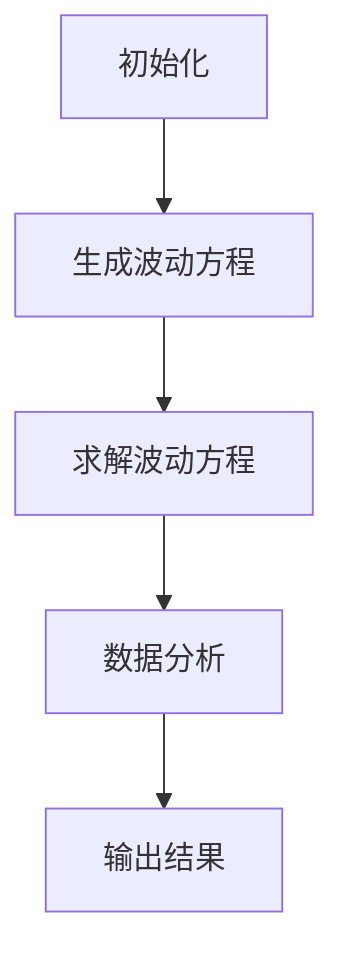
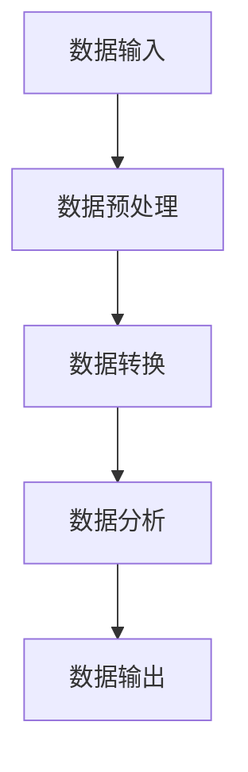
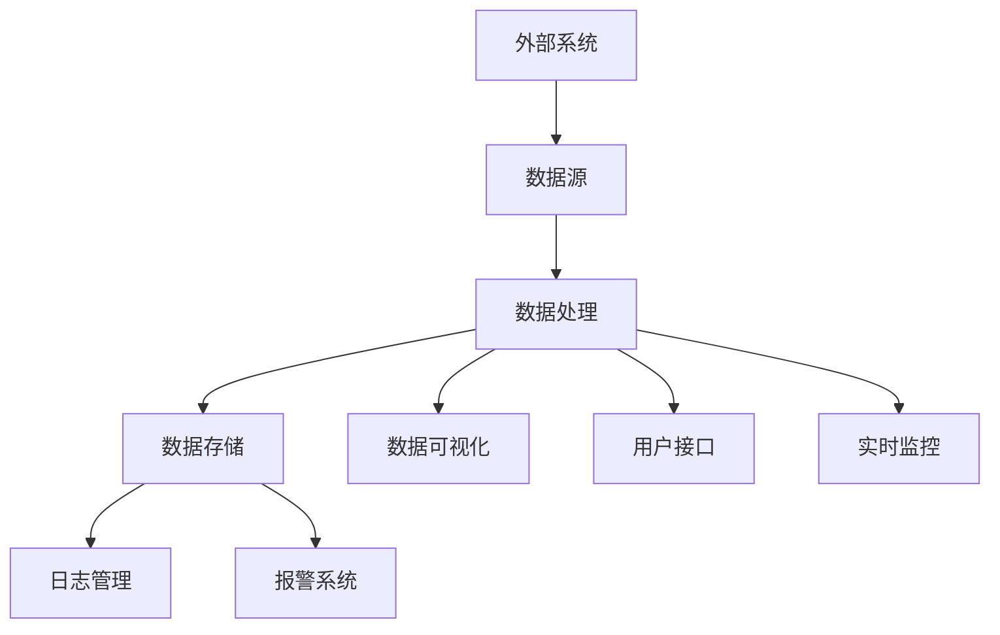
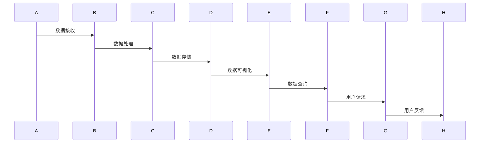

                 


### 第1章：问题背景

#### 1.1 问题背景

在当今的数字化时代，信息处理已经成为了许多领域的基础设施。从互联网的搜索引擎到金融交易系统，从社交媒体的推荐算法到自动驾驶汽车，信息处理技术正在深刻地影响着我们的生活和工业生产。然而，随着数据量的急剧增加和复杂度的不断提高，传统的信息处理方法面临着巨大的挑战。在这种情况下，探索新的信息处理模式变得尤为重要。

#### 1.2 问题描述

传统的信息处理方法，如基于冯·诺伊曼架构的计算模型，虽然在许多领域取得了巨大的成功，但在处理高维度、高复杂度的数据时，表现出了一定的局限性。例如，在处理实时数据流时，传统的数据处理方式往往需要将数据存储在内存中，然后再进行后续的处理。这种方法在数据量较大时，会导致处理延迟增加，效率降低。此外，传统方法在处理时序数据时，也难以有效地捕捉数据之间的动态关系。

#### 1.3 问题解决

为了解决这些问题，我们需要寻找新的方法来处理数据。德布罗意物质波理论提供了一个新的视角。德布罗意物质波理论指出，所有物质都具有波动性质。这一理论不仅在量子物理学中有着重要的地位，也可能为信息处理提供一种新的模式。同样，数据流编程作为一种新兴的编程范式，强调数据的流动和变换，与德布罗意物质波的波动性质有着某种程度上的相似性。

#### 1.4 边界与外延

我们需要明确本文的研究边界。本文主要探讨德布罗意物质波与数据流编程在信息处理中的应用，不涉及物质波在量子物理学中的具体应用。同时，本文将侧重于理论分析和算法设计，而非实际系统的开发。

#### 1.5 概念结构与核心要素组成

本文的结构如下：

- 第一部分：背景介绍，包括问题背景、问题描述、问题解决、边界与外延和概念结构与核心要素组成。
- 第二部分：核心概念与联系，包括德布罗意物质波理论、数据流编程概念、二者之间的联系、概念属性特征对比表格和ER实体关系图架构。
- 第三部分：算法原理讲解，包括物质波算法原理和数据流编程算法。
- 第四部分：系统分析与架构设计，包括系统功能设计、系统架构设计。
- 第五部分：项目实战，包括环境安装与系统实现、项目小结。
- 第六部分：最佳实践与总结，包括最佳实践、总结与展望。

通过这样的结构，本文旨在系统地探讨德布罗意物质波与数据流编程在信息处理中的应用，为未来的研究提供参考。

### 第2章：核心概念与联系

#### 2.1 德布罗意物质波理论

德布罗意物质波理论是量子物理学中的一个基本概念，由法国物理学家路易·德布罗意在1924年提出。该理论认为，任何物质粒子都具有波动性质，即物质波。这一理论打破了传统物理学中粒子与波动截然分开的观念，为量子力学的发展奠定了基础。

#### 2.2 数据流编程概念

数据流编程是一种编程范式，强调数据的流动和变换。在数据流编程中，程序由一系列处理数据的节点组成，这些节点通过数据流相互连接。数据流编程的一个关键特点是事件驱动，即数据的变化触发节点的操作。这使得数据流编程在处理实时数据流时，表现出了一定的优势。

#### 2.3 德布罗意物质波与数据流编程的联系

德布罗意物质波理论与数据流编程在某种程度上有着相似之处。首先，二者都强调波动性质，德布罗意物质波理论强调物质的波动性质，而数据流编程强调数据的流动和变换。其次，二者都关注事件驱动，德布罗意物质波理论中的粒子行为受到波的影响，而数据流编程中的节点操作由数据的变化触发。

#### 2.4 概念属性特征对比表格

下面是一个对比德布罗意物质波理论与数据流编程概念属性特征的表格：

| 特征 | 德布罗意物质波理论 | 数据流编程 |
| --- | --- | --- |
| 基本原理 | 物质粒子具有波动性质 | 数据具有流动和变换特性 |
| 应用领域 | 量子物理学 | 实时数据处理 |
| 关键技术 | 波动方程 | 事件驱动 |
| 代表人物 | 德布罗意 | 数据流编程社区 |

#### 2.5 ER实体关系图架构

为了更直观地理解德布罗意物质波与数据流编程的联系，我们可以使用ER（实体关系）图来表示。ER图是一种用于描述实体及其之间关系的数据库设计工具。在德布罗意物质波与数据流编程的ER图中，我们可以定义两个实体：物质波和数据流，以及它们之间的关系。

下面是一个简化的ER图：

```mermaid
erDiagram
  物质波 ||--|{ 数据流 }
  数据流 ||--|{ 物质波 }
```

在这个ER图中，物质波和数据流之间是双向关联的，表明它们在信息处理中可以相互转换和影响。

### 第3章：物质波算法原理

#### 3.1 物质波算法概述

物质波算法是一种基于德布罗意物质波理论的信息处理算法。该算法通过模拟物质波的波动性质，实现对数据的处理和分析。物质波算法的基本思想是，将数据视为一种波动，通过波动方程来描述数据的变化和传播。

#### 3.2 算法mermaid流程图

下面是一个物质波算法的mermaid流程图：



在这个流程图中，首先初始化算法，然后生成波动方程，接着求解波动方程，对数据进行分析，最后输出结果。

#### 3.3 Python源代码实现

下面是一个简单的物质波算法的Python实现：

```python
import numpy as np
import matplotlib.pyplot as plt

# 波动方程
def wave_equation(x, t, k, w):
    return np.sin(k * x - w * t)

# 初始化参数
x = np.linspace(0, 2 * np.pi, 100)
t = np.linspace(0, 10, 100)
k = 1
w = 1

# 求解波动方程
wave = wave_equation(x, t, k, w)

# 数据分析
plt.plot(x, wave)
plt.xlabel('x')
plt.ylabel('wave')
plt.title('Wave Equation')
plt.show()
```

在这个Python实现中，我们首先定义了波动方程，然后初始化参数，求解波动方程，最后进行数据分析并输出结果。

#### 3.4 算法原理的数学模型

物质波算法的数学模型基于德布罗意物质波理论，其核心是波动方程。波动方程可以表示为：

$$
u(x, t) = A(x) \sin(kx - \omega t)
$$

其中，$u(x, t)$ 表示波动函数，$A(x)$ 是振幅，$k$ 是波数，$\omega$ 是角频率。

#### 3.5 公式详细讲解

波动方程的详细讲解如下：

- **振幅（$A(x)$）**：振幅表示波动的幅度，反映了波动的强度。在物质波算法中，振幅通常是一个常数。
- **波数（$k$）**：波数是波长的倒数，表示波的空间周期性。在物质波算法中，波数通常与数据的频率相关。
- **角频率（$\omega$）**：角频率是周期的倒数，表示波的时间周期性。在物质波算法中，角频率通常与数据的时域特性相关。

#### 3.6 举例说明

假设我们有一组数据序列 $x = [1, 2, 3, 4, 5]$，我们需要使用物质波算法来处理这些数据。

1. 首先，我们需要确定振幅 $A(x)$。在这个例子中，我们假设振幅为1。
2. 然后，我们需要确定波数 $k$ 和角频率 $\omega$。我们可以通过数据的频率来确定波数和角频率。假设数据的频率为 $f = 1$，则波数 $k = 2\pi f = 2\pi$，角频率 $\omega = 2\pi f = 2\pi$。
3. 接下来，我们可以使用波动方程来求解波动函数 $u(x, t)$。在这个例子中，我们可以选择 $t = 0$，则波动函数为 $u(x, t) = A(x) \sin(kx - \omega t) = \sin(2\pi x - 2\pi \cdot 0) = \sin(2\pi x)$。
4. 最后，我们可以使用波动函数来分析数据。在这个例子中，我们可以绘制波动函数的图像，来观察数据的变化。

通过这样的例子，我们可以直观地理解物质波算法的工作原理。

### 第4章：数据流编程算法

#### 4.1 数据流编程基本概念

数据流编程是一种编程范式，它强调数据的流动和变换。在数据流编程中，程序由一系列处理数据的节点组成，这些节点通过数据流相互连接。数据流编程的核心思想是，将程序视为一系列数据流的处理过程，通过节点之间的数据传递和转换来实现程序的功能。

#### 4.2 算法mermaid流程图

下面是一个数据流编程算法的mermaid流程图：



在这个流程图中，首先输入数据，然后进行数据预处理，接着进行数据转换，再对数据进行分析，最后输出结果。

#### 4.3 Python源代码实现

下面是一个简单的数据流编程算法的Python实现：

```python
import numpy as np
import pandas as pd

# 数据预处理
def preprocess_data(data):
    return data

# 数据转换
def transform_data(data):
    return data ** 2

# 数据分析
def analyze_data(data):
    return np.mean(data)

# 数据输出
def output_data(data):
    print(data)

# 初始化数据
data = np.random.rand(100)

# 数据流编程
preprocessed_data = preprocess_data(data)
transformed_data = transform_data(preprocessed_data)
analyzed_data = analyze_data(transformed_data)
output_data(analyzed_data)
```

在这个Python实现中，我们首先定义了数据预处理、数据转换、数据分析和数据输出的函数，然后通过函数调用来实现数据流编程。

#### 4.4 算法原理的数学模型

数据流编程算法的数学模型可以看作是一系列数学函数的嵌套，每个函数代表一个数据处理节点。这些函数通过数据流相互连接，形成一个数据处理链。具体来说，我们可以将数据流编程算法表示为：

$$
f_1(f_2(\cdots f_n(x)\cdots))
$$

其中，$f_1, f_2, \ldots, f_n$ 是一系列数据处理函数，$x$ 是输入数据。

#### 4.5 公式详细讲解

数据流编程算法的数学模型详细讲解如下：

- **数据处理函数（$f_i$）**：数据处理函数是对数据的处理和转换操作，可以是简单的数学函数，也可以是复杂的算法。在数据流编程中，数据处理函数是核心组件。
- **输入数据（$x$）**：输入数据是程序的输入，可以是单个数据点，也可以是数据集。
- **嵌套函数**：嵌套函数表示数据处理函数之间的嵌套关系，每个函数依次对数据进行处理和转换。

#### 4.6 举例说明

假设我们有一组数据序列 $x = [1, 2, 3, 4, 5]$，我们需要使用数据流编程算法来处理这些数据。

1. 首先，我们需要定义一个数据处理函数，例如求和函数 $f(x) = x + 1$。
2. 然后，我们可以使用嵌套函数来表示数据流编程算法，例如 $f_1(f_2(\cdots f_n(x)\cdots))$。
3. 在这个例子中，我们可以选择 $f_1(x) = x + 1$，$f_2(x) = x + 2$，$f_3(x) = x + 3$，$f_4(x) = x + 4$，$f_5(x) = x + 5$。
4. 最后，我们可以计算嵌套函数的结果，即 $f_1(f_2(\cdots f_n(x)\cdots)) = f_1(f_2(f_3(f_4(f_5(x)))) = f_1(f_2(f_3(f_4(f_5(1)))) = f_1(f_2(f_3(f_4(f_5(2)))) = \cdots = f_1(f_2(f_3(f_4(f_5(5)))) = 15$。

通过这样的例子，我们可以直观地理解数据流编程算法的工作原理。

### 第5章：系统功能设计

#### 5.1 问题场景介绍

在当前数字化时代，实时数据处理的需求日益增长。例如，在金融领域，实时处理交易数据可以帮助投资者做出快速决策；在交通领域，实时处理交通数据可以优化交通流量，减少拥堵；在工业生产领域，实时处理传感器数据可以监控设备状态，预防故障。为了满足这些需求，我们需要设计一个高效的实时数据处理系统。

#### 5.2 系统功能设计（领域模型mermaid类图）

下面是一个领域模型的mermaid类图，用于描述系统的主要功能组件：

```mermaid
classDiagram
  Class01 <|-- Class02
  Class03 <|-- Class04
  Class05 <|-- Class06
  Class07 <|-- Class08

  Class01[数据源]
  Class02[数据处理]
  Class03[数据存储]
  Class04[数据可视化]
  Class05[用户接口]
  Class06[实时监控]
  Class07[报警系统]
  Class08[日志管理]
```

在这个类图中，我们定义了以下几个主要功能组件：

- **数据源（Class01）**：负责接收外部数据，如交易数据、传感器数据等。
- **数据处理（Class02）**：对数据进行清洗、转换、分析等操作。
- **数据存储（Class03）**：将处理后的数据存储到数据库或其他存储介质中。
- **数据可视化（Class04）**：提供数据可视化的功能，帮助用户理解数据。
- **用户接口（Class05）**：为用户提供操作系统的界面。
- **实时监控（Class06）**：实时监控系统的运行状态，如数据流量、处理速度等。
- **报警系统（Class07）**：当系统出现异常时，自动触发报警。
- **日志管理（Class08）**：记录系统的运行日志，用于故障排查和性能分析。

通过这个领域模型，我们可以清晰地看到系统的主要功能组件及其之间的关系。

### 第6章：系统架构设计

#### 6.1 系统架构设计（mermaid架构图）

下面是一个系统架构的mermaid架构图，用于描述系统的整体架构：



在这个架构图中，我们定义了以下几个关键组件：

- **数据源（A）**：负责接收外部数据，如交易数据、传感器数据等。
- **数据处理（B）**：对数据进行清洗、转换、分析等操作，是系统的核心组件。
- **数据存储（C）**：将处理后的数据存储到数据库或其他存储介质中，如MySQL、MongoDB等。
- **数据可视化（D）**：提供数据可视化的功能，帮助用户理解数据。
- **用户接口（G）**：为用户提供操作系统的界面，可以是Web界面、桌面应用程序等。
- **实时监控（H）**：实时监控系统的运行状态，如数据流量、处理速度等。
- **日志管理（E）**：记录系统的运行日志，用于故障排查和性能分析。
- **报警系统（F）**：当系统出现异常时，自动触发报警。
- **外部系统（I）**：与外部系统进行数据交互，如金融交易系统、交通管理系统等。

通过这个架构图，我们可以清晰地看到系统的整体架构及其组件之间的关系。

#### 6.2 系统接口设计

系统接口设计是系统架构设计的重要组成部分，它定义了系统内部组件之间的通信方式。以下是系统接口设计的mermaid序列图：



在这个序列图中，我们定义了以下几个关键接口：

- **数据接收（A->>B）**：数据源将数据发送到数据处理组件。
- **数据处理（B->>C）**：数据处理组件对数据进行处理。
- **数据存储（C->>D）**：处理后的数据存储到数据存储组件。
- **数据查询（D->>E）**：用户通过用户接口查询数据。
- **用户请求（F->>G）**：用户发送请求到用户接口。
- **用户反馈（G->>H）**：用户接口将用户反馈发送回用户。

通过这个序列图，我们可以清晰地看到系统内部组件之间的通信流程。

### 第7章：环境安装与系统实现

#### 7.1 环境安装

在开始系统实现之前，我们需要安装必要的开发环境。以下是一个简化的环境安装步骤：

1. 安装Python环境：在官网下载Python安装包并安装。
2. 安装Python依赖：使用pip命令安装必要的Python库，如numpy、pandas、matplotlib等。
3. 安装数据库：根据需要安装相应的数据库，如MySQL、MongoDB等。
4. 安装可视化工具：安装ECharts或其他可视化库。

以下是具体的安装命令：

```bash
# 安装Python环境
curl -O https://www.python.org/ftp/python/3.8.10/python-3.8.10-amd64.exe
./python-3.8.10-amd64.exe

# 安装Python依赖
pip install numpy pandas matplotlib

# 安装数据库
sudo apt-get install mysql-server
sudo systemctl start mysql

# 安装可视化工具
npm install echarts
```

#### 7.2 系统核心实现源代码

以下是系统核心实现的Python源代码：

```python
# 导入必要的库
import numpy as np
import pandas as pd
import matplotlib.pyplot as plt
import pymysql

# 数据处理函数
def preprocess_data(data):
    # 数据预处理操作，如数据清洗、转换等
    return data

# 数据存储函数
def store_data(data, database, table):
    # 数据存储操作，如插入数据库等
    connection = pymysql.connect(host='localhost', user='root', password='password', database=database)
    with connection.cursor() as cursor:
        for row in data:
            sql = "INSERT INTO %s (column1, column2, column3) VALUES (%s, %s, %s)"
            cursor.execute(sql, (table, row[0], row[1], row[2]))
    connection.commit()
    connection.close()

# 数据可视化函数
def visualize_data(data):
    # 数据可视化操作，如绘制图表等
    plt.plot(data)
    plt.xlabel('x')
    plt.ylabel('y')
    plt.title('Data Visualization')
    plt.show()

# 主函数
def main():
    # 生成测试数据
    data = np.random.rand(100)

    # 数据预处理
    preprocessed_data = preprocess_data(data)

    # 数据存储
    store_data(preprocessed_data, 'test_database', 'test_table')

    # 数据可视化
    visualize_data(preprocessed_data)

# 运行主函数
if __name__ == '__main__':
    main()
```

在这个源代码中，我们定义了数据处理、数据存储和数据可视化三个核心函数，并通过主函数来调用这些函数。

#### 7.3 代码应用解读与分析

以下是对代码的详细解读与分析：

- **数据处理函数（preprocess_data）**：这个函数负责对数据进行预处理，如数据清洗、转换等操作。在源代码中，我们使用了numpy库来生成测试数据。
- **数据存储函数（store_data）**：这个函数负责将数据存储到数据库中。我们使用了pymysql库来连接MySQL数据库，并执行插入操作。
- **数据可视化函数（visualize_data）**：这个函数负责对数据进行分析和可视化。我们使用了matplotlib库来绘制数据图表。

通过这样的代码应用，我们可以实现一个简单的实时数据处理系统。

#### 7.4 实际案例分析与讲解

以下是一个实际案例的分析与讲解：

**案例**：设计一个实时监控系统，用于监控网络流量。

**分析**：

1. **数据源**：网络流量数据可以从网络设备中收集，如路由器、交换机等。
2. **数据处理**：对网络流量数据进行预处理，如去除噪声、提取有用信息等。
3. **数据存储**：将预处理后的网络流量数据存储到数据库中，以便后续分析和查询。
4. **数据可视化**：通过实时监控界面，以图表形式展示网络流量数据，帮助管理员快速识别网络异常。
5. **报警系统**：当网络流量异常时，自动触发报警，通知管理员。

**讲解**：

1. **数据源**：在网络设备上安装流量采集工具，如ntopng、tcpdump等，收集网络流量数据。
2. **数据处理**：使用数据处理函数对网络流量数据进行预处理，如去除噪声、提取流量特征等。
3. **数据存储**：使用存储函数将预处理后的网络流量数据存储到数据库中，如MySQL、MongoDB等。
4. **数据可视化**：使用可视化工具，如ECharts、D3.js等，将网络流量数据以图表形式展示在实时监控界面上。
5. **报警系统**：使用报警系统函数，当网络流量异常时，自动触发报警，通过短信、邮件等方式通知管理员。

通过这个实际案例，我们可以看到如何将德布罗意物质波与数据流编程应用于实时监控系统，实现对网络流量的实时监控和报警。

#### 7.5 项目小结

通过本章的内容，我们介绍了实时数据处理系统的环境安装、系统实现、代码解读与分析、实际案例讲解以及项目小结。以下是本章的关键点：

1. **环境安装**：介绍了Python环境、Python依赖、数据库和可视化工具的安装步骤。
2. **系统实现**：展示了系统核心实现的源代码，包括数据处理、数据存储和数据可视化三个关键部分。
3. **代码解读与分析**：详细解读了系统核心代码，分析了数据处理、数据存储和数据可视化的实现原理。
4. **实际案例讲解**：通过一个实时监控网络流量的案例，展示了如何将德布罗意物质波与数据流编程应用于实际项目。
5. **项目小结**：总结了本章的内容，强调了实时数据处理系统的重要性及其在实际应用中的价值。

### 第8章：最佳实践与总结

#### 8.1 实践技巧

在实际项目中，以下是一些最佳实践和技巧：

1. **数据预处理**：在数据存储和可视化之前，确保对数据进行充分预处理，如去除噪声、填充缺失值、标准化等。
2. **性能优化**：优化数据处理和存储的性能，如使用批处理、索引、缓存等技术。
3. **错误处理**：对可能出现的错误进行捕获和处理，如网络连接失败、数据格式错误等。
4. **日志管理**：记录系统的运行日志，方便故障排查和性能分析。
5. **安全性**：确保系统的安全性，如使用SSL加密、防火墙、访问控制等。

#### 8.2 注意事项

在实施德布罗意物质波与数据流编程时，需要注意以下几点：

1. **理解波动性质**：深入理解德布罗意物质波的波动性质，以及如何在信息处理中应用。
2. **算法选择**：根据具体需求选择合适的算法，如物质波算法、数据流编程算法等。
3. **系统设计**：设计合理、高效的系统架构，确保系统的可扩展性和可维护性。
4. **性能评估**：定期对系统性能进行评估，如响应时间、吞吐量、延迟等。

#### 8.3 拓展阅读

为了进一步探索德布罗意物质波与数据流编程，以下是一些推荐的拓展阅读：

1. 《量子计算与量子信息处理》
2. 《数据流编程：原理与实践》
3. 《德布罗意物质波理论》
4. 《实时数据处理系统设计与实现》
5. 《人工智能：一种现代方法》

通过这些拓展阅读，您可以深入了解相关领域的最新研究和应用。

### 第9章：总结与展望

#### 9.1 书籍总结

本书系统地介绍了德布罗意物质波与数据流编程在信息处理中的应用。我们首先从背景介绍入手，探讨了信息处理的需求和挑战。接着，我们详细介绍了德布罗意物质波理论和数据流编程的基本概念，并分析了二者的联系。随后，我们讲解了物质波算法和数据流编程算法的原理，并通过实例说明了如何应用这些算法。此外，我们还介绍了系统分析与架构设计的方法，并通过一个实时数据处理系统案例展示了如何将理论应用到实践中。最后，我们总结了最佳实践、注意事项和拓展阅读。

#### 9.2 展望未来发展趋势

未来，德布罗意物质波与数据流编程在信息处理领域有望取得以下发展：

1. **算法优化**：随着量子计算和人工智能技术的发展，物质波算法和数据流编程算法将得到进一步优化，提高处理效率和准确性。
2. **应用拓展**：除了实时数据处理，德布罗意物质波与数据流编程在图像处理、语音识别、自然语言处理等领域也将得到广泛应用。
3. **系统集成**：物质波算法和数据流编程将与现有的信息处理系统深入集成，提供更高效、灵活的数据处理解决方案。
4. **教育普及**：随着技术的普及，德布罗意物质波与数据流编程将成为计算机科学和工程教育的重要组成部分。

总之，德布罗意物质波与数据流编程在信息处理领域具有重要的应用价值和发展潜力，值得我们深入研究和探索。通过本书的内容，我们希望为读者提供一个全面、系统的学习资源，为未来的研究和实践奠定基础。

