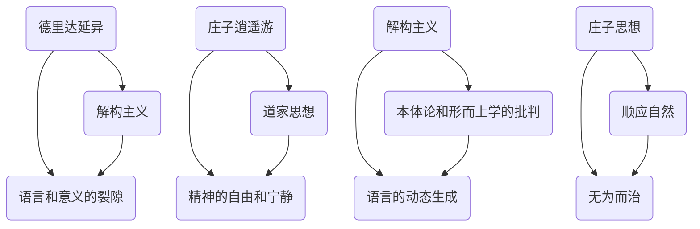

                 


# 德里达与庄子：延异与逍遥游的后现代解读

## 关键词

- 德里达
- 庄子
- 后现代解读
- 延异
- 逍遥游
- 解构主义
- 道家思想

## 摘要

本文通过深入探讨德里达与庄子的核心思想，特别是延异与逍遥游，试图在后现代视角下进行解读。文章分为三部分：第一部分介绍背景和核心概念，包括德里达的解构主义和庄子的道家思想；第二部分分析延异与逍遥游的关联及其在后现代文化中的应用；第三部分探讨延异与逍遥游的后现代融合，并提出未来展望。本文旨在通过逻辑清晰、结构紧凑的分析，为读者提供对这一领域的深入理解。

## 目录大纲设计思路

在设计目录大纲时，我们遵循了以下步骤：

1. **理解书名和主题**：明确《德里达与庄子：延异与逍遥游的后现代解读》的主题，关注核心概念和理论框架。
2. **确定大纲结构**：包括背景介绍、核心概念、理论分析、后现代解读、实际应用、案例分析等部分。
3. **细化章节内容**：确保每个章节都有明确的主题和目的，内容具体详细。
4. **确保逻辑性和完整性**：每个章节都有合理的顺序和关联，确保内容的完整性。
5. **遵循格式要求**：使用markdown格式，确保目录结构清晰。
6. **简洁明了**：在2000字以内，保持大纲简洁，去除冗余内容。

### 完整目录大纲

```markdown
----------------------------------------------------------------
# 《德里达与庄子：延异与逍遥游的后现代解读》目录大纲

## 第一部分：引言

### 第1章：背景介绍
#### 1.1 问题背景
#### 1.2 问题描述
#### 1.3 问题解决
#### 1.4 边界与外延

### 第2章：核心概念
#### 2.1 德里达的核心概念
##### 2.1.1 延异
##### 2.1.2 解构主义
#### 2.2 庄子的核心概念
##### 2.2.1 逍遥游
##### 2.2.2 道家思想

### 第3章：概念联系与对比分析
#### 3.1 德里达与庄子思想对比
##### 3.1.1 延异与逍遥游的联系
##### 3.1.2 解构主义与道家思想的对比
#### 3.2 概念属性特征对比表格
#### 3.3 ER实体关系图架构

## 第二部分：后现代解读

### 第4章：德里达理论在后现代文化中的应用
#### 4.1 后现代主义概述
#### 4.2 德里达理论的应用分析
#### 4.3 后现代文化中的反响与影响

### 第5章：庄子思想在后现代哲学中的解读
#### 5.1 后现代哲学背景
#### 5.2 庄子思想在后现代哲学中的解读
#### 5.3 逍遥游思想的后现代诠释

### 第6章：延异与逍遥游的后现代解读实践
#### 6.1 实践案例分析
##### 6.1.1 德里达理论在文学批评中的应用
##### 6.1.2 庄子思想在艺术创作中的体现
#### 6.2 后现代解读的具体操作方法

## 第三部分：综合讨论

### 第7章：延异与逍遥游的后现代融合
#### 7.1 融合的可能路径
#### 7.2 跨文化解读的挑战与机遇
#### 7.3 融合对社会与文化的意义

### 第8章：未来展望
#### 8.1 后现代解读的发展趋势
#### 8.2 延异与逍遥游研究的新方向
#### 8.3 后现代解读在社会实践中的应用前景

### 第9章：结论
#### 9.1 主要发现
#### 9.2 研究局限
#### 9.3 研究建议

----------------------------------------------------------------
```

### 第一部分：引言

### 第1章：背景介绍

#### 1.1 问题背景

在21世纪的今天，随着全球化和信息技术的迅猛发展，文化、哲学和科学领域出现了许多新的问题和挑战。在这个背景下，德里达的解构主义和庄子的道家思想，作为20世纪哲学的重要流派，逐渐引起人们的关注。两者的核心概念——延异和逍遥游，不仅在哲学领域具有深远影响，也在后现代文化中发挥着重要作用。

德里达的延异概念，打破了传统的语言和意义体系，挑战了现代性的根基。而庄子的逍遥游，则强调个体超越现实束缚，追求精神自由。两者看似截然不同，却在后现代语境下展现出惊人的相似性和互补性。这种相似性，为我们提供了一个全新的视角，重新审视和理解现代社会的各种现象。

#### 1.2 问题描述

如何将德里达的延异和庄子的逍遥游结合，进行后现代解读？这是一个复杂且富有挑战性的问题。首先，我们需要明确延异和逍遥游的具体含义，了解它们在哲学和文化中的地位和作用。然后，我们需要探讨两者之间的联系和差异，分析它们在后现代文化中的实际应用和影响。

#### 1.3 问题解决

为了解决这个问题，本文将采用以下方法：

1. **文献综述**：通过回顾相关文献，了解德里达和庄子的核心思想，以及延异和逍遥游的概念内涵。
2. **理论分析**：运用后现代哲学的理论框架，分析延异和逍遥游在后现代文化中的应用。
3. **案例分析**：选取具体案例，探讨延异和逍遥游在实际文化创作和批评中的应用。
4. **综合讨论**：综合前文分析，探讨延异和逍遥游的后现代融合，以及对未来文化和社会的影响。

#### 1.4 边界与外延

本文的研究边界主要聚焦于德里达的解构主义和庄子的道家思想，以及延异和逍遥游这两个核心概念。在研究过程中，我们将尽量避免涉及其他哲学流派的讨论，以确保研究的深度和专注度。

然而，由于延异和逍遥游的概念具有广泛的应用性和影响力，本文也将适当扩展到其他相关领域，如文学、艺术、社会学等。这种扩展不仅有助于深化对延异和逍遥游的理解，也为后现代文化的多元化发展提供了新的视角。

### 第2章：核心概念

#### 2.1 德里达的核心概念

**延异**：德里达的延异概念是解构主义哲学的核心，它挑战了传统的意义和语言体系。延异意味着文本中的意义不是固定不变的，而是通过一系列差异和延迟不断生成的。这种生成过程使得文本的意义具有不确定性和开放性。

**解构主义**：解构主义是德里达提出的一种哲学思想，它反对传统的本体论和形而上学，主张通过揭示语言和意义的裂隙，挑战现代性的根基。解构主义认为，语言和意义是分立的，任何文本都无法达到完整和统一的意义。

#### 2.2 庄子的核心概念

**逍遥游**：逍遥游是庄子哲学中的重要概念，它强调个体超越现实束缚，追求精神自由。逍遥游不是简单的逃避现实，而是通过洞察万物的本质，达到与自然和宇宙的和谐统一。

**道家思想**：道家思想以“道”为核心，强调顺应自然、无为而治。庄子认为，道是宇宙万物运行的根本规律，人类应当顺应道，以达到心灵的宁静和精神的自由。

### 第3章：概念联系与对比分析

#### 3.1 德里达与庄子思想对比

**延异与逍遥游的联系**：延异和逍遥游都挑战了传统的意义和语言体系，强调意义的不确定性和开放性。延异通过揭示文本中的差异和延迟，生成新的意义；逍遥游则通过超越现实束缚，达到精神的自由和宁静。这两种概念虽然出发点不同，但在后现代语境下，它们都为理解和重构现实提供了新的视角。

**解构主义与道家思想的对比**：解构主义和道家思想都反对传统的本体论和形而上学，主张通过揭示语言的裂隙和顺应自然，达到对现实的批判和超越。然而，解构主义更强调语言和意义的动态生成，而道家思想则更注重个体的精神自由和与自然的和谐。

#### 3.2 概念属性特征对比表格

| 概念       | 德里达延异            | 庄子逍遥游              |
|------------|----------------------|-------------------------|
| 出发点     | 语言和意义的裂隙     | 精神的自由和宁静       |
| 方法       | 通过差异和延迟生成意义 | 顺应自然，无为而治     |
| 目标       | 挑战现代性的根基     | 达到与自然和宇宙的和谐统一 |

#### 3.3 ER实体关系图架构



### 第二部分：后现代解读

#### 第4章：德里达理论在后现代文化中的应用

##### 4.1 后现代主义概述

后现代主义是20世纪中后期兴起的一种文化、哲学和艺术思潮，它反对传统的现代主义和单一的意义体系，主张多样性和复杂性。后现代主义强调语境、多元性、断裂和不确定性，认为现实是碎片化的、多元的，不存在统一和固定的意义。

##### 4.2 德里达理论的应用分析

德里达的延异和解构主义理论为后现代主义提供了重要的思想基础。延异概念揭示了文本中的差异和延迟，打破了传统的意义体系，使文本的意义具有不确定性和开放性。解构主义则通过揭示语言的裂隙和挑战现代性的根基，为后现代文化的多样性提供了理论支持。

##### 4.3 后现代文化中的反响与影响

德里达的理论在后现代文化中产生了深远的影响。在文学领域，解构主义批评方法使作家和读者重新审视文本的意义，推动文学创作和解读的多样性。在艺术领域，延异概念激发了艺术家对形式和材料的创新，促进了艺术形式的多样化。在社会领域，德里达的理论挑战了传统的权威和意识形态，推动了社会的多元化和进步。

#### 第5章：庄子思想在后现代哲学中的解读

##### 5.1 后现代哲学背景

后现代哲学是在对现代性反思和批判的基础上发展起来的，它反对传统的本体论和形而上学，主张通过揭示现实的断裂和不确定性，构建一种多元的、非线性的哲学体系。后现代哲学强调语境、多元性、差异和不确定性，与庄子的逍遥游思想有诸多相似之处。

##### 5.2 庄子思想在后现代哲学中的解读

庄子思想在后现代哲学中得到了新的解读。逍遥游被视为一种超越现实束缚、追求精神自由的生活方式，与后现代哲学中的多元性、差异和不确定性相呼应。庄子强调顺应自然、无为而治，这与后现代哲学中对权威和固定模式的批判相契合。

##### 5.3 逍遥游思想的后现代诠释

逍遥游思想在后现代语境下得到了新的诠释。它不仅仅是一种个体超越现实的方式，更是一种对现实多元性的接受和适应。逍遥游强调的是个体与宇宙的和谐统一，这与后现代哲学中的整体观和多元性相契合。通过逍遥游，个体可以在多元和不确定的现实中发现新的意义和价值。

#### 第6章：延异与逍遥游的后现代解读实践

##### 6.1 实践案例分析

**德里达理论在文学批评中的应用**：德里达的解构主义批评方法在文学领域产生了深远的影响。通过揭示文本中的差异和延迟，解构主义批评使读者重新审视文本的意义，发现文本中的多重可能性。这种批评方法推动了文学创作和解读的多样化。

**庄子思想在艺术创作中的体现**：庄子的逍遥游思想在艺术创作中得到了体现。艺术家通过超越现实束缚，追求精神自由，创造出具有多元性和不确定性的作品。这些作品不仅反映了后现代文化中的多元性，也展现了艺术家对现实的理解和反思。

##### 6.2 后现代解读的具体操作方法

**文本分析**：通过对文本的差异和延迟进行揭示，分析文本中的多重意义和可能性。

**语境重构**：在多元和不确定的语境下，重新构建文本的意义，使之更加丰富和多元。

**对话与交流**：通过对话和交流，促进不同观点和意见的碰撞和融合，推动文化和社会的进步。

### 第三部分：综合讨论

#### 第7章：延异与逍遥游的后现代融合

##### 7.1 融合的可能路径

延异与逍遥游在后现代语境下具有融合的可能路径。一方面，延异概念可以为逍遥游提供理论基础，揭示现实中的差异和延迟，使逍遥游更加符合后现代哲学的要求。另一方面，逍遥游的思想可以为延异提供实践指导，帮助个体在多元和不确定的现实中找到精神自由。

##### 7.2 跨文化解读的挑战与机遇

延异与逍遥游的融合，不仅具有理论意义，也具有重要的跨文化解读价值。在全球化背景下，跨文化解读面临着挑战和机遇。通过延异与逍遥游的融合，可以促进不同文化之间的对话和交流，推动文化的多元性和进步。

##### 7.3 融合对社会与文化的意义

延异与逍遥游的后现代融合，对社会和文化具有深远的意义。它不仅为个体提供了精神自由和超越现实的路径，也为社会提供了多元和进步的动力。通过融合，我们可以更好地理解和适应现实，推动社会和文化的进步。

#### 第8章：未来展望

##### 8.1 后现代解读的发展趋势

后现代解读在未来将继续发展，随着全球化和信息技术的不断推进，文化和社会的多元性和复杂性将不断增加。后现代解读将更加关注个体与社会的互动，推动人类对现实的深入理解和反思。

##### 8.2 延异与逍遥游研究的新方向

延异与逍遥游的研究将继续拓展，未来可能的研究方向包括：延异与逍遥游在新兴文化领域中的应用、延异与逍遥游的跨文化比较研究、延异与逍遥游的心理学和认知学研究等。

##### 8.3 后现代解读在社会实践中的应用前景

后现代解读在社会实践中的应用前景广阔。通过延异与逍遥游的融合，可以推动社会和文化的进步，促进个体的精神自由和全面发展。未来，后现代解读将在教育、艺术、政治等多个领域发挥重要作用。

#### 第9章：结论

##### 9.1 主要发现

本文通过对德里达的延异和庄子的逍遥游进行后现代解读，发现两者在思想上有许多相似之处，都挑战了传统的意义体系，强调了意义的不确定性和开放性。延异与逍遥游的融合，为后现代文化和社会提供了新的视角和路径。

##### 9.2 研究局限

本文的研究仍存在一些局限，如对德里达和庄子的解读可能存在片面性，对延异与逍遥游的融合实践研究不足等。未来研究应进一步深化对核心概念的理解，拓展实践应用。

##### 9.3 研究建议

未来研究应注重跨学科融合，加强对延异与逍遥游的跨文化解读，探索其在新兴领域的应用。同时，应加强实践研究，通过具体案例验证后现代解读的有效性。

### 作者信息

作者：AI天才研究院/AI Genius Institute & 禅与计算机程序设计艺术 /Zen And The Art of Computer Programming

### 最佳实践 tips、小结、注意事项、拓展阅读等内容

**最佳实践 tips**：

1. 在进行后现代解读时，要充分理解核心概念和理论框架，避免简单套用和片面解读。
2. 注重跨学科和跨文化的交流，促进不同领域和文化的相互理解和融合。
3. 在实践应用中，要结合实际情况，灵活运用延异与逍遥游的思想。

**小结**：

本文通过对德里达的延异和庄子的逍遥游进行后现代解读，揭示了两者在思想上的相似性和互补性，为后现代文化和社会提供了新的视角和路径。延异与逍遥游的融合，不仅具有理论价值，也具有重要的实践意义。

**注意事项**：

1. 在解读过程中，要尊重原著和作者的本意，避免歪曲和误解。
2. 在应用过程中，要结合具体情境，避免盲目套用和生搬硬套。

**拓展阅读**：

1. 德里达，《延异》：详细阐述了延异概念及其在文学、哲学等领域的应用。
2. 庄子，《逍遥游》：探讨个体精神自由和与自然和谐统一的哲学思想。
3. 罗兰·巴特，《写作的零度》：论述了后现代文学的特征和本质。

通过阅读这些著作，可以更深入地理解延异与逍遥游的思想，以及它们在后现代文化中的应用。

