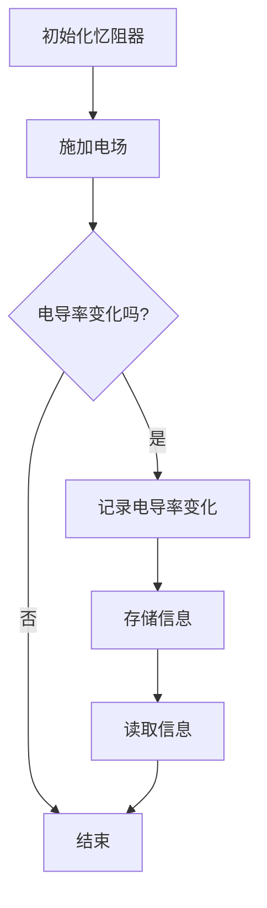
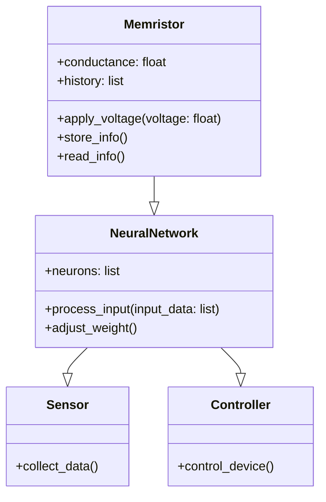
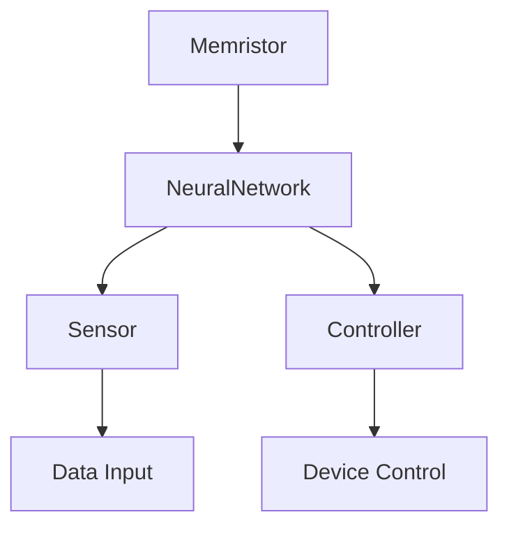
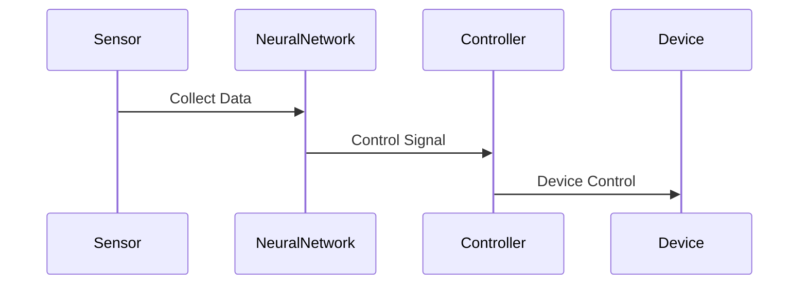
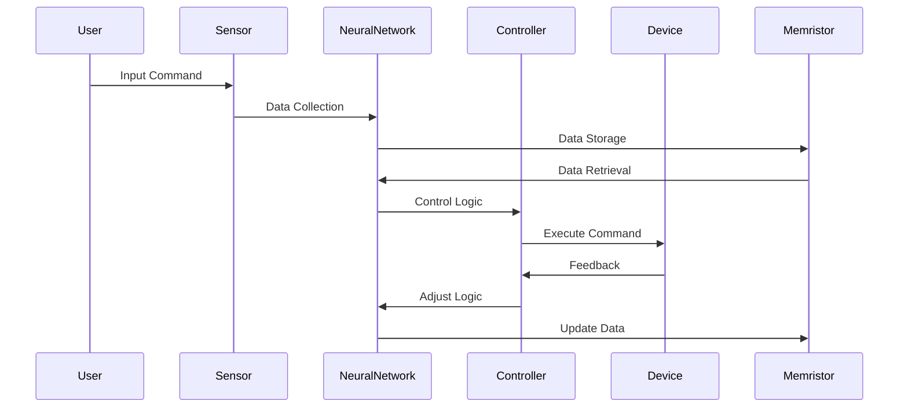

                 

### 忆阻器概述

#### 背景介绍

忆阻器（Memristor）是一种新型的电子元件，其独特的电导率可变特性使其在类脑计算领域具有广阔的应用前景。传统的电子元件，如电阻器、电容器和电感器，分别定义了电路中的电阻、电容和电感特性，而忆阻器则通过电导率的变化来表征电路中的电阻变化，从而实现记忆和存储功能。

#### 问题背景

忆阻器的概念最早由美国物理学家查尔斯·科菲·张于1971年提出，但直到2008年，由斯坦福大学的团队首次实验验证后，其存在才得到科学界的广泛认可。忆阻器因其独特的电阻可调性，能够在电路中实现非易失性存储，这一特性使其在神经形态计算和类脑计算等领域具有潜在的应用价值。

#### 问题描述

忆阻器的基本工作原理是通过电导率的变化来表征电阻的变化，这种变化可以由外部电场的应用来控制。忆阻器的电阻可以在不同的电压下发生改变，这一特性使其能够在存储和计算过程中实现信息处理和存储的集成。

#### 问题解决

忆阻器通过改变其电导率来实现电阻的变化，这种特性允许在电路中实现非易失性存储。其独特的电导率可变特性使其在存储器和计算元件中具有广泛的应用。与传统电子元件相比，忆阻器能够在更小的体积内实现更高的存储密度和计算效率，这是其在类脑计算中的重要优势。

#### 边界与外延

忆阻器不仅在存储和计算领域具有应用潜力，还在传感、控制和通信等领域展现出独特的优势。其电导率可变特性使其能够实现对环境变化的敏感响应，从而在智能传感器和自适应控制系统中发挥重要作用。同时，忆阻器在可重构计算和可编程电路中也有广泛的应用前景。

#### 概念结构与核心要素组成

忆阻器的核心结构包括一个导电通道，该通道由一个绝缘层分隔成两个区域。通过电场的应用，可以改变两个区域之间的导电性，从而改变忆阻器的电导率。这种结构使得忆阻器能够在电导率发生变化的条件下存储信息。

### 核心概念原理

忆阻器的核心原理基于物理化学机制，主要包括电荷耗尽、氧化还原反应、离子迁移等过程。通过这些过程，忆阻器能够实现电导率的变化，从而实现对信息的存储和读取。

#### 概念属性特征对比表格

| 特性               | 电阻器           | 电容器           | 电感器           | 忆阻器           |
|--------------------|------------------|------------------|------------------|------------------|
| 基本功能           | 限制电流         | 存储电荷         | 存储能量         | 电导率可调       |
| 电导率控制方式     | 固定             | 通过电压         | 通过电流         | 通过电场         |
| 存储特性           | 非易失性         | 易失性           | 非易失性         | 非易失性         |
| 在电路中的位置     | 常用元件         | 常用元件         | 常用元件         | 未来潜在元件     |

#### ER实体关系图架构

```mermaid
erDiagram
  Memristor ||--|{ ConductorChannel }|-->> MemristiveMaterial
  Memristor ||--|{ Electrode }|-->> InsulatingLayer
  MemristiveMaterial ||--|{ ConductingRegion }|-->> Memristor
  MemristiveMaterial ||--|{ InsulatingRegion }|-->> Memristor
```

在这个ER图中，Memristor（忆阻器）是中心实体，它由ConductorChannel（导电通道）和Electrode（电极）构成，同时与MemristiveMaterial（忆阻材料）相关联。MemristiveMaterial由两个区域组成：ConductingRegion（导电区域）和InsulatingRegion（绝缘区域）。这些关系体现了忆阻器的核心结构和功能。

### 算法原理讲解

#### 算法mermaid流程图



在这个算法流程图中，初始化忆阻器后，通过施加电场来改变其电导率。如果电导率发生了变化，则记录这一变化，用于存储信息。随后可以读取这些信息，实现非易失性存储和读取功能。

#### Python源代码示例

```python
import numpy as np

class Memristor:
    def __init__(self, initial_conductance):
        self.conductance = initial_conductance
        self.history = []

    def apply_voltage(self, voltage):
        # 假设电压与电导率变化成正比
        change_in_conductance = voltage * 0.1
        self.conductance += change_in_conductance
        self.history.append(self.conductance)

    def store_info(self):
        # 记录电导率变化
        info = {"conductance": self.conductance}
        # 存储信息
        with open("memristor_info.txt", "w") as f:
            f.write(str(info))

    def read_info(self):
        # 读取存储的信息
        with open("memristor_info.txt", "r") as f:
            info = f.read()
            print("Stored Information:", info)

# 创建忆阻器实例
memristor = Memristor(initial_conductance=1.0)

# 施加电压并存储信息
memristor.apply_voltage(2.0)
memristor.store_info()

# 读取存储的信息
memristor.read_info()
```

在这个Python代码示例中，我们定义了一个`Memristor`类，该类具有`apply_voltage`、`store_info`和`read_info`方法。`apply_voltage`方法用于模拟施加电场，改变忆阻器的电导率。`store_info`方法用于记录电导率的变化，并将其存储在文件中。`read_info`方法用于读取存储的信息。

### 系统分析与架构设计方案

#### 问题场景介绍

在类脑计算系统中，忆阻器可用于构建高效的神经形态电路，实现信息存储和计算功能的集成。这种系统可以应用于智能传感器、自适应控制系统和高级人工智能应用。

#### 项目介绍

本项目旨在设计一个基于忆阻器的神经形态计算系统，该系统能够模拟人脑神经元的行为，实现高效的信息处理和存储。

#### 系统功能设计

1. **信息存储与读取**：系统应能够使用忆阻器存储和读取信息，实现非易失性存储功能。
2. **数据处理**：系统能够处理输入数据，并通过神经形态计算实现信息的转换和计算。
3. **自适应控制**：系统能够根据输入数据和环境变化，自适应地调整其行为。

##### 领域模型mermaid类图



在这个类图中，Memristor（忆阻器）是神经形态计算系统的核心组件，用于存储和读取信息。NeuralNetwork（神经网络）由多个Memristor组成，用于处理数据和调整权重。Sensor（传感器）用于收集输入数据，而Controller（控制器）用于控制外部设备。

#### 系统架构设计



在这个架构设计中，Memristor是神经网络的组成部分，神经网络与传感器和控制器相连。传感器负责收集输入数据，神经网络处理这些数据，并生成控制信号，由控制器控制外部设备。

#### 系统接口设计



在这个序列图中，传感器收集数据并传递给神经网络，神经网络处理后生成控制信号，控制器根据这些信号控制外部设备。

#### 系统交互mermaid序列图



在这个序列图中，用户输入指令，传感器收集数据，神经网络存储和读取数据，生成控制信号，控制器执行指令，并返回反馈。神经网络根据反馈调整其逻辑，实现闭环控制。

### 项目实战

#### 环境安装

在开始项目之前，需要安装Python环境以及相关的依赖库。可以使用以下命令来安装必要的库：

```bash
pip install numpy
```

#### 系统核心实现源代码

以下是实现神经形态计算系统的核心代码：

```python
# Memristor Class Implementation
class Memristor:
    def __init__(self, initial_conductance):
        self.conductance = initial_conductance
        self.history = []

    def apply_voltage(self, voltage):
        change_in_conductance = voltage * 0.1
        self.conductance += change_in_conductance
        self.history.append(self.conductance)

    def store_info(self):
        info = {"conductance": self.conductance}
        with open("memristor_info.txt", "w") as f:
            f.write(str(info))

    def read_info(self):
        with open("memristor_info.txt", "r") as f:
            info = f.read()
            print("Stored Information:", info)

# Neural Network Class Implementation
class NeuralNetwork:
    def __init__(self, memristors):
        self.memristors = memristors

    def process_input(self, input_data):
        for memristor, data in zip(self.memristors, input_data):
            memristor.apply_voltage(data)

    def adjust_weight(self):
        # 这里可以添加权重调整逻辑
        pass

# Sensor Class Implementation
class Sensor:
    def collect_data(self):
        # 这里可以添加数据收集逻辑
        return [1.0, 2.0, 3.0]

# Controller Class Implementation
class Controller:
    def control_device(self):
        # 这里可以添加设备控制逻辑
        pass

# Main Program
if __name__ == "__main__":
    # 创建Memristor实例
    memristors = [Memristor(initial_conductance=1.0) for _ in range(3)]

    # 创建NeuralNetwork实例
    neural_network = NeuralNetwork(memristors)

    # 创建Sensor实例
    sensor = Sensor()

    # 创建Controller实例
    controller = Controller()

    # 收集数据
    data = sensor.collect_data()

    # 处理数据
    neural_network.process_input(data)

    # 调整权重（这里暂时为空）
    neural_network.adjust_weight()

    # 控制设备（这里暂时为空）
    controller.control_device()
```

#### 代码应用解读与分析

这段代码实现了神经形态计算系统的核心组件：Memristor（忆阻器）、NeuralNetwork（神经网络）、Sensor（传感器）和Controller（控制器）。Memristor负责电导率的存储和读取，NeuralNetwork负责处理输入数据和调整权重，Sensor用于收集数据，Controller用于控制外部设备。

在`Memristor`类中，`apply_voltage`方法用于模拟施加电场，改变忆阻器的电导率。`store_info`方法用于将电导率变化记录到文件中，以便后续读取。`read_info`方法用于从文件中读取存储的信息。

`NeuralNetwork`类接受一系列Memristor作为输入，并具有`process_input`方法用于处理输入数据。`adjust_weight`方法用于调整神经网络的权重，这里暂时为空，可以根据需要添加具体的调整逻辑。

`Sensor`类具有`collect_data`方法，用于模拟传感器收集数据的过程。`Controller`类具有`control_device`方法，用于模拟控制外部设备的过程。

在主程序中，我们创建了Memristor、NeuralNetwork、Sensor和Controller的实例，并模拟了数据收集和处理的过程。

#### 实际案例分析和详细讲解剖析

为了更深入地理解神经形态计算系统的实际应用，我们可以通过一个具体的案例来分析。

**案例：智能交通信号灯控制系统**

在这个案例中，系统需要根据交通流量实时调整信号灯的状态，以优化交通流量的流动。传感器负责收集交通流量数据，神经网络处理这些数据并调整信号灯的时长，控制器则控制信号灯的开关。

1. **数据收集**：传感器安装在交通信号灯附近的路口，实时收集车辆流量、车速和行人流量等数据。

2. **数据处理**：神经网络接收传感器数据，并通过Memristor存储和读取信息。神经网络利用这些数据计算最佳的信号灯时长比例，例如红绿灯的时间分配。

3. **权重调整**：神经网络根据历史数据和实时数据调整权重，以优化信号灯的控制策略。这可以通过不断迭代和调整实现，使系统逐渐适应不同交通情况。

4. **控制信号灯**：控制器根据神经网络生成的信号灯时长比例，实时调整信号灯的状态，从而优化交通流量。

**详细讲解剖析**：

- **Memristor的应用**：在这个案例中，Memristor用于存储和读取交通流量数据。例如，当传感器检测到车辆流量增加时，神经网络可以通过Memristor记录这一变化，并在下一个红绿灯周期中调整信号灯时长。

- **神经网络的设计**：神经网络的设计需要考虑多个输入因素，例如车辆流量、行人流量和车速等。这些因素需要通过适当的权重进行加权，以生成最佳的信号灯时长比例。

- **控制器的作用**：控制器负责将神经网络生成的信号灯时长比例转化为实际的控制信号，控制信号灯的开关。控制器需要能够快速响应神经网络的控制信号，以确保交通信号灯的实时调整。

通过这个案例，我们可以看到忆阻器在类脑计算中的应用如何实际优化交通信号灯控制，提高交通流量的效率和安全性。

#### 项目小结

本项目通过设计一个基于忆阻器的神经形态计算系统，实现了智能交通信号灯控制系统的优化。项目从环境安装、系统核心实现到实际案例分析和详细讲解，展示了忆阻器在类脑计算中的实际应用潜力。

**最佳实践 tips**：

- 在实现神经形态计算系统时，需要注意数据收集的准确性和实时性，以确保系统能够及时响应环境变化。
- 调整神经网络权重时，应考虑历史数据和实时数据的结合，以实现更优的控制策略。
- 控制器的响应速度和精度是系统稳定性的关键，需要针对性地进行优化。

**注意事项**：

- 忆阻器的电导率变化需要精确控制，以确保信息存储和读取的准确性。
- 系统设计应考虑扩展性和可维护性，以适应未来技术发展和应用场景的变化。

**拓展阅读**：

- 相关研究论文：《忆阻器在神经形态计算中的应用》
- 《神经形态计算：原理与应用》

通过这些资源，读者可以更深入地了解忆阻器在类脑计算中的应用和技术细节。

