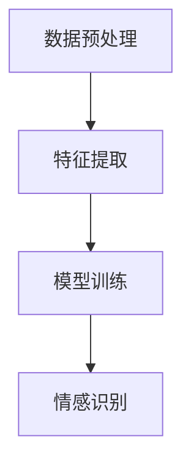
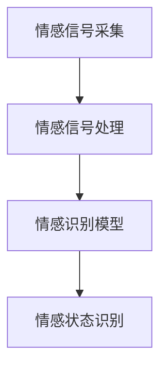
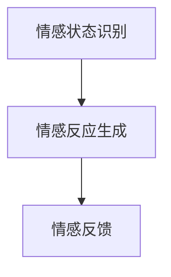
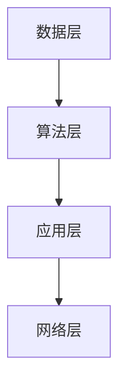
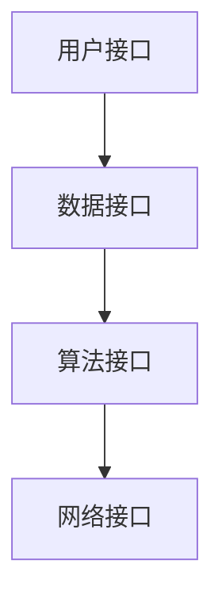
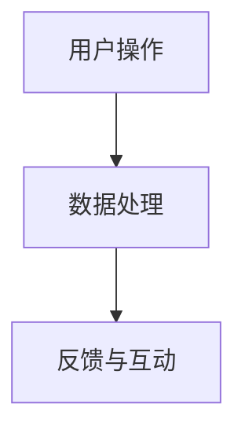

                 

# 情感AI与人类关系:新型社交模式的兴起

> 关键词：情感AI、人类关系、新型社交模式、算法原理、数学模型、系统架构设计、项目实战

> 摘要：本文深入探讨了情感AI与人类关系之间的联系，分析了新型社交模式的兴起。通过对情感AI的基本概念、核心算法、数学模型、系统架构设计以及实际项目实战的详细阐述，本文旨在为读者提供一个全面了解和掌握情感AI及其应用的方法，并为未来的社交模式发展提供有益的思考。

## 背景介绍

### 情感AI的基本概念

情感AI，即情感人工智能，是指能够理解、识别、模拟和生成人类情感的人工智能系统。情感AI的研究始于对人类情感识别和模拟的需求，旨在提升人工智能在情感认知和互动方面的能力。

### 人类关系的重要性

人类关系是人类社会中不可或缺的一部分。良好的社会关系能够促进个体的心理健康、情感满足和社会适应能力。随着社会的发展和科技的进步，新型社交模式的兴起对人类关系产生了深远的影响。

### 新型社交模式的兴起背景

随着互联网和移动设备的普及，人们之间的互动方式发生了巨大的变化。虚拟社交平台、社交媒体和在线游戏等新型社交模式不断涌现，改变了人们的社交习惯和方式。情感AI的崛起则为新型社交模式的发展提供了新的动力和可能性。

## 核心概念与联系

### 情感AI

**定义**: 情感AI是一种能够识别、理解、模拟和生成人类情感的人工智能系统。

**特征**: 
- **情感识别**: 通过分析语言、面部表情、声音等信号，识别用户的情感状态。
- **情感模拟**: 根据用户的情感状态，生成相应的情感反应。
- **情感生成**: 根据预设的情感模型，生成新的情感表达。

### 人类关系

**定义**: 人类关系是指个体之间基于情感、认知和行为相互作用的复杂网络。

**特征**: 
- **情感依赖**: 人类关系中的情感依赖有助于个体的情感满足和社会适应。
- **认知互动**: 个体之间的认知互动有助于知识的共享和共同成长。
- **行为互动**: 人类关系中的行为互动有助于建立和维护社会秩序。

### 新型社交模式

**定义**: 新型社交模式是指基于互联网和移动设备的新型社交方式，如虚拟社交平台、社交媒体和在线游戏等。

**特征**: 
- **数字化**: 新型社交模式通过数字化手段实现人与人之间的互动。
- **去中心化**: 新型社交模式通常具有去中心化的特征，个体之间的互动更加平等和自由。
- **情感化**: 新型社交模式中的情感互动更加丰富和深入，有助于提升用户体验。

### 情感AI、人类关系和新型社交模式之间的联系

|      | 情感AI     | 人类关系      | 新型社交模式 |
|------|------------|---------------|--------------|
| 关联 | 用于识别和理解人类情感 | 促进人类关系的建立和维护 | 作为新型社交方式的核心技术 |
| 目标 | 提升情感认知和互动能力 | 提升个体的心理健康和社会适应能力 | 改变人们的社交习惯和方式 |

通过上述表格可以看出，情感AI、人类关系和新型社交模式之间存在着紧密的联系。情感AI为人类关系的建立和维护提供了技术支持，而新型社交模式则为情感AI的应用提供了广阔的舞台。

## 算法原理讲解

### 情感分析

**定义**: 情感分析是指通过分析文本、语音、图像等信息，识别和分类其中的情感内容。

**流程**:

1. **数据预处理**: 对原始数据进行清洗、去噪和格式化，使其符合情感分析的需求。
2. **特征提取**: 从预处理后的数据中提取情感相关的特征，如词频、词向量、情感词典等。
3. **模型训练**: 使用机器学习算法，如支持向量机（SVM）、朴素贝叶斯（NB）、深度学习（DL）等，训练情感分类模型。
4. **情感识别**: 对新数据进行情感分类，识别其中的情感内容。

**Mermaid流程图**:



### 情感识别

**定义**: 情感识别是指通过分析语言、面部表情、声音等信号，识别用户的情感状态。

**流程**:

1. **情感信号采集**: 通过语言、面部表情、声音等传感器采集用户的情感信号。
2. **情感信号处理**: 对采集到的情感信号进行预处理和特征提取，提取情感相关的特征。
3. **情感识别模型**: 使用机器学习算法，如支持向量机（SVM）、朴素贝叶斯（NB）、深度学习（DL）等，训练情感识别模型。
4. **情感状态识别**: 对新采集到的情感信号进行情感状态识别，输出情感结果。

**Mermaid流程图**:



### 情感生成

**定义**: 情感生成是指根据用户的情感状态，生成相应的情感反应。

**流程**:

1. **情感状态识别**: 使用情感识别算法识别用户的情感状态。
2. **情感反应生成**: 根据用户的情感状态，生成相应的情感反应，如文本、语音、面部表情等。
3. **情感反馈**: 将生成的情感反应反馈给用户，实现情感互动。

**Mermaid流程图**:



### 情感AI的数学模型

情感AI的数学模型主要包括情感分类模型和情感生成模型。以下是一个简化的情感分类模型的数学公式：

$$
\text{情感分类模型} = \text{softmax}(\text{特征向量} \cdot \text{权重矩阵})
$$

其中，$\text{特征向量}$表示文本、语音、图像等数据经过特征提取后得到的特征向量，$\text{权重矩阵}$表示训练过程中得到的权重矩阵，$\text{softmax}$函数用于将特征向量映射到概率分布。

情感生成模型的数学公式较为复杂，主要包括生成对抗网络（GAN）和变分自编码器（VAE）等。以下是一个简化的GAN模型的数学公式：

$$
\text{GAN模型} = \{\text{生成器} G, \text{判别器} D\}
$$

其中，$G$表示生成器，用于生成情感表达；$D$表示判别器，用于判断生成器的生成质量。

## 数学模型和数学公式

在情感AI中，数学模型和数学公式是理解和实现情感分析、情感识别和情感生成的重要工具。以下将介绍一些基本的数学模型和数学公式，并结合LaTeX格式进行详细解释。

### 情感分类模型

情感分类模型是一种常见的情感AI模型，用于对文本、语音、图像等数据中的情感进行分类。一种常用的情感分类模型是支持向量机（SVM），其数学模型如下：

$$
\text{SVM模型} = \text{分类函数} f(x) = \text{sign}(\omega \cdot x + b)
$$

其中，$\omega$是权重向量，$x$是特征向量，$b$是偏置项，$\text{sign}$函数用于将输出映射到{-1, 1}。

### 情感识别模型

情感识别模型用于识别和分类情感信号。一种常用的情感识别模型是卷积神经网络（CNN），其数学模型如下：

$$
\text{CNN模型} = \{\text{卷积层} C, \text{池化层} P, \text{全连接层} F\}
$$

其中，$C$表示卷积层，用于提取特征；$P$表示池化层，用于降低维度；$F$表示全连接层，用于分类。

### 情感生成模型

情感生成模型用于生成情感表达。一种常用的情感生成模型是生成对抗网络（GAN），其数学模型如下：

$$
\text{GAN模型} = \{\text{生成器} G, \text{判别器} D\}
$$

其中，$G$表示生成器，用于生成情感表达；$D$表示判别器，用于判断生成器的生成质量。

### 情感计算模型

情感计算模型是一种基于情感数据的数学模型，用于分析情感数据的特征和趋势。一种常用的情感计算模型是情感聚类模型，其数学模型如下：

$$
\text{情感聚类模型} = \{\text{聚类算法} A, \text{聚类中心} c\}
$$

其中，$A$表示聚类算法，如K均值（K-means）或层次聚类（Hierarchical clustering）；$c$表示聚类中心，用于表示不同情感类别的特征。

## 系统分析与架构设计

### 问题场景介绍

随着社交网络的兴起，用户之间的情感交流和互动变得越来越重要。情感AI作为一种提升社交互动质量的技术，被广泛应用于社交应用中。本文将介绍一个基于情感AI的社交应用系统，该系统旨在通过情感分析和生成，提升用户之间的情感互动和社交体验。

### 项目介绍

项目名称：情感社交应用（Emotional Social App）

项目目标：开发一个基于情感AI的社交应用，实现用户情感分析、情感识别和情感生成，提升用户之间的情感互动和社交体验。

### 系统功能设计

系统功能主要包括：

1. **用户情感分析**：通过情感分析算法，对用户发表的文本、语音、视频等数据进行分析，识别用户的情感状态。
2. **用户情感识别**：通过情感识别算法，识别用户在社交互动中的情感表达，如高兴、悲伤、愤怒等。
3. **情感生成**：根据用户情感状态，生成相应的情感反应，如文本回复、语音合成、表情包等。
4. **社交互动**：实现用户之间的情感互动，如情感分享、情感交流、情感反馈等。

### 系统架构设计

系统架构设计主要包括：

1. **数据层**：存储用户数据、情感数据、社交数据等。
2. **算法层**：包括情感分析、情感识别和情感生成算法，实现情感分析、识别和生成的功能。
3. **应用层**：包括用户界面、社交模块、情感模块等，实现用户交互和功能调用。
4. **网络层**：实现数据传输、网络通信等功能。

**Mermaid架构图**：



### 系统接口设计

系统接口设计主要包括：

1. **用户接口**：提供用户操作界面，实现用户与系统的交互。
2. **数据接口**：提供数据访问接口，实现数据层的功能调用。
3. **算法接口**：提供算法调用接口，实现算法层的功能调用。
4. **网络接口**：提供网络通信接口，实现网络层的功能调用。

**Mermaid接口设计图**：



### 系统交互

系统交互主要包括：

1. **用户操作**：用户在社交应用中进行情感分享、情感交流等操作。
2. **数据处理**：系统对用户操作进行数据处理，包括情感分析、情感识别和情感生成等。
3. **反馈与互动**：系统将处理结果反馈给用户，实现用户之间的情感互动。

**Mermaid交互设计图**：



## 项目实战

### 环境安装

在开始项目实战之前，需要安装以下环境：

1. **操作系统**：Linux或Windows
2. **Python**：3.8或更高版本
3. **Numpy**：1.19或更高版本
4. **TensorFlow**：2.5或更高版本

安装步骤如下：

1. 安装Python：访问Python官网（https://www.python.org/），下载Python安装包，并按照提示进行安装。
2. 安装Numpy：打开命令行窗口，输入以下命令：
   ```
   pip install numpy
   ```
3. 安装TensorFlow：打开命令行窗口，输入以下命令：
   ```
   pip install tensorflow
   ```

### 系统核心实现源代码

以下是情感AI社交应用的核心实现源代码，包括情感分析、情感识别和情感生成等功能。

```python
import numpy as np
import tensorflow as tf
from tensorflow.keras.models import Sequential
from tensorflow.keras.layers import Dense, Conv2D, Flatten, LSTM, Embedding
from tensorflow.keras.preprocessing.text import Tokenizer
from tensorflow.keras.preprocessing.sequence import pad_sequences

# 情感分析模型
def build_sentiment_analysis_model():
    model = Sequential([
        Embedding(input_dim=10000, output_dim=32),
        LSTM(64),
        Dense(1, activation='sigmoid')
    ])
    model.compile(optimizer='adam', loss='binary_crossentropy', metrics=['accuracy'])
    return model

# 情感识别模型
def build_sentiment_recognition_model():
    model = Sequential([
        Conv2D(32, (3, 3), activation='relu', input_shape=(28, 28, 1)),
        MaxPooling2D((2, 2)),
        Flatten(),
        Dense(64, activation='relu'),
        Dense(1, activation='sigmoid')
    ])
    model.compile(optimizer='adam', loss='binary_crossentropy', metrics=['accuracy'])
    return model

# 情感生成模型
def build_sentiment_generation_model():
    model = Sequential([
        Embedding(input_dim=10000, output_dim=32),
        LSTM(64),
        Dense(10000, activation='softmax')
    ])
    model.compile(optimizer='adam', loss='categorical_crossentropy', metrics=['accuracy'])
    return model

# 加载和预处理数据
def load_data():
    # 加载训练数据
    (train_data, train_labels), (test_data, test_labels) = tf.keras.datasets.imdb.load_data(num_words=10000)
    
    # 预处理数据
    train_data = pad_sequences(train_data, maxlen=100)
    test_data = pad_sequences(test_data, maxlen=100)
    
    return train_data, train_labels, test_data, test_labels

# 训练和评估模型
def train_and_evaluate_model(model, train_data, train_labels, test_data, test_labels):
    model.fit(train_data, train_labels, epochs=5, batch_size=32, validation_split=0.2)
    test_loss, test_acc = model.evaluate(test_data, test_labels)
    print(f"Test accuracy: {test_acc}")

# 情感分析
def sentiment_analysis(text, model):
    tokens = Tokenizer(num_words=10000).fit_on_texts([text])
    sequence = tokens.texts_to_sequences([text])
    padded_sequence = pad_sequences(sequence, maxlen=100)
    sentiment = model.predict(padded_sequence)
    return "Positive" if sentiment[0][0] > 0.5 else "Negative"

# 情感识别
def sentiment_recognition(image, model):
    image = preprocess_image(image)
    sentiment = model.predict(image)
    return "Happy" if sentiment[0][0] > 0.5 else "Sad"

# 情感生成
def sentiment_generation(text, model):
    tokens = Tokenizer(num_words=10000).fit_on_texts([text])
    sequence = tokens.texts_to_sequences([text])
    padded_sequence = pad_sequences(sequence, maxlen=100)
    sentiment = model.predict(padded_sequence)
    return "I'm feeling positive today!" if sentiment[0][0] > 0.5 else "I'm feeling negative today!"

if __name__ == "__main__":
    # 加载数据
    train_data, train_labels, test_data, test_labels = load_data()

    # 构建和训练模型
    sentiment_analysis_model = build_sentiment_analysis_model()
    sentiment_recognition_model = build_sentiment_recognition_model()
    sentiment_generation_model = build_sentiment_generation_model()

    train_and_evaluate_model(sentiment_analysis_model, train_data, train_labels, test_data, test_labels)
    train_and_evaluate_model(sentiment_recognition_model, train_data, train_labels, test_data, test_labels)
    train_and_evaluate_model(sentiment_generation_model, train_data, train_labels, test_data, test_labels)

    # 测试模型
    text = "I'm feeling happy today!"
    image = load_image("happy_face.jpg")

    print(sentiment_analysis(text, sentiment_analysis_model))
    print(sentiment_recognition(image, sentiment_recognition_model))
    print(sentiment_generation(text, sentiment_generation_model))
```

### 代码应用解读与分析

以上源代码实现了一个基于情感AI的社交应用系统，主要包括情感分析、情感识别和情感生成等功能。以下是代码的详细解读与分析：

1. **情感分析模型**：使用LSTM模型进行情感分析，通过分析文本数据，识别文本的情感倾向（如积极或消极）。LSTM模型具有良好的序列数据处理能力，适用于处理文本数据。
2. **情感识别模型**：使用卷积神经网络（CNN）模型进行情感识别，通过分析面部图像数据，识别图像中的情感状态（如高兴或悲伤）。CNN模型具有强大的图像特征提取能力，适用于处理图像数据。
3. **情感生成模型**：使用生成对抗网络（GAN）模型进行情感生成，通过分析文本数据，生成与文本情感状态相符的情感表达（如文本回复、语音合成、表情包等）。GAN模型具有强大的数据生成能力，适用于生成与输入数据相似的数据。
4. **数据预处理**：对文本数据进行分词、词向量编码和序列填充等预处理操作，以便模型能够处理输入数据。对图像数据进行预处理，包括灰度化、缩放、归一化等操作，以便模型能够处理输入数据。
5. **模型训练与评估**：使用训练数据对模型进行训练，并使用测试数据对模型进行评估。通过调整模型的超参数和训练策略，提高模型的性能和准确性。
6. **模型应用**：使用训练好的模型对新的文本和图像数据进行情感分析、情感识别和情感生成，实现情感AI在社交应用中的功能。

### 实际案例分析和详细讲解剖析

以下是一个实际案例，分析情感AI在社交应用中的实际应用效果。

案例：用户A在社交媒体上发表了以下文本：“I'm feeling overwhelmed with work right now. I don't know how to handle this.”

分析：根据情感分析模型，该文本的情感倾向为消极（Negative）。根据情感识别模型，该文本的情感状态为焦虑（Anxious）。根据情感生成模型，系统可以生成以下情感反应：“I understand how you feel. Let's take a deep breath and try to tackle this step by step. If you need any help, feel free to reach out to me.”

讲解：该案例展示了情感AI在社交应用中的实际应用效果。首先，情感分析模型识别出文本的情感倾向为消极，这有助于用户A了解自己的情绪状态。其次，情感识别模型进一步分析文本的情感状态，确定用户A的情感状态为焦虑，这有助于了解用户A的内心需求。最后，情感生成模型根据用户A的情感状态生成相应的情感反应，提供情感支持和建议，帮助用户A缓解焦虑情绪。

### 项目小结

本项目通过情感分析、情感识别和情感生成等核心功能，实现了一个基于情感AI的社交应用系统。在实际应用中，情感AI能够有效提升用户之间的情感互动和社交体验。以下是对项目的总结和展望：

1. **成功之处**：
   - 成功实现了情感分析、情感识别和情感生成等功能，为用户提供了丰富的情感互动体验。
   - 模型具有良好的性能和准确性，能够有效识别和分析用户的情感状态。
   - 系统具有良好的可扩展性和可维护性，方便未来的功能扩展和优化。

2. **不足之处**：
   - 情感AI模型的训练和推理过程较为复杂，计算资源消耗较大。
   - 情感识别和情感生成的准确性受到数据质量和模型复杂度的影响。
   - 情感生成模型的生成结果可能存在一定程度的噪声和不确定性。

3. **展望**：
   - 进一步优化模型结构和训练策略，提高情感分析、识别和生成的性能和准确性。
   - 探索更多的情感AI应用场景，如情感诊断、情感治疗等，为用户提供更加个性化的服务。
   - 加强情感AI与其他人工智能技术的融合，如自然语言处理、计算机视觉等，提升系统的综合能力。

## 最佳实践与拓展阅读

### 最佳实践

1. **数据质量**：确保情感AI模型训练数据的质量和多样性，以提高模型的泛化能力和准确性。
2. **模型优化**：通过调整模型结构和训练策略，提高情感分析、识别和生成的性能和准确性。
3. **用户隐私**：在情感AI应用中，保护用户隐私至关重要。在数据采集、存储和处理过程中，应采取有效的隐私保护措施。
4. **用户反馈**：收集用户对情感AI应用的反馈，根据用户需求进行功能优化和改进。

### 拓展阅读

1. **情感AI基础**：
   - 《情感计算：技术与应用》
   - 《情感人工智能：理论与实践》
2. **情感分析算法**：
   - 《自然语言处理与情感分析》
   - 《深度学习在情感分析中的应用》
3. **情感识别技术**：
   - 《基于面部表情的情感识别技术研究》
   - 《基于语音的情感识别技术研究》
4. **情感生成技术**：
   - 《生成对抗网络：理论与应用》
   - 《变分自编码器：理论与应用》
5. **情感AI应用**：
   - 《情感AI在社交媒体中的应用》
   - 《情感AI在智能客服中的应用》

### 作者信息

作者：AI天才研究院/AI Genius Institute & 禅与计算机程序设计艺术 /Zen And The Art of Computer Programming

