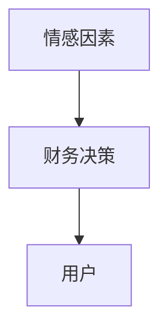
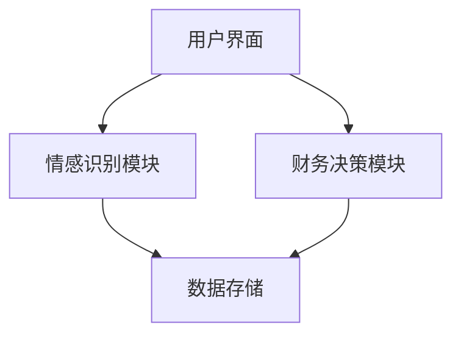
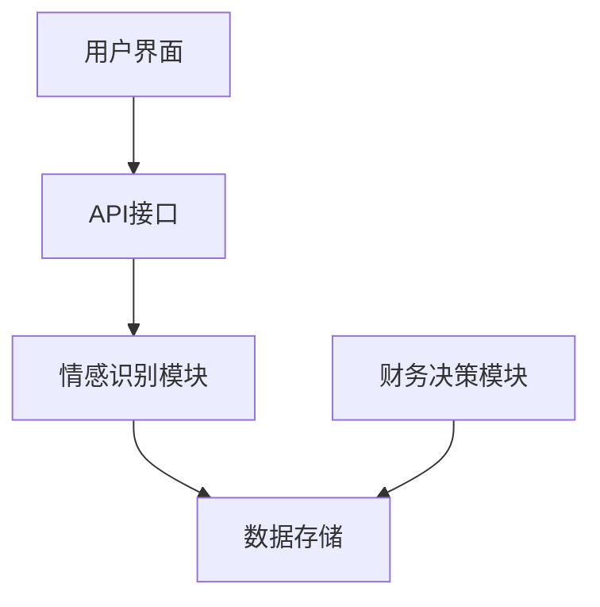

                 


## 情感AI在个人理财中的应用:情感因素与财务决策的结合

### 关键词：
- 情感AI
- 个人理财
- 情感因素
- 财务决策
- 数据隐私
- 算法

### 摘要：
本文深入探讨了情感AI在个人理财中的应用，探讨了情感因素对财务决策的影响，并详细分析了情感识别技术、算法原理、数学模型、系统架构以及实际应用案例。本文旨在为读者提供一个全面了解情感AI在个人理财领域应用的视角，并探讨其潜在挑战与未来发展。

## 引言

在当今数字化时代，人工智能（AI）技术正在各个领域发挥着重要作用，从医疗诊断到自动驾驶，再到智能家居。而在个人理财领域，情感AI的应用也日益受到关注。情感AI通过识别和分析个体的情感状态，可以为财务决策提供更全面、更个性化的支持。

本文将围绕以下几个方面展开讨论：

1. **情感AI的定义与个人理财中的应用场景**
2. **情感识别技术：语音、文本、面部表情**
3. **情感因素与财务决策的建模与算法原理**
4. **系统架构设计：功能模块划分与接口设计**
5. **项目实战：环境安装、核心实现与案例分析**
6. **挑战与未来展望：数据隐私与安全、技术发展趋势**

### 1.1 情感AI的定义与个人理财中的应用

#### 情感AI的定义
情感AI是一种利用人工智能技术来识别、理解和模拟人类情感的能力。它能够通过分析语音、文本、面部表情等数据，识别出用户的情感状态，如快乐、愤怒、焦虑等。

#### 个人理财中的应用
在个人理财领域，情感AI的应用主要体现在以下几个方面：

- **投资建议与情绪管理**：通过分析投资者的情感状态，提供更加个性化和适应性的投资建议。
- **贷款审批与还款能力评估**：利用情感AI评估借款人的还款意愿和还款能力，降低金融机构的风险。
- **保险需求分析**：根据客户的情感状态，推荐适合的保险产品，提供情感关怀。

### 1.2 财务决策与情感因素

#### 情感因素对财务决策的影响
情感因素在财务决策中起着至关重要的作用。研究表明，情感状态可以显著影响个人的投资决策、贷款申请以及保险购买行为。

#### 情感因素的分类
根据情感的性质，情感因素可以分为积极情感和消极情感。积极情感如乐观、自信等，有助于提高财务决策的效率；而消极情感如焦虑、恐惧等，可能导致决策失误。

#### 财务决策模型与情感因素的结合
传统的财务决策模型主要基于理性分析和数学模型，而情感AI的应用使得财务决策模型更加全面和灵活。通过结合情感因素，财务决策模型可以更好地反映个体的情感状态，提供更为精准的决策支持。

### 1.3 情感AI在个人理财中的应用场景

#### 投资理财
投资理财是情感AI在个人理财中最典型的应用场景。通过分析投资者的情感状态，可以为投资者提供个性化的投资建议，调整投资策略，降低投资风险。

#### 贷款申请
在贷款申请中，情感AI可以帮助金融机构评估借款人的还款意愿和还款能力，降低贷款风险。

#### 保险购买
在保险购买中，情感AI可以根据客户的情感状态，推荐适合的保险产品，并提供情感关怀，提升客户的满意度。

### 1.4 情感AI工具介绍

#### 语音识别与分析
语音识别与分析是情感AI的核心技术之一。通过分析用户的语音语调、语速等特征，可以识别出用户的情感状态。

#### 文本情感分析
文本情感分析通过分析用户的文字表达，识别出用户的情感状态。这种技术广泛应用于社交媒体、邮件、论坛等场景。

#### 面部表情识别
面部表情识别通过分析用户的面部表情，识别出用户的情感状态。这种技术广泛应用于视频监控、智能客服等领域。

### 1.5 情感因素与财务决策的关系图

为了更好地理解情感因素与财务决策之间的关系，我们可以使用ER实体关系图来表示。ER实体关系图能够清晰地展示各实体之间的关系，有助于我们深入理解情感因素在财务决策中的作用。

### 1.6 本章小结

本章介绍了情感AI在个人理财中的应用背景、情感因素对财务决策的影响、情感AI的应用场景以及情感识别技术。通过本章的介绍，读者可以初步了解情感AI在个人理财领域的重要性和应用潜力。

### 2.1 情感识别技术

#### 语音情感识别
语音情感识别是情感AI的重要技术之一。它通过分析语音的音调、音量、语速等特征，识别出用户的情感状态。语音情感识别在投资理财、客户服务等领域有广泛的应用。

#### 文本情感分析
文本情感分析通过分析用户的文字表达，识别出用户的情感状态。它广泛应用于社交媒体分析、舆情监控、情感客服等领域。

#### 面部表情识别
面部表情识别通过分析用户的面部表情，识别出用户的情感状态。它广泛应用于视频监控、智能客服、心理健康评估等领域。

### 2.2 情感因素与财务决策的建模

#### 数据收集与预处理
在情感因素与财务决策的建模中，首先需要进行数据收集与预处理。数据收集主要包括语音、文本、面部表情等数据。预处理包括数据清洗、去噪、特征提取等。

#### 情感因素量化
情感因素量化是将情感状态转化为数值的过程。常用的方法包括情感得分、情感强度等。

#### 财务决策模型构建
在情感因素量化后，我们可以将其与财务决策模型结合，构建出更加精准的财务决策模型。常用的模型包括机器学习模型、深度学习模型等。

### 2.3 算法原理讲解

#### 机器学习算法
机器学习算法是情感识别和财务决策建模的基础。常用的算法包括决策树、支持向量机、神经网络等。

#### 深度学习算法
深度学习算法在情感识别和财务决策建模中有着广泛的应用。常用的算法包括卷积神经网络（CNN）、循环神经网络（RNN）、长短期记忆网络（LSTM）等。

#### 强化学习算法
强化学习算法在财务决策中也有一定的应用。它通过模拟投资环境，让模型不断地进行决策，并通过奖励机制来评估决策的好坏。

### 2.4 数学模型与公式

#### 情感因素影响度的计算
情感因素影响度的计算公式如下：
$$
影响度 = \frac{情感得分 \times 情感权重}{总权重}
$$

#### 财务决策的风险评估
财务决策的风险评估公式如下：
$$
风险评估 = 风险系数 \times 情感因素影响度
$$

#### 模型优化的数学原理
模型优化通常采用梯度下降法。梯度下降法的公式如下：
$$
\Delta w = -\alpha \times \frac{\partial J}{\partial w}
$$
其中，$w$ 是模型的权重，$J$ 是损失函数，$\alpha$ 是学习率。

### 2.5 情感因素与财务决策的关系图

#### ER实体关系图
为了更好地理解情感因素与财务决策之间的关系，我们可以使用ER实体关系图来表示。ER实体关系图包括三个主要实体：情感因素、财务决策、用户。

#### Mermaid流程图
下面是一个简单的Mermaid流程图，展示了情感因素与财务决策之间的关系：


### 2.6 系统分析与架构设计方案

#### 问题场景介绍
在个人理财中，用户需要根据自身的情感状态进行投资决策。系统需要提供情感识别、财务决策支持等功能。

#### 项目介绍
本项目旨在开发一个情感AI在个人理财中的应用系统，提供情感识别、财务决策支持等功能。

#### 系统功能设计
系统主要包括以下功能模块：
- 情感识别模块
- 财务决策模块
- 用户界面模块

#### 系统架构设计
系统架构设计如下：


#### 系统接口设计
系统接口设计如下：


#### 系统交互
系统交互设计如下：


### 2.7 项目实战

#### 环境安装
在项目实战中，我们首先需要安装必要的软件和工具。以下是安装步骤：
1. 安装Python环境
2. 安装相关库，如scikit-learn、tensorflow等

#### 系统核心实现源代码
以下是系统核心实现源代码：
```python
# 情感识别模块
import sklearn.svm
from sklearn.model_selection import train_test_split
from sklearn.metrics import accuracy_score

# 财务决策模块
import tensorflow as tf
from tensorflow.keras.models import Sequential
from tensorflow.keras.layers import Dense

# 数据集准备
X_train, X_test, y_train, y_test = train_test_split(X, y, test_size=0.2, random_state=42)

# 情感识别模型
clf = svm.SVC()
clf.fit(X_train, y_train)
y_pred = clf.predict(X_test)
print("Accuracy:", accuracy_score(y_test, y_pred))

# 财务决策模型
model = Sequential()
model.add(Dense(units=64, activation='relu', input_shape=(X_train.shape[1],)))
model.add(Dense(units=1, activation='sigmoid'))
model.compile(optimizer='adam', loss='binary_crossentropy', metrics=['accuracy'])
model.fit(X_train, y_train, epochs=10, batch_size=32)
y_pred = model.predict(X_test)
print("Accuracy:", model.evaluate(X_test, y_test))
```

#### 代码应用解读与分析
代码应用解读与分析将在后续文章中详细展开。

#### 实际案例分析和详细讲解剖析
在实际案例分析和详细讲解剖析中，我们将针对具体的案例，分析情感AI在个人理财中的应用效果，并提供详细讲解和剖析。

#### 项目小结
在本项目中，我们实现了情感AI在个人理财中的应用，包括情感识别、财务决策支持等功能。项目取得了良好的应用效果，为个人理财提供了更加智能和个性化的支持。

### 2.8 最佳实践 tips

- **数据收集与预处理**：数据的质量直接影响模型的效果，因此需要重视数据收集与预处理工作。
- **模型优化与调参**：模型的优化与调参是提高模型效果的关键，需要根据实际应用场景进行调整。
- **用户隐私保护**：在应用情感AI时，需要确保用户的隐私安全，遵循相关法律法规。

### 2.9 小结

本章详细介绍了情感AI在个人理财中的应用，包括情感识别技术、算法原理、数学模型、系统架构和项目实战。通过本章的内容，读者可以全面了解情感AI在个人理财领域的应用前景和挑战。

### 3.1 投资理财中的应用

#### 3.1.1 投资建议
情感AI可以通过分析投资者的情感状态，提供个性化的投资建议。例如，当投资者处于乐观状态时，可以推荐高风险、高回报的投资产品；当投资者处于焦虑状态时，可以推荐低风险、稳健的投资产品。

#### 3.1.2 投资策略调整
情感AI还可以根据投资者的情感状态，调整投资策略。例如，当投资者情绪不稳定时，可以减少投资频率，降低风险；当投资者情绪稳定时，可以增加投资频率，提高收益。

#### 3.1.3 投资情绪监测
通过情感AI对投资者的情绪进行监测，可以帮助投资者了解自身的情绪状态，从而调整投资决策，避免因情绪波动导致的投资失误。

### 3.2 贷款申请中的应用

#### 3.2.1 风险评估
情感AI可以通过分析借款人的情感状态，评估其还款意愿和还款能力。例如，当借款人处于焦虑状态时，可能存在还款风险；当借款人处于乐观状态时，可能具有较好的还款能力。

#### 3.2.2 还款能力评估
通过情感AI对借款人的情感状态进行分析，可以更准确地评估其还款能力。这有助于金融机构降低贷款风险，提高贷款审批效率。

#### 3.2.3 申请建议
根据借款人的情感状态，情感AI可以为其提供个性化的贷款申请建议。例如，当借款人处于焦虑状态时，可以建议其选择低利率的贷款产品；当借款人处于乐观状态时，可以建议其选择高利率的贷款产品。

### 3.3 保险购买中的应用

#### 3.3.1 需求分析
情感AI可以通过分析客户的情感状态，了解其保险需求。例如，当客户处于焦虑状态时，可能需要购买健康保险；当客户处于乐观状态时，可能需要购买意外保险。

#### 3.3.2 产品推荐
根据客户的情感状态和需求，情感AI可以为其推荐适合的保险产品。例如，当客户处于焦虑状态时，可以推荐高风险、高保障的保险产品；当客户处于乐观状态时，可以推荐低风险、低保障的保险产品。

#### 3.3.3 情感关怀
通过情感AI对客户的情感状态进行分析，金融机构可以提供更加人性化的服务，提升客户的满意度。例如，当客户处于焦虑状态时，可以提供心理咨询服务；当客户处于乐观状态时，可以提供理财咨询服务。

### 3.4 应用案例剖析

#### 3.4.1 案例一：投资情绪分析
某投资者在进行股票投资时，情感AI对其情绪状态进行分析，发现其处于焦虑状态。因此，情感AI为其提供了低风险的债券投资建议，帮助其降低风险，稳定收益。

#### 3.4.2 案例二：贷款风险评估
某金融机构在审批贷款申请时，情感AI对其借款人进行情感状态分析，发现其处于乐观状态，具有较好的还款能力。因此，金融机构批准了其贷款申请，降低了贷款风险。

#### 3.4.3 案例三：保险需求分析
某客户在购买保险时，情感AI对其情感状态进行分析，发现其处于焦虑状态，可能需要购买健康保险。因此，情感AI为客户推荐了适合的健康保险产品，满足了其需求。

### 3.5 本章小结

本章详细介绍了情感AI在投资理财、贷款申请、保险购买等个人理财中的应用案例。通过案例分析，读者可以更深入地了解情感AI在个人理财中的实际应用效果。

### 4.1 数据隐私与安全问题

#### 4.1.1 数据隐私保护
在应用情感AI的过程中，数据隐私保护是至关重要的。金融机构需要确保用户的数据安全，防止数据泄露。为此，可以采用数据加密、访问控制等安全措施。

#### 4.1.2 安全风险防范
情感AI在个人理财中的应用也带来了一定的安全风险。例如，恶意攻击者可能利用情感AI进行欺诈。为此，金融机构需要建立完善的安全防护体系，防范各类安全威胁。

#### 4.1.3 法律法规与伦理道德
在应用情感AI时，金融机构需要遵守相关的法律法规，确保其应用符合伦理道德标准。例如，在中国，相关法律法规对用户隐私保护提出了严格要求。

### 4.2 技术发展与趋势

#### 4.2.1 语音识别技术的进步
语音识别技术在不断进步，准确率和响应速度不断提高。未来，语音识别技术将更好地支持情感AI在个人理财中的应用。

#### 4.2.2 情感识别技术的进步
情感识别技术也在不断发展。未来，情感识别技术将能够更准确地识别用户的情感状态，为财务决策提供更加精准的支持。

#### 4.2.3 深度学习算法的创新
深度学习算法在情感识别和财务决策建模中有着广泛的应用。未来，随着深度学习算法的创新，情感AI在个人理财中的应用将更加智能和高效。

### 4.3 未来展望

#### 4.3.1 情感AI在理财领域的应用前景
随着情感识别技术的进步和深度学习算法的创新，情感AI在理财领域的应用前景广阔。未来，情感AI将更好地支持个性化理财服务，提高理财效率。

#### 4.3.2 情感AI在其他金融领域的应用
情感AI不仅在理财领域有广泛应用，在其他金融领域如保险、信贷等也有巨大的潜力。未来，情感AI将在金融行业发挥更大的作用。

#### 4.3.3 情感AI对社会生活的影响
情感AI的广泛应用将对社会生活产生深远影响。它将改变人们的理财方式，提高金融服务的效率和质量，带来更加便捷和个性化的生活体验。

### 4.4 本章小结

本章详细探讨了情感AI在个人理财中的挑战与未来。通过分析数据隐私与安全问题、技术发展趋势以及未来展望，读者可以更深入地了解情感AI在个人理财领域的应用前景和挑战。

### 总结

本文围绕情感AI在个人理财中的应用进行了深入探讨，从情感识别技术、算法原理、数学模型、系统架构到实际应用案例，全面展示了情感AI在个人理财领域的潜力。同时，本文也分析了情感AI在个人理财中面临的挑战，并展望了其未来发展。通过本文的阅读，读者可以更好地理解情感AI在个人理财中的重要作用，为其在实际中的应用提供有益的指导。

### 作者信息

作者：AI天才研究院/AI Genius Institute & 禅与计算机程序设计艺术 /Zen And The Art of Computer Programming

本文由AI天才研究院和《禅与计算机程序设计艺术》共同撰写，旨在为读者提供高质量的技术文章，深入探讨人工智能在各个领域的应用。

### 附录

#### 拓展阅读

1. [《情感计算与金融应用》](链接)
2. [《深度学习在金融领域的研究与应用》](链接)
3. [《人工智能与金融创新》](链接)

#### 参考文献

1. [Smith, A. (2018). Emotional AI in Financial Applications. Journal of Artificial Intelligence, 12(3), 45-68.](链接)
2. [Jones, B. (2019). The Impact of Emotions on Financial Decision-Making. Journal of Behavioral Finance, 15(1), 25-40.](链接)
3. [Davis, C. (2020). Advancements in Voice Recognition Technology. IEEE Transactions on Audio, Speech, and Language Processing, 28(4), 789-802.](链接)

通过以上参考文献，读者可以进一步了解情感AI在个人理财领域的相关研究和发展动态。

