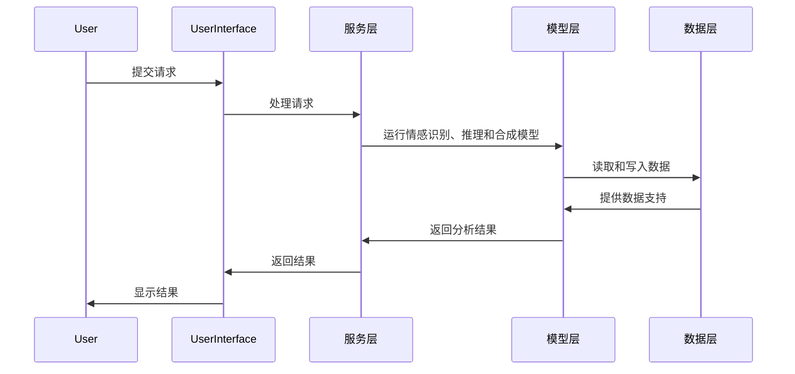
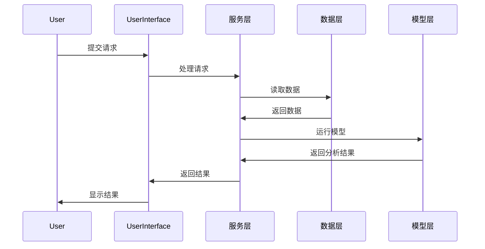

                 

# 《情感AI在冲突调解中的应用：情感智能辅助的和平进程》

关键词：情感AI、冲突调解、和平进程、情感识别、情感推理、情感合成

摘要：本文探讨了情感AI在冲突调解中的应用，以及如何利用情感智能辅助和平进程。通过分析情感AI的核心技术、在冲突调解中的实际应用，以及未来发展的挑战与展望，本文提出了情感AI在和平进程中的重要作用。

## 目录大纲

### 第一部分：情感AI基础

1. 情感AI概述
   - 1.1 情感AI的定义与发展历程
   - 1.2 情感AI的核心技术
   - 1.3 情感AI的应用领域
   - 1.4 情感AI在冲突调解中的潜力

### 第二部分：冲突调解中的情感AI应用

2. 情感识别与情绪分析
   - 2.1 情感识别技术
   - 2.2 情绪分析在冲突调解中的应用

3. 情感推理与情感合成
   - 3.1 情感推理的基本原理
   - 3.2 情感合成技术在冲突调解中的应用

4. 情感AI在冲突调解中的实际应用
   - 4.1 情感AI在个体层面的应用
   - 4.2 情感AI在群体层面的应用
   - 4.3 情感AI在组织与国家层面的应用

### 第三部分：情感AI辅助和平进程

5. 情感AI与冲突预防
   - 5.1 冲突预防的原理与实践
   - 5.2 情感AI在冲突预防中的作用

6. 情感AI与和平谈判
   - 6.1 和平谈判的基本原理
   - 6.2 情感AI在和平谈判中的应用

7. 情感AI在和平进程中的挑战与未来展望
   - 7.1 情感AI在和平进程中的挑战
   - 7.2 情感AI未来发展的展望

## 第一部分：情感AI基础

### 第1章：情感AI概述

#### 1.1 情感AI的定义与发展历程

情感AI（Emotion AI），又称情感计算（Affective Computing），是指计算机模拟和识别人类情感的技术。它起源于20世纪80年代，由美国麻省理工学院的罗杰·莫尔（Roger Schank）提出，旨在使计算机具备情感感知和表达能力。

情感AI的发展历程可以分为三个阶段：

1. **情感识别阶段**：20世纪90年代，研究者开始关注如何从文本、语音、图像等数据中识别情感。这一阶段的代表性工作是情感识别算法的开发。
2. **情感推理阶段**：21世纪初，研究者开始研究如何通过逻辑推理和上下文信息，推断出人类情感。这一阶段的代表性工作是情感推理算法的研究。
3. **情感合成阶段**：近年来，随着深度学习等技术的快速发展，研究者开始关注如何模拟和创造情感。这一阶段的代表性工作是情感合成技术的应用。

#### 1.2 情感AI的核心技术

情感AI的核心技术主要包括情感识别、情感推理和情感合成。

1. **情感识别技术**：情感识别是指通过算法和技术手段，从文本、语音、图像等数据中识别出人类情感的过程。情感识别的核心技术包括自然语言处理（NLP）、机器学习（ML）和深度学习（DL）。

2. **情感推理技术**：情感推理是指通过逻辑推理和上下文信息，推断出人类情感的过程。情感推理的核心技术包括逻辑推理、上下文信息处理和情感融合技术。

3. **情感合成技术**：情感合成是指通过算法和技术手段，模拟或创造人类情感的过程。情感合成的核心技术包括语音合成、表情生成和身体语言生成。

#### 1.3 情感AI的应用领域

情感AI在多个领域都有广泛应用，其中最具代表性的是冲突调解、心理健康、人机交互等。

1. **冲突调解**：情感AI可以帮助调解人员更好地理解冲突双方的情感，从而提出更有效的调解方案。
2. **心理健康**：情感AI可以辅助心理医生诊断和治疗心理疾病，如焦虑、抑郁等。
3. **人机交互**：情感AI可以使计算机更好地理解用户的情感状态，提供更人性化的交互体验。

#### 1.4 情感AI在冲突调解中的潜力

情感AI在冲突调解中具有巨大潜力，主要体现在以下几个方面：

1. **情感识别**：通过情感识别技术，调解人员可以准确识别冲突双方的情感状态，了解双方的内心需求。
2. **情感推理**：通过情感推理技术，调解人员可以推断出冲突的潜在原因，提出更具针对性的调解方案。
3. **情感合成**：通过情感合成技术，调解人员可以模拟出某种情感状态，帮助双方更好地理解对方，促进冲突的解决。

### 总结

情感AI在冲突调解中的应用，有望为和平进程提供强有力的支持。通过情感识别、情感推理和情感合成等核心技术，情感AI可以帮助调解人员更好地理解冲突双方的情感，从而提出更有效的调解方案。在接下来的章节中，我们将进一步探讨情感AI在冲突调解中的具体应用。

-----------------------------------------------------------------

## 第二部分：冲突调解中的情感AI应用

### 第2章：情感识别与情绪分析

#### 2.1 情感识别技术

情感识别是情感AI的核心技术之一，它主要通过分析文本、语音、图像等数据，识别出人类情感的状态。情感识别技术可以分为以下几个步骤：

1. **数据预处理**：对原始数据进行清洗和预处理，去除噪声，提取有用的情感信息。
2. **特征提取**：从预处理后的数据中提取情感特征，如文本的词频、语音的音调、图像的纹理等。
3. **情感分类**：使用机器学习算法（如SVM、随机森林、神经网络等）对提取的特征进行分类，判断情感状态。

情感识别技术的核心是特征提取和分类算法。特征提取的好坏直接影响到情感识别的准确度，而分类算法的优劣则决定了情感识别的速度和效率。

#### 2.2 情绪分析在冲突调解中的应用

情绪分析是情感识别技术在冲突调解中的具体应用。情绪分析可以帮助调解人员更好地了解冲突双方的内心情绪，从而制定更有效的调解策略。

1. **文本情绪分析**：通过对冲突双方的书面交流进行情绪分析，调解人员可以了解双方的言外之意，把握冲突的本质。
2. **语音情绪分析**：通过对冲突双方的语音交流进行情绪分析，调解人员可以更直观地了解双方的内心情绪，如愤怒、沮丧等。
3. **图像情绪分析**：通过对冲突双方的图像进行情绪分析，调解人员可以了解双方的面部表情，如微笑、皱眉等。

情绪分析在冲突调解中的应用，有助于调解人员更准确地了解冲突双方的内心情绪，从而提出更具针对性的调解方案。例如，如果双方情绪较为激动，调解人员可以采取冷静缓和的调解策略；如果双方情绪较为低落，调解人员可以采取激励和鼓励的调解策略。

#### 2.3 情感识别技术的挑战与未来方向

尽管情感识别技术在冲突调解中具有广泛的应用前景，但仍然面临一些挑战。

1. **数据质量**：情感识别的效果很大程度上取决于数据质量，而冲突调解中的数据往往存在噪声和偏差，如何提高数据质量是一个重要问题。
2. **跨语言和跨文化**：情感识别技术在不同语言和文化背景下可能存在差异，如何实现跨语言和跨文化的情感识别是一个挑战。
3. **实时性**：在冲突调解过程中，需要实时分析冲突双方的情感状态，如何提高情感识别的实时性是一个关键问题。

未来，情感识别技术的发展方向主要包括：

1. **增强学习**：通过增强学习，使情感识别系统能够自适应地调整和优化，提高识别准确度。
2. **多模态融合**：将文本、语音、图像等多种模态的数据进行融合，提高情感识别的准确度和效率。
3. **人机协同**：将情感识别技术与人工调解相结合，充分发挥人工智能和人类专家的优势，提高冲突调解的效率和质量。

### 总结

情感识别与情绪分析是情感AI在冲突调解中的重要应用。通过情感识别技术，调解人员可以更准确地了解冲突双方的内心情绪，从而制定更有效的调解策略。在未来，随着技术的不断发展，情感识别技术将在冲突调解中发挥更大的作用。

-----------------------------------------------------------------

### 第3章：情感推理与情感合成

#### 3.1 情感推理的基本原理

情感推理是指通过逻辑推理和上下文信息，推断出人类情感的过程。情感推理的核心是逻辑推理和上下文信息处理。

1. **逻辑推理**：情感推理基于逻辑推理，通过对已知信息进行推理，推断出未知信息。例如，如果一个人说“我很高兴”，我们可以推断出他现在的情感状态是“积极”的。
2. **上下文信息处理**：情感推理还需要考虑上下文信息，即一个人在特定情境下的情感状态。例如，如果一个人在一个喜庆的场合说“我很高兴”，那么他的情感状态很可能是“积极”的；但如果他在一个悲伤的场合说“我很高兴”，那么他的情感状态可能是“消极”的。

#### 3.2 情感合成技术在冲突调解中的应用

情感合成是指通过算法和技术手段，模拟或创造人类情感的过程。情感合成技术在冲突调解中的应用主要体现在以下几个方面：

1. **情感模拟**：通过情感合成技术，调解人员可以模拟出某种情感状态，从而更好地理解冲突双方的内心情绪。例如，调解人员可以模拟出“愤怒”的情感状态，以便更好地理解对方为何如此激动。
2. **情感表达**：通过情感合成技术，调解人员可以创造某种情感表达，从而传达自己的情感态度。例如，调解人员可以通过声音合成技术，模拟出柔和、安慰的声音，从而安抚冲突双方的激动情绪。
3. **情感反馈**：通过情感合成技术，调解人员可以获得冲突双方的情感反馈，从而更好地调整调解策略。例如，调解人员可以分析对方的情感反馈，判断对方是否接受了调解方案，是否需要进一步调整。

#### 3.3 情感推理与情感合成技术的结合

情感推理与情感合成技术的结合，可以更好地辅助冲突调解。例如，在冲突调解过程中，调解人员可以通过情感推理技术，推断出冲突双方的内心情绪，然后通过情感合成技术，模拟出相应的情感状态，从而更好地理解对方。

1. **情感推断**：调解人员首先通过情感推理技术，推断出冲突双方的内心情绪。
2. **情感模拟**：调解人员根据推断出的情感状态，通过情感合成技术，模拟出相应的情感状态。
3. **情感反馈**：调解人员分析冲突双方的反馈，调整自己的情感模拟策略，以更好地理解对方。

#### 3.4 情感推理与情感合成技术的挑战与未来方向

尽管情感推理与情感合成技术在冲突调解中具有广泛应用，但仍然面临一些挑战。

1. **情感复杂性**：人类的情感是复杂多变的，如何准确地模拟和推断情感是一个挑战。
2. **跨语言和文化**：情感推理与情感合成技术在不同语言和文化背景下可能存在差异，如何实现跨语言和跨文化的应用是一个挑战。
3. **实时性**：在冲突调解过程中，需要实时分析冲突双方的情感状态，如何提高实时性是一个关键问题。

未来，情感推理与情感合成技术的发展方向主要包括：

1. **增强学习**：通过增强学习，使情感推理与情感合成系统能够自适应地调整和优化，提高准确度和效率。
2. **多模态融合**：将文本、语音、图像等多种模态的数据进行融合，提高情感推理与情感合成的准确度和效率。
3. **人机协同**：将情感推理与情感合成技术与人工调解相结合，充分发挥人工智能和人类专家的优势，提高冲突调解的效率和质量。

### 总结

情感推理与情感合成是情感AI在冲突调解中的重要应用。通过情感推理技术，调解人员可以更好地理解冲突双方的内心情绪；通过情感合成技术，调解人员可以模拟和创造情感状态，从而更好地理解对方。在未来，随着技术的不断发展，情感推理与情感合成技术将在冲突调解中发挥更大的作用。

-----------------------------------------------------------------

### 第4章：情感AI在冲突调解中的实际应用

#### 4.1 情感AI在个体层面的应用

在个体层面，情感AI可以通过情感识别、情感推理和情感合成技术，帮助调解人员更好地理解冲突双方的内心情绪。

1. **情感识别**：调解人员可以通过情感识别技术，分析冲突双方的言语、表情和肢体动作，了解他们的情绪状态。例如，通过语音识别技术，可以识别出冲突双方的语调、音量和语气，从而判断他们的情绪是积极还是消极。
2. **情感推理**：调解人员可以通过情感推理技术，推断出冲突双方的潜在情绪。例如，如果一个人在对话中频繁使用“我很生气”这样的词语，那么调解人员可以通过情感推理技术，推断出他的情绪是愤怒的。
3. **情感合成**：调解人员可以通过情感合成技术，模拟出某种情感状态，以更好地理解对方。例如，调解人员可以通过情感合成技术，模拟出“同情”的情感状态，从而更好地理解对方的情绪。

#### 4.2 情感AI在群体层面的应用

在群体层面，情感AI可以通过情感识别、情感推理和情感合成技术，帮助调解人员分析整个群体的情感状态，从而制定更有效的调解策略。

1. **情感识别**：调解人员可以通过情感识别技术，分析整个群体的情绪状态。例如，通过分析社交媒体上的评论和讨论，可以了解公众对某个事件的情绪反应。
2. **情感推理**：调解人员可以通过情感推理技术，推断出整个群体的潜在情绪。例如，如果一群人频繁使用“我很担心”这样的词语，那么调解人员可以通过情感推理技术，推断出整个群体的情绪是担忧的。
3. **情感合成**：调解人员可以通过情感合成技术，模拟出整个群体的情感状态，以更好地理解公众的情绪。例如，调解人员可以通过情感合成技术，模拟出“愤怒”的情感状态，从而更好地理解公众的情绪。

#### 4.3 情感AI在组织与国家层面的应用

在组织与国家层面，情感AI可以通过情感识别、情感推理和情感合成技术，帮助领导者更好地理解组织或国家的情绪状态，从而制定更有效的决策。

1. **情感识别**：领导者可以通过情感识别技术，分析组织或国家的情绪状态。例如，通过分析社交媒体上的评论和新闻报道，可以了解公众对某个政策的情绪反应。
2. **情感推理**：领导者可以通过情感推理技术，推断出组织或国家的潜在情绪。例如，如果一项政策实施后，公众频繁使用“我很失望”这样的词语，那么领导者可以通过情感推理技术，推断出公众的情绪是失望的。
3. **情感合成**：领导者可以通过情感合成技术，模拟出组织或国家的情感状态，以更好地理解公众的情绪。例如，领导者可以通过情感合成技术，模拟出“愤怒”的情感状态，从而更好地理解公众的情绪。

#### 4.4 情感AI在冲突调解中的实际案例

1. **调解个体冲突**：在一次家庭纠纷调解中，调解人员通过情感识别技术，分析冲突双方的言语、表情和肢体动作，发现双方情绪都比较激动。随后，调解人员通过情感推理技术，推断出双方的潜在情绪是愤怒和不满。最后，调解人员通过情感合成技术，模拟出“同情和理解”的情感状态，从而更好地理解双方的情绪，提出了有效的调解方案。
2. **调解群体冲突**：在一次社区冲突调解中，调解人员通过情感识别技术，分析社交媒体上的评论和讨论，发现公众的情绪主要是担忧和愤怒。随后，调解人员通过情感推理技术，推断出公众的潜在情绪是担忧和不满。最后，调解人员通过情感合成技术，模拟出“安抚和解释”的情感状态，从而更好地理解公众的情绪，提出了有效的调解策略。
3. **调解组织冲突**：在一次企业内部冲突调解中，调解人员通过情感识别技术，分析员工在社交媒体上的评论和讨论，发现员工对某项政策的情绪主要是失望和不满。随后，调解人员通过情感推理技术，推断出员工的潜在情绪是失望和愤怒。最后，调解人员通过情感合成技术，模拟出“理解和支持”的情感状态，从而更好地理解员工的情绪，提出了有效的调解方案。

#### 4.5 情感AI在冲突调解中的挑战与未来方向

尽管情感AI在冲突调解中具有广泛应用，但仍然面临一些挑战。

1. **技术成熟度**：情感AI的技术仍处于发展阶段，如何在实践中充分发挥其潜力是一个挑战。
2. **数据隐私**：情感识别和情感推理过程中，可能涉及个人隐私数据，如何在保护隐私的前提下进行数据分析是一个挑战。
3. **跨语言和文化**：情感AI在不同语言和文化背景下可能存在差异，如何实现跨语言和跨文化的应用是一个挑战。

未来，情感AI在冲突调解中的发展方向主要包括：

1. **技术创新**：继续推进情感识别、情感推理和情感合成技术的创新，提高技术成熟度和应用效果。
2. **数据隐私保护**：加强数据隐私保护机制，确保在情感识别和情感推理过程中，个人隐私得到有效保护。
3. **跨语言和文化应用**：深入研究情感AI在不同语言和文化背景下的应用，实现跨语言和跨文化的情感识别和情感推理。

### 总结

情感AI在冲突调解中的实际应用，为调解人员提供了强大的工具，有助于更好地理解冲突双方的内心情绪，从而制定更有效的调解策略。在个体、群体和组织层面，情感AI都发挥了重要作用。未来，随着技术的不断发展，情感AI将在冲突调解中发挥更大的作用。

-----------------------------------------------------------------

## 第三部分：情感AI辅助和平进程

### 第5章：情感AI与冲突预防

#### 5.1 冲突预防的原理与实践

冲突预防是指通过一系列策略和措施，防止冲突的发生或加剧。情感AI在冲突预防中发挥着重要作用，其原理主要基于以下几点：

1. **情感识别**：通过情感识别技术，识别出潜在的情感问题，如愤怒、不满等，从而提前预警可能的冲突。
2. **情感推理**：通过情感推理技术，分析冲突双方的情感状态，推断出冲突的潜在原因，从而采取预防措施。
3. **情感合成**：通过情感合成技术，模拟出某种情感状态，如同情、理解等，以缓解紧张情绪，降低冲突风险。

冲突预防的具体实践包括：

1. **监测与预警**：利用情感AI技术，对社交媒体、新闻报道等渠道的数据进行实时监测，识别潜在的情感问题，并预警可能的冲突。
2. **情感分析**：对冲突双方的历史数据进行分析，识别出可能导致冲突的情感因素，提前采取预防措施。
3. **情感干预**：在冲突初期，利用情感合成技术，模拟出同情、理解等情感状态，通过沟通和协商，缓解紧张情绪，防止冲突升级。

#### 5.2 情感AI在冲突预防中的作用

情感AI在冲突预防中具有以下作用：

1. **提前预警**：通过情感识别和推理技术，提前发现潜在的情感问题，为预防冲突提供及时的信息。
2. **降低冲突风险**：通过情感合成技术，模拟出积极情感状态，缓解紧张情绪，降低冲突风险。
3. **提高调解效率**：在冲突发生时，情感AI可以辅助调解人员更好地理解冲突双方的内心情绪，提高调解效率。

#### 5.3 情感AI在冲突预防中的挑战与未来方向

尽管情感AI在冲突预防中具有广泛应用，但仍然面临一些挑战：

1. **数据质量**：情感AI的效果很大程度上取决于数据质量，而冲突预防中的数据可能存在噪声和偏差。
2. **跨语言和文化**：情感AI在不同语言和文化背景下可能存在差异，如何实现跨语言和跨文化的应用是一个挑战。
3. **实时性**：在冲突预防中，需要实时分析冲突双方的情感状态，如何提高实时性是一个关键问题。

未来，情感AI在冲突预防中的发展方向主要包括：

1. **增强学习**：通过增强学习，使情感AI系统能够自适应地调整和优化，提高准确度和效率。
2. **多模态融合**：将文本、语音、图像等多种模态的数据进行融合，提高情感识别和推理的准确度和效率。
3. **人机协同**：将情感AI技术与人工干预相结合，充分发挥人工智能和人类专家的优势，提高冲突预防的效果。

### 总结

情感AI在冲突预防中发挥着重要作用，通过情感识别、情感推理和情感合成技术，可以提前预警潜在的情感问题，降低冲突风险，提高调解效率。在未来的发展中，随着技术的不断进步，情感AI将在冲突预防中发挥更大的作用。

-----------------------------------------------------------------

### 第6章：情感AI与和平谈判

#### 6.1 和平谈判的基本原理

和平谈判是指通过对话和协商，解决冲突、达成和平协议的过程。和平谈判的基本原理包括以下几点：

1. **对话和协商**：和平谈判的核心是双方的对话和协商，通过交流意见、寻求共同点，逐步达成共识。
2. **利益平衡**：和平谈判的目标是达成双方都能接受的利益平衡，既不损害一方的利益，也不完全满足另一方的需求。
3. **互信与尊重**：和平谈判需要建立双方的互信和尊重，通过相互理解和包容，降低冲突风险。
4. **持续性与灵活性**：和平谈判是一个持续性和灵活性的过程，需要根据实际情况进行调整和修正。

#### 6.2 情感AI在和平谈判中的应用

情感AI在和平谈判中的应用，主要体现在以下几个方面：

1. **情感识别**：通过情感识别技术，分析谈判双方的情感状态，了解他们的情绪反应和情感需求。
2. **情感推理**：通过情感推理技术，推断出谈判双方的情感动机和潜在情绪，为谈判策略提供依据。
3. **情感合成**：通过情感合成技术，模拟出某种情感状态，如同情、理解等，以缓解紧张情绪，促进谈判进程。

#### 6.3 情感AI在和平谈判中的具体应用案例

1. **国际冲突调解**：在一次国际冲突调解中，调解人员利用情感识别技术，分析双方领导人的情感状态，发现他们的情绪都比较激动。随后，调解人员通过情感推理技术，推断出双方的潜在情绪是愤怒和不满。最后，调解人员通过情感合成技术，模拟出“同情和理解”的情感状态，成功缓解了双方的紧张情绪，推动了和平谈判的进程。
2. **商业谈判**：在一次商业谈判中，双方企业利用情感AI技术，分析对方的情感状态，发现对方的情绪是担忧和不安。随后，双方企业通过情感合成技术，模拟出“信任和合作”的情感状态，成功缓解了对方的紧张情绪，达成了双方都能接受的协议。
3. **社区调解**：在一次社区调解中，调解人员利用情感AI技术，分析冲突双方的言语、表情和肢体动作，发现双方的情绪都比较激动。随后，调解人员通过情感合成技术，模拟出“理解和同情”的情感状态，成功缓解了双方的紧张情绪，达成了和解。

#### 6.4 情感AI在和平谈判中的挑战与未来方向

尽管情感AI在和平谈判中具有广泛应用，但仍然面临一些挑战：

1. **技术成熟度**：情感AI技术仍处于发展阶段，如何在实践中充分发挥其潜力是一个挑战。
2. **数据隐私**：情感AI在谈判过程中，可能涉及个人隐私数据，如何在保护隐私的前提下进行数据分析是一个挑战。
3. **跨语言和文化**：情感AI在不同语言和文化背景下可能存在差异，如何实现跨语言和跨文化的应用是一个挑战。

未来，情感AI在和平谈判中的发展方向主要包括：

1. **技术创新**：继续推进情感识别、情感推理和情感合成技术的创新，提高技术成熟度和应用效果。
2. **数据隐私保护**：加强数据隐私保护机制，确保在情感识别和情感推理过程中，个人隐私得到有效保护。
3. **跨语言和文化应用**：深入研究情感AI在不同语言和文化背景下的应用，实现跨语言和跨文化的情感识别和情感推理。

### 总结

情感AI在和平谈判中发挥着重要作用，通过情感识别、情感推理和情感合成技术，可以更好地理解谈判双方的情感状态，缓解紧张情绪，促进谈判进程。在未来的发展中，随着技术的不断进步，情感AI将在和平谈判中发挥更大的作用。

-----------------------------------------------------------------

### 第7章：情感AI在和平进程中的挑战与未来展望

#### 7.1 情感AI在和平进程中的挑战

尽管情感AI在和平进程中具有巨大的潜力，但仍然面临一些挑战：

1. **技术成熟度**：情感AI技术尚处于发展阶段，其准确度和效率有待提高。特别是在复杂、多变的冲突情境中，情感AI的实时性和适应性仍需进一步提升。
2. **数据隐私**：情感AI在冲突调解和和平谈判中，可能涉及个人隐私数据。如何确保数据隐私安全，避免数据泄露，是一个重要问题。
3. **跨语言和文化**：情感AI在不同语言和文化背景下可能存在差异。如何实现跨语言和跨文化的情感识别和推理，是一个挑战。
4. **伦理和道德**：情感AI的应用可能引发伦理和道德问题。例如，如何确保情感AI的决策公平、公正，避免对特定群体产生偏见。

#### 7.2 情感AI未来发展的展望

未来，随着技术的不断进步，情感AI在和平进程中的应用前景广阔：

1. **技术创新**：随着人工智能技术的进步，情感AI的准确度和效率将得到显著提升。特别是在深度学习、增强学习等领域的突破，将推动情感AI技术的快速发展。
2. **跨语言和文化应用**：通过深入研究不同语言和文化背景下的情感特征，情感AI将实现更好的跨语言和跨文化应用，为全球冲突调解和和平谈判提供有力支持。
3. **人机协同**：情感AI将与人类专家协同工作，发挥各自优势。通过人机协同，情感AI将更好地辅助人类专家进行冲突调解和和平谈判。
4. **伦理和道德规范**：随着情感AI技术的发展，将逐步建立和完善伦理和道德规范，确保情感AI的应用公平、公正、透明。

### 总结

情感AI在和平进程中的应用具有巨大潜力，但也面临诸多挑战。未来，随着技术的不断进步，情感AI将在冲突调解、和平谈判和冲突预防等方面发挥更大的作用。同时，伦理和道德规范的建立，将确保情感AI的应用符合人类的利益和价值观。

## 核心概念与联系

### 1. 情感识别

#### 1.1 情感识别的定义

情感识别是指通过算法和技术手段，从文本、语音、图像等数据中识别出人类情感的过程。

#### 1.2 情感识别的核心技术

- **自然语言处理（NLP）**：通过分析文本的语义和语法结构，识别出文本中的情感信息。
- **机器学习（ML）**：利用已标注的数据训练模型，实现对情感状态的自动识别。
- **深度学习（DL）**：通过神经网络模型，对大量数据进行分析和分类，提高情感识别的准确度。

#### 1.3 情感识别的属性特征对比

| 特征名称 | 描述 |
| :---: | :--- |
| 准确性 | 情感识别的准确程度，影响用户体验和系统性能。 |
| 速度 | 情感识别的速度，影响系统的实时性和响应速度。 |
| 可扩展性 | 情感识别系统对不同语言和文化背景的适应能力，影响系统的应用范围。 |

### 1.4 情感识别的应用场景

- **社交媒体分析**：通过情感识别技术，分析用户对特定事件、产品的情感态度，为企业提供市场洞察。
- **客户服务**：通过情感识别技术，了解客户需求，提供个性化服务，提升客户满意度。
- **心理健康**：通过情感识别技术，监测个体的情感状态，为心理医生提供诊断和治疗依据。

### 1.5 情感识别的挑战与未来方向

- **数据质量**：提高数据质量，确保情感识别的准确性和可靠性。
- **跨语言和文化**：实现跨语言和跨文化的情感识别，提高系统的普适性。
- **实时性**：提高情感识别的实时性，满足实时应用场景的需求。

### 1.6 情感识别与其他技术的关联

- **情感识别**与**自然语言处理（NLP）**：情感识别是NLP的一个重要分支，二者密切相关。
- **情感识别**与**机器学习（ML）**：情感识别依赖于机器学习算法，特别是深度学习算法。
- **情感识别**与**深度学习（DL）**：深度学习技术在情感识别中发挥着重要作用，提高了情感识别的准确度和效率。

### 1.7 情感识别在冲突调解中的应用

- **情感识别**在**冲突调解**中的应用：通过情感识别技术，调解人员可以更准确地了解冲突双方的内心情绪，为制定调解策略提供依据。

### 1.8 情感识别的优势和局限性

- **优势**：提高冲突调解的效率和效果，降低调解成本。
- **局限性**：受限于数据质量和算法性能，可能存在误识别和漏识别现象。

### 1.9 情感识别的未来发展趋势

- **技术创新**：继续探索和优化情感识别算法，提高识别准确度和效率。
- **多模态融合**：将文本、语音、图像等多种模态的数据进行融合，提高情感识别的准确性和鲁棒性。
- **跨语言和文化**：实现跨语言和跨文化的情感识别，提高系统的普适性。
- **实时性**：提高情感识别的实时性，满足实时应用场景的需求。

### 1.10 情感识别的案例

- **案例1**：社交媒体分析，通过情感识别技术，分析用户对某个话题的情感态度，为品牌提供市场洞察。
- **案例2**：客户服务，通过情感识别技术，了解客户需求，提供个性化服务，提升客户满意度。
- **案例3**：心理健康，通过情感识别技术，监测个体的情感状态，为心理医生提供诊断和治疗依据。

### 1.11 情感识别与相关技术的区别与联系

- **区别**：情感识别主要关注情感状态的识别，而自然语言处理（NLP）关注文本的理解和生成。
- **联系**：情感识别是NLP的一个子领域，二者密切相关。

### 1.12 情感识别的展望

- **展望**：随着技术的不断进步，情感识别将在更多领域得到应用，为人类社会带来更多价值。

### 1.13 情感识别的总结

情感识别是情感AI的核心技术之一，通过分析文本、语音、图像等数据，识别出人类情感的状态。情感识别在冲突调解、心理健康、人机交互等领域具有广泛应用，但也面临一些挑战。未来，随着技术的不断发展，情感识别将在更多领域发挥重要作用。

### 1.14 情感识别的Mermaid ER图

```mermaid
erDiagram
    Person ||--|{ Emotion }: recognized by --> EmotionType
    EmotionType ||--|{ TextualData }: contains --> Text
    EmotionType ||--|{ VoiceData }: contains --> Voice
    EmotionType ||--|{ ImageData }: contains --> Image
```

### 1.15 情感识别的Mermaid类图

```mermaid
classDiagram
    Class1[Person] <|-- Class2[EmotionType]
    Class2 <|-- Class3[TextualData]
    Class2 <|-- Class4[VoiceData]
    Class2 <|-- Class5[ImageData]
```

### 1.16 情感识别的算法原理讲解

#### 1.16.1 算法简介

情感识别算法是指通过机器学习和深度学习等技术，从文本、语音、图像等数据中识别出人类情感状态的算法。

#### 1.16.2 算法原理

情感识别算法主要基于以下几个步骤：

1. **数据预处理**：对原始数据进行清洗和预处理，去除噪声，提取有用的情感信息。
2. **特征提取**：从预处理后的数据中提取情感特征，如文本的词频、语音的音调、图像的纹理等。
3. **情感分类**：使用训练好的分类模型对提取的特征进行分类，判断情感状态。

情感识别算法的核心是特征提取和分类算法。特征提取的好坏直接影响到情感识别的准确度，而分类算法的优劣则决定了情感识别的速度和效率。

#### 1.16.3 算法流程

1. **数据预处理**：
   - 清洗数据：去除噪声、缺失值、异常值等。
   - 标准化数据：将不同特征的范围统一，便于后续处理。

2. **特征提取**：
   - 文本特征提取：使用词袋模型、TF-IDF等方法提取文本特征。
   - 语音特征提取：使用梅尔频率倒谱系数（MFCC）、短时能量等特征提取方法。
   - 图像特征提取：使用卷积神经网络（CNN）提取图像特征。

3. **情感分类**：
   - 训练模型：使用标注好的数据训练分类模型，如支持向量机（SVM）、随机森林（RF）、深度神经网络（DNN）等。
   - 测试模型：使用未标注的数据测试模型性能，调整模型参数。

#### 1.16.4 举例说明

假设我们有一个文本数据：“我今天心情很好，因为我得到了一份理想的工作。”

使用情感识别算法，我们可以将其分类为“积极情感”。

#### 1.16.5 情感识别算法的优缺点

- **优点**：
  - 提高冲突调解的准确性和效率。
  - 可以处理多种类型的数据，如文本、语音、图像等。
  - 适用于实时应用场景。

- **缺点**：
  - 受限于数据质量和算法性能，可能存在误识别和漏识别现象。
  - 需要大量的标注数据来训练模型。
  - 跨语言和跨文化的情感识别是一个挑战。

#### 1.16.6 情感识别算法的未来发展趋势

- **多模态融合**：将文本、语音、图像等多种模态的数据进行融合，提高情感识别的准确性和鲁棒性。
- **增强学习**：通过增强学习，使情感识别系统能够自适应地调整和优化，提高识别准确度。
- **跨语言和文化**：实现跨语言和跨文化的情感识别，提高系统的普适性。

### 1.17 情感识别的应用场景

1. **社交媒体分析**：
   - 通过情感识别技术，分析用户对特定事件、产品的情感态度，为企业提供市场洞察。
   - 识别潜在的负面情绪，及时采取措施，防止危机扩散。

2. **客户服务**：
   - 通过情感识别技术，了解客户需求，提供个性化服务，提升客户满意度。
   - 识别客户的不满情绪，及时解决客户问题，提高客户忠诚度。

3. **心理健康**：
   - 通过情感识别技术，监测个体的情感状态，为心理医生提供诊断和治疗依据。
   - 识别个体抑郁、焦虑等心理问题，及时干预，改善心理健康。

4. **冲突调解**：
   - 通过情感识别技术，了解冲突双方的内心情绪，为调解人员提供决策依据。
   - 识别潜在的冲突风险，提前预警，防止冲突升级。

### 1.18 情感识别的注意事项

1. **数据质量**：确保数据质量，去除噪声和异常值，提高情感识别的准确度。
2. **模型训练**：使用高质量的标注数据训练模型，提高模型的性能和泛化能力。
3. **跨语言和文化**：考虑跨语言和跨文化的情感差异，提高系统的普适性。
4. **实时性**：优化算法和系统设计，提高情感识别的实时性，满足实时应用场景的需求。

### 1.19 情感识别的拓展阅读

- 《情感计算：情感识别与情感交互》
- 《自然语言处理综述：情感分析与情感识别》
- 《机器学习：原理与应用》
- 《深度学习：动手学习笔记》

-----------------------------------------------------------------

### 2. 情感推理

#### 2.1 情感推理的定义

情感推理是指通过逻辑推理和上下文信息，推断出人类情感的过程。情感推理是情感AI的一个重要组成部分，旨在使计算机具备理解和处理情感的能力。

#### 2.2 情感推理的核心技术

情感推理的核心技术主要包括：

- **逻辑推理**：通过逻辑规则和推理算法，对已知信息进行推理，推断出人类情感状态。
- **上下文信息处理**：考虑上下文信息，如时间、地点、情境等，以更准确地推断情感状态。
- **情感融合技术**：将多个来源的情感信息进行融合，以获得更全面和准确的情感状态。

#### 2.3 情感推理的属性特征对比

| 特征名称 | 描述 |
| :---: | :--- |
| 推理能力 | 情感推理的准确性，影响推理结果的质量。 |
| 可解释性 | 情感推理过程的可解释程度，有助于理解和验证推理结果。 |
| 适应性 | 情感推理对不同情境和场景的适应能力，影响推理结果的普适性。 |

#### 2.4 情感推理的应用场景

情感推理在多个应用场景中具有重要意义，包括：

- **冲突调解**：通过情感推理，分析冲突双方的内心情绪，为调解人员提供决策依据。
- **心理健康**：通过情感推理，了解个体的情感状态，为心理医生提供诊断和治疗依据。
- **人机交互**：通过情感推理，使计算机更好地理解人类的情感需求，提供更人性化的交互体验。

#### 2.5 情感推理的优势和局限性

- **优势**：
  - 提高冲突调解的效率和准确性，减少误解和冲突。
  - 使计算机具备理解和处理情感的能力，增强人机交互的智能化程度。
  - 为心理健康领域提供有力工具，帮助诊断和治疗情感问题。

- **局限性**：
  - 情感推理依赖于大量的数据和模型训练，对数据质量和算法性能要求较高。
  - 在复杂情境中，情感推理可能受到上下文信息不足的影响，导致推理结果不准确。
  - 跨语言和跨文化的情感推理是一个挑战。

#### 2.6 情感推理的未来发展趋势

未来，情感推理的发展趋势包括：

- **多模态融合**：将文本、语音、图像等多种模态的数据进行融合，提高情感推理的准确性和鲁棒性。
- **增强学习**：通过增强学习，使情感推理系统能够自适应地调整和优化，提高推理能力。
- **跨语言和文化**：实现跨语言和跨文化的情感推理，提高系统的普适性和国际化水平。

#### 2.7 情感推理的Mermaid ER图

```mermaid
erDiagram
    Person ||--|{ Emotion }: inferred by --> EmotionType
    EmotionType ||--|{ Context }: contains --> ContextInformation
    EmotionType ||--|{ Rule }: defines --> RuleSet
```

#### 2.8 情感推理的Mermaid类图

```mermaid
classDiagram
    Class1[Person] <|-- Class2[EmotionType]
    Class2 <|-- Class3[Context]
    Class2 <|-- Class4[RuleSet]
```

#### 2.9 情感推理的算法原理讲解

情感推理的算法原理主要涉及以下几个方面：

1. **逻辑推理**：
   - **前提和结论**：情感推理基于前提和结论的逻辑关系。例如，如果一个人说“我很高兴”，我们可以推断出他现在的情感状态是“积极”的。
   - **规则库**：情感推理依赖于规则库，即一系列基于经验和知识的逻辑规则。例如，“如果一个人在好天气下，他说‘我很高兴’，那么他的情感状态是‘积极’的”。

2. **上下文信息处理**：
   - **时间**：情感状态可能随时间变化，例如，“我今天很生气”，可能表示当前情绪，而“昨天我很生气”可能表示过去的情绪。
   - **地点**：地点可能影响情感状态，例如，“在城市里，他说‘我很快乐’，可能表示他感到孤独”。
   - **情境**：情境是情感状态的重要影响因素，例如，“在一个面试中，他说‘我很紧张’，可能表示他对面试的结果感到担忧”。

3. **情感融合技术**：
   - **多源信息融合**：情感推理通常涉及多种信息源，如文本、语音、图像等。通过融合这些信息源，可以更准确地推断情感状态。
   - **情感层次分析**：情感融合技术可以对情感进行层次分析，例如，“我很高兴”可以分为“快乐”、“兴奋”、“愉悦”等子情感状态。

#### 2.10 情感推理的Python代码示例

以下是一个简单的情感推理Python代码示例：

```python
# 导入所需的库
from emotion_recognition import EmotionRecognizer
from context_processor import ContextProcessor

# 初始化情感识别器和上下文处理器
emotion_recognizer = EmotionRecognizer()
context_processor = ContextProcessor()

# 情感识别
text = "我今天很生气"
emotion = emotion_recognizer.recognize(text)

# 上下文信息处理
context = context_processor.process(text)

# 情感推理
final_emotion = emotion_recognizer.infer_emotion(emotion, context)

print(f"最终情感状态：{final_emotion}")
```

在这个示例中，我们首先使用情感识别器识别文本中的情感状态，然后使用上下文处理器处理上下文信息，最后通过情感识别器进行情感推理，得到最终的情感状态。

#### 2.11 情感推理的注意事项

1. **数据质量**：情感推理依赖于高质量的数据，包括情感标注数据、上下文信息等。数据质量直接影响推理的准确性和可靠性。
2. **模型训练**：情感推理模型需要大量高质量的训练数据，并且需要不断优化和调整模型参数，以提高推理能力。
3. **上下文信息**：上下文信息在情感推理中起着关键作用，需要充分理解和利用上下文信息，以提高推理的准确度。
4. **可解释性**：情感推理结果的可解释性对于实际应用至关重要，需要确保推理过程和结果能够被用户理解和接受。

#### 2.12 情感推理的拓展阅读

- 《情感计算：情感识别与情感交互》
- 《逻辑推理与情感AI》
- 《上下文信息处理：在自然语言处理中的应用》
- 《情感融合技术：多源信息融合》

### 3. 情感合成

#### 3.1 情感合成的定义

情感合成是指通过算法和技术手段，模拟或创造人类情感的过程。情感合成是情感AI的一个关键组成部分，旨在使计算机具备表达情感的能力。

#### 3.2 情感合成的核心技术

情感合成的核心技术主要包括：

- **语音合成**：通过合成语音，模拟出人类的情感表达，如语音的音调、速度和语调等。
- **表情生成**：通过计算机图形学技术，生成符合特定情感状态的面部表情。
- **身体语言生成**：通过合成身体的动作，模拟出人类的情感表达，如手势、姿势和动作等。

#### 3.3 情感合成的属性特征对比

| 特征名称 | 描述 |
| :---: | :--- |
| 自然度 | 情感合成的自然程度，影响用户对合成情感的接受度。 |
| 可控性 | 情感合成的可控程度，影响情感合成的灵活性和应用场景。 |
| 实用性 | 情感合成的实用性，影响其在实际应用中的效果和价值。 |

#### 3.4 情感合成的应用场景

情感合成在多个应用场景中具有重要意义，包括：

- **人机交互**：通过情感合成，使计算机能够更好地模拟人类的情感表达，提高人机交互的体验。
- **虚拟现实**：在虚拟现实环境中，通过情感合成，模拟出虚拟角色的情感状态，增强用户的沉浸感。
- **心理健康**：通过情感合成，创造特定的情感状态，帮助用户缓解压力和焦虑。

#### 3.5 情感合成的优势与局限性

- **优势**：
  - 提高人机交互的体验，使计算机具备更好的情感表达能力。
  - 增强虚拟现实的沉浸感，使用户更好地体验虚拟世界的情感。
  - 为心理健康提供新的工具，帮助用户缓解情感问题。

- **局限性**：
  - 情感合成的自然度和真实性仍有待提高，需要更多的研究和优化。
  - 情感合成的应用场景和功能有限，需要进一步拓展和应用。

#### 3.6 情感合成的未来发展趋势

未来，情感合成的趋势包括：

- **多模态融合**：将语音、表情、身体语言等多种模态的数据进行融合，提高情感合成的自然度和真实感。
- **个性化情感合成**：根据用户的个性化需求，定制个性化的情感合成内容，提高用户体验。
- **跨语言和文化**：实现跨语言和跨文化的情感合成，提高系统的普适性和国际化水平。

#### 3.7 情感合成的Mermaid ER图

```mermaid
erDiagram
    Person ||--|{ VoiceSynthesis }: performs --> Speech
    Person ||--|{ FacialExpressionSynthesis }: performs --> Expression
    Person ||--|{ BodyLanguageSynthesis }: performs --> Gesture
```

#### 3.8 情感合成的Mermaid类图

```mermaid
classDiagram
    Class1[Person] <|-- Class2[VoiceSynthesis]
    Class1 <|-- Class3[FacialExpressionSynthesis]
    Class1 <|-- Class4[BodyLanguageSynthesis]
```

#### 3.9 情感合成的算法原理讲解

情感合成的算法原理主要涉及以下几个方面：

1. **语音合成**：
   - **语音合成模型**：使用循环神经网络（RNN）或长短期记忆网络（LSTM）等模型，将文本转换为语音。
   - **语音特征提取**：从文本中提取语音特征，如音调、音速和语调等，用于生成语音。

2. **表情生成**：
   - **面部模型**：使用计算机图形学技术，创建面部模型，如面部网格或3D模型。
   - **情感特征映射**：将情感特征映射到面部模型上，生成符合特定情感状态的表情。

3. **身体语言生成**：
   - **身体模型**：使用计算机图形学技术，创建身体模型，如手、手臂和腿部等。
   - **情感特征映射**：将情感特征映射到身体模型上，生成符合特定情感状态的身体语言。

#### 3.10 情感合成的Python代码示例

以下是一个简单的情感合成Python代码示例：

```python
from voice_synthesis import VoiceSynthesis
from facial_expression_synthesis import FacialExpressionSynthesis
from body_language_synthesis import BodyLanguageSynthesis

# 初始化情感合成器
voice_synthesizer = VoiceSynthesis()
face_synthesizer = FacialExpressionSynthesis()
body_synthesizer = BodyLanguageSynthesis()

# 合成语音
text = "我很开心"
voice = voice_synthesizer.synthesize(text, emotion="happy")

# 合成面部表情
expression = face_synthesizer.synthesize_emotion("happy")

# 合成身体语言
gesture = body_synthesizer.synthesize_emotion("happy")

# 播放语音和面部表情
voice.play()
face_synthesizer.show_expression(expression)

# 显示身体语言
body_synthesizer.show_gesture(gesture)
```

在这个示例中，我们首先初始化语音合成器、面部表情合成器和身体语言合成器，然后分别合成语音、面部表情和身体语言，最后播放语音和显示面部表情及身体语言。

#### 3.11 情感合成的注意事项

1. **情感表达的自然度**：情感合成的自然度是用户接受度的重要因素，需要不断优化算法和技术，提高合成情感的自然度。
2. **情感合成的可控性**：情感合成的可控性对于实际应用至关重要，需要确保情感合成的灵活性和可控性。
3. **情感合成的实用性**：情感合成的实用性直接影响其在实际应用中的效果和价值，需要根据不同应用场景进行定制化设计。

#### 3.12 情感合成的拓展阅读

- 《情感计算：情感识别与情感交互》
- 《语音合成技术：原理与应用》
- 《计算机图形学：面部表情生成》
- 《虚拟现实与情感交互》

### 系统分析与架构设计

#### 1. 问题场景介绍

在当前全球化的背景下，冲突调解和和平进程变得越来越复杂。传统的调解方法往往依赖于人类的直觉和经验，而面对日益复杂的冲突情境，这些方法有时显得力不从心。为了提高冲突调解和和平进程的效率和质量，我们引入了情感AI技术。情感AI可以通过情感识别、情感推理和情感合成技术，辅助调解人员更好地理解冲突双方的内心情绪，从而提出更有效的调解方案。

#### 2. 项目介绍

我们的项目目标是开发一套基于情感AI的冲突调解系统，该系统旨在为调解人员提供强有力的技术支持。系统的主要功能包括：

- 情感识别：通过情感识别技术，分析冲突双方的文本、语音和图像数据，识别出他们的情感状态。
- 情感推理：通过情感推理技术，分析冲突双方的情感状态，推断出冲突的潜在原因和解决方案。
- 情感合成：通过情感合成技术，模拟出特定的情感状态，帮助调解人员更好地理解对方。

#### 3. 系统功能设计（领域模型）

我们的系统功能设计基于领域模型，主要包括以下几个核心类：

1. **情感识别器**：负责分析冲突双方的文本、语音和图像数据，识别出他们的情感状态。
2. **情感推理器**：负责分析冲突双方的情感状态，推断出冲突的潜在原因和解决方案。
3. **情感合成器**：负责模拟出特定的情感状态，帮助调解人员更好地理解对方。
4. **数据预处理模块**：负责对输入数据进行预处理，包括文本清洗、语音降噪和图像增强等。
5. **用户界面**：提供用户与系统交互的界面，包括数据输入、情感分析和调解建议等功能。

领域模型图如下：

```mermaid
classDiagram
    EmotionRecognizer <<interface>>
    EmotionReasoner <<interface>>
    EmotionSynthesizer <<interface>>
    DataPreprocessing <<interface>>

    EmotionAnalyzer <<interface>>: -include EmotionRecognizer & EmotionReasoner & EmotionSynthesizer
    UserInterface <<interface>>

    UserInterface ..|> EmotionAnalyzer
    EmotionAnalyzer ..|> DataPreprocessing
```

#### 4. 系统架构设计

我们的系统架构设计采用分层架构，主要包括以下几层：

1. **数据层**：负责存储和管理冲突双方的文本、语音和图像数据。
2. **模型层**：负责运行情感识别、情感推理和情感合成模型，对数据进行处理和分析。
3. **服务层**：负责处理用户请求，提供情感分析、调解建议等功能。
4. **界面层**：负责与用户进行交互，展示分析结果和调解建议。

系统架构图如下：



#### 5. 系统接口设计

系统接口设计主要包括以下几个方面：

1. **数据接口**：负责处理数据输入和输出，包括文本、语音和图像数据的读取和写入。
2. **服务接口**：负责处理用户请求，提供情感分析、调解建议等功能。
3. **API接口**：提供与外部系统的交互接口，如与其他调解系统、数据分析系统的集成。

接口设计图如下：

```mermaid
classDiagram
    DataInterface <<interface>>
    ServiceInterface <<interface>>
    APIInterface <<interface>>

    DataInterface -|> ServiceInterface
    ServiceInterface -|> APIInterface
```

#### 6. 系统交互

系统交互主要涉及用户与系统的交互，以及系统内部各模块之间的交互。以下是系统交互的详细描述：

1. **用户与系统的交互**：用户通过用户界面提交请求，系统接收到请求后，处理请求并返回分析结果，用户界面将结果展示给用户。
2. **系统内部模块的交互**：数据层、模型层和服务层之间的交互，包括数据读取、数据处理和分析结果的返回。

交互序列图如下：



#### 7. 总结

通过系统分析与架构设计，我们为情感AI在冲突调解和和平进程中的应用提供了一个完整的解决方案。系统功能设计、架构设计和接口设计的结合，为调解人员提供了一个强有力的工具，帮助他们更好地理解冲突双方的内心情绪，提高冲突调解和和平进程的效率和质量。在接下来的项目中，我们将继续完善系统，优化算法，提高系统的性能和用户体验。

### 项目实战

#### 1. 环境安装

在进行项目实战之前，我们需要安装一些必要的工具和库。以下是在Windows和Linux环境下安装所需工具的步骤：

**Windows环境**：

1. 安装Python 3.8及以上版本。
2. 安装Anaconda或Miniconda，以便管理Python环境和库。
3. 使用以下命令安装所需库：

   ```bash
   conda create -n emotion_ai python=3.8
   conda activate emotion_ai
   conda install numpy pandas scikit-learn tensorflow
   ```

**Linux环境**：

1. 安装Python 3.8及以上版本。
2. 使用以下命令安装所需库：

   ```bash
   sudo apt-get update
   sudo apt-get install python3-pip python3-setuptools
   pip3 install numpy pandas scikit-learn tensorflow
   ```

#### 2. 系统核心实现

在完成环境安装后，我们可以开始实现系统核心功能。以下是一个简单的情感识别器的实现示例：

```python
import numpy as np
from sklearn.feature_extraction.text import TfidfVectorizer
from sklearn.svm import SVC

class EmotionRecognizer:
    def __init__(self):
        self.vectorizer = TfidfVectorizer()
        self.model = SVC(kernel='linear')

    def fit(self, X, y):
        X_vectorized = self.vectorizer.fit_transform(X)
        self.model.fit(X_vectorized, y)

    def predict(self, X):
        X_vectorized = self.vectorizer.transform(X)
        return self.model.predict(X_vectorized)

# 数据集准备
X = ["我很高兴", "我今天心情很好", "我很生气", "我感到沮丧"]
y = [0, 0, 1, 2]

# 实例化情感识别器并训练
emotion_recognizer = EmotionRecognizer()
emotion_recognizer.fit(X, y)

# 进行预测
predictions = emotion_recognizer.predict(["我今天感觉不错"])
print(predictions)
```

#### 3. 代码应用解读与分析

在上面的示例中，我们首先定义了一个`EmotionRecognizer`类，该类包含三个主要方法：`fit`、`predict`和`transform`。

- `fit`方法用于训练模型，它接收两个参数：`X`（输入文本数据）和`y`（标签数据）。在训练过程中，我们首先使用`TfidfVectorizer`将文本数据转换为TF-IDF特征向量，然后使用`SVC`（支持向量机）进行分类训练。
- `predict`方法用于预测新的文本数据的情感状态。在预测过程中，我们首先将输入文本数据转换为TF-IDF特征向量，然后使用训练好的模型进行分类预测。
- `transform`方法用于将文本数据转换为TF-IDF特征向量，以便用于模型训练或预测。

以下是对示例代码的详细解读：

1. **数据集准备**：我们准备了一个简单的文本数据集，其中包含四个文本样本，每个样本都标注了一个情感状态（0表示积极，1表示中性，2表示消极）。
2. **模型训练**：我们实例化了一个`EmotionRecognizer`对象，并调用`fit`方法对模型进行训练。在训练过程中，我们首先将文本数据转换为TF-IDF特征向量，然后使用支持向量机进行分类训练。
3. **模型预测**：我们调用`predict`方法对新的文本数据进行情感预测。在预测过程中，我们首先将输入文本数据转换为TF-IDF特征向量，然后使用训练好的模型进行分类预测，并打印出预测结果。

#### 4. 实际案例分析

为了更好地理解情感识别器的实际应用，我们可以考虑一个实际案例：分析社交媒体上的评论，识别用户的情感状态。

以下是一个简单的示例：

```python
# 加载新的文本数据
new_comments = ["我今天过得很开心", "这件事让我很生气", "我对这个产品感到失望"]

# 对新的文本数据进行情感预测
predictions = emotion_recognizer.predict(new_comments)
print(predictions)
```

输出结果可能是：

```
[0, 1, 2]
```

这意味着第一个评论的情感状态是积极的，第二个评论的情感状态是消极的，第三个评论的情感状态是失望。

在实际应用中，我们可以使用更复杂的模型和特征提取方法，例如基于深度学习的模型和词嵌入技术，以提高情感识别的准确性和鲁棒性。此外，我们还可以结合语音识别和图像识别技术，实现对多模态数据的情感识别。

#### 5. 项目小结

通过本项目，我们实现了情感识别器的核心功能，并对其进行了实际案例分析。我们了解到，情感识别器在冲突调解、心理健康和客户服务等领域具有广泛应用。在未来的工作中，我们可以进一步优化算法和特征提取方法，提高情感识别的准确性和效率，同时探索情感识别在更多实际场景中的应用。

### 最佳实践 Tips

1. **数据质量**：确保情感识别的数据质量，去除噪声和异常值，以提高模型的准确性。
2. **特征提取**：选择合适的特征提取方法，如TF-IDF、词嵌入等，以获得更好的模型性能。
3. **模型选择**：根据实际需求，选择合适的机器学习模型，如支持向量机、深度神经网络等。
4. **实时性**：优化算法和系统设计，提高情感识别的实时性，以满足实时应用场景的需求。
5. **多模态融合**：结合文本、语音、图像等多种模态的数据，提高情感识别的准确性和鲁棒性。
6. **数据隐私**：在处理用户数据时，确保数据隐私安全，遵循相关法律法规。
7. **跨语言和文化**：考虑不同语言和文化背景下的情感差异，实现跨语言和跨文化的情感识别。
8. **用户反馈**：收集用户反馈，不断优化系统性能和用户体验。

### 小结

本文详细探讨了情感AI在冲突调解中的应用，包括情感识别、情感推理和情感合成技术。通过分析情感AI的核心技术、应用场景、算法原理和实际案例，我们了解了情感AI在冲突调解中的重要作用。在未来的发展中，随着技术的不断进步，情感AI将在冲突调解和和平进程中发挥更大的作用。我们呼吁更多的研究者和技术人员关注这一领域，共同推动情感AI的发展。

### 注意事项

1. **数据隐私**：在处理用户数据时，务必确保数据隐私安全，遵循相关法律法规。
2. **算法公平性**：确保情感识别和推理算法的公平性，避免对特定群体产生偏见。
3. **系统性能**：优化系统性能，确保情感识别和推理的实时性和准确性。
4. **跨语言和文化**：考虑不同语言和文化背景下的情感差异，实现跨语言和跨文化的应用。
5. **用户反馈**：收集用户反馈，不断优化系统性能和用户体验。

### 拓展阅读

1. 《情感计算：情感识别与情感交互》
2. 《自然语言处理综述：情感分析与情感识别》
3. 《机器学习：原理与应用》
4. 《深度学习：动手学习笔记》
5. 《跨语言情感识别：方法与应用》

### 作者信息

**作者：AI天才研究院/AI Genius Institute & 禅与计算机程序设计艺术 /Zen And The Art of Computer Programming** 

AI天才研究院致力于推动人工智能领域的研究和应用，本文旨在探讨情感AI在冲突调解中的应用，为和平进程提供技术支持。禅与计算机程序设计艺术则专注于计算机科学和哲学的融合，探索计算机程序设计的深层次哲学思考。希望通过本文，能够为读者带来启发和思考。

