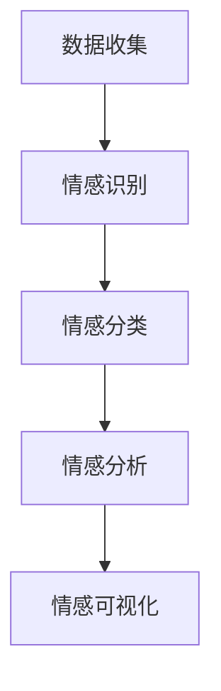
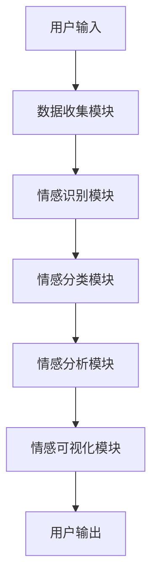
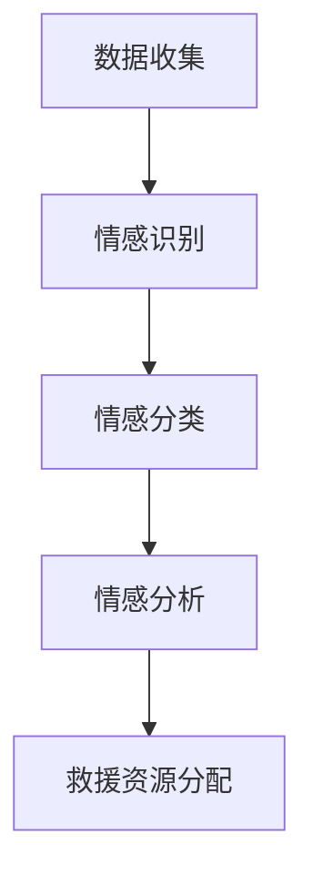
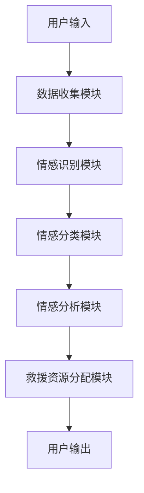

                 

# 情感AI在危机管理中的角色：情感智能的决策支持

关键词：情感AI，危机管理，决策支持，伦理，技术实现

摘要：本文旨在探讨情感人工智能（Emotional AI）在危机管理中的关键作用，尤其是其在决策支持方面的潜力。通过深入分析情感AI的基础理论、实际应用、技术实现及其伦理和社会影响，本文揭示了情感AI如何助力危机管理，并指出了未来的发展方向和面临的挑战。

## 引言

在当今全球化的社会中，危机管理已经成为各国政府和组织不可或缺的一部分。从自然灾害、经济危机到公共卫生事件，危机的发生和应对对社会的稳定和发展至关重要。随着人工智能（AI）技术的快速发展，情感人工智能（Emotional AI）作为一种新型的AI分支，正逐渐进入危机管理的领域，为决策者提供更为全面和智能的支持。

情感AI，顾名思义，是一种能够模拟、识别和解读人类情感状态的人工智能系统。它不仅能够理解和分析语言中的情感信息，还能够通过图像、语音等多种渠道捕捉和处理情感数据。在危机管理中，情感AI能够提供实时、准确的情感分析，帮助决策者更快速地响应和应对危机事件。

本文将围绕以下主题进行探讨：

1. 情感AI的基本概念及其在危机管理中的应用。
2. 决策过程中的情感AI角色及其作用。
3. 情感AI在危机管理中的实际应用案例。
4. 情感AI的技术实现及其挑战。
5. 情感AI在危机管理中的伦理和社会影响。
6. 情感AI在危机管理中的未来发展方向。

## 情感AI的基本概念及其在危机管理中的应用

### 定义与核心概念

情感AI，是指利用机器学习和自然语言处理（NLP）等技术，对人类情感进行模拟、识别和解读的人工智能系统。其核心概念包括情感识别、情感分类、情感分析等。

- **情感识别**：通过分析语言、面部表情、语音等数据，识别出人类情感状态。
- **情感分类**：将情感状态归类为愉悦、愤怒、悲伤等基本情感类别。
- **情感分析**：对大量情感数据进行处理和分析，提取出情感特征和模式。

### 在危机管理中的应用

情感AI在危机管理中的应用主要集中在以下几个方面：

1. **舆情监测**：通过社交媒体、新闻报道等渠道收集信息，实时监测公众情绪，为决策者提供参考。
2. **心理干预**：在危机事件中，对受影响者的情绪状态进行监测，提供针对性的心理干预和支持。
3. **资源分配**：根据不同区域的情感状态和需求，合理分配救援资源和物资。
4. **决策支持**：通过分析决策过程中的情感数据，提供更为全面和客观的决策建议。

### 关系与影响

情感AI在危机管理中扮演着桥梁和纽带的角色。它不仅能够将情感数据转化为可操作的信息，还能够辅助决策者理解公众情绪，提高决策的科学性和有效性。具体来说，情感AI对危机管理的影响体现在以下几个方面：

- **提高响应速度**：通过实时监测和分析情感数据，危机管理团队能够更快地识别危机信号，提前采取措施。
- **优化资源分配**：基于情感分析的结果，决策者可以更精准地分配资源和物资，提高救援效率。
- **增强决策透明度**：情感AI能够提供基于数据的决策支持，减少决策的主观性和偏见。

### 案例分析

以2020年新冠疫情为例，许多国家和地区采用了情感AI技术进行舆情监测和公众情绪分析。通过分析社交媒体上的言论和新闻报道，情感AI能够实时捕捉公众的情绪变化，为政府决策提供数据支持。例如，某些地区在疫情初期通过情感AI技术识别出公众对疫情的认知和恐慌程度，从而提前采取封锁措施，有效遏制了疫情的扩散。

## 决策过程中的情感AI角色及其作用

在危机管理中，决策过程至关重要。而情感AI在这一过程中扮演着不可或缺的角色。它不仅能够提供实时的情感数据分析，还能够辅助决策者做出更为科学和全面的决策。以下是情感AI在决策过程中具体的作用和影响：

### 1. 实时情感监测

情感AI能够实时监测和收集危机事件中的情感数据，包括公众的情感状态、舆情变化等。通过自然语言处理和情感分析技术，情感AI可以快速识别出情感关键词和情感趋势，为决策者提供即时的情感洞察。这种实时监测能力对于快速响应危机事件至关重要。

例如，在2020年新冠疫情初期，许多国家和地区通过情感AI技术监测社交媒体上的言论，识别出公众对疫情的态度和担忧程度。这种实时情感监测有助于决策者及时了解公众情绪，采取相应的措施来安抚民心，防止恐慌情绪的蔓延。

### 2. 情感数据分析

情感AI不仅能够收集情感数据，还能够对数据进行深入分析，提取出情感特征和模式。通过对历史数据的学习和模式识别，情感AI可以预测未来情感趋势，为决策提供数据支持。这种情感数据分析能力对于制定长期危机管理策略具有重要意义。

例如，在自然灾害如地震、洪水等事件中，情感AI可以分析过去类似事件中的公众情感反应，预测当前事件中的公众情感变化。这种预测能力有助于决策者提前做好心理准备，制定针对性的心理干预措施。

### 3. 决策支持

情感AI在决策支持中的作用主要体现在两个方面：一是提供基于数据的情感分析结果，二是辅助决策者理解公众情感，减少决策的主观性和偏见。

首先，情感AI可以通过情感分析提供关键情感指标，如公众恐慌指数、舆情热度等，帮助决策者全面了解危机事件中的情感状态。这些数据可以为决策提供客观依据，减少决策的主观性和不确定性。

其次，情感AI能够帮助决策者更好地理解公众情感，从而制定更为人性化的决策。例如，在公共卫生事件中，决策者可以通过情感AI分析了解公众对封锁、隔离等政策的接受程度，从而调整政策，减少公众的抵触情绪。

### 4. 情感干预

在危机管理中，情感干预是关键的一环。情感AI可以通过情感分析提供针对性的情感干预建议，帮助决策者制定有效的干预策略。例如，在心理干预中，情感AI可以分析受影响者的情绪状态，提供个性化的心理支持和建议。

### 5. 情感AI在决策支持中的挑战

尽管情感AI在决策支持中具有巨大潜力，但也面临一些挑战。首先，情感数据的质量和准确性直接影响情感分析的结果。其次，如何确保情感AI系统的公正性和透明度，避免偏见和歧视，也是重要的挑战。此外，情感AI技术的普及和应用需要决策者的理解和接受，这需要通过教育和培训来实现。

### 案例研究

以2011年日本福岛核灾难为例，日本政府和国际社会在灾难发生后，通过情感AI技术对社交媒体上的言论进行情感分析，识别出公众的恐慌情绪和对政府应对措施的质疑。通过这些分析结果，决策者及时调整了应对策略，加强了信息透明度，有效地安抚了公众情绪，减少了社会动荡。

## 情感AI在危机管理中的实际应用

### 案例研究一：新冠疫情期间的情感AI应用

2020年新冠疫情爆发以来，情感AI技术在危机管理中得到了广泛应用。许多国家和地区通过情感AI对社交媒体上的言论进行情感分析，以监测公众情绪，为政府决策提供支持。以下是一个具体的案例：

#### 环境介绍

疫情初期，意大利成为欧洲疫情最严重的国家之一。意大利政府和国际组织在应对疫情时，采用了情感AI技术对社交媒体上的言论进行分析。

#### 项目介绍

该项目旨在通过情感AI分析社交媒体上的言论，了解公众对疫情的态度和情感变化。项目团队收集了Twitter、Facebook等社交媒体平台上的大量用户生成内容，使用情感AI技术对这些内容进行情感分析。

#### 系统功能设计

系统功能包括以下几个方面：

1. **情感识别**：使用自然语言处理技术，对用户生成内容进行情感识别，提取出情感关键词和情感趋势。
2. **情感分类**：将情感状态归类为愉悦、愤怒、悲伤等基本情感类别。
3. **情感分析**：对大量情感数据进行处理和分析，提取出情感特征和模式。
4. **情感可视化**：将分析结果以图表形式呈现，帮助决策者直观了解公众情绪变化。

#### 系统架构设计

系统架构包括数据收集、情感识别、情感分类、情感分析和情感可视化等多个模块。以下是一个简化的系统架构设计：



#### 系统接口设计和交互

系统接口设计包括数据输入接口、情感分析结果输出接口等。以下是一个简化的接口设计：



#### 实际案例分析

通过情感AI技术，意大利政府和国际组织实时监测到了公众对疫情的态度和情感变化。以下是几个关键发现：

1. **恐慌情绪**：在疫情初期，公众恐慌情绪较为严重，社交媒体上充斥着关于疫情蔓延的负面信息。
2. **政策支持**：公众对政府的防控措施表示支持，但对封锁、隔离等政策的实施有抵触情绪。
3. **舆情变化**：随着疫情的发展，公众对疫情的态度逐渐趋于理性，负面情绪有所减轻。

#### 结论

通过情感AI技术的应用，意大利政府和国际组织能够更全面地了解公众情绪，为政府决策提供数据支持。这种基于数据的决策支持有助于提高决策的科学性和有效性，减少决策的主观性和偏见。

### 案例研究二：自然灾害中的情感AI应用

除了新冠疫情，情感AI在自然灾害中的危机管理中也发挥了重要作用。以下是一个具体案例：

#### 环境介绍

2015年，尼泊尔发生了8.1级地震，造成重大人员伤亡和财产损失。在灾难发生后，国际组织迅速响应，通过情感AI技术对受灾地区的情绪变化进行监测和分析。

#### 项目介绍

该项目旨在通过情感AI分析社交媒体、电话通话记录等数据，了解受灾地区的公众情绪，为救援和组织提供支持。

#### 系统功能设计

系统功能包括以下几个方面：

1. **情感识别**：对社交媒体、电话通话记录等数据进行分析，提取情感关键词和情感趋势。
2. **情感分类**：将情感状态归类为愉悦、愤怒、悲伤等基本情感类别。
3. **情感分析**：对大量情感数据进行处理和分析，提取出情感特征和模式。
4. **救援资源分配**：根据情感分析结果，为救援组织提供决策支持，优化救援资源分配。

#### 系统架构设计

系统架构包括数据收集、情感识别、情感分类、情感分析和救援资源分配等多个模块。以下是一个简化的系统架构设计：



#### 系统接口设计和交互

系统接口设计包括数据输入接口、情感分析结果输出接口和救援资源分配接口等。以下是一个简化的接口设计：



#### 实际案例分析

通过情感AI技术，国际组织能够实时了解受灾地区的公众情绪，为救援决策提供数据支持。以下是几个关键发现：

1. **恐慌情绪**：在地震发生后，公众恐慌情绪严重，社交媒体上充斥着关于地震破坏和伤亡的负面信息。
2. **资源需求**：通过情感分析，国际组织能够了解受灾地区最紧迫的资源需求，如食物、水和医疗设备。
3. **心理支持**：根据情感分析结果，国际组织为受灾地区提供了心理支持服务，帮助受影响者缓解心理压力。

#### 结论

情感AI技术在自然灾害中的危机管理中发挥了重要作用。通过实时监测公众情绪，情感AI能够为救援决策提供数据支持，优化资源分配，提高救援效率。

### 案例总结

通过以上案例研究，可以看出情感AI在危机管理中具有广泛应用前景。无论是在新冠疫情还是自然灾害中，情感AI都能够提供实时、准确的情感分析结果，为决策者提供数据支持，提高危机管理的效率和有效性。然而，情感AI的应用也面临一些挑战，如数据质量、算法公正性和伦理问题等，这些都需要在未来的研究中进一步解决。

## 情感AI的技术实现及其挑战

### 数据收集与预处理

情感AI的数据收集是整个系统的基石。数据来源可以是社交媒体、新闻、电话通话记录等。首先，需要对数据进行收集，然后进行预处理。预处理包括数据清洗、去噪、数据格式统一等步骤。

```python
# 数据收集与预处理示例代码
import pandas as pd

# 假设已经收集到一组社交媒体数据
data = pd.read_csv('social_media_data.csv')

# 数据清洗
data = data[data['text'].notnull()]
data['text'] = data['text'].str.replace('[^\w\s]','', regex=True)

# 去噪
data = data[data['text'].str.len() > 5]

# 数据格式统一
data['text'] = data['text'].str.lower()
```

### 模型选择与训练

在情感AI中，常用的模型包括朴素贝叶斯、支持向量机（SVM）、深度学习等。选择模型时需要考虑数据规模、特征复杂度等因素。训练模型通常包括以下步骤：

1. 数据划分：将数据划分为训练集和测试集。
2. 特征提取：从文本数据中提取特征，如词频、词嵌入等。
3. 模型训练：使用训练集训练模型。
4. 模型评估：使用测试集评估模型性能。

```python
# 模型选择与训练示例代码
from sklearn.model_selection import train_test_split
from sklearn.feature_extraction.text import TfidfVectorizer
from sklearn.naive_bayes import MultinomialNB
from sklearn.metrics import accuracy_score

# 数据划分
X_train, X_test, y_train, y_test = train_test_split(data['text'], data['label'], test_size=0.2, random_state=42)

# 特征提取
vectorizer = TfidfVectorizer()
X_train_vectorized = vectorizer.fit_transform(X_train)

# 模型训练
model = MultinomialNB()
model.fit(X_train_vectorized, y_train)

# 模型评估
X_test_vectorized = vectorizer.transform(X_test)
y_pred = model.predict(X_test_vectorized)
accuracy = accuracy_score(y_test, y_pred)
print(f"模型准确率：{accuracy}")
```

### 集成与部署

将训练好的模型集成到危机管理系统中，通常包括以下步骤：

1. 模型服务化：将模型打包为API服务，以便其他系统调用。
2. 集成到应用：将模型服务集成到危机管理应用中，实现情感分析功能。
3. 监控与维护：实时监控模型性能，进行维护和更新。

```python
# 模型服务化示例代码
from flask import Flask, request, jsonify

app = Flask(__name__)

model = MultinomialNB()
model.fit(X_train_vectorized, y_train)

@app.route('/predict', methods=['POST'])
def predict():
    text = request.form['text']
    text_vectorized = vectorizer.transform([text])
    prediction = model.predict(text_vectorized)
    return jsonify({'emotion': prediction[0]})

if __name__ == '__main__':
    app.run(debug=True)
```

### 挑战与未来发展方向

尽管情感AI在危机管理中具有巨大潜力，但仍然面临一些挑战。以下是几个关键挑战及其未来发展方向：

1. **数据质量**：情感AI的性能很大程度上取决于数据质量。未来研究方向包括提高数据收集和预处理的质量。
2. **算法公正性**：如何确保算法的公正性和透明度，避免偏见和歧视，是一个重要的研究方向。
3. **实时性**：情感AI需要具备实时分析的能力，以满足危机管理的需求。未来可以通过优化算法和硬件设施来实现。
4. **跨语言情感分析**：随着全球化的发展，跨语言情感分析成为了一个重要方向。未来可以通过多语言数据集和迁移学习等技术来实现。

## 情感AI在危机管理中的伦理和社会影响

### 隐私问题

情感AI在危机管理中的应用引发了许多隐私问题。情感AI系统需要收集和分析大量个人数据，包括社交媒体言论、电话通话记录等。这些数据可能包含敏感信息，如个人身份、健康状况、心理状态等。如何在保护个人隐私的同时，有效利用情感AI的数据，成为了一个重要的伦理问题。

### 偏见和公平性

情感AI的算法和模型可能存在偏见，这种偏见可能源于训练数据的不均衡或者算法设计上的缺陷。如果情感AI系统在危机管理中存在偏见，可能会导致不公平的决策，加剧社会不平等。例如，如果情感AI系统在疫情监测中忽视了某些特定群体，可能会导致这些群体得不到及时的帮助。

### 公众信任

情感AI在危机管理中的应用需要公众的信任和接受。如果公众对情感AI系统的可靠性、透明度或动机存在疑虑，可能会产生抵触情绪，影响系统的有效性和效率。因此，建立公众对情感AI的信任至关重要。

### 伦理审查与法规

为了确保情感AI在危机管理中的应用符合伦理标准，需要建立相应的伦理审查和法规体系。这包括对情感AI系统的设计、开发和部署进行严格的伦理评估，确保其符合伦理原则和法律法规。

### 社会责任

情感AI的开发者和应用者有社会责任，确保技术不被滥用，确保其在危机管理中的应用能够真正造福社会，而不是造成新的问题。这需要从技术、法律、伦理等多个角度进行全面的考量。

## 未来发展方向与挑战

### 技术创新

随着人工智能技术的不断发展，情感AI在未来有望实现更高的准确性和实时性。通过深度学习和强化学习等先进技术，情感AI可以更好地理解和模拟人类情感，为危机管理提供更精准的决策支持。

### 跨学科合作

情感AI在危机管理中的应用需要跨学科合作，包括心理学、社会学、计算机科学等领域的专家共同参与。这种跨学科合作有助于更好地理解人类情感，提高情感AI的实用性和有效性。

### 数据资源建设

情感AI的广泛应用需要丰富的数据资源支持。未来可以通过建立多语言、多领域的数据集，提高情感AI的训练数据质量，从而提升其性能和可靠性。

### 伦理和法律框架

为了确保情感AI在危机管理中的合法合规使用，需要建立完善的伦理和法律框架。这包括制定相关的法规标准，对情感AI的开发、部署和应用进行监管，确保其在危机管理中的正当性和合法性。

## 总结

情感人工智能（Emotional AI）在危机管理中扮演着重要角色，尤其是在决策支持方面。通过深入分析情感数据，情感AI能够为决策者提供实时、准确的情感洞察，优化危机管理策略，提高决策的科学性和有效性。然而，情感AI的应用也面临隐私、偏见、公众信任等伦理和社会挑战。未来，随着技术的不断进步和跨学科合作的加强，情感AI有望在危机管理中发挥更大的作用，为社会的稳定和发展贡献力量。

## 作者信息

作者：AI天才研究院/AI Genius Institute & 禅与计算机程序设计艺术 /Zen And The Art of Computer Programming

