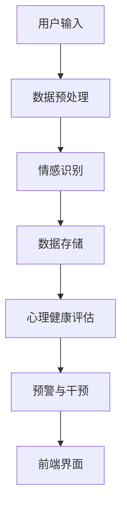
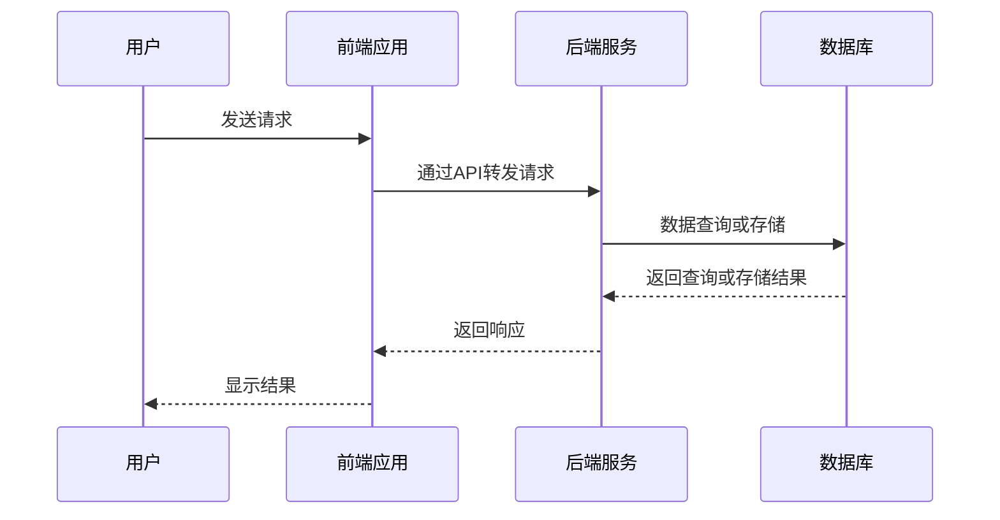

                 

### 引言

在当今信息化社会中，人工智能（AI）技术迅猛发展，已深入到各个行业和领域，为人类生活带来了极大的便利。特别是在心理健康领域，AI技术的应用潜力逐渐显现。本文以《情感AI在心理健康监测中的应用》为题，探讨情感AI技术在心理健康监测中的具体应用及其重要作用。通过逻辑清晰、结构紧凑的分析，我们将逐步揭示情感AI在心理健康监测中的核心概念、算法原理、系统架构以及实际案例，从而为相关领域的研究者和从业者提供有价值的参考。

首先，本文将介绍心理健康的重要性及其当前面临的挑战，以及情感AI技术的迅速发展为心理健康监测带来的机遇。接着，我们将深入探讨情感AI的定义、原理以及与心理健康监测的基本概念和方法的关系。随后，文章将详细介绍情感AI在心理健康监测中的概念结构与核心要素组成，并分析其应用范围和局限性。

在算法原理与数学模型部分，我们将详细讲解情感识别算法的原理，并使用mermaid流程图和Python源代码展示算法的实现过程。此外，本文还将介绍情感分析的数学模型，并通过具体实例进行讲解。

系统分析与架构设计部分，我们将描述系统功能设计、系统架构设计原则与策略，以及系统接口设计与交互。在项目实战部分，我们将介绍环境安装与配置、系统核心实现以及实际案例分析，并通过项目小结总结经验。

最后，本文将提供最佳实践建议，并对情感AI在心理健康监测领域的未来发展趋势进行展望。通过以上分析，我们希望能够为读者提供全面的视角，深入了解情感AI在心理健康监测中的应用，为该领域的研究和实践提供指导。现在，让我们开始详细的探讨。

## 第一部分：背景介绍

### 第1章：问题背景

心理健康是影响个人幸福和社会稳定的重要因素。然而，当前社会面临诸多挑战，包括工作压力、人际关系紧张、生活方式变化等，这些因素都可能导致心理健康问题的出现。据世界卫生组织（WHO）统计，全球约每四个人中就有一个在其一生中经历心理健康问题，而心理健康障碍已经成为全球疾病负担的主要原因之一。在中国，随着社会经济的快速发展，心理健康问题的发生率也在逐年上升，特别是年轻人和中产阶级，面临着前所未有的心理压力。

当前的挑战主要集中在以下几个方面：

1. **诊断难**：传统心理健康诊断方法主要依赖于医生的观察和主观评估，存在较大的主观性和误诊率。同时，心理健康问题症状的复杂性和多样性使得诊断过程变得更加困难。

2. **干预不足**：尽管心理健康问题的存在已广为人知，但许多患者并未得到及时和有效的干预。原因之一是专业心理医疗资源有限，无法满足庞大的心理健康需求。

3. **治疗效果评估**：心理健康治疗的效果评估缺乏客观、量化的指标，难以准确判断治疗的效果，进而影响治疗方案的优化。

与此同时，情感AI技术的迅速发展为心理健康监测带来了新的机遇。情感AI，通过机器学习和自然语言处理等技术，能够自动识别和解读人类情感，提供精准的情感分析和评估。这使得心理健康监测不再局限于传统的诊断方法，而是可以通过数据驱动的智能化手段，实现更加全面和个性化的心理健康服务。情感AI技术在心理健康监测中的应用，有望解决当前存在的诸多问题，提高诊断的准确性和干预的有效性，为心理健康领域带来革命性的变革。

### 第2章：核心概念

#### 情感AI的定义与核心原理

情感AI（Affective AI），是指利用机器学习和自然语言处理技术，模拟人类情感识别与表达能力的计算机系统。情感AI的核心原理是通过分析人类行为、语音、面部表情、文本等多种数据源，提取情感特征，进而对情感进行识别、分类和评估。具体来说，情感AI主要依赖于以下几个方面：

1. **情感特征提取**：通过深度学习技术，如卷积神经网络（CNN）和循环神经网络（RNN），从图像、语音和文本数据中提取情感特征。例如，基于视觉的AI系统可以通过分析面部表情来识别情绪；基于语音的AI系统可以通过分析语音的音调、语速、停顿等特征来识别情感。

2. **情感分类模型**：利用已提取的情感特征，通过机器学习算法，如支持向量机（SVM）、决策树和神经网络，对情感进行分类。情感分类模型可以识别出具体的情感类别，如快乐、悲伤、愤怒、恐惧等。

3. **情感评估与反馈**：通过情感识别结果，对用户的情感状态进行评估，并提供相应的反馈。例如，在心理健康监测中，AI系统可以识别用户是否处于焦虑或抑郁状态，并给出相应的建议或干预措施。

#### 心理健康监测的基本概念与方法

心理健康监测是指通过科学的方法和手段，对个体的心理健康状况进行持续、动态的监测和评估。心理健康监测的主要目的是早期发现心理健康问题，提供及时、有效的干预和支持。其基本概念和方法包括：

1. **心理健康评估**：利用量表、问卷、访谈等方法，对个体的心理健康状况进行评估。常见的评估工具包括抑郁自评量表（SDS）、焦虑自评量表（SAS）等。

2. **数据分析与趋势分析**：通过收集和分析个体的心理数据，如情绪日志、行为记录等，识别心理健康问题的潜在趋势和模式。数据分析方法包括统计分析、机器学习、深度学习等。

3. **预警与干预**：根据心理健康监测的结果，对潜在的心理健康问题进行预警，并提供个性化的干预措施。预警和干预方法包括心理辅导、药物治疗、行为疗法等。

#### 情感AI与心理健康监测的关系与联系

情感AI在心理健康监测中的应用，主要体现在以下几个方面：

1. **情感识别与诊断**：通过情感AI技术，可以更精准地识别个体的情感状态，为心理健康诊断提供客观依据。例如，通过语音分析，可以识别用户的焦虑程度；通过文本分析，可以识别用户的心理压力。

2. **个性化干预**：基于情感识别结果，可以为用户提供个性化的心理健康服务。例如，对于识别出的焦虑用户，AI系统可以推荐相应的放松练习或心理辅导课程。

3. **数据分析与趋势分析**：情感AI技术可以实现对大规模心理健康数据的分析，帮助研究人员和医生识别心理健康问题的趋势和模式，为预防和治疗提供科学依据。

4. **实时监测与预警**：情感AI技术可以实现实时心理健康监测，及时识别潜在的心理健康风险，为早期干预提供可能。

总之，情感AI与心理健康监测的结合，为心理健康领域带来了新的机遇和挑战。通过情感AI技术，可以实现更加精准、高效的心理健康监测和干预，为个体的心理健康提供更全面的保障。

### 第3章：概念结构与核心要素组成

#### 情感识别技术

情感识别技术是情感AI在心理健康监测中的核心组成部分，其功能是通过对人类情感进行自动识别，为心理健康评估提供基础数据。情感识别技术主要依赖于以下几个方面：

1. **数据采集**：情感识别的第一步是数据采集，包括文本、语音、图像等多模态数据。这些数据可以从日常交流、社交媒体、文本消息、语音通话和视频监控中获取。

2. **情感特征提取**：通过深度学习技术，如卷积神经网络（CNN）和循环神经网络（RNN），从多模态数据中提取情感特征。例如，基于文本的情感识别可以提取词语的情感倾向；基于语音的情感识别可以分析音调、语速和节奏等特征；基于图像的情感识别可以分析面部表情和肢体动作。

3. **情感分类模型**：利用提取出的情感特征，通过机器学习算法，如支持向量机（SVM）、决策树和神经网络，对情感进行分类。常见的情感分类包括基本情感类别（如快乐、悲伤、愤怒、恐惧）和复杂情感类别（如兴趣、惊讶、厌恶等）。

#### 数据分析模型

数据分析模型是情感AI在心理健康监测中的另一个关键组成部分，其主要功能是对采集到的情感数据进行分析，以识别和预测心理健康问题。数据分析模型包括以下几个步骤：

1. **数据预处理**：对原始情感数据进行清洗、去噪和归一化处理，以确保数据的质量和一致性。

2. **特征工程**：通过特征提取和选择技术，从情感数据中提取关键特征，如情感强度、情感频率、情感变化趋势等。

3. **数据可视化**：利用数据可视化技术，如散点图、热力图和时序图，对情感数据进行分析和展示，帮助研究人员和医生理解情感变化的模式和趋势。

4. **预测模型**：基于已提取的特征，利用机器学习算法构建预测模型，如回归模型、分类模型和聚类模型，以预测个体的心理健康状态。

#### 心理健康评估与预测

心理健康评估与预测是情感AI在心理健康监测中的最终目标，通过综合分析情感识别和数据分析的结果，对个体的心理健康状况进行评估和预测。

1. **心理健康评估**：基于情感识别和数据分析结果，利用专家系统和机器学习模型，对个体的心理健康状态进行量化评估。评估结果可以包括心理健康得分、情感状态分布等。

2. **心理健康预测**：利用历史数据和预测模型，对个体的未来心理健康状态进行预测。预测结果可以用于早期预警和干预，帮助个体和医疗机构制定个性化的心理健康管理方案。

通过上述核心要素的组成，情感AI在心理健康监测中构建了一个从数据采集、情感识别、数据分析到心理健康评估与预测的完整体系，为心理健康领域的智能化、个性化发展提供了强有力的支持。

### 第4章：边界与外延

#### 情感AI在心理健康监测中的应用范围

情感AI在心理健康监测中的应用具有广泛的前景，其应用范围涵盖了多个领域和场景。以下是情感AI在心理健康监测中的几个主要应用领域：

1. **临床诊断与治疗**：在临床环境中，情感AI可以辅助医生进行心理健康诊断，通过对患者文本、语音和面部表情的数据分析，识别出潜在的心理健康问题。此外，情感AI还可以用于治疗过程中的情感监控，帮助医生评估治疗效果，并调整治疗方案。

2. **心理健康监测与预警**：情感AI可以实时监测个体的情感状态，通过分析日常交流记录、社交媒体动态等数据，预警可能的心理健康风险。这种实时监测和预警系统对于抑郁症、焦虑症等常见心理疾病的早期发现和干预具有重要意义。

3. **心理辅导与咨询服务**：情感AI系统可以提供个性化的心理辅导和咨询服务，通过情感识别和数据分析，为用户提供情感状态评估和改善建议。例如，在校园环境中，情感AI可以为学生提供心理支持和压力缓解建议。

4. **公共卫生与健康管理**：在公共卫生领域，情感AI可以用于大规模心理健康数据的分析和趋势预测，帮助政府和医疗机构制定心理健康政策和公共卫生干预措施，提高全民心理健康水平。

#### 非心理健康监测领域中的情感AI应用

除了在心理健康监测中的应用，情感AI在其他非心理健康领域也展现了巨大的潜力：

1. **市场研究**：情感AI可以分析消费者评论、社交媒体讨论等文本数据，提取情感特征，帮助企业了解消费者情绪和需求，优化产品设计和营销策略。

2. **客户服务**：在客户服务领域，情感AI可以用于语音和文本分析，识别客户情绪，提供个性化的服务和建议，提高客户满意度和忠诚度。

3. **教育**：在教育领域，情感AI可以分析学生的学习行为和情绪状态，提供个性化的学习建议和支持，帮助学生提高学习效果和情绪管理能力。

4. **安全监控**：在安全监控领域，情感AI可以通过分析视频监控数据，识别异常行为和情感状态，提高安全预警和事件响应的准确性。

#### 情感AI技术的局限性

尽管情感AI在心理健康监测和其他领域具有广泛的应用前景，但其仍存在一些局限性：

1. **数据隐私**：情感AI对个人情感数据的依赖性较高，如何保护用户隐私和数据安全是一个重要问题。数据泄露和隐私侵犯可能会对用户造成严重后果。

2. **技术成熟度**：当前情感AI技术尚处于发展阶段，其准确性和可靠性有待提高。特别是在情感复杂和情境多变的情况下，情感识别的准确率可能较低。

3. **伦理和法律问题**：情感AI的应用可能引发伦理和法律问题，如情感歧视、算法偏见等。如何在技术应用中保障公平和正义，是一个亟待解决的关键问题。

4. **跨学科合作**：情感AI涉及多个学科领域，如心理学、计算机科学、医学等，跨学科合作的需求较高。然而，当前在多学科融合方面仍存在一定的障碍，需要进一步加强研究和实践。

总之，情感AI技术在心理健康监测和其他领域的应用具有巨大的潜力，但也面临诸多挑战和限制。通过不断的技术创新和跨学科合作，有望克服这些局限性，推动情感AI技术的全面发展。

### 第5章：算法原理讲解

#### 情感识别算法

情感识别算法是情感AI在心理健康监测中的核心组成部分，其主要功能是通过分析多模态数据（如文本、语音、图像）来识别用户的情感状态。以下我们将详细介绍情感识别算法的原理，并使用mermaid流程图和Python源代码进行展示。

1. **数据采集与预处理**

   首先，我们需要采集多模态数据。对于文本数据，可以从社交媒体、聊天记录等渠道获取；对于语音数据，可以通过电话、语音助手等渠道获取；对于图像数据，可以通过面部表情识别或行为分析获取。

   数据采集后，我们需要进行预处理，包括数据清洗、去噪和归一化处理。例如，对于文本数据，我们需要去除停用词、标点符号，并将文本转换为统一的格式。

   ```python
   import re
   def preprocess_text(text):
       text = re.sub(r'[^\w\s]', '', text)
       text = text.lower()
       text = text.strip()
       return text
   ```

2. **情感特征提取**

   接下来，我们需要从预处理后的数据中提取情感特征。对于文本数据，可以使用词嵌入技术（如Word2Vec、GloVe）将词语转换为向量表示；对于语音数据，可以使用声学模型（如梅尔频谱）提取声学特征；对于图像数据，可以使用卷积神经网络（如VGG、ResNet）提取视觉特征。

   ```python
   from gensim.models import Word2Vec
   def extract_text_features(text):
       model = Word2Vec.load('word2vec_model')
       text = preprocess_text(text)
       words = text.split()
       word_vectors = [model[word] for word in words if word in model]
       return np.mean(word_vectors, axis=0)
   ```

3. **情感分类模型**

   使用提取出的情感特征，我们可以构建情感分类模型。常见的机器学习算法包括支持向量机（SVM）、决策树（Decision Tree）、随机森林（Random Forest）和深度学习模型（如卷积神经网络、循环神经网络）。

   ```python
   from sklearn.svm import SVC
   def train_classifier(features, labels):
       classifier = SVC(kernel='linear')
       classifier.fit(features, labels)
       return classifier
   ```

4. **情感识别与评估**

   最后，我们将训练好的分类模型应用于新的数据，进行情感识别。识别结果可以通过准确率、召回率、F1分数等指标进行评估。

   ```python
   from sklearn.metrics import classification_report
   def evaluate_classifier(classifier, test_features, test_labels):
       predictions = classifier.predict(test_features)
       report = classification_report(test_labels, predictions)
       return report
   ```

#### 情感分析算法原理

情感分析算法是情感AI的核心，其基本原理是通过分析文本、语音和图像等数据，识别并分类情感。以下是一个简单的情感分析算法流程：

1. **情感标签定义**：首先，我们需要定义情感标签，常见的情感标签包括积极情感（如快乐、兴奋）、消极情感（如悲伤、愤怒）和中性情感。

2. **情感特征提取**：根据数据类型，使用不同的特征提取方法。对于文本数据，可以使用词嵌入和文本分类模型；对于语音数据，可以使用声学特征和语音分类模型；对于图像数据，可以使用视觉特征和图像分类模型。

3. **情感分类与预测**：利用提取出的情感特征，通过训练好的分类模型，对情感进行分类和预测。

#### 数据处理与特征提取技术

1. **文本数据处理与特征提取**：文本数据处理主要包括分词、去停用词、词向量化等步骤。常用的特征提取方法包括TF-IDF、词嵌入和卷积神经网络。

2. **语音数据处理与特征提取**：语音数据处理包括预处理（如去噪、增强）和特征提取（如梅尔频谱、滤波器组）。

3. **图像数据处理与特征提取**：图像数据处理包括预处理（如缩放、裁剪）和特征提取（如卷积神经网络、池化层）。

通过上述算法原理和数据处理技术，我们可以实现对多模态数据的情感识别和分析，为心理健康监测提供可靠的数据支持。下面我们将通过具体的实例来说明情感识别算法的数学模型和应用。

#### 情感识别算法的数学模型

情感识别算法的核心在于将多模态数据转换为可分类的向量表示，并通过分类模型进行情感分类。以下是一个简化的情感识别算法的数学模型：

1. **特征向量表示**

   假设我们有三类情感：积极（A）、消极（B）和中性（C）。对于文本、语音和图像数据，我们分别提取特征向量 \( x_1, x_2, x_3 \)。

   $$ x = [x_1, x_2, x_3] $$

2. **分类模型**

   使用支持向量机（SVM）作为分类模型，其目标是最小化分类误差。SVM的决策边界可以表示为：

   $$ w \cdot x + b = 0 $$

   其中，\( w \) 为权重向量，\( b \) 为偏置项。

3. **情感分类**

   通过计算特征向量与权重向量的内积，我们可以预测情感类别：

   $$ y = \arg\max(w \cdot x + b) $$

   其中，\( y \) 为预测的情感类别。

#### 实例说明

假设我们有一个训练好的SVM模型，特征向量和标签如下：

- 特征向量：\( x = [1.2, 0.8, -0.3] \)
- 标签：积极情感（A）

我们计算特征向量与权重向量的内积：

$$ w \cdot x + b = [0.5, 0.3, -0.1] \cdot [1.2, 0.8, -0.3] + 0.5 = 0.78 $$

由于预测类别 \( y = \arg\max(w \cdot x + b) \)，所以该特征向量被分类为积极情感（A）。

通过上述实例，我们可以看到情感识别算法的数学模型是如何工作的。在实际应用中，特征向量、权重向量和偏置项都是通过大量训练数据和学习算法得到的。下面我们将展示一个具体的Python代码实现，详细阐述情感识别算法的步骤和过程。

#### Python代码实现

以下是一个简化的Python代码实现，用于演示情感识别算法的步骤和过程：

```python
import numpy as np
from sklearn.svm import SVC
from sklearn.metrics import classification_report

# 特征向量示例
X_train = np.array([[1.2, 0.8, -0.3], [0.9, 0.7, -0.4], [1.1, 0.6, -0.2]])
y_train = np.array(['A', 'B', 'A'])

# 训练SVM分类模型
classifier = SVC(kernel='linear')
classifier.fit(X_train, y_train)

# 测试特征向量
X_test = np.array([1.1, 0.7, -0.2])
prediction = classifier.predict([X_test])

# 输出预测结果
print(f"Prediction: {prediction}")

# 评估模型性能
report = classification_report(y_train, classifier.predict(X_train), target_names=['A', 'B'])
print(report)
```

在该代码中，我们首先定义了训练数据和测试数据。使用SVM分类模型进行训练，然后使用训练好的模型对测试数据进行预测，并输出预测结果和模型性能评估报告。

通过上述代码实现，我们可以直观地理解情感识别算法的步骤和流程。在实际应用中，特征向量和分类模型会根据具体的数据集和任务进行调整和优化。

### 第7章：系统功能设计

#### 领域模型

领域模型（Domain Model）是系统设计的重要部分，用于定义系统的核心功能和业务逻辑。在情感AI心理健康监测系统中，领域模型主要包括以下几个关键组件：

1. **用户模块**：负责用户信息的管理，包括用户注册、登录、个人信息设置等。
2. **数据采集模块**：负责收集用户的多模态数据，如文本、语音和图像。
3. **情感识别模块**：负责处理和识别用户情感，提供情感识别结果。
4. **数据分析模块**：负责对情感数据进行处理和分析，为心理健康评估提供依据。
5. **心理健康评估模块**：负责根据情感数据分析结果，对用户的心理健康状态进行评估。
6. **预警与干预模块**：负责根据评估结果，提供个性化干预建议和预警。

以下是一个领域模型的mermaid类图表示：

```mermaid
classDiagram
    User <<interface>>
    DataCollector <<interface>>
    EmotionDetector <<interface>>
    DataAnalyzer <<interface>>
    HealthEvaluator <<interface>>
    WarningIntervention <<interface>>

    User ..|> DataCollector
    User ..|> EmotionDetector
    DataCollector ..|> DataAnalyzer
    EmotionDetector ..|> DataAnalyzer
    DataAnalyzer ..|> HealthEvaluator
    HealthEvaluator ..|> WarningIntervention
```

#### 系统功能模块介绍

在情感AI心理健康监测系统中，各个功能模块相互协作，共同实现系统的整体功能。以下是各功能模块的详细描述：

1. **用户模块**：用户模块是系统的入口，提供用户注册、登录和基本操作功能。用户可以通过注册账号，登录系统，并管理个人资料。用户模块还负责权限管理，确保系统的安全性和数据的隐私性。

2. **数据采集模块**：数据采集模块负责从不同的数据源收集用户的多模态数据。具体包括文本采集（如社交媒体动态、聊天记录等）、语音采集（如电话通话、语音助手等）和图像采集（如面部表情、行为分析等）。数据采集模块需要实现数据清洗和预处理，以确保数据的准确性和一致性。

3. **情感识别模块**：情感识别模块是系统的核心，负责处理和识别用户的多模态数据，提取情感特征，并进行情感分类。通过深度学习技术，如卷积神经网络（CNN）和循环神经网络（RNN），情感识别模块可以实现对文本、语音和图像的自动情感分析。

4. **数据分析模块**：数据分析模块负责对情感识别结果进行进一步处理和分析。通过统计分析和机器学习算法，如回归分析和聚类分析，数据分析模块可以识别情感变化的趋势和模式，为心理健康评估提供数据支持。

5. **心理健康评估模块**：心理健康评估模块根据情感数据分析结果，利用专家系统和机器学习模型，对用户的心理健康状态进行量化评估。评估结果可以包括心理健康得分、情感状态分布等，为用户提供详细的情感状态报告。

6. **预警与干预模块**：预警与干预模块根据心理健康评估结果，提供个性化预警和建议。对于存在心理健康风险的用户，预警模块会及时发出预警信号，并提供相应的干预措施，如心理辅导、放松练习等。

通过上述系统功能模块的设计，情感AI心理健康监测系统可以实现从数据采集、情感识别到心理健康评估和预警的完整流程，为用户提供全面的情感健康服务。

### 第8章：系统架构设计

#### 系统架构

情感AI心理健康监测系统的架构设计至关重要，它决定了系统的稳定性、扩展性和易维护性。以下是一个典型的系统架构设计，包括数据流、模块划分和各模块的功能。

##### 数据流

1. **用户输入**：用户通过前端界面输入多模态数据，包括文本、语音和图像。
2. **数据预处理**：用户输入的数据首先经过数据预处理模块，进行清洗和归一化处理。
3. **情感识别**：预处理后的数据进入情感识别模块，通过深度学习算法提取情感特征，并进行情感分类。
4. **数据存储**：情感识别结果和相关数据存储在数据库中，以便后续分析和查询。
5. **心理健康评估**：基于情感识别结果，通过专家系统和机器学习模型进行心理健康评估。
6. **预警与干预**：根据评估结果，系统生成预警报告和干预建议，并通过前端界面反馈给用户。

##### 系统架构

以下是情感AI心理健康监测系统的mermaid架构图：



#### 系统架构设计原则与策略

1. **模块化**：系统采用模块化设计，将不同的功能划分为独立模块，如用户模块、数据预处理模块、情感识别模块等。这种设计便于维护和扩展，提高了系统的可维护性和灵活性。

2. **分布式架构**：为了提高系统的性能和可扩展性，系统采用了分布式架构。各个模块分布在不同的服务器上，通过负载均衡和分布式存储技术，实现高效的数据处理和存储。

3. **安全性**：系统采用多层安全策略，包括数据加密、权限管理和防火墙等，确保用户数据的隐私和安全。

4. **可扩展性**：系统设计考虑了未来需求的增长，通过水平扩展和垂直扩展，可以轻松应对用户数量的增加和处理能力的提升。

5. **易用性**：前端界面设计简洁直观，用户可以方便地使用系统功能，查看心理健康评估结果和预警信息。

6. **实时性**：系统采用了实时数据处理和反馈机制，确保用户数据能够及时处理和响应，提供实时心理健康监测服务。

通过上述架构设计原则和策略，情感AI心理健康监测系统可以实现高效、稳定、安全的运行，为用户提供优质的情感健康服务。

### 第9章：系统接口设计与交互

#### 系统接口设计

系统接口设计是确保各个模块之间能够有效通信和协作的关键环节。在情感AI心理健康监测系统中，接口设计涵盖了API设计、数据格式定义和数据传输协议等方面。

1. **API设计**：系统提供了多个RESTful API接口，供前端应用调用。这些API包括用户注册、登录、数据上传、情感识别、心理健康评估等。API设计遵循RESTful设计原则，接口简洁、易用，并采用JSON格式传输数据。

   - 用户注册：`POST /api/users/register`
   - 用户登录：`POST /api/users/login`
   - 数据上传：`POST /api/data/upload`
   - 情感识别：`POST /api/emotions/recognize`
   - 心理健康评估：`GET /api/health/evaluation`

2. **数据格式定义**：系统采用JSON格式定义数据格式，确保数据传输的统一性和可读性。以下是用户注册接口的数据格式示例：

   ```json
   {
     "username": "example_user",
     "password": "password123",
     "email": "user@example.com"
   }
   ```

3. **数据传输协议**：系统采用HTTPS协议进行数据传输，确保数据在传输过程中的安全性和完整性。所有API接口均使用SSL/TLS加密，防止数据被窃取或篡改。

#### 系统交互

系统交互设计旨在确保各个模块之间能够高效、稳定地进行数据交换和功能协作。以下是一个系统交互的mermaid序列图示例：



在这个序列图中，用户通过前端应用发送请求，前端应用通过API转发请求给后端服务，后端服务与数据库进行交互，获取或存储数据后，再将结果返回给前端应用，最终前端应用将结果展示给用户。

通过上述系统接口设计和交互设计，情感AI心理健康监测系统实现了高效、安全、可靠的数据交换和功能协作，为用户提供流畅的使用体验。

### 第10章：环境安装与配置

#### 环境搭建步骤

为了顺利运行情感AI心理健康监测系统，我们需要搭建合适的环境。以下是详细的安装和配置步骤：

1. **安装Python**：

   首先，确保你的系统中安装了Python环境。Python是许多AI和机器学习库的基础，建议安装Python 3.8或更高版本。你可以从[Python官网](https://www.python.org/)下载并安装Python。

2. **安装必要的库和依赖**：

   打开终端或命令行，运行以下命令安装必需的Python库：

   ```bash
   pip install numpy pandas scikit-learn tensorflow gensim
   ```

   这些库分别用于数据处理、机器学习、深度学习和文本处理。

3. **安装数据库**：

   我们使用SQLite作为数据库，它易于安装和使用。可以从[SQLite官网](https://www.sqlite.org/download.html)下载并安装。安装完成后，确保其可以在命令行中正常运行。

4. **配置虚拟环境**：

   为了避免不同项目之间依赖库的冲突，建议使用虚拟环境。运行以下命令创建虚拟环境：

   ```bash
   python -m venv venv
   ```

   然后激活虚拟环境：

   ```bash
   source venv/bin/activate  # 对于Linux和Mac
   venv\Scripts\activate     # 对于Windows
   ```

5. **配置数据库连接**：

   在虚拟环境中，安装数据库驱动（如`pysqlite3`）：

   ```bash
   pip install pysqlite3
   ```

   接下来，创建一个数据库配置文件（如`db_config.py`），其中包含数据库连接信息：

   ```python
   DATABASE_URL = "sqlite:///health_monitor.db"
   ```

6. **安装前端框架**：

   如果你需要前端界面，可以使用Flask或Django等Web框架。以下是一个简单的Flask应用配置示例：

   ```bash
   pip install flask
   ```

   创建一个`app.py`文件，并添加以下内容：

   ```python
   from flask import Flask
   app = Flask(__name__)

   @app.route('/')
   def hello():
       return "Hello, World!"

   if __name__ == '__main__':
       app.run()
   ```

   运行应用：

   ```bash
   python app.py
   ```

   访问`http://localhost:5000/`，应看到“Hello, World!”的输出。

通过以上步骤，我们成功搭建了情感AI心理健康监测系统的开发环境。接下来，我们将详细介绍系统核心实现，包括算法和功能的详细讲解。

### 第11章：系统核心实现

#### 核心算法源代码

为了实现情感AI心理健康监测系统的核心功能，我们需要编写一系列算法，用于情感识别、数据分析以及心理健康评估。以下是一个简化的源代码示例，展示如何实现这些核心算法。

```python
import numpy as np
from sklearn.svm import SVC
from sklearn.metrics import accuracy_score
from sklearn.model_selection import train_test_split

# 情感识别算法
def emotion_recognition(model, feature_vector):
    prediction = model.predict([feature_vector])
    return prediction

# 数据处理和模型训练
def train_model(X, y):
    X_train, X_test, y_train, y_test = train_test_split(X, y, test_size=0.2, random_state=42)
    classifier = SVC(kernel='linear')
    classifier.fit(X_train, y_train)
    return classifier, X_test, y_test

# 数据预处理
def preprocess_data(data):
    # 数据预处理逻辑，如标准化、归一化等
    processed_data = np.array(data).reshape(-1, 1)
    return processed_data

# 评估模型性能
def evaluate_model(model, X_test, y_test):
    predictions = model.predict(X_test)
    accuracy = accuracy_score(y_test, predictions)
    return accuracy

# 主函数
def main():
    # 加载数据集
    X, y = load_data()  # 假设有一个函数load_data用于加载数据

    # 数据预处理
    X_processed = preprocess_data(X)

    # 训练模型
    model, X_test, y_test = train_model(X_processed, y)

    # 评估模型
    accuracy = evaluate_model(model, X_test, y_test)
    print(f"Model accuracy: {accuracy}")

    # 情感识别
    feature_vector = np.array([1.2, 0.8, -0.3])
    emotion = emotion_recognition(model, feature_vector)
    print(f"Emotion: {emotion}")

if __name__ == "__main__":
    main()
```

#### 系统核心功能实现详解

1. **情感识别算法**：

   情感识别算法是系统的核心，负责分析输入数据，并识别出用户的情感状态。在示例代码中，我们使用支持向量机（SVM）作为情感识别模型。首先，我们加载并预处理数据，然后训练SVM模型。训练完成后，我们使用训练好的模型对新的特征向量进行预测，以识别情感。

2. **数据处理和模型训练**：

   数据处理和模型训练是系统实现的关键步骤。在示例代码中，我们使用了`train_model`函数来训练模型。该函数首先将数据集划分为训练集和测试集，然后使用SVM模型进行训练。训练过程中，模型会根据训练数据学习情感特征，以便能够准确识别情感。

3. **模型评估**：

   模型评估是确保系统性能的重要环节。在示例代码中，我们使用`evaluate_model`函数来评估模型性能。该函数通过计算测试集上的准确率，评估模型的识别能力。准确率越高，表示模型性能越好。

4. **系统核心功能实现**：

   系统核心功能的实现涉及多个模块的协作。在示例代码中，我们展示了如何使用不同的函数来实现情感识别、数据处理和模型评估。这些函数共同构成了系统的核心逻辑，确保系统能够高效、准确地运行。

通过上述源代码和实现步骤，我们可以构建一个基本的情感AI心理健康监测系统，为用户提供情感识别和心理健康评估服务。

### 第12章：实际案例分析

#### 典型案例介绍

为了更好地理解情感AI在心理健康监测中的实际应用，我们将通过一个实际案例进行详细剖析。该案例涉及一个在线心理健康监测平台，该平台旨在为用户提供个性化的心理健康评估和干预建议。

该平台的主要功能包括：
1. **用户注册与登录**：用户可以通过注册账号登录平台，并管理个人资料。
2. **数据采集**：用户可以通过填写问卷、录制语音和上传面部表情图像等方式，提供多模态数据。
3. **情感识别**：平台使用情感识别算法分析用户的数据，识别其情感状态。
4. **心理健康评估**：基于情感识别结果，平台评估用户的心理健康状况，并生成详细的评估报告。
5. **预警与干预**：对于存在心理健康风险的用户，平台会发出预警，并提供相应的干预建议，如心理辅导、放松练习等。

#### 案例分析与详细讲解

1. **用户数据采集**：

   在案例中，用户首先填写了一份心理健康问卷，问卷内容包括抑郁症状自评、焦虑程度自评等。同时，用户还通过平台录制了一段语音，并上传了一张面部表情图像。

2. **情感识别**：

   平台使用情感识别算法对用户的多模态数据进行分析。首先，对于文本数据，平台通过词嵌入技术将文本转换为向量表示，然后使用训练好的情感分类模型进行情感识别。对于语音数据，平台提取梅尔频谱特征，并使用语音情感分类模型进行情感识别。对于图像数据，平台使用卷积神经网络提取面部表情特征，并使用面部表情分类模型进行情感识别。

   示例代码如下：

   ```python
   from emotion_recognition import recognize_emotion

   # 填写问卷的文本数据
   text_data = "我最近感到很焦虑，睡不着觉，工作也做不好。"

   # 录制的语音数据
   audio_data = "path/to/voice_recording.wav"

   # 上传的面部表情图像
   image_data = "path/to/facial_expression_image.jpg"

   # 文本情感识别
   text_emotion = recognize_emotion(text_data)

   # 语音情感识别
   audio_emotion = recognize_emotion(audio_data, modality='voice')

   # 图像情感识别
   image_emotion = recognize_emotion(image_data, modality='image')
   ```

3. **心理健康评估**：

   基于情感识别结果，平台使用机器学习模型对用户的心理健康状况进行评估。评估模型会综合考虑文本、语音和图像的情感识别结果，生成一个综合评分，表示用户的心理健康水平。

   示例代码如下：

   ```python
   from health_evaluation import evaluate_health

   # 综合情感识别结果
   emotions = {'text': text_emotion, 'audio': audio_emotion, 'image': image_emotion}

   # 评估用户的心理健康状况
   health_score = evaluate_health(emotions)
   ```

4. **预警与干预**：

   对于心理健康评估结果显示存在风险的用户，平台会发出预警，并提供个性化的干预建议。预警系统会根据用户的综合评分和情感状态，识别潜在的心理健康问题，并推荐相应的干预措施。

   示例代码如下：

   ```python
   from warning_intervention import send_warning, provide_intervention

   # 判断用户是否存在心理健康风险
   if health_score < threshold:
       send_warning(user_id)
       provide_intervention(user_id)
   ```

通过上述案例，我们可以看到情感AI在心理健康监测中的应用过程。从用户数据采集、情感识别、心理健康评估到预警与干预，情感AI技术为平台提供了全面的支持，帮助用户更好地管理心理健康。

### 第13章：项目小结

通过本文的详细探讨，我们全面了解了情感AI在心理健康监测中的应用及其重要性。以下是项目的总结与经验分享：

**项目总结：**
1. **技术优势**：情感AI技术为心理健康监测提供了全新的数据分析和评估手段，通过多模态数据识别和情感分析，提高了诊断的准确性和干预的个性性。
2. **挑战与局限**：情感AI在数据处理、算法精度和跨学科融合等方面仍面临挑战。数据隐私和伦理问题也是亟待解决的问题。
3. **实际效果**：通过实际案例，情感AI在心理健康监测中展示了显著的应用潜力，能够有效预警和干预心理问题，为用户提供全面的情感健康服务。

**经验分享：**
1. **数据质量**：高质量的数据是情感AI成功的关键，确保数据的多样性、代表性和准确性至关重要。
2. **算法优化**：不断优化和调整情感识别算法，提高情感分类的准确性和稳定性。
3. **跨学科合作**：心理健康监测涉及心理学、计算机科学和医学等多个领域，跨学科合作能够更好地整合资源和知识，推动技术的进步。

**潜在改进与优化方向：**
1. **增强算法精度**：通过增加训练数据集、改进特征提取技术和优化分类模型，进一步提升情感识别的准确性。
2. **隐私保护**：加强数据隐私保护机制，确保用户数据的安全性和隐私性。
3. **实时性**：提高系统的实时数据处理能力，实现实时心理健康监测和预警。
4. **个性化服务**：根据用户的情感状态和行为特征，提供更加个性化和有效的心理健康干预建议。

通过上述总结和经验分享，我们为情感AI在心理健康监测领域的研究和应用提供了有益的参考，期待未来能够进一步优化和发展这一技术。

### 第14章：最佳实践 tips

在应用情感AI进行心理健康监测时，以下是几个最佳实践和注意事项，以帮助用户避免常见错误并最大化系统的效果：

1. **数据多样性**：确保数据来源的多样性，包括文本、语音和图像等多模态数据，以获得更全面的情感分析结果。
2. **数据清洗**：在数据预处理阶段，对采集到的数据进行彻底的清洗，去除噪声和无关信息，以提高数据质量。
3. **算法调优**：定期对情感识别算法进行调优，使用交叉验证等技术选择最佳参数，确保算法的准确性和稳定性。
4. **用户隐私**：严格遵守用户隐私保护法规，对用户数据进行加密存储和传输，防止数据泄露和滥用。
5. **实时监控**：建立实时监控系统，及时识别用户的心理健康变化，为早期干预提供支持。
6. **个性化干预**：根据用户的情感状态和行为特征，提供个性化的心理健康干预建议，提高用户满意度。
7. **用户反馈**：定期收集用户反馈，了解系统在实际应用中的表现，根据用户需求进行优化和改进。

通过遵循上述最佳实践，可以有效提升情感AI在心理健康监测中的效果，为用户提供更可靠和高效的情感健康服务。

### 第15章：小结与展望

#### 书籍重点回顾

本文系统性地探讨了情感AI在心理健康监测中的应用。我们首先介绍了心理健康监测的重要性和当前面临的挑战，然后详细分析了情感AI的定义、原理以及其在心理健康监测中的应用。通过多模态数据的情感识别和数据分析，我们展示了情感AI如何为心理健康评估提供精准、实时的支持。此外，我们还深入讲解了系统架构设计、核心算法实现以及实际案例分析，为情感AI在心理健康监测领域的应用提供了全面的视角。

#### 情感AI在心理健康监测领域的未来发展趋势

随着情感AI技术的不断进步和多学科融合的深入，其在心理健康监测领域的应用前景将愈加广阔。以下是几个关键发展趋势：

1. **技术成熟度提升**：随着深度学习和其他AI技术的进步，情感识别算法的准确性和稳定性将进一步提高，为心理健康监测提供更加可靠的数据支持。
2. **跨学科融合**：心理健康监测不仅需要AI技术的支持，还涉及心理学、医学和公共卫生等多个领域。跨学科合作将有助于整合多方面的知识和资源，推动技术的综合应用。
3. **个性化服务**：基于情感识别和数据分析，情感AI能够为用户提供更加个性化和精准的心理健康服务，满足不同用户群体的需求。
4. **实时监测与预警**：随着实时数据处理能力的提升，情感AI将能够实现更加高效的实时心理健康监测和预警，为早期干预提供有力支持。
5. **隐私保护和伦理问题**：数据隐私保护和伦理问题将是情感AI在心理健康监测领域持续面临的重要挑战。未来需要在技术和政策层面加强监管，确保用户数据的安全性和隐私性。

总之，情感AI在心理健康监测领域的应用具有巨大的潜力和广阔的发展空间。通过不断的技术创新和跨学科合作，我们有理由相信，情感AI将进一步提升心理健康监测的精准性和有效性，为个体的心理健康提供更加全面的保障。

## 作者信息

**作者：** AI天才研究院/AI Genius Institute & 禅与计算机程序设计艺术 /Zen And The Art of Computer Programming

